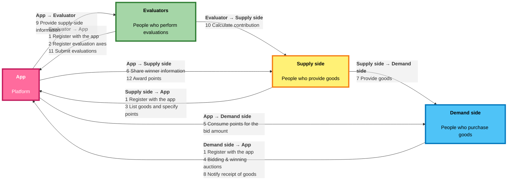
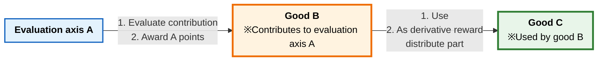
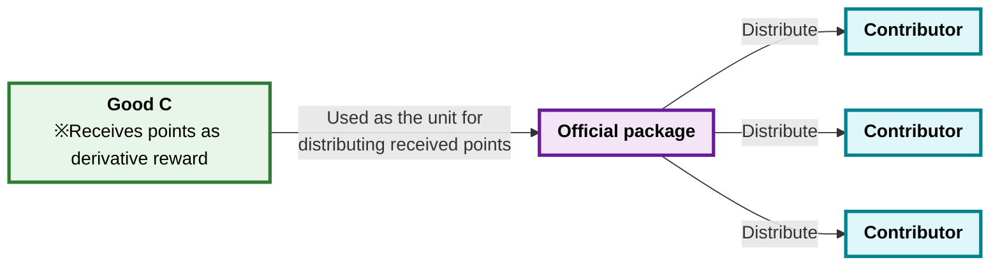
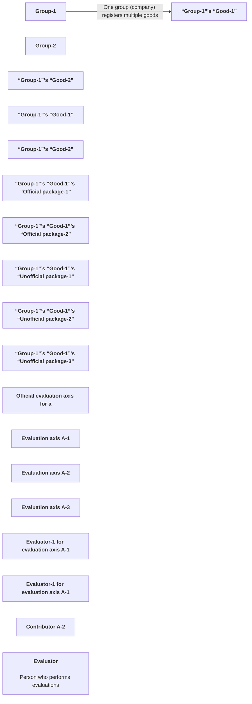
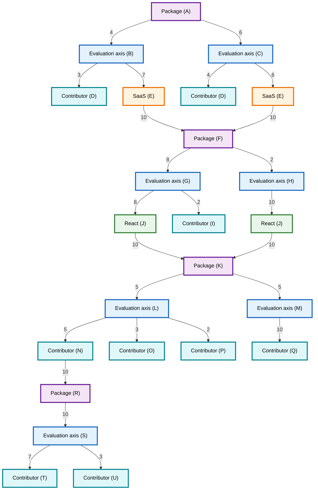

# Graph of Freeism

- [Graph of Freeism](#graph-of-freeism)
  - [Flow of Freeism](#flow-of-freeism)
  - [How derivative rewards work](#how-derivative-rewards-work)
  - [How official packages work](#how-official-packages-work)
  - [Data structure of Freeism](#data-structure-of-freeism)
  - [How contribution scores are calculated](#how-contribution-scores-are-calculated)

## Flow of Freeism

- Description
  - A diagram that roughly explains the flow of Freeism.

## How derivative rewards work

- Description
  - When good B contributes to evaluation axis A, if good B used good C, part of the evaluation-axis A points that good B earned can also go to good C.

## How official packages work

- Description
  - To distribute points that good C received to the people who contributed to building good C, official packages are used.

## Data structure of Freeism

- Description
  - A diagram that roughly explains the data structure of Freeism.

## How contribution scores are calculated

