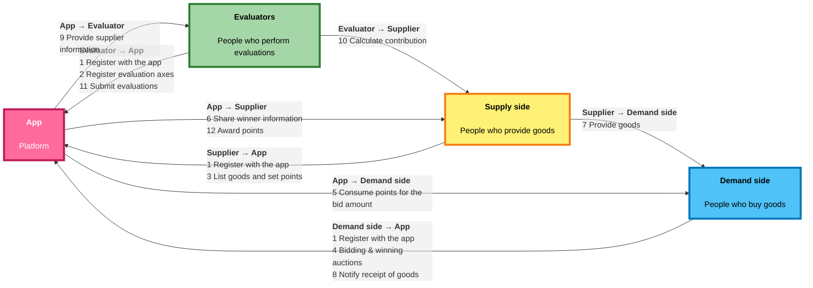

# Slides

```mermaid
  graph LR

    %% Variable names and labels (larger size)
    Platform["<b>App</b><br/><br/>Platform"]
    Demand["<b>Demand side</b><br/><br/>People who buy goods"]
    Supply["<b>Supply side</b><br/><br/>People who provide goods"]
    Review["<b>Evaluators</b><br/><br/>People who perform evaluations"]

    %% Styles (clearer colors and sizes)
    style Platform fill:#ff6b9d,stroke:#c2185b,stroke-width:4px,color:#fff
    style Demand fill:#4fc3f7,stroke:#0277bd,stroke-width:4px,color:#000
    style Supply fill:#fff176,stroke:#f57f17,stroke-width:4px,color:#000
    style Review fill:#a5d6a7,stroke:#2e7d32,stroke-width:4px,color:#000

    %% Evaluator → App
    Review -->|"<div style='text-align: left;'><b>Evaluator → App</b><br/>1 Register with the app<br/>2 Register evaluation axes<br/>11 Submit evaluations</div>"| Platform

    %% Demand side → App
    Demand -->|"<div style='text-align: left;'><b>Demand side → App</b><br/>1 Register with the app<br/>4 Bidding & winning auctions<br/>8 Notify receipt of goods</div>"| Platform

    %% Supplier → App
    Supply -->|"<div style='text-align: left;'><b>Supplier → App</b><br/>1 Register with the app<br/>3 List goods and set points</div>"| Platform

    %% Evaluator → Supplier
    Review -->|"<div style='text-align: left;'><b>Evaluator → Supplier</b><br/>10 Calculate contribution</div>"| Supply

    %% Supplier → Demand side
    Supply -->|"<div style='text-align: left;'><b>Supplier → Demand side</b><br/>7 Provide goods</div>"| Demand

    %% App → Demand side
    Platform -->|"<div style='text-align: left;'><b>App → Demand side</b><br/>5 Consume points for the bid amount</div>"| Demand

    %% App → Supplier
    Platform -->|"<div style='text-align: left;'><b>App → Supplier</b><br/>6 Share winner information<br/>12 Award points</div>"| Supply

    %% App → Evaluator
    Platform -->|"<div style='text-align: left;'><b>App → Evaluator</b><br/>9 Provide supplier information</div>"| Review
```
