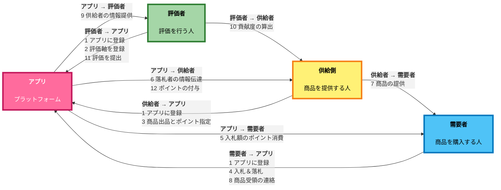
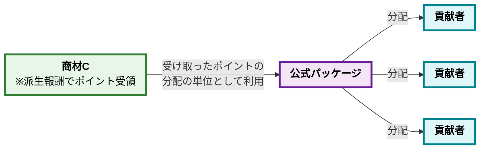
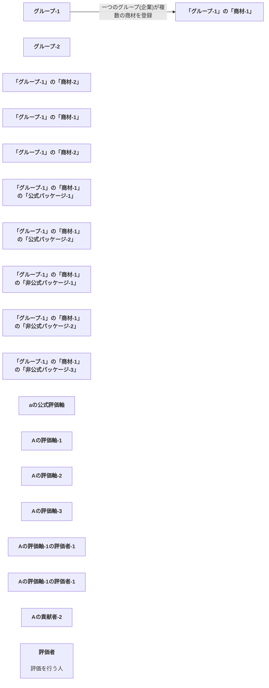

# 無料主義のグラフ

- [無料主義のグラフ](#無料主義のグラフ)
  - [無料主義のフロー](#無料主義のフロー)
  - [派生報酬の仕組み](#派生報酬の仕組み)
  - [公式パッケージの仕組み](#公式パッケージの仕組み)
  - [無料主義のデータ構造](#無料主義のデータ構造)

## 無料主義のフロー

- 説明
  - 無料主義のフローについて大まかに説明した図

## 派生報酬の仕組み

- 説明
  - 評価軸Aに対して商材Bが貢献した際に、商材Bが商材Cを使用していた場合は、商材Bが獲得した評価軸Aポイントの一部を商材Cも受け取れます。

## 公式パッケージの仕組み

- 説明
  - 商材Cが受け取ったポイントを、商材Cを作り上げるのに貢献した人たちへ分配する方法として、公式パッケージを使用します。

## 無料主義のデータ構造

- 説明
  - 無料主義のデータ構造について大まかに解説した図

