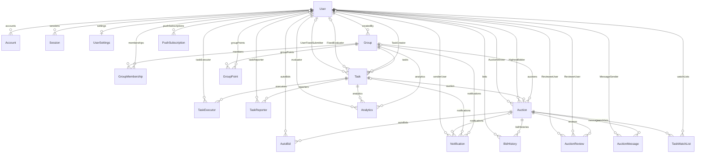

# データモデル・状態一覧

## 既存仕様書との乖離・注意点

既存仕様書には、現行 schema に存在しない `AuctionNotification` や、CSV専用の概念モデルに近い `TaskReport` /
`ContributionEvaluation` / `FixedContribution` が登場します。現行 `prisma/schema.prisma` では、通知は共通
`Notification`、タスク関係者は `TaskReporter` / `TaskExecutor`、評価は `Analytics` と `Task.fixed*`、ポイントは
`GroupPoint` で表現されます。

## 主要モデル

### 認証

- `User`
  - NextAuthのユーザー本体
  - `isAppOwner` を持つ
  - `settings`, `memberships`, `taskCreator`, `accounts`, `sessions` などと関連
- `Account`
  - OAuth account
  - provider/providerAccountId で外部アカウントを識別
- `Session`
  - NextAuth session
- `VerificationToken`
  - NextAuth用 token

### ユーザー設定

- `UserSettings`
  - `username`, `lifeGoal`
  - `isEmailEnabled`, `isPushEnabled`
  - `userId` unique

### グループ

- `Group`
  - `name`, `goal`, `evaluationMethod`, `maxParticipants`, `depositPeriod`
  - `createdBy`
  - `isBlackList` は JSON
  - `members`, `tasks`, `groupPoints`, `notifications`
- `GroupMembership`
  - `userId`, `groupId`
  - `isGroupOwner`
  - `(userId, groupId)` unique
- `GroupPoint`
  - `userId`, `groupId`
  - `balance`, `fixedTotalPoints`
  - `(userId, groupId)` unique

### タスク

- `Task`
  - `task`, `detail`, `reference`, `info`, `imageUrl`
  - `status`, `contributionType`, `category`, `deliveryMethod`
  - `fixedContributionPoint`, `fixedEvaluatorId`, `fixedEvaluationLogic`, `fixedEvaluationDate`
  - `creatorId`, `groupId`
  - `reporters`, `executors`, `analytics`, `auction`
- `TaskReporter`
  - `taskId`
  - `userId` または `name`
- `TaskExecutor`
  - `taskId`
  - `userId` または `name`
- `Analytics`
  - `taskId`, `evaluator`
  - `contributionPoint`, `evaluationLogic`

### オークション

- `Auction`
  - `taskId` unique
  - `groupId`
  - `startTime`, `endTime`
  - `currentHighestBid`, `currentHighestBidderId`, `winnerId`
  - `version`
  - 延長設定: `isExtension`, `extensionTime`, `remainingTimeForExtension`, `extensionTotalCount`, `extensionLimitCount`
  - `bidHistories`, `autoBids`, `watchlists`, `reviews`, `messages`
- `BidHistory`
  - `auctionId`, `userId`, `amount`
  - `status`, `isAutoBid`, `depositPoint`
- `AutoBid`
  - `auctionId`, `userId`
  - `maxBidAmount`, `bidIncrement`, `isActive`
  - `(userId, auctionId)` unique
- `AuctionReview`
  - `auctionId`, `reviewerId`, `revieweeId`
  - `reviewPosition`, `rating`, `comment`
  - `(auctionId, reviewerId, revieweeId)` unique
- `AuctionMessage`
  - `auctionId`, `senderId`, `message`
- `TaskWatchList`
  - `auctionId`, `userId`
  - `(userId, auctionId)` unique

### 通知

- `Notification`
  - `title`, `message`
  - `targetType`, `sendTimingType`, `sendMethods`
  - `isRead` JSON
  - `sendScheduledDate`, `sentAt`, `expiresAt`
  - `actionUrl`
  - `senderUserId`, `groupId`, `taskId`
  - `auctionEventType`, `auctionId`
- `PushSubscription`
  - `userId`, `endpoint`, `p256dh`, `auth`, `expirationTime`, `deviceId`

## ER図

以下は `prisma/schema.prisma` の model relation から読み取った主要テーブル構成です。`VerificationToken`
は認証用の独立テーブルで、他 model への relation field を持たないため図からは除外しています。`Notification` の受信者は
`isRead` JSON に userId を保持する設計で、ER上の `User -> Notification` は `senderUserId`
による送信者 relation を表します。

## テーブル定義

| table             | desc                                                       |
| ----------------- | ---------------------------------------------------------- |
| User              | ユーザー基本情報、アプリ所有者権限、各種リレーション       |
| Account           | OAuth アカウント連携（NextAuth 準拠）                      |
| Session           | セッション管理（セッショントークン/期限）                  |
| VerificationToken | 認証用トークン（メールリンク等）                           |
| UserSettings      | 通知可否、ユーザー名、ライフゴール等の設定                 |
| Group             | グループ本体（名称、目標、参加上限、作成者、deposit期間）  |
| GroupMembership   | グループ所属関係（所有者フラグ含む）                       |
| GroupPoint        | グループ内ポイント残高、固定ポイント合計                   |
| Task              | タスク本体（状態、カテゴリ、固定評価、報酬種別など）       |
| TaskExecutor      | タスク実行者（User 紐付け任意）                            |
| TaskReporter      | タスク報告者（User 紐付け任意）                            |
| TaskWatchList     | オークションのウォッチリスト                               |
| Analytics         | 貢献度評価（評価者、ポイント、評価ロジック）               |
| Auction           | オークション本体（期間、最高入札、落札者、延長設定）       |
| BidHistory        | 入札履歴（自動入札フラグ、状態、デポジット等）             |
| AutoBid           | 自動入札設定（上限額、刻み、有効フラグ）                   |
| AuctionMessage    | オークション Q&A/メッセージ                                |
| AuctionReview     | 相互レビュー（評価、コメント、レビュー方向）               |
| Notification      | 通知（対象、送信方法、既読 JSON、予約日時、auction event） |
| PushSubscription  | Web Push 購読情報（endpoint、p256dh、auth、deviceId）      |

## Enum

### `TaskStatus`

- `PENDING`
- `AUCTION_ACTIVE`
- `AUCTION_ENDED`
- `POINTS_DEPOSITED`
- `SUPPLIER_DONE`
- `TASK_COMPLETED`
- `FIXED_EVALUATED`
- `POINTS_AWARDED`
- `ARCHIVED`
- `AUCTION_CANCELED`

現行実装では `Task.status` が通常タスクの進行状態とオークション状態を兼ねます。

### `ContributionType`

- `REWARD`
- `NON_REWARD`

`REWARD` のタスクは作成時または編集時に `Auction` を作る経路があります。

### `NotificationTargetType`

- `SYSTEM`
- `USER`
- `GROUP`
- `TASK`
- `AUCTION_SELLER`
- `AUCTION_BIDDER`

汎用通知では主に `SYSTEM`, `USER`, `GROUP`, `TASK` が対象解決に使われます。オークション通知は共通 `Notification`
に auction fields を持たせます。

### `NotificationSendTiming`

- `NOW`
- `SCHEDULED`

### `NotificationSendMethod`

- `WEB_PUSH`
- `APP_PUSH`
- `EMAIL`
- `IN_APP`
- `SMS`

現行の主要実装は `IN_APP`, `WEB_PUSH`, `EMAIL` です。

### `AuctionEventType`

- `ITEM_SOLD`
- `NO_WINNER`
- `ENDED`
- `OUTBID`
- `QUESTION_RECEIVED`
- `AUTO_BID_LIMIT_REACHED`
- `AUCTION_WIN`
- `AUCTION_LOST`
- `POINT_RETURNED`
- `AUCTION_CANCELED`

### `BidStatus`

- `BIDDING`
- `WON`
- `LOST`
- `INSUFFICIENT`

### `ReviewPosition`

- `SELLER_TO_BUYER`
- `BUYER_TO_SELLER`

## 状態遷移の読み方

タスク・オークション・ポイントは密接に結びついています。

- `NON_REWARD` タスクは通常タスクとして作成され、オークションは持ちません。
- `REWARD` タスクは `Auction` を持ち、`Task.status` により開始前/開催中/終了後を表します。
- 終了スクリプトは落札者の deposit point を差し引き、`Task.status` を `POINTS_DEPOSITED` にします。
- 納品側/落札側の完了操作は `SUPPLIER_DONE`, `TASK_COMPLETED` へ進めます。
- 固定評価CSVは `TASK_COMPLETED` のタスクを `POINTS_AWARDED` にし、`GroupPoint` を加算します。

## JSONフィールド

- `Group.isBlackList`
  - 除名時に `{ [removedUserId]: true }` を追加する実装があります。
  - 現行 `joinGroup` でこの値を参照する処理は確認できません。
- `Notification.isRead`
  - ユーザーIDを key にした JSON。
  - 例: `{ "user-id": { "isRead": false, "readAt": null } }`
  - 既読更新時は JSONB merge で対象ユーザーだけ更新します。

## DB拡張

Supabase migration で `pgroonga` と `normalize_japanese()`、Task の `task/detail` 向け PGroonga
index が作成されています。レビュー検索用の PGroonga index は確認できません。
