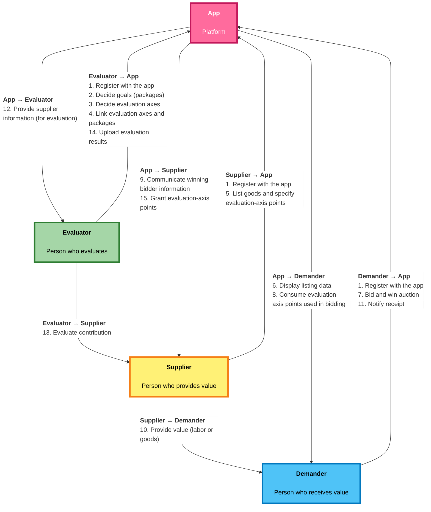
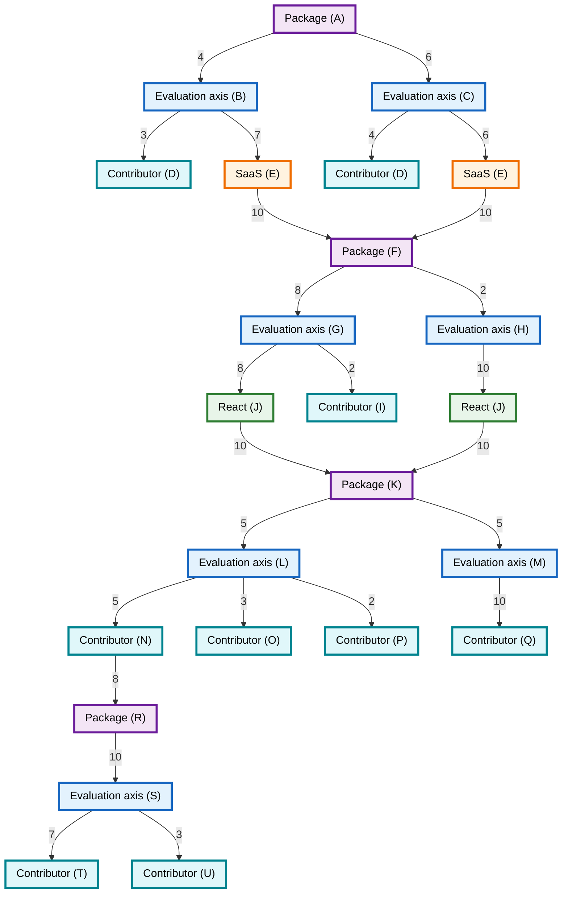
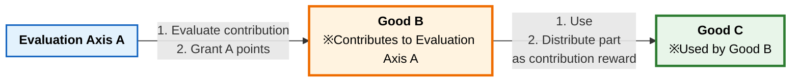
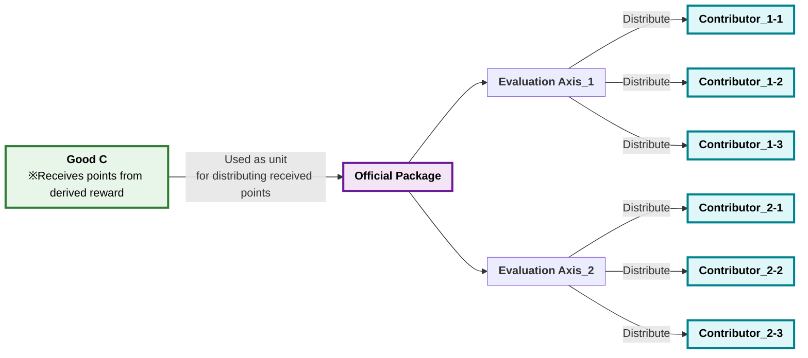

# freeism v3

## Languages

[日本語](freeism.ja.md) | English (this page)

## Introduction

We have devised a social mechanism called "freeism"<br>
It is intended to be used as a mechanism that complements or replaces capitalism.

## Table of Contents

- [freeism v3](#freeism-v3)
  - [Languages](#languages)
  - [Introduction](#introduction)
  - [Table of Contents](#table-of-contents)
  - [Overview](#overview)
    - [What We Want to Achieve](#what-we-want-to-achieve)
      - [Major Goals](#major-goals)
      - [Intermediate Goals](#intermediate-goals)
    - [Simple Benefits](#simple-benefits)
    - [Simple Explanation](#simple-explanation)
      - [How It Differs from Capitalism (1): Three Roles](#how-it-differs-from-capitalism-1-three-roles)
      - [How It Differs from Capitalism (2): Basically Free](#how-it-differs-from-capitalism-2-basically-free)
    - [Simple Flow](#simple-flow)
    - [Slightly Detailed Flow](#slightly-detailed-flow)
    - [Intended Use Cases](#intended-use-cases)
    - [Simple Example](#simple-example)
      - [Diagram](#diagram)
      - [Summary Table](#summary-table)
      - [Flow](#flow)
    - [Simple Glossary](#simple-glossary)
  - [Benefits of freeism](#benefits-of-freeism)
    - [Summary of Benefits](#summary-of-benefits)
      - [Benefits Related to "Openness \& Sharing"](#benefits-related-to-openness--sharing)
      - [Benefits Related to "Reducing Time, Effort, and Cost"](#benefits-related-to-reducing-time-effort-and-cost)
      - [Benefits Related to "Improving Social Mechanisms"](#benefits-related-to-improving-social-mechanisms)
      - [Benefits Related to "Emotion \& Ideology"](#benefits-related-to-emotion--ideology)
    - [Benefits in Detail](#benefits-in-detail)
      - [Benefits Related to "Openness \& Sharing"](#benefits-related-to-openness--sharing-1)
      - [Benefits Related to "Reduction"](#benefits-related-to-reduction)
      - [Benefits Related to "Improving Social Mechanisms"](#benefits-related-to-improving-social-mechanisms-1)
      - [Benefits Related to "Emotion \& Ideology"](#benefits-related-to-emotion--ideology-1)
  - [Disadvantages and Concerns of freeism](#disadvantages-and-concerns-of-freeism)
    - [Summary of Disadvantages and Concerns](#summary-of-disadvantages-and-concerns)
    - [Disadvantages and Concerns in Detail](#disadvantages-and-concerns-in-detail)
  - [Anticipated Challenges and Conclusions](#anticipated-challenges-and-conclusions)
  - [What Needs to Be Considered Going Forward](#what-needs-to-be-considered-going-forward)
  - [Major Differences from v2](#major-differences-from-v2)
  - [Mechanisms That Make freeism Work](#mechanisms-that-make-freeism-work)
    - [Summary of Mechanisms That Make It Work](#summary-of-mechanisms-that-make-it-work)
    - [Evaluation-Axis Mechanism](#evaluation-axis-mechanism)
    - [Proof Mechanism](#proof-mechanism)
    - [Compatibility Mechanism](#compatibility-mechanism)
      - [Overview](#overview-1)
      - [All-Group Evaluation Method for Each Task](#all-group-evaluation-method-for-each-task)
      - [Exchange-Rate Mechanism](#exchange-rate-mechanism)
      - [Point-Exchange Mechanism](#point-exchange-mechanism)
      - [Mechanism to Substitute Contribution Evaluation](#mechanism-to-substitute-contribution-evaluation)
      - [Transfer Mechanism](#transfer-mechanism)
    - [Purchase-Method Mechanism](#purchase-method-mechanism)
    - [Contribution-Calculation Mechanism](#contribution-calculation-mechanism)
      - [AI Prompt](#ai-prompt)
      - [Explanation of the "Contribution-Calculation Mechanism"](#explanation-of-the-contribution-calculation-mechanism)
      - [Example of the "Contribution-Calculation Mechanism" (Complete Version)](#example-of-the-contribution-calculation-mechanism-complete-version)
      - [Principles of the "Contribution-Calculation Mechanism"](#principles-of-the-contribution-calculation-mechanism)
    - [Package Mechanism](#package-mechanism)
      - [Overview](#overview-2)
      - ["Development of the Entire OSS Industry" Package](#development-of-the-entire-oss-industry-package)
        - ["Development of the Entire OSS Industry" Package (GitHub API)](#development-of-the-entire-oss-industry-package-github-api)
        - ["Development of the Entire OSS Industry" Package (Other than GitHub API)](#development-of-the-entire-oss-industry-package-other-than-github-api)
      - ["Development of a Designated OSS" Package](#development-of-a-designated-oss-package)
        - ["Development of a Designated OSS" Package (GitHub API)](#development-of-a-designated-oss-package-github-api)
        - ["Development of a Designated OSS" Package (Other than GitHub API)](#development-of-a-designated-oss-package-other-than-github-api)
      - ["Improvement of Well-Being" Package](#improvement-of-well-being-package)
      - [Examples of Other Packages](#examples-of-other-packages)
    - [Contribution-Detection Mechanism](#contribution-detection-mechanism)
      - [Overview](#overview-3)
      - [Name-Based Detection Mechanism](#name-based-detection-mechanism)
      - [Evaluation-Axis Detection Mechanism](#evaluation-axis-detection-mechanism)
      - [Intermediate-Goods Detection Mechanism](#intermediate-goods-detection-mechanism)
      - [Reference Detection Mechanism](#reference-detection-mechanism)
      - [Similarity Mechanism](#similarity-mechanism)
      - [Clustering Mechanism](#clustering-mechanism)
    - [Contribution-Reward Mechanism](#contribution-reward-mechanism)
      - [Overview](#overview-4)
      - [Necessity Mechanism](#necessity-mechanism)
      - [Mechanism to Verify High Evaluation Accuracy](#mechanism-to-verify-high-evaluation-accuracy)
      - [Official-Package Mechanism](#official-package-mechanism)
    - [Substitutability Mechanism](#substitutability-mechanism)
    - [Non-Interference Mechanism](#non-interference-mechanism)
    - [General-Law Mechanism](#general-law-mechanism)
    - [Quota Mechanism](#quota-mechanism)
    - [Limited-Auction Mechanism](#limited-auction-mechanism)
    - [freeism App Compatibility Mechanism](#freeism-app-compatibility-mechanism)
    - [Forking Mechanism](#forking-mechanism)
    - [Always-Deposit Mechanism](#always-deposit-mechanism)
    - [How to Run Campaigns and Discounts](#how-to-run-campaigns-and-discounts)
    - [Selling at a Higher Price](#selling-at-a-higher-price)
  - [What We Want to Achieve](#what-we-want-to-achieve-1)
    - [Major Goals](#major-goals-1)
    - [Intermediate Goals](#intermediate-goals-1)
    - [Minor Goals](#minor-goals)
      - [freeism Strategy](#freeism-strategy)
      - [Various Evaluation Axes](#various-evaluation-axes)
      - [Mechanisms Without Conflicting Interests or Trade-offs](#mechanisms-without-conflicting-interests-or-trade-offs)
      - [Acceptability Over Accuracy](#acceptability-over-accuracy)
      - [Preventing Block Economies](#preventing-block-economies)
      - [Pure Public Goods](#pure-public-goods)
      - [A Society Where Recipients Process Content](#a-society-where-recipients-process-content)
      - [Nations](#nations)
      - [Raising the Standard of Living](#raising-the-standard-of-living)
      - [Productivity and Economic Growth Indicators](#productivity-and-economic-growth-indicators)
      - [Right to Non-Interference](#right-to-non-interference)
      - [Openness](#openness)
      - [Open-Sourcing Job-Search Services](#open-sourcing-job-search-services)
      - [A Society That Does Not Require Permission](#a-society-that-does-not-require-permission)
      - [Fediverse-Like Social Mechanisms](#fediverse-like-social-mechanisms)
      - [How Wages Are Determined](#how-wages-are-determined)
      - [Transition from Corporate "Planned Economy" to "Market Economy"](#transition-from-corporate-planned-economy-to-market-economy)
      - [Introducing QV (Quadratic Voting) into freeism](#introducing-qv-quadratic-voting-into-freeism)
      - [Inflation](#inflation)
      - [Transition from "Competition to Lock In" to "Competition to Cooperate"](#transition-from-competition-to-lock-in-to-competition-to-cooperate)
      - [Democracy](#democracy)
      - [How Debt Works in freeism](#how-debt-works-in-freeism)
      - [Decision Makers](#decision-makers)
      - [Marketization of Negotiation](#marketization-of-negotiation)
      - [Other Use Cases for freeism](#other-use-cases-for-freeism)
      - [What We Want to Achieve Related to Evaluation Axes](#what-we-want-to-achieve-related-to-evaluation-axes)
      - [Supporting Research](#supporting-research)
      - [General Laws](#general-laws)
      - [Projects We Want to Run with freeism](#projects-we-want-to-run-with-freeism)
      - [etc](#etc)
  - [References We Want to Draw On](#references-we-want-to-draw-on)
    - [Contribution-Calculation Mechanism](#contribution-calculation-mechanism-1)
      - [Contribution-Reward Mechanism](#contribution-reward-mechanism-1)
      - [Contribution-Detection Mechanism](#contribution-detection-mechanism-1)
    - [Decision Making](#decision-making)
    - [Sentiment Analysis](#sentiment-analysis)
    - [Game Theory, Market Design, and Matching Theory](#game-theory-market-design-and-matching-theory)
    - [Similarity Mechanism](#similarity-mechanism-1)
    - [Indicators](#indicators)
      - [Code-Related](#code-related)
      - [Papers and Blogs](#papers-and-blogs)
      - [Innovation-Related](#innovation-related)
      - [Other](#other)
    - [Contribution-Calculation Theory](#contribution-calculation-theory)
      - [Statistical and Data-Analysis Methods](#statistical-and-data-analysis-methods)
      - [Psychological Theories](#psychological-theories)
      - [Sociological and Economic Theories](#sociological-and-economic-theories)
      - [Neuroscientific Theories](#neuroscientific-theories)
      - [Weighting](#weighting)
    - [Existing Services](#existing-services)
      - [Data Sources](#data-sources)
        - [Code-Related](#code-related-1)
        - [Other](#other-1)
        - [Papers](#papers)
    - [Right to Non-Interference](#right-to-non-interference-1)
    - [Legitimacy](#legitimacy)
    - [etc References](#etc-references)
  - [How to Transition from Capitalism to freeism](#how-to-transition-from-capitalism-to-freeism)
  - [Related Tools](#related-tools)

## Overview

This section summarizes the specifications of freeism.<br>
Details for each item below are explained in the following chapters.

### What We Want to Achieve

Here is a brief explanation of what freeism aims to achieve.<br>
For details, see "[What We Want to Achieve](#what-we-want-to-achieve-1)."

#### Major Goals

**Achieving "a society in which everyone in the world can live a highly satisfying life"**<br>
A society in which everyone can live a highly satisfying life, even if they stumble at some point in life.

#### Intermediate Goals

1. **Raising the floor of living standards**
   1. Achieving "a society in which everyone can obtain what is 'normal'"
      - Here, "normal" means "being able to live within a range in which one does not feel inferior"
   2. Improving fulfillment in "food, clothing, and shelter," "relationships," and "other areas"
2. **A society in which people can live with peace of mind**
   - A society without conflicting interests
3. **Faster pace of technological innovation**

### Simple Benefits

Here is a brief explanation of the benefits of freeism.

1. **Alignment of incentives between demanders and suppliers**
   - In **capitalism**, suppliers aim to sell at high prices, while demanders aim to buy at low prices.<br>In **freeism**, suppliers aim to sell at low prices, and demanders aim to buy at low prices.<br>↓<br>**In freeism, incentives are aligned.**<br>
   - In capitalism, there are actions that benefit customers, but there is also an incentive to "sell at high prices," which goes against customers' interests.<br>↓<br>**freeism can solve that.**
2. **Business models that cannot work under capitalism become possible, and a mechanism without cost burdens**
   - Rewards for suppliers are determined not by "**whether beneficiaries have the ability to pay**," but by "**whether they contribute to an evaluation axis**"
   - In **capitalism**, the ability of those who enjoy a good or service, or of third parties, to pay fees is essential.<br>In **freeism**, even without the ability to pay fees, rewards can be obtained by contributing to each evaluation axis
     - Capitalism
       - If people cannot pay, or if the business model depends on payment, it may not work
       - Because there is no reward, it may not work as a job
     - freeism
       - Rewards are issued according to contribution, so there is no cost burden on demanders
       - In freeism, even if demanders do not pay for enjoying a service, those who provide the service can still receive compensation
3. **Provided for free or at a large discount**
   - As a mechanism of freeism, suppliers basically sell goods for free
   - If demand exceeds supply, demanders use points granted to themselves to purchase goods, but because this is used only for "**purchasing the right to obtain goods preferentially**" and not for "**reward to the supplier**," prices become lower than they are today
   - Even when provided for free, suppliers can receive rewards through third-party evaluation
   - That can save many people in poverty
4. **A single piece of work can be evaluated from multiple perspectives (evaluation axes and values), and rewards can be obtained**
   - Examples: environmental protection, improved productivity, a life with high well-being, town development, development of OSS, and so on
5. **A society that is more marketized, competitive, optimized, efficient, open, and transparent than capitalism**
   - Marketization
     - A society in which more things and activities can be bought and sold as goods
     - Marketization accelerates through "transition to an evaluation economy"
   - Increased competition
     - A society with less monopoly, more opportunities and rivals to compete, and higher quality of goods
       - Increase in Fediverse-like services
   - Optimization
     - A society optimized not only for maximizing profit under capitalism, but also for various indicators
     - Various indicators are optimized through the "evaluation-axis mechanism"
     - Incentive design can be created more flexibly than under capitalism
   - Efficiency
     - Through marketization, increased competition, and optimization, society becomes more efficient
   - Openness
     - Because rewards can be obtained even in open source if one is referenced, open goods increase
     - There is less reinvention of the wheel
   - Growth
     - freeism aims for greater growth than capitalism
   - Transparency
     - Through mechanisms that open data for contribution calculation, society becomes more open than under capitalism
6. **A society without disadvantages caused by the pursuit of profit**
   - A society that does not do things disadvantageous to customers for profit
   - If businesses use methods bad for consumers, such as designs that cannot be repaired, in order to increase sales, rewards decrease
   - Because incentives of demanders and suppliers are aligned, conflicting interests are less likely to occur
7. **Increase in supply**
   - Because the price of goods falls, more people can be supplied with goods than under capitalism

### Simple Explanation

#### How It Differs from Capitalism (1): Three Roles

freeism is a mechanism composed of the following three roles.<br>
An "**evaluator**," which exists separately from "**demanders**," pays rewards to "**suppliers**."<br>
※It is also possible to hold more than one of the three roles.

1. **Supplier**
   - The role of providing goods
2. **Evaluator**
   - The role of evaluating suppliers and granting points to suppliers according to evaluation results
3. **Demander**
   - The role of purchasing goods sold by suppliers

#### How It Differs from Capitalism (2): Basically Free

Suppliers basically sell for free.<br>
When goods are free, demand may exceed supply.<br>
Only in that case do demanders use points granted to themselves to hold an auction and make a "**purchase of the right to obtain goods preferentially**."<br>
The points used in this purchase do **not** become "**reward to the supplier**."
※There are exceptions.

### Simple Flow

Repeat `1.` through `4.` below.

1. A **supplier** provides goods
2. A **demander** purchases goods
3. An **evaluator** evaluates the supplier
4. The **evaluator** grants points to the supplier based on the evaluation results

### Slightly Detailed Flow

After `1.` through `4.`, repeat `5.` through `15.`.



1. **(Supplier→App, Evaluator→App, Demander→App) Log in to the freeism app**
   - Login is required to manage granted points
   - Note: The "freeism app" is an app that manages all freeism functions
2. **(Evaluator→App) Decide goals**
   - This goal is called a "package"
   - Example: development of the town where one lives
3. **(Evaluator→App) Decide evaluation axes**
   - Decide the axes (values and perspectives) for evaluating whether something contributes to achieving the set goal (package)
   - Evaluation axes can be anything, and may be created freely
   - These axes are called "evaluation axes"
   - Examples: crime rate, number of trains that stop
4. **(Evaluator→App) Link evaluation axes and packages**
   - On the freeism app, register a link between the created "package" and "evaluation axis"
5. **(Supplier→App) List goods and specify evaluation-axis points**
   - Listing
     - Listed content may be anything that provides value
     - Examples: picking up trash, neighborhood association activities, developing SaaS to manage neighborhood association funds, limited goods in general, labor and rights
   - Specifying evaluation-axis points
     - When demand exceeds supply, an auction is held, and at that time the supplier specifies which evaluation-axis points demanders may use
     - By creating uses for points, the supplier contributes to the development of the ecosystem of evaluation axes they want to support, so they can receive those evaluation-axis points as additional rewards
   - Note
     - **It is not necessary to list goods or services on the freeism app.**
     - However, by listing goods and specifying evaluation-axis points, the supplier contributes to the development of that evaluation-axis ecosystem, so evaluators who weight such listings more highly will likely appear
     - The incentive for evaluators to add rewards through "specifying evaluation-axis points" and grow the evaluation-axis ecosystem is to increase the uses for "points of that evaluation axis" that they hold
6. **(App→Demander) Refer to listing data (the app displays listing information to demanders)**
   - Demanders check suppliers' listings on the freeism app
7. **(Demander→App) Bid and win auction**
   - Basically, goods and services can be obtained from suppliers for free
   - When demand exceeds supply, demanders use evaluation-axis points specified by the supplier as bids in an auction
8. **(App→Demander) Consume evaluation-axis points used in bidding**
   - On the app side, evaluation-axis points used in the auction are consumed
9. **(App→Supplier) Communicate winning bidder information**
   - The app communicates information about the demander who won the auction to the supplier
10. **(Supplier→Demander) Provide value (labor or goods)**
    - The supplier actually provides goods, services, labor, and so on to the demander
11. **(Demander→App) Notify receipt**
    - The demander notifies receipt or completion on the app
12. **(App→Evaluator) Provide supplier information for evaluation**
    - The app provides evaluators with supplier information to the extent necessary for evaluation
13. **(Evaluator→Supplier) Evaluate contribution**
    - When the evaluation axis is "crime rate," for example, contribution is evaluated according to the set evaluation axis
14. **(Evaluator→App) Register evaluation results on the freeism app**
    - The evaluator registers and uploads evaluation results on the app
15. **(App→Supplier) Grant evaluation-axis points**
    - Points issued by an evaluation axis are called "evaluation-axis points"
    - Based on evaluation results, evaluation-axis points are granted to the supplier through processing on the app side and so on
    - If supplier A's work is evaluated by evaluation axes B and C, points from B and C are granted respectively
    - A supplier can be evaluated by multiple evaluation axes for one piece of labor and receive multiple evaluation-axis points
    - The reward is not "points obtained from other people," but "evaluation by third parties"
      - Evaluation-axis points are used only for demanders to obtain goods preferentially
      - Even if demanders use points, suppliers cannot receive rewards unless they contribute to the set goal

### Intended Use Cases

- In the future
  1. All transactions in the world
     - Relationships in which value is transferred, such as tangible goods, provision of labor, skills, and knowledge, and distribution of digital content, can in principle be placed within the same framework

- In the near term
  1. Operating OSS
     - Maintainers working on code, documentation, releases, reviews, and so on
     - Situations such as allocating the right to be handled preferentially, or limited support slots, for "supply with limited quantity," such as maintenance effort and support capacity, using evaluation-axis points
     - Examples of evaluation axes: speed of security response, maintaining backward compatibility, carefulness in handling issues, health of the community, and so on
  2. Providing skills and surplus resources in local communities
     - Activities with limited people or goods, such as DIY consultation, PC troubleshooting, administrative work for neighborhood associations or NPOs, repair or lending of items, and so on
     - Examples of evaluation axes: participation in watch activities, cooperation in waste reduction, familiarity with disaster contact networks, and so on
  3. Free publication in education, culture, and creative fields
     - Free publication of lecture materials, tutorial videos, recordings of performances or readings, illustration assets, and so on
     - Priority access to "supply limited physically or in time," such as correction slots, Q&A slots, workshop seats, and hand delivery of printed materials, by purchasing priority rights with evaluation-axis points
     - Examples of evaluation axes: cooperation in supporting learners, compliance with copyright and credit display, choosing licenses that are easy to reuse, and so on

### Simple Example

#### Diagram

```mermaid
flowchart TB
  subgraph PREP["Preparation (Phases 1–5)"]
    direction TB
    F1["1 Login<br/>Stakeholders begin using the app"]
    F2["2 Goal (package)<br/>A: Development of town (M)"]
    F3["3 Evaluation axis<br/>A: Crime rate"]
    F4["4 Link<br/>A: Evaluation axis and package"]
    F5["5 Listing<br/>B: Night patrol slot + evaluation-axis point specification"]
    F1 --> F2 --> F3 --> F4 --> F5
  end

  subgraph MAIN["Mr. B route: limited slot (Phases 6–10)"]
    direction TB
    F6["6 Refer<br/>App→C: Check listing"]
    F7["7 Bid and win<br/>C→App: Use evaluation-axis points"]
    F8["8 Consume<br/>App→C: Consume points"]
    F9["9 Communicate<br/>App→B: Winning bidder information"]
    F10B["10 Provide B→C<br/>Provide value Z (night patrol)"]
    F6 --> F7 --> F8 --> F9 --> F10B
  end

  subgraph DROW["Parallel: Mr. D route (no listing)"]
    direction TB
    F10D["10 Provide D→residents<br/>Provide value Y (cleaning schedule coordination)<br/>※Does not go through phases 6–9 (no auction)"]
  end

  subgraph EVAL["Evaluation and points (Phases 11–15)"]
    direction TB
    F11["11 Receipt notification<br/>C→App"]
    F12["12 Provide information<br/>App→A: Information about B and D"]
    F13["13 Evaluate<br/>A: Contribution (B is weighted for point specification)"]
    F14["14 Register<br/>A→App: Evaluation results"]
    F15["15 Grant<br/>App→Supplier: Evaluation-axis points"]
    F11 --> F12 --> F13 --> F14 --> F15
  end

  F5 --> F6
  F5 -.->|Parallel as activity in the same community| F10D
  F10B --> F11
  F10D -.->|Phase 11 may be omitted (example Y)| F12
```

#### Summary Table

| Phase | Direction of arrow                | What happens in this example                                                                                         |
| ----- | --------------------------------- | -------------------------------------------------------------------------------------------------------------------- |
| 1     | Each person → App                 | Account creation, login, and so on                                                                                   |
| 2–4   | Evaluator (A) → App               | Setting goals and evaluation axes, and linking them                                                                  |
| 5     | Supplier (B) → App                | Listing a limited slot and specifying the evaluation axis used for bidding                                           |
| 6–9   | App ↔ Demander (C) / Supplier (B) | Referencing, bidding, consuming points, notifying winning bidder (**does not apply to Mr. D's route**)               |
| 10    | Supplier → Demander, etc.         | B→C night patrol, and D→residents cleaning coordination (may occur in parallel)                                      |
| 11    | Demander (C) → App                | Notification of receipt or completion (as noted in the text, in example Y not everyone needs to notify individually) |
| 12–15 | App and evaluator ↔ Supplier      | Presenting information for evaluation, evaluating contribution, registering results, granting evaluation-axis points |

#### Flow

1. Stakeholders such as Mr. A, Mr. B, Mr. C, and Mr. D create accounts on the freeism app and link SNS accounts, and so on
   - Phase: **(Supplier→App, Evaluator→App, Demander→App) Log in to the freeism app**
2. Mr. A decides "development of town (M)" as a goal and prepares this goal as a package on the freeism app
   - Phase
     - **(Evaluator→App) Decide goals**
3. Mr. A decides to evaluate all work using the evaluation axis "crime rate"
   - Phase
     - **(Evaluator→App) Decide evaluation axes**
4. Mr. A links the evaluation axis "crime rate" with the package "development of town (M)" on the freeism app
   - Phase
     - **(Evaluator→App) Link evaluation axes and packages**
5. Mr. B lists five limited slots for areas covered by night patrol in town (M)<br>He also specifies the evaluation axis "crime rate" as the evaluation-axis points demanders may use, and lists the offering on the freeism app
   - Let the provision of value be Z
   - Phase
     - **(Supplier→App) List goods and specify evaluation-axis points**
6. Mr. C checks Mr. B's listing (provision of value Z) on the freeism app
   - Phase
     - **(App→Demander) Refer to listing data (the app displays listing information to demanders)**
7. Mr. C uses "crime rate" evaluation-axis points as bids in the auction for "night patrol area slots" listed on the freeism app and wins
   - Phase
     - **(Demander→App) Bid and win auction**
   - Note
     - Basically, goods are provided for free
     - When demand exceeds supply, as in this example, the flow becomes an auction in which demanders use evaluation-axis points specified by the supplier as bids
8. On the app side, the "crime rate" evaluation-axis points Mr. C used in the auction are consumed
   - Phase
     - **(App→Demander) Consume evaluation-axis points used in bidding**
9. The app communicates information about Mr. C, who won the auction, to Mr. B
   - Phase
     - **(App→Supplier) Communicate winning bidder information**
10. As provision of value from supplier to demander, the following occurs
    - Actions
      1. Mr. B provides Mr. C with the "night patrol in the won area" that Mr. C won
      2. In parallel, Mr. D provides value Y (cleaning schedule coordination), and residents of the town receive the outcome
    - Phase
      - **(Supplier→Demander) Provide value (labor or goods)**
    - Case of Mr. D
      - **When not listing on the freeism app**
    - Note (Mr. D's route)
      - When there is no listing, as in Mr. D's example, `6.` through `9.` (from referencing the listing to communicating winning bidder information) do not apply
      - The content can be provided free of charge to all residents, and there is no bidding, consumption of evaluation-axis points, or exchange of winning bidder information through the freeism app
      - Because the provided content is a service anyone can obtain, listing is unnecessary and there is no auction
11. Mr. C notifies receipt or completion on the freeism app
    - Phase
      - **(Demander→App) Notify receipt**
    - Note
      - For value Y (cleaning schedule coordination), residents do not need to notify explicitly on the app individually
12. The app provides Mr. A with information about Mr. B (and Mr. D, who is subject to evaluation) to the extent necessary for evaluation
    - Phase
      - **(App→Evaluator) Provide supplier information for evaluation**
13. Mr. A evaluates the contribution of Mr. B and Mr. D according to the evaluation axis "crime rate" that he set
    - Note
      - Because Mr. B listed goods while specifying evaluation-axis points, weighting is added in addition to evaluation for ordinary contribution
    - Phase
      - **(Evaluator→Supplier) Evaluate contribution**
    - How to calculate contribution
      - It is good to decide by various methods, such as discussion among participants, or determining contribution from correlation or causality between quantified goal indicators and supply of goods
14. Mr. A registers the evaluation results on the freeism app
    - Phase
      - **(Evaluator→App) Register evaluation results on the freeism app**
15. Based on the evaluation results, "crime rate" evaluation-axis points are granted to the supplier through processing on the freeism app side and so on
    - Phase
      - **(App→Supplier) Grant evaluation-axis points**
    - Note
      - If a supplier's work is evaluated by multiple evaluation axes, points for each evaluation axis are granted respectively
      - A supplier can be evaluated by multiple evaluation axes for one provision of value and receive multiple kinds of evaluation-axis points
    - Note
      - The reward is not "points obtained from other people," but "evaluation by third parties"
    - Example of operation
      - After contribution is determined, an evaluator or representative enters information into the freeism app and grants points

### Simple Glossary

This section explains the mechanisms that compose freeism.<br>
※Detailed content for each term is explained in "[Mechanisms That Make freeism Work](#mechanisms-that-make-freeism-work)."

1. **freeism app**
   - The freeism app is an app that provides functions necessary for freeism
   - Example functions
     1. **Creating evaluation axes**
     2. **Creating packages**
     3. **Linking evaluation axes and packages**
     4. **Managing one's own points**
     5. **Auction (listing and bidding)**
     6. **Depositing one's own points (making them unusable)**
     7. **Calculating contribution**

2. **Package**
   - A "goal" set by an evaluator on the freeism app
   - Example: development of the town where one lives

3. **Evaluation axis**
   - Explanation
     - An indicator, perspective for evaluation, or value for measuring whether something contributes to achieving a package (goal)
     - Evaluation points and evaluation-axis points are issued from an evaluation axis
   - Examples
     - Crime rate, number of trains that stop
   - Specifications of evaluation axes
     - Multiple evaluation axes can be created
     - One can belong to multiple evaluation axes
     - Anyone can easily create evaluation axes
     - Each evaluation-axis mechanism has one perspective or value for evaluation

4. **Linking evaluation axes and packages**
   - Registering a correspondence between a created package and evaluation axis on the freeism app

5. **Evaluation-axis points**
   - Points issued and granted by an evaluation axis
   - Granted when one contributes, and required to obtain limited goods preferentially

6. **Supplier**
   - The role of providing value such as goods and services
   - The side that lists goods on the freeism app and receives evaluation-axis points after evaluation

7. **Demander**
   - The role of receiving supplied goods and services
   - Aims to obtain limited goods and so on through bidding and winning auctions

8. **Evaluator**
   - The role of evaluating suppliers' contributions and granting evaluation-axis points according to evaluation results
   - Also sets packages, sets evaluation axes, and links evaluation axes and packages
   - Roles may be separated from demanders and suppliers, but one person may also hold multiple roles

9. **Deposit / occupy**
   - Depositing evaluation-axis points in the freeism app and making them unusable for a certain period

10. **Limited goods**
    - Goods or services that not everyone who wants them can obtain

11. **Negative impact**
    - An act that does not contribute to the content of an evaluation axis or package, and instead moves achievement further away

12. **Negative evaluation**
    - An evaluation result when one performs an act with negative impact

13. **Penalties and fines from negative evaluation**
    - In freeism, when one goes against the direction of an evaluation axis, the result is negative evaluation, and instead of "granting points," there is "confiscation of points"

14. **Project**
    - A mechanism that replaces today's joint-stock companies

15. **Rules of evaluation axes**
    - Rules of evaluation axes are the laws for living in a freeism society

16. **Contribution-calculation mechanism**
    - A mechanism that calculates, for each transaction, the degree to which one contributed to the values of an evaluation axis
    - "Contribution calculation" may also embed market principles

17. **Right to non-interference**
    - The right not to have thoughts and values of people with different values imposed on oneself

18. **Non-interference mechanism**
    - A mechanism that realizes the "right to non-interference"

19. **Evaluation-axis cluster and package cluster**
    - A group of people who want to contribute to that evaluation axis or package (people with the same values)
    - It is envisioned that communities, towns, companies, and nations are built with "evaluation-axis clusters"

20. **"Development of the freeism app" package**
    - Explanation
      - A package that evaluates development of the freeism app ecosystem
    - Evaluation items for that package
      1. **Do not interfere with other evaluation-axis clusters**
      2. **Guarantee that people active in an evaluation-axis cluster can leave whenever they say they want to leave**

21. **Price**
    - In freeism, the amount of evaluation-axis points used becomes the price

22. **Contribution-reward mechanism**
    - A mechanism in which, when Mr. A contributes, if Mr. B was also related to Mr. A's contribution, Mr. B also receives part of the evaluation-axis points Mr. A obtained
    - Examples of being related: working together, one's research results being referenced, arranging something, creating and selling using parts made by another company, and so on

23. **Contribution-detection mechanism**
    - A mechanism that investigates and detects whether Mr. B was related to Mr. A's contribution when Mr. A contributed

24. **General laws**
    - The idea of using evaluation by evaluation axes as law
    - When one receives negative evaluation by an evaluation axis, penalties and fines are imposed
    - Whether an act is illegal is determined only by whether the degree of contribution to the evaluation axis is negative
    - Example: Even theft is not a crime if it gives no one a bad impact. However, if theft makes an evaluation-axis value negative, it becomes illegal
    - Acts with bad impact are also evaluated as supplementary information

25. **Period for depositing evaluation-axis points**
    - The period during which evaluation-axis points are deposited in the freeism app
    - The logic for calculating the deposit period differs by evaluation axis
      - Example: The deposit period becomes longer in proportion to "winning bid amount × number of bidding participants"

26. **Winning rate / selection rate**
    - The proportion of people who actually win an auction among those who participated in bidding

27. **Listing types on the freeism app**
    1. **Supplier listing type**
       - A type in which the supplier recruits "people to do this work"
       - The type to implement first on the freeism app
    2. **Demander listing type**
       - A type in which the demander recruits with conditions such as "if you make a specific contribution, I will pay points in return"
       - Dutch auction format

28. **Methods of obtaining goods**
    1. **Auction bidding**
    2. **Buy-it-now price**
    3. **Total held points**
    4. **First come, first served**
    5. **Point transfer**
    6. **Lottery**
    7. **Combinations of the above**
       - Example: Lottery or first come, first served among people who bid above a certain amount

29. **Incentives for providing goods to the winning bidder**
    1. **To obtain reference rewards through use**
       - In freeism, if goods are not provided to the winning bidder, the supplier cannot tell "what changes occurred" because of the goods they provided to the winning bidder, so contribution cannot be judged
       - The person who provided the goods can receive part of the points obtained by the person who referenced them
    2. **To contribute to ecosystem development and receive rewards**
       - If goods are not provided to the winning bidder, one cannot contribute to the ecosystem. Therefore, one cannot receive points

30. **Methods of deciding which kinds of points can be used for bidding on listed goods**
    1. **A method in which demanders decide which evaluation-axis points to use for purchase**
    2. **A method in which suppliers decide which evaluation-axis points can be used for purchase**
    3. **A method in which evaluators decide which evaluation-axis points can be used for purchase**
    4. **A method in which freeism app administrators decide which evaluation-axis points can be used for purchase**

31. **"Types of labor" in freeism**
    1. **A mechanism that evaluates listing on the freeism app as contribution**
       - It is not necessary to list outcomes on the freeism app
       - However, by listing, uses for evaluation-axis points increase and one contributes to development of that evaluation-axis ecosystem, so it is better to add on top of ordinary points
       - By preparing places to use points, an incentive structure to earn points can be created
    2. **A mechanism that evaluates evaluators' labor as contribution**
       - Evaluators' incentive to grow an evaluation axis as an ecosystem is to increase evaluation from the ecosystem through evaluating and increase situations in which held points can be used
    3. **Labor without listing**

32. **freeism selection rate**
    - An indicator of "how often people who bid actually win"
    - The maximum is 100% or more, and it is better to get as close to 100% as possible
    - Rather than "whether there is growth," we want to emphasize how much demand from many people is satisfied, and judge fulfillment with this indicator

33. **The supplier mainly has the following two ways to obtain rewards**
    1. By providing goods to consumers, contributing to an evaluation axis, and receiving reward for contributing to that evaluation axis
    2. By providing goods to consumers and receiving part of the evaluation-axis points that the consumer who received the goods earned, or part of the contribution the consumer who received the goods earned

## Benefits of freeism

This section explains the benefits of freeism.

### Summary of Benefits

The main benefits of freeism are those explained below.<br>
Details are explained in the following paragraphs.

#### Benefits Related to "Openness & Sharing"

- Society becomes one in which know-how, data, and so on are opened and shared
- Interoperability increases
- Rewards can be obtained just by being referenced
- Increase in data volume for improving service quality, such as training data
- Society shifts from competing on "how much one can differentiate" to competing on "how much one can share"
- Network externalities work less strongly, and service users become more mobile
- Transparency increases
- Services, nations, and each layer can have sanction resilience without dependence
- New correlations and valuable actions can be discovered
- Monopoly becomes less common
- Wasteful monopoly competition among companies disappears, and conflict among nations becomes less likely
- Reinvention of the wheel disappears
- Society becomes one in which many people can use applications no one even imagined
- A safety net can be built in the IT field
- The disadvantage that individuals do not try to share know-how when performance-based personnel evaluation is adopted can be solved
- Lowering barriers to entry becomes an act that earns rewards
- Compensation can be obtained even in areas where money did not intervene before
- "Compensation for positive externalities" and "costs for negative externalities" can be assigned
- Even just proposing ideas becomes evaluable
- Compensation can be given even for failure
- A "competitive monopolistic market" can be created
  - A state in which the benefits of both "a competitive market" and "an economy on the scale of a monopolistic market" can be achieved

#### Benefits Related to "Reducing Time, Effort, and Cost"

- Prices fall
- Goods that are expensive due to patents and copyright also become cheaper
- Taxes are unnecessary, and the benefits of taxation can still be utilized
- Rational decision-making becomes easier
- Reduction of costs such as labor, expense, and time for legislation
- Reduction of the time lag from problem occurrence to enforcement of law
- Reduction of economic loss due to tax design
- Suppliers can be compensated without cost burden
  - Because there is no need to pay compensation, the poor can become customers similar to those in advanced nations
  - There are no upper or lower limits on rewards
- Because costs fall, utilization of efficiency services increases, and more areas can be made efficient
- Negotiation with companies becomes unnecessary, reducing labor, expense, and time
- Damage from fraud can be reduced
- National procedures can be made more efficient

#### Benefits Related to "Improving Social Mechanisms"

- Laws that people cannot accept decrease
- General laws can be created
  - Detailed legal definitions become unnecessary, and situations increase in which niche problems can be handled more flexibly and broadly than today
- Promotion of competition in administration and among nations
- Hacking and abuse of law become less common
- Starting a nation becomes easier
- Entrenched interests decrease
- Situations such as "no reward for good deeds" and "no punishment for bad deeds" can be addressed
- Law becomes easier to understand
- "Voting by moving" becomes easier
- Disagreement over how much to distribute to the poor becomes less likely
- Deadweight loss disappears
- freeism functions as a bridge economy until general AI surpasses humans
- Even with dumping, mechanisms can maintain overall benefit
- In freeism, price gouging does not exist
- Services with demand can be sustained even when free
- Companies can be forked
- Dismissal regulations can be abolished
- Strikes become unnecessary
- Suppliers do not need to decide prices themselves
- A mechanism that cannot be exploited physically
- Wages can be raised easily
- Redistribution becomes unnecessary
- A society that does not require permission
- Abolition of application-based systems
- A (name of your choice) to earn mechanism can be created
- Public services become enriched, and funding problems for public services can be solved
- Cartels do not occur
- Pachinko and other gambling decrease
- Exploitation of subcontractors disappears
- Incentives to improve even without competition can be created
- Government no longer decides wages
- All pirated versions disappear
- Training data problems for generative AI are solved
- Conflict between suppliers and demanders can be resolved
- Market failure can be solved
- Neutral news organizations
- Incidents can be discovered
  - Through "general laws," incidents can be discovered from negative evaluation
- Legal loopholes can be eliminated
- Bullshit jobs disappear
- Advertising decreases
- DX advances
- Exploitation decreases
- Everything can be evaluated by various indicators

#### Benefits Related to "Emotion & Ideology"

- Society becomes one without interference
- People can live separately by ideology
  - The idea of not caring about others' actions but only avoiding interference with oneself becomes easier to realize than today
  - Politics that emphasizes opinions of specific entrenched interests becomes less likely, and quality of life increases
- Safety can be protected without deleting content
- There is no need to interact with people one does not want to interact with
- Diversity emerges
- Large ideological divisions disappear
- Because the evaluation-axis mechanism separates people by ideology, large debates with divided opinions become unnecessary
- Hiding defamation and hiding opposing opinions
- Relief of responsibility and provider stress toward free services
- Discrimination can be reduced
- A society where recipients process content can be created
- Conflict disappears

### Benefits in Detail

The benefits described so far are explained in detail below.

※Details are described in "[Mechanisms That Make freeism Work](#mechanisms-that-make-freeism-work)," but they are also briefly described here for understanding "[Benefits in Detail](#benefits-in-detail)."

#### Benefits Related to "Openness & Sharing"

Benefits related to openness and sharing are explained in a little more detail below.

1. **Society becomes one that opens and shares**
   - Explanation
     - Through the "contribution-detection mechanism," opening and sharing make it easier to earn evaluation-axis points, so society advances active information sharing
     - A society in which all know-how, patents, designs, and so on become open source
     - ※Of course, if contributing to an evaluation axis while keeping know-how closed earns more evaluation-axis points than obtaining part of the points of people who referenced openly shared information, it remains closed
     - What earns the most contribution is not delivering high-demand goods and services to everyone, but sharing know-how and becoming a reference for many people<br>That creates competition to share and produces other good benefits
   - **Logic for creating incentives to open and share**
     1. Use the "contribution-detection mechanism"
        - By using the "contribution-detection mechanism," one can obtain part of the evaluation-axis points earned by people who referenced one's work, so opening becomes an incentive
     2. Weight rewards more for being referenced than for contributing to an evaluation axis
        - In addition, weight rewards so that being referenced yields more evaluation-axis points than merely contributing to an evaluation axis
        - If opening and sharing make one easier to reference, weight rewards so that compensation is easier to obtain
     3. Create a mechanism in which opening itself becomes an indicator of an evaluation axis, and the more open one is, the more reward one receives
        - Open in ways that do not result in negative evaluation
        - Weight so that evaluation-axis points obtained by making something open source always exceed evaluation-axis points obtained by keeping know-how closed and not sharing assets
     4. Opening increases materials for judgment and makes evaluation easier, strengthening open orientation
        - One may adopt an evaluation-axis mechanism that recognizes rights as a rights holder, but that will not gain popularity, will not be referenced, and will not be noticed, so one will inevitably need to belong to a society or evaluation-axis mechanism without rights holders

2. **Raising the floor of the middle layer**
   - In freeism, because all information and know-how become open, people who currently hide information will increasingly open it, many people can enjoy many benefits, and the whole can receive benefit
     - People unfamiliar with technology raise their literacy with opened information, and smart people reduce money and labor for developing new technologies and proposing ideas
     - The only people who lose when all information becomes open are those who sell false information as information products
   - By disseminating ideas, others can know what one thinks, one can connect on SNS with people who share the same views, and useful new information can be obtained from there
   - By opening information such as ideas and source code, those ideas are forcibly commoditized, the middle layer can judge whether they are correct, and advice can be obtained

3. **Rewards can be obtained just by being referenced**
   - Through the "contribution-detection mechanism," just being referenced allows one to obtain part of the evaluation-axis points earned by the referencing person

4. **Interoperability increases**
   - Logic for realization
     1. Open and share, and improve interoperability to actively earn evaluation-axis points through the "contribution-detection mechanism"
     2. Improve interoperability to be chosen more easily by customers
     3. There is also a method of using an evaluation axis that directly aims to "increase interoperability"

5. **Increase in data volume for improving service quality, such as training data**
   - Realized by becoming "a society that opens and shares data"

6. **Society shifts from competing on "how much one can differentiate and monopolize" to competing on "how much one can share and cooperate"**
   - Through the "contribution-detection mechanism" and "evaluation axes for opening," because one earns more by being referenced and used, society competes on "how early and how much one can open and share content that contributes to evaluation axes"

7. **Network externalities work less strongly, and service users become more mobile**
   - Can be realized by increased interoperability
   - The following problems exist
     - There is a service one really wants to improve, but even if one forks and improves it, users cannot be gathered because of network externalities
     - Because there is no interoperability, improved versions as extensions cannot be provided either
   - Benefits when network externalities do not work
     - Basically the same service but with different partial functions can be created, and services with different partial functions can cooperate with each other

8. **Services, nations, and each layer can have sanction resilience without dependence**
   - By becoming open, dependence on everything becomes less likely

9. **New correlations, more accurate contribution, and valuable actions can be discovered**
   - Because contribution calculation by data analysis increases, more accurate contribution can be discovered in the process of calculating contribution
     - Attitude in class can be calculated, contribution of husband and wife to childcare can be calculated, and everything can be calculated and understood better

10. **Monopoly becomes less common**

- In freeism, rather than monopolizing and excluding other companies, opening so other companies can also use one's technology and having them enter sometimes earns more, so benefits of monopoly are small
  - Currently, monopoly raises added value, price, and one's compensation, so incentives work to hide from others
- Problems that can be solved
  - Market failure due to monopoly can be prevented
  - Problems where service convenience falls due to lock-in strategy can be solved

11. **Conflict among nations decreases**
    - In a sharing society, the need to drive out other nations' businesses to build domestic industry decreases

12. **Reinvention of the wheel disappears**
    - Use the "substitutability mechanism" and "mechanism for creating benefits of opening"

13. **Society becomes one in which many people can use applications no one even imagined**
    - Because know-how becomes open, opportunities increase for people in other industries to invent new uses

14. **A safety net can be built in the IT field**
    - Open source becomes a safety net in the IT field
    - Currently, when building systems oneself in fields without open source, cost and time burdens are large, and some users and companies may have to accept short delivery times and high prices while management remains difficult

15. **The disadvantage that individuals do not try to share know-how when performance-based personnel evaluation is adopted can be solved**
    - With the "contribution-detection mechanism," just being referenced allows the referenced person to earn, so even with performance-based personnel evaluation, more people share know-how

16. **Service convenience improves**
    - By increasing interoperability, data can be shared across EC sites for clothing, home appliances, job services, and so on
      - Problems such as tedious input of one's own information like initial size selection and profile can be solved

17. **People who contribute from 0→1 are evaluated**
    - In capitalism, scaling stages 1→10 or 10→100 are easier to profit from than 0→1 basic research and market development
    - In freeism, through the "contribution-detection mechanism," society becomes one in which people at the 0→1 stage are rewarded more easily than under capitalism

18. **Lowering barriers to entry becomes an act that earns rewards**
    - Through the "contribution-detection mechanism," the more an act benefits the whole, the more it is treated as being referenced and part of the reward can be obtained

19. **Competition becomes fiercer**
    - freeism is imitated more easily than capitalism, and customer movement is easier, so competition becomes fiercer than under capitalism
      - High interoperability, contribution detection, culture of opening and sharing, and low prices overlap, creating an environment where anyone can challenge easily<br>One can release a small improved version based on shared know-how, switch in a short time using interoperability, and compete easily

20. **Compensation can be obtained even in areas where money did not intervene before**
    - In lending manga among friends, "manga artists" and "people who lent manga" earned nothing, but for the borrower it feels almost the same as purchasing the product, so it is regarded as contributing to an evaluation axis and evaluation-axis points can be earned in freeism
    - Competitors of the person who lent the manga above are people who sell manga

21. **"Compensation for positive externalities" and "costs for negative externalities" (internalization of externalities)**
    - In freeism, through internalization of externalities, rewards can be given for positive externalities and costs can be imposed for negative externalities
    - Examples of positive externalities
      - Living a healthy life, research, outcomes, information dissemination, derivative works, source code, design drawings, research findings, quoting text, art style, products using parts made by other companies, know-how, ideas
    - Examples of negative externalities
      - Using a lawn mower that makes terrible noise early in the morning and bothering neighbors
      - McDonald's Big Mac is currently under 500 yen in Japan, but adding environmental preservation and social costs not borne as external diseconomies would also raise cost
      - People who barge in shouting
      - Complainers
    - Countermeasures for negative externalities
      - When negative externality A is found, find person B who caused it and confiscate B's evaluation-axis points
    - Rather than individuals receiving rewards only from transactions and acts, rewards and penalties are judged from overall impact of transactions
      - All good deeds even when free can receive compensation, and all bad acts even when free must pay costs (use evaluation-axis points)

22. **Even just proposing ideas becomes evaluable**
    - Realized through the contribution-detection mechanism

23. **Compensation can be given even for failure**
    - Through the "contribution-detection mechanism," even if one fails, what was gained in the process can be opened and compensation can be obtained by being referenced
    - If someone avoids failure cases or reuses them to succeed, they are contributing to that success
    - The successful side also builds strategy based on failure cases, and trials of those who failed contribute to others' success

24. **A "competitive monopolistic market" can be created**
    - A "competitive monopolistic market" is a state in which both benefits of "competing" and benefits of "monopolizing" can be utilized
    - All companies compete while sharing knowledge and achieving economies of scale
    - Benefits of "competing" are realized through know-how development and human resource development that other companies want to reference, using the contribution-detection mechanism
    - Benefits of "monopolizing" are realized by competitors sharing know-how more than today and increasing interoperability, enabling economies of scale as if one company monopolized

25. **There is no benefit to monopoly**
    - Even in monopoly or oligopoly, evaluation-axis points cannot be obtained unless goods and services that contribute to evaluation axes are provided to consumers, and raising prices in monopoly or oligopoly does not increase compensation
      - Rather than monopoly, sharing equivalent know-how and being referenced by other companies through contribution detection earns part of the reward, so that is easier to earn
    - The most profitable method is to open all know-how one already has while constantly developing new technology and contributing

26. **Open and share to avoid negative evaluation**
    - When decline in well-being is found, data analysis is performed to investigate causes, but people who do not provide data necessary for cause identification receive negative evaluation as increasing analysts' work, and as a result more people open data

27. **Information asymmetry decreases**
    - Furthermore, if "reducing information asymmetry" is set as an evaluation axis, less inefficient economy remains
    - Automobile sales, real estate sales

28. **Open data increases**
    - Just by providing open data, rewards can be obtained through the contribution-detection mechanism, so more open data is provided
    - In increasing open data provision, municipalities and companies more easily have incentives toward unifying data formats
    - Medical data, law firm precedents, contracts, and company information also become open, lowering barriers to entry in corporate information disclosure markets

29. **Information asymmetry in workplaces decreases**
    - When working in freeism, information asymmetry about workplace environment and work decreases, and beyond the nature of freeism itself, incentives to open information through evaluation axes are desired
    - Incentives to open all information such as which workplace and which department has power harassment
      - Basically open information and publish values taken by systems as-is to prevent circulation of falsehoods
      - For presence of power harassment, analyze logs from Slack, Zoom, metaverse, and so on without exporting externally, and publish only automatically calculated indicators
      - In companies that publish indicators, when employees earn evaluation-axis points, the whole is weighted and contribution points increase more easily, so workplace asymmetry thins

30. **All property information becomes easier to appear**
    - Rural properties often do not circulate on the net through word-of-mouth referrals and so on

31. **Moral hazard and adverse selection problems decrease**
    - As information becomes open, moral hazard and adverse selection problems decrease

32. **Time until open-source alternatives appear is shortened**
    - In freeism, Time Till Open Source Alternative (TTOSA) for commercial software can be reduced to zero
    - Reference
      - An article examining TTOSA for commercial software. The average is about 7 years, and the author predicts that in the future it will become impossible to make money by selling software alone
      - [https://staltz.com/time-till-open-source-alternative.html](https://t.co/tnCfkKxezF)
      - [https://twitter.com/mootastic/status/1563876281556824065?s=20&t=XkrUWkrL3XD1Lvk4UubADQ](https://twitter.com/mootastic/status/1563876281556824065?s=20&t=XkrUWkrL3XD1Lvk4UubADQ)

33. **New goods and innovation become easier to emerge**
    - Because overall prices fall, providing new goods and innovation accelerates when they are viable

#### Benefits Related to "Reduction"

Benefits related to reduction are explained in a little more detail below.

1. **Prices fall**
   - Realized by the following
     1. **Through "society that opens and shares," active information sharing reduces time and cost of accumulating know-how, and prices fall**
     2. **Through the "right to non-interference," not needing to deal with entrenched interests makes prices fall**
     3. **Because rational decision-making becomes easier, correct decisions for greater efficiency are more likely, and prices fall**
     4. **Through the "contribution-detection mechanism," advice that was efficient but unrewarded and therefore not given is proposed, and prices fall**
     5. **Through competition among evaluation-axis clusters, more optimal support measures and rule-making reduce necessary costs**
     6. **Prices fall because added value is not attached**
        - freeism points are used only to obtain "the right to purchase preferentially"
        - The closer the selection rate is to 100%, the smaller the amount of evaluation-axis points needed
     7. **Without taxes, the tax portion makes prices fall**
     8. **Because all companies cooperate to increase supply, prices fall**
     9. **Through the "evaluation-axis mechanism," no one bears necessary costs for providing limited goods, and provision without added value or profit is possible**
     10. **Through the "mechanism for increasing interoperability," everyone cooperates and each person provides separately, but high interoperability allows cooperation and provision at economies of scale as if one organization provided monopolistically, while effects of competition also work**

2. **Rational decision-making becomes easier**
   - Through the "evaluation-axis mechanism," because rewards cannot be obtained without contributing to evaluation axes, incentives arise to make correct decisions referencing data, and rational decision-making becomes easier

3. **Taxes are unnecessary, and the benefits of taxation can still be utilized**
   - Explanation
     - Acts such as taking from a community and distributing like taxes need only issue evaluation-axis points through the "evaluation-axis mechanism," so there is no need to collect as taxes
     - A problem of current tax revenue mechanisms is that consumption tax and so on tax things that should be promoted rather than restricted to obtain tax revenue, but that can also be solved
   - Examples of benefits
     - Budget problems for pensions and social security disappear
     - Funding for public services such as pensions and medical care becomes unnecessary
   - Roles of taxes include "restriction," "obtaining tax revenue," and "correcting inequality"
     1. **Correcting inequality**
     2. **Correcting inequality by adjusting usable point amounts through the "quota mechanism"**
     3. **If incentives are placed to deliver to everyone without monopolizing while contributing to evaluation axes, even with large inequality, everyone can obtain benefits without redistribution**
     4. **Through mechanisms such as incentives for active information sharing, even with large inequality, overall prices fall and a high standard of living can be achieved on a low budget**
     5. **Role of obtaining tax revenue**
        - In freeism, evaluation-axis points need only be issued without taking from anyone, so this becomes unnecessary
        - Examples: libraries, water supply, pensions, medical care, roads, education, police, firefighting, defense, and so on
     6. **Role of restriction**
        - When restriction is desired, respond by negative evaluation
        - Examples: defamation, content that causes jealousy
          - On Instagram and so on, posting photos wearing brand goods may lower viewers' well-being through comparison
          - In that case, it is not counted as outcome for well-being improvement evaluation axes
     7. **Price decline chains easily**
        - When prices fall, prices of provision using cheaper goods and services as materials also fall more easily

4. **Reduction of costs such as labor, expense, and time for legislation**
   - Reduction of politicians

5. **Reduction of the time lag from problem occurrence to enforcement of law**
   - With the "general-law mechanism," if something becomes negative evaluation after a problem occurs, it becomes punishment, so there is no time lag until enforcement

6. **Utilization of services that can be made efficient increases, and more can be made efficient**
   - As prices and service fees fall, services can be used more and efficiency can be increased

7. **Damage from fraud can be reduced**
   - Even if deceived into buying goods, no reward is given unless contributing to evaluation axes, so fraud decreases
   - Examples: spam email, pyramid schemes, network marketing, unscientific treatments

8. **National procedures can be made more efficient**
   - Through competition among evaluation-axis clusters, if administrative service quality is bad, people move to other evaluation-axis clusters, so competition to improve administrative UX occurs and incentives work to make administrative work more efficient

9. **Goods that are expensive due to patents and copyright also become cheaper**
   - Without patents and without added value, they can be sold at low prices
   - Examples
     - Drug prices also fall

10. **Prices fall by the amount inflated through investment**
    - Through freeism, costs of goods whose prices were raised for investment purposes are drastically reduced
      - Gold, platinum, wine, watches, real estate, art, luxury cars, champagne, brand goods, all goods and services subject to resale (anime goods, etc.)

11. **Ineffective services do not earn rewards**
    - Because rewards are given only for services that contribute to evaluation axes, ineffective but currently expensive cosmetic medicine and so on no longer earn rewards

#### Benefits Related to "Improving Social Mechanisms"

Benefits related to improving social mechanisms for a better society are explained in a little more detail below.

1. **"General laws" can be created**
   - "General laws" use the "evaluation-axis mechanism"
   - Rules such as "negative contribution to evaluation axes, or large negative contribution, becomes illegal" make contribution to evaluation axes the rule, determining illegal and legal
   - ※Depending on the evaluation-axis mechanism, it may fit the form of conventional law

2. **Laws that people cannot accept decrease**
   - Realized by the following
     1. **Through the "non-interference mechanism" that realizes the "right to non-interference," even if some people cannot accept something, they are no longer suppressed, so unacceptable laws need not be passed**
     2. **Through the "general-law mechanism," if one lives in an evaluation-axis cluster one supports, unacceptable laws decrease easily**
     3. **Through competition among evaluation-axis clusters to create more acceptable laws, unacceptable laws decrease**

3. **Promotion of competition in administration and among nations**
   - In freeism, by utilizing the "evaluation-axis mechanism" to start new nations (evaluation-axis clusters) easily and by making movement among nations easy, competition among nations becomes fiercer

4. **Detailed legal definitions become unnecessary, and situations increase in which niche problems can be handled more flexibly and broadly than today**
   - People who suffer harm falling outside legal protection because they are not protected by law can be prevented
   - Even small crimes with poor cost-effectiveness to arrest become crackdown targets

5. **Hacking and abuse of law become less common**
   - Even if exploiting legal holes for tax avoidance, if contribution to evaluation axes is negative, one shifts to the illegal side in result

6. **Starting groups (evaluation-axis clusters) becomes easier**
   - Time, labor, initial cost, and operating cost to start a group and decide rules can be reduced
     - Recognition is unnecessary. One can start just by registering on the freeism app
   - Mechanisms can be created to challenge without anyone's permission
     - Without permission from entrenched interests, one can start a new nation specialized for a specific community

7. **Entrenched interests decrease**
   - If the entrenched-interest side moves to self-defense, another evaluation-axis cluster can be started immediately and one can migrate without fixing status

8. **Unrewarded good deeds and bad deeds without punishment can be addressed**
   - Explanation
     - Through the "general-law mechanism," unrewarded good deeds and bad deeds without punishment can be addressed
     - Even ethics and morals about what acts are bad may come to define only acts that negatively affect contribution to evaluation axes as bad acts
   - Examples of good deeds without reward
     1. **Volunteering**
     2. **OSS development**
     3. **Lending among friends and hand-me-downs among siblings where money does not intervene**
        - When providing new clothes and when providing hand-me-downs, providers can receive the same amount of evaluation-axis points
   - Examples of bad deeds without punishment
     1. **Affairs**
     2. **Bullying**

9. **Law becomes easier to understand**
   - Challenge
     - Currently, it is hard to know what laws exist, what is legal, and what becomes the criterion for judgment
   - Solution
     - In freeism, through the "general-law mechanism," evaluation-axis-based judgment makes legality easy to understand

10. **Services can be provided to people who cannot pay compensation**
    - Because rewards are given according to contribution to service evaluation axes, consumers do not need to pay compensation
      - Because there is no need to pay compensation, the poor can become customers similar to those in advanced nations

11. **"Voting by moving" becomes easier**
    - On SNS, services, and groups, "voting by moving" becomes easier through improved interoperability

12. **Disagreement over how much to distribute to the poor becomes less likely**
    - Disagreement over thickness of support for the poor may remain, but if preferred one can move to another evaluation axis, and without compulsory collection dissatisfaction is easier to suppress

13. **Deadweight loss disappears**
    - Because taxes disappear

14. **freeism may be used as a bridge economic mechanism until general AI smarter than humans is realized**
    - Even when AI easily imitates and shrinks markets, free provision rooted in desire for approval and purpose in life fits well, and freeism is effective
    - Even when labor demand changes suddenly with general AI and problems such as anxiety and inequality surface at once, it can become an economic mechanism that serves as a safety net
    - Even when widening wealth gaps and free-riding on openness cause social turmoil, freeism can serve as a safety net that suppresses overall loss
    - Even if most humans become unnecessary as labor, we want to create a mechanism that can properly maintain society
    - There is no best economic mechanism
      - The best economic mechanism does not exist
      - freeism is only one compromise for approaching a better economy
      - In improving the economy, reducing economic activity itself is more realistic than improving mechanisms
      - Gradually move toward making transactions and economic activity with others unnecessary
      - Ultimately aim for a virtual-space society where each person lives separately in their ideal world and adjusts the ratio of good and bad events to maximize well-being<br>Approach a state where one hardware and one software suffice, reducing disadvantages until economic activity is almost unnecessary

15. **Mechanism that does not harm overall benefit even with dumping**
    - Goods of restaurants that sell at low prices with charitable motives

16. **In freeism, price gouging does not exist**
    - There is no benefit for suppliers to provide at high prices

17. **There are no upper or lower limits on rewards**
    - There are no upper or lower limits on rewards to service providers, and under capitalism upper limits on rewards may arise from customers' ability to pay, but because payment of compensation is unnecessary, rewards can rise and fall according to demand and supply

18. **Excessive price-cutting competition and gradual impoverishment decrease**
    - Because customers do not need to bear costs, gradual impoverishment from price competition disappears
    - All goods and services become easy to commoditize
    - Under capitalism, prices are lowered through price competition while improving customer experience, and lowered further to increase users
    - As a result, operations shift toward small teams and low cost, and eventually employee salaries must be cut

19. **Society becomes easier for the elderly to live in**
    - In freeism, because payment such as pensions and insurance premiums is unnecessary, social security for the elderly can be made thicker easily
    - For nurses, doctors, pharmaceutical companies, and so on, if evaluation-axis points replace taxes previously levied, sufficient rewards can be secured

20. **Services with demand can be sustained even when free**
    - There are services currently unavailable because of no money but with great demand if free, and everyone can receive them
    - For example, poor people easily develop mental illness but cannot pay. Yet many people want such treatment

21. **Situations where effort becomes business-meaningless due to free-riding by others can be prevented**
    - Against the current situation where one must close know-how and provide for profit, if free opening occurs through free-riding, closed-development side loses revenue
    - If rewards do not grow even when closed, shift to development that opens know-how and obtains part of revenue through reference detection when others use it and earn<br>Individuals offer knowledge and labor, and the whole can create a state close to joint development

22. **Price increases for profit become unnecessary**
    - To increase rewards, the only path is to contribute further to evaluation axes, and strategies of raising service fees become unnecessary

23. **Target to optimize and incentive design become easier**
    - Under capitalism, there was incentive to act rationally to earn money
    - In freeism, contributing directly to set goals earns rewards

24. **Price setting by suppliers becomes unnecessary**
    - Because suppliers do not need to set prices themselves, negative externalities caused by pricing are less likely

25. **The current economy can be reset**
    - Because everything becomes free, all debt and Japan's huge national debt can be wiped out

26. **A mechanism that cannot be exploited physically**
    - Situations where prices can be lowered exist only when technically possible, so competition to lower prices exists only through technology, not by sacrificing compensation

27. **Wages can be raised easily**
    - Under capitalism, despite labor shortages, companies sometimes lack capacity to raise wages
    - In freeism, creating resources for wage increases is unnecessary and can be handled just by issuing points

28. **Redistribution becomes unnecessary**
    - Through unnecessary redistribution, people who felt once-levied taxes were unfair are less likely to feel disgust seeing recipients' consumption

29. **Debates that easily cause conflict become unnecessary**
    - Debates about how taxes should work
    - Even on issues involving ideological conflict such as tax increases and decreases, prolonged conflict is less likely

30. **A society that does not require permission**
    - Under capitalism, permission from bosses, administration, or others is needed for improvement
    - In freeism, if not permitted, evaluation-axis clusters (nations, companies) can be forked and created
      - Through that, we want to keep creating what is desired and keep improving

31. **In-company education can be activated**
    - Through the "contribution-detection mechanism," people who conduct in-company education receive part of evaluation-axis points when education outcomes are evaluated at other companies
      - Close to the flow of acquiring personnel, value-up, and selling. Also related to mechanisms that distribute revenue from transfer destinations in soccer

32. **Evaluation-axis points can be earned by actions such as the following**
    - Being friendly with friends
    - Eating healthy meals calculated from one's physical data, exercising, and sleeping appropriate hours
    - Sending supportive messages in replies on SNS
    - Good acts that are free such as tweeting useful information on Twitter
    - Working as an OSS engineer
    - Town cleaning by municipalities
    - Childbirth, adopting children, and so on
    - Housework and childcare
    - Volunteer activities
    - PhD students, advisors, and reviewers also receive fair compensation

33. **Abolition of application-based systems**
    - Under capitalism, insurance and so on require application and claims, but insurers have incentives to make people forget because not doing so does not benefit insurers
    - In freeism, because achieving consumers' evaluation axes earns one more compensation, teaching as much as possible and full automation of service enjoyment advance

34. **A (name of your choice) to earn mechanism can be created**
    - If one tries to create a learn-to-earn mechanism, learning has positive externalities, so one can earn by learning

35. **Cartels do not occur**
    - Even without institutions monitoring and suppressing, cartels occur less than under capitalism
    - Even if supply is suppressed or fees are raised, businesses lose unless they contribute to evaluation axes
      - Raising fees does not benefit companies (projects) at all
      - Companies (projects) obtain compensation not from evaluation-axis points consumers use, but when they move quantity of provision and evaluation-axis indices in good directions

36. **Pachinko and other gambling decrease**
    - There is no money to gamble, and no reward unless contributing to evaluation axes
    - However, if data analysis reveals that pachinko improves relaxation and each person's work productivity, one can earn even from pachinko

37. **In freeism, incentives to improve even without competition can be created**
    - Even without competing with others, because rewards cannot be obtained without contributing to evaluation axes, incentives always improve to contribute more to evaluation axes than now can be created

38. **Government no longer decides wages**
    - Forced wage setting by government disappears, and wage determination where market principles do not work disappears
      - Occupations such as nurses, doctors, childcare workers, teachers, and researchers are properly determined by importance and supply

39. **All pirated versions disappear**
    - Because everything becomes free while rewards can still be obtained, fewer people bother to view unofficial pirated versions

40. **Conflict between suppliers and demanders can be resolved**
    - Under capitalism, suppliers want to provide at as high a price as possible and demanders want as low a price as possible, creating conflict between demand and supply
    - In freeism, suppliers also have incentive to provide at as low a price as possible, so their views do not conflict

41. **Market failure can be solved**
    - Market failure
      - "Monopoly," "information asymmetry," "externalities," "public goods"
    - "Monopoly"
      - Through increased interoperability, even if each provides separately, the whole looks as if one monopolizes, so that state looks monopolistic but disadvantages of monopoly as market failure can be resolved
      - Even if monopolizing, rewards cannot be obtained unless contributing to evaluation axes
      - Because everything becomes open source, disadvantages of monopoly are also resolved to that extent
      - One can immediately migrate to other evaluation-axis mechanisms, and with service interoperability, monopoly problems disappear entirely
    - "Information asymmetry"
      - Problems decrease by opening information as much as possible
      - We want to eliminate bait properties in real estate and so on
    - "Public goods"
      - If goods are non-excludable goods that everyone can obtain freely, create a mechanism that rewards people who provide public goods without using evaluation-axis points
      - Goods with non-excludability and non-rivalry, or either
      - If only beneficiaries gain benefit, users who do not pay compensation can use similarly
      - As a result free-riding occurs, supply becomes insufficient, and beneficial public goods are hard to emerge
      - "National defense, police, dams" are examples of pure public goods
      - In freeism, free-riders can be reduced to zero
      - Consider responses for quasi-public goods with rivalry
      - Use evaluation-axis points only when excludability exists
    - "Externalities"
      - Methods to solve "externalities" are described later

42. **Neutral news organizations**
    - In freeism, sponsors disappear so reporting shifts toward neutrality, and inconvenient facts are easier to convey
      - Until now, revenue sources for neutral news organizations could be created only through donations and so on, so scale was small, but in freeism compensation according to contribution can be obtained, making neutrality easier to maintain

43. **Incidents can be discovered through general laws**
    - In calculating the "improvement of well-being" evaluation axis, acts with bad impact are easier to grasp
    - Crimes, corporal punishment, abuse, and bullying that are often missed now are detected early, and punishment and correction of perpetrators advance easily
    - Even people for whom reporting or consultation is difficult can more easily become targets of relief from contribution data
      - Solve extrajudicial areas of school bullying
      - Even if an elderly person speaks harshly to someone with a child, it can be treated as a crime even if the victim does not sue

44. **Legal loopholes can be eliminated**
    - Through the "general-law mechanism," bad acts in ranges humans cannot find are not regulated by law and become legal loopholes, but evaluation-axis-based law can capture them
    - Problems where laws made to reduce bad acts end up regulating good acts can be prevented

45. **A society without bullshit jobs**
    - Because rewards are given only when contributing to evaluation axes, bullshit jobs are not given evaluation-axis points, but work considered bullshit jobs that actually contributes is evaluated properly again, so bullshit jobs disappear

46. **Advertising decreases**
    - Services without advertising are chosen more easily by customers, and absence of advertising contributes more to evaluation axes
    - Advertising that benefits users remains because it is evaluated through the "contribution-detection mechanism"

47. **DX advances**
    - Because data on actions and sharing status is needed to obtain evaluation-axis points, DX toward contribution calculation advances easily

48. **Exploitation decreases**
    - Subcontractor profit comes not from client reward but from evaluation-axis points from the freeism app, so one is not asked at low prices by clients
    - Furthermore, if unreasonable deadline shortening and so on are opened, clients are denounced, are less likely to be regarded as contributing to evaluation axes, and rewards decrease, so unreasonable requests decrease easily

49. **Guidance becomes possible**
    - If "raising smart children with high well-being postnatally" is placed on an evaluation axis, scientifically weak gifted education can be avoided, rewards can be directed toward good education for poor families, and corporal punishment and toxic parenting can be suppressed easily
    - Harassment such as power harassment and sexual harassment decreases
      - If someone's well-being falls, evaluation-axis points obtainable by the person who caused it fall, so power harassment and sexual harassment decrease

50. **One can avoid choosing the middle and becoming half-hearted**
    - In freeism, compromising to the middle of two choices and becoming half-hearted, when choosing either would be better but the worst happens, is easier to avoid
    - [https://vitalik.ca/general/2020/11/08/concave.html](https://vitalik.ca/general/2020/11/08/concave.html)
    - [https://vitalik.eth.limo/general/2022/09/20/daos.html](https://vitalik.eth.limo/general/2022/09/20/daos.html)

51. **Stakeholders can be protected more**
    - Employers can contribute more to evaluation axes by protecting employees, so incentives to protect can be created
      - Rather than structures like Uber that do not employ but use outsourcing and avoid legal obligations and costs, conditions can shift so employment is advantageous
    - In freeism, rather than abandoning workers to deliver dense value to customers, incentives can be attached for employers to protect workers while delivering good value to customers
    - Under capitalism, cost cutting inevitably requires reducing workers, but in freeism employers can create incentives to protect

52. **Compensation is paid for providing training data**
    - Currently, even when providing LLM training data, reward often cannot be obtained
    - In freeism, there is no upper limit on rewards, and suppliers do not need to pay, so contributing to evaluation axes earns reward as evaluation-axis points

53. **Bounties can be offered more easily**
    - If the freeism app offers bounties, it need only provide evaluation-axis points, and redistribution is unnecessary
    - When individuals offer bounties, granting points as rights to proxy purchase also carries less risk than today
    - That promotes research through bounties and makes supporting other good acts easier
    - Referencing InnoCentive (an online problem-sharing platform), we want to approach a mechanism where research is promoted easily
      - Individuals, companies, and organizations post details of problems and attach bounties to solutions through crowdsourcing
    - The "advance purchase system" proposed by Michael Kremer is a framework for fine-tuning bounties for innovation
    - Because bounties are automatically adjusted to levels that create willingness to challenge, problems where challenges stop because bounty amounts do not match development costs can be suppressed

54. **Tax and tax-system mechanisms become unnecessary, and time spent on tax evasion, tax saving, and other tax-related matters becomes unnecessary**
    - But benefits of taxation can still be utilized

55. **Trademark registration becomes unnecessary**
    - Trademark registration is automatically recognized by the system without going to register
      - Developers need only publish on the net earlier than anyone else. Preferably register on the freeism app to be found easily

56. **Negotiation between perpetrators and victims becomes unnecessary**
    - Settlement through lawyers and discussion between victims and perpetrators is unnecessary; general laws automatically impose punishment and resolve
    - Situations requiring trials decrease

57. **Problem of additional tasks given only for finishing early**
    - Even if work is finished early, burden may increase while salary does not rise
    - Or one may be pressed to lower payment because work was finished early
    - We want to reduce such distortions and shift toward a society that actively desires efficiency
    - In freeism, evaluation axes can judge, and indicators emphasizing outcomes over work time can be designed easily
    - Because there is no upper limit on rewards and demanders do not pay money, one is less likely to be told "cheap because fast"

58. **Benefits of performance-based compensation**
    - In freeism, compensation is hard to obtain unless accompanied by outcomes
    - Rewards are hard to attach to provision such as cram schools and fitness that receive money alone without outcomes
    - Treatment and consulting can also be evaluated easily based on whether improvement or outcomes exist
    - Forms that take fees alone without performance records decrease, and provision with weak scientific basis and fraudulent treatment can be suppressed easily

59. **Unreasonable orders disappear**
    - In freeism, organization managers cannot easily obtain rewards unless they raise members' well-being
    - Patterns where sales or management skip negotiation and accept unreasonable prices and deadlines and dump on the field are less likely
    - Unreasonable contracts also lower the other side's evaluation-axis points, so they are not made carelessly

60. **Complaints decrease**
    - Because complaining results in negative evaluation on evaluation axes, complaining customers decrease

61. **A society where rewards are given directly for achieving respective goals**
    - Currently, service design is often difficult such as "raising well-being" and "earning money," or goals become only earning money while ignoring well-being
      - Incentives can be created for selfish acts without morality or charity to provide services that raise well-being

62. **freeism slightly solves the lemon market**
    - For contribution to evaluation axes, information is opened without hiding, thinning information asymmetry
    - That eases conditions where lemon markets easily arise

63. **Working hours decrease**
    - Under capitalism, even when productivity rises for profit, additional work is given accordingly and long hours beyond 8 hours are often forced
    - In freeism, through the evaluation axis "improvement of work environment," if well-being falls with more than 3 days off per week or work beyond 6 hours per day, design can shift toward not making people work beyond that

64. **freeism becomes optimizationism for stated goals**
    - Under capitalism, optimization tends toward profit maximization
    - In freeism, optimization can shift toward achieving stated evaluation axes such as democracy, health, ethics, fairness, privacy, and respect for individuals

#### Benefits Related to "Emotion & Ideology"

Benefits related to reducing opportunities to feel negative emotions and living according to one's own views are explained in a little more detail below.

1. **Society without interference and society separated by ideology**
   1. Through the "non-interference mechanism," realize a society where there is no need to interact with people one does not want to interact with
   - Examples: "A gathering of people who want to promote science and technology," "A gathering of people who want to favor the elderly"
   2. Even if indifferent to others' actions, the idea of not wanting interference with oneself becomes easier to realize than today
      - Example: Regardless of elderly driving itself, it becomes easier to separate so they do not drive within one's living area
   3. We want to avoid needing compromise solutions among people in conflict
      - When people with different ideologies live in the same class or town, conflict arises easily and solutions tend toward half-hearted compromise
      - We want to enable separate living through separation of residence
   4. **Live in different places**
      - Examples: "Right and left," "Opponents and proponents of cervical cancer vaccine and abortion," "Proponents and opponents of startup deregulation"
      - A society where one moves if ideologies do not match
   5. **There is no need to argue in debate either**
      - By ideology, different ideologies are hidden
      - Examples: Right wing/left wing, conspiracy theories, radical environmental groups
   6. **Hiding defamation and hiding opposing opinions**
      - Through "hiding defamation," the defaming side ends up speaking to unresponsive parties, close to loud soliloquy on street corners
      - Through "hiding opposing opinions," even if one wants to pick a fight, opponents are hard to find
   7. **Do not impose one's own views**
      - A society where one does not impose one's views and rules on others, but only moves to a place that suits oneself
      - Currently people tend not to move and impose views on others
      - If dissatisfied, rather than forcing others, we want a society where one creates one's own place or moves to a place where like-minded people gather

2. **Well-being and life satisfaction become easier to rise**
   - Easier to realize through the following
     1. Through "prices fall," anxiety about future life is reduced and well-being and life satisfaction rise easily
     2. When evaluation axis "improvement of well-being" is placed, surrounding goods and services are designed accordingly and satisfaction rises easily

3. **Service convenience increases**
   - Easier to realize through the following
     1. Through "society that opens and shares," training data and know-how are shared and service convenience increases
     2. Through "interoperability increases," development priority for export and service linkage rises easily
   - Examples
     - Because companies that align standards rather than proprietary standards, or take lock-in strategy by removing export functions, decrease

4. **freeism is easy to handle even in an era of technological unemployment**
   - In the future, polarization by asset ownership is likely to advance
   - Under capitalism, rule-making for distribution policy may not advance in some situations
   - In freeism, design can shift so delivering broadly earns compensation more easily than concentrating added value on a few, and safety nets can be created without relying on redistribution

5. **Internal information leaks from companies increase and work environments improve**
   - Leaks that contribute to evaluation axes are evaluated more easily than conventionally

6. **Can respond to the trend of ideological diversification as times advance**
   - Human clones, general AI, designer babies, society where labor is nearly unnecessary due to lower living costs, extreme liberal layers, and so on—issues are likely to increase
   - Divided opinions are also likely to grow
   - Through the "non-interference mechanism," separate residence in advance suppresses conflict easily

7. **Diversity emerges**
   - The less one interferes with others' opinions, the more diverse claims can line up
   - Separation by values and residence advances, conflict decreases, and decision-making speeds up easily
   - As relationships thin, useless anger decreases, totalitarian imposition is less likely, and diversity increases easily

8. **A society that guarantees only minimum rights and does not interfere otherwise**
   - Monitor only whether one can exit easily from nations or evaluation-axis frameworks
   - Otherwise, based on evaluation axes of the freeism app, interference with others' views is difficult unless there is bad impact
   - Design is also prepared to suppress capture claiming bad impact

9. **A society without conflict by dividing first from the start**
   - Currently people with different opinions gather in the same place or platform, making rule-making difficult
   - Including where to live and online, people with similar views gather easily
   - Prior separation speeds decision-making and reduces adjustment burden from conflicting interests and ideologies

10. **A society where recipients process content**
    - Against the flow until now of "disclosing secrets too and showing individuality," direction may strengthen toward adjusting presentation while remaining nearly anonymous
    - Each person processes surroundings conveniently with deepfakes and so on, and viewers can also see conveniently
    - If one wants to avoid discrimination, appearance can be processed to look diverse
      - Even people who advocate diversity while retaining prejudice internally can adjust display to a view they accept

11. **The form of deregulation changes**
    - Because evaluation-axis clusters are separated by ideology, acts prohibited in one cluster can approach unregulated state by moving to another cluster
    - Hard-to-block desired actions and easy trial of new technology and services are desired
    - If good for society as a whole is understood, it can be spread gradually to other evaluation axes
    - Problems from deregulation can first be tried in clusters with thin regulation, and effects can be referenced by other nations and clusters
    - Movement to move business to clusters with loose regulation for trial also occurs easily, changing strategy design
    - From clusters near zero regulation to highly regulated clusters are prepared, leaving room to try any act somewhere
    - Separate residence for bold technology development and conservative orientation makes development less likely to stop due to safety concerns

## Disadvantages and Concerns of freeism

This section explains disadvantages and concerns of freeism.

### Summary of Disadvantages and Concerns

The main disadvantages of freeism are the disadvantages and concerns explained below.<br>
Details are explained in the following paragraphs.

- Problem of not noticing correct facts
- Concern that diversity disappears and innovation does not occur due to the right to non-interference
- Even for goods whose contribution to evaluation axes is hard to see, user demand exists
- Disadvantage of giving rewards to good deeds even when free
- Bias amplification device
- Loss of price as a basis for trust
- Concern that transactions are not peer-to-peer
- Supply is evaluated by contribution rather than price
- People who feel disgust just from making something an auction
- Bad effects of the zero-price effect
- In freeism, emperors with no clothes increase easily
- Concern that standards regarded as harming well-being change over time

### Disadvantages and Concerns in Detail

The disadvantages and concerns summarized so far are explained in detail below.

1. **Problem of not noticing correct facts**
   - In the "non-interference mechanism," even if one holds wrong beliefs, expert corrections are not visible
   - In a society where one can move if uncomfortable even without demands for improvement, constructive criticism is hard to receive
   - As a result, improvement does not advance easily
   - Example: Even baseless information that COVID vaccination causes autism is not visible to expert correction, and one lives following conspiracy theories

2. **Concern that diversity disappears and innovation does not occur due to the right to non-interference**
   - Concern that if people with the same opinions gather, new ideas are not born

3. **Even for goods whose contribution to evaluation axes is hard to see, user demand exists**
   - Goods may not contribute to specific evaluation axes
   - Examples
     1. In the "improvement of well-being" package, Instagram-type services and influencers easily receive negative evaluation
     2. Tobacco and alcohol

4. **Disadvantage of giving rewards to good deeds even when free**
   - In freeism, even if rewards are attached to "good deeds even when free," if expectations are not met, spread of action is suppressed easily and dissatisfaction remains easily
     - In scenes where goodwill was the motive, when reward becomes the motive, forms that do not feel commensurate with work content spread less easily
   - Example: When evaluation-axis points can be earned by editing Wikipedia articles
     - The concern is that editing quality and quantity fall compared to when unrewarded

5. **Bias amplification device**
   - People with similar ideologies gather in evaluation-axis clusters and may behave close to bias amplification devices or propaganda

6. **Loss of price as a basis for trust**
   - High price tended to serve as a measure of trust, but in freeism price display becomes free pricing and judging value becomes difficult
     - Because relative evaluation by reviews exists today too, some aspects do not change much

7. **Concern that transactions are not peer-to-peer**
   - Currency can be exchanged between parties, but in freeism going through the app is often a premise
   - PayPay and so on also go through apps, so as payment channels they are similar

8. **People who feel disgust just from making something an auction**
   - Examples: Seats at hard-to-reserve restaurants, goods for new anime
   - Making something an auction alone often causes dislike

9. **Bad effects of the zero-price effect**
   - Explanation
     - Complete free pricing can cause bad effects such as the following
     - In the current medical field, inappropriate treatment and wasteful treatment increase and trouble arises easily
   - Quote
     - Free medical care for children has various side effects, and except for "high-value medical care" such as vaccinations, at least a user burden of several hundred yen per visit should remain
     - [https://toshiiizuka.com/entry/2022/10/17/142405](https://toshiiizuka.com/entry/2022/10/17/142405)

10. **In freeism, emperors with no clothes increase easily**
    - Because criticism is hard to display in "society without interference"

11. **Concern that standards regarded as harming well-being change over time**
    - In current national coercive apparatus mechanisms, how coercion is applied and its content change according to the content of acts performed
    - In freeism, content of the coercive apparatus changes according to the degree of bad impact on evaluation axes
    - In the "improvement of well-being" evaluation axis, as times advance, acts not regarded as problematic in the past can become factors increasing or decreasing well-being
    - Even minor acts without cruelty can be regarded as factors lowering well-being
    - As a result, room for strict punishment and coercive apparatus to apply expands easily

## Anticipated Challenges and Conclusions

**Problem of not wanting to open data**

- Concern
  - There are cases where one does not want to open data for data analysis or analysis result data

- Conclusion
  - Resolve through the "clustering mechanism"

**When goods do not have SNS accounts per product**

- Concern
  - Not every product has an SNS account per product. How to grant points in that case

- Conclusion
  - Grant points for contribution by specifying SNS related to the product or some ID
  - When there is no SNS account, grant points using the SNS account ID of the company that manufactures it

**Problem of dismissal and not being able to give work**

- Concern
  1. A company aiming to contribute to the "improvement of well-being" package cannot dismiss workers because well-being falls when workers are dismissed
  2. A company aiming to contribute to the "improvement of well-being" package cannot give work because if work is given and the work is hard, well-being falls

- Conclusion
  1. Even if that employee's well-being falls, if reward from service provision as a business exceeds it, there is room to keep giving work or proceed with dismissal
     - For "improvement of employees' well-being" rather than "improvement of well-being," response methods need to be considered
  2. If people who remain at the company because they refuse dismissal cannot contribute to the "efficiency" evaluation axis and suffer harm, it can be organized by giving negative evaluation to the side that refuses dismissal

**Method of calculating well-being**

- Concern
  - If only well-being is the standard, everyday services tend to be overlooked even when important
  - Fair compensation for supporters is hard to return, and design distortion arises easily

- Conclusion
  1. Evaluate the degree of bad impact on well-being when lost as contribution to well-being
     - Through that, we want to avoid being judged as not contributing to well-being because one has become accustomed to obtaining something
     - Water tends to be taken for granted, so contribution rate to well-being falls easily, but if it stops society is greatly harmed
     - Measure whether it is essential to maintaining that person's well-being, and if the indicator is high, judge that it contributes to improving well-being

**What granularity should goals and evaluation axes have?**

- Concern
  - At what granularity should evaluation axes evaluate?

- Conclusion
  - Any granularity is OK!
  - Evaluators decide freely

- Examples
  - Development of OSS as a whole. Development of React. And so on

**Necessity of exchange rates**

- Concern
  - Is a "mechanism to make evaluation-axis points exchangeable" necessary?

- Conclusion
  - A "mechanism to make evaluation-axis points exchangeable" is necessary

- Reasons exchange rates are necessary
  1. If points of other evaluation axes can be exchanged, migration becomes easier and competition is promoted easily
     - Maintain a state where one can move to another evaluation axis anytime, and prepare an environment where evaluation axes compete
  2. If exchange rates are prepared, even fields where analysis cannot keep up can be evaluation targets
  3. Through competition to raise exchange rates, a flow can be created to compete to be allocated goods preferentially from actors of other evaluation axes

**About point-granting methods for nations and towns**

- Concern
  1. Method to integrate nation and town IDs on the freeism app

- Conclusion
  - SNS account name or user ID operated by that nation or town

- Explanation
  - Nations and towns also have X and Facebook accounts
  - Group ID specification methods are the same as for individuals—SNS or some linkage method is OK
  - Method to link with official evaluation axes: initial account setup after OAuth external account linkage, or linkage from settings screen

**Necessity of "buy-it-now price"**

- Concern
  - Necessity of "buy-it-now price"

- Conclusion
  1. Whether "buy-it-now price" is necessary is for users to decide, but avoiding auction seems convenient so it will likely be necessary

- **Reasons "buy-it-now price" is necessary**
  - In the case of "transferable points," purchase price becomes reward to the supplier
    1. In that case, being purchased at a price satisfying to the supplier as reward is not a problem
    2. For the demand side too, being able to purchase immediately without auction is reassuring
    - Therefore, both sides' views align, so setting "buy-it-now price" is not a problem
  - When not "transferable points," points do not become reward to the supplier and are used only to obtain preferentially
    - Therefore, using "buy-it-now price" is inappropriate because one cannot compete in auction as work to obtain preferentially
    - When points are "non-transferable," there is little merit for "suppliers" and "buyers" to use "buy-it-now price"
    - So buy-it-now price seems usable only in scenes where price hardly changes

- Use cases
  - Daily necessities when one wants to obtain them immediately

- Explanation
  - "Buy-it-now price" is a fixed purchase price set by the seller in auctions and so on
  - If the buyer bids at or above that amount, they can win immediately without bidding against others
  - Used when one wants to obtain something in a hurry

**Incentives for early users to use the app**

- Concern
  - How to create incentives to use the app in the early stage?

- Conclusion
  - Evaluate and grant points for contributing through user registration to the freeism app and growth of each evaluation axis as early users

**Leverage**

- Concern
  - Is there a way to apply leverage through borrowing and stocks?

- Conclusion
  - Use the "transfer mechanism" to apply leverage through "borrowing, repayment, and investment"

**Method of granting fixed rewards**

- Concern
  - The basis of freeism is performance-based reward through post-hoc evaluation.<br>A mechanism guaranteeing pre-hoc reward that can resolve concerns of performance-based reward like the following is desired.<br>That is fixed reward

- Concerns about performance-based reward
  1. Because it is hard to know in advance how much reward will be received, willingness to work is hard to arise, and peace of mind is also hard to obtain
  2. There is a challenge of being unable to pay efficiency wages
     - In freeism, there is a problem of being unable to pay efficiency wages higher than that person's market value in the labor market and that also raise motivation
  3. Unless a lower limit on performance-based reward in freeism is set, workers decrease because wages are low
     - People appear who think they need not work if only this much contribution points can be obtained
  4. When outcomes or goals in social groups are indexed or measured, they are hacked immediately and outcomes or goals become inappropriate

- Conclusion
  - Separately from performance-based reward through post-hoc evaluation, issue and grant points monthly as a fixed salary amount like wages under capitalism
    - A company-dedicated evaluation axis issues a fixed amount of company-dedicated points, and points obtained by that company's contribution are distributed by holding ratio of company-dedicated points
    - Performance-based reward through post-hoc evaluation is added on top of that fixed amount
  - Have contracts concluded within evaluation-axis clusters such as "fixed reward is granted if one devotes OO hours per week to a specific task"
  - Processing within the freeism app does not change; uploading CSV for the fixed-reward portion alone is OK

**Wealthy-class business**

- Concern
  - Businesses that worked because a few people paid a lot of money will no longer work

- Conclusion
  - Through the "transfer mechanism," by transferring points, business selling at high prices to a few can be made to work

**Negative evaluation just for pointing out**

- Concern
  - Problem where teachers and bosses receive negative evaluation because the person pointed out gently becomes temporarily depressed even when pointing out without anger and guiding kindly

- Conclusion
  - In the long term, because the person who guided receives part of the reward earned by the guided person, it becomes greatly positive, so the problem is unlikely

**Disclose held points?**

- Concern
  - Are point amounts held by each person disclosed?

- Conclusion
  - Let users choose whether to disclose held amounts for each evaluation axis

- Purpose
  1. Being listed in OSS "Contributor" lists becomes proof of contribution and is advantageous in job applications and so on
     - With the same idea, we want to grow uses of the freeism app that show trust and ability through disclosure of held point amounts
  2. Also, we want to use showing held points to help build connections with others

- **About finer disclosure units**
  - In addition to "disclose/hide holdings per evaluation axis," there is room to set **hiding by history unit** (e.g., point exchange history, transfer history, contribution upload history) and **display control per linked external account**
  - We want to enable operation such as avoiding others seeing one's evaluation history and behavior patterns, and showing only to cooperating parties when necessary

- **Choice to conceal entire profile**
  - In addition to holding display per evaluation axis, **full profile concealment** is possible at account level—**not appearing in list search and not showing existence even on direct URL access** (e.g., conceal with response similar to not found)

**Problem of not increasing interoperability and monopolizing**

- Concern
  - If each shares and creates goods and services to satisfy demand to the limit, incentive arises to develop everything as one's own service and lock in, where they previously cooperated

- Conclusion
  - By making opening know-how earn more than raising barriers to entry and monopolizing, incentives to keep developing new functions and technology can be raised, so there is no problem
    - If know-how is not opened, reward is lower than monopolizing alone, so know-how is opened

**Concerns about general laws**

- Concern
  - With the "general-law mechanism," because negative evaluation becomes clear afterward, one cannot know in advance and may become unable to do anything out of hesitation

- Conclusion
  1. Take the average of "similar cases" and "this evaluation result"
  2. Adopt past evaluation results of acts similar to that act
     - That is, judge by whether negative evaluation exists at the time of the act

**Want to avoid distribution mechanisms**

- Concern
  - Is a mechanism without need to distribute points better?

- Conclusion
  - For parts that can be avoided, we want to avoid distribution

- Points of concern
  - In distribution mechanisms, incentive structure arises to reduce number of people involved
    - Then, even in situations where a larger team would produce outcomes more easily, a flow arises to narrow headcount to make business work or increase one's share
    - We want to avoid that flow
  - We want to resolve disadvantages of distribution under capitalism

- Notes
  1. In mechanisms with distribution, there is incentive not to raise wages
     - Also, if premise is distribution from resources, upper limit on grant amount is fixed
       - In freeism, situations where wage levels are unilaterally cut due to company circumstances are less likely

  2. Partially becoming a distribution mechanism may be unavoidable
     - Without distribution, future contributors may decrease only, so for now it seems not a problem

**Set monthly upper limit on point issuance?**

- Concern
  - Is it necessary to set a monthly upper limit on point issuance per evaluation axis?

- Conclusion
  - Make it selectable whether to set a monthly upper limit on point issuance per evaluation axis
  - Although selectable, the method of "issuing points for contribution activities without upper limit with the same calculation basis" has incentive to evaluate properly for everyone because there is no point distribution

- Caution
  - With "no issuance upper limit" and "not holding the same evaluation criteria," dissatisfaction accumulates on the evaluated side
  - With "issuance upper limit" and "holding the same evaluation criteria," it becomes point distribution so fair evaluation for everyone is not done
  - **Therefore, choosing the method of "no issuance upper limit" and "holding the same evaluation criteria" is better**
  - We want to produce that through competition among evaluation axes

**When there is no distribution mechanism, there is no incentive to become efficient**

- Concern
  - Problem that there is no incentive to become efficient because there is no distribution

- Conclusion
  - When points are issued continuously, movement toward efficiency arises so value does not fall through inflation
  - In mechanisms that deposit points for a certain period, balance does not decrease even when consumed, and premise is that used points return
  - Therefore, unless a large point amount is obtained in a short time, one is likely to lose in auctions to others
    - Incentive toward efficiency to obtain a large amount in shorter time also works
  - However, if made a mechanism that does not require distribution, situations forced to reduce headcount due to budget circumstances are less likely

**About the evaluation-axis mechanism**

- Concern
  - Is it better to create an evaluation axis that judges whether one is contributing to a freeism evaluation-axis cluster (company in capitalism)?

- Conclusion
  1. It is OK to create or not create an evaluation axis that judges whether one is contributing to a freeism group (company in capitalism) (= "group evaluation axis")
     - However, preparing a "group evaluation axis" has advantages of easier management and suppressing missed evaluation
  2. If shifted to the method of "economic-sphere evaluation axes only" as evaluation axes, distribution becomes unnecessary
     - However, when group members' contribution cannot be evaluated directly from the economic sphere, adopt **the method of separating "group evaluation axis" and "economic-sphere evaluation axis"**
     - There are "React development" and "development of OSS as a whole," and when contributing to React, the basis of evaluation axes evaluates only direct contribution
     - Therefore, for now React contribution is directed to the "React development" side, and organized as a path that affects "development of OSS as a whole" as ripple effect

- Explanation
  - When a group contributes to another evaluation axis B and distributes B's points to group members, contribution to the "group evaluation axis" can be used as an indicator to decide distribution ratio
  - So, if possible, creating a "group evaluation axis" also seems better

- Forms of evaluation axes
  - Explanation of "**group evaluation axis**"
    - An evaluation axis that creates an organization like a company and moves so the company can contribute to goals within the company and evaluation axes (economic sphere) the company aims to contribute to
  - Explanation of "**economic-sphere evaluation axis**"
    - A group where companies and individuals participate, supply to each other, and keep returning rewards to people who contributed to the economic-sphere group

- As forms of evaluation axes, the following two can be distinguished
  - **Method of separating "group evaluation axis" and "economic-sphere evaluation axis"** and **"economic-sphere evaluation axes only" method**
  1. **Method of separating "group evaluation axis" and "economic-sphere evaluation axis"**
     - Example of ordinary individual
       - An ordinary individual belongs to a company, and that company belongs to an economic sphere
       - If company (B) to which individual (A) belongs contributes to economic sphere (C), points are given to B according to contribution to C, and reward according to contribution from B to A is given
       - Indicator used when reward is given from C to A is "contribution to company" × "company's contribution to economic sphere"
     - Disadvantage
       - When a company receives economic-sphere points, need arises to distribute "economic-sphere evaluation-axis points" among people in the company
       - When distribution is mandatory, incentive to suppress number of people involved works easily
       - As a result, participants may decrease and pace of technological innovation may slow
  2. **"Economic-sphere evaluation axes only" method**
     - Merit
       - Disadvantages of **method of separating "group evaluation axis" and "economic-sphere evaluation axis"** can be resolved
       - Economic-sphere points do not pass to the company once, and redistribution within the company is also unnecessary
     - **The reason a "method to separate company and economic-sphere groups" was needed is that separation seems to allow applying evaluation methods optimized per industry for writing how to measure contribution.**

**Investigation methods for reference, citation, and dependency relationships**

- Concern
  - How to investigate when reference, citation, and dependency relationships are not opened

- Conclusion
  - Even if how much original work was referenced cannot be determined, if similar, it seems OK to treat as reference source and grant points
  - Similarity investigation methods are used differently depending on medium investigated

**Is reporting of tasks without listing necessary?**

- Concern
  - Is reporting of tasks without listing necessary
  - For tasks registered on the freeism app,
    - (1) Is it better to be able to register all tasks performed by suppliers?
    - or
    - (2) Only when listing is necessary?

- Conclusion
  1. Task reporting itself is unnecessary
  2. When there is listing, it is not that one is performing and registering listed tasks, but merely registering listing
     - Obligation to register performed tasks individually on the freeism app is not imposed
     - In the first place, operation scale of finding all performed tasks oneself and loading them comprehensively on the app continuously is unlikely
     - So mechanisms that work without saving should be considered

**Method to realize insurance mechanisms**

- Concern
  - Want insurance-like mechanisms in freeism

- Conclusion
  1. Use point "transfer mechanism" to transfer small amounts of points monthly to insurance group (company) for operation
     - Realize the same insurance mechanism as now
  - Provide free to everyone, and allow use of points transferred through insurance only when wanting preferential delivery

**Decline in gratitude and evaluation after benefits become taken for granted**

- Explanation
  - When what is given becomes daily life, gratitude thins and evaluation is also hard to receive

- Conclusion
  1. Grant a fixed amount of points unconditionally to infrastructure operators and so on

- Examples
  1. Firefighting
     - Concern
       - In firefighting, when there is no work, judged as not contributing. But necessary when needed. How should reward be paid in that case?
     - Conclusion
       - "Reduction in occurrence count" and "improvement in response speed"
  2. Preventive medicine
     - Concern
       - Making treatment unnecessary is hard to judge as contribution
     - Conclusion
       - Create a dedicated "preventive medicine" evaluation axis and evaluate by reduction in occurrence count and implementation of preventive medicine
  3. Maintaining public order
     - Concern
       - Making arrest count KPI increases false charges, making reduction in occurrence count KPI increases concealment
     - Conclusion
       - ?
  4. Bug-free systems
     - Concern
       - Bug fixes are thanked, but bug-free systems are hard to be thanked
  5. Water supply
     - Concern
       - Always available seems taken for granted so unlikely to be thanked
       - With the "necessity mechanism," coefficient will surely become "1" so reward seems payable

**Necessity of transferable points**

- Concern
  - About whether evaluation-axis points one obtained may be transferred (exchanged) to others

- Reasons for concern
  1. Making points transferable may collapse the mechanism of free provision
     - If someone's expense is someone's reward, incentive for suppliers to provide free thins
     - Balance of how much to allow point issuance and transfer should be explored and competed per evaluation axis
     - Conversely, besides "mechanism where someone's expense becomes supplier reward," there is also "mechanism where evaluation from evaluation axes becomes reward," so people who free-ride and provide free may increase, so possibly no problem?
       - Also, because there are mechanisms promoting Fediverse-like design that allows free-riding, free provision is easy through free-riding so transferable seems fine

- Conclusion
  - We want to make selectable per evaluation axis whether points are transferable. Through that, have rule competition per evaluation axis
  - Make point transfer possible within the app

- Reasons the "transfer mechanism" is necessary
  1. Without making transferable, insurance and borrowing are impossible and leverage cannot be applied

- Comparison by mechanism
  - Capitalism
    - In capitalism, paying reward (currency) is compensation (evaluation) for what one received
    - Because it is a mechanism where compensation is paid by people who received services, currency exchange is necessary
  - freeism
    - In freeism, reward is paid by third parties who are evaluation axes

- Granularity when transferable
  - We want to be able to decide point handling for each granularity type below
  1. Per freeism app
  2. Per evaluation axis

- Reasons to prepare wide choices
  1. In freeism specifications, we do not want to increase preconditions for making freeism work as much as possible in advance
     - Through various decisions and competition per evaluation axis, we want to enable searching for better mechanisms, so we do not design with few choices in advance
       - If design cannot work unless monetary role is prevented, because using monetarily benefits personal interest, people who commit wrongdoing to absolutely give currency-like role will appear
         - So, make specifications freely selectable from the start and have competition by strategy per evaluation axis
       - As a result, design where personal interest and overall interest do not align is a failed mechanism and needs improvement

- Necessary condition
  1. "freeism points used monetarily" and "freeism points obtainable based on goal contribution" are the same kind and can be applied to the same goods

- Merits of making points transferable and giving currency-like role
  1. Making point compatibility easier
     - (1) Points can be exchanged with others like exchange rates
     - Even when made non-transferable, (2) by multiple evaluation axes evaluating one work, multiple points can be obtained, avoiding problem of obtaining only one kind of evaluation-axis points
     - By making transferable, means to obtain multiple evaluation-axis points from one task can be increased besides the method above
     - (1) is exchange and (2) is doubling method, so both are necessary
       - When evaluation axes A and B exist and exchange rate is 1:1,
         - (1) is just exchanging A and B
         - (2) is obtaining both if evaluated by A and B respectively

**Is saving all work content in a database realistic?**

- Concern
  - In freeism, contribution is calculated from all acts. On the other hand, whether saving all acts in a database is realistic has room for consideration

- Conclusion
  1. Bank accounts and credit cards also save all transaction data, so is saving all work in a database realistic?
  2. For now, in freeism app v2, not all work is saved in the database

**Necessity of depositing points**

- Conclusion
  - We want to make selectable point handling "per transaction and per evaluation axis"
  - If prohibited by evaluation axis, it is forcibly prohibited at transaction (listing) time as well
    - Priority: evaluation axis > transaction (listing)

- Explanation
  - Handling of points to obtain goods can keep design freedom high

- Types of handling
  1. Deposit for a certain period and return afterward
  2. Do not deposit
  3. Consumed without deposit
  4. Transfer to suppliers and other parties
     - "Transfer" and "consumption" are different
     - "Transfer" is giving points one holds to other people
     - "Consumption" is loss of held points from the freeism economic sphere

- Types of granularity at which that handling can be selected
  - We want to be able to decide point handling for each granularity type below
  1. Per freeism app
  2. Per evaluation axis
  3. Per transaction

**Processing when bidding with multiple kinds of evaluation-axis points combined**

- Concern
  - Per evaluation axis, rules for listing and point handling differ
  - When bidding with multiple kinds of evaluation-axis points combined, apply each rule for each point respectively
  - **Do not aggregate processing to only one rule among multiple evaluation axes by ratio or composition**

- Rules
  1. Purchase method (auction, or first come first served with consumption, or first come first served without consumption)
     - For now, only auction format is selectable
  2. Point method (deposit, consume, or no consumption)
     - For now, only "consumption" is selectable
  3. When using buy-it-now price together with package bidding, follow settings of constituent evaluation axes
     - Even when evaluation-axis points that do not allow "buy-it-now price" are included in package, the whole is not necessarily buy-it-now impossible; only evaluation-axis points that can use "buy-it-now price" can be used

- For `deposit for a certain period` and `consumption`, apply each rule respectively if they do not contradict
- When evaluation axes centered on "`auction` only" and "`buy-it-now price` only" coexist, interpretation of compatibility tends to become ambiguous
  - Then request organization on listing side and evaluation-axis side settings, and make state where main purchase flow and so on can be read and written (e.g., when ratio of `auction` and "buy-it-now only" approaches nearly half and half, always specify which is main flow)

**Mechanism to forcibly provide goods**

- Concern
  - Mechanism to forcibly provide goods after depositing points

- Conclusion
  - Method of not evaluating and not granting evaluation-axis points to people who do not provide seems good
  - Methods to forcibly make provision seem difficult with physical methods
  - Use escrow service to eliminate false claims of delivered when actually provided but not delivered
  - Smart contracts are a reference

**Mechanism for correct evaluation**

- Concern
  - Countermeasure when evaluators do not properly evaluate suppliers' work

- Conclusion
  - If evaluators do not evaluate correctly, suppliers move to other evaluation axes
    - As a result, value of points one holds falls easily, so incentives can be designed toward appropriate evaluation
  - For that, mechanism is needed where people holding many points can become evaluators preferentially
  - Same kind of mechanism as blockchain PoS

**Want to solve the principal-agent problem**

- Explanation of the principal-agent problem
  - Problem where in the relationship between principal (client) and agent (representative), the agent acts prioritizing self-interest contrary to the principal's interest

- Conclusion
  1. In evaluation-axis contribution analysis methods, adopt evaluation methods where principal and agent incentives align
     - We want to create a mechanism that is opened so each service provider can confirm whether evaluation axes specified when providing their labor align incentives between customers and themselves

- Examples of the principal-agent problem
  - **Shareholders (principal) and managers (agent) in companies**
    - Shareholders expect long-term corporate growth, but managers may prioritize short-term profit or make unnecessary investments to raise their own reputation
  - **Patients (principal) and doctors (agent)**
    - Doctors should put patients' health first, but may recommend excessive tests and treatment pursuing self-interest
  - **Customers (principal) and real estate agents (agent)**
    - Customers seek better-condition properties, but real estate agents may prioritize self-interest and recommend disadvantageous properties to customers

**Want to reduce arbitrary numbers**

- Concern
  - Weighting per work can be decided arbitrarily

- Conclusion
  - Arbitrary parts cannot be completely eliminated
  - So, allow evaluation axes with same direction but different contribution analysis methods, and enable suppliers to choose evaluation axes with fairness and acceptability to eliminate dissatisfaction

**Want to reduce indicator hacking (Goodhart's law)**

- Concern
  - Want to create mechanisms where evaluation axes are not hacked
  - Want to prevent Goodhart's law (when a measure becomes a target, at that point it is no longer a "good measure")

- Examples of indicator hacking
  - In "development of the OSS industry," when evaluating by committed line count, hacking to make redundant code appears

- Conclusion
  - Hack prevention measures when including line count in OSS commit evaluation
    1. Make line count score "diminishing" (less benefit the more one increases)
       - Use `Base = 10 × log(1 + nLOC)` (or `√nLOC`) so increase from 10→110 lines grows less than increase from 100→200 lines
       - This alone shifts "meaningless +1000 lines" toward "not worth it"
    2. Combine with other indicators
    3. Crush expected value of hacking with "post-settlement (30-day hold)"
       - Make score two-stage payment
         - At merge: grant only 50% of Score immediately
         - After 30 days: pay remaining 50% if following are satisfied
           - No revert
           - No linked Issue as critical bug (P0/P1)
           - "Change stability" above a certain level
         - Look at stability as well as throughput simultaneously
       - Immediately after evaluation, grant only 50% of evaluation result as points, and if code remains after a certain period, grant remaining 50% too
       - That makes "make redundant and pass → break/fixed later" clearly a loss
       - Redo immediately after (double take through Churn)
         - **Churn Penalty**: the more same area is changed again within 30/90 days after merge, the more deduction
         - Great compatibility with post-settlement ("fixed later" stops payment)
    4. Fix "lines counted" and invalidate meaningless inflation
       - Shift line count to **nLOC (effective lines)**
       - **Exclude blank lines, comments, and format-only changes (whitespace/newline/formatting)**
       - **Count additions, changes, and deletions equally** (evaluate refactoring and duplicate removal fairly)
       - Aim here: make mainstream redundancy tactics "adding comments," "mass formatting only," and "padding by copy-paste" nearly worthless in score
    5. Core of score: quality coefficient Q (review, test, maintainability, impact)
       - Final score: **Score = Base × Q − Penalty**
       - Q is about 0–1.5, for example:
       - **Review coefficient (R)**: strength of independent review
         - 1.1 for approval by 2+ people, 1.0 for 1 person, 0.5 for self-merge/effective no-review, etc.
         - Perspectives like "self-merge rate" are also important as health indicators. ([GitHub](https://github.com/chaoss/wg-metrics-development/blob/main/focus-areas/contributions/self-merge-rates.md))
       - **Test/CI coefficient (T)**: not broken + increased defense
         - CI pass is mandatory (gate to avoid zero points)
         - Add points if test addition is reasonable for changed area, deduct if none
       - **Maintainability coefficient (M)**: complexity, duplication, static analysis
         - Example: deduct if cyclomatic complexity increased, add if decreased ([Wikipedia](https://en.wikipedia.org/wiki/Cyclomatic_complexity))
         - Penalty for duplication detection (copy proliferation)
       - **Impact coefficient (I)**: ensure "meaning" of Issue/PR
         - Example: always link Issue, priority label, minimum 1.0 if maintainer judges "valuable," otherwise 0.7
         - (Without this, "improvements that don't move things" tend to increase)
       - Aim up to here: create situation where "increasing line count" alone does not raise Q and rather lowers it
    6. Prevent earning by splitting PRs (small-piece spam)
       - **Weekly upper limit per Issue** (same Issue calculates Base in aggregate)
       - "Dependent PR chains" are evaluated together at the end (or Base calculated in concatenation)
  - Countermeasures for hacking through survey responses
    - Reference game-theory Peer-prediction research to create incentives to answer honestly

**Things solved with money easily draw opposing opinions**

- Concern
  - Some goods are easily problematized when payment means is only currency

- Examples
  1. Priority rights at restaurants with lines
  2. Doctor appointment tickets
     - Reason: "human lives are equal"
     - [https://www.itmedia.co.jp/bizid/articles/1206/05/news080_6.html](https://www.itmedia.co.jp/bizid/articles/1206/05/news080_6.html)

- Causes of dissatisfaction
  1. Distrust of earning methods accompanied by fraud and unfairness easily worsens impression of currency itself
     - Unfairness recognition arises easily against design where priority rights are hard to obtain except through currency, and that equally induces dissatisfaction easily
  2. Or envy in scenes where competition results are grasped as correlation with ability

- Conclusion
  1. In freeism, people doing good acts obtain points and gain priority rights, so dissatisfaction is less likely?
  2. Method to resolve opposing opinions to selling priority rights from envy may be only making society where satisfaction rises from abundance of goods so envy does not arise?

**How to beat capitalism**

1. **Give more reward than capitalism**
   - Make it obtainable more than reward under capitalism
   - Specific definition of "reward" above is "purchasing power to obtain equivalent or better goods for the same work"
2. **Purchase goods that cannot be bought under capitalism**
   - Priority rights (use freeism points instead of capitalism's lottery)
3. **Receive reward for work that cannot earn reward under capitalism**
   - Data provision, volunteering, OSS development, and so on
4. **Besides the above, create a state where all goods provided under capitalism can be obtained in freeism**

**Methods to give more reward than capitalism**

- To raise purchasing power,
  1. Provide mechanisms that can provide goods cheaply
     1. Lower cost through technological innovation
     2. Because cheaper cost above is used to create goods, prices fall
  2. Increase work and reward
     1. Through freeism's "**mechanism to obtain reward even without people paying costs**," increase reward by increasing opportunities to contribute
     2. As prices fall, demand increases, thereby increasing opportunities for work and contribution

**Methods to enable purchasing goods that cannot be bought under capitalism**

1. **Mechanism to obtain reward even without people paying costs**
   - In freeism, reward is granted through evaluation based on third-party evaluation axes, so reward can be obtained even without people paying costs
   - Therefore, work and outcomes not provided because reward cannot be obtained under capitalism will be provided
2. **Because points can be obtained by good acts, criticism of selling goods decreases and purchase becomes possible**
   - In freeism, people doing good acts obtain many points and use those points to gain priority rights, so dissatisfaction should be less likely
   - Money has bad impression because people earning money through fraud and unfair methods exist
     - And dissatisfaction arises because priority rights are purchased with money with bad impression
     - So there were cases where making purchasable with money was ethically NG
     - In freeism, if good acts are evaluated and reward can be obtained, goods that did not appear on the market until now will appear
3. **Acts of envy toward people with funds to obtain preferentially become negative evaluation and criticism decreases**
   - Envy toward situations where "people with ability are prioritized easily" makes priority rights hard to establish as a market through criticism
   - That criticism easily shrinks economic activity and becomes negative evaluation on evaluation axes, reducing points
   - As a result, the same kind of criticism becomes less likely and priority rights become easier to provide as goods

**Receive reward for work that cannot earn reward under capitalism**

1. **Mechanism to obtain reward even without people paying costs**
   - In freeism, reward is granted through evaluation based on third-party evaluation axes, so reward can be obtained even without people paying costs
   - Therefore, reward can be obtained even for work that could not earn reward under capitalism, and value-creating work can be increased

## What Needs to Be Considered Going Forward

**How to make freeism apps compatible with each other**

- Concern
  - How to make evaluation-axis points compatible among freeism apps

**IDs for granting points are scattered**

- Concern
  - SNS accounts are not necessarily available for every product
  - In that case, point granting is assumed through SNS linked to the product or arbitrary ID specification
  - The more ID specification per product and external linkage increase, the more concern arises that one account must bear external linkage with many services
  - Points that cannot be obtained absolutely appear because of lack of linkage
  - What means can be taken while keeping IDs consistent?

**Response when wanting to avoid opening analysis results**

- Concern
  - Analysis results and indicators used are assumed to be opened so other evaluation axes can reference them, but how to handle cases where opening behavioral data is avoided needs consideration

**Phenomenon where executors disappear when shifting from "no reward" to "with reward"**

- Concern
  - Problem of changing "intrinsic motivation" to "extrinsic motivation"
  - There is a phenomenon where acts done for purposes such as boosting self-esteem because they were "volunteer work without reward" are no longer done when reward can be received

- Examples
  1. Working voluntarily without pay because one can feel contributing through volunteer work
  2. At a Swiss nuclear radioactive waste disposal site in the 1990s, when a guarantee payment was offered, the number accepting it decreased
     - [https://www.itmedia.co.jp/bizid/articles/1206/06/news079_4.html](https://www.itmedia.co.jp/bizid/articles/1206/06/news079_4.html)

**Mechanism to promote correct decision-making**

- Concern
  - Current organizations and individuals do not always make only rational and optimal decisions
    - At every position—ordinary employees, department heads, presidents, shareholders, politicians, customers, and others—decisions deviating from overall optimization are made due to "wrong information sources," "insufficient information," and "thinking that works in one's own favor"
  - We want to create a mechanism that can support decision-making for the benefit of the whole

## Major Differences from v2

1. Groups and evaluation axes
   - v2 has group functionality
   - v3 has evaluation axes

## Mechanisms That Make freeism Work

This section explains the mechanisms that make freeism work.

### Summary of Mechanisms That Make It Work

1. Evaluation-axis mechanism
2. Proof mechanism
3. Compatibility mechanism
4. Purchase-method mechanism
5. Contribution-calculation mechanism
   1. Contribution-detection mechanism
      1. Evaluation-axis detection mechanism
      2. Intermediate-goods detection mechanism
      3. Reference detection mechanism
      4. Similarity mechanism
      5. Clustering mechanism
   2. Contribution-reward mechanism
      1. Necessity mechanism
      2. Official-package mechanism
   3. Substitutability mechanism
6. Package mechanism
7. Non-interference mechanism
8. Quota mechanism
9. General-law mechanism
10. Limited-auction mechanism
11. Always-deposit mechanism
12. freeism app compatibility mechanism
13. Forking mechanism
14. How to run campaigns and discounts
15. Selling at a higher price

### Evaluation-Axis Mechanism

**Overview**

- Explanation
  - A mechanism that evaluates all work and transactions in the world from a single perspective or viewpoint
  - Grants contribution rewards based on those evaluation results
  - In freeism, one act is evaluated on all evaluation axes

- Requirements for evaluation-axis points
  1. Depending on the evaluation axis, evaluation-axis points may also serve a currency-like role
  2. Evaluation-axis points can be configured as transferable or non-transferable as part of evaluation-axis settings
     - The default is transferable

- Work performed by an evaluation axis
  1. Set the perspective from which the evaluation axis evaluates
  2. Evaluate contributions
  3. Grant points
  4. Manage evaluation-axis points
     - Manage points such as borrowed points reproduced through mechanisms like the "transfer mechanism"

**"Company" and "Evaluation Axis" Are Different Things**

- Explanation
  - "Company" and "evaluation axis" are different things
  - A "company" is a unit of activity; an "evaluation axis" is a unit of evaluation
  - Multiple evaluation axes may view one company, or one evaluation axis may target multiple companies

- Example
  - "A company that develops a certain SaaS (A)" and "an evaluation axis (B) that evaluates contributions to the development of that SaaS (A)" are different things
    - When (A) contributes to a different evaluation axis (C), distribution is made among people who hold points of (B), which (A) recognizes as its official evaluation axis

**Evaluation Axes for "Individuals," "General Evaluation Axes," and "freeism Apps"**

- Explanation
  - "Evaluation axes" include not only "general evaluation axes" but also evaluation axes for "individuals" and "freeism apps"

- **General evaluation axes**
  - Examples: "development of the entire OSS industry," "development of a certain regional community," and so on

- **"Individual development" evaluation axis**
  - For each individual: improving overall life satisfaction, extending healthy lifespan, and so on

- **"freeism app development" evaluation axis**
  - Needed to use "development of freeism apps" as an evaluation axis and penalize individuals and evaluation axes that hack and disrupt the mechanisms of freeism as a whole
  - When an act receives negative evaluation on the "freeism app evaluation axis," the exchange ratio for freeism points is set to an unfavorable ratio

- **Mechanism for selecting freeism evaluators**
  1. Method in which the evaluation-axis creator designates evaluators
     - The default approach
  2. Method that assigns evaluators preferentially from among people who hold many points
     - A Proof-of-Stake (PoS) approach
  3. Method that selects trustworthy evaluators in a Web-of-Trust style similar to OpenPGP
     - People who flood low-quality AI-generated articles are, in principle, not trustworthy. Shared-list management is therefore also needed
     - In that case, a model close to the Web of Trust in PGP or OpenPGP serves as a reference
     - [https://x.com/nakayoshix/status/2007446888585540026](https://x.com/nakayoshix/status/2007446888585540026)

### Proof Mechanism

**Overview**

- Explanation
  - The "proof mechanism" is a mechanism for proving that account information from another service that has been presented belongs to one's own account
  - Example: On "App A," a user lists an account name from "App B," and proves to people viewing "App A" that the listed "App B" account name is their own account
    - A mechanism for linking freeism app accounts with accounts on each service

- Why it is needed
  1. Because the same user may have different user IDs on each service, a mechanism is needed to link the user ID uploaded when contributing within that service with a freeism account and obtain points for that contribution
  2. When people work across different systems, they use different identifiers. Even within the same system, they may use different email addresses when committing to a Git repository, for example. To analyze people's activity properly, these identities must be unified. Even a very simple metric such as how many people collaborated on a Git repository requires this unified identity information; otherwise, metric accuracy is impaired

- Implementation methods
  1. Identify the same person by matching user IDs
  2. After login authentication, verify whether the ID to be linked matches the ID returned by login authentication, then link them
     - Only contributions belonging to the person whose login result matches are credited to the account

- References
  1. `Sorting Hat` (`Hat Stall`)
     - Sorting Hat integrates scattered IDs for the same person across services
  2. Pairwise comparison of 38 million author IDs included in the World of Code collection
  3. A Dataset and an Approach for Identity Resolution of 38 Million Author IDs extracted from 2B Git Commits
     - [https://arxiv.org/abs/2003.08349](https://arxiv.org/abs/2003.08349)
  4. Who is Who in the Mailing List? Comparing Six Disambiguation Heuristics to Identify Multiple Addresses of a Participant
     - [https://ieeexplore.ieee.org/document/7816480](https://ieeexplore.ieee.org/document/7816480)
  5. Using a Probabilistic Model to Assist Merging of Large-Scale Administrative Records
     - [https://www.cambridge.org/core/journals/american-political-science-review/article/abs/using-a-probabilistic-model-to-assist-merging-of-largescale-administrative-records/DB2955F64A1F4E262C5B9B26C6D7552E](https://www.cambridge.org/core/journals/american-political-science-review/article/abs/using-a-probabilistic-model-to-assist-merging-of-largescale-administrative-records/DB2955F64A1F4E262C5B9B26C6D7552E)

**How to Unify Accounts**

1. When an evaluation axis grants points through contributor uploads and the like, the identifier on the contribution-data side should, in principle, be **the profile URL on each service that represents that person**
   - Reasons
     1. Matching on "OAuth user IDs" or raw account-name strings is prone to failure due to spelling variation, custom domains, and similar issues
        - When verification relies only on matching "user ID" or "username," linkage other than OAuth depends on `bi-directional link`
        - With custom domains, usernames may not appear in URLs, and mismatches due to spelling variation become more likely
        - To avoid missed matches as much as possible, identifiers are therefore standardized as URLs
   - Supplement
     - Even if it is not an account on that service, it can still be linked to a freeism account

2. The freeism app applies the same normalization rules to "contribution-data URLs" and linkage URLs that users write to their profiles, then compares the normalized values

3. When the same user registers **multiple linkage URLs**, if the normalized contribution-side URL matches **any one** of them, the person is treated as the same user

4. **Do not infer a person from strings extracted from a URL**
   - Do not treat only the final path segment after splitting on `/` as the user ID
   - On article paths and custom domains, usernames may not appear at the end of the URL
   - **The basic approach is to match normalized URL strings against each other**

5. **Example priority order for reading on the mutual-link (HTML fetch) side**
   - If the fetched page contains at least one link with `rel="me"`, verify **only those link destinations** as candidates for "back-links to oneself"
   - Only when there is **no** `rel="me"` link may links without `rel` also be included
   - This balances services such as Zenn that do not support `rel="me"` with suppression of erroneous crawling

6. **One-to-one mapping between the same external URL and an account**
   - To prevent double claiming of rewards or linkage, a verified external profile URL should, in principle, be allowed on **only one account**, and re-linking to other accounts should not be permitted
   - Express URL-level occupancy on the operations and app side

**Methods**

1. **OIDC authentication**
   - Login authentication, Sign in with [provider]
2. **Mutual linking via URL**
   - bi-directional link, verification of URLs with the `rel="me"` attribute
3. **One-time challenge**
   - Code-paste type
4. **Cryptographic identity proof**
   1. PGP / Keyoxide, and so on
5. **Verifiable Credentials / DID**
6. **Proof via domain ownership**
   - DNS TXT / HTML file, and so on

**How to Choose and Priority Order**

1. OIDC authentication
   - Easiest and most robust from the user's perspective
2. Mutual linking via URL
   - bi-directional link, verification of URLs with the `rel="me"` attribute
   - From the user's perspective: flexible for services that do not support OAuth and easy to set up
   - From the implementer's perspective: requires less per-service exception handling and leaves room for extension
3. Other methods
   - One-time challenge, PGP/Keyoxide, DNS TXT file, VC/DID
   - These require user literacy, so they should be avoided as much as possible

**Use Cases for the "Proof Mechanism"**

1. Proving one's own account
   - If one can prove that an account is one's own, one can obtain the points granted for contributions made through that account
   - Once proof is established, bridging such as the following becomes easier
     - Point grants for Zenn article contributions specify a Zenn account name
     - Even if the app side created a freeism account using only Google login, the user can still receive rewards corresponding to the linked Zenn account

**OIDC Authentication**

- **Mechanism**
  - App A provides a "Sign in with B" or "Link B account" button; after consent on B's authorization screen, B's stable ID (for example, subject / user ID) is obtained and displayed on A's side as "verified"

- **Advantages**
  1. Requires the least work from the user

- **Consistency with matching against contribution data**
  - This also aligns with operations in which the upload side treats profile URLs as a single key
  - Identifiers obtained through OAuth/OIDC are not applied directly as raw `sub` values or screen names; when possible, they are converted and stored in **profile URL form on the linked service**
  - As with `matching contribution data and profile linkage`, both sides are normalized before equality is determined
  - Some providers return only user IDs, so rules for assembling URLs are needed

**SSI, DID, and VC**

- Explanation
  - **Verifiable Credentials (VC) / DID**: issue and present a **verifiable credential** stating that "I (DID holder) am also B:@name," and have viewers on A verify it

**One-Time Challenge**

- **Mechanism**
  1. App A issues a **random token**
  2. The user is instructed to paste this code into App B's bio or a fixed post for a certain period
  3. A fetches App B's public profile/post and confirms a match
  4. Display "verified"

- **Advantages**
  - Platform-independent. Possible on almost any service if visibility and placement are flexible

**Mutual Linking via URL**

- Explanation
  - A mechanism that proves identity by placing URLs of parts each side can edit on both services

- Code example

  ```html
  <!-- Within App A's profile -->
  <a href="https://social.example/@you" rel="me">My B account</a>

  <!-- Within B's profile or bio page -->
  <a href="https://example.com/" rel="me">Official site (mine)</a>
  ```

- Processing flow
  1.  Link from App A's profile to App B's profile
      - Add `rel="me"` when possible
  2.  **Back-link** from App B's profile or web field to App A
  3.  When saving, A accesses that URL, parses the HTML, and verifies that a link to A's page exists
      - Whether B's page has a `rel=me` link back to oneself, or a link to A's page
  4.  Display "verified"

- Advantages
  - Simple and transparent even when OAuth is unavailable; viewers can follow and verify themselves

- Disadvantages
  1.  (Resolvable) Verification is cumbersome
      - (1) The freeism app and (2) the profile URL must be opened
        ↑ This can be reduced to a single step by setting a GitHub URL directly on the freeism app instead of a profile-service URL
  2.  Both A and B must be edited
  3.  Implementation is somewhat difficult
      - A screen for viewing other people's profiles must be created

- References
  - Mastodon
    - References
      - [https://opensource.com/article/22/11/verified-mastodon-website](https://opensource.com/article/22/11/verified-mastodon-website)
      - [https://docs.joinmastodon.org/user/profile/](https://docs.joinmastodon.org/user/profile/)
  - RelMeAuth and IndieAuth
    - Explanation
      - Also used for login/authentication
      - **Mutual linking** with `rel="me"` is also used for **identity verification** in decentralized login (Web Sign-in/IndieAuth) (RelMeAuth)
      - Specifications and tutorials state as a premise that "**two-way links can be verified**" ([W3C](https://www.w3.org/TR/indieauth/), [indieauth.spec.indieweb.org](https://indieauth.spec.indieweb.org/20220212/), [indieauth.com](https://indieauth.com/), [indieweb-utils.readthedocs.io](https://indieweb-utils.readthedocs.io/en/latest/indieauth.html))
    - References
      - [https://indieweb.org/RelMeAuth](https://indieweb.org/RelMeAuth)
        - [https://indieweb.org/rel-me](https://indieweb.org/rel-me)
  - `rel="me"`
    - Reference
      - [https://developer.mozilla.org/en-US/docs/Web/HTML/Reference/Attributes/rel/me](https://developer.mozilla.org/en-US/docs/Web/HTML/Reference/Attributes/rel/me)
  - XFN (XHTML Friends Network)
    - Explanation
      - XFN™ (**X**HTML **F**riends **N**etwork) is a simple way to express human relationships using hyperlinks
    - Reference
      - [https://gmpg.org/xfn/intro](https://gmpg.org/xfn/intro)

- `rel="me"` attribute
  - `rel="me"` is one value of the `rel` attribute used on HTML `a` and `link` elements
  - It indicates that "the subject of this page (myself) and the subject of the link destination are the same person (same entity)"

**PGP / Keyoxide, and So On**

- **Mechanism**
  - Sign a statement such as "I am the owner of B:@name" with one's public key and place it on both A and B
  - Viewers can verify it with tools such as Keyoxide

- **Advantages**
  - Independent of services; **tamper detection** is possible. Evidence can be retained over the long term

- **Reference**
  - Keyoxide documentation (decentralized OpenPGP identity proof)

**Proof via Domain Ownership**

- **Mechanism**
  - Uses the property that "**the person who can operate a domain = the owner (administrator) of that domain**" so the app side can confirm ownership
  - If App A (or B) can have its own website/domain, ownership is proved through **DNS TXT** or **HTML tags/files**, and each account is resolved forward from there

- **Examples**
  1. **Bluesky**
     - Bluesky uses an approach of "if you want `example.com` as your handle (@example.com), put this TXT in DNS." Specifically, put your DID in a TXT record named `_atproto`. ([Bluesky](https://bsky.social/about/blog/4-28-2023-domain-handle-tutorial))
     - Bluesky checks DNS and decides "the person with this DID can operate this domain = they are the principal of @example.com"
  2. Google Search Console uses exactly this idea, verifying ownership through multiple methods such as meta tags and (as one option) DNS. ([Google Help](https://support.google.com/webmasters/answer/9008080?hl=en))
  3. Google's site/domain verification guides multiple methods including DNS TXT, CNAME, HTML, and so on. ([Google Help](https://support.google.com/webmasters/answer/9008080?hl=en), [Google for Developers](https://developers.google.com/site-verification/v1/getting_started))
  4. GitHub organization domain verification (TXT record). ([GitHub Docs](https://docs.github.com/organizations/managing-organization-settings/verifying-or-approving-a-domain-for-your-organization))

- Processing flow
  1.  The user declares **their own domain** (for example, `example.com`) to App A
  2.  App A issues a **one-time value** (`nonce`) or **claim JSON**
      - A random string, or a string containing the user's ID
  3.  The user adds a **TXT record** to DNS (for example, placed at `_appb-verify.example.com`)
  4.  App A looks up DNS, verifies that the contents match, and on success displays "B:@account (verified)"

**"Sorting Hat" in "GrimoireLab"**

- References
  - [https://chaoss.github.io/grimoirelab-tutorial/sortinghat](https://chaoss.github.io/grimoirelab-tutorial/sortinghat)
  - [https://github.com/chaoss/grimoirelab-sortinghat](https://github.com/chaoss/grimoirelab-sortinghat)
  - [https://www.researchgate.net/publication/331088184_SortingHat_Wizardry_on_Software_Project_Members](https://www.researchgate.net/publication/331088184_SortingHat_Wizardry_on_Software_Project_Members)
  - [https://www.sciencedirect.com/science/article/pii/S0167642311002048](https://www.sciencedirect.com/science/article/pii/S0167642311002048)
  - [https://www.academia.edu/25829928/Who_s_who_on_GNOME_mailing_lists_Identity_merging_on_a_large_data_set](https://www.academia.edu/25829928/Who_s_who_on_GNOME_mailing_lists_Identity_merging_on_a_large_data_set)
  - [https://chaoss.github.io/grimoirelab-tutorial/docs/sortinghat/profiles/merge/](https://chaoss.github.io/grimoirelab-tutorial/docs/sortinghat/profiles/merge/)
  - [https://bitergia.com/sortinghat-wizardry-on-software-project-members/](https://bitergia.com/sortinghat-wizardry-on-software-project-members/)
  - [https://pmc.ncbi.nlm.nih.gov/articles/PMC8279145/](https://pmc.ncbi.nlm.nih.gov/articles/PMC8279145/)

- Explanation
  - Sorting Hat is a CLI
  - It unifies IDs and email addresses from each service and each account that correspond to the same person by linking them to a single ID with a unique UUID

- Parts worth referencing
  - Sorting Hat, used in GrimoireLab, is a useful reference library for identifying the same user when separate user IDs exist across different apps

- Use cases
  1. After data collection, unify the IDs in the collected data
  2. Separate accounts within the same service
     - For example, different Git identities for company and personal use
  3. Separate accounts on different services
     - Slack and GitHub
  4. Cases where multiple members share the same ID
     - That is, both members use the same email address, and so on

- Design
  1.  Using email addresses as IDs for merging may also work
  2.  SortingHat is conservative
      - It avoids erroneous merges as much as possible
      - In basic form, it uses a three-stage approach: automatic merge by exact match + ingestion of known correspondence tables + manual confirmation/correction

- Processing flow
  1.  Data collection
      - Collect identities (name/email/username/source name) from each source gathered by Perceval and similar tools
  2.  Normalization
      - Tuple-ize identities (name/email/username/source name) from each collected source and convert them to UUIDs
      - UUID generation mechanism
        1.  Normalization processing
            - Names have accent marks removed (using the `unaccent_string` function), and all strings are converted to lowercase. This lets "Jöhn Smith" and "John Smith" be recognized as the same person
        2.  Composite-key approach
            - A SHA1 hash is generated from the combination of source, email, name, and username, so the same information set always yields the same UUID
        3.  Flexibility
            - Works if at least one of email, name, or username is present, and can handle missing data
  3.  Automatic merge
      - Merge using the following exact matches as keys (enabled/configured for periodic execution)
        1.  UUID matches → same person
        2.  Email matches → excluded if it matches a **deny list** (for example, root@localhost, noreply, and so on)
        3.  Username matches (including cross-source matches)
        4.  Name matches (handled carefully in operations because of erroneous-merge risk)
  4.  Deny-list check
      - If an entry is on the deny list, it does not match
  5.  Ingestion of external mappings
      - Read .mailmap / gitdm / Stackalytics / Eclipse/Mozilla formats managed by projects or organizations and bulk-apply known same-person information
  6.  API information assistance
      - **Inject** email↔GitHub user ID correspondences obtained from GitHub's commit API into SortingHat to increase decision material
  7.  Manual curation
      - **Manual merge/split** in the UI (SortingHat's own new UI/HatStall family). Operational support features such as workspaces, bot flags, and locks are available

- Points
  1.  If needed, a **more aggressive algorithm** (similarity/machine learning) can be implemented on top of SortingHat's API
  2.  If projects maintain .mailmap and similar files, automatic unification accuracy rises and manual burden falls
  3.  Affiliation-estimation logic
      - `affiliate` automatically assigns organizational enrollment to individuals using email domains and domains↔organizations correspondences. Upper/lower domain relationships are also modeled, and linkage includes enrollment periods (start/end)
  4.  Profile completion, bots, and filters
      - `autoprofile`: **automatically completes profiles** with names and emails picked up from tools. Auxiliary features such as `autogender` (genderize.io) also exist (optional)
      - Bot flags (`isBot`), locks (`isLocked`), and similar features allow filtering in dashboards and UIs
  5.  **Blacklist**
      - The blacklist is applied on every new insert/update and can suppress erroneous merges and unwanted entity inclusion

**"Hat Stall" in "GrimoireLab"**

- References
  - [https://github.com/chaoss/grimoirelab-hatstall](https://github.com/chaoss/grimoirelab-hatstall)
  - [https://github.com/chaoss/grimoirelab-hatstall/blob/master/docs/README.md](https://github.com/chaoss/grimoirelab-hatstall/blob/master/docs/README.md)

- Explanation
  - The web UI for Sorting Hat
  - Through the GUI, the following are possible:
    - Editing identities, list display, merging multiple identities, undoing merges, registration to Sorting Hat

### Compatibility Mechanism

#### Overview

- Explanation of the "compatibility mechanism"
  - A mechanism concerning relationships among evaluation-axis points
  - Using this mechanism, one evaluation axis's evaluation can be substituted, or points can be exchanged for other points
  - Various forms of the "compatibility mechanism" are used together to make freeism work

- Types of "compatibility mechanism"
  1. All-group evaluation method for each task
  2. Exchange-rate mechanism for the all-group evaluation method for each task
     - When transferable
  3. Exchange at a specified exchange ratio
  4. Mechanism to substitute contribution evaluation

- Why compatibility is needed
  1. Without compatibility, motivation remains to stay in an evaluation-axis cluster that switched to a hard-to-accept policy simply because one does not want to lose points obtained in that evaluation-axis cluster

#### All-Group Evaluation Method for Each Task

- Explanation
  - The basic method of freeism
  - For each piece of work, evaluate it on all evaluation axes respectively and grant points for each evaluation axis
  - Under capitalism, one company is generally evaluated with one evaluation metric and receives one currency as reward; in freeism, one piece of work is evaluated with multiple evaluation metrics, and points for each evaluation metric can be obtained as reward

- Advantages
  1. One piece of work can be evaluated from multiple value perspectives

- Use cases
  1. The basic mechanism of freeism

- Why it is needed
  1. Methods for giving compatibility were examined extensively in freeism documentation v2. Each had drawbacks, and the conclusion was that analyzing all actions separately for each evaluation axis is best
     - Repeated analysis from the same perspective must be prevented to avoid reinventing the wheel
     - Therefore, the group mechanism in freeism documentation v2 (a mechanism that combines multiple evaluation perspectives to issue points) is discontinued
     - Instead, evaluation moves to a form in which each package is evaluated from one perspective and packages are combined for use

#### Exchange-Rate Mechanism

- Explanation
  - A mechanism for individuals to purchase different evaluation-axis points from each other based on market principles

- How to realize it
  1. In freeism app v2, this is realized using the "transfer mechanism"

- Use cases
  1. When one wants to use different evaluation-axis points

#### Point-Exchange Mechanism

- Explanation
  - Exchange at a specified exchange ratio
  - A method in which each evaluation axis uses a specified exchange ratio to obtain other evaluation-axis points
  - Source evaluation-axis points are burned, and destination evaluation-axis points are minted
    - A "burn-and-mint" approach
  - If evaluation axis A is "improvement of health" and evaluation axis B is "development of OSS," and one wants to exchange 5 points of A for points of B, exchange is done at the ratio between A and B specified by evaluation axis B
  - Abbreviated as the "point-exchange mechanism"

- Use cases
  1. When one wants to use different evaluation-axis points

- **Bulk input and confirmation timing**
  - For bulk exchange or bulk contribution-substitution processing via CSV and similar formats, some operations insert content confirmation **after server-side parsing and consistency checks finish and immediately before final application**, rather than right after upload. Reporting errors for the entire list, not only erroneous rows, can reduce correction cost for participants

- **How to calculate exchange-ratio coefficients**
  1. **Cosine similarity of vectors**
     - When one wants to exchange B points to obtain A points, the exchange ratio is determined using, as a coefficient, the "cosine similarity between 'the evaluation direction of evaluation axis B' and 'the evaluation direction of evaluation axis A'" set by evaluation axis A
       - Cosine similarity takes a value in the range from -1 to 1
     - Anything may be used to specify the exchange ratio, not only this "cosine similarity"
  2. **Contribution from a certain evaluation axis to one's own evaluation axis**
     - Set higher similarity when contribution is higher
     - This assumes a case in which one wants to use points obtained on evaluation axes in group A as points of evaluation axes in group B
     - The exchange ratio is determined from group B's contribution to group A's goal
  3. **Perform the work of calculating contribution degrees of evaluation axes A and B when doing the same task for each task type, and use the average as the exchange ratio**
     - For example, let evaluation axis A be "improvement of health" and evaluation axis B be "development of OSS"
     - This assumes a case in which one obtained 5 points on A and wants to use them as points of evaluation axis B (wants compatibility)
     - Map and calculate the points one would obtain on evaluation axis B when doing, on the B side, work regarded as equivalent to 5 points on the A side

#### Mechanism to Substitute Contribution Evaluation

- Explanation
  - A mechanism in which an evaluation axis calculates similarity with another evaluation axis and substitutes task evaluation based on that similarity
  - This assumes a situation in which evaluation axis A is fully occupied and cannot sufficiently evaluate task B
  - Similarity between the evaluation directions of C and A is calculated in advance for evaluation axis C
  - Multiply "evaluation result of task B by evaluation axis C" by "similarity between A and C calculated in advance," and evaluation axis A indirectly evaluates task B
  - By using the mechanism above, points of both "evaluation axis A" and "evaluation axis B" can be obtained
    - Other "compatibility mechanisms" such as "exchange at a specified exchange ratio" are `exchange`, so they yield points on only one side. With the "mechanism to substitute contribution evaluation," points on both sides can be obtained

- Problems it can solve
  1. The problem that analyzing all tasks on all evaluation axes is difficult and evaluation cannot keep up

- Necessity
  - As a premise of freeism, we want to realize a society in which all acts are evaluated on all evaluation axes
    - However, it is difficult for all evaluation axes to evaluate all acts
    - Therefore, we want a mechanism that lets all evaluation axes, in effect, evaluate all acts by using similarity among evaluation axes at a larger scale

- Caution
  1. Double evaluation
     - Granting B evaluation-axis points through the "mechanism to substitute contribution evaluation" for a task already evaluated on evaluation axis A is allowed only when B has not yet evaluated the contribution degree of that task
     - Without restrictions, double evaluation occurs and B evaluation-axis points can be increased repeatedly
       - Methods for adding that restriction
         1. Assign an ID to each task and apply contribution degree per task ID
            - Allow exchange only when that task ID has not yet been evaluated on the destination evaluation axis
         2. Apply evaluation in units of task execution date/time or period
            - For example, dividing by month should work

- How to prevent hacks
  1. Method to prevent a hack in which an evaluation axis underreports the number of evaluated tasks to gain popularity
     - Suppose evaluation axis A, to raise the value of A points, falsely reports evaluations for tasks B, C, and D as if only task B had been evaluated, and communicates that to other evaluation axes
     - If evaluation axis E has already evaluated C and D and handles only B through the "mechanism to substitute contribution evaluation," following A's information causes double evaluation of C and D
     - Because A is unfairly giving high evaluation to gain user popularity, the "development of freeism" evaluation axis gives negative evaluation to evaluation axis A as punishment
  2. Problem in which task C, for which A evaluation-axis points were obtained through the "mechanism to substitute contribution evaluation" using similarity with evaluation axis B, later also obtains official A evaluation-axis points, causing double evaluation or double point grants for C on evaluation axis A
     - **Policy to prevent double evaluation**
       - Make `year` and `month` of "task execution date" mandatory in contribution-degree uploads
       - Only year and month are mandatory; date and time are optional
       - With this combination, task evaluation can be updated while double evaluation becomes less likely

- Use cases
  1. Evaluation axis A has already evaluated task B. Meanwhile, evaluation axis C has a backlog of tasks and has not yet evaluated task B
     - In this case, evaluation axis C can calculate similarity with evaluation axis A and indirectly evaluate task B
  2. Let evaluation axis A be "development of the OSS industry" and evaluation axis B be "development of the React library"
     - When A points are needed for bidding but only B points are available, calculate the consumption amount when bidding by proxy with B points from the similarity of directions between A and B

- How to calculate evaluation-axis coefficients
  1. Cosine similarity of vectors
     - When one has only A points but can bid only with B points, use, as a coefficient, the "cosine similarity between 'the evaluation direction of evaluation axis B' and 'the evaluation direction of evaluation axis A'" set by evaluation axis A to determine the evaluation ratio
       - Cosine similarity takes a value in the range from -1 to 1
       - The coefficient may be specified by anything other than "cosine similarity" as well
  2. Contribution from a certain evaluation axis to one's own evaluation axis
     - Set higher similarity when contribution is higher

- Flow
  1. When using the "mechanism to substitute contribution evaluation" and wanting evaluation from one's own evaluation axis (A), set similarity with other evaluation axes in advance
     - Each time, use the similarity set by the destination evaluation axis
  2. The task to be evaluated through the "mechanism to substitute contribution evaluation" is selected by "evaluation axis (B)" or "the user who executed the task"
  3. Calculate as "contribution degree of the selected task by evaluation axis (A)" × "similarity between evaluation axis (A) and evaluation axis (B)" = "evaluation result by evaluation axis (B)"
     - Register tasks by execution month. This prevents double evaluation

  4. Users receive evaluation-axis (B) points from the calculated evaluation result
  5. Later, when evaluation axis (B) evaluates the same task through the standard procedure rather than the "mechanism to substitute contribution evaluation," we want to be able to update the result toward whichever quantity is larger

- Concerns
  1. Managing contribution degree per task is complex and burdensome
     - Explanation
       - When contribution degree is managed per task (task ID), checking which task IDs have already been evaluated is burdensome
     - Solution
       1. Divide by task execution period
          - Instead of managing per task ID, calculate contribution degree in units of task execution period such as three months or one month
          - Without period boundaries, additions can be made infinitely many times
          - For the destination evaluation axis, allow addition only once in that period and do not allow adding again what was obtained in the same period
          - For example, in a situation where one holds 5 A points but also wants B points, after increasing B to 3 one obtains another 3 A points and adds 1 B via similarity
          - When official B evaluation arrives later, it becomes hard to tell which acquisition result should be updated
          - Therefore, it seems best for both A and B to share monthly upload operations
          - There is no need to limit records per user to one per month
          - Multiple records may be split, but monthly units are easier to handle when updating contribution degree after obtaining via similarity
          - Even with multiple split records, aggregate by month at upload time
          - That simplifies the procedure for replacing points distributed via similarity with official evaluation
          - Conditions to satisfy
            1. Want to grant points at any time, not only monthly
            2. Want a design that makes point grants easy when official evaluation from that evaluation axis occurs after granting points through the "mechanism to substitute contribution evaluation"
          - Specification
            1. Conclusion
               1. Key granularity should be designed so that only points granted through similarity in the "mechanism to substitute contribution evaluation" or official evaluation can be chosen
               - Allow adoption, update, and change later any number of times and for any evaluation-axis points
               - Granularity is too coarse, but for now do not divide by year-month-day and similar units to simplify implementation
          2. Want to be able to specify which evaluation axis is selected for similarity in the "mechanism to substitute contribution evaluation"
          3. Provide a "re-grant" button
             - When additional point grants occur after mid-process grants via similarity, allow update through a "re-grant" button
          4. Formula
             - When obtaining B evaluation-axis points through the "mechanism to substitute contribution evaluation" from A evaluation-axis granted points, calculate with the formula below
             - Total monthly granted points on evaluation axis A × similarity = that month's B evaluation-axis point amount
          5. Key granularity
             - Choosing only points granted through similarity in the "mechanism to substitute contribution evaluation" or official evaluation is too coarse in granularity
             - Dividing by execution year alone gives too little granularity for coexistence
             - Dividing by execution year-month seems just right
             - Dividing by execution year-month-day is too fine
             - Dividing by task is impossible because which tasks are evaluated differs by evaluation axis
          6. Problems with key granularity
          7. If year-month-day is used as the key, behavior may arise that concentrates point grants on execution date 1/25 by shifting handling of multiple A evaluation-axis tasks that originally span before 1/24 to 1/25
             - That leads to a hack of choosing evaluation axis A mainly on 1/25
             - Evaluation axis A tries to gain popularity through that hack
             - To prevent that as well, do not divide by execution-date key; allow choosing only similarity or official evaluation
       2. Improvements
          - Want both "similarity points" and "official-evaluation points" to coexist
            - Therefore, use monthly point management to coexist while preventing hacks
            - Official evaluation through 2025-12. Similarity for 2026-01 through 03
          - For contribution-degree uploads as well, use `execution year-month` as the key and update by that year-month key when additions occur
            - Instead of uploading evaluation amounts per task, upload execution dates together in year-month units
          - For rewards on each evaluation axis, want to be able to choose, per year-month, either similarity or official-evaluation points
            - Have users record execution dates by UTC month

- Premise
  - Under the premise that evaluation becomes duplicated by the number of evaluation axes that exist within the freeism app, allow exchange via similarity regardless of task
  - All tasks are evaluated for all evaluation axes
  - When evaluation axes A and B both evaluate task C, if points evaluated on B are converted to A, the exchange ratio is set so that it equals the amount of evaluating task C twice on evaluation axis A
  - Therefore, the mechanism is built on the premise that "evaluation is duplicated by the number of evaluation axes"
  - By using exchange ratios, the result of cashing out all evaluation-axis evaluation results into points of one evaluation axis (A) equals "the number of evaluation axes that exist within the freeism app" × "point amount from each evaluation axis's evaluation result"

#### Transfer Mechanism

- Explanation
  - A mechanism for transferring points one holds to others
  - Used to reproduce fundraising through "borrowing and equity"

- Advantages for the lender of points
  - By transferring points, the person is evaluated as contributing to development of that evaluation axis's ecosystem

- When repayment does not occur
  - When points are borrowed and not repaid, penalties such as receiving no further evaluation from that evaluation axis are applied, and the community manages this

- Negative balance and transfer
  - Even when holdings fall below zero due to negative evaluation and similar causes (negative ledger), rules may allow further subtraction (accumulation toward greater negativity)
  - However, when in a negative-ledger state, **do not transfer points to others** (because transfer is effectively movement of credit, prevent sending from participants without sufficient balance)

### Purchase-Method Mechanism

**Overview**

- **Explanation of the "purchase-method mechanism"**
  - An explanation of how points are handled when obtaining goods in freeism

- **Types of point handling**
  1. Consumption
  2. No consumption
  3. Deposit for a fixed period and return

- **About "deposit for a fixed period and return"**
  - For **only the deposit period** defined by the evaluation axis (or platform), the corresponding points are bound in a state where they cannot be reused
  - After maturity, they return to a state where **ownership is maintained and they can circulate again**
  - This is different from "consumption," in which points permanently leave the economic sphere

- **Types of purchase methods**
  1. Auction
  2. Buy-it-now price
  3. Self-declaration
     - A mechanism in which one declares the amount to deposit oneself, and must yield if a higher offer is made
     - Similar to COST

**Auction requirements**

- **Positioning**
  - Auction is one of the basic purchase methods when allocating limited goods through competition with evaluation-axis points
  - "Buy-it-now price" may be used together with auction as a special exit that allows acquisition without spending time

- **Multi-unit**
  - Sales slots for multiple units and multiple people
  - Allows setting multiple sales quantities per listing

- **Conditions for selecting winning bidders**
  1.  For the same bid amount, prioritize earlier bid date and time (first come, first served)
  2.  For different bid amounts, prioritize higher bid amounts

- **Winning bid price**
  - Among bidders who "did not win," the person with "the highest bid amount" and "the earliest bid time" is called the "barely-out bidder"
  - Winning bidders whose bid date and time are **earlier** than the "barely-out bidder" pay the same amount as the "barely-out bidder"
  - Winning bidders whose bid date and time are **later** than the "barely-out bidder" pay the "barely-out bidder's" bid amount plus one minimum unit defined by the evaluation axis
  - People who "won" pay the **price** determined according to the above **uniformly**
    - **What is paid is not the bid amount**
  - Supplement
    - If the method were only "all winning bidders pay uniformly the highest bid among non-winners plus the minimum unit," a winning bidder who bid 0 points on a first-come basis could end up paying the minimum unit; therefore, payment differentiation by bid date and time is combined
    - The "payment amount" does not necessarily match "the bid amount the user entered on screen"

- **Balance at bid time and at winning time**
  1.  At bid time, sufficient held points are not verified, and the bid amount is not locked (leaving room for points to arrive in the future)
  2.  Consumption (deduction) from holdings occurs only at winning confirmation
  3.  If the payment amount cannot be met at winning confirmation, the bid rolls up to the next bidder

- **Insufficient balance at winning time and trust records**
  1. No lock at bid time
     - No lock at bid time
     - Insufficiency is verified only at winning confirmation; if insufficient, roll up
  2. If one does not hold the bid amount, count insufficiency and non-performance counters similar to "blacklist behavior"
     - There are operations and app automations that include, in what increases the count, the situation where one's turn comes after winning confirmation but one does not hold the payment amount

- **Allocation when the same bidder seeks multiple units (desired purchase quantity)**
  - In multi-unit auctions, after "winning priority order" is determined, each bid block occupies slots equal to its desired quantity
  - When **remaining slots do not meet the request**, only **the number that can be obtained** is allocated for that bid block, and lower-priority parties may receive fewer units or zero allocation
    - Imagine consuming slots and desired quantities in order from the front

- **Automatic bidding requirements**
  - A function in which participants set an upper limit on bid amount in advance, and the system bids automatically only when the current bid amount would drop them out of the winning slots
  - **Example of the idea**
    - When there are winning slots and ties are broken by bid time on a first-come basis
    - Bid at an amount increased by the point unit of the specified evaluation axis
  - **Example of order**
    - When there are 3 winning slots and bid order a→b→c all bid the same amount 0, priority remains a→b→c; when d bids with an increase of 1 unit, c at the end may drop out of the slots, and priority may become, for example, d→a→b
  - For automatic bidding as well, if holdings are insufficient at confirmation, treat it equivalently to roll-up, and such cases can also be recorded in trust records as above

- **Extensions to bidding methods**
  - For price determination when there are multiple winners, besides single-price, there are Pay-as-bid, VCG-type methods, and others
  - In freeism, evaluation axes are assumed to be able to choose the adopted method, and this will be implemented from freeism app v3 onward

- **Time extension near the end**
  - Required reason
    - Countermeasure against sniping
  - To suppress concentration of bids only at the end, products and evaluation axes may adopt rules such as **extending the end only when there is a new bid during the time band immediately before the end time**
  - As an example of reference specifications in the freeism app, if there is a bid **within 5 minutes before the end time**, the end is extended; extension duration is randomly determined in the range of **minimum 1 minute to maximum 5% of the auction period**; **extension is limited to at most 2 times**, and so on (values can be replaced per product)
  - Design may also allow **forced termination** by the lister or platform operator
    - For fraud response, moderation, operational reasons, and so on. Rules are stated by the evaluation axis or app

- **Types of auction formats**
  1. **Simple auction format**
     - A mechanism in which people with higher bid amounts are prioritized
  2. **Contribution-level-segmented auction format**
     - A mechanism that divides consumers into several stages according to how much supplying increases the degree of contribution to the evaluation axis, and provides from groups at stages with higher contribution to the evaluation axis
  3. **Limited auction**
     - A mechanism in which only people who meet conditions or designated people can participate in the auction
     - When wanting to provide only to designated people, inviting those people enables designated sales
  4. **Lottery**
     - Draw among people who pressed the bid (entry) button
  5. **First come, first served**
     - Provide in first-come order among people who pressed the bid (entry) button
  6. **Priority auction**
     - Explanation
       - Provide starting from people who meet more designated conditions
     - Example
       - Sell preferentially starting from people with more cumulative evaluation-axis points of the designated evaluation axis
     - Required reason and use cases
       - When providing preferentially to consumers with many evaluation-axis points, the supplier tends to obtain larger distributed points through goods provision
       - That distributed amount is linked to the point-distribution mechanism via the contribution those consumers earned
       - Therefore, it is reasonable to view priority by the total evaluation-axis points those people hold
       - To reduce the effort of finding consumers with large distributed points, sorting by total holdings is convenient
  7. **Combinations of these**
     - Lottery among people who bid at least a certain amount of evaluation-axis points
     - First come, first served among people who bid at least a certain amount of evaluation-axis points

- **Explanation of the "contribution-level-segmented auction format"**
  - Overview
    - An auction method in which the provider selects and provides to the demander from whom the provider can obtain the most reward
    - To obtain reward, provide preferentially from people who can contribute more to the evaluation axis; when people contribute to roughly the same degree, provide preferentially from people with higher bid amounts
  - How the provider obtains reward
    1. Contribute to the evaluation axis by providing
    2. Based on the goods provided, the recipient contributes, and the provider receives part of the reward through the "contribution-detection mechanism"
  - Caution
    - The same achievement level must be determined within a certain range to some extent; rather than people with exactly the same evaluation-axis point value, provide preferentially from people with larger evaluation-axis points used from within top 5% increments of achievement level
  - Design
    - Conduct an auction for each stage, and within that group provide starting from people with higher bid amounts
  - Example
    - This describes movement with evaluation axis "improvement of well-being," when customers A, B, C, and D exist
    - A and B are likely to see well-being rise through that goods provision
    - Even if provided to C and D, well-being hardly rises
    - In this case, if goods are provided to A and B, the supplier can obtain evaluation-axis points on the high side
    - Let auction 1 be one in which only A and B can participate
    - Let auction 2 be one in which C and D can participate, and prepare these two markets
    - In auction 1, A and B bid
    - In auction 2 as well, C and D bid similarly
    - Bid amounts are as follows
      - A: 20 points
      - B: 5 points
      - C: 100 points
      - D: 40 points
    - By bid amount alone, priority order is C→D→A→B
    - However, when prioritizing contribution level, actual provision order becomes A→B→D→C
    - First provide in order to auction 1 participants with high expected contribution
    - Then provide to auction 2 participants
  - Requirements
    - Even if bids on the auction 2 side exceed the minimum bid on auction 1, auction 1 participants are provided to first
    - For grouping into groups 1, 2, 3, and so on, decide using the above percentage increments
      - Design may increase the number of groups as the number of participants in that bid grows

- **Other**
  1. Make all other people's bid amounts visible to everyone
  2. Selling by auction is not necessarily the method by which the supplier obtains the most reward
     - Because the route by which the supplier obtains the most reward differs by conditions, judgment can become difficult
     1. When it is advantageous to provide preferentially to customers who efficiently accumulate evaluation-axis points through the "contribution-detection mechanism"
     2. When reward becomes large if know-how is opened and becomes reference for others
     3. When it is better to obtain more weighting through auction sales and make it a conditional auction
     4. Besides these, suppliers have various patterns as methods to earn the most points
  3. Listing by auction creates uses for evaluation-axis points, so auction listers are evaluated more highly for contributing to development of the evaluation-axis ecosystem
  4. Selling in auction format makes consumers easier to identify and makes degree of contribution to the evaluation axis easier to capture
  5. "Joint bidding" function
     - Joint bidding means that, for A to obtain goods, A and B bid together using their respective evaluation-axis points

**Reverse auction**

- Explanation
  - An auction format in which the demander decides the reward (fixed amount) to pay in advance, and suppliers compete by lowering the amount they receive
  - The buyer holds the auction, and suppliers bid

- Reasons for use
  - Many existing platforms are centered on legal tender, and there are few venues for reverse auctions using only evaluation-axis points
  - In freeism, it fits well with design without beneficiary burden and can be used to determine market levels of pre-fixed reward

- How to receive reward (examples)
  1.  Point transfer accompanying winning from the buyer
  2.  Ex-post outcome reward from the evaluation axis for supplier behavior

**How to decide points usable for bidding**

- Explanation
  - The lister specifies which evaluation-axis points may be used for bidding

- Benefits for the "lister" side
  1.  The lister becomes easier to evaluate
      - By specifying points usable for bidding, because the lister created a use for the specified evaluation-axis points (contributed to growth of the economic sphere), the supplier is evaluated with an additional boost on top of ordinary contribution
      - Evaluators can build evaluation axes that suppliers choose more easily by highly evaluating people who prepared a sink for bid points
        - By being chosen, evaluators themselves increase uses for evaluation-axis points they hold, and point value rises
        - We want to create that competition to evaluate highly, and through that competition want more fair and accurate evaluation
        - Favoring everyone only inflates the whole
        - Favoring only some makes it merely an evaluation axis disliked by others
      - When evaluation axis A is specified at supply, because that contributes to development of A, even specifying alone is regarded as contribution
      - When supplying, even if the "development of OSS" evaluation axis is not included and only the "development of React" evaluation axis is included, because React is OSS, evaluation occurs on the "development of OSS" evaluation axis
      - If evaluated on a smaller-granularity evaluation axis (development of React), one is also evaluated on a larger-granularity one (development of OSS)

- Benefits for the "group operator" side
  - The benefit for a group operator when their evaluation-axis points are chosen as bid points is that they can raise the value of points earned through contribution from growth of the evaluation-axis economic sphere through analysis, and increase uses for points

- When not holding points specified by the lister
  - When not holding points specified by the lister, prepare them through the "point-exchange mechanism" and so on
    - Similar to bidding in other currencies under capitalism
      - Like a mechanism that determines bid amount at the amount when converted to dollars using exchange based on dollars, bidding in other currencies

- A package is a combination of evaluation-axis points
  - Explanation
    - The lister sets bidding to be possible only with specified evaluation-axis points
    - In that case, it may require bidding with points from multiple evaluation axes at each specified ratio, or it may be OK to set bidding possible with a single type of point only
    - Specifying combinations of multiple evaluation axes and their ratios every time is tedious, so we want packages such that specifying only that package is enough
    - For convenience, select a package and configure bidding to be possible by combining each evaluation-axis point included in that package
    - Points are not created per package
    - Points are created per evaluation axis
  - Example
    - "Development of the entire OSS industry" is a package name, and multiple evaluation axes are inside

### Contribution-Calculation Mechanism

#### AI Prompt

```markdown
When reward is obtained by contributing to a goal within a gathering, and reward is also given to people who created what the reward recipient referenced, according to the degree of influence, please investigate existing mechanisms and literature that give reward recursively to people who were referenced in a chain.
```

#### Explanation of the "Contribution-Calculation Mechanism"

- Overview
  - Calculate contribution level from each evaluation axis's evaluation criteria and grant points to contributors
  - It consists of two mechanisms: the "contribution-detection mechanism" and the "contribution-reward mechanism"
  - This mechanism is called the "contribution-calculation mechanism"

- Evaluate and distribute recursively
  1. Contribution is evaluated regardless of whether the subject is a person or goods
  2. Evaluate recursively, such as "people or goods contributing to people or goods who contribute"
  3. When evaluating recursively, distribute the held points
  4. When distributing points one obtained to people who contributed to oneself, decide the proportion to keep without distributing, and can retain that portion and distribute the rest
  5. Distribute recursively until "no official package is set for the point grant destination" or "the minimum unit of points is reached and no further distribution is possible"
  6. The minimum unit of points, such as `0.0001`, is set per evaluation axis

- Flow of the "contribution-calculation mechanism"
  1. Detect contribution with the "contribution-detection mechanism"
     - Contribution acts include all acts such as use as intermediate goods, reference to knowledge, improvement, and project participation
  2. Pay reward to contributing people or goods with the "contribution-reward mechanism"

- Example of the "contribution-calculation mechanism" (simplified version)
  - Characters
    1. Package (A)
    2. Evaluation axis (B)
    3. SaaS (C)
    4. React (D)
    5. React official package (E)
    6. React implementer (F)
  - Flow
    1. Create package (A)
    2. Create evaluation axis (B)
    3. SaaS (C) implements using React (D)
    4. SaaS (C) contributes to evaluation axis (B) composing package (A)
       - Example) SaaS (C) provides a service
    5. Evaluation axis (B) evaluates SaaS (C)'s contribution and grants points
    6. SaaS (C) distributes part of points obtained to React (D)
    7. Points are granted from React official package (E) to React implementer (F)

#### Example of the "Contribution-Calculation Mechanism" (Complete Version)

- Point allocation diagram



- Characters
  - First tier
    - Package (A)
      - A package combining evaluation axis (B) and evaluation axis (C) at 4:6
      - For "package," see the "package mechanism"
    - Evaluation axis (B)
      - An evaluation axis that evaluates "improvement of healthy lifespan"
    - Evaluation axis (C)
      - An evaluation axis that evaluates "improvement of well-being" under package (A)
    - Contributor (D)
      - A person who contributes to evaluation axis (B) and evaluation axis (C) composing package (A)
      - Contribution through "work to investigate and evaluate contributors to evaluation axes"
  - Second tier
    - SaaS (E)
      - SaaS that contributes to evaluation axis (B) and evaluation axis (C) composing package (A)
      - Sets package (F) as official package
    - Package (F)
      - A package combining evaluation axis (G) and evaluation axis (H) at 8:2
    - Evaluation axis (G)
      - An evaluation axis that evaluates "development of SaaS (E)"
    - Evaluation axis (H)
      - An evaluation axis that evaluates "improvement of well-being" under official package (F) of SaaS (E) (same theme as evaluation axis (C), but different tier and target)
    - Contributor (I)
      - A person who contributes to evaluation axis (G)
  - Third tier
    - React (J)
      - A library used by SaaS (E)
      - Sets package (K) as official package
    - Package (K)
      - A package combining evaluation axis (L) and evaluation axis (M) at 5:5
    - Evaluation axis (L)
      - An evaluation axis that evaluates "development of React"
    - Evaluation axis (M)
      - An evaluation axis that evaluates "development of the entire OSS industry"
    - Contributor (N)
      - A person who contributes only to evaluation axis (L) composing package (K)
      - Sets package (R) as official package
      - An individual can also set a personal-only package
    - Contributor (O)
      - A person who contributes only to evaluation axis (L) composing package (K)
    - Contributor (P)
      - A person who contributes only to evaluation axis (L) composing package (K)
    - Contributor (Q)
      - A person who contributes only to evaluation axis (M) composing package (K)
  - Fourth tier
    - Package (R)
      - A package incorporating only evaluation axis (S)
    - Evaluation axis (S)
      - An evaluation axis that evaluates "development of contributor (N)"
    - Contributor (T)
      - A person who contributes to evaluation axis (S) composing package (R)
    - Contributor (U)
      - A person who contributes to evaluation axis (S) composing package (R)

- Notes
  1.  Package (A) combines evaluation axis (B) and evaluation axis (C) at 4:6, but this ratio is used only when granting points to goods that set package (A) as official package
      - Each number in "point granting" and "point distribution" below is an **independent example** assuming a total **per axis** for evaluation axes (B), (C), (G), and so on
      - It is not a sum when granting occurs on all axes at the same time (the diagram is for explaining structure)
      - Therefore, the B:C ratio within A is unrelated to these per-axis numerical examples (it is also not a story of granting "at once" starting from package (A))
  2.  Overlap of contribution (supplement)
      1. The numbered items above are organization for explanation; actual contribution can proceed simultaneously
      2. Contribution by contributor (T) and contributor (U) supports contributor (N) through evaluation axis (S)
      3. Contribution by contributor (N), contributor (O), contributor (P), and contributor (Q) contributes to development of React (J) and the entire OSS industry through evaluation axis (L) and evaluation axis (M)
      4. Contribution by contributor (I) and use of React (J) contribute to development of SaaS (E) through evaluation axis (G) and evaluation axis (H)
      5. Contribution by contributor (D) and contribution by SaaS (E) contribute to the purpose of package (A) through evaluation axis (B) and evaluation axis (C)

- Flow
  1.  **"Creation of evaluation axes and packages" phase**
      1. Create evaluation axis (B) and evaluation axis (C) in the freeism app
      2. Create package (A) composed of evaluation axis (B) and evaluation axis (C) in the freeism app
      3. Create evaluation axis (G) and evaluation axis (H) in the freeism app
      4. Create package (F) composed of evaluation axis (G) and evaluation axis (H) in the freeism app
      5. Create evaluation axis (L) and evaluation axis (M) in the freeism app
      6. Create package (K) composed of evaluation axis (L) and evaluation axis (M) in the freeism app
      7. Create evaluation axis (S) in the freeism app
      8. Create package (R) composed of evaluation axis (S) in the freeism app
  2.  **"Registration of official packages" phase**
      1. Set package (F) as official package of SaaS (E)
      2. Set package (K) as official package of React (J)
      3. Set package (R) as official package of contributor (N)
  3.  **"Contribution" phase**
      1. Contribution to contributor (N)
         1. Contributor (T) contributes from the perspective of evaluation axis (S)
            - Example) Perform housework as a housekeeping service
         2. Contributor (U) contributes from the perspective of evaluation axis (S)
            - Example) Provide groceries
      2. Contribution to React (J)
         1. Contributor (N) contributes from the perspective of evaluation axis (L)
            - Send pull requests to React (J), and so on
         2. Contributor (O) contributes from the perspective of evaluation axis (L)
            - Send pull requests to React (J), and so on
         3. Contributor (P) contributes from the perspective of evaluation axis (L)
            - Send pull requests to React (J), and so on
         4. Contributor (Q) contributes from the perspective of evaluation axis (M)
            - Development of an IDE that improves efficiency of OSS development, and so on
      3. Contribution to SaaS (E)
         1. React (J) contributes from the perspectives of evaluation axis (G) and evaluation axis (H)
            - Example) SaaS (E) is implemented using React (J)
         2. Contributor (I) contributes from the perspective of evaluation axis (G)
            - Example) Implement SaaS, and so on
      4. Contribution to package (A)
         1. Contributor (D) contributes from the perspectives of evaluation axis (B) and evaluation axis (C)
            - Example) Perform medical acts
         2. SaaS (E) contributes from the perspectives of evaluation axis (B) and evaluation axis (C)
            - Example) SaaS is provided as a business
  4.  **"Detection of reference and use" phase**
      1. Each evaluation axis detects which other goods and knowledge were referenced or used to make each goods viable
  5.  **"Evaluation" phase**
      1. Evaluation axis (B)
         1. Contributor (D) was evaluated as making contribution accounting for `3` tenths of the whole from the perspective of evaluation axis (B)
         2. SaaS (E) was evaluated as making contribution accounting for `7` tenths of the whole from the perspective of evaluation axis (B)
      2. Evaluation axis (C)
         1. Contributor (D) was evaluated as making contribution accounting for `4` tenths of the whole from the perspective of evaluation axis (C)
         2. SaaS (E) was evaluated as making contribution accounting for `6` tenths of the whole from the perspective of evaluation axis (C)
      3. Evaluation axis (G)
         1. React (J) was evaluated as making contribution accounting for `8` tenths of the whole from the perspective of evaluation axis (G)
         2. Contributor (I) was evaluated as making contribution accounting for `2` tenths of the whole from the perspective of evaluation axis (G)
      4. Evaluation axis (H)
         1. React (J) was evaluated as making contribution accounting for `10` tenths of the whole from the perspective of evaluation axis (H)
      5. Evaluation axis (L)
         1. Contributor (N) was evaluated as making contribution accounting for `5` tenths of the whole from the perspective of evaluation axis (L)
         2. Contributor (O) was evaluated as making contribution accounting for `3` tenths of the whole from the perspective of evaluation axis (L)
         3. Contributor (P) was evaluated as making contribution accounting for `2` tenths of the whole from the perspective of evaluation axis (L)
      6. Evaluation axis (M)
         1. Contributor (Q) was evaluated as making contribution accounting for `10` tenths of the whole from the perspective of evaluation axis (M)
      7. Evaluation axis (S)
         1. Contributor (T) was evaluated as making contribution accounting for `7` tenths of the whole from the perspective of evaluation axis (S)
         2. Contributor (U) was evaluated as making contribution accounting for `3` tenths of the whole from the perspective of evaluation axis (S)
  6.  **"Point granting" phase**
      1. Evaluation axis (B): when granting `50` points in total
         1. Evaluation axis (B) points are granted to contributor (D): `15` points
         2. Evaluation axis (B) points are granted to SaaS (E): `35` points
      2. Evaluation axis (C): when granting `100` points in total
         1. Evaluation axis (C) points are granted to contributor (D): `40` points
         2. Evaluation axis (C) points are granted to SaaS (E): `60` points
      3. Evaluation axis (G): when granting `25` points in total
         1. Evaluation axis (G) points are granted to React (J): `20` points
         2. Evaluation axis (G) points are granted to contributor (I): `5` points
      4. Evaluation axis (H): when granting `50` points in total
         1. Evaluation axis (H) points are granted to React (J): `50` points
      5. Evaluation axis (L): when granting `200` points in total
         1. Evaluation axis (L) points are granted to contributor (N): `100` points
         2. Evaluation axis (L) points are granted to contributor (O): `60` points
         3. Evaluation axis (L) points are granted to contributor (P): `40` points
      6. Evaluation axis (M): when granting `25` points in total
         1. Evaluation axis (M) points are granted to contributor (Q): `25` points
      7. Evaluation axis (S): when granting `100` points in total
         1. Evaluation axis (S) points are granted to contributor (T): `70` points
         2. Evaluation axis (S) points are granted to contributor (U): `30` points
  7.  **"Point distribution" phase**
      1. Distribution of evaluation axis (B) points
         1. Distribution from contributor (D)
            1. Contributor (D) has no official package set, so no distribution
               - If not distributed, it remains on hand, but people who contribute to contributor (D) disappear
         2. Distribution from SaaS (E)
            1. SaaS (E) has `35` points
            2. Distribute as follows according to evaluation-axis composition of official package (F) of SaaS (E)
               1. To evaluation axis (G): `28` points
                  1. React (J) contributed `8` tenths of the whole to evaluation axis (G), so `22.4` points
                  2. Contributor (I) contributed `2` tenths of the whole to evaluation axis (G), so `5.6` points
               2. To evaluation axis (H): `7` points
                  1. React (J) contributed `10` tenths of the whole to evaluation axis (H), so `7` points
            3. Distribute as follows according to evaluation-axis composition of official package (K) of React (J)
               1. React (J) has `22.4` points via evaluation axis (G) and `7` points via evaluation axis (H), totaling `29.4` points
               2. Distribute as follows according to evaluation-axis composition of official package (K) of React (J)
                  1. To evaluation axis (L): `5` tenths are distributed, so `14.7` points
                     1. Contributor (N) contributed `5` tenths of the whole to evaluation axis (L), so `7.35` points
                     2. Contributor (O) contributed `3` tenths of the whole to evaluation axis (L), so `4.41` points
                     3. Contributor (P) contributed `2` tenths of the whole to evaluation axis (L), so `2.94` points
                  2. To evaluation axis (M): `5` tenths are distributed, so `14.7` points
                     1. Contributor (Q) contributed `10` tenths of the whole to evaluation axis (M), so `14.7` points
            4. Distribute as follows according to evaluation-axis composition of official package (R) of contributor (N)
               1. Contributor (N) has `7.35` points
               2. Contributor (N) keeps `2` tenths of evaluation axis (B) points granted to oneself and distributes the remaining `8` tenths
               3. To evaluation axis (S): `8` tenths (`5.88` points) are distributed
               4. Contributor (T) contributed `7` tenths of the whole to evaluation axis (S), so `4.116` points
               5. Contributor (U) contributed `3` tenths of the whole to evaluation axis (S), so `1.764` points
      2. Distribution of evaluation axis (C) points
         1. Distribution from contributor (D)
            1. Contributor (D) has no official package set, so no distribution
               - If not distributed, it remains on hand, but people who contribute to contributor (D) disappear
         2. Distribution from SaaS (E)
            1. SaaS (E) has `60` points
            2. Distribute as follows according to evaluation-axis composition of official package (F) of SaaS (E)
               1. To evaluation axis (G): `48` points
                  1. React (J) contributed `8` tenths of the whole to evaluation axis (G), so `38.4` points
                  2. Contributor (I) contributed `2` tenths of the whole to evaluation axis (G), so `9.6` points
               2. To evaluation axis (H): `12` points
                  1. React (J) contributed `10` tenths of the whole to evaluation axis (H), so `12` points
            3. Distribute as follows according to evaluation-axis composition of official package (K) of React (J)
               1. React (J) has `38.4` points via evaluation axis (G) and `12` points via evaluation axis (H), totaling `50.4` points
               2. Distribute as follows according to evaluation-axis composition of official package (K) of React (J)
                  1. To evaluation axis (L): `5` tenths are distributed, so `25.2` points
                     1. Contributor (N) contributed `5` tenths of the whole to evaluation axis (L), so `12.6` points
                     2. Contributor (O) contributed `3` tenths of the whole to evaluation axis (L), so `7.56` points
                     3. Contributor (P) contributed `2` tenths of the whole to evaluation axis (L), so `5.04` points
                  2. To evaluation axis (M): `5` tenths are distributed, so `25.2` points
                     1. Contributor (Q) contributed `10` tenths of the whole to evaluation axis (M), so `25.2` points
            4. Distribute as follows according to evaluation-axis composition of official package (R) of contributor (N)
               1. Contributor (N) has `12.6` points
               2. Contributor (N) keeps `2` tenths of evaluation axis (B) points granted to oneself and distributes the remaining `8` tenths
               3. To evaluation axis (S): `8` tenths (`10.08` points) are distributed
               4. Contributor (T) contributed `7` tenths of the whole to evaluation axis (S), so `7.056` points
               5. Contributor (U) contributed `3` tenths of the whole to evaluation axis (S), so `3.024` points
      3. Distribution of evaluation axis (G) points
         1. Distribution from React (J)
            1. React (J) has `20` points
               - Refer to evaluation axis (G) points in the "point granting" phase
            2. Distribute as follows according to evaluation-axis composition of official package (K) of React (J)
               1. To evaluation axis (L): `5` tenths are distributed, so `10` points
                  1. Contributor (N) contributed `5` tenths of the whole to evaluation axis (L), so `5` points
                  2. Contributor (O) contributed `3` tenths of the whole to evaluation axis (L), so `3` points
                  3. Contributor (P) contributed `2` tenths of the whole to evaluation axis (L), so `2` points
               2. To evaluation axis (M): `5` tenths are distributed, so `10` points
                  1. Contributor (Q) contributed `10` tenths of the whole to evaluation axis (M), so `10` points
         2. Distribution from contributor (I)
            1. Contributor (I) has `5` points
            2. Contributor (I) has no official package set, so no distribution
               - If not distributed, it remains on hand, but people who contribute to contributor (I) disappear
         3. Distribute as follows according to evaluation-axis composition of official package (R) of contributor (N)
            1. Contributor (N) has `5` points
            2. Contributor (N) keeps `2` tenths of evaluation axis (B) points granted to oneself and distributes the remaining `8` tenths
            3. To evaluation axis (S): `8` tenths (`4` points) are distributed
            4. Contributor (T) contributed `7` tenths of the whole to evaluation axis (S), so `2.8` points
            5. Contributor (U) contributed `3` tenths of the whole to evaluation axis (S), so `1.2` points
      4. Distribution of evaluation axis (H) points
         1. Distribution from React (J)
            1. React (J) has `50` points
               - Refer to evaluation axis (H) points in the "point granting" phase
            2. Distribute as follows according to evaluation-axis composition of official package (K) of React (J)
               1. To evaluation axis (L): `5` tenths are distributed, so `25` points
                  1. Contributor (N) contributed `5` tenths of the whole to evaluation axis (L), so `12.5` points
                  2. Contributor (O) contributed `3` tenths of the whole to evaluation axis (L), so `7.5` points
                  3. Contributor (P) contributed `2` tenths of the whole to evaluation axis (L), so `2.5` points
               2. To evaluation axis (M): `5` tenths are distributed, so `25` points
                  1. Contributor (Q) contributed `10` tenths of the whole to evaluation axis (M), so `25` points
         2. Distribute as follows according to evaluation-axis composition of official package (R) of contributor (N)
            1. Contributor (N) has `12.5` points
            2. Contributor (N) keeps `2` tenths of evaluation axis (B) points granted to oneself and distributes the remaining `8` tenths
            3. To evaluation axis (S): `8` tenths (`10` points) are distributed
            4. Contributor (T) contributed `7` tenths of the whole to evaluation axis (S), so `7` points
            5. Contributor (U) contributed `3` tenths of the whole to evaluation axis (S), so `3` points
      5. Distribution of evaluation axis (L) points
         1. Distribution from contributor (N)
            1. Contributor (N) has `100` points
               - Refer to evaluation axis (L) points in the "point granting" phase
            2. Distribute as follows according to evaluation-axis composition of official package (R) of contributor (N)
               1. To evaluation axis (S): `100` points
                  1. Contributor (T) contributed `7` tenths of the whole to evaluation axis (S), so `70` points
                  2. Contributor (U) contributed `3` tenths of the whole to evaluation axis (S), so `30` points
         2. Distribution from contributor (O)
            1. Contributor (O) has `60` points
               - Refer to evaluation axis (L) points in the "point granting" phase
            2. Contributor (O) has no official package set, so no distribution
               - If not distributed, it remains on hand, but people who contribute to contributor (O) disappear
         3. Distribution from contributor (P)
            1. Contributor (P) has `40` points
               - Refer to evaluation axis (L) points in the "point granting" phase
            2. Contributor (P) has no official package set, so no distribution
               - If not distributed, it remains on hand, but people who contribute to contributor (P) disappear
      6. Distribution of evaluation axis (M) points
         1. Distribution from contributor (Q)
            1. Contributor (Q) has `25` points
               - Refer to evaluation axis (M) points in the "point granting" phase
            2. Contributor (Q) has no official package set, so no distribution
               - If not distributed, it remains on hand, but people who contribute to contributor (Q) disappear
      7. Distribution of evaluation axis (S) points
         1. Distribution from contributor (T)
            1. Contributor (T) has `70` points
               - Refer to evaluation axis (S) points in the "point granting" phase
            2. Contributor (T) has no official package set, so no distribution
               - If not distributed, it remains on hand, but people who contribute to contributor (T) disappear
         2. Distribution from contributor (U)
            1. Contributor (U) has `30` points
               - Refer to evaluation axis (S) points in the "point granting" phase
            2. Contributor (U) has no official package set, so no distribution
               - If not distributed, it remains on hand, but people who contribute to contributor (U) disappear

#### Principles of the "Contribution-Calculation Mechanism"

1. **Reuse of evaluation results**
   - Explanation
     - Evaluation axes with larger granularity use results of evaluation axes with smaller granularity
     - And evaluation axes with larger granularity analyze only whether there is impact outside that scope

   - Purpose
     - By that, we want to reduce analysis computation as much as possible

   - Example
     1. When there are two evaluation axes, "development of OSS" and "development of React"
        1. When the "development of OSS" evaluation axis analyzes work (A) that contributed to React, it basically reuses content of the "development of React" evaluation axis
        2. After that, analyze whether that work A also contributes outside React, and if it contributes, analyze the degree of that contribution
        - The sum of contribution level on the "development of React" evaluation axis and contribution outside React becomes the contribution level on the "development of OSS" evaluation axis for task A

2. **One perspective (KPI/goal) per evaluation axis**
   - Evaluation-axis design
     1. Analyzing with one perspective (KPI/goal) per evaluation axis makes it easier to reuse evaluation toward evaluation axes with higher granularity
     2. Evaluate all tasks with one perspective (goal/KPI/evaluation axis)
     3. The above design is not mandatory

   - Results obtained
     1. All tasks are evaluated on all evaluation axes, and there is no waste of all groups evaluating all tasks from scratch
     2. Even with diverse combinations of evaluation axes, operation can suppress evaluation cost
        - We want to avoid different evaluation axes evaluating the same work from the same perspective

   - Organization
     - freeism document v2
       - A design in which evaluation axes mixing multiple perspectives evaluate all tasks per axis
         - Because each evaluation axis analyzes all tasks, the same analysis from the same perspective is executed as many times as there are evaluation axes, which is wasteful
     - freeism document v3
       - Evaluation axes that evaluate with one indicator are combined and used by other evaluation axes
       - Also, suppliers specify combinations of multiple evaluation-axis points as packages for bidding

3. **Do not separate evaluation methods for people and goods**
   - Explanation
     - Regardless of people or goods, evaluate if there is contribution
     - Regardless of people or goods, if referenced or used, evaluate and distribute points
     - freeism document v2 separated evaluation methods for people and goods, but freeism document v3 does not

4. Even in the same industry, suitable evaluation methods differ
   - Explanation
     - Even in the same industry, suitable evaluation methods differ if tasks differ
   - Example
     1. In "development of the entire track-and-field industry," both people who cheer and people who run are humans, both are in the track-and-field industry, and both contribute
        - However, because judgment logic for whether they contribute differs, use separate logic
     2. In "development of the entire OSS industry," "contributing by writing a blog" and "contributing by pull request" differ, so use separate evaluation logic

5. Publication of analysis results
   - Explanation
     - Publish analysis results and indicators used so other evaluation axes can reference them
     - Consider what to do when wanting to avoid publishing data

### Package Mechanism

#### Overview

- Explanation
  - A mechanism that stores combinations of evaluation axes and the proportions of those combinations
  - Values for each evaluation axis can be handled freely when combining with other evaluation axes—for example, by averaging or using weighted values
  - A package only stores combinations of evaluation axes; it does not issue points for the package itself

- Why a package itself does not issue points
  1. Reusability of evaluation
     - If points are issued for combinations of multiple perspectives, evaluation cannot be reused
     - As a solution, evaluation may be performed by evaluation axes, while point issuance is handled by packages as a division of labor
       - That way, evaluation can be reused, and an explosive increase in the number of point types may also be prevented?

- Why packages are needed
  1. Without the package feature, listing configuration is cumbersome
     - With a package, the types and ratios of evaluation axes to combine can be saved, so specifying a package alone is enough
  2. By setting a package as an official package, point distribution becomes easier

#### "Development of the Entire OSS Industry" Package

##### "Development of the Entire OSS Industry" Package (GitHub API)

- Explanation
  - A method of evaluation within the range of data obtainable via the GitHub API
    - Pull requests to OSS, and so on
    - Each item under `metrics` below becomes an evaluation axis

- References
  - [https://www.mdpi.com/2076-3417/11/3/920](https://www.mdpi.com/2076-3417/11/3/920)
  - CHAOSS

- Metrics
  1. Code quality metrics
     - Explanation
       - Metrics for whether code has high readability, maintainability, and functionality
     - Tools
       1. `SonarQube`
     - Types of constituent logic
       1. Code smells
          - Reference
            - [https://qiita.com/kayamin/items/7814a2344d90e613757d](https://qiita.com/kayamin/items/7814a2344d90e613757d)
          - Explanation
            - Code smells refer to various states that programs should not be in
       2. Test coverage
          - Explanation
            - Code lines or branches covered by tests
       3. Cognitive Complexity
          - Explanation
            - A metric that measures the cognitive load on people reading code; evaluated by nesting depth and complexity of control structures
       4. Cyclomatic Complexity
          - Explanation
            - A metric representing the complexity of code branching; higher values suggest more complex code that is harder to test
            - The number of independent paths through the code
            - Cyclomatic complexity averaged per file
            - Judged by the number of branches, nesting, and test branches, among other factors
       5. Fuzz testing
          - Explanation
            - Testing whether bugs occur by providing various values as inputs
       6. Code similarity detection
          - Explanation
            - Consolidating duplicated code into one
          - Reference
            - [https://github.com/mizchi/similarity](https://github.com/mizchi/similarity)
       7. CK metrics
          - Explanation
            - For Java repositories, more than 100 metrics are generated, and 20 metrics based on the ISO/IEC 25010 international standard
  2. `Libyears`-related
     - Explanation
       - Verifying how outdated a project's dependencies are compared with the current stable release
       - Appears measurable with the `Libyears` library
     - References
       - [https://chaoss.community/ja/kb/metric-libyears/](https://chaoss.community/ja/kb/metric-libyears/)
       - [https://github.com/jdanil/libyear](https://github.com/jdanil/libyear)
       - [https://github.com/nasirhjafri/libyear](https://github.com/nasirhjafri/libyear)
  3. Self-merge rate
     - Reference
       - [https://chaoss.community/ja/kb/metric-self-merge-rates/](https://chaoss.community/ja/kb/metric-self-merge-rates/)
     - Explanation
       - The proportion of pull requests opened by oneself that one merges oneself, among all merges
       - Measures whether code review rules are being followed
  4. Totals
     - List
       1. Number of active developers in a project
       2. Number of commits per 1,000 lines of code
       3. Number of new OSS projects per year
          - Explanation
            - A metric for evaluating the person who created the project, not the project itself
       4. Total number of commits across OSS
       5. Total number of pull requests across OSS
       6. Total number of merged pull requests across OSS
          - Explanation
            - Changes proposed through platforms such as GitHub (pull requests), GitLab (merge requests), and Gerrit (change sets)
       7. Number of clones
       8. Number of forks
       9. Total number of issue labels
       10. Number of pull request labels
       11. Total lines of code
           - Explanation
             - KLOC (Kilo Lines Of Code)
       12. Number of downloads
           - Explanation
             - Downloads per month, per week, or cumulative totals are acceptable
             - Downloads via `GitHub`, `SourceForge`, `homebrew`, `pip`, `apt`, and so on
       13. Number of unique developers
           - Explanation
             - The number of developers who have contributed at least once
             - If more developers contribute, the project can be regarded as developing

           - Note — Because many contributors use multiple email addresses, the total number of committers may increase artificially

       14. Number of remaining unresolved issues
       15. Total number of contributors
           - Explanation
             - Known issues regarding data quality

  5. License-related
     - List
       1. Whether a more open license is declared
          - Explanation
            - `Apache2.0` or `CC0`
       2. Whether a license is declared
       3. OSI compliance
          - Reference
            - [https://github.com/chaoss/augur-license](https://github.com/chaoss/augur-license)
          - Explanation
            - Measures the proportion of licenses in a project that comply with Open Source Initiative (OSI) open source license standards
            - Extracts a list of licenses from the codebase using a method similar to that used in license coverage metrics
       4. Open Source Software Scorecard
          - `scorecard --repo=github.com/ossf/scorecard --format=json > scorecard.json --token="$1"`
  6. Time-related
     - List
       1. Change Failure Rate / MTTR
          - Explanation
            - Failure rate after production deployment and recovery time

          - Reference
            - [https://dora.dev/guides/dora-metrics-four-keys/](https://dora.dev/guides/dora-metrics-four-keys/)

       2. Time to first response on a PR
          - Explanation
            - Average PR response time
            - Time from PR report to first response
            - Time from opening an issue or PR until "someone else" reacts for the first time
            - Faster response suggests a more welcoming community and makes it harder for beginners to leave
       3. Time to first response on an issue
          - Explanation
            - Time from report to first response
            - Time from creation report to first response
            - Median time until a bug report is closed; long delays harm user satisfaction and security

          - Note
            - One's own responses and bots must be excluded

       4. Time until PR completion
          - Explanation
            - Count days from creation date to close or merge date
            - Weighting of days by type such as bugs and new features needs to be changed
       5. Response time in bug tracking systems
       6. Time until issue completion
          - Explanation
            - Measures the period during which a problem remains unresolved within the target period
            - Data points run from the first start date of each issue until the issue is closed or the measurement period ends

  7. Ratios
     - List
       1. PR completion rate
          - Explanation
            - PR close rate
       2. Issue completion rate
          - Explanation
            - Issue close rate
       3. Creation-to-completion ratio
          - Explanation
            - For each creation, the ratio of how many completions there are
            - In other words, an indicator of whether completions keep up with the number of issues and pull requests created
          - Reference
            - [https://chaoss.community/ja/kb/metric-change-request-closure-ratio/](https://chaoss.community/ja/kb/metric-change-request-closure-ratio/)
       4. Contributor Count & new contributor rate
          - Explanation
            - The ratio of people who submitted a PR for the first time in the past 90 days
       5. Contributor Absence Factor (formerly Bus Factor)
          - Reference
            - [https://chaoss.community/kb/metric-bus-factor/](https://chaoss.community/kb/metric-bus-factor/)
          - Explanation
            - Measures "how many of the most active people account for 50% of commits"
            - Higher concentration of activity lowers resilience to withdrawal
       6. Corporate adoption rate
          - Explanation
            - Whether many companies adopt that OSS
       7. Activity stagnation / obsolescence
          - Explanation
            - Detects obsolete dependencies and unprocessed PRs with CHAOSS Libyears and Change Request Closure Ratio
  8. Activity volume within a period
     - List
       1. Number of lines of code changed within a certain period
          - Explanation
            - The total number of lines increased or decreased by source code changes during a specific period
       2. Change lead time / deployment frequency
       3. Release frequency
          - Explanation
            - Also checks whether releases occur frequently enough to include all necessary security fixes
       4. How many days ago the latest release was from today
       5. Mailing list activity
  9. Presence or absence
     - List
       1. Presence of a Code of Conduct
       2. Presence of documentation
       3. Timing of contribution
          - Explanation
            - Weight earlier publication dates more heavily
            - The earlier one publishes as OSS, the more one contributes as an early adopter in the OSS industry, so weight accordingly
  10. Dependence
      - List
        1. Bus Factor
           - Explanation
             - An indicator of whether a project or team can continue even if specific members suddenly disappear
        2. Health of dependencies
           - Explanation
             - The sum of metric values in this list for software used by one's own software
           - Reference
             - [https://chaoss.community/ja/kb/metric-upstream-code-dependencies/](https://chaoss.community/ja/kb/metric-upstream-code-dependencies/)
        3. Elephant Factor
           - Explanation
             - Measures the minimum number of companies whose employees contribute a specific proportion of total commits in a software repository
             - By identifying the smallest number of people who account for 50% of all contributions, this indicates dependence on that number of people
  11. Corporate-related
      - List
        1. Total wages generated by corporate labor as OSS contribution
           - Explanation
             - Labor investment tracks the monetary commitment organizations make to support open source projects through employee contributions
             - This metric evaluates personnel costs borne by organizations and provides transparency into monetary commitment related to open source engagement
           - Reference
             - [https://chaoss.community/ja/kb/metric-labor-investment/](https://chaoss.community/ja/kb/metric-labor-investment/)
  12. Bugs
      - List
        1. Bug resolution time
           - Explanation
             - Period from bug report to resolution
             - Measuring resolution time for issues labeled as bugs seems sufficient
  13. Accessibility
      - List
        1. Whether native language support exists
        2. Whether programming language variations exist for the same functionality
        3. Documentation accessibility
           - Explanation
             - The extent to which project documentation meets the needs of various users, such as users with visual impairments, cognitive impairments, and sensory processing needs
             - This metric covers features that enhance accessibility, such as screen reader compatibility, alternative text for images, and clear structure that makes navigation easier
        4. Code accessibility
  14. Psychological state of contributors
      - References
        - [https://chaoss.community/ja/kb/metric-project-burnout/](https://chaoss.community/ja/kb/metric-project-burnout/)
        - [https://cdn.ymaws.com/www.palibraries.org/resource/collection/9E7F69CE-5257-4353-B71B-905854B5FA6B/Self-CareBurnoutSelf-Test.pdf](https://cdn.ymaws.com/www.palibraries.org/resource/collection/9E7F69CE-5257-4353-B71B-905854B5FA6B/Self-CareBurnoutSelf-Test.pdf)
      - Explanation
        - Better evaluates the well-being of contributors and maintainers of open source projects through a useful set of questions about community member well-being
        - Following the questions, community results are aggregated, and individual scores are also used when shared
  15. etc
      - List
        1. Contributions by non-developers
  16. Financial support
      - List
        1. Donation amount
  17. Security-related
      - List
        1. Vulnerability response
           - Explanation
             - Whether SLA deadlines can be met
        2. Vulnerability detection score
        3. Open Source Software Scorecard
        4. `oss-fuzz`
           - Reference
             - [https://github.com/google/oss-fuzz](https://github.com/google/oss-fuzz)
        5. Dependency security
        6. Provenance management project "`Sigstore`"
        7. SLSA
        8. Static Application Security Testing (SAST) and Dynamic Application Security Testing (DAST) tools
        9. LAGOON
           - References
             - [https://www.galois.com/articles/lagoon-an-analysis-tool-for-open-source-communities](https://www.galois.com/articles/lagoon-an-analysis-tool-for-open-source-communities)
             - [https://github.com/GaloisInc/SocialCyberLAGOON](https://github.com/GaloisInc/SocialCyberLAGOON)

           - Explanation — "LAGOON," an open source platform for understanding the complex ecosystem of a community

        10. ARMS
            - Explanation
              - "_ARMS_," a system for tracking engineers' security qualifications in the open source software supply chain
              - Actor Reputation Metric System
            - Reference
              - [https://arxiv.org/html/2505.18760v1](https://arxiv.org/html/2505.18760v1)

##### "Development of the Entire OSS Industry" Package (Other than GitHub API)

- Explanation
  - When looking at contributions to the "development of the entire OSS industry," there are tasks that contribute to the "development of the entire OSS industry" even with data other than that obtainable via the GitHub API
  - Each item under `metrics` below becomes an evaluation axis

- Metrics
  1. Donation amount
     - Explanation
       - Specialized organizations such as Open Source Program Office (OSPO), where companies provide direct funding to OSS projects as sponsors
  2. `Altmetrics`
     - Explanation
       - Weight by site or SNS where introduction occurs, and calculate the importance of being introduced on each service
     - Reference
       - [Soubunsha web article (altmetrics: showing the impact of papers through online response)](https://www.soubun.com/journal/web%E4%B8%8A%E3%81%AE%E5%8F%8D%E9%9F%BF%E3%81%A7%E8%AB%96%E6%96%87%E3%81%AE%E5%BD%B1%E9%9F%BF%E5%BA%A6%E3%82%92%E7%A4%BA%E3%81%99%E3%80%8Caltmetrics%E3%82%AA%E3%83%AB%E3%83%88%E3%83%A1%E3%83%88/)
  3. Citation count per author
     - Explanation
       - Split citation counts for each author and measure contribution
  4. `CRediT`
     - Reference
       - [https://credit.niso.org/](https://credit.niso.org/)
  5. `gitmoji`
     - Reference
       - [https://gitmoji.dev/](https://gitmoji.dev/)
     - Explanation
       - Classifies commits by type of contribution to a project
  6. Papers
     - List
       1. A. Casari, K. McLaughlin, M. Z. Trujillo, J.-G. Young, J. P. Bagrow, and L. Hebert-Dufresne, "Open source ´ecosystems need equitable credit across contributions," Nat. Comput. Sci., vol. 1, p. 2, 2021
       2. [https://arxiv.org/html/2401.06889v2](https://arxiv.org/html/2401.06889v2)
          1. Invisible labor (labor other than code)
  7. `SoftwareCreditRoles`
     - Reference
       - [https://dagstuhleas.github.io/SoftwareCreditRoles/doc/index-en.html](https://dagstuhleas.github.io/SoftwareCreditRoles/doc/index-en.html)
  8. `All Contributors`
     - Explanation
       - A mechanism that manages and evaluates work other than what can be obtained via the GitHub API using the GitHub API
       - A specification for honoring "all contributions" in prominent places such as the README
       - Non-code work (planning, documentation, questions, translation, operations, and so on) is also made explicit with emoji contribution types
         1. Introducing `@all-contributors bot` (GitHub App) semi-automatically retrieves profiles from Issue/PR comments, updates the README, and creates a PR
         2. Alternatively, initial setup and additions via CLI (generates `.all-contributorsrc` and updates the table)
     - References
       - [https://github.com/all-contributors/all-contributors](https://github.com/all-contributors/all-contributors)
       - [https://github.com/all-contributors/app](https://github.com/all-contributors/app)
       - [https://allcontributors.org/](https://allcontributors.org/)
  9. `octohatrack`
     - Explanation
       - A mechanism that manages and evaluates work other than what can be obtained via the GitHub API using the GitHub API
       - A CLI that generates a full contributor list including people involved in ways other than code for a specified repository
       - `pip install octohatrack` → `octohatrack owner/repo`
     - Reference
       - [https://github.com/LABHR/octohatrack](https://github.com/LABHR/octohatrack)
  10. Classifying commits with emoji using `Gitmoji`
      - Reference
        - [https://gitmoji.dev/](https://gitmoji.dev/)
  11. Methods for measuring the market value of OSS
      - Explanation
        - Look at the market value of OSS and determine whether OSS is developing
      - References
        - [https://arxiv.org/html/2411.05087v2#bib.bib9](https://arxiv.org/html/2411.05087v2#bib.bib9)
        - [https://arxiv.org/html/2411.05087v2#bib.bib10](https://arxiv.org/html/2411.05087v2#bib.bib10)
        - [https://arxiv.org/html/2411.05087v2#bib.bib8](https://arxiv.org/html/2411.05087v2#bib.bib8)
        - [https://arxiv.org/html/2411.05087v2#bib.bib23](https://arxiv.org/html/2411.05087v2#bib.bib23)
  12. Community operations
      - Explanation
        - Tasks such as meeting operations, community management, financial management, interaction design, data entry, author verification, and document creation
  13. Event operations
  14. Developers' mental state
      - Explanation
        - Degree of positive emotion
      - Tool
        - Integratively perform sentiment analysis of mailing lists and analysis of commit history using the `SentiStrength-SE` tool
      - Reference
        1. [https://arxiv.org/html/2504.16483v1](https://arxiv.org/html/2504.16483v1)
  15. SNS mentions
  16. Maintenance of OSS documentation
  17. Introduction on blogs
      - Obtain data from APIs of Medium, Zenn, Qiita, and so on
  18. Messages on community chat platforms
      - Items
        1. Number of active chat rooms/groups
        2. Number of messages per day, week, and month
        3. Number of active participants per day, week, and month
        4. Number of passive participants (people who read but do not participate)
        5. Number of external participants
           - People not belonging to large companies working on open source projects, such as Red Hat's Fedora project
        6. Number of (independent) volunteers
        7. Number of corporate volunteers (people who volunteer while receiving compensation from another organization)
        8. Number of workers (employees or contractors)
  19. Community mailing list messages
  20. Community meetup attendance
  21. Regularly holding operational meetings and community meetings
      - Explanation
        - Includes live virtual meetings and in-person meetings, and may also be held concurrently with conference events
  22. Invisible labor
      - Tools
        1. `all-contributors`
           - https://github.com/all-contributors/all-contributors
        2. `octohatrack`
           - https://github.com/LABHR/octohatrack

#### "Development of a Designated OSS" Package

##### "Development of a Designated OSS" Package (GitHub API)

- Explanation
  - A method of analyzing the development of a designated OSS by obtaining data from the GitHub API

- References
  - Basically, refer to the following content
    - ["Development of the Entire OSS Industry" Package (GitHub API)](#development-of-the-entire-oss-industry-package-github-api)
    - [https://www.x-lab.info/Project%26Governance/projects/opendigger%20README/](https://www.x-lab.info/Project%26Governance/projects/opendigger%20README/)

- Weighting values
  - Weighting values for each calculated value should ideally be continuous and smooth rather than discrete and step-like, such as y = ax + b

- Metrics
  1. Response speed
     - Explanation
       - Response speed from issue creation to pull request creation that addresses it
       - Period from pull request creation to merge or reject
  2. Task type
     - Explanation
       - Pull request merge is Open → Merged
  3. Task volume
     - Explanation
       - Added lines of code (Lines of Code, LoC), (Kilo Lines Of Code, KLOC)
       - Measures added or deleted lines of code
  4. Timing of contribution
     - Explanation
       - The earlier one contributes, the greater the contribution of discovering and developing the project, so weight accordingly
       - Use project creation date and the last action of some kind (issue creation, commit, and so on) as the project period
       - If the end is set to today, even a project with no updates for five years will be treated as old
  5. Task difficulty and complexity
     - Explanation
       - Not implemented for now

##### "Development of a Designated OSS" Package (Other than GitHub API)

- Explanation
  - Analysis when contribution to a designated OSS can obtain data from sources other than GitHub

- Metrics
  1. Number of likes on Zenn articles, and so on

#### "Improvement of Well-Being" Package

**Overview**

- Explanation
  - Explanation of the package that brings together evaluation axes related to "improvement of well-being"
  - Also prepare a package that calculates well-being by combining statistical indicators such as crime rate
  - Each item under `metrics` below becomes an evaluation axis
  - Calculate using correlation coefficients between each statistical indicator and well-being?

- Statistical indicators
  - Reasons for using statistical indicators
    1. Fewer privacy issues
       - Because well-being is calculated from statistical indicators, there are fewer privacy issues until well-being for society as a whole is calculated

- Examining correlation
  - Grasp the strength of correlation between each statistical indicator and well-being
  - Calculate well-being by weighting with "each statistical indicator" and "the correlation coefficient between each statistical indicator and well-being"

- Flow
  1. Calculate the correlation coefficient between each statistical indicator and well-being
  2. Align units and magnitudes of values to combine all statistical indicators
  3. Multiply each statistical indicator with aligned units by the correlation coefficient representing the correlation between that statistical indicator and well-being
  4. Add the statistical indicators whose units have been aligned and weighted by correlation coefficients with well-being, calculated above
  5. The number that becomes one through that addition becomes well-being / an indicator of well-being

**Metrics**

1. **OECD Better Life Index (BLI)**
   - References
     - [Better Life Index (OECD)](https://www.oecd.org/en/data/tools/well-being-data-monitor/better-life-index.html)
     - [Cabinet Office well-being related (PDF)](https://www5.cao.go.jp/keizai2/wellbeing/manzoku/pdf/report06_2.pdf)
     - [家計研 ライブラリ（PDF）](https://www.kasseiken.jp/pdf/library/guide/23fy-09.pdf)
   - List (11 domains)
     1. Income and wealth
     2. Housing
     3. Jobs and earnings
     4. Health
     5. Knowledge and skills
     6. Environmental quality
     7. Subjective well-being
     8. Safety
     9. Work-life balance
     10. Social connections
     11. Civic engagement
2. Crime rate
3. **Physical reactions**
   - Heart rate
     - Accelerometer
4. Happy Planet Index
5. SDGs
6. Number of volunteer participants
7. Number of friends
8. Average life expectancy
9. **Education index**
   - "Adult literacy rate" × 2/3 + "Combined gross enrollment ratio for primary, secondary, and tertiary education" × 1/3
10. GDP index (GDP per capita at purchasing power parity)
11. Amount of damage from environmental destruction
12. Working hours
13. Political corruption
14. Material consumption and income
15. Number of people with BMI 25 or above / degree of health
16. Degree of mental health
17. Neurotic tendency in the Big Five
18. The other four Big Five personality traits
19. Perceived health
20. Freedom of body movement
21. Healthy life expectancy
22. Premature mortality rate
23. Rate of appearance of need for long-term care
24. Physical health
25. Fall rate
26. Rate of BMI 25 or above
27. Frequency of exercise
28. Diet
29. Satisfaction with dietary life
30. Physical rest / degree of physical rest (variant spellings exist; can be consolidated when organizing)
31. Suicide mortality rate
32. Depression tendency rate
33. Mental stability
34. Connections
35. Perceived sense of connection
36. Role
37. Perceived sense of one's role and meaning of existence
38. Mental rest
39. Perceived sense of mental ease
40. Perceived sense of an environment that can maintain health
41. Environment for health
42. Public assistance rate
43. Medical expenses per insured person
44. Number of medical facilities per 10,000 people
45. Community support one can rely on
46. Perceived sense that support is available in times of trouble
47. Quality of a rich life
48. Satisfaction with daily life
49. Regional welfare indicators (家計研 guide, and so on)
    - References
      - [家計研 プレスリリース（PDF）](http://www.kasseiken.jp/pdf/news/120516_press.pdf)
      - [家計研](http://www.kasseiken.jp/)
    - List
      1. Number of deaths per 1,000 children aged 0–4
      2. Number of children waiting for daycare
      3. Number of elementary school non-attenders per 1,000 elementary school students
      4. Number of junior high school non-attenders per 1,000 junior high school students
      5. Number of juvenile guidance cases per 1,000 people under 15
      6. Number of juvenile crime arrests per 1,000 people under 20
      7. Number of child abuse consultation cases per 1,000 people under 15
      8. High school enrollment rate among new junior high school graduates
      9. University enrollment rate among new high school graduates
      10. Number of recognized penal code offenses per 10,000 population
      11. Number of fires per 10,000 population
      12. Number of family court and family mediation cases accepted per 1,000 households
      13. Divorce rate
      14. Number of births per 100 women aged 20–30
      15. Number of traffic accident deaths per 100,000 population
      16. Number of deaths from accidental injuries (excluding traffic accidents) per 100,000 population
      17. Number of suicides per 100,000 population
      18. Complete unemployment rate
      19. Employment rate among women aged 15 and above
      20. Number of people wishing to change jobs per 1,000 employed people aged 15–64
      21. Proportion of households on public assistance
      22. Neighborhood association membership rate
      23. Children's association membership rate
      24. Senior citizens' club membership rate
      25. NHK reception contract rate
      26. Proportion of unpaid school lunch fees
      27. Proportion of elderly people living alone
      28. Average life expectancy (simple average of men and women)
      29. Proportion of people certified as needing long-term care among the elderly
      30. Proportion of people certified as needing long-term care who receive home care

#### Examples of Other Packages

1. Housework
   - Explanation
     - If evaluating invisible labor such as housework and care, time-use statistics and international guides for monetary valuation of unpaid housework are useful in practice
     - Calculated using replacement cost method / opportunity cost method, and so on

### Contribution-Detection Mechanism

#### Overview

- **Explanation**
  - The mechanism for detecting contributions

- **Note**
  - Want to implement this loosely coupled from the "contribution-reward mechanism"

- **Use cases**
  1. A mechanism by which people who indirectly contributed to an evaluation axis can receive rewards
  2. People who were referenced can receive part of the evaluation-axis points earned by the person who referenced them
  3. If one is referenced in the same way as a "citation," one can receive rewards

- **Why the "contribution-detection mechanism" is needed**
  1. In freeism, there are also businesses that find it hard to contribute directly to an evaluation axis
     - To pay rewards and sustain businesses that are hard to evaluate, such as those providing goods and services invisible to consumers, like manufacturing raw materials
     - Making screws does not contribute to an evaluation axis, but products that use screws do contribute to an evaluation axis
  2. **The "contribution-detection mechanism" serves as investment**
     - Through a mechanism that passes part of the evaluation-axis points earned by the recipient of goods to the provider, provision can always serve as investment

- **Detection uses the following mechanisms**
  1. Evaluation-axis detection mechanism
  2. Intermediate-goods detection mechanism
  3. Reference detection mechanism
  4. Similarity mechanism
     - Used in each of the above mechanisms when reference or use is not shown explicitly

- **The detection mechanism differs by the following types**
  - The contribution-calculation mechanism has the following branches
    1. "Non-explicit" or "explicit"
    2. Either "reference" or "use as intermediate goods"
  - Examples of types
    1. Explicit contribution to an evaluation axis
    2. Explicit use
    3. Explicit reference
    4. Non-explicit contribution to an evaluation axis
    5. Non-explicit use
    6. Non-explicit reference

- **Flow of the "contribution-detection mechanism"**
  1. Create a list of tasks that directly contributed to an evaluation axis
  2. For each contributed task, identify what was referenced or used
  3. Make that into a list and convert it into a format to pass to the "contribution-reward mechanism"
  4. Pass it to the "contribution-reward mechanism"

- **Examples**
  1. One's research results are referenced
  2. Arrangement
  3. Creating and selling using parts made by another company
  4. Know-how and ideas
  5. Twitter posts
  6. Example where A publishes know-how, B creates content using that know-how and contributes to an evaluation axis to obtain evaluation-axis points
     - The "contribution-detection mechanism" detects the fact that B used A's know-how
     - A can also receive part of the evaluation-axis points B obtained
  7. Roads and real estate
     - When road infrastructure is in place, real estate value tends to rise more easily
     - If points are granted through real estate acquisition, part can also be distributed to people involved in road maintenance
  8. **Alternative to patent application**
     - Currently, obtaining a patent takes time, money, and effort. Therefore, some people make entries public without obtaining patents so that no one else can obtain a patent, making it open source
     - In freeism, simply publishing allows rewards through the "contribution-detection mechanism"

- **Methods of detecting contributions**
  1. Evaluators find them
  2. The referenced person reports it
  3. The referencing person reports it through self-declaration
  4. Judgment from behavioral history such as usage history and browsing history
  5. The system automatically finds them
     - Register content one created, and AI finds similar content
  6. Use the "name-based detection mechanism"

- **Incentives for the referencing person to self-declare**
  1. To avoid the awkwardness of being pointed out by others
     - If one hides what was referenced and pretends it is one's own idea, third parties are likely to later point out that it is similar
     - To avoid backlash, it is safer to explicitly state references in advance
  2. To avoid backlash
     - If one does not declare despite similarity, third parties may claim that text is quoted without citation and cause backlash
  3. Out of gratitude
     - Voluntarily declare that one is referencing out of gratitude

- **"Evaluation axis for evaluating evaluators"**
  - Explanation
    - An evaluation axis that evaluates evaluators and grants rewards
  - Evaluation items
    1. Third parties find and report that something is being referenced
       - Rewards increase from the following perspectives
         1. Number of tasks evaluated
         2. Current number of evaluations is low
         3. Evaluation accuracy is high
         4. Closer to task execution date and time
    2. High evaluation accuracy
       - Methods to check accuracy include randomly picking from the calculated contribution and list of analysis targets and having experts analyze them, and so on
       - Prepare "answers," and people who submit data analysis results closer to those answers can receive more evaluation-axis points as rewards

- Notes
  1. **Methods to prevent abuse of the "contribution-detection mechanism"**
     - Need to eliminate people who add themselves for rewards even though they were not actually referenced
     - Prevent citation collusion, such as unnecessarily citing one's research group, friends, or people who received evaluation-axis points

- Requirements
  1. **Referenced people do not receive negative evaluation**
     - Even if the referencing side receives negative evaluation, the referenced side is not negatively evaluated by association
     - Even if A receives negative evaluation by referencing B, negative evaluation does not spread to B
     - To prevent factors that hinder innovation, even if the referencing person has a bad effect on an evaluation axis, the referenced person should not be punished

#### Name-Based Detection Mechanism

- **Overview**
  - A mechanism that infers reference relationships not only from explicit source notation but also from **use of names that refer to targets**
  - This mechanism is called the "name-based detection mechanism"

- **Benefits**
  1. Even if users do not bother to write sources, it becomes easier to track "what was referenced"

- **Basic idea (names and references)**
  - That a target **has a name** often already indicates that someone has discovered and verbalized that target. Therefore, when explaining with **a different term from a widely used name**, it can often be regarded that the person who created that name, or the person who created the technology the name refers to, is being referenced
  - On the other hand, a name does not always **directly correspond one-to-one with the developer**. Besides names given by developers, alternative names widely used for ease of transmission may exist

- **Detection and treatment of priority (rough rules)**
  - Even if one speaks as though "one developed it oneself" under a new name, on the internet viewers, including anonymous ones, can easily share that similar mechanisms already exist, and reinvention is likely to be exposed regardless of intent
  - If technical explanations are substantially identical, treat them as one technology
  - Position the first developer, or the first registrant, as the pioneer
  - When **the same name exists multiple times**, the usage that **appeared earliest** may be used as a clue for developer recognition
  - If one tries to claim "one is the developer" by replacing the name, one must **replace entirely, including the widely used term and meaning**, which raises cost

- **Registration-based detection (not limited to names)**
  - As with Wikipedia, there are explanations that apply different words to the same target
  - Also incorporate the idea of decomposing targets into **constituent elements** (scale, composition, manner of combination) and estimating evaluation-axis points
  - Operation can also be envisioned in which **names, ideas, know-how, technologies, source code**, and so on are registered in advance, and if something of the same kind appears later in another context, it is regarded as reference use
    - Coordination such as registering in advance with identifiers like part numbers or proper names given by developers, and treating it as a reference when others register know-how and so on under the same name
    - If a registered name appears in one's own explanation, it is regarded as a reference
    - In addition, combine a mechanism that regards it as a reference if the content of know-how, technology, or ideas is similar even when names do not match
  - Pass part of evaluation-axis points to developers/registrants according to the degree of use of each element
  - Distribution is determined from the importance of elements; importance is obtained by measuring substitutability

- **Third-party adjudication (when names differ)**
  - In cases regarded as identical in content though the wording differs, first narrow down with **similarity of explanatory text**
  - Disputes of "very similar but no reference relationship" are judged by **third parties**

- **Position in the freeism app (declaration similar to a patent)**
  - In the freeism app, writing an explanation of a product or service alone allows **declaration similar to a patent**, and declaration assumes reference to accumulated prior "patent-like intellectual property." That automatically creates a chain of **producing new results based on existing intellectual property**
  - Results that look like new technologies are mostly combinations of existing technologies. **Read reference targets from terms used in text**, and let **people who first created, declared, and explained those terms** receive part of evaluation-axis points
  - When declaring technology, know-how, and so on, first make **naming the product or service** mandatory. As a result, one can declare simply by writing and registering an explanation, and others can **automatically recognize prior technology and know-how included in the declaration as references** without conducting prior investigation each time

- **Weakening incentives to give alternative names**
  - If people who pretend to be inventors without inventing avoid existing common names and use **only alternative names**, subsequent participants continue using widely shared common terms
  - As a result, those alternative names are hard to share and the structure makes it hard to escape name-based reference detection
  - Furthermore, the policy is also to prepare **a mechanism that can certify under shared recognition** that "that alternative name refers to the same target as the existing name"

#### Evaluation-Axis Detection Mechanism

- Explanation
  - A mechanism that detects contribution to metrics set by an evaluation axis
  - Rewards are issued starting here

- Examples
  1. "Contribution to the OSS industry" evaluation axis

#### Intermediate-Goods Detection Mechanism

- Explanation
  - In the "contribution-detection mechanism," a method to check whether something is used "as intermediate goods" rather than as a "reference"
  - What intermediate goods are used to provide something

- Examples
  1. Source code
     1. Dependency files
        - Dependency files such as `package.json`
     2. Analysis of code signatures and license headers
        - Signatures (author name, organization name), license information, and comment metadata contained in source code
     3. Binary analysis
        - When source code is unavailable, extract symbols and library information from compiled binaries
     4. Hash comparison
        - Compare hash values of source code or binaries with a database (for example, GitHub or VirusTotal)
     5. Check dependencies with the `ldd` command
        - Confirm which files the dependent side depends on
  2. Suppliers in physical commercial products
     1. Country-of-origin labeling and legal requirements
        - Record country of origin of products and suppliers of major components
        - Identify suppliers of fabric and country of manufacture from clothing labels
     2. Part numbers and supply chain information
        - Trace suppliers from part numbers or model numbers engraved on products
     3. RFID/NFC tags and traceability
        - Read RFID/NFC tags embedded in products or parts and obtain supplier information

#### Reference Detection Mechanism

- Explanation
  - A mechanism that detects whether something was referenced
  - What is being referenced to provide something

- Use cases
  1. Reference of knowledge and research results

- Use cases for the "reference detection mechanism"
  1. References
  2. Citations
  3. Blog URL notation
  4. Trackbacks and pingbacks
     - A mechanism that notifies the linked blog of the fact that a hyperlink to another blog page was placed and information about the page where it was placed
  5. Reporting by third parties through a form
     - Users themselves or third parties report through a specific form that they executed tasks contributing to a group

#### Similarity Mechanism

- Explanation
  - A mechanism that judges by looking at similarity when contribution to an evaluation axis, reference, or use as intermediate goods is not explicit
  - Called the "similarity mechanism"
  - Uses similarity detection or plagiarism detection tools

- Use cases
  1. Used when executing the "contribution-detection mechanism" if "contribution to an evaluation axis, reference, or use as intermediate goods" is not explicitly disclosed as knowledge

- Why the "similarity mechanism" is needed
  - To grant contribution retroactively, reference information for each task is indispensable
  - However, tools used are often unknown or reporting tends to be delayed
  - Therefore, another route is needed to detect or infer tools and knowledge

#### Clustering Mechanism

- Explanation
  - A method that analyzes, after clustering "contribution tasks" and "tools used," which "contribution task" clusters tend to use which "tools used" clusters
  - The method that performs that analysis is called the "clustering mechanism"

- Necessity
  - There are situations where it is difficult to survey all people about tool use when calculating contribution
  - Grasp tendencies and rough numbers of people through clustering and user-count estimation
  - That is needed to pass the results to the "contribution-calculation mechanism" and the "contribution-detection mechanism"

- Use cases
  1. When developers want to pass points to tool authors even if the tools used for contribution are not public
     - Because asking all developers what tools they use is likely difficult, grant points from answers given by only some developers
     - When people who used a certain tool contributed, also want to grant points to that tool's developer
  2. Used to grant points even when only part of user usage data is public

- Flow
  1. Cluster all tools in the world
     - Any tools are acceptable
     - Software, other people, commercial products, and so on
  2. Also cluster all contributors in the world
  3. Obtain answers about tools used from contributors belonging to each cluster
  4. Identify the cluster to which the contributor to be analyzed belongs
  5. Identify tools used according to survey answers from contributors belonging to that identified cluster
  6. Find the cluster to which those tools used belong
  7. Grant points to all tools included in the same cluster
     - Points granted are weighted by user count and so on

### Contribution-Reward Mechanism

#### Overview

- Explanation
  - When the "contribution-detection mechanism" detects a contribution, this mechanism calculates a reward amount for the "objects that contributed to, were referenced by, or were used by the evaluation axis" and grants the reward
  - It traces back objects that were referenced and distributes rewards through the supply chain
  - "Contribution reward" refers to the reward paid through the "contribution-reward mechanism"

- Mechanisms for ensuring legitimacy
  - If the official package judges that a data analysis result is wrong, that evaluation axis is removed from the official package
  - When data analysis cannot determine the result, humans decide an amount that the parties involved find acceptable at their discretion
    - In that case, legitimacy (sense of acceptability) is especially necessary

- Mechanisms that compose the "contribution-reward mechanism"
  1.  Necessity mechanism
  2.  Official-package mechanism

- Flow of the "contribution-reward mechanism"
  1.  The "necessity mechanism" receives a list of objects that contributed from the "contribution-detection mechanism" and calculates contribution rewards
  2.  The "official-package mechanism" pays the calculated contribution rewards

- Notes
  - We want a loosely coupled implementation with the "contribution-detection mechanism"

#### Necessity Mechanism

- **Explanation**
  - A mechanism that calculates how much a contributed task contributed
  - When the absence of an object would stall goal achievement or reduce the degree of achievement, it is counted as a contribution
  - A mechanism that calculates how indispensable provided goods are to life
  - The degree of contribution calculated by this mechanism is called "necessity"

- **"Necessity" is a word that combines the following two meanings**
  1.  "Indispensability" without which something cannot exist
      - "Indispensability" such that without A, a good or service that can contribute cannot exist
  2.  "Complementarity" used to improve further even though something can exist without it
      - "Complementarity" such that even without A the status quo can be maintained, while A can be connected to goods and services that set up goal achievement

- **Examples of indispensable goods**
  1. Daily necessities such as water

- **Reasons this mechanism is necessary**
  1. Obtaining daily necessities itself does not necessarily immediately raise well-being
  2. Even when "improvement of well-being" is set as the axis, necessities are hard to evaluate
  3. This mechanism fills that gap. It is needed to secure supply incentives

- **Contribution degree is evaluated from every aspect**
  - Whether "necessity" is high is evaluated from every aspect
  - "Necessity" calculated by the "necessity mechanism" is calculated from multiple perspectives such as "temporal efficiency," "human efficiency," "monetary efficiency," and "quality efficiency"
    - In "temporal efficiency," whether using React raised development speed is verified

- **Reasons evaluation from every perspective is necessary**
  1. Prevent hacking
     - With only one indicator, hacking becomes easier
  2. Evaluate from multiple perspectives
     - In the "necessity mechanism," if contribution degree is measured only by whether an object exists and whether a similar thing can be made without it, contribution degree becomes the same even when the same thing could be developed without using it. In reality, however, development time and human efficiency may be impaired

- **Composition of multiple evaluation axes**
  - The combination of multiple evaluation axes may be set by the official that develops them

- **Flow**
  1. Evaluation axis A selects the evaluation axes used by the "necessity mechanism"
  2. Intermediate good B is used by service C
  3. Service C contributes to goal A
  4. Service C detects that it referenced or used intermediate good B
  5. The necessity of B and C is analyzed and evaluated from the perspective of evaluation axis A
  6. C contributes directly
  7. B contributes indirectly

- **Concept of calculation**
  1.  When not using A, if the degree of contribution from contribution task B to goal C falls, A is indispensable to B
      - Indispensability is calculated by how much the evaluation axis falls when that good is lost
      - We want to evaluate work and tasks by how much they adversely affect the mechanism of that evaluation axis or an individual's evaluation axis, and how much trouble arises, when that work or task disappears
  2.  By comparing when A is used and when A is absent, "necessity (indispensability and complementarity)" can be investigated rather than "substitutability"
  3.  Compare with and without support measure A and see how much the numerical value of direct contribution B to the goal falls
  4.  When A disappears and B cannot achieve its purpose, A can be said to contribute to B
      - It does not mean "it does not contribute because other goods can substitute for it"
        - Even when substitution is possible, one is troubled enough to need a substitute, so contribution can be deemed to have existed
        - The judgment "A does not contribute because C can substitute even if A disappears" is wrong
      - When "one would be in trouble without A," A is contributing
  5.  Contribution degree is calculated through substitutes
      - Even when substitution occurs, it proves that the original need existed
      - Therefore, contribution degree can be considered to remain on the original good side even after substitution
        - The chosen substitute is a signal that the original good was needed in the first place

- **Flow for calculating "necessity" with the "necessity mechanism"**
  - Overview
    - "Reward amount" × "necessity of the library" × "necessity of contributors to library development"
  - Flow
    1. Obtain the point amount acquired by the good on the referencing or using side (A)
    2. Calculate the "necessity (B)" of the good on the referenced or used side with the "necessity mechanism"
    3. Calculate the "point amount granted to the referenced or used side" as "A × B"
    4. Analyze the contribution degree to the good on the referenced or used side for each contributor
    5. Reflect the product of "necessity of service A itself (step 1)" and "necessity of contributors to service A (step 3)" in points
       - When there is a "development of service A" evaluation axis, steps (1) and (3) need not be repeated; the evaluation result can be used directly as the service's contribution
  - Example
    - "A point amount on evaluation axis A received by React contributors when B, which uses React, contributes to evaluation axis A" =
    - "A point amount B received for contributing to A" ×
    - "Coefficient of React necessity calculated by the 'necessity mechanism'" ×
    - ("Total points on the React evaluation axis received by the user for contributing to the React evaluation axis" ÷ "Total points the React evaluation axis has distributed to all users so far" × 100)

#### Mechanism to Verify High Evaluation Accuracy

- Explanation
  - Because poor evaluation accuracy leads to wrong incentive design, a mechanism to verify the quality of the evaluation system is necessary
  - That mechanism is called the "mechanism to verify high evaluation accuracy"

- **Flow in which the freeism app prepares "answers"**
  1. Randomly pick up evaluation results
  2. Verify
  3. Ensure legitimacy
  4. With each method of calculating accuracy, improve accuracy by other methods

- **Priority of verification**
  1. Peer review
  2. Research and investigation requiring effort
  3. Randomized controlled trial (RCT)
  4. Meta-analysis

- **Verification procedure**
  - Explanation
    - Like "priority of verification," verify each item in the order of "accuracy of contribution calculation" × "low effort," and further verify evaluations randomly picked up within each item by a method with higher accuracy
    - For evaluation analyses not picked up, the analysis result of that phase is treated as the answer
  - Procedure
    1. First calculate with "peer review"
    2. Pick up some of those results and calculate with "research and investigation requiring effort"
    3. Pick up some of those results and perform a "randomized controlled trial (RCT)"
    4. Pick up some of those and perform "meta-analysis"
    5. In each case, grant more reward the closer the analysis result is to the "answer"

- **Reason for random pickup**
  1. Instead of preparing individual answers for all analyses, pick up randomly. That reduces cost and creates incentives to work seriously on all analyses without cutting corners

- **Handling when deviating from the "answer"**
  1. Make adjustment that automatically reduces reward when deviating from the answer
     - "Answer with high trust" × "degree of deviation" = "increase or decrease in reward"
     - When the value is `10` apart, there is no "increase or decrease in reward"
     - When closer than that, reward is multiplied by 1.3
     - When farther than that, reward is multiplied by 0.8

- **Reference the reCAPTCHA mechanism**
  - Explanation
    - Evaluators evaluate both "content for which the answer is already known (A)" and "content not yet known (B)"
    - Then adopt "content not yet known (B)" from people whose evaluation results for "content whose answer is already known" are close
  - Example
    - When person A performs data analysis A, have that person also perform data analysis B for which the answer is actually already known. If the result of data analysis B whose answer is known matches the answer, judge that data analysis A is also correct

- **Use top data analysts as "answers."**
  - Explanation
    - Analysis results for the same object by top competitive-programming participants such as on Kaggle are treated as having high legitimacy
    - Until the verification of accuracy above is performed, closeness to other people's data analysis results is used as the criterion for deciding reward
    - Judgment is made by closeness between top people's data analysis results and answers calculated by ordinary data scientists based on evaluation-axis points
    - Whether to request analysis and answer calculation from top data scientists is completely random. Which data scientist is requested is also completely random

1. **Data analysis**
   - Should freeism data analysis and voting be trusted more the more evaluation-axis points are deposited? Should tasks be assigned preferentially? "Proof of Work" and "Proof of Stake"
2. **Linus's law**
   - With enough eyeballs, all bugs are shallow
   - Publish analysis results so others can point out issues
3. **Incentives arise to publish data in order to be evaluated**
   - Without data, accurate analysis is impossible. Without accurate analysis, evaluators cannot obtain reward. Then evaluators disappear. Without evaluators, reward cannot be calculated, so suppliers cannot obtain reward
   - Because evaluation starts from objects with advanced data publication, incentives arise to publish data early if one wants evaluation-axis points
4. **Reference the slashing mechanism**
   - Prepare a mechanism to report when data analysis mistakes are found
   - When a third party reports that analysis is wrong, prioritize confirmation. Give the reporter a share of the same amount as the fine imposed on the person performing wrong data analysis
   - When a third party discovers analysis that was not corrected because it was not picked up randomly even though the fact was already established by the trust calculation method above, correct it. Also pay reward to the reporter
   - In this way, third parties monitor for wrongdoing or mistakes, and if there is wrongdoing, a fine is imposed and that fine becomes the reporter's reward
5. **Calculate contribution degree in the community one belongs to**
   - The idea that evaluation-axis points for a person can be calculated through the community or friendships to which that person belongs
   - Have each person create multiple communities from which contribution is requested, or participate in multiple communities. Because each person seeks an environment with members who can earn evaluation-axis points more easily, they seek people smarter than themselves and try to join communities where smarter people gather
   - People who can join that community will likely be at the edge of the intelligence level they can join, so regulation of the community rises step by step. By looking at that community, can each person's contribution degree be inferred to some extent?
   - As in Splatoon people try to raise rank as much as possible and rank indicates skill, in each community people try to join communities where higher intelligence gathers. The community one belongs to represents that person's intelligence and contribution degree
6. **Impact degrees are summed**
   - Explanation
     - Evaluations such as positive and negative evaluation from one act are summed
   - Example
     - When parent A who commits violence raises well-being by relieving stress through violence, does person C who took in child B receiving the violence become a criminal for adversely affecting improvement of well-being? <br> Do the person who took the child in or stopped the violence become criminals?
       - To prevent that, judge adverse impact only by the number obtained by subtracting "the degree to which A adversely affects B through violence" from "the degree to which C stops A's violence and A is adversely affected"
       - When the result of that subtraction is negative, reward is granted
     - Degrees of adverse impact are summed. When one side is subtracted from the other, the side with the larger remaining adverse impact receives punishment accordingly
       - Adverse impact "degree to which a person who arrests a perpetrator and protects a victim adversely affects the perpetrator's well-being" and adverse impact "degree to which the perpetrator adversely affects the victim"
       - ↑ This is also used as a calculation method for third-party police functions and violence apparatus

#### Official-Package Mechanism

- Explanation of the "official-package mechanism"
  - Set an "official package" for each good
    - Use that "official package" to distribute contribution rewards
    - The "official package" is selected from "packages" in the "package mechanism"
  - This mechanism is called the "official-package mechanism"
  - The "official-package mechanism" is part of the "contribution-reward mechanism"
  - An official package is set for each good. When that good receives a reference, the distributed point amount from the referencing source good is decided according to the contribution ratio to each evaluation axis in the official package
  - Points can be received only from judgment by the official package of the referenced service
  - **Multiple official packages** may be registered for one good

- **Start conditions for automatic distribution based on official packages**
  - Merely setting an official package and distribution ratios does not start distribution processing without explicit intent from users or the good side
  - Distribution is executed automatically only when the user turns **automatic distribution on**

- Flow of the "official-package mechanism"
  1.  When good B contributes to evaluation axis A, if good B used good C as an intermediate good, part of evaluation-axis A points obtained by good B through the "contribution-reward mechanism" can also be received by good C
  2.  The "official-package mechanism" is used as the method to distribute points received by good C to parties who contributed to the existence of good C
      1. Evaluation-axis A points granted are distributed according to contribution degrees evaluated by evaluation axes composing the official package set by that good

Flow `1.` is as follows.



Flow `2.` is as follows.



- Formula when granting points to each contributor of a good with the "official-package mechanism"
  1.  For each of one or more evaluation axes composing the package, calculate each contributor's holding ratio
      - Holding ratio is calculated by dividing "that contributor's cumulative acquired amount" by "cumulative total issuance of the evaluation axis"
  2.  Multiply "holding ratio of each evaluation axis calculated in `1.`" by "composition ratio of each evaluation axis composing the package"
  3.  Sum "amount of each evaluation axis calculated in `2.`"
  4.  Multiply "amount calculated in `3.`" by "evaluation-axis A points granted to good C"

- Handling of held points, cumulative acquisition, and grant history (premise of data design)
  - Holding ratio in the "official-package mechanism" is based on **cumulative acquired points**
  - On the other hand, **current held balance**, which decreases through auction consumption and so on, is kept as separate data
  - So that grant history, cumulative acquisition, and balance are not confused, updates follow the same consistency rules (e.g., a common update function), and design does not rely on **full rescans and recalculation of all records every time**

- How to set official packages of the "official-package mechanism" in the freeism app
  1.  Create composing evaluation axes
  2.  Create a package
      - Set composing evaluation axes and their ratios
  3.  Create an account for the good
  4.  Register the package in the good's account

- Premise
  1.  The target of point grants is the good itself, not the good's evaluation axis
      - Therefore, if the contributing good registers an official package, there is no need to think about which evaluation axis to use to distribute points

- Example
  - When service (B), which uses React as an intermediate good, contributes to the "improvement of well-being" evaluation axis (A)
    - Evaluation-axis A points are granted to service B, points are granted from service B to React, and the React official package distributes A points to React contributors

- When there are multiple referenced or used objects
  - When there are multiple referenced or used objects, distribute only with the "official-package mechanism"
    - When a good has only one developer, reward is granted by analysis with the "necessity mechanism" only and distribution is unnecessary, so the "official-package mechanism" is not used

### Substitutability Mechanism

- **Explanation**
  - A mechanism that identifies and confirms whether substitutes exist
  - A mechanism by which even if similar goods are developed and provided, or wheels are redeveloped, obtainable reward decreases

- **Use cases**
  1. Use is optional
     - Depending on the evaluation axis, the "substitutability mechanism" is used
  2. Evaluation axes use it when they want to lower evaluation if substitutes exist, in order to have competition for more innovative goods and services

- **Problems of the "substitutability mechanism"**
  1.  When judged by whether substitution is possible, many competitors make non-contribution likely. On the other hand, even with competitors, if use continues and goals are achieved, it is contribution
  2.  With "substitutability," if there are competitors, contribution degree falls
      - Even with competitors, one is still contributing to support for achieving that goal, so contribution degree should not be lowered

- **Necessity of the "substitutability mechanism"**
  1. Problem of not increasing interoperability and monopolizing
     - If each shares and creates goods and services and satisfies demand to the limit, incentive may arise to shift what they previously cooperated on to one's own service and lock in
     - By developing in-house what was previously provided by others and locking in, wasteful development arises
     - To prevent this, with the "substitutability mechanism," if a similar service already exists and the same kind is redeveloped, it becomes harder for related parties in the same industry as a whole to obtain evaluation-axis points
     - Furthermore, design makes opening know-how earn more than raising barriers to entry and monopolizing, strengthening incentives to accumulate knowledge other developers can use rather than duplicate development of the same service
     - If know-how is not opened, reward is lower than monopolizing alone, so it is opened
     - If one only maintains the status quo after opening, other companies enter one's service and reward obtained through the "substitutability mechanism" thins, so one must keep developing and sharing new technology
  2. Incentive to create new technology
     - Use the "substitutability mechanism" to negatively evaluate companies that caused provision of the same good
     - Negatively evaluate people who developed first but did not open know-how, or people who performed similar development even though another company had already opened it, and create incentives to share know-how as soon as development is done
     - Companies that developed first but did not open, and latecomers that developed the same content even though it was already opened, receive negative evaluation
     - Negative evaluation is also considered when know-how sharing is missing. However, one-sided negative evaluation of latecomers only for providing the same good leads to monopoly, so easy point deductions should be avoided

- **What we want to achieve**
  1. By setting it so that even redeveloping wheels yields little reward, we want to increase people who get ahead by opening information and doing new development
  2. We want opening know-how to earn more than raising barriers to entry and monopolizing
     - The way to earn the most evaluation-axis points is always to develop new technology and share that know-how

- **How reward is decided when using the "substitutability mechanism"**
  - Reward is calculated as "substitutability value" × "degree of contribution to the evaluation axis"
    - "Substitutability value" is 0–1

- **Caution**
  - Judgment can be made by whether duplicate provision of once-provided content is meaningless. Because provision has meaning both for continuation and competition, it does not immediately become meaningless
  - Reproducibility experiments also have meaning, but overlap in opening the same know-how is thin; weight substitutability by method (2)

- **Concerns**
  1. **"Substitutability mechanism" in the labor market**
     - As labor supply, does reward decrease when the same labor or same industry is involved?
     - Then would wasteful work only increase as people try to produce the same result by methods different from others?
     - With substitutability, look at substitutability per individual and substitutability per occupation?

### Non-Interference Mechanism

- **Explanation**
  - The right to have fewer occasions to interact with people whose thoughts do not align is called the "right to non-interference"
  - The mechanism that realizes the "right to non-interference" is the "non-interference mechanism"
  - Conflict arises because one interacts with people of different thoughts. A society where conflict does not arise because recipients process or hide content

- **Reason it is necessary**
  1.  Conflict arises because one is in the same place as people whose thoughts do not align
      - If one avoids relating in advance to opponents whose thoughts do not align, conflict is also less likely
      - We want to create a mechanism that realizes ↑

- **Purpose**
  1. Prevent excessive cancel culture

- **Mechanism**
  1. Negative evaluation when interacting
     - When interacting, apply negative evaluation in evaluation by evaluation axes
  2. Separate display of displayed data
     - Obtain data of official packages set on one's own freeism account from the freeism app's public API and separate displayed content
     - Other services obtain each user's way of thinking from that API and display content suited to that way of thinking
     - Envisioned like the existing "provide functions along that country's laws from user residence country data"
     - For each evaluation-axis mechanism, add regulation to apps and content and show or hide
     - Hide content that gives adverse impact above a certain level to each evaluation axis, or hide individually by naming
  3. Live in different places
  4. A society where recipients process
  - A society where each person processes so recipients can contribute to the "right to non-interference"
  5. Protect safety without deleting content
     - Mechanism to realize it
       - Through the "mechanism to change show/hide per evaluation-axis mechanism one belongs to," show or hide content suited to the ideology of the evaluation-axis mechanism one belongs to without deleting content or posts themselves
     - What can be realized
       - Content is not canceled by arbitrary opinions of one community, nor deleted by stakeholders due to one ideology
       - Globally, no defamation is regulated or deleted. But in some evaluation-axis mechanisms it is only hidden

- **Incentives to realize it**
  1. Each evaluation axis works incentives not to interfere so one can contribute to "maximization of the right to non-interference," an evaluation axis of the freeism app

- **Mechanism where customers cannot be chosen**
  1. People who mainly earn certain evaluation-axis points will likely include companies and people who do not provide to people of that attribute because they dislike them for differing thoughts, so create a method to prevent that
     - Lower contribution to the freeism app as violation of the "non-interference mechanism" that interferes with ideology by not providing
     - Eliminate the phenomenon of not wholesaling goods to a business partner because one dislikes that business partner

### General-Law Mechanism

- Explanation
  - "General laws" is the idea of using evaluation by evaluation axes as law
  - The "general-law mechanism" is what makes that idea work
  - When one receives negative evaluation by an evaluation axis, penalties and fines are imposed
  - Whether an act is illegal is decided by whether the degree of contribution to the evaluation axis is negative
  - Because law is not defined act by act, it is called "general laws"

- Example
  1.  Even theft is not illegal if it does not become negative evaluation

- **freeism has two kinds of legal mechanisms.**
  1.  The mechanism of creating laws one by one as before
  2.  Evaluation-axis-based law
  - **Basically, both (1) and (2) above are used.**
  - However, evaluation-axis clusters may appear that mainly adopt the "general-law mechanism" and treat current law supplementarily

- **Penalties have several kinds.**
  1.  Penalty of confiscation of evaluation-axis points just enough to stop the act that becomes negative from next time
  2.  Penalty of confiscation of evaluation-axis points equal to social damage from the act with negative evaluation
  3.  Penalty of isolation for a certain period so people living around are not harmed

- Requirements of the freeism app
  1.  Automatic enforcement
      - In the freeism app, we want a function that registers penalties for people with negative evaluation and enforces them automatically

- **Concerns about the "general-law mechanism"**
  1.  When it is unclear what becomes negative evaluation, humans stop trying
      - Therefore, solve that problem by creating the mechanism with the procedure below
        1.  For a first act, if it is negative evaluation, make it negative evaluation
        2.  Publish that to everyone and make it referable
        3.  Act based on that calculation result
      - Penalty is imposed only when one performs an act judged as negative evaluation in the past
      - If one keeps avoiding acts that received negative evaluation in the past, no new penalty is imposed
      - Calculate and update the latest impact degree for each act
  - Regarding reward, provide reward from current results rather than referring to past calculation results

### Quota Mechanism

- Explanation
  - A mechanism that processes held points and achieves a specific goal
  - That mechanism is called the "quota mechanism"
  - The value after processing is called a "quota"
  - The amount calculated by that mechanism is used as a bid

- Requirements
  1. Use of this mechanism is optional

- Reasons it is necessary
  1. Inequality can be adjusted afterward instantly
  - Evaluation-axis points granted are effective only for correcting inequality at the time of grant
  - With "quota," inequality can be narrowed flexibly afterward
  1.  Game-like quality
      - Separating into "evaluation-axis points" and "quota" gives the fun of earning evaluation-axis points like raising rank in a game, while for purchasing power the number from the "quota mechanism" can be used to reduce inequality
  - Quota is prepared so that if obtainable contribution points diminish, desire to earn evaluation-axis points does not disappear

- Types of processing
  1. Weight held points
  2. Apply half-life to held points
  3. Use square root of points for bidding
     - With 2500 held points, only 50 points can be used
  4. Multiply by a set variable
  5. Method using winning rate
     - A mechanism that also multiplies "bid amount" × "1 - application rate of the good"
     - When winning rate is 10% and purchase amount is 500 points, 1.9 × 500 = 950 points are consumed

- **Method to calculate the number from the "quota mechanism"**
  - Calculation method of quota differs per evaluation-axis mechanism
  - Quota with weighting such as (evaluation-axis points × 0.9 = amount of quota) or square root of evaluation-axis points is given to each person

### Limited-Auction Mechanism

- Explanation
  - A mechanism in which only people chosen by the supplier can participate in an auction

- Use cases
  1. Used when wanting to sell only to people who can make large contributions using the sold good
  - Thereby, the seller obtains part of the reward from the amount the buyer earned

### freeism App Compatibility Mechanism

- Explanation
  - A mechanism that gives compatibility among freeism apps rather than evaluation-axis points
  - Gives compatibility of "freeism app settings" and "evaluation-axis points with other freeism apps"

- Reasons and purpose it is necessary
  1.  We want competition among freeism apps to arise. Therefore, we want to make migration easy immediately

- Specification
  1. For now, only import and export functions are mandatory to implement
  - File format compatibility will be considered after specifications are decided further
  - Until then, conversion per service is OK

### Forking Mechanism

- Explanation
  - A mechanism to fork an "evaluation axis" or "evaluation-axis cluster"
  - This mechanism is called the "forking mechanism"

- Requirements
  1. For now, we want to be able to duplicate settings of specified evaluation axes

- What we want to achieve
  1. We want a society where low-productivity projects are eliminated immediately by forking
  2. By making companies easy to duplicate and easy to migrate, we want to enable progress by forking even when progress is stopped by a certain person
  3. We want competition among evaluation axes to arise
  4. We want to realize a society that does not require permission
     - If permission is required, fork it and make it oneself

### Always-Deposit Mechanism

- **Explanation**
  - The "always-deposit mechanism" is a mechanism in which the amount of points required for ownership is self-declared, and evaluation-axis points are kept deposited in the freeism app during the holding period
  - When an offer exceeding the self-declared amount appears, forced transfer is required

- **Difference from Common Ownership Self-assessed Tax (COST)**
  1. Similar to "Common Ownership Self-assessed Tax," but with less arbitrariness in deciding tax rate

- **Explanation of "Common Ownership Self-assessed Tax (COST)"**
  - Pay tax by multiplying owned property by a certain tax rate
  - A mechanism to forcibly transfer to a person who presents more property value than that person

- **Use cases**
  1. Goods above a certain value
  2. Goods with freeism winning rate below a certain level
  3. Rent
     - What presents high annual rent can be used (after a necessary period)
     - Existing users can live with cheap rent if they present a low price, but a dilemma arises because they may lose it
  4. Real estate, paintings, cars, wine, artworks, factories, production equipment, buildings, infrastructure facilities, rights to perform specific acts, territory, assets held by companies in general

- **Merits**
  1. Efficiency of real estate and goods such as land along national roads that is stubbornly not sold and bypass roads can be realized

- **Implementation method**
  1. We do not want a mechanism where one must always deposit above a certain amount all at once, but gradually must always deposit
  2. We want to be able to set per evaluation axis whether to use this "always-deposit mechanism," from which winning rate deposit is required, and so on

- **Can incentives to improve be created for goods that may cease to be one's own?**
  1. Are there people who invest in their own property even though they must forcibly transfer when a high bidder appears?
     - Conclusion: Incentives to improve can be created because reward is obtained for improvements that contribute to the evaluation axis
     - When it becomes property of other person B, because person A improved it, person A becomes the provider; if other person B's well-being rises with other person B's property, person A obtains reward as contributing to the evaluation axis, which becomes incentive to improve

- **How to use this mechanism for consumer goods**
  - Conclusion
    - Make a rule requiring deposit of points for a longer period than other goods, such as 10 years
  - Example
    - Premium wine

- **Territory**
  1. Use this mechanism for transactions of land owned by evaluation-axis clusters
     - Evaluation-axis clusters that deposit much in the freeism app are given land preferentially, and that becomes the evaluation-axis cluster's territory
     - When another evaluation-axis mechanism presents a higher amount than deposited points, transfer is required
  2. **We want territorial problems to decrease**
     - A society where territory is decided economically rather than by history or diplomacy
  3. Own territory using evaluation-axis points of the "development of the freeism app" package
  4. When owning territory, operate with the "always-deposit mechanism" so territory is obtained economically rather than through diplomacy
     - With the "compatibility mechanism," evaluation-axis points have compatibility among each other; with the "always-deposit mechanism," compatibility is used and borders also change, becoming a society where borders are decided by economic matters and compatibility rather than by diplomacy or military acts
  5. When wanting land or founding a new nation, use freeism evaluation-axis points held by individuals with points of evaluation axes composing the "development of the freeism app" package to acquire territory for founding a nation

### How to Run Campaigns and Discounts

- **Explanation**
  - Methods for suppliers to run campaigns such as discounts or making things cheaper if one does OO

- **Methods to realize it**
  1. Grant of service-specific points
     - The service provider grants points usable only for that service to consumers
     - Like standard practice in capitalism, grant points usable at purchase like Rakuten points
  2. Limited-invitation auction mechanism
     - Invite to an auction market only people who want discounts can join; because only people who want discounts participate, competition is lower and necessary evaluation-axis points decrease
     - Set conditions for customers who want discounted sales to participate, invite only people who meet them to an auction, and have them purchase there
     - If conditions are set so only people who want discounts can enter and an auction is held within that, might they win more cheaply than an auction without bid conditions?

### Selling at a Higher Price

- **Merits of raising price**
  - Brand value can be maintained

- **Methods to raise price**
  1. Limited-auction mechanism
     - With "limited auction," invite to the auction only people with cumulative acquired points above a certain level
  2. Transfer mechanism
     - With the "transfer mechanism," with settings where winning bid amount goes to the supplier, transfer at a price above a certain level

## What We Want to Achieve

This section explains in detail what we want to achieve with freeism.

### Major Goals

**Realizing "a society in which everyone in the world can live a highly satisfying life"**<br>
A society in which everyone can live a highly satisfying life even if they stumble at some point in life.

### Intermediate Goals

1. **Raising the standard of living**
   1. Realizing "a society in which everyone can obtain 'normal'"
      - Here, "normal" means "being able to live within a range in which one does not feel inferior"
   2. Improving fulfillment in "food, clothing, and shelter," "human relationships," and "other" areas
2. **A society in which people can live with peace of mind**
   - A society without conflicting interests, in which people can transact with peace of mind
3. **Accelerating the pace of technological innovation**

### Minor Goals

#### freeism Strategy

1. **We want to provide it as OSS**
   - In domains where adoption is fast, it is better to spread it widely through society as OSS rather than making it commercial
1. **We dislike competing on difference from peers while keeping strategy hidden**
   - Memo
     - We want to build it together through cooperation with other companies and other people
   - Reasons
     1. We dislike gaining nothing if we lose
        - We dislike zero-sum games
     2. Cooperation contributes more efficiently to technological development
     3. We dislike fighting enemies
        - We dislike competing as enemies doing the same work in competitions and the like
        - We feel that ordinary cooperation would be enough

#### Various Evaluation Axes

1. **"Perfectly competitive market" evaluation axis**
   - Explanation
     - An evaluation axis that moves closer to a perfectly competitive market
   - Mechanisms
     1. Homogeneity of goods
        - Align apparent goods through free forking and interoperability
        - Even if the company name changes, process and display the old label so switching remains easy while preserving status quo bias
        - Even if evaluation axes are swapped behind the scenes, make the surface appear like an update of the same brand
        - Use AI processing to shift toward preferred appearances, making immediate switching easier when prices degrade
        - Shift toward designs that do not require secondary-use permission
     2. Complete information
        - Establish a state in which openness is advantageous and a decision-making foundation that rationally uses all information
     3. Many economic agents
        - Suppress oligopoly with a design in which entry continues even at thin margins, and clearly state that no reward is granted without contribution
        - Increase entry benefits and avoid enclosure of network effects
     4. Freedom of entry
        - Even when initial costs are high, smooth usage rights through processing standards and transfer markets
        - For massive facilities, buy access rights with evaluation-axis points so latecomers can also use factories
        - Value fork liberation over differentiation-based exclusion, and enable immediate switching through interoperability
2. Improvement of standard of living
   - Explanation
     - Reduction of labor time or contribution points needed to obtain necessities of life
3. Long-term improvement of happiness through human means
4. Upholding human-rights norms
5. freeism app evaluation axis
   - Explanation
     - Evaluates people who contribute to the growth of freeism and the freeism app
   - What we want to achieve
     1. Prevent negative externalities that arise between evaluation axes
     2. Eliminate conflict between evaluation axes
6. Evaluation axis for intensifying competition
   - Explanation
     - Evaluates features and designs that intensify competition, such as ease of migration to other services through Fediverse-style design
7. Early adopter evaluation axis
   - Explanation
     1. The earlier one participates in a service, the higher the evaluation. Calculated as number of service users × period of use so that hacks do not arise
8. Infrastructure and public-service evaluation axis
   - Explanation
     - Grants fixed rewards to maintain services with low demand, such as fire departments and police
     - Quality improves more in places where many people who evaluate live
9. Derivative-detection evaluation axis
   - Explanation
     1. An evaluation axis that evaluates third-party investigation and reporting of which good (B) a good (A) references
   - Why it is needed
     - Unless the exchange rate between this "derivative-detection evaluation axis" and one's own evaluation axis is raised, reference detection is not prioritized. Investigation is deferred
     - Therefore, incentives can be created to properly raise the exchange rate with evaluation-axis points of this evaluation axis
10. Town development

- Explanation
  - Live comfortably and raise the asset value of the town as a whole
- Evaluation criteria
  1.  Do not produce noise
  2.  Inflow count
  3.  Outflow count
  4.  Average age

11. Evaluation axis for going open
    - Explanation
      - An evaluation axis in which sharing as open source rather than monopolizing increases rewards
12. Task-presentation evaluation axis
    - Flow
      1. The creator of the evaluation axis decides the reward to be distributed in advance to the person who completes the task and creates a Jira ticket
      2. Anyone can view the task and upload deliverables
      3. The task creator selects the submitter whose output is adopted and grants the reward
13. Evaluation axis for calculating contribution through emoji
    - Evaluation flow
      1. Connect to chat tools such as Discord and Slack
      2. Set specific emoji in the chat tool as "evaluation"
      3. Aggregate specific emoji at regular intervals
      4. Grant contribution points based on aggregation results
    - Contribution-calculation algorithm
      1. Like Google's PageRank, raise the value of evaluations given by people who are highly evaluated within the community
         - By that, countermeasures against fraud such as heavy mutual emoji voting among specific members
14. Work evaluation axis (weighting per task)
    - Evaluation content
      1. Number of comments
      2. Likes on comments
      3. Number of likes
      - Number of tickets completed
    - Evaluation flow
      1. Obtain the count of each task per user from the API
      2. Obtain weighting numbers for each task from a JSON file and multiply
      3. Aggregate and output calculation results
      4. Grant contribution points based on output results
15. Upbringing evaluation axis
    - Explanation
      - An evaluation axis that weights rewards according to the environment in which one was raised
        - Evaluated by how much result one produced relative to the environmental and genetic conditions given to that person
      - Personality, behavior, and life are determined by genes and the surrounding environment
        - At present, result is everything, and all wages are determined by the results of the ability that person can produce
      - "Environment in which one was raised" × "how much result that person is currently producing" = "evaluation result"
    - Examples
      - Even if the person who was raised with the most privilege in a wealthy household (indicator 1) produces top results (indicator 3), evaluation points remain at 3
      - On the other hand, if one is born into an economically disadvantaged household (indicator 3) and produces average results (indicator 2), the evaluation becomes 6 points
      - In other words, the highest evaluation occurs when one is born into a poor household, raised in an environment disadvantaged in other respects as well (indicator 3), and reaches 3 points in work results
      - Under this condition, the evaluation becomes 9 points
    - Judgment criteria
      - Create a method to determine whether someone is truly a victim
      - For example, if questions are prepared in a format requiring immediate answers, responses can be obtained without room for deliberation or falsehood
      - One may also judge degree of victimhood by consistency with response patterns of people who have actually suffered harm
      - Use implicit association tests?
    - Indicators
      1. Month of birth
      2. Whether one suffered abuse
      3. What kind of education and cram schools one was sent to
      4. Whether one suffered molestation
      5. Whether one experienced bullying
      6. In what region one was raised
      7. Whether one falls under LGBTQ+
      8. Whether one's parents divorced
      9. Number and quality of friends
      10. Parents' household income
      11. Parents' criminal history
      12. Parents' intelligence and educational background
      13. Height
      14. Face
16. UX and expression evaluation axis
    - Explanation
      - Evaluates quality of UX
    - Problems we want to improve
      1. Dark patterns
      2. Difficulty canceling
      3. Call centers that do not connect
      4. Poor design
      5. Violations of the Act against Unjustifiable Premiums and Misleading Representations
      6. Violations of the Pharmaceutical and Medical Device Act
      7. EU guidelines
         - [https://www.soumu.go.jp/main_content/000932295.pdf](https://www.soumu.go.jp/main_content/000932295.pdf)
    - Purpose
      - Reduce deceptive UI and wording
    - Memo
      - We also want negative evaluation for cosmetics and the like that fall into gray zones through rephrasing with nearly the same meaning
17. Compulsion evaluation axis
    - Explanation
      - Evaluates mechanisms that avoid wasting unnecessary money and time
    - Examples of restrictions
      1. Hiding short-form videos
      2. Restricting use of X
    - How to achieve it
      - We want to achieve this using the "non-interference mechanism" and "evaluation-axis restriction-setting data"
18. Environmental-protection evaluation axis
    - Explanation
      - Evaluates environmental protection
19. Research evaluation axis
    - Explanation
      - Evaluates research and activities that support research
20. Prohibited-research evaluation axis
    - Explanation
      - Evaluates research that tends to be prohibited
      - Designer babies, chimeras
21. Productivity-improvement evaluation axis
    - Explanation
      - In freeism, we want productivity higher than under capitalism
    - What we want to achieve
      1. Anyone can carry out work that improves things
22. Housework evaluation axis
    - Explanation
      - Evaluates points from the "CAJICO" app as contribution
        - [https://cajico.com/](https://cajico.com/)
23. Recycling evaluation axis
    - Explanation
      - Evaluates recycling
24. In-home evaluation axis
    - Explanation
      - Evaluation within the home
    - Evaluation criteria
      1. Burden rate for housework, childcare, and household finances
      2. Calculate husband's and wife's contribution to housework, childcare, and household finances
25. Health evaluation axis
26. Public-safety evaluation axis
27. Global warming and carbon-dioxide-emissions evaluation axis
28. Human-rights evaluation axis
29. Home-appliance evaluation axis
    - Evaluation criteria
      1. Service life
      2. Failure rate
      3. Price
30. B-Corp certification evaluation axis
31. Clinical-trial and approval evaluation axis
    - Explanation
      - Drug approval in a country takes time
      - Clinical trials can also be conducted without cost burden
32. Content-moderation-by-type evaluation axis
    - Explanation
      - An evaluation axis for each content moderation with its own rules set
33. White-company conversion evaluation axis
    - Purpose
      - We want to reduce deceptive presentation of black companies and job postings
    - Check the following
      1. Large discrepancy from expected annual income in job postings
      2. Whether a specific annual income amount is stated
         - "To be discussed" tends to create inconsistency
      3. Whether annual income is stated excluding fixed overtime pay
         - We want to eliminate acts of making annual income appear higher
      4. Information disclosure that removes asymmetry
      5. Employee benefits
      6. Disclosure of female ratio
      7. OpenWork ratings
      8. En Tenshoku ratings
      9. Average and median annual income by age group such as 20s and 30s
      10. Average age
      11. Number of employees
          - Disclosure including contractors and non-regular employees
      12. Number of regular employees
          - Disclosure excluding contractors and non-regular employees
      13. Language use
          - Detection of power harassment and sexual harassment
34. Paper evaluation axis
    1. Paper peer review
    2. Paper editing
    3. Other good research actions for which no compensation is received
35. Evaluator-evaluation evaluation axis
    - Explanation
      - An audit-like mechanism for the accuracy and methods of people calculating contribution
36. OSS evaluation axis
    - Explanation
      - We want to use cyclomatic complexity as a reference for code quality
37. Book evaluation axis
    - What we want to achieve
      - A society in which all books can be read for free
    - Examples
      1. Non-visit public library "digital library"
      2. Distribution of electronic texts freely accessible to anyone "Aozora Bunko"
      3. National Diet Library Digital Collection
      4. Digital archive
      5. Institutional repository
38. Comfort evaluation axis
    - Reference
      - PIADS, which objectively shows patients' QOL
39. Necessity evaluation axis
    - Calculated by "how much a good would be needed if it disappeared"
40. Ethics
41. Human-rights norms
42. Working hours
43. Number of goods obtainable per working hour
44. Working hours needed to obtain necessities of life
    - Improvement of standard of living
    - Improvement of productivity (working hours needed to obtain goods and services)
45. Degree of interference
    - Explanation
      - Used to measure the degree of interference among contribution rules on the freeism platform as its ultimate goal
46. Improvement of convenience
    - Time needed to achieve the same result as in the past
    - We want tax systems unnecessarily made complex to improve, and complex service registration methods made for monopoly to improve
47. Improvement of freeism selection rate
48. Reduction of air pollution
49. Improvement of educational level
50. "Development of the freeism app" evaluation axis
    - The evaluation axes that compose the "development of the freeism app" package are envisioned as follows
      1. "Right to non-interference" evaluation axis
         - How little evaluation axes interfere with one another
      2. "Ease of migration" evaluation axis
      3. "Increase in number of users" evaluation axis
         - Number of users of the freeism app (MUA)

#### Mechanisms Without Conflicting Interests or Trade-offs

1. "Customer interests" and "company interests"

- Example
  - We want to create mechanisms that do not create conflicting interests, such as in real-estate brokerage

#### Acceptability Over Accuracy

- For all indicators such as happiness, if acceptability is high, absolute accuracy is OK for the time being and it can stand
- Evaluation axes become competition to raise both "accuracy" and "acceptability"

#### Preventing Block Economies

- We want a specification that excludes evaluation axes of groups practicing block economies from evaluation targets on the freeism app side

#### Pure Public Goods

1. If everyone can obtain them, it is enough to evaluate contributors and grant points
2. Pure public goods under capitalism can be supported only by taxes or unpaid labor

#### A Society Where Recipients Process Content

- Explanation
  - A society in which recipients process content into what they want to see and hear
  - A society in which the presenting side processes content while recipients also process it
  - Processing into content one wants to maximize for oneself

- Processing of conversation
  - Explanation
    - When the other person speaks on a topic one dislikes, AI changes what one hears by processing the content
  - Reference
    - [https://www.softbank.jp/corp/news/press/sbkk/2024/20240515_01/](https://www.softbank.jp/corp/news/press/sbkk/2024/20240515_01/)

#### Nations

- What we want to achieve
  1. Live separately by ideology
     - Because people with differing opinions try to conform to the same rules in the same place, neither side is satisfied halfway
     - Therefore, we want to create a state in which people with different ideologies live separately in different places under different rules
     - If they dislike it, they migrate to another community
     - Groups optimized for each evaluation axis split people with different values respectively
  2. Promote competition among nations
     - Competition to improve the quality of administrative services, politics, and law
     - If vested interests appear, we want to make it possible to fork the nation immediately and switch

- References
  1. Afropolitan, which is trying to create a digital nation for Africans, announces $2.1M funding
     - [https://wired.jp/article/afropolitan-founders-interview/](https://wired.jp/article/afropolitan-founders-interview/)

- **Panarchy**
  - To make rule design compete, create a mechanism by which one can belong to different nations on the same land
  - Prepare mechanisms of multiple evaluation axes within the same land

#### Raising the Standard of Living

- **A society that maintains rewards**
  - Lower prices of goods while maintaining rewards

- **A society with few enemies**
  - We dislike tense atmospheres of competition and the tension of competition
  - We do not want to be sad from losing in competition, nor do we want to reinvent the wheel

- **We want to drastically reduce prices**
  - We want to reduce the labor time needed to obtain goods that exist in this world to one-tenth

- **Productivity-improvement goal**
  - Every year, we want "labor time needed to obtain goods (productivity)" to decrease by 10%

- **Provide a safety net**
  - We want all of humanity—more than 7.5 billion people—to be able to live with dignity (using annual consumption of about 2.4 million yen in Japan in 2022 as a benchmark) with zero working hours no matter how harsh social evaluation or economic conditions become

- **Reduction of limited goods**
  - Reduce goods whose quantity is limited

- **Lower prices and raise wages**
  - If prices rise in proportion to wages, it is meaningless
  - Achieve `wage increase` and `price decrease`

- What we want to achieve
  1. Improvement of public safety
  2. Create an environment in which one can take on challenges
  3. Economic peace of mind

- Concrete goals
  1. With labor
     - If one works one month (21 days) at minimum wage, we want to make possible a life consuming 4.8 million yen per year in Japan in 2026
  2. Without labor
     - Without working a single day, one can live consuming the current 2.4 million yen per year (200,000 yen per month)
  3. Provision of safety-net services
     - When one cannot buy high-performance, high-function, high-support, high-cost goods, we want to enrich services that can be used
     - "Affinity," with minimum functionality, instead of expensive "Adobe"
     - We want to create a state with minimum free services as a safety net for all services
  4. Aim for an application ratio of 1 for all goods
     - Aim for an application ratio of 1 or less when all goods are sold for free

- Concrete methods of achievement
  1. freeism basic income
     - Grant points every month for a society in which minimum living is possible as a safety net
     - Because everyone receives the guarantee, there is no stigma of "receiving the guarantee"
     - There is no need to gather documents and apply when receiving the guarantee
     - More people refuse low-wage, poor working conditions, and wages rise
     - Even if one suddenly loses work due to illness or dismissal, one can live at minimum without applying for employment insurance and the like

#### Productivity and Economic Growth Indicators

- **Explanation**
  - Productivity under capitalism is the value of added price per person (how high one can sell)
  - Productivity under freeism is the value of how cheaply one can obtain goods

- **Economic growth goals**
  1. Reach a state in which all goods can be obtained for free

- **Problems with GDP**
  1. Actions outside the monetary economy are not included
  2. If the focus shifts from prevention to treatment, GDP tends to grow greatly
  3. GDP measures only what includes monetary exchange
     - It does not represent the real economy of assets such as air pollution, public safety, lifespan, and forest resources
  4. Even when negative externalities are addressed, they are added to GDP
  5. Unpaid labor is not included
     - We want to leave room to incorporate into indicators good deeds such as housework, childcare, and unpaid labor not exchanged in markets

- **Problems with productivity**
  - Even when an added-value-based indicator appears stagnant, actual standards may be pushed up by cost reduction in some cases
  - If one pursues productivity indicators alone, numbers do not rise unless one buys even unnecessary goods
  - Services can be enjoyed for free because of the IT industry, but convenience is increasing

- **Real price**
  - Inflation-adjusted point usage amount (price)

- **Ideas for productivity indicators**
  1. Change in the average of "real prices of all goods"
     - Premise
       - There are many goods one wants, but because they are paid now, one cannot buy all of them. If one could buy them, one would want all of them
     - Difference from capitalism
       1. Unlike capitalism, freeism basically uses points only to obtain goods preferentially
          - Under capitalism, price becomes the supplier's reward
          - Under freeism, points are basically used only to obtain goods preferentially. The supplier's reward is given by third-party evaluation
     - Goods that can satisfy desire
       - In freeism, suppliers do not set prices, and demanders use points only to obtain goods preferentially among themselves
       - For goods anyone can obtain, no one competes further to obtain preferentially, so price also approaches 0 yen
       - In this way, real price rises so that only as many people as the supply remain who want to buy
       - Therefore, by looking at the decline in the average real price, one can show how little people are being excluded and how much desire is being satisfied
       - Saying that goods sell even at high prices means that by raising prices, people who truly want them but cannot pay high prices are being excluded
       - Exclusion means desire is not being satisfied
       - Real price becomes an indicator of how many people's desire can be satisfied
     - Price decline
       - In freeism, where price is not directly tied to supplier reward, the more demand can be satisfied, the more price falls
     - **Conclusion**
       - **The average of "real prices of all goods" shows "how many people's desire can be satisfied."**
       - **That "average" becomes the indicator of "productivity"**
       - **A decline in real price becomes a sign that productivity has risen**
  2. Change in real price needed this year to obtain goods consumed last year
     - Problems
       1. Cannot compare when the season has passed
          - Prices at trending tapioca shops and the like cannot be compared because conditions have changed
     - Calculate productivity as the rate of decrease from "real price needed last year to purchase goods purchased last year" to "real price needed this year to purchase the same goods"
     - Calculate (total real purchase amount this year ÷ total issued points as of 12/31 this year) ÷ (total real purchase amount last year ÷ total issued points as of 12/31 last year) for all citizens and take the average
  3. Change in real price of the same rank within the same genre
     - Resolution
       1. Resolution of the problem that comparison is impossible "when the season has passed"
     - Problems
       1. Genre selection is arbitrary
  4. Working hours needed to obtain a bundle of standard goods
     - カルフォルニア大学バークレー校の教授であるブラッドデロングは現在の経済成長はどれだけ早いかを比較するために、標準的な財のバンドルを得るために必要な労働時間をまとめたウェブサイトを運営している
  5. Change in "number of free goods sold" within "total number sold"
     - Problems
       1. Possibility that purchase of free goods increased only for saving
  6. Change in what percentage of "total held points" is occupied by "real consumption amount"
     - The ratio shows the degree to which desire is not being satisfied
  7. Crime rate
  8. Average lifespan
  9. Happiness
  10. Rate of price decrease
  11. Carbon-dioxide emissions
  12. Birth rate
  13. HDI
      - Human Development Index consisting of multiple indicators such as income, average remaining lifespan, and education, developed by Amartya Sen and others
  14. GPI (Global Peace Index)
  15. Genuine Progress Indicator (GPI)
      - Based on personal consumption, adds income distribution, housework, volunteer work, and the like, and also includes negative indicators such as crime and pollution in calculation
  16. Change in "how much desire can be satisfied"
  17. Change in "goods obtainable" per "one hour of labor"
  18. Working hours needed to obtain target goods
  19. An indicator calculated from working hours needed for all people to obtain all limited goods

#### Right to Non-Interference

1. **Agreement**
   - Live separately from people with differing opinions
2. **Live in a separate community**
   - Do not impose one's own thinking on people whose thinking differs from one's own
   - At present, exchange and discussion occur on the same SNS, but we want to move to a society with less interference
   - We want communities with thin diversity to coexist without interfering with each other, and as a result raise diversity in society as a whole
3. **If the current community does not fit, migrate**
   - A society in which one moves to a community of ideology suited to oneself rather than fighting people of different ideology who are present there
   - A society in which one goes to a place that has one's thinking rather than imposing one's thinking and rules on others
   - If one dislikes it, leave
4. **Expulsion**
   - Creation of blacklists for each evaluation axis
5. **Restriction of expression**
   - We want to eliminate conflict over expression
6. **Join servers of evaluation axes one wants to be evaluated on**
   - Explanation
     - When joining Fediverse-style services, we want to prepare servers optimized for contribution to each evaluation axis on each server
   - Flow
     1. For each SNS app, join a server suited to the desired evaluation axis
     2. After joining, we want a state in which settings maximize contribution to that evaluation axis
7. **Prevention of block economies and protectionism**
   - Give negative evaluation as violating the "right to non-interference" evaluation axis when protectionism tries to interfere with the ideology of other nations
8. **A society in which interference is impossible**
   - Create a mechanism by which people one wants to prohibit cannot interfere with mechanisms of other evaluation axes
9. **Escaping a diversified society**
   - If you dislike something, process it yourself rather than making the other person accommodate you
   - In **a society where recipients process**, as described below, it is a society where recipients process content rather than senders
   - A society where, like real-time translation, sentence endings, honorifics, and ways of speaking are processed in real time as you hear them
10. **Because a diversified society feels suffocating, live separately**
    - As diversification advances, accommodation and consideration are required in every situation
    - You must live with anxiety about stepping on landmines, not knowing what to be considerate of and unable to keep up with understanding
    - If a premise is prepared where people can live in branches, and opinions are automatically hidden or processed even when the other person does not accommodate you, anxiety about posting can be reduced
11. **Preventing defamation**
    1. Hide defamation
    2. Defamation is punished automatically without trials and the like, because it adversely affects evaluation axes
12. **How to decide criteria for hiding content**
    - Content judged by data analysis to have adverse impact above a certain level on an evaluation axis of the evaluation-axis mechanism side, or on an individual's evaluation axis, is automatically moved to hidden
    - If reports accumulate from users below a certain level within an evaluation-axis mechanism, proceed to a warning or to hiding
    - If there are many reports after a warning is issued, move toward hiding
13. **How to handle deepfakes**
    - When troubling incidents occur with deepfakes, there are also cases where the only option is to promote spread, dilute scarcity, and relativize the problem
    - If you are shocked because your own face is used in a deepfake, one proposal is to scatter many similar faces online and move toward a state where identifying the real person is difficult
14. **A "processing society" where each person processes content the way they want to see it**
    - We aim for a society where recipients can process displayed information and live that way
    - Examples of processing by recipients
      1. Your own face or the other person's face
      2. Scenery
      3. News
      4. Names
      5. Gender
      6. Sound
      7. Smell
      8. Taste
    - Avoid what you do not want to see through processing
    - In AR, automatically hide what you do not want to see and leave it to the user's own filter
    - Do not be swayed by the other person's self-presentation; decide the final display through processing on the viewer's side
      - This is not a society that foregrounds viewers' preferences, but a society where viewers actively process content
    - This is a policy to suppress discrimination
      - Move toward always-on processing as the premise for identification, making it harder to grasp the other person without processing
      - When viewing without processing, AI automatically applies mosaic
      - Move toward interfaces where racial discrimination is less likely to occur
    - The more those around you shift to processed viewing, an attitude of showing the real thing without processing may appear alien
      - Friction similar to peer pressure that forces someone with mask-related circumstances to submit an unmasked face
    - Instagram centered on processing by posters, but an era in which viewers reprocess other people's face photos to their liking

- **Purpose**
  1. Create a society where you do not need to interact with people you do not want to interact with
  2. Prevent slowdown in the pace of scientific and technological progress caused by being blocked

- **Examples of use**
  - Capital punishment, euthanasia, designer babies, public assistance, basic income, tax systems, incentive design, out-of-pocket medical expenses, education subsidies

- **Concrete mechanisms**
  1. Hold a certain number or more of evaluation-axis points, and when there is divergence above a certain level in the direction of evaluation, adjust so that interaction does not occur
     - We want that certain number, block whitelists, and so on to be adjustable as variables
     - Create block lists and block in bulk with block lists
  2. For each evaluation axis, perform evaluation suited to that ideology
     - We want economic spheres formed by people of the same ideology, and because people of different ideologies do not interact in the same economic sphere, conflict is less likely to arise

#### Openness

- What we want to achieve
  1. Open-sourcing products
     - All hardware and all software
  2. Opening internal company secrets
     - Contents
       - Internal strategy, required materials, suppliers, and so on
  3. Simplifying external communication
  4. Competition in sharing and cooperation
     - Promote sharing know-how
  5. Opening intellectual property rights
  6. Making intellectual property rights more efficient and unnecessary
  7. Eliminating information asymmetry
     - Automobile sales and real estate sales
  8. Operational burden
     - Money and labor are required to obtain and manage patents domestically and internationally
  9. Unifying data
     - Example: unifying sizes across apparel brands

- Benefits of opening
  1. Increased demand and supply, lower cost, and efficiency from that
     - Services that were not used because they were paid will be used actively, and various operations will become more efficient
  2. Technological innovation advances faster
     - Technology is shared more than before
  3. Less reinvention of the wheel
     - Because overlapping work and reinventing the wheel are no longer necessary, and currency is also unnecessary, people who do wasteful work and the finance industry are no longer needed, and excellent people can be gathered for scientific and technological progress
  4. Higher quality of services in the industry
     - Because free services (open source) exist, paid services of the same kind have an incentive to raise quality above free services

- Open-sourcing hardware
  - References
    - 山寨（シャンザイ）
      - 他者製品をコピーして改変して販売する
      - 山寨コミュニティでは、部品の内容や設計図も共有する
      - 共有しない場合は不正行為になり山寨コミュニティから排除される
  - Examples
    1. Robots
       - Open-source robot "Reachy mini"
         - [https://note.com/npaka/n/nc6a5d23ac25b](https://note.com/npaka/n/nc6a5d23ac25b)
         - [https://reachymini.net/ja/](https://reachymini.net/ja/)
    2. Smartphones
       - フリーソフトウェア財団が「自由」に使えるスマホ・Librephone プロジェクト
    3. PCs
    4. Novena
    5. https://gigazine.net/news/20140502-novena/
    6. Electronic devices
       - Open-source electronics platform Arduino
    7. Home appliances
       1. Refrigerators
    8. Furniture
       1. Standing desks
       2. Office chairs
       3. Desks
          1. Cardboard furniture
             1. [https://weekly-economist.mainichi.jp/articles/20221122/se1/00m/020/060000c](https://weekly-economist.mainichi.jp/articles/20221122/se1/00m/020/060000c)
             2. [https://kami-kagu.net/](https://kami-kagu.net/)
       4. Soundproof rooms
          - [https://www.bouonshitsu.info/](https://www.bouonshitsu.info/)
          - [https://x.com/openbouonshitsu](https://x.com/openbouonshitsu)

- References
  1. GenomesDAO
     - Promotes democratization and decentralization of genome research
     - GenomesDAO creates a mechanism in which individuals hold genome information that third parties have traditionally controlled, and returns to individuals the revenue obtained from its use
     - [https://hedge.guide/feature/nft-for-personal-dna-data-bc202206.html](https://hedge.guide/feature/nft-for-personal-dna-data-bc202206.html)

#### Open-Sourcing Job-Search Services

- **What we want to achieve**
  1. Job-search services focused on applicants' interests
     - Display information inconvenient for companies posting jobs
  2. Free usage fees
     - Basic usage fees are free for both applicants and companies
     - Even with subscription billing, maximum 1,000 yen
  3. OSS of the code
  4. Fediverse-like design
     - From the job seeker's perspective
       1. Want to display job postings from other services too
       2. Setting this up every time is tedious
     - From the job-posting perspective
       1. Bulk-updating service information every time is tedious
  5. Data migration
     - Import and export functions

- **Purpose**
  1. Reduce fees and increase spending on people
  2. Reduce deceptive job postings and mismatches
  3. Reduce the effort of entering information into job-search services
  4. Side income from advertising
  5. Skill improvement

- **Monetization**
  1. Advertising
     - To have people compete and cooperate as OSS, subscription-like designs where only you profit are NG
     - Through Fediverse-like design, we want a state where everyone cooperates to build job-search OSS

- **Problems**
  1. How to determine that someone belongs to a company
     - →If both can edit, solve with a method similar to "mutual links" that certifies belonging to the company. Information listed on the company website
  2. How to implement interoperability
     - Want to use BlueSky as a reference

- **How to spread it**
  1. Increase the number of job postings from the start through embedding jobs on company websites
  2. Distribute Markdown summarizing anticipated questions

- **Challenges for job seekers**
  1. There is false information
     - Explanation
       - Conditions discovered after joining the company
     - Examples
       - Expected annual income, benefits, working environment (remote or office)
  2. There is information they want listed in advance
     - Explanation
       - Inconvenient information that would be understood if listed in advance is not listed, and is discovered in interviews
     - Examples
       - In an SES job posting for inexperienced engineers stating assignment after training, it is discovered in a casual interview that one will be assigned to a call center for one year
  3. Searching for jobs is tedious
  4. Thinking about motivation for application is tedious
     - Explanation
       - It is tedious to look at each company's vision and business content and think about motivation for application
     - Solution
       1. A function to convert embedded company websites to Markdown and copy and paste them into ChatGPT

- **Challenges for companies posting jobs**
  1. Fees are high
     - Explanation
       - Posting may require 250,000 yen
     - Solution
       - Basic fee 0 yen, maximum 1,000 yen per month
  2. Data updates are tedious
     - Explanation
       - When posting multiple jobs, updating that information is tedious
     - Solution
       1. Bulk-update multiple jobs with CSV upload
          - Prepare a template for CSV upload, list the information names that should be written in the header, fill it in, and upload to update
  3. Mismatch

- **Notes**
  1. Because email exchange is enough, functions such as the following are unnecessary
     - Job seeker information entry
     - Application management functions
     - Messaging functions
  2. There are cheap or free tools for all schedule coordination too
     - [https://workspace.google.com/intl/ja/resources/appointment-scheduling/](https://workspace.google.com/intl/ja/resources/appointment-scheduling/)
     - [https://timerex.net/](https://timerex.net/)
  3. Job seeker information registration is also unnecessary
     - Application from embedded pages is also possible, and
       when applying from the service

- **Functions of the job-search service**
  - Job seekers
    - Explanation
      - Identify users with Google login
      - Identification is needed to save and check likes and display career history
    1. Google login only
    2. Browsing history screen
    3. "Like" function
    4. Screen to check liked job postings
    5. Screen for one's work history and job-type selection
       - Provide only a Markdown text input field and "job type / industry" selection
    6. Job posting viewing screen
    7. Apply button
       - Pressing the apply button opens email and a template message
  - Companies posting jobs
    1. Scout screen
       - When selecting "job type / industry," a list is displayed
    2. Reporting function when content differs from the job posting
       - After applying, if there are parts that differ from the job posting, enable pointing them out with comments
       - Enable five-level evaluation of the degree of discrepancy, and display that discrepancy index on the job posting
    3. Separate entry of annual income
       - Require separate display of "annual income including fixed overtime pay" and "annual income excluding fixed overtime pay"
    4. Details of benefits
    5. "Expected annual income" entry NG
       - There are cases where annual income that diverges from expected annual income is presented after job offer or in interviews

#### A Society That Does Not Require Permission

- Explanation
  - We want to increase cases where participation and action do not require permission and people can contribute voluntarily
  - Want to use OSS forking as a reference

- What we want to achieve
  1. Permission to participate is not required
  2. Permission for action is not required
  3. There are no upper or lower limits on labor
     - No constraints such as how much one must work
     - Work only as much as one wants

- How to realize it
  1. A forking society
     - We want to create a society where all goods and services can be split off by forking

- What we want to make permission-free
  1.  Administrative approval not required
      - No approval from municipalities or ministries and agencies
  2.  Approval from bosses, parents, spouses, the nation, companies, and so on

- **Mechanisms with "non-excludability" in every situation**
  - For example, make it a mechanism where there is no longer a situation such as not providing to someone who says they want something because you dislike them
  - The provider side does not know who is saying they want it. While providing, on screen AI processes individually so each person appears to be offering to people they like or people with similar views

#### Fediverse-Like Social Mechanisms

- **Explanation of "Fediverse"**
  - A mechanism that lets independent services be used as one service
  - Intensified competition from ease of migration makes society better
  - Voting by moving

- **How to realize it**
  1. First, we want to create libraries needed to spread Fediverse-like design
  2. Create libraries in stages
     1. A foundational Fediverse-type design library that can be placed on any service
     2. Fediverse-type libraries optimized for each service type
        - Example: ActivityPub and so on

- **What we want to achieve with a "Fediverse-like society"**
  1. A society where migration is easy
     - Migrate immediately if dissatisfied
     - We want to eliminate use and dependence while dissatisfied due to lock-in
  2. Lower cost through economies of scale
     - Where design makes it possible, we want to realize economies of scale close to monopoly through sharing and interoperability
  3. Intensified competition
     - "Intensified competition" is the following state
       1. **A state where you lose if you do not keep improving**
       2. **You gain only when everyone chooses the option from which everyone gains**
          - A mechanism where you lose if you choose an option from which only you gain by cutting ahead, and you gain if you choose an option from which all contributors gain
  4. Preventing reinvention of the wheel
  5. Different ideologies do not interact
  6. Service policy is not dominated by any one ideology
     - If the ideology does not fit, migrate immediately
     - Can choose content moderation that maximizes contribution to each evaluation axis
  7. Anyone can perform contributing work
     - Like OSS pull requests, we want work that anyone can contribute to
  8. A society where services can be managed separately by evaluation axis, yet used as one service
     - Application of operating rules suited to each evaluation axis
  9. A society where people cooperate to build one service regardless of win-loss among services themselves
  10. Services optimized for each evaluation axis, but data is shared
      - Like Mastodon, through standardized data sharing other data can also be viewed, while services themselves are optimized for each evaluation axis
  11. A society where you can immediately move to another company if dissatisfied
      - Even without changing jobs, we want high portability to almost all work
      - Contribution to opened OSS content
      - Finely divided work like Timee
  12. We want to intensify competition among all units such as nations, municipalities, individuals, and companies beyond capitalism
  13. Simplifying data migration
      - Solving the problem of being unable to move because of network effects even though you do not really want to use a service

- **Services we want to OSS**
  1. Job-search services
  2. Real estate rental
  3. Chat
  4. Search engines
     - Google
  5. Video posting sites
     - YouTube
     - Twitch
  6. App distribution
     - Examples
       - App Store, Google Play, Microsoft Store
  7. E-books
     - Examples
       - Kindle, Piccoma
     - What we want to achieve
       1. Can own them
       2. Have interoperability and can share with other services
  8. Short videos
     - Examples
       - TikTok, YouTube Shorts, Instagram Reels
  9. Facebook
  10. Short-form posts
      - Examples
        - X (Twitter), Mastodon, Threads

- **Concrete methods**
  - Difficult under capitalism, but easy to profit even with Fediverse under freeism
  - A society where Fediverse-like business models and design become the major premise
  - Regardless of software or hardware

- **We want design that satisfies the elements above at every unit such as the following**
  - Nations, cities, organizations, companies, families, hardware, software, service industries

- **Examples of services**
  1. X (Twitter) and Mastodon
     - A mechanism where posts, users, and followers from separate SNS can all be viewed and shared in each client app, without depending on the rules of one X (Twitter) app
     - `AT Protocol`, `ActivityPub`, `Nostr` — `AT Protocol` looks promising
     - `ActivityPub`
       - Refers to server groups that remain independent yet are mutually connected
       - [https://ja.wikipedia.org/wiki/Fediverse](https://ja.wikipedia.org/wiki/Fediverse)
       - [https://blog.cardina1.red/2022/11/08/fediverse-in-a-nutshell/](https://blog.cardina1.red/2022/11/08/fediverse-in-a-nutshell/)
  2. Instagram
  3. YouTube
  4. Video streaming services
  5. Job-search services
  6. Cloud storage
  7. Chat services
  8. Memo apps
     - Memo migration is difficult
  9. EC, flea markets, and auctions
     - Mercari, Rakuma, Yahoo! Auctions, Amazon — do not implement network effects

- **Elements that intensify competition**
  1. Reduce lock-in through network effects
     - High interoperability
  2. Ease of migration
     - Import and export functions
  3. A state where there is always a destination for migration
     - Evaluation axes or mechanisms that highly evaluate operation of migration destinations
  4. Ease of preparing migration destinations
     - Open-sourcing services
  5. Fediverse-like design

- **Concrete tasks**
  1. Create evaluation axes that highly evaluate targets possessing the elements above

- **Reference technologies**
  1. IFTTT
     - Want to use as a reference a mechanism that links RSS with IFTTT to post BlueSky posts on X too
     - [https://ifttt.com/](https://ifttt.com/)
     - [https://www.keisuke69.net/entry/2024/09/07/134148](https://www.keisuke69.net/entry/2024/09/07/134148)
     - [https://www.designet.co.jp/faq/term/?id=SUZUVFQ](https://www.designet.co.jp/faq/term/?id=SUZUVFQ)

#### How Wages Are Determined

- References
  - [https://amzn.asia/d/7JfoR1O](https://amzn.asia/d/7JfoR1O)

- Problem
  - Wages are determined by four elements: "power, inertia, imitation, and fairness"
  - Therefore, wages do not reflect one's own results or ability, and are decided by external factors alone

- What we want to achieve
  - A society where compensation is determined by "degree of contribution" and "supply and demand"
  - We want to realize a society that abolishes wage negotiation and decides compensation through the market (supply and demand) and data analysis (degree of contribution)

- Concrete formulas
  - "Fixed compensation from supply and demand" + "performance-based compensation from degree of contribution" = "compensation received"
    1. Fixed compensation decided in advance comes from "supply and demand"
       - Whether there is "fixed compensation" differs depending on the group one belongs to
    2. Performance-based compensation comes from "evaluation by evaluation axes"
       - Performance-based compensation is determined by evaluation axes

- How to decide compensation by "ability and results" rather than by the "four elements of power, inertia, imitation, and fairness"
  1. Use the "mechanism for intensifying competition"
     - Because there are few mechanisms for competing over wages, wage determination by the four elements above results
     - We want to intensify competition further
  2. A method of gradually raising compensation every day until job postings disappear, and paying the compensation amount at the time an offer is made
     - **Create an evaluation axis that highly evaluates contribution to services by companies paying compensation above that price**

#### Transition from Corporate "Planned Economy" to "Market Economy"

- What we want to achieve
  - Intensified competition and marketization

- Problem
  - Because current corporate operation is planned-economy-like, management becomes inefficient
    - In capitalist companies this is hard to avoid because of funds and trade secrets, and we want to solve that with freeism
    - Knowledge only the front line understands is hard to reach management, and as a result management tends to become inefficient

- Solutions
  1. A mechanism where new initiatives can be started freely and voluntarily without permission
     - In freeism's assumptions, services are OSS with BlueSky-like (Fediverse-like) design
     - Therefore, operate by forking while, through Fediverse-like design, maintaining interoperability
     - Thereby, we want to incorporate market-economy-like elements into corporate strategy

#### Introducing QV (Quadratic Voting) into freeism

- References
  - [https://quadraticvoting.jp/](https://quadraticvoting.jp/)
  - [https://www.radicalxchange.org/wiki/quadratic-voting/](https://www.radicalxchange.org/wiki/quadratic-voting/)

- Use cases
  - Voting
  - Likes
  - Pull requests

- Problems we want to resolve
  1. Want to cast multiple votes for a "minority facing life-or-death issues"
     - Currently the majority with little interest and the minority facing life-or-death issues follow the majority's opinion
     - Rather than one person one vote, when strongly in favor among multiple votes, want to cast multiple votes
  2. Apply outside politics too, such as "likes" on SNS
     - Want to distinguish strong agreement and slight agreement with a monthly cap on "likes" or up to 10 likes per post

#### Inflation

- Capitalism
  - Prices become suppliers' compensation
  - There is an upper limit on the source of compensation

- freeism
  - Basically provided for free
  - One act is received as multiple kinds of evaluation-axis points
  - Prices do not become suppliers' compensation, and are used only to purchase the right to obtain preferentially

- Problems
  - On the supply side as well, if many points are issued, the value of the points one obtained falls, so would one choose evaluation axes with issuance caps that do not issue many points?

- Merits of inflation
  1. It becomes an incentive to earn the next points

- Flow of incentives to issue points and market intensification through inflation
  1. Make evaluation criteria and evaluation results fair and convincing as evaluation methods for evaluation axes
  2. Increase listed goods that can be purchased with these evaluation-axis points
  3. Increase uses for these evaluation-axis points
  4. The price per good does not rise, and inflation can be reduced

- **Conversely, when excluding something from evaluation targets or stopping point issuance in order to suppress inflation**
  1. Because suppliers are not evaluated or granted insufficient points, the evaluation axis is no longer chosen as points that can be used to bid on one's own goods
  2. Because it is not chosen, uses for the points do not increase
  3. Points with no uses enter a negative spiral in which suppliers do not choose them
  4. As a result, fewer people contribute, the exchange ratio for points of that evaluation axis becomes unfavorable, and there are no scenes of use
     - If that evaluation axis was one that evaluates contributions to a specific target, such as "an evaluation axis for React development certified by the official React organization," people who contribute to React disappear and other libraries prosper
     - Therefore, there is an incentive to grant rewards even if it causes inflation

- Explanation of inflation
  - Refers to prices of goods rising
  - When inflation occurs, the same goods cannot be obtained at the same price and prices rise, so it is said that the value of currency falls

- Methods to suppress inflation and decline in point value
  1. Burn after a certain period
  2. Decay value over a certain period and burn at the end
     - A mechanism that decays point value is calculated within an evaluation-axis cluster and expressed as decay by making points negative through negative evaluation
  3. Increase supply of goods and uses
     - If goods slots increase at the same pace as point issuance, "even if points increase, wealth also increases," so inflation pressure weakens

- Reasons inflation and point value decline
  - Issuing points repeatedly to the same person causes inflation
  - In cases where one "bids with points and can buy preferentially from the highest bid," **when demand sticks to narrow supply slots, the more issuance expands, the more easily the real value of points falls**
  - The reason is that "point supply increases → budget constraints on bidding relax → points required to win (purchase) rise"
  - When money (currency) increases relative to the same amount of wealth, prices rise

#### Transition from "Competition to Lock In" to "Competition to Cooperate"

- Explanation
  - We want to avoid profiting through "monopoly or competition to lock in"
  - We want a society in which profit arises from "competition in acts of sharing and mutual help"

#### Democracy

- Problems with democracy
  1. Accountability
  2. Failure to fulfill pledges made during election periods
  3. One cannot vote on policies and instead votes for representatives
     - For politicians, the scope is too broad, and "policies one directs" and "policies one does not support" are mixed within "politicians and parties"
  4. Politics matters more than specialized knowledge

#### How Debt Works in freeism

1. Consume in advance and pay later
   - Obtain goods first, and in exchange, evaluation-axis points one can earn decrease for a certain period going forward
   - A mechanism close to pay-later, such as counting newly earned points at a coefficient of 0.8 while repayment is outstanding
2. Use the "transfer mechanism"

#### Decision Makers

1. Borda rule
   - In current elections, one can vote for only one person. If one could vote for each member's rank, overall benefit would be more likely
   - A voting system that assigns points, such as "3 points for 1st place, 2 points for 2nd place, 1 point for 3rd place," rather than one person one vote
   - [https://kitaguni-economics.com/bordarule-meritanddemerit/](https://kitaguni-economics.com/bordarule-meritanddemerit/)
2. Prediction market
3. Delegation
   - A mechanism in which one can choose to whom to delegate one's vote for each issue (various challenges)
4. People whose answers are correct
   - Candidates continue predictions in parallel with incumbent decision-making, and those can be verified afterward
   - Decision makers are determined in order from those whose predictions and judgments matched actual results
   - In a prediction market, the person with the highest correct-answer rate; in a contribution service, the person who earns the most points in the prediction market when predicting with points allocated each year and each time
5. People with high cumulative earned points
6. The person who deposited the most evaluation-axis points of the evaluation axis the group wants to contribute to
   - A PoS-like selection method
7. QV
   - It would be good to make it so that the total cost imposed on others by an action resulting from a decision is borne and paid by each individual who exercised decision rights

- **Conditions required for decision-making**
  - What freeism requires is,
    1.  That no one is corrupt
    2.  That correct decisions are made
    3.  That decisions benefit the whole rather than only decision makers or some people
    4.  That decisions are beneficial in the long term
  - Methods to realize those
    - Link decision makers' rewards to outcomes several years later and create incentives for successor monitoring and advice
    - Even with short terms, load delayed outcomes of adopted measures onto evaluation axes to steer toward long-term optimality
    - While a leader is in office, make rewards thicker when overall benefit grows
    - When pledge execution does not accompany decisions, lower evaluation-axis points even after leaving office and suppress politics of words alone

- **Mechanisms to create incentives to make decisions that benefit the whole more**
  - In decision-making positions, compensation becomes thin unless one contributes to overall benefit
  - On the other hand, load thicker compensation onto activities that contribute to overall benefit than in one's individual activity period

- **Methods to select decision makers**
  - Reduce human voting with strong bias and mechanically select rational decision makers
  - Examples of concrete selection indicators
    - Holding a degree in the target domain or equivalent certification
    - Stable high correct-answer rate in prediction markets for goal achievement
    - Ranking high with prediction points allocated each term from the contribution service
    - High evaluation-axis points in the target field
    - Automatically select by combining the above and load corruption resistance, such as locking rewards to a multiple of the median of overall benefit

- **Using the PoS mechanism for decision-making**

- We want to apply consensus PoS to decision-making
- Prepare a framework in which the more evaluation-axis points one deposits, the easier it becomes to become a decision maker
  - The larger the deposited amount, the more a foolish decision directly reduces community evaluation
  - Trust falls, and the distribution ratio with other segments also falls
- People with larger deposited share approach decision-making more closely, but strictly evaluate them after leaving status
  - For several years after leaving, scrutinize with overall benefit indicators and suppress breeding grounds for convenient rules
  - If obvious privatization occurs, we would not hesitate to impair and confiscate deposited evaluation-axis points

- **Long-term voting**

- Voters tend to cast votes with only short-term knowledge. A design is also possible in which votes not evaluated from a long-term perspective are diluted to 0.75 votes or 0.5 votes
  - Precisely, long-term decision-making

#### Marketization of Negotiation

- Explanation
  - Leave negotiation to the market rather than courts
  - Leave the role of current judiciary to freeism's market
    - Bringing troubles with companies to court raises costs
    - Therefore, when troubles between companies occur, calculate through evaluation-axis evaluation which side receives positive evaluation and which receives negative evaluation and resolve the problem
  - Shift court arbitration to the market and adopt a mechanism that grants construction rights to the plan with greater benefit to society as a whole
  - Thereby, without the money and effort of going to court, the market's optimal rational judgment is made, and intervention through human wasteful bias and entrenched interests can also be prevented

#### Other Use Cases for freeism

1. Use freeism points as an indicator of trustworthiness
   - When "sharing blacklists" or "adding to blacklists through pull requests," it is unclear whether one can trust sharing or adding to that blacklist
   - Therefore, use freeism points as an indicator of high trustworthiness for OK-to-trust sharing and addition
1. Review sites where only people holding evaluation-axis points above a certain level can review
   - In freeism, by creating a service where only people holding evaluation-axis points above a certain level can review, a service can also be created that keeps only highly trustworthy reviews
1. In DMs, email, and phone calls as well, do not accept content unless it is from people holding evaluation-axis points above a certain level
1. BAN chain
   - In freeism apps, because many SNS account linkages exist per person, create a mechanism in which blocking a freeism account can also BAN other SNS accounts linked to it
   - Because many SNS make bulk blocking difficult, we want to create a mechanism to share lists of accounts that should be blocked
1. Transactions
   - Transactions similar to capitalism

#### What We Want to Achieve Related to Evaluation Axes

- **Earn rewards by eating nutritious meals**
  - Regardless of developed or developing countries, nutritious meals raise productivity and income
  - Although prevention is more effective, flows toward after-the-fact treatment occur, and in developed countries as well, people feel cured if there is an injection due to lack of knowledge
  - Therefore, create a mechanism in which compensation arises from nutritious meals alone

- **Morality is a sound means; the purpose is raising well-being**
  - Do not leave right and wrong of school rules to morality alone
  - Decide in light of the purpose of raising well-being<br>Moral judgment itself is only a means to maximize well-being, so measure whether it contributes efficiently with evaluation axes
  - Replace operators who continue school rules that run counter to evaluation axes with treatment as criminals

- **A society that confirms in advance**
  - Reporting of major incidents lowers viewers' well-being, but if the decline among viewers is monetized from incident reporting and responsibility is placed on the television side that broadcast it rather than the criminal, reporting that reduces well-being is less likely to occur
  - If content with expected adverse impact obtains prior consent, and an exception design is prepared so that adverse impact after consent does not become negative evaluation, side effects can be suppressed
  - For content one wants to watch out of curiosity even though well-being falls, operators issue warnings and disclose only if one still watches <br> Even if well-being falls after viewing, prepare rules that protect creators' evaluation-axis points

- **Abolition of application-based systems**
  - In freeism, reduce application procedures themselves and automatically connect from situation recognition to provision
  - Situations are often seen in which systems are hard to use precisely when people are in distress
  - Examples include burdens of long-term care insurance applications and medical information provision forms
  - Approach application-based systems toward zero through competition among evaluation-axis clusters and administrative bodies

- **We want to create mechanisms that make differentiation and superiority hard to build**
  - Design so differentiation and superiority are hard to build and steer toward a society in which low-cost use spreads
    - Economies of scale, network externalities, brand, and access to scarce resources are typical sources
    - Raise interoperability for economies of scale, network externalities, and switching costs and thin superiority
    - For brand, combine interoperability and optional customization and allow a state in which the same logo appears while migrating behind the scenes to other services
  - In freeism, operators earn rewards the more they contribute to overall benefit, so openly sharing clues to differentiation is also more likely to be rewarded on evaluation axes

- **Enable compensation for counselors and volunteers such as those at "Inochi-no-Denwa"**
  - "Inochi-no-Denwa" is volunteer work without reward. Training costs and transportation costs are self-paid
  - Because training and expertise are required yet there is no reward, a volunteer premise easily leads to shortages and interruptions

- **Use evaluation-axis mechanisms differently by use case**
  - One can participate in multiple evaluation-axis clusters simultaneously and choose services with different contribution-calculation rules by field <br> On the premise of not being bound to a single rule, carry preferred regulation sets across services
  - Others' on-the-fly settings can be referenced as templates, and UX automatically switches when adopted
    - The more template references increase, the more evaluation-axis points are paid to the reference source
  - Combine only convenient clauses and switch to different rules by scene to absorb friction with patches
  - Allow a worldview in which prohibited matters differ by belonging community even in the same city
  - Steer toward a model in which only overlapping norms interfere with people whose rules differ
    - Rather than total conflict like religious confrontation, make mutual disregard the default
  - Even in the same residential area, permitted means of movement differ by community (example: taxis only vs. ride-sharing allowed)
    - Even if attacked by layers that do not want to allow convenience, handle it with rights to leave or separate rather than interference

- **Service rules are decided by evaluation-axis mechanisms, not companies**
  - Currently law is the foundation of terms of service, but in freeism, terms of service also branch the more customer agreement is expressed
    - Because communities continue to fork, failure to steer toward customers causes departure
  - Steer toward a premise in which posts and stored data cannot be deleted by terms of service, and block company-only deletion of cloud storage and notes as well
  - On SNS, because regulations make revenue hard to impair, operators easily refrain
  - In freeism, because rewards flow to acts effective for overall benefit, moderation aligned with evaluation-axis policy proceeds more easily
  - Hate hiding and so on also face less resistance from operators
  - Shift to a structure in which national-level frameworks and translation-level terms overlap, rather than discretion by company terms alone

- **Rapid hypothesis testing**
  - In freeism, test hypotheses and immediately verify hits and misses at speeds exceeding capitalism
  - Because legal systems can be swapped per community, institutional hits can be fast-forwarded <br> If entrenched interests are thin and forking is easy, permission rounds are also unnecessary
  - Connect to a human-scale experimental field unconstrained by national borders, and if residential constraints are relaxed, high-speed A/B tests can run on a single platform

1. **Fair evaluation axes**
   - Explanation
     - Evaluation axes that create fairness not by giving the same support to everyone, but by supporting people disadvantaged by family or genetics
   - Reference
     - [https://honz.jp/articles/-/54112](https://honz.jp/articles/-/54112)

- **Anarcho-capitalism**
  - A society in which only evaluation axes are rule-ized is close to positions that aim for anarcho-capitalism under capitalism
  - However, running society entirely with evaluation axes alone would probably be difficult in reality
  - Reference
    - [https://ja.wikipedia.org/wiki/%E7%84%A1%E6%94%BF%E5%BA%9C%E8%B3%87%E6%9C%AC%E4%B8%BB%E7%BE%A9](https://ja.wikipedia.org/wiki/%E7%84%A1%E6%94%BF%E5%BA%9C%E8%B3%87%E6%9C%AC%E4%B8%BB%E7%BE%A9)

- Mechanisms similar to freeism already exist
  - We want to make them a general mechanism usable in every industry so that an economic sphere larger than before can be created by that mechanism alone
    - What matters is general applicability usable in every industry
    - Thereby, transactions across different industries also become a network and usage increases

#### Supporting Research

- **We want to support research with freeism**

- Papers can be read for free
- Specialized books can be read for free
- Free posting anywhere
- A mechanism in which reviewers receive rewards
- Higher rewards for postdocs
- Free membership and participation fees for academic societies
- An environment with less clerical work so one can concentrate on research
- A mechanism in which basic research pays
  - A mechanism in which rewards can be obtained through the "contribution-detection mechanism"
- A mechanism in which data needed for research is easier to gather
  - If a mechanism is created in which one can earn from data provision alone, research data is easier to gather
  - International collaborative research group "GIANT Consortium"<br> Biobank
- By making goods and services needed for life cheaper, enable stable, high-quality, rich living even without money
  - Improvement of living environments for postdocs and doctoral students
- No need to spend effort protecting intellectual property; when intellectual property is used easily, rewards for use can be obtained through the "contribution-detection mechanism"
- Increase rewards for clinical trials
- Eliminate the need to do subcontractor-like research for companies to secure research funding
- Provide equipment needed for research "completely free"
- Transportation costs for visiting research institutions

- **We want to accelerate the pace of scientific progress with freeism**
- To avoid interference from layers that do not endorse research, make launching new communities easy and prepare a framework in which the opposing side cannot easily reach in

- **Morality is a sound means; the purpose is raising well-being**

- Do not leave right and wrong of school rules to morality alone<br>Decide in light of the purpose of raising well-being<br>Moral judgment itself is only a means to maximize well-being, so measure whether it contributes efficiently with evaluation axes
- Replace operators who continue school rules that run counter to evaluation axes with treatment as criminals

- **A society that confirms in advance**
  - Reporting of major incidents lowers viewers' well-being, but if the decline among viewers is monetized from incident reporting and responsibility is placed on the television side that broadcast it rather than the criminal, reporting that reduces well-being is less likely to occur
  - If content with expected adverse impact obtains prior consent, and an exception design is prepared so that adverse impact after consent does not become negative evaluation, side effects can be suppressed
  - For content one wants to watch out of curiosity even though well-being falls, operators issue warnings and disclose only if one still watches <br> Even if well-being falls after viewing, prepare rules that protect creators' evaluation-axis points

- **Abolition of application-based systems**
  - In freeism, reduce application procedures themselves and automatically connect from situation recognition to provision
  - Situations are often seen in which systems are hard to use precisely when people are in distress
  - Examples include burdens of long-term care insurance applications and medical information provision forms
  - Approach application-based systems toward zero through competition among evaluation-axis clusters and administrative bodies

- **We want to create mechanisms that make differentiation and superiority hard to build**
  - Design so differentiation and superiority are hard to build and steer toward a society in which low-cost use spreads
    - Economies of scale, network externalities, brand, and access to scarce resources are typical sources
    - Raise interoperability for economies of scale, network externalities, and switching costs and thin superiority
    - For brand, combine interoperability and optional customization and allow a state in which the same logo appears while migrating behind the scenes to other services
  - In freeism, operators earn rewards the more they contribute to overall benefit, so openly sharing clues to differentiation is also more likely to be rewarded on evaluation axes

- **Enable compensation for counselors and volunteers such as those at "Inochi-no-Denwa"**
  - "Inochi-no-Denwa" is volunteer work without reward. Training costs and transportation costs are self-paid
  - Because training and expertise are required yet there is no reward, a volunteer premise easily leads to shortages and interruptions

- **A society with no competition for someone to win, but competition in how much one can cooperate**

- Rival companies do not exist. A society of individual competition only. <br> Competition becomes over how much one can help and cooperate
- We want to eliminate rival companies exhausting each other

#### General Laws

- **A society in which whether there is malice does not matter**
  - In freeism, only adverse impact on evaluation axes is seen; whether there is malice does not matter

- **No need to decide the scope of justice and human rights**
  - Contributing to evaluation axes is good; giving adverse impact is bad

- **A society in which things not prohibited by law are not bound by ethics**
  - If ethics are valued, articulate ethics as evaluation axes and elevate them to law
  - If only implicit moral criticism remains, it is unclear what is permitted and action freezes
  - Because ethical scope differs person to person, being criticized without full understanding erodes motivation
  - If ethics are emphasized, rule-ize and visualize each ethic

- **In freeism, eliminate "legal but ethically NG." A society of "ethically NG = illegal"**
  - Ethics differ by person, and content ethically repulsive is basically hidden
  - Reduce scenes in which differences in ethical standards directly become conflict
    - Leave only a self-responsibility disclosure frame and lock reactions to posts
    - Steer toward flows in which arbitrary arguments are hard to start
    - Reduce the suspended state of "legal yet ethically NG" and place states on stages rather than as discrete categories
  - There is no punishment, but too many things are considered immoral

- **Do not discard adverse impact on small numbers of people**

- When an act loads both good and bad impact on others simultaneously, weight toward adverse impact
- Adjust the ratio of adverse impact for each evaluation-axis mechanism and choose designs that do not discard pain of small numbers
  - So that loss of small numbers is not routinely ignored for the reason of benefit to large numbers, stricter deductions can also be loaded in another evaluation-axis mechanism
  - Exit from the evaluation-axis mechanism remains as a last resort

- **What we want to achieve with general laws**

- The problem is less that provisions are complex than that outcomes are decided by knowledge gaps
- In a general framework, permissible acts are judged evaluation-axis-based and are easy to handle even without specialized knowledge
  - If interpretive latitude is large, information-weak people also struggle to obtain advice and cannot load rules into life
  - If permissibility judgment is mechanized, weak people can also confirm safe zones on the same screen
  - Currently, people with knowledge are excessively advantaged, and complexity becomes a wall of understanding

- **Make it a crime when adverse impact is given to evaluation axes without clarifying what act occurred, so punishment can be given to perpetrators even in incidents hard to speak about**

- Judge criminality by adverse impact on evaluation axes rather than details of acts
- Even silently suffered harm such as rape, abuse, and bullying can lead to punishment if adverse impact is observed
- Even when details are hard to gather, crude harm is suppressed and good acts are easier to load on the reward side
- Even when details are disputed, process with result indicators such as well-being alone without requiring detail acquisition and balance privacy and deterrence
- **"A society in which one need only show the result of having been harmed without saying what harm was received"**

#### Projects We Want to Run with freeism

- **A society that solicits pull requests**
  - Open book manuscripts, source, strategy memos, and so on and thicken a culture in which third parties can overwrite with improvement proposals and forks

#### etc

- **Mechanisms that promote competition, are efficient, liberal, and market-oriented**
  - Explanation
    - freeism is a mechanism that is "more competition-promoting, liberal, and market-oriented" than capitalism
  - Efficiency
    - If time required for work can be reduced, supply per round increases, so incentives for efficiency can be created
  - Perfect competition
    - Explanation
      - Perfect competition is a state in which everyone price-competes for the same goods
    - Solutions
      1. Mandatory export and import functions
      2. Improved interoperability
      3. Mechanisms that do not generate network effects
      4. Mechanisms to obtain COST hardware quickly
      5. Fediverse-like service design

- **A society without lock-in**
  - If interoperability is raised, vendor lock-in weakens
  - Economies of scale form low-cost barriers and make follow-on development difficult in some situations
  - Network effects raise migration costs and delay switching
  - Learning costs for new tools can also become migration friction

- **UX evaluation axis**
  1.  Leaving ghost members unattended becomes negative evaluation
  2.  The cancellation button is in the most prominent place and cancellation is possible with one button
  3.  **Marketing evaluation axis**
      - Judge whether marketing is correct by axes such as addiction, ghost members, platform oligopoly, complex advertising, pharmaceutical law, ethics, and so on

- **We want to create a society without fraud and sales calls**
  - Fraud includes phishing email, fake brands, impersonation scams, marketplace fakes, etc.

- **Resolve dilemmas**
  - We want a mechanism that fulfills both dilemmas below
    - For capitalists and investors, business performance is everything
    - For workers, labor efficiency and QoL are everything
  - We also load designs that reconcile other dilemmas

- **Reduce giving up without recourse**
  - In freeism, we want all victims of harm to stop giving up without recourse
  - Make detection easier with the "general-law mechanism" and so on

- **A society in which the more scientifically correct, the more reward increases**
  - Post evaluation axes in which dissemination aligned with evidence earns more reward and prepare separate indicators that measure sincerity
  - Evaluation axes in which sending false information becomes negative evaluation
  - Maximizing scientific sincerity draws a curve that also connects straightforwardly to individual profit maximization

- **Mechanisms that save victims even if they do not sue**
  - Treat bullying, sexual harassment, power harassment, and so on as illegal and automatically enforce through signals without self-report
  - Even if the person does not recognize harm, if well-being falls below a threshold, forced mediation or punishment fires
  - Currently, bullying that falls through recognition also exists, such as ignoring, bad-mouthing, and glaring
  - If adverse impact appears on evaluation axes, treat it as illegal

- **We want to prevent other evaluation-axis mechanisms from destroying objects one wants to protect**
  - In situations where side A lightly treats assets but side B's valued assets alone are destroyed across boundaries, draw preservation lines with evaluation-axis points
  - Cultural objects, ruins, rows of ginkgo trees, forests, and others
  - Steer toward operation in which communities deposit evaluation-axis points to protect assets they want to protect

- **Abolish supply restrictions by entrenched interests**
  - Currently, in some regions, because of entrenched interests of people in housing construction and the real estate industry, there is real demand for housing yet the number of buildings that can be built is limited
  - Pharmacies, construction industry, medical associations, elderly people, farmers opposed to incorporation

- **Mechanisms to evaluate early adopters**
  - Use current market-value evaluation-axis points, but also give evaluation-axis points to early adopters as helpful for grasping needs to develop services, creating first-mover advantage so risk-taking is evaluated
  - If possible, embed that evaluation mechanism into evaluation-axis-based mechanisms

- **Preventing hoarding**
  - Situations such as mask hoarding in the early COVID period, in which one buys and owns goods and services beyond one's needs, become negative externalities, so address them by imposing punishment?

- **A society in which everything becomes CC0**
  - In freeism, a society in which everything becomes CC0 (public domain)

- **A society in which the more one destroys one's own differentiation factors or rent-seeking mechanisms, the more evaluation-axis points one obtains**
  - A mechanism in which the more one dismantles one's own superiority and lowers barriers to entry, the more evaluation-axis points are loaded

- **Make advertising that gives negative externalities bear costs as well**
  - If an evaluation-axis mechanism's evaluation axis sets bodily health improvement, advertising for junk food and so on below is not regulated but punishment is given (de facto regulation)
  - Reference
    - Report that restricting junk food advertising on public transportation prevented about 100,000 cases of obesity and led to cost reduction of about 37 billion yen
    - [https://gigazine.net/news/20221103-junk-food-advertising-restrictions-prevent-obesity/](https://gigazine.net/news/20221103-junk-food-advertising-restrictions-prevent-obesity/)

- **Harm-to-others principle**
  - The foundation of freeism is the "harm-to-others principle"
  - Restriction of individual freedom is permitted only for acts that harm others

- **We want structures that exploit the weak to disappear.**
  - Revolving payment, investment trusts, gacha billing in social games, complexity of mobile phone fees, pachinko, insurance

- **We want to raise elasticity of demand and supply**
  - Raise elasticity on both demand and supply sides, keep substitutes always existing, and avoid dependence on a single source
  - Flatten supply curves through open alternative parts and reduced entry costs
  - "Inelastic demand" is lock-in and can be regarded as pain that should be paid thickly in evaluation
  - If difficulty of substitution is loaded into contribution calculation, rewards also load on lock-in industries
  - While trying a paradoxical indicator of "the more elasticization, the more plus," it can also be organized into a two-layer model of "the easier substitution, the thinner reward"

- **A society without "imperfect duties (things ethically correct but not yet legal obligations)"**
  - Legalize in communities what ethics demand and do not leave only gray zones
  - Slide the strength of ethical standards per evaluation-axis cluster

- **If one does not want to start conflict, make the other party's attributes ambiguous**
  - If attribute and race labels are not visible, stereotyping specific groups is harder to apply
  - Even in scenes where one wants to collude and attack, if it is unclear whether the other party is on the same side as the target, slips of the tongue are restrained

- **A freeism mechanism in which opening the most valuable know-how at the present time and lowering barriers to entry is evaluated**
  - In freeism, the more technology lowers barriers to entry, the more evaluation rises
  - Development power that breaks walls connects more easily to reward the more it is spread for shared use
  - We aim for such a society
    - Single companies become harder to survive long, and survival is evidence of development power, but evaluation also has aspects that remain unclear
  - If highly evaluated know-how, technology, talent, and organizations are democratized to surroundings, reward is easier to obtain
    - Under freeism, situations are also assumed in which short-term profit orientation strengthens
    - The more barriers to entry are lowered with new technology, the more evaluation increases, and sharing and democratization of development power are also evaluated
    - Because democratization thins superiority, effort to accumulate the next superiority continues
    - If technology is locked in, reward is harder to obtain, and design can also force openness
    - Investment in immediate democratization does not allow long-term lock-in
    - Through such pressure, entrenched interests also become harder to arise

## References We Want to Draw On

### Contribution-Calculation Mechanism

#### Contribution-Reward Mechanism

1. Multi-party computation (MPC)
   - References
     - [https://www.mos.t.u-tokyo.ac.jp/ikeda2/ja/research/mpc/](https://www.mos.t.u-tokyo.ac.jp/ikeda2/ja/research/mpc/)
   - Explanation
     - A method that fragments data, distributes it across multiple servers, and performs computation
     - Can protect the contents of data
2. Common Crawl
   - References
     - [https://commoncrawl.org/](https://commoncrawl.org/)
   - Explanation
     - "Common Crawl," a nonprofit organization that has built archives
3. Tim Berners-Lee — Solid
   - References
     - [https://github.com/solid](https://github.com/solid)
     - [https://solidproject.org/](https://solidproject.org/)
     - [https://www.techscore.com/blog/2018/12/20/solid/](https://www.techscore.com/blog/2018/12/20/solid/)
     - [https://japan.zdnet.com/article/35162181/](https://japan.zdnet.com/article/35162181/)
     - [https://gigazine.net/news/20181105-solid-web-dokieli/](https://gigazine.net/news/20181105-solid-web-dokieli/)
     - [https://gigazine.net/news/20181001-platform-solid-inrupt/](https://gigazine.net/news/20181001-platform-solid-inrupt/)
     - [https://gigazine.net/news/20250929-tim-berners-lee-www-free/](https://gigazine.net/news/20250929-tim-berners-lee-www-free/)
   - Explanation
     - "Solid," an open-source standard that lets users manage their own data
     - In Solid, user data is aggregated in one place and managed by the user themselves; apps running on Solid request data from the user, and the user chooses whether to agree
4. OSS Insight.io
   - References
     - [https://ossinsight.io/](https://ossinsight.io/)
   - Explanation
     - A dashboard for OSS contributors
5. Relationship between workers' contribution and wage rates
   - References
     - [https://www.econ.doshisha.ac.jp/econ/attach/page/ECONOMICS-PAGE-JA-146/27411/file/workingpaper051.pdf](https://www.econ.doshisha.ac.jp/econ/attach/page/ECONOMICS-PAGE-JA-146/27411/file/workingpaper051.pdf)
   - Explanation
     - Using Japan's manufacturing industry in 2007 as the subject, estimates how much workers affect corporate value and profit, compares those estimates with wage rates workers receive, and clarifies how much workers' contribution to corporate performance is reflected in wage rates
     - We want to use this "method for estimating the magnitude of impact on corporate value and profit" as a reference
6. Task-completion-style evaluation
   - Explanation
     - Calculates contribution according to the number of Issues or Jira tickets completed
7. Contribution analysis
   - Explanation
     - Contribution analysis is an analytical method that statistically or through machine learning identifies and visualizes which factors (segments, dimensions, campaigns, etc.) influenced increases or decreases in key metrics
8. Conjoint analysis
   - Explanation
     - A marketing analysis method that quantitatively reveals how much each element composing a product or service (price, color, features, etc.) affects consumer choice or evaluation
     - By presenting combinations of multiple elements and deriving each element's importance or "part-worth utility" from respondents' rankings or choices, it helps new product development, pricing, and deciding optimal product concepts
9. open-source-funding-toolkit
   - References
     - [https://github.com/sboysel/open-source-funding-toolkit](https://github.com/sboysel/open-source-funding-toolkit)
   - Explanation
     - A toolkit for visualizing an organization's OSS investment and actual contribution, from a research team
10. A project that visualizes contribution in the Drupal development team's projects
    - References
      - [Drupal](https://www.drupal.org/)
      - [Solving the Maker-Taker problem | Dries Buytaert](https://dri.es/solving-the-maker-taker-problem)
      - [https://gigazine.net/news/20241110-open-source-maker-taker-problem/](https://gigazine.net/news/20241110-open-source-maker-taker-problem/)
    - Explanation
      - The Drupal development community has introduced a mechanism called the "contribution credit system," granting credits for contributions such as code submissions and documentation fixes
      - To ensure fairness of the contribution credit system, Drupal has requested monitoring by a neutral third-party organization. Through these measures, Drupal is said to have built a healthy development ecosystem
11. Game theory
    - Explanation
      - Example: reward distribution models that promote cooperation are used to avoid "The Tragedy of the Commons"
12. Fureai Ticket
    - References
      - [https://www.sawayakazaidan.or.jp/chiikitsuka/](https://www.sawayakazaidan.or.jp/chiikitsuka/)
    - Explanation
      - Stores volunteer hours or points for tasks such as household assistance, and withdraws them when a family needs support
      - Names and operations differ by organization—time banks, time stocks, and so on
      - さわやか福祉財団はこれらを総称して「ふれあい切符制度」と呼んでいます
13. Local Exchange Trading System (LETS)
    - References
      - [https://project.nikkeibp.co.jp/jpgciof/atcl/19/00003/00019/](https://project.nikkeibp.co.jp/jpgciof/atcl/19/00003/00019/)
    - Explanation
      - An autonomous mechanism in which transactions are established through trust among members; paper currency is not used
      - Members open accounts, list in a directory what they "can provide" and what they "want provided," and exchange. "Credits (+)" received when providing "things/services" and "commitments (−)" incurred when receiving are recorded in the account, and like currency they can be exchanged for other "things/services"
14. TimeBanking
    - References
      - [https://timebanking.org/](https://timebanking.org/)
    - Explanation
      - **Skill-sharing platform**
      - A system in which participants earn points by supporting others and can exchange them for other support
15. In-house point systems
    - References
      - [https://unipos.me/](https://unipos.me/)
    - Explanation
      - Example: Unipos
16. Open Source Collective
    - References
      - [https://oscollective.org/](https://oscollective.org/)
    - Explanation
      - Financial management tools for OSS
17. GitHub Sponsors
    - Explanation
      - A mechanism to support specific contributors as sponsors
      - Provides funding directly to individuals rather than to entire projects
18. Gnosis Safe
    - Explanation
      - A transparent reward distribution tool

#### Contribution-Detection Mechanism

1. Connected Papers
   - References
     - [https://www.connectedpapers.com/](https://www.connectedpapers.com/)
   - Explanation
     - A tool that graphs and visualizes networks among papers
2. Supply chain management system mechanism
   - Explanation
     - Refers to the mechanism of systems that grasp components and dependencies on a supply chain and manage them so tampering or illicit mixing can be detected
3. Posmoni
   - References
     - [https://posmoni.com/](https://posmoni.com/)
   - Explanation
     - A post-monitoring service by Posmoni, the company operating Yay!
     - Screens inappropriate content in community apps through a hybrid of AI and human effort
4. Anti–deepfake technology
   - Explanation
     - Refers to countermeasures against forged videos and unauthorized use, pursued by companies such as Microsoft and Sony
     - Approaches include encrypting and embedding metadata at the production stage to prove authenticity
5. Third-party evaluation
   - Explanation
     - An approach to external evaluation such as publishing peer-reviewed paper lists, setting an r-index–like metric, adding or subtracting points for false positives and false negatives, and penalizing cases where incorrect results were allowed through
6. Mechanisms for patent offices and copyright management
   - Explanation
     - Refers to mechanisms that manage intellectual property in a public or organizational manner, such as examination and registration by patent offices and rights management and license records for copyright
7. Methods for managing use of musical works, such as JASRAC
   - References
     - [https://www.jasrac.or.jp/](https://www.jasrac.or.jp/)
   - Explanation
     - Includes methods that centrally manage licensing of musical works and neighboring rights of copyright through rights processing by JASRAC and similar organizations
8. Copyright agent
   - Explanation
     - Refers to agents or business models that negotiate licenses, handle infringement, and collect and distribute usage fees on behalf of copyright holders
9. Naming
   - Explanation
     - A way of organizing matters so that when explaining new technology using names of existing technology, it can be judged that the named technology is being referenced as a baseline through that name
10. Secondary certification business
    - Explanation
      - Memo only; body text not yet written
11. SBOM and software dependency management
    - References
      - [https://www.cisa.gov/sbom](https://www.cisa.gov/sbom)
      - [https://spdx.dev/](https://spdx.dev/)
    - Explanation
      - SBOM (Software Bill of Materials) manages lists of dependent packages, versions, licenses, and so on, establishing a basis for addressing supply chain risk
12. Clustering
    - References
      - [https://m1-2024-tttc.netlify.app/%e3%82%af%e3%83%a9%e3%82%b9%e3%82%bf%e6%95%b020/](https://t.co/LaU81QpBGI)
    - Explanation
      - A link to contexts that handle methods of grouping networks or data by similarity, or related indicators (e.g., cluster coefficient)
13. YouTube — similarity detection — Likeness Detection
    - References
      - [https://www.itmedia.co.jp/news/articles/2510/22/news065.html](https://www.itmedia.co.jp/news/articles/2510/22/news065.html)
    - Explanation
      - YouTube's new tool "Likeness Detection"
      - A feature that identifies AI-generated videos that use a creator's face without permission and allows requesting removal
      - Requires consent to YouTube searching for similarity to the applicant using biometric technology, and identity verification with a photo ID and a short selfie video
14. Vector similarity
    - Explanation
      - An approach that vectorizes text and the like and calculates closeness with cosine similarity and similar measures
15. Perceptual hash
    - References
      - [aHash](http://www.hackerfactor.com/blog/index.php?/archives/432-Looks-Like-It.html)
      - [pHash](https://phash.org/)
      - [dHash](http://www.hackerfactor.com/blog/index.php?/archives/529-Kind-of-Like-That.html)
      - [wHash](https://fullstackml.com/wavelet-image-hash-in-python-3504fdd282b5)
      - [NeuralHash](https://www.apple.com/child-safety/pdf/CSAM_Detection_Technical_Summary.pdf)
      - [Perceptual Hash (Wikipedia)](https://en.wikipedia.org/wiki/Perceptual_hashing)
      - [https://qiita.com/KEINOS/items/c92268386d265042ea16](https://qiita.com/KEINOS/items/c92268386d265042ea16)
    - Explanation
      - Functions that hash data so similar data tends to yield close numeric values or similar bit strings, detecting similarity of content
      - Organized as a type aimed at confirming **"whether data is perceptually similar"** rather than complete identity; called Perceptual Hash in English and perceptual hash in Japanese (see references such as Wikipedia for details)
      - Characterized by mapping features and patterns into hashes rather than detecting corruption; used for multimedia similarity detection in images and music, and also treated in contexts such as similar-paper detection and machine learning research
16. GitHub SBOM
    - References
      - [Supply chain security (GitHub Docs)](https://docs.github.com/ja/code-security/supply-chain-security/understanding-your-software-supply-chain/about-supply-chain-security)
    - Explanation
      - Handled on GitHub in combination with SBOM, dependency visualization, and supply chain security features

17. Ocean Marketplace (data marketplace)
    - References
      - [Ocean Marketplace](https://market.oceanprotocol.com/)
      - [https://note.com/rshibato/n/ncd17e33c5e4a](https://note.com/rshibato/n/ncd17e33c5e4a)
    - Explanation
      - Monetization through a data marketplace

18. Digital Agency open data initiatives
    - References
      - [https://www.data.go.jp/](https://www.data.go.jp/)
      - [https://www.digital.go.jp/](https://www.digital.go.jp/)

19. Incentives for submitting data
    - References
      - [https://mirror.xyz/0xF60fB76e6AD89364Af3ffE72C447882bFe390331/z0w-OS2vEwAWcTU2pbAo8VCou20uhL7hKOsrOymlUeU](https://mirror.xyz/0xF60fB76e6AD89364Af3ffE72C447882bFe390331/z0w-OS2vEwAWcTU2pbAo8VCou20uhL7hKOsrOymlUeU)
      - [https://twitter.com/extreme-stretch/status/1608610308079390722](https://twitter.com/extreme-stretch/status/1608610308079390722)

20. Data collection tool ISeeChange
    - References
      - [https://ssir.org/articles/entry/sharing-to-save-the-planet](https://ssir.org/articles/entry/sharing-to-save-the-planet)
    - Explanation
      - A citizen climate-change data collection app that NASA also pays attention to
      - Data collection tool ISeeChange
      - ISeeChange is a free digital platform on which ordinary citizens can post the effects of climate change occurring in the area where they live through photos and articles

21. Continuous Glucose Monitoring, Quantified Self
    - References
      - [https://globe.asahi.com/article/14635630](https://globe.asahi.com/article/14635630)
    - Explanation
      - The idea of managing one's physical and mental health and activity numerically using devices is called "Quantified Self"
      - Continuous Glucose Monitoring continuously measures blood glucose through a thin small needle inserted just under the skin for diabetes treatment and prevention. One can visually manage one's blood glucose situation through an app; in the United States it is also used for pediatric patients under a doctor's prescription

22. odp
    - References
      - [https://odp.jig.jp/](https://odp.jig.jp/)
    - Explanation
      - By using odp, you can publish your municipality's data as five-star open data, which is regarded as the highest standard on open data evaluation indicators

23. MilCount
    - References
      - [AI](https://chizaizukan.com/tag/ai/property)
      - [Press release here (Tokyu Agency)](https://www.tokyu-agc.co.jp/assets/img/page/news/2023/release20230221.pdf)
      - [Press release here (Panasonic)](https://news.panasonic.com/jp/press/jn230221-3)
      - [https://chizaizukan.com/news/24f0zqlhzqzszoSpGvfLqi](https://chizaizukan.com/news/24f0zqlhzqzszoSpGvfLqi)
    - Explanation
      - Tokyu Agency and Panasonic introduced the service "MilCount," which visualizes advertising effectiveness of digital media, at five stations on the Tokyu Line
      - Introduced "MilCount," a service that visualizes advertising effectiveness through image sensing with a single camera as a transit advertising measurement (measurement method)
      - "MilCount" is a cloud service that visualizes data on advertising media contacts "quickly, clearly, and simply." Even in areas with multiple digital signage displays, a single camera measures attributes (age, gender, etc.) of media contacts within 10 m and a 120-degree field of view every hour, and calculates data for the entire media installation area through proprietary estimation logic

24. NeoFace Monitor
    - References
      - [https://japan.zdnet.com/article/35201639/](https://japan.zdnet.com/article/35201639/)
    - Explanation
      - On March 29, NEC announced the latest version of "NeoFace Monitor," a PC facial authentication product provided as packaged software and a cloud service

25. CO-ODE
    - References
      - [https://japan.zdnet.com/article/35197605/](https://japan.zdnet.com/article/35197605/)
    - Explanation
      - Zeal's open data provision service
      - CO-ODE processes and distributes open data published by national and local governments in an easy-to-use form

26. Data-centric Kaggle
    - References
      - [https://https-deeplearning-ai.github.io/data-centric-comp/](https://t.co/9Z8LEt888O)

27. iNaturalist, eBird, ResearchKit
    - References
      - [https://ssir-j.org/the-looming-fight-over-how-we-give-our-data](https://ssir-j.org/the-looming-fight-over-how-we-give-our-data/)
    - Explanation
      - We want to obtain data with reference to mechanisms such as VHC and Vaccine Hunters
      - iNaturalist is an app like a field guide where you can upload photos of plants
      - When a photo is uploaded, an online user community checks it and narrows down the plant species. If enough people agree, the photo is tagged as identified. Furthermore, if it is a high-quality photo and accurately identified, it receives a "Research Grade" mark. These photos are registered in the iNaturalist database and can be used by scientists
      - A community around an app called eBird, similar to iNaturalist, has also built a database that contributed to hundreds of peer-reviewed scientific papers. In data donation, small contributions can have large impact
      - Movements to create new organizations are appearing here and there in which providers hold high trust as data storage destinations and choice regarding how data is used. Examples are new forms of organization such as cooperatives that use provided data, civic trusts, and open collectives
      - In 2015, Apple announced "ResearchKit," a software framework that optionally lets users share smartphone data with medical researchers
      - The nonprofit Mozilla Foundation recently announced a new website tool called Rally, through which you can provide data to research you are interested in directly from the Firefox browser. In other words, the provider's own choice and control are central

28. The Graph

29. openfuture
    - References
      - [https://openfuture.pubpub.org/pub/notes-on-open-ai/release/1](https://openfuture.pubpub.org/pub/notes-on-open-ai/release/1)

30. TytoCare
    - References
      - [https://www.nikkei.com/article/DGXZQOUC24CLD0U3A021C2000000/](https://www.nikkei.com/article/DGXZQOUC24CLD0U3A021C2000000/)
    - Explanation
      - "TytoCare," a kit developed and sold by TytoCare, was launched domestically. By combining the main unit with a camera and sensors and three types of attachments, data for eight items such as auscultation sounds, body temperature, throat and eardrum images, and skin images can be obtained
      - Alm, a DeNA-affiliated company: online medical care support kit — Nikkei

31. Corporate customer data exchanges
    - References
      - [https://www.nikkei.com/article/DGKKZO76257750Q3A121C2MM8000/](https://www.nikkei.com/article/DGKKZO76257750Q3A121C2MM8000/)
    - Explanation
      - The Data Society Promotion Council (DSA, Minato, Tokyo), formed by about 100 domestic companies, has begun creating a market to buy and sell anonymized data such as consumers' product purchases and location information held by companies

32. `GrimoireLab`'s `Perceval`
    - References
      - [https://perceval.readthedocs.io/en/latest/index.html](https://perceval.readthedocs.io/en/latest/index.html)
      - [https://jsmanrique.es/analyzing-open-source-development-part-1/](https://jsmanrique.es/analyzing-open-source-development-part-1/)
      - [https://www.researchgate.net/publication/325334393_Perceval_Software_Project_Data_at_Your_Will](https://www.researchgate.net/publication/325334393_Perceval_Software_Project_Data_at_Your_Will)
      - [https://github.com/chaoss/grimoirelab-perceval](https://github.com/chaoss/grimoirelab-perceval)
    - Explanation
      - `Perceval` is a library that can fetch data from various data sources used in `GrimoireLab` via CLI or backend
      - Not tightly coupled to GrimoireLab. Can be used standalone with the Perceval CLI
      - Data sources include GitHub, Git, Jira, and Slack

33. CNCF DevStats
    - Explanation
      - Automatically aggregates commits, PRs, Issues, reviews, and so on from the GitHub API for all CNCF projects and visualizes them in time-series graphs

34. Black Duck Open Hub
    - References
      - [https://openhub.net/p/firefox/contributors](https://openhub.net/p/firefox/contributors)
      - [https://kyodonewsprwire.jp/release/201407112164](https://kyodonewsprwire.jp/release/201407112164)
    - Explanation
      - Formerly Ohloh
      - Not everything is OSS
      - Web UI, API clients, parsing libraries, and so on can be fetched and built freely, but the main parsing database and infrastructure remain internal, so the entire site cannot be fully self-hosted at present
      - Batch jobs that crawl commits and generate metrics are not published. Even if you run the UI locally, statistics are not generated

35. `Apache/kibblescanners`
    - References
      - [https://deepwiki.com/apache/kibble-scanners](https://deepwiki.com/apache/kibble-scanners)
      - [https://github.com/apache/kibble-scanners](https://github.com/apache/kibble-scanners)
    - Explanation
      - A library that fetches data from each service with the same configuration, formats it for the Kibble series, and outputs data

36. `Augur`
    - References
      - [https://github.com/chaoss/augur](https://github.com/chaoss/augur)
      - [https://eightknot.osci.io/contributions](https://eightknot.osci.io/contributions)
      - [oss-augur.readthedocs.io](https://oss-augur.readthedocs.io/en/main/getting-started/database.html)
      - [oss-augur.readthedocs.io](https://oss-augur.readthedocs.io/)
    - Explanation
      - Backend is a Postgres database
      - Normalizes and stores data obtained from GitHub and elsewhere in **PostgreSQL**
      - Makes metrics obtainable by external tools via REST API
      - Sources
        - Git commit logs
          - Commits, contributors
        - GitLab
        - GitHub API
          - Issues, pull requests, contributors, releases, repository metadata
        - Linux Foundation Core Infrastructure Initiative API
          - Repository metadata
        - Succinct Code Counter
          - An ultra-fast SLOC, CLOC, and code tool that can also run COCOMO calculations

37. GrimoireLab
    - References
      - [https://chaoss.github.io/grimoirelab-tutorial/](https://chaoss.github.io/grimoirelab-tutorial/)
    - Explanation
      - Inherits Bitergia / LibreSoft Metric-Grimoire tools; adopted in 2017 as initial CHAOSS software
      - A comprehensive platform providing **more than 30 data sources and more than 150 metrics and visualizations**
      - Strength in unified analysis across the entire "development and community" domain—Git, GitHub, Jira, Slack, mailing lists, and so on

38. `OpenSourceContributo.rs`
    - Explanation
      - A search engine that searches a user's contributions on GitHub
      - Enter a username and it lists **which public repositories that person contributed to and with what kinds of events** (event-based: Issues, PRs, pushes, comments, etc.)

39. `apache/kibble`
    - References
      - [https://github.com/apache/kibble](https://github.com/apache/kibble)
      - [https://deepwiki.com/apache/kibble](https://deepwiki.com/apache/kibble)
      - [https://whimsy.apache.org/board/minutes/Kibble.html](https://whimsy.apache.org/board/minutes/Kibble.html)
    - Explanation
      - A tool for collecting, aggregating, and visualizing data related to any software project

40. `apache/incubator-devlake`
    - References
      - [https://deepwiki.com/apache/incubator-devlake](https://deepwiki.com/apache/incubator-devlake)
    - Explanation
      - Apache DevLake ingests distributed data from various DevOps tools and analyzes and visualizes it

41. `hypertrons/hypertrons`
    - References
      - [https://github.com/hypertrons/hypertrons](https://github.com/hypertrons/hypertrons)
      - [https://blog.frankzhao.cn/hypertrons_overview/](https://blog.frankzhao.cn/hypertrons_overview/)
    - Explanation
      - Memo only; body text not yet written

42. **`Hypercrx`**
    - References
      - [https://github.com/hypertrons/hypertrons-crx](https://github.com/hypertrons/hypertrons-crx)
    - Explanation
      - X-lab developed the browser plugin Hypercrx (pronounced "hype CRX")
      - Based on the OpenDigger metrics scheme, it embeds multiple visualization components into GitHub pages

43. `anvaka/pm`
    - References
      - [https://github.com/anvaka/pm](https://github.com/anvaka/pm)
    - Explanation
      - Visualization of major software package management systems

44. **Gephi**
    - Explanation
      - Network analysis and visualization

45. `8knot`
    - References
      - [https://github.com/oss-aspen/8knot](https://github.com/oss-aspen/8knot)
    - Explanation
      - Software that displays data obtained by Augur as a dashboard

46. `DevStats`
    - References
      - [https://github.com/cncf/devstats](https://github.com/cncf/devstats)
    - Explanation
      - The `DevStats` dashboard is maintained as a subproject of the Kubernetes project's Contributor Experience Special Interest Group (SIG)

47. `Tableau alysonla`
    - References
      - [https://public.tableau.com/app/profile/alysonla/viz/OpenSourceMonthlyNovember2015/OrgDashboard](https://public.tableau.com/app/profile/alysonla/viz/OpenSourceMonthlyNovember2015/OrgDashboard)

48. **`Grafana`**
    - References
      - [https://qiita.com/Chanmoro/items/a23f0408f0e64658a775](https://qiita.com/Chanmoro/items/a23f0408f0e64658a775)

49. Kibana
    - Explanation
      - Memo only; body text not yet written

50. j-platpat
    - References
      - [https://www.j-platpat.inpit.go.jp/p0200](https://www.j-platpat.inpit.go.jp/p0200)
51. Patent JP-2017-145765
    - References
      - [https://www.j-platpat.inpit.go.jp/c1800/PU/JP-2017-145765/BA957F94F1B09A16B4D67D90E3F1B2B985DED316FE45ED106FE19E07F9473CA2/19/ja](https://www.j-platpat.inpit.go.jp/c1800/PU/JP-2017-145765/BA957F94F1B09A16B4D67D90E3F1B2B985DED316FE45ED106FE19E07F9473CA2/19/ja)
52. Idea exchange
    - References
      - [https://techable.jp/archives/185310](https://techable.jp/archives/185310)
    - Explanation
      - Opened an "idea exchange" where ideas can be bought and sold. Offers a web version and a metaverse version like an RPG
      - 株式会社ワッピンギルドは、さまざまなアイデアを売買できる「アイデア取引所」β 版をブラウザおよびメタバースにてリリースしました
      - A major point is that ideas can be kept partially private from parties other than those involved. This is said to prevent loss of novelty and enable patent application and rights acquisition
53. Copyright contract templates (Agency for Cultural Affairs)
    - References
      - [https://chizaizukan.com/news/5jRcLpgDrYSRlyisalzHx8/](https://chizaizukan.com/news/5jRcLpgDrYSRlyisalzHx8/)
    - Explanation
      - Reference for methods of registering ideas
      - The Agency for Cultural Affairs developed a system that creates a template for a "copyright contract" simply by answering questions
54. note.com (strictlyes)
    - References
      - [https://note.com/strictlyes/n/ncb0dfb7cbb56](https://note.com/strictlyes/n/ncb0dfb7cbb56)
55. Hypercerts / Impact certificates
    - References
      - [https://mirror.xyz/0xFD7eE4906BDA909a240fc56d6b854c738bf7Aa7E/Lf-yfG4MwTHdwAz2t6PoifQyOrguuZoSGW7PYPegqPc](https://mirror.xyz/0xFD7eE4906BDA909a240fc56d6b854c738bf7Aa7E/Lf-yfG4MwTHdwAz2t6PoifQyOrguuZoSGW7PYPegqPc)
    - Explanation
      - We want to use as references Hypercerts Foundation, Hypercerts, impact certificates, GitCoin, Retroactive Public Funds, citation metrics such as h-index and i10-index, and so on
      - Impact certificates are proposed as an evaluation rail that makes allocation to public goods transparent

56. Citations related to echo chamber visualization systems
    - References
      - [https://torilab.sakura.ne.jp/twitter/echamber/](https://torilab.sakura.ne.jp/twitter/echamber/)
      - [https://president.jp/articles/-/61897](https://president.jp/articles/-/61897)
    - Explanation
      - In the app, echo chamber degree is estimated from diversity of the timeline
      - If posts from diverse attributes flow in balance, it can be regarded as not being biased toward a closed information space
      - Conversely, if it skews toward posts from a specific community, it is highlighted as a sign of sinking deep into a bubble

57. Optic
    - References
      - [Optic](http://optic.xyz/)
    - Explanation
      - Verifies authenticity of NFTs
      - When counterfeits exist, a service that reveals how that product was copied or remixed
      - We want to use as a reference for a detection mechanism for services that check other counterfeits or confirm whether something is remixed

58. MyBib
    - References
      - [MyBib](https://chrome.google.com/webstore/detail/mybib-free-citation-gener/phidhnmbkbkbkbknhldmpmnacgicphkf)
    - Explanation
      - A tool that automatically generates references and citations

59. Social graph
    - Explanation
      - We want to use as a reference for a method to detect whether someone is being referenced, using the social graph of who follows whom
      - From link strength on the social graph, detect "who referenced what and how much"

60. SuperAudit
    - References
      - [Digital asset audit and certification provider business "SuperAudit"](https://prtimes.jp/main/html/rd/p/000000024.000082733.html)
    - Explanation
      - モノハンドル株式会社の SuperAudit を参考にしているか検知する仕組みの参考にしたい

61. YouTube Content ID mechanism
    - Explanation
      - We want to use Content ID as a reference for YouTube's mechanism to detect copyrighted content

62. Adobe "Content Authenticity Initiative"
    - Explanation
      - Adobe's mechanism called the "Content Authenticity Initiative"

63. A mechanism to build a social graph of who references what while protecting personal information, and detect who references what
    - References
      - [https://www.bengo4.com/c-18/n-15716/](https://www.bengo4.com/c-18/n-15716/)
    - Explanation
      - Extracted only names from word-of-mouth text and tabulated "who has contact with whom"

64. Vector approximation
    - Explanation
      - A mechanism that judges that someone is being referenced if they are vectorially approximate, to detect whether they are being referenced

65. 株式会社ワコム、著作権を保護する「Wacom Yuify」、AI で創作の軌跡を可視化する「KISEKI ART」
    - References
      - [https://pc.watch.impress.co.jp/docs/news/1515347.html](https://pc.watch.impress.co.jp/docs/news/1515347.html)
    - Explanation
      - ワコムが示した「Wacom Yuify」では、作品の裏面へ目立たないマイクロマークを埋め込み改ざん耐性を高めます
      - Each mark is linked to a distributed ledger, allowing later verification of author, production time, and device information
      - "KISEKI ART" projects handwriting features into three dimensions
      - An experiment that supports human writing as "drawing patterns"

66. Twitter Community Notes
    - Explanation
      - We want to use Twitter Community Notes as a reference for third-party evaluation to find people referenced in contribution calculation
      - We want to use it as a reference for a mechanism to judge whether people who perform data analysis are skilled and whether analysis results are correct
      - Even when authors do not show citation sources, a proposal to attach "URLs presumed to be sources" like Community Notes to increase transparency

67. Watermarking and metadata embedding
    - References
      - [https://www.publickey1.jp/blog/23/googleaigoogle-io-2023.html](https://www.publickey1.jp/blog/23/googleaigoogle-io-2023.html)
    - Explanation
      - Google announced at Google I/O 2023 that it will advance embedding watermarks and metadata in images to realize responsible AI
      - Watermarking is a method of embedding information directly in images. It is designed so that information cannot be removed even if the image is edited
      - Metadata enables creators to add various information to original files

68. Pixiv countermeasures against obtaining works for improper purposes
    - References
      - [https://inside.pixiv.blog/2023/05/09/183635](https://inside.pixiv.blog/2023/05/09/183635)
    - Explanation
      - On countermeasure technology against obtaining works for improper purposes on pixiv
      - reCAPTCHA Enterprise
      - Similar image detection

69. Fraud detection and detection-oriented services
    - References
      - [https://forbesjapan.com/articles/detail/66450](https://forbesjapan.com/articles/detail/66450)
    - Explanation
      - SEON Technologies provides SaaS to banks, e-commerce, games, and so on as integrated countermeasures against fake accounts
      - Automatically extracts suspicious behavior from broad signals such as SNS logs and IP changes

70. pixiv's generative AI detection mechanism
    - Explanation
      - A method to detect people impersonating others with generative AI on pixiv

71. Detecting whether someone is being referenced from market changes
    - References
      - [https://prtimes.jp/main/html/rd/p/000000114.000040239.html](https://prtimes.jp/main/html/rd/p/000000114.000040239.html)
      - [https://forbesjapan.com/articles/detail/64240](https://forbesjapan.com/articles/detail/64240)
    - Explanation
      - There are also methods to detect whether someone is being referenced from market changes
      - ACROVE strengthened its resale monitoring model with support from GMO Cybersecurity
      - Core functions center on detecting stores with price collapses and tracking follow-on operators
      - It aims to connect detection results to early alerts and provide services that suppress burden on customers

72. A mechanism to judge whether AI is plagiarizing
    - References
      - [https://itmedia.co.jp/news/articles/2302/22/news073.html](https://itmedia.co.jp/news/articles/2302/22/news073.html)
      - [https://twitter.com/shiropen2/status/1628188362543865857](https://twitter.com/shiropen2/status/1628188362543865857)
    - Explanation
      - According to an ITmedia article, "Do Language Models Plagiarize?" (米ペンシルベニア州立大学・ミシシッピ大学) examined plagiarism tendencies of language models at a scale of 210,000 cases
      - Automatically tagged presence or absence of copy-and-paste, paraphrasing, and idea plagiarism
      - There were 1,193 hits; in about 28% of cases, location information and proper nouns were mixed in
      - It also examines changes in plagiarism rates by attributes such as model configuration and decoder type
      - From Lee et al., arXiv:2203.07618 (2022)

73. Tabular Classification AI
    - References
      - [https://hidekatsu-izuno.hatenablog.com/entry/2022/11/17/065742](https://hidekatsu-izuno.hatenablog.com/entry/2022/11/17/065742)
    - Explanation
      - Tabular Classification evaluates tabular data and returns some result

74. Detecting "human lies"
    - References
      - [deepai](https://deepai.org/publication/on-the-origin-of-hallucinations-in-conversational-models-is-it-the-datasets-or-the-models)
      - [nishio (X)](https://twitter.com/nishio/status/1628262039834755075)
      - [https://library.naist.jp/dspace/handle/10061/9996](https://library.naist.jp/dspace/handle/10061/9996)
      - [https://twitter.com/AkioHoshi/status/1628265037466058753](https://twitter.com/AkioHoshi/status/1628265037466058753)
    - Explanation
      - Only humans can evaluate a lie as a lie
      - Of course, judgment criteria also change depending on the degree of training
      - The approach in the paper below is thought to be applicable to hallucination evaluation
      - On the Origin of Hallucinations in Conversational Models: Is it the Datasets or the Models?
      - See deepai for the paper page and nishio's post for reactions
      - /
      - Humans also lie. For example, the paper below takes up detection of "human lies"

75. Models that measure similarity of scientific papers
    - References
      - [https://www.itmedia.co.jp/news/articles/2309/29/news074.html](https://www.itmedia.co.jp/news/articles/2309/29/news074.html)
    - Explanation
      - "OpenMSD" by Google Research and collaborators is a report that bundles a multilingual scientific literature similarity estimation model and evaluation data
      - The aim is to broaden multilingual coverage while comparing with the prior Scientific Documents Similarity Measurement (SDSM)

76. Similar image recommendation feature
    - References
      - [https://t.co/I00L8eUH7u](https://t.co/I00L8eUH7u)
    - Explanation
      - A case study in which GMO Pepabo's e-commerce service "SUZURI" built a similar image recommendation feature with CLIP and vector search

77. Visualization technology
    - Explanation
      - We want to use as a reference for a mechanism to detect whether visualization technology or services are being referenced
      - Visualization of conversation volume, and so on

78. Account transaction history
    - References
      - [https://twitter.com/kuma56-munage/status/1582342565936103424](https://twitter.com/kuma56-munage/status/1582342565936103424)
    - Explanation
      - A mechanism that can distinguish from an account's transaction history whether that user is human or a bot

79. Citation URL
    - Explanation
      - If there is a citation URL, treat it as having been referenced; furthermore, to broaden scope, use AI text analysis to analyze context and similarity and, if the sentence structure is similar, regard it as having been referenced

80. Copyright agent, patent management methods, methods to find copyright infringers
    - Explanation
      - We want to use as a reference for a detection mechanism copyright agents, patent management methods, and methods to find people infringing copyright

81. Copyright management methods
    - Explanation
      - Use mechanisms such as secondary certification business and JASRAC to manage which person used which service

82. Tools
    - Explanation
      - Adobe announced open-source tools for implementing content credentials based on "C2PA," a technical specification for retaining history data on how digital data was edited or tampered with over time

83. Visualization of citation relationships
    - References
      - [https://twitter.com/estoppel88/status/1544877937647706113](https://twitter.com/estoppel88/status/1544877937647706113)
    - Explanation
      - Visualize relationships to detect whether someone is being referenced
      - Quickly collect cited-by information to detect whether someone is being referenced
      - \* Example of exploring applications from cited-by information (restraining information) of patents

84. Authorship attribution and stylistic similarity
    - References
      - [https://gigazine.net/news/20221003-develop-ai-unmask-anonymous-writers/](https://gigazine.net/news/20221003-develop-ai-unmask-anonymous-writers/)
    - Explanation
      - Detect who is close to the writing style
      - Research exists that extracts author likeness from word choice, phrasing, and sentence structure with language models and enables multilingual attribution display
      - IARPA under ODNI launched HIATUS, promoting AI development that reveals authors of anonymous text while also protecting them
      - The name is Human Interpretable Attribution of Text Using Underlying Structure, assuming use of structural information in an explainable way

85. Mechanisms for managing patents and copyright
    - Explanation
      - Mechanisms for managing patents and copyright

86. Detection by AI
    - Explanation
      - Actively write in ideas one holds and also write explanatory text; if a similar service appears, the person who put forward that idea also gains evaluation-axis points in proportion to how much contribution that service earns

87. Posting citation URLs even if only URLs
    - Explanation
      - Use as a detection method the flow on Twitter in which, when explaining something with citations, you are criticized if you do not also post URLs at the end

88. Method of presenting three or more
    - Explanation
      - If one communicates that something came from experience other than three or more things one thought up oneself and referenced, grant contribution points for everything that person has been involved in up to that point

89. Proving authorship with SHA256
    - References
      - [https://tsumuri.moe/note/article/000156](https://tsumuri.moe/note/article/000156)
    - Explanation
      - This is something I can use when my article is plagiarized; it does not serve as proof that I did not copy

90. A mechanism to prevent ideas from being stolen without permission
    - References
      - [https://twitter.com/rottenegg0115/status/1626078699375464448](https://twitter.com/rottenegg0115/status/1626078699375464448)

91. JDream Innovation Assist
    - References
      - [https://twitter.com/hayataka88/status/1717882962052882841](https://twitter.com/hayataka88/status/1717882962052882841)
    - Explanation
      - Information was added to JDream Innovation Assist, which visualizes technology and competitive trends from three sources—papers, patents, and news
      - It is introduced as also covering overseas patents and supporting global analysis (G-Search)

92. Survey on how public and private data should be shared
    - References
      - [https://jpo.go.jp/resources/report/sonota/service/document/index/2022hokokusho.pdf](https://jpo.go.jp/resources/report/sonota/service/document/index/2022hokokusho.pdf)
      - [https://twitter.com/hayataka88/status/1719719488789287350](https://twitter.com/hayataka88/status/1719719488789287350)
    - Explanation
      - A report that organizes issues in utilizing patent information
      - Includes a proposal to link inventors and business implementers with blockchain and return royalties
      - Also treats measurement of intellectual property demand
      - The survey is titled "FY2022 Survey on How Public and Private Data Related to Patent Information Should Be Shared"

93. Patent information analysis and visualization
    - References
      - [https://asahi-kasei.com/jp/ir/library/asahikasei-report/pdf/23jp.pdf](https://asahi-kasei.com/jp/ir/library/asahikasei-report/pdf/23jp.pdf)
      - [https://twitter.com/hayataka88/status/1716288794683744368](https://twitter.com/hayataka88/status/1716288794683744368)
    - Explanation
      - A case of patent information analysis and visualization published in Asahi Kasei's integrated report
      - Patent information also appears to be used in collaboration with other companies and dialogue with customers. It also publishes the status of in-house IP landscape implementation

94. Data visualization
    - References
      - [https://www.data-to-viz.com/](https://www.data-to-viz.com/)
      - [https://note.com/d-v-osorezan/n/ne5a6b0dad97b](https://note.com/d-v-osorezan/n/ne5a6b0dad97b)
    - Explanation
      - A database of data visualization

95. Approximate nearest neighbor search
    - References
      - [https://github.com/spotify/voyager](https://github.com/spotify/voyager)
      - [https://twitter.com/MLBear2/status/1715937638950277122](https://twitter.com/MLBear2/status/1715937638950277122)
    - Explanation
      - Spotify apparently released a new approximate nearest neighbor search library "Voyager" as OSS
      - Nearest neighbor search technology is widely recognized as very useful for quickly finding similarity among various items, such as product recommendation and location search on maps
      - The most attractive part of Voyager is its underlying new technology "HNSW (Hierarchical Navigable Small Worlds)"
96. Patent information visualization
    - References
      - [https://mitsubishielectric.co.jp/ir/data/integrated-report/pdf/2023/integrated-report2023-jp.pdf](https://mitsubishielectric.co.jp/ir/data/integrated-report/pdf/2023/integrated-report2023-jp.pdf)
      - [https://twitter.com/hayataka88/status/1712612049463947355](https://twitter.com/hayataka88/status/1712612049463947355)
    - Explanation
      - Patent information visualization in Mitsubishi Electric's Integrated Report 2023

97. Semantic Scholar API
    - References
      - [https://arxiv.org/abs/2004.07180](https://arxiv.org/abs/2004.07180)
      - [https://twitter.com/hayataka88/status/1715335234676461753](https://twitter.com/hayataka88/status/1715335234676461753)
    - Explanation
      - SPECTER, an embedding for papers that also incorporates citation relationships, is also of interest. I believe it could be obtained through the Semantic Scholar API as well
      - SPECTER: Document-level Representation Learning using Citation-informed Transformers

98. AI detector
    - References
      - [https://gigazine.net/news/20231105-ai-detector/](https://gigazine.net/news/20231105-ai-detector/)
    - Explanation
      - AI detector

99. Digital rights management (DRM)
    - Explanation
      - We want to use digital rights management (DRM) as a reference for revenue distribution and detection through the "contribution-detection mechanism"

100. Distributional hypothesis
     - References
       - [https://www.acceluniverse.com/blog/developers/2019/11/-deep-learning2-1-2-3.html#:~:text=%E3%81%9D%E3%82%8C%E3%81%AF%E3%80%8E%E5%8D%98%E8%AA%9E%E3%81%AE%E6%84%8F%E5%91%B3%E3%81%AF,%E3%81%95%E3%82%8C%E3%82%8B%E3%81%A8%E3%81%84%E3%81%86%E3%81%93%E3%81%A8%E3%81%A0%E3%80%82](https://www.acceluniverse.com/blog/developers/2019/11/-deep-learning2-1-2-3.html#:~:text=%E3%81%9D%E3%82%8C%E3%81%AF%E3%80%8E%E5%8D%98%E8%AA%9E%E3%81%AE%E6%84%8F%E5%91%B3%E3%81%AF,%E3%81%95%E3%82%8C%E3%82%8B%E3%81%A8%E3%81%84%E3%81%86%E3%81%93%E3%81%A8%E3%81%A0%E3%80%82)
       - [https://lifescience.fronteo.com/products/amanogawa/](https://lifescience.fronteo.com/products/amanogawa/)
       - [https://www.fronteo.com/ai-learning/article-search-ai](https://www.fronteo.com/ai-learning/article-search-ai)
       - [https://twitter.com/hayataka88/status/1723253034757886336](https://twitter.com/hayataka88/status/1723253034757886336)
     - Explanation
       - The idea that "the meaning of a word is formed by the words around it." In other words, a word itself has no meaning; the meaning of the word is formed by its "context."

101. ボイス・ライト・プロテクション
     - References
       - [https://chizaizukan.com/news/6N7vKavrOATyEiGF1CjyAB](https://chizaizukan.com/news/6N7vKavrOATyEiGF1CjyAB)
     - Explanation
       - AI 音声プラットフォームの「CoeFont」を運営する株式会社 CoeFont は、声優や俳優、著名人の「声の権利」を守るための新しい取組み「ボイス・ライト・プロテクション」を開始した
       - 不正利用を防止、権利者に収益還元
       - 「ボイス・ライト・プロテクション」は、「CoeFont」で、声の提供者と利用者の間に契約関係を確立するもの。「CoeFont」に声を登録した声優や俳優は、自身の音声の利用について一般公開か許可制かを選択可能になる
       - 「AI 音声プラットフォーム「CoeFont」、“過去の音声”から AI 音声の生成に成功 ─ デジタルハリウッド大学と共同で」（ニュース記事）

102. TrackerIQ
     - References
       - [https://prtimes.jp/main/html/rd/p/000000068.000017278.html](https://prtimes.jp/main/html/rd/p/000000068.000017278.html)
       - [https://techable.jp/archives/221155](https://techable.jp/archives/221155)
     - Explanation
       - Preventing employees from taking corporate information out of the company! An Israel-born "SaaS-focused" internal fraud detection platform
       - It has begun selling the "TrackerIQ" series, an application detection and response (ADR) product that detects "suspicious user behavior" within cloud applications increasingly adopted by companies
       - The series can monitor SaaS applications centered on Microsoft 365, Salesforce, AWS, and others, and detect fraud
       - RevealSecurity is an Israeli company that offers the "TrackerIQ" series, an internal fraud countermeasure solution specialized for applications
       - The series learns and monitors the behavior of users who use third-party cloud applications deployed within a company, detects and notifies patterns of unauthorized use, and thereby prevents internal misuse
       - With a proprietary clustering engine, it can automatically group vast sequences of actions users perform within applications, called "user journeys," based on similarity and create detection models. User journeys that fall outside these groups are detected as suspicious behavior
       - Sources:

103. Deep learning patent similarity map
     - References
       - [https://www2.deloitte.com/jp/ja/pages/deloitte-analytics/articles/dapublicity-tsubota-kozu-ipaj.html](https://www2.deloitte.com/jp/ja/pages/deloitte-analytics/articles/dapublicity-tsubota-kozu-ipaj.html)
       - [https://twitter.com/hayataka88/status/1714057488767525066](https://twitter.com/hayataka88/status/1714057488767525066)
       - [https://www2.deloitte.com/jp/ja/pages/strategy/solutions/ipa/ai-ip-analytics.html](https://www2.deloitte.com/jp/ja/pages/strategy/solutions/ipa/ai-ip-analytics.html)
       - [https://twitter.com/e-patent/status/1714038804238217309](https://twitter.com/e-patent/status/1714038804238217309)
     - Explanation
       - Citation analysis
       - A technology exploration method using a deep learning patent similarity map
       - IP landscape analysis using AI by Deloitte Tohmatsu Financial Advisory

104. Spam detection
     - Explanation
       - Mechanisms for detecting spam

105. ERC-2981 (NFT royalty standard)
     - Explanation
       - Automatically sends a fixed percentage of secondary-market sales to the creator. However, only a single address can be specified; an extended implementation is needed for multiple splits

106. Royalty-Friendly Token-Level Smart Contracts (RM-TLSC)

107. RetroPGF (Optimism)

108. Gitcoin
     - Explanation
       - Quadratic Funding

109. SPWN CREW
     - References
       - [https://prtimes.jp/main/html/rd/p/000000055.000034713.html](https://prtimes.jp/main/html/rd/p/000000055.000034713.html)
       - [https://techable.jp/archives/201138](https://techable.jp/archives/201138)
     - Explanation
       - "SPWN CREW," an app that continuously collects and utilizes fan enthusiasm and fan attribute data and enables effect verification
       - It also analyzes behavioral history data such as site access and purchases together with attribute data such as fans' gender, age, and place of residence. Fan enthusiasm toward artists is visualized

110. A database that consolidates diverse researcher achievements and enables instant evaluation
     - References
       - [https://univ-journal.jp/217773/](https://univ-journal.jp/217773/)
     - Explanation
       - 研究者の多様な業績を一元化し瞬時に評価できるデータベース、東北大学が開発
       - 東北大学は、学内外に散在する研究者の情報を自動的・効率的に集積し、必要なときに必要な情報を可視化できる“次世代型研究者データベース”を開発した
       - 参考：【東北大学】クラウドを活用した次世代型研究者データベースを構築 -AWS 上のデータレイクでエビデンスベースの業績評価を効率化 -（PDF）

111. Picaro.ai
     - References
       - [https://prtimes.jp/main/html/rd/p/000000001.000116959.html](https://prtimes.jp/main/html/rd/p/000000001.000116959.html)
       - [https://techable.jp/archives/199432](https://techable.jp/archives/199432)
     - Explanation
       - 株式会社 Picaro.ai は、アマゾン上での売上拡大を支援するツール「Picaro.ai（ピカロドットエーアイ）β 版」で、商品貢献度を分析しデータを正確に可視化する機能アップデートをリリースしました
       - PR TIMES:

112. Movement evaluation
     - References
       - [https://nature.com/articles/s41746-023-00775-1](https://nature.com/articles/s41746-023-00775-1)
       - [https://twitter.com/AIBoom-net/status/1633301518484123648](https://twitter.com/AIBoom-net/status/1633301518484123648)
     - Explanation
       - スマホ＋ AI で簡単に運動評価 スタンフォード大が開発
       - It analyzes video of a sit-to-stand test performed five times at home and estimates osteoarthritis, physical and mental health status, and so on
       - Compared with conventional movement evaluation requiring expensive equipment, it can produce low-cost objective digital indicators

113. MSC (Most Significant Change)
     - References
       - [https://pecenter.jimdofree.com/%E5%8F%82%E5%8A%A0%E5%9E%8B%E8%A9%95%E4%BE%A1%E3%81%A8%E3%81%AF/most-significant-change/](https://pecenter.jimdofree.com/%E5%8F%82%E5%8A%A0%E5%9E%8B%E8%A9%95%E4%BE%A1%E3%81%A8%E3%81%AF/most-significant-change/)
     - Explanation
       - MSC (Most Significant Change) is a participatory qualitative evaluation method used by NGOs in Europe and the United States
       - 1990 年代にリック・デイビース博士によって考案されました。日本では、参加型評価センターが普及に力を入れており、これまでに（NPO）日本 NPO センター様（震災復興事業）、環境省様（ESD 事業）、トヨタ財団様（地方創生事業）などの評価に採用されました

114. Social physics
     - Explanation
       - An attempt to read human behavior as social physics, with the idea that people are atoms and the world moves by physical laws
       - Buchanan, Mark [author] / Yoshihisa Sakamoto [translator]
       - In social physics, which models social movement with the ideas of physics, blogs, Twitter, internet search data (Google Trends), viewership ratings, marketing data in the metropolitan area, and so on are also handled
       - It is one stream in the academic field called computational social science

115. A method for finding contributing quanta
     - References
       - [https://arxiv.org/abs/2303.13506](https://arxiv.org/abs/2303.13506)
       - [https://twitter.com/hayashiyus/status/1641774047859200000](https://twitter.com/hayashiyus/status/1641774047859200000)
       - [https://twitter.com/ericjmichaud-/status/1639316371388657664](https://twitter.com/ericjmichaud-/status/1639316371388657664)
     - Explanation
       - (1) Assume that information/knowledge contained in input data has a minimum unit called a "quantum" (unrelated to quanta in quantum mechanics)
       - (2) Within the data distribution, quanta frequently used for prediction are regarded as "quanta that contribute to improving prediction accuracy," and quanta rarely used are regarded as "quanta that do not contribute"
       - (3) In a toy model assuming that contributing quanta are learned by an LLM in order of high usage frequency, it was shown that scaling laws and emergent phenomena are reproduced
       - Supplement to (2): in general conversation, grammar rules are considered more effective for next-token prediction than Einstein's equation, and are thought to have higher reference frequency
       - The Quantization Model of Neural Scaling (Michaud et al., 2023) ()

116. Causal effects using state-space models
     - References
       - [https://sciencedirect.com/science/article/pii/S0048969722031850](https://sciencedirect.com/science/article/pii/S0048969722031850)
       - [https://twitter.com/takehikohayashi/status/1626751404709928960](https://twitter.com/takehikohayashi/status/1626751404709928960)
       - [https://qiita.com/ssugasawa/items/d42fac583a15d8cd6c7d](https://qiita.com/ssugasawa/items/d42fac583a15d8cd6c7d)
     - Explanation
       - It is also an effective method in ecology
       - In our team's paper (Nakanishi et al. 2022) as well, we go further into causal inference from Lake Biwa time-series data using CausalImpact (promotion)
       - Introducing CausalImpact, which estimates causal effects using state-space models

117. Actor–Network Theory (ANT)
     - Explanation
       - Actor–Network Theory (ANT), founded by anthropologist Latour and others
       - It properly evaluates the roles of diverse entities other than humans and captures them as dynamic networks that connect them

118. A method for aggregating expert opinions
     - Explanation
       - Prepare words whose meaning differs between general usage and specialist communities, and filter for expert-like respondents from their answers about meaning
       - A mechanism that adopts opinions only from people who answer with meanings shared by the expert group
       - For example, in matching, confirm the reading of "nginx" and exclude from engineer candidates those who cannot read it as "engine-x"
       - Even with topics understandable to the general public, increase keywords that have different meanings only in specific communities and apply this to connect to contribution calculation
       - This makes it harder to overlook knowledgeable people even without degrees

119. The reCAPTCHA mechanism
     - Explanation
       - When asking two questions for contribution calculation, make one a question with a known answer and the other an undetermined question
       - Adopt only the second-question answers from people who answered the first question correctly
       - For the second question, register as the correct answer a candidate with more than 51% agreement among adopted answers, and present it as the first question to the next user
       - Because collective intelligence can converge on an answer, this can be repurposed for third-party detection or contribution calculation
       - In a data-analysis version as well, pair a known verification problem with an undetermined problem and accumulate only the second-question outputs from people who answered the first question correctly
       - Disguising this as a mandatory reCAPTCHA-type task makes it easier to involve people in analysis while authenticating
       - Users complete authentication through operations requiring tacit knowledge while participating in analysis tasks in the background — a two-stage structure
       - Start with only two questions, known and unknown; adopt only second-question outputs from first-question correct respondents, and focus on the skeleton of registering correct answers by majority agreement

120. Causal relationships
     - References
       - [https://medium.com/onfido-tech/causal-inference-at-onfido-16fb5357bac8](https://medium.com/onfido-tech/causal-inference-at-onfido-16fb5357bac8)
       - [https://twitter.com/aaiaaoaa/status/1627154507959525377](https://twitter.com/aaiaaoaa/status/1627154507959525377)
     - Explanation
       - A case in which authentication service Onfido estimates causality with machine learning and supports decision-making
       - Because it covers everything from an introduction to causal inference to in-house usage, it can be used as a reference

121. Federated Learning
     - Explanation
       - Multiple data owners cooperate to build a machine learning model while keeping their respective training data private
       - Federated learning is a new method that combines distributed machine learning, cryptography and security, and incentive mechanisms based on economics and game theory

122. Causaly
     - Explanation
       - Causaly, a service that helps scientists discover new causal relationships in the life sciences when they ask questions in natural language

123. Baobab
     - References
       - [https://ssir-j.org/what-is-the-social-value-of-an-enterprise-environment-for-everyone-to-work-their-way/](https://ssir-j.org/what-is-the-social-value-of-an-enterprise-environment-for-everyone-to-work-their-way/)
     - Explanation
       - We want to use Baobab's annotation business as a reference when third parties perform data analysis in freeism

124. Mathematical optimization
     - Explanation
       - But it seems like it would cost money

125. Correlation discount
     - References
       - [https://twitter.com/0xtkgshn/status/1618718332856803346](https://twitter.com/0xtkgshn/status/1618718332856803346)
     - Explanation
       - The concept of "Correlation discount," which discounts according to correlation

126. datagusto
     - References
       - [datagusto](https://lp.datagusto.jp/#top)
       - [https://signal.diamond.jp/articles/-/1324](https://signal.diamond.jp/articles/-/1324)
     - Explanation
       - "datagusto," which enables anyone to perform advanced data analysis
       - "What time should I call to reach the person in charge?" "Which users are likely to cancel?" — With templates called "recipes," AI handles even future prediction
       - It is provided as ""

127. Federated Learning with PoW, Semantic Annotation
     - References
       - [https://twitter.com/0xtkgshn/status/1608575122494849025](https://twitter.com/0xtkgshn/status/1608575122494849025)
     - Explanation
       - Federated Learning with PoW is thought to be used in a flow that incorporates knowledge already held in common and passes it to fine-tuning
       - Participants whose devices cannot hold the full model can also be organized as contributing to AI improvement through Semantic Annotation

128. Calculating contribution while preserving privacy
     - References
       - [Related news list](https://univ-journal.jp/tag/%e5%85%ac%e8%a1%86%e8%a1%9b%e7%94%9f/)
       - [https://journals.plos.org/plosone/article?id=10.1371/journal.pone.0276981](https://journals.plos.org/plosone/article?id=10.1371/journal.pone.0276981)
       - [https://univ-journal.jp/193575/](https://univ-journal.jp/193575/)
     - Explanation
       - It is introduced as a nationwide monitoring study published in PLOS ONE
       - 静岡大学の守田智教授らが現場協力を得ながらモデル化した、との記述があります
       - Users who appeared together in review posts are networked with edges between them
       - The paper title is Exploring sexual contact networks … (commercial-sex review website)

129. Peer prediction method
     - References
       - [https://arxiv.org/abs/2211.01143](https://arxiv.org/abs/2211.01143)

130. A Flexible Design for Funding Public Goods
     - References
       - [https://arxiv.org/pdf/1809.06421.pdf](https://arxiv.org/pdf/1809.06421.pdf)
     - Explanation
       - The paper A Flexible Design for Funding Public Goods

131. PageRank
     - Explanation
       - NEM's PoI referenced PageRank

132. The Graph
     - Explanation
       - The Graph has humans rather than machine learning perform curation through tokenomics and prediction markets

133. pol.is
     - References
       - [http://pol.is](https://t.co/H9orfAwMBa)
       - [https://docs.google.com/document/d/1i4rPj1qlvV9RhfP9jwaI-ESEMZ-7tvBLbftDdOmEWWk/edit](https://docs.google.com/document/d/1i4rPj1qlvV9RhfP9jwaI-ESEMZ-7tvBLbftDdOmEWWk/edit)
     - Explanation
       - End users do not directly see the graph
       - A social graph can be generated simply by answering yes or no to "Can these two addresses be judged similar?"
       - An idea based on its algorithm. See the White Paper for details

134. NeurOlympics
     - References
       - [https://japan.cnet.com/article/35188995/](https://japan.cnet.com/article/35188995/)
     - Explanation
       - A demo that lets you experience ability tests for esports teams, quantify talent, and connect it to training
       - "NeurOlympics" is a seemingly simple 60-minute program in which you complete four kinds of mini-games
       - Through memory tasks, reaction-speed tasks, and so on, inputs are sent to a trait-estimation algorithm

135. LIPS
     - References
       - [Product rating design](https://lipscosme.com/product-ratings)
       - [https://prtimes.jp/main/html/rd/p/000000076.000018721.html](https://prtimes.jp/main/html/rd/p/000000076.000018721.html)
     - Explanation
       - "LIPS" strengthened its product evaluation algorithm together with rating-design specialists
       - A page explaining rating scores and ranking calculation is also published
       - Details:

136. Self-Attention
     - References
       - [https://catherinesyeh.github.io/attn-docs/](https://catherinesyeh.github.io/attn-docs/)
       - [https://gigazine.net/news/20230520-attention-viz/](https://gigazine.net/news/20230520-attention-viz/)
     - Explanation
       - In large language models that adopt Transformers, Self-Attention, which computes mutual references among input tokens, is central
       - Attention Viz, which projects relationship strength into two dimensions, is published
       - Explanation article (Gigazine):

137. Nonlinear physics
     - References
       - [https://physics.aps.org/articles/v16/89](https://physics.aps.org/articles/v16/89)
       - [https://twitter.com/Kyukimasa/status/1665925588354482187](https://twitter.com/Kyukimasa/status/1665925588354482187)
     - Explanation
       - An attempt to explain hate diffusion online with a nonlinear model
       - An idea is introduced that approximates communities as fluids and reuses fluid-dynamics equations

138. givepraise
     - References
       - [https://twitter.com/givepraise](https://twitter.com/givepraise)
     - Explanation
       - Praise ()@givepraise
       - Unlock the full potential of your community with reputation scores, rewards and deep insights. Build your community contribution graph!

139. Questry Protocol
     - Explanation
       - 株式会社クエストリー は、貢献報酬をブロックチェインの力で可視化・価値化して、制御することで、様々な経済文化活動の効率性向上を図る「Questry Protocol」

140. Gaudiy Fanlink
     - References
       - [https://wired.jp/article/the-regenerative-company-coordination-03/](https://wired.jp/article/the-regenerative-company-coordination-03/)
     - Explanation
       - "Gaudiy Fanlink" is a platform for building an ecosystem in which fans' cross-platform activity data are recorded and accumulated and their contribution and enthusiasm are correctly evaluated and returned. It also serves to aggregate fan communities that have interacted with IP across previously separate platforms such as events, games, and manga apps

141. IMM
     - Explanation
       - IMM / impact measurement

142. Rating
     - References
       - [https://x.com/spinute/status/1704374415214166099?s=61&t=MHtnHDM5Xd6Eut1JtCeHCA](https://x.com/spinute/status/1704374415214166099?s=61&t=MHtnHDM5Xd6Eut1JtCeHCA)
     - Explanation
       - We will launch the Japan Rating Association (JRA), whose mission is to deliver trustworthy information and fair evaluation to society through ratings and rankings!

143. The CD indicator
     - References
       - [https://nature.com/articles/s41586-022-05543-x](https://nature.com/articles/s41586-022-05543-x)
       - [https://twitter.com/kanair-jp/status/1702740831403385291](https://twitter.com/kanair-jp/status/1702740831403385291)
     - Explanation
       - Research quantifies how much a study disrupted using an indicator called CD. Roughly speaking, the indicator shows how much publication of a given paper reduces citations of past related papers

144. Support from users with different attributes
     - References
       - [https://twitter.com/nishio/status/1617365061353476096](https://twitter.com/nishio/status/1617365061353476096)
     - Explanation
       - Score based on being supported by users with different attributes rather than majority vote

145. tx
     - Explanation
       - A tool that analyzes and datafies user preferences and intentions from tx

146. Task-based
     - Explanation
       - A task-based method like a DAO

147. Prediction market

148. Text data
     - Explanation
       - By taking data from Facebook and all other SNS, overall user happiness can be calculated

149. Profit contribution analysis
     - Explanation
       - Profit contribution analysis, REM analysis, contribution rates in economics, natural experiments, A/B testing, RCT (randomized controlled trial), causal inference, multiple regression analysis, cross-country growth regression analysis, counterfactual machine learning, mathematical optimization problems, multivariate analysis

150. Organization chart
     - References
       - [Visualize key people at sales destinations you haven't met! moja begins advance reservations for automatic organization-chart creation tool | Techable](https://techable.jp/archives/178450)
     - Explanation
       - Organization-chart SaaS and the Twitter API can obtain mutual follows and visualize them in a web-like form
       - An idea to quantify acquaintance depth and influence indicators and connect them to contribution estimation

151. Continuous Feedback
     - Explanation
       - A personnel evaluation method
       - "Continuous Feedback" introduced in Mercari's engineering department to raise satisfaction with evaluation and promote individual growth
       - A method for visualizing contribution to the company (including all outputs and behavior)

152. Setting indicators and measuring effects of social value
     - References
       - [https://www.fsa.go.jp/news/r3/singi/20220530.html](https://www.fsa.go.jp/news/r3/singi/20220530.html)
     - Explanation
       - Indicators related to the social effects of social projects
       - Setting indicators and measuring effects of social value

153. causal analysis
     - References
       - [https://wisdom.nec.com/ja/feature/government/2022102401/index.html](https://wisdom.nec.com/ja/feature/government/2022102401/index.html)
     - Explanation
       - NEC's causal analysis brand causal analysis is also offered for the public sector
       - Internally, it is deployed for engagement measures and so on

154. An easy-to-understand text on causal inference
     - References
       - [https://speakerdeck.com/s1ok69oo/tong-ji-de-yin-guo-tui-lun-noli-lun-toshi-zhuang-qian-zai-de-jie-guo-bian-shu-nowaku-zu-mi?slide=5](https://speakerdeck.com/s1ok69oo/tong-ji-de-yin-guo-tui-lun-noli-lun-toshi-zhuang-qian-zai-de-jie-guo-bian-shu-nowaku-zu-mi?slide=5)
     - Explanation
       - Slides on SpeakerDeck

155. Contribution calculation
     - References
       - [https://www.rikkyo.ac.jp/news/2022/03/mknpps000001wik4.html](https://www.rikkyo.ac.jp/news/2022/03/mknpps000001wik4.html)
       - [https://twitter.com/dojin-tw/status/1507271623799635969](https://twitter.com/dojin-tw/status/1507271623799635969)
     - Explanation
       - Longitudinal verification bundling unemployment rate, suicide, and safety-net use during the COVID period (during the first wave)

156. Counterfactual simulation
     - References
       - [https://osf.io/preprints/socarxiv/wma6p/](https://t.co/6l9mfHAosk)
       - [https://twitter.com/mixingale/status/1597911590334234625](https://twitter.com/mixingale/status/1597911590334234625)
     - Explanation
       - It models a situation in which inventory and price freedom expanded after easing distribution regulations for bookstores
       - Model results report that continuing resale price maintenance relatively raises consumer surplus and social welfare while pushing down bookstore profits
       - Jeff Qiu 氏（米司法省）、Yi Zhang 氏（科技大学）との共同成果です

157. Item response theory
     - References
       - [https://twitter.com/yo-ehara/status/1608103834240548865](https://twitter.com/yo-ehara/status/1608103834240548865)
     - Explanation
       - Data-driven estimation of test-text difficulty
       - An item response theory model that does not rely on question writers' subjectivity
       - Correlation between multilingual reading-comprehension tests and vocabulary-data readability

158. Converting to vectors and using a vector database
     - References
       - [https://www.pinecone.io/learn/vector-database/](https://www.pinecone.io/learn/vector-database/)
       - [https://twitter.com/umiyuki-ai/status/1608454509453537282](https://twitter.com/umiyuki-ai/status/1608454509453537282)
     - Explanation
       - A memo we want to repurpose for both reference detection and contribution estimation
       - Effective as preprocessing to make unstructured data such as articles easier to search
       - First vectorize all article data and prepare a vector DB
       - Map search queries into the same dimension and handle retrieval with approximate search alone
       - Ranking and recommendation can also be handled with the same representation

159. Complex network science
     - References
       - [The Formula](https://www.kobunsha.com/shelf/book/isbn/9784334962296)
       - [https://forbesjapan.com/articles/detail/45375](https://forbesjapan.com/articles/detail/45375)
     - Explanation
       - ノースイースタン大学のアルバート・バラバシ教授は複雑ネットワーク研究の代表格です
       - In the book \*\*\*\* (Kobunsha), he states that success easy to rank, such as tennis and academic tests, is rare
       - This leads to the claim that in domains harder to measure, networks rather than individual ability push up outcomes
       - Examples are introduced in which exposure through galleries determines careers in the art market
       - Results said to predict future exhibition patterns from early exhibition history with high accuracy are also touched on
       - One reading is that in domains where value judgments fluctuate, social structure becomes the arbiter

160. 360-degree evaluation
     - References
       - [https://www.tv-tokyo.co.jp/plus/business/entry/2022/026187.html](https://www.tv-tokyo.co.jp/plus/business/entry/2022/026187.html)
     - Explanation
       - 360° feedback is incorporated into motivation measures and development programs
       - Systematization can suppress operating costs while ensuring fairness
       - The basic form collects feedback from colleagues and subordinates in addition to supervisors

161. SourceCred
     - References
       - [https://hashhub-research.com/articles/2021-12-26-how-to-measure-contribution](https://hashhub-research.com/articles/2021-12-26-how-to-measure-contribution)
     - Explanation
       - SourceCred, which can estimate contribution with two point systems, source and sink
       - It uses both non-transferable points and transferable tokens

162. Qualitative evaluation methods for NGOs
     - Explanation
       - MSC (Most Significant Change) is a participatory qualitative evaluation method used by NGOs in Europe and the United States

163. Task-based
     - Explanation
       - Place public tasks for each project
       - Evaluation-axis points are automatically added according to progress
       - Because point multipliers change with difficulty and demand, incentives shift toward high-difficulty tasks with many job openings

164. PICSY
     - Explanation
       - Ken Suzuki's PICSY can be used for personnel evaluation

165. GitPOAP
     - Explanation
       - GitPOAP, a service that records proof of GitHub contributions as NFTs

166. openfare

167. Using substitutability in contribution calculation
     - Explanation
       - The more alternative means there are to achieve an evaluation axis, the more weight is reduced by a coefficient
       - Even if one likes baseball, if there are many choices other than watching games that raise happiness, it is regarded as "high substitutability," and a coefficient such as 0.9 is applied to points obtained

168. Contingent valuation method (CVM)
     - Explanation
       - The contingent valuation method (CVM), used to evaluate environmental goods such as forests and parks that are hard to evaluate

169. Umami
     - References
       - [Umami](http://umami.is/)
       - [https://note.com/headline-asia/n/n88a0a09f1678](https://note.com/headline-asia/n/n88a0a09f1678)
     - Explanation
       - An open-source, privacy-conscious analytics tool as an alternative to Google Analytics

170. TCR
     - References
       - [https://twitter.com/aik-dao/status/1609878384590585856](https://twitter.com/aik-dao/status/1609878384590585856)
     - Explanation
       - We want to use the mechanism called TCR as a reference for fake-news detection and contribution calculation
       - It also seems usable for fake-news detection in decentralized media and contribution ranking of DAO members

171. Computational social science
     - References
       - [https://www.web-nippyo.jp/29972/](https://www.web-nippyo.jp/29972/)
     - Explanation
       - In essays related to "computational social science," diverse results are published, such as public-opinion monitoring, discourse analysis on the web, and COVID-19 countermeasure simulation

172. 360-degree evaluation
     - References
       - [360° evaluation SaaS](https://thebridge.jp/2022/09/cbase-series-a-round-funding)
       - [https://thebridge.jp/2022/09/cbase-series-a-round-funding](https://thebridge.jp/2022/09/cbase-series-a-round-funding)
     - Explanation
       - What CBASE provides is a mechanism that collects multifaceted feedback from internal and external stakeholders
       - A concept introduced domestically for about half a century, it has recently drawn attention again for manager development and engagement measures

173. AttestationStation
     - References
       - [https://dev.optimism.io/making-blockchains-human-friendly/](https://dev.optimism.io/making-blockchains-human-friendly/)
       - [https://twitter.com/0xtkgshn/status/1603642990521729024](https://twitter.com/0xtkgshn/status/1603642990521729024)

174. GiveWell.org
     - References
       - [https://forbesjapan.com/articles/detail/48598/3/1/1](https://forbesjapan.com/articles/detail/48598/3/1/1)
     - Explanation
       - GiveWell.org (GiveWell), an organization that works on evaluating charitable organizations

175. Peer prediction method
     - References
       - [https://twitter.com/0xtkgshn/status/1607122969087676418](https://twitter.com/0xtkgshn/status/1607122969087676418)
       - [https://knskito.com/2018/08/21/%E3%80%8C%E3%83%94%E3%82%A2%E4%BA%88%E6%B8%AC%E6%B3%95%E3%80%8D%E3%81%AF%E3%81%BE%E3%81%95%E3%81%97%E3%81%86%E5%88%86%E6%95%A3%E5%9E%8B%E3%82%AA%E3%83%A9%E3%82%AF%E3%83%AB%E7%94%A8%E3%81%AE%E3%83%A1%E3%82%AB/](https://knskito.com/2018/08/21/%E3%80%8C%E3%83%94%E3%82%A2%E4%BA%88%E6%B8%AC%E6%B3%95%E3%80%8D%E3%81%AF%E3%81%BE%E3%81%95%E3%81%97%E3%81%86%E5%88%86%E6%95%A3%E5%9E%8B%E3%82%AA%E3%83%A9%E3%82%AF%E3%83%AB%E7%94%A8%E3%81%AE%E3%83%A1%E3%82%AB/)
       - [https://twitter.com/knskito/status/1596874651367804928](https://twitter.com/knskito/status/1596874651367804928)
       - [https://dl.acm.org/doi/abs/10.1145/2488388.2488417?casa-token=0nmjqGhp0Q8AAAAA:92dFKu46ic7Rsn8DJG09i65HcDiG6aWpUk2280LMUEXcZGd-7INYqeYNECn0Bvijf3QHJJ8uq7JL](https://t.co/74BOBfaWlO)
       - [https://twitter.com/knskito/status/1596875633698930689](https://twitter.com/knskito/status/1596875633698930689)
       - [https://www.gsb.stanford.edu/faculty-research/publications/modeling-idea-markets-between-beauty-contests-prediction-markets](https://www.gsb.stanford.edu/faculty-research/publications/modeling-idea-markets-between-beauty-contests-prediction-markets)
       - [https://papers.ssrn.com/sol3/papers.cfm?abstract-id=3936833](https://papers.ssrn.com/sol3/papers.cfm?abstract-id=3936833)
       - [https://ledger.pitt.edu/ojs/ledger/article/view/182](https://ledger.pitt.edu/ojs/ledger/article/view/182)
       - [https://twitter.com/0xtkgshn/status/1610853130605928449](https://twitter.com/0xtkgshn/status/1610853130605928449)

176. Wisdom of Crowds
     - References
       - [https://academic-accelerator.com/encyclopedia/jp/wisdom-of-the-crowd](https://academic-accelerator.com/encyclopedia/jp/wisdom-of-the-crowd)
     - Explanation
       - Perform contribution calculation with Wisdom of Crowds
       - The wisdom of crowds is the collective opinion of a diverse group of independent individuals, not the opinion of a single expert
       - The explanation of this phenomenon is that peculiar noise associated with each individual decision exists, and averaging many responses can cancel out the effect of this noise
       - Companies such as Napkin Labs aggregate consumer feedback and brand impressions toward customers
       - On the other hand, companies such as Trada gather crowds to design advertisements based on client requirements

177. GitClear's "Diff Delta"
     - References
       - [https://gitclear.com](https://gitclear.com)
       - [https://twitter.com/koni/status/1714421799709290516](https://twitter.com/koni/status/1714421799709290516)
     - Explanation
       - Calculation of evaluation-axis points
       - SocialDog integrated GitClear's Diff Delta into development productivity metrics
       - An introduction tweet can also be referenced

178. "Disruptiveness" of scientific papers and patents measured by citation patterns
     - References
       - [https://www.axion.zone/9768078965/](https://www.axion.zone/9768078965/)
     - Explanation
       - We want to use the following paper measuring research productivity as a reference for calculating evaluation-axis points
       - MIT／スタンフォードの 2020 年レポートは米国研究の生産性鈍化を指摘しています
       - A follow-up paper states that citation-based disruptiveness indicators declined by more than 90% for papers and more than 80% for patents from 1945 to 2010 (Figure 1)

179. Numerai
     - Explanation
       - We want to use Numerai as a reference for contribution calculation
       - A blockchain version of something like Kaggle is Numerai

### Decision Making

1. Consensus Intelligence
   - References
     - [https://note.com/visitstech/n/n78a6e432a929](https://note.com/visitstech/n/n78a6e432a929)
   - Explanation
     - CI mathematically calculates voters' discernment from voting results and algorithmically raises confidence in finding the best option by weighting votes according to that discernment

2. Vote weighting according to expertise
   - References
     - [https://twitter.com/wahukusweet/status/1635496572246196224](https://twitter.com/wahukusweet/status/1635496572246196224)
   - Explanation
     - The tweet describes a proposal to change category-specific vote weights according to decision-makers' expertise and review them periodically

3. Using the property that minorities who know the correct answer tend to underestimate the proportion
   - References
     - [https://twitter.com/cameturtle/status/1605763510616702977](https://twitter.com/cameturtle/status/1605763510616702977)
   - Explanation
     - Collecting answers to the question one originally wanted to ask from people who underestimate the proportion yields collective intelligence
     - Add a question such as "What percentage of other participants do you estimate will answer yes to that question?"
     - Aggregate collective intelligence using the property that minorities who know the correct answer tend to underestimate the proportion
     - What is interesting is that, in addition to predicting the problem, it also uses predictions about others' predictions

4. Polis
   - References
     - [http://pol.is](https://t.co/mnPKxGq7RI)
     - [https://twitter.com/-serinuntius/status/1592833685119590400](https://twitter.com/-serinuntius/status/1592833685119590400)
   - Explanation
     - Judges with three values without replies

5. Conviction Voting
   - References
     - [https://medium.com/giveth/conviction-voting-a-novel-continuous-decision-making-alternative-to-governance-aa746cfb9475](https://medium.com/giveth/conviction-voting-a-novel-continuous-decision-making-alternative-to-governance-aa746cfb9475)

6. Futarchy
   - Explanation
     - Futarchy is a form of government in which elected officials define a measure of national happiness and use prediction markets to decide which policy will have the most positive effect

### Sentiment Analysis

1. happiness planet
   - References
     - [https://www.itmedia.co.jp/business/articles/2007/17/news015_2.html](https://www.itmedia.co.jp/business/articles/2007/17/news015_2.html)
     - [https://www.hitachi.com/ja-jp/insights/articles/people-happinessplanet/](https://www.hitachi.com/ja-jp/insights/articles/people-happinessplanet/)
     - [https://happiness-planet.org/](https://happiness-planet.org/)
   - Explanation
     - Hitachi spun out continued research into a new company, "Happiness Planet"
     - The aim is to quantify employee happiness and encourage a forward-looking attitude toward work
     - Record unconscious body movements with wearable sensors. Combine those body movements with questionnaire-style psychological tests administered separately to participants
2. 電子情報通信学会
   - References
     - [https://www.ieice.org/publications/conferences/summary.php?id=FIT0000012963&expandable=2&ConfCd=F&session_num=109&lecture_number=A-9-6&year=2017&conf_type=F](https://www.ieice.org/publications/conferences/summary.php?id=FIT0000012963&expandable=2&ConfCd=F&session_num=109&lecture_number=A-9-6&year=2017&conf_type=F)
   - Explanation
     - Technology for measuring people's happiness (happiness level) using wearable sensors
3. CCAPS-iQAS
   - References
     - [https://univ-journal.jp/204656/](https://univ-journal.jp/204656/)
   - Explanation
     - "CCAPS-iQAS (C-Caps iQAS)," a web system that visualizes university students' mental health for self-understanding, early discovery of students needing support, and early support
     - CCAPS stands for Counseling Center Assessment of Psychological Symptoms
     - It is an international standard indicator specialized in psychological and psychiatric symptoms among university students, with adoption at more than 750 universities in the United States
     - Reliability and validity have been demonstrated, and the Japanese version was developed with 堀田准教授 as research representative
4. World Happiness Report
   - References
     - [https://twitter.com/monopole0001/status/1108670399993151488](https://twitter.com/monopole0001/status/1108670399993151488)
   - Explanation
     - An attempt to express happiness quantitatively with six explanatory variables: GDP per capita, social support, healthy life expectancy, freedom to make life choices, generosity, and perception of corruption
5. Hitachi High-Tech's "organizational vitality"
   - References
     - [popnews.wpblog.jp/-/63746](http://t.co/tzSSD4hROW)
     - [https://twitter.com/newstrendbot/status/564930790904320000](https://twitter.com/newstrendbot/status/564930790904320000)
   - Explanation
     - Technology for quantifying group happiness; Hitachi High-Tech develops a new wearable sensor to measure "organizational vitality" — internet.com
6. Interim report on "Research on quantifying happiness" (pdf)
   - References
     - [http://www.kasseiken.jp/pdf/news/120516_press.pdf](http://www.kasseiken.jp/pdf/news/120516_press.pdf)
7. Interim report on "Research on quantifying happiness"
   - References
     - [https://www.kasseiken.jp/pdf/library/guide/23fy-09.pdf](https://www.kasseiken.jp/pdf/library/guide/23fy-09.pdf)
8. Research linking "actions that make one happy" with happiness prediction by AI (PACJPA)
   - References
     - [Paper page (J-STAGE)](https://www.jstage.jst.go.jp/article/pacjpa/82/0/82_3EV-009/_article/-char/ja/)
9. A method for measuring life satisfaction using the Life Satisfaction Index (LSI)
   - Explanation
     - A method for measuring life satisfaction using the Life Satisfaction Index (LSI)
10. A method for measuring satisfaction in daily life using daily life logs (records of daily life)
    - Explanation
      - A method for measuring satisfaction in daily life using daily life logs (records of daily life)
11. GNH
    - Explanation
      - Gross National Happiness; a Bhutan-origin indicator that measures multifaceted happiness including culture, environment, and governance, not only economic growth
12. HDI
    - Explanation
      - Human Development Index; a UN-family indicator developed by Amartya Sen and others that shows a country's development level from income, life expectancy, and education
13. MEW
    - Explanation
      - Measure of Economic Welfare; an indicator by Nordhaus and Tobin that attempted to measure welfare by adjusting GNP for housework, leisure, environmental destruction, and so on
14. GPI
    - Explanation
      - GPI
15. Estimating happiness from SNS logs
    - Explanation
      - Estimating happiness from SNS logs is also mentioned
16. Sweat
    - References
      - [https://www.itmedia.co.jp/news/articles/2310/05/news052.html](https://www.itmedia.co.jp/news/articles/2310/05/news052.html)
    - Explanation
      - The paper presents an idea for detecting female hormones with a thin sweat sensor
      - The sensor is reported to be usable for estimating ovulation and menstrual timing from sweat components
17. Brain signals
    - References
      - [In-ear integrated sensor array for the continuous monitoring of brain activity and of lactate in sweat](https://www.nature.com/articles/s41551-023-01095-1)
      - [https://www.itmedia.co.jp/news/articles/2310/10/news023.html](https://www.itmedia.co.jp/news/articles/2310/10/news023.html)
    - Explanation
      - \*\*U.S. researchers develop an earphone-attached sensor that records brain signals with AirPods and can monitor stress and concentration
      - EEG signals and lactate data in sweat recorded with screen-printed flexible sensors can be used for health monitoring and diagnosis of neurodegenerative diseases
18. Millimeter waves and blood pressure in the air
    - References
      - [airBP: Monitor Your Blood Pressure with Millimeter-Wave in the Air](https://dl.acm.org/doi/10.1145/3614439)
      - [https://www.itmedia.co.jp/news/articles/2310/12/news042.html](https://www.itmedia.co.jp/news/articles/2310/12/news042.html)
    - Explanation
      - **A method to measure and monitor "blood pressure" with millimeter waves in the air — blood pressure measurement without the subject noticing, developed by researchers in China**
      - A research report proposing a non-contact blood pressure measurement method using millimeter waves (mmWave)
19. Text
    - References
      - [https://wef.ch/2JOUCvW](https://t.co/RDF9FqKXIX)
      - [https://wef.ch/2JOUCvW](https://www.weforum.org/agenda/2018/02/people-with-depression-use-language-differently-heres-how-to-spot-it/)
    - Explanation
      - There is language of depression, and it is beginning to be analyzed. More characteristic than many negative-emotion words such as loneliness and sadness are many first-person pronouns such as I and me, and extremely few other personal pronouns. Excessive use of absolute expressions such as always, constantly, and never
20. Typing behavior
    - References
      - [https://t.co/4i7ISGv7m5](https://t.co/4i7ISGv7m5)
    - Explanation
      - Google filed a patent for a keyboard that understands users' ordinary typing behavior and reads emotions
21. Amazon · emotion recognition
    - References
      - [https://t.co/xPliMU0mDJ](https://t.co/xPliMU0mDJ)
      - [https://ppubs.uspto.gov/dirsearch-public/print/downloadPdf/11910073](https://ppubs.uspto.gov/dirsearch-public/print/downloadPdf/11910073)
    - Explanation
      - Amazon filed a patent application for technology that uses emotion recognition to generate movie trailers
22. Personal data
    - References
      - [https://t.co/Vi2lbQUeDy](https://t.co/Vi2lbQUeDy)
      - [https://www.cos.io/gfs](https://www.cos.io/gfs)
      - [https://twitter.com/koro485/status/1757426995292454927](https://twitter.com/koro485/status/1757426995292454927)
    - Explanation
      - Well-being research lacked data suited to longitudinal causal verification
      - A cohort of roughly 200,000 people across multiple countries tracked for five years has been released; the first wave is already available, and full free access is also planned
23. ECG (simplified electrocardiogram) and irregular heartbeat notification (IRN)
    - References
      - [https://twitter.com/nobi/status/1352405640501596160](https://twitter.com/nobi/status/1352405640501596160)
    - Explanation
      - Apple Watch ECG (simplified electrocardiogram) and irregular heartbeat notification (IRN)
24. Sensing of the human brain
    - References
      - [https://www.emotionhelper.com/](https://www.emotionhelper.com/)
      - [https://www.rjlwh.com.cn/Department/27.html](https://www.rjlwh.com.cn/Department/27.html)
      - [https://tamakino.hatenablog.com/entry/2023/08/24/080000](https://tamakino.hatenablog.com/entry/2023/08/24/080000)
    - Explanation
      - Brain sensing is processed with AI and emotions are converted into data
      - 瑞金医院は上海交通大学附属の研究機関であり企業組織ではありません
25. Mappiness
    - References
      - [Are You Happy While You Work? Alex Bryson, George MacKerron](https://sole-jole.org/assets/docs/13058.pdf)
    - Explanation
      - Smartphone app "Mappiness"
      - This app sends notifications to users at random times
      - It asks users to rate how they feel at that moment across three dimensions: happiness, relaxation, and alertness

26. Sentiment analysis
    - References
      - [https://github.com/ids-cv/wrime](https://github.com/ids-cv/wrime)
      - [https://www.tis.co.jp/news/2018/tis_news/20180410_1.html](https://www.tis.co.jp/news/2018/tis_news/20180410_1.html)
      - [https://qiita.com/WE1CH-KAZU/items/3bc2abebaf148e132573](https://qiita.com/WE1CH-KAZU/items/3bc2abebaf148e132573)
      - [https://zenn.dev/koshin/articles/6b27acdf8bbe01](https://zenn.dev/koshin/articles/6b27acdf8bbe01)
      - [https://qiita.com/Mizuiro\_\_sakura/items/aa13593b239f91a51486](https://qiita.com/Mizuiro__sakura/items/aa13593b239f91a51486)
      - [https://note.com/daichi_mu/n/n7e91b9bbe038](https://note.com/daichi_mu/n/n7e91b9bbe038)
      - [https://ja.getdocs.org/cs-sentiment-analysis-training-data](https://ja.getdocs.org/cs-sentiment-analysis-training-data)
      - [https://zenn.dev/robes/articles/a7ba6e172f3a14](https://zenn.dev/robes/articles/a7ba6e172f3a14)
      - [https://qiita.com/izaki_shin/items/2b4573ee7fbea5ec8ed6](https://qiita.com/izaki_shin/items/2b4573ee7fbea5ec8ed6)
      - [https://webbigdata.jp/post-11973/](https://webbigdata.jp/post-11973/)
      - [https://www.tis.co.jp/news/2018/tis_news/20180410_1.html](https://www.tis.co.jp/news/2018/tis_news/20180410_1.html)
      - [https://cloud.watch.impress.co.jp/docs/news/1116199.html](https://cloud.watch.impress.co.jp/docs/news/1116199.html)
      - [https://github.com/ids-cv/wrime](https://github.com/ids-cv/wrime)
      - [https://www.jstage.jst.go.jp/article/jnlp/28/3/28_907/\_pdf/-char/ja](https://www.jstage.jst.go.jp/article/jnlp/28/3/28_907/_pdf/-char/ja)
      - [https://zenn.dev/mnao46/articles/20240406-lyrics-sentiment-analytices](https://zenn.dev/mnao46/articles/20240406-lyrics-sentiment-analytices)
      - [https://zenn.dev/mizuiro\_\_sakura/articles/4226070bdd6309](https://zenn.dev/mizuiro__sakura/articles/4226070bdd6309)
      - [https://www.cloud-contactcenter.jp/blog/sentiment-analysis-in-business.html](https://www.cloud-contactcenter.jp/blog/sentiment-analysis-in-business.html)
      - [https://zenn.dev/tableau_misaki/articles/01a750badd8d5d](https://zenn.dev/tableau_misaki/articles/01a750badd8d5d)
      - [https://zenn.dev/tbpgr/books/07517cad8c76b5](https://zenn.dev/tbpgr/books/07517cad8c76b5)
      - [https://qiita.com/shngt/items/966799cc3f7c77a6fa17#jetrun-%E6%84%9F%E6%83%85%E5%88%86%E6%9E%90](https://qiita.com/shngt/items/966799cc3f7c77a6fa17#jetrun-%E6%84%9F%E6%83%85%E5%88%86%E6%9E%90)
      - [https://qiita.com/JMP_Japan/items/e71766280a6954bfdf03](https://qiita.com/JMP_Japan/items/e71766280a6954bfdf03)
      - [https://qiita.com/yn887/items/8a0e7ab3bbd515daff27](https://qiita.com/yn887/items/8a0e7ab3bbd515daff27)

27. User Local "Text Emotion Recognition AI"
    - References
      - [https://emotion-ai.userlocal.jp/](https://emotion-ai.userlocal.jp/)
    - Explanation
      - When Japanese text is entered, five emotional elements—joy, liking, fear, sadness, and anger—are displayed in chart form

28. Amazon Comprehend
    - Explanation
      - A service that uses machine learning to analyze emotions and opinions from text and extract insights

29. EmoSta "EmoReader"
    - Explanation
      - Detects seven basic emotions from facial expressions in video (anger, contempt, disgust, fear, joy, sadness, surprise) and displays them in a graph

30. VITALIFY Asia "MAL FaceEmotion"
    - Explanation
      - Analyzes atmosphere and emotions in a scene from video and detects five types of emotions: joy, sadness, surprise, anger, and neutral expression

31. Empath
    - References
      - [https://webempath.com/](https://webempath.com/)
      - [https://webempath.net/lp-jpn/](https://webempath.net/lp-jpn/) (Japanese site)
      - [https://webempath.net/lp-eng/](https://webempath.net/lp-eng/) (English site)
    - Explanation
      - Analyzes physical characteristics of the voice (pitch, tone, speed, power) and detects emotions such as anger, joy, sadness, calmness, and vitality
      - Empath can detect emotions such as anger, joy, sadness, calmness, and vitality, and is available to developers through a Web API
      - Because it analyzes emotion from the state of the "voice" rather than from "words," it can produce analysis results regardless of language

32. iMotions Voice Analysis
    - References
      - [https://imotions.com/products/imotions-lab/modules/voice-analysis/](https://imotions.com/products/imotions-lab/modules/voice-analysis/)
    - Explanation
      - Analyzes basic features of speech (pitch, volume, speaking speed, intonation) and provides emotions and emotional values (excitement, dominance, valence)

33. Vokaturi
    - References
      - [https://vokaturi.com/](https://vokaturi.com/)
      - [https://developers.vokaturi.com/getting-started/overview](https://developers.vokaturi.com/getting-started/overview)
    - Explanation
      - Supports real-time and post-hoc analysis and can operate offline
      - Pricing: the OSS version is free (67% accuracy, three-layer network); the neural network version requires inquiry

34. COTOHA API (sentiment analysis)
    - References
      - [https://api.ce-cotoha.com/contents/api-all.html](https://api.ce-cotoha.com/contents/api-all.html)
      - [https://www.ntt.com/business/services/application/ai/cotoha-nlp.html](https://www.ntt.com/business/services/application/ai/cotoha-nlp.html)
      - [https://zenn.dev/ken_11/articles/8f37dea8f93221](https://zenn.dev/ken_11/articles/8f37dea8f93221)

35. Likert scale
    - References
      - [https://help.surveymonkey.com/ja/surveymonkey/create/likert-scales/](https://help.surveymonkey.com/ja/surveymonkey/create/likert-scales/)
    - Explanation
      - A common question format that asks about the strength of emotion toward a topic

36. Firebase: Sentiment Analysis extension
    - References
      - [https://github.com/FirebaseExtended/experimental-extensions/tree/next/firestore-sentiment-analysis#sentiment-analysis](https://github.com/FirebaseExtended/experimental-extensions/tree/next/firestore-sentiment-analysis#sentiment-analysis)
      - [https://zenn.dev/mogmet/articles/592ba1e75d4d4a](https://zenn.dev/mogmet/articles/592ba1e75d4d4a)
    - Explanation
      - Sentiment scores from text

37. Japanese emotion-expression dictionary
    - References
      - [https://www.jnlp.org/GengoHouse/snow/d18](https://www.jnlp.org/GengoHouse/snow/d18)
      - [https://zenn.dev/mizuiro\_\_sakura/articles/7e8373a759ef1b](https://zenn.dev/mizuiro__sakura/articles/7e8373a759ef1b)
      - [https://www.aozora.gr.jp/](https://www.aozora.gr.jp/)
    - Explanation
      - Each word is annotated with 48 emotions and can be used to identify the dominant emotion in a sentence
      - Memo: plan to try this with Natsume Soseki's "Kokoro" from Aozora Bunko

38. 東北大学：日本語感情極性辞書（公開リソース）
    - References
      - [https://www.cl.ecei.tohoku.ac.jp/Open_Resources-Japanese_Sentiment_Polarity_Dictionary.html](https://www.cl.ecei.tohoku.ac.jp/Open_Resources-Japanese_Sentiment_Polarity_Dictionary.html)

39. carely
    - Explanation
      - Uses "stress checks" and similar tools as references for emotion and happiness analysis

40. Theory
    - Text
      1. Sentiment Analysis
         - Positive / negative / neutral classification (NLP). For happiness-oriented analysis, positive expressions, subjective well-being (SWB), and life-satisfaction keywords are emphasized; VADER, TextBlob, and similar tools are also used
      2. Lexicon-based Analysis
         - Emotion dictionaries (SentiWordNet, AFINN). For happiness, "happiness index" dictionaries such as ANEW and Hedonometer
      3. Machine Learning-based Analysis
         - Emotion classification through machine learning such as SVM and random forests. Requires large-scale training data
      4. Deep Learning-based Analysis
         - Emotion estimation through neural networks such as BERT and LSTM. Can understand context deeply
      5. Latent Semantic Analysis (LSA)
         - Context-aware analysis that parses semantic relationships between sentences and estimates emotion
      6. Topic Modeling with Sentiment
         - Parses emotion by topic with LDA and similar methods, analyzing emotion and theme simultaneously. Happiness themes (LDA with Happiness Themes) belong to the same family
      7. Valence Arousal Dominance (VAD) Models
         - Analyzes emotion in three dimensions—valence, arousal, and dominance—and captures subtle emotional nuance in text
      8. Emotion Annotated Corpus Analysis
         - Emotion prediction using emotion-annotated corpora such as EmoLex, GoEmotions, and LIWC. Also used for classification with happiness-annotated datasets
      9. Cognitive Appraisal Theory Analysis
         - Structurally evaluates emotion in text based on cognitive appraisal theory. Also used to identify descriptions related to happiness
      10. Pragmatic Analysis / Hedonic Tone
          - A linguistic approach that incorporates context and social nuance. For happiness, hedonic tone and positive-psychology frameworks such as PERMA are also used
    - Video
      1. Facial Expression Analysis
         - Estimates emotion by capturing changes in facial expression (OpenFace, Affectiva, Ekman). For happiness, attention is also paid to duration and intensity of smiling (Smile Dynamics)
      2. Action Unit Analysis
         - Parses action units based on Paul Ekman's expression model. For happiness, upward movement of the mouth corners and similar units
      3. Multimodal Analysis
         - Estimates emotion by integrating audio, text, and video (including Multimodal Happiness Analysis). Also tracks temporal changes in positive emotion within video
      4. Body Gesture Analysis
         - Parses gesture and posture changes with Kinect and similar devices. Also positive gestures related to happiness (light, lively movement, and so on)
      5. Eye Movement Analysis
         - Estimates emotion through gaze tracking and fixation patterns. Analysis in which pupil dilation and brightness of the eyes indicate happiness
      6. Deep Learning for Video Analysis
         - Analyzes emotion across entire videos with 3D CNNs and RNNs (I3D, C3D, and so on)
      7. Physiological Signal Integration
         - Links heart rate and electrodermal activity with sensors and synchronizes them with video to relate them to emotion and happiness
      8. Semantic Scene Analysis
         - Estimates emotion through scene, atmosphere, and situational understanding. Bright colors and natural scenery are also used as indicators of happiness
      9. Audio-Visual Sentiment Analysis
         - Multimodal sentiment analysis combining audio and video
      10. Cultural Context Analysis
          - Sentiment analysis that considers cultural background and context. Happiness evaluation through social interaction (laughter and affirmative responses) as well
    - Audio
      1. Prosodic Feature Analysis
         - Estimates emotion through pitch, intensity, tempo, and rhythm (Praat and similar tools). For happiness, analysis in which tone and emphasis become factors
      2. Spectral Feature Analysis
         - Emotion estimation through spectral characteristics such as formants and MFCC. Spectral analysis oriented toward positive emotion and happiness
      3. Speech Emotion Recognition (SER)
         - Classifies speech by emotion with EmoVoice and similar tools. For happiness-oriented work, datasets such as RAVDESS and IEMOCAP are also used
      4. Acoustic Modeling
         - Classifies emotional characteristics with acoustic models such as GMM and HMM. Model building based on vocal features that indicate happiness
      5. Deep Learning in Audio
         - Analyzes audio data with Wavenet, CNN, RNN, and similar models. Models specialized for happiness detection also exist
      6. Pitch Contour Analysis
         - Classifies emotion by tracking changes in vocal pitch. For happiness, bright pitch and rising tone are detected
      7. Valence-Arousal Modeling
         - Models emotion and happiness with valence and arousal axes using Russell's Circumplex and similar frameworks
      8. Emotion Annotation on Audio Dataset
         - Model training using audio datasets labeled with emotion, such as IEMOCAP
      9. Context-Aware Audio Analysis
         - Emotion estimation using contextual information in speech. Complements NLP techniques
      10. Cross-linguistic Emotional Analysis / Cultural Audio Cues
          - Analyzes commonalities and differences in vocal emotion across languages. Cultural audio cues such as laughter detection, high-energy speech, and differences in laughter across languages

41. Daily happiness surveys and early detection of bullying
    - References
      - [Early detection of bullying and school refusal through digital technology and analysis of comments and the like](https://www3.nhk.or.jp/news/html/20220705/k10013702161000.html)
      - [Agreement on collaboration among Ogaki City, the Ogaki City Board of Education, NTT Com, and WEBQU Educational Support](https://www.ntt.com/content/dam/nttcom/hq/jp/about-us/press-releases/pdf/2020/1028.pdf)
      - [https://tabi-labo.com/304040/wt-digital-bullying-schoolrefusal](https://tabi-labo.com/304040/wt-digital-bullying-schoolrefusal)
    - Explanation
      - Reference for daily happiness surveys
      - Visualizes relationships among children and students. Assignments submitted on tablets are shared by everyone, and relationships among children are understood from comment content and number of likes
      - Some systems have children report mood and physical condition daily on tablet devices or conduct bullying surveys. The aim is early detection of SOS signals and intervention before problems become serious

42. Wristband, camera, and eye movement
    - References
      - [https://univ-journal.jp/234230/](https://univ-journal.jp/234230/)
    - Explanation
      - Want to use this as a reference for calculating emotion
      - Measures pulse with a wristband device to measure concentration
      - Measures blood flow in cheek blood vessels with a camera
      - Discovered the possibility of visualizing decision making in the mind from eye movement (東北大学)
      - Paper: Perceptual decisions interfere more with eye movements than with reach movements (Communications Biology)

43. Experience sampling research
    - References
      - [https://yuchrszk.blogspot.com/2022/07/google.html](https://yuchrszk.blogspot.com/2022/07/google.html)
    - Explanation
      - In experience-sampling projects, researchers contact participants' iPhones periodically and ask simple questions (who they are with, what they are doing, and so on)
      - Research that created a dataset of three million points with this method found that most people are happier in nature, especially near lakes

44. Types of acquired data
    - Explanation
      - Tracking data captured through video, GPS, wearable devices, biomechanical devices, motion capture, and similar means; history from surveillance cameras, browsers, and the like; text from SNS posts
      - Want to use this as a reference for calculating emotion

45. Adjusting for Scale-Use Heterogeneity in Self-Reported Well-Being
    - References
      - [https://himaginary.hatenablog.com/entry/20231003/Adjusting-for-Scale-Use-Heterogeneity-in-SWB](https://himaginary.hatenablog.com/entry/20231003/Adjusting-for-Scale-Use-Heterogeneity-in-SWB)
    - Explanation
      - Analysis of self-reported well-being survey data can become confused if each person uses the response scale differently

46. From Happiness Data to Economic Conclusions
    - References
      - [https://himaginary.hatenablog.com/entry/20231004/From-Happiness-Data-to-Economic-Conclusions](https://himaginary.hatenablog.com/entry/20231004/From-Happiness-Data-to-Economic-Conclusions)
    - Explanation
      - Happiness data (survey respondents' self-reported well-being) has become increasingly common in economics research, and recently there has also been discussion of using it in policy making

47. Implicit Association Test
    - Explanation
      - The Implicit Association Test, which measures unconscious bias, may also be used to calculate a person's happiness level

48. Recommended happiness surveys (SWLS, four factors of happiness, and so on)

- References
  - [http://lab.sdm.keio.ac.jp/maenolab/questionnaire.html](http://lab.sdm.keio.ac.jp/maenolab/questionnaire.html)

11. Subjects we want to reference for methods of measuring happiness

- Explanation
  - Devices that track stress and mood (rings and the like), SNS posts, which apps were used and for how long, and so on

12. Sensor "EmoCore Eye"

- References
  - [https://newswitch.jp/p/34054](https://newswitch.jp/p/34054)
- Explanation
  - The sensor captures reflections of faint radio waves from the human body and measures pulse waves. A microcontroller inside the sensor analyzes the measured pulse-wave shape and variability in pulse intervals. It quantifies emotions such as concentration, relaxation, sleepiness, and fatigue
  - Because emotion can be measured contactlessly from close range up to six meters, the sensor can be installed in ceiling lighting fixtures. By installing sensors in workplace lighting, employee emotions can be understood, and deployment to labor management is also being considered

13. Thymia

- References
  - [https://ideasforgood.jp/2022/11/04/thymia/](https://ideasforgood.jp/2022/11/04/thymia/)
- Explanation
  - UK startup Thymia developed a service that makes it easier to understand patients' detailed mental states through video games
  - First, the patient plays a video game. Changes in facial expression while playing, speech patterns, reaction time, and similar data are recorded, analyzed by AI, and used to assess the patient's mental state

14. Heart rate and heart rate variability with a webcam alone

- References
  - [https://twitter.com/AiBreakfast/status/1613991323929051136](https://twitter.com/AiBreakfast/status/1613991323929051136)
  - [https://aibreakfast.beehiiv.com/](https://aibreakfast.beehiiv.com/)
- Explanation
  - Heart rate and heart rate variability can be captured with a webcam alone. I did not know that. It seems to have appeared in a 2020 paper

15. GPT-4 for personality diagnosis and sentiment analysis

- References
  - [https://every.to/chain-of-thought/does-gpt-4-know-me-better-than-my-girlfriend](https://every.to/chain-of-thought/does-gpt-4-know-me-better-than-my-girlfriend)
  - [https://twitter.com/tmiyatake1/status/1657538967997218816](https://twitter.com/tmiyatake1/status/1657538967997218816)
- Explanation
  - Online content written by an individual was provided to GPT-4, which was asked to impersonate that individual and take a personality diagnosis
  - When the same personality diagnosis was requested of the person's girlfriend, GPT-4 was more accurate about the personality

16. "Mental Health" in iOS 17

- References
  - [https://forbesjapan.com/articles/detail/66089](https://forbesjapan.com/articles/detail/66089)
  - [https://zenn.dev/ueshun/articles/dd700cdbb61f8d](https://zenn.dev/ueshun/articles/dd700cdbb61f8d)
  - [https://qiita.com/subutakahiro/items/40bcec516e77853ce45c](https://qiita.com/subutakahiro/items/40bcec516e77853ce45c)
- Explanation
  - A new feature called "Mental Health" added to the Health app in iOS 17, the new OS for iPhone
  - You are on vacation in an unfamiliar city. At the start of the day, the Health app prompts you to record your mood
  - When you encounter a hectic tourist spot, your anxiety gradually raises your heart rate. Detecting that change, the Health app prompts you to register your mood again
  - Health app users can now use the PHQ-9 screening tool (questionnaire on depression risk) and the GAD-7 screening tool (questionnaire on anxiety-disorder risk) around the clock
  - It becomes an "automatic emotion diary"
  - PHQ-9 screening tool (questionnaire on depression risk) and GAD-7 screening tool (questionnaire on anxiety-disorder risk)
  - With the "Log Emotions and Mood" and "State of Mind" features in the iOS Health app, report daily mood by recording that day's emotions and mood, and provide the data
  - There is an API for obtaining Health data: HealthKit
  - HealthKit provides an API for reading and writing health data (heart rate, sleep, and so on) collected by iPhone and Apple Watch and fitness data (running, swimming, and so on)

17. TherapeiaVR

- Explanation
  - "TherapeiaVR," a digital analgesic app that reduces pain and anxiety during VR treatment

19. Kansei Analyzer
    - References
      - [https://realsound.jp/tech/2023/05/post-1337515.html](https://realsound.jp/tech/2023/05/post-1337515.html)
    - Explanation
      - With Dentsu Science Jam's "Kansei Analyzer" technology, brain waves during an experience are measured, and efforts are also underway to measure and visualize emotional changes related to happiness during hugs. It is also possible to visually capture how brain activity changes through hugging

20. Pulse variability
    - Explanation
      - A mechanism by which smartwatches estimate stress from pulse variability

21. wellday
    - References
      - [https://www.nikkei.com/article/DGXZQOUC041W50U3A001C2000000/](https://www.nikkei.com/article/DGXZQOUC041W50U3A001C2000000/)
    - Explanation
      - HRBrain (Tokyo, Shinagawa), which develops cloud HR management software, is entering the "pulse survey" business, in which companies repeatedly conduct monthly awareness surveys to understand employee satisfaction and health. It acquired the same business from wellday (Tokyo, Chuo). The acquisition price has not been disclosed

22. Electrodermal activity (EDA)
    - References
      - [https://www.techno-edge.net/article/2023/09/19/1944.html](https://www.techno-edge.net/article/2023/09/19/1944.html)
    - Explanation
      - Rumors say Google Pixel Watch 2 adds Fitbit stress management and skin-temperature sensors and strengthens emergency SOS
      - Engraving on the metal part includes "IP68," "Water Resistant 50m," and "SPO2," along with "EDA." This is probably Fitbit's electrodermal activity (EDA) feature. In short, it is used for stress management and recording
      - Another feature inherited from Fitbit Sense 2 is the addition of a skin-temperature sensor. Users can manually check skin temperature, and past measurements can be viewed in the Fitbit mobile app. Sense 2 could track only nighttime body-temperature changes, so this goes beyond that

23. Technology for finding illness from text
    - References
      - [https://togetter.com/li/2226111](https://togetter.com/li/2226111)
      - [https://twitter.com/fladdict/status/1703619949414265155](https://twitter.com/fladdict/status/1703619949414265155)
      - [https://academic.oup.com/dsh/article/26/4/435/1052059?login=false](https://academic.oup.com/dsh/article/26/4/435/1052059?login=false)
    - Explanation
      - Numerically analyzes text and calculates emotion
      - Analyzes writing by authors who developed Alzheimer's disease. Applied in this way, signs of Alzheimer's might be found in one's own tweets or blog posts
      - Quantitatively shows how the writing of an English author who developed Alzheimer's changed. Reduced vocabulary diversity and sentence complexity are predictable, but various other features also appear, and they begin as early as the 40s

24. Apple Mood Tracking
    - References
      - [https://x.com/kagayakimann/status/1705086257989296506](https://x.com/kagayakimann/status/1705086257989296506)
    - Explanation
      - Notification from Apple Watch
      - Emotion log directly from Watch
      - Situation recording by voice input as-is
      - With the activity tracker, correlations with meditation time, sleep time, and exercise can also be seen
      - When the Journal app appears, photos can also be linked with emotions

25. "Non-invasive" blood glucose measurement
    - References
      - [https://iphone-mania.jp/news-552985/](https://iphone-mania.jp/news-552985/)
    - Explanation
      - Health measurement and emotion calculation through "non-invasive" blood glucose measurement

26. Google voice assistant
    - References
      - [http://image-ppubs.uspto.gov/dirsearch-publ](http://image-ppubs.uspto.gov/dirsearch-publ)
      - [https://x.com/tmiyatake1/status/1706459667831070927?s=46&t=royD-lxgrtGVl-4d09tcFg](https://x.com/tmiyatake1/status/1706459667831070927?s=46&t=royD-lxgrtGVl-4d09tcFg)
    - Explanation
      - Google filed a patent application for technology in which, when a user speaks to the Google voice assistant, it recognizes not only the user's words but also emotion and gives an appropriate response

27. Empath
    - References
      - [https://chizaizukan.com/news/6YLvSXrfymWV13XKbB74fQ/](https://chizaizukan.com/news/6YLvSXrfymWV13XKbB74fQ/)
      - [https://webempath.net/lp-jpn/](https://webempath.net/lp-jpn/)
      - [https://chizaizukan.com/property/005](https://chizaizukan.com/property/005)
    - Explanation
      - 音声感情解析 AI を提供する株式会社 Empath。「DeepEmo」は、同社の音声感情解析 AI「Empath」でセリフ音声を解析し、0.32 秒ごとに変化する感情値を生成する技術。Empath が保有する感情表出音声をもとに、ディープラーニングを使用して 9 つの感情（平常・怒り・恐怖・嫌悪・喜び・悲嘆・信頼・興味・驚き）を推定するアルゴリズムだ
      - 株式会社 Empath
      - Application 2014-35949: "Empath"
      - Published application 2019-28732: "Device that analyzes mood from voice and the like and controls operation" (patent pending)

28. Hugtics
    - References
      - [https://chizaizukan.com/news/70X32NHodyEdWWcAzg3x7P/](https://chizaizukan.com/news/70X32NHodyEdWWcAzg3x7P/)
    - Explanation
      - In "Hugtics," collaboration with haptics researcher Nobuhiro Takahashi. Equipped with Dentsu Science Jam's "Kansei Analyzer," it senses the user's brain waves, visualizes multiple emotional changes related to happiness with a proprietary algorithm, reflects them in LEDs built into a vest-type wearable, and the LED light changes according to emotion

29. Eye tracking
    - References
      - [https://twitter.com/goando/status/1667524637784444928?s=46&t=royD-lxgrtGVl-4d09tcFg](https://twitter.com/goando/status/1667524637784444928?s=46&t=royD-lxgrtGVl-4d09tcFg)
    - Explanation
      - One of the 5,000 patents that make up Apple Vision Pro: an eye-tracking patent obtained after acquiring US SMI
      - By sensing eye movement precisely, it becomes possible not only to input based on user intent but also to observe the user's mental state

30. Contactless pulse measurement
    - Explanation
      - Contactless pulse measurement using a camera seems to be possible
      - Use this technology to measure emotion and happiness and employ it as a mechanism for judging whether one is contributing to an evaluation axis

31. Edible wireless biosensor
    - References
      - [https://news.mynavi.jp/techplus/article/kinmirai-technology-kenbunroku-106/](https://news.mynavi.jp/techplus/article/kinmirai-technology-kenbunroku-106/)
    - Explanation
      - What future does the "edible wireless biosensor" bring?
      - Oral-ingestible electronic devices are devices that can be swallowed from the mouth into the body: very small instruments usable for pathological diagnosis and treatment of digestive organs in the body. The "edible wireless biosensor" greatly advances those oral-ingestible electronic devices
      - 慶應義塾大学の尾上弘晃教授らの研究グループは、完全に体内で分解でき、ワイヤレスでバッテリー入らずの経口摂取型電子デバイスを開発した

32. Emotion recognition technology
    - Explanation
      - Emotion recognition technology
      - In 2022, Microsoft developed an AI tool that detects emotion but then stopped it

33. Freudian slip task and cheesecake task
    - Explanation
      - Want to calculate a person's happiness and emotion with reference to the psychological Freudian slip task and cheesecake task

34. Brain-activity decoding
    - References
      - [BMI 深層学習生理学研究所脳活動解読岡山大学慶應義塾大学立教大学](https://univ-journal.jp/tag/bmi/)
      - [【Frontiers in Neuroinformatics】Counterfactual Explanation of Brain Activity ClassifiersUsing Image-To-Image Transfer by Generative Adversarial Network](https://www.frontiersin.org/articles/10.3389/fninf.2021.802938/full)
      - [https://univ-journal.jp/159335/](https://univ-journal.jp/159335/)
    - Explanation
      - The operation of black-box brain-activity decoders becomes explainable through application of deep learning
      - Brain-activity decoding is technology for estimating what a person was doing from brain-activity data measured by MRI or EEG. Research is advancing with an eye toward future Brain Machine Interface (BMI) applications—technology that moves prosthetic hands or legs based on measured brain activity
      - Paper information:

35. Stress checks and analysis of lifestyle habits and the like
    - References
      - [https://logmi.jp/business/articles/327784](https://logmi.jp/business/articles/327784)
    - Explanation
      - 東京医科大学とこどもみらいという企業で運営している、100 社ぐらいの方がジョインしているストレスチェックと生活習慣等の分析をやっている

36. ANBAI
    - References
      - [https://www.marubeni-sys.com/anbai/](https://www.marubeni-sys.com/anbai/)
      - [https://anbai.team/](https://anbai.team/)
      - [https://logmi.jp/business/articles/327784](https://logmi.jp/business/articles/327784)
    - Explanation
      - The app "ANBAI" visualizes even unconscious stress by measuring autonomic nerves

37. Mappiness
    - References
      - [http://www.mappiness.org.uk/index.html](http://www.mappiness.org.uk/index.html)
      - [Mappiness](https://www.mappinessapp.com/)
      - [https://www.sussex.ac.uk/research/full-news-list?id=44576](https://www.sussex.ac.uk/research/full-news-list?id=44576)
      - [https://nazology.net/archives/8656](https://nazology.net/archives/8656)
    - Explanation
      - Data were extracted from 32,000 people using the smartphone app ""
      - "Mappiness" is an app that regularly asks users to report emotions and behavior
      - Emotion data collected over three years exceeded three million points, making analysis of emotion possible

38. Stress level from sweat
    - References
      - [https://nazology.net/archives/82884/](https://nazology.net/archives/82884/)
    - Explanation
      - Recently, a research team led by nanotechnology researcher Adrian Ionescu at EPFL in Lausanne, Switzerland, announced that it **developed a patch that measures stress level from sweat**
      - The research team **developed a patch that can detect cortisol from sweat and succeeded in quantifying and tracking cortisol levels by attaching it to the body**

39. Emotion from movement
    - References
      - [https://business.nikkei.com/atcl/gen/19/00297/122100107/](https://business.nikkei.com/atcl/gen/19/00297/122100107/)
    - Explanation
      - Motion capture usable on smartphones: Sony "mocopi"

40. Methods of measuring happiness asked of ChatGPT
    - Explanation
      - As methods of measuring happiness other than questionnaire surveys, there are approaches such as the following
      - Measuring behavior and physiological reactions while driving a car or using a computer
      - Measuring social support and amount of support received through network analysis
      - Measuring life satisfaction using the Life Satisfaction Index (LSI)
      - Measuring satisfaction with daily life using daily life logs (records of everyday life)
      - Even with these methods, however, quantitatively measuring happiness is not straightforward because individual differences are large and the factors needed to feel happiness also differ by person. Furthermore, methods of measuring happiness may involve measurement bias (for example, memory bias and reporting bias), so caution is required
      - ChatGPT

41. Analysis of baby crying
    - References
      - [https://twitter.com/bioshok3/status/1610891262416285697](https://twitter.com/bioshok3/status/1610891262416285697)
      - [https://mashable.com/article/ces-2023-why-is-my-baby-crying](https://mashable.com/article/ces-2023-why-is-my-baby-crying)
      - [https://twitter.com/christianna-j/status/1610735317262139416](https://twitter.com/christianna-j/status/1610735317262139416)
    - Explanation
      - An AI product that analyzes baby crying and, from a "discomfort index," determines one of four needs (hunger, dirty diaper, sleepiness, sleepiness)\*\*
      - CES 2023: The device that tells you why your baby is crying
      - \*\*

42. Quantifying and analyzing depression
    - References
      - [What Was "New-Type Depression"?—A Psychological Approach to a New Form of Depression](https://af.moshimo.com/af/c/click?a-id=790466&p-id=170&pc-id=185&pl-id=27060&url=https%3A%2F%2Fwww.amazon.co.jp%2Fdp%2F4866161515)
    - Explanation
      - What was "new-type depression"?

43. ADHD diagnosis from eye movement in VR
    - References
      - [Scientific Reports](https://www.nature.com/articles/s41598-022-24552-4)
      - [https://nazology.net/archives/119547](https://nazology.net/archives/119547)
    - Explanation
      - Diagnose ADHD from eye movement in a "VR game"!
      - フィンランド・アールト大学（アールト大学）神経科学・生体工学部に所属するユハ・サルミタイヴァル氏ら研究チームは、**ADHD の症状を評価できるゲーム「EPELI」を開発。ゲーム中の視線から子供の ADHD を客観的に検出できる**と発表しました
      - Details of the research were published in the scientific journal '' on November 24, 2022

44. AI in China that judges Communist Party members' loyalty
    - References
      - [サウスチャイナ・モーニング・ポスト](https://www.scmp.com/news/china/society/article/2143899/forget-facebook-leak-china-mining-data-directly-workers-brains)
      - [https://www.excite.co.jp/news/article/Karapaia-52314191/](https://www.excite.co.jp/news/article/Karapaia-52314191/)
    - Explanation
      - AI developed in China to judge Communist Party members' loyalty. Reads the degree of "ideological education" from facial expressions and brain waves
      - AI は合肥総合国家科学センターで開発されたもので、対象者の表情や脳波から共産党の「思想教育」がどの程度浸透しているのか判断するのだという
      - China strengthens surveillance of the people. China already has precedents for surveillance through brain-wave scanning. In 2018, a magazine reported on brain-scan technology used to monitor workers at a factory in Hangzhou
      - It was a system in which a helmet reads emotion and AI detects emotions such as depression, anxiety, and anger

45. SOXAI Ring
    - References
      - [https://soxai.co.jp/products/soxai-ring](https://soxai.co.jp/products/soxai-ring)
      - [https://tabi-labo.com/304565/wt-soxai-ring](https://tabi-labo.com/304565/wt-soxai-ring)
    - Explanation
      - 「ヘルスケアをライフスタイルに」をビジョンに掲げる日本のヘルステック企業「株式会社 SOXAI」が開発・販売を進める日本発のスマートリング「SOXAI Ring（ソクサイリング）」に注目が集まっている
      - The product is a wearable device that can measure heart rate, heart rate variability, blood oxygen level, skin-surface temperature, activity level, and similar indicators with high accuracy
      - Information is analyzed with proprietary algorithms and displayed in a mobile app as sleep state, activity state, stress state, depression level, and so on. By scoring various health indicators in an easy-to-understand way, it aims to lead to personalized improvements in lifestyle habits and sleep quality

46. Contactless sleep tracker "Halo Rise"
    - References
      - [https://gigazine.net/news/20220929-amazon-halo-rise-bedside-sleep-tracker/](https://gigazine.net/news/20220929-amazon-halo-rise-bedside-sleep-tracker/)
    - Explanation
      - On September 28, 2022 local time, Amazon announced the contactless sleep tracker "**Halo Rise**." Halo Rise is a sleep tracker placed beside the bed rather than worn on the body. It uses radar to detect the movements and breathing of a sleeping person and tracks timing of falling asleep and sleep stages based on machine-learning algorithms trained on clinical data
      - It also collects data that affects sleep, such as ambient brightness and indoor temperature and humidity, and provides users with scientifically grounded sleep advice

47. Concerns when using questionnaire surveys to calculate emotion
    - Explanation
      - With happiness measurement through questionnaire surveys, correct measurement of happiness may sometimes be impossible
      - For example, people who force themselves to think positively may report high happiness because they want to convince themselves, even though their true happiness is low

48. Optical sensor and three-axis accelerometer
    - References
      - [https://36kr.jp/9669/](https://36kr.jp/9669/)
    - Explanation
      - What do smartwatches use to determine a user's sleep state?
      - Recently, sleep-measurement functions in commercially available wearable devices are measured through a three-axis accelerometer embedded in the device. The sensor can detect device movement and direction of movement
      - Some devices can also measure heart rate with an optical sensor

49. VR product for depression treatment
    - References
      - [https://techable.jp/archives/177646](https://techable.jp/archives/177646)
      - [Original news article here](https://prtimes.jp/main/html/rd/p/000000014.000033812.html)
      - [BiPSEE ホームページはこちら](https://bipsee.co.jp/)
      - [Meiji Seika ファルマ ホームページはこちら](https://www.meiji-seika-pharma.co.jp/)
      - [https://chizaizukan.com/news/5jgurNwUyyregExUfk6HPh/](https://chizaizukan.com/news/5jgurNwUyyregExUfk6HPh/)
    - Explanation
      - 株式会社 BiPSEE（以下、BiPSEE）と Meiji Seika ファルマ株式会社（以下、Meiji Seika ファルマ）は、BiPSEE が開発する「うつ病治療 VR 製品」の事業化へ向け業務提携契約を締結しました
      - The "VR product for depression treatment" is a product aimed at establishing a new treatment method that applies advanced visual simulation through VR
      - The "VR product for depression treatment" applies visual simulation in VR space and aims to establish a new treatment method that helps people maintain an anti-depressive mood by distancing themselves from their own emotions and thoughts. People sometimes become trapped in "rumination," repeatedly thinking negative thoughts such as "why did it happen to me at that timing," which causes depression and anxiety

50. Mikiwame Well-being
    - References
      - [Employee aptitude visualization SaaS "Mikiwame"](https://thebridge.jp/2022/12/leading-mark-jpy760m-round-funding)
      - [https://thebridge.jp/2022/12/leading-mark-jpy760m-round-funding](https://thebridge.jp/2022/12/leading-mark-jpy760m-round-funding)
    - Explanation
      - \*\*<span style="text-decoration:underline;">
      - </span>\*\*
      - "Mikiwame Aptitude Test," launched in April 2020, makes employees' personality traits visible by answering a ten-minute questionnaire
      - The company is deploying "Mikiwame Well-being," which visualizes and improves employees' mental **happiness**, using the Mikiwame Aptitude Test

51. Functional near-infrared spectroscopy (fNIRS)
    - References
      - [https://wired.jp/article/vol47-the-world-in-2023-revealing-the-steps-in-conversations-dance/](https://wired.jp/article/vol47-the-world-in-2023-revealing-the-steps-in-conversations-dance/)
    - Explanation
      - British neuroscientist Sophie Scott says that functional near-infrared spectroscopy (fNIRS) can clarify what is happening in the brain during conversation
      - Functional near-infrared spectroscopy (fNIRS), which measures the same neural-activity indicators as fMRI through "optodes," optical chemical sensors that shine light on the scalp and analyze reflected light, can be used without interfering with natural human movement
      - In fact, when subjects performed predefined tasks outdoors in central London and were measured with fNIRS, it was demonstrated that neural data can also be collected by this method in parallel with movement data and audio data
      - Use the latest measurement technologies that can capture neural and physiological responses\*\*
      - \*\*
      - Measure with NIRS (near-infrared spectroscopy) and analyze brain state using the vast data accumulated at one-millisecond resolution

52. Calculating happiness through questionnaire surveys
    - Explanation
      - Create a mechanism that can measure stress and happiness with the same level of accuracy as objective stress evaluation through interview surveys, conduct interviews or surveys with Google Forms and the like for hundreds to tens of thousands of people, calculate that people with similar characteristics have the same happiness level, and evaluate stress for people who did not answer the survey

53. KDDI Research joint research project on AI for understanding human psychology
    - References
      - [https://news.mynavi.jp/techplus/article/kinmirai-technology-kenbunroku-251/](https://news.mynavi.jp/techplus/article/kinmirai-technology-kenbunroku-251/)
    - Explanation
      - KDDI 総研は、カーネギーメロン大学の Peter Spirtes 教授および Kun Zhang 准教授とともに、人の心を深く理解し共感できる人間心理理解 AI の共同研究プロジェクトを開始した
      - カーネギーメロン大学の 2 名の教員は、因果推論分野の世界的な権威だ。 Causal inference is an approach that statistically estimates causal relationships from input and output. KDDI Research aims to realize AI that deeply understands and empathizes with the human mind by applying this causal-inference technology
      - The problem KDDI Research identifies is as follows. AI can statistically process data obtained through sensing, measurement, and observation based on people's surface behavior, but it cannot consider the psychological background—motives, desires, personality, and so on—that led to that behavior. Therefore, people do not necessarily empathize with proposals from AI
      - KDDI Research aims to infer causal relationships between surface behavior and complex human psychology and emotion that cannot be sensed directly, from facial expressions, gestures, dialogue content, and so on, through causal inference. Through this, proposals from AI that understand human psychology are more likely to gain empathy from people and can become solutions

54. Questionnaire for easily grasping hikikomori tendency over the past month
    - References
      - [Details were published in the academic journal Psychiatry and Clinical Neurosciences, which covers psychiatry and related disciplines. https://news.mynavi.jp/techplus/article/20221201-2527076/](https://onlinelibrary.wiley.com/doi/10.1111/pcn.13499)
    - Explanation
      - A questionnaire for easily grasping hikikomori tendency over the past month, developed by 九州大学 and others
      - 九州大学（九大）と日本大学（日大）は 11 月 30 日、リスクの早期発見による、社会的ひきこもり（以下、ひきこもり）予防システム構築のために、直近 1 か月間のひきこもり傾向を簡便に把握できる自記式質問票「1 か月版ひきこもり度評価尺度」(以下、HQ-25M)の開発に成功したと発表した
      - 同成果は、九大大学院医学研究院の加藤隆弘准教授、日大文理学部心理学科の坂本真士教授、米・オレゴン健康科学大学のアラン・テオ准教授らの国際共同研究チームによるもの

55. Survey scale for early detection of postpartum depression based on physical symptoms
    - References
      - [Published in the academic journal Frontiers in Psychiatry, which covers a wide range of fields related to psychiatry.](https://www.frontiersin.org/articles/10.3389/fpsyt.2022.969833/full)
    - Explanation
      - 大阪大学（阪大）と京都大学（京大）の両者は 12 月 16 日、産後・子育て世代の女性の身体症状から、うつ症状をスクリーニングする自己記入型スケール「Multidimensional Physical Scale(MDPS)」を開発したことを共同で発表した
      - 同成果は、阪大大学院 医学系研究科の先進融合医学共同研究講座（共同研究講座：ツムラ）の竹内麻里子医員、同・萩原圭祐特任教授（常勤）、京大大学院 教育学研究科の明和政子教授らの共同研究チームによるもの。詳細は

56. Depression scale "BDI-II"
    - References
      - [https://news.mynavi.jp/techplus/article/20221219-2541561/](https://news.mynavi.jp/techplus/article/20221219-2541561/)
    - Explanation
      - The depression scale "BDI-II," widely used worldwide

57. Usable APIs
    - References
      - [https://azure.microsoft.com/ja-jp/products/cognitive-services/face/](https://azure.microsoft.com/ja-jp/products/cognitive-services/face/)
      - [https://developers.facebook.com/docs/graph-api](https://developers.facebook.com/docs/graph-api)
      - [Permissions](https://developers.facebook.com/docs/permissions/reference)
      - [https://zenn.dev/nameless-sn/articles/recommended-api-for-development](https://zenn.dev/nameless-sn/articles/recommended-api-for-development)
    - Explanation
      - Microsoft Face API
      - Uses AI specialized in human face recognition to obtain face identification, features, emotion analysis, and similar outputs
      - Face recognition can be embedded in applications
      - Facebook Graph API
      - Enables various processing using Facebook, such as reading and updating Facebook users and Facebook information
      - Because permissions are divided finely, one must create a demo app and apply individually to use them
      - Access tokens also come in various types, and unless renewal processing is performed, they expire quickly

58. Panel surveys and questionnaire surveys
    - Explanation
      - In panel surveys, one can receive compensation even by answering casually, so create incentives for panelists to think carefully and give correct answers in panel surveys
      - For that purpose, obtain data that can easily be acquired outside panel surveys for that person, confirm in advance from existing research how closely that data and answers match, and if answers that should match the acquired data differ from panel-survey answers, judge that the person answered casually and reduce the compensation paid to that person
      - Conversely, create a mechanism that raises compensation for people who truly think about each question and answer sincerely
      - For people who say such work is too much trouble, automatically obtain data with permission via cookies so they can receive the same compensation as doing a panel survey

59. Context-based recommendation system
    - References
      - [https://note.com/ryuichiro/n/nf73bce425ba4](https://note.com/ryuichiro/n/nf73bce425ba4)
    - Explanation
      - Research is progressing on context-based recommendation systems and similar approaches; that seems like a natural direction. SciDe Lab. We are also advancing design of questionnaire surveys adapted to context

60. Gallup and Glassdoor surveys
    - References
      - [https://hbr.org/2019/01/time-for-happiness](https://hbr.org/2019/01/time-for-happiness)
    - Explanation
      - A survey Gallup conducted of 2.5 million Americans

61. Multi-attribute evaluation
    - References
      - [https://journals.plos.org/plosone/article?id=10.1371/journal.pone.0205349](https://journals.plos.org/plosone/article?id=10.1371/journal.pone.0205349)
    - Explanation
      - Questionnaire surveys; data such as heart rate, skin resistance, and sweat volume; multiple types of question content even within questionnaire surveys
      - Multi-attribute evaluation means evaluating by considering multiple attributes simultaneously when purchasing or consuming
      - Statistical indicators
      - Want to use this as a reference when comprehensively listing elements used in various indicators and indices (statistical indicators)
      - The Global Gender Gap Index
      - Basic Index of Gender Inequality (BIGI)
      - A simplified approach to measuring national gender inequality

62. Method of answering a simple daily questionnaire
    - References
      - [https://www.psychologicalscience.org/news/releases/the-joy-of-giving.html](https://www.psychologicalscience.org/news/releases/the-joy-of-giving.html)
      - [https://nazology.net/archives/27446](https://nazology.net/archives/27446)
    - Explanation
      - What were the survey questions?
      - Subjects reflected daily on their consumption experiences and overall happiness

63. Online measurement
    - References
      - [https://www.psychologytoday.com/au/blog/fulfillment-any-age/201812/how-introverts-can-make-it-in-extraverted-world](https://www.psychologytoday.com/au/blog/fulfillment-any-age/201812/how-introverts-can-make-it-in-extraverted-world)
    - Explanation
      - In online measurement, standard questionnaires evaluating introversion-extraversion and happiness were used

64. Withings "U-Scan" sensor that can perform urine testing
    - Explanation
      - Withings "U-Scan," a sensor that automatically performs urine testing when installed in a home toilet

65. Heart rate variability (HRV)
    - References
      - [https://www.axion.zone/tim-culpan-4/](https://www.axion.zone/tim-culpan-4/)
    - Explanation
      - Heart rate variability (HRV) helps determine recovery from illness, injury, and exercise; tracks levels of physical and mental stress; and even functions as a predictor of heart failure
      - Using the iPhone camera and flash, blood flow at the fingertip can be sensed and pulse recorded accurately

66. Tweet analysis
    - References
      - [SNS ウクライナメンタルヘルス東北大学](https://univ-journal.jp/tag/sns/)
      - [【The Tohoku Journal of Experimental Medicine】Real-Time Prediction of Medical Demand and Mental Health Status in Ukraine under Russian Invasion Using Tweet Analysis](https://www.jstage.jst.go.jp/article/tjem/advpub/0/advpub-2022.J111/-article/-char/en)
      - [https://univ-journal.jp/203351/](https://univ-journal.jp/203351/)
    - Explanation
      - Want to calculate macro happiness from text such as tweets. Want to use that as a criterion for judging whether one is contributing to an evaluation axis
      - There seem to be terms used when expressing psychological distress and anxiety; want to try calculating happiness from those
      - 東北大学災害科学国際研究所の藤井進准教授らの研究チームは、ウクライナ語で発信された約 9,850 万件のツイートを分析することで、戦禍にみまわれたウクライナの医療ニーズやメンタルヘルスに関する状況を把握する研究を実施した
      - Regarding mental health, the number of tweets containing terms used to express psychological distress and anxiety rose sharply in the acute phase after the invasion. As the invasion continued, tweets containing terms used to express signs of depression and PTSD (post-traumatic stress response) also increased. From these findings, concern was also indicated that military invasion may increase mental distress among people in Ukraine
      - Paper information:

67. VIE ZONE, earphone-type EEG device that visualizes brain waves
    - References
      - [https://chizaizukan.com/property/402](https://chizaizukan.com/property/402)
    - Explanation
      - "VIE ZONE" is a wearable device in which ear tips serve as electrodes and brain waves can be obtained from the ears. Until now, many brain-wave measurement devices had cumbersome setup procedures for wearing, but VIE ZONE can measure brain waves simply by being worn in the ears like ordinary earphones
      - Brain-wave signals obtained from VIE ZONE can be displayed on a screen or linked with an app, making it possible to recognize mental state visually
      - VIE ZONE は、東京大学と共同でイヤホンから得られた脳波を AI で解析するシステムを開発し、フロー状態を推定することに成功している
68. Visualizing the effects of ideological education
    - References
      - [https://mainichi.jp/articles/20221216/k00/00m/040/278000c](https://mainichi.jp/articles/20221216/k00/00m/040/278000c)
    - Explanation
      - "We can grasp the degree of acceptance of (Chinese Communist Party members') political-ideological education and evaluate learning effectiveness." 中国東部・安徽（あんき）省の合肥総合国家科学センターの人工知能研究院は、思想教育の効果を可視化できるとうたう装置を、そう宣伝した
      - 中国の学術界の総本山「中国科学院」の指揮を受けている国家科学センター。 The device was described as measuring electrical characteristics detectable from brain waves and skin, analyzing them with artificial intelligence (AI), and judging concentration and the like while receiving ideological education

69. Factors beyond questionnaire surveys
    - Explanation
      - At present, anxiety disorders, curiosity, and degree of depression also rely heavily on questionnaire surveys
      - Other methods → for example, skin conductance, heart rate, sweat volume, eye movement, analysis of SNS and other text written by that person

70. Tweet analysis
    - References
      - [https://hoaxy.osome.iu.edu/#query=%E7%94%B7%E5%A5%B3%E5%85%B1%E5%90%8C%E5%8F%82%E7%94%BB&sort=recent&type=Twitter&lang=](https://t.co/SpactQMyq7)
      - [https://twitter.com/ura5ch3wo/status/1606364580275400704](https://twitter.com/ura5ch3wo/status/1606364580275400704)
    - Explanation
      - Currently, when investigating accounts tweeting about gender equality, the account most involved in spread turns out to be Kairagi
      - This software is for investigating Twitter accounts involved in spreading disinformation
      - Hoaxy: How claims spread online

71. Analyzing SNS text
    - References
      - [SNS 国立情報学研究所新型コロナウイルス科学技術振興機構](https://univ-journal.jp/tag/sns/)
      - [海外の大学東京大学千葉商科大学](https://univ-journal.jp/journaltag/%e6%b5%b7%e5%a4%96/)
      - [【Journal of Medical Internet Research】Evolution of the public opinion on COVID-19 vaccination in Japan: Large-scale Twitter data analysis](https://www.jmir.org/2022/12/e41928)
      - [https://univ-journal.jp/203044/](https://univ-journal.jp/203044/)
      - [https://www.theguardian.com/science/shortcuts/2019/oct/15/why-the-uk-was-at-its-cheeriest-in-the-1920s](https://www.theguardian.com/science/shortcuts/2019/oct/15/why-the-uk-was-at-its-cheeriest-in-the-1920s)
      - [https://twitter.com/Kyukimasa/status/1184325145550188544](https://twitter.com/Kyukimasa/status/1184325145550188544)
    - Explanation
      - Analysis of how topics related to the novel coronavirus vaccine changed across more than 100 million Twitter posts
      - 今回、東京大学、国立情報学研究所、千葉商科大学、ゲント大学（ベルギー）らの共同研究グループは、ワクチン接種期間（2021 年 1 月から 10 月）に Twitter でつぶやかれた「ワクチン」を含む日本語の全ツイートを時系列的に分析することで、ワクチンに関する人々の興味・関心の変化を調べた
      - Paper information:
      - So aggregate happiness of all Twitter users can be measured from tweets, and things like "the mood deterioration accompanying Russia's invasion of Ukraine was eight times that at the start of the COVID-19 pandemic" can be shown quantitatively. Feels kind of PARANOIA RPG-like

72. Work sample test
    - References
      - [Worksamples, a work sample test to assess new graduates' thinking ability](https://thebridge.jp/2022/09/mpweeklynews-hrport-cyberagentcapital-insight)
      - [https://thebridge.jp/2022/09/mpweeklynews-hrport-cyberagentcapital-insight](https://thebridge.jp/2022/09/mpweeklynews-hrport-cyberagentcapital-insight)
    - Explanation
      - Service overview: "Work sample tests" are a method attracting attention overseas because the correlation between evaluation at selection and evaluation on the actual job is high

73. Omegawave
    - References
      - [https://diamond.jp/articles/-/303686](https://diamond.jp/articles/-/303686)
    - Explanation
      - フィンランドで開発された「Omegawave」を活用し、電通が仕掛ける Sports Tech Tokyo と共に伴氏らがメンタルの可視化に挑戦している
      - Omegawave is a device that measures brain waves and heart-rate variability. It measures objective data of athletes and, from those values, can confirm progress of preparation and degree of fatigue. With Omegawave, movement of consciousness can be measured

74. FaiCE
    - References
      - [https://chizaizukan.com/property/680/](https://chizaizukan.com/property/680/)
    - Explanation
      - FaiCE, an app that can visualize the "attractive face" one imagines in the mind
      - "FaiCE" is an AI app that can visualize the "attractive face" a user imagines in the mind through a proprietary algorithm combining neuroscience, psychology, and AI. The user simply scores each of 30 fictional face photos obtained from the app on how well they match the image, and artificial intelligence estimates the user's unconscious sensibility in the mind and generates the image as a fictional AI face

75. A test that can easily evaluate degree of hikikomori
    - References
      - [Psychiatry and Clinical Neurosciences](https://onlinelibrary.wiley.com/doi/10.1111/pcn.13499)
      - [https://nazology.net/archives/118508](https://nazology.net/archives/118508)
    - Explanation
      - 九州大学大学院医学研究院に所属する加藤隆弘氏ら研究チームは、直近 1 カ月間の状況からひきこもりリスクを評価できる質問票を開発。その妥当性を確認できました
      - Details of the research were published in the scientific journal _Psychiatry and Clinical Neurosciences_ on November 30, 2022

76. PULSE AI
    - References
      - [https://techable.jp/archives/185582](https://techable.jp/archives/185582)
    - Explanation
      - 最短 1 クリックで厚労省準拠のストレスチェックを開始。組織診断サービス「パルスアイ」に新機能
      - 株式会社ジャンプスタートパートナーズが提供する「PULSE AI（パルスアイ）」は、従業員の本音を把握し退職リスクを可視化する組織診断サービス
      - 新たに「ストレスチェック機能」をリリースし、厚生労働省準拠のストレスチェックを年に 1 回実施できるようになりました
      - PULSE AI is an organizational diagnosis service that distributes a simple web questionnaire once a month and makes issues visible for the company as a whole, by department, and for individual employees

77. System that Classroom Technologies is developing in partnership with Intel
    - References
      - [Classroom Technologies](https://www.class.com/)
      - [Intel](https://www.intel.co.jp/content/www/jp/ja/homepage.html)
      - [https://gigazine.net/news/20220418-intel-edutech-ai/](https://gigazine.net/news/20220418-intel-edutech-ai/)
    - Explanation
      - In a system that Classroom Technologies, a company selling software for classes held in virtual space, is developing in partnership with Intel, student attitudes in class and degree of understanding can be detected by analyzing students' expressions and how they engage with materials

78. Face2Brain
    - References
      - [株式会社 アラヤ](https://chizaizukan.com/enterprise/araya)
      - [https://www.araya.org/publications/news20220406/](https://www.araya.org/publications/news20220406/)
      - [https://chizaizukan.com/property/704/](https://chizaizukan.com/property/704/)
    - Explanation
      - Face2Brain, an algorithm that estimates brain waves from "face images"
      - "Face2Brain" is an algorithm that obtains data such as expression, gaze, and pupils from face images and estimates brain waves

79. CBT-I
    - References
      - [https://news.mynavi.jp/techplus/article/20220727-2409646/](https://news.mynavi.jp/techplus/article/20220727-2409646/)
    - Explanation
      - 京都大学（京大）医学研究科の石見拓教授、同大学学生総合支援機構の降籏隆二准教授、OKI、京大発ベンチャーのヘルステック研究所は 7 月 26 日、共同でオンライン記者会見を開催。 They announced development of the "Sleep Prompt Application (SPA)" as a smartphone application applying cognitive behavioral therapy for insomnia (CBT-I) and verification of its effectiveness for insomnia
      - Insomnia, frequently seen as an important problem in workers' health, has shown effectiveness of CBT-I as a treatment. However, because specialists in CBT-I are insufficient, there is demand for CBT-I programs using smartphone applications

80. Face recognition technology such as Face++ and Microsoft AI
    - References
      - [https://forbesjapan.com/articles/detail/48530/2/1/1](https://forbesjapan.com/articles/detail/48530/2/1/1)
    - Explanation
      - Research in 2018 found that face recognition technology such as Face++ and Microsoft AI can analyze applicants' emotional and personality characteristics
      - As a caution, Black men were assigned more negative evaluations than White men

81. Indicators for measuring "a fulfilling life"
    - References
      - [_Frontiers in Psychology_](https://www.frontiersin.org/articles/10.3389/fpsyg.2022.982782/full)
      - [https://nazology.net/archives/118839](https://nazology.net/archives/118839)
    - Explanation
      - We want to create a method to measure "life satisfaction" by referring to indicators for measuring "a fulfilling life" in this research paper
      - スイス・チューリッヒ大学（UZH）の心理学研究チームは、**一般人を対象に、どのような生活や暮らしを「充実した人生（Fulfilling Life）」と捉えているのか**調査することにしました
      - Details of the research were published in an academic journal on September 30, 2022

82. Dot Mind Unlocked
    - References
      - [Dot Mind Unlocked, which supports accurate ADHD diagnosis with a headset](https://thebridge.jp/2022/06/collision-2022-pitch-final)
      - [https://thebridge.jp/2022/06/collision-2022-pitch-final](https://thebridge.jp/2022/06/collision-2022-pitch-final)
    - Explanation
      - "Dot Mind Unlocked," which supports accurate and rapid ADHD (attention deficit hyperactivity disorder) diagnosis using a headset

83. Oura
    - References
      - [https://www.axion.zone/67936431-4689365435468/](https://www.axion.zone/67936431-4689365435468/)
    - Explanation
      - "Oura" ring, a wearable device that can measure various health indicators
      - Green light is emitted from a pair of rectangular metal pieces that are light-emitting diodes (LEDs). Three dome-shaped protrusions about the size of a water droplet contain red and infrared LEDs and a pair of light receivers. Around them are arranged seven temperature sensors, a thin battery, and a small three-dimensional accelerometer that detects all movement

84. Pupil-response analysis technology
    - References
      - [https://news.mynavi.jp/techplus/article/kinmirai-technology-kenbunroku-208/](https://news.mynavi.jp/techplus/article/kinmirai-technology-kenbunroku-208/)
    - Explanation
      - Natsume Comprehensive Research Institute's pupil-response analysis technology that visualizes people's true emotions through the eyes
      - "Pupils cannot be trained, and pupils cannot lie." Pupil response, like the heart and lungs, is controlled at an innate instinctive level. It is characterized as the most primitive biological response in animals, regardless of race, not controllable by oneself, and unable to lie
      - Natsume Comprehensive Research Institute's pupil-response analysis technology also contributes in security to counterterrorism, automated-driving assistance, crime-prevention support, and elimination of wrongful convictions, and in medicine to telemedicine, excluding malingering patients, and objective diagnostic indicators for mental illness

85. ESHA and KIBI theory
    - References
      - [https://www.emotech-lab.co.jp/business/](https://www.emotech-lab.co.jp/business/)
      - [https://techable.jp/archives/181285](https://techable.jp/archives/181285)
    - Explanation
      - 株式会社エモテック・ラボは、感情 AI とオンライン面談によって社員のココロを可視化する心理的安全性組織診断「ESHA（イーエスエイチエー）」
      - "ESHA" is a diagnostic tool that types each employee's mind based on "subtle sensitivity (ability to read others' feelings)" and measures the current state of the heart from both psychological safety and discomfort index
      - The emotional AI "Kansei Driven Engine (KDE)" used here combines proprietary algorithms and AI cultivated through 20 years of research and development on numerical analysis, kansei engineering, and visualization technology
      - 10 年にわたり東京大学と研究開発してきた、国際学会にて実証済の“KIBI 理論”に基づく感情解析によって、解析結果のフィット感を革新的に向上させています

86. Happiness indicators
    - References
      - [https://jpn.nec.com/ai/consulting/analyst/column/20221122.html](https://jpn.nec.com/ai/consulting/analyst/column/20221122.html)
    - Explanation
      - ウェルビーイングに関する学問、「幸福学」の国内第一人者である慶應義塾大学の前野隆司教授と共同研究を実施しました。前野教授は、幸せとはどんな状態か、どんな状態にある人が幸せを感じているかを調査して、「幸せの 4 因子」を定めています[4] 。 The four factors of happiness are indicators focused on mental characteristics of happiness
      - The degree to which each factor is fulfilled can be measured through questionnaire surveys
      - For the first, "visualization: collecting individual characteristics while reducing burden on users," we use an AI chatbot
      - Generally, to collect individual characteristic data, questionnaire surveys are conducted. However, in questionnaire surveys one must answer all questions at once, and required time can become enormous
      - From the user's perspective, using an AI chatbot to answer the questionnaire over several days is expected to reduce psychological burden of answering a large number of questions. In this demonstration, there were 16 questions on happiness alone, but by delivering one question per day through the chatbot, response time per session was greatly reduced (impression evaluation results are detailed in a later part)
      - For the second, "analysis: analyzing concrete fluctuation factors of well-being in daily work"
      - By comparing work schedules of people with high happiness and those without based on questionnaire results, we find schedule arrangements that raise happiness. Because quantitative indicators such as "early-morning meeting time" and "number of appointments in a day" are used rather than abstract or subjective indicators, actions users should take become clear

87. Happiness indicators
    - References
      - [Is it good to pursue "happiness"? — _Happyocracy: Everyday Life Dominated by the Desire for "Happiness"_](https://huyukiitoichi.hatenadiary.jp/entry/2022/11/14/080000)
      - [https://huyukiitoichi.hatenadiary.jp/entry/2022/11/14/080000#f-e4aef989](https://huyukiitoichi.hatenadiary.jp/entry/2022/11/14/080000#f-e4aef989)
      - [https://huyukiitoichi.hatenadiary.jp/entry/2022/11/14/080000](https://huyukiitoichi.hatenadiary.jp/entry/2022/11/14/080000)
    - Explanation
      - Psychological science has already defined what state it is to be "happy" and discovered several elements useful for people to live happier lives. Since the founding of positive psychology, happiness has become not a vague concept but a goal everyone pursues and can measure
      - There is also the question of whether happiness can be evaluated objectively. There are many kinds of questionnaire surveys and scales: the Oxford Happiness Survey, life satisfaction scales, experience sampling, day reconstruction, and so on. Using these, psychologists and economists argued that happiness has an objective axis[*1], but doubts remain

88. Eleven elements for measuring happiness
    - References
      - [https://yuchrszk.blogspot.com/2022/04/blog-post-22.html?m=0](https://yuchrszk.blogspot.com/2022/04/blog-post-22.html?m=0)
    - Explanation
      - Based on past happiness research and the like, we classify elements that bring happiness to humans into 11 patterns

89. Voice
    - References
      - [https://www.frontiersin.org/articles/10.3389/fpsyt.2022.1016676/full](https://www.frontiersin.org/articles/10.3389/fpsyt.2022.1016676/full)
    - Explanation
      - Detecting depression with a smartphone and machine learning, from 30 seconds of voice

90. Microphone
    - References
      - [https://www.itmedia.co.jp/news/articles/2301/25/news068.html](https://www.itmedia.co.jp/news/articles/2301/25/news068.html)
    - Explanation
      - The possibility of testing with only a smartphone that has a microphone, without special equipment, feels promising. If accuracy rises, many applications seem possible. / AI that can tell from speech whether someone has "drunk too much" — identifies intoxication from 12 seconds of conversation

91. Depression prediction
    - References
      - [https://twitter.com/AIBoom-net/status/1618865899628560391](https://twitter.com/AIBoom-net/status/1618865899628560391)
    - Explanation
      - 北京大学とヘルスケア企業による共同研究の報告。ディープラーニングベースの手法を用いて、およそ 8 割の精度で高齢者のうつ病を検知できるとのこと

92. EEG
    - References
      - [https://twitter.com/masatojames/status/1618502175021486080](https://twitter.com/masatojames/status/1618502175021486080)
    - Explanation
      - Seems to be done with EEG
      - I was thinking of attaching brain-wave sensors and sound-wave sensors to earphones to identify the state of listening to music, but with this one sensor type would suffice

93. A sensor that can detect magnetic-field changes in the brain
    - References
      - [https://twitter.com/tmiyatake1/status/1620241970928181250](https://twitter.com/tmiyatake1/status/1620241970928181250)
    - Explanation
      - Google filed a patent application to introduce into AR/VR headsets a sensor that can detect magnetic-field changes in the brain
      - As a use case, a mechanism can be considered that reads the user's emotions and takes action accordingly
      - One will be able to control the virtual world just by thinking

94. Canary
    - References
      - [https://news.mynavi.jp/techplus/article/kinmirai-technology-kenbunroku-304/](https://news.mynavi.jp/techplus/article/kinmirai-technology-kenbunroku-304/)
    - Explanation
      - We want to refer to "Canary," an app by Canary Speech that evaluates people's mental state and emotions from voice

95. fMRI and EEG
    - References
      - [https://twitter.com/shiropen2/status/1620573717507219456](https://twitter.com/shiropen2/status/1620573717507219456)
    - Explanation
      - Combining fMRI, which measures blood flow and metabolism of the whole brain, and EEG, which captures electromagnetic signals accompanying electrical activity in the brain (non-invasive), deep learning restores and identifies songs through speech synthesis

96. Predicting vascular aging with a smartphone
    - References
      - [https://www.nature.com/articles/s41598-020-76816-6](https://www.nature.com/articles/s41598-020-76816-6)
      - [https://twitter.com/AIBoom-net/status/1623595459506995202](https://twitter.com/AIBoom-net/status/1623595459506995202)
    - Explanation
      - Predicting vascular aging with a smartphone — high accuracy through machine learning
      - A report that PPG※ obtainable with a smartphone and four variables (sex, height, weight, smoking status) analyzed by machine learning can predict vascular aging with AUC 95%. ※PPG: photoplethysmography. Used to measure blood oxygen saturation and the like

97. Facial expression
    - References
      - [https://nature.com/articles/s41467-022-29083-0](https://nature.com/articles/s41467-022-29083-0)
    - Explanation
      - Conversation even when unable to speak, with mask + AI

98. Analyzing movement of lip muscles
    - References
      - [https://nature.com/articles/s41467-022-32231-1](https://nature.com/articles/s41467-022-32231-1)
      - [https://twitter.com/AIBoom-net/status/1623657972781154304](https://twitter.com/AIBoom-net/status/1623657972781154304)
    - Explanation
      - 清華大学の研究グループが開発。口唇言語（リップランゲージ）をニューラルネットワークで解読できる。唇の筋肉の動きを分析する仕組みとのこと。障がい者支援やヒューマンマシンインタフェースなどに応用が見込める
      - The challenge of "reading lip movement under a mask" is being tackled by multiple research groups
      - Below is an approach that reads lips by analyzing radar signals and Wi-Fi signals with deep learning. It is a solution from a different angle than the research introduced in the tweet above

99. Echocardiogram of the heart
    - References
      - [https://www.itmedia.co.jp/news/articles/2302/08/news054.html](https://www.itmedia.co.jp/news/articles/2302/08/news054.html)
      - [https://twitter.com/shiropen2/status/1623110045100638209](https://twitter.com/shiropen2/status/1623110045100638209)
    - Explanation
      - A skin patch that can capture echocardiograms of the heart — stamp-sized, measures all day even during intense exercise, developed by a U.S. team
      - When a patch 1.9 cm long, 2.2 cm wide, and 0.09 cm thick is applied to the skin, ultrasound images of the heart are obtained continuously in real time for 24 hours. Machine learning extracts blood volume the heart sends out in one beat, and so on

100.  Wristband-type accelerometer
      - References
        - [https://www.asahi.com/articles/DA3S15547588.html](https://www.asahi.com/articles/DA3S15547588.html)
        - [https://twitter.com/Tatsu-Fujimoto/status/1622130025628827650](https://twitter.com/Tatsu-Fujimoto/status/1622130025628827650)
      - Explanation
        - We want to refer to acquiring data with a wristband-type accelerometer and calculating emotions
        - 東大と理研は小中高校生を対象に「子ども睡眠健診プロジェクト」を始めた。東大の上田泰己教授が研究総括を務める。 A wristband-type accelerometer records sleep or wakefulness from arm movement. "What worries us most is that even when they cannot sleep, they do not appear troubled. We need to communicate why sleep is important"

101.  AiGROW
      - Explanation
      - Personality testing with the Big Five model using AiGROW
      - Mitsuru Kimura, Masahiro Fukuhara, Kotone Tashiro, "Development and Evaluation of GROW-IAT, a Five-Factor Personality Test Tool Using Implicit Association Measurement"

102.  Fabric that can detect sweat components
      - References
        - [https://www.technologyreview.jp/n/](https://www.technologyreview.jp/n/)
      - Explanation
        - 東北大学の研究チームは、汗の成分を検出できる生地を開発した。 Usable for underwear, if worn constantly it may become possible to monitor health status from sweat components
        - The fabric developed this time enables detection of sweat components by weaving multifunctional fibers manufactured by a proprietary method. Results were published in _Analytical and Bioanalytical Chemistry_ on January 9. The team will continue developing fibers that can measure brain waves, heart rate, body temperature, and the like

103.  MetaMe
      - References
        - [https://www.itmedia.co.jp/news/articles/2302/20/news103.html](https://www.itmedia.co.jp/news/articles/2302/20/news103.html)
      - Explanation
        - MetaMe, Docomo's new metaverse service, begins beta provision on February 21
        - Docomo is advancing development of three technologies using NTT Group technology: "ultra-large-scale connection technology," "values-understanding technology," and "behavior-change technology"
        - Values-understanding technology is "technology that focuses on people's inner selves based on emotions read from spoken content, relationships with others, expressions, and the like." Behavior-change technology is "technology that provides high-precision matching and recommendations based on information analyzed by values-understanding technology"
        - MetaMe also incorporates technology developed by NTT. Technology that visualizes acquired brain waves as an aura worn by avatars to activate communication was also trial-implemented in MetaMe
        - Because the aura changes with what one is viewing, changes in the other person's and one's own emotions are visualized

104.  Hormone secretion volume
      - Explanation
        - Calculating emotions from expressions and reactions, hormone secretion volume such as dopamine, oxytocin, and serotonin, and the like

105.  Obesity measurement method
      - References
        - [https://nature.com/articles/s41598-023-30434-0](https://nature.com/articles/s41598-023-30434-0)
        - [https://twitter.com/AIBoom-net/status/1630433286907629568](https://twitter.com/AIBoom-net/status/1630433286907629568)
      - Explanation
        - A new obesity measurement method to replace BMI — 3D scan + AI
        - From _Nature Scientific Reports_. Technology was announced that three-dimensionally measures the human body and classifies obesity categories with machine learning. It is said to be superior to BMI, which measures obesity with weight and height alone

106.  Sleep mask
      - References
        - [https://forbesjapan.com/articles/detail/49483](https://forbesjapan.com/articles/detail/49483)
      - Explanation
        - Recently it came to light that Apple, strengthening healthcare-related functions, obtained a patent for a device called a "sleep mask." It is equipped with multiple sensors such as touch sensors, audio sensors, proximity sensors, and optical sensors, and is envisioned to confirm health status using muscle-activity sensors that measure contraction of eye muscles, electrocardiogram sensors, electroencephalograph sensors, and the like
        - Sensors that detect pressure on the user's temples during sleep, and sensors that detect humidity and temperature, can also grasp bedroom conditions
        - Apple is expected to incorporate heart-rate and body-temperature measurement functions into future AirPods

107.  Pain indicators
      - References
        - [https://www.nature.com/articles/s41562-023-01539-3](https://www.nature.com/articles/s41562-023-01539-3)
      - Explanation
        - An opinion paper saying that pain indicators should also be incorporated when measuring well-being
        - Governments should measure pain when assessing societal wellbeing

108.  BHQ
      - References
        - [https://twitter.com/Neron-Ngsk32/status/1624916875686862850](https://twitter.com/Neron-Ngsk32/status/1624916875686862850)
      - Explanation
        - 主観的幸福度は私もおおむねこの理解で、評価する方法として最近は、イェール大の PERMA はじめ、大阪大学の特許技術レジリエンス指標、MRI を活用した BHQ。 BHQ is technology that measures brain size. It shrinks in situations of chronic stress such as the COVID pandemic, so environmental and economic factors (the latter have limits) are also related (character count)

109.  ECG app
      - Explanation
        - Apple Watch ECG app

110.  Theory of mind
      - References
        - [https://arxiv.org/abs/2302.02083](https://arxiv.org/abs/2302.02083)
        - [https://arxiv.org/ftp/arxiv/papers/2302/2302.02083.pdf](https://arxiv.org/ftp/arxiv/papers/2302/2302.02083.pdf)
        - [https://osf.io/csdhb/](https://osf.io/csdhb/)
        - [https://gigazine.net/news/20230210-theory-of-mind-spontaneously-language-models/](https://gigazine.net/news/20230210-theory-of-mind-spontaneously-language-models/)
        - [https://twitter.com/Yamkaz/status/1624891194840068096](https://twitter.com/Yamkaz/status/1624891194840068096)
      - Explanation
        - A research paper that latest language models such as "GPT-3" had naturally acquired "theory of mind," the ability to infer others' minds
        - [2302.02083] Theory of Mind May Have Spontaneously Emerged in Large Language Models
        - Theory of Mind May Have Spontaneously Emerged in Large Language Models (PDF)
        - The mental function by which humans infer others' mental states, goals, intentions, knowledge, beliefs, desires, doubts, and the like is called "theory of mind"
        - OSF | Theory of Mind May Have Spontaneously Emerged in Large Language Models
        - Have AI that has acquired theory of mind infer emotions

111.  COI site
      - References
        - [https://dhbr.diamond.jp/articles/-/9243](https://dhbr.diamond.jp/articles/-/9243)
      - Explanation
        - ヘルスケア領域の産学連携の成功事例として注目される弘前大学医学部を中心とする COI（センター・オブ・イノベーション）拠点。拠点長である村下公一氏に、イノベーション創出の要諦と COI 拠点としての進化の道筋を聞いた
        - Ultra-high-item health big data of 1,000 people × 3,000 items
        - We regularly conduct large-scale joint health examinations (Iwaki health checkups) targeting residents of the Iwaki area of Hirosaki City, and based on the enormous accumulated data we work comprehensively on detecting signs of illness, developing prevention methods, social implementation, and behavior change
        - In addition to general physiological and biochemical data from blood, saliva, urine, and the like, we now accumulate a wide range of data reaching 3,000 items including genomic data, physical fitness and motor function, and social environment, forming health big data without parallel worldwide
        - Iwaki big data has a four-layer structure: beneath the two layers of molecular-biological data and physiological/biochemical data are two layers of individual life-activity data and socio-economic environmental data, and the greatest feature is that all these data are connected in 3,000 items. In other words, comprehensive analysis linking one item with others is possible
        - In fact, in addition to the ultra-high-item Iwaki health checkups, we conduct "QOL (Quality of Life) health checkups." A compact checkup of about two hours narrows examination items to about 40 across four themes: "metabolic syndrome," "oral health," "locomotive syndrome," and "depression and dementia"
        - We are now working on development of "self-monitoring QOL health checkups" that can conduct QOL health checkups remotely. We aim for a world in which daily health data are collected and accumulated through self-monitoring, and health-future-prediction AI gives online advice suited to each individual

112.  Predicting personality
      - References
        - [https://linkinghub.elsevier.com/retrieve/pii/S0001691822002554](https://linkinghub.elsevier.com/retrieve/pii/S0001691822002554)
        - [https://doi.org/10.1016/j.actpsy.2022.103740](https://doi.org/10.1016/j.actpsy.2022.103740)
        - [https://twitter.com/AIBoom-net/status/1625748146247847941](https://twitter.com/AIBoom-net/status/1625748146247847941)
      - Explanation
        - AI predicts "personality" from 20 seconds of voice
        - Having a machine-learning model analyze voice suggested that Big Five personality traits (extraversion, agreeableness, conscientiousness, openness, neuroticism) can be predicted. "Extraversion" in particular had higher prediction accuracy than other traits

113.  Sentiment analysis from text with Google APIs and the like
      - References
        - [https://twitter.com/cumulo-autumn/status/1626129783892643841](https://twitter.com/cumulo-autumn/status/1626129783892643841)
      - Explanation
        - It seems sentiment analysis from text is also possible with Google APIs and the like, so we plan to try that going forward, but for now we use GPT-3 for sentiment analysis of conversation content
        - We analyze with prompts like "From the following conversation, express emotions numerically such as joy 0.7, sadness 0.1, anger 0.2"

114.  Intellect
      - References
        - [https://prtimes.jp/main/html/rd/p/000000007.000102702.html](https://prtimes.jp/main/html/rd/p/000000007.000102702.html)
      - Explanation
        - The mental-management solution "Intellect" provided through an app quantifies "well-being diagnosis" results across 13 domains, extracts mental issues each employee faces, and guides employees toward a "well-being" state through solutions
        - By users answering 26 questions presented in "Intellect," mental status in 13 domains — "psychological well-being," "resilience," "building interpersonal relationships," "growth mindset," "self-awareness," "self-efficacy," "goal orientation," "purpose and meaning," "optimism," "emotion control," "stress management," "engagement promotion," and "work–life balance" — is quantified, and it becomes possible to instantly grasp which domains are in a well-being state
        - In Intellect, to let users grasp their daily changing mental condition themselves, we provide "Daily Check-in," which records users' "mood" from a "Mood" button displayed when launching the app

115.  Circumplex model of emotion
      - Explanation
        - Big Five, dimensions of the circumplex model of emotion, System 1 and 2

116.  Self-monitoring
      - References
        - [https://wisdom.nec.com/ja/feature/healthcare/202302101/index.html](https://wisdom.nec.com/ja/feature/healthcare/202302101/index.html)
      - Explanation
        - Technology for people to constantly self-monitor their own health status, from the "Lifestyle Support WG (Working Group)" of the "NEC Healthcare & Life Sciences Expert Council"
        - Scales, thermometers, blood-pressure monitors, blood-glucose meters, gut bacteria, hormone secretion status, cell metabolism status, indicators of physical condition and immunity, and secretion volume of dopamine and oxytocin as indicators of happiness
        - This is biosensor technology that detects biomarkers such as genes, enzymes, antibodies, nucleic acids, and microorganisms. Many contact sensors mounted on smartwatches read biological reactions from light emitted by blood vessels and the like. Technology that measures pulse and blood oxygen saturation from subtle changes in light is already established, and development of technology to read more biological information is now advancing
        - "Fornesvisus," an examination service that can grasp current body condition and predicted future disease risk by measuring about 7,000 kinds of proteins at once from a small amount of blood, is one example. In a dedicated app provided through medical institutions to people who received the examination, users can use diverse menus to improve lifestyle habits, record daily health data such as step count and calories burned, and set and manage goals for health improvement
        - The "Gait Sensing Wellness Solution" collects more than 20 items of data such as walking speed, stride, and ground-contact angle simply by putting dedicated insoles equipped with gait-analysis sensors of about 13 g into shoes. Proprietary gait-analysis AI technology estimates foot health and supports health promotion through walking

117.  Detecting "fatigue" from speech
      - References
        - [https://doi.org/10.1088/1742-6596/2224/1/012023](https://doi.org/10.1088/1742-6596/2224/1/012023)
        - [https://iopscience.iop.org/article/10.1088/1742-6596/2224/1/012023](https://iopscience.iop.org/article/10.1088/1742-6596/2224/1/012023)
        - [https://twitter.com/AIBoom-net/status/1631489834283061251](https://twitter.com/AIBoom-net/status/1631489834283061251)
      - Explanation
        - Detecting "fatigue" from speech — up to 92% with deep learning
        - It was suggested that human fatigue can be predicted from features such as frequency and speed contained in voice. Using a deep-learning approach, detection with high accuracy is possible. 中国の南通⼤学研究者らによる報告

118.  Subjective QOL measurement
      - References
        - [https://www.ieice.org/publications/conferences/summary.php?id=FIT0000012963&expandable=2&ConfCd=F&session-num=109&lecture-number=A-9-6&year=2017&conf-type=F](https://www.ieice.org/publications/conferences/summary.php?id=FIT0000012963&expandable=2&ConfCd=F&session-num=109&lecture-number=A-9-6&year=2017&conf-type=F)
      - Explanation
        - Can artificial intelligence measure human happiness? — Exploring possibilities of pattern recognition and media-understanding technology in subjective QoL measurement

119.  Diagnosing depression with wearable devices
      - References
        - [https://www.cell.com/heliyon/fulltext/S2405-8440(20)30119-5](<https://www.cell.com/heliyon/fulltext/S2405-8440(20)30119-5>)
        - [https://twitter.com/-daichikonno/status/1634757593821507590](https://twitter.com/-daichikonno/status/1634757593821507590)
      - Explanation
        - A paper (2020) on "working toward diagnosing depression with wearable devices"
        - "Computational psychiatry," which diagnoses and treats mental illness based on objective data

120.  Blood-glucose measurement
      - References
        - [https://bloomberg.co.jp/news/articles/2023-02-22/RQHT1BT1UM0W01](https://bloomberg.co.jp/news/articles/2023-02-22/RQHT1BT1UM0W01)
        - [https://twitter.com/g7z5e/status/1628567288738897920](https://twitter.com/g7z5e/status/1628567288738897920)
        - [https://twitter.com/tk596350/status/1628565072464474112](https://twitter.com/tk596350/status/1628565072464474112)
      - Explanation
        - Technology to measure blood glucose with Apple Watch — development advances dramatically, sources say
        - Technology under development that can continuously measure glucose in blood without puncture
        - We want to refer to measuring blood glucose for calculating emotions

121.  Calculating emotions from muscle movement
      - References
        - [https://www.nature.com/articles/s42256-023-00616-6#Sec14](https://www.nature.com/articles/s42256-023-00616-6#Sec14)
        - [https://twitter.com/namchan-koushi/status/1633241319123599360](https://twitter.com/namchan-koushi/status/1633241319123599360)
      - Explanation
        - Calculating emotions from muscle movement
        - Research is advancing on speech recognition by applying only a thin patch to the throat. Sensors embedded in the patch sense muscle movement transmitted to the skin surface and vibration of sound, and convert them through an AI learning model into recognizable speech
        - The technology is useful not only in noisy environments but also for people who have had vocal cords removed

122.  ChatGPT analyzing people's "personality"
      - References
        - [https://doi.org/10.48550/arXiv.2303.01248](https://doi.org/10.48550/arXiv.2303.01248)
        - [https://arxiv.org/abs/2303.01248](https://arxiv.org/abs/2303.01248)
        - [https://twitter.com/AIBoom-net/status/1632953350827429888](https://twitter.com/AIBoom-net/status/1632953350827429888)
      - Explanation
        - Possibility was suggested that ChatGPT can analyze people's "personality"

123.  Divergent Association Task (DAT)
      - References
        - [https://karapaia.com/archives/52317371.html](https://karapaia.com/archives/52317371.html)
      - Explanation
        - The key is thinking of completely unrelated words. A creativity assessment test developed by scientists
        - ハーバード大学は、新たに「Divergent Association Task/拡散連想課題（DAT）」というテストを開発した
        - It is a test that can be done in 2–4 minutes (in English), and creativity can be objectively judged by entering words (nouns) as semantically distant and unrelated as possible
        - The rules of the creativity assessment test "Divergent Association Task (DAT)" are simple. There are 10 input fields; one simply enters nouns as semantically distant as possible
        - For example, "cat" and "book" are nouns more semantically distant than "cat" and "dog." One lists such unrelated things as much as possible
        - Main methods for measuring human creativity are the "Alternative Uses Task," in which one devises as many uses as possible for an object, and the "Bridge-the-Associative Gap Task," in which one connects two words with a third
        - References: Measuring creativity, one word at a time | Newsroom - McGill University / written by hiroching / edited by / parumo

124.  Difficulty mindset scale
      - References
        - [https://buff.ly/3ZLaF45](https://buff.ly/3ZLaF45)
        - [https://journals.sagepub.com/doi/abs/10.1177/01461672231153680](https://journals.sagepub.com/doi/abs/10.1177/01461672231153680)
        - [https://twitter.com/psychama/status/1632400582261587969](https://twitter.com/psychama/status/1632400582261587969)
      - Explanation
        - Mindsets toward difficulty have aspects of impossibility and importance, and also self-improvement. Using the difficulty mindset scale across multiple cultural spheres showed cultural differences in the degree to which difficulty is viewed as an opportunity for self-improvement. Associations with conscientiousness, virtue, meaning in life, and optimism were also shown (Yan et al., 2023, PSPB)

125.  Subtle expressions formed from many muscles
      - Explanation
        - Amazon's face recognition system can identify joy, sadness, anger, disgust, surprise, and fear from subtle expressions formed from many muscles

126.  Sentiment analysis
      - References
        - [https://github.com/rondinellimorais](https://github.com/rondinellimorais)
        - [@rondmorais](https://twitter.com/rondmorais)
        - [https://github.com/rondinellimorais/facial-expression-recognition](https://github.com/rondinellimorais/facial-expression-recognition)
        - [https://twitter.com/heyBarsee/status/1640257391760474112](https://twitter.com/heyBarsee/status/1640257391760474112)
        - [https://twitter.com/eiji24g/status/1640263967401541632](https://twitter.com/eiji24g/status/1640263967401541632)
        - [https://twitter.com/shota7180/status/1636547385718603776](https://twitter.com/shota7180/status/1636547385718603776)
        - [https://www.cell.com/heliyon/fulltext/S2405-8440(20)30119-5](<https://www.cell.com/heliyon/fulltext/S2405-8440(20)30119-5>)
        - [https://twitter.com/-daichikonno/status/1636923475251298304](https://twitter.com/-daichikonno/status/1636923475251298304)
      - Explanation
        - Real-time detection of your feelings using AI
        - It truly captures the complexity of Anger, Sadness, Joy. AI may be able to understand humans more than humans in future. The tool reads faces from a video and detects feelings based on something like an emotion wheel. Build by -
        - Technology that infers human emotions in real time. It reads fear, excitement, happiness, anger, and the like from facial expressions…
        - Computational psychiatry
        - "Computational psychiatry," which diagnoses and treats mental illness based on objective data
        - We dug deeper into research on "diagnosing depression using wearable devices"

127.  I'mbesideyou
      - References
        - [https://forbesjapan.com/articles/detail/61733](https://forbesjapan.com/articles/detail/61733)
      - Explanation
        - I'mbesideyou, a Japan-origin startup
        - Based on human expressions, face direction, gaze, voice, and other states, it supports communication judged effective through integrated AI analysis

128.  CyberneX
      - References
        - [https://prtimes.jp/main/html/rd/p/000000012.000086789.html](https://prtimes.jp/main/html/rd/p/000000012.000086789.html)
        - [https://techable.jp/archives/200126](https://techable.jp/archives/200126)
      - Explanation
        - Visualizing relaxation level with an earphone-type electroencephalograph
        - 株式会社 CyberneX（以下、CyberneX）はリラックス度を脳波から定量的に可視化し、比較できる「α Relax Analyzer」
        - We use CyberneX's brain-information utilization platform, including the earphone-type electroencephalograph "XHOLOS Ear Brain Interface" and "α Relax Analyzer," equipped with algorithms to store and interpret brain-wave data
        - The "relaxation score," an indicator for visualizing relaxation level in "α Relax Analyzer," is calculated by CyberneX's proprietary algorithm based on intensity of each spectrum of acquired brain-wave data and the like

129.  Gut bacteria
      - References
        - [https://prtimes.jp/main/html/rd/p/000001021.000017666.html](https://prtimes.jp/main/html/rd/p/000001021.000017666.html)
        - [https://techable.jp/archives/200166](https://techable.jp/archives/200166)
      - Explanation
        - Fancl announced results suggesting that gut bacteria may be related to vulnerability to psychosocial stress and that improving the gut environment may lead to stress countermeasures
        - They also say this research may contribute to early detection of stress-related disorders including depression, daily stress relief through approaches to the gut environment, and prevention of stress-related disorders
        - For stress, three kinds of experimental conditions related to stress (\* ) were set for brain activity, heart rate, and subjective stress, and brain activity and heart rate were measured while performing them. For brain activity, oXy-Hb (oxygenated hemoglobin) concentration was measured. After setting experimental conditions, subjective stress such as "how much stress did you feel" was also measured
        - \*The three experimental conditions are as follows
        - (1) Rest condition: just looking at a PC screen
        - (2) Non-stress condition: performing mental arithmetic without psychosocial stress
        - (3) Stress condition: performing mental arithmetic under psychosocial stress (including time limits)

130.  Using ChatGPT to estimate mental-health status
      - References
        - [https://doi.org/10.48550/arXiv.2303.15727](https://t.co/L624cROCbM)
        - [https://arxiv.org/abs/2303.15727](https://arxiv.org/abs/2303.15727)
        - [https://twitter.com/AIBoom-net/status/1640905756911480834](https://twitter.com/AIBoom-net/status/1640905756911480834)
      - Explanation
        - ChatGPT is useful for estimating mental-health status
        - 米ライス大学の心理学 AI 研究者による報告。 High accuracy was confirmed for stress detection and depression detection from SNS posts

131.  Dialogue with AI
      - References
        - [https://wisdom.nec.com/ja/feature/workstyle/2023033101/index.html](https://wisdom.nec.com/ja/feature/workstyle/2023033101/index.html)
      - Explanation
        - Measure well-being through dialogue with AI and encourage improvement
        - With video-analysis AI, one can grasp from facial expressions whether someone is in a happy state
        - From conversation content one can grasp that person's psychological state and health and give various advice
        - First, through dialogue with an AI chatbot, we measure that person's well-being. After grouping state and type, we gave advice based on NEC's behavior-change proposal model
        - "Factor-analysis AI" that visualizes causal relationships. From questionnaire results on employee engagement conducted within NEC, work mood was expressed as weather, and we analyzed and visualized the causal structure affecting it. By grasping factors, we connected to concrete improvement actions

132.  hume
      - References
        - [https://hume.ai/products/](https://hume.ai/products/)
        - [https://twitter.com/shota7180/status/1645867556006420482](https://twitter.com/shota7180/status/1645867556006420482)
      - Explanation
        - "hume," which analyzes all human emotions, feels impressive
        - A data platform that visualizes more than 30 human emotions
        - Datafication from facial expressions, voiceprints, and the like

133.  Measuring brain activity
      - References
        - [https://prtimes.jp/main/html/rd/p/000000013.000049573.html](https://prtimes.jp/main/html/rd/p/000000013.000049573.html)
      - Explanation
        - ARAYA announced usefulness of an interface that supports cognitive processing while driving by measuring drivers' brain activity for accident-prevention technology
        - 株式会社アラヤは、本田技術研究所と共同で、運転中の脳活動から安全運転に関わる部位を特定し、AI を活用して先んじて危険因子を運転手に知らせるシステムの実証実験などの一連の結果をまとめ、第 27 回 ESV 国際会議（ESV2023）で本成果を発表しました

134.  Measuring respiration and heart rate from fine vibrations inside the ear
      - References
        - [https://image-ppubs.uspto.gov/dirsearch-public/print/downloadPdf/20230097790](https://image-ppubs.uspto.gov/dirsearch-public/print/downloadPdf/20230097790)
        - [https://image-ppubs.uspto.gov/dirsearch-public/print/downloadPdf/20230096953](https://image-ppubs.uspto.gov/dirsearch-public/print/downloadPdf/20230096953)
        - [https://twitter.com/tmiyatake1/status/1645215735780888576](https://twitter.com/tmiyatake1/status/1645215735780888576)
      - Explanation
        - Apple filed patent applications for technology that can measure respiration and heart rate from fine vibrations inside the ear and technology that can long-term monitor hearing

135.  Image Decoder
      - References
        - [https://chizaizukan.com/news/YU41BmbgKEb2T31LxbG8v/](https://chizaizukan.com/news/YU41BmbgKEb2T31LxbG8v/)
      - Explanation
        - Calculating emotions
        - Researchers at Meta Platforms announced on October 18, 2023, the application "Image Decoder," which reads people's "minds" from brain activity
        - "Image Decoder" is an application based on the company's self-supervised open-source foundation model "DINOv2." By grasping brain activity with MEG (magnetoencephalography), which records magnetism emitted from the brain, it can grasp what a subject at a distance is viewing and imagining

136.  Heart-rate monitor function
      - References
        - [https://daily-gadget.net/2023/11/02/post-63765/](https://daily-gadget.net/2023/11/02/post-63765/)
      - Explanation
        - Calculating emotions
        - Google announced in an entry on its research blog a new technology called "APG: Audioplethysmography for Cardiac Monitoring in Hearables." This impressive technology can give ANC (active noise canceling) earphones a heart-rate monitor function through software update alone, without additional sensors
        - It can measure both heart rate and heart-rate variability with high accuracy
        - How it does this without additional sensors: it uses the ANC earphones' speakers and built-in microphone. Ultrasonic "probing signals" are emitted from the speakers, and reflections are measured with the microphone. Because the ear canal is surrounded by blood vessels, the heart's beat subtly changes internal volume and pressure, and heart rate can be known by measuring this fluctuation with the microphone
        - Because ultrasound is used, measurement is possible inaudibly even while music is playing

137.  Affective change mechanism
      - References
        - [https://release.nikkei.co.jp/attach/663891/01-202310311152.pdf](https://release.nikkei.co.jp/attach/663891/01-202310311152.pdf)
        - [https://www.nikkei.com/article/DGXZRSP663891-R31C23A0000000/](https://www.nikkei.com/article/DGXZRSP663891-R31C23A0000000/)
      - Explanation
        - We want to refer to this for calculating emotions
        - PwC コンサルティング合同会社（東京都千代田区、代表執行役 CEO:大竹 伸明、以下「PwC コンサルティング」）と、国立大学法人広島大学 脳・こころ・感性科学研究センター（広島県広島市、センター長： 山脇 成人 、以下「広島大学 脳・こころ・感性科学研究センター」） begin joint research ( "this research") on November 1 on "clarification and quantification-system construction of affective change and afterglow-formation mechanisms during content viewing"
        - From the perspective of kansei brain science, which fuses kansei engineering (\*1) and neuroscience, this research aims to clarify mechanisms and correlations
        - We begin research aiming to quantitatively measure affective change, newly define moved states, and unravel correlations with afterglow formation

138.  Optical heart-rate sensor
      - References
        - [https://techable.jp/archives/220874](https://techable.jp/archives/220874)
      - Explanation
        - We want to refer to this for calculating emotions
        - Polar Electro（本社：フィンランド、設立：1977 年、以下「ポラール」）は、1982 年に世界初とされるワイヤレス式心拍計モニター装置を開発した、心拍計測・分析のスペシャリストだ
        - 今回、同社の光学式心拍センサー「Polar Verity Sense」と、株式会社 obniz（以下、obniz）の IoT プラットフォームが連携した

139.  UK Biobank
      - Explanation
        - UK Biobank as training data for calculating happiness

140.  Recording brain signals with AirPods
      - References
        - [https://www.itmedia.co.jp/news/articles/2310/10/news023.html](https://www.itmedia.co.jp/news/articles/2310/10/news023.html)
      - Explanation
        - Recording brain signals with AirPods — U.S. researchers develop sensors attached to earphones; monitor stress and concentration
        - 米カリフォルニア大学サンディエゴ校に所属する研究者らが発表した論文「In-ear integrated sensor array for the continuous monitoring of brain activity and of lactate in sweat」は、脳活動と運動レベルをイヤフォンで連続的に記録するための柔軟なスクリーン印刷センサーに関する研究報告です。 EEG signals and lactate data in sweat recorded by screen-printed flexible sensors can be used for health monitoring and diagnosis of neurodegenerative diseases
        - An approach to obtain EEG signals non-invasively from inside the ear
        - This flexible sensor can sense not only EEG signals but also lactate from sweat

141.  AI emotion inference
      - References
        - [https://seleck.cc/1616](https://seleck.cc/1616)
      - Explanation
        - First is discrimination through changes in sound
        - Second is inference from text information
        - Third is whether AI accurately recognizes what is being said

142.  Emotion-visualization technology
      - References
        - [https://thebridge.jp/2023/10/shochiku-olive-mugenlabo-magazine](https://thebridge.jp/2023/10/shochiku-olive-mugenlabo-magazine)
      - Explanation
        - Olive is a startup that provides "La Cause," a technology foundation that visualizes human emotions
        - It collects and accumulates biological data such as heart-rate information, body movement, and respiration from various sensors, and analyzes these data toward emotions and states with proprietary algorithms and AI
        - Emotion-estimation technology
        - In a live proof-of-concept experiment, sensors for measuring audience emotions were installed in seats. There were also initiatives to obtain audience emotion data in real time in movie theaters and use it at events
        - Our most powerful and distinctive point is that we can collect data while subjects behave normally without wearing devices. In other words, we emphasize obtaining data without making subjects aware that measurement is occurring. For movies, for example, we placed infrared cameras behind seats and measured audience biological data
        - Furthermore, by obtaining biological data, elements people cannot consciously control are reflected, eliminating noise such as forcing smiles in uninteresting situations or fearful expressions when not afraid. We watched the movie in advance and considered how emotions can be visualized concretely, what meaning that has for Shochiku, and what enjoyable experience it creates for audiences

143.  Monitoring blood pressure and sleep disorders
      - References
        - [https://forbesjapan.com/articles/detail/67114](https://forbesjapan.com/articles/detail/67114)
      - Explanation
        - We want to refer to this for calculating emotions
        - Apple intends to equip the next Apple Watch with sensors that detect sleep apnea and blood-pressure rise
        - As a future function of the Apple Watch series, possibility of blood-pressure measurement using near-infrared spectroscopy has been discussed for some time
        - On the other hand, sleep apnea can be identified by analyzing elements such as blood oxygen concentration, activity level, respiration rate, snoring, and heart rate

144.  Social context and emotion
      - References
        - [https://t.co/RBGkg9QxQ8](https://t.co/RBGkg9QxQ8)
      - Explanation
        - We want to refer to this for calculating emotions
        - Sixteen facial expressions occur in similar contexts worldwide

145.  Tesla recognizing drivers' faces
      - References
        - [https://image-ppubs.uspto.gov/dirsearch-public/print/downloadPdf/20230356721](https://image-ppubs.uspto.gov/dirsearch-public/print/downloadPdf/20230356721)
        - [https://twitter.com/tmiyatake1/status/1728202847513420100](https://twitter.com/tmiyatake1/status/1728202847513420100)
      - Explanation
        - We want to refer to this for calculating emotions
        - Tesla filed a patent application for technology that recognizes drivers' faces and provides a personalized experience
        - When getting in the car it may call you by name, adjust air conditioning and seats, and if you are unconscious or unresponsive, call an ambulance and autonomously drive to a nearby hospital

146.  e-skin ECG
      - References
        - [https://chizaizukan.com/news/6Fq9WTyC0azPRPhQw2gWNH/](https://chizaizukan.com/news/6Fq9WTyC0azPRPhQw2gWNH/)
      - Explanation
        - We want to refer to this for calculating emotions
        - 慶應義塾大学病院にホルター心電図の郵送検査サービス「e-skin ECG」が導入 ─ 人間ドックでホルター心電図検査可能に

147.  Facial color for emotions not clearly recognized consciously
      - References
        - [https://univ-journal.jp/235496/](https://univ-journal.jp/235496/)
      - Explanation
        - We want to refer to this for calculating emotions
        - 豊橋技術科学大学の研究チームは、顔色は情動の認知に対して無意識に影響を与え、この現象は観察者自身が自覚していない場合でも起こりうることを明らかにした
        - Psychophysical experiments were conducted using special expression images called "hybrid expressions." Hybrid expressions mix happy and neutral faces, or angry and neutral faces, at different spatial frequencies (hybrid happy expression and hybrid angry expression, respectively), and are one experimental stimulus often used in emotion research
        - Paper information: 【Cognition and Emotion】The effect of facial colour on implicit facial expressions

148.  Oura Ring "Daytime Stress"
      - References
        - [https://chizaizukan.com/news/j1VQOVHxmHvxgqGoDHiwt/](https://chizaizukan.com/news/j1VQOVHxmHvxgqGoDHiwt/)
      - Explanation
        - Oura Ring "Daytime Stress"
        - A function that measures changes in stress from biological data such as heart rate and body temperature. Measurement is performed every 15 minutes, and it can determine what experiences cause stress
        - "Reflections"
        - An AI-powered diary function. Through speech recognition and automatic tagging by AI, one can speak and record daily reflection; mood and mental state can also be recorded with a single gesture. "Stress Resilience" (planned from this winter)
        - A function that evaluates users' stress resilience by tracking daytime stress load and recovery during the day and during sleep. It uses information obtained through "Daytime Stress" and also provides information for improving health

149.  Oura Ring's new function for real-time tracking of daytime stress and recovery
      - Explanation
        - We want to refer to Oura Ring's new function for real-time tracking of daytime stress and recovery, which measures heart-rate variability, heart rate, movement, and body temperature with the ring and measures physiological stress in real time, for measuring happiness and the like

### Game Theory, Market Design, and Matching Theory

1. Overview
   - Explanation
     - Seems usable when asking whether honest-answer design was referenced in "evaluation at contribution calculation" or the "contribution-detection mechanism"
2. VCG mechanism
   - Explanation
     - Auction participants have an incentive to truthfully report the value of the goods
     - Whether one bids high or low, one loses
3. Repeated game
   - Explanation
     - A rule that "if a country breaks the alliance, the other six countries attack that country"
     - An idea to prevent war through incentive design from game-theoretic "repeated games"
     - In game-theoretic "repeated games," when players exist who try to outwit others or deviate from rules for short-term gain, all others punish that defector
     - In the case of the Seven-Nation Alliance, deviation is prevented through mutual monitoring and fear of punishment, producing an equilibrium in which "no one tries to start a war"
     - Use case: When evaluation axis A interferes with other evaluation axes, drastically lower the exchange ratio toward evaluation axis A

### Similarity Mechanism

1. Artworks, design, and video
   - Explanation
     - Artworks, design, and video
2. GANs
   - Explanation
     - GANs
3. Deep learning models (CNN)
   - Explanation
     - Deep learning models (CNN)
4. Gaussian mixture model (GMM)
   - Explanation
     - Gaussian mixture model (GMM)
5. Visual Thesaurus
   - Explanation
     - Technology that maps visual similarity of images and videos like a dictionary and identifies the source. Vectorizes features per video frame and calculates distance from the source video
6. CLIP (Contrastive Language–Image Pretraining)
   - Explanation
     - Multimodal AI that links text and images
7. Spatiotemporal CNN
   - Explanation
     - Analyzes continuity between video frames
8. Optical-flow-based analysis
   - Explanation
     - Quantifies motion in video (object movement, camera work) and evaluates similarity
9. Audio
   - Explanation
     - Audio
10. Spectrogram Analysis
    - Explanation
      - Converts audio data to spectrograms and compares them visually
11. 3D CNN + Audio Embeddings
    - Explanation
      - Integrates vectors of video frames and audio
12. Multimodal Transformers
    - Explanation
      - Simultaneously analyzes multiple modalities such as video, text, and audio
13. Text plagiarism
    - Explanation
      - Text plagiarism
14. Plag.lv
    - Reference
      - [https://www.plag.jp/](https://www.plag.jp/)
    - Explanation
      - Detects plagiarism in multiple languages by comparison with a large-scale database
15. chiyo-co
    - Reference
      - [https://kagemusya.biz-samurai.com/](https://kagemusya.biz-samurai.com/)
    - Explanation
      - A tool that judges similarity of operated sites and delivered articles through vector comparison of whole text, sentences, and key phrases
16. RighTect
    - Reference
      - [https://www.tensor.co.jp/rightect](https://www.tensor.co.jp/rightect)
    - Explanation
      - A service in which AI automatically detects unauthorized republication of photos, manga, videos, articles, and so on, and supports takedown requests
17. Copyleaks
    - Reference
      - [https://copyleaks.com/ja/](https://copyleaks.com/ja/)
    - Explanation
      - A platform for educational institutions and enterprises that protects originality of text and code with AI technology and detects plagiarism and AI-generated content
18. Trinka
    - Reference
      - [https://www.trinka.ai/jp/](https://www.trinka.ai/jp/)
    - Explanation
      - Plagiarism check: A writing-editing tool for academic papers and technical writing, equipped with plagiarism detection
19. Plagiarism Checker
    - Reference
      - [https://plagiarism.strud.net/](https://plagiarism.strud.net/)
20. Shinobi Finder
    - Reference
      - [https://finder.biz-samurai.com/](https://finder.biz-samurai.com/)
    - Explanation
      - Periodically performs high-precision plagiarism detection on all text within a site
21. TF-IDF (Term Frequency-Inverse Document Frequency)
    - Explanation
      - A method that combines word occurrence frequency and inverse document frequency to calculate the importance of each word
      - A method that calculates the importance of each word and vectorizes documents. Similarity is then evaluated by calculating cosine similarity between documents
22. Word2Vec and Doc2Vec
    - Explanation
      - Methods that convert words and documents into high-dimensional vectors and capture semantic similarity. Similarity between words and documents can thereby be calculated
23. Topic model
    - Explanation
      - Estimates topic distributions of documents using methods such as Latent Dirichlet Allocation (LDA) and evaluates relationships among documents that share similar topics
24. Vector embedding
    - Explanation
      - Converts text and words into high-dimensional numeric vectors and evaluates semantic similarity numerically
25. Machine learning models
    - Explanation
      - Uses natural language processing (NLP) technology to analyze meaning and structure of text and detect similarity and plagiarism
26. Code-related
    - Explanation
      - Code-related
27. SA-Plag
    - Reference
      - [https://github.com/xryuseix/SA-Plag](https://github.com/xryuseix/SA-Plag)
      - [https://sechack365.nict.go.jp/achievement/2020/pdf/2020_28.pdf](https://sechack365.nict.go.jp/achievement/2020/pdf/2020_28.pdf)
28. Moss
    - Explanation
      - Moss (Measure of Software Similarity) is used to detect cheating and plagiarism in programming assignments. It compares source code submitted by students with a database of other sources and can produce useful reports in only a few seconds
29. Sider Scan
    - Reference
      - [https://qiita.com/official-columns/interview/202206-sider/](https://qiita.com/official-columns/interview/202206-sider/)
30. 大阪大学の研究室が提供するコードクローン関連ツール集
    - Reference
      - [https://sel.ist.osaka-u.ac.jp/cdtools/](https://sel.ist.osaka-u.ac.jp/cdtools/)
31. NCDSearch
    - Reference
      - [https://ishiotks.hatenablog.com/entry/2019/02/05/162417](https://ishiotks.hatenablog.com/entry/2019/02/05/162417)
      - [https://github.com/takashi-ishio/NCDSearch/](https://github.com/takashi-ishio/NCDSearch/)
32. Codequiry
    - Reference
      - [https://codequiry.com/](https://codequiry.com/)
    - Explanation
      - Codequiry is an automated code-plagiarism detection tool used to quickly identify potential code violations
33. JPlag
    - Reference
      - [https://helmholtz.software/software/jplag](https://helmholtz.software/software/jplag)
      - [https://github.com/jplag/jplag](https://github.com/jplag/jplag)
    - Explanation
      - JPlag is an open-source tool designed to detect similarity between source codes
34. Code2Vec
    - Explanation
      - Vectorizes semantic features of code snippets and searches for related code
      - Application of Word2Vec and Doc2Vec: vectorizes tokens in code (variable names, function names, and so on)
35. Graph Neural Networks (GNNs)
    - Explanation
      - Represents ASTs and PDGs as graphs and analyzes them with neural networks
36. OpenAI Codex and CodeBERT
    - Explanation
      - Performs multimodal embedding of natural language and source code and evaluates similarity between code and text
37. Cosine similarity
    - Explanation
      - Evaluates similarity using angles between vector representations of code
38. LSH (Locality-Sensitive Hashing)
    - Explanation
      - Efficient similarity search in large code bases
39. similarity
    - Reference
      - [https://github.com/mizchi/similarity](https://github.com/mizchi/similarity)
    - Explanation
      - Checks whether vectors or code have similarity

### Indicators

#### Code-Related

1. CHAOSS
   - Explanation
     - Community Health Analytics for OSS
     - A set of OSS community health indicators maintained by the Linux Foundation
   - Reference
     - [https://chaoss.community/ja/kbtopic/all-metrics/](https://chaoss.community/ja/kbtopic/all-metrics/)
       - List of indicators
     - [https://chaoss.community/kbtopic/all-metrics-models/](https://chaoss.community/kbtopic/all-metrics-models/)
       - List of ways to combine indicators
2. GitHub Community Profile & Insights
   - Explanation
     - Checklists presence of README, LICENSE, CODE_OF_CONDUCT, and so on, and shows readiness for external contribution
3. `GitHub Octoverse`
   - Explanation
     - Weighting values per task in GitHub Octoverse are not public
     - Another indicator used in Octoverse, "Mona Rank" — From Octoverse 2023 onward, there is an indicator called "Mona Rank" used to evaluate popular projects and so on
4. Health of Open Source Software
5. Source-o-grapher
6. CNCF
   - Reference
     - [https://www.cncf.io/](https://www.cncf.io/)
     - [https://devstats.cncf.io/](https://devstats.cncf.io/)
   - Explanation
     - Main indicators that the Cloud Native Computing Foundation (CNCF) publishes to evaluate and visualize "OSS itself"

7. Dev Rank
   - Reference
     - [https://arxiv.org/pdf/1710.10427](https://arxiv.org/pdf/1710.10427)

8. Magnet/Sticky
   - Reference
     - [https://api.lib.kyushu-u.ac.jp/opac_download_md/1807066/isee0609_abstract.pdf](https://api.lib.kyushu-u.ac.jp/opac_download_md/1807066/isee0609_abstract.pdf)

9. Depsy
   - Reference
     - [https://blog.ourresearch.org/introducing-depsy/](https://blog.ourresearch.org/introducing-depsy/)
     - [https://github.com/ourresearch/depsy-research](https://github.com/ourresearch/depsy-research)
     - [https://github.com/ourresearch/depsy](https://github.com/ourresearch/depsy)
     - [http://depsy.org/](http://depsy.org/)
     - [https://deepwiki.com/ourresearch/depsy](https://deepwiki.com/ourresearch/depsy)
   - Explanation
     - Software that calculates "impact of research software"
     - A mechanism that collects not only paper citations but also mentions of software names in paper bodies, reuse from other software (dependencies), download counts, and so on, and allocates credit to packages and contributors (people)
10. Gitee Index
    - Explanation
      - Gitee evaluates projects with "Gitee Index" based on code activity and community activity
    - Reference
      - [https://gitee.com/explore?utm_source=oschina&utm_medium=link-index&utm_campaign=home](https://gitee.com/explore?utm_source=oschina&utm_medium=link-index&utm_campaign=home)

11. Open Source Contributor Index
    - Explanation
      - OSCI is an open-source project aimed at tracking and measuring open-source activity by for-profit organizations (corporations) on GitHub
    - Reference
      - [https://github.com/epam/OSCI](https://github.com/epam/OSCI)
      - [https://opensourceindex.io/](https://opensourceindex.io/)
    - Calculation logic
      1. Active Contributors indicator
         - Number of people who made 10 or more commits in a one-day or one-month period
      2. Total Community indicator
         - Number of people who made at least one commit in a one-day or one-month period
    - How to find people affiliated with companies
      - Identifies organizations using email domains of commit authors
    - Notes
      1. OSCI does not rank open-source activity contributed by universities, research institutions, or individual entrepreneurs
12. Papers
    - Reference
      - [https://www.sciencedirect.com/science/article/abs/pii/S0950584914000871](https://www.sciencedirect.com/science/article/abs/pii/S0950584914000871)

13. OpenSSF Scorecard
    - Explanation
      - Data source is the GitHub API
      - Data acquisition logic is also implemented
      - Software that calculates scores based on security indicators
      - Each check item is assigned a score from 0 to 10
    - Reference
      - [https://openssf.org/](https://openssf.org/)
      - [https://github.com/ossf](https://github.com/ossf)
      - [https://github.com/ossf/scorecard](https://github.com/ossf/scorecard)
14. Security risk analysis methods
    1. Common Vulnerability Scoring System (CVSS)
    2. Exploit prediction

15. scc
    - Explanation
      - scc is a very fast, high-precision lines-of-code counter written in pure Go
      - It has complexity calculation and development-effort estimation based on the COCOMO model
    - Reference
      - [https://github.com/boyter/scc](https://github.com/boyter/scc)
16. GrimoireLab Cocom
    - Explanation
      - Performs code-complexity analysis using Graal of GrimoireLab
    - Reference
      - [https://github.com/chaoss/grimoirelab-graal/blob/main/graal/backends/core/cocom.py](https://github.com/chaoss/grimoirelab-graal/blob/main/graal/backends/core/cocom.py)
      - [https://chaoss.github.io/grimoirelab-tutorial/docs/components/graal/cocom/](https://chaoss.github.io/grimoirelab-tutorial/docs/components/graal/cocom/)

17. Lizard
    - Explanation
      - A simple code-complexity analysis tool supporting most major programming languages
    - Checks the following
      - Lines of actual code excluding comments (nloc)
      - CCN (cyclomatic complexity)
      - Token count per function
      - Parameter count per function
    - Reference
      - [https://github.com/terryyin/lizard](https://github.com/terryyin/lizard)

18. Function Point method
    - Explanation
      - Assigns points weighted by the number of functions a software has and their complexity, and estimates development effort from total points in that software
    - Reference
      - [https://e-words.jp/w/FP%E6%B3%95.html](https://e-words.jp/w/FP%E6%B3%95.html)
      - [https://qiita.com/okikusan-public/items/ee86340e60cfa4856a6c](https://qiita.com/okikusan-public/items/ee86340e60cfa4856a6c)

19. Reference
    - [https://arxiv.org/html/2411.05087v2](https://arxiv.org/html/2411.05087v2)
20. SonarQube
21. Calculate Code Metrics feature in the Analyze menu of VS Code
22. GitHub Insights / Code QL
23. Code Climate Velocity
24. Cyclomatic Complexity
25. Cognitive Complexity
26. Halstead Difficulty
27. SLOC (lines of code)
28. PR size
29. DifficultyScore
30. Change Entropy
31. Maintainability Index (MI)
32. WMC / DIT / NOC / CBO / RFC / LCOM
33. Co-Change Graph Entropy
34. Weighted Code Churn
35. EA-Z (Effort-Aware ranking)
36. Effort-Aware Defect Prediction
37. Martin package metrics
    - Explanation
      - Afferent (Ca) / Efferent (Ce) / Instability I = Ce/(Ca+Ce), Abstractness, and so on
38. JaCoCo
    - Explanation
      - Measures Instruction (C0) / Branch (C1) / Line, and so on
      - Branches cover branch networks of if/switch
39. PIT
    - Explanation
      - Measures test strength with mutation testing
40. CRAP metric
    - Explanation
      - A change-risk indicator combining complexity and uncovered rate
      - (CRAP(m)=CC²×U³+CC)
41. SonarCloud
42. Static analysis
    - Explanation
      - ESLint / Pylint / Checkstyle / PMD / Detekt / RuboCop / SpotBugs, and so on
43. Quality Gate (new code)
    - Explanation
      - In principle, Sonar Maintainability Rating A and zero new Code Smells
44. Test strength
    - Explanation
      - Branch Coverage baseline + run PIT periodically on important areas
      - Prioritize remediation for high CRAP scores
45. Design soundness
    - Explanation
      - Monitor CK (CBO/LCOM, and so on) and ADP (elimination of circular dependencies)

#### Papers and Blogs

1. `Altmetrics`
   - Explanation
     - An indicator that calculates impact from reactions on SNS and so on
     - Citation count per author
     - Co-authorship network analysis
     - Evaluates roles based on specific policies (for example, ICMJE or Contributor Roles Taxonomy (CRediT))
   - Tools
     1. `PyAltmetric`
        - A Python library that fetches `Altmetrics` data
2. Citation count
   - Explanation
     - Calculates contribution degree from citation count
3. CRediT
   - Explanation
     - Contributor Roles Taxonomy
     - An international standard for clearly defining what role each participant played
     - The following are the 14 roles defined in CRediT:
       1. **Conceptualization**: Origin of research or project ideas, methodology design
       2. **Data Curation**: Collection, organization, and maintenance of data
       3. **Formal Analysis**: Data analysis, application of statistical methods
       4. **Funding Acquisition**: Fundraising, securing research funds
       5. **Investigation**: Execution of experiments or research processes
       6. **Methodology**: Design or evolution of methodology
       7. **Project Administration**: Planning, management, and supervision of projects
       8. **Resources**: Provision of resources (data, materials, infrastructure, and so on)
       9. **Software**: Creation of software, programming, simulation
       10. **Supervision**: Supervision of teams or projects
       11. **Validation**: Verification of analysis results, reproducibility confirmation
       12. **Visualization**: Creation of figures, graphs, and data visualization
       13. **Writing – Review & Editing**: Review and revision of papers
     - Role descriptions using CRediT are written in the "author contributions" section at the end of papers
       - Example:
         - Person A: Conceptualization, Writing – Original Draft
         - Person B: Data Curation, Software

#### Innovation-Related

1. M. Dziallas and K. Blind, “Innovation indicators throughout the innovation process: An extensive literature analysis,” Technovation, vol. 80, pp. 3–29, 2019
2. https://arxiv.org/html/2411.05087v2
   - https://arxiv.org/html/2411.05087v2#bib.bib75
   - https://arxiv.org/html/2411.05087v2#bib.bib56
   - https://arxiv.org/html/2411.05087v2#bib.bib36
   - https://arxiv.org/html/2411.05087v2#bib.bib37
   - https://arxiv.org/html/2411.05087v2#bib.bib38
   - https://arxiv.org/html/2411.05087v2#bib.bib39

#### Other

1. Genuine Progress Indicator (GPI)
   - Explanation
     - An indicator based on personal consumption that also includes free but positive things such as income distribution, housework, and volunteering, as well as negative things such as crime and pollution
     - Herman Daly, a degrowth economist

### Contribution-Calculation Theory

#### Statistical and Data-Analysis Methods

1. PageRank
2. Shapley Value
   - Explanation
     - Computes each participant's marginal contribution averaged over all orderings, guaranteeing fair allocation including higher-order interactions
     - Evaluates marginal effect per node (creator) on a graph and proportionally allocates the reward pool
3. Impact Certificates
4. Correlation Analysis
   - Explanation
     - Measures strength and direction of correlation between two variables
     - Pearson correlation coefficient, Spearman rank correlation
5. Regression Analysis
   - Explanation
     - Quantifies how an action (independent variable) affects well-being (dependent variable)
6. Multiple Regression Analysis
   - Explanation
     - Simultaneously evaluates how multiple actions affect well-being
7. Factor Analysis
   - Explanation
     - Identifies latent structures behind well-being and actions
     - Use case: Identifying factors that constitute well-being
8. Principal Component Analysis (PCA)
   - Explanation
     - Reduces dimensionality of behavioral data and extracts main components related to well-being
9. Structural Equation Modeling (SEM)
   - Explanation
     - Visually models causal relationships between actions and well-being
     - Example: Path analysis
10. Covariance Structure Analysis
    - Explanation
      - Evaluates relationships among multiple actions that affect well-being
11. Hierarchical Linear Modeling (HLM)
    - Explanation
      - Analyzes hierarchically structured data (for example, actions within and between individuals) and evaluates impact on well-being
12. Time Series Analysis
    - Explanation
      - Relates behavioral data and changes in well-being over time
13. Clustering Analysis
    - Explanation
      - Identifies groups of actions with patterns similar to well-being
14. Causal Inference
    - Explanation
      - Identifies specific actions that affect well-being
      - Example: Propensity Score Matching
15. Decision Tree Analysis
    - Explanation
      - Visually models how specific actions affect well-being
16. Social networks
    - Explanation
      - Identifies contributors and analyzes influence in specific industries and fields
      - Research is also conducted to identify central persons in information transmission within organizations and key persons, and to analyze centrality in inter-company networks to reveal influential companies and individuals within an industry. Centrality indicators provide a theoretical foundation when identifying contributors and influential persons within an industry
    - 1. Co-authorship network analysis
    - 2. Gephi: network creation and analysis
    - 3. Cytoscape: visualization of bioinformatics and complex networks
    - 4. Python libraries (NetworkX, igraph, Graph-tool): network construction in code
    - Contributor Network Analysis
      - Explanation
        - Models relationships within a project (for example, issue discussion, code review) as a graph. Calculates importance (for example, centrality indicators) for each node (contributor)
17. Shapley value
    - Explanation
      - A method that treats the increment in outcome when the calculation target is added as that person's contribution degree
      - Computes contribution degree for all orderings and combinations
18. PageRank family
19. Principal component analysis
    - Explanation
      - Contribution-degree analysis
20. Expert evaluation and surveys
    - Explanation
      - **Delphi method**
        - Collects anonymous evaluations from multiple experts and forms consensus on contribution degree
      - **CRediT (Contributor Roles Taxonomy) framework**
        - Clearly classifies roles in papers and projects (for example, Data Curation, Software, Writing – Review & Editing) and makes contribution degree explicit
21. Graph theory
    - Explanation
      - Representative examples include EigenTrust, Hubs and Authorities, and Collaborative Filtering
      - Can be handled within a graph-theory-based framework
      - Provides incentives for honest answers while computing reputation and content ranking so they become trustworthy indicators
    - Reference
      - [https://www.sbbit.jp/article/cont1/138750](https://www.sbbit.jp/article/cont1/138750)
      - [https://mirror.xyz/0x6BE454113A58861A09Fc2A57940a344357B3859a/aMJOjJlG7-tntj_4gVy2ZX5axA9q2Qj5K7D2vIvyc7k](https://mirror.xyz/0x6BE454113A58861A09Fc2A57940a344357B3859a/aMJOjJlG7-tntj_4gVy2ZX5axA9q2Qj5K7D2vIvyc7k)
      - [https://universe.globalbrains.com/posts/how-to-evaluate-karma3-to-spot-scammers-in-the-web3-era](https://universe.globalbrains.com/posts/how-to-evaluate-karma3-to-spot-scammers-in-the-web3-era)
22. OpenRank
    - Explanation
      - The hypothesis underlying OpenRank assumes that libraries with more relationships are used by more other libraries
      - Libraries with higher relatedness also have greater influence
      - Developers who contribute to such libraries can be judged to have relatively high contribution degree
23. Difference in Differences
24. Exploratory factor analysis
    - Reference
      - [https://knowledge-bridge.info/technology/statistics/2450/](https://knowledge-bridge.info/technology/statistics/2450/)
    - Explanation
      - Factor analysis performed without knowing in advance what factors will be obtained
    - Use cases
      - When one wants to identify what is contributing, exploratory factor analysis may be usable
25. Counterfactuals
    - Explanation
      - "Counterfactuals" refers to theory in general for analyzing how much impact a variable has when results change depending on presence or absence of the variable
      - Theories for analyzing counterfactuals include RCT and so on
26. Causal discovery
    - Explanation
      - Causal discovery refers to theory in general for identifying causes of causal relationships
    - Use cases
      - Can be used when verifying whether factors are valid as causal factors after collecting data referenced and used in the "contribution-calculation mechanism"
27. Causal inference
    - Explanation
      - Causal inference refers to theory in general for analyzing how much causes in causal relationships affect results
28. Treating loss that cannot be obtained when not used as contribution degree
    - Explanation
      - Calculate loss that cannot be obtained when not used and treat it as contribution degree

#### Psychological Theories

1. **Behaviorism**
   - Explanation
     - Analyzes how well-being relates to observable changes in behavior
2. **Cognitive Behavioral Theory**
   - Explanation
     - Evaluates how well-being relates not only to behavior but also to cognitive factors
3. **Subjective Well-Being Theory**
   - Explanation
     - Measures subjective factors of well-being and analyzes relationships with behavior
4. **Positive Psychology**
   - Explanation
     - Identifies patterns of actions and habits that increase well-being
5. **Self-Determination Theory**
   - Explanation
     - Evaluates how well-being and behavior relate through basic psychological needs of autonomy, competence, and relatedness
6. **Life Events Theory**
   - Explanation
     - Identifies specific actions and events that greatly affect well-being

#### Sociological and Economic Theories

1. Relative Income Theory
   - Explanation
     - Analyzes mechanisms by which comparison with others affects well-being
2. Behavioral Economics
   - Explanation
     - Evaluates relationships between people's decision-making and well-being
3. Social Comparison Theory
   - Explanation
     - Evaluates how others' actions and outcomes affect an individual's well-being
4. Cultural Influence Theory
   - Explanation
     - Evaluates how relationships between actions and well-being are affected by culture and social factors
5. Economics of Well-Being
   - Explanation
     - Links well-being with economic behavior and conditions

#### Neuroscientific Theories

1. **Reward System Theory**
   - Explanation
     - Evaluates how specific actions activate brain reward systems and affect well-being
2. **Emotion Network Theory**
   - Explanation
     - Analyzes well-being in relation to emotional networks in the brain
3. **Neuromarketing**
   - Explanation
     - Analyzes from brain activity how consumption behavior affects well-being

#### Weighting

- Explanation
  - A method that calculates contribution degree as the sum of products of specified task × specified task weight × number of executions per task
  - Multiply weight per task such as creating pull requests and PR review, then calculate contribution degree

### Existing Services

- List

```markdown
    - https://github.com/X-lab2017/open-digger
    - https://github.com/a-p-z/gitstats
    - https://github.com/acaudwell/Gource
    - https://github.com/adamtornhill/code-maat
    - https://github.com/adobe/oss-contributors
    - https://github.com/amzn/oss-contribution-tracker
    - https://github.com/anuraghazra/github-readme-stats
    - https://github.com/apache/incubator-devlake
    - https://github.com/apache/kibble
    - https://github.com/apache/kibble-scanners
    - https://github.com/bloombar/gitlogstats
    - https://github.com/brianwarner/facade
    - https://github.com/chaoss/augur
    - https://github.com/chaoss/grimoirelab
    - https://github.com/cncf/gitdm
    - https://github.com/coreinfrastructure/best-practices-badge
    - https://github.com/devactivity-app
    - https://github.com/dmitryn/GitStats
    - https://github.com/ejwa/gitinspector
    - https://github.com/erikbern/git-of-theseus
    - https://github.com/flaviostutz/gitwho
    - https://github.com/git-quick-stats/git-quick-stats
    - https://github.com/github/gh-skyline
    - https://github.com/git-truck/git-truck
    - https://github.com/gotec/git2net
    - https://github.com/hypertrons/hypertrons-crx
    - https://github.com/ishepard/pydriller
    - https://github.com/knbr13/gitcs
    - https://github.com/mauricioaniche/repodriller
    - https://github.com/mntnr/name-your-contributors
    - https://github.com/mona-actions/gh-repo-stats
    - https://github.com/nice-registry/sourceranks
    - https://github.com/nokamoto/print-github-contrib
    - https://github.com/oleander/git-fame-rb
    - https://github.com/ourresearch/depsy
    - https://github.com/pingcap/ossinsight
    - https://github.com/reposense/RepoSense
    - https://github.com/sallar/github-contributions-chart
    - https://github.com/shufo/gh-issue-stats
    - https://github.com/src-d/hercules
    - https://github.com/sourcecred/sourcecred
    - https://github.com/tarao/oss-contributions
    - https://github.com/tenex/opensourcecontributors
```

1. `tarao/oss-contributions`
   - Explanation
     - A script that obtains a list of OSS to which a specified user contributed
     - Shows a cross-project list of tasks contributed
   - Reference
     - [https://github.com/tarao/oss-contributions](https://github.com/tarao/oss-contributions)
     - [https://tarao.hatenablog.com/entry/2021/06/14/160248](https://tarao.hatenablog.com/entry/2021/06/14/160248)
     - [https://deepwiki.com/tarao/oss-contributions/1-overview](https://deepwiki.com/tarao/oss-contributions/1-overview)
2. Mozilla Observatory
   - Explanation
     - Grades HTTP headers and TLS settings of web services from A+ to F and issues a badge with one click
3. Snyk Advisor
   - Explanation
     - Entering a package name visualizes health in three tabs: "Security / Community / Maintenance," returning a composite indicator that incorporates known CVE counts and commit frequency
     - **Risk Score** published in July 2025 weights severity of vulnerabilities, days since disclosure, and known exploit information and shows priority on a 0–100 scale
   - Reference
     - [https://snyk.io/advisor/](https://snyk.io/advisor/)
     - [https://docs.snyk.io/manage-risk/prioritize-issues-for-fixing/risk-score](https://docs.snyk.io/manage-risk/prioritize-issues-for-fixing/risk-score)
4. Sonatype OSS Index (Safety Rating)
   - Explanation
     - A free vulnerability catalog in which **Safety Rating** estimates on a 1–10 scale the "probability that vulnerabilities will be found in the future." Lower risk yields higher scores, recalculated nightly with a mailing-list model
   - Reference
     - [https://ossindex.sonatype.org/doc/sonatype-safety-rating](https://ossindex.sonatype.org/doc/sonatype-safety-rating)
     - [https://ossindex.sonatype.org/](https://ossindex.sonatype.org/)
5. OSEHO
   - Explanation
     - Open Source Ecosystem Health Operationalization
     - Bundles multiple metrics such as commit frequency, release interval, bug-fix speed, and forum response time with "growth trend & long lifetime" at the core to calculate health of the entire ecosystem
   - Reference
     - [https://www.researchgate.net/publication/261715766_Measuring_the_Health_of_Open_Source_Software_Ecosystems_Beyond_the_Scope_of_Project_Health](https://www.researchgate.net/publication/261715766_Measuring_the_Health_of_Open_Source_Software_Ecosystems_Beyond_the_Scope_of_Project_Health)
6. CLOMonitor
   - Explanation
     - An automated check tool provided by CNCF OSPO
     - Periodically scans repositories and outputs pass/fail and scores from perspectives such as **Documentation / License / Best practices / Security / Community**
7. CII Best Practices Badge (Linux Foundation)
   - Explanation
     - Clearing more than 140 checklist items earns one of three badge levels — **Passing / Silver / Gold** — with signed releases and presence of vulnerability reporting processes among review targets
   - Reference
     - [https://github.com/coreinfrastructure/best-practices-badge](https://github.com/coreinfrastructure/best-practices-badge)
     - [https://www.linuxfoundation.org/blog/blog/why-cii-best-practices-gold-badges-are-important](https://www.linuxfoundation.org/blog/blog/why-cii-best-practices-gold-badges-are-important)
8. LFX Insights
   - Explanation
     - Cross-cutting analysis: number of contributors, number of organizations, "software value," and so on
9. OWASP Dependency-Check
   - Explanation
     - Known CVEs in dependent libraries
10. OWASP Dependency-Track
    - Explanation
      - CVEs and licenses in SBOM

11. OWASP dep-scan
    - Explanation
      - CVEs + license violations
12. FOSSA
    - Explanation
      - CVE × EPSS probability
13. GitHub Dependabot
    - Explanation
      - Compatibility score
14. Anchore Grype
    - Explanation
      - Analyzes vulnerabilities based on SBOM generated by Syft
15. Aqua Trivy
    - Explanation
      - A single binary scans container images, filesystems, repositories, and IaC and cross-detects CVEs, misconfigurations, and secrets
16. SourceRank
    - Reference
      - [https://github.com/nice-registry/sourceranks?tab=readme-ov-file](https://github.com/nice-registry/sourceranks?tab=readme-ov-file)
17. OpeFare
    - Explanation
      - A decentralized protocol aimed at distributing rewards to OSS developers and maintainers
      - OpenFare license
        - Similar to the MIT license, it can charge users defined as "commercial users" when conditions are met
      - Payment plan defined in code
        - Developers define payment plans in the project as code and clearly set payment methods and amounts
      - Payment management tool
        - Provides tools to manage payment obligations across the entire software dependency graph so commercial users can pay easily even in complex dependencies
18. `LeaderRank`
    - Explanation
      - Assigns degree-dependent weights to each link tied to a target node; an improved version of the recently proposed ranking algorithm "LeaderRank"
    - Reference
      - [https://arxiv.org/abs/1306.5042](https://arxiv.org/abs/1306.5042)
19. SourceCred
20. Gitcoin
    - Explanation
      - Gitcoin is a platform for financially supporting developers and contributors of open-source software
      - Has a quadratic-funding mechanism
      - Bounty system
        - Rewards are set for specific tasks, and developers earn rewards by solving them
21. Coordinape
    - Explanation
      - Provides a peer-based mechanism for DAOs and communities to evaluate contributors and distribute funds
      - Peer review
        - Members evaluate each other's contributions and allocate points called "Give"
22. **Rabbithole**
    - Explanation
      - A mechanism that encourages contribution to decentralized applications (dApps) and protocols and provides tokens or rewards to users
23. **Clarity**
    - Explanation
      - Clarity is a platform that especially tracks work and activity logs in DAOs and communities and enables rewards based on contribution

24. **Colony**
    - Explanation
      - Colony provides a framework for DAOs to manage contribution and provide token rewards based on activity within a project
      - Members evaluate completion of tasks and deliverables
      - Rewards are distributed in forms such as Colony tokens (CLNY)
25. **Dework**
    - Explanation
      - Dework is a platform that manages tasks in DAOs and decentralized projects and provides contribution-based rewards
      - Tasks are published through a task-management interface similar to Trello
      - Rewards set for each task are paid to contributors
26. Karma
    - Explanation
      - Karma is a mechanism that records DAO members' activity and contributions and uses them in evaluating rewards and roles

27. **GitInspector**
    - Explanation
      - Batch-outputs commit counts, added/deleted lines, activity timelines, and similar metrics by author as HTML/text
    - Reference
      - [https://github.com/ejwa/gitinspector](https://github.com/ejwa/gitinspector)
      - [https://manpages.ubuntu.com/manpages/focal/man1/gitinspector.1.html](https://manpages.ubuntu.com/manpages/focal/man1/gitinspector.1.html)
28. **Git-fame family** (`git-fame` / **Git-fame-rb**, plus Node/Go versions)
    - Explanation
      - Instantly computes **lines, file counts, and commit counts by author** in a repository, quickly visualizing "who wrote how much code" on a team
      - Can also aggregate by author the "last touched lines (surviving LOC)" based on `git blame`; aliases can be merged with the author's `.mailmap`. The Ruby version is easy to use on Windows as well
    - Reference
      - [https://github.com/oleander/git-fame-rb](https://github.com/oleander/git-fame-rb)
29. **Git-quick-stats (Bash/TUI)**
    - Explanation
      - Terminal UI for **contribution statistics by author**, commits by time of day, CSV/JSON export, and more. Interactively covers recommended reviewers and activity by day/time slot. Author exclusion and branch specification are also easy
    - Reference
      - [https://git-quick-stats.sh/](https://git-quick-stats.sh/)
      - [https://github.com/git-quick-stats/git-quick-stats](https://github.com/git-quick-stats/git-quick-stats)
      - [https://fig.io/manual/git-quick-stats](https://fig.io/manual/git-quick-stats)
30. **GitStats / gitstats** (HTML report family)
    - Explanation
      - Lightweight tools that generate static HTML rich in "author"-related views, such as author lists (commit counts / first and last commit dates) and activity over time
      - Implementation examples include dmitryn/GitStats, a-p-z/gitstats, and bloombar/gitlogstats, which is strong at period comparison across multiple repositories
    - Reference
      - [https://github.com/dmitryn/GitStats](https://github.com/dmitryn/GitStats)
      - [https://github.com/a-p-z/gitstats](https://github.com/a-p-z/gitstats)
      - [https://github.com/bloombar/gitlogstats](https://github.com/bloombar/gitlogstats)
      - [https://gitstats.sourceforge.net/](https://gitstats.sourceforge.net/)
31. PyDriller (Python) / **RepoDriller (Java)**
    - Explanation
      - Extracts **commits, authors, change diffs, files**, and similar data via API, making it easy to build custom "contribution" metrics
    - Reference
      - [https://github.com/ishepard/pydriller](https://github.com/ishepard/pydriller)
      - [https://pydriller.readthedocs.io/en/1.10/reference.html](https://pydriller.readthedocs.io/en/1.10/reference.html)
      - [https://pydriller.readthedocs.io/en/latest/tutorial.html](https://pydriller.readthedocs.io/en/latest/tutorial.html)
      - [https://research.tudelft.nl/files/46282428/main.pdf](https://research.tudelft.nl/files/46282428/main.pdf)
      - [https://github.com/mauricioaniche/repodriller](https://github.com/mauricioaniche/repodriller)
      - [https://www.dmi.unict.it/fornaia/lectures/LISD/2019-20/L5b_MSR.pdf](https://www.dmi.unict.it/fornaia/lectures/LISD/2019-20/L5b_MSR.pdf)
32. **Hercules (Go)**
    - Explanation
      - High-speed Git history analysis engine
      - Can run multi-stage analysis of developer metrics through a pipeline (commits, code ownership, knowledge maps, and so on). Strong on large repositories
    - Reference
      - [https://github.com/src-d/hercules](https://github.com/src-d/hercules)
      - [https://bobheadxi.dev/open-source/hercules](https://bobheadxi.dev/open-source/hercules)
33. **git2net (Python)**
    - Explanation
      - Extracts co-editing networks and represents "who changed whose code and by how much" as a **co-editing network**
      - Analyzes collaboration relationships and flows of contribution among developers; also suited to research. Intended for mathematical analysis of author impact and coordination relationships
    - Reference
      - [https://github.com/gotec/git2net](https://github.com/gotec/git2net)
      - [https://link.springer.com/article/10.1007/s10664-020-09928-2](https://link.springer.com/article/10.1007/s10664-020-09928-2)
      - [https://www.sg.ethz.ch/publications/2019/gote2019git2net---an/gote2019git2net.pdf](https://www.sg.ethz.ch/publications/2019/gote2019git2net---an/gote2019git2net.pdf)
      - [https://pubmed.ncbi.nlm.nih.gov/34720670/](https://pubmed.ncbi.nlm.nih.gov/34720670/)
34. gitdm (Git Data Miner) / **Git Development Metrics** (CNCF script suite)
    - Explanation
      - Also links **developers to affiliated companies** and computes contributions by author and by company
      - Also used at CNCF as a script suite for author and organization statistics over specified periods
    - Reference
      - [https://github.com/cncf/gitdm](https://github.com/cncf/gitdm)
      - [https://www.linux.com/news/measuring-value-corporate-open-source-contributions/](https://www.linux.com/news/measuring-value-corporate-open-source-contributions/)
      - [https://www.kernel.org/doc/ols/2007/ols2007v1-pages-239-244.pdf](https://www.kernel.org/doc/ols/2007/ols2007v1-pages-239-244.pdf)
35. **Stackalytics**
    - Explanation
      - Aggregates "contributions" from multiple sources, such as commits, changed files, changed lines, reviews, and bugs
    - Reference
      - [https://wiki.openstack.org/wiki/Stackalytics](https://wiki.openstack.org/wiki/Stackalytics)
      - [https://stackalytics.io/](https://stackalytics.io/)
36. **Facade ("FOSS Anomaly Detector")**
    - Explanation
      - Crawls multiple repositories and aggregates and reports **lines added/deleted by author, patch counts, unique contributors**, and similar metrics
    - Reference
      - [https://github.com/brianwarner/facade](https://github.com/brianwarner/facade)
      - [https://www.linux.com/training-tutorials/introducing-facade-easy-way-track-git-repo-contributions/](https://www.linux.com/training-tutorials/introducing-facade-easy-way-track-git-repo-contributions/)
      - [https://project.linuxfoundation.org/hubfs/LF%20Research/Harvard%20Census%20II%20of%20Free%20and%20Open%20Source%20Software%20-%20Report.pdf](https://project.linuxfoundation.org/hubfs/LF%20Research/Harvard%20Census%20II%20of%20Free%20and%20Open%20Source%20Software%20-%20Report.pdf)
37. **Git-of-theseus (Python)**
    - Explanation
      - Visualizes **code survival rate / share by author** from `authors.json`
      - Quantifies "whose code still remains and how much," useful as a reference for "effective contribution"
    - Reference
      - [https://github.com/erikbern/git-of-theseus](https://github.com/erikbern/git-of-theseus)
      - [https://www.linuxlinks.com/git-of-theseus-analyze-git-repo-grows-time/](https://www.linuxlinks.com/git-of-theseus-analyze-git-repo-grows-time/)
38. **Code Maat (Clojure/CLI)**
    - Explanation
      - VCS history analysis (Clojure)
      - Extracts from VCS logs **author counts × modules / co-occurrence of changes (change coupling) / hotspots**, and similar metrics
      - Evaluates **author × file involvement** from a structural perspective, making it easy to grasp "who mainly touches which area" through analysis of joint changes, ownership, and coupling
    - Reference
      - [https://github.com/adamtornhill/code-maat](https://github.com/adamtornhill/code-maat)
      - [https://www.adamtornhill.com/code/codemaat.htm](https://www.adamtornhill.com/code/codemaat.htm)
      - [https://sourceforge.net/projects/code-maat.mirror/](https://sourceforge.net/projects/code-maat.mirror/)
39. OSS Insight / OSS Insight Lite (GitHub event analysis on PingCAP / TiDB)
    - Explanation
      - Analyzes multifaceted activity such as PRs, reviews, and issues by developer and by repository through SQL or NLQ. Against a large event database built from GH Archive and TiDB, it can generate SQL from natural language and issue queries by repository or by developer. The GUI can also retrieve time series, geography, and company distribution
      - Lite allows self-hosting to build a local dashboard
    - Reference
      - [https://ossinsight.io/](https://ossinsight.io/)
      - [https://ossinsight.io/docs/about](https://ossinsight.io/docs/about)
      - [https://github.com/pingcap/ossinsight](https://github.com/pingcap/ossinsight)
40. **OpenSauced (SaaS/OSS)**
    - Explanation
      - Visualizes **individual activity volume and contribution tendencies** through "Contributor Insights / Repository Insights." Also suited to operating **contributor lists** at team scale
      - Git-who / gitwho / git-authorship — lightweight tools that quickly confirm **author ownership by tree**, owners of changed lines, author report generation, and similar metrics in TUI/HTML. Easy to integrate into operations
    - Reference
      - [https://opensauced.pizza/docs/features/contributor-insights/](https://opensauced.pizza/docs/features/contributor-insights/)
      - [https://terminaltrove.com/git-who/](https://terminaltrove.com/git-who/)
      - [https://github.com/flaviostutz/gitwho](https://github.com/flaviostutz/gitwho)

41. `mntnr/name-your-contributors`
    - Explanation
      - Lists contributors from commit history, issues, and comments for specified GitHub libraries
    - Reference
      - [https://github.com/mntnr/name-your-contributors](https://github.com/mntnr/name-your-contributors)

42. DevStats (CNCF)
    - Explanation
      - Imports GH Archive into Postgres and freely filters **contributors, companies, and time ranges** with Grafana templates
43. GitCompare
44. Hubble
45. Sourced
46. AskGit
47. Gitana
48. Microsoft GHCrawler
49. Kibble
50. MergeStat-lite
51. gitqlite
52. **RepoSense**
    - Explanation
      - Visualizes individual contributions of student teams in a Vue dashboard. Analyzes Git repositories and generates interactive web-based reports that visualize author information, contribution patterns, and development activity across one or more repositories
    - Reference
      - [https://github.com/reposense/RepoSense](https://github.com/reposense/RepoSense)
      - [https://deepwiki.com/reposense/RepoSense](https://deepwiki.com/reposense/RepoSense)
53. Git-statistic
    - Explanation
      - Rust-based; processes hundreds of thousands of commits in seconds
    - Reference
      - [https://www.reddit.com/r/rust/comments/1g49n8h/introducing_gitstatistic_a_simple_fast_git/](https://www.reddit.com/r/rust/comments/1g49n8h/introducing_gitstatistic_a_simple_fast_git/)
54. GitClear Gallery
    - Explanation
      - Screenshots and comparison tables for 40+ free tools
    - Reference
      - [https://www.gitclear.com/gallery_of_free_git_stats_screenshots_examples](https://www.gitclear.com/gallery_of_free_git_stats_screenshots_examples)
55. GrimoireLab
    - Explanation
      - Tool suite covering collection of development and community data through normalization, enrichment, and visualization
      - Main components
        - **Perceval**
          - Collects data from various platforms
            - **SortingHat**
              - Unified management of IDs and affiliations
            - **SirMordred**
              - Overall orchestration
            - **Kibiter/Sigils/Kidash/Manuscripts**
              - Dashboards and reporting

56. `tenex/opensourcecontributors`
    - Explanation
      - Formerly: githubcontributions.io
      - Software that enables cross-search of all "contribution events" for specified GitHub users
      - Uses **GH Archive** and (for years before 2015) public **BigQuery** data, covering events from **2011-01-01 through "yesterday"**
      - Entering a username lists **which public repositories that person contributed to and through what kinds of events** (event-based: Issues/PR/Push/comments, and so on)
    - Reference
      - [https://github.com/tenex/opensourcecontributors](https://github.com/tenex/opensourcecontributors)
57. **Apache DevLake**
    - Explanation
      - Imports data from GitHub/GitLab/Bitbucket and similar sources and visualizes contribution metrics in Grafana and elsewhere
      - For example, "Commit Count (commits within a period)" can be output by developer. GitHub integration steps and metric specifications are clear, making it convenient when analyzing multiple repositories at once
    - Reference
      - [https://github.com/apache/incubator-devlake](https://github.com/apache/incubator-devlake)
      - [https://devlake.apache.org/docs/Configuration/GitHub/](https://devlake.apache.org/docs/Configuration/GitHub/)
58. **CHAOSS Augur**
    - Explanation
      - A separate product from GrimoireLab
      - Collects and normalizes trace data from repository groups and provides various metrics and APIs by contributor. Positioned by CHAOSS as an official implementation alongside GrimoireLab
59. **OpenDigger (X-lab2017)**
    - Explanation
      - Computes project health and "developer impact" from GitHub/Gitee data. Useful when surveying contribution through developer/repository rankings and OpenRank-style indicators. For CHAOSS metrics and other KPI implementations, see chaoss.ts / metrics.ts in the repository
    - Reference
      - [https://github.com/X-lab2017/open-digger](https://github.com/X-lab2017/open-digger)
      - [https://github.com/X-lab2017/open-digger/blob/master/src/metrics/chaoss.ts](https://github.com/X-lab2017/open-digger/blob/master/src/metrics/chaoss.ts)
      - [https://github.com/X-lab2017/open-digger/blob/master/src/metrics/metrics.ts](https://github.com/X-lab2017/open-digger/blob/master/src/metrics/metrics.ts)
      - [https://deepwiki.com/X-lab2017/open-digger](https://deepwiki.com/X-lab2017/open-digger)
60. **Apache Kibble**
    - Explanation
      - Aggregator that collects through scanners for Git, issues, mailing lists, and similar sources and dashboardizes the results. Recently, official minutes note low activity, but as a mechanism it remains strong at integrating multiple sources
    - Reference
      - [https://github.com/apache/kibble](https://github.com/apache/kibble)
      - [https://whimsy.apache.org/board/minutes/Kibble.html](https://whimsy.apache.org/board/minutes/Kibble.html)
      - [https://github.com/apache/kibble-scanners](https://github.com/apache/kibble-scanners)
61. Gource
    - Explanation
      - Visualizes in video form developers appearing on a file tree and editing. Ideal for intuitive demos of who touches what
    - Reference
      - [https://gource.io/](https://gource.io/)
      - [https://github.com/acaudwell/Gource](https://github.com/acaudwell/Gource)
62. Git Truck / Truck-Factor family
    - Explanation
      - Visualizes Bus/Truck Factor from file ownership and discovers sole-maintenance areas and knowledge concentration. Useful for seeing "bias in contribution"
    - Reference
      - [https://github.com/git-truck/git-truck](https://github.com/git-truck/git-truck)
      - [https://www.npmjs.com/package/git-truck/v/1.8.2](https://www.npmjs.com/package/git-truck/v/1.8.2)
      - [https://mircealungu.com/docs/assets/papers/22-Git-Truck.pdf](https://mircealungu.com/docs/assets/papers/22-Git-Truck.pdf)
63. `devActivity`
    - Reference
      - [https://github.com/devactivity-app](https://github.com/devactivity-app)
64. `Gitee`
    - Explanation
      - Gitee is China's GitHub equivalent
    - Reference
      - [https://qiita.com/Afo_guard_enthusiast/items/8cb3bb716cb83d614ac8](https://qiita.com/Afo_guard_enthusiast/items/8cb3bb716cb83d614ac8)
65. `x-lab/HyperCRX`
    - Explanation
      - "HyperCRX," a browser extension that is a downstream project nurtured by OpenDigger
    - Reference
      - [https://github.com/hypertrons/hypertrons-crx](https://github.com/hypertrons/hypertrons-crx)
66. `hypertrons`
    - [https://blog.frankzhao.cn/open_source_lighten_the_future/](https://blog.frankzhao.cn/open_source_lighten_the_future/)
      - [https://blog.frankzhao.cn/hypertrons_overview/](https://blog.frankzhao.cn/hypertrons_overview/)
67. `amzn/oss-contribution-tracker`
    - Explanation
      - Software that collects cross-OSS contribution data for specified members and displays it on a dashboard
    - Reference
      - [https://github.com/amzn/oss-contribution-tracker](https://github.com/amzn/oss-contribution-tracker)
68. `adobe/oss-contributors`
    - Explanation
      - Software that compares activity volumes among companies on GitHub.com
    - Reference
      - [https://github.com/adobe/oss-contributors/tree/master](https://github.com/adobe/oss-contributors/tree/master)
69. `nokamoto/print-github-contrib`
    - Explanation
      - Targets one or more specific repositories and counts contributions across projects by user
      - Outputs per user, for all users involved in the project, comment counts, pull request creation counts, and approved pull request counts as CSV
      - In addition, displays repository metadata and owner information
      - Can specify an organization and display that organization's repositories and contribution counts
    - Reference
      - [https://github.com/nokamoto/print-github-contrib](https://github.com/nokamoto/print-github-contrib)

#### Data Sources

##### Code-Related

1. GitHub
   - GitHub API
2. Gerrit
3. GH Archive
   - Reference
     - [https://github.com/igrigorik/gharchive.org](https://github.com/igrigorik/gharchive.org)
     - [https://www.gharchive.org/](https://www.gharchive.org/)
   - Explanation
     - Hourly archives of GitHub API data can be retrieved
     - This avoids rate limits and allows retrieval of GitHub API data
       - Unlike the GitHub API, content from deleted repositories can also be retrieved

- GitLab
- Docker Hub
- Git
- npm

1. Git
2. Bugzilla
3. Launchpad
4. Jira
5. Confluence
6. Discourse
7. Slack
8. Jenkins
9. Meetup
10. Mediawiki
11. Phabricator
12. Redmine
13. StackOverflow
14. Telegram
15. Dependency files
    - such as `package.json`
16. SPDX
    - Software Package Data Exchange
    - An open standard for metadata on software package license information and Bill of Materials (BOM), developed under the Linux Foundation
17. Web standard APIs
    1. Check repositories cloned with Git against the list of Web standard APIs obtained by executing the following
       - [`https://unpkg.com/@mdn/browser-compat-data@6.1.1/data.json`](https://unpkg.com/@mdn/browser-compat-data@6.1.1/data.json)
       - [https://github.com/mdn/browser-compat-data](https://github.com/mdn/browser-compat-data)
    2. Use ESLint plugin-compat
       - Run from the CLI in a shell script against projects cloned with Git
18. Libraries.io
    - Reference
      - [https://pure.itu.dk/ws/portalfiles/portal/86173865/msr2021*pfeiffer_1*.pdf](https://pure.itu.dk/ws/portalfiles/portal/86173865/msr2021_pfeiffer_1_.pdf)
    - Explanation
      - Provides metadata across 90+ package ecosystems
      - `GET https://libraries.io/api/{platform}/{name}/{version}/dependencies` (`version=latest` is also supported)

19. Open Source Insights (`deps.dev`, Google)
    - Reference
      - [https://security.googleblog.com/2023/04/announcing-depsdev-api-critical.html](https://security.googleblog.com/2023/04/announcing-depsdev-api-critical.html)
      - [https://blog.deps.dev/combining-dependencies-with-commits/](https://blog.deps.dev/combining-dependencies-with-commits/)
    - Explanation
      - Provides dependency graphs across multiple ecosystems and can also be browsed through the official API and BigQuery public datasets
    - BigQuery
      - [https://docs.deps.dev/bigquery/v1/](https://docs.deps.dev/bigquery/v1/)
    - Note
      - Returns resolved dependencies, so devDependencies and similar are not returned
20. "Export SBOM" in the "GitHub API"
    - Code example
      - `gh api -H "Accept: application/vnd.github+json" -H "X-GitHub-Api-Version: 2022-11-28" "/repos/facebook/react/dependency-graph/sbom"`
    - Reference
      - [https://docs.github.com/ja/rest/dependency-graph/sboms?apiVersion=2022-11-28](https://docs.github.com/ja/rest/dependency-graph/sboms?apiVersion=2022-11-28)
21. `ecosyste.ms`
    - Explanation
      - Open platform that aggregates package information across multiple ecosystems. Publishes REST/OpenAPI documentation
22. Official registry APIs for each ecosystem
    1. JavaScript (npm)
       - `GET https://registry.npmjs.org/<package>`
    2. Python (PyPI JSON API)
       - `GET https://pypi.org/pypi/<project>/json`
    3. Ruby (RubyGems)
       - `GET https://rubygems.org/api/v1/gems/<gem>.json` → the `dependencies` key contains `runtime` / `development`
    4. Many others also exist
23. Methods to find globally installed libraries
    1. JavaScript/TypeScript (Node + browser)
       - `npx depcheck`
       - Finds cases where import/require exists but the package is missing from package.json
    2. ESLint `import/no-extraneous-dependencies`
    3. Detecting "undeclared globals"
       - ESLint `no-undef`: detects undeclared variables and implicit globals. Set `env: { browser: true, node: true }` in `.eslintrc` to reduce false positives. Declare needed globals explicitly in `globals`
    4. `eslint-plugin-compat`
       - Parses browser APIs called in code (e.g., `Notification` or `IntersectionObserver`) and lints for support in target browsers
    5. Detection via strings / AST
       - **grep / in-repository search** to enumerate representative entry points (such as `window.fetch`, `AbortController`, `navigator.serviceWorker`, `caches`)
    6. Semgrep
       - Statically detects **Web API usage sites** such as `fetch(...)`, `new URL(...)`, and `document.querySelector(...)` through AST-like pattern matching. Official and community JavaScript rule sets are rich, making it strong at detecting DOM manipulation and client-side-specific patterns. Easy to integrate into CI/CD
       - Useful when quickly adding rules for purposes such as "listing API names in use," "checking for prohibited use of specific APIs," and "detecting use of dangerous DOM APIs"

24. Retrieval from package managers
    - Python
      - `pydeps`
        - https://pydeps.readthedocs.io/en/latest/
    - JavaScript
      - `dependency-cruiser`
        - https://www.npmjs.com/package/dependency-cruiser
      - `madge`
        - https://github.com/pahen/madge
    - `depsy`
      - [https://deepwiki.com/ourresearch/depsy](https://deepwiki.com/ourresearch/depsy)

25. Shell script dependencies
    - Capture through execution tracing
      - Add `set -x` (or `#!/bin/bash -x`) at the top of the script and run it, saving standard error
      - `./your.sh 2> _trace.txt`
    - Capture at the system-call level
      - Tracking only `execve()`-related calls with `strace` reliably extracts launched executables
      - `strace -f -e trace=execve -o _strace.txt ./your.sh`

26. Retrieve globally installed libraries
    - `brew list`
    - `brew bundle dump --describe --file Brewfile`
    - `brew leaves -r`
    - `brew install mas`
    - `mas list   # list of installed apps from MAS`
    - `winget list`
    - `winget export -o winget-packages.json`
    - `apt list --installed`
    - `apt-mark showmanual`
    - `dnf list installed`
    - `zypper search -i` or `zypper search --installed-only`

##### Other

1. APIs of each service
2. Chrome history API
   - Methods that handle files downloaded through [Google Takeout](https://takeout.google.com/settings/takeout?hl=ja) or History files saved locally by Google Chrome
   - [https://takeout.google.com/settings/takeout?hl=ja](https://takeout.google.com/settings/takeout?hl=ja)
   - Retrieve history with the `chrome.history` API
   - [https://developer.chrome.com/docs/extensions/reference/api/history?hl=ja](https://developer.chrome.com/docs/extensions/reference/api/history?hl=ja)
     - Use the `chrome.history` API to manipulate the browser's record of visited pages. Browser history can add, remove, and query URLs. — There is no official API generally provided for directly retrieving Google Chrome browsing history, for security and privacy reasons. — However, as a Chrome extension, with user permission, an API exists to retrieve browsing history. That is the Chrome History API
       - Add permissions to the extension manifest
         - In the manifest file (`manifest.json`), specify `"history"` in the `"permissions"` field as follows

##### Papers

1. `Crossref` API
   - API of an international nonprofit organization that assigns and manages Digital Object Identifiers (DOIs) for scholarly publications (papers, datasets, and so on)
2. Names mentioned in papers
3. CRediT
   - CRediT API
   - Used for classifying author contributions
4. PubMed
5. Google Scholar
6. Scopus
   - Scopus API
7. arXiv
   - arXiv API
   - Preprint papers
8. CrossRef
   - CrossRef API
   - Paper database with DOI (Digital Object Identifier)
   - https://www.crossref.org/documentation/retrieve-metadata/rest-api/
9. - Semantic Scholar API
   - Data from an AI-based paper search engine
   - **Official URL**: [Semantic Scholar API](https://www.semanticscholar.org/product/api)
   - **Features**:
     - Paper summaries, citations, citation counts, author information
     - Analysis of relationships among papers
10. **PubMed API (E-utilities)**
    - **Provided content**: Paper information in medicine and life sciences
    - **Official URL**: [PubMed API](https://www.ncbi.nlm.nih.gov/books/NBK25501/)
    - **Features**:
      - Provided from the U.S. National Library of Medicine (NLM) database
      - Metadata and full-text information
11. **OpenCitations API**
    - **Provided content**: Open citation database
    - **Official URL**: [OpenCitations API](https://opencitations.net/)
    - **Features**:
      - Citation relationships among papers
      - Provided in open-data format
12. **CORE API**
    - **Provided content**: Open-access research paper database
    - **Official URL**: [CORE API](https://core.ac.uk/services#api)
    - **Features**:
      - Collected from repositories worldwide
      - Open-access paper data
13. **Springer Nature Metadata API**
    - **Provided content**: Springer scholarly publications
    - **Official URL**: [Springer API](https://dev.springernature.com/)
    - **Features**:
      - Springer paper and book data
      - Metadata search and full-text retrieval (conditional)
14. **Elsevier APIs (Scopus and ScienceDirect APIs)**
    - **Provided content**: Scholarly information provided by Elsevier
    - **Official URL**: [Elsevier API](https://dev.elsevier.com/)
    - **Features**:
      - Scopus API: citation information and analysis
      - ScienceDirect API: full-text paper information (access restrictions apply)
15. **OpenAlex API**
    - **Provided content**: Data on papers, authors, journals, and institutions
    - **Official URL**: [OpenAlex API](https://docs.openalex.org/)
    - **Features**:
      - Successor to Microsoft Academic Graph
      - Rich scholarly information provided openly
16. **DOAJ API (Directory of Open Access Journals)**
    - **Provided content**: Open-access journals and articles
    - **Official URL**: [DOAJ API](https://doaj.org/api/v2/docs)
    - **Features**:
      - Targets high-quality open-access journals
17. **Dimensions API**
    - **Provided content**: Papers, citations, grants, patents, clinical trial information
    - **Official URL**: [Dimensions API](https://www.dimensions.ai/)
    - **Features**:
      - Broad research data
      - Commercial use is paid
18. **Lens.org API**
    - **Provided content**: Papers, patent information, citation data
    - **Official URL**: [Lens API](https://www.lens.org/)
    - **Features**:
      - Open-access database
      - Integrates patents and scholarly papers
19. **ERIC API**
    - **Provided content**: Education research data
    - **Official URL**: [ERIC API](https://eric.ed.gov/)
    - **Features**:
      - Papers and reports in education
      - Provided by the U.S. Department of Education
20. **Unpaywall API**
    - **Provided content**: Links to open-access full text
    - **Official URL**: [Unpaywall API](https://unpaywall.org/products/api)
    - **Features**:
      - Searches full text based on DOI
      - Identifies open-access papers

- Issue tracking
  - Jira
  - Trello
  - Bugzilla
  - Launchpad
  - Phabricator Maniphest
  - Pagure
  - Redmine

- Chat
  - Discord
  - Slack
  - messenger
  - ChatWork
  - WeChat

- SNS
  - X (Twitter)
  - Instagram
  - Facebook
  - TikTok
  - Snapchat
  - Threads
  - YouTube

- Articles and blogs
  1. Zenn
     - Reference
       - [https://zenn.dev/karaage0703/articles/c24072adc188a6](https://zenn.dev/karaage0703/articles/c24072adc188a6)
       - [https://zenn.dev/aiq_dev/articles/2d0c83a26edca1](https://zenn.dev/aiq_dev/articles/2d0c83a26edca1#zenn-api%E3%81%AE%E8%A8%98%E4%BA%8B%E5%8F%96%E5%BE%97api%E3%81%AF%E3%80%81%E3%83%9A%E3%83%BC%E3%82%B8%E3%83%8D%E3%83%BC%E3%82%B7%E3%83%A7%E3%83%B3%E3%82%92%E5%AE%9F%E8%A3%85%E3%81%97%E3%81%A6%E3%81%84%E3%82%8B%F0%9F%8C%9F)
     - Explanation
       - `https://zenn.dev/api/articles?username=karaage0703&order=latest&page=1`
       - Unofficial Zenn Web API
       - Adding page numbers such as `&page=1` allows retrieval (maximum 48 articles per page)
       - If the returned JSON has `"next_page": null`, there is no next page
         - The article list API specifies a topic (= library) with the `topicname` query
         - Example: `topicname=react`
  2. Qiita
     - If an official tag exists for the library, routing to **GET `/api/v2/tags/:tag_id/items`** makes it easier to suppress noise from tags (tag ID examples: `React`, `Vue.js`, and so on)
     - Identify the "library name" as a tag or search query (`/items?query=...` or `/tags/:tag_id/items`)
  3. Medium
  4. note
  5. Hatena

- Q&A
  - Stackoverflow
  - Reddit

- Search
  - Google

### Right to Non-Interference

We want to draw on the methods below as references for the "right to non-interference."

1. DYSTOPIA
   - Reference
     - [https://twitter.com/dystopia-sns/status/1705831398056284171](https://twitter.com/dystopia-sns/status/1705831398056284171)
   - Explanation
     - A new SNS, "DYSTOPIA," where no one is hurt
     - On this SNS, inappropriate expressions such as defamation are censored by AI and automatically converted into appropriate expressions before posting

2. Chrome extension
   - Explanation
     - The Chrome extension "Chick Filter" replaces all words you do not want to see with chick chirping

3. Implicit Association Test
   - Explanation
     - Use the "Implicit Association Test," which measures unconscious bias, to judge which cluster a person's ideology belongs to and whether they hold the ideology required by this evaluation axis's mechanism
     - A test that identifies ideology by requiring answers faster than one can think through them consciously

4. Features that process content one does not want to see
   - Reference
     - [https://itmedia.co.jp/news/articles/2208/29/news048.html](https://t.co/abCJnidtdQ)
     - [https://twitter.com/shiropen2/status/1566571533522411522](https://twitter.com/shiropen2/status/1566571533522411522)
   - Explanation
     - 漫画で見たくない“地雷シーン”を事前に警告する技術 明治大が開発
     - Read manga while registering scenes you do not want to see. Before a page with such a scene, you are warned (the position and unpleasant content are shown). Readers can avoid it by closing their eyes while turning pages, and so on. Scenes one does not want to see can also be shared with the next reader

5. Examples of processing content the way one wants to see it
   - Reference
     - [https://technologyreview.jp/s/279706/social-media-filters-are-helping-people-explore-their-gender-identity/sbm/](https://t.co/lMJxYrPcBj)
     - [https://twitter.com/sasakitoshinao/status/1545543768513855488](https://twitter.com/sasakitoshinao/status/1545543768513855488)
   - Explanation
     - For transgender people, filters can also provide "the euphoria of appearance matching the gender identity one recognizes," according to MIT Technology Review. / New value brought by face-editing apps beyond mere "enhancement"

6. Features that process content one does not want to see
   - Reference
     - [My Face My Choice: Privacy Enhancing Deepfakes for Social Media Anonymization](https://arxiv.org/abs/2211.01361)
     - [https://www.itmedia.co.jp/news/articles/2212/01/news060.html](https://www.itmedia.co.jp/news/articles/2212/01/news060.html)
   - Explanation
     - AI for privacy protection developed by Intel and others that replaces only unwanted faces in photos with "faces that do not exist in reality"
     - 米ビンガムトン大学と Intel Labs に所属する研究者らが発表した論文は、写真内に写る指定した顔を実在しない偽の顔（ディープフェイク）に変換する深層学習モデルを提案した研究報告だ

7. Bluesky
   - Reference
     - [https://slowinternet.jp/article/20210201/](https://slowinternet.jp/article/20210201/)
   - Explanation
     - Bluesky's user-side opt-in selection approach
     - A society that divides in advance

### Legitimacy

1. pol.is
   - Reference
     - [http://pol.is](http://pol.is)

2. Decentralized oracles such as Augur that attempt network-wide consensus formation on the validity of input information
   - Reference
     - [https://knskito.com/2018/08/21/%E3%80%8C%E3%83%94%E3%82%A2%E4%BA%88%E6%B8%AC%E6%B3%95%E3%80%8D%E3%81%AF%E3%81%BE%E3%81%95%E3%81%AB%E5%88%86%E6%95%A3%E5%9E%8B%E3%82%AA%E3%83%A9%E3%82%AF%E3%83%AB%E7%94%A8%E3%81%AE%E3%83%A1%E3%82%AB/](https://knskito.com/2018/08/21/%E3%80%8C%E3%83%94%E3%82%A2%E4%BA%88%E6%B8%AC%E6%B3%95%E3%80%8D%E3%81%AF%E3%81%BE%E3%81%95%E3%81%AB%E5%88%86%E6%95%A3%E5%9E%8B%E3%82%AA%E3%83%A9%E3%82%AF%E3%83%AB%E7%94%A8%E3%81%AE%E3%83%A1%E3%82%AB/)

3. "Solafune"
   - Reference
     - [https://thebridge.jp/2022/07/mp-weekly-news-2206-cyberagentcapital-insight](https://thebridge.jp/2022/07/mp-weekly-news-2206-cyberagentcapital-insight)
   - Explanation
     - Service overview: "Solafune" develops and provides algorithms that use Earth observation data obtained by satellites
     - Online-competitions algorithm development for satellite data analysis and open satellite data
     - Publishes datasets online, collects analysis results from around the world, performs automatic evaluation and scoring, extracts excellent algorithms, and purchases source code

### etc References

1. john-law-coin
   - Reference
     - [https://github.com/xharaken/john-law-coin/tree/main/docs](https://github.com/xharaken/john-law-coin/tree/main/docs)
   - Explanation
     - Reference for designing evaluation-axis points

2. VitaDAO
   - Reference
     - [https://note.com/rshibato/n/ncd17e33c5e4a](https://note.com/rshibato/n/ncd17e33c5e4a)
   - Explanation
     - "VitaDAO," aiming to democratize longevity research — a cutting-edge case of decentralized science

3. kleros / Plurality Conference (freeism courts)
   - Reference
     - [Scrapbox notes on participating in Plurality Conference held at UC Berkeley](https://scrapbox.io/tkgshn/UC-Berkeley%E3%81%A7%E8%A1%8C%E3%82%8F%E3%82%8C%E3%81%9FPlurality-Conference%E3%81%AB%E5%8F%82%E5%8A%A0%E3%81%97%E3%81%9F)
   - Explanation
     - kleros is a decentralized court

4. The Network State
   - Reference
     - [https://thenetworkstate.com/](https://thenetworkstate.com/)
     - Referencing "The Network State" by [@balajis](https://twitter.com/balajis), former Coinbase CTO and a16z partner, we want to build a nation

5. CityDAO
   - Explanation
     - We want to use CityDAO and Balaji's "network state" as references when building the role of a nation

6. Sanctum
   - Reference
     - [https://twitter.com/sanctumnation](https://twitter.com/sanctumnation)
   - Explanation
     - ニューヨークにあるニュースクール大学の准教授で警察力の自動化について研究しているピーター・アサロ

7. Seasteading and new nations drifting on the high seas
   - Reference
     - [https://www.rieti.go.jp/jp/papers/contribution/narita-yusuke/04.html](https://www.rieti.go.jp/jp/papers/contribution/narita-yusuke/04.html)
     - [http://seasteading.org](http://seasteading.org)
     - [https://twitter.com/narita-yusuke/status/1395719837624590337](https://twitter.com/narita-yusuke/status/1395719837624590337)
   - Explanation
     - There is an endeavor to create a group of new nations drifting on the high seas — Earth's last frontier, controlled by no country. Called the "Seasteading Institute"
     - Earth's last frontier is the high seas, which account for half the world's oceans. Turning the characteristic that no country controls the high seas to advantage, attempts are underway to create "new nations drifting on the high seas." The background is that the cost of building giant ships is falling and life at sea is becoming realistic. An era of social experiments at sea

8. Project management (Pol.is / Loomio / CommunityRule)
   - Reference
     - [Pol.is](https://pol.is/home)
     - [Loomio](https://www.loomio.com/)
   - Explanation
     - We want to use these as references for project management
     - Democratic deliberation tools such as Pol.is and Loomio
     - "CommunityRule," which modularizes rules useful for self-governing communities and organizations so they can be combined easily

9. Dataiku
   - Reference
     - [Dataiku](https://www.dataiku.com/ja/)
     - [Link to an introductory article on Dataiku](https://techblitz.com/dataiku/)
   - Explanation
     - We want to use this as a reference for methods that let anyone perform data analysis
     - A DX platform that brings AI and machine learning closer (headquartered in New York State, USA) — an all-in-one enterprise product operable with low-code / no-code
     - Advocates "Everyday AI" and converts expert knowledge into formal knowledge. A strength is that users with thin statistical backgrounds can analyze through graphical operations

10. Alteryx
    - Explanation
      - A tool that makes data analysis easy

11. AlphaCode
    - Reference
      - [Link to the paper](https://doi.org/10.1126/science.abq1158)
      - [Blog post on Competitive programming with AlphaCode](https://www.deepmind.com/blog/competitive-programming-with-alphacode)
    - Explanation
      - "AlphaCode," developed by DeepMind, is said to have achieved roughly average human-level performance on programming-contest-level problems
      - Paper: Competition-level code generation with AlphaCode | Science

12. Use Sybil-attack resistance as a reference
    - Explanation
      - To suppress rough operation by people involved in contribution calculation, perform identity verification with My Number cards, DIDs, and similar means in addition to login, making it harder to repeat abuse by re-registering after bans
      - Methods to prevent Sybil attacks are useful references

13. We want evaluation-axis points to be granted the more one wears devices that can collect data or provides that data
    - Reference
      - [Braintech Guidebook PDF](https://brains.link/wp/wp-content/uploads/2022/10/Braintech-guidebook-ver1.1.pdf)
      - [Short link to related news](https://t.co/2IaBDNhQJX)
    - Explanation
      - In connection with measuring brainwaves with earphones to raise productivity, Toppan Printing is said to have sold devices to more than 30 customers

## How to Transition from Capitalism to freeism

- Initial targets
  1. Zero marginal cost businesses
  2. Software-related
  - OSS development
  3. Occupations whose prices are set by administration rather than market evaluation

- Strategy
  1. Provide in parallel with capitalism
     - While selling under capitalism, calculate contribution from those sales and grant evaluation-axis points
     - In scenes where one must choose who provides under capitalism, use evaluation-axis points in order from people with many points
       - The more such scenes increase, the more motive arises to earn evaluation-axis points

- Reasons to transition
  1. Seeking opportunities to obtain reward
     - Because reward can also be obtained for provision to people without funds to pay fees, people move toward freeism where there are more opportunities to obtain reward
     - To secure reward even as inequality widens and the buyer base for goods thins, a mechanism that reaches layers without room to pay fees in freeism becomes necessary

  2. Free-riding and the evaluation economy
     - Many people try to remain on the capitalism side, but once customers begin to be taken through free sales in freeism, transition becomes unavoidable
       - If free-riding aiming for SNS buzz and full free pricing occurs, switching to a revenue model in the evaluation economy becomes unavoidable
       - The flow of shifting to subscription (Spotify, etc.) as a business model to address pirated music due to digitization of music
     - As living costs fall, movements to provide free of charge aiming for followers and evaluation increase. People also appear who make good services free just for popularity

  3. Because of comfort and high convenience, people come to choose services adapted to freeism
     - Explanation
       - Services that set evaluation axes such as "ethical operation" and "improvement of well-being" are comfortable, so users increase
       - On top of that, motives to earn evaluation-axis points through use also appear
       - People who provide in-demand services within the economic sphere can obtain higher reward than under capitalism

  4. Create transition incentives by solving market failure
     - Explanation
       - Under capitalism there is market failure, and reward sometimes does not grow easily
       - freeism reward fills that gap

  5. Transition to prevent situations where everyone loses due to dumping
     - To prevent situations where everyone loses due to dumping or free-riding free provision even though provision could be paid, a flow may arise in which transition to freeism becomes easier
     - Going forward, people who provide free even though they could provide for a fee will appear more easily

  6. Pattern where the only remaining path is freeism
     - Explanation
       - Transition when inequality, debt, and inflation can no longer be handled
       - When currency depreciation does not stop and hyperinflation occurs, or when debt cannot be repaid, transition to freeism may become unavoidable

  7. Transition through provision of higher-quality services due to intensified competition and marketization
     - Explanation
       - Through intensified competition and marketization due to flexible reward design, won't people who use services leveraging freeism become popular, increasing people who transition to freeism?

  8. Turning point
     - Explanation
       - Transition to freeism becomes easier mainly when the following recognition spreads
       - Labor time to obtain the same goods or services is shorter in freeism
       - The sense of security from the safety net is greater in freeism
       - Until then, it is built by people moved by curiosity despite no benefit at all. Or they take it on from an investment perspective of wanting to be judged as contributing in the future

## Related Tools

1. `calc-contrib`
   - `calc-contrib` in the `freeism` repository
   - Contribution calculation
   - Prototype of the `contribution-reward mechanism`
2. `depchecker`
   - `depchecker` in the `freeism` repository
   - Dependency detection
   - Prototype of the `contribution-detection mechanism`
3. `web-app`
   - `web-app` in the `freeism` repository
   - Prototype of the `freeism app`
