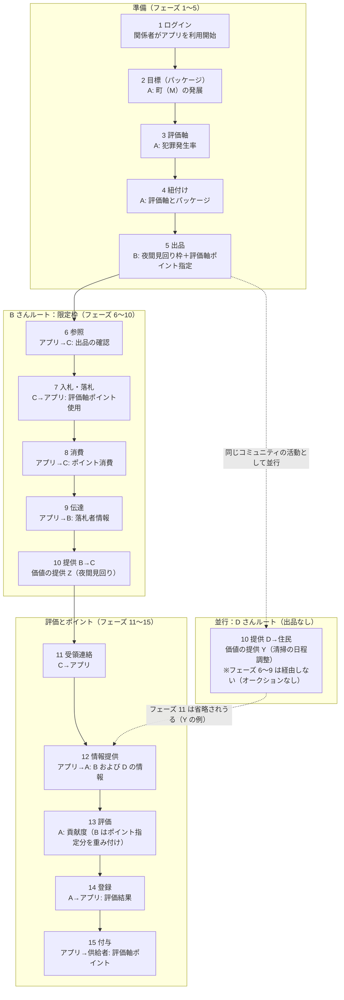
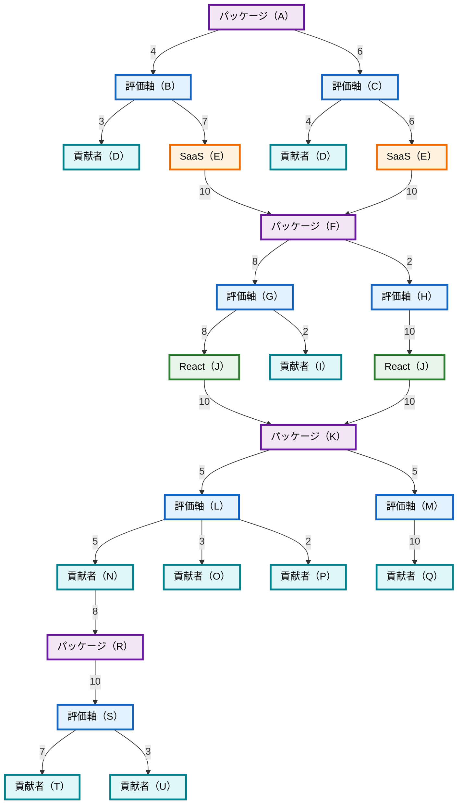
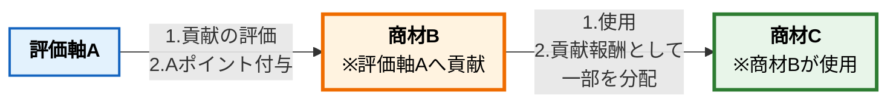
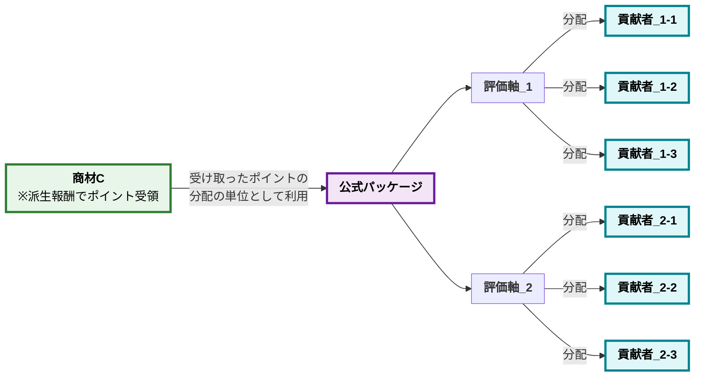

# 無料主義 v3 beta

## 言語

日本語（本ページ）| [English](freeism.en.md)

## はじめに

社会の仕組みとして、「無料主義」という仕組みを考えました。<br>
資本主義を補助したり、代替する仕組みとしての使用を想定しています。

## 目次

- [無料主義 v3 beta](#無料主義-v3-beta)
  - [言語](#言語)
  - [はじめに](#はじめに)
  - [目次](#目次)
  - [概要](#概要)
    - [実現したいこと](#実現したいこと)
      - [大目標](#大目標)
      - [中目標](#中目標)
    - [簡単なメリット](#簡単なメリット)
    - [簡単な説明](#簡単な説明)
      - [資本主義と異なる部分（1）：3つの役割](#資本主義と異なる部分13つの役割)
      - [資本主義と異なる部分（2）：基本無料](#資本主義と異なる部分2基本無料)
    - [簡単な流れ](#簡単な流れ)
    - [少し詳しい流れ](#少し詳しい流れ)
    - [想定している使用場面](#想定している使用場面)
    - [簡単な例](#簡単な例)
      - [図解](#図解)
      - [整理した表](#整理した表)
      - [流れ](#流れ)
    - [簡単な用語解説](#簡単な用語解説)
  - [無料主義のメリット](#無料主義のメリット)
    - [メリットのまとめ](#メリットのまとめ)
      - [「公開＆共有」関連のメリット](#公開共有関連のメリット)
      - [「時間・労力・費用を削減」関連のメリット](#時間労力費用を削減関連のメリット)
      - [「社会の仕組み改善」関連のメリット](#社会の仕組み改善関連のメリット)
      - [「感情＆思想」関連のメリット](#感情思想関連のメリット)
    - [メリットを詳しく](#メリットを詳しく)
      - [「公開＆共有」関連のメリット](#公開共有関連のメリット-1)
      - [「削減」関連のメリット](#削減関連のメリット)
      - [「社会の仕組み改善」関連のメリット](#社会の仕組み改善関連のメリット-1)
      - [「感情＆思想」関連のメリット](#感情思想関連のメリット-1)
  - [無料主義のデメリット・懸念点](#無料主義のデメリット懸念点)
    - [デメリット・懸念点のまとめ](#デメリット懸念点のまとめ)
    - [デメリット・懸念点を詳しく](#デメリット懸念点を詳しく)
  - [想定課題と結論](#想定課題と結論)
  - [今後考える必要があること](#今後考える必要があること)
  - [v2との大きな違い](#v2との大きな違い)
  - [無料主義を成立させる仕組み](#無料主義を成立させる仕組み)
    - [成立させる仕組みのまとめ](#成立させる仕組みのまとめ)
    - [評価軸の仕組み](#評価軸の仕組み)
    - [証明の仕組み](#証明の仕組み)
    - [互換性の仕組み](#互換性の仕組み)
      - [概要](#概要-1)
      - [各タスク全グループ評価法](#各タスク全グループ評価法)
      - [為替の仕組み](#為替の仕組み)
      - [ポイント交換の仕組み](#ポイント交換の仕組み)
      - [貢献評価を代用する仕組み](#貢献評価を代用する仕組み)
      - [譲渡の仕組み](#譲渡の仕組み)
    - [購入方式の仕組み](#購入方式の仕組み)
    - [貢献度の算出の仕組み](#貢献度の算出の仕組み)
      - [AIプロンプト](#aiプロンプト)
      - [「貢献度の算出の仕組み」の説明](#貢献度の算出の仕組みの説明)
      - [「貢献度の算出の仕組み」の例（完全版）](#貢献度の算出の仕組みの例完全版)
      - [「貢献度の算出の仕組み」の原則](#貢献度の算出の仕組みの原則)
    - [パッケージの仕組み](#パッケージの仕組み)
      - [概要](#概要-2)
      - [「OSS業界全体の発展」パッケージ](#oss業界全体の発展パッケージ)
        - [「OSS業界全体の発展」パッケージ（GitHub API）](#oss業界全体の発展パッケージgithub-api)
        - [「OSS業界全体の発展」パッケージ （GitHub API以外）](#oss業界全体の発展パッケージ-github-api以外)
      - [「指定OSSの発展」パッケージ](#指定ossの発展パッケージ)
        - [「指定OSSの発展」パッケージ（GitHub API）](#指定ossの発展パッケージgithub-api)
        - [「指定OSSの発展」パッケージ（GitHub API以外）](#指定ossの発展パッケージgithub-api以外)
      - [「幸福度の向上」パッケージ](#幸福度の向上パッケージ)
    - [貢献検知の仕組み](#貢献検知の仕組み)
      - [概念](#概念)
      - [評価軸検知の仕組み](#評価軸検知の仕組み)
      - [中間財検知の仕組み](#中間財検知の仕組み)
      - [参考検知の仕組み](#参考検知の仕組み)
      - [類似性の仕組み](#類似性の仕組み)
      - [クラスタリングの仕組み](#クラスタリングの仕組み)
      - [「貢献検知の仕組み」プロトタイプ](#貢献検知の仕組みプロトタイプ)
        - [v1](#v1)
        - [v2](#v2)
    - [貢献報酬の仕組み](#貢献報酬の仕組み)
      - [概要](#概要-3)
      - [必要性の仕組み](#必要性の仕組み)
      - [公式パッケージの仕組み](#公式パッケージの仕組み)
      - [「貢献報酬の仕組み」プロトタイプ](#貢献報酬の仕組みプロトタイプ)
        - [v1](#v1-1)
          - [プロトタイプの設計](#プロトタイプの設計)
          - [「OSS業界全体の発展」パッケージ（GitHub API）](#oss業界全体の発展パッケージgithub-api-1)
          - [「指定OSSの発展」パッケージ（GitHub API）](#指定ossの発展パッケージgithub-api-1)
          - [「幸福度の向上」パッケージ](#幸福度の向上パッケージ-1)
        - [v2](#v2-1)
          - [プロトタイプの設計](#プロトタイプの設計-1)
    - [代替性の仕組み](#代替性の仕組み)
    - [非干渉の仕組み](#非干渉の仕組み)
    - [枠の仕組み](#枠の仕組み)
    - [限定オークションの仕組み](#限定オークションの仕組み)
    - [他者購入＆指名販売の仕組み](#他者購入指名販売の仕組み)
    - [条件付き代理購入する仕組み](#条件付き代理購入する仕組み)
    - [無料主義アプリ互換性の仕組み](#無料主義アプリ互換性の仕組み)
    - [フォークする仕組み](#フォークする仕組み)
    - [許可が不要な仕組み](#許可が不要な仕組み)
    - [オープン・公開＆共有する仕組み](#オープン公開共有する仕組み)
    - [評価軸の仕組み](#評価軸の仕組み-1)
    - [非干渉の権利を実現させる方法](#非干渉の権利を実現させる方法)
    - [汎用的な法律の仕組み](#汎用的な法律の仕組み)
    - [相互運用性が高まる仕組み](#相互運用性が高まる仕組み)
    - [代理購入の仕組み](#代理購入の仕組み)
    - [貢献検知の仕組み](#貢献検知の仕組み-1)
    - [常時預ける仕組み](#常時預ける仕組み)
    - [枠の仕組み](#枠の仕組み-1)
    - [議論の論点](#議論の論点)
    - [キャンペーン・割引する仕組み](#キャンペーン割引する仕組み)
    - [提供する相手を決める方法](#提供する相手を決める方法)
    - [報酬が決まる仕組み](#報酬が決まる仕組み)
    - [共同入札の仕組み](#共同入札の仕組み)
    - [他者購入＆指名販売の仕組み](#他者購入指名販売の仕組み-1)
    - [プロジェクトの仕組み](#プロジェクトの仕組み)
    - [余力を残さず共有させる仕組み](#余力を残さず共有させる仕組み)
    - [提供側の価格の決め方](#提供側の価格の決め方)
    - [当選率向上による報酬 UP の仕組み](#当選率向上による報酬-up-の仕組み)
    - [余力を残さず提供させる仕組み](#余力を残さず提供させる仕組み)
    - [加工する社会](#加工する社会)
    - [必要不可欠性の仕組み](#必要不可欠性の仕組み)
    - [企業へ資金提供の仕組み](#企業へ資金提供の仕組み)
    - [出資の仕組み](#出資の仕組み)
    - [借金の仕組み](#借金の仕組み)
    - [代替性の仕組み](#代替性の仕組み-1)
    - [オークション形式の仕組み](#オークション形式の仕組み)
    - [評価軸ポイントの仕組み](#評価軸ポイントの仕組み)
    - [評価軸の仕組みの仕組み](#評価軸の仕組みの仕組み)
    - [無料主義アプリの仕組み](#無料主義アプリの仕組み)
    - [互換性の仕組み](#互換性の仕組み-1)
    - [貢献度の計算方法](#貢献度の計算方法)
  - [実現したいこと](#実現したいこと-1)
    - [大目標](#大目標-1)
    - [中目標](#中目標-1)
    - [小目標](#小目標)
      - [オープンにすることで実現したいこと](#オープンにすることで実現したいこと)
      - [不要にしたいこと](#不要にしたいこと)
      - [意思決定](#意思決定)
      - [暴力がなくなる社会](#暴力がなくなる社会)
      - [生産性・指標](#生産性指標)
      - [プロジェクトの仕組みで実現したいこと](#プロジェクトの仕組みで実現したいこと)
      - [評価軸関連で実現したいこと](#評価軸関連で実現したいこと)
      - [評価軸の仕組み関連](#評価軸の仕組み関連)
      - [Idea 関連](#idea-関連)
      - [許可を不要にしたい](#許可を不要にしたい)
      - [非干渉の権利で実現したいこと](#非干渉の権利で実現したいこと)
      - [研究を支援したい](#研究を支援したい)
      - [「汎用的な法律」関連](#汎用的な法律関連)
      - [無料主義で行いたいプロジェクト](#無料主義で行いたいプロジェクト)
      - [責任を取る必要がない社会](#責任を取る必要がない社会)
      - [etc](#etc)
  - [参考にしたいこと](#参考にしたいこと)
    - [「データ共有」の参考](#データ共有の参考)
    - [「貢献検知の仕組み」の参考](#貢献検知の仕組みの参考)
    - [「意思決定」の参考](#意思決定の参考)
    - [「貢献度の算出」の参考](#貢献度の算出の参考)
    - [「幸福度の算出」の参考](#幸福度の算出の参考)
    - [「ゲーム理論・マーケットデザイン・マッチング理論」を参考](#ゲーム理論マーケットデザインマッチング理論を参考)
    - [貢献度の算出手法](#貢献度の算出手法)
      - [`Apache/kibblescanners`](#apachekibblescanners)
      - [`Aurgur`](#aurgur)
      - [GrimoireLab](#grimoirelab)
      - [`OpenSourceContributo.rs`](#opensourcecontributors)
      - [その他](#その他)
    - [データ可視化サービス](#データ可視化サービス)
    - [指標](#指標)
      - [コード系](#コード系)
      - [論文・ブログ系](#論文ブログ系)
      - [イノベーション系](#イノベーション系)
    - [貢献度の算出理論](#貢献度の算出理論)
      - [統計学的・データ分析手法](#統計学的データ分析手法)
      - [心理学的理論](#心理学的理論)
      - [社会学的・経済学的理論](#社会学的経済学的理論)
      - [神経科学的理論](#神経科学的理論)
      - [重み付け](#重み付け)
    - [既存サービス](#既存サービス)
      - [データ取得元](#データ取得元)
        - [コード系](#コード系-1)
        - [その他](#その他-1)
        - [論文系](#論文系)
        - [課題管理](#課題管理)
        - [チャット](#チャット)
        - [SNS](#sns)
        - [記事・ブログ](#記事ブログ)
        - [Q\&A](#qa)
        - [検索](#検索)
      - [参考](#参考)
    - [貢献検知の仕組み](#貢献検知の仕組み-2)
    - [感情の測定方法](#感情の測定方法)
    - [データ取得の方法](#データ取得の方法)
    - [評価軸の指標](#評価軸の指標)
    - [非干渉の権利](#非干渉の権利)
    - [正当性](#正当性)
    - [意思決定](#意思決定-1)
    - [etc の参考](#etc-の参考)
  - [資本主義から無料主義へ移行する方法](#資本主義から無料主義へ移行する方法)
    - [まとめ](#まとめ)
    - [供給の流れ](#供給の流れ)
    - [移行プラン](#移行プラン)
    - [資本主義と無料主義を併用](#資本主義と無料主義を併用)
    - [全員が損する事態を防ぐために移行](#全員が損する事態を防ぐために移行)
    - [格差、借金、インフレに対処しきれなくなり移行](#格差借金インフレに対処しきれなくなり移行)
    - [etc の方法](#etc-の方法)
    - [etc の移行関連の情報](#etc-の移行関連の情報)
  - [関連ツール](#関連ツール)

## 概要

無料主義の仕様をまとめた内容をご説明します。<br>
以下の各項目の詳細は次の章で解説します。

### 実現したいこと

無料主義で実現したいことを簡単にご説明します。<br>
詳細は、「[実現したいこと](#実現したいこと-1)」でご説明します。

#### 大目標

**「この世の全ての人が満足度の高い人生を送れる社会」の実現**<br>
人生のどこかで躓いたとしても皆が満足度の高い人生を過ごせる社会

#### 中目標

1. **最底辺の生活水準の底上げ**
   - 「誰もが『普通』を得られる社会」の実現
   - ここでいう普通とは「ある観点における能力が社会的に許容され、自分自身が劣等感を持たない範囲内に留まること」
2. **安心して取引できる社会**
3. **利益背反がない社会**
4. **技術革新のスピード向上**
5. **「衣食住」・「人間関係」・「その他」の充実度の向上**

### 簡単なメリット

無料主義のメリットを簡単にご説明します。

1. **需要者と供給者のインセンティブ一致**
   - **資本主義**では、供給者は高く売ることを目指し、需要者は安く買うことを目指す。<br>**無料主義**では、供給者は安く売ることを目指し、需要者は安く買うことを目指す。<br>↓<br>**無料主義には、インセンティブの一致がある。**<br>
   - 資本主義では顧客のためになる行為もあるが、同時に顧客の利益に反する「高く売る」インセンティブもある。<br>↓<br>**それを無料主義が解決できる。**
2. **資本主義では成り立たないビジネスモデルが実現可能・費用負担のない仕組み**
   - 供給者への報酬は「**受益者に支払い能力があるか**」ではなく、「**評価軸に貢献しているか**」で決まる
   - **資本主義**では、享受する人や第三者による料金の支払い能力が必須。<br>
     **無料主義**では、料金の支払い能力が無くても各評価軸に貢献すれば報酬が得られる
     - 資本主義
       - お金を払う能力がない・お金を払うビジネスモデルだと成り立たない
       - 報酬もないため、仕事として成り立たない場合がある
     - 無料主義
       - 貢献した分だけ報酬が発行されるので、需要者の費用負担がない
       - 無料主義では、サービスを享受する対価を支払わなくても、サービスを提供する人は対価が得られる仕組み
3. **無料 or 大幅な値下げで提供される**
   - 無料主義の仕組みとして、供給者は、基本無料で商品を販売する
   - もし供給量より需要量が多い場合は、需要者自身に付与されたポイントを使用して購入するが、「**供給者への報酬**」ではなく「**優先的に得る権利の購入**」のためだけに使用するため、現在よりは価格が安くなる
   - 無料で提供しても、供給者は第三者からの評価によって報酬が得られる
   - それによって多くの貧困な人たちを救える
4. **一つの作業を複数の視点（評価軸・価値観）から評価でき、報酬が得られる**
   - 例）環境保護、生産性の向上、幸福度の高い生活、町の発展、OSS の発展など
5. **資本主義よりも、市場化・競争激化・最適化・効率化・オープン化・透明化された社会になる**
   - 市場化
     - より多くのモノ・コトが商材として売り買いできる社会
     - 「評価経済への移行」によって市場化が加速する
   - 競争激化
     - より独占がなくなり、競争できる環境・競争相手が増え、商材の質が高まる社会
       - Fediverse 的サービスの増加
   - 最適化
     - 資本主義の仕組みで利益を最大化するよう最適化するだけでなく、様々な指標に対して最適化される社会
     - 「評価軸の仕組み」によって、様々な指標に最適化される
     - 資本主義よりも柔軟にインセンティブ設計を作れる
   - 効率化
     - 市場化・競争激化・最適化によって、より効率的な社会になる
   - オープン化
     - オープンソースでも参考にされれば報酬が得られるので、オープンな商材が増える
     - 車輪の再開発が少なくなる
   - 成長
     - 無料主義は、資本主義よりも成長を目指す
   - 透明化
     - 貢献度の算出のために、データをオープンにする仕組みにより、資本主義よりオープン化する
6. **利益の追求による不利益のない社会**
   - 利益のために、顧客に不利なことをしない社会
   - 売り上げのために、修理ができない設計などの消費者にとって良くないビジネスの方法をしたら報酬を少なくなる
   - 需要者と供給者のインセンティブ一致により、利益背反が起こる機会が減る
7. **供給量の上昇**
   - 商材の値段が下がることで資本主義よりも多くの人に商材を提供できる

### 簡単な説明

#### 資本主義と異なる部分（1）：3つの役割

無料主義は、以下 3 つの役割で構成される仕組みです。<br>
「**需要者**」とは別で存在する「**評価者**」が「**供給者**」に対して報酬を支払います。<br>
※3 つの役割を兼務することも可能

1. **供給者**
   - 商品を提供する役割
2. **評価者**
   - 供給者を評価し、評価結果の分だけ供給者にポイントを付与する役割
3. **需要者**
   - 供給者が販売する商品を購入する役割

#### 資本主義と異なる部分（2）：基本無料

供給者は、基本的には無料で販売します。<br>
無料だと需要量が供給量を上回る場合があります。<br>
その場合のみ、需要者自身に付与されたポイントを使用してオークションを行い、「**優先的に得る権利の購入**」を行います。<br>
この購入によって使用したポイントは、「**供給者の報酬**」にはなりません。
※例外はあります

### 簡単な流れ

以下の`1.`〜`4.`を繰り返します。

1. **供給者**が、商品を提供します
2. **需要者**が、商品を購入します
3. **評価者**が、供給者を評価します
4. **評価者**が、評価結果をもとに、ポイントを供給者に付与します

### 少し詳しい流れ

`1.`〜`4.`の後は、`5.`〜`15.`を繰り返します。

```mermaid
  graph TB

    %% 項目変数名と表示名・役割ごとのクラス（classDef）
    Platform["<b>アプリ</b><br/><br/>プラットフォーム"]
    Demand["<b>需要者</b><br/><br/>価値を得る人"]
    Supply["<b>供給者</b><br/><br/>価値を提供する人"]
    Review["<b>評価者</b><br/><br/>評価を行う人"]
    classDef actorApp fill:#ff6b9d,stroke:#c2185b,stroke-width:4px,color:#fff
    classDef actorDemand fill:#4fc3f7,stroke:#0277bd,stroke-width:4px,color:#000
    classDef actorSupply fill:#fff176,stroke:#f57f17,stroke-width:4px,color:#000
    classDef actorReview fill:#a5d6a7,stroke:#2e7d32,stroke-width:4px,color:#000
    class Platform actorApp
    class Demand actorDemand
    class Supply actorSupply
    class Review actorReview

    %% エッジラベルは左寄せ・不透明の白背景
    %% 評価者 → アプリ
    Review --->|"<div style='display:inline-block;text-align:left;background-color:#ffffff;'><b>評価者 → アプリ</b><br/>1. アプリに登録<br/>2. 目標（パッケージ）を決める<br/>3. 評価軸を決める<br/>4. 評価軸とパッケージの紐付け<br/>14. 評価結果をアップロード</div>"| Platform

    %% 需要者 → アプリ
    Demand --->|"<div style='display:inline-block;text-align:left;background-color:#ffffff;'><b>需要者 → アプリ</b><br/>1. アプリに登録<br/>7. 入札・落札<br/>11. 受領の連絡</div>"| Platform

    %% 供給者 → アプリ
    Supply --->|"<div style='display:inline-block;text-align:left;background-color:#ffffff;'><b>供給者 → アプリ</b><br/>1. アプリに登録<br/>5. 出品と評価軸ポイント指定</div>"| Platform

    %% 評価者 → 供給者
    Review --->|"<div style='display:inline-block;text-align:left;background-color:#ffffff;'><b>評価者 → 供給者</b><br/>13. 貢献度の評価</div>"| Supply

    %% 供給者 → 需要者
    Supply --->|"<div style='display:inline-block;text-align:left;background-color:#ffffff;'><b>供給者 → 需要者</b><br/>10. 価値の提供（労働や商材の提供）</div>"| Demand

    %% アプリ → 需要者
    Platform -->|"<div style='display:inline-block;text-align:left;background-color:#ffffff;'><b>アプリ → 需要者</b><br/>6. 出品データの表示<br/>8. 入札で使用した評価軸ポイントの消費</div>"| Demand

    %% アプリ → 供給者
    Platform --->|"<div style='display:inline-block;text-align:left;background-color:#ffffff;'><b>アプリ → 供給者</b><br/>9. 落札者情報の伝達<br/>15. 評価軸ポイントを付与</div>"| Supply

    %% アプリ → 評価者
    Platform ---->|"<div style='display:inline-block;text-align:left;background-color:#ffffff;'><b>アプリ → 評価者</b><br/>12. 供給者の情報提供（評価のため）</div>"| Review
```



1. **（供給者→アプリ、評価者→アプリ、需要者→アプリ）無料主義アプリにログイン**
   - 付与されたポイント管理のためにログインが必要
   - 補足：「無料主義アプリ」は、無料主義のあらゆる機能を管理するアプリ
2. **（評価者→アプリ）目標を決める**
   - この目標を「パッケージ」と呼ぶ
   - 例）自分が住む街の発展
3. **（評価者→アプリ）評価する軸を決める**
   - 設定した目標（パッケージ）の達成に貢献しているか評価する軸（価値観・視点）を決める
   - 評価する軸は、なんでも良いし、自由に作り出して良い
   - 評価する軸のことを「評価軸」と呼ぶ
   - 例）犯罪発生率、電車の止まる本数
4. **（評価者→アプリ）評価軸とパッケージを紐付ける**
   - 無料主義アプリ上に、作成した「パッケージ」と「評価軸」を紐付ける登録を行う
5. **（供給者→アプリ）出品と評価軸ポイント指定**
   - 出品
     - 出品するコンテンツは、価値を提供する内容であれば、なんでも良い
     - 例）ゴミ拾い、町内会の活動、町内会の資金を管理する SaaS の開発、限定品全般、労働・権利
   - 評価軸ポイント指定
     - 需要量が供給量を上回る場合はオークションを行うが、その際に需要者が使用できる評価軸ポイントを、供給者が出品の設定時に指定する
     - 供給者がポイントの使用用途を作ることで、応援したい評価軸のエコシステム発展に貢献しているので、その評価軸ポイントを報酬として追加で得ることができる
   - ポイント
     - **無料主義アプリに商品やサービスを出品することは必須ではありません。**
     - しかし、出品して評価軸ポイントを指定することで、その評価軸のエコシステム発展に貢献するため、通常より重み付けして評価してくれる評価軸も出てくるでしょう
     - 評価者が、「評価軸ポイント指定」による報酬を上乗せして評価軸エコシステムを育てるインセンティブは、自分が保有する「その評価軸のポイント」の使い道を増やすためです
6. **（アプリ→需要者）出品データを参照する（アプリが需要者に出品情報を表示）**
   - 需要者が、供給者の出品内容を無料主義アプリ上で確認する
7. **（需要者→アプリ）入札・落札**
   - 基本的には、無料で供給者から商品やサービスを得られる
   - 需要量が供給量を上回る場合は、供給者が指定した評価軸ポイントを入札として使用してオークションを行う
8. **（アプリ→需要者）入札で使用した評価軸ポイントを消費する**
   - アプリ側で、オークションに使用した評価軸ポイントが消費される
9. **（アプリ→供給者）落札者情報の伝達**
   - アプリが供給者に対して、落札した需要者の情報を伝える
10. **（供給者→需要者）価値の提供（労働や商材の提供）**
    - 実際に、供給者が需要者へ商品・サービス・労務などを提供する
11. **（需要者→アプリ）受領の連絡**
    - 需要者が、受領や完了などをアプリ上で連絡する
12. **（アプリ→評価者）評価のための供給者情報の提供**
    - アプリが評価者に、評価に必要な範囲で供給者の情報を提供する
13. **（評価者→供給者）貢献度の評価**
    - 評価軸が「犯罪発生率」の場合など、設定した評価軸に沿って貢献度を評価する
14. **（評価者→アプリ）評価結果を無料主義アプリに登録**
    - 評価者が評価結果をアプリに登録・アップロードする
15. **（アプリ→供給者）評価軸ポイントを付与する**
    - 評価軸が発行するポイントを「評価軸ポイント」と呼ぶ
    - 評価結果をもとに、アプリ側の処理などを経て供給者に評価軸ポイントが付与される
    - 供給者の A 作業が、B,C の評価軸から評価された場合は、B,C のポイントをそれぞれ付与する
    - 供給者は、1 つの労働で複数の評価軸から評価されるし、複数の評価軸ポイントを受け取る
    - 「他の人から得たポイント」が報酬になるのではなく、「第三者による評価」が報酬になる
      - 評価軸ポイントは、需要側が優先的に得るためのみに使用します
      - 需要側がポイントを使用しようが、設定した目標に貢献しなければ供給者は報酬を得られません

### 想定している使用場面

- 今後
  1.  この世のすべての取引
      - 有形の品物や、労働・技能・知識の提供、デジタルコンテンツの配布など、価値が移転する関係は、原理的には同一の枠組みに載せられる

- 直近
  1.  OSS の運営
      - メンテナーがコード・ドキュメント・リリース・レビューなど
      - メンテナンスの工数やサポート枠など「量に限りがある供給」に対して、優先的に扱ってもらう権利や、限定サポート枠を評価軸ポイントで配分する、といった場面
      - 評価軸の例としては、セキュリティ対応の速さ、後方互換性の維持、Issue 対応の丁寧さ、コミュニティの健全性など
  2.  地域コミュニティでの技能・余剰リソースの提供
      - 工作相談、PC トラブル対応、自治会や NPO の事務作業、物品の修理や貸出など、人手・モノに限りがある活動
      - 評価軸の例としては、見守り活動への参加、ごみ減量への協力、災害時連絡網の把握度など
  3.  教育・文化・クリエイティブ分野の無料公開
      - 講義資料、チュートリアル動画、演奏や朗読の録音、イラスト素材の無料公開など
      - 添削枠、質問応答枠、ワークショップの席、印刷物の手渡しなど「物理的・時間的に限られた供給」への優先アクセスを、評価軸ポイントで優先権を購入する
      - 評価軸の例としては、学習者サポートへの協力、著作権・クレジット表示の遵守、二次利用しやすいライセンス選択など

### 簡単な例

#### 図解



#### 整理した表

| フェーズ | 矢印の向き                        | この例でのことがら                                                               |
| -------- | --------------------------------- | -------------------------------------------------------------------------------- |
| 1        | 各人 → アプリ                     | アカウント作成・ログインなど                                                     |
| 2〜4     | 評価者（A）→ アプリ               | 目標・評価軸の設定と紐付け                                                       |
| 5        | 供給者（B）→ アプリ               | 限定枠の出品と、入札に使う評価軸の指定                                           |
| 6〜9     | アプリ ↔ 需要者（C）／供給者（B） | 参照・入札・ポイント消費・落札者連絡（**D さんルートでは該当しません**）         |
| 10       | 供給者 → 需要者など               | B→C の夜間見回り、および D→住民の清掃調整（並行しうる）                          |
| 11       | 需要者（C）→ アプリ               | 受領・完了の連絡（Y の例では全員が個別に連絡する必要はない、と本文の補足どおり） |
| 12〜15   | アプリ・評価者 ↔ 供給者           | 評価用情報の提示、貢献度評価、結果登録、評価軸ポイントの付与                     |

#### 流れ

1. A さん、B さん、C さん、D さんなどの関係者が、無料主義アプリでアカウント作成・SNS アカウント連携などを行う
   - フェーズ：**（供給者→アプリ、評価者→アプリ、需要者→アプリ）無料主義アプリにログイン**
2. A さんが、目標として「町（M）の発展」を決め、この目標をパッケージとして無料主義アプリ上に用意します
   - フェーズ
     - **（評価者→アプリ）目標を決める**
3. A さんが、評価軸「犯罪発生率」で、あらゆる作業を評価することを決めます
   - フェーズ
     - **（評価者→アプリ）評価する軸を決める**
4. A さんが、評価軸「犯罪発生率」をパッケージ「町（M）の発展」と無料主義アプリ上で紐付けます
   - フェーズ
     - **（評価者→アプリ）評価軸とパッケージを紐付ける**
5. B さんが、その町（M）夜間見回りで回る地域の枠を 5 か所限定で出品<br>また、需要者が使用できる評価軸ポイントとして評価軸「犯罪発生率」を指定したうえで、無料主義アプリに出品します
   - 価値の提供を Z とします
   - フェーズ
     - **（供給者→アプリ）出品と評価軸ポイント指定**
6. C さんが、無料主義アプリ上で B さんの出品内容（価値の提供 Z）を確認します
   - フェーズ
     - **（アプリ→需要者）出品データを参照する（アプリが需要者に出品情報を表示）**
7. C さんが、無料主義アプリに出品された「夜間見回り地域の枠」オークションに、評価軸「犯罪発生率」ポイントを入札として使用し、落札します
   - フェーズ
     - **（需要者→アプリ）入札・落札**
   - 注意
     - 基本的には無料で提供してもらいます
     - 本例のように需要量が供給量を上回る場合は、供給者が指定した評価軸ポイントを入札に使うオークションの流れになります
8. アプリ側で、C さんがオークションに使用した評価軸「犯罪発生率」ポイントが消費されます
   - フェーズ
     - **（アプリ→需要者）入札で使用した評価軸ポイントを消費する**
9. アプリが B さんに、落札した C さんの情報を伝えます
   - フェーズ
     - **（アプリ→供給者）落札者情報の伝達**
10. 供給者から需要者への価値の提供として、次のことを行います
    - 行うこと
      1. B さんが C さんに、落札した「落札地域への夜間見回り」を提供します
      2. 並行して、D さんは、価値の提供 Y（清掃のスケジュール調整）を行い、その町に住む方々が成果物を受け取ります
    - フェーズ
      - **（供給者→需要者）価値の提供（労働や商材の提供）**
    - D さんの場合分け
      - **無料主義アプリに出品しない場合**
    - 補足（D さんルート）
      - D さんの例のように出品がない場合は、`6.`〜`9.`（出品の参照から落札者情報の伝達まで）は該当しません
      - 住民全員向けに無償で提供できる内容であり、無料主義アプリを介した入札・評価軸ポイントの消費・落札者情報のやりとりがありません
      - 提供内容は誰もが得られるサービスであるため、出品は不要で、オークションもありません
11. C さんが、受領や完了などを無料主義アプリ上で連絡します
    - フェーズ
      - **（需要者→アプリ）受領の連絡**
    - 補足
      - 価値の提供 Y（清掃のスケジュール調整）では、住民各自が明示的にアプリで連絡する必要はありません
12. アプリが A さんに、評価に必要な範囲で B さん（および評価対象となる D さん）の情報を提供します
    - フェーズ
      - **（アプリ→評価者）評価のための供給者情報の提供**
13. A さんが設定した評価軸「犯罪発生率」に沿って、B さんと D さんの貢献度を評価します
    - 補足
      - B さんは評価軸ポイントを指定して出品したため、通常の貢献による評価に加えて重み付けする
    - フェーズ
      - **（評価者→供給者）貢献度の評価**
    - 貢献度の計算方法
      - 参加者内で議論して決めたり、目標を定量化した指標と商品供給の相関性や因果関係から貢献度を決めるなど、様々な方法で決めるとよいです
14. A さんが、評価結果を無料主義アプリに登録します
    - フェーズ
      - **（評価者→アプリ）評価結果を無料主義アプリに登録**
15. 評価結果をもとに、無料主義アプリ側の処理などを経て、評価軸「犯罪発生率」ポイントが供給者に付与されます
    - フェーズ
      - **（アプリ→供給者）評価軸ポイントを付与する**
    - 補足
      - 供給者のある作業が複数の評価軸から評価された場合は、評価軸ごとのポイントをそれぞれ付与する
      - 供給者は、1 つの価値の提供で複数の評価軸から評価され、複数種類の評価軸ポイントを受け取れることになります
    - ポイント
      - 「他の人から得たポイント」が報酬になるのではなく、「第三者による評価」が報酬になります
    - 運用の例
      - 貢献度の決定後に、評価者または代表者が無料主義アプリに情報を入力してポイント付与を行います

### 簡単な用語解説

無料主義を構成する仕組みについて解説します。<br>
※それぞれの単語の詳しい内容は「[無料主義を成立させる仕組み](#無料主義を成立させる仕組み)」で解説します。

1. **無料主義アプリ**
   - 無料主義アプリとは、無料主義に必要な機能を提供するアプリのこと
   - 機能例
     1. **評価軸の作成**
     2. **パッケージの作成**
     3. **評価軸とパッケージの紐付け**
     4. **自身のポイント管理**
     5. **出品**
     6. **入札**
     7. **自分のポイントを預ける（使用不可にする）機能**
     8. **貢献度の算出**

2. **パッケージ**
   - 評価者が無料主義アプリ上で設定する「目標」のこと
   - 例）自分が住む街の発展

3. **評価軸**
   - 説明
     - パッケージ（目標）の達成に貢献しているかどうかを測る、指標・評価の観点・価値観のこと
     - 評価軸から評価ポイント・評価軸ポイントが発行される
   - 例
     - 犯罪発生率、電車の止まる本数
   - 評価軸の仕様
     - 評価軸も複数作成できます
     - 複数所属できます
     - 誰でも簡単に評価軸を作成できます
     - それぞれの評価軸の仕組みは、1 つの評価する観点・価値観を持ちます

4. **評価軸とパッケージの紐付け**
   - 無料主義アプリ上で、作成したパッケージと評価軸を対応づけて登録すること

5. **評価軸ポイント**
   - 評価軸から発行され、付与されるポイントのこと
   - 貢献したときに与えられ、限定品を優先的に獲得するために必要なポイント

6. **供給者**
   - 商品やサービスなど、価値の提供を行う役割のこと
   - 無料主義アプリに出品し、評価後に評価軸ポイントの付与を受ける側

7. **需要者**
   - 供給される商品やサービスを受け取る側の役割のこと
   - 入札・落札などで限定品などの獲得を目指す

8. **評価者**
   - 供給者の貢献を評価し、評価結果に応じて評価軸ポイントを付与する役割のこと
   - パッケージの設定、評価軸の設定、評価軸とパッケージの紐付けも行う
   - 需要者・供給者と役割を分けたうえで、兼務することも可能

9. **預ける・占める**
   - 無料主義アプリに評価軸ポイントを預けて、一定期間だけ使用不可にすること

10. **限定品**
    - 欲しい人全員が得られない商品やサービスのこと

11. **マイナス影響**
    - 評価軸・パッケージの内容に貢献せず、逆に達成から遠ざける行為のこと

12. **マイナス評価**
    - マイナス影響になる行為を行ったときの評価結果のこと

13. **マイナス評価による罰金・罰則**
    - 無料主義では、評価軸の方向性と逆行する場合は、マイナス評価になり、「ポイント付与」ではなく「ポイント没収」になります

14. **プロジェクト**
    - 現在の株式会社の代わりの仕組みのこと

15. **評価軸のルール**
    - 評価軸のルールとは、無料主義の社会で生活していくうえでの法律のこと

16. **貢献度の算出の仕組み**
    - それぞれの取引ごとに、評価軸の価値観に貢献した度合いを算出する仕組みのこと
    - 「貢献度の算出」に市場原理が内包する場合もあります

17. **非干渉の権利**
    - 別の価値観の人からの考え・価値観の押し付けを受けない権利のこと

18. **非干渉の仕組み**
    - 「非干渉の権利」を実現させる仕組みのこと

19. **評価軸クラスタ・パッケージクラスタ**
    - その評価軸・そのパッケージに貢献したい人達（同じ価値観の人達）の集まりのこと
    - 「評価軸クラスタ」でコミュニティ・街・会社・国を作ることを想定している

20. **「無料主義アプリの発展」パッケージ**
    - 説明
      - 無料主義アプリのエコシステム発展の評価を行うパッケージ
    - そのパッケージの評価項目
      1. **別の評価軸クラスタには干渉しない**
      2. **評価軸クラスタで活動している人達は、いつでも抜けたいと言えば確実に抜けられる権利の保障**

21. **価格**
    - 無料主義では、評価軸ポイントの使用量が価格になります

22. **貢献報酬の仕組み**
    - A さんが貢献したときに、B さんも A さんの貢献に関連していた場合、B さんに対しても、A さんが得た評価軸ポイントの一部が得られる仕組みのこと
    - 関連している例）一緒に作業する、自分の研究結果が参考にされる、アレンジする、他社の作成した部品を使用して作成し販売する、など

23. **貢献検知の仕組み**
    - A さんが貢献したときに、B さんも A さんの貢献に関連しているか調査・検知する仕組みのこと

24. **汎用的な法律の仕組み**
    - 評価軸の評価を法律として使用する仕組み・考え方
    - 評価軸でマイナス評価になった場合は罰則・罰金を科す
    - どんな行為が違法かどうかは、評価軸の貢献度合いがマイナスかどうかのみで決まります
    - 例）窃盗でさえ誰にも悪い影響を与えなければ犯罪ではなくなります。でも窃盗によって評価軸の数値がマイナスになる場合は違法になります
    - 悪影響を与えた行動も補足して評価する

25. **評価軸ポイントを預ける期間**
    - 無料主義アプリに、評価軸ポイントを預ける期間のこと
    - 評価軸によって預ける期間の算出ロジックは異なる
      - 例）「落札額 × 入札参加者数」に比例して、預ける必要がある期間が延びる

26. **落札率・当選率**
    - 入札に参加した人の中で、実際に落札する人の割合です

27. **無料主義アプリの出品タイプ**
    1. **供給者が出品するタイプ**
       - 供給者が「この仕事をしてくれる人を募集」するタイプ
       - 先に無料主義アプリへ実装するタイプ
    2. **需要者が出品するタイプ**
       - 需要者が「〇〇してくれたら、〇〇ポイントを支払う」などの条件で募集するタイプ
       - ダッチオークション形式

28. **商品を得る方法**
    1. **オークション入札**
    2. **即決価格**
    3. **保有ポイント総額**
    4. **先着順**
    5. **ポイント譲渡**
    6. **抽選**
    7. **上記の組み合わせ**
       - 例）一定以上の入札額を提示した人の中から抽選や先着

29. **落札した人に提供するインセンティブ**
    1. **使用による参考報酬を得るため**
       - 無料主義では、落札した人に商品を提供しないと、自分が提供した商品によって落札した人が「どんな変化が起こったか」が分からないから、貢献度を判断できない
       - 参考にした人が得たポイントの一部を、商材提供した人が得られる
    2. **エコシステム発展に貢献して報酬を得るため**
       - 落札した人に提供しないとエコシステムに貢献できない。なのでポイントがもらえない

30. **出品商材の入札に使用できるポイントの種類を決める方法**
    1. **需要者が、どの評価軸ポイントを使用して購入するか決める方式**
    2. **供給者が、どの評価軸ポイントを使用して購入できるか決める方式**
    3. **評価者が、どの評価軸ポイントを使用して購入できるか決める方式**
    4. **無料主義アプリの管理者が、どの評価軸ポイントを使用して購入できるか決める方式**

31. **無料主義における「労働の種類」**
    1. **無料主義アプリへ出品を貢献として評価する仕組み**
       - 無料主義アプリへの成果物の出品は必須ではありません
       - でも、出品することで評価軸ポイントの使い道が増え、その評価軸のエコシステム発展に貢献するため、通常のポイントに上乗せしたほうが良い
       - ポイントを使用する場所を用意することで、ポイントを稼ぐインセンティブ構造を作れる
    2. **評価する労働（評価者）を貢献として評価する仕組み**
       - 評価者が評価軸をエコシステムとして育てるインセンティブは、評価することによるエコシステムからの評価と保有ポイントを使用する場面を増やすため
    3. **出品しない労働**

## 無料主義のメリット

無料主義のメリットをご説明します。

### メリットのまとめ

無料主義のメリットは、主にこれからご説明するようなメリットがあります。<br>
詳細については、次の段落で詳しくご説明していきます。

#### 「公開＆共有」関連のメリット

- ノウハウ・データなどが公開＆共有する社会になる
- 相互運用性が高まる
- 参考にされただけで報酬が得られる
- 学習データなどのサービスの質向上のためのデータ量の増加
- 「どれだけ差別化できるか」から「どれだけ共有できるか」を競争する社会になる
- ネットワーク外部性が働きにくく、サービス利用者の流動性が高くなる
- 透明性が高まる
- サービスや国やそれぞれのレイヤーで、依存せず制裁耐性を持てる
- 新しい相関関係・価値のある行動を発見できる
- 独占されることが少なくなる
- 企業同士の無駄な独占競争がなくなり、他国同士の争いも発生しにくくなる
- 車輪の再開発が無くなる
- 想像すらしていなかった使い方を様々な人が使えるような社会になる
- IT 分野のセーフティーネットを作れる
- 人事評価で成果主義を採用すると、個々人がノウハウを共有しようとしないデメリットを解決できる
- 参入障壁を下げることが報酬を得られる行為になる
- 今まではお金が介在しない部分でも対価が得られるようになる
- 「正の外部性に対価」「負の外部性に費用」を与えられる
- アイデアを出すだけでも評価されるようになる
- 失敗しても対価を与えることができる
- 「競争のある独占市場」を作れる
  - 「競争のある市場」と「独占市場と同規模の経済」のメリットを両立できる状態

#### 「時間・労力・費用を削減」関連のメリット

- 値段が安くなる
- 特許や著作権関連で値段が高い商品も安くなる
- 税金が不要で、税金のメリットを活かせる
- 合理的な意思決定がされやすくなる
- 立法の労力・費用・時間などのコスト削減
- 問題発生から法律を施行するまでのタイムラグの削減
- 税設計による経済損失の削減
- 費用負担なしで、供給者に対価を支払える
  - 対価を払う必要がないので、貧困層も先進国と同じような顧客になる
  - 報酬の上限や下限は無い
- 費用が安くなることで効率化サービスの利用率が高まり、よりあらゆる部分を効率化できる
- 企業との交渉が不要になり、労力・費用・時間を削減できる
- 詐欺の被害を軽減できる
- 国の手続きを効率化する

#### 「社会の仕組み改善」関連のメリット

- 納得できない法律が減る
- 汎用的な法律を作れる
  - 法律の細かい定義が不要で、今よりも柔軟に、幅広く、どれだけニッチな問題にも対応できる場面が増える
- 行政・国間の競争促進
- 法律をハック・悪用されることが少なくなる
- 国の立ち上げが簡単になる
- 既得権益を減らす
- 「良いことだけど無報酬なこと」「悪いことだけど罰がないこと」に対処可能になる
- 法律が分かりやすくなる
- 「移動による投票」が行われやすくなる
- 貧困層にどれだけ分配するのかの意見の不一致が起こりにくい
- 死荷重がなくなる
- 無料主義が人間よりも賢い汎用的 AI 実現までの中継ぎの経済の仕組みとして使える
- ダンピングでも全体の利益になる仕組みになる
- 無料主義では、ぼったくりは存在しない
- 無料だったら需要があるサービスを成立させられる
- 会社をフォークできる
- 解雇規制を廃止できる
- ストライキをする必要はない
- 供給側が値段設定する必要がない
- 物理的に搾取できない仕組み
- 賃金を簡単に上げられる
- 分配が不要
- 許可が不要になる社会
- 申請主義の廃止
- （任意の名称）to earn の仕組みを作れる
- 公共サービスが充実する＆公共サービスの財源問題を解決できる
- カルテルが行われない
- パチンコやその他の賭け事も少なくなる
- 下請けの搾取がなくなる
- 競争がなくても改善するインセンティブを作れる
- 政府が給料を決めなくなる
- あらゆる海賊版がなくなる
- 生成 AI の学習データ問題の解決
- 供給側と需要側の対立を解消できる
- 市場の失敗を解決できる
- 中立な報道機関
- 事件を発見できる
  - 「汎用的な法律」により、マイナス評価から事件を発見できる
- 法律の抜け道を無くせる
- ブルシットジョブがなくなる
- 広告が少なくなる
- DX が進む
- 搾取は少なくなる
- あらゆる指標で評価できる

#### 「感情＆思想」関連のメリット

- 干渉されない社会になる
- 思想ごとに分かれて生活できる
  - 「他人が何をしようが関係ないが、自分には干渉しないで欲しい」の考えを今よりは実現できる
  - 特定の既得権益の意見を重視した政治が行われにくくなり、生活の質が高まる
- コンテンツを削除せずに安全を守る
- 関わりたくない人と関わる必要がなくなる
- 多様性が生まれる
- 大きな思想の分断がなくなる
- 評価軸の仕組みで思想ごとに分かれるため、大きく意見が分かれる議論は不要になる
- 誹謗中傷の非表示・反対意見の非表示
- 無料のサービスに対して責任感と提供する側のストレスを緩和する
- 差別を少なくできる
- 加工する社会を作れる
- 対立が無くなる

### メリットを詳しく

今までに記載したメリットを、これから詳しくご説明していきます。

※詳細は「[無料主義を成立させる仕組み](#無料主義を成立させる仕組み)」に記載しますが、次の「[メリットを詳しく](#メリットを詳しく)」の理解のためにこちらにも簡単に記載します。

#### 「公開＆共有」関連のメリット

公開＆共有される系のメリットを、少し詳しくご説明していきます。

1. **公開＆共有する社会になる**
   - 「貢献検知の仕組み」により、情報を公開＆共有して参考にしてもらったほうが評価軸ポイントが貰えるため、積極的に情報共有する社会になる
   - あらゆるノウハウ、特許、設計、などがオープンソースになる社会
   - ※もちろん、情報公開して参考にした人のポイントの一部を得るより、ノウハウを独占して評価軸に貢献するほうが、評価軸ポイントを得られる場合はクローズドになると思います
   - 一番貢献度を稼げるのは、全員に需要が高い商品やサービスを配ることではなく、ノウハウを共有して多くの人達に参考にしてもらうことにしたい。<br>それにより、共有する競争になり、他の良いメリットが生まれる

2. **中間層の底上げ**
   - 無料主義では、すべての情報やノウハウがオープンになるから現在は情報を隠している人もどんどん公開していき、多くのメリットをいろんな人が享受でき、全体が便益を受けることができる
     - 技術に疎い人はオープンになった情報でリテラシーが底上げされ、賢い人は新技術開発の為のアイデアを出すお金や労力を削減できる
     - すべての情報がオープンになって損するのは、嘘の情報を情報商材などで売ってる人達だけ
   - アイデアを発信することで、自分が何を考えているかを相手に知ってもらえ、同じ考えを持つ人たちと SNS で繋がれるし、そこから有益な情報も新たに得られる
   - アイデアやソースコードなどの情報を公開することで、そのアイデアを強制的にコモディティにして、中間層に正しいかどうかを判断してもらえ、アドバイスをもらえる

3. **参考にされただけで報酬が得られる**
   - 「貢献検知の仕組み」により、参考にされただけで、参考にした人が稼いだ評価軸ポイントの一部が得られるようになります

4. **相互運用性が高まる**
   - 「貢献検知の仕組み」で積極的に参考・使用してもらって稼ぐために、相互運用性がある状態にするインセンティブができる
   - また、直接的な方法として、「相互運用性を高める」評価軸が使用する方法もある

5. **学習データなどのサービスの質向上のためのデータ量の増加**
   - 「データを公開＆共有する社会」になることで実現される

6. **「どれだけ差別化・独占できるか」から「どれだけ共有・協力できるか」を競争する社会になる**
   - 「貢献検知の仕組み」と「オープンにする評価軸」により、参考・使用してもらったほうが稼げるため、「どれだけ先に、どれだけ評価軸に貢献する内容を公開＆共有できるか」競争する社会になる

7. **ネットワーク外部性が働きにくく、サービス利用者の流動性が高くなる**
   - 相互運用性が高まることで実現できる
   - 下記の問題がある
     - 本当は改善したいサービスがあるが、フォークして改善しても、ネットワーク外部性でユーザーを集められない
     - 相互運用性がないことによって拡張機能として改善したバージョンの機能を提供することもできない
   - ネットワーク外部性が働かないメリット
     - 基本同じサービスだけど一部機能が違うサービスを作成でき、一部機能が違うサービス同士で連携が可能になる

8. **サービスや国やそれぞれのレイヤーで、依存せず制裁耐性を持てる**
   - オープンになることで、あらゆることに依存しにくくなる

9. **新しい相関関係・より正確な貢献度・価値のある行動を発見できる**
   - データ分析で貢献度を算出することが増えるため、貢献度の算出を行う過程でより正確な貢献度を発見できる
   - 授業態度を算出したり、夫と妻の育児への貢献度を算出できたり、あらゆるものを算出できるようになり、よりよく理解できるようになる

10. **独占されることが少なくなる**

- 無料主義では、独占して他社を排除するより、他社も使えるようオープンにして参入してもらって自社技術を使用してもらったほうが稼げる場合も増えるため、独占するメリットが少ない
  - 現在は独占したほうが付加価値や価格や自分の対価が高まるから、周りから隠すようなインセンティブが働いてしまう
- 解決できる問題
  - 独占による市場の失敗を防げる
  - 囲い込み戦略によりサービスの利便性が下がる問題の解決

11. **国同士の争いが少なくなる**
    - 共有される社会により、自国産業を作るために他国の事業を追い出す必要性が少なくなる

12. **車輪の再開発が無くなる**
    - 「代替性の仕組み」「オープンにするメリットを作る仕組み」を利用する

13. **想像すらしていなかった使い方を様々な人が使えるような社会になる**
    - ノウハウがオープンになることで、別業界の人が新しい使い方を発明してくれる機会が増える

14. **IT 分野のセーフティーネットを作れる**
    - オープンソースが IT 分野のセーフティーネットになる
    - 現在はオープンソースではシステムがない場合、システム開発をしようとするとコストも時間もかかり、 一部のユーザーや企業にとっては最悪の経営状況なのに納期が短い商品に高い値段になるなどの市場価格で受け入れるしかない

15. **人事評価で成果主義を採用すると、個々人がノウハウを共有しようとしないデメリットを解決できる**
    - 「貢献検知の仕組み」で参考にしているだけで、参考にされた人は稼げるので、成果主義の人事評価でも、ノウハウ共有する人が増える

16. **サービスの利便性が向上する**
    - 相互運用性を高めることで、EC の服や家電や求人サービスのサイト間でデータを共通利用できるようになる
      - 最初のサイズ選択やプロフィールなどの自分の情報の入力が面倒くさいという問題点を解決できる

17. **0→1 に貢献した人が評価される**
    - 資本主義では 0→1 の基礎研究や市場開拓段階のビジネスよりも 1→10、10→100 のビジネスの方が儲かることが多い
    - 無料主義では、「貢献検知の仕組み」により、資本主義よりも 0→1 に携わる人が報われる社会になる

18. **参入障壁を下げることが報酬を得られる行為になる**
    - 「貢献検知の仕組み」により、全体の利益になる行為ほど、参考にしていると捉えて報酬の一部が得られる

19. **競争が激しくなる**
    - 無料主義は、資本主義以上に簡単に真似されて顧客の移動も簡単になるので、資本主義よりも競争が激しくなる
      - 相互運用性の高さ、貢献検知の仕組み、公開＆共有する社会、全体的な物価の安さ、などの理由から、全体的に物価が安いため全員が挑戦しやすくなり、ノウハウが共有されているため参考にして、少しの改善バージョンを出して、相互運用性を活かしてすぐに移行して競争する

20. **今まではお金が介在しない部分でも対価が得られるようになる**
    - 友達間の漫画の貸し借りでは、「漫画家」や「漫画を貸し出した人」は何も儲けは出なかったけど、漫画を借りた人にとっては実際に商品を購入しているのとほぼ同じ感覚だから、評価軸に貢献しているとみなされて、無料主義では評価軸ポイントを稼げるようになる
    - 上記の漫画を貸し出した人の競合は、漫画を販売している人になる

21. **「正の外部性に対価」「負の外部性に費用」を与える（外部性の内部化）**
    - 無料主義では、外部性の内部化によって正の外部性には報酬を与え、負の外部性には費用を払わせることができる
    - 正の外部性の例
      - 健康的な生活を送る、研究、成果物、情報発信、二次創作、ソースコード、設計図、研究の知見、何かの文章の引用、画風、他社が製造した部品を利用した製品、ノウハウ、アイデア
    - 負の外部性の例
      - 早朝にひどい騒音を立てる芝刈り機を使って近所の人の迷惑になる行動
      - 現在のマクドナルドのビッグマックは日本円で 500 円以下だけど、外部不経済で費用負担していない環境保全及び社会的コストを加えてコストも高くなる
      - 怒鳴り込んでくる人
      - クレーマー
    - 負の外部性に対する対処法
      - 負の外部性 A を見つけたら、その原因となる人 B を探して、B の評価軸ポイントを没収する
    - 個々人が取引・行為からのみ報酬を得るのではなく、取引による全体への影響から報酬・罰を判断する
      - 無料だけど良いことは全て対価が得られるようにして、無料だけど悪い行動は全て費用を払う（評価軸ポイントを使用する）必要が出てくるようにする

22. **アイデアを出すだけでも評価されるようになる**
    - 貢献検知の仕組みにより実現する

23. **失敗しても対価を与えることができる**
    - 「貢献検知の仕組み」により、失敗したとしても行う過程で得たものを公開して、参考にしてもらうことで対価が得られるようになる
    - 失敗した場合でも、他の成功した人が失敗した人を見てその失敗を避けたり、その失敗を参考にして成功する人たちがいるが、現在は失敗した人は経済的にはゼロかマイナス近くになり、経験しか増えない<br>でも、成功した人は、その失敗した人を参考にして戦略を立てているなど、失敗している人も現在の他の人の成功に貢献しているはず

24. **「競争のある独占市場」を作れる**
    - 「競争のある独占市場」とは、「競争するメリット」と「独占しているメリット」の両方を活かせる状態のこと
    - 全ての会社が、競争しながら、知見を共有し規模の経済を発揮した状態
    - 「競争するメリット」は、貢献検知の仕組みを利用した、他社が参考にしたくなるノウハウ開発や人材育成の競争により実現
    - 「独占しているメリット」は、競合同士が今以上にノウハウを共有して、相互運用性を高めることにより、1 社で独占しているような規模の経済を活かせる

25. **独占をするメリットはない**
    - 独占や寡占の状態になったとしても、消費者に対して評価軸に貢献するような商品やサービスにしないと評価軸ポイントが得られないし、独占や寡占状態にして価格を上げても対価が増えるわけではない
      - 独占するより、独占できるくらいのノウハウを共有して、貢献検知の仕組みにより、他社に参考にしてもらって、報酬の一部を得るほうが稼げる
    - 一番利益を上げる方法は、すでに持っているノウハウなどを全て公開しながら、常に新しい技術を開発し貢献すること

26. **マイナス評価を受けないために公開＆共有する**
    - もし 幸福度の低下が発見できたら、 その原因調査のために データ分析をするけど、原因解明のためにデータ公開しない人たちは、データ分析をする人の手を煩わせるとして、マイナス評価になるので、 結局データを公開する人たちが増える

27. **情報の非対称性が 少なくなる**
    - さらに、 評価軸としても「情報の非対称性を少なくする」と設定すれば、より非効率な経済がなくなる
    - 自動車販売、不動産販売

28. **オープンデータが多くなる**
    - オープンデータを提供するだけで、貢献検知の仕組みで報酬が得られるので、 オープンデータが多く 提供されるようになる
    - さらに、そのオープンデータを多く提供するためにも、自治体も企業もデータを使いやすいように統一するインセンティブが生まれる
    - 医療のデータ、弁護士事務所の判例、契約書、企業の情報もオープンで、企業情報開示市場の参入障壁も下がる

29. **職場の情報の非対称性が少なくなる**
    - 無料主義で働くときに、職場環境や仕事の情報の非対称性が少なくなるし、無料主義の性質以外でも、評価軸などで情報をオープンにするインセンティブを働かせたい
    - どの職場で、どの部署でパワハラが起きるのか、その他のあらゆる情報をオープンにするインセンティブ
      - 単純に、すべての情報をオープンにして嘘の情報を流さずにシステムで取得した情報をそのまま流したり、パワハラがなくなるかどうか、スラックやズームやメタバースなどのデータを取得して、そのデータ自体は公開しないけど、そのデータからパワハラ度合いがどれだけかどうかを全て自動的にシステムで算出して、その指標を全て公開したほうがその人が何か評価軸ポイントを稼ぎたときに、その企業全体が重み付けをして多めに貢献のポイントが得られるようにするなどを行い、情報の非対称性がなくなるようにする

30. **全ての物件情報がでてきやすくなる**
    - 田舎の物件は、口コミ紹介等でネットに流通しないことが多い

31. **モラルハザードや逆選択の問題が少なくなる**
    - 情報がオープンになることで、モラルハザードや逆選択の問題が少なくなる

32. **オープンソースの代替品が現れるまでの時間を短縮される**
    - ある商用ソフトウェアに対して、オープンソースの代替品が現れるまでの時間 (Time Till Open Source Alternative, TTOSA) を無料主義ではゼロにできる
    - 参考
      - ある商用ソフトウェアに対して、オープンソースの代替品が現れるまでの時間 (Time Till Open Source Alternative, TTOSA) を考察した記事。平均は約 7 年間で、著者は将来的にソフトウェアのみを売って金儲けをするのは不可能になるだろうと予測している
      - [https://staltz.com/time-till-open-source-alternative.html](https://t.co/tnCfkKxezF)
      - [https://twitter.com/mootastic/status/1563876281556824065?s=20&t=XkrUWkrL3XD1Lvk4UubADQ](https://twitter.com/mootastic/status/1563876281556824065?s=20&t=XkrUWkrL3XD1Lvk4UubADQ)

33. **新しい商品やイノベーションが生まれやすくなる**
    - 物価全体が安くなるため、採算が取れて新しい商品の提供やイノベーションが加速される

#### 「削減」関連のメリット

削減できる系のメリットを少し詳しくご説明していきます。

1. **値段が安くなる**
   - 下記により実現させます
     1. **「公開＆共有する社会になる」により、情報共有が積極的に行われ、ノウハウを積み重ねる時間や費用が安くなり、価格が安くなる**
     2. **「非干渉の権利」により、既得権益と関わる必要がなくなることで価格が安くなる**
     3. **「評価軸の仕組み」により、合理的な意思決定がされやすくなるので、より効率化する正しい意思決定が行われやすくなることで、価格が安くなる**
     4. **「貢献検知の仕組み」により、今までは効率化されるけど報酬が出ないので行われないアドバイスも提案されるようになることで価格が安くなる**
     5. **評価軸クラスタの競争促進により、より最適な支援施策やルール作りが行われるため、必要な費用が安くなる**
     6. **付加価値をつけないので安くなる**
        - 無料主義のポイントは「優先的に購入する権利」を得るためのみに使用するため、付加価値を付けない
        - 当選率が 100％に近づくほど、必要な評価軸ポイントの額は少なくなる
     7. **税金が無くなることで、税金の費用分が安くなる**
     8. **全社が協力して供給量を増やすため、価格が安くなる**
     9. **「評価軸の仕組み」により、誰も限定品の提供に必要な費用を負担せず、付加価値・利益を出さず提供できる**
     10. **「相互運用性が高まる仕組み」により、全員が協力して、それぞれの人が別々に提供するけど相互運用性が高いことでお互いが連携して、1 つの組織が独占的に提供しているような規模の経済で提供できる。でも競争するときの効果も働く**

2. **合理的な意思決定がされやすくなる**
   - 「評価軸の仕組み」により、評価軸に貢献しないと報酬が得られないため、データを参考に正しい意思決定をするインセンティブが出てくることで、合理的な意思決定がされやすくなります

3. **税金が不要で、税金のメリットを活かせる**
   - 説明
     - 税金のようにコミュニティから取り上げて分配する行為は、「評価軸の仕組み」で評価軸ポイントを発行すればよいだけなので、税金として取り上げる必要はない
     - 現在の税収の仕組みの問題点は、消費税など本当は制限せず促進させないといけないのに、税収を得るために税金を課しているという問題もあるけど、それも解決できる
   - メリットの例
     - 年金・社会保障の予算問題がなくなる
     - 年金や医療などの公共サービスの財源が不要になる
   - 税金の役割には、「制限させる役割」と「税収を獲得する役割」と「格差是正」がある
     1. **格差是正**
     2. **「枠の仕組み」で、使用できるポイント数を調整することで格差是正**
     3. **評価軸に貢献するために、独占せず全員に供給するインセンティブにより、格差が大きくても分配せずに全員が得られる社会になる**
     4. **情報共有を積極的に行うインセンティブなどの仕組みにより、格差が大きくても、そもそもの物価が安く低予算で生活水準の高い生活ができるようになります**
     5. **税収を獲得する役割**
        - 無料主義では、誰かから取り上げず評価軸ポイントを発行すれば良いだけになるので不要になる
        - 例）図書館、水道、年金、医療、道路、教育、警察、消防、防衛など
     6. **制限させる役割**
        - 制限したい場合は、マイナス評価にすることで対応する
        - 例）誹謗中傷、嫉妬させるコンテンツ
          - Instagram などでそのブランドを着た写真を載せて、それを見た人がその人と比較することで自分の幸福度が下がれば、幸福度の向上の評価軸に貢献していないことになる
     7. **物価が安くなる循環ができる**
        - あらゆる方法で物価が安くなることで、その安くなった商品やサービスを利用して提供するサービスも安くできる

4. **立法の労力・費用・時間などのコスト削減**
   - 政治家の削減

5. **問題発生から法律を施行するまでのタイムラグの削減**
   - 「汎用的な法律の仕組み」で、問題発生後のマイナス評価になったら、それが罰になるので施行までのタイムラグが無い

6. **効率化できるサービスの利用率が高まり、より効率化できる**
   - 物価やサービス利用料が下がることで、サービスを多く使用できて効率化できる

7. **詐欺の被害を軽減できる**
   - 騙されて商材を購入したとしても、評価軸に貢献しない場合は報酬が得られないので、詐欺が減る
   - 例）スパムメール、ネズミ講、 ネットワークビジネス、非科学的な治療

8. **国の手続きを効率化する**
   - 評価軸クラスタ間の競争により、行政のサービスの質が悪ければ他の評価軸クラスタに移動してしまうため、行政 UX を高める競争が起こり行政の仕事も効率化するインセンティブが働く

9. **特許や著作権関連で値段が高い商品も安くなる**
   - 特許も持たず付加価値もつけないため、低価格で販売できる
   - 例）
     - 薬の価格も安くなる

10. **投資によって釣り上げられた価格の分だけ値下げされる**
    - 無料主義によって、投資目的で値段が釣り上げられている商品の費用が激減させられる
      - 金、 プラチナ、ワイン、時計、不動産、アート、高級車、シャンパン、ブランド品、転売目的になるあらゆる商品やサービス（アニメグッズなど）、など

11. **効果のないサービスは報酬が得られない**
    - 評価軸に貢献したサービスでないと報酬が得られないので、効果がないけど現在は高価な美容医療などは報酬が得られなくなる

#### 「社会の仕組み改善」関連のメリット

社会の仕組みを改善してより良い社会にしていく系のメリットを少し詳しくご説明していきます。

1. **「汎用的な法律」を作れる**
   - 「汎用的な法律」は「評価軸の仕組み」を使用します
   - 「評価軸への貢献度合いがマイナス or マイナス度合いが大きいと違法になる」などの評価軸への貢献度合いがルールとなり、違法・合法が決まる
   - ※評価軸の仕組みによっては、普通に今まで通りの法律の形になると思う

2. **納得できない法律が減る**
   - 下記により実現させます
     1. **「非干渉の権利」を実現する「非干渉の仕組み」により、納得できない人とか変わらず、反対されることがなくなるので、納得できない法律を通さないこともできるようになる**
     2. **「汎用的な法律の仕組み」により、自分が賛同する評価軸クラスタで生活することで納得できない法律が少なくなる**
     3. **より納得できる法律を作るために、それぞれの評価軸クラスタが競争を行うことで、納得できない法律が少なくなる**

3. **行政・国間の競争促進**
   - 無料主義では、「評価軸の仕組み」の仕組みを活用して、新しい国（評価軸クラスタ）を簡単に立ち上げられるようになること、および国間の移動が簡単になることで、国同士の競争が激しくなります

4. **法律の細かい定義が不要で、今よりも柔軟に、幅広く、どれだけニッチな問題にも対応できる場面が増える**
   - 法律に守られず、法律の保護から漏れてしまって被害を受けている人を防げる
   - 逮捕するのにもコスパが悪い小さな犯罪も取り締まれるようになる

5. **法律をハック・悪用されることが少なくなる**
   - 税金対策など法律の穴を見つけて利用しても、評価軸にマイナス貢献になるなら、結局違法になるだけ

6. **グループ（評価軸クラスタ）の立ち上げが簡単になる**
   - グループを立ち上げて、ルールを決めるための時間・労力・初期コスト・運用コストを下げられる
     - 認められる必要もない。無料主義アプリに登録するだけで立ち上げられる
   - 誰の許可も取らずに挑戦できる仕組みも作れる
     - 既得権益に許可を取らず、新しい国を立ち上げて特定のコミュニティーに特化した国を作れる

7. **既得権益を減らす**
   - 既得権益が自分や地位を守りだすと、すぐに評価軸クラスタを立ち上げて、移住することで地位を決定的なものにしないようにする

8. **「良いことだけど無報酬なこと」「悪いことだけど罰がないこと」に対処可能になる**
   - 説明
     - 「汎用的な法律の仕組み」により、「良いことだけど無報酬なこと」「悪いことだけど罰がないこと」に対処可能になる
     - どんな行為が悪い行為かどうかの倫理・道徳でさえ、評価軸の貢献度合いに悪い影響を与える行動のみ悪い行動だと定める場面が出てくるかも
   - 良いことだけど報酬がない例
     1. **ボランティア**
     2. **OSS 開発**
     3. **お金が介在しない友達同士の貸し借りや兄弟のお下がり**
        - 洋服を新品で提供したときとお下がりを提供したときは同じ評価軸ポイントの額を提供者が受け取れるようになる
   - 悪いことだけど罰がない例
     1. **浮気**
     2. **いじめ**

9. **法律が分かりやすくなる**
   - 課題
     - 現在は、どんな法律があるのか、何が合法で、どこが判断基準になるのか分かりにくい
   - 解決策
     - 無料主義では「汎用的な法律の仕組み」により、評価軸ベースの判定で、合法かが簡単に分かりやすくなる

10. **対価を支払えない人に対してサービスを提供することが可能になる**
    - サービス評価軸に対する貢献度合いで報酬を与えるので、消費者が対価を払う必要が無いため
      - 対価を払う必要がないので、貧困層も先進国と同じような顧客になる

11. **「移動による投票」が行われやすくなる**
    - SNS やサービスやグループで、相互運用性の向上により「移動による投票」が行われやすくなる

12. **貧困層にどれだけ分配するのかの意見の不一致が起こりにくい**
    - どちらを優遇するのか。のような議論は引き続き出てくるだろうけど、嫌なら他の評価軸の仕組みに行けば良いし、税金により強制的に一度稼いだお金を取り上げられることがないので、不満が出にくくなる

13. **死荷重がなくなる**
    - 税金がなくなるため

14. **無料主義が、人間よりも賢い汎用的 AI が実現するまでの中継ぎの経済の仕組みとして使えるかも**
    - 「評価経済」的な承認欲求を満たす・生き甲斐のために無料で提供したり、AI によりコピーを簡単に作れるようになったためビジネスとして成り立たなくなり、経済全体が小さくなった場合に無料主義が使える
    - 汎用的 AI が生まれたとしても、いきなり人間の労働力が不要になることは無いけど、一気に社会的な不安や経済格差や、その他のあらゆる問題が発生するだろうけど、その受け皿となる経済の仕組みになる
    - 無料主義では、今まで以上の巨大な貧富の格差や、今まで以上に社会に混乱をもたらすオープンソースにするような抜け駆けによって全体の損になるようなことも防げる
    - ほとんどの人間が労働力としては不要になったとしても、社会をちゃんと維持できる仕組みを作りたい
    - best な経済の仕組みは存在しない
      - 1 番良い経済の仕組みが存在するとすればそれは経済が必要なくなることで、無料主義はより良い経済の仕組みを作るための妥協案でしかない
      - 経済を良くする方法は、経済の仕組みの改善ではなく経済活動自体を少なくしていく方向だと思う
      - 少しずつでも、他人との取引・経済活動自体を不要にしていく。とか
      - 最終的には、それぞれの人が考える理想の世界で、それぞれの人が別世界で、良い出来事と悪い出来事の比率を最適化して幸福度を最大化した仮想世界内で暮らす社会を作り、ハードウェアとソフトウェアを 1 つずつしか必要なくなり、ほぼ全ての経済活動が不要になることによって経済のデメリットを減少させていく

15. **ダンピングでも全体の利益になる仕組みになる**
    - 慈善的な動機で格安販売する飲食店などの商品

16. **無料主義では、ぼったくりは存在しない**
    - 供給者に価格を高くして提供するメリットがない

17. **報酬の上限や下限は無い**
    - サービス提供者に対する報酬の上限・下限はなく、資本主義なら顧客が支払えるだけの対価がないから報酬の上限が生まれる場合があるけど、対価を支払う必要がないので、需要と供給によっていくらでも釣り上がったり、下がるようにする

18. **価格の値下げの過当競争・ジリ貧が少なくなる**
    - 顧客に費用を負担してもらう必要がないので、価格競争によるジリ貧がなくなる
    - 現在は、あらゆる商品やサービスはコモディティー化するので、その過程で資本主義では価格競争で価格を下げながら顧客体験を高めて、できるだけ消費者を増やすために価格を下げていき、少ない人数やコストで提供できるようにしていき、最終的には社員の給料までも下げていくしかなくなる

19. **高齢者に優しい社会になる**
    - 無料主義では、費用をサービス運営者に払ったり年金や保険料を払う必要がないので、高齢者に対する社会保障がより豊かになる
    - 現在の社会保障を提供する仕事に関わる看護師や医者や製薬会社などには、賦課方式で労働者の稼いだお金の 1 部である税金支出の代わりに評価軸ポイントを与えるだけでいくらでも報酬が出せる

20. **無料だったら需要があるサービスを成立させられる**
    - 現在はお金がないから受けられないサービスも、無料だったらとても需要があるサービスもあり、それをみんなが受けられるようになる
    - 例えば、貧困な人たちが精神的な病気になりやすいけどお金を払えない。でもそのような治療を受けたい人はたくさん存在する

21. **他社の抜け駆けで、努力がビジネス的に無意味になる事態を防げる**
    - 現在は、利益を出すためにノウハウをクローズドにして商品やサービスを提供する必要があるけど、誰かが抜け駆けでダンピングや無料や MIT ライセンスで公開すると、クローズドで開発している人は利益が得られない問題がある
    - クローズドにしても報酬が上がることがないので、ノウハウを公開して、他者がそのノウハウを利用して稼いだときに（参考にしたか検知）収益の一部が得られる方法で開発していくことで、自分のノウハウや労働を差し出して、全体では全員で開発している状態にする

22. **利益を上げるための値上げが不要になる**
    - 報酬を高めたければ今以上に評価軸に貢献する選択肢しかなく、サービス利用料を上げる戦略は不要になる

23. **最適化したい目標とインセンティブ設計が簡単になる**
    - 資本主義では、お金を稼ぐために合理的な行動を取るインセンティブがあった
    - 無料主義では、設定した目標に直接貢献すれば報酬が得られる

24. **供給側が値段設定する必要がない**
    - 供給側が値段設定しないので、供給側原因のプライシングによる負の外部性が起こりにくい

25. **現在の経済をリセットできる**
    - 全てが無料になるので、全ての借金、日本の巨額の国債もチャラにできる

26. **物理的に搾取できない仕組み**
    - 値下げできる場面は、技術的に可能な場合のみになるので、対価を犠牲にして値下げをするのではなく、技術による値下げ競争しか存在しなくなる

27. **賃金を簡単に上げられる**
    - 資本主義では、人材不足なのに会社に賃金を上げるためのお金がない場合がある
    - 無料主義では、給料を上げるための原資が不要でポイント発行するだけ

28. **分配が不要**
    - 社会保障を提供するために再分配をする必要はないので、一度自分で稼いだお金を政府に取り上げられた人が無駄だと感じることに再分配したお金を受けとった人が消費している姿を見て嫌悪感を感じることがなくなる

29. **争いが生まれる議論が不要になる**
    - 税金の議論
    - 増税、減税などの思想が絡む問題でも議論する必要がなくなる

30. **許可が不要になる社会**
    - 資本主義では、改善のために上司や行政やその他の誰かの許可が必要
    - 無料主義では、許可されなければ、評価軸クラスタ（国・会社）をフォークして作り出すことができる
      - それによって欲しいものを次々と作り、改善され続けるようにしたい

31. **社内教育が活性化できる**
    - 「貢献検知の仕組み」により、社内教育をした人が他の企業で 評価軸ポイントを稼いだ場合は、その社内教育をした人の評価軸ポイントの 1 部を得られる
      - 雇用する人材を、買収 → バリューアップする → 売却。みたいな感じ。サッカーの移籍先の収益が分配される感じが実装できる

32. **下記のような行動だけで評価軸ポイントが稼げる**
    - 友達と仲良くする
    - その人の身体的なデータから算出される健康的な食事を取り運動をして睡眠時間で寝る
    - SNS で応援メッセージをリプライなどで送る
    - Twitter で有益な情報をつぶやくなどの無料だけど良い行為
    - OSS エンジニアとして働く
    - 自治体の町の掃除
    - 子供の出産、養子の引き受け、など
    - 家事や育児
    - ボランティア活動
    - 博士課程の学生も、指導教員も、査読者も正当な対価が得られる

33. **申請主義の廃止**
    - 資本主義では、保険などで申請や請求をしないといけないけど、しなければ保険会社の利益にならないからできるだけ忘れさせるようなインセンティブがある
    - 無料主義では、できるだけ消費者の評価軸を達成したほうが自分も対価を得られるから、できるだけ教えたり、サービスの享受が全自動化されていく

34. **（任意の名称）to earn の仕組みを作れる**
    - 学んで稼げる仕組みを作ろうと思えば、学ぶことは正の外部性があるから、学ぶことで稼げるようになる

35. **カルテルが行われない**
    - 機関が監視して抑制せずとも、資本主義以上にカルテルは行われない
    - 供給量を抑えても、料金を上げても、事業者が評価軸に貢献せず損をするだけだから
      - 料金を上げても企業（プロジェクト）が得をすることは全くない
      - 企業（プロジェクト）は、消費者が使用する評価軸ポイントから対価を得るのではなく、提供する数と評価軸の指数を良い方向に移動させた場合だから

36. **パチンコやその他の賭け事も少なくなる**
    - 賭けるためのお金もないし、評価軸に貢献しないと報酬もない
    - でも、パチンコをすることによって息抜きができるかなそれぞれの人の仕事の生産性が高まるとデータ分析によって判明したら、パチンコでも稼げるようになる

37. **無料主義では、競争がなくても改善するインセンティブを作れる**
    - 他人と競争せずとも、評価軸に貢献しないと報酬が得られないから、常に今よりも評価軸に貢献するように改善するインセンティブが作れる

38. **政府が給料を決めなくなる**
    - 政府が無理矢理給料を決めて、市場原理が働かない給与の決定がなくなる
      - 看護師、医者、保育士、教師、研究者、などの職業がちゃんと重要と供給で決まるようにする

39. **あらゆる海賊版がなくなる**
    - 全てが無料になりながら報酬が得られる仕組みだから、わざわざ非公式の海賊版を見る人は少なくなる

40. **供給側と需要側の対立を解消できる**
    - 資本主義では、供給する側は出来るだけ高い値段で提供したくて、需要する側はできるだけ安い値段で欲しい需要と供給の対立がある
    - 無料主義では、供給する側もできるだけ安い値段で提供したいインセンティブがあるため、両者の考えが対立しない

41. **市場の失敗を解決できる**
    - 市場の失敗
      - 「独占」「情報の非対称性」「外部性」「公共財」
    - 「独占」
      - 相互運用性が高まりによって、それぞれが提供しても全体を見れば 1 つが独占しているような状態になっているから、その状態は独占的に見えるけど、市場の失敗の独占のデメリットは解消できる
      - 独占したとしても評価軸に貢献しないと報酬が得られない
      - 全てがオープンソースになるから、独占のデメリットもそれだけである程度解消できる
      - すぐに他の評価軸の仕組みごとに移行できるし、サービスの相互運用性があることで、独占の問題が全く存在しなくなる
    - 「情報の非対称性」
      - 情報をできる限りオープンにすることで、問題を少なくする
      - 不動産のおとり物件なども無くなるようにしたい
    - 「公共財」
      - 非排除性を持つ全員が勝手に得られる財なら、評価軸ポイントを使用せずに公共財を提供する人に報酬を与える仕組みにする
      - 非排除性・非競合性の両方または片方を持つ財
      - 特定の人物が商品の利益を享受できる状態にすると、対価を支払わない者も同様に利用できてしまうため、利益だけを得ようとする。フリーライダー（タダ乗り）の問題が起きて供給過少となり、有益な公共財が作成されにくくなる現象が起こる
      - 「国防、警察、ダム」などは、純粋公共財の例
      - 無料主義でフリーライダーがゼロにできる
      - 競合性を持つ準公共財の対応方法も考える
    - 「外部性」
      - 「外部性」の解決方法は、後述

42. **中立な報道機関**
    - 無料主義では、そのメディアのスポンサーはいなくなるので中立な報道機関になり、都合の悪い真実も伝えられると思う
      - 今までは中立の報道機関の収益源を募金などでしか作れていなかったので小さい規模でしかできていなかったけど、無料主義によってその報道機関が行った貢献度合いによって対価が得られるから中立になれる

43. **汎用的な法律により事件を発見できる**
    - 「幸福度の向上」という評価軸に貢献しているかどうかを算出する過程で、悪影響が与えられている行為を見つけられる
      - 現在は見つけられていない犯罪行為や体罰や虐待やいじめもすぐに見つけられ、加害者に罰を与えたり是正したりできるし、本当は被害を受けているのに、被害者が警察や弁護士に相談できなかったり、その労力を割く力が残っていない人たちも救える
        - 学校のいじめの治外法権になっている部分を解決する
        - 子供連れに悪態をつく老人がいても、被害者が訴えなくても犯罪として扱える

44. **法律の抜け道を無くせる**
    - 「汎用的な法律の仕組み」により、人間が見つけられない範囲の悪い行動は法律では規制されず、法律の抜け道になってしまっているから、評価軸ベースの法律を利用することで捕捉する
    - 悪い行為が行われないようにするために作られた法律によって、良い行為までも規制されてしまう問題を防げる

45. **ブルシットジョブがなくなる社会**
    - 評価軸に貢献している場合のみ報酬を与えるので、ブルシットジョブは評価軸ポイントを与えられず、ブルシットジョブだと考えられていたけどちゃんと貢献している業務は再びちゃんと評価されるからブルシットジョブがなくなる

46. **広告が少なくなる**
    - 広告がないサービスの方が顧客に選ばれやすく、広告が無い場合の方が評価軸に貢献するため
    - ユーザーのためになる広告の場合は、「貢献検知の仕組み」によって評価されるので残る

47. **DX が進む**
    - 評価軸ポイントを獲得するためには、どんなことをしたか、どれだけ共有されているか、などのデータが貢献度の算出のために必要なので、貢献度の算出を行うためのデータ取得するために、DX を行う必要が出てくる

48. **搾取は少なくなる**
    - 下請けの利益は、依頼主の報酬ではなく、無料主義アプリからの評価軸ポイントだから、依頼主に安い価格で依頼されることもない
    - さらに、無理に納期を縮めるなどの要求をした場合は、その情報がオープンになり依頼主は糾弾され、評価軸への貢献も行っていないと判断され報酬が減らされるから、無理な相談の数は減少すると思う

49. **誘導できる**
    - 評価軸として「賢く幸福度が高い子供に後天的に伸ばす」という目標も掲げれば、科学的に有効性が立証されていない英才教育などをしなかったり、貧困家庭でも良い教育に報酬を与えるから体罰や子供に悪影響を及ぼすような毒親の行為も防げて、ちゃんと科学的に正しい教育を行うようになるのでは？
    - パワハラ、セクハラなどのハラスメントが少なくなる
      - ある人の幸福度が下がったらその原因となる人の得られる評価軸ポイントが下がるから、パワハラやセクハラが少なくなる

50. **中間を選んで、中途半端になるのを避けられます**
    - 無料主義では、2 つの選択肢の中間を選んで、妥協して中途半端になることで、そのどちらかを選べばより良い効果が得られるのに、妥協することによって、一番最悪になるような問題を防げる
    - [https://vitalik.ca/general/2020/11/08/concave.html](https://vitalik.ca/general/2020/11/08/concave.html) <br>
      [https://vitalik.eth.limo/general/2022/09/20/daos.html](https://vitalik.eth.limo/general/2022/09/20/daos.html)

51. **ステークホルダーをより保護できる**
    - 雇用者は、社員を保護したほうが評価軸に貢献できるので、保護するインセンティブを作れる
      - Uber のように、雇用せず委託にして、法的義務や費用を引き受けないようにするのではなく、雇用したほうがメリットがある状態になる
    - 無料主義では、労働者を切り捨てて 顧客により高い価値を提供するのではなく、 労働者も 保護しながら 顧客により良い価値を提供するインセンティブを雇用主に対しても作ることができる
    - 資本主義では、どうしても コストカットのために 労働者の方を少なくする必要が出てきてしまうけど、 無料主義では雇用主が保護するインセンティブを作ることができる

52. **学習データ提供に対価が支払われる**
    - 現在は LLM の学習データを提供したとしても報酬は貰えない場合が多い
    - 無料主義では、報酬に上限はないし、供給側が払う必要もないので評価軸に貢献すれば評価軸ポイントとして報酬がもらえる

53. **懸賞金をより簡単に出せる**
    - 無料主義アプリが懸賞金を出す場合には評価軸ポイントを提供するだけだから、再分配をする必要はないし、個人が懸賞金を出す場合はポイントを代理購入の権利で付与するだけなので今よりもリスクが少ない
    - それにより、懸賞金を出して研究を支援できるし、その他の良い行動も支援できる
    - InnoCentive（オンラインの問題共有プラットフォーム。個人や企業や組織が困っている問題の詳細を投稿し、クラウドソーシングで解決策に懸賞金を提示して解決策を求めることができるサービス）の仕組みを参考にして、より多くの人がそのプラットフォームで研究が促進されるようにしたい
    - マイケルクレーマーが提唱したイノベーションを起こすインセンティブとして賞金を微調整する「事前買取制度」と言う制度があり、 それによってイノベーションを 起こそうと 考えられるレベルの懸賞金に自動的に調節してくれるようになり、懸賞金を設定したとしてもその懸賞金が開発コストに見合わないから挑戦しない問題が発生しないらしい

54. **税金・税制の仕組みを不要になり、脱税・節税など税金関連に費やす時間が不要になる**
    - でも税金のメリットは活かせる

55. **商標登録を不要になる**
    - 商標登録は、わざわざ登録しに行かなくても、システムが自動的に認識してくれる
      - 開発者は、誰よりも早くネット上に公開するだけで良い。できれば見つけてもらいやすいように無料主義アプリに登録する

56. **加害者と被害者の交渉を不要になる**
    - 弁護士や被害者と加害者で話し合う和解もする必要が無く、汎用的な法律で自動的に罰が与えられて、解決してくれる
    - 裁判が必要な場面が少なくなる

57. **早く終わった分だけ追加のタスクが与えられる問題**
    - 早く仕事を終わらせたら、次の仕事がやってきて給料が上がらない問題。または早く仕事を終わらせたら、支払いを安くしろと言われる。問題を解決して、積極的に効率化したくなる社会を作りたい
    - 無料主義では、評価軸で判断するし、その判断基準の時に作業時間ではなく、作業結果で判断して、報酬を提供する指数や指標を設定できるようにしたいし、報酬の上限がないし需要側が報酬を支払わないから、仕事が早く終われば安くしろと言われることもない

58. **成果報酬のメリット**
    - 無料主義ではちゃんとユーザーが成果が出ないと対価が得られないから、塾などの教育業界、フィットネス産業でお金だけとって成果が出ない場合は報酬は与えられない
    - 無料主義では、治療はちゃんと治っているかどうかで判断して、コンサルのサービスもちゃんと成果が上がっているかどうかで判断するし、全てがちゃんと結果が出ているかどうかで判断するから、ただサービスを提供するだけで対価が得られることによって、科学的根拠がないのにサービスを提供してお金を取るようなことがなくなるようにすることで、詐欺治療もなくなる

59. **無理な受注がなくなる**
    - 無料主義では、その組織を管理する人は、その組織の社員の人たちの幸福度を高めなければ報酬が得られない
    - 営業や社長が顧客の要望を交渉せず丸呑みして、無茶な価格や納期で受託して、中間管理職は現場に丸投げ指示をして、現場は社長の無茶ぶりの辻褄合わせに翻弄され、厳しい労働を強いられるような案件は取ってこないだろうし、そのような無茶な契約を結んだら、その契約相手も評価軸ポイントが下がるから、無茶な契約をしようともしないと思う

60. **クレームが少なくなる**
    - 評価軸でマイナス評価になるから文句を言うクレームが少なくなる

61. **それぞれの目標達成に直接報酬が与えられる社会**
    - 現在は、「幸福度を高める」＆「お金を稼ぐ」などの難易度の高いサービス設計だったり、幸福度を無視してお金を稼ぐことのみが目標になっていることが多い
      - それを道徳的、慈善の精神をもたず、利己的な行動として幸福度を高めるサービス提供を行うインセンティブを作れる

62. **無料主義でレモン市場を少し解決**
    - 評価軸に貢献するために情報を隠さずオープンにして、情報の非対称性がなくなることで、レモン市場が生まれてしまう問題を解決できるかも

63. **労働時間が減る**
    - 資本主義では、利益の為に生産性が上がってもその分だけ追加の仕事を与えて、8 時間以上の長時間労働を強いられていた
    - 無料主義では、評価軸「労働環境の改善」により、週 3 日の休みや、一日 6 時間以上の労働をさせると幸福度が減少してしまう場合は、それ以上働かせないようにするのが普通の社会にできる

64. **無料主義は掲げた目標の最適化主義になる**
    - 資本主義では、利益を得るための最適化主義になりやすい傾向があります。一方で無料主義では、評価軸で掲げた目標（民主的か、健康的か、倫理的か、公平か、プライバシーは守られるか、個人は尊重されているか、その他）の達成に向けた最適化主義にできます

#### 「感情＆思想」関連のメリット

ネガティブな感情を感じる機会を少なくし、自分の考えに合った生活を送れるようになる系のメリットを少し詳しくご説明していきます。

1. **干渉されない社会・思想ごとに分かれる社会**
   1. 「非干渉の仕組み」の仕組みにより、関わりたくない人と関わる必要がなくなる社会を実現する
   - 例）「科学技術を促進したい人の集まり」「高齢者を優遇したい人の集まり」
   2. 「他人が何をしようが関係ないが、自分には干渉しないで欲しい」の考えを今よりは実現できる
   - 例）高齢者がどんな運転をしようが勝手だが、自分の生活圏内では運転しないで欲しい
   3. 対立が生まれた人同士で折衷案を用意する必要がなくなるようにしたい
      - 異なる思想の人が同じクラスや同じ街などで暮らしていると争いが起こりやすく、中途半端な解決策になりがちになる。<br>それを別々で生活するようにしたい
   4. **異なる場所で生活する**
      - 例）「右派と左派」「子宮頸がんワクチンや中絶の反対派と賛成派」「スタートアップの規制緩和に賛成派と反対派」
      - 思想が合わないなら転居する社会
   5. **議論で言い争う必要もなくなる**
      - 思想ごとに、異なる思想は非表示にする
      - 例）右翼/左翼、陰謀論、過激な環境保護団体
   6. **誹謗中傷の非表示・反対意見の非表示**
      - 「誹謗中傷の非表示」により、誹謗中傷する側は反応がない相手に発言することになり、電柱に大きな声で独り言を行っている人間と同じになる
      - 「反対意見の非表示」により、喧嘩を売りたいけど、喧嘩する相手が見つからない状態になる
   7. **自分の考えを押し付けない**
      - 他の人に自分の考えやルールを押し付けるのではなく、自分の考えがある場所に行くだけの社会
      - 自分は動かずに他の人に自分の考えを押し付けているのが現在
      - 自分が気に入らなければ他の人に押し付けるのではなく、自分がその考えの場所を作ったり、その考えの人たちが集まる場所に移動する社会にしたい

2. **幸福度や人生の満足度が上がるかも**
   - 下記により実現されます
     1. 「値段が安くなる」により、将来の生活不安が軽減されることで、幸福度や人生の満足度が上がるかも
     2. 評価軸「幸福度の向上」を設定している場合は、それに沿って周りの商品やサービスが設計されることで、幸福度や人生の満足度が上がるかも

3. **サービスの利便性が高まる**
   - 下記により実現されます
     1. 「公開＆共有する社会になる」により、学習データやノウハウが共有され、サービスの利便性が高くなる
     2. 「相互運用性が高まる」により、エクスポート機能とかサービスの連携が開発する優先度が高くなりやすくなるかも
   - 例
     - 独自規格ではなく規格を揃えたり、エクスポート機能を無しに囲い込む戦略を取る企業が少なくなるため

4. **無料主義が技術的失業が発生する時代に対応できる**
   - 今後は資産の有無で二極化がさらに進む。<br>でも資本主義では分配政策のようなルール作りがうまく進まない
     - 無料主義では少数の人に付加価値をつけて提供するより、多くの人数に提供したほうが多くの対価が得られることにより再分配をせずに貧困層の人たちを救える仕組みを作れる

5. **企業の内部情報リークが増えて、労働環境も良くなる**
   - 評価軸に貢献するリークなら今以上に評価されるため

6. **時代が進むごとに思想が多様化する流れに対応できる**
   - 人間のクローン、汎用的 AI、デザイナーベイビー、ベーシックインカムと生活費が下がって労働する必要がない社会、リベラルすぎる人たち、などのより大きく意見が分かれていくことが多くなるので、「非干渉の仕組み」により、未然に分断しておく

7. **多様性が生まれる**
   - どんな意見を主張しても他の人たちの意見に干渉しなくなることで、多様性が生まれる
   - 別々の考え方や価値観や住む場所によって別々に分かれて、それぞれ細分化していくから、ほとんど争いがなく次々とスムーズに意思決定が進むとともに、ほとんど言論による争いがなくなる
   - 別々の意見の人たちが、お互いに関わらないようになることで、それぞれ喧嘩して無駄な怒りの分、付き合いがなくなるし、全体主義によって抑えられることもなくなるので、多様性が増加する

8. **最低限の権利のみを保障し、それ以外は干渉しない社会**
   - その国・評価軸の仕組みを簡単に脱出する仕組みを持っているかどうかのみ監視して、それ以外は無料主義アプリの評価軸ベースの評価（悪影響を与えられたと因縁をつけるのを防ぐため）で、悪影響を与えられていない限り他の考えの人に干渉できない社会

9. **最初に分断して始めることで、争いがない社会**
   - 現在は同じ意見ではない様々な多様な意見の人たちが同じ場所や同じプラットフォームで暮らしているからルールを決めるときに大変になる
   - なので、住む場所/ネット上も何から何まで、それぞれの意見の人たちが分かれる
   - 事前に分断させておくことで、意思決定のスピードが上がり、利害関係者や思想が違う人との調節を行うことなく、それぞれの人たちがそれぞれの自分の意見を通しやすくできるようにしたい

10. **受け取る側が加工する社会**
    - 現在は自分らしくあるために、自分の今までは隠していたことも発信するのが良いとされているけど、今後は逆に隠して、本当は匿名に近いけど、それぞれの人が周りの人を自由に自分が都合の良いようにディープフェイクや簡単なところから加工していく社会により、隠しながら、見た人の都合の良いように見ることができる社会
    - 差別をしたく無いなら、多様性のあるように加工して見えるようにすれば良い
      - いくら多様性を求めても特定の属性を持つ人は心の中では差別する人もいるから、都合が良いように加工して多様性を求める自分が好きになっていれば良い

11. **規制緩和の形が変わる**
    - 複数の思想の評価軸クラスタがあるため、ある評価軸クラスタでは禁止されている行為でも、別の評価軸クラスタに移れば規制されていない状態にできる
    - やりたい行動を妨げにくくし、新しい技術やサービスを提供しやすくしたい。もしそれが社会にとって良いことだとわかれば、他の評価軸の仕組みにもどんどん導入していける社会にもできる
    - それぞれの評価軸の仕組みでも規制緩和を行うけど、規制緩和を行うことによって発生する問題を、まずは規制がない評価軸の仕組みで試してもらうことでどのような社会になるかをまず見ることができることでより簡単に他の国の規制緩和について参考にできるとともに、ビジネスをする側が規制の緩い国へ簡単に移って試すことができるので、ビジネスの戦略が変わる
    - 評価軸の仕組みとして、全く規制がない評価軸の仕組みから、ほとんどが規制されている評価軸の仕組みまで用意して、すべてのビジネスや行為は絶対にどこかの評価軸の仕組みでは規制されていないようにしたい
    - 規制緩和して新しい技術を開発していきたい人向けの評価軸の仕組みと保守的な人たちの評価軸の仕組みを使い分けることで、本当は新しい技術をどんどん開発していきたいのに安全性等の問題で邪魔されるようなことがなくなる

## 無料主義のデメリット・懸念点

無料主義のデメリット・懸念点をご説明します。

### デメリット・懸念点のまとめ

無料主義のデメリットは、主にこれからご説明するようなデメリット・懸念点があります。<br>
詳細については、次の段落で詳しくご説明していきます。

- 正しい事実に気づけない問題
- 非干渉の権利により多様性がなくなり、イノベーションが起こらない懸念
- ある評価軸には貢献しないが、ユーザーが欲しがる商材
- 無料だけど良いことに報酬を与えるデメリット
- バイアス増強装置
- 値段という信用の基準が無くなる
- ピアツーピアな取引ではない懸念
- 供給量は価格ではなく貢献度で評価される
- オークションにするだけで嫌悪感を感じる人がいる
- ゼロ価格効果の悪影響
- 無料主義は裸の王様が多くなるかも
- 時代によって幸福度が下がる基準が変わる懸念

### デメリット・懸念点を詳しく

今までにまとめたデメリット・懸念点を、これから詳しくご説明していきます。

1. **正しい事実に気づけない問題**
   - 「非干渉の仕組み」では、間違った認識を持っていたとしても専門家による指摘が見えなくなる
   - 発言をして改善するように求めずに、嫌なら移動するだけの社会になれば、建設的な批判を受けることができないから、全く改善されないのではないか
   - 例）コロナのワクチン接種が自閉症の原因になるという根拠のない情報も、専門家の指摘が見えなくなり、陰謀論に従って生きてしまう

2. **非干渉の権利により多様性がなくなり、イノベーションが起こらない懸念**
   - 同じ意見の人たちが集まってしまえば、新しいアイデアが生まれない懸念

3. **ある評価軸には貢献しないが、ユーザーが欲しがる商材**
   - 商材が特定の評価軸には貢献しない場合がある
   - 例
     1. 「幸福度の向上」パッケージの場合は、Instagram のようなサービス、インスタグラマーは、ほぼマイナス評価になるかもしれない
     2. タバコやお酒

4. **無料だけど良いことに報酬を与えるデメリット**
   - 無料主義では「無料だけど良いこと」に報酬を与えるけど、思ったより報酬が少ないから行わない問題が発生する
     - 今までは善意がインセンティブになったけど、報酬がインセンティブになれば、仕事内容に見合った報酬だとみなされないようになる問題
   - 例）Wikipedia の記事編集で評価軸ポイントを稼げる行動になった場合に、想定以下の報酬なので、無報酬の時よりも編集の質や量が下がってしまう問題

5. **バイアス増強装置**
   - 思想が別々の人は別々の評価軸の仕組みに属することが多くなり、自動的なバイアス増強装置・プロパガンダ装置みたいな仕組みになってしまう可能性がある

6. **値段という信用の基準が無くなる**
   - 値段が高いと信用できる印になっていたけど、無料主義では全ての値段が無料になることで、どれが価値があるかわかりにくい
     - 今でも値段関係なくレビューで見るのだから変わらないかも？

7. **ピアツーピアな取引ではない懸念**
   - 貨幣はピアツーピアで取引できるが、無料主義では無料主義アプリを通して行う必要がある
   - PayPay などでもアプリを通じて行う必要があるから問題は無さそう

8. **供給量は価格ではなく貢献度で評価される**
   - 資本主義では価格を見て供給側が供給量を考えていたのを、無料主義では貢献度を事前予想して供給量を考える社会になる
   - 全く貢献度合いを予測できずに、供給管理がめちゃくちゃになり悲惨な社会になるか

9. **オークションにするだけで嫌悪感を感じる人がいる**
   - 例）予約困難店の席、新作アニメのグッズ
   - オークションにするだけで嫌われることが多い

10. **ゼロ価格効果の悪影響**
    - 説明
      - 無料主義で完全な無料になるが、以下のような悪影響を誘発してしまうのではないか
      - 現在の医療分野では、不適切な治療や無駄な治療が行われることが多くなる問題が起きている
    - 引用
      - 子供医療費の無償化には様々な副作用があり、予防注射等の「価値の高い医療」を除き、少なくとも 1 回数百円程度の利用者負担を残すべき
      - [https://toshiiizuka.com/entry/2022/10/17/142405](https://toshiiizuka.com/entry/2022/10/17/142405)

11. **無料主義は裸の王様が多くなるかも**
    - 「干渉しない社会」によって、批判が表示されにくいため

12. **時代によって幸福度が下がる基準が変わる懸念**
    - 現在の国の暴力装置の仕組みでは、行った行為の内容によって暴力装置の与え方や内容が変わる
    - 無料主義では、評価軸への悪影響を与えた度合いによって、暴力装置の内容が変わる
    - なので、「幸福度の向上」評価軸なら、時代が進めば進むほど昔はそんな悪影響として捉えなかった行為によって幸福度が下がらないとしても、現在では些細なことについて幸福度が増減してしまう場合に、たった少しの何の残虐性もない行為だけども、幸福度が下がることに対して思い、暴力装置や罰が与えられるようになってしまう

## 想定課題と結論

**データ公開したくない問題**

- 懸念点
  - データ分析するためのデータや分析結果のデータを公開したくない場合がある

- 結論
  - 「クラスタリングの仕組み」で解消する

**商材ごとにSNSアカウントが無い場合**

- 懸念点
  - 商材ごとに SNS アカウントがあるわけでは無い。その場合にポイントを付与する方法

- 結論
  - 貢献度は、その商材関連の SNS や何かしらの ID 指定でポイント付与する
  - SNS アカウントがない場合は、それを製造している企業の SNS アカウント ID でポイント付与する

**解雇・仕事を与えられない問題**

- 懸念点
  1.  「幸福度の向上」パッケージへの貢献を目指す会社が、労働者を解雇することにより幸福度が下がるので解雇できない問題
  2.  「幸福度の向上」パッケージへの貢献を目指す会社が、仕事を与えたら、その仕事が辛くて幸福度が下がるため仕事を与えることができない問題

- 結論
  1. その社員の幸福度が下がるが、事業としてサービス提供することによる報酬が上回るので、仕事を与え続けたり、クビにできるかもしれない
     - 「幸福度の向上」ではなく、「社員の幸福度の向上」の場合の対応方法は考える必要がある
  2. 解雇できないことで、別の評価軸「効率化」に貢献できず会社に残っている人が悪影響を被るから、解雇を受け入れない人がマイナス評価になることで解決できる

**幸福度の算出方法**

- 懸念点
  - 幸福度のみを測定したら、毎日得られているから得られる当然だと感じているけどとても重要な商品はサービスを提供する人が正当な対価が得られない問題が出てくる

- 結論
  1. 失ったときの幸福度への悪影響度合いを、幸福度の貢献度として評価する
     - それにより、得ることに慣れて幸福度に貢献していないと判定されることがなくなるようにしたい
     - 水は得られるのは当然だと思い、幸福度の寄与率は下がるけど、無くなれば悲惨な社会になる
     - その人の幸福度を維持するために必要不可欠かどうかを測って、その指標が高ければ幸福度を高めるのに寄与していると判断する

**どの粒度の目標・評価軸にすれば良い？**

- 懸念点
  - 評価軸は、どの粒度で評価すれば良い？

- 結論
  - どの粒度でも OK！
  - 評価者が自由に決める

- 例
  - OSS 全体の発展。React の発展。など

**交換比率の必要性**

- 懸念点
  - 各評価軸のポイントを「交換可能にする仕組み」は必要？

- 結論
  - 各評価軸のポイントを「交換可能にする仕組み」は必要

- 交換比率が必要な理由
  1. 他の評価軸と交換可能にすることで、他の評価軸へ移行を簡単にでき、競争を促進できる
     - 常にすぐ別の評価軸へ移動でき、評価軸どうしが競争する環境が必要
  2. 交換比率さえ用意すれば、分析が間に合わない分野でも評価対象にできる
  3. 交換比率を高める競争により、よりほかの評価軸の活動者からの商材を優先的に割り当てられるよう競争する流れを作れる

**国・街のポイント付与方法について**

- 懸念点
  1. 無料主義アプリで、国・街の ID を統合する方法

- 結論
  - その国・街が運営する SNS アカウント名 or ユーザーID

- 説明
  - 国・街でも X や Facebook のアカウントがある
  - グループの ID 指定方法は、個人と同じで SNS や何かしらの連携方法で OK
  - 公式の評価軸と紐づける方法は、OAuth 外部アカウント連携後の初回アカウント設定 or 設定画面から連携

**「即決価格」の必要性**

- 懸念点
  - 「即決価格」の必要性

- 結論
  1. 「即決価格」の必要性はユーザーが決めることだが、オークションせずに済むのは便利なので必要になりそう

- **「即決価格」が必要な理由**
  - 「譲渡可能ポイント」の場合は、購入価格が供給者の報酬になる
    1. その場合には、供給者が報酬として満足できる価格で購入されるのは問題のない
    2. 需要側もオークションせず、すぐに購入できるのは安心できる
    - よって、両社の考えが一致しているので「即決価格」の設定は問題ない
  - 「譲渡可能なポイント」ではない場合は、ポイントは供給者の報酬にならず、優先的に得るためだけに使用する
    - その為、「即決価格」を使用しても優先的に得るための作業としてオークションで競ることができないため不適切
    - 「譲渡不可ポイント」の場合は「供給側」も「購入側」にも「即決価格」を使用するメリットは少ない
    - なので、価格がほぼ変動しない場面のみ即決価格を使用できそう

- 使用場面
  - 日用品などは、すぐ得たい場合

- 説明
  - 「即決価格」は、オークションサイトなどで出品者が設定する「この金額以上なら、競り合わずにすぐに落札できる価格」のこと
  - 時間をかけずに手に入れたい場合に利用

**初期ユーザーの使用インセンティブ**

- 懸念点
  - どうやってアプリの初期に、使用するインセンティブを作る？

- 結論
  - 初期ユーザーとして無料主義アプリや各評価軸の成長にユーザー登録によって貢献したとして評価してポイント付与する

**レバレッジ**

- 懸念点
  - 借入・株式によるレバレッジを効かせる方法はある？

- 結論
  - 「譲渡の仕組み」を使用して「借入・返済・投資」でレバレッジを効かせる

**固定報酬を付与する方法**

- 懸念点
  - 無料主義の基本は事後評価による成果報酬。<br>成果報酬の以下のような懸念事項を解消できる事前報酬を保証する仕組みが欲しい。<br>それが固定報酬

- 成果報酬の懸念点
  1. 事前にどれだけ報酬を受け取れるか不明で働く意欲が湧きづらく安心感を得られない問題がある
  2. 効率賃金が払えない問題がある
     - 無料主義では、労働市場のその人の市場価値よりも高く、モチベーションも高められる効率賃金を払うことをできなくなる問題がある
  3. 無料主義の成果報酬の下限を設けなければ、賃金は少ないから働く人が減ってしまう
     - これだけしか貢献のポイントが得られないならしなくても良いや、と思ってしまい仕事をしない人が出てくる
  4. 社会集団において成果や目標が指数化されたり測定されると、すぐにハッキングされ、成果や目標が適切でなくなる

- 結論
  - 事後評価による成果報酬とは別で、資本主義の給料と同じで一定額の給料として毎月ポイント発行して付与する
    - その会社専用の評価軸が、その会社専用ポイントを一定額発行して、その会社専用ポイントの保有割合でその会社が貢献したことによって得たポイントを分配する
    - その一定額にプラスで成果報酬を事後評価で付与する
  - 「特定のタスクに週 OO 時間だけ従事すれば固定報酬を付与する」という契約を評価軸コミュニティ内で結んでもらう
  - 無料主義アプリ内の処理は何も変わらず、固定報酬の分だけ CSV アップロードすれば OK

**富裕層ビジネス**

- 懸念点
  - 今までは少数の人が多くのお金を払ってくれるから成立していたビジネスが成立しなくなる

- 結論
  - 「譲渡の仕組み」によって、ポイントを譲渡することで、高い値段で少数販売のビジネスを成り立たせられる

**指摘するだけでマイナス評価になる**

- 懸念点
  - 怒らず指摘をして優しく指導をするだけで一時的に落ち込んでしまい、教師や上司がマイナス評価になる問題

- 結論
  - 長期的には、指導した人が、指導された人が稼いだ報酬の一部を受け取れることにより、大きくプラスになるから問題ないかもしれない

**保有ポイントを公開する？**

- 懸念点
  - それぞれの人が保有するポイント額は公開する？

- 結論
  - ユーザーが、各評価軸ごとに保有額を公開するか選べるようにする

- 目的
  1. OSS の「Contributor」一覧に名前を掲載されることで貢献の証明になり就職で有利になるのと同じように、保有ポイント額を示すことで信頼でき能力があることを示すような無料主義アプリの使用方法を作っていきたい
  2. また、保有ポイントを示すことで、他者との関わりに使えるようにしたい

- **より細かい開示単位について**
  - 「評価軸ごとに保有を公開する／隠す」に加え、**履歴単位の非表示**（例：ポイント交換履歴・譲渡履歴・貢献度アップロード履歴）や**連携済み外部アカウントごとの表示制御**を設ける余地がある
  - 自分の評価履歴や行動様式まで含めて他人に見られるのを避け、必要なときだけ協力関係にある相手だけに見せるといった運用を可能にしたい

- **プロフィール全体を秘匿する選択**
  - 評価軸別の保有表示だけではなく、アカウント単位で**一覧検索にも出ず、固有URLへの直叩きでも存在を示さない**（例：未取得と同種の応答で秘匿する）ような**プロフィール全体の非公開**がありうる

**相互運用性を高めず、独占する問題**

- 懸念点
  - それぞれが共有しあって商品やサービスを作って限界まで需要を満たすことができたら、今までは協力しあっていたところを、今度は自社のサービスとして全てを開発して囲い込むインセンティブが生まれてしまう

- 結論
  - ノウハウを公開したほうが、参入障壁を高めて独占するよりも稼げるようにすることで、次々と新しい機能や技術を開発するインセンティブを高められるので問題ない
    - ノウハウを公開しなければ一社で独占するよりも報酬が低くなるのでノウハウを公開する

**汎用的な法律の懸念点**

- 懸念点
  - 「汎用的な法律の仕組み」で、マイナス評価になるのは後から判明することなので、事前に分からないから萎縮して何も行えなくなってしまう懸念

- 結論
  1. 「類似の事例」と「今回の評価結果」の平均値を取る
  2. その行為と類似する行為の過去の評価結果を採用する
     - つまり、行った時点で、マイナス評価が出ているかどうかで判断する

**分配する仕組みは避けたい**

- 懸念点
  - ポイントは分配する必要がない仕組みのほうが良い？

- 結論
  - 分配は避けられる部分は避けたい

- 悩みポイント
  - 分配する仕組みでは、関わる人物の人数を減らすインセンティブ構造になる
    - そうなると、本当は人がいたほうが成果が出るのに、ビジネスを成り立たせたり、自分の取り分を増やすために人を減らす流れになる。それを避けたい
  - 資本主義の分配によるデメリットを解消したい

- メモ
  1. 分配がある仕組みでは、給与を増やさないインセンティブがある
     - また、原資から分配する必要があるため上限が決まっている
       - 無料主義では、会社の事情によって給料が減ることがなくなる

  2. 部分的には分配する仕組みになるのはしょうがない
     - 分配しない場合は、今後の貢献者が少なくなるだけなのでいったんは問題なさそう

**毎月のポイント発行上限を設定する？**

- 懸念点
  - 評価軸ごとに、毎月のポイント発行上限を設定するか否か

- 結論
  - 評価軸ごとに、毎月のポイント発行上限を設定するかを選べるようにする
  - 選べるが、「同じ算出基準で上限なしに貢献活動に対してポイント発行する」方式にしたほうがポイントの分配がないため、しっかり全員分の評価を行うインセンティブがある

- 注意
  - 「発行上限なし」で「同じ評価基準を持たない」場合は、評価される側の不満が溜まる
  - 「発行上限あり」で「同じ評価基準を持つ」場合は、ポイント分配になるので全員分を公平に評価しなくなる
  - **なので、「発行上限なし」で「同じ評価基準を持つ」方式を選んだほうが良い**
  - それを評価軸の競争によって生み出していきたい

**ポイントの分配がない仕組みの場合に、効率化するインセンティブがない**

- 懸念点
  - 分配がないことで効率化するインセンティブがない問題

- 結論
  - どんどんポイントが発行されるため、インフレして価値が下がらないように効率化するインセンティブが働くと思う
  - ポイントを一定期間預ける仕組みの場合は、ポイント額をどれだけ消費しても減らず、一度使用しても戻ってくるため、より短時間で大きなポイント額を得ないと、他者の方がポイント額が大きくなりオークションに負ける
    - なので、より少ない時間で大きな額が得られるようにするために効率化するインセンティブは出てくると思う
  - でも、分配する必要がない仕組みにすれば、予算の関係でしょうがなく人数を減らす必要がある場面が出てくることはない

**評価軸の仕組みについて**

- 懸念点
  - 無料主義の評価軸クラスタ（資本主義で言う会社）への貢献をしているか判断する評価軸は作成したほうが良いのか？

- 結論
  1. 無料主義のグループ（資本主義で言う会社）への貢献をしているか判断する評価軸（＝「グループの評価軸」）を作成しても、しなくても良い
     - だが、「グループの評価軸」は作成したほうが管理しやすいし、評価の漏れが少なくなるメリットがある
  2. 評価軸としては、「『経済圏の評価軸』のみ方式」を選んだほうが分配する必要が無くなる
     - でも、グループのメンバーの貢献度を経済圏から直接評価してもらえない場合は、**「『グループの評価軸』と『経済圏の評価軸』を分ける方式」を採用する**
     - 「React 発展」と「OSS 全体の発展」があり、React へ貢献した場合は、評価軸の基本は直接的な貢献しか評価されない
     - なので、React への貢献は直接的には「React 発展」で評価され、React が「OSS 全体の発展」に貢献する流れになる

- 説明
  - グループが他の評価軸 B に貢献した場合に、その評価軸 B のポイントを、グループに属するメンバーに配布する際、どれだけの比率で配布するかを決める指標として、「グループの評価軸」の貢献度で配布する比率を決められる
  - なので、可能なら「グループの評価軸」も作成したほうが良さそう

- 評価軸の形
  - 「**グループの評価軸**」の説明
    - 会社のような組織を作って、その会社内の目標や、会社が貢献を目指す評価軸（経済圏）に貢献できるよう動く評価軸
  - 「**経済圏の評価軸**」の説明
    - 会社や個人が参加して、それらが供給し合い、経済圏グループに貢献した人に報酬を与える経済圏を回すグループ

- 評価軸の形として、以下の 2 つに分けられる
  - **「『グループの評価軸』と『経済圏の評価軸』を分ける方式」** と **「『経済圏の評価軸』のみ方式」**
  1. **『グループの評価軸』と『経済圏の評価軸』を分ける方式**
     - 一般的な個人の例
       - 一般的な個人は、会社に属し、その会社が経済圏に属する
       - ある個人（A)の属する会社（B)が経済圏（C)に貢献すれば、C から B に貢献した分だけポイントが与えられ、B から A に貢献した分の報酬が与えられる
       - C から A に報酬が与えられる時の使用する指標は、「会社への貢献度」×「会社の経済圏への貢献度」
     - デメリット
       - 経済圏のポイントを会社が受け取ったら、会社内の人で「経済圏の評価軸ポイント」を分配する必要が出てくる
       - ポイントを分配する必要があると、関わる人をできるだけ少なくするインセンティブが働き、それで参加者が減って技術革新が遅くなる可能性がある
  2. **『経済圏の評価軸』のみ方式**
     - メリット
       - 「**『グループの評価軸』と『経済圏の評価軸』を分ける方式**」のデメリットを解消できる。つまり、会社にいったん経済圏ポイントが渡らず、会社内で分配する必要が無い
     - **「会社と経済圏のグループを分ける方法」が必要とされたのは、分けることで貢献度を測る方法を書く業務や業界ごとに最適化された評価方法を適用できそうだから。**

**参考・参照・依存関係の調査方法**

- 懸念点
  - 参考・参照・依存関係が公開されていない場合に、どのように調査すれば良いのか

- 結論
  - 実際に参考にしたか不明でも、類似していれば参考にしたと判定してポイントを付与しても良さそう
  - 類似性の調査方法は、調査する媒体によって使い分ける

**出品なしのタスク報告は必要か**

- 懸念点
  - 出品なしのタスク報告は必要か
  - 無料主義アプリに登録するタスクは、
    - （1）供給者が行ったすべてのタスクを登録できたほうが良い？
    - or
    - （2）出品が必要な場合のみ？

- 結論
  1. タスク報告自体は不要
  2. 出品がある場合は、出品するタスクを行っている＆登録しているのではなく、ただ出品登録しているだけ
     - 行ったタスクは無料主義アプリ内に保存する必要は無い
     - そもそも、すべてのタスクを見つけて、保存することは現実的では無い
     - なので、保存しなくても成立する仕組みを考えるべき

**保険の仕組みを実現する方法**

- 懸念点
  - 無料主義の仕組みで、保険のような仕組みが欲しい

- 結論
  1. ポイントの「譲渡の仕組み」を使用して、毎月保険グループ（会社）にポイントを少額譲渡して運用する
     - 現在と同じ保険の仕組みを実現する
  - 全員に無料で提供されるが、優先的に提供されたい場合に、保険による譲渡されたポイントを使用する

**共同所有自己申告税COST**

- 「共同所有自己申告税 COST」の説明
  - 所有財産に一定の税率を掛け算した額を納税する
  - その人より多くの財産価値を提示した人に、強制的に引き渡す仕組み
  - 財産はブロックチェインに登録して、上回る提示額の人にスマートコントラクトで自動で所有権が引き渡されるようにする

- COST の無料主義版
  - 自分が所有する財産価値の分のポイントを預ける
  - 預けたポイントより多く預ける人がいたら、他に引き渡す必要がある仕組み
  - それにより、頑固に国道の土地を売らず迂回する道路など不動産や商品の効率性を実現できる

**普通になったときに感謝・評価しなくなる問題**

- 説明
  - 与えられていることが普通になった場合に感謝しなくなる。それにより、評価がされにくくなる問題

- 結論
  1. インフラ事業者などには無条件で一定額のポイントを付与する

- 例
  1. 消防
     - 懸念点
       - 消防で、仕事がない場合は貢献していないと判断される。でも、いざというときには必要。その場合の、報酬の払い方は、どうすれば良い？
     - 結論
       - 「発生件数の減少」・「対応速度の上昇」
  2. 予防医療
     - 懸念点
       - 治療を不要にすると、貢献と判断されにくい
     - 結論
       - 「予防医療」専用の評価軸を作成して、発生件数の減少や予防医療の実施で評価する
  3. 治安維持
     - 懸念点
       - 逮捕件数を KPI にすると冤罪が増え、発生件数の減少を KPI にすると隠すことが増える
     - 結論
       - ？
  4. バグのないシステム
     - 懸念点
       - バグ解消で感謝されるけど、バグのないシステムでは感謝されづらい
  5. 水道
     - 懸念点
       - 常にあることが常識なので感謝しなさそう
       - 「必要性の仕組み」で、係数は必ず「1」になるだろうから報酬は払えそう

**譲渡可能なポイントの必要性**

- 懸念点
  - 自身が得た評価軸ポイントを、他者と交換可能にしても良いか否か

- 懸念の理由
  1.  ポイントを譲渡可能にすることで、無料で提供する仕組みが崩れる
      - 誰かの費用が誰かの報酬だと、供給者の無料で提供するインセンティブが薄れる
      - ポイント発行と譲渡を認める範囲のその塩梅は、それぞれの評価軸で模索して競争してもらう
      - 逆に、「誰かの費用が供給者の報酬になる仕組み」以外に「評価軸からの評価が報酬になる仕組み」もあるので、その仕組みを使って抜け駆けして無料で提供する人が増えるので問題ない可能性もある？
        - また、抜け駆けできる Fediverse 的な設計を推進する仕組みもあるので抜け駆けして無料提供がしやすいので譲渡可能で問題なさそう

- 結論
  - 評価軸ごとに、ポイントを譲渡可能か選べるようにしたい。それにより評価軸ごとでルールの競争をしてもらう
  - アプリ内でポイント譲渡可能にする

- 「譲渡の仕組み」が必要な理由
  1. 譲渡可能にしないと、保険や借り入れができずレバレッジを効かせられない

- 仕組みごとの比較
  - 資本主義
    - 資本主義では、報酬（通貨）で払うのは、自分が受け取った内容の対価（評価）
    - 対価を、サービスを受け取った人から払う仕組みなので、通貨で交換が必要
  - 無料主義
    - 無料主義では、報酬を払うのは、評価軸である第三者

- 譲渡可能な場合の粒度
  - ↓の粒度の種類ごとに、ポイントの扱い方を決められるようにしたい
  1. 無料主義アプリごと
  2. 評価軸ごと

- 幅広い選択肢を用意する理由
  1. 無料主義の仕様では、できる限り無料主義を成立させるための条件を事前に増やしたくない
     - 評価軸ごとに色々な意思決定や競争をすることで、より良い仕組みを模索できるようにしたいので、事前には選択肢を少なくする設計にはしない
       - もし、貨幣的な役割を防がないと成立しない設計なら、個人の利益としては貨幣的に使用した場合にメリットがあるので、絶対に通貨的な役割を持たせるために悪事を働く人が出てくる
         - なので、初めから自由に選べる仕様にして、評価軸ごとの戦略で競争してもらう
       - その結果、個人的な利益と全体的な利益が一致しない設計は不出来な仕組みなので改善が必要

- 必要条件
  1. 「貨幣的に使用する無料主義ポイント」と「目標に貢献して得られる無料主義のポイント」は、同じ種類のポイントで、同じ商品を得るために使用できるようにしたい

- ポイントを譲渡可能にするメリット・通貨的な役割を持たせるメリット
  1. ポイントの互換性を持たせることが簡単になる
     - （1）ポイントを為替のように他と交換できるようになる
     - 譲渡不可にした場合でも、（2）1 つの作業に複数の評価軸が評価することで、複数のポイントを得られるようにして、一種類の評価軸ポイントしか得られない問題を回避している
     - 譲渡可能にすることで、↑の方法以外にも、1 つのタスクで複数の評価軸ポイントを得られる手段を増やすことができる
     - （1）は交換で、（2）は 2 倍になる方法なので、両方とも必要
       - 評価軸 A、B があって、交換比率が 1:1 の場合に、
         - （1）は、A と B に交換するだけ
         - （2）は、A と B のそれぞれで評価してもらえば、両方とも得られる

**作業内容を全てデータベースに保存することは現実的か**

- 懸念点
  - 無料主義では全ての行為から貢献度を算出するが、全ての行為をデータベースに保存する必要があるが現実的なの？

- 結論
  1. 銀行口座・クレジットカードでも取引のデータはすべて保存されているから、作業全てをデータベースに保存することは現実的？
  2. いったんは、無料主義アプリ v2 では、すべての作業をデータベースで保存しない

**ポイントを預ける必要性**

- 結論
  - 「取引ごと・評価軸ごと」に、ポイントの扱い方を選べるようにしたい
  - 評価軸で禁止されていれば、取引（出品）の際も、強制的に禁止になる
    - 優先度：評価軸＞取引（出品）

- 説明
  - 商品を得るためのポイントの扱い方は、自由に設計してもよいと思う

- 扱い方の種類
  1. 一定期間預けて、その後に戻ってくる
  2. 預けない
  3. 預けず消費される
  4. 供給者など他者に譲渡する
     - 「譲渡」と「消費」は別
     - 「譲渡」は、他の人に自身が保有するポイントを渡す
     - 「消費」は、自身が保有するポイントが、この無料主義の経済圏から無くなる

- その扱い方を選択できる粒度の種類
  - ↓の粒度の種類ごとに、ポイントの扱い方を決められるようにしたい
  1. 無料主義アプリごと
  2. 評価軸ごと
  3. 取引ごと

**複数種類の評価軸ポイントを組み合わせて入札する場合の処理**

- 懸念点
  - 評価軸ごとに、出品やポイントの扱い方のルールが異なる
  - 複数種類の評価軸ポイントを組み合わせて入札する必要がある場合には、それぞれのポイントごとに、それぞれのルールを適用する
  - **割合や構成比によって、複数評価軸のうちひとつのルールだけに処理を丸め込む（集約する）ことはしない**

- ルール
  1. 購入方式（オークション or 消費-先着順 or 消費なし-先着順）
     - いったんは、オークション形式のみ選択可能
  2. ポイント方式（預ける or 消費 or 消費なし）
     - いったんは、「消費」のみ選択可能
  3. 即決価格をパッケージ入札と併用するときは、構成評価軸の設定にしたがう
     - 「即決価格」を認めない評価軸ポイントがパッケージに含まれる場合でも、全体を即決不可とは限らず、「即決価格」を使える評価軸ポイントのみ使用できる

- `一定期間預ける`と`消費`の場合は、それぞれが矛盾しないのであれば、それぞれのルールを適用する
- `オークション`のみ許可する評価軸ポイントが多数で、`即決価格`のみ許可する評価軸などが一部にあり、並立が解釈上はっきりしない場合は、出品側・評価軸側の設定で明示する（例として、オークションと即決のみが混ざり半々に近い場合はどちらの購入導線にするかを明示）

**商品の提供を強制的にする仕組み**

- 懸念点
  - ポイントを預け後に、商品の提供を強制的にする仕組み

- 結論
  - 提供しない人は評価せず、評価軸ポイントを付与しない方法が良さそう
  - 強制的に提供させる方法は、物理的な方法だと難しそう
  - エスクローサービスを使用して、本当は提供済みだけど未配達の偽りを無くす
  - スマートコントラクトが参考になる

**正しい評価をする仕組み**

- 懸念点
  - 評価者が、供給者の作業を正当に評価しない場面が出たときの対処法法

- 結論
  - 評価者が正しい評価をしないと、供給者は他の評価軸に移ってしまう
    - その場合に、自分が保有するポイントの価値が暴落するので、正しい評価を行うインセンティブ構造にできると思う
  - そのために、ポイントを多く保有する人から優先的に評価者になれる仕組みが必要
  - ブロックチェインの PoS と同じような仕組み

**プリンシパル・エージェント問題を解決したい**

- プリンシパル・エージェント問題の説明
  - 依頼者（プリンシパル）と代理人（エージェント）の関係において、エージェントがプリンシパルの利益に反して自己の利益を優先する行動をとってしまう問題のこと

- 結論
  1. 評価軸の貢献度の分析方法で、プリンシパルとエージェントのインセンティブが一致する評価方法を採用する
     - 各サービス提供者が自身の労働力を提供する際に指定している評価軸が、顧客と自分のインセンティブが一致しているか確認できるように、公開されている仕組みを作りたい

- プリンシパル・エージェント問題の例
  - **会社における株主（プリンシパル）と経営者（エージェント）**
    - 株主は企業の長期的な成長を期待しますが、経営者は短期的な利益を優先したり、自身の名声を高めるために不必要な投資をしたりする可能性があります
  - **患者（プリンシパル）と医師（エージェント）**
    - 医師は患者の健康を第一に考えるべきですが、過剰な検査や治療を勧めることで、自身の利益を追求する可能性があります
  - **顧客（プリンシパル）と不動産業者（エージェント）**
    - 顧客はより良い条件の物件を探していますが、不動産業者は自身の利益を優先して、顧客に不利な物件を勧める可能性があります

**恣意的な数値を減らしたい**

- 懸念点
  - 作業ごとの重み付けは恣意的に決められる

- 結論
  - 恣意的な部分は完全には排除できない
  - なので、同じ方向性の評価軸だけど、貢献度の分析する手法が異なる評価軸も認めて、供給者が公平性や納得感のある評価軸を選ぶことができるようにすることで、不満を無くす

**指標のハック（グッドハートの法則）を減らしたい**

- 懸念点
  - 評価軸がハックされない仕組みを作りたい
  - グッドハートの法則（ある指標が目標になると、その時点でその指標は“良い指標”ではなくなる）を防ぎたい

- 指標ハックの例
  - 「OSS 業界の発展」で、コミットした行数で評価する場合に、冗長なコードにするハックが出る

- 結論
  - OSS のコミット評価で、行数を入れる場合のハック防止策
    1. 行数スコアは「逓減」させる（増やすほど旨味が減る）
       - `Base = 10 × log(1 + nLOC)`（または `√nLOC`）にして、100→200 行の増加より、10→110 行の増加の方が伸びない形にします
       - これだけで「無意味に+1000 行」が“割に合わない”方向に寄ります
    2. 他の指標と組み合わせる
    3. 「事後精算（30 日留保）」でハックの期待値を潰す
       - スコアを 2 段階払いにします
         - マージ時：Score の 50％だけ即時付与
         - 30 日後：残り 50％を、下記を満たせば支払い
           - リバート無し
           - 重大バグ（P0/P1）として紐づく Issue が出ていない
           - “変更の安定性”が一定以上
         - スループットだけでなく安定性も同時に見る
       - 評価してすぐは評価結果の 50％のみポイント付与して、その一定期間後も、コードが残っている場合は、残りの 50％も付与する
       - そうすることで、のちにリファクタリングされるような「冗長にして通す → 後で壊れる/直される」が、きっちり損になります
       - 直後にやり直し（Churn で二重取り）
         - **Churn Penalty**：マージ後 30/90 日以内に同じ領域が再変更されるほど減点
         - 事後精算と相性抜群（“後から直される”は支払い停止）
    4. 「数える行」を固定して、無意味な増量を無効化
       - 行数は **nLOC（effective lines）** に寄せます
       - **空行・コメント・フォーマットのみ変更（空白/改行/整形）を除外**
       - **追加だけでなく、変更・削除も同等にカウント**（リファクタや重複削除を正当に評価）
       - ここでの狙い：冗長化の王道「コメント増やし」「整形だけ大量」「コピー&ペーストで水増し」をスコア上ほぼ無価値にする
    5. 得点の本体：品質係数 Q（レビュー・テスト・保守性・影響）
       - 最終スコアをこうします：**Score = Base × Q − Penalty**
       - Q は 0〜1.5 程度で、例として：
       - **レビュー係数（R）**：独立レビューの強さ
         - 2 人以上承認で 1.1、1 人で 1.0、自己マージ/実質ノーレビューは 0.5 など
         - “セルフマージ率”のような観点は、健全性指標としても重要視されています。([GitHub](https://github.com/chaoss/wg-metrics-development/blob/main/focus-areas/contributions/self-merge-rates.md))
       - **テスト/CI係数（T）**：壊してない＋守りを増やしたか
         - CI 通過は必須（0 点回避のゲート）
         - 変更領域に対してテスト追加が妥当なら加点、無しなら減点
       - **保守性係数（M）**：複雑性・重複・静的解析
         - 例：循環的複雑度（cyclomatic complexity）が増えたら減点、下がったら加点（[ウィキペディア](https://en.wikipedia.org/wiki/Cyclomatic_complexity))
         - 重複検出（コピー増殖）をペナルティ
       - **影響係数（I）**：Issue/PR の“意味”を担保
         - 例：必ず Issue 紐付け、優先度ラベル、メンテナが「価値あり」判定で最低 1.0、そうでなければ 0.7
         - （ここを入れないと“動かない改善”が増えがち）
       - ここまでの狙い：「行数を増やす」だけでは Q が上がらず、むしろ下がる状況を作る
    6. PR 分割で稼ぐ（小分けスパム）を防ぐ
       - **Issue単位で週次上限**（同一 Issue は合算して Base を計算）
       - 「依存 PR チェイン」は最後にまとめて評価（または Base を連結計算）
  - アンケート回答によるハックの対策
    - 正直に回答するインセンティブを作るゲーム理論の Peer-prediction の研究を参考にする

**お金で解決することは反対意見が出やすい**

- 懸念点
  - お金で買うことに反対意見が出る商材がある

- 例
  1. 並ぶ飲食店の優先権
  2. 医者の予約券
     - 「人間の命は平等だから」という理由
     - [https://www.itmedia.co.jp/bizid/articles/1206/05/news080_6.html](https://www.itmedia.co.jp/bizid/articles/1206/05/news080_6.html)

- 不満が出る原因
  1. お金は不正や不公平感のあるお金の稼ぎ方をしている人がいるから印象が悪く、その印象が悪いお金で優先権を購入しているから不満が出る？
  2. または、能力がある人が優先的に得られるので、その能力がある事実に対する嫉み？

- 結論
  1. 無料主義では、良い行動をしている人が得られるポイントで優先権を得られるので不満が出にくい？
  2. 嫉みによる優先権の販売の反対意見を解決する方法は、嫉みが出ないほど商材の豊富さによる満足度を高められる社会にするしかない？

**資本主義に勝つ方法**

1. **資本主義より報酬を多くする**
   - 資本主義で得られる報酬より多く得られるようにする
   - 上記の具体的な「報酬」の定義は、「同じ作業で同等以上の商材を得られる購買力」のこと
2. **資本主義では買えない商材を購入できる**
   - 優先権（資本主義の抽選の代わりに無料主義ポイントを使用）
3. **資本主義では報酬を得られない作業で報酬を貰える**
   - データ提供、ボランティア、OSS 開発、など
4. **上記以外で、資本主義で提供されている商材は、すべて無料主義で得られる状態を作る**

**資本主義より報酬を多くする方法**

- 購買力を上げるには、
  1. 商材を安く提供できる仕組みを提供する
     1. 技術革新による原価を安くする
     2. 上記によって安くなった原価を使用して商材を作成するため安くなる
  2. 仕事・報酬を増やす
     1. 無料主義の「**費用を払う人がいなくても報酬を得られる仕組み**」により、貢献できる機会を増やすことで報酬を増やす
     2. 価格が下がることで需要を増え、それにより仕事・貢献できる機会を増やす

**資本主義では買えない商材を購入できるようにする方法**

1. **費用を払う人がいなくても報酬を得られる仕組み**
   - 無料主義では、第三者の評価軸をもとにした評価によって、報酬を付与する仕組みなので、費用を払う人がいなくても報酬を得られる
   - そのため、資本主義では報酬を得られないため提供していない仕事や成果物も提供されるようになる
2. **良い行動をしてポイントを得られるため、商材の販売による批判は少なくなり、購入できる**
   - 無料主義では、良い行動をしている人がポイントを多く得て、そのポイントを使用して優先権を得られるので不満が出にくいはず
   - お金は不正や不公平感のあるお金の稼ぎ方をしている人がいるから印象が悪い
     - そして、その印象が悪いお金で優先権を購入しているから不満が出る
     - なので、お金で購入できる状態にすることが倫理的に NG の場合があった
     - それを無料主義では、良い行動をすれば評価され報酬を得られるようになれば、今までは市場に出なかった商材も出てくる
3. **優先的に得られる資金がある人への嫉みの行為がマイナス評価になり、批判が減る**
   - 「能力がある人が優先的に得られるので、その能力に対する嫉み」によって、優先権などの商材が批判され市場化できない場合は、その批判行為が経済活動を縮めることになり、評価軸上でマイナス評価になりポイントが減ることになるため、その批判が少なくなり、商材として販売できる機会が増える

**資本主義では報酬を得られない作業で報酬を貰える**

1. **費用を払う人がいなくても報酬を得られる仕組み**
   - 無料主義では、第三者の評価軸をもとにした評価によって、報酬を付与する仕組みなので、費用を払う人がいなくても報酬を得られる
   - そのため、資本主義では報酬を得られないような作業でも報酬が得られ、価値を生む作業を増やせる

## 今後考える必要があること

**無料主義アプリ間の互換性を持たせる方法**

- 懸念点
  - 無料主義アプリ間の評価軸ポイントの互換性を持たせる方法

**ポイント付与するためのIDが散らばる**

- 懸念点
  - 商材ごとに SNS アカウントがあるわけでは無い<br>その場合では、その商材関連の SNS や何かしらの ID 指定でポイント付与する<br>それ関連の商材や様々な ID 指定になるため、アカウントで外部連携を様々なサービスで行う必要があるという懸念がある
  - 連携していないことにより、得られないポイントが絶対に出てくる
  - ID を固定にするためにできることは何だろう？

**分析結果の公開を避けたい場合の対応**

- 懸念点
  - 分析結果と使用した指標は、他の評価軸を参照できるように公開してもらう想定だけど、行動データの公開を避けたい場合はどうするか検討

**「報酬なし」から「報酬あり」に転換すると、実行者がいなくなる事象**

- 懸念点
  - 「内発的動機づけ」を「外発的動機づけ」に変えてしまう問題
  - 「ボランティア・報酬なし」だからこそ自己肯定感 UP などを目的に行っていたことが、報酬をもらえると行わないようになる事象がある

- 例
  1. ボランティアで無償で働き、貢献している感覚を得られるから無償労働する
  2. 1990 年代のスイスの原子力の放射製廃棄物処理場で、保証金を払う場合は、受け入れ賛成数が減った
     - [https://www.itmedia.co.jp/bizid/articles/1206/06/news079_4.html](https://www.itmedia.co.jp/bizid/articles/1206/06/news079_4.html)

**正しい意思決定を促進する仕組み**

- 懸念点
  - 現在の組織・個人がまさしく合理的で最適な意思決定ができているとは考えられない
    - 平社員、部長、社長、株主、政治家、顧客、その他のあらゆる立場で「間違った情報源」と「足りない情報量」と「自分を有利に働かせたい考え」によって全体最適から離れた意思決定をする
  - 全体の利益になる意思決定を行う支援ができる仕組みを作りたい

## v2との大きな違い

1. グループと評価軸
   - v2は、グループ機能
   - v3は、評価軸

## 無料主義を成立させる仕組み

無料主義を成立させるための仕組みをご説明します。

### 成立させる仕組みのまとめ

1. 評価軸の仕組み
2. 証明の仕組み
3. 互換性の仕組み
4. 購入方式の仕組み
5. 貢献度の算出の仕組み
   1. 貢献検知の仕組み
      1. 評価軸検知の仕組み
      2. 中間財検知の仕組み
      3. 参考検知の仕組み
      4. 類似性の仕組み
      5. クラスタリングの仕組み
   2. 貢献報酬の仕組み
      1. 必要性の仕組み
      2. 公式パッケージの仕組み
   3. 代替性の仕組み
6. 非干渉の仕組み
7. 枠の仕組み
8. 汎用的な法律の仕組み
9. 共同購入の仕組み
10. 限定招待のオークション形式の仕組み
11. オークション形式の仕組み
12. 他者購入＆指名販売の仕組み
13. 条件付き代理購入する仕組み（権利を提供する側の人に戻ってくる）
14. 条件付き代理購入する仕組み（権利を貰う側の人に戻ってくる）
15. 代理購入する権利の売買の仕組み
16. 評価軸ポイントを譲渡できる仕組み
17. 評価軸ポイント以外の、特定のサービス専用ポイントの付与の仕組み
18. 代理購入の仕組み
19. 報酬が決まる仕組み
20. 提供側の価格の決め方
21. 提供する相手を決める方法
22. キャンペーン・割引する仕組み
23. 相互運用性を高める仕組み
24. 議論の論点
25. 割引の仕組み
26. 常時預ける仕組み
27. 余力を残さず提供させる仕組み
28. 評価軸ポイントを稼ぐインセンティブを作る仕組み
29. 指名販売の仕組み
30. 共同入札の仕組み
31. 出資の仕組み
32. プロジェクトの仕組み
33. 企業へ資金提供の仕組み
34. 借金の仕組み
35. 加工する社会
36. 必要不可欠性の仕組み
37. 余力を残さず共有させる仕組み
38. 報酬を得る方法
39. 貢献度の計算方法
40. 無料主義の販売方法
41. 自分が共有しなければ他者の公開内容を使えない仕組み
42. 当選率向上による報酬 UP の仕組み
43. 無料主義アプリの仕組み
44. オープン・公開＆共有する仕組み
45. 非干渉の権利を実現させる方法
46. 使用する分だけ得られる仕組み
47. 算出結果の答えを用意する仕組み
48. 算出する貢献度の精度を高める仕組み
49. 正当性を持たせる仕組み

### 評価軸の仕組み

**概要**

- 説明
  - この世のすべての作業・取引を、一つの視点・観点から評価する仕組み
  - その評価結果を基に貢献報酬を付与する

- 評価軸の仕事内容
  1. 評価軸が評価する観点を設定
  2. 貢献の評価
  3. ポイントの付与
  4. 評価軸ポイントの管理
     - 「譲渡の仕組み」などで再現している借入などのポイントを管理

**「企業」と「評価軸」は別物**

- 説明
  - 「企業」と「評価軸」は別物
  - 「企業」は活動単位で、「評価軸」は評価単位で、一つの企業を複数の評価軸が評価する場合があるし、一つの評価軸が複数の企業を評価する場合もある

- 例
  - 「あるSaaS（A）を開発する企業」と「あるSaaS（A）発展への貢献を評価する評価軸（B）」は別物
    - （A）が別の評価軸（C）に貢献した場合は、（A）が公式の評価軸として認定している（B）のポイントを持つ人たちで分配する

**「個人」、「一般的な評価軸」、「無料主義アプリ」の評価軸**

- 説明
  - 「評価軸」には、「一般的な評価軸」に加えて、「個人」や「無料主義アプリ」の評価軸も含まれる

- **一般的な評価軸**
  - 「OSS業界全体の発展」、「〇〇町の発展」など

- **「個人の発展」評価軸**
  - それぞれの個人の「人生全体の満足度の向上」や「健康寿命の向上」など

- **「無料主義アプリの発展」評価軸**
  - 「無料主義アプリの発展」を評価軸にして、無料主義全体の仕組みをハックして荒らすような個人や評価軸を罰するために必要
  - 「無料主義アプリの評価軸」でマイナス評価になる場合は、無料主義ポイントの交換比率を不利な比率にする

### 証明の仕組み

**概要**

- 説明
  - 「証明の仕組み」は、提示した別サービスのアカウント情報が、自分のアカウント情報であることを証明する仕組み
  - 例）「アプリA」に「アプリB」のアカウント名を記載して、「アプリA」を閲覧している人たちに記載した「アプリB」のアカウント名が自分のアカウントであることを証明する方法
    - 無料主義アプリのアカウントと各サービスのアカウントを紐づける仕組み

- 必要な理由
  1. 同じユーザーでも各サービスごとにユーザーのIDがバラバラなので、そのサービス内で貢献した時にアップロードされたユーザーIDと無料主義アカウントして紐づけて、そのポイントを得る仕組みが必要
  2. 異なるシステムで作業する場合、人々はそれぞれ異なる識別子を使用します。 同じシステム内でさえ、例えばGitリポジトリへのコミット時に異なるメールアドレスを使用する場合があります。人物の活動を適切に分析するためには、これらのアイデンティティを統合する必要があります。 Gitリポジトリで何人が共同作業を行っているかといった非常に単純な指標でさえ、これらの統合されたアイデンティティ情報が必要です。そうしないと、指標の正確性が損なわれます。

- 実装方法
  1. ユーザーID一致で同一人物の認定
  2. ログイン認証などで、紐づけたいIDとログイン認証の戻り値のIDが一致するか確認後に紐づける
     - ログインした結果の戻り値が同じ人の分の貢献度のみアカウントに付与

- 参考
  1. `Sorting Hat`（`Hat Stall`）
     - 各サービスのバラバラの同じ人物のID統合は、soting hat
  2. World of Codeコレクションに含まれる3,800万の著者IDのペア⽐較を⾏う
  3. A Dataset and an Approach for Identity Resolution of 38 Million Author IDs extracted from 2B Git Commits
     - [https://arxiv.org/abs/2003.08349](https://arxiv.org/abs/2003.08349)
  4. Who is Who in the Mailing List? Comparing Six Disambiguation Heuristics to Identify Multiple Addresses of a Participant
     - [https://ieeexplore.ieee.org/document/7816480](https://ieeexplore.ieee.org/document/7816480)
  5. Using a Probabilistic Model to Assist Merging of Large-Scale Administrative Records
     - [https://www.cambridge.org/core/journals/american-political-science-review/article/abs/using-a-probabilistic-model-to-assist-merging-of-largescale-administrative-records/DB2955F64A1F4E262C5B9B26C6D7552E](https://www.cambridge.org/core/journals/american-political-science-review/article/abs/using-a-probabilistic-model-to-assist-merging-of-largescale-administrative-records/DB2955F64A1F4E262C5B9B26C6D7552E)

**アカウント統合する方法**

1. 評価軸が貢献者アップロード等でポイントを付与するとき、貢献データ側の識別子は**各サービス上で当該人物を表すプロフィールURL**を原則とする
   - その理由
     1. 「OAuthのユーザーID」や「アカウント名の生文字列」の照合は、表記ゆれ・独自ドメインなどで一致し損ねやすいため
        - 「ユーザーID」や「ユーザー名」で一致するかチェックする場合に、連携チェックはOAuth以外は、` bi-directional link`で行うため、そのURLが独自ドメインの場合はユーザー名が入っていないし、URLにはユーザー名やユーザーIDなど表記揺れがあり、突合漏れが生まれる
        - なので、できる限り突合漏れが発生しないように、URLに統一する
   - 補足
     - もしそのサービスのアカウントではない場合も、無料主義アカウントや連携できる

2. 無料主義アプリは、「貢献データのURL」と「ユーザーがプロフィールに登録した連携URL」を**同一の正規化ルール**で揃えたうえで比較する

3. 同一ユーザーが**複数の連携URL**を登録している場合は、正規化後の貢献側URLが**いずれか**と一致すれば同一人物として扱う

4. **URLから抽出した文字列で人物を推測しない**
   - パスを`/`で区切り**末尾セグメントだけをユーザーIDとみなす**といった処理は行わない
   - 記事パスや独自ドメインでは、ユーザー名がURL末尾に現れないことがある
   - **正規化したURL文字列同士で一致させる**のが基本である

5. **相互リンク（HTML取得）側の読み取り優先順位の例**
   - 取得ページに`rel="me"`付きリンクが**一つでもあれば、そのリンク先のみ**を「自分への戻りリンク」候補として検証する
   - `rel="me"`が**一つもない**場合のみ、`rel`なしのリンクも対象に含めうる
   - Zennなど`rel="me"`非対応サービスと、誤クロール抑制のバランスを取りたい

6. **同一外部URLとアカウントの一対一**
   - 報酬や連携の二重取得を防ぐため、検証済みとして紐づけた外部プロフィールURLは原則**一つのアカウントにだけ**許容し、ほかのアカウントへの再紐付けを許さない方針にする
   - 運用・アプリ側でURL単位の占有を表現する

**手段**

1. **OIDC認証**
   - ログイン認証・Sign in with OO
2. **URLの相互リンク**
   - bi-directional link・`rel="me"`属性URL検証
3. **ワンタイム・チャレンジ**
   - コード貼り付け型
4. **暗号学的な本人証明**
   1. PGP / Keyoxide など
5. **Verifiable Credentials / DID**
6. **ドメイン所有での証明**
   - DNS TXT / HTMLファイル 等

**選び方・優先順位**

1. OIDC認証
   - 利用ユーザー的に最も簡単で堅い
2. URLの相互リンク
   - bi-directional link・`rel="me"`属性URL検証
   - 利用ユーザー視点：OAuthに対応していないサービスにも柔軟で、簡単に対応できる
   - 実装者の視点：実装も各サービスごとの特別な対応が不要で柔軟性がある
3. それ以外
   - ワンタイム・チャレンジ、PGP/Keyoxide、DNS TXTファイル、VC/DID
   - 利用ユーザーのリテラシーが必要な為、できる限り避けたい

**「証明する仕組み」の使用場面**

1. 自分のアカウント証明
   - 自分のアカウントであることを証明できれば、そのアカウントによる貢献の付与ポイントを得られる
   - 証明することで、Zenn記事執筆による貢献でZennアカウント名指定でポイント付与があった場合に、Googleログインで無料主義アプリのアカウント作成したとしても、Zennアカウントによる貢献分の報酬を受け取れる

**OIDC認証**

- **仕組み**
  - アプリAに「Sign in with B」や「Bアカウントをリンク」ボタンを置き、Bの認可画面で同意→Bの安定ID（例: subject / user ID）を取得して、A側に「検証済み」と表示

- **長所**
  1. ユーザーの作業が最も少ない

- **貢献データとの照合との整合**
  - アップロード側がプロフィールURLをキーにする前提と揃えるため、OAuth/OIDC で得られる識別子は、そのまま生の`sub`やスクリーンネームだけで突き合わせるのでなく、可能なら**連携サービス上のプロフィールURL形式**へ落とし込んで保持し、`貢献データとプロフィール連携の突き合わせ` と同様に**双方を正規化して一致判定**する
  - プロバイダによってはユーザーIDのみ返るため、URLへの組み立てルールが必要になる

**SSI・DID・VC**

- 説明
  - **Verifiable Credentials (VC) / DID**: 「自分（DID保有者）がB:@nameでもある」という**検証可能な証明書**を発行・提示し、Aの閲覧者に検証させる。

**ワンタイム・チャレンジ**

- **仕組み**
  1. アプリAが**乱数トークン**を発行
  2. ユーザーに「アプリBの“自己紹介”や固定投稿にこのコードを一定時間貼ってください」と指示
  3. AがBの公開プロフィール/投稿を取得して一致確認
  4. 「検証済み」

- **長所**
  - プラットフォーム非依存。公開範囲・掲出位置が自由ならほとんどのサービスで可能。

**URLの相互リンク**

- 説明
  - 2つのサービスの自分が操作できる部分に、互いの操作できる部分のURLを入れることで証明する仕組み

- コード例

  ```html
  <!-- アプリAのプロフィール内 -->
  <a href="https://social.example/@you" rel="me">私のBアカウント</a>

  <!-- B側のプロフィールや自己紹介ページ内 -->
  <a href="https://example.com/" rel="me">公式サイト（自分）</a>
  ```

- 処理の流れ
  1.  アプリAのプロフィールからアプリBプロフィールへリンク
      - 可能なら `rel="me"` を付与
  2.  アプリBのプロフィールやWeb欄からアプリAへ**戻りリンク**。
  3.  Aが保存時に、そのURLにアクセスしてHTMLを解析し、Aページのリンクがあるか検証
      - Bページに自分への `rel=me` があるか、Aページのリンクがあるか
  4.  「検証済み」表示

- メリット
  - OAuthが使えない相手でも簡単・透明で、閲覧者が自分で辿って確認できる。

- デメリット
  1.  （解決可能）確認が面倒。
      - ①無料主義アプリ。②プロフィールURLの2つのURLを開く必要がある
        ↑は、無料主義アプリにプロフィール系サービスのURLではなく、直接GitHubのURLを設定すれば良さそう。それで一度だけで済む
  2.  A,Bともに編集する必要がある
  3.  実装が少し大変
      - 他者のプロフィールが閲覧できる画面の作成が必要

- 参考
  - Mastodon
    - 参考
      - [https://opensource.com/article/22/11/verified-mastodon-website](https://opensource.com/article/22/11/verified-mastodon-website)
      - [https://docs.joinmastodon.org/user/profile/](https://docs.joinmastodon.org/user/profile/)
  - RelMeAuth・IndieAuth
    - 説明
      - ログイン/認証にも使われている
      - `rel="me"` の**相互リンク**は、分散ログイン（Web Sign-in/IndieAuth）の**本人確認**にも利用されます（RelMeAuth）。
      - 仕様やチュートリアルでは「**2方向リンクを検証**できること」が前提として示されています。([W3C](https://www.w3.org/TR/indieauth/), [indieauth.spec.indieweb.org](https://indieauth.spec.indieweb.org/20220212/), [indieauth.com](https://indieauth.com/), [indieweb-utils.readthedocs.io](https://indieweb-utils.readthedocs.io/en/latest/indieauth.html))
    - 参考
      - [https://indieweb.org/RelMeAuth](https://indieweb.org/RelMeAuth)
        - [https://indieweb.org/rel-me](https://indieweb.org/rel-me)
  - `rel="me"`
    - 参考
      - [https://developer.mozilla.org/ja/docs/Web/HTML/Reference/Attributes/rel/me](https://developer.mozilla.org/ja/docs/Web/HTML/Reference/Attributes/rel/me)
  - XFN(XHTML Friends Network)
    - 説明
      - XFN™（**X**HTML **F**riends **N**etwork）は、ハイパーリンクを用いて人間関係を表現するシンプルな方法です。
    - 参考
      - [https://gmpg.org/xfn/intro](https://gmpg.org/xfn/intro)

- `rel="me"属性`
  - `rel="me"` は、HTML の `a`/`link` 要素の `rel` 属性で使う値で、「このページの主体（自分）＝リンク先の主体も同一人物（同一主体）」という意味を表す

**PGP / Keyoxide など**

- **仕組み**
  - 自分の公開鍵で「私はB:@nameの所有者である」という声明に署名し、AとBの両方に配置。
  - 閲覧者はツール（Keyoxide等）で検証できる。

- **長所**
  - サービスに依存せず、**改ざん検出**が可能。長期にわたり証跡を保持しやすい。

- **参考**
  - Keyoxideドキュメント（分散型OpenPGPアイデンティティ証明）

**ドメイン所有での証明**

- **仕組み**
  - 「**そのドメインを操作できる人＝そのドメインの持ち主（管理者）**」という性質を使って、アプリ側が“所有”を確認する方法。
  - もしアプリA（またはB）が自分のWebサイト/ドメインを持てるなら、**DNS TXT**や**HTMLタグ/ファイル**で所有を証明し、そこから各アカウントへ正引きする。

- **実例**
  1. **Bluesky**
     - Blueskyは「`example.com` を自分のハンドル（@example.com）にしたいなら、DNSにこのTXTを入れてね」という方式です。具体的には `_atproto` という名前のTXTに、あなたのDIDを入れます。 ([Bluesky](https://bsky.social/about/blog/4-28-2023-domain-handle-tutorial))
     - Bluesky側はDNSを見て「このDIDの人がこのドメインを操作できる＝@example.comの主だな」と判断する、という構造です。
  2. Google Search Consoleがまさにこの発想で、metaタグや（案内として）DNSなど複数方式で所有確認します。 ([Google ヘルプ](https://support.google.com/webmasters/answer/9008080?hl=en))
  3. Googleのサイト/ドメイン検証はDNS TXTやCNAME、HTML等の複数方式を案内。 ([Google ヘルプ](https://support.google.com/webmasters/answer/9008080?hl=en), [Google for Developers](https://developers.google.com/site-verification/v1/getting_started))
  4. GitHub組織のドメイン検証（TXTレコード）。 ([GitHub Docs](https://docs.github.com/organizations/managing-organization-settings/verifying-or-approving-a-domain-for-your-organization))

- 処理の流れ
  1.  ユーザーが**自分のドメイン**（例: `example.com`）をアプリAに申告。
  2.  アプリAが**ワンタイム値**（`nonce`）や**主張のJSON**を発行
      - ランダムな文字列や、あなたのIDを含む文字列
  3.  ユーザーはDNSに**TXTレコード**を追加（例: `_appb-verify.example.com` に置く）
  4.  アプリAがDNSを引いて内容と一致検証→成功なら「B:@account（検証済み）」を表示。

**「GrimoireLab」の「Sorting Hat」**

- 参考
  - [https://chaoss.github.io/grimoirelab-tutorial/sortinghat](https://chaoss.github.io/grimoirelab-tutorial/sortinghat)
  - [https://github.com/chaoss/grimoirelab-sortinghat](https://github.com/chaoss/grimoirelab-sortinghat)
  - [https://www.researchgate.net/publication/331088184_SortingHat_Wizardry_on_Software_Project_Members](https://www.researchgate.net/publication/331088184_SortingHat_Wizardry_on_Software_Project_Members)
  - [https://www.sciencedirect.com/science/article/pii/S0167642311002048](https://www.sciencedirect.com/science/article/pii/S0167642311002048)
  - [https://www.academia.edu/25829928/Who_s_who_on_GNOME_mailing_lists_Identity_merging_on_a_large_data_set](https://www.academia.edu/25829928/Who_s_who_on_GNOME_mailing_lists_Identity_merging_on_a_large_data_set)
  - [https://chaoss.github.io/grimoirelab-tutorial/docs/sortinghat/profiles/merge/](https://chaoss.github.io/grimoirelab-tutorial/docs/sortinghat/profiles/merge/)
  - [https://bitergia.com/sortinghat-wizardry-on-software-project-members/](https://bitergia.com/sortinghat-wizardry-on-software-project-members/)
  - [https://pmc.ncbi.nlm.nih.gov/articles/PMC8279145/](https://pmc.ncbi.nlm.nih.gov/articles/PMC8279145/)

- 説明
  - Sorting HatはCLI
  - 各サービスや各アカウントごとのそれぞれのID・メアドを、同一人物に対応する識別情報は、ユニークなUUIDを持つ単一のIDに紐づけて統合する

- 参考にする部分
  - 同じユーザーの別々のアプリのユーザーIDがある場合に、同じユーザーだと特定するために使用するライブラリは、GrimoreLabで使用されているSorting Hatが参考になる

- 使用例
  1. データ取得後に、その取得したデータのIDを統合する
  2. 同じサービス内で別アカウント
     - Gitで、会社名義とプライベートで異なるとか
  3. 別サービスで別アカウント
     - SlackとGitHub
  4. 複数のメンバーで同じIDを共有する場合
     - つまり、両メンバーが同じメールアドレスを使⽤するなど）

- 設計
  1.  メールアドレスをIDとして使用して結合しても良さそう
  2.  SortingHat は保守的
      - 誤マージを極力避ける
      - 基本は完全一致による自動マージ＋既知の対応表の取り込み＋人手での確認/修正という三段構えになっています。

- 処理の流れ
  1.  データ収集
      - Perceval 等で集めた各ソースのアイデンティティ（名前/メール/ユーザー名/ソース名）を集める
  2.  正規化
      - 集めた各ソースのアイデンティティ（名前/メール/ユーザー名/ソース名）をタプル化し、UUIDに変換する
      - UUID生成の仕組み
        1.  正規化処理
            - 名前はアクセント記号を除去し（`unaccent_string`関数使用）、すべての文字列は小文字に変換されます。これにより、「Jöhn Smith」と「John Smith」が同一人物として認識されます。
        2.  複合キー方式
            - ソース、email、name、usernameの組み合わせからSHA1ハッシュを生成することで、同一の情報セットは常に同じUUIDになります。
        3.  柔軟性
            - email、name、usernameのうち少なくとも1つがあれば機能し、欠損データにも対応できます。
  3.  自動マージ
      - 以下の完全一致を鍵にマージ（設定で有効化/定期実行）
        1.  UUID が一致 → 同一人物
        2.  メールが一致 → ただし**拒否リスト**（例: root@localhost, noreply 等）に該当なら除外
        3.  ユーザー名が一致（ソース横断での一致も対象）
        4.  名前が一致（誤マージリスクがあるため運用で慎重に）
  4.  拒否リストの確認
      - 拒否リストに入っていたら、マッチしない
  5.  外部マッピングの取り込み
      - プロジェクトや組織が管理する .mailmap / gitdm / Stackalytics / Eclipse/Mozilla のフォーマットを読んで既知の同一人物情報を一括反映
  6.  API 情報の補助
      - GitHub の commit API から得られる「メール↔GitHub ユーザID」対応を**SortingHat に注入**して判断材料を増やす。
  7.  人手のキュレーション
      - UI（SortingHat 自身の新UI/HatStall 系）で**手動マージ/分割**。作業用ワークスペース、ボットフラグ、ロックなど運用補助機能あり

- ポイント
  1.  必要なら自前で**より攻めたアルゴリズム**（類似度/機械学習）を SortingHat の API の上に実装する運用も可能です
  2.  プロジェクト側で .mailmap 等の整備を進めると、自動統合の精度が上がる＆人手の負担が減ります
  3.  所属推定（Affiliation）のロジック
      - `affiliate` は、メールのドメインと domains↔organizationsの対応を使って、個体に組織在籍（enrollment）を自動付与します。上位/下位ドメインの関係もモデリングされ、在籍期間（start/end）を持つ形で紐づきます。
  4.  プロファイル補完・Bot・フィルタ
      - `autoprofile`：ツールから拾えた名前やメールで**プロフィールを自動補完**。`autogender`（genderize.io）などの補助もあります（利用は任意）
      - Bot判定用のフラグ（`isBot`）やロック（`isLocked`）等で、ダッシュボードやUIでの絞り込みが可能
  5.  **ブラックリスト**
      - ブラックリストは新規挿入・更新時に毎回適用され、誤マージや不要エンティティ混入の抑止に使えます

**「GrimoireLab」の「Hat Stall」**

- 参考
  - [https://github.com/chaoss/grimoirelab-hatstall](https://github.com/chaoss/grimoirelab-hatstall)
  - [https://github.com/chaoss/grimoirelab-hatstall/blob/master/docs/README.md](https://github.com/chaoss/grimoirelab-hatstall/blob/master/docs/README.md)

- 説明
  - Sorting HatのWeb UI
  - GUIで、以下が可能
    - アイデンティティの編集 ・リスト表示 ・複数アイデンティティの統合 ・統合解除 ・Sorting Hat への登録

### 互換性の仕組み

#### 概要

- 「互換性の仕組み」の説明
  - 評価軸ポイント間の関係に関する仕組み
  - この仕組みを使用して、ある評価軸の評価を代用したり、別のポイントに交換したりする
  - 「互換性の仕組み」の様々な方式を併用して無料主義を成立させていく

- 「互換性の仕組み」の種類
  1. 各タスク全グループ評価法
  2. 各タスク全グループ評価法為替
     - 譲渡可能な場合
  3. 交換比率を指定して交換
  4. 貢献評価を代用する仕組み

#### 各タスク全グループ評価法

- 説明
  - 無料主義の基本となる方法
  - 一つの作業ごとに全ての評価軸でそれぞれ評価して、それぞれの評価軸のポイントを付与する
  - 資本主義では一つの会社で一つの評価指標で評価され一つの通貨を報酬として得るのが一般的だが、無料主義では一つの作業を複数の評価指標で評価され、評価指標ごとのポイントを報酬として得られる

- メリット
  1. 一つの作業を複数の価値観で評価できる

- 使用場面
  1. 無料主義の基本の仕組み

#### 為替の仕組み

- 説明
  - 市場原理で個人間で別の評価軸ポイントを購入する仕組み

- 実現する方法
  1. 無料主義アプリv2で実現する方法としては、「譲渡する仕組み」を使用する

- 使用場面
  1. 異なる評価軸ポイントを使用したい場合

#### ポイント交換の仕組み

- 説明
  - 交換比率を指定して交換
  - 各評価軸が指定した交換比率を使用して、他の評価軸ポイントを得る方法
  - 交換元の評価軸ポイントはバーンして、交換先の評価軸ポイントは発行する仕組み
    - 「Burn-and-mint」方式
  - 評価軸Aは「健康度合いの向上」、評価軸Bは「OSSの発展」の場合に、Aの5ポイントを、Bのポイントに交換したい場合は、評価軸Bが指定するAとの交換比率で交換する
  - 略称「ポイント交換の仕組み」

- 使用場面
  1. 異なる評価軸ポイントを使用したい場合

- **一括入力と確定タイミング**
  - CSV 等での一括交換や一括貢献代用処理では、アップロード直後ではなく**サーバー側のパース・整合性チェックが終わり、確定適用の直前**に内容確認を挟む運用がある。誤った行だけでなくリスト全体についてエラーを報告できるようにすると、参加者の修正コストを下げられる。

- **交換比率の係数を算出する方法**
  1. **ベクトルのコサイン類似度**
     - Aポイントを得るために、Bポイントを元手に交換したい場合は、A評価軸が設定している「『B評価軸による評価の方向性』と『A評価軸による評価の方向性』のコサイン類似度」を係数にして、交換比率を決める
       - コサイン類似度は、-1から1の範囲の値を取る

     - この「コサイン類似度」以外にも交換比率を指定できればなんでも良い

  2. **ある評価軸による自分の評価軸への貢献度**
     - 貢献度が高いほど類似度が高いとして設定する
     - グループAの評価軸で得たポイントを、グループBの評価軸のポイントとして使用したい場合は、グループAの目標に、グループBが、どれだけ貢献しているかで交換比率を決める
  
  3. **同じタスクをした時のAとBの評価軸の貢献度を算出する作業をタスクの種類分だけ行い、その平均値を交換比率とする**
     - 評価軸Aは「健康度合いの向上」、評価軸Bは「OSSの発展」の場合に、Aで5ポイント得ていた時に、評価軸Bのポイントとして使用したい（互換性を持たせたい）
     - その場合に、Aに貢献したときに得られる5ポイントを得られる貢献を、評価軸Bで行った場合にどれだけポイントが得られるか計算する

#### 貢献評価を代用する仕組み

- 説明
  - 評価軸が別の評価軸との類似度を算出して、その類似度で評価してタスクの評価を代用する仕組み
  - ある評価軸Aが手一杯で評価できていないタスクBがある場合に、他の評価軸Cと評価軸Aの評価の方向性の類似度を算出して、「その評価軸CによるタスクBの評価結果」と「事前に算出したAとCの類似度」を掛け算することで、間接的に評価軸AがタスクBを評価する仕組み
  - 上記の仕組みを利用することで、「評価軸A」と「評価軸B」の両方のポイントが得られる。
    - 「交換比率を指定して交換」などの他の「互換性の仕組み」は、`交換`なので、どちらかのポイントしか得られないが、「貢献評価を代用する仕組み」では両方が得られる

- 解決できる問題
  1. すべての評価軸で、すべてのタスクを分析するのは大変で評価が追い付かない問題。

- 必要性
  - 無料主義の前提として、すべての行為が、すべての評価軸で評価される社会を実現したい。
    - でも、すべての評価軸が、すべての行為を評価することは難しい。
    - なので、より大きな括りの評価軸同士の類似度を使用することで、擬似的に全ての評価軸が、全ての行為を評価できる仕組みを作りたい

- 注意
  1. 二重の評価
     - A評価軸で評価済みのタスクを「貢献評価を代用する仕組み」を使用してB評価軸ポイントを得たい場合は、Bがそのタスクの貢献度を評価できていないときのみ適用可能にしないと二重の評価になるし、何度もこの仕組みを適応できてしまうこの仕組みを適応できてしまう
       - 制限が無いと、何度もB評価軸ポイントを増やすことができてしまう。
       - その制限を加える方法
         1. タスクごとにIDを割り振って、そのタスクIDごとの貢献度を適用する。
            - そのタスクIDが、交換先の評価軸で評価されていない場合のみ交換可能にする。
         2. タスク実行の日時・期間ごとに区切って評価を適用する
            - 例）1ヶ月ごとなどに区切ったりすれば良さそう

- ハックを防ぐ方法
  1. 評価軸が人気を集めるために評価したタスクの数を過小に公表するハックを防止する方法
     - 評価軸AがAポイントの価値を高めたいため、タスクB,C,Dの評価分をタスクBのみの評価だと偽って他の評価軸に伝達した場合に、
     - 評価軸Eでは、C,Dは評価済みで、Bのみ「貢献評価を代用する仕組み」で評価した場合に、Aを参考にすると、C,Dが2重の評価になる。
     - Aは不正に高い評価を与えることでユーザーからの人気を増やしているので、評価軸Aを「無料主義の発展の評価軸」でマイナス評価にすることで罰する。
  2. B評価軸との類似度を参考に「貢献評価を代用する仕組み」を使用してA評価軸ポイントを得たCタスクが、正式にA評価軸ポイントを得たことで、再度Cタスクに関するA評価軸による二重の評価・ポイント付与を受ける問題
     - **それを防ぐために、貢献度アップロードの「タスクの実行年月」は`年`・`月`の記載を必須とし、日付・時刻までは必須としない（**年月は必須・日時は任意**）。この組み合わせで、タスク評価は更新できつつ二重の評価が発生しない仕組みにしたい**

- 使用場面
  1. 評価軸AはタスクBを評価したが、評価軸Cはタスクが詰まっていてタスクBの評価ができていない場合に、評価軸Cが、評価軸Aとの評価の方向性の類似度を算出することで、間接的に評価軸CがタスクBを評価できる
  2. A評価軸は「OSS業界の発展」B評価軸は「Reactライブラリの発展」の場合に、Aポイントで入札必須で、Bポイントしかないときに、AとBの方向性の類似度からBポイントでAの代わりに入札する際の、Bポイントの消費額を算出する

- 評価軸の係数を算出する方法
  1. ベクトルのコサイン類似度
     - Aポイントしかないが、Bポイントでしか入札できない場合には、A評価軸が設定している「『B評価軸による評価の方向性』と『A評価軸による評価の方向性』のコサイン類似度」を係数にして、評価の比率を決める
       - コサイン類似度は、-1から1の範囲の値を取る
       - 係数は、「コサイン類似度」以外にも交換比率を指定できればなんでも良い
  2. ある評価軸による自分の評価軸への貢献度
     - 貢献度が高いほど類似度が高いとして設定する

- 流れ
  1. 「貢献評価を代用する仕組み」を使用して、自身の評価軸（A）の評価が欲しい場合の、他の評価軸との類似度を事前に設定しておく
     - 毎回、類似度は評価先の評価軸が設定している類似度を使用する
  2. 「貢献評価を代用する仕組み」で評価したいタスクを、「評価軸（B）」or「タスク実行したユーザー」が選択する
  3. 「評価軸（A）による選択したタスクの貢献度」×「評価軸（A）と評価軸（B）の類似度」=「評価軸（B）による評価結果」で算出する
     - タスクは実行月ごとに登録する。それにより二重の評価を防止する

  4. 算出した評価結果から、評価軸（B）ポイントをユーザーが受け取る。
  5. 後から「貢献評価を代用する仕組み」ではなく標準の方法で、「評価軸（B）」が同じタスクを評価した場合は、数量が多い方に更新できるようにしたい。

- 懸念点
  1. タスクごとの貢献度の管理が複雑で面倒
     - 説明
       - タスク（タスクID）ごとに貢献度を管理する場合では、どのタスクIDが評価済みかチェックする管理が大変
     - 解決策
       1. タスク実行時期で区切る
          - タスクIDごとに管理せず、3ヶ月や一ヶ月単位のタスク実行時期で貢献度を算出する
          - 期間を区切らないと無限に何度も追加できてしまう。
          - 追加先評価軸を、その期間で一度追加したら、その期間で獲得した分は次回は追加できない
          - Aポイントを5保持して、Bポイントを得たい場合は、Bを3保持した場合に、追加でAを3取得して、追加で類似度でBを1取得した場合に、Bの正式な評価をした際に、どの取得結果を更新すれば良いか分からない。なので、AとBの共通認識として月毎のアップロード管理にしたほうが良さそう
          - 月毎に、ユーザー毎に1レコードの制限はない。複数レコードに分けて良いけど、類似度で取得済みの場合に貢献度を更新する際は月毎が良い
          - 複数レコードに分けても良いけど、アップロード時に月ごとに数値がまとめられるようにして、それにより類似度で配布したポイントを正式な評価で更新する際に更新が楽になるようにしたい
          - 満たしたい条件
            1. ポイント付与は、月毎ではなく随時行いたい
            2. 「貢献評価を代用する仕組み」を使用してポイント付与した後に、その評価軸の正式な評価があった場合は、ポイント付与が簡単に行える設計にしたい
          - 仕様
            1. 結論
               1. キーの粒度は、「貢献評価を代用する仕組み」の類似度で付与したポイント or 正規な評価しか選べない設計にする
               - 後から何度でも、どの評価軸のポイントでも採用可能で、更新・変更できるようにする
               - 粒度が粗すぎるが、一旦は実装の簡略化のために年月日などの分け方はしない
          2. 「貢献評価を代用する仕組み」の類似度は、どの評価軸を選択するか指定できるようにしたい
          3. 「付与し直す」ボタンを用意
             - 途中で類似度によって付与された場合に追加ポイント付与があった場合は、「付与し直す」ボタンで更新できるようにする
          4. 計算式
             - A評価軸の付与ポイントを「貢献評価を代用する仕組み」で、B評価軸ポイントを取得した場合は、↓計算式で算出する
             - A評価軸の月ごとのポイント合計額×類似度＝その月のB評価軸ポイント額
          5. キーの粒度
             - 「貢献評価を代用する仕組み」の類似度で付与したポイント or 正規な評価しか選べないのは粒度が粗すぎる
             - 実行日の年ごと分け方だと、両立の粒度が少ない
             - 実行日の年月ごとの分け方だと、ちょうど良さそう
             - 実行日の年月日ごとの分け方だと、粒度が細かすぎる
             - タスクごとの分け方だと、評価軸ごとに、どのタスクを評価するか分かれるので無理
          6. キーの粒度の問題点
          7. 年月日をキーにした場合に、A評価軸が本当は1/24以前の複数タスクなのに、1/25を実行日としてポイント付与を集中することで、1/25はA評価軸を選ぶようなハックが生まれる。
             - そのハックでA評価軸が人気を集めようとする
             - それを防ぐためにも、実行日のキーで分けず、類似度 or 正規評価のどちらかしか選択できないようにする
       2. 改善点
          - 「類似度のポイント」と「正式評価のポイント」を両立したい
            - なので、月ごとにポイント管理すること両立できながら、ハックを防げる設計を行う
            - 2025-12までは正式な評価。2026-01〜03は類似度
          - 貢献度のアップロードも、`実行日の年月`をキーにして、追加があればその年月をキーで更新してもらう
            - タスクごとに評価額をアップロードせず、実行日をまとめて年月単位でアップロードする
          - 各評価軸の報酬は、年月ごとに、どれかの類似度 or 正規な評価のポイントか選べるようにしたい
            - UTCの月毎の実行日を記載してもらう

- 前提
  - 無料主義アプリ内に存在する評価軸の数だけ、重複する評価になる前提で、タスク関係なく類似度で交換可能にする
  - 全てのタスクは、全ての評価軸の分だけ評価される
  - 評価軸Aと評価軸Bで、タスクCを評価した場合に、Bの評価された分のポイントをAに変換する場合は、A評価軸がタスクCを2回評価した額となるように交換比率を設定する
  - なので、「評価軸の数だけ重複する評価となる前提」の仕組みになっている
  - 交換比率を使用することで、全ての評価軸の評価結果を一つの評価軸（A）ポイントに換金した結果は、「無料主義アプリ内に存在する評価軸の数」×「評価軸の評価結果によるポイント額」と同じ額になる

#### 譲渡の仕組み

- 説明
  - 自分が保有するポイントを他者に譲渡する仕組み
  - 「借入・株式」による資金を調達を再現するために使用する

- ポイントを貸す側のメリット
  - ポイントを譲渡することで、その評価軸のエコシステム発展に貢献しているとみなして評価する

- 返済しない場合
  - ポイントを借りてから返済しない場合は、その評価軸から今後一切評価されない。などの罰則で、コミュニティ内で管理してもらう

- マイナス残高と譲渡
  - マイナス評価などで保有が0未満（マイナス帳簿）になった場合でも、ルール次第ではさらに減算（よりマイナスへの積み上げ）を許容しうる。
  - ただしマイナス帳簿の状態では、**他者へのポイント譲渡は行わない**方針とする（譲渡は実質的な信用の移転であるため、十分な残高がない参加者からの送金を防ぐ）。

### 購入方式の仕組み

**概要**

- **「購入方式の仕組み」の説明**
  - 無料主義において、商材を得るためのポイントの扱い方の説明

- **ポイントの扱い方の種類**
  1. 消費
  2. 消費なし
  3. 一定期間預けて還元

- **「一定期間預けて還元」について**
  - 評価軸（またはプラットフォーム）が定める**預け期間のあいだだけ**、当該分のポイントは再利用できない状態に拘束され、満了後には**保有として再度流通に使える**形に戻る。
  - 経済圏から恒久的になくなる「消費」とは別物である

- **購入方式の種類**
  1. オークション
  2. 即決価格
  3. 自己申告
     - 自分が預ける金額を申告して、その額を上回る人が現れたら譲る必要がある仕組み
     - COSTに近い

**オークションの要件**

- **位置づけ**
  - 限られた商材を評価軸ポイントで競り合って配分する際の基本的な購入方式の一つがオークションである
  - 「即決価格」は、時間をかけずに取得できる特別な出口としてオークションと併用されうる

- **マルチユニット**
  - 複数個・複数人への販売枠
  - 一つの出品で販売個数を複数に設定できるようにする

- **落札者を選ぶ条件**
  1.  同じ入札額どうしでは、入札日時が早い順（先着）を優先する
  2.  異なる入札額では、高い入札額を優先する

- **落札価格**
  - 「落札できなかった入札者」の中で、「最も入札額が高い人」の中で「入札時期が一番早い」者を「ギリギリ落選者」と呼ぶ
  - 「ギリギリ落選者」よりも「入札日時が**前**の落札者」は、「ギリギリ落選者」と同じ額を支払う。
  - 「ギリギリ落選者」よりも「入札日時が**後**の落札者」は、「ギリギリ落選者」の入札額に評価軸が定める最小単位を1つだけ加算した額を支払う。
  - 「落札できた人」は、上記に従い決定した**価格**で**一律**で支払う。
    - **支払うのは入札額ではない**
  - 補足
    - 「落札できなかった者の最高入札＋最小単位を、全落札者が一律で払う」方式だけにすると、0ポイント入札で先着した落札者まで最小単位の支払いが生じうるため、入札日時による払い分けを組み合わせる
    - 「支払額」は、「ユーザーが画面上で入力した入札額」と必ずしも一致しない

- **入札時と落札時の残高**
  1.  入札時点では保有ポイントの充足を検証せず、入札額のロックもしない（将来ポイントが入る可能性を残す）。
  2.  落札確定時にのみ保有から消費（差し引き）する。
  3.  落札確定時に支払額を満たせない場合は、次点の入札者へ繰り上げる。

- **落札時の残高不足と信頼記録**
  1. 入札時はロックしない
     - 入札時はロックしない
     - 落札確定時に初めて不足を検証し、足りなければ繰り上げ
  2. 入札額を保有していない場合は、「ブラックリスト行為」のような不足・不履行カウンタをカウントする
     - 落札確定後に自分の番になったとき支払額を保有していない状況を、カウントを増やす対象に含める運用・アプリ自動化がある

- **同一入札者が複数個（希望購入数）を求める場合の配分**
  - マルチユニットでは「落札優先順位」が決まったうえで、各入札ブロックごとに希望個数だけ枠を占有する。
  - **残枠が希望に満たない**ときは、その入札ブロックについて**得られる個数だけ**割り当て、優先順位が低い側は個数が減ったり割り当てゼロになりうる
    - 先頭から順に枠と希望数を消費していくイメージ

- **自動入札の要件**
  - 参加者が事前に入札額の上限などを決め、落札枠から現在の入札額で出てしまう場合のみシステムが自動入札する機能
  - **考え方の一例**
    - 落札枠があり、同順位〜は入札時刻で先着のとき
    - 指定した評価軸のポイント単位を加算した額で入札を行う
  - **順位の一例**
    - 落札枠が 3つあり、入札順 a→b→c がともに同額 0 で入札したときの優先 a→b→c のまま、d が 1 単位増の入札をしたときは、末尾の c が枠から外れ、優先順は例として d→a→b となりうる
  - 自動入札の場合も、確定時点で保有が不足すれば繰り上げと同等の処理にし、そのケースでも上記と同様の信頼記録に載せられる

- **入札方式の拡張**
  - 複数当選者がいる場合の価格決定には、シングルプライス以外に Pay-as-bid や VCG 系などがある
  - 無料主義上は評価軸が採用方式を選べる前提とし、無料主義アプリv3以降で実装する

- **終了間際の時間延長**
  - 必要な理由
    - スナイピング対策
  - 終了直前にだけ入札が集中するのを抑えるため、**終了時刻の直前の時間帯に新規入札があったときだけ終了を延長する**、といったルールを製品・評価軸が採用しうる。
  - 無料主義アプリの参照仕様の一例として、**終了時刻の5分前以内**に入札があった場合に終了を延長する、延長時間は **最短1分〜最長がオークション期間の5%** の範囲で乱数決定、**延長は最大2回まで**、などが挙げられる（数値は製品ごとに差し替え可能）。
  - **強制終了**を出品者またはプラットフォーム運用に許す設計もありうる
    - 不正対応・モデレーション・運営都合など。ルールは評価軸またはアプリで明示する

**逆オークション**

- 説明
  - 需要者が事前に支払う報酬（固定額）を決め、供給者側が受け取り額を下げる方向で競争するオークション形式
  - 買い手がオークションを立て、供給側が応札する。

- 活用理由
  - 多くの既存プラットフォームは法定通貨中心であり、評価軸ポイントだけを使った逆オークションの場が乏しい
  - 無料主義では受益者負担がない設計と相性がよく、事前固定報酬の水準を市場で決める用途に使える。

- 報酬の受け取り方（例）
  1.  買い手から落札に伴うポイント譲渡
  2.  供給者の行為に対する評価軸からの事後的成果報酬

**入札に使用できるポイントを決める方法**

- 説明
  - 出品者が、どの評価軸のポイントで入札可能か指定する

- 「出品者」側のメリット
  1.  出品者が評価されやすくなる
      - 供給者が入札に使用できるポイントを指定することにより、その指定された評価軸ポイントの使用先を作った（経済圏の成長に貢献した）ことで、普通の貢献より追加で上乗せして供給者を評価する
      - 評価者は、入札ポイントとしての使用先を作った人を高く評価ことでより供給者に選ばれる評価軸を作れる
        - 選ばれることで評価者自身が保有する、この評価軸のポイントの使い道が増え、ポイントの価値が高まる
        - その高く評価する競争を作っていきたいし、その競争によってより公平で精度の高い評価が行われるようにしたい
        - 全員を優遇しても全体がインフレするだけで
        - 一部を優遇しても他の人に嫌われる評価軸になるだけ
      - 供給時に評価軸Aを指定した場合、Aの発展に貢献しているので、指定するだけでも貢献だと見なされる
      - 供給時に、「OSSの発展」評価軸を入れず、「Reactの発展」評価軸のみ入れても、ReactはOSSなので、「OSSの発展」評価軸に評価される。
      - 小さい粒度（Reactの発展）の評価軸で評価されれば、より大きい粒度（OSSの発展）でも評価される

- 「グループ運営者」側のメリット
  - グループ運営者が、入札ポイントとして自身の評価軸のポイントが選ばれるメリットは、分析することによる評価軸の経済圏の成長による貢献で稼いだポイントの価値を高め、ポイントの使い道を増やせる

- 出品者が指定したポイントを保有していない場合
  - 出品者が指定したポイントを保有していない場合は、「ポイント交換の仕組み」などで用意する
    - 資本主義の他通貨入札と同じ感じ
      - ドルを基準とした為替でドルに換金したときの額で入札額を決定する仕組みみたいな感じで、他通貨入札を行う感じ

- 評価軸のポイントを組み合わせたのがパッケージ
  - 説明
    - 出品者は、指定の評価軸ポイントでのみ入札可能に設定する
    - その場合、複数の評価軸のポイントを、指定のそれぞれの割合で入札が必要にしても良いし、単一種のポイントのみで入札可能な設定にしてもOK
    - 毎回、複数の評価軸の組み合わせ、その割合を指定するのは面倒なのでパッケージにして、そのパッケージのみ指定すれば良い状態にしたい
    - 利便性のためにパッケージを選択して、そのパッケージに入ったそれぞれの評価軸ポイントを組み合わせて、入札可能な設定にしておく
    - パッケージごとに、ポイントは作成しない。
    - ポイントは、一つの評価軸ごとに作成する
  - 例
    - 「OSS業界全体の発展」は、パッケージ名で、複数の評価軸が中に入っているの

### 貢献度の算出の仕組み

#### AIプロンプト

```markdown
ある集まり内の目標に貢献したら報酬が得られる場合に、その報酬を得た人が参考にしたことを作った人にも、その影響を与えた度合いによって報酬を与える場合に、芋蔓式に参考にされた人に報酬を与える既存の仕組みや文献を調査してください。
```

#### 「貢献度の算出の仕組み」の説明

- 概要
  - それぞれの評価軸の評価基準から貢献度を算出して、貢献者にポイントを付与すること
  - 「貢献検知の仕組み」と「貢献報酬の仕組み」の2つの仕組みで構成される
  - この仕組みのことを「貢献度の算出の仕組み」と呼ぶ

- 再帰的に評価・分配する
  - 貢献は、人間・商材を分けず関係なく評価する
    - 「貢献している人間・商材」に「貢献している人間・商材」のように、再帰的に評価する
  - 再帰的に評価する際は、その保有ポイントを分配する
    - 分配は、自分の保持率を決めて分配できる
  - 「ポイント付与先に公式パッケージが設定されていない」 or 「ポイントの最小単位に到達」するまで再帰的に分配する
    - ポイントの最小単位は、`0.0001`などを設定する

- 「貢献度の算出の仕組み」の流れ
  1. 「貢献検知の仕組み」で、貢献を検知
     - 貢献行為は、中間財として使用・知見の参考・改善・プロジェクト参加などあらゆる行為を含む

  2. 「貢献報酬の仕組み」で、貢献した人間・商材に報酬を支払う

- 「貢献度の算出の仕組み」の例（簡略版）
  - 登場人物
    1. パッケージ（A）
    2. 評価軸（B）
    3. SaaS（C）
    4. React（D）
    5. React公式パッケージ（E）
    6. React実装者（F）
  - 流れ
    1. パッケージ（A）を作成
    2. 評価軸（B）を作成
    3. SaaS（C）がReact（D）を使用して実装する
    4. パッケージ（A）を構成する評価軸（B）に、SaaS（C）が貢献
       - 例）SaaS（C）がサービスを提供する
    5. 評価軸（B）がSaaS（C）に貢献した分を評価して、ポイントを付与
    6. SaaS（C）が得たポイントの一部をReact（D）に分配
    7. React公式パッケージ（E）からReact実装者（F）へポイントを付与

#### 「貢献度の算出の仕組み」の例（完全版）

- ポイント配分の図



- 登場人物
  - 第一階層
    - パッケージ（A）
      - 評価軸（B）と評価軸（C）を、4：6で組み合わせたパッケージ
      - 「パッケージ」については、「パッケージの仕組み」を参照
    - 評価軸（B）
      - 「健康寿命の向上」に関する評価を行う評価軸
    - 評価軸（C）
      - パッケージ（A）配下における「幸福度の向上」に関する評価を行う評価軸
    - 貢献者（D）
      - パッケージ（A）を構成する評価軸（B）と評価軸（C）に貢献する人
      - 「評価軸の貢献者の調査・評価する作業」による貢献
  - 第二階層
    - SaaS（E）
      - パッケージ（A）を構成する評価軸（B）と評価軸（C）に貢献するSaaS
      - 公式パッケージとして、パッケージ（F）を設定する
    - パッケージ（F）
      - 評価軸（G）と評価軸（H）を、8：2で組み合わせたパッケージ
    - 評価軸（G）
      - 「SaaS（E）の発展」に関する評価を行う評価軸
    - 評価軸（H）
      - SaaS（E）の公式パッケージ（F）配下における「幸福度の向上」に関する評価を行う評価軸（評価軸（C）とテーマは同じだが、階層と対象が異なる）
    - 貢献者（I）
      - 評価軸（G）に貢献する人
  - 第三階層
    - React（J）
      - SaaS（E）が使用するライブラリ
      - 公式パッケージとして、パッケージ（K）を設定する
    - パッケージ（K）
      - 評価軸（L）と評価軸（M）を、5：5で組み合わせたパッケージ
    - 評価軸（L）
      - 「Reactの発展」に関する評価を行う評価軸
    - 評価軸（M）
      - 「OSS業界全体の発展」に関する評価を行う評価軸
    - 貢献者（N）
      - パッケージ（K）を構成する評価軸（L）のみ貢献する人
      - 公式パッケージとして、パッケージ（R）を設定する
      - 個人が自分専用のパッケージを設定することも可能
    - 貢献者（O）
      - パッケージ（K）を構成する評価軸（L）のみ貢献する人
    - 貢献者（P）
      - パッケージ（K）を構成する評価軸（L）のみ貢献する人
    - 貢献者（Q）
      - パッケージ（K）を構成する評価軸（M）のみ貢献する人
  - 第四階層
    - パッケージ（R）
      - 評価軸（S）のみ組み込んだパッケージ
    - 評価軸（S）
      - 「貢献者（N）の発展」の評価を行う評価軸
    - 貢献者（T）
      - パッケージ（R）を構成する評価軸（S）に貢献する人
    - 貢献者（U）
      - パッケージ（R）を構成する評価軸（S）に貢献する人

- 注意点
  1.  パッケージ（A）が評価軸（B）と評価軸（C）を4：6で組み合わせているが、この比率はパッケージ（A）を公式パッケージとして設定している商材に対してポイント付与があった際に使用するだけ。
      - 下記「ポイント付与」「ポイント分配」の各数値は、評価軸（B）・（C）・（G）など**軸ごと**に総額を仮定した**独立した例**である。
      - 同一の時間にすべての軸で付与が発生した場合の合算ではない（図は構造の説明用）。
      - したがって、A内のB：C比率は、これらの軸別の数値例とは無関係である（パッケージ（A）を起点に「一度に」付与する話でもない）。
  2.  貢献の重なり（補足）
      1. 上記の項番は説明のための整理であり、実際の貢献は同時に進行し得ます。
      2. 貢献者（T）および貢献者（U）の貢献は、評価軸（S）を通じて貢献者（N）の支援になります。
      3. 貢献者（N）・貢献者（O）・貢献者（P）・貢献者（Q）の貢献は、評価軸（L）および評価軸（M）を通じてReact（J）の発展やOSS業界全体の発展に寄与します。
      4. 貢献者（I）の貢献とReact（J）の利用は、評価軸（G）および評価軸（H）を通じてSaaS（E）の発展に寄与します。
      5. 貢献者（D）の貢献とSaaS（E）の貢献は、評価軸（B）および評価軸（C）を通じてパッケージ（A）の主旨に寄与します。

- 流れ
  1.  **「評価軸とパッケージの作成」フェーズ**
      1. 無料主義アプリで、評価軸（B）と評価軸（C）を作成する
      2. 無料主義アプリで、評価軸（B）と評価軸（C）で構成されるパッケージ（A）を作成する
      3. 無料主義アプリで、評価軸（G）と評価軸（H）を作成する
      4. 無料主義アプリで、評価軸（G）と評価軸（H）で構成されるパッケージ（F）を作成する
      5. 無料主義アプリで、評価軸（L）と評価軸（M）を作成する
      6. 無料主義アプリで、評価軸（L）と評価軸（M）で構成されるパッケージ（K）を作成する
      7. 無料主義アプリで、評価軸（S）を作成する
      8. 無料主義アプリで、評価軸（S）で構成されるパッケージ（R）を作成する
  2.  **「公式パッケージの登録」フェーズ**
      1. SaaS（E）の公式パッケージとして、パッケージ（F）を設定する
      2. React（J）の公式パッケージとして、パッケージ（K）を設定する
      3. 貢献者（N）の公式パッケージとして、パッケージ（R）を設定する
  3.  **「貢献」フェーズ**
      1. 貢献者（N）への貢献
         1. 貢献者（T）が、評価軸（S）の観点で貢献する
            - 例）家事代行サービスとして家事をする
         2. 貢献者（U）が、評価軸（S）の観点で貢献する
            - 例）食料品を提供する
      2. React（J）への貢献
         1. 貢献者（N）が、評価軸（L）の観点で、貢献する
            - React（J）にプルリクを送る等
         2. 貢献者（O）が、評価軸（L）の観点で、貢献する
            - React（J）にプルリクを送る等
         3. 貢献者（P）が、評価軸（L）の観点で、貢献する
            - React（J）にプルリクを送る等
         4. 貢献者（Q）が、評価軸（M）の観点で、貢献する
            - OSSの開発を効率化するIDEの開発等
      3. SaaS（E）への貢献
         1. React（J）が、評価軸（G）と評価軸（H）の観点で、貢献する
            - 例）SaaS（E）がReact（J）を使用して実装される
         2. 貢献者（I）が、評価軸（G）の観点で、貢献する
            - 例）SaaSを実装する等
      4. パッケージ（A）への貢献
         1. 貢献者（D）が、評価軸（B）と評価軸（C）の観点で、貢献する
            - 例）医療行為を行う
         2. SaaS（E）が、評価軸（B）と評価軸（C）の観点で、貢献する
            - 例）SaaSがビジネスとして提供される
  4.  **「参考・使用の検知」フェーズ**
      1. それぞれの商材を成り立たせるために、他にどのような商材や知見を参考 or 使用しているか、それぞれの評価軸によって検知する
  5.  **「評価」フェーズ**
      1. 評価軸（B）
         1. 貢献者（D）が、評価軸（B）の観点で、全体の`3`割を占める貢献をしていると評価された
         2. SaaS（E）が、評価軸（B）の観点で、全体の`7`割を占める貢献をしていると評価された
      2. 評価軸（C）
         1. 貢献者（D）が、評価軸（C）の観点で、全体の`4`割を占める貢献をしていると評価された
         2. SaaS（E）が、評価軸（C）の観点で、全体の`6`割を占める貢献をしていると評価された
      3. 評価軸（G）
         1. React（J）が、評価軸（G）の観点で、全体の`8`割を占める貢献をしていると評価された
         2. 貢献者（I）が、評価軸（G）の観点で、全体の`2`割を占める貢献をしていると評価された
      4. 評価軸（H）
         1. React（J）が、評価軸（H）の観点で、全体の`10`割を占める貢献をしていると評価された
      5. 評価軸（L）
         1. 貢献者（N）が、評価軸（L）の観点で、全体の`5`割を占める貢献をしていると評価された
         2. 貢献者（O）が、評価軸（L）の観点で、全体の`3`割を占める貢献をしていると評価された
         3. 貢献者（P）が、評価軸（L）の観点で、全体の`2`割を占める貢献をしていると評価された
      6. 評価軸（M）
         1. 貢献者（Q）が、評価軸（M）の観点で、全体の`10`割を占める貢献をしていると評価された
      7. 評価軸（S）
         1. 貢献者（T）が、評価軸（S）の観点で、全体の`7`割を占める貢献をしていると評価された
         2. 貢献者（U）が、評価軸（S）の観点で、全体の`3`割を占める貢献をしていると評価された
  6.  **「ポイント付与」フェーズ**
      1. 評価軸（B）：全体で`50`ポイント付与する場合
         1. 評価軸（B）ポイントを、貢献者（D）へ、`15`ポイント付与される
         2. 評価軸（B）ポイントを、SaaS（E）へ、`35`ポイント付与される
      2. 評価軸（C）：全体で`100`ポイント付与する場合
         1. 評価軸（C）ポイントを、貢献者（D）へ、`40`ポイント付与される
         2. 評価軸（C）ポイントを、SaaS（E）へ、`60`ポイント付与される
      3. 評価軸（G）：全体で`25`ポイント付与する場合
         1. 評価軸（G）ポイントを、React（J）へ、`20`ポイント付与される
         2. 評価軸（G）ポイントを、貢献者（I）へ、`5`ポイント付与される
      4. 評価軸（H）：全体で`50`ポイント付与する場合
         1. 評価軸（H）ポイントを、React（J）へ、`50`ポイント付与される
      5. 評価軸（L）：全体で`200`ポイント付与する場合
         1. 評価軸（L）ポイントを、貢献者（N）へ、`100`ポイント付与される
         2. 評価軸（L）ポイントを、貢献者（O）へ、`60`ポイント付与される
         3. 評価軸（L）ポイントを、貢献者（P）へ、`40`ポイント付与される
      6. 評価軸（M）：全体で`25`ポイント付与する場合
         1. 評価軸（M）ポイントを、貢献者（Q）へ、`25`ポイント付与される
      7. 評価軸（S）：全体で`100`ポイント付与する場合
         1. 評価軸（S）ポイントを、貢献者（T）へ、`70`ポイント付与される
         2. 評価軸（S）ポイントを、貢献者（U）へ、`30`ポイント付与される
  7.  **「ポイント分配」フェーズ**
      1. 評価軸（B）ポイントの分配
         1. 貢献者（D）からの分配
            1. 貢献者（D）には、公式パッケージが設定されていないので分配しない
               - 分配しないと手元に残るが、貢献者（D）に対して貢献する人はいなくなる
         2. SaaS（E）からの分配
            1. SaaS（E）に、`35`ポイントある状態
            2. SaaS（E）の公式パッケージ（F）の評価軸の構成により、以下で分配する
               1. 評価軸（G）に、`28`ポイント
                  1. React（J）が、評価軸（G）に、全体の`8`割を貢献しているので、`22.4`ポイント
                  2. 貢献者（I）が、評価軸（G）に、全体の`2`割を貢献しているので、`5.6`ポイント
               2. 評価軸（H）に、`7`ポイント
                  1. React（J）が、評価軸（H）に、全体の`10`割を貢献しているので、`7`ポイント
            3. React（J）の公式パッケージ（K）の評価軸の構成により、以下で分配する
               1. React（J）に、評価軸（G）経由で`22.4`ポイント、評価軸（H）経由で`7`ポイントあり、合計`29.4`ポイントある状態
               2. React（J）の公式パッケージ（K）の評価軸の構成により、以下で分配する
                  1. 評価軸（L）に、`5`割が分配されるので、`14.7`ポイント
                     1. 貢献者（N）が、評価軸（L）に、全体の`5`割を貢献しているので、`7.35`ポイント
                     2. 貢献者（O）が、評価軸（L）に、全体の`3`割を貢献しているので、`4.41`ポイント
                     3. 貢献者（P）が、評価軸（L）に、全体の`2`割を貢献しているので、`2.94`ポイント
                  2. 評価軸（M）に、`5`割が分配されるので、`14.7`ポイント
                     1. 貢献者（Q）が、評価軸（M）に、全体の`10`割を貢献しているので、`14.7`ポイント
            4. 貢献者（N）の公式パッケージ（R）の評価軸の構成により、以下で分配する
               1. 貢献者（N）に、`7.35`ポイントある状態
               2. 貢献者（N）は、自身に付与された評価軸（B）ポイントのうち`2`割は自分で保持し、残り`8`割を分配する
               3. 評価軸（S）に、`8`割（`5.88`ポイント）が分配される
               4. 貢献者（T）が、評価軸（S）に、全体の`7`割を貢献しているので、`4.116`ポイント
               5. 貢献者（U）が、評価軸（S）に、全体の`3`割を貢献しているので、`1.764`ポイント
      2. 評価軸（C）ポイントの分配
         1. 貢献者（D）からの分配
            1. 貢献者（D）には、公式パッケージが設定されていないので分配しない
               - 分配しないと手元に残るが、貢献者（D）に対して貢献する人はいなくなる
         2. SaaS（E）からの分配
            1. SaaS（E）に、`60`ポイントある状態
            2. SaaS（E）の公式パッケージ（F）の評価軸の構成により、以下で分配する
               1. 評価軸（G）に、`48`ポイント
                  1. React（J）が、評価軸（G）に、全体の`8`割を貢献しているので、`38.4`ポイント
                  2. 貢献者（I）が、評価軸（G）に、全体の`2`割を貢献しているので、`9.6`ポイント
               2. 評価軸（H）に、`12`ポイント
                  1. React（J）が、評価軸（H）に、全体の`10`割を貢献しているので、`12`ポイント
            3. React（J）の公式パッケージ（K）の評価軸の構成により、以下で分配する
               1. React（J）に、評価軸（G）経由で`38.4`ポイント、評価軸（H）経由で`12`ポイントあり、合計`50.4`ポイントある状態
               2. React（J）の公式パッケージ（K）の評価軸の構成により、以下で分配する
                  1. 評価軸（L）に、`5`割が分配されるので、`25.2`ポイント
                     1. 貢献者（N）が、評価軸（L）に、全体の`5`割を貢献しているので、`12.6`ポイント
                     2. 貢献者（O）が、評価軸（L）に、全体の`3`割を貢献しているので、`7.56`ポイント
                     3. 貢献者（P）が、評価軸（L）に、全体の`2`割を貢献しているので、`5.04`ポイント
                  2. 評価軸（M）に、`5`割が分配されるので、`25.2`ポイント
                     1. 貢献者（Q）が、評価軸（M）に、全体の`10`割を貢献しているので、`25.2`ポイント
            4. 貢献者（N）の公式パッケージ（R）の評価軸の構成により、以下で分配する
               1. 貢献者（N）に、`12.6`ポイントある状態
               2. 貢献者（N）は、自身に付与された評価軸（B）ポイントのうち`2`割は自分で保持し、残り`8`割を分配する
               3. 評価軸（S）に、`8`割（`10.08`ポイント）が分配される
               4. 貢献者（T）が、評価軸（S）に、全体の`7`割を貢献しているので、`7.056`ポイント
               5. 貢献者（U）が、評価軸（S）に、全体の`3`割を貢献しているので、`3.024`ポイント
      3. 評価軸（G）ポイントの分配
         1. React（J）からの分配
            1. React（J）に、`20`ポイントある状態
               - 「ポイント付与」フェーズの評価軸（G）のポイントを参考
            2. React（J）の公式パッケージ（K）の評価軸の構成により、以下で分配する
               1. 評価軸（L）に、`5`割が分配されるので、`10`ポイント
                  1. 貢献者（N）が、評価軸（L）に、全体の`5`割を貢献しているので、`5`ポイント
                  2. 貢献者（O）が、評価軸（L）に、全体の`3`割を貢献しているので、`3`ポイント
                  3. 貢献者（P）が、評価軸（L）に、全体の`2`割を貢献しているので、`2`ポイント
               2. 評価軸（M）に、`5`割が分配されるので、`10`ポイント
                  1. 貢献者（Q）が、評価軸（M）に、全体の`10`割を貢献しているので、`10`ポイント
         2. 貢献者（I）からの分配
            1. 貢献者（I）に、`5`ポイントある状態
            2. 貢献者（I）には、公式パッケージが設定されていないので分配しない
               - 分配しないと手元に残るが、貢献者（I）に対して貢献する人はいなくなる
         3. 貢献者（N）の公式パッケージ（R）の評価軸の構成により、以下で分配する
            1. 貢献者（N）に、`5`ポイントある状態
            2. 貢献者（N）は、自身に付与された評価軸（B）ポイントのうち`2`割は自分で保持し、残り`8`割を分配する
            3. 評価軸（S）に、`8`割（`4`ポイント）が分配される
            4. 貢献者（T）が、評価軸（S）に、全体の`7`割を貢献しているので、`2.8`ポイント
            5. 貢献者（U）が、評価軸（S）に、全体の`3`割を貢献しているので、`1.2`ポイント
      4. 評価軸（H）ポイントの分配
         1. React（J）からの分配
            1. React（J）に、`50`ポイントある状態
               - 「ポイント付与」フェーズの評価軸（H）のポイントを参考
            2. React（J）の公式パッケージ（K）の評価軸の構成により、以下で分配する
               1. 評価軸（L）に、`5`割が分配されるので、`25`ポイント
                  1. 貢献者（N）が、評価軸（L）に、全体の`5`割を貢献しているので、`12.5`ポイント
                  2. 貢献者（O）が、評価軸（L）に、全体の`3`割を貢献しているので、`7.5`ポイント
                  3. 貢献者（P）が、評価軸（L）に、全体の`2`割を貢献しているので、`5`ポイント
               2. 評価軸（M）に、`5`割が分配されるので、`25`ポイント
                  1. 貢献者（Q）が、評価軸（M）に、全体の`10`割を貢献しているので、`25`ポイント
         2. 貢献者（N）の公式パッケージ（R）の評価軸の構成により、以下で分配する
            1. 貢献者（N）に、`12.5`ポイントある状態
            2. 貢献者（N）は、自身に付与された評価軸（B）ポイントのうち`2`割は自分で保持し、残り`8`割を分配する
            3. 評価軸（S）に、`8`割（`10`ポイント）が分配される
            4. 貢献者（T）が、評価軸（S）に、全体の`7`割を貢献しているので、`7`ポイント
            5. 貢献者（U）が、評価軸（S）に、全体の`3`割を貢献しているので、`3`ポイント
      5. 評価軸（L）ポイントの分配
         1. 貢献者（N）からの分配
            1. 貢献者（N）に、`100`ポイントある状態
               - 「ポイント付与」フェーズの評価軸（L）のポイントを参考
            2. 貢献者（N）の公式パッケージ（R）の評価軸の構成により、以下で分配する
               1. 評価軸（S）に、`100`ポイント
                  1. 貢献者（T）が、評価軸（S）に、全体の`7`割を貢献しているので、`70`ポイント
                  2. 貢献者（U）が、評価軸（S）に、全体の`3`割を貢献しているので、`30`ポイント
         2. 貢献者（O）からの分配
            1. 貢献者（O）に、`60`ポイントある状態
               - 「ポイント付与」フェーズの評価軸（L）のポイントを参考
            2. 貢献者（O）には、公式パッケージが設定されていないので分配しない
               - 分配しないと手元に残るが、貢献者（O）に対して貢献する人はいなくなる
         3. 貢献者（P）からの分配
            1. 貢献者（P）に、`40`ポイントある状態
               - 「ポイント付与」フェーズの評価軸（L）のポイントを参考
            2. 貢献者（P）には、公式パッケージが設定されていないので分配しない
               - 分配しないと手元に残るが、貢献者（P）に対して貢献する人はいなくなる
      6. 評価軸（M）ポイントの分配
         1. 貢献者（Q）からの分配
            1. 貢献者（Q）に、`25`ポイントある状態
               - 「ポイント付与」フェーズの評価軸（M）のポイントを参考
            2. 貢献者（Q）には、公式パッケージが設定されていないので分配しない
               - 分配しないと手元に残るが、貢献者（Q）に対して貢献する人はいなくなる
      7. 評価軸（S）ポイントの分配
         1. 貢献者（T）からの分配
            1. 貢献者（T）に、`70`ポイントある状態
               - 「ポイント付与」フェーズの評価軸（S）のポイントを参考
            2. 貢献者（T）には、公式パッケージが設定されていないので分配しない
               - 分配しないと手元に残るが、貢献者（T）に対して貢献する人はいなくなる
         2. 貢献者（U）からの分配
            1. 貢献者（U）に、`30`ポイントある状態
               - 「ポイント付与」フェーズの評価軸（S）のポイントを参考
            2. 貢献者（U）には、公式パッケージが設定されていないので分配しない
               - 分配しないと手元に残るが、貢献者（U）に対して貢献する人はいなくなる

#### 「貢献度の算出の仕組み」の原則

1. **評価結果の再利用**
   - 説明
     - 粒度の大きい評価軸は、より粒度の小さい評価軸の結果を利用する
     - かつ、その範囲外に影響があるかどうかのみ、粒度の大きい評価軸が分析する

   - 目的
     - それにより、できる限り分析の計算量を減らしたい

   - 例
     1. 「OSSの発展」「Reactの発展」の2つの評価軸がある場合
        1. 「OSSの発展」評価軸で、Reactへ貢献した作業（Ａ）を分析する場合は、基本は「Reactの発展」評価軸の内容を再利用する
        2. その後、そのＡ作業がReact外にも貢献しているか分析して、貢献している場合は、その貢献度の度合いを分析する
        - 「Reactの発展」評価軸の貢献度とReact外の貢献度の合算が、Aタスクの「OSSの発展」評価軸の貢献度になる

2. **一つの評価軸ごとに一つの視点（KPI・目標）**
   - 評価軸の設計
     1. 一つの評価軸ごとに一つの視点（KPI・目標）で分析する事で、より粒度の高い評価軸が評価の再利用しやすくなる
     2. 一つの視点（目標・KPI・評価軸）で全てのタスクを評価する
     3. 上記の設計は強要しない。

   - 得られる結果
     1. 全タスクが全ての評価軸で評価されるし、全グループが全タスクを一から評価する無駄もない
     2. 多様な評価軸の組み合わせを評価の労力が少なく実施ができる
        - 同じ作業を同じ視点で別の評価軸が評価することを避けたい

   - 整理
     - 無料主義ドキュメント v2
       - 複数の視点を混ぜた評価軸が、それぞれの評価軸ごとに、全てのタスクを評価する設計
         - 各評価軸が、全てのタスクを分析するので、同じ分析を同じ視点で評価軸の数だけ実行することになり、無駄が多い
     - 無料主義ドキュメント v3
       - 一つの指標で評価する評価軸を、他の評価軸が組み合わせて使用する
       - また、複数の評価軸ポイントの組み合わせをパッケージとして供給者が指定して入札してもらう

3. **人と商材は評価方法を分けない**
   - 説明
     - 人や商材など関係なく、貢献したら評価する
     - 人や商材など関係なく、参考・使用した場合は評価してポイントを分配する
     - 無料主義ドキュメントv2では、人と商材は評価方法を分けていたが、無料主義ドキュメントv3では分けない

4. 同じ業界でも、適した評価方法は異なる
   - 説明
     - 同じ業界でも、タスクが異なれば適した評価方法は異なる
   - 例
     1. 「陸上業界全体の発展」では、応援する人・走る人は両方とも人間で、両方とも陸上業界になっているし、どちらとも貢献している
        - でも、貢献しているかの判断ロジックは異なるので、別々のロジックを使用する
     2. 「OSS業界全体の発展」で、「ブログを書いて貢献」と「プルリクで貢献」は違うので別々の評価ロジック

5. 分析結果の公開
   - 説明
     - 分析結果と使用した指標は、他の評価軸を参照できるように公開する。
     - データの公開を避けたい場合はどうするか検討

### パッケージの仕組み

#### 概要

- 説明
  - 評価軸の組み合わせや組み合わせの割合を保存する仕組み
  - 各評価軸ごとの値は、他の評価軸と組み合わせる際に、平均値にしたり、重みづけの値を使用するなど自由にする
  - パッケージは評価軸の組み合わせを保存するだけで、パッケージ自体のポイントは発行しない

- パッケージ自身がポイント発行しない理由
  1.  評価の再利用性
      - 複数の視点を組み合わせたポイントを発行すると、評価の再利用ができなくなる
      - 上記の解決策として、評価は評価軸で行い、ポイント発行はパッケージで行う分業でも良いかも
        - それにより評価の再利用ができて、ポイントの種類の爆発的な増加も防げる？

- パッケージの必要性
  1.  パッケージ機能がないと、出品の設定が面倒
      - パッケージで、組み合わせる評価軸の種類と比率を保存しておき、パッケージを指定するだけで良くなる用にしたい
  2.  パッケージを公式パッケージとして設定することで、ポイントの分配が簡単になる

#### 「OSS業界全体の発展」パッケージ

##### 「OSS業界全体の発展」パッケージ（GitHub API）

- 説明
  - GitHub APIでデータ取得可能な範囲で評価する方法
    - OSSへのプルリクエストなど
    - 以下のそれぞれの`指標`の項目が評価軸になる

- 参考
  - [https://www.mdpi.com/2076-3417/11/3/920](https://www.mdpi.com/2076-3417/11/3/920)
  - CHAOSS

- 指標
  1.  コード品質の指標
      - 説明
        - コードの可読性・保守性・機能性が高いかどうかの指標
      - ツール
        1.  `SonarQube`
      - 構成するロジックの種類
        1.  コードスメル
            - 参考
              - [https://qiita.com/kayamin/items/7814a2344d90e613757d](https://qiita.com/kayamin/items/7814a2344d90e613757d)
            - 説明
              - コードスメルとは様々なプログラムのあるべきではない状態のことを指します
        2.  テストのカバレッジ
            - 説明
              - テストがカバーしているコード行数や分岐
        3.  認知的複雑度 (Cognitive Complexity)
            - 説明
              - コードを読む人の認知的な負荷を測る指標で、ネストの深さや制御構造の複雑さによって評価されます.
        4.  循環的複雑度(Cyclomatic Complexity)
            - 説明
              - コードの分岐の複雑さを表す指標で、数値が高いほど複雑でテストが難しいコードであることを示唆します
              - コードを通る独⽴したパスの数
              - ファイルごとに平均化された循環的複雑度。
              - 分岐・ネスト・テストの03の分岐数の多さ、などで判断
        5.  ファジングテスト
            - 説明
              - 様々な値を入力値として提供してバグらないかテストする
        6.  コード類似性検出
            - 説明
              - 重複したコードがあればひとつにまとめる
            - 参考
              - [https://github.com/mizchi/similarity](https://github.com/mizchi/similarity)
        7.  CK指標
            - 説明
              - Javaリポジトリについては100以上のメトリクスを⽣成し、ISO/IEC 25010国際規格に基づいて20のメトリクス
  2.  `Libyears`系
      - 説明
        - 現在の安定したリリースと比較して、プロジェクトの依存関係の古さはどれくらいか検証する
        - `Libyears` ライブラリで測定できるっぽい
      - 参考
        - [https://chaoss.community/ja/kb/metric-libyears/](https://chaoss.community/ja/kb/metric-libyears/)
        - [https://github.com/jdanil/libyear](https://github.com/jdanil/libyear)
        - [https://github.com/nasirhjafri/libyear](https://github.com/nasirhjafri/libyear)
  3.  自己マージ率
      - 参考
        - [https://chaoss.community/ja/kb/metric-self-merge-rates/](https://chaoss.community/ja/kb/metric-self-merge-rates/)
      - 説明
        - マージ全体数の中で、自分で出したプルリクを自分でマージする数の割合
        - コードレビューのルールが実行されているか測定
  4.  合計する系
      - 一覧
        1.  プロジェクト内のアクティブな開発者数
        2.  1,000コード行あたりのコミット数
        3.  年間新規 OSS プロジェクト数
            - 説明
              - プロジェクト自体を評価するのではなく、プロジェクトを作成した人間を評価するための指標
        4.  OSS全体のコミット数
        5.  OSS全体のプルリクエスト数
        6.  OSS全体のマージされたプルリクエスト数
            - 説明
              - GitHub (プル リクエスト)、GitLab (マージ リクエスト)、Gerrit (変更セット) などのプラットフォームを通じて提案された変更
        7.  クローン数
        8.  フォーク数
        9.  Issueのラベル付けの合計数
        10. プルリクのラベル付けの数
        11. 全体のコード行数
            - 説明
              - KLOC （Kilo Lines Of Code）
        12. ダウンロード数
            - 説明
              - 月あたり、週あたりのダウンロード数、累計でも良い
              - `GitHub` ,`SourceForge`, `homebrew`, `pip`, `apt`などを介したダウンロード数
        13. ユニーク開発者数
            - 説明
              - 一度でも貢献したことのある開発者の数
                - より多くの開発者が貢献したほうが発展していると言える

            - 注意 - 多くの貢献者は複数の電子メールを使用しているため、コミッターの合計数が人為的に増加する可能性がある

        14. 未解決issueの残りの数
        15. 貢献者の合計数
            - 説明
              - データ品質に関する既知の問題

  5.  ライセンス系
      - 一覧
        1.  よりオープンなライセンスが宣言されているか
            - 説明
              - `Apache2.0`や`CC0`
        2.  ライセンスが宣言されているか
        3.  ライセンスがOSIに準拠しているか否か
            - 参考
              - [https://github.com/chaoss/augur-license](https://github.com/chaoss/augur-license)
            - 説明
              - プロジェクト内のライセンスが Open Source Initiative (OSI) のオープン ソース ライセンス標準に準拠している割合を測定。
              - ライセンス カバレッジ メトリックで使用される方法と同様の方法を使用して、コードベースからライセンスのリストを抽出。
        4.  Open Source Software Scorecard
            - `scorecard --repo=github.com/ossf/scorecard --format=json > scorecard.json --token="$1"`
  6.  時間系
      - 一覧
        1.  Change Failure Rate / MTTR
            - 説明
              - 本番導入後の失敗率と復旧時間

            - 参考
              - [https://dora.dev/guides/dora-metrics-four-keys/](https://dora.dev/guides/dora-metrics-four-keys/)

        2.  PR初回応答の時間
            - 説明
              - PR 応答時間の平均
              - PRの報告から初回応答までの時間
              - Issue や PR を開いてから “他の人” が初めて反応するまでの時間。
              - 早いほどコミュニティが welcoming で、初心者が離脱しにくい。
        3.  Issue初回応答の時間
            - 説明
              - 報告から初回応答までの時間
              - 作成の報告から初回応答までの時間
              - バグ報告がクローズされるまでの中央値。遅延が長いとユーザ満足度やセキュリティに悪影響

            - 注意
              - 自分自身の応答・botを除く必要がある

        4.  PR完了までの時間
            - 説明
              - 作成日からクローズ・マージされる日までの日数をカウント
              - バグ・新機能などの種類ごとに日数の重み付けは変更が必要
        5.  バグトラッキングシステムでの応答時間
        6.  Issue完了までの時間
            - 説明
              - 対象期間内に問題が未解決のままになっている期間を測定
              - データ ポイントは、各問題の最初の開始日から、問題がクローズされるか測定期間が終了するまで

  7.  割合
      - 一覧
        1.  PR完了率
            - 説明
              - PRのクローズ率
        2.  Issue完了率
            - 説明
              - Issueのクローズ率
        3.  作成・完了の割合
            - 説明
              - 作成一件につき、完了が何件かの割合
              - つまり、作成されるIssueやプルリクの数に、完了は追いついているのかの指標
            - 参考
              - [https://chaoss.community/ja/kb/metric-change-request-closure-ratio/](https://chaoss.community/ja/kb/metric-change-request-closure-ratio/)
        4.  Contributor Count & 新規貢献者率
            - 説明
              - 過去 90 日で初めて PR を送った人の比率
        5.  Contributor Absence Factor（旧 Bus Factor）
            - 参考
              - [https://chaoss.community/kb/metric-bus-factor/](https://chaoss.community/kb/metric-bus-factor/)
            - 説明
              - 「最も活動的な何人かが 50 % のコミットを担っているか」を測る
              - 数字が小さいほど「その人が抜けたら開発が止まるリスク」が大きい。
        6.  企業採用率
            - 説明
              - 多くの企業が、そのOSSを採用しているか
        7.  活動停滞/老朽度
            - 説明
              - CHAOSS Libyears や Change Request Closure Ratio で老朽依存や未処理 PRを検知
  8.  期間内の活動数
      - 一覧
        1.  一定期間内のコード変更の行数
            - 説明
              - 特定の期間にソース コードに加えられたすべての変更で変更された行数 (追加された行数と削除された行数) の合計はいくらか
        2.  変更リードタイム / デプロイ頻度
        3.  リリースの頻度（Release Frequency）
            - 説明
              - 必要なセキュリティ修正をすべて含めるのに十分な頻度でリリースされているかどうかも確認
        4.  最新リリース日が今日から何日前か
        5.  メーリングリストの活動状況
  9.  有無
      - 一覧
        1.  Code of conductの有無
        2.  ドキュメントの有無
        3.  貢献時期
            - 説明
              - 公開日が早いほど重み付けを行う
              - 初期にOSSとして公開するほど、OSS業界のアーリーアダプターとして貢献しているので、重み付けする
  10. 依存度
      - 一覧
        1.  Bus Factor
            - 説明
              - プロジェクトやチームにおいて、特定のメンバーが突然欠けてもプロジェクトが継続できるかを示す指標
        2.  依存関係の健全性
            - 説明
              - 自身のソフトウェアが使用するソフトウェアのこの一覧の指標の数値の合計
            - 参考
              - [https://chaoss.community/ja/kb/metric-upstream-code-dependencies/](https://chaoss.community/ja/kb/metric-upstream-code-dependencies/)
        3.  エレファント ファクター
            - 説明
              - ソフトウェア リポジトリ内のコミット総数の特定の割合を従業員が貢献している企業の最小数を測定します。
              - すべての貢献の 50% を占める一番少ない人数を特定することで、その人数に依存していることを示す指標
  11. 企業系
      - 一覧
        1.  企業の労働としてのOSS貢献による賃金発生の総額
            - 説明
              - 労働投資は、組織が従業員の貢献を通じてオープンソース プロジェクトをサポートするために行う金銭的コミットメントを追跡します。
              - この指標は、組織が負担する人件費を評価し、オープンソースへの関与に関連する金銭的コミットメントの透明性を提供します。
            - 参考
              - [https://chaoss.community/ja/kb/metric-labor-investment/](https://chaoss.community/ja/kb/metric-labor-investment/)
  12. バグ
      - 一覧
        1.  バグの解消時間
            - 説明
              - バグ報告から解消の期間
              - バグラベルの付いたIssueの解決時間を測定すれば良さそう
  13. アクセシビリティ
      - 一覧
        1.  ネイティブ言語のサポートがあるか
        2.  同じ機能で、プログラミング言語のバリエーションはあるか
        3.  ドキュメントのアクセシビリティ
            - 説明
              - 視覚障害、認知障害、感覚処理ニーズを持つユーザーなど、さまざまなユーザーのニーズをプロジェクト ドキュメントがどの程度満たしているか
              - この指標は、スクリーン リーダーの互換性、画像の代替テキスト、ナビゲーションを容易にする明確な構造化など、アクセシビリティを強化する機能
        4.  コードのアクセシビリティ
  14. 貢献者の心理的な状態
      - 参考
        - [https://chaoss.community/ja/kb/metric-project-burnout/](https://chaoss.community/ja/kb/metric-project-burnout/)
        - [https://cdn.ymaws.com/www.palibraries.org/resource/collection/9E7F69CE-5257-4353-B71B-905854B5FA6B/Self-CareBurnoutSelf-Test.pdf](https://cdn.ymaws.com/www.palibraries.org/resource/collection/9E7F69CE-5257-4353-B71B-905854B5FA6B/Self-CareBurnoutSelf-Test.pdf)
      - 説明
        - コミュニティメンバーの幸福に関する有用な一連の質問を通じて、オープンソースプロジェクトの貢献者とメンテナーの幸福をより適切に評価する
        - 質問に従って、コミュニティの結果を集計し、共有されている場合は個別のスコアも使用します。
  15. etc
      - 一覧
        1.  非開発者による貢献
  16. お金によるサポート
      - 一覧
        1.  寄付額
  17. セキュリティ関連
      - 一覧
        1.  脆弱性対応
            - 説明
              - SLA期限を守れるかいなか
        2.  脆弱性検知スコア
        3.  Open Source Software Scorecard
        4.  `oss-fuzz`
            - 参考
              - [https://github.com/google/oss-fuzz](https://github.com/google/oss-fuzz)
        5.  依存関係のセキュリティ
        6.  プロベナンス管理プロジェクト「`Sigstore`」
        7.  SLSA
        8.  静的セキュリティ分析ツール（SAST）や動的セキュリティ分析ツール（DAST）
        9.  LAGOON
            - 参考
              - [https://www.galois.com/articles/lagoon-an-analysis-tool-for-open-source-communities](https://www.galois.com/articles/lagoon-an-analysis-tool-for-open-source-communities)
              - [https://github.com/GaloisInc/SocialCyberLAGOON](https://github.com/GaloisInc/SocialCyberLAGOON)

            - 説明 - コミュニティの複雑なエコシステムを理解するためのオープンソースプラットフォーム「LAGOON」

        10. ARMS
            - 説明
              - オープンソースソフトウェアサプライチェーンにおけるエンジニアのセキュリティ資格を追跡するためのシステム「_ARMS_」
              - Actor Reputation Metric System
            - 参考
              - [https://arxiv.org/html/2505.18760v1](https://arxiv.org/html/2505.18760v1)

##### 「OSS業界全体の発展」パッケージ （GitHub API以外）

- 説明
  - 「OSS業界全体の発展」の貢献を見る際に、GitHub API以外のデータ以外でも「OSS業界全体の発展」に貢献するタスクはある。
  - 以下のそれぞれの`指標`の項目が評価軸になる

- 指標
  1.  寄付額
      - 説明
        - 企業がスポンサーとしてOSSプロジェクトに直接的な資金を提供する「Open Source Program Office (OSPO)」などの専門組織も
  2.  `Altmetrics`
      - 説明
        - 紹介されているサイトやSNSごとに重みづけして、各サービスで紹介することの重要度を算出
      - 参考
        - [https://www.soubun.com/journal/web上の反響で論文の影響度を示す「altmetricsオルトメト/](https://www.soubun.com/journal/web%E4%B8%8A%E3%81%AE%E5%8F%8D%E9%9F%BF%E3%81%A7%E8%AB%96%E6%96%87%E3%81%AE%E5%BD%B1%E9%9F%BF%E5%BA%A6%E3%82%92%E7%A4%BA%E3%81%99%E3%80%8Caltmetrics%E3%82%AA%E3%83%AB%E3%83%88%E3%83%A1%E3%83%88/)
  3.  著者ごとの引用数
      - 説明
        - 各著者の被引用数を分割し、貢献度を測る。
  4.  `CRediT`
      - 参考
        - [https://credit.niso.org/](https://credit.niso.org/)
  5.  `gitmoji`
      - 参考
        - [https://gitmoji.dev/](https://gitmoji.dev/)
      - 説明
        - プロジェクトへの貢献の種類によってコミットを分類します。
  6.  論文
      - 一覧
        1.  A. Casari, K. McLaughlin, M. Z. Trujillo, J.-G. Young,J. P. Bagrow, and L. Hebert-Dufresne, “Open source ´ecosystems need equitable credit across contributions,”Nat. Comput. Sci., vol. 1, p. 2, 2021.
        2.  [https://arxiv.org/html/2401.06889v2](https://arxiv.org/html/2401.06889v2)
            1.  見えない労働（コード以外の労働）
  7.  `SoftwareCreditRoles`
      - 参考
        - [https://dagstuhleas.github.io/SoftwareCreditRoles/doc/index-en.html](https://dagstuhleas.github.io/SoftwareCreditRoles/doc/index-en.html)
  8.  `All Contributors`
      - 説明
        - GitHub APIで取得できる作業以外をGithub APIで管理して評価できる仕組み
        - READMEなど目立つ場所に「すべての貢献」を表彰するための仕様。
        - コード以外（企画、ドキュメント、質問、翻訳、運営…）も絵文字の貢献タイプで明示します。
          1.  `@all-contributors bot`（GitHub App）を導入すると、Issue/PRのコメントから半自動でプロフィール取得→README更新→PR作成までやってくれる
          2.  あるいは CLI で初期設定・追加（`.all-contributorsrc` を生成し、テーブルを更新）
      - 参考
        - [https://github.com/all-contributors/all-contributors](https://github.com/all-contributors/all-contributors)
        - [https://github.com/all-contributors/app](https://github.com/all-contributors/app)
        - [https://allcontributors.org/](https://allcontributors.org/)
  9.  `octohatrack`
      - 説明
        - GitHub APIで取得できる作業以外をGithub APIで管理して評価できる仕組み
        - 指定リポジトリの「コード以外で関与した人」まで含めた全貢献者リストを生成するCLI
        - `pip install octohatrack`→`octohatrack owner/repo`
      - 参考
        - [https://github.com/LABHR/octohatrack](https://github.com/LABHR/octohatrack)
  10. `Gitmoji`を使用してコミットに絵文字を付けて分類
      - 参考
        - [https://gitmoji.dev/](https://gitmoji.dev/)
  11. OSSの市場価値を測る方法
      - 説明
        - OSSの市場価値を見て、OSSが発展しているか判定する
      - 参考
        - [https://arxiv.org/html/2411.05087v2#bib.bib9](https://arxiv.org/html/2411.05087v2#bib.bib9)
        - [https://arxiv.org/html/2411.05087v2#bib.bib10](https://arxiv.org/html/2411.05087v2#bib.bib10)
        - [https://arxiv.org/html/2411.05087v2#bib.bib8](https://arxiv.org/html/2411.05087v2#bib.bib8)
        - [https://arxiv.org/html/2411.05087v2#bib.bib23](https://arxiv.org/html/2411.05087v2#bib.bib23)
  12. コミュニティ運営系
      - 説明
        - 会議運営、コミュニティ管理、財務管理、インタラクションデザイン、データ入力、著者確認、文書作成といったタスク
  13. イベント運営系
  14. 開発者の精神的な状態
      - 説明
        - 肯定的な感情の度合い
      - ツール
        - `SentiStrength-SE`ツールを用いてメーリングリストの感情分析とコミット履歴の分析を統合的に実施
      - 参考
        1. [https://arxiv.org/html/2504.16483v1](https://arxiv.org/html/2504.16483v1)
  15. SNSの言及
  16. OSSのドキュメントの整備
  17. ブログで紹介
      - Medium、Zenn、Qiita、などのAPIからデータ取得
  18. コミュニティのチャットプラットフォームのメッセージ
      - 項目
        1.  アクティブなチャットルーム/グループの数
        2.  1日、1週間、1ヶ月あたりのメッセージ数
        3.  1日、1週間、1ヶ月あたりのアクティブ参加者数
        4.  受動的な参加者（読んでいるだけで参加していない人）の数
        5.  外部参加者の数
            - Red Hat の Fedora プロジェクトなど、オープンソース プロジェクトに取り組んでいる大手企業に所属していない人
        6.  （独立した）ボランティアの数
        7.  企業ボランティア（他の団体から報酬を得てボランティア活動を行う人）の数
        8.  労働者数（従業員または請負業者）
  19. コミュニティのメールリストメッセージ
  20. コミュニティのミートアップ出席
  21. 定期的な運用会議やコミュニティ会議を開催
      - 説明
        - ライブの仮想会議や対面会議が含まれ、カンファレンス イベントと同時に開催されることもある
  22. 見えない労働
      - ツール
        1.  `all-contributors`
            - https://github.com/all-contributors/all-contributors
        2.  `octohatrack`
            - https://github.com/LABHR/octohatrack

#### 「指定OSSの発展」パッケージ

##### 「指定OSSの発展」パッケージ（GitHub API）

- 説明
  - 指定OSSの発展を、GitHub APIからデータ取得して分析する方法

- 参考
  - 基本は、↓の内容を参考にする
    - [「OSS業界全体の発展」パッケージ（GitHub APIデータ）](##### 「OSS業界全体の発展」パッケージ（GitHub APIデータ）)
    - [https://www.x-lab.info/Project%26Governance/projects/opendigger README/](https://www.x-lab.info/Project%26Governance/projects/opendigger%20README/)

- 重み付け値
  - 計算結果の値ごとの重み付け値は、できれば離散的・階段状ではなく、連続的で滑らかな重み付け値にしたい。y=ax+b的な

- 指標
  1.  反応速度
      - 説明
        - Issue作成から対応するプルリクエスト作成日までの対応速度
        - プルリク作成からマージ or リジェクトまでの期間
  2.  タスクの種類
      - 説明
        - プルリクのマージは、Open→Merged
  3.  タスク量
      - 説明
        - 追加コード行数（Lines of Code, LoC ）,（Kilo Lines Of Code, KLOC）
        - 追加または削除されたコード行数を計測
  4.  貢献時期
      - 説明
        - 初期に貢献するほど、プロジェクトを見つけて発展させる貢献度は大きので、重み付けする
        - プロジェクト作成日と、最後のアクション何かしらのアクション（Issue作成・コミットなど）をプロジェクトの期間とする
        - 最後を今日にすると、5年前から更新がないプロジェクトでも古い認識になる
  5.  タスク難易度・複雑さ
      - 説明
        - 一旦は実装しない

##### 「指定OSSの発展」パッケージ（GitHub API以外）

- 説明
  - 指定OSSへの貢献で、GitHub以外からデータ取得できる場合の分析

- 指標
  1.  Zennの記事いいね数など

#### 「幸福度の向上」パッケージ

**概要**

- 説明
  - 「幸福度の向上」に関する評価軸をまとめたパッケージについての説明
  - 犯罪率などの統計的指標を組み合わせて幸福度を算出するパッケージも用意する
  - 以下のそれぞれの`指標`の項目が評価軸になる
  - それぞれの統計的指標と幸福度の相関係数で算出する？

- 統計的指標
  - 統計的指標を使用する理由
    1. プライバシーの問題が少ない
       - 統計的指標から幸福度を算出するので、社会全体の幸福度を算出するまでは、プライバシーの問題が少ない

- 相関性を見る
  - それぞれの統計的指標と幸福度がどれだけ相関しているかどうか
  - 「それぞれの統計的指標」と「幸福度とのそれぞれの相関係数」で重み付けをして幸福度を算出

- 流れ
  1.  それぞれの統計的指標と幸福度の相関係数を出す
  2.  すべての統計的指標を合体させるために、単位や数値の大きさを揃える
  3.  単位を揃えたそれぞれの統計的指標と、そのそれぞれの統計的指標と幸福度の相関関係を表す相関係数をそれぞれ掛け算する。
  4.  上記で算出した、単位を揃えて、幸福度との相関係数で重み付けした統計的指標を、足し算する。
  5.  その足し算して、1つになった数が、幸福度・幸福度の指標になる

**指標**

1. **OECDのBLI（Better Life Index）**
   - 参考
     - [Better Life Index（OECD）](https://www.oecd.org/en/data/tools/well-being-data-monitor/better-life-index.html)
     - [内閣府 ウェルビーイング関連（PDF）](https://www5.cao.go.jp/keizai2/wellbeing/manzoku/pdf/report06_2.pdf)
     - [家計研 ライブラリ（PDF）](https://www.kasseiken.jp/pdf/library/guide/23fy-09.pdf)
   - 一覧（11領域）
     1. 所得と富
     2. 住宅
     3. 雇用と仕事の質
     4. 健康
     5. 知識と技能
     6. 環境の質
     7. 主観的 well-being
     8. 安全
     9. ワークライフバランス
     10. 社会的つながり
     11. 市民参画
2. 犯罪率
3. **身体的反応**
   - 心拍数
     - 加速度センサー
4. 地球幸福度指数（Happy Planet Index）
5. SDGs
6. ボランティアの参加者数
7. 友達の数
8. 平均寿命
9. **教育指数**
   - 「成人識字率」×2/3 ＋「初・中・高等教育の総就学指数」×1/3
10. GDP指数（購買力平価表示の1人当たりGDP）
11. 環境破壊の被害額
12. 労働時間
13. 政治の腐敗
14. 物質的な消費量・所得
15. BMI 25以上の人数・健康度合い
16. 精神的な健康度合い
17. ビッグファイブの神経症的傾向
18. その他の4つのビッグファイブの性格
19. 健康実感度
20. 体の動作の自由度
21. 健康寿命
22. 早世率
23. 要介護出現率
24. 体の健康
25. 転倒率
26. BMI 25以上の率
27. 運動の頻度
28. 食事
29. 食生活の満足度
30. 体の休息／体の休息度（表記ゆれあり・整理時に統合可）
31. 自殺死亡率
32. うつ傾向率
33. 心の安定度
34. つながり
35. つながりの実感度
36. 役割
37. 自分の役割や存在意義の実感度
38. 心の休息
39. 心のやすらぎの実感度
40. 健康を維持できる環境の実感度
41. 健康のための環境
42. 生活保護率
43. 保険被保険者一人当たり医療費
44. 1万人当たり医療施設数
45. 安心できる地域のサポート
46. 困った時のサポートがある実感度
47. 豊かな生活の質
48. 日常生活の満足
49. 地域福祉指標（家計研ガイド等）
    - 参考
      - [家計研 プレスリリース（PDF）](http://www.kasseiken.jp/pdf/news/120516_press.pdf)
      - [家計研](http://www.kasseiken.jp/)
    - 一覧
      1. 0〜4歳児1000人当たり死亡者数
      2. 保育所待機児童数
      3. 小学生1000人当たり不登校児童数
      4. 中学生1000人当たり不登校生徒数
      5. 15歳未満1000人当たり触法少年補導者数
      6. 20歳未満1000人当たり少年犯罪検挙者数
      7. 15歳未満1000人当たり児童虐待相談件数
      8. 中学校新規卒業者の高等学校進学率
      9. 高等学校新規卒業者の大学進学率
      10. 人口1万人当たり刑法犯認知件数
      11. 人口1万人当たり火災件数
      12. 1000世帯当たり家事審判・家事調停受理件数
      13. 離婚率
      14. 20〜30歳台女性100人当たり出産数
      15. 人口10万人当たり交通事故死者数
      16. 人口10万人当たり不慮の事故（除く交通事故）による死者数
      17. 人口10万人当たり自殺者数
      18. 完全失業率
      19. 15歳以上女性の有業率
      20. 15〜64歳の有業者1000人当たり転職希望者数
      21. 生活保護世帯割合
      22. 自治会加入率
      23. 子ども会加入率
      24. 老人クラブ加入率
      25. NHK受信契約率
      26. 給食費未納額の割合
      27. 単身居住高齢者の割合
      28. 平均寿命（男女単純平均）
      29. 高齢者に占める要介護等認定者の割合
      30. 要介護等認定者で居宅介護を受けている人の割合

**感情のダミーデータ**

1. WRIME
   - 説明
     - 日本語のSNS投稿を対象に、8つの基本感情（喜び、悲しみ、期待、驚き、怒り、恐れ、嫌悪、信頼）とその強度を4段階でラベル付けしたデータセットです。
     - 主観的（筆者）および客観的（複数の読み手）な感情ラベルが付与されています。研究用途での利用が可能です。
   - 参考
     - [https://github.com/ids-cv/wrime](https://github.com/ids-cv/wrime)
2. chABSAデータセット
   - 説明
     - TIS株式会社が無償公開しているデータセットで、上場企業の有価証券報告書を基に作成されています。
     - 各文に対して、ポジティブ・ネガティブの感情分類だけでなく、「何が」ポジティブ・ネガティブなのかという観点情報が含まれています。機械学習による高度な感情解析の研究に利用できます。
   - 参考
     - [https://www.tis.co.jp/news/2018/tis_news/20180410_1.html](https://www.tis.co.jp/news/2018/tis_news/20180410_1.html)
3. [https://qiita.com/WE1CH-KAZU/items/3bc2abebaf148e132573](https://qiita.com/WE1CH-KAZU/items/3bc2abebaf148e132573)
4. [https://zenn.dev/koshin/articles/6b27acdf8bbe01](https://zenn.dev/koshin/articles/6b27acdf8bbe01)
5. [https://qiita.com/Mizuiro\_\_sakura/items/aa13593b239f91a51486](https://qiita.com/Mizuiro__sakura/items/aa13593b239f91a51486)
6. [https://note.com/daichi_mu/n/n7e91b9bbe038](https://note.com/daichi_mu/n/n7e91b9bbe038)
7. [https://ja.getdocs.org/cs-sentiment-analysis-training-data](https://ja.getdocs.org/cs-sentiment-analysis-training-data)
8. [https://zenn.dev/robes/articles/a7ba6e172f3a14](https://zenn.dev/robes/articles/a7ba6e172f3a14)
9. [https://qiita.com/izaki_shin/items/2b4573ee7fbea5ec8ed6](https://qiita.com/izaki_shin/items/2b4573ee7fbea5ec8ed6)
10. [https://webbigdata.jp/post-11973/](https://webbigdata.jp/post-11973/)
11. [https://www.tis.co.jp/news/2018/tis_news/20180410_1.html](https://www.tis.co.jp/news/2018/tis_news/20180410_1.html)
12. [https://cloud.watch.impress.co.jp/docs/news/1116199.html](https://cloud.watch.impress.co.jp/docs/news/1116199.html)
13. [https://github.com/ids-cv/wrime](https://github.com/ids-cv/wrime)
14. [https://www.jstage.jst.go.jp/article/jnlp/28/3/28_907/\_pdf/-char/ja](https://www.jstage.jst.go.jp/article/jnlp/28/3/28_907/_pdf/-char/ja)

**「感情分析」サービス**

1. ユーザーローカル「テキスト感情認識AI」
   - 説明
     - 日本語の文章を入力すると、喜び、好き、恐れ、悲しみ、怒りの5つの感情要素をチャート形式で表示します。
     - [https://emotion-ai.userlocal.jp/](https://emotion-ai.userlocal.jp/)
2. Amazon Comprehend
   - 説明
     - 機械学習を用いてテキストから感情や意見を分析し、インサイトを抽出するサービス

3. エモスタ「エモリーダー」
   - 説明
     - 映像に写った表情から7つの基礎感情（怒り、軽蔑、嫌悪、恐れ、喜び、悲しみ、驚き）を検出し、グラフで表示します。
4. VITALIFY Asia「MAL FaceEmotion」
   - 説明
     - 映像から場の雰囲気や感情を分析し、喜び、悲しみ、驚き、怒り、真顔の5種類の感情を検出します。
5. Empath（エンパス）
   - 説明
     - 声の物理的特性（ピッチ、トーン、スピード、パワー）を分析し、怒り、喜び、悲しみ、落ち着き、活力などの感情を検出します。
     - Empathは怒り、喜び、悲しみ、落ち着き、活力などの感情を検出でき、Web APIを通じて開発者が使えるようになっています。
       - 「言葉」ではなく、「声」の状態から感情を解析するので、言語を選ばずに、分析結果を出すことが出来るとのこと。
       - [https://webempath.com/](https://webempath.com/)
       - [https://webempath.net/lp-jpn/](https://webempath.net/lp-jpn/) (日本語サイト)
       - [https://webempath.net/lp-eng/](https://webempath.net/lp-eng/) (英語サイト)
6. iMotions Voice Analysis
   - 説明
     - 音声の基本的な特徴（ピッチ、音量、話す速度、イントネーション）を分析し、感情や感情の価値（興奮、支配、価値）を提供します。
       - [https://imotions.com/products/imotions-lab/modules/voice-analysis/](https://imotions.com/products/imotions-lab/modules/voice-analysis/)
7. Vokaturi
   - 説明
     - [https://vokaturi.com/](https://vokaturi.com/)
     - リアルタイムおよび事後分析に対応し、オフラインでの動作が可能です。
     - 価格は、OSS版は無料(精度67%・3層ネットワーク)、ニューラルネットワーク版は要問合せ。
     - [https://developers.vokaturi.com/getting-started/overview](https://developers.vokaturi.com/getting-started/overview)
8. COTOHA API（感情分析）
   - 説明
     - [https://api.ce-cotoha.com/contents/api-all.html](https://api.ce-cotoha.com/contents/api-all.html)
     - [https://www.ntt.com/business/services/application/ai/cotoha-nlp.html](https://www.ntt.com/business/services/application/ai/cotoha-nlp.html)
     - [https://zenn.dev/ken_11/articles/8f37dea8f93221](https://zenn.dev/ken_11/articles/8f37dea8f93221)
9. リッカート尺度
   - トピックに対する感情の強さを聞く一般的な設問形式
   - [https://help.surveymonkey.com/ja/surveymonkey/create/likert-scales/](https://help.surveymonkey.com/ja/surveymonkey/create/likert-scales/)
10. Firebase: Sentiment Analysis 拡張
    - 説明
      - テキストから感情スコア
      - [https://github.com/FirebaseExtended/experimental-extensions/tree/next/firestore-sentiment-analysis#sentiment-analysis](https://github.com/FirebaseExtended/experimental-extensions/tree/next/firestore-sentiment-analysis#sentiment-analysis)
      - [https://zenn.dev/mogmet/articles/592ba1e75d4d4a](https://zenn.dev/mogmet/articles/592ba1e75d4d4a)
11. 日本語感情表現辞書
    - 説明
      - [https://www.jnlp.org/GengoHouse/snow/d18](https://www.jnlp.org/GengoHouse/snow/d18)
      - 単語ごとに48感情の注釈があり、文の主感情の特定に使える。
      - [https://zenn.dev/mizuiro\_\_sakura/articles/7e8373a759ef1b](https://zenn.dev/mizuiro__sakura/articles/7e8373a759ef1b)
      - メモ: 夏目漱石「こころ」× [https://www.aozora.gr.jp/](https://www.aozora.gr.jp/) で試す想定。
12. Vertex AI（GCP）
    - 説明
      - 感情分析の利用例
      - [https://zenn.dev/mnao46/articles/20240406-lyrics-sentiment-analytices](https://zenn.dev/mnao46/articles/20240406-lyrics-sentiment-analytices)
13. 解説・ビジネス記事
    - [https://zenn.dev/mizuiro\_\_sakura/articles/4226070bdd6309](https://zenn.dev/mizuiro__sakura/articles/4226070bdd6309) / [https://www.cloud-contactcenter.jp/blog/sentiment-analysis-in-business.html](https://www.cloud-contactcenter.jp/blog/sentiment-analysis-in-business.html)
14. 東北大: 日本語極性辞書（公開リソース）
    - 説明
      - [https://www.cl.ecei.tohoku.ac.jp/Open_Resources-Japanese_Sentiment_Polarity_Dictionary.html](https://www.cl.ecei.tohoku.ac.jp/Open_Resources-Japanese_Sentiment_Polarity_Dictionary.html)
15. 幸福度（感情ではない観点）
    - 説明
      - [https://zenn.dev/tableau_misaki/articles/01a750badd8d5d](https://zenn.dev/tableau_misaki/articles/01a750badd8d5d)
16. 聞き取り・調査設計
    - 説明
      - 従業員エンゲージメント調査を参考に、感情・幸福度の自己報告を設計する。
      - [https://zenn.dev/tbpgr/books/07517cad8c76b5](https://zenn.dev/tbpgr/books/07517cad8c76b5)
17. Qiita（実装・製品）
    - 説明
      - [https://qiita.com/shngt/items/966799cc3f7c77a6fa17#jetrun-%E6%84%9F%E6%83%85%E5%88%86%E6%9E%90](https://qiita.com/shngt/items/966799cc3f7c77a6fa17#jetrun-%E6%84%9F%E6%83%85%E5%88%86%E6%9E%90)
      - [https://qiita.com/JMP_Japan/items/e71766280a6954bfdf03](https://qiita.com/JMP_Japan/items/e71766280a6954bfdf03)
      - [https://qiita.com/yn887/items/8a0e7ab3bbd515daff27](https://qiita.com/yn887/items/8a0e7ab3bbd515daff27)

- carely
  - 説明
    - 「ストレスチェック」等を感情・幸福度分析の参考に。

**「感情分析」理論**

- **テキスト**
  1. **Sentiment Analysis** — ポジ／ネガ／ニュートラル分類（NLP）。幸福度寄りではポジティブ表現を重視し、VADER・TextBlob 等も。
  2. **Lexicon-based Analysis** — 感情辞書（SentiWordNet、AFINN）。幸福度は ANEW、Hedonometer 等の「幸福指数」辞書。
  3. **Machine Learning-based** — SVM、ランダムフォレスト等。
  4. **Deep Learning-based** — BERT、LSTM 等。
  5. **LSA** — 意味的関係から感情を推定。
  6. **Topic Modeling with Sentiment** — LDA 等でトピックごとの感情。幸福テーマ（LDA with Happiness Themes）も同系。
  7. **VAD Models** — 評価・覚醒・支配の3次元。
  8. **Emotion Annotated Corpus** — EmoLex、GoEmotions、LIWC 等。
  9. **Cognitive Appraisal Theory Analysis** — 認知評価に基づく構造的分析。
  10. **Pragmatic Analysis / Hedonic Tone** — 文脈・社会言語学的ニュアンス。幸福度では快楽的トーン分析も。

- **動画**
  1. **Facial Expression Analysis** — OpenFace、Affectiva、Ekman。幸福では笑顔に注目。
  2. **Action Unit Analysis** — Ekman。幸福寄りでは口角上昇等。
  3. **Multimodal Analysis** — 音声・テキスト・映像の統合（Multimodal Happiness Analysis を含む）。
  4. **Body Gesture Analysis** — 例: Kinect。ポジティブなジェスチャー。
  5. **Eye Movement Analysis** — 視線トラッキング、凝視パターン。
  6. **Deep Learning for Video** — I3D、C3D 等。
  7. **Physiological Signal Integration** — 心拍・皮膚電位。
  8. **Semantic Scene Analysis** — シーン・雰囲気。明るい色・自然など。
  9. **Audio-Visual Sentiment Analysis** — 音声＋映像。
  10. **Cultural Context Analysis** — 文化・文脈。

- **音声**
  1. **Prosodic Feature Analysis** — ピッチ・強度・テンポ・リズム。例: Praat。
  2. **Spectral Feature Analysis** — フォルマント、MFCC。ポジティブ感情向けのスペクトル解析も。
  3. **Speech Emotion Recognition (SER)** — EmoVoice。幸福寄りは RAVDESS、IEMOCAP 等のデータセット利用も。
  4. **Acoustic Modeling** — GMM、HMM 等。ポジティブ感情向けも同系。
  5. **Deep Learning in Audio** — Wavenet 等。
  6. **Pitch Contour Analysis**
  7. **Valence-Arousal Modeling** — Russell’s Circumplex 等。
  8. **Emotion Annotation on Audio Dataset** — IEMOCAP 等。
  9. **Context-Aware Audio Analysis**
  10. **Cross-linguistic Emotional Analysis / Cultural Audio Cues**

- **文章から感情を分析する方法**
  1. **Sentiment Analysis (感情分析)**
     - テキストのポジティブ、ネガティブ、ニュートラルな感情を分類する手法。
     - 使用例: 自然言語処理（NLP）技術。
  2. **Lexicon-based Analysis (辞書ベース分析)**
     - 事前に定義された感情辞書を用いて感情スコアを計算。
     - 例: SentiWordNet, AFINN。
  3. **Machine Learning-based Analysis**
     - 機械学習モデル（例: SVM、ランダムフォレスト）を使った感情分類。
     - 大規模なトレーニングデータが必要。
  4. **Deep Learning-based Analysis**
     - ニューラルネットワーク（例: BERT、LSTM）を利用した感情推定。
     - 文脈を深く理解できる。
  5. **Latent Semantic Analysis (LSA)**
     - 文の意味的な関係性を解析し、感情を推定。
     - 文脈感知型の分析。
  6. **Topic Modeling with Sentiment**
     - トピックモデリング（例: LDA）を用い、トピックごとの感情を解析。
     - 感情とテーマを同時に分析。
  7. **Valence Arousal Dominance (VAD) Models**
     - 感情を3次元で分析（例: 評価、覚醒、支配）。
     - テキストの微細な感情ニュアンスを捉える。
  8. **Emotion Annotated Corpus Analysis**
     - 人工的に感情が注釈付けされたデータセットを用いた感情予測。
     - 例: EmoLex、GoEmotions。
  9. **Cognitive Appraisal Theory Analysis**
     - 認知評価理論を基に、文章中の感情を構造的に評価。
     - 認知心理学的視点からの分析。
  10. **Pragmatic Analysis**
      - 文脈や社会的なニュアンスを取り入れて感情を推定。
      - 言語学的なアプローチ。

- 動画から感情を分析する方法
  1. **Facial Expression Analysis**
     - 顔の表情変化を捉え、感情を推定。
     - 使用ツール: OpenFace, Affectiva。
  2. **Action Unit Analysis**
     - 表情筋の動き（アクションユニット）を解析。
     - Paul Ekmanの表情モデルに基づく。
  3. **Multimodal Analysis**
     - 動画内の複数データ（音声、テキスト、映像）を組み合わせて感情を推定。
  4. **Body Gesture Analysis**
     - ジェスチャーや姿勢の変化を解析して感情を分類。
     - 使用例: Kinectデータ。
  5. **Eye Movement Analysis**
     - 瞳の動きや注視点を追跡し、感情を推定。
     - 例: 視線トラッキング技術。
  6. **Deep Learning for Video Analysis**
     - 3D CNNやRNNを用いて動画全体の感情を解析。
     - モデル例: I3D, C3D。
  7. **Physiological Signal Integration**
     - 動画中の心拍や皮膚電位を解析し、感情と関連付け。
     - センサーと連携。
  8. **Semantic Scene Analysis**
     - 動画のシーンコンテキストや雰囲気を解析して感情を推定。
     - 例: 情景理解。
  9. **Audio-Visual Sentiment Analysis**
     - 動画中の音声と映像データを組み合わせて感情を分析。
     - マルチモーダルアプローチ。
  10. **Cultural Context Analysis**
      - 動画中の文化的背景や文脈を考慮した感情分析。
      - 例: 文化心理学。

- 音声から感情を分析する方法
  1. **Prosodic Feature Analysis**
     - 声のピッチ、強度、リズムを解析して感情を推定。
     - 使用例: Praat。
  2. **Spectral Feature Analysis**
     - スペクトル特性（例: フォルマント、MFCC）を利用した感情推定。
  3. **Speech Emotion Recognition (SER)**
     - 音声認識技術を感情分類に適用。
     - 例: EmoVoice。
  4. **Acoustic Modeling**
     - 音響モデルを構築し、感情特性を分類。
     - 例: Gaussian Mixture Models (GMM)。
  5. **Deep Learning in Audio**
     - CNNやRNNを活用して音声データを解析。
     - モデル例: Wavenet。
  6. **Pitch Contour Analysis**
     - 声の音調変化を追跡し、感情を分類。
  7. **Valence-Arousal Modeling**
     - 声の特性を評価と覚醒の2軸で解析。
     - 例: Russell’s Circumplex Model。
  8. **Emotion Annotation on Audio Dataset**
     - 感情ラベル付けされた音声データセットを利用したモデル。
     - 例: IEMOCAP。
  9. **Context-Aware Audio Analysis**
     - 音声中の文脈情報を利用した感情推定。
     - NLP技術を補完。
  10. **Cross-linguistic Emotional Analysis**
      - 複数言語間での音声感情の共通点や相違点を分析。
      - 例: 国際音声データベース。

- 文章から幸福度を分析する方法
  1. **Sentiment Analysis (感情分析)**
     - ポジティブな感情表現を重視し、幸福度を定量化。
     - 使用例: NLPツール（例: VADER、TextBlob）。
  2. **Lexicon-based Happiness Index**
     - 幸福関連語彙のスコア（例: Affective Norms for English Words, Hedonometer）を用いて計算。
  3. **Subjective Well-Being (SWB) Text Analysis**
     - 主観的幸福感を示す表現（例: 「満足」「楽しい」）を検出する方法。
  4. **Life Satisfaction Indicators in Text**
     - 「生活の満足度」に関連する具体的なキーワード（例: 「健康」「家族」）を解析。
  5. **Emotional Valence Measurement**
     - テキスト内の評価軸（ポジティブ/ネガティブ）の偏りを分析。
  6. **Positive Psychology Framework**
     - ポジティブ心理学の観点（例: PERMAモデル）に基づいて、幸福感を示す要素を抽出。
  7. **Latent Dirichlet Allocation (LDA) with Happiness Themes**
     - トピックモデリングを用いて、幸福に関連するテーマを特定。
  8. **Emotionally Annotated Corpus Analysis**
     - 幸福感が注釈付けされたデータセットを使用し、文章を分類。
     - 例: EmoLex、LIWC。
  9. **Cognitive Appraisal Theory in Text**
     - 認知的評価理論を活用し、幸福に関する記述を特定。
  10. **Hedonic Tone Analysis**
      - テキスト全体の「快楽的なトーン」を計測する手法。

- 動画から幸福度を分析する方法
  1. **Facial Expression Analysis**
     - 幸福を示す表情（例: 笑顔）を解析。
     - 使用例: Ekmanの表情モデル。
  2. **Action Unit Analysis (幸福に特化)**
     - 特定のアクションユニット（例: 口角の上昇）を通じて幸福度を評価。
  3. **Body Gesture Analysis**
     - 幸福感に関連するポジティブなジェスチャー（例: 軽快な動き）を解析。
  4. **Eye Movement and Gaze Patterns**
     - 瞳孔の拡張や目の輝きが幸福感を示すことを分析。
  5. **Smile Dynamics Analysis**
     - 笑顔の持続時間や強度を解析し、幸福度を推定。
  6. **Multimodal Happiness Analysis**
     - 映像と音声を統合して幸福度を総合的に評価。
  7. **Physiological Signal Integration**
     - 心拍数や皮膚電位のデータを映像に同期させて幸福度を分析。
  8. **Semantic Scene Analysis**
     - 映像の背景や設定（例: 明るい色、自然の風景）を幸福感の指標として解析。
  9. **Positive Emotion Dynamics**
     - 動画内でのポジティブな感情の時間的変化を追跡。
  10. **Social Interaction Analysis**
      - 動画内の社会的交流（例: 笑い声や肯定的な反応）を分析して幸福度を評価。

- 音声から幸福度を分析する方法
  1. **Prosodic Feature Analysis**
     - 音声のトーンや強調が幸福感を示す要因として分析される。
     - 使用例: ピッチ、テンポ、リズム。
  2. **Spectral Analysis for Positive Emotion**
     - 幸福感に特化したスペクトル特徴（例: フォルマント、MFCC）を抽出。
  3. **Speech Emotion Recognition (SER) for Happiness**
     - 音声データを感情ラベル（特に幸福感）で分類。
     - データ例: RAVDESS、IEMOCAP。
  4. **Laughter Detection**
     - 笑いの頻度や種類を解析して幸福感を測定。
  5. **Voice Energy and Intensity Analysis**
     - 高エネルギーの発話が幸福を示すことを利用。
  6. **Pitch Contour Analysis**
     - 幸福感に関連する明るい音調や上昇するトーンを検出。
  7. **Valence and Arousal Modeling**
     - 幸福感を評価軸と覚醒軸でモデル化。
     - 例: Russell’s Circumplex Model。
  8. **Acoustic Modeling for Positive Emotion**
     - 幸福感を示す音声特徴に基づいた音響モデルを構築。
     - 例: HMM、GMM。
  9. **Deep Learning in Audio Analysis**
     - 幸福度検出に特化したディープラーニングモデル（例: CNN、RNN）。
  10. **Cultural Audio Cues**
      - 幸福を示す音声の文化的特徴を分析（例: 言語間での笑いの違い）。

- 他のパッケージの例
  1. 家事
  - 説明
    - 家事・ケア等の不可視労働を評価するなら、時間利用統計（Time-Use）と無償家事の貨幣評価の国際ガイドが実務に役立つ
    - 置換費用法／機会費用法などで算定

### 貢献検知の仕組み

#### 概念

- 説明
  - 貢献を検知する仕組みのこと
    - 「評価軸」や「参考」や「中間財として使用」などの貢献

- メモ
  - 「貢献報酬の仕組み」とは疎結合の実装にしたい

- 以下の仕組みを使用して検知する
  1. 評価軸検知の仕組み
  2. 中間財検知の仕組み
  3. 参考検知の仕組み
  4. 類似性の仕組み
     - 明示的に、参考・使用していることを示していない場合に、上記のそれぞれの仕組みで使用する

- 以下の種類によって検知する仕組みが異なる
  - 貢献度の算出の仕組みには、↓の分岐がある
    1. 「非明示」or「明示」
    2. 「参考」 or 「中間財として使用」のどちらか
  - 種類の例
    1. 明示的な評価軸への貢献
    2. 明示的な使用
    3. 明示的な参考
    4. 明示的ではない評価軸への貢献
    5. 明示的ではない使用
    6. 明示的ではない参考

- 「貢献検知の仕組み」の流れ
  1. 直接、評価軸に貢献したタスクの一覧を作成
  2. 一つづつ貢献したタスクが参考・使用した対象を特定する
  3. それを一覧にして、「貢献報酬の仕組み」に渡す用のフォーマットに変換
  4. 「貢献報酬の仕組み」に渡す

#### 評価軸検知の仕組み

- 説明
  - 評価軸が設定する指標への貢献を検知する仕組み

- 例
  1.  OSS業界への貢献

#### 中間財検知の仕組み

- 説明
  - 「貢献検知の仕組み」で、「参考」ではなく「中間材として使用」しているかチェックする方法
  - 提供するために、何の中間財を使用しているか

- 例
  1.  ソースコード系
      1. 依存ファイル
         - `package.json`などの依存ファイル
      2. コード署名とライセンスヘッダーの解析
         - ソースコードに含まれる署名（著者名、組織名）、ライセンス情報、コメントのメタデータ
      3. バイナリ解析
         - ソースコードが利用できない場合、コンパイル済みバイナリからシンボルやライブラリ情報を抽出
      4. ハッシュ比較
         - ソースコードやバイナリのハッシュ値をデータベース（例: GitHubやVirusTotal）と照合。
      5. `ldd`コマンドで何に依存しているかチェック
         - 依存する側がどのファイルに依存しているのかを確認する
  2.  物理的な商業品における供給元
      1. 原産地表示と法的要件
         - 製品の原産地や主要構成要素の供給元を記載
         - 衣料品のラベルから生地の供給元や製造国を特定
      2. 部品番号とサプライチェーン情報
         - 製品に刻印された部品番号や型番から、供給元をトレース
      3. RFID/NFCタグとトレーサビリティ
         - 製品や部品に埋め込まれたRFID/NFCタグを読み取り、供給元情報を取得

#### 参考検知の仕組み

- 説明
  - 参考にされたか検知する仕組み
  - 提供するために、何を参考にしているか

- 使用場面
  1. 知識や研究成果の参考

- 「参考検知の仕組み」の使用場面
  1.  参考文献
  2.  引用
  3.  ブログのURL記載
  4.  トラックバック・ピンバック
      - 他のブログページへのハイパーリンクを設置した際に、そのハイパーリンクを設置した事実やその設置ページの情報をリンク先ブログに通知する仕組み
  5.  フォームから第三者が報告
      - 特定のフォームに、ユーザー自身や第三者が、グループに貢献するタスクを実行したことを報告

#### 類似性の仕組み

- 説明
  - 評価軸への貢献 or 参考 or 中間材として使用しているか明示的ではない場合に、類似性を見て判定する仕組み
  - 「類似性の仕組み」と呼ぶ
  - 類似性検出や盗用検出のツールを使用する

- 使用場面
  1. 「貢献検知の仕組み」を実行する際に、明示的に知識として「評価軸への貢献　or 参考 or 中間財としての使用」を公開していない場合に使用する

- 「類似性の仕組み」が必要な理由
  - 貢献度を遡って付与していくには、各貢献タスクごとに参考or使用した情報が必要だが、どのツールを使用したかどうか不明だったり、報告が面倒なことが多い
  - なので、何かしらの方法で、使用したツールや知識を検知・推測する仕組みが必要

- 「類似性の仕組み」を行うツール
  1.  芸術作品・デザイン・動画
      1. GANs
      2. 深層学習モデル（CNN）
      3. ガウシアンミックスチャーモデル（GMM）
      4. ビジュアルサーモン（Visual Thesaurus）
         - 画像や動画の視覚的な類似性を辞書のようにマッピングし、参照元を特定する技術。動画のフレームごとの特徴量をベクトル化し、参照元動画との距離を計算。
      5. CLIP (Contrastive Language–Image Pretraining)
         - テキストと画像を結びつけるマルチモーダルAI
      6. 時空間CNN
         - 動画のフレーム間の連続性を解析
      7. 光フローベース解析
         - 動画内の動き（オブジェクトの移動、カメラワーク）を数値化し、類似性を評価。
  2.  音声
      1. Spectrogram Analysis
         - 音声データをスペクトログラムに変換し、視覚的に比較。
      2. 3D CNN + Audio Embeddings
         - 動画のフレームと音声のベクトルを統合
      3. Multimodal Transformers: 映像、テキスト、音声の複数モーダルを同時に解析。
  3.  文章の盗用・剽窃
      1. Plag.lv
         - 大規模なデータベースと比較して複数言語での盗用を検出する
         - [https://www.plag.jp/](https://www.plag.jp/)
      2. chiyo-co
         - 文章全体、センテンス、キーフレーズのベクトル比較により、運営サイトや納品記事の類似度を判定するツール
         - [https://kagemusya.biz-samurai.com/](https://kagemusya.biz-samurai.com/)
      3. RighTect
         - AIが自動で写真、マンガ、動画、記事などの無断転載を検知し、削除申請までサポートするサービス
         - [https://www.tensor.co.jp/rightect](https://www.tensor.co.jp/rightect)
      4. Copyleaks
         - 教育機関・企業向けに、AI技術で文章やコードのオリジナリティを保護し、盗用やAI生成コンテンツを検出するプラットフォームです。
         - [https://copyleaks.com/ja/](https://copyleaks.com/ja/)
      5. Trinka
         - 盗用・剽窃チェック: 学術論文とテクニカルライティング向けの文章校正ツールで、盗用検出機能を備えています。
         - [https://www.trinka.ai/jp/](https://www.trinka.ai/jp/)
      6. 剽窃チェッカー
         - [https://plagiarism.strud.net/](https://plagiarism.strud.net/)
      7. Shinobiファインダー
         - サイト内の全テキストを対象に、高精度な盗用検知を定期的に行います。
         - [https://finder.biz-samurai.com/](https://finder.biz-samurai.com/)
      8. TF-IDF（Term Frequency-Inverse Document Frequency）
         - 単語の出現頻度と逆文書頻度を組み合わせて、各単語の重要度を計算する手法
         - 各単語の重要度を計算し、文書をベクトル化する手法です。これにより、文書間のコサイン類似度を計算して類似性を評価します。
      9. Word2VecやDoc2Vec
         - 単語や文書を高次元のベクトルに変換し、意味的な類似性を捉える手法です。これにより、単語や文書間の類似度を計算できます。
      10. トピックモデル
          - LDA（Latent Dirichlet Allocation）などの手法を用いて、文書のトピック分布を推定し、類似したトピックを持つ文書間の関連性を評価します。
      11. ベクトルエンベディング
          - 文章や単語を高次元の数値ベクトルに変換し、意味的な類似性を数値的に評価します。
      12. 機械学習モデル
          - 自然言語処理（NLP）技術を用いて、文章の意味や構造を解析し、類似性や盗用の検出を行います。
  4.  コード系
      1. SA-Plag
         - [https://github.com/xryuseix/SA-Plag](https://github.com/xryuseix/SA-Plag)
         - [https://sechack365.nict.go.jp/achievement/2020/pdf/2020_28.pdf](https://sechack365.nict.go.jp/achievement/2020/pdf/2020_28.pdf)
      2. Moss
         - Moss (ソフトウェア類似性の尺度) は、プログラミング課題における不正行為や盗作を検出するために使用されます。学生が提出したソースコードを他のソースのデータベースと比較し、わずか数秒で有用なレポートを作成できます。
      3. Sider Scan
         - [https://qiita.com/official-columns/interview/202206-sider/](https://qiita.com/official-columns/interview/202206-sider/)
      4. 大阪大学の研究室が提供するコードクローン関連ツール集
      - [https://sel.ist.osaka-u.ac.jp/cdtools/](https://sel.ist.osaka-u.ac.jp/cdtools/)
      6. NCDSearch
         - [https://ishiotks.hatenablog.com/entry/2019/02/05/162417](https://ishiotks.hatenablog.com/entry/2019/02/05/162417)
         - [https://github.com/takashi-ishio/NCDSearch/](https://github.com/takashi-ishio/NCDSearch/)
      7. Codequiry
         - Codequiryは、潜在的なコード違反を迅速に特定するために使用される自動コード盗用検出ツールです。
         - [https://codequiry.com/](https://codequiry.com/)
      8. JPlag
         - JPlag は、ソース コード間の類似性を検出するために設計されたオープンソース ツールです。
         - [https://helmholtz.software/software/jplag](https://helmholtz.software/software/jplag)
         - [https://github.com/jplag/jplag](https://github.com/jplag/jplag)
      9. Code2Vec
         - コードスニペットの意味的特徴をベクトル化し、関連するコードを検索。
         - Word2VecやDoc2Vecの応用: コード内のトークン（変数名、関数名など）をベクトル化。
      10. Graph Neural Networks (GNNs)
          - ASTやPDGをグラフとして表現し、それをニューラルネットワークで解析。
      11. OpenAI CodexやCodeBERT
          - 自然言語とソースコードのマルチモーダル埋め込みを行い、コードとテキスト間の類似性を評価。
      12. コサイン類似度
          - コードのベクトル表現間の角度を用いて類似性を評価
      13. LSH (Locality-Sensitive Hashing)
          - 大規模なコードベースにおける効率的な類似性検索
      14. similarity
          - ベクトルやコードの類似性があるか見る
          - [https://github.com/mizchi/similarity](https://github.com/mizchi/similarity)

#### クラスタリングの仕組み

- 説明
  - 「貢献タスク」と「使用ツール」のクラスタリング後に、それぞれの「貢献タスク」クラスタが、どの「使用ツール」クラスタを使用する傾向があるか分析する方法
  - その分析を行う方法を、「クラスタリングの仕組み」と呼ぶ

- 必要性
  - 貢献度の算出を行う際に、全ユーザーへの使用ツール調査が難しい場合に、クラスタリングやユーザー数の推定で大まかな傾向や人数を推定して、その結果を下に「貢献度の算出の仕組み」・「貢献検知の仕組み」に使用するために必要

- 使用場面
  1.  貢献した開発者の貢献するために使用したツールが非公開だが、そのツール開発者にもポイントを付与したい場合
      - 開発者全員に使用ツールを聞くのは難しいだろうから、一部の開発者だけが回答した内容からポイントを付与する
      - あるツールを使用した人が貢献した場合に、そのツール開発者に対してもポイントを付与したい
  2.  ユーザーの利用データが一部しか公開されていない場合でもポイントを付与するために使用する

- 流れ
  1.  この世にあるツールをクラスタリング
      - ツールは何でも良い。
      - ソフトウェア・他人・商材など
  2.  この世にいる貢献者もクラスタリング
  3.  各クラスタに属する貢献者による使用ツールの回答を得る
  4.  分析したい貢献者が属するクラスタを特定する
  5.  その特定したクラスタに属する貢献者によるアンケート回答した使用ツールを特定する
  6.  その使用ツールが属するクラスタを見つける
  7.  同じクラスタに属するツール全てにポイントを付与する
      - 付与するポイントは、ユーザー数などで重み付けする

#### 「貢献検知の仕組み」プロトタイプ

##### v1

- 参考
  - [https://devops-blog.virtualtech.jp/entry/20230809/1691549178](https://devops-blog.virtualtech.jp/entry/20230809/1691549178)
  - [https://github.blog/jp/2023-04-06-introducing-self-service-sboms/](https://github.blog/jp/2023-04-06-introducing-self-service-sboms/)

- v1の要件
  1. OSSの「貢献検知の仕組み」のプロトタイプを作ってみる
  2. GitHub CLI(`gh`)を使用して、GitHub APIから、GitHub Dependencies GraphのSBOMを取得して整形して出力するのみでOK！
  3. GUIや複雑なロジックは実装しない
  4. ライブラリ指定で、そのライブラリが使用しているライブラリ一覧を出力する
  5. シェルスクリプトで実装する
  6. GitHubのプロジェクトのみ対応
  7. 分析は疎結合な設計にしたい
     - 別サービスとして切り出したい。別サービスを利用しても大丈夫にしたい

- v2の要件（今後）
  1. Web標準API、グローバルインストールも依存関係として取得できるよう実装したい
     - SBOMとして取得できない
     - 難しい場合は、`GitHub CLI`・`GitHub API`を使用するより、`git clone`してローカルで解析したほうが良さそう

     - グローバルインストールの使用検知が難しい場合はローカルで解析する

  2. 類似性の調査コードの実装

- 流れ
  1.  シェルスクリプトのファイルの引数で、GitHub内のプロジェクトで、依存関係を調査したいライブラリを指定する
  2.  Jsonファイルで、依存関係の一覧を配列に入れて出力する
      - 各評価軸の名前をキーにしたJsonファイルにする
        - ライブラリの冗長性はあるけど、それ以上に評価軸を疎結合で、評価軸の組み合わせを自由で簡単に組み合わせられるようにしたいため
      - 各評価軸内で、各ライブラリをキーにして、値を重み付けの値を記載したオブジェクトを入れる
      - 別で、ライブラリ名のみを要素とした配列を作成して、それをイテレートして、その要素名をキーにして、それぞれの評価軸のオブジェクトの重み付けの値を取得していく処理にしたい
      - 配列は簡単に繰り返し処理を入れられる
      - オブジェクトは確実にデータを取り出せるが、そのキーの名前指定が必要
      - ライブラリ名は、`"libraries-list"[0]`みたいな感じで、名前を取り出してキー名として指定して、すべての評価軸の重み付け値を取得したいので評価軸内ではオブジェクトにしたい
      - 評価軸も配列の要素としてイテレートして、ライブラリ名をキーにして値を取り出す

```json
{
"success":true,
"meta":{
	"取得日":"A",
	"指定したライブラリ名（何のライブラリが使用した一覧が乗っているのかを明示したい）":"指定ライブラリ名A"
}
"data":{
	"libraries-list":["ライブラリ名A","ライブラリ名B","ライブラリ名C"],
	"evaluation-criteria-list":[
		"評価軸名A":{
			"ライブラリ名A":1,
			"ライブラリ名B":6,
			"ライブラリ名C":10
		}
		"評価軸名B":{
			"ライブラリ名A":6,
			"ライブラリ名B":3,
			"ライブラリ名C":6
		}
		"評価軸名C":{
			"ライブラリ名A":5,
			"ライブラリ名B":7,
			"ライブラリ名C":2
		}
	]
}
}
```

##### v2

- 今後、実装予定

### 貢献報酬の仕組み

#### 概要

- 説明
  - 「貢献検知の仕組み」で貢献を検知した際に、「評価軸への貢献・参考・使用された対象」に対して報酬額を計算して、報酬を与える仕組み
  - 参考にされた対象すべてに遡ってサプライチェーンに報酬を払っていく
  - 「貢献報酬」は、「貢献報酬の仕組み」で支払われる報酬のこと

- 正当性を持たせる仕組み
  - 公式パッケージが、データ分析結果が間違いだと判断するなら、その評価軸は公式パッケージとしての認定を取り消す
  - データ分析で判定できない場合は、その関係者が納得する額を、人間が恣意的に決めていく。
    - その場合は、特に、正当性（納得感）が必要になる

- 「貢献報酬の仕組み」を構成する仕組み
  1.  必要性の仕組み
  2.  公式パッケージの仕組み

- 「貢献報酬の仕組み」の流れ
  1.  「必要性の仕組み」で、「貢献検知の仕組み」から貢献した対象のリストを受け取って、貢献報酬を算出
  2.  「公式パッケージの仕組み」で、算出した貢献報酬を支払う

- メモ
  - 「貢献検知の仕組み」とは疎結合の実装にしたい

#### 必要性の仕組み

- 説明
  - 貢献した作業が、どれだけ貢献したか算出する仕組み
  - 無くなった場合に、目標達成ができない場合・目標達成度が下がる場合は、貢献しているとみなす仕組み
  - この仕組みで算出する貢献度を「必要性」と呼ぶ

- 必要性は、以下の２つの意味を合わせた言葉
  1.  無いと成り立たない「不可欠性」
      - Aが無いと貢献できる商品・サービスとして成り立たない「不可欠性」
  2.  無くても成り立つが、より向上させるために使用する「補完性」
      - Aがなくても成り立つが、より目標に貢献できる商品・サービスにできる「補完性」

- 貢献度の算出では、あらゆる面で評価する
  - 「必要性」が高いかどうかは、あらゆる面で評価する
  - 「必要性の仕組み」で算出する「必要性」は、「時間的効率性」「人的効率性」「金銭的効率性」「品質効率性」などの、複数の視点から算出する
    - 「時間的効率性」は、Reactを使用した場合に開発速度は速くなったのか否か

- あらゆる視点で評価する必要がある理由
  1. ハックを防ぐ
     - 一つの指標だけだとハックされやすくなる

  2. 複数の視点で評価する
     - 「必要性の仕組み」では対象の有無で、どれだけ近いモノを作れるか否かだけで貢献度を測ると、使用しなくても同じモノを開発できた場合に、貢献度が同じになってしまう。でも、実際には、開発時間や人材の効率性が損なわれている場合がある

- 複数の評価軸の構成
  - 複数の評価軸の組み合わせは、それを開発している公式が設定すれば良い

- 流れ
  1. A評価軸が、「必要性の仕組み」で使用する評価軸を選択する
  2. 中間材Bを、サービスCが使用する
  3. 目標Aに、サービスCが貢献
  4. サービスCが、中間材Bの参考・使用している事を検知
  5. B・Cの必要性を、A評価軸の観点から分析して評価
  6. Cは直接的に貢献している
  7. Bは間接的に貢献している

- 算出の考え方
  1.  Aを使用しない場合に、貢献タスクBによる、目標Cへの貢献度が下がる場合は、AはBに不可欠
  2.  Aを使用した時と、Aが無しの時を比べれば、「代替性」ではなく、「必要性（不可欠性・補完性）」を調べられる
  3.  支援策Aの有無を比べて、目標への直接的な貢献Bの数値が、どれだけ下がっているかで見る
  4.  Aが無くなったら、Bの目的達成ができない場合、AはBに貢献していると言える
      - 「他の商品で代替できるから貢献していない」という訳ではない
        - 代替できる場合も代替材を必要とするほど困っているため貢献していたみなせる
        - 「Aが無くなっても、Cで代替できるから、Aは貢献していない」という判断は間違い
      - 「A が無ければ困る」場合は、Aは貢献している
  5.  代替材によって、貢献度を算出
      - 代替材が使用される場面でも、Aの代わりに、Bで代替する必要があるってことは、元々のAが必要とされていると判断できるので、代替されても、Aの貢献度はあると判断して問題ない
        - 代替材が使用されるということは、もともとの使用している商品が必要だったという意味なので、貢献していると判断できる

- 「必要性の仕組み」で「必要性」を算出する流れ
  - 概要
    - 「報酬額」×「ライブラリの必要性」×「ライブラリ開発の貢献者の必要性」
  - 流れ
    1. 参考or使用する側の商材が獲得したポイント額(A)を取得する
    2. 参考or使用された側の商材の「必要性(B)」を「必要性の仕組み」で算出する
    3. 「参考or使用された側の付与ポイント額」を「A × B」で算出
    4. 参考or使用された側の商材への貢献度を、それぞれの貢献者ごとに分析
    5. 「サービスA自体の必要性(①)」と「サービスAへの貢献者の必要性(③)」を掛け算した値のポイントを付与
       - 上記の流れで、「サービスAの発展」評価軸がある場合は、①③の分析を追加で行わず、「サービスAの発展」評価軸の評価を、サービスの貢献として、そのまま使用すれば良い
  - 例
    - 「A評価軸に、Reactを使用するBが貢献した場合の、React貢献者が受け取るAポイント額」 =
    - 「BがAに貢献して受け取ったAポイント額」×
    - 「『必要性の仕組み』で計算したReactの必要性の係数」×
    - （「ユーザーがReact評価軸へ貢献して受け取ったReact評価軸のポイント総額」÷「今までにReact評価軸が全ユーザーに対して配布したポイント総額」×100）

#### 公式パッケージの仕組み

- 「公式パッケージの仕組み」の説明
  - 各商材ごとに「公式パッケージ」を設定する。その「公式パッケージ」を使用して貢献報酬を分配する。
  - この仕組みを「公式パッケージの仕組み」と呼ぶ
  - 「公式パッケージの仕組み」は、「貢献報酬の仕組み」の一部
  - 商材ごとに公式のパッケージを設定して、その公式パッケージのそれぞれの評価軸への貢献割合によって、その商材が参考にされた際に、参考にした商材から配布されるポイントの分配金額を決める。
  - 参考にされたサービスの公式パッケージの判定からのみ、ポイントを受け取れる。
  - 一つの商材（無料主義アカウント）に、**複数の公式パッケージ**を登録してよい（用途や文脈に応じた配分レシピを複数持ち、自動分配や手動運用で使い分ける想定）。

- **公式パッケージに基づく自動分配の開始条件**
  - 公式パッケージや配分比率を設定しただけでは、利用者や商材側の明示的な意思なしには分配処理を開始しない運用がありうる。
  - 利用者が**自動分配機能をオン**にしたときのみ、評価軸ごとの係数などにしたがって下流への分配ルールを自動実行する、といったオンオフを挟むことで、意図しない配賦や評価軸外への波及を抑える。
  - また、複雑な条件（閾値付き・割合と固定値の組み合わせ等）は将来の自動配分机構で表現できるよう、評価軸コミュニティ側のルールと整合させる余地を残しておく。

- 「公式パッケージの仕組み」の流れ
  1.  評価軸Aに対して商材Bが貢献した際に、商材Bが商材Cを中間材として使用していた場合は、「貢献報酬の仕組み」で商材Bが獲得した評価軸Aポイントの一部を商材Cも受け取れる
  2.  その商材Cが受け取ったポイントを、商材Cを作り上げるのに貢献した人たちに分配する方法として「公式パッケージの仕組み」を使用する
      1. その商材が設定している公式パッケージを構成する評価軸が評価している貢献度に応じて、付与された評価軸Aポイントを分配する

流れの`1.`について↓



流れの`2.`について↓



- 「公式パッケージの仕組み」で、商材の各貢献者へポイントを付与する際の計算式
  1.  パッケージを構成する一つ以上の評価軸のそれぞれで、貢献者の保有割合を算出
      - 保有割合は、「その貢献者の累計獲得数」を「評価軸の全体の累計発行額」で割り算して算出
  2.  「`1.`で算出した、それぞれの評価軸の保有割合」と「パッケージを構成する評価軸のそれぞれの構成割合」を掛け算する
  3.  「`2.`で算出した、それぞれの評価軸の額」を合計する
  4.  「`3.`で算出した額」と「商材Cに付与された評価軸Aポイント」を掛け算する

- 保有ポイント・累計獲得・付与履歴の扱い（データ設計の前提）
  - 「公式パッケージの仕組み」の保有割合は**累計獲得ポイント**に基づく。一方、オークションの消費などで減る**現在の保有残高**とは別概念である。
  - 付与履歴・累計獲得・残高を混同しないよう、更新は同一の整合ルール（例：共通の更新関数）で行い、**毎回フルスキャンで全件再計算するだけ**に頼らない設計とする。

- 無料主義アプリで、「公式パッケージの仕組み」の公式パッケージ設定方法
  1.  構成する評価軸の作成
  2.  パッケージの作成
      - 構成する評価軸とその割合を設定
  3.  商材のアカウントを作成
  4.  商材のアカウントにパッケージを登録

- 前提
  1.  ポイント付与の対象は、商材の評価軸ではなく、商材自体
      - なので、その貢献した商材が公式パッケージを登録しておけば、どの評価軸をもとにポイントを振り分けるか考える必要はない

- 例
  - 「幸福度の向上」評価軸（A）に対して、Reactを中間材として使用しているサービス（B）が貢献した場合
    - A評価軸ポイントがサービスBへ付与され、サービスBからReactへポイントが付与され、React公式パッケージが、React貢献者へAポイントを分配する

- 参考・使用された対象が複数人の場合
  - 参考・使用された対象が複数人の場合には、「公式パッケージの仕組み」で分配するだけ
    - 商材の開発者が1人の場合は、「必要性の仕組み」で分析して報酬を付与するのみで分配する必要がないため「公式パッケージの仕組み」は使用しない。

#### 「貢献報酬の仕組み」プロトタイプ

##### v1

###### プロトタイプの設計

- 説明
  - 指定コンテンツの作成に貢献した人を特定して、貢献度を算出するソフトウェアのプロトタイプを作る
    - または、「貢献検知の仕組み」で特定した貢献者の貢献度を算出するソフトウェア

- 設計
  1.  疎結合
      - 無料主義アプリに組み込まず、疎結合で実装する
      - すぐに別ツールに移行できるようにしたい
  2.  本質的な機能のみ実装
      - リッチな機能にしたいわけではない。
      - シンプルで貢献度の算出方法の例としてすぐに伝わるようにしたい
      - 一旦は、CLIで実装
  3.  無料主義アプリへ貢献度を一括登録できるフォーマットで出力する

- 貢献度の評価方法
  - 説明
    - このプロトタイプで実装する貢献度の算出方法としては、一人ずつ、一つのタスクごとに「タスク」 × 「各評価軸ごとに重みづけの値の掛け算結果」を計算して、その合計を出して、その人の貢献度とする

- アウトプットで必要な内容
  - CSVファイルで出力する
    - スプレッドシートにそのままコピペして使えるし、人間が見てもわかりやすいし、システムでアップロード処理も簡単なため
  - 無料主義アプリにアップロードする用
    - メモ
      - ユーザーごとに並び替えたタスクごとの貢献度の数値一覧
      - 無料主義アプリに、タスクごとの貢献度と貢献度の分析が正しいかチェックするために算出ロジックを示す必要があるため、算出ロジックも記載する
    - 記載するデータ一覧
      1. データ取得元のサービス名
      2. データ取得元のユーザID
      3. タスク名
      4. データ取得元のタスクID
         - 同じタスクを重複登録しないようにするため
      5. 貢献度の数値
      6. 貢献度の算出ロジック（各重み付けの値や掛け算などの算出ロジックを記載）
      7. 各重み付けの値
      8. メモ
      9. 算出した日（今日）
  - 貢献度の確認のみのCSV
    - ユーザーごとの貢献度の数値一覧

- CSVをスプレッドシートに変換する方法
  - 方法
    - CSVをスプシに、Shift + Command + Vで、書式なしコピペして、ドロップダウン「テキストを列に分割」を選択
  - ポイント
    - 改行されない場合は、行末の改行コードが間違っているので、一度エディタにコピペして、`LF`にしてから、再度スプシにコピペすれば大丈夫

###### 「OSS業界全体の発展」パッケージ（GitHub API）

- 説明
  - GitHub APIで取れる範囲の「OSS業界全体の発展」パッケージの貢献度を算出するプロトタイプのCLI
  - https://github.com/yuichisugio/freeism-calc-contrib/tree/main/src/oss-industry-growth/github-oss-contrib

- 「OSS業界全体の発展」をプロトタイプのパッケージとして設定する理由
  1.  無料主義を説明する上で、比較的簡単にデータを取得でき、目標への貢献を分析できる
  2.  最初に説明する層がエンジニアをそ想定している

- 要件
  1. 「Open Source Software Scorecard」は指標として使用しない
     - 理解促進のためのコードなので、Tokenやインストールなどの準備が多いと他の人たちに体験してもらえないし、ハードルが高くなるため。

- 使用するデータ
  1.  スター数
      - 計算式
        - $x$がスターの数
        - デフォでは、$y=2x$にする
      - データ取得方法
        - `gh api repos/<オーナー名>/<リポジトリ名> --jq .stargazers_count`
        - ↑は、REST APIの取得方法なので、GraphQL APIでstarのみ指定して、オーバーフェッチングを避ける
  2.  ダウンロード数
      - 計算式
        - $x$がインストール数
        - デフォでは、$y=1x$にする
      - 取得方法
        - `curl "https://api.npmjs.org/downloads/point/last-month/<リポジトリ名>"`
          - 合計値を取得できるが1ヶ月分が限界
        - `curl "https://api.npmjs.org/downloads/range/2025-02-01:2025-07-31/<リポジトリ名>"`
          1.  1回のリクエストで最大18ヶ月まで取得可能
              - 次がある限りwhileで回す繰り返して合算する処理が必要
          2.  日別DL数なので、自分で合算が必要
      - 参考
        - [https://github.com/npm/registry/blob/main/docs/download-counts.md](https://github.com/npm/registry/blob/main/docs/download-counts.md)
        - [https://blog.npmjs.org/post/92574016600/numeric-precision-matters-how-npm-download-counts-work.html](https://blog.npmjs.org/post/92574016600/numeric-precision-matters-how-npm-download-counts-work.html)

###### 「指定OSSの発展」パッケージ（GitHub API）

- 説明
  - GitHub APIで取れる範囲の「指定OSSの発展」パッケージの貢献度を算出するプロトタイプのCLI
  - https://github.com/yuichisugio/freeism-calc-contrib/tree/main/src/designated-oss-growth/github-developer-contrib

- 全体の計算ロジック
  - 説明
    - 全ての重み付けの値を掛け算する
    - 基準値は`1`で、それに全ての重み付け値を掛け算する
  - 計算式
    - 全ての重み付け値を掛け算
    - $\prod_{i=1}^{n} x_i$

1. 貢献の実施期間
   - メモ
     - 「ライブラリ作成日」と「最後の main ブランチへのコミット日」をプロジェクト全体の期間として設定する。
     - 「ライブラリ作成日」から数えた日数を`$x$`に入れる。
     - 貢献時期が早いほど重み付けする
     - 単位は、`day`
     - $x$が日にち
   - 計算式
     - $f(a, b) =\begin{cases} y=-x + 3650 & (y \geq 1) \\1 & (y \lt 1)\end{cases}$
   - 対応タスク
     1. 全てのタスク
2. 作業量
   - メモ
     - コード・コード行数
     - $x$が行数
   - 計算式
     - $f(a, b) =  \begin{cases} 0.1x & (y \geq 1) \\  1    & (y \lt 1)\end{cases}$
   - 対応タスク
     1. commit
     2. Pull Request
     3. Issue
     4. Comment
     5. discussions
3. 参加者からの評価
   - メモ
     - リアクション数
     - 👎バッド`b`は、一つにつき`-0.1`
     - バッド以外`a`は、一つにつき`0.1`
     - `y`が0以下の場合は`0`にする
   - 計算式
     - $f(a, b) =\begin{cases}0.1a - 0.1b & (y \geq 1) \\1 & (y \lt 1)\end{cases}$
   - 対応タスク
     1. issue
     2. pullrequest
     3. discussions
     4. comment
4. 対応速度
   - メモ
     - 「作成日」から「実施日」までの「日数(`x`)」が短いほど評価を高める。
     - 単位は、`day`
     - $x$が日にち
   - 計算式
     - $f(a, b) =\begin{cases} -x + 30 & (y \geq 1) \\1 & (y \lt 1)\end{cases}$
   - 対応タスク
     1. プルリクエスト作成からレビュー日
5. タスクの種類
   - 対応タスク

```json
	"task_type": {
		"pr": {
			"open_pr_created": 5, // 作成
			"draft_pr_created": 2, // 下書き作成
			"approved_pr_created": 10, // 承認された作成
			"rejected_pr_created": 5, // 却下された作成
			"pr_commented": 2, // コメント
			"pr_merged": 3, // マージ
			"pr_reviewed": 5 // レビュー
		},
		"issue": {
			"open_issue_created": 3, // 作成
			"not_planned_issue_created": 2, // 作成
			"completed_issue_created": 5, // 作成
			"issue_commented": 2, // コメント
			"issue_status_changed": 5 // ステータス変更
		},
		"commit": {
			"commits": 6 // コミット
		},
		"sponsor": {
			"spot_high": 3,
			"spot_medium": 2,
			"spot_low": 1,
			"monthly_high": 5,
			"monthly_medium": 4,
			"monthly_low": 3
		},
		"star": 1,
		"fork": 1,
		"watch": 1,
		"install": 1
	}
```

###### 「幸福度の向上」パッケージ

- 説明
  - 感情を分析するCLI

- 使用場面
  1. 「幸福度の向上」パッケージで、幸福度が向上しているか、何が原因かを分析する

- 参考
  1. OpenAIのAPIとSupabaseとNext.jsで感情分析アプリを作る
     - https://zenn.dev/fr0608/books/8926012b52330e
     - 形態素分析は、Python or Yahoo!の形態素解析APIを使用してもよさそう

##### v2

###### プロトタイプの設計

- v2に実装予定の機能
  1.  他の評価軸に対応
      - 説明
        - GitHub API以外のデータを取得して、「OSS業界全体の発展」や「指定OSSの発展」の貢献度を算出する実装の追加
  2.  自動実行
      - 説明
        - GitHub Actionsなどで、定期的にスクリプトを実行して指定ライブラリの新規タスクの貢献度を算出する仕組み
  3.  `main.sh`ではないコマンド名が欲しい
      - 説明
        - シェルスクリプトのファイル実行権限の付与やファイルの実行PATHの指定が面倒なので、「1コマンド」で「短文」で実行できるようにしたい
      - メモ
        - `npx` or `bunx` or `homebrew`では登録が面倒だったら、`mise`で設定しても良さそう
        - 登録するならインストールして、`freeism`コマンドを作って実行したい
  4.  出力形式を、「JSON」と「CSV」ファイルに対応
  5.  複数トークンに対応
      - 設定
        - GitHub APIで複数トークンを使い回せるようにしたい
        - 一つのPATだとRateLimitが来たら止まるため、止まらないように複数登録したい
      - 参考
        1.  [https://deepwiki.com/adobe/oss-contributors/4.3-github-token-management](https://deepwiki.com/adobe/oss-contributors/4.3-github-token-management)
        2.  [https://github.com/adobe/oss-contributors/blob/cf675dee/src/util/github_tokens.js](https://github.com/adobe/oss-contributors/blob/cf675dee/src/util/github_tokens.js)

### 代替性の仕組み

- 説明
  - 代替材があるかどうかを特定して確認する仕組み

- 使用場面
  1. 使用は任意
     - 評価軸によっては「代替性の仕組み」を使用する

  2. よりイノベーティブな商品・サービスの競争をしてもらうために、代替材がある場合は評価を下げたい場合に評価軸が使用する

- 「代替性の仕組み」の問題点
  1.  「代替できるかどうか」では、競合がたくさん存在したら、貢献していないことになるが、競合がいてもサービスを使用していて目標達成できたら貢献している
  2.  「代替性」だと競合がいたら、貢献度が下がる
      - 競合がいても、その目標達成の支援に貢献していることには違わないので貢献度は下げないほうが良い

### 非干渉の仕組み

- 説明
  - 思想が合わない人と関わる場面を少なくする権利を「非干渉の権利」と呼ぶ
  - 「非干渉の権利」を実現させる仕組みが、「非干渉の仕組み」
  - 思想が異なる人が関わるから争いが生まれる。受け取り手が加工 or 非表示にすることで争いが起こらない社会

- 必要な理由
  1.  思想が合わない人と同じ場所にいるから争いが生まれる
      - ならば、思想が合わない人達とは事前に関わらないようにしておけば争いも起こらない。
      - ↑を実現させる仕組みを作りたい

- 目的
  1. 過剰なキャンセルカルチャーが起こらないようにする

- 仕組み
  1. 関わる場合はマイナス評価
     - 関わる場合は、評価軸の評価でマイナス評価にする
  2. 表示データの表示分け
     - 自分自身の無料主義アカウントに設定している公式パッケージのデータを、無料主義アプリのパブリックAPIから取得して、表示内容を出し分ける。
     - 他社サービスが、そのAPIから各ユーザーの考え方を取得して、その考え方に合った表示を行う
     - 既にある「ユーザーの暮らす国データから、その国の法律に沿った機能を提供する」ように表示を出し分ける想定
  3. 異なる場所で生活する
  4. コンテンツを削除せずに安全を守る
     - 実現する仕組み
       - 「所属する評価軸の仕組みごとに表示・非表示を変える仕組み」により、コンテンツや投稿自体は削除せずに、評価軸の仕組みに所属している思想性に合ったコンテンツを表示・非表示にする
     - 実現できること
       - ある界隈による勝手な意見でキャンセルされたり、ある思想により利害関係者に削除されることがなくなる
       - 世界全体としてはどんな誹謗中傷も規制されないし削除されない。でも 1 部の評価軸の仕組みでは非表示になるだけ

### 枠の仕組み

- 説明
  - 所持ポイントに重み付けを行う仕組み
  - ポイントに半減期をつけたりなどに使用する
  - 「枠の仕組み」は、ポイントの平方根や変数をかけた数を入札として使用できる仕組みです
  - 格差の調節を事後的に瞬時に行えたり、その他のメリットがあります

### 限定オークションの仕組み

- 説明
  - 供給側が選んだ人しかオークションに参加できない仕組み

### 他者購入＆指名販売の仕組み

- 説明
  - オークションではなく供給側が販売する人を選ぶ仕組み

### 条件付き代理購入する仕組み

- 説明
  - 商材は他者に渡るが、預けたポイントは自分のもとに返ってくる仕組み
  - 貢献度pointを一度だけ他者に預ける

- **レバレッジ手段としての優先順位とスコープ**
  - 「譲渡可能なポイント」の移転だけでも、コミュニティ外で返済合意・督促を運用する形のレバレッジが成立しうる。
  - 一方、借入枠・返済スケジュール・督促までをプラットフォームのアプリ内で台帳管理する機能は別レイヤであり、複雑性とガバナンス負荷が大きい。
  - まずは**譲渡中心のライト実装**に留め、本格的な貸借台帳をアプリ側に載せるかは後段製品での判断とすることがある。

### 無料主義アプリ互換性の仕組み

- 説明
  - 評価軸のポイントではなく、無料主義アプリの設定や他の無料主義アプリのポイントの互換性を持たせる仕組み

- 必要な理由
  1.  無料主義アプリの競争も発生するようにしたい。なので、すぐに移行できるようにしたい

- 仕様
  - 別のアプリに対して、保有していたポイントを伝えるAPIなどがあれば良い？

### フォークする仕組み

- 説明
  - 評価軸、評価軸クラスタをフォークする仕組み
  - 生産性の低いプロジェクトは、すぐにフォークされることによって淘汰される社会にしたい
  - 会社を簡単に複製して、簡単に移行できるようにすることで、ある人物により進行が止まっている場合でもフォークして進められる

### 許可が不要な仕組み

- 説明
  - 「許可が不要な仕組み」

### オープン・公開＆共有する仕組み

公開＆共有するインセンティブを作る仕組みをご説明します。

- **まとめ**

- 「貢献検知の仕組み」で参考にした人の報酬の一部を得たいため、公開する
- 非公開で独占して評価軸に貢献よりも、参考にしてもらったほうが報酬が多くなるようにする
- 「公開＆共有する」という、オープンにすること自体を評価軸の指標にして、オープンにすればするほど報酬がもらえる仕組みを作る
- 評価軸の仕組みで、法律としてオープンにすることを義務化する
- サービスの利便性を高める代わりに、ユーザーが自分のデータの使用を許可する
- 「当選率向上による報酬 UP の仕組み」により、公開するインセンティブを作る
- 「自分が共有しなければ他者の公開内容を使えない仕組み」で、オープンにする
- 「余力を残さず共有させる仕組み」でオープンにする
- 評価軸に貢献していることを示すために公開する
- 利便性を高めて、ユーザー数を増やすためにオープンにする
- 信頼性を高めて、ユーザー数を増やすためにオープンにする
- 事実無根であることを証明するためにデータを公開する
- マイナス評価を受けないために公開＆共有する

- **説明**

- 「貢献検知の仕組み」で参考にした人の報酬の一部を得たいため、公開する
  - 「貢献検知の仕組み」を活用して、参考にされただけで、参考にした人が稼いだ評価軸ポイントの一部を得られるため、公開するインセンティブになる
- 評価軸に貢献よりも、参考にしてもらったほうが報酬を多めにする
  - 加えて、評価軸に貢献するだけではなく、参考にしてもらうほうが報酬（評価軸ポイント）が多くなるように重み付けする
  - 情報を公開＆共有して参考にしてもらったほうが報酬が貰えるようにする
- 「公開＆共有する」という、オープンにすること自体を評価軸の指標にして、オープンにすればするほど報酬がもらえる仕組みを作る
  - オープンソースにすることによって得られる評価軸ポイントが、ノウハウを公開＆資産の共有をせず独占することによって得られる評価軸ポイントよりも、常に上回るように重み付けする
  - でも、オープンにするだけで報酬が得られるようになってしまうと、手段が目的化してしまうから出来るだけしたくない
- 評価軸の仕組みで、法律としてオープンにすることを義務化する
  - 評価軸の仕組みによる

オープンにしているか第三者が監視する

- 評価軸で、共有＆ 公開する社会にすると設定している場合は、 公開しているかどうか 第三者が監視する社会になる
- サービスの利便性を高める代わりに、ユーザーが自分のデータの使用を許可する
  - 企業がデータを公開するというより、ユーザー側がデータ公開するかどうかの話
  - 自分のデータの使用許可を行わない場合は、利便性が下がったままになることを了承してもらう
  - サブスクに入れば広告がなくなるみたいに、データの使用許可を与えれば利便性が高まる
- 「当選率向上による報酬 UP の仕組み」により、公開するインセンティブを作る
  - 全体の無料主義当選率・供給量が多いほど、その市場に参入している会社に対する報酬が大きくなる仕組みにより、無料主義 当選率を高めるために市場に参入している企業が協力して情報をオープンにする インセンティブになる
  - 「当選率向上による報酬 UP の仕組み」と呼ぶ
- 「自分が共有しなければ他者の公開内容を使えない仕組み」で、オープンにする
  - それぞれの業界ごと、評価軸の仕組みごとに、他社に共有できるノウハウや施設を共有しなければ、他社の特許やその他のノウハウも 1 つ残らず使用させない協定
  - 他社の何かを使いたければ、自社の全てを他社が共有して欲しいときに共有する必要がある協定
  - 自分が使用したければ、自分も公開＆共有する必要がある
    - 他の人が開発して公開しているオープンになっている商品やサービスを使いたければ、自分も一定以上オープンにする必要がある
- 「余力を残さず共有させる仕組み」でオープンにする
  - 共有できるのに共有せず、他社が同じ内容を作る必要がある状態にした場合、共有しない企業をマイナス評価にする
  - その仕組みを、「余力を残さず共有させる仕組み」と呼ぶ
- 評価軸に貢献していることを示すために公開する
  - 人権規範やその他の観点の評価軸がある場合、またはユーザーから好かれたい場合は、公開したほうが人権規範に従っていることを示せるから、評価軸に貢献したり、ユーザーから評価されやすくするために公開＆共有する
  - 情報を公開したほうが判断材料が多くなり、評価されやすくなるからオープンにする
- 利便性を高めて、ユーザー数を増やすためにオープンにする
  - オープンにして、相互運用性が高いサービスの方が顧客体験が良いから使われるようになる
- 信頼性を高めて、ユーザー数を増やすためにオープンにする
  - さらに、企業の労働環境やチャットの内容やその他の企業内の情報も全てオープンにしていかないと信頼が得られず労働者が得られないようになるかも

事実無根であることを証明するためにデータを公開する。

- 会社の労働環境が悪くて社員の幸福度が低下した場合は、その会社の労働環境を作っている 人事部や指示をしている管理職や幹部が 優先的に疑われてマイナス評価となりやすい。 <br>
  → それを防ぐために、事実無根であることを証明するために、社内のデータを公開するインセンティブになる

マイナス評価を受けないために公開＆共有する。

- もし 幸福度の低下が発見できたら、 その原因調査のために データ分析をするけど、原因解明のためにデータ公開しない人たちは、データ分析をする人の手を煩わせるとして、マイナス評価になるので、 結局データを公開する人たちが増える

無料主義の開発者の開発したものに対する権利について

- 無料主義には、作成したとしても権利者としての権利はなく、その人が作成したものを他の人がどうしようと干渉できないけど、 参考にされた場合は、参考にした人が稼いだ評価軸ポイントが得られるようにする
  - だから、権利者がいることによる創作物の問題点は発生しないようになるし、評価軸の仕組みで発生しないようにしたい
  - もちろん、権利者がいるような評価軸の仕組みも用意されると思うけど、多くの人は制作する人よりも参考にしたい人の方が人数が多いから、そちらの方がみんなが選ぶし、みんなが選ぶことによってそちらの方が生産性が高まったり、評価軸ポイントが得られる
    - 別に権利者としての権利を認める評価軸の仕組みに行っても良いけど、それでは人気が得られないし、参考にもされないし、見向きもされなくなることによって、どうしても権利者がいない社会や評価軸の仕組みに所属する必要が出てくる

「スクリーニング」という仕組み

- 情報を与えられていない側が相手に対して情報を分け与えるように仕向けることができるスクリーニング。という考え方があるから、それを利用して、情報をオープンにする仕組みを作りたい
  - 情報の非対称性、情報経済学

オープンにすることで信頼を得る必要が出てくる構造を作りたい

- 今までは監視してくれる中央集権的な運営者がいて信頼できていたけど、分散化したら、変なコードになっていたら、気付かない間にお金を抜かれることもあるから、信頼されるためにオープンソースにする必要が出てくる
  - その構造を無料主義でも応用して、オープンソースにしないと信頼が得られない仕組みを作りたい

会社の内部の動きを見られるかも

- 会社で働くほどのスキルはないけど、その会社の事業に関わりたいという人の要望を叶えながら、オープンのする会社のメリットもある仕組みを作る
  - 会社の事業に関わったり、戦略や過程を見るだけでも楽しいし、参考になる部分もあるし、最新技術を見ることができ、ワクワクできるようにしたい

悪評のある会社や人物

- 現在は、情報をオープンにしないけど、関わらないほうが良い人間の情報もオープンにして名前が出てくる社会にして情報の非対称性がなくなるようにしたい
  - ベンチャーキャピタルで大学を中退させて、相手の知識が足りないところを利用して自社に有利な契約をしたり、その他の社会なんて最底辺みたいな人がベンチャーキャピタルの 1 部でいるから、そのような人たちへの評価も起業家コミュニティーにリークして、多くの人と共有する
  - でも、無料主義では基本匿名だけど、その評価を行った人間はどうやって評価を行えば良い？

### 評価軸の仕組み

- **無料主義では、公共財はどうなる？**

- 排除性がある場合のみ、基本的には、評価軸ポイントを使用する。 <br>
  評価軸の設計ミスで評価軸の報酬だけでは報酬が十分ではない場合は、代理購入する権利などで非排除性の財でも評価軸ポイントを使用する

- **評価軸は組み合わせて設計する**

- 評価軸は何を、何個でも設定しても良い
  - 決められた 1 つの目標だけを設定しかできなければ、その 1 つの目標に特化した変なインセンティブ設計になってしまう
  - 評価軸を組み合わせたときに、両方叶えられるベン図の両方に入っている部分が報酬を得られるようにすることで、インセンティブ設計を目的に合った設計にしていく。 <br>
    変なインセンティブ設計にしないためには、評価軸を組み合わせることが重要
- 幸福の向上をしようとすると、ドラッグなどを利用して幸福度を高めようとしてしまうから、そういった手段が使われないように、 <br>
  （1）評価軸を組み合わせる。 <br>
  （2）長期的で人間的な手段に対してのみ報酬を与える。 <br>
  などの条件付けをすることで対処できる気がする。 <br>\* 幸福になることだけを目標にしたら歪な世界になるけど、他の目標（評価軸）を組み合わせたら、その問題点も減っていくと思う

- **評価軸への貢献の定義**

- 「設定した目標の達成」や「設定した目標を定量化した指数の一定以上の向上」にどれだけ貢献したかの程度によって、貢献した人にはポイントを与える

- **評価軸は、それぞれの段階で設定する**

- 個人、企業（プロジェクト）、評価軸の仕組み、無料主義アプリ、でそれぞれ評価軸を設定する
- 個人の評価軸 <br>
  プロジェクトの評価軸 <br>
  評価軸の仕組みの評価軸 <br>
  無料主義アプリの評価軸

- **評価軸を設定するタイミング**

- 設定する方法は投票でも良いし、設立段階で決めても良いし、意思決定者に設定を委ねても良い

- **設定する評価軸の種類**

- 「幸福度の向上」「人生の満足度の向上」「健康度合いの向上」「生産性の向上」「合理的な意思決定をする回数の向上」「犯罪発生率の低下」「無料主義当選率の向上」「平均健康寿命の向上」「大気の汚染度の低下」「教育水準の向上」「利便性の向上」など
  - 多様性、栄養、環境、人権、治安、衛生、自由、権利、その他

- **無料主義当選率**

- 「入札した人がどれだけ落札できているか」の割合を指標として使っていきたい
  - 100％以上が最大で、できるだけ 100％に近づけたほうが良い。という指標
  - 「成長しているかどうか」は重要ではなく、多くの人たちの需要を見出せているかが重要だから、その指標で需要を満たせているかを判断できるようにしていきたい

- **評価軸に「利便性の向上」**

- 「利便性」は、過去と同じ結果を達成するために必要な時間で算出する
- 評価軸に「利便性の向上」を入れることにより、無駄に複雑な税制度が改善されたり、独占のための複雑なサービス登録方法などが改善されるようにしたい

- **無料主義生産性**

- それぞれの人が入札した限定品を全て獲得するために必要な労働時間を算出した指標を作る。それを「無料主義生産性」と呼ぶ
- 「無料主義生産性」それぞれの人の欲しい限定品を得るために必要な労働時間の平均や中央値。 <br>
  必要な労働時間が減った分だけ新しい商品が欲しくなる・新しい商品が登場するだろうから、一定に保てていれば良い。って感じになると思う。 <br>\* 既存の商品やサービスに対しては徐々に生産性が高まってくるけど、新しい商品やサービスも欲しくなったときに、その新しい限定品は少数の人にしか生産できない場合は、生産性が下がっているように見えてしまう
- 「付加価値の合計 ÷ 人数」ではなく、「対象の商品を得るために必要な労働時間」で算出する

- **現在の生産性の問題点**

- 無料主義では、付加価値をつけないため、付加価値の合計で測る経済成長は停滞しているように見えるけど、実際はあらゆるコストが安くなり、生産性が高まっているから、今後は生産性を図るときは、対象の商品を得るために必要な労働時間で算出したほうが良いと思う
- 現在のお金で測る生産性ばかり追い求めてしまっては、不要な商品やサービスまで購入しないと生産性を高めることができない
- IT 産業によって無料でサービスを享受できるけど、利便性は増している
  - 数々の Web サービスやアプリが充実すると、無料でサービスは受けられるけど GDP は減っていくが国民の利便性は増加している
- 貧困国では、人間の活動の大半が貨幣経済の外で起こっているので、GDP ではその国の経済を把握できない
  - それを無料主義では、すべての行動が把握されるから、その国の経済の様子を全て把握できる
- サービス業の GDP を把握するのが苦手な問題
  - コンサルティング、IT 産業、保険、などの計測がうまくいかない問題がある
- GDP には金銭的なやりとりが含まれるものしか計測していない
  - 大気の汚染度、治安、寿命、森林資源などの資産の実体経済を表していない
- 負の外部性に対処しても、GDP に加算されてしまう
  - それは費用として計上すべき
  - GDP などの経済指標は一般的には、加点方式だけど、経済指標にも負の外部性等は減点方式を取り入れるべきだと思う
- 現在は市場でやりとりをされていない家事労働や育児や無償労働だけど良い行動も含めることが可能になるようにしたい
  - それぞれの評価軸の仕組みごとに、環境を悪化させるけど付加価値を出しているようなビジネスは生産性の指標には含めないなどのルールを用意しても良い

- **評価軸の指標の参考にする**

- アマルティア・センらが開発した、所得、平均余命、教育といった複数の指標からなる人間開発指数（HDI）、世界平和度指数（GPI）など指標
- 現在の幸福度を測る指標として存在するのは、地球幸福度指数（HPI) で、イギリスの新経済財団によって導入されている

- **幸福度減少の評価方法**

- 評価軸である「幸福度の向上」に悪影響を与えたときの判断基準も必要
- 悲しい映画を見て、悲しくなるだけで悪影響を与えていると判断してはダメ。 <br>
  そのような、本当に幸福度が下がっているかどうかを測定する技術やホラーを見て自分から進んで悲しい気持ちになるけど長期的には喜びに変わるような行動かどうかを判断する。 <br>\* 自分から進んでみるかどうかの許諾をダイアログで出して許諾を貰えば良い？　許諾をもらったら悲しくなってもマイナス評価にならないようにする
- 教育上少しのしつけは必要だけど子供の幸福度が下がってしまう問題は、全く問題ではないと思う。 <br>
  子供の幸福度を下げずにしつけを行う方法を親が積極的にとって、それによってしつけがもっと優しく、でも説得力のある方法をネットで共有されたり、そのようなしつけを行う重要性を高めることができるため

- **組み合わせて目指す目標を設定する精度を高める**

- 評価軸は、様々な種類の評価軸を用意して、それぞれを組み合わせたり、それぞれの比率を組み合わせたりできるようにする
  - 幸福度の向上だけでは、デマの情報に騙されてプラセボで回復して幸福度が高まるような人たちも出てきてしまうから、科学的に正しい情報で生産性を高めて幸福度の向上を行うような様々な評価軸の設定を行う必要がある

- **評価軸ポイントを稼ぐことが直接の賞賛につながる。**

- 現在はお金を稼ぐことが卑しいこと、天下面では、お金を稼いでいることを強く発言したら、周りから嫌われるけど、無料主義では、社会全体の目標を貢献しているほど、評価軸ポイントがもらえるから、その評価軸ポイントをもらっていること、持っていることをが直接賞賛につながる
  - お金を稼いでいることを周りに言っても、良い行動をして、お金を稼いでいるとは限らないから、評価されない場合があるけど、評価軸ポイントは直接評価される

- **評価軸の仕組みに市場原理を内包する**

- 市場原理を別にせずに、評価軸の仕組みに市場原理を内包する評価軸の仕組みの構造にする
- 商品が足りない状態から供給したら、評価軸に貢献することになるから報酬が得られるから、市場原理の良い部分を評価軸の仕組みに内包できるようにしたい

- **喫煙の禁止による影響**

- 喫煙などの健康に害をもたらす行動に税金をかければ、タバコを吸ったりお酒を飲んでいる人たちの幸福度を高める効果があるらしい。増税することが効用を減少させると言う理論に例外があることを示している。害がある行動に増税はその増税をかけられた人の幸福度も高まる
  - 無料主義では、幸福度の向上の評価軸に貢献しないような喫煙や飲酒等は、自分の獲得できる他の評価軸ポイントが減るようにしたり、自分がお酒を飲んでいることによって他の人も飲むことになるなら、 タバコの煙をタバコを吸っていない人も吸ってしまうなどの、負の外部性が発生するから、それの費用も負担させる
    - それによって、喫煙を行っている人の幸福度を高める
- 経済学が想定する効用の増減の発生理由と心理学的に分析した幸福度の増減理由が矛盾することもあるから、そういったところも横断的に分析して 1 つに統合していくような学問を合理学にしていきたい

- **評価軸を複数掲げる場合、評価軸の優先順位をつける仕組み**

- 優先順位をつけるために、評価軸に重み付けする
  - それによって、1 つの評価軸の仕組みで掲げられる評価軸同士がトレードオフになる場合の問題を解決したい

- **間接的な貢献に報酬を与える**

- 直接、評価軸に貢献しなくても、あらゆる理由で、間接的に評価軸に貢献している人たちに対して、報酬を与えられる仕組みにしたい
  - 例えば、人生の満足度の向上と言う評価軸に貢献しているかどうかは 1 時間ていうのは一時的な幸福感を与えることで、間接的に貢献しているとして評価したい
  - そのように、間接的に貢献していることに対して、報酬を与えた理由は、どんな些細な行動に対しても、本当に良い行動をすれば、報酬を与えたいから
  - 例えば、便利グッズを使ったとしても、便利グッズだけでは、直接人生の満足度は高まることは少ないけど、一時的に生活が便利になって、将来的にはそれが普通と考え抜ける。一時的に幸福感が高まるかもしれない
  - そういった場合に報酬が与えられるような仕組みを作りたい
- 幸福度の向上を評価軸にしている場合は、幸福度はすぐに良い状況になったとしても、フラットになってしまうから、この瞬間も少しでも幸福感を感じたら、その幸福感を与えた対象に対して報酬を与える
  - そして、幸福度の向上を評価軸にした場合は、本来の意味では人生の満足度を評価軸にしたいから、それぞれの種類の一瞬の 1 時間持続する幸福感やどんな行為によって得た一時的な幸福感が、人生の満足度を高めるかどうかの相関性を分析して、その人生の満足度を高める 1 時間程度の 1 時的な幸福度の向上を与えた行動や商品やサービスを提供している人に対して報酬を与えるようにする
  - そのように人生の満足度と相関関係のある一時的な幸福感を与える商品やサービスに対して報酬を与えることで、普段は認識されないような小さな幸福感を与えるような行動や商品でも、報酬が得られるようにしたい
  - さらに、便利グッズを提供するひとに対して、報酬を与えるために、その商品を得たことによって、幸福感が高まらずとも、その商品を使ったことで空いた時間で行った。他のことが幸福感を与えたなら、その便利グッズを提供する人は報酬が得られるようにする
- 幸福感を得るために必要な時間を作り出したと判定して報酬が与えられるようにする
  - その報酬を与える仕組みは、参考にしたと判断する。参考にしたが検知する仕組みによって、幸福感を得るために、必要な時間を作り出したと言う名目で報酬を与える
  - そんなふうに、直接、評価軸に貢献しなくても、直接、人生の満足度や人生の満足度の向上につながる、一時的な幸福感を高めることに直接関係しなくても、便利グッズで時間削減などの間接的に評価軸に貢献した場合でも、ちゃんと報酬を与えられる仕組みを作っていきたい

- **トラウマを引き起こして幸福度が下がった場合の評価軸ポイントを下げるべき対象は誰にすると良い？**

- 昔の記憶を思い出して気分が悪くなった人、トラウマを思い出して嫌な気分になったとしても、そのトラウマの記憶のせいではなく、何かのコンテンツによってトラウマが呼び起こされたからそのコンテンツの原因が全責任を負うになってしまう
  - 本当はトラウマを植え付けた加害者の原因なのに、思い出しただけで嫌な気分になった場合はシステムはよっぽど脳科学の技術が進歩しない限りは取得できないので、どうすれば良い？
- 次善策としては、何によって嫌な気分になったかどうかをプラットフォームで自分のことを吐き出すように書き込むことによって、その書き込まれた人の評価軸ポイントを下げることができる。 <br>
  そして、評価軸ポイントが下がった人は何が原因で下がったかどうかを判明できないようにする。その下がった被害者が加害者に対して情報を公開しない限りはなぜ下がったかどうかが分からないようにする <br>\* でも、本当は加害者では無いのに、被害妄想で、「この人が加害者だ！」と決めつけられ、被害妄想から守るようなことを防ぐ仕組みを作りたい

- **罰を受ける**

- A から B が嫌な行為を受けたから、それをやめさせるために個人的に B が A に罰を与えて、A の幸福度が下がった場合でも、B は無料主義アプリから罰を受ける。 <br>
  → それにより、相手の個人の評価軸への悪影響の最小化＆今後行われる行為の最小化が実現できる罰が選ばれやすくなる

### 非干渉の権利を実現させる方法

- それぞれの評価軸の仕組みごとに、アプリやコンテンツに規制を加えて、表示や非表示
  - それぞれの評価軸に一定以上の悪影響を与えるコンテンツを非表示にしたり、個別で指名して非表示にする
    - 個別指名の表示・非表示は、その評価軸の仕組みに参加している人たちの報告により決めていく
- 無料主義アプリの評価軸である「干渉しない」に貢献できるように、各評価軸の仕組みが干渉しないインセンティブを働かせる
- 「加工する社会」自分が見たいように、それぞれの人が加工する社会にすることで、みんなが自分と同じ考えで心地よいまま不満を抱えず生活できるようにする

### 汎用的な法律の仕組み

- **「汎用的な法律の仕組み」について**

（1）汎用的な法律は、評価軸に貢献しているかどうかが法律になる仕組みです。

（2）罰が与えられるかどうかは、評価軸に貢献しているかどうかによって決定します。

（3）評価軸への貢献がマイナス評価の場合に罰が与えられます。

- **無料主義には、２種類の法律の仕組みがあります。**

（1）1 つ目は、今まで通り 1 つ 1 つの法律を作っていく仕組み。

（2）2 つ目は、評価軸ベースの法律。評価軸への貢献度がマイナスになったら、罰が与えられる仕組み。

この（2）の法律の仕組みを「汎用的な法律の仕組み」と呼びます。

- **基本的には上記の （1） と （2） の両方を使用します。**

ですが、「汎用的な法律の仕組み」をメインに使用し、現在の法律の仕組みはサブとして使用する評価軸の仕組みが出てくるかもしれません。

- **罰の内容は、幾つかの種類があります。**

（1）次回からは行わないようにそのマイナスになる行動を止める程度の罰を与える。

（2）そのマイナス評価の行動による社会全体の損害額分の評価軸ポイントの没収の罰を与える。

（3）周りで生活する人に被害が及ばないように一定期間の隔離をする罰を与える。

（4）責任を取らせる見せしめのような罰を与える。

基本的には（1）または、（1）と（2）と（3）の組み合わせの罰のみを使用したいです。

- **具体的な罰の内容と特徴**

（1）とても小さいマイナス評価の場合の罰は、「この行動（マイナス評価の行動）は、望ましくない影響をもたらし得るので注意をしましょう」などのダイアログ表示を表示される。

（2）そんな小さな罰から下記のような罰もある。

「OO のサービス利用の禁止」「OO への接近禁止」「OO の購入禁止」「ほんの少し嫌な気分になる罰」「評価軸の仕組みから強制的に追い出す」「刑務所行き」

（3）その他の新しい様々なオーダーメイドの罰も用意される。

場合によっては、他の人には罰には感じられないけど、その人にとっては罰になる内容もある。

（4）今までは罰金や 刑務所に入れるなどのバツの種類しかなかったところを、OO の便利サービスが使えないなどの細かくて、小さな罰も与えていくし、作っていく。

- **「汎用的な法律の仕組み」の罰を与える方法**

- 無料主義アプリに登録している罰を執行するのに適している人のみが、それぞれの評価軸の仕組みで決められた罰が行われる
- 最終的には誰もが罰を執行できるようにしながら、行き過ぎた罰をした人は、罰を執行した人も罰を受ける仕組み

- **今までの法律と違う部分**

どんな行為が違法かどうかは、評価軸の貢献度合いがマイナスかどうかで決まるため、窃盗でさえ誰にも悪い影響を与えなければ犯罪ではなくなる場合がある。

- **etc**

- マイナス評価になったら、プラス評価になる行動を強制的に行わせる？
- 「汎用的な法律の仕組み」では、判断能力・責任能力をみず、結果のみで、犯罪をおこなった罪を決める
  - 過程がどんな流れであっても、文脈を無視して、結果で判断する。 <br>
    評価軸に悪影響を与えるかどうかで判断する
  - 善意のある行動と悪意のある行動を同じように扱う <br>
    善意があっても悪影響を与えるならマイナス評価。悪意があっても貢献するならプラス評価。 <br>\* 意図や動機を評価に入れない

- **法律は「汎用的な法律の仕組み」のみでは成り立たないかも。**

- メインが評価軸ベースの法律で、サブとして「ドラッグは違法」「中絶合法」とかの法律が必要かも
- 無料主義では基本的に、個別の事例を許可したりはしない。 <br>
  現在の柔軟性がない法律の問題を解決したい

- **「汎用的な法律の仕組み」の懸念点**

- 何をすれば評価軸ポイントが与えられ、減らされるか分からなければ、人間は挑戦しなくなる。 <br>
  なので、下記手順の仕組みを作ることでその問題を解決する。 <br>
  （1）まずどのような行動が貢献度が高かったかどうかを、無料主義アプリで算出する。 <br>
  （2）それをすべての人に公開して、参照可能にする。 <br>
  （3）その算出結果を基に行動していく
- 罰を与えられるのは、過去にマイナス評価の行動と判定された行動を行った場合のみにする仕組みでも良い
  - 過去にマイナス評価になった行動 さえ 避けていれば罰が与えられることがなくなるようにするとともに、定期的にマイナス評価になる行動を更新する仕組みも必要
  - 1 ヵ月などの一定期間ごとに悪い影響を算出して、その 1 ヵ月前に算出した影響度と照らし合わせて罰を与えることによって、どのような行動をとれば良いかすぐにわかるようにする
  - 行った時点で、その行為がマイナス評価の場合は、違法にする
  - 違法かどうかは、行った時点でマイナス評価の算出結果が出ているかどうかで判断する
  - まだ、その事例が登場していない場合は、現在の類似の事例と後からの評価を掛け算して計算する？
  - 後から評価を受ける代わりに、競合がいないから抜け駆けできるというメリットも用意する？
  - 上記の場合は、前例主義で、過去にマイナス評価と判断されたら、それ以降の、その行為を行ったら常に違法になってしまう
  - 過去はマイナスの影響だけど、現在は良い貢献をする場合の行為が、過去のマイナス評価により違法となってしまう問題を解決する仕組みを作りたい。 <br>
    合法にする仕組みを作る。定期的にマイナス評価かどうか確認して、マイナス評価では無くなった時点で結果を更新したら良い
- 報酬に関しては、過去の算出結果を参照するのではなく、現在の結果から報酬を提供したほうが良い？

- **「責任を取る罰を与えない社会」になる**

- 「汎用的な法律の仕組み」では、基本的に、次回から悪影響を与える行動の発生が最小化する改善が行われるために必要な最小限の罰のみを与えるため、犯罪の過程や判断能力・責任能力は罰の内容決定のために考慮せず、次回の悪影響を与える行動の発生を最小化する以上の責任を負わせるための罰は与えない
- 「責任を取る罰を与えない社会」になるので、わざわざ、どの行為が、誰が、責任を持つのかを明確にする必要がなくなる。 <br>
  ただ悪影響があれば、次回からの悪影響が発生するこの行為が行われない程度の罰を与えるのみ

- **無料主義で義務的に行わせる方法や法律**

- 無料主義の汎用的な法律では、どうやって義務教育など、 行ったほうが良いけど本人が自主的には行いたいとは思わない、意欲のない場合に義務的に行わせるためにはどうすれば良い？
  - 義務教育のようなもの

- **暴力装置の機能**

- 被害者の意思を尊重せず（被害者の犯罪者に対する罰の希望は大きくなりすぎることが多い）、犯罪率が一番下がる罰則を与える暴力装置を選び出せる仕組みを作りたい。 <br>\* 評価軸の仕組みによっては、被害者の加害者に対する罰の大きさの希望を尊重する場合もあると思う。 <br>
  でも、それはより大きな罰を与えすぎたら逆に犯罪率が上がってしまうかもしれないし、なんでも被害者の意思の希望通りに罰を与えるのは NG。 <br>
  → なので、全体的な利益になる犯罪率が 1 番低くなる罰則を与える。 <br>
  例）ネットの遮断、各種サービスの使用禁止、評価軸ポイントを与えない、干渉しない権利により評価軸ポイントが使えなくなる、その他、になるのかな？
- 罰則を与える基準が犯罪率の低下の最大化と決まったとき、どうやって暴力装置を働かせるのか
  - それぞれの評価軸の仕組みに警察の役割になる 機関が設置される？

- **何が行われたかわからないけど、どれだけ悪影響を与えられたか分かる仕組み**

- 誰と誰がつながることによって、評価軸でどのような影響が出たか算出できるので、どのようなことが行われたかを知らずとも、誰と誰がどのような影響を受けたかどうかは判断できるようになる。 <br>
  何が行われたか分からないけど、A は B に悪いことをしたことは発見できる。それで罰を与える

### 相互運用性が高まる仕組み

- 公開＆共有をして、「貢献検知の仕組み」で積極的に参考にしてもらって評価軸ポイントを稼ぐために、相互運用性を向上させる
- 「当選率向上による報酬 UP の仕組み」により、相互運用性を高めるインセンティブになる（供給側が協力するインセンティブになる）
  - 「当選率向上による報酬 UP の仕組み」とは、無料主義当選率が多いほど、その市場に参入している会社に対する報酬が大きくなる仕組み。 <br>
    それにより、市場に参入している企業が協力するインセンティブになる
  - 現在は、供給側が、それぞれ独占や差別化を目指して競争しようとしているけど、無料主義では提供する側の人たちが協力して全体が供給量が増えないと評価軸ポイントがもらえないようにすることで、相互運用性を高めるなどの協力して提供するインセンティブを作る。 <br>
    全員で協力したほうが供給量が増えるから、全員で供給協力するために相互運用性を高めるインセンティブを作る
- 自分が相互運用性があるようにしないと、他のプロジェクトやサービスが自分たちに対して便利な相互運用性を提供してくれない仕組みにより、どうしても相互運用性を高める必要がある仕組みにする
  - それぞれが共有し合い協力しないと他のサービスのメリットを享受できない
- 顧客に選ばれやすくするために、相互運用性を高める
- 禁止や規制に関しては、 その評価軸の仕組みで制限されていたり、禁止になっている商品やサービスのみにして自分の評価軸の仕組みを守るために輸入の規制や制限をするのは無料主義アプリ全体のルールとして禁止する

- **新しい技術を開発するインセンティブ**

- 相互運用性を高めず、独占する問題 <br>
  それぞれが共有しあって商品やサービスを作って限界まで需要を満たすことができたら、今までは協力しあっていたところを、今度は自社のサービスとして全てを開発して囲い込むインセンティブが生まれてしまうかも。 <br>
  今まで他社に提供してもらって機能していたサービスを自社開発して囲い込むように開発することで、無駄な開発が生まれてしまう。 <br>
  → それを防ぐために、「代替性の仕組み」によって、すでにあるような同じようなサービスを開発したら同じ業界の人たち全体が評価軸ポイントが得られないようにする
  - さらに、ノウハウを公開したほうが、参入障壁を高めて独占するよりも稼げるようにすることで、同じサービスを開発するのではなく、その開発者が利用できるノウハウを提供していくなど、次々と新しい機能や技術を開発するインセンティブを高めている
  - ノウハウを公開しなければ、一社で独占するよりも報酬が低くなるのでノウハウを公開するし、ノウハウを公開した状態で現状維持では、 他社が自社のサービスに参入してきて「代替性の仕組み」で獲得できる報酬が少なくなるから、 常に新しい技術を開発して、共有する必要が出てくる。 <br>
    その仕組みで次々と新しい技術を作る インセンティブにしている

### 代理購入の仕組み

「代理購入する仕組み」についてご説明します。

- **「代理購入する仕組み」やそれに似た仕組みには、下記のような種類があります。**

- 他者購入＆指名販売の仕組み
- 条件付き代理購入する仕組み（権利を提供する側の人に戻ってくる）
- 条件付き代理購入する仕組み（権利を貰う側の人に戻ってくる）
- 代理購入する権利の売買の仕組み
- 評価軸ポイントを譲渡できる仕組み
- 評価軸ポイント以外の、特定のサービス専用ポイントの付与の仕組み

- **用語解説**

- **１、「代理購入する権利」とは、自分の評価軸ポイントを相手に付与すること。または付与したポイントのこと。**

付与された相手だけが使用でき、その付与された人がもらった評価軸ポイントは、さらに別の人に付与することはできない仕組み <br>
A が B に評価軸ポイントを付与したら、その付与された評価軸ポイントを B が C に付与し直すことはできない。

- **上記の仕組みについてそれぞれご説明します。**

**１、「他者購入＆指名販売の仕組み」は、提供する側の人が選んだモノを与える行為。** <br>
A が入札して落札したうえで、A は B に提供し、B はそれを所有する仕組み。

「代理購入する仕組み」とは違い、現物支給。

A が購入した商品を、B に渡すとき、渡す商品が決まっているので、A が B に渡すことによる評価軸への貢献度合いが予測しやすい。

プレゼントで商品をもらえる感じ。

- **２、「条件付き代理購入する仕組み（権利を提供する側の人に戻ってくる）」は、相手だけが使える評価軸ポイントを付与する仕組み。**

その後、使った評価軸ポイントは、<span style="text-decoration:underline;">権利を提供した人</span>に戻ってくる。

A が B に権利を渡したら、預けた評価軸ポイントは、A に戻ってくる。

権利をもらう側の人は、一度だけ使える評価軸ポイントが貰える感じ。

ポイントを付与しても何に使われるかは分からないため、ポイント付与者がどれだけ評価軸に貢献するか予測しにくいけど、付与される側は自由度がある。

プレゼントで現金をもらえる感じ。

- **３、「条件付き代理購入する仕組み（権利を貰う側の人に戻ってくる）」は、相手だけが使える評価軸ポイントを付与する仕組み。**

その後、使った評価軸ポイントは、<span style="text-decoration:underline;">権利をもらった人</span>に戻ってくる。

A が B に権利を渡したら、預けた評価軸ポイントは、B に戻ってくる。

- **４、「代理購入する権利の売買の仕組み」は、代理購入する権利をもらったら、さらに他の人に、その権利を提供できる仕組み。**

A が B に、代理購入する権利を渡したら、その権利を B が C に渡すことができる。

円のような通貨の役割。

- **５、「評価軸ポイントを譲渡できる仕組み」は、評価軸ポイント自体を他者に渡すことができる仕組み。**

円のように評価軸ポイントを通貨として扱える。

- **６、「評価軸ポイント以外の、特定のサービス専用ポイントの付与の仕組み」は、それぞれのサービスが提供するポイントの仕組み。**

楽天ポイントみたいな感じ。

特定のサービス専用で使えるポイント付与は、資本主義と同じようにサービス運営者が付与できる。

その特定のサービスに対する入札には、 その特定のサービス専用のポイントを入札に使用できる。

- **無料主義では、上記の仕組みのうち、主に下記の３つを併用します。**

- 条件付き代理購入する仕組み（権利を提供する側の人に戻ってくる）
- 他者購入＆指名販売の仕組み
- 評価軸ポイント以外の、特定のサービス専用ポイントの付与の仕組み

- **３つの仕組みのメリットと用途**

3 つの仕組み以外は、原則使用しません。

- **１、条件付き代理購入する仕組み（権利を提供する側の人に戻ってくる）**

- メリットは、
- 用途は、資金調達、出資、企業へ資金提供、ポイント付与、サービス利用料の支払い（消費者が「代理購入の権利」を、サービス提供者に払うことで、サービス提供者の報酬になる）。、年金、プレゼント、割引

- **２、他者購入＆指名販売の仕組み**

- メリットは、「条件付き代理購入する仕組み（権利を提供する側の人に戻ってくる）」とは違い、ものを提供して、確実に評価軸に貢献する
- 用途は、資金調達、出資、企業へ資金提供、サービス利用料の支払い（消費者が「代理購入の権利」を、サービス提供者に払うことで、サービス提供者の報酬になる）。ほか、年金、プレゼント、割引、Amazon のほしいものリストみたいな関係（B 購入・A 保有・C 提供という流れの実現）

- **３、評価軸ポイント以外の、特定のサービス専用ポイントの付与の仕組み**

- 用途は、割引などのキャンペーン

- **使用を避けたい仕組み**

- 一覧
  - 条件付き代理購入する仕組み（権利を貰う側の人に戻ってくる）
  - 代理購入をする権利の売買の仕組み
  - 評価軸ポイントを譲渡できる仕組み
- 理由
  - 通貨に似た役割になる。それにより、サービス提供者が利用料を代理購入の権利で得るようになり、無料にするインセンティブがなくなり、評価軸による報酬が重要視されなくなる
  - 条件分岐が複雑になる
  - その「代理購入する権利」が通貨のような役割になり、サービス利用料を取ることがメインの収益源になり、評価軸に貢献する手段を使用して評価軸ポイントを稼ぐインセンティブが無くなるので、意図したインセンティブが出来ない
  - 評価軸に貢献する手段を通じて 評価軸ポイントを稼ぐ インセンティブがなくなるため、無料にするインセンティブが働かない

- **評価軸ポイントが通貨的な役割を持たせないための仕組み**

- 1、サービス提供側が、サービス利用料として、消費者から、代理購入する権利を貰うよりも、評価軸に貢献したほうがポイントを多く稼げるようにする
- 2、「貢献検知の仕組み」を利用して、代理購入する権利を貰うより、オープンにして多くの人に使ってもらったほうが報酬が得られるので、評価軸ポイントの利用料を取らないサービスが増えるようにする
- 3、マイナス評価になるリスクを作る。 <br>
  サービス利用料として、サービス提供側が、消費者に対して、代理購入の権利を求めたとしても、サービスの質が 競合他社（サービス利用料を取らない）と同じなら競争に負けるだけだし、サービス提供者が評価軸に貢献していないとしてマイナス評価になるから、結局評価軸を気にする社会にできるのでは？
- 4、代理購入する権利を報酬のメインとなる社会になったとしても、 評価軸の達成に悪影響を与えてマイナス評価になって、所持している評価軸ポイントの額が減らないように気をつけることは引き続き 発生するので、 評価軸に貢献するインセンティブは残ると思う
- 5、代理購入する権利を報酬のメインとなる社会になったとしても、プラスアルファの報酬として 評価軸に貢献することを目指す社会は引き続き 発生すると思う
- 6、代理購入する権利を与える相手のアカウントを登録必要にして転売防止。など
- 7、マイナス評価の時に、大きくマイナス評価になるように重み付けして、減る評価軸ポイントの額を多くすることで、評価軸への貢献を強く意識してビジネスするインセンティブを作る。 <br>
  基本は代理購入する権利で報酬を貰って、その後に評価軸基準で貢献しているか、マイナス評価かどうか、で自分の評価軸ポイントの増減が決まるため、評価軸の貢献度合いを意識して行動する社会にできる

- **「条件付き代理購入する仕組み」と「他者購入＆指名販売の仕組み」で実現できること**

- スタートアップの資金調達
- 付加価値をつけるビジネスを成立させる。高級ブランドなど

- **スタートアップの資金調達**

- 資金調達のステージ
  - 1、商品がない段階でも対価を必要とせずに投資してくれる人から、代理購入する権利を貰って資金調達
  - 会社目線 → 自社製品は渡さず、代理購入する権利を貰う。 <br>
    消費者目線 → 代理購入する権利を渡す人は、製品はもらえない ような 段階で代理購入する権利を渡す貢献をしている
  - 2、自社の製品開発後、製品を貰えるなら代理購入する権利を渡しても良いと考えるアーリーアダプターの消費者に、代理購入する権利を貰って資金調達＆収益源にする
  - 会社目線 → 自社製品を渡して、その自社製品を買いたい人から代理購入する権利を貰う。 <br>
    消費者目線 → 代理購入する権利を渡して、その会社の製品を獲得しながら、 その会社 が 今後 評価軸に貢献したら、その一部の報酬が得られるように出資も行える
  - 代理購入する権利を渡すことで、出資＆製品をもらっている
  - 3、徐々に 評価軸に貢献することで得られる収益を増やすために、少しづつ利用料金を下げて、 より多くの人に提供していく
  - 消費者目線 → 代理購入する権利を少額渡しながら、その会社の製品をもらっている
  - 4、評価軸に貢献するだけで十分な収益が出てきたら、徐々にサービス利用料としての代理購入する権利を消費者に求めずに、無料で利用可能にしてユーザー数を増やして、より評価軸に貢献できる人数を増やして稼ぐ戦略に移行する。 <br>\* 消費者目線 → 代理購入する権利を渡さず、無料で、 その会社の製品をもらっている
- 代理購入する権利を渡す　＝　サービス利用料の支払い　になる

- **高級ブランド**

- 高級ブランドは、代理購入する権利を消費者に渡してもらうことで、価格を高くして高級ブランドのブランド価値を保てるし、少人数に対して提供しても十分稼げる。 <br>\* 基本は付加価値をつけずに提供してもらいたいけど、少数の人に高額で提供して成り立たせているビジネスも成立できるようにしたほうが良い。 <br>
  そのため、「条件付き代理購入する仕組み」などを使用して、 評価軸への貢献 だけでは収支が合わないところを、 サービス利用者から報酬をもらうことで成立させる
- 無料主義では、「代理購入する仕組み」により、上記のように付加価値をつけたビジネスもできるし、 資本主義ではできるだけ大多数に低価格で原価に近い価格で提供したいけど持続させるために、付加価値をつけたり、他者からお金を取る必要があったビジネスを、付加価値をつける必要がなく、他の人にビジネスを続けるための費用の負担をしてもらわず、 評価軸への貢献の報酬のみで ビジネスを続けられるようにしている

- **「代理購入する権利」を渡す方法**

- 1、「代理購入する権利」を発行にしたときに、発行額に応じて評価軸ポイントを預ける
  - （例外として、権利を与えた人が購入したときに評価軸ポイントを預ける）
- 2、「代理購入の権利」を発行する際、権利を提供する相手のアカウント情報を「代理購入する権利」に組み込んでおき、相手しか使用できないようにする。 <br>\* 例えば、初めに条件を決めてしまう。OO(サービス提供者）のみが使用できる。と記載しておく。 <br>
  代理購入を施行したければ、その相手方の代わりに自分が購入する。と言う契約にしておき、代理購入をするためには、その相手方のアカウントにログインする必要があるようにすれば良い。 <br>
  それで、もし代理購入の権利を売買したければ、自分のアカウント情報を教える必要があるシステムにすることで、実質的に代理購入の権利の売買を不可能にする

- **「代理購入する権利」の注意**

- 「代理購入する権利」を、他者へ「代理購入する権利」を渡すためには使用できない

- **「条件付き代理購入する仕組み（権利を提供する側の人に戻ってくる）」と「評価軸ポイントを譲渡できる仕組み」は別物**

- 「条件付き代理購入する仕組み（権利を提供する側の人に戻ってくる）」なら、払った費用は一定期間後に、提供した人の元へ戻ってくる
- 「評価軸ポイントを譲渡できる仕組み」なら、評価軸ポイントを譲渡してしまうと、譲渡した分は、一定期間後になっても戻ってこない

- **「条件付き代理購入する仕組み（権利を貰う側の人に戻ってくる）」と「評価軸ポイントを譲渡できる仕組み」は別物**

- 「条件付き代理購入する仕組み（権利を貰う側の人に戻ってくる）」と「評価軸ポイントを譲渡できる仕組み」の違いは、A が B に権利を提供して、B が A から提供してもらった評価軸ポイントを C に提供できるかどうか
  - 「評価軸ポイントを譲渡できる仕組み」は、C に提供できる
  - でも、結局は「条件付き代理購入する仕組み（権利を貰う側の人に戻ってくる）」は権利をもらった人の元に戻ってきて、その人の評価軸ポイントになるから、譲渡と同じ。 <br>
    「条件付き代理購入する仕組み（権利を貰う側の人に戻ってくる）」は、「評価軸ポイントを譲渡できる仕組み」より面倒が増えるバージョン

- **「代理購入する仕組み」と「他者購入＆指名販売の仕組み」は別物**

- 「代理購入」は、ポイントを奢る。 <br>\* ポイント付与に近いけど少し違う。 <br>
  ポイント付与と言ったら、使った評価軸ポイントが戻ってくるのは権利を付与した相手だけど、代理購入する権利の場合は、戻ってくるのは権利を提供した側の人。 <br>
  「代理購入する権利」を一度使ったら、同じ額は権利を付与された人には戻ってこない
- 「他者購入＆指名販売」は、現物提供 <br>
  A が入札＆落札し、A が B に評価軸ポイントを 0 ポイントで落札した商品を譲り渡す（指名販売）

- **今後「代理購入」と言ったときに使用する仕組み**

- 基本的には、代理購入する場合、「条件付き代理購入する仕組み（権利を提供する側の人に戻ってくる）」を使用する
- 「条件付き代理購入する仕組み（権利を貰う側の人に戻ってくる）」は、現在の無料主義の原則である「評価軸ポイントを譲渡できない」という前提から外れるし、通貨に近い仕組みにしてしまうからいったん避ける

- **報酬の与え方の流れ**

- インフルエンサーに対して、企業が自社製品の紹介案件を依頼した場合の流れ ↓ <br>
  1、企業が自社商品の投稿依頼のために、KOL にフォロワー単価 1 ポイント分の代理購入する権利を与える。 <br>
  2、KOL が投稿する。 <br>
  3、その KOL の投稿の、評価軸への貢献度を算出する <br>
  4、その貢献度がマイナスなら、その KOL の保持する評価軸ポイントが下がり、プラス評価なら、案件を依頼してきた企業の「代理購入の権利」の報酬に加えて、無料主義アプリから報酬が与えられる

- **疑問**

「代理購入する権利」の付与を行う専門業者を間に挟んだら、通貨みたいになってしまうのでは？

→ 評価軸ポイントを預けたら戻ってくる設計があるから、そうはなりません。

### 貢献検知の仕組み

- **「貢献検知の仕組み」とは何？**

「貢献検知の仕組み」とは、参考にされた人が、参考にした人が稼いだ評価軸ポイントの一部を受け取れる仕組みのこと。または、参考にしていることを検知する仕組みのこと

例えば、A がノウハウを公開し、B がそのノウハウを利用してコンテンツを作成して、その B のコンテンツが評価軸に貢献して評価軸ポイントを得た場合、検知する仕組みが B が A のノウハウを利用したことを検知して、A にも、B が得た評価軸ポイントの一部を受け取れる仕組み。

- **一部の計算方法のアイデア**

評価軸の 1 部である幸福度の向上に寄与している「サービス A」を成り立たせるのに寄与している「サービス B」にも、その寄与している度合いに応じて、評価軸ポイントの 1 部が得られるようにする。 <br>
**そのための「サービス B」の貢献度の算出方法。その一部（「サービス A」の「OO％」の評価軸ポイントを得られるかの、「OO％」の計算方法）の算出方法**

「サービス B」の「OO％」＝　必要性の度合い＝「代替性の仕組み」で測る代替性　 ✖︎「必要不可欠性の仕組み」で測るサービスを成り立たせるための利用数や絶対に必要かどうかの度合い。

- **貢献検知の仕組みのイメージ**

- 「貢献検知の仕組み」は、間接的に評価軸に貢献した人が報酬を得られる仕組み
- 引用と同じ感じで参考にしたら報酬が得られる
- A が評価軸に貢献することに B が貢献した。なので、A が得られる評価軸の一部を得られるようにする。 <br>
  A は評価軸に間接的に貢献したとみなす

- **参考にする対象の例**

- 関連している例）一緒に作業する、自分の研究結果が参考にされる、アレンジする、他社の作成した部品を使用して作成し販売する、など
- 具体例）二次創作、ソースコード、設計図、他社が製造した部品を利用した製品、ノウハウ、アイデア、Twitter の投稿、現在は特許がある技術や著作権がある作品

- **具体的に、参考にしたか検知する方法のまとめ**

参考にしたかどうかは複数の方法で検知します。

- 第三者が参考にしていることを見つけて報告 <br>\*「ALIS」ブログで評価数が少ないほど、関連性があるか報告・評価した人には報酬が与えられる。 <br>
  評価数が少ない ✖️ 一定期間後の結果に近い評価をするほど評価が高くなる
- 参考にされた人が自己申告で伝える
- 参考にした人が自己申告で伝える
  - 何を参考にしているかを示さずに、自分が考え出したとして表に発表するのは、他の人に OO に似てね？　と言われたらダサいから、ダサくなる前に、OO を参考にしている。ということを示すインセンティブを作る
  - 自己申告や、似ているのに申告しない場合は第三者が、文章を引用しているのにしていないと主張して炎上するように、勝手に発見して、行わないなら炎上して、自己申告できるインセンティブを作れる。 <br>\* 現在は、本当は他の人のものを引用したり参考にしているのに、それを示さなかったら Twitter でも批判されることがある。 <br>
    → 自分のキャリアを傷つけないためにも自己申告する人が多いはず。 <br>
    感謝を込めて自主的に参考にしていることを宣言する人たちも普通に存在すると思うし、自分で宣言しないと批判されるから宣言するようになるようなインセンティブも働いてくれる
- 利用履歴や閲覧履歴などの行動履歴から判断
- システム側で自動的に見つける
  - 自分で作ったコンテンツを登録して、それに似たコンテンツを AI が見つけてきて、その人のコンテンツかどうか AI が聞いてくれて、その内容が自分の作品なら登録する。さらに、第三者も誰が作ったコンテンツを利用しているか登録できるようにしていく。 <br>
    一定以上登録したら AI が自動的に判断して登録してくれるようになり、でも一定以上他の人から AI の判断が間違っていることを伝えられたら、その伝えられたコンテンツが違う人が作ったことを登録し直す
  - Wikipedia 方式（第三者の C が A が作ったコンテンツを B が参考にしている。と登録する）<br>
    Wikipedia 方式では、第三者 C さんの立ち位置の人達が、一定人数以上（いったん最低 3 人で、全体数が上がって、同じ人の登録数が一定以下になればもう一度審議）同じことを登録したらいったん登録

- **参考にされた人への報酬の割合を決める方法**

参考にした人が稼いだ評価軸ポイントの一部を得られます。その一部の割合を決める方法として以下の方法ができるかも。

- 1、一律で OO％
- 2、参考にした度合いを算出して、それを使う
  - 使用した人が稼いだ評価軸ポイントの何％を受け取れるかは、その使用した人に与えた影響度合い or 評価軸の仕組みによって決められるようにする
- 3、参考にされる側が、参考にした人に対して「代理購入する権利」を付与して、その付与した割合だけ、その人が稼いだ評価軸ポイントを得られるようにする。 <br>
  それでは、参考にされる側が権利を付与していない人には見せないようにクローズド にしてしまうのでは？ <br>
  → なので、 基本は一律で OO％得られるけど、 さらに 代理購入する権利を付与したらプラスで割合として得られるようにすれば良い？
  - 株式の仕組みで、その株式の OO％を持っていたら、配当の OO％を受け取れるみたいに、参考にした人の OO％を持っていたら、その分だけ参考にした人の OO％の報酬が得られるようにできない？
  - 参考にした人にとって嬉しいことを、参考にされる側が行うと％が上がるようにするとか
- 4、参考にする人が OO％渡すことを設定できるようにする
  - 参考にする人が稼げた高原でポイントを分配する必要がなく、 参考にする人の出費が 0 で、いくらでも参考にした人に対しての報酬を提供できるので、遠慮なく自分が 今回 貢献した行為に参考になった度合いを 評価できるかも

- **「貢献検知の仕組み」が必要な理由**

- （1）無料主義では、評価軸に直接的に貢献しにくいビジネスもある。 <br>
  toB や原料など消費者が見えない商品やサービスを提供している人たちが評価されにくいビジネスにも報酬を払い持続的にするため。 <br>\* ネジを作っても評価軸には貢献できないけど、ネジを使った商品は評価軸に貢献するから
- （2）参考にされた人も評価軸に貢献することに貢献している。評価軸に間接的に貢献しているから

- **貢献は合算して算出する**

- もし自分のコンテンツを参考にした人が貢献して、自分のコンテンツ自体がマイナス評価の場合は、それらを合算して貢献度を算出する

- **「貢献検知の仕組み」の例外**

- 「貢献検知の仕組み」で参考にした人が転売ヤーの場合は、参考にした人よりも参考にされた人の方が評価軸ポイントを稼ぐことになるという例外もあり？
- 現在は、車の 1 部だと伝えているけど、参考にされた人の方が評価軸ポイントを稼ぐ場合もある？

- **「貢献検知の仕組み」の機能**

- 学術論文の引用に使われる文献の識別子である DOI みたいに、それぞれの識別子を作る
- サービスを提供するとき、それぞれの人が参考にした内容を記載しておき、参照にした内容がわかりやすいようにする

- **「貢献検知の仕組み」の悪用を防ぐ方法**

報酬目当てに、本当は参考にされていないのに自分を追加する人を排除する必要がある

- 不必要に自分が所属する研究グループや友人や 評価軸ポイントをもらった人を引用しあう、引用の共謀を防ぐ
  - →Quadratic Funding とか凶暴を防ぐ仕組みが考えられているから参考にしたい
  - → 自己引用 or 自分と似たクラスタからの引用を評価しないようにする？

- **無料主義の「著作権」や「商標権」**

- 無料主義では、著作権や商標権がなくなるわけではなく、無許可で二次利用できるわけでもないし、ちゃんと保護される。逆に保護される範囲が広くなる
  - 評価軸の仕組みによっては無許可で二次利用可能にしているかもだけど、基本的には今と同じように保護される
- さらに、無料主義特有の仕組みとして、現在は著作権で保護されないが、その人が開発したと捉えられる内容も、独占権はないだろうけど、貢献検知の仕組みにより、他者に利用されたら報酬の一部が得られる

- **参考にされた人はマイナス評価にならない**

- 参考にした人がマイナス評価になったとしても、そのマイナス評価になった人が参考にした人はマイナス評価を受けないようにする
- A が B を参考にして、A がマイナス評価になっても、B はマイナス評価にならないようにする

- **分配する必要がない**

- 無料主義の場合は、それによる報酬が決まっているわけではないので、ステークホルダーで分配する必要がないので、いくらでも参考にして、参考にした人に対しても報酬を払える

- **「貢献検知の仕組み」は評価軸の仕組みに内包したい**

- その仕組みは、評価軸に貢献したときに、その貢献した人が貢献するために参考にしたら、参考にされた人も貢献した人として捉えることで実現できる
  - ある人物 A さんが貢献することに、他の人物 B さんが協力した・貢献した。と捉える
  - もっと言うと、A さんと B さんが協力して貢献したと捉える
    - そうすることで、参考にした人が稼いだ評価軸ポイントの一部を、参考にされた
- 無料主義の基本原則に手を加える必要があるのは、良い参考にしたときではなく、悪用するために参考にした場合
  - イノベーションの阻害要因を防ぐために、参考にした人が評価軸に悪い影響を与えたとしても、参考にされた人は罰を受けないようにしたい

- **「貢献検知の仕組み」が投資の役割になる**

- 商品やサービスを受け取った人が稼いだ評価軸ポイントの 1 部を、商品やサービスを提供した人が受け取れるような仕組みになることによって、商品やサービスを提供することが常に投資の役割を担うかもしれない
  - その商品を購入することによって、その商品の開発を加速させ、その商品の正の外部生による評価軸への良い影響に貢献することによって、サービスを受け取った人が稼げるようにもなる

- **参考の孫関係にも報酬を与える**

- A を参考にして B を作って、B を参考にして C を作って、C が貢献した場合でも、A も C が得た評価軸ポイントの一部を貰えるようにして、参考にされた対象を作るのに関わったり参考にされた対象全員が、ポイントをもらえるようにしたい
  - 1 番、元に遡って、参考にされた対象を全部評価軸ポイントを提供する。初めに提供するほど印税みたいに稼げる
- 良いことに関しては遡れるけど、悪いことには遡って評価軸ポイントを下げないようにする
  - そうしないと、悪用されることを恐れて技術を開発したくないと思う人たちも出てきてしまうため

- **二次利用に許可が不要な社会にしたい**

- 可能であれば、評価軸に貢献する範囲内（マイナス評価にならない利用方法以外）では、どんな利用でも許可が不要で、許可なく二次利用可能になる社会にしたい
  - 開発者よりも圧倒的に二次利用したい人の方が多くなるから、開発者の許可なく二次利用できる評価軸の仕組みが選ばれるようになり、みんながそちらを選ぶようになるから、参考元の作成者も参考にされた分の報酬を得るために、二次利用促進する評価軸の仕組みを選ぶ社会にしたい
  - 無料主義では、今以上にオープンになる＆わざわざ二次利用を禁止するコストが高くなりすぎるから、二次利用を無条件で許可して、参考にされた分だけ報酬を得るほうが良いインセンティブが働くと思う

- **参考にしていると自己申告するときの参考にした例**

- 飲み会で、B の仕事の愚痴を聞いて思いついた場合は、B を参考にしたと申告する。 <br>
  壁打ちをした中で思いついた場合は、壁打ち相手を参考にしたと申告する

- **参考にした対象があるのに見栄を張るハックを防ぐ仕組み**

- 自分が見栄を張るために、1 番初めに自分が思いついたと言う人が現れるだろうから、それさえも防止できるような仕組みを作る。 <br>
  → 例えば、ネット上に同じような内容がないかを探して、同じような内容があった場合は、基本はどちらの方が公開が速いかで判断する。それによりノウハウを公開するインセンティブにする。 <br>
  第三者で考えて欲しい場合は、その考えて欲しい人が代理購入の権利を、第三者機関に付与して報酬を提供して、どちらが速いか考えてもらう

- **特許や著作権などの知的財産を守るために労力を割きたくない**

（1）現在は知的財産を守るために多額の労力とお金が注がれており、それにより本当に優秀な人たちの時間が奪われているため、無料主義で解決したい。

無料主義では、「貢献検知の仕組み」で、公開するだけで知的財産の申請と同義になることで知的財産の申請を不要にして、些細なことも参考にされたら報酬が貰える。

（2）知的財産の独占権を放棄するか保持するか

1、無料主義では、基本的に無料主義の仕組みとしては独占権は無い。

2、独占権が欲しい場合は、別途で独占権を守る組織がある評価軸の仕組みで活動すれば良い。

3、独占権は不要だけど、悪用されるのを防ぎたいだけの場合は、「知的財産権の悪用を防ぐ」という評価軸を掲げている貢献者のルールに移動すれば良い。

4、特定の相手のみを提供したくない場合は、代理購入の権利を付与するなどで、報酬を払って特定の団体に止めるように求めてもらうようにすれば良い。

知的財産の独占権を保持する場合は、独占するために動く依頼をする費用が必要だけど、それに見合う場合は独占権を保持してもらう。

（3）知的財産の独占権が無いメリット

今までは利益を得たいので独占権を持っていたが、無料主義では「貢献検知の仕組み」で参考にされるだけで報酬が得られるようになるので、独占権を保持せず参考にしてもらったほうが報酬を得られるので、独占権がないほうがメリットがある。

- **「貢献検知の仕組み」で、参考にしたことを自己申告するインセンティブの作り方**

- 1、参考にして作ったことを申告＆何を参考にしたか申告するだけで、評価軸ポイントが追加で 1.1 倍などもらえるようにする
- 2、システム上で、参考元だと推測される人たちに、この人にあなたのコンテンツを参考にされていませんか？　と聞いて、自動的に通知が行くようにして、その通知が来た人たちが検証を行うようにすることで、もしばれたら、参考にする人が大変なことになるから、事前に宣言しておこうと言うインセンティブを働かせる
- 3、参考にしているのに申告しない人はブラックリストに入れる。ブラックリストに入らないように申告する
- 4、社会的な票が下がらないように申告する。第三者に指摘されたら、匿名だけどその人がもらえる貢献度が今後ずっと下がったり、社会的な評価が下がったり、その他のデメリットを作る
- 5、参考にしたら繋がれる。 <br>
  他の人が自分の何かを参考にして他の人が稼いだ貢献のポイントの 1 部を受け取っても、誰が稼いだ評価軸ポイントの 1 部なのかを全く知らせないようにして、匿名性を確保できるようにしながら、参考にして貢献のポイントを稼いだ側の人がもしその人に公開しても良い設定をしていたら、誰が参考にしてくれたのかを見ることができるようにして、参考にした人が稼いだ人同士で人脈も築けるしアドバイスもしあえるようにするし、繋がれるようにする

- **「貢献検知の仕組み」は既存の仕組みを参考にする**

- YouTube の切り抜き動画のビジネスモデルを、稼いだどうかを検知したり、参考にしているか検知する方法の参考にしたい
- わざわざ検知せず、切り抜き動画みたいに、契約制にしても良いと思う。 <br>
  もっと簡単に契約ができるようにして、契約はボタン 1 つでできるようにして、それによって簡単に開発した人とそれを利用して提供した人が簡単に分配されるようにして、開発した人の成果を利用した事業で稼いだ人は、開発した人にも、1 人目に利用した人にも貢献度が渡るようにする。 <br>\* それによって自分がどれを参考にしたか全て網羅できなくても、1 つうえの対象を選択するだけで、全てが網羅されている状態にする？　それで芋づる式に見つかるようにできる？

- **「参考にした」と言える範囲**

どこからどこまでを評価軸ポイントで獲得したときに何を参考にしたかの範囲にするかが評価軸の仕組みごとに異なる。

参考にした範囲をその人が見た記事や SNS の投稿まで全て行うのかどうか。

- **作成した人と公開した人が違う人物になる問題**

- ノウハウや絵を、SNS やネットで勝手に転載して、その絵を描いた利益やフォロワーを転載した人が稼ぐのを防ぐ仕組みを作る
- 作成するために使用するサービスに登録した内容が、他に出ている場合に教えてくれたり、削除依頼できる機能。 <br>
  その機能で、すでに同じことを作成している人を見つけられて、車輪の再開発も防げる
  - 絵を描くソフトウェアと Twitter やその他の絵を投稿できるサービスを連携して、そのソフトウェアで自分の情報を入力して描いた絵も登録できるようにする
  - その絵を描いた人しかその絵を Twitter に投稿できないようにしたら良い。 <br>
    それ以外の画像は全て自動的に削除される。それで全部自分が描いたと騙るパクリ絵師を排除できる
- その仕組みを無料主義の参考にした人を見つける仕組みとしても使う
  - 自分の技術を開発したとき、開発したときに使ったメモや設計ソフトウェアに登録して、自分が開発したことを証明できるようにしたい

- **無意識検知**

- 参考にしていることを申告しなくても、その人が参考にしたことを検知する仕組みを作る。 <br>\* 単純に、履歴からデータ分析をして影響があった対象を探す？ <br>
  紙媒体を店舗で購入して、その書籍を参考にしている場合などで、データでは取得できないことが貢献していることが多々あるけど、その問題はどうすれば良いのか

- **貢献検知の仕組みで、部品開発者にも報酬を与える**

- 評価軸の 1 部である幸福度の向上に寄与しているサービス A を成り立たせるのに寄与しているサービス B にも、その寄与している度合いに応じて、評価軸ポイントの 1 部が得られるようにする。 <br>
  それによって、 直接的には評価軸には貢献しないけど、評価軸に貢献するサービスを成り立たせるためには貢献するようなサービスも報酬が得られるようにしたい
- サービス B の評価軸への貢献度　＝　サービス A の評価軸への貢献度　 ✖︎ 　サービス A を成り立たせるための「必要性の度合い」<br>
  （必要性の度合い＝「代替性の仕組み」で測る代替性　 ✖︎「必要不可欠性の仕組み」で測るサービスを成り立たせるための利用数や絶対に必要かどうかの度合い）
- 「サービス A を成り立たせるための必要性の度合い」を測れる指標を作りたい

- **参考にされているコンテンツも、直接評価軸に貢献しているかどうかも、通常通り見るようにする**

- 一見ユーザには評価軸に貢献していないように見えるとしても、取引先の生産性を向上させることによってその会社で働く人たちの評価軸に貢献している場合もある。さらに、その商品やサービスを提供している人たちは、他の商品やサービスに参考にされているし、使用されている場合は、その使用した商品やサービスが獲得した評価軸ポイントの 1 部を得られる
  - そうすることによって、直接評価軸に貢献したら稼げるし、参考にした人が評価軸ポイントを稼いでも 1 部変えられる。2 つの方法ができる

データや文章の特徴量から、参考にしているか検知する

閲覧履歴などから参考にしているかを判断する。

- 不動産の価値が高まるのは、道路のインフラがしっかりしているからだから、その道路不動産が取得されて、不動産が貢献とポイントを獲得すれば、その道路を作ったり、維持をしている人たちにも 1 部の評価軸ポイントが与えられるようにする。その評価軸ポイントを与えるときは、市場原理をちゃんと取り入れるために代替性がどれだけ高いかどうかで分析する
  - 代替性が低い価値を提供しているなら、もらえる評価軸ポイントが増える
- 自動で、ある人間が、他の人間のノーハウや、その他を参考にしているかどうかを第三者が監視し、検知する
- 参考にしているかどうかは、スクレイピングをして見つけてくれば良い

- **参考にしているのに参考にしていないと宣言するのを防ぐ仕組み**

- もし勇気がないとしても、相手が嫌いだけど参考にしたい場合や自分が頑張ったことを示すために他に参考にしていないと言ってしまう人たちもいるだろうから、それを防ぐ仕組みを作る

- **第三者の評価**

- 第三者の人が誰でも監視に参加して、本当にこの人は本来参照すべき対象を参考にしないでいっているのか、どれだけ貢献しているのか、などのあらゆる部分を誰でも監視できるようにして、その報告を行っていき、PoS 的な感じで第三者が承認して、間違った承認をしても大多数の意見や枝分かれすることで間違った承認は取り消せるみたいに、1 部の人が間違った報告を行っても大丈夫なような仕組みで、大多数の人の意見を優先的にできる仕組みにしながら、報告した人はちゃんと評価軸ポイントを与えて貢献できるようにすることで、無料主義を成り立たせる
- 本当は参考にしているノウハウがあるのに、参考にしていないと言う人がいることを AI や人間が検知したら、自動的にその業界の人たちがメンバーとして選ばれて、参考にしているか議論して、もし参考にしているのに参考にしてないと言う人がいたら、貢献のポイントを下げる
- アイデアと実際のサービスが似ているかどうかを確認する方法は、第三者が監視して判断して、参考にしているかどうかを判断しても良いし、AI がアイデアを解説している文章と実際のサービスの解説文が似ている場合は自動的に評価ポイントを与えても良い
  - 監視して、判断したい人も評価軸ポイントが得られるようにする

- **分配する必要がない**

- 開発した人と二次利用した人は報酬を分配する必要がないから、いくらでも参考にしていることを申告できるし、システムが自動的に契約しているかどうか見つけるのだけでなく、参考にしている人が自分から感謝のつもりで、SNS のいいねを押す感じで契約をする

- **特許申請の代替**

- 現在は特許を取るのがめんどくさくて、時間も先行事例や手続きなどの労力もお金もかかるから、 特許を取らずにエントリーを書いて公知することで、 他の誰も特許を取ることができずに、すべてをオープンソースにする人たちが多く存在する
- 無料主義では、 無料主義アプリにその商品やサービスの説明を書くだけで特許みたいなものを申請して、その特許を申請するときも他の先人たちが作り上げた特許みたいなものを使用するから、既存の知財を参考にして新しい成果を作ると言う構造が自動的に作ることができ、それが繋がっていき、全く新しい技術を開発したと言う人も、何かしらの技術の 技術の組み合わせで作っていて、それぞれの技術の単語を使用するときは、どんな単語を使用しているかを見て、その単語を一番初めに作り出している人がその特許を申請して説明している人たちが稼いだ評価軸ポイントの 1 分も受け取れるような仕組みにしていく。 <br>
  技術やノウハウやその他を宣言するときは、まずはその商品やサービスの名前をつける必要があるようにしていく
- それによって、技術やノーハウや商品やサービスについての説明を書いて登録するだけで申告でき、さらに他の人が使用するときはわざわざ先行事例などを調べる必要がなく、自動的に自分の申告するときの説明文に他の人が開発していた技術やノーハウが含まれていたら自動的に認識して参考にしていると認識してくれるようにしたい
- 公知化すれば、他の人も特許を取れなくなる
  - 特許を取る労力やお金等のリソースがかかるし、特許をとってもそれほど多くのお金が稼げるわけではない場合に、他の人が特許をとって独占してしまったら困る場合は公知化すれば良い
  - 誰かの特許になって使えなくなるほうが困る。 特許を取得するには先行例も調べないといけない
    - 公知化するにはエントリを書くだけで良い
- 参考にしたか判断する方法として、下記の種類を用意したい
  - 自分で参考にしたことを申告する方法、第三者が判断する方法、AI が自動検知する方法、開発した人が検知する方法、名前や内容でシステムが検知する方法、閲覧履歴、データ分析、

- **名前で検知する**

- 参考にしているかを、名前で検知する。 <br>
  その「名前で検知する仕組み」により、わざわざ出典を示す必要がなく、自動的に簡単に見つけられるようにしたい。 <br>\* その「名前で検知する仕組み」だけではなく他の方法も使って「貢献検知の仕組み」にする
- ある対象を示す名前を使用しているかどうかで参考にしているかを判断する。 <br>
  自分が本当は発明していないのに自分が発明したと宣言するために、すでにその対象を説明する名前があるのに、別の名前を名付けて呼ぶ人を避ける方法は、他の人が使わないような 別の名前を名付けて読んだとしても、すでに普及している共通認識を持って読んでいる名前を他の人が使用して、別の名前は他人に使用されないから、その別の名前を他人が使用しないことで、参考にしていると検知されないので同じ対象を示すのに別の名前をつける インセンティブが発生しない。 <br>\* 共通認識を持って、別の名前が、すでに存在する名前と同じ 対象を示すことを認証できる仕組みも作りたい
- 名前がついていると言うことは、ほとんどの場合は、誰かによって発見されていると言うことだから、他の名前を使用していると言うことは、その名前を作った人や、その名前が漬けられている技術を作った人を参考にしていると言うこと
  - 名前があるとしても、それが直接開発した人と結びついているわけではない。開発した人が名付けた名前とは別に、より伝わりやすい名前が付けられていることもあるから
- 名前で参考にしているかを検知するし、新しい名前を作って、それで自分で開発したかのように発言しようとしても、他のそれを見ている人が、すでにそのような仕組みはあることをネット上で匿名でも良いから投稿してくれることによって、その人が意図的なのかがわからないけど、すでに存在することを再発明してしまったことがわかる
- ある技術に関する説明が似たような説明になっている場合は、ほとんど同じ技術だと判定して、それによって先に開発した人、登録した人が先に開発した人だと認識させる
- 同じ名前が複数ある場合は、一番最初に、その名前が登場している人を開発者として認識してもよい
- 名前を変えて、自分が開発者だと発信したい場合は、あらゆる場所で使用されている名前も意味も変える必要がある
- 名前やノウハウなどの登録で検知
  - Wikipedia がそれぞれの別の単語を使用してある対象を説明しているみたいに、ある対象を成立させるために、どのような要素がどれだけどのように構成しているかを探して、評価軸ポイントを算出していく
  - 名前で検知するだけではなく、名前やアイデアやノーハウや技術やソースコードも全て登録できるようにして、登録しておけば同じようなことを登録時よりも後の人が他の場面で利用したとしても参考にしたとみなすようにしても良い
    - その中に、名前を登録する仕組みも組み込んでおき、ソースコードやノウハウや技術に対して、品番みたいな数字の羅列や自分で名づけて名前をつけておき、さらに他の人がそれらを参考にしてノーハウなどを登録するときは、それらの名前を使うことで参考にしているとみなすようにしても良い
      - 何に関しても、自分が開発したアイデアやノウハウには説明があるから、その説明に他の人が登録した名前があれば、参考にしたと見なす
    - 自分が登録している対象を説明するために他の人が登録した名前を使っていたら、参考にしているとみなすとともに、名前以外でも直接ノーハウや技術やアイデアも似たようなことを探し出して参考にしているとみなす仕組みを作る
  - その成立させる対象を構成する要素は、それぞれの人間がブロックチェインを組み込んだプラットフォームに登録していく
    - それぞれの要素を登録する方法
      - 自分の考えや技術をブロックチェインに登録しておけば、他の人が後から自分の考えたことだと主張したとしてもすでに登録している先に登録されている同じアイデアをみんなが知っているので、勝手に検知して排除してくれるとともに、すでに登録してあるアイデアやノーハウを参考にしている、二次利用している、などを NFT みたいに、時系列を記録できる
  - それぞれの要素を使用している度合いによって、それぞれの要素を開発して登録した人は、参考にした人の評価軸ポイントの 1 部が得られる
    - その一部の割合は、それぞれの要素の重要性で決まり、重要性は代替性を測る仕組みを使って算出する
  - 開発した人と登録した人が絶対に同じになる仕組み
    - それぞれの技術やノーハウを設計したり考えていたらどこかにデータが残るだろうから、そのデータを持ってこないといけないようにして、それと同じようなデータを他の人がその人よりも前にログが残っていたら、その人は登録できずに、その様子に関しては参考にされても誰も評価軸ポイントは得られなくなる
- 名前と第三者で検知する方法
  - 自分が開発したアイデアやノーハウや技術の名称が他の人と同じ内容のノーハウと同じ単語ではなくても、同じだと判断されるように、そのアイデアの説明文章がどれだけ似ているかで判断して、それが似ているけど参考にしていないと言っている部分は第三者の人間が判断する

- **作成したときの権利**

- 無料主義では、作ったものに対して保護はしないけど、参考にされたら報酬の一部は得られる？
- 引用 <br>
  著作権法はアイデアを保護しない。これは先発創作者の保護と後発創作者の自由の保護のバランスとして生み出された重要な原理原則。[https://twitter.com/OKMRKJ/status/1713857202707124730](https://twitter.com/OKMRKJ/status/1713857202707124730)

- **特許の独占権について**

- 独占権を放棄するか保持するか <br>
  保持する場合は、独占するために動く依頼をする費用が必要だけど、それに見合う場合は独占権を保持してもらう <br>
  放棄する場合は、「貢献検知の仕組み」で参考にされるだけで報酬が得られるようになるので独占権を放棄するほうがメリットがある
- ただ、ブランドを守るために独占権が欲しい場合は、その独占権を国単位で認める。 <br>
  評価軸の仕組みで活動すれば良いし、悪用されるのを防ぎたいだけの場合は、ブランドの悪用を防ぐ。評価軸を掲げている。貢献者のルールに移動すれば良いし、特定の相手のみを提供したくない場合は、代理購入の権利を付与するなどで、報酬を払って特定の団体に止めるように求めてもらうようにすれば良い。 <br>
  そのような仕組みを用いなければ、基本的には著作権や特許の独占権は無い

### 常時預ける仕組み

「常時預ける仕組み」とは、は全ての高額商品は、所有している期間は常に評価軸ポイントを無料主義アプリに預ける必要があり、自分が預けている評価軸ポイントより高額を提示する人が現れたら、強制的に譲渡する必要がある仕組みのこと。

「共同所有自己申告税」に似ているけど税率を決める恣意性が少ない。

基本的には、オークションの落札額を一定期間のみ預ければ良いけど、一定以上の落札価格などの条件に当てはまる商品のみ、常に評価軸ポイントを預ける必要がある仕組み。

それによって、外交や交渉を行って領土の問題を解決する必要がなくなるようにしたい。

- **離散的な結果で値段の壁を作らない方法**

- 一定以上でいきなり常に預ける必要があるのではなく、徐々に常に預ける必要がある評価軸ポイントの割合が増えるほうが良い。 <br>
  一定期間後に戻ってくる割合：常に預ける必要がある評価軸ポイントの割合が、初めは 10:0 だけど、徐々に 1:9,4:6,0:10 になる。 <br>\* 評価軸の仕組みによって、（1）「常に預ける必要がある評価軸ポイントの割合が OO％以上になったら強制譲渡する必要がある」（2）「何年以内に譲渡する必要があるか」などのルールを決めれば良い

- **自分の所有物ではなくなるかもしれない商品に対して改善するインセンティブを作れる？**

- 高額な提示者が現れたら強制譲渡しないといけないのに、自分の財に対して投資する人はいるの？
  - → 評価軸に貢献する改善を行ったとして報酬が得られるから改善するインセンティブを作れる
  - 他者 B の所有物になった場合、自分 A が改善したので、自分 A が提供者の立場になり、その他者 B の所有物で他者 B が幸福感が高まったら、改善した人 A が評価軸に貢献したとして報酬が得られるため、改善するインセンティブになる

- **消費していないのに消費したと伝えることを防ぐ仕組み**

- （1）高級ブランドを手放したり、高級ワインを消費した場合は、その手放したい or 消費した商品を出品してもらう
  - それで消費を確認するために落札した人が確認する。消費した高級な商品なら空き瓶などにシリアルコードがあるだろうから、照合して本当の商品か確認したら本当に消費しているか分かる
  - シリアルコードや証明書がもともと無い場合はどうする？
  - シリアルコードや証明書を無くした場合は？
  - 違う商品に加工して消費したと見なすハックを防ぐ方法は？
    - その加工品を販売しないと、預けている評価軸ポイントが戻ってこないようにする
- （2）さらに、落札額に比例して、手放した後も一定期間預ける必要がある状態にする？
- （3）ワインなどの消費財や消耗品の場合は、消費した場合は、消費したことを第三者機関に伝えてから、その落札額 or 無料主義当選率に比例する期間だけ引き続き預ける必要がある仕組み
- （4）永遠に期間は無制限で、その商品のその瞬間の推定価格で預ける必要がある仕組み
- 他社に譲り渡した場合は、（1）の仕組みを使う。 <br>
  他社に譲り渡さない場合は、（4）の仕組みを使う。永遠に期間は無制限で、その商品のその瞬間の推定価格で預ける必要がある。でも良いと思う

- **常に預けるの対象になる商品やサービス**

- 芸術品、工場、生産設備、ビル、インフラ、ワイン、OO する権利、領土、インフラ、企業が保有する資産全般

- **他の評価軸の仕組みにも、所有しているインフラを貸し出す**

- 無料主義アプリの評価軸ベースのルールとして、違う評価軸の仕組みが所有する生活インフラを使用したい場合でも、それを貸し出す必要があるルールにしながら、差別を行ったり干渉してはいけないルールにする
  - それに対応するだけでなく、無料主義アプリのポイント配布があるから行うメリットもある
  - それぞれの地域ごとに施設サービスを提供していては、コストが高くなりすぎる場合は、無料主義アプリから助け合う必要性を提示して、でも干渉はしないようにするルールを作っていきたい
- 無料主義アプリにも、常時預ける仕組みを導入して、無料主義アプリの評価軸ポイントを使用して、インフラを所有したり、 インフラを使用させてもらう仕組み

- **領土の強制譲渡の仕組み**

無料主義アプリでやり取りする、評価軸の仕組みが所有する領土のやり取りの流れについて

↓ <br>
1、無料主義アプリに対する貢献の報酬である評価軸ポイントは、それぞれの評価軸の仕組みが所有＆管理します。 <br>
2、無料主義アプリに対する貢献の報酬である評価軸ポイントを、無料主義アプリに多く預けた評価軸の仕組みから優先的に領土を与えられ、それが評価軸の仕組みの領土となる。 <br>
3、その評価軸ポイントを預けた評価軸の仕組みは領土をもらう。 <br>
4、領土を所有している間は、常に無料主義アプリに対する貢献の報酬である評価軸ポイントを、無料主義アプリに預ける必要がある。 <br>
（普通は一定期間後に戻ってくるけど、領土は常に預けておく必要がある）<br>
5、その預けているポイントよりも高い額を他の評価軸の仕組みが提示してきたら、譲る必要がある。

- **領土だけではなく、国同士の争い・外交は全て「無ア評価軸ポイント」で決める**

地球温暖化の対策や戦争などの合意を得る方法は、無ア評価軸ポイントをクレジットとして使用して QV で投票する。使用したクレジットは一定期間預ける。

領土・国境などを所有する場合は、無ア評価軸ポイントを常に無料主義アプリに預ける。などで決める。

人間同士の話し合いの機会は一切取らない。

例）国境の問題、地球温暖化の対策の合意、その他の外交で行う内容を評価軸ポイントを預けるかどうかに集約させる。

評価軸ポイントをシステムに預けることによって、それぞれの主張をまとめる役割を果たし、人間の話し合い、外交、人間同士の合意を取る場、を不要にしたい。

- **経済的に国境を決めることで、土地や領土の硬直性を無くす**

国の土地の境界はほとんど動かず軍事的、外交的にしか動かないから、境界の硬直性を無くす。

- **領土の問題が少なくなるようにしたい**

- 暴力的な国同士の戦争は経済的と言うより、「ここは自国の固有の領土だから取り戻す」というイデオロギーや歴史が関係している。 <br>\* ならば、領土は歴史や外交ではなく経済面で決まるようにすれば良い。 <br>
  国が移り変わっていくことで、もともとこの土地はある国の自分の国の土地だったからといった問題も全てなくなり、過去にある国が他の国に行った攻撃の賠償金問題も全て国がなくなることによって、そのような問題もリセット出来るようにするし、国同士の問題もすぐに国が移り変わっていくから、何も賠償金を払う必要もなくなっていく社会を作る

- **土地の硬直性を緩和したい**

- この世に存在するすべての商品やサービスには土地や不動産が無料主義のプラットフォームに登録されて、現在は 1 田舎の土地等は価値はないのに勝手にその人の地主の言い値で 販売されるけど、無料主義では需要と供給で決まることによって田舎の土地では高い値段で買う必要がなくなるようにする

- **物件情報がすべて表示され、言い値がなくなる社会**

- 無料主義では、 評価軸ポイントを使用しない場合は、強制的に譲る必要があるようにして、効率性を高めており、田舎の物件が紹介のみではなく、無料主義アプリで強制的に掲載する必要があるようにすることで、田舎の物件が普通に流通する社会を作る
  - 評価軸ポイントの使用量はオークションで決めるし、そのオークションで落札できなかった人の一単位増やした額を使用するだけだから、人気がなければコストが高くなることもない

### 枠の仕組み

「枠」と言う仕組みは、評価軸ポイントの平方根や変数をかけた数が入札に使えるポイントになる仕組み。

格差の調節を事後的に瞬時に行えたりするメリットがある。

- **「枠の仕組み」の用途**

- 格差の是正に使える
  - 税制によって時間をかけて格差縮小をするのではなく、その瞬間に格差の調整ができる
  - 与える評価軸ポイントは、その与えられる瞬間の格差縮小にしか使えないけど、枠なら、事後的に、評価軸ポイントの 0.O 倍〜OO 倍、または平方根を枠にすることが可能だから、 報酬を与える後からでも自由自在に格差を縮小させる設定ができる
- 評価軸ポイントと枠という仕組みに分けるのは、評価軸ポイントはゲームのランクを上げる感覚で稼ぐ楽しみを与えながら、購買力に関しては「枠の仕組み」の数を利用して、格差を減らせる
  - お金を稼ぐゲームには稼げる額が制限されることなく稼げて、購買時には「枠の仕組み」を使用することで格差を防ぐ
  - 枠をわざわざ用意するのは、獲得できる貢献のポイントが逓減してしまうと評価軸ポイントを稼ぐ欲がなくなる
    - ゲームでも意味もないのにレベルが上がるだけで楽しいから、数字を稼ぐゲームとして貢献のポイントをとらえて労働意欲がなくなることを防止したい

- **「枠の仕組み」の数の算出方法**

- 評価軸の仕組みごとに、枠の算出方法は異なり、評価軸ポイントに（評価軸ポイント ✖️0.9=枠の量などに）重み付けした枠や評価軸ポイントの平方根の枠がそれぞれの人に与えられる

### 議論の論点

- 代理購入の権利の売買は許可する？
  - 基本は許可しない。許可する評価軸の仕組みがあるかも
- 評価軸ポイントは、他者に譲渡可能にする？
  - 基本は許可しない。許可する評価軸の仕組みがあるかも
- 評価軸ポイントは、使ったら戻ってこない設計にする？
  - 基本は戻ってくる設計にする。戻ってこない評価軸の仕組みがあるかも
  - 戻ってくるメリットは？ <br>
    1、買い物のリスクが少ない。 <br>
    2、消費が活性化されるが多くなる
- オークション以外の販売形式を認める？ <br>\* 基本は認める。でもオークション形式や他の方法で評価軸ポイントを稼ぐインセンティブを作る仕組みは作る 。 <br>
  オークション以外の販売形式を認めない評価軸の仕組みがあるかも

### キャンペーン・割引する仕組み

供給側が割引したり、 OO を行えば安くする、などのキャンペーンを行う方法についてご説明します。

主に下記の方法があります。

- （1）サービス専用ポイントの付与
  - サービス提供側が消費者に対して、そのサービス専用で使用できるポイントを付与
  - 資本主義の今まで通り、楽天ポイントみたいな感じでサービス購入で利用できるポイントを付与する
- （2）条件付き代理購入する仕組み（権利を提供する側の人に戻ってくる）
  - サービス提供側が消費者に対して、代理購入の権利を提供する
  - 自社サービスではない他社のポイントを付与する感覚
- （3）共同入札の仕組み
  - サービス提供側が消費者と一緒に共同入札する
- （4）限定招待のオークション形式の仕組み
  - 割引したい人のみが参加できるオークションのマーケットに招待して、割引をしたい人たちのみが参加できるので競争率が低いことで、必要な評価軸ポイントを減らす
  - 割引して販売したい顧客が参加できる条件を設定して、それを満たした人のみが参加できるオークションに招待して、そこから購入してもらう
  - 割引したい人だけが入れる条件を設定して、その中でオークションをしてもらえれば、入札条件なしのオークションより割安で落札できるようになるのでは？
- （5）「他者購入＆指名販売の仕組み」でサービス提供側が消費者の代わりに購入して提供する。 <br>

### 提供する相手を決める方法

供給側が、自社の製品を提供する相手を決める種類をご説明します。

- **（1） オークション形式（「単純オークション形式」「貢献度合い別オークション形式」）**

- **１、「単純オークション形式」　 → 　単純に入札額が高い人から優先的に得られる仕組み**

**２、「貢献度合い別オークション形式」　 → 　 供給側が提供することによって、評価軸への貢献する度合いが大きくなる消費者ごとに何段階かに分けて、評価軸に貢献する度合いが高い段階のグループから提供する仕組み。 <br>
**それぞれの段階ごとにオークションを実施して、 そのグループの中の優先順位は高い入札額の人から提供される。

例）顧客 A・B・C・D がいたとして、評価軸が幸福度の向上と設定されているとする。 <br>
A と B には、その商品を提供することによって幸福度が上がりやすく、C と D に提供してもあまり幸福度が向上しないとする。 <br>
その場合、その A と B に商品を提供すると、供給側が高い評価軸ポイントを獲得できる。 <br>
↓ <br>
なので、A と B のみが参加できるオークション（第 1）。C と D が 参加できるオークション（第 2）のマーケットを作る。 <br>
第 1 の オークションの中では順位を争うため、A と B が入札する。第一オークションでは、A の方が入札額が高いとする。 <br>
第 2 のオークションの中でも同様に、C と D が 入札する。第二オークションでは、D の方が入札額が高いとする。 <br>
↓ <br>
入札金額は下記の場合、 <br>
A の入札額は、20 ポイント <br>
B の入札額は、5 ポイント <br>
C の入札額は、100 ポイント <br>
D の入札額は、40 ポイント <br>
↓ <br>
上記の場合、入札額が多い順に並べると、C→D→A→B になる。 <br>
でも優先的に得られる順番は、A→B→D→C になる。 <br>
↓ <br>
まず提供することによって提供側が高い貢献でポイントを獲得できる 第 1 のオークションの人たちから優先的に提供する。 <br>
その次に、第 2 のオークションの人たちに提供する。 <br>
第 1 のオークションの中でも入札額が高い人から優先的に提供する。 <br>
その場合 第 1 のオークションの人たちの中で一番低い額として 0 ポイント入札の場合は、 オークション形式では一番落札した人の中で一番低い額が預ける 額になるので 第 1 のオークションの人が全員無料で得られます。 <br>
第 1 のオークションの最低入札額の人より第 2 のオークションの人の方が高い入札額になっていたとしても、 第 1 のオークションの人から優先的に提供される。 <br>
<br>
第 1、第 2、第 3 などのグループ分けについては、上記 OO％とかで決めていけば良いと思う。 <br>
その入札への参加者数が多くなるほど、グループ分けのグループ数も多くなるように設計するかも。

評価軸ポイントを預けた人から優先的に提供するのではなく、まず、その人の個人の評価軸にどれだけ貢献しているかどうかをそれぞれの人ごとに算出して、その達成度合いが大きい人から優先的に提供して、その達成度合いが同じ位の人の場合は、その人が持っている評価軸ポイントの使用量が多い人から優先的に提供する

評価軸に達成できる度合いが多い人から優先的に提供して、評価軸ポイントを使用するのは、同じ達成度合いの人たちの中で優先順位を決めるのみに使用する。

同じ達成度合いは、ある程度の範囲を決めて行う必要があり、全く同じ数値の評価軸ポイントを持つ人ではなく、達成度合いの上位 5％刻みの中から使用する評価軸ポイントが大きい人から優先的に提供するような感じでも良い。

- **３、「条件付きオークション」　 → 　条件に当てはまる人のみオークションに参加できる仕組み**

- 2 の「貢献度合い別オークション形式」は、「条件付きオークション」の仕組みを使ってグループ別にオークションを実施する
- OO の経験がある人にのみオークションの参加資格がある。とかを設定する

- **（2） 他者購入＆指名販売**

- 供給する人がこの人に提供する！　ってのを決める
  - 需要側が入札をしなくても、供給側が提供する人を選んで提供する

- **（3） 提供することで評価軸に貢献しやすい人から優先的に提供**

- 上記（1）の「貢献度合い別オークション形式」のオークションを行わないバージョン。 <br>
  供給側が評価軸に貢献する人から優先的に提供する仕組み
  - でも、オークションを用いて、自分から入札するほどの熱意の高い人に優先的に提供するインセンティブも作ることで、オークション形式の販売方法で販売し、評価軸ポイントを稼ぐメリットを維持していく
  - インセンティブの作り方は下記

- **（4） 抽選**

- オークション形式以外の販売方法も可能なので、無料主義でも抽選はできる

- **（5） 先着順**

- オークション形式以外の販売方法も可能なので、無料主義でも先着順はできる

- **（5） それらの組み合わせ**

- 一定以上の評価軸ポイントを入札した人の中から、抽選
- 一定以上の評価軸ポイントを入札した人の中から、先着順

- **評価軸ポイントを稼ぐメリットを維持していく仕組み**

（1）無料主義でも販売方法の制限がないので、供給側が評価軸に貢献する消費者から優先的に提供して評価軸ポイントを稼ぐことが可能。

なので、上記の方法で販売していくのは、供給側の個々人にとっては合理的だけど、それぞれの人が行ってしまうと全体では評価軸ポイントを稼ぐインセンティブがなくなるため、無料主義が成り立たちにくくなくなってしまう。

生活必需品が全て無料で揃う状態になっている社会で冒険とポイントを稼ぐ インセンティブが少なくなるのは良いけど、 そういった状態ではないのに稼ぐ インセンティブが少なくなると経済が回らなくなる。

↓

（2）オークション形式以外の販売方法を認めてしまえば、どうしても低所得者に優先的に提供するインセンティブが働いてしまい、評価軸ポイントは欲しいものを得るために使わなくなり、働くインセンティブがなくなり、労働者不足になる懸念がある。

↓

（3）上記のような合成の誤謬が発生してしまうため、評価軸ポイントを稼ぐインセンティブを作る仕組みが必要。

その仕組みとして、オークション形式を必ず採用する必要は無いけど、オークション形式や代理購入の権利の付与などの販売方法を使用してもらい、評価軸ポイントを稼ぐメリット・意味を維持していく仕組みを作る。

評価軸ポイントが多い人から優先的に提供する仕組みを考える。

↓

（4）具体的な方法のまとめ

- 評価軸の仕組みによっては、オークション形式を強制的に利用させて解決する
- オークション形式の販売方法を行うことで、 供給側が得られる報酬を多く重み付けする
- オークション形式で販売するメリットを活かしてもらう。 <br>
  そのメリットは、下記
  - 1、供給側が提供する人を選ばないし、入札して落札すれば必ず商品がもらえる。と言う安心感を与えることで、評価軸である人生の満足度の向上に貢献できる。 <br>
    評価軸に貢献する効果が 1 番大きいか計算して提供するよりも、オークション形式で提供して、入札額が高い人から優先的に絶対に得られると言う安心感による評価軸の貢献の方が大きい場合
  - 2、どの人物が評価軸に貢献する効果が 1 番大きいかの計算するコストが面倒なほど大量に提供する必要がある場合に使える
- 「貢献検知の仕組み」を利用して、商品を提供した人の稼いだ評価軸ポイントの一部が得られるようにする仕組みを利用して、評価軸ポイントをすぐインセンティブにする。 <br>
  オークション形式以外でも、評価軸ポイントを多く持っている消費者から優先的に提供する
  - それは、評価軸ポイントを持っている人から優先的に提供するけど、それでも熱量が高い人から優先的に提供するために、「条件付きオークション」で、評価軸ポイントをどれだけ持っているかでグループ分けして、持っているグループの人から優先的に提供したら良い。 <br>
    「貢献度合い別オークション形式」の評価軸ポイント版
  - 評価軸ポイントが多い人から優先的に販売する。 <br>
    なぜなら、評価軸ポイントが多い人から優先的に提供したほうが、供給側が商品を提供することによって、その提供した消費者が稼いだ貢献でポイントの一部が得られる仕組みを利用して分配される評価軸ポイントの額が多いと、その人が持っている評価軸ポイントの総額から判定できるから
  - 商品を提供した人の稼いだ評価軸ポイントの一部が得られるようにする仕組みで稼ぐために、その人が持っている評価軸ポイントの総額から自分が分配されたときに得られる評価軸ポイントを判断する方法以外で、報酬の 1 部が得られたときの評価軸ポイントが多い人を見つけ出すのは大変だから、その人の現在の評価軸ポイントの所持総額のみで認証することで、プライバシーの侵害にもならず、 その人が稼ぎそうかどうかを判断できる
  - 分配される評価軸ポイントが多い消費者を探す一番簡単な方法が、消費者の持っている評価軸ポイントの総額から判断する方法になる
  - そのため、持っている評価軸ポイントの総額が多い人から優先的に提供するインセンティブを作ることができ、優先的に商品を得たい人は評価軸ポイントを稼ぐインセンティブになる
  - これらの仕組みによって、オークション形式の販売方法に強制しなくても、評価軸ポイントが多い人から優先的に提供したくなるような仕組みになり、評価軸ポイントを稼ぐインセンティブにもなり、経済を回す方法にもなる。 <br>\* もちろん、重み付けは必要で、参考にしている人の報酬の一部が得られる場合、その分配される割合は多めにしておく必要がある。 <br>
    多めにする基準は、 評価軸に貢献する消費者に提供したときに得られる 評価軸ポイントより、 もっている評価軸ポイントの額が多い人が稼いだ評価軸ポイントの一部の方が額として多いようになる 重み付けが必要となる

↓

- **（5） これらをまとめると、**

前提として、 供給側が報酬を得るための方法は主に下記の 2 つ

（1）消費者に商品を提供することで、評価軸に貢献すること。その評価軸に貢献したときの報酬

（2）消費者に商品を提供して、その提供した 消費者が稼いだ 評価軸ポイントの一部を得る。 商品を提供した消費者が稼いだ 貢献の一部を得る報酬。

そして、オークション形式以外の販売方法を持っていたほうが無料主義の仕組みとして柔軟性があって良いので認める。

でも、 オークション形式以外の販売方法を持たせてしまうと、（1）の供給側の報酬を得るための方法である 消費者に商品を提供することで 評価軸に貢献するとき、 評価軸に貢献しやすい消費者に対して商品を提供するインセンティブが働いてしまう 販売方法を多く利用されてしまう。

その評価軸に貢献しやすい消費者は、あまり 商品を豊かに得られていない 低所得者が多く、 その販売方法では 評価軸ポイントも必要にならないことから、評価軸ポイントを稼ぐ インセンティブがなくなり、それによって働く人も少なくなり、 経済が回らなくなってしまう 懸念点がある。

それを回避するためには、 オークション形式を利用しなくても良いけど、 評価軸ポイントを稼ぐ インセンティブができる販売方法を作る必要がある。

その方法として、（2）の販売方法である商品を提供した消費者が稼いだ評価軸ポイントの一部を得る。を利用する。

その販売方法を利用して報酬を稼ぐためには、できるだけ 評価軸ポイントを稼ぐ能力がある消費者に対して優先的に提供したい。

評価軸ポイントを稼ぐ能力がある人に優先的に提供する販売方法を行う際、 簡単＆低コスト＆プライバシーを守る形で評価軸ポイントを稼ぐ能力がある消費者を見つける方法が、「現在預けている額も含めた消費者が所持している評価軸ポイントの総額」。

そうすることで、 自分が評価軸ポイントが多いことを示して優先的に得るために、 評価軸ポイントを稼ぐインセンティブを作ることができる。

この方法によって、 評価軸ポイントを稼ぐ インセンティブを作れる。

上記の方法を利用して、現在預けている額も含めた消費者が所持している評価軸ポイントの総額が同じぐらいの人の中から、高い入札額の人に優先的に提供する。などで組み合わせて提供していく。

「現在預けている額も含めた消費者が所持している評価軸ポイントの総額」が多い人から提供する＆オークション形式で提供することで良いとこどりをする。

そのほかにも、下記の方法で評価軸ポイントを稼ぐインセンティブにする。

（1）評価軸の仕組みに所属するための条件で、「一定以上の評価軸ポイントを持っている」という条件の時に使える

（2）ステータスとして示すため、ゲームとして楽しむために、無意味だけど稼ぐ

（3）単純に、基本は、評価軸ポイントを多い人から順に提供したほうが報酬が多く重み付けされるようにする。

### 報酬が決まる仕組み

- **評価軸ポイントを得る方法は複数あり、主に下記の方法があります。**

- 評価軸に貢献する
  - 商品を提供して、その提供した人に良い効果をもたらして、評価軸に貢献する
- 代理購入する権利を貰う
- 参考にした人が稼いだ評価軸ポイントの一部を得る
  - 1、商品を提供して、その商品を提供した人が、その商品を利用して、評価軸ポイントを稼いだときに、その 1 部を、その商品の提供もとにも分配する
  - 2、 消費者に商品を提供して、その提供した消費者が稼いだ 評価軸ポイントの一部を得る。 商品を提供した消費者が稼いだ 貢献の一部を得る報酬
- 第三者としての作業を行う
  - 評価軸ポイントの算出のデータ分析
  - 参考にしたか検知して報告する
  - 「代替性の仕組み」で、代替性の確認
  - 「必要不可欠性の仕組み」で、必要不可欠性の確認
  - 余力を残さず共有しているか
  - 余力を残さず供給しているか

- **報酬（評価軸ポイント）が減る仕組み**

- マイナス評価を受ける
  - 単純に評価軸に貢献せずマイナス影響を与えている
  - 参考にしたのに開示していない
  - ノウハウをオープンにしていない
  - オークション形式で販売していない
  - etc
- 「余力を残さず提供させる仕組み」で余力を残していると判断される
- 「余力を残さず供給させる仕組み」で余力を残していると判断される
- 「代替性の仕組み」で代替性があると判断される
- 「必要不可欠性の仕組み」で必要不可欠性が少ないと判断される

- **報酬の交渉は可能**

- 給料（報酬）を働いている会社と交渉することは可能
- 基本は、その働いている人が評価軸にどれだけ貢献しているかによって報酬が払われるけど、それに加えて会社が従業員に対して代理購入する権利を渡すことでプラスの給料になる
- 会社と報酬の交渉が可能な部分は、代理購入する権利で貰える額のみ

- **報酬は成果報酬だけではない**

- 基本的には、その働いている人が評価軸にどれだけ貢献しているかによって、成果報酬で報酬が支払われるけど、代理購入する権利を会社からもらうことで成果報酬ではない部分の報酬を得られる

- **無料主義の会社選び**

- 評価軸に貢献しやすい会社、 評価軸に貢献しやすい職種や 業務内容を選ぶようになる

- **ただ当選率を高めるために供給するようになる**

- 無料主義では、供給するときに、 費用が報酬を上回るかどうかを考えることはできなくなり、ただ当選率を高めるために供給するようになる？
  - 報酬は成果報酬で決まるから、分からない
- 現在の資本主義では、商品やサービスを供給する人ができるだけ高値で提供したいと考えているけど、無料主義では商品やサービスを供給する人もできるだけ安い値段で提供したいと言うインセンティブを働かせることができる
  - なぜなら、当選率を高めたほうが、供給する人にとっては対価が増えるから

### 共同入札の仕組み

共同入札とは、A が商品を得るために、A と B が、それぞれ自分の評価軸ポイントを使用して一緒に入札すること。

共同入札のメリットは何？

- 販売方法として割引を実装するために使用する
- A が提供側で、B が消費者の場合、A と B が共同入札をして、B が割引で得られるようにしている

### 他者購入＆指名販売の仕組み

「他者購入＆指名販売の仕組み」についてご説明します。

「他者購入」とは、他の人が商品を購入すること。

「指名販売」とは、供給側が指名した人に対して、無料で商品を提供する仕組みのこと。

供給する人がこの人に提供する！　ってのを決める。需要側が入札をしなくても欲しい要望を出せば、供給側が提供する人を選んで無料で提供する。

「他者購入＆指名販売」とは、他者 B が商品を購入し、その他者 B が購入した商品を、指名販売の仕組みを利用して、A に提供する仕組みのこと <br>
A が入札して落札したうえで、A は B に提供し、B はそれを所有する仕組み。

- **「他者購入＆指名販売の仕組み」のメリット**

- 「条件付き代理購入する仕組み（権利を提供する側の人に戻ってくる）」とは違い、渡す商品が決まっているので、渡すことによる評価軸への貢献度合いが予測しやすい。代理購入の権利はポイント付与だから何に使われるか分からない
  - 「他者購入＆指名販売」は、現物提供

- **「他者購入＆指名販売の仕組み」の用途**

- 資金調達、企業へ資金提供、サービス利用料の支払い（消費者が「代理購入の権利」を、サービス提供者に払うことで、サービス提供者の報酬になる）。ほか、年金、プレゼント、割引、Amazon のほしいものリストみたいな関係（B 購入・A 保有・C 提供という流れの実現）

- **「指名販売」のメリットは何？**

- その人に提供することによって、評価軸に一番貢献できると思ったら、 オークションなど行わずに無料で提供できる

### プロジェクトの仕組み

「プロジェクトの仕組み」についてご説明します。

無料主義の「プロジェクト」とは、資本主義の企業と同じ意味。

- **「プロジェクトの仕組み」は下記の仕組みを利用する**

- 「出資の仕組み」
- 「企業へ資金提供の仕組み」
- 「借金の仕組み」

### 余力を残さず共有させる仕組み

「余力を残さず共有させる仕組み」とは、自分が持っている 有益なノウハウ やデータを公開&共有するインセンティブを作る仕組みのこと。

- **具体的な方法**

（1）車輪の再開発を行う原因となった人たちをマイナス評価にする。

- 「代替性の仕組み」を利用して、同じ商品を提供している企業を発見して、同じ商品を提供する原因を作った競合をマイナス評価にする
  - それでは、しかも 提供しているけど儲けるために自社も参入した場合にマイナス評価になってしまう
- 「代替性の仕組み」を利用して、同じ内容のノウハウを開発して公開している企業たちを発見した場合、同じ内容のノウハウを開発する原因を作った企業たちをマイナス評価にする。 <br>
  つまり、先に開発を行ったけど公開していなかった人、またはすでに他社によって公開されていたのに同じような開発を行った人に対してマイナス評価を行い、 できるだけ 開発したらすぐに ノウハウを共有する インセンティブを作る
- 共有できるのに共有しない企業がおらず、普通に同じ内容を提供しだしたら、「代替性の仕組み」で検知して同じ内容の提供者をマイナス評価にする

（2）「自分が共有しなければ他者の公開内容を使えない仕組み」を利用する

- それぞれの業界ごとに、お互いに十分なノウハウを公開していない場合は、自社のノウハウを公開しない協定を結び、業界内で、他者が十分に公開しているか監視する方法
  - それぞれの業界ごと、評価軸の仕組みごとに、他社に共有できるノウハウや施設を共有しなければ、他社の特許やその他のノウハウも 1 つ残らず使用させない協定
  - 他社の何かを使いたければ、自社の全てを他社が共有して欲しいときに共有する必要がある協定。 <br>
    自分が使用したければ、自分も公開＆共有する必要がある <br>\* 他の人が開発して公開しているオープンになっている商品やサービスを使いたければ、自分も一定以上オープンにする必要がある
- その監視を怠ったら、業界全体の企業へマイナス評価

（3）「貢献検知の仕組み」を利用して、公開して欲しいノウハウを持っている企業に圧力をかけて、公開されたら圧力をかけた人に公開されているノウハウを参考にした人の報酬の一部を分配される仕組み

- （1）A のノウハウを B が見たい場合、B が C に A のノウハウを見たいです！　と相談する。 <br>
  （2）相談を受けた C は、A にノウハウを公開するよう圧力をかける（嫌がらせやその他）か、対価として A に報酬を提供する。 <br>
  （3）それによりノウハウを公開した A は、C に対して、公開したことで稼いだ評価軸ポイントの一部を与える。 <br>
  つまり、A は、「貢献検知の仕組み」により A のノウハウを活用して得た報酬の一部を得る。それによって得た A の報酬の一部を C が得る

（4）自分がノウハウを公開したことによって貢献した度合いよりも貢献している他社のノウハウを見た場合は、自分がマイナス評価になる仕組みによって、自分のノウハウを効果するインセンティブを作る。

- 共有していない部分を見つけたり、共有している度合いを算出する

（4）共有したことによって稼いだ評価軸ポイントが多い人から、他社のクローズドなノウハウ見れる仕組み

（5）サービスを利用するためには、自社のノウハウをオープンにする必要がある仕組み

- 監視する代わりに、監視する報酬を与えたり、監視によって公開された場合、 その公開したことによって評価軸ポイントを稼いだ人の報酬の一部が得られるようにする
  - 監視した人は A。公開した人は B。参考にした人は C の場合、 <br>
    B のノウハウを参考にした C が稼いだ評価軸ポイントの一部を B が受け取る。 <br>
    それによって B の稼いだ評価軸ポイントの一部を A が受け取る
  - その監視する業務は、現在の広告ビジネスで、広告を出す場を提供しているプラットフォームが行うようになるかも。 <br>
    資本主義では広告を出して稼ぐ代わりに、無料主義では監視人として評価軸ポイントを稼ぐようになると思う。 <br>
    サービスを無料で提供する代わりに、サービスを利用する人たちが ノウハウを公開しているか監視をするビジネスモデルになるかも。 <br>\* 何かしらのサービスを利用するためには、 そのサービスを 提供する人が監視人となって そのサービス利用者が ノウハウを公開しているか監視する代理店 みたいなことを行う仕組み

- **共有の対象**

- ノウハウ、土地、工場、etc

### 提供側の価格の決め方

前提として、無料主義でも、供給側が提供する価格設定できる。

基本は オークション形式で販売するため、 供給側が価格を決めることは避けるけど、様々なオークション形式を利用して、供給側が価格の設定に介入したり、オークション形式以外の販売方法でも提供することである程度は 価格の設定を 供給側が行うことができる。

さらに、供給側にメリットはないしデメリットしかないけど、供給側が自由に購入する人が預ける必要がある評価軸ポイントを設定することもできる。

- **無料主義でも下記は可能**

でも資本主義と異なるのが、このような値段設定をしたとしても、その消費者が払う貢献でポイントは 供給側が受け取ることができない。

- 価格差別
  - それぞれの人の年収によって価格を変える価格差別ができる
- キャンペーンもできる
  - 2 本買う人には半額にしたり、お子様は割引をしたり、できる
- 賞金は出せる
  - 大会で、大会主催者が賞金とかを提供できる
- 無料主義でも、保険のサービスを提供できる
  - 保険料を出すことで、保険を利用して治療する人に対して「代理購入する仕組み」を利用して同じ仕組みで実現できる
  - 無料主義でも、それぞれの人が、特定の機関に毎月評価軸ポイントを貸し出して、保険料を払う代わりにできる
  - でも保険はリスクヘッジするための仕組みだから、無料主義の商品が安くなるセーフティーネットがあれば、必要性も薄くなるかも
- 分割払い、後払いも実現できる <br>\* 分割払い・後払いは、第三者の機関が評価軸ポイントを貸し付けるのと同じだから。 <br>
  分割払いしたい場合は、第三者の機関が「他者購入＆指名販売の仕組み」で購入して、購入した第三者の機関が分割払いをしたい人に対して評価軸ポイントを貸し付けている状態になり、その貸し付けた分を返すまでは、分割払いをした人は、次から報酬として得られる評価軸ポイントが減る or 次から商品を同じタイミングで得る人よりも、その借りた分だけ多めに預けないと得られないようになる
- 先物取引はできる
- 先払いは出来る <br>\* 先払いを実現する方法は、無料主義アプリから企業に成果報酬で報酬を与える。 <br>
  その与えられる額を大体算出して、先払いして欲しい企業に対して、第三者機関が貸し付ける方法で対応する

### 当選率向上による報酬 UP の仕組み

「当選率向上による報酬 UP の仕組み」とは、その業界全体の無料主義当選率・供給量が多いほど、その市場に参入している会社に対する報酬が多くなるように重み付けされる仕組み。

- **「当選率向上による報酬 UP の仕組み」のメリット**

- 無料主義 当選率を高めるために市場に参入している企業が協力して情報をオープンにする インセンティブになる
- 相互運用性を高めるインセンティブになる（供給側が協力するインセンティブになる）
  - 市場に参入している企業が協力するインセンティブになる
  - 現在は、供給側が、それぞれ独占や差別化を目指して競争しようとしているけど、無料主義では提供する側の人たちが協力して全体が供給量が増えないと評価軸ポイントがもらえないようにすることで、相互運用性を高めるなどの協力して提供するインセンティブを作る。 <br>
    全員で協力したほうが供給量が増えるから、全員で供給協力するために相互運用性を高めるインセンティブを作る
- 少数の人に高値で販売するより、無料主義当選率（入札した人の中で得られる人の割合）を高めるほうが、貢献できて報酬が得られるようになるかも

### 余力を残さず提供させる仕組み

「余力を残さず提供させる仕組み」とは、本来 提供できるのに提供しない場合はマイナス評価にする仕組み。

- **本来 提供できるのに提供しない場合はマイナス評価にする仕組み**

- 無料主義アプリに登録している、それぞれの分野の専門家が、それぞれの分野で、公開されている社内の情報を見て、 本来は可能なはずなのに、 故意に、提供するサービスの質を下げているかどうかを確認する
  - 故意に下げている場合はマイナス評価にして、消費者に対して質の高いサービス提供を求める
  - 質や量や提供する相手を減らしている場合、市場の独占 や価値の維持のために 供給量を減らすなどを行ったなどと判断してマイナス評価にして、全員に提供させるようにすることで豊かな生活を送れるような社会にする
  - それが最適な戦略だと考えているのだからマイナス評価にしなくても良いのでは？

### 加工する社会

それぞれの人が、自分が見たいように、自由に加工して見る社会にしたうえで、誤情報などで混乱せず安全に統治できる仕組みを考えます。

そのような社会を「加工する社会」と呼びます。

自分が見たいように、それぞれの人が加工する社会にすることで、みんなが自分と同じ考えで心地よいまま不満を抱えず生活できるようにする。

現在は自分らしくあるために、自分の今までは隠していたことも発信するのが良いとされているけど、今後は逆に隠して、本当は匿名に近いけど、それぞれの人が周りの人を自由に自分が都合の良いようにディープフェイクや簡単なところから加工していく社会により、隠しながら、見た人の都合の良いように見ることができるようにしたい。

差別をしたく無いなら、多様性のあるように加工して見えるようにすれば良い。

いくら多様性を求めても特定の属性を持つ人は心の中では差別する人もいるから、都合が良いように加工して多様性を求める自分が好きになっていれば良い。

ディープフェイクなどで加工してみるのがデフォルトの社会

### 必要不可欠性の仕組み

「必要不可欠性の仕組み」とは、提供されている商品が、どれだけ生活に必要不可欠かどうかを算出する仕組みのこと。

「必要不可欠性の仕組み」によって、水などの生活必需品の 得られて当然だと感じて、その生活 必需品を得た瞬間の「幸福度は向上」することはないことで、評価軸で「幸福度の向上」を設定している場合、評価されづらい生活必需品を、ちゃんと評価して供給するインセンティブを働かせる仕組みを作りたい。

- **「必要不可欠性の仕組み」が必要な理由**

- 幸福度のみを測定したら、生きるために重要な商品（水などの生活必需品）だけど毎日得られるのが当然だと感じている商品を提供する人が正当な対価が得られない問題が出てくる。 <br>
  その問題を解決する仕組みを作りたい
- 水は得られるのは当然だと思い評価されない場合、幸福度の寄与率は下がるけどなくなれば悲惨な社会になる。 <br>
  だから、その人の幸福度を維持するために必要不可欠かどうかを測って、その指標が高ければ幸福度を高めるのに寄与していると判断する。幸福度の算出のために、幸福度を測る指標の中に、「必要不可欠性」を入れる

- **具体的に必要不可欠さを算出する方法**

（1）その商品を失ったときの幸福度がどれだけマイナスになるかによって必要不可欠さを算出

- 失ったときの幸福度への悪影響度合いを、幸福度の貢献度合いを評価するための要素としても使うことで、得ることに慣れてしまって、提供したとしても幸福度に貢献していないと判定されることがなくなるようにする？
  - 幸福度を測る指標の要素に入れたい

（2）問題が発生したときの、その商品の利用率から必要不可欠さを算出

- A という問題。B という商品があったとき、A の問題が発生したときの、社会全体の B の利用率から必要不可欠さを算出する
- でも不機嫌になってインターネットで SNS を見る場合、 SNS は高く評価されるけど SNS を見ることによって本当は不幸になる場合はどうすれば良い？ <br>
  → 利用したことによって、 幸福度が上がる場合のみ 幸福度の向上の必要を不可欠さを評価するようにすれば良い
- つまり、設定した評価軸への貢献の必要不可欠さを見る場合、ある問題が発生したときにその商品を利用して設定された評価軸への貢献がプラス評価になったときのみ必要不可欠性を算出する。 またはマイナス評価になったとしても 必要不可欠性を算出して必要不可欠性はマイナスとして判断しても良いかも
- 必要不可欠性はプラス評価の時のみ算出し、A という評価軸。B という問題。C という商品があった場合、 <br>
  C の必要不可欠性は、B が発生した場面で、C を利用したときに、C が A に貢献した場合のみ算出され、必要不可欠性の度合いは、B が発生した場面の、C の利用率に比例するようにする。 <br>
  C の利用率が高いほど、必要不可欠性は高いと判断され、評価軸に貢献した数値に 1.2 倍を掛け算するなどで多くなるように重み付けする

- **etc**

「必要不可欠性の仕組み」で、その職業がなくなった場合に、どれだけその評価軸の仕組みや個人の評価軸に悪影響を与えるか、どれだけ困るかどうかで判断することによって、金融機関の仕事がなくなるよりもエッセンシャルワーカーの仕事がなくなるほうが困るので、エッセンシャルワーカーの人たちが評価されるようにする？

でもそれでは市場原理ではなく、他のインセンティブが優先されてしまうから、供給量がうまく調節されない？

でも供給量がうまく調節されるように、一定水準を超えたら市場原理が優位に働いてインセンティブ設計の上では重要になる設計にする？

保険は、「必要不可欠性の仕組み」で評価されて稼げる。

### 企業へ資金提供の仕組み

「企業へ資金提供の仕組み」とは、企業を運営するための資金を集める仕組みのこと。

- **なぜ「企業へ資金提供の仕組み」が必要なのか**

無料主義では、企業単位で評価軸に貢献したとしても、報酬が支払われるのは、その企業で働く社員個人の口座に対してのみで、企業には何も支払われない。

だけど、会社には、ビジネスのための資金を用意する必要がある。

なので、その資金を用意する仕組みとして、「企業へ資金提供の仕組み」を用いる。

※もちろん、「代理購入する権利」の付与や「他者購入＆指名販売の仕組み」による商品は企業に対して提供されると思う。あくまで評価軸に貢献した場合の報酬の支払先が企業で働く社員個人の口座になるだけ。

※一部の評価軸の仕組みでは、その会社に所属している社員が稼いだ評価軸ポイントの一部が会社の口座に入る法律もあるかも。

資本主義は、会社の収益の一部が、社員に分配される。 <br>
無料主義は、会社の収益はなく、直接社員に報酬が支払われる。そして会社に資金を入れるときに、社員や第三者から出資として資金を提供して貰う。

- **「企業へ資金提供の仕組み」の具体的な実現方法**

「企業へ資金提供の仕組み」の具体的な内容は、社員や第三者が、自分の持っている評価軸ポイントを会社に対して提供する。

「代理購入する権利」の付与や「他者購入＆指名販売の仕組み」を利用して、会社に対して資金を提供する。

※安定して会社に資金が提供されるようにするために、社員には契約として稼いだ評価軸ポイントの一部を会社に提供するように言われるかもしれない。

このような仕組みになっている理由は、会社に対して評価軸の貢献に対する報酬を与えてしまえば、 社員に対して報酬を支払うときに、会社と社員で報酬を分配する必要が出てきてしまうため。

- **「企業へ資金提供の仕組み」で資金提供するメリット**

- その会社に出資ができる。 <br>
  社員や第三者が出資をするメリットは、自分が代理購入した会社が評価軸に貢献したら、その代理購入をしたことによって会社がどれだけ評価軸に貢献できたかを算出して、その分だけ代理購入をした人が報酬が得られる。 <br>\* 会社の収益を分配するのではなく、会社の収益の OO％を別で貰うことができ、分配する必要もないため、争いも生まれにくい。 <br>
  A という会社。B という出資者。がいた場合、 <br>
  A が評価軸に 100 ポイント分の貢献をして、その貢献度の 10％を B が受け取れる場合、A が 100 ポイント、B が 10 ポイント受け取れる。 <br>
  必ずしも A に 90 ポイント、B に 10 ポイントという按分にする必要はない

- **評価軸に貢献して収益化するビジネスモデルの不利を解決する方法**

評価軸に貢献して収益化するビジネスは、常に個人＆多数の投資家から出資を受ける必要があるので、「代理購入する権利」で収益化するビジネスがメインの少数の機関投資家がいる企業よりも不利になるのでは？

→ それを防ぐ仕組みとして、

- **「企業へ資金提供の仕組み」は下記の仕組みを利用する**

- 条件付き代理購入する仕組み（権利を提供する側の人に戻ってくる）
- 他者購入＆指名販売の仕組み

- **無料主義の資金調達の仕組み**

- 会社を立ち上げる人全員に一律で評価軸ポイントを付与する。 <br>
  そして、公平性を重視する評価軸の仕組みの場合は、評価軸ポイントを稼いだら、その稼いだ評価軸ポイントの 75％などを返していき、付与された評価軸ポイント全額を返すまでは、それが起こる
  - 悪い行動を行って、罰が与えられないと評価軸ポイント自体は減らないから問題はない
  - 上記の 75％と言う数字を恣意的だから、無料主義アプリで 1 番返済が効率化され、でも研究が 1 番促進される％に自動的に調節してくれるようにする
  - 公平性を重視せず、全力で会社を立ち上げる人を支援する評価軸の仕組みの場合は、会社を立ち上げた段階で評価軸ポイントを付与する
  - そうなったときに、会社で事業を行わないけど、立ち上げて、評価軸ポイント付与してもらう人が増えるかもしれないけど、会社を立ち上げた人全員に与えられるので、会社を立ち上げた人が相対的に評価軸ポイントの数が増えるわけではないので、結局はオークションで優先的に商品やサービスを得ようとしたら、何かしらの事業を行う必要が出てくる

### 出資の仕組み

「出資の仕組み」とは、企業へのあらゆる支援が出資になる。

無料主義では、 どんな種類の支援を行っても、その企業が評価軸に貢献した場合に、その貢献する行為を行う貢献をしたとして、支援をした企業の 稼いだ 評価軸ポイントの一部が得られます。

その仕組みは、「貢献検知の仕組み」によって成り立たせる。

- **支援することとなる行為や仕組み**

- 代理購入の権利を提供する
  - 「代理購入する仕組み」
  - 支援したい企業に対して 代理購入の権利を提供することで出資となる
- 商品やサービスを提供する
  - 「他者購入＆指名販売の仕組み」
  - 支援したい企業に対して商品やサービスを優先的に指名販売などで無料で提供することが出資となる
  - 他の人に自分が欲しい商品を代理購入してもらい、 その代理購入したことによって自分が評価軸に貢献して得た報酬の一部を代理購入してくれた人にも与えられる仕組み
- 公開したノウハウを参考にされる
  - 「貢献検知の仕組み」
  - 支援したい企業に対して、ノウハウを提供することが出資となる
- 商品を、その企業に提供する
  - 「貢献検知の仕組み」
  - 支援したい企業に対して、「他者購入＆指名販売の仕組み」のように無料ではないけど、商品やサービスを提供することが出資となる
  - いくつかの貢献度の計算方法のルールでは、それぞれの商品やサービスを受け取った人が稼いだ評価軸ポイントの 1 部を、それぞれの商品やサービスを提供した人が受け取れるような仕組みになることによって、商品やサービスを提供することが常に投資の役割を担うかもしれない
- 商品を購入する
  - その商品を購入することによって、その商品の開発を加速させ、その商品の正の外部生による評価軸への良い影響に貢献することによって、サービスを受け取った人が稼げるようにもなる
  - 支援したい企業が 提供する商品やサービスを購入することが、その企業のビジネスを継続させるのに貢献したとして出資となる
- 資金を貸し出す
  - 「借金の仕組み」
  - 支援したい企業に対して、資金を貸し出すことが、ビジネスを継続させるのに貢献したとして出資となる
- その企業で普通に社員として働く
  - 支援したい企業に対して、 労働力を提供することが、ビジネスを継続させるのに貢献したとして出資となる
- その他のあらゆる支援

- **無料主義の出資の特徴**

- 出資したとしても必ず最低でも同額は返ってくるので、リスクゼロに近い

- **優先株の仕組み**

- 代理購入やその他で出資した場合は、議決権を持つ場合と持たない場合を用意できるようにしたい

### 借金の仕組み

「借金の仕組み」とは、現在と同じレバレッジをかけて、借金をできる仕組み。

- **どうやって「借金の仕組み」を実現する？**

「借金の仕組み」の流れ ↓

評価軸ポイントを貸し出したい A。借りたい B。がいたとする。 <br>
（1）A が、B に、期限は 1 年間で、1000 ポイントを、貸し出したいと無料主義アプリに伝える。 <br>
（2）続いて A は、無料主義 プラットフォームに貸し出したい 1000 ポイントを預ける。 <br>
（3）無料主義アプリから、B のウォレットに、B 名義で 1000 ポイントが入っている状態になる。 <br>
（4）B は、その借りている 1000 ポイント分だけ、次回から報酬として得られる評価軸ポイントが少なくなる。あるいは、他社と同じ入札額にしようと思ったときに 多めに入札する必要がある状態になる。 <br>
（5）借り手 B は、報酬として得られる貢献でポイントが少なくなったり、 必要な入札額が多くなった分だけ、貸し手 A に評価軸ポイントが戻ってくる。 <br>
それは無料主義アプリから 返却される。 <br>
（6）A には貸し出した額＋報酬が入る。 <br>
報酬は、利息として B に代理購入の権利の付与を求めたり、 B に資金を貸し出すことによる評価軸への貢献が、A の報酬となる。

- **特徴**

- 無料主義アプリが全ての資金の流れを補足しているため、貸し出している資金の回収が強制的に行われ、貸し倒れ率が下がる
- 「貸し出す A」と「借りる B」とその間に入る「無料主義アプリ」で、無ア経由で A が評価軸ポイントを貸し出して、無ア経由で B が受け取る
- B が次に得られる評価軸ポイントを減らしたり、消費ポイントを増やしていくことが、借金返済となる
  - 次から得られるポイントが少なくなるか、得るための費用が多くなるか、はシステムが自動的に選んでくれるようにする？
- その次に得られる評価軸ポイントが減る割合や消費ポインが増える割合は、現在の金利と同じような扱いになる
- 他の個人ではなく、無料主義アプリから資金を借りても良いと思う。 <br>
  でも、それではポイントを貸し出す ビジネスをしたい人たちの仕事を奪うことになってしまうかな？
  - 第三者機関は無料主義アプリから借金して、後払いしたい人は第三者機関から借金している
  - 無料主義アプリが第三者機関に評価軸ポイントを貸し出す理由は資金の流動性を保つため
- 借金の仕組みで、評価軸ポイントを貸し出した側は、借金した側がポイントを返していったら、その分だけ貸し出した評価軸ポイントが戻ってくるようにする
- 貸し出す側によっては、そこに利息として代理購入の権利の付与を求める場合もあるし、 資金を求める 顧客を集めるために利息を求めずに資金を貸し出したことによる評価軸への貢献の報酬のみを目当てにする場合もある
- （1）借金した場合、評価軸ポイントを追加で稼ぐ人は、ポイントを稼いだときに追加で得られる貢献でポイントが、同じ行為をして貢献した人よりも、借金した分だけ減る。 <br>
  （2）借金してから一定期間の間に、追加で評価軸ポイントを稼がない人は、無料主義アプリに預けている評価軸ポイントが借金した分だけ戻ってこない <br>
  （3）借金してから一定期間の間に、追加で評価軸ポイントを稼がない人は、預けずに評価軸ポイントのウォレットに入っている分が減る。 <br>\* 追加で貢献でポイントを稼がない人は、追加で得る分だけ減らすことができないから、現在の消費をして預けている分 or 預けずに評価軸ポイントのウォレットに入っている分だけ減らす
- ポイントの所持額を減らすことができる分だけしか評価軸ポイントを借金できない
- 無料主義アプリから、ポイントを初期に付与するから、その後の得られる評価軸ポイントは一定ポイントまで、0.9 倍などの少なく重み付けされる or 評価軸ポイントを稼ごうとしない人は、何かを得るために必要かポイント額が 1.1 倍などで多めに重み付けさせる
- 無料主義アプリが、中央銀行みたいな感じで、その無料主義アプリから上記の方法でお金を借りて、その借りた人がさらに他の人に、「借金の仕組み」でお金を貸せる。 <br>
  それにより、無料主義アプリで見捨てられた人に対しても、より効率的な 貸付方法を見つけた企業が貸し付ける事業に参入できるようにする。 もともとのポイントは自分たちも無料主義 プラットフォームから借りて、 上記の仕組みで追加の報酬 ポイントが少なくなるように調整されるけど 自分たちもさらに他の人に対して上記の仕組みで貸し付けるようにする
- 「代理購入する権利」の付与と変わらない。 <br>
  でも、「借金の仕組み」は返すタイミングをある程度期間を決められるけど、代理購入する権利は 一度使ってしまうと 付与した側に渡ってしまうので、戻ってこず、すぐに消費してしまう。 <br>
  つまり、返済期間を決められるのが「借金の仕組み」。決められないのが「代理購入する権利」<br>
  決めれたほうが、一度に使える量を多くできる期間が増えるから、その方がメリットがある。その分利子がある場合もある。 <br>
  「借金の仕組み」不要では無い
- 信用が不要。 <br>
  借金的なことをしたいけど信用がない場合は、代理購入する権利を使う <br>
  代理購入する権利の借金は信用が不要で、付与してもらった側がポイントを使えば、その預けたポイントは付与してもらった側に戻ってこず、 付与した人である貸し付けている側に戻っていくだけで、 貸し付ける側も確実に戻ってくるため、 ポイントを借りたい人の信用は不要
  - 現在は、お金を貸すために信用が必要だけど、無料主義によって評価軸ポイントを貸すための信用が不要になる社会を作れる。 <br>
    絶対に回収できるし、お金を貸し出したとしても他人に渡らない仕組みだから、お金を貸したけど帰ってこないようなことがなくなる
  - だから、 絶対にお金を回収できる仕組みで、信用が不要になることで、 より、誰もがお金を他の人に貸し出しやすく、借りやすい社会になる

- **返済方法で、消費時に多くする場合は、多くした分のポイントは戻ってこない設計にする必要がある**

- 借金時に、（1）次から得られるポイントが少なくなるか、（2）得るための費用が多くなるか、の選択なら、得られるポイントが少なくなる人を選ぶ人は殆どいないのでは？
  - → というか、借金返済なのだから、（2）得るための費用が多くなる。を選んだら、多くなった分は無料主義アプリから戻ってこない設計にする必要がある。だから、その設計にしたら解決するのでは？
  - 所持額 10 ポイントで 100 ポイントを借りて 1 年間で返済なら、借りた時点の所持額は 110 ポイントで、1 年後までには、（1）か（2）の方法で、追加で稼いだ評価軸ポイント以外の所持額を 10 ポイントに戻す必要がある。 <br>
    借金しなかったと仮定して、追加で稼いだ評価軸ポイントの額が 230 ポイントの場合、 <br>
    返済方法が（1）の場合は、次から貢献したときの得られるポイントが少なくなる場合は、追加で稼いだポイントの額が借金していた分だけ引き算されて、130 ポイントになり、合計の所持金が 140 ポイントとなる。 <br>
    返済方法が（2）の場合は、消費したときに一時的に預けたポイントが、借りた額だけ戻ってこない設計にせず、戻ってきてしまう場合は、 <br>
    最終的な所持額が、350 ポイントで、増えてしまう。 <br>
    なので、何か商品を得るために 入札した際、 借金した分だけ 入札額が多くなって、 その多くなった 入札額分だけ ポイントは無料主義 プラットフォームから戻ってこないようにすることで、（1）の返済方法と同じ 最終的な所持 額が 140 ポイントにできる

- **「借金の仕組み」のハックを防ぐ方法**

- アカウント作成してすぐに借金して返さずに別アカウントに移行するハックができないようにしたい

- **「借金の仕組み」で資金を貸し出すメリット**

- 「評価軸の仕組み」を利用して、貸し出すことによって、貸した人の幸福度が向上して、評価軸への貢献できる
- 「貢献検知の仕組み」を利用して、資金を貸し出した人が稼いだ評価軸ポイントの 1 部の分配される
- 「代理購入する仕組み」を利用して、代理購入する権利の付与してもらう

- **保険・後払い・先払い、などのレバレッジを活かすための仕組み**

保険、後払い、先払いなどの金融の仕組みを無料主義でも活用するために、無料主義では、「借金の仕組み」を活用する。

例）後払いの流れ ↓

（1）資金を貸し出す第三者機関が、後払い希望者が買いたい商品を提供している人に、価格分だけ評価軸ポイントを渡す。

（2）後払い希望者は、借金額分だけ今後得られる評価軸ポイント減少 or 借金額分だけ今後必要なポイント増加する。

（3）第三者機関は、資金を貸し出したことによって、 幸福度の向上により 評価軸に貢献したり、 貸し出した人が稼いだ 評価軸ポイントの一部を得る 。

- **無料主義の保証人制度**

- 無料主義でも健在

- **借金の仕組みをハック**

- アカウント作成してすぐに借金して返さずに別アカウントに移行するハックができないようにしたい
- 借金の仕組みで、評価軸ポイントを貸し出した側は、借金した側がポイントを返していったら、その分だけ収益になる
- 貸し出す側の収益は、 <br>
  （1）「評価軸の仕組み」を利用して、貸し出すことによって、貸した人の幸福度が向上して、評価軸への貢献 <br>
  （2）「貢献検知の仕組み」を利用した、評価軸ポイントを貸し出した人が稼いだ 1 部の分配 <br>
  （3）「代理購入する仕組み」を利用して、代理購入する権利の付与してもらう

### 代替性の仕組み

「代替性の仕組み」とは、同じような商品を開発＆提供しても、車輪の再開発をしても、得られる報酬が少なくなる仕組み。

- **なぜ「代替性の仕組み」が必要なのか**

「代替性の仕組み」がないと車輪の再開発が多くなってしまうので、「代替性の仕組み」が必要。でも評価軸の仕組みによっては、「代替性の仕組み」を活用せずに市場原理のみで行う場合もあるかも。

この仕組みで、車輪の再開発をしても得られる報酬が少なくなる設定にすることで、 抜け駆けをして情報公開や新しい開発をする人たちが増えるようにしたい。

→「代替性の仕組み」がなくても、既存サービスで客を取られているので新規のより良いサービスで客を取るインセンティブが生まれるのでは？

- **「代替性の仕組み」の流れ**

1. 無料主義アプリに開発したノウハウを登録して公開する。または提供＆販売したい商品を登録する
   1. 登録を求めずに、普通に Web 上で公開されているかを見たら良いかも
2. 同じような商品を提供している企業を、サービスを提供するための供給側の無料主義アプリへ登録した情報や第三者の報告によって検知する
3. 「代替性」の指標で、代替性の度合いを、データ分析で算出したり、第三者機関で話し合い正当性を持って判断される
4. 登録や報告によって、その代替性が認められたら、報告や登録した人に報酬が与えられる（いったん報告や登録自体に報酬がある前提で進める）
5. 同じ商品を提供する人たちを、次から その提供している商品やノウハウによって得られる評価軸ポイントを低く重み付けしたり、マイナス評価にする

- **「代替性の仕組み」による報酬の決まり方**

報酬は、「代替性」✖️「評価軸への貢献度」で算出される

「代替性」は「代替性の仕組み」を利用する。 <br>
「評価軸への貢献度」は、「評価軸の仕組み」を利用する

- **「代替性」の算出方法**

「代替性」は、同じようなサービスかを判断する指標のこと。

- 代替性を供給の弾力性で決めても良いかも
  - 代替性は、その商品やサービスの弾力性で判断しても良い。 <br>
    弾力性が高いと代替性が高い。 <br>
    弾力性が高いかどうかは、他に移れるかどうかで評価する。 <br>
    EC サービスの弾力性を測るのではなく、EC サービスの中の Amazon というサービスの弾力性を測ることで、代替性を算出できるのでは？
  - そのままでは、相互運用性が低いほど報酬が高くなってしまう矛盾が生まれてしまう。 <br>
    なので、現時点では代替性が低い人が、代替性を高める行動を取ったらより評価する社会にする。 <br>
    代替性の低いスキルで、何かのサービスの移行コストなどを下げて代替性を高める行動をすれば評価をする仕組みにすることで矛盾を解消できる。 <br>
    さらに、現時点は代替性が低く、今後代替性を高める状態にする貢献を行えば評価する仕組みを作る。 <br>
    自分で自分の首を絞めて、常に学ばないといけないインセンティブを作っていく
- 商品やサービスやノウハウに対してタグ付けしていき、同じようなサービスだと 複数の第三者からの報告があった場合代替性が高いと判断する
- ベクトルのデータが近いと代替性が高いと判断

- **「代替性の仕組み」で実現したいこと**

- ノウハウを公開したほうが、参入障壁を高めて独占するよりも稼げるようにしたい。 <br>
  それにより、次々と新しい機能や技術を開発するインセンティブを高めている
- ノウハウを公開＆新しい技術開発するインセンティブを作る。 <br>
  （1）ノウハウを公開しなければ、ノウハウを独占するよりも報酬が低くなるように重み付けする。 <br>
  （2）ノウハウを公開しただけの現状維持では、 他社が自社のサービスに参入してきて「代替性の仕組み」で獲得できる報酬が少なくなる
- 一番評価軸ポイントを稼げる方法は、常に新しい技術を開発して、そのノウハウを共有する方法
- 同じような技術があればドンドン出さないと車輪の再開発になるから、同じサービスを開発したいならこっちに来て一緒にしよう！　って感じの流れになり、そのためにドンドン情報をオープンにするインセンティブを作れるようにしたい

- **「代替性の仕組み」の種類**

「代替性の仕組み」で低く重み付けをする方法は、いくつかの種類を用います。

- **（1） 同じ商品・ノウハウを提供している人全員に、得られるポイントを 0.9 倍などで低く重み付けする。使うべきではない言葉なので修正してください場合はマイナス評価にする。**

「代替性の仕組み」を利用して、すでにあるような同じようなサービスを開発したら、**同じ業界の人たち全体が評価軸ポイントが得られないようにする**。

- **（2） 車輪の再開発をする原因を作った企業のみに、得られるポイントを 0.9 倍などで低く重み付けする。使うべきではない言葉なので修正してください場合はマイナス評価にする。**

「代替性の仕組み」を利用して、同じ内容のノウハウを開発して公開している企業たちを発見した場合、**同じ内容のノウハウを開発する原因を作った企業たちをマイナス評価にする。** <br>
つまり、先に開発を行ったけど公開していなかった人、またはすでに他社によって公開されていたのに同じような開発を行った人に対してマイナス評価を行い、 できるだけ 開発したらすぐに ノウハウを共有する インセンティブを作る。

先に開発したのに公開しなかった企業、すでに公開されているのに同じ内容を開発した後発企業、が罰を受ける。

その部分でマイナス評価になったとしても、⑴ ノウハウを隠してでも独占したほうが合計では評価軸ポイントを稼げる。⑵ 同じ内容を提供してマイナス評価になったとしても 合計ではポイントを稼げる。と判断した場合は、上記のような行為を行うと思う。

↓

「代替性の仕組み」で、提供したか、公開したかの行為によってマイナス評価にするかどうか決めたほうが良い。

ノウハウの共有が行われなかった場合はマイナス評価にしたほうが良いけど、同じ商品を提供しただけで 後発企業にマイナス評価にしてしまうと独占が起きてしまうからマイナス評価にするのは避けたい。→ 商品を提供する場合で同じ内容を提供している人には（1）の業界全体で得られる 報酬が少なく 重み付けする方法を取れば良いのでは？

↓

つまり、

ノウハウの共有が行われなかった場合は、（2）の車輪の再開発をする原因を作った企業のみ マイナス評価にする。

↓

というか、全部（1）にまとめられるのでは？　→ 無理（1）だけでは、後発企業の車輪の再開発 を止めることができない。どうせ 同じ商品を提供しても低く 重み付けされると認識する抑止力が少し働くだけ。→ でも、それだけで十分では？

同じ内容を提供する人がいたら、その同じ内容を提供している人たち全員に得られるポイントが低くなるよう 重み付けする

ノウハウを共有したとしても、 商品の提供だとしても、同じ内容を提供している人たち全員得られるポイントを少なくする 。で良い

**（3） １番に共有 or 販売した人以外に、提供している場合は低く重み付けする。** <br>
それにより、1 番目に販売＆ノウハウ共有した人は、代替性の仕組みによって報酬が減る重みづけを受けることなく、貢献検知の仕組みによって、逆に収益源が増える <br>
2 番目以降は、後になるほど「代替性の仕組み」による報酬が減らしていく。 <br>
でも、この「代替性の仕組み」では、初めに行った企業だけ報酬が減らないので、独占する流れになるから、参入の順番は関係なく同じことをする人が増えたらポイントが少なくなるように重みづけしたほうが良い。 <br>
加えて、参入障壁が 低くなるように情報をオープンにしたほうが稼げるようにする。この重みづけパラメーターを調整することで実現させる。 <br>
参入者が増えたら次の分野に挑戦するインセンティブにもなる。

- **現在の結論**

（1）と（2）の方法を組み合わせて、商品は（1）の方法、ノウハウは（2）の方を採用する。

ノウハウで、（1）の方法を採用してしまうと、はじめに開発した企業の得られる報酬を下げるために、妨害するために、わざと同じノウハウを開発してしまうかも。

商品で、（1）の方法を採用するのは、競争原理を働かせるために正しい。

商品で、（2）の方法を採用してしまうと、独占する流れになる。

ノウハウで（2）の方法を採用するのは、ノウハウの車輪の再開発を止めるために正しいと思う。

それが公共財（準公共財、純粋公共財）ならば（1）、それ以外なら（2）の方法で良い？

→ いったん上記ではなく、ノウハウ系のみ（1）で良い。それ以外は（2）

- **一度提供されたら、他の人が同じ内容を提供することが無意味になるかどうかで判断したら良いと思う。**

商品の提供は、今後も続くから競争のためには必要で無意味にはなりません。

ノウハウは、再現実験は無意味では無いけど、同じノウハウを公開すること自体は無意味だから、（2）の方法で代替性の重み付けをする。

- **でも、どうやってノウハウと商品を見分ける？**

→ ノウハウの開発を宣言する特許の代わりとなる機能を無料主義アプリに作って登録して、商品は販売しているかどうかで判断するでいけるのでは？

基本は、同じ商品やノウハウがでたら、得られる報酬を低く重み付けする。

すでに公開されているのに同じ開発をした場合はマイナス評価にする。

- **同じ内容を提供することによって、報酬が下がることを防ぐため、ノウハウをクローズドにする行為を防ぐ仕組み**

- はじめに提供した企業が、競合に同じサービスを提供されて報酬が下がるのを恐れて、その商品を提供するためのノウハウをクローズドにすることもあると思う。 <br>
  それを防ぐための仕組みも用意したい。 <br>
  （1）「貢献検知の仕組み」でノウハウを 参考にした人が稼いだ高原のポイントの一部が得られるようにする。 <br>
  （2）etc

- **「代替性の仕組み」の懸念**

- 普通に恣意性ありすぎでは？ <br>
  低く重み付けするときの倍率も人間が決めるの？ <br>
  車輪の再開発をすることによって生まれた経済損失が一定以下になると思われるレベルになるまで 倍率を下げていけば良い？　その一定以下の設定に恣意性が生まれる。 <br>
  その車輪の再開発をすることによって生まれた評価軸のマイナス評価が最小化されるまで 倍率を下げる？
- どうしても同じ内容を研究する必要があった場合はどうする？
  - でももし、ある研究で一部しかノウハウが公開されない場合、 他の研究所が研究の公開されてない部分を他の人たちに公開するために、公開されている部分まで研究を行う必要があった場合、低く重み付けされるの？　マイナス評価になる？
  - → あとで考える。第三者の評価を統合した正当性的には罰を与える必要は無い、と判断されるのでは？

- **労働市場の「代替性の仕組み」**

- 労働を供給するとして、同じ労働・同じ業種をしている場合は報酬が少なくなる？ <br>
  それでは他とは違う方法の業務で同じ結果を出そうとして、無駄な業務が増えるだけでは？ <br>
  解決する方法を考える
- 代替性では、個人単位の代替性と職業単位の代替性を見る？

- **代替性のあるコンテンツを探す方法**

- サービスや商品の提供者やノウハウの開発者が自分から サービスに登録するために報告
- 第三者からの報告
- 「貢献検知の仕組み」を利用して、同じようなサービスを見つける。 <br>
  → 参考にしているか検知したときに、同じ結果を出しているのに違う対象をそれぞれの人が参考にしていた場合は、参考にされているコンテンツの代替性が高いと判断する
  - 代替性が低ければ、参考にされた場合に、 それを参考にするしかない、それを使用するしかないので、参考にした人が稼いだ場合に得られる額の割合は大きくなる
  - 代替性の低い商品やサービスを提供することで多くの評価軸ポイントが得られるけど、それ以上にオープンにしたほうが評価軸ポイントが稼げるようにする
  - 1、代替性が低い技術を他の人や企業にオープンにすると一番貢献度が稼げて、
  - 2、代替性が低い技術や商品やサービスを消費者に提供すると 2 番目に貢献度が稼げて、行くようにしたい

- **代替性の算出方法**

- “一部”の割合は、OO を欲しいと言ったときに、提供してくれる人数によって代替性を算出する

- **市場原理を取り入れるために「代替性の仕組み」を使用する**

- 市場原理をちゃんと取り入れるために代替性がどれだけ高いかどうかで分析する
- 代替性が低い価値を提供しているなら、もらえる評価軸ポイントが増える

### オークション形式の仕組み

「オークション形式の仕組み」とは、無料主義で販売するための 1 つの方法で、オークションで提供する人を決める仕組みのことです。

- **オークションの仕組み**

- オークションで入札した価格から実際に無料主義アプリに預ける評価軸ポイントの額を引いた額が消費者余剰になる
- 自分が獲得したい商品やサービスに対して提示量を決めて応募するために入札するとき、提示量が多い人から優先的に得られるけど、当選者が決まった後は自分が提示した量ではなく、当選した人の中で 1 番低い提示量の評価軸ポイントを占めるようにする
  - それによって、非合理的な値付けを防ぎながら、市場の価値を反映させる
  - 資本主義のオークションの仕組みは、売却する人の得られる利益を最大化しながらオークションに参加する人の発生する問題を解決する方法だけど、無料主義は貢献度を提示されたからといってサービスを提供する人は対価を稼げるわけでは無いから、消費者を守る方法のみを考えていけば良い
- 自分が提示しても良い上限金額を設定しておき、システムがギリギリ獲得できるまで入札し続けてくれる仕組みを作ったりすれば良い
- 他の人の入札金額は全て他の人がわかるようにする
- 無料主義では、オークションは、社会的余剰を最大化する取引・効率的資源配分をする方法ではない
  - オークションで販売することが 供給側が一番 報酬が得る方法とは限らないため
- 供給側としては一番報酬が得られるのは、それぞれの条件ごとに異なるから、判断が難しくなるかも。 <br>\* 評価軸に貢献することを単体のみが一番報酬が得られる場合。 <br>
  「貢献検知の仕組み」で 評価軸ポイントを稼ぐのが上手い顧客から優先的に提供するほうが良い場合。 <br>
  提供するよりも 徹底的に ノウハウを共有し、 そのノウハウを他の人に参考にしてもらったほうが 報酬が得られる場合。 <br>
  オークション形式で販売することで 多めに重み付けしてもらい、 条件付き オークション販売をしたほうが良い場合。 <br>
  このほかにも、一番ポイントを稼ぐ方法として供給側には様々なパターンがある
- 応募者が多く当選者が少なくなるような商品やサービス。 <br>
  無料主義当選率が低い財ほど応募期間が長くなるようにして、応募者の中で当選者の割合が大きくなれば大きくなるほど応募期間は短くなるようにする？ <br>
  無料主義当選率が高い商品は、その応募が開催される回数も多いだろうし、どうせみんなに与えられるだから。 <br>
  長引かせる対策として、もし 落札できなかったとしても応募するためだけに、ポイントを一定ポイント預ける必要があるようにしても良いと思う

- **オークション形式の転売**

どの顧客に提供することが一番評価軸に貢献しやすいかどうかを発見するのが上手い人がいる場合、

その上手い人は オークションで入札して落札して、その一番評価軸に貢献しやすい人に対して指名 販売する 転売 が発生する。

A は商品提供者。B は、どの顧客に提供することが一番評価軸に貢献しやすいかどうかを発見するのが上手い人。C は評価軸に貢献しやすい顧客。

（1）A が提供する商品がオークションにかけられます。

（2）B が A のオークションで入札し落札する

（3）B が C に対して指名販売する。

指名販売をしている人がいた場合、指名販売するときとオークションで獲得したときの利益の差を獲得するために、オークションに参加する。

- **オークション形式以外の販売方法は、 オークション形式を応用して販売する？**

- 指名販売では、指名した人のみオークションのマーケットに招待して販売することで、実質的に相手 1 人に対してに提供する？

- **オークション形式にしたほうが公平性が増す**

- オークション形式にしたほうが公平性が増すため、「公平性を向上させる」という評価軸に貢献するために、提供側が販売方法はオークション形式で販売することを選ぶ
  - そのオークション形式で、優先的に得られるのが評価軸ポイントを多く持っている人だから、評価軸ポイントか稼ぐインセンティブを作ることもできる

- **無料主義の評価軸ポイントを預けるオークションは、は誰でも簡単に見えるようにしたい**

- 他の人の入札価格を見て、自分も入札する

- **オークション形式を行うインセンティブを作る方法**

- 熱量が高い人に提供したほうが評価軸に貢献しやすいから、オークションで高い価格をつけてでも欲しい熱量が高い人を見つけるために、オークション形式で販売するインセンティブになるかも
  - でも、熱量高い人を見つけるサービス（どれだけ欲しいかプレゼンするサービス的な）がオークション以外で出てきて、そこで見つかった人に指名販売するだけでは？
- 指名販売するために、評価軸に貢献しやすい人を探す手間を省くためにオークション形式で販売する
  - そもそも、提供側はオークション形式 or 指名販売で提供をしたとしてもどちらで提供してもコストはかからない

- **オークション形式のメリット**

- オークション形式で販売することで、消費者を特定しやすく、消費者の評価軸の貢献度合いを捕捉しやすい

### 評価軸ポイントの仕組み

こちらでは「評価軸ポイントの仕組み」関連のご説明をします。

- **評価軸ポイントは２種類ある**

- （1）無料主義アプリから付与される、無料主義アプリの評価軸ポイント（「無ア評価軸ポイント」とも呼ぶ）
- （2）評価軸の仕組みから付与される、評価軸の仕組みの評価軸ポイント

基本的に、「評価軸ポイント」のみで使われている場合は、（2）の「評価軸の仕組みから付与される、評価軸の仕組みの評価軸ポイント」を指す。

- **支援策・ポイント支給をする方法**

- 個人・企業が行う方法
  - 「代理購入の仕組み」を利用する
- 評価軸の仕組みが行う方法 → 評価軸の仕組みが、条件に合致する人に対して評価軸ポイントを与える
  - 年収 240 万円を消費する生活水準ができるように無条件で評価軸ポイントを提供してベーシックインカムの代わりにする。とか

- **評価軸ポイントの特性**

- 評価軸ポイント自体は、他者とは交換できない
- 消費者が預ける評価軸ポイントは、企業には渡らない <br>\* 消費者が提供するサービス購入のためにお金を払ったとしても、無料主義アプリで一時的に使えないように保管されるだけで、そのサービス提供をしている企業やステークホルダーに渡らない。 <br>
  その商品を提供している企業には、その商品の提供によって、評価軸に貢献しないと報酬は得られない
- 入札後に預ける ＆ 一定期間後同額戻ってくる仕組み
  - 通貨のように相手に渡ってしまうと、中央銀行が通貨発行する代わりに、目標への貢献により通貨発行できるだけの仕組みになってしまう
- 公共財に対して報酬を提供して供給量を増やす
  - アイデア・ノウハウは純粋公共財だから、 アイデアに対して対価を用意しないと、供給が過小になってしまう
  - だから、無料主義では、アイデアに対価を用意して、ちゃんと供給がされるようにしたり、純粋公共財に対して評価軸ポイントを必要な分だけ提供するから、今以上に充実した公共財が与えることができる
- 評価軸ポイントは、相続ができないようにすることで、無駄な問題も起こらないようにしたい

- **評価軸ポイントの目指したい性質**

- ポイントを分配しない
- ポイントが戻ってくる
- ポイントを通貨的に使用しない

- **評価軸ポイントが預けたら戻ってくるメリット**

- 評価軸ポイントを預けたら、一定期間後に戻ってくる設計にしたい
- メリット
  - 「代理購入する権利」を付与するときに、代理購入する権利を提供した側にポイントが戻ってくるので、ポイントを譲渡する仕組みではなくなる。 <br>
    これが、ポイントが戻ってこない設計になっていると、代理購入する権利を付与した相手にポイントを譲渡するのと同じになってしまうので、無料主義を説明する分岐が多くなって複雑になってしまう
  - 優先的に得られるようにすることのみに評価軸ポイントを使用したいため
  - 必ず評価軸ポイントが戻っている 戻ってくるとわかっているため、 リスクを取りやすい

- **評価軸ポイントを譲渡できる設計にしない理由**

- 評価軸ポイントが使用したら戻ってこない設計の場合、供給側に、サービス利用料として評価軸ポイントを渡すようになってしまうのでは？ <br>
  通貨のような役割を持ってしまう

- **預ける評価軸ポイントが決まる方法**

- それぞれのプラットフォームごとに、それぞれオークションやその他の販売が行われ、預ける評価軸ポイントが決まる。 <br>\* それぞれの販売プラットフォームや立地などによって UI/UX、費用が違うから価格を変えられる方が良い。 <br>
  なので、無料主義アプリ全体で、同じ商品価格を統一するのではなく、それぞれのサービスごとに提示した額で優先的に提供するオークション形式で提供してもらうようにする

- **使用する分だけ得られる仕組み**

- 評価軸の仕組みによっては、買い占めや 転売を防ぐために「使用する分だけ得られる仕組み」を適用する国もあるかもしれない
- 自分が使用する分しか得られないような仕組みにするために、それぞれの人が使用する量を測定する方法は、使用することによって個人の評価軸の向上が一定以下になるまでされるまでは使用する範囲だとみなす。 <br>
  その判断基準は、無料主義当選率が一定以下の場合のみ適用され、 全員に提供できる当選率が高い場合は、自分が使用する分しか得られない仕組みは不要にする <br>\* それぞれに使用する限度を決めるのには限界があるから、評価軸や汎用的な方法で判断する
- 「個人の評価軸を向上させる量が一定以下になるまで」という考えは限界効用に近い
  - 限界効用と限界費用を超えるまでは購入するみたいに、評価軸の向上が一定以下になるまでが使用する量にする
  - それで必要以上に獲得して一気に発展させることができないから経済の成長を阻害してしまう仕組みになるかな？
- コロナの時のトイレットペーパーの買い占め・買いだめが起こる問題や転売などの使用する以上の所有を制限しながら、経済成長を阻害しない仕組みを作りたい
  - でも、買い占めをすることによって安心感が得られるから評価軸を達成してしまいながら、買い占めを制限できないのでは？
  - 長期的には幸福度が変わらないことで評価軸の向上は達成できない様にしながら、買い占めをするから負の外部性が起こって評価軸ポイントが下がる様になる

- **価格を高くして販売する方法 ＆ メリット**

- 無料主義では、供給側が価格を無理やり高くすることは可能だけど、 供給側がそれを行うメリットが、今より少なくなる
- 代理購入する権利の付与 or 一定以上の貢献でポイントを持つ人 or 最低入札金額を一定以上にする。などの方法によって価格を高くすることは可能。 <br>\* 価格を高くするメリットは、ブランド価値を保つことができる。 <br>
  でも、 今は価格を高くすれば 供給側の報酬が増えるけど、無料主義では価格を高くしても評価軸の貢献度は増えず、提供する人数が少なくなる分だけ評価軸に貢献する額が少なくなるから供給側の報酬は減るかも。 <br>
  そのような仕組みにより、 高級ブランドのビジネスは今よりも規模は小さくなる？

- **需要に応えた報酬と貢献度合いは連動しない**

- 需給から導き出される市場価格と人々の評価軸への貢献度度合いは必ずしも連動しない
  - 現在は、価格は需要と供給で決まるけど、貢献するのは無料で誰にでも手に入るコンテンツだったりする
    - 生きるのに貢献するのが水だけど価格はとても安い感じ
- 無料主義では、需要と供給で対価が決まるのでは無く、貢献度によって対価が支払われるようになる
  - 無料主義の価格は、評価軸ポイントの使用量で、提供者の対価とは全く連動せず、関係はない仕組み
    - 需要と供給による価格で対価が全て決まるのではなく、需給と 評価軸への貢献度合いによって、2 つの要素によって獲得できる評価軸ポイントを決定する
    - でも基本は、評価軸の貢献度合いで決まる
- 水は役立つが価格が安く、ダイヤモンドは役に立たないが価値が高い。 <br>
  **水は貢献度が高いけど誰でも提供できるので「代替性の仕組み」で報酬が少なくなり、 <br>
  ダイヤモンドは貢献度が低いけど、価値を感じる人がいるので代理購入する権利で報酬は得られる。 <br>
  だから結局現在と同じような価値や値段になると思う。 <br>
  **↓ <br>
  無料主義の場合は、全員に提供して、生活必需品で、独占事業が一番稼げるようになるのでは？ <br>
  それではダメでは？ <br>
  水道のインフラ事業とかが一番儲かるようになってしまいそう
- 評価軸に貢献していたとしても、本当に人々が欲しがる商品やサービスが提供されるインセンティブになるとは限らない（健康度合いの向上が評価軸の場合は、タバコは提供されないけど、タバコを欲しい人は大量にいる）<br>
  欲しいサービスを提供している人が評価されないことに不満を感じるなら、評価される 評価軸の仕組みに移動すれば良いだけ

- **無駄なことに消費させない用途が決まっている評価軸ポイント**

- 無料主義では、 評価軸の仕組みの中にも複数の評価軸ポイントを用意できるようにして、支援制度として評価軸ポイントを提供する場合は、その特定の評価軸ポイントを使用して、その特定の評価軸ポイントはタグづけとして支援制度と言うタグづけがされている商品やサービスにしか使えないようにすることで、貢献のポイントの評価軸ポイントを占めて本来の提供したいモノ以外の商品やサービスを消費させないようにする仕組みを作りたい

- **信用度を可視化される**

- その人の評価軸ポイントを見れば、評価軸にどれだけ貢献できている信用できる人かわかる
  - 馬鹿な行動をすれば評価軸への貢献度が下がるので馬鹿な行動はできないから、評価軸ポイントが信用スコアになる

- **評価軸ポイントの半減期の仕組み**

- 評価軸ポイントは、一定期間で使えなくなる仕組みを入れる。 <br>
  半減期みたいなもの。 <br>
  そうしないと、評価軸ポイントは溜まり続けてしまうし、溜まり続けてしまうと、高齢者や重鎮が強くなって既得権益の元になってしまう

### 評価軸の仕組みの仕組み

「評価軸の仕組みの仕組み」では、評価軸の仕組みを形作る仕組みについてご説明します。

- **許可が得られないなら、許可をする評価軸の仕組みを fork して作る**

- その評価軸の仕組みで自分が行いたいことが許可を得られない場合、その評価軸の仕組みを fork して、自分が行いたいことを許可する評価軸の仕組みを作ることができます。 <br>
  ※自分だけその評価軸の仕組みに所属していても、無料主義アプリへの貢献がないため領土は得られない。 <br>
  パナーキー的なことを認める評価軸の仕組みであれば領土を持たずに作って逮捕されることもないだろうけど、それでも他の協力が必要だろうから、勝手に何でもかんでも国を fork できるわけではないが、現在よりは自由度は広がる
- 無料主義を使用して社会の仕組みの観点からも、あらゆる技術や考え方を実現させたいし、実現させるスパンを早くしたい
- 承認が得られなければ評価軸の仕組みで分かれる（fork する）<br>
  それぞれの国が制裁体制をもてるようにするために、社会の仕組みとして安定した社会の仕組みのフレームワークを無料主義と無料主義アプリで提供し、無料主義で制裁体制を持つ技術やソフトウェアの仕組みの開発を加速させ、衣食住も制裁体制を持つ技術開発を加速させたい

- **評価軸の仕組みは、思想や趣味嗜好で分かれる**

- 現在は、大体の人が生まれや育ちで国が決まり、同じ国や地域に別々の趣味嗜好や価値観や思想を持つ人がいるので対立が生まれる。 <br>
  だからこそ、他の人には干渉しない権利として、「非干渉の権利」を作る

- **評価軸の仕組みごとに異なる種類の評価軸ポイントがある**

- 「互換性の仕組み」で評価軸ポイント間の互換性を持たせて、「常に預ける仕組み」で互換性を利用して国境も変わってくる社会になり、外交や軍事的な行為により国境が決まるのではなく、経済的なことと互換性で決まる社会になる
  - それぞれの国ごとに通貨があって為替取引で交換するみたいに、評価軸の仕組みごとに評価軸ポイントがあって、互換性の仕組みによって、A と言う評価軸の仕組みの評価軸ポイントを、B の評価軸の仕組みでも使用できるようにする

- **評価軸の仕組みの種類**

- 科学技術を促進する評価軸の仕組み
  - 基礎研究を支援したり、科学技術を促進するためのルール設計を行う
- 自然の保護の評価軸の仕組み
- 労働したくない人向けの評価軸の仕組み
- キャズムの後ろ側の保守的な人向けの評価軸の仕組み
- アーリーアダプター向けの評価軸の仕組み
- それぞれの職業に特化した評価軸の仕組み
- クリプト大好きな人が集まるルール
- それぞれの趣味嗜好に特化した評価軸の仕組み
- 高齢者を養う評価軸の仕組み
- 若者でテクノロジーを進めたい人たちが産業に関する規制が最適化された評価軸の仕組み
- 倫理無視で研究する評価軸の仕組み
- 規制のない評価軸の仕組み <br>\* 無料主義では、1 つも規制が存在しない地域が存在するようにしていき、現在は規制があることで進んでいないことを次々と進めることができるようにしていきたい。 <br>
  良いことも悪いことも進める
- 土地のないデジタル国家の評価軸の仕組み

- **「評価軸の仕組みの仕組み」を利用して「国家から抜ける自由」を認めざるを得ない仕組みを作る**

- 国家から安全で自由に抜けられる権利だけは無料主義アプリや全ての評価軸の仕組みが認められた世界を作る。 <br>
  それにより、国同士が競争をして、それぞれの人は自分の思想や制度に合う国に簡単に移動できる世界

- **育った環境 × 成果**

- 「育った環境 ✖️ 通常の貢献度の算出方法 = その人が獲得できる評価軸ポイント」にする評価軸の仕組み
- 現在は結果で全ての給料は決まる。この評価軸の仕組みでは、その人に与えられた環境や遺伝子の割にどれだけ結果を出したかで評価される
  - それによって、一番貧困で虐待などを受けて生活してきて一番仕事で成果を出す人が、1 番評価軸ポイントが高くなるようにしたい
  - お金持ちの家で、虐待を受けずに、恵まれて生活した人は成功したり、高年収になるのは普通。虐待を受けて貧乏な家に生まれた人を評価できる国を作れるようにしたい
- 現在は評価される指標が結果のみのところを、無料主義によって評価される指標が結果と育ってきた環境で評価される仕組み
  - 「その人がどれだけ恵まれた環境で育ってきたか」×「その人が現在どれだけ結果を出しているか」で評価されるようにしていきたい
  - 例えば、本当はどれだけ恵まれているかも様々な指標で何段階も用意するけど、たとえとして、どれだけ恵まれているかを 3 段階評価、どれだけ結果を出しているかを 3 段階評価にして、
- お金持ちの家庭で一番恵まれて育てられてきた人（指標は 1)が 1 番結果を出しても（指標は 3)評価のポイントは 3 ポイントだけど、貧乏な家に生まれて（3)、普通の結果（2)を出した場合は、評価は 6 ポイントになるようにする
  - 1 番評価が高くなるのは、貧乏な家に生まれて、その他でも全く恵まれないで育った環境の指標は 3 で仕事で結果を出す 3 ポイントで、評価が 9 ポイントになること
  - それによって、お金持ちの家庭で生まれて恵まれた生活をして仕事で成果を出しても普通の評価にしかならなず、全体的に比較した中でどれだけ恵まれているかの中で普通の家庭に生まれて普通に成果を出した人の方が評価をされる社会にする？
- 家庭環境が荒れている人の多くは働く意欲がないから上位の仕事の成果を出そうと言うインセンティブも働かないし、優秀な人がどれだけ成果を出しても普通の評価しか得られないなら誰も頑張って働こうとせず、インセンティブ設計を失敗するのではないかと言う懸念
- 現在は成果（能力、知識やスキルや経験や仕事の実績）のみで判断されたところを「環境」という指標（indicator)を入れる
  - 環境の指標では、具体的には
    - 何月生まれかどうか、虐待を受けているかどうか、どのような教育や塾に行かせてもらっているか、痴漢されたことがあるか、いじめを受けたことがあるかどうか、どの地域で育てられたか、LGBTQ ＋かどうか、親が離婚しているかどうか、友達の人数や質、親の年収や世帯、親の知性や学歴、その子供のビックファイブ、努力できる遺伝子を持っているかどうか、その他からその子供が育った環境を何段階目か算出していく
    - 4 月などの早い時期に生まれるほど有利だったり、良い遺伝子を持っていない場合は環境指標を残念な数値にする
      - 残念な数値にしたときは、ポイントが高くなる
- 成果が低くなるのと相関関係のある家庭環境や周りの友人関係などの要素があるほど、評価軸ポイントの重み付けを自動的に増やしていく
- **それとは別に、所属する評価軸の仕組みの評価軸の達成に不利だと判明している要素・環境を持つ人ほど、評価軸に貢献したときの報酬を多く重み付けする仕組みも作りたい。**
- 被害度合いが大きい人ほど獲得できる評価軸ポイントを増やす評価軸の仕組みの場合、本当に被害者かどうかを判別する方法を作る。 <br>
  例えば、質問に対して考えずに 1 つ 1 つの質問ごとに 1 秒以内に回答する必要がある問題を用意したら、本当に考えていることや嘘をつく暇もなく、回答する必要があるようにできるし、本当に被害になっている人と回答がどれだけ似ているかによって被害者度合いを判定しても良い
  - 潜在連合テストを用いる？
  - 被害者の事例では、現在の犯罪の被害者、いじめやパワハラやセクハラ、その他の被害者

- **BAN する減点方式の評価軸の仕組み**

- 初めは全員参加可能で、陰謀論や嘘の情報を発信している人を BAN して、その評価軸の仕組みから追い出していく国を作る

- **オブジェクト指向言語**

- オブジェクト指向言語みたいに、評価軸の仕組みがプロトコルに記述されて、クラス継承みたいに一部をカスタマイズして、分裂して、それぞれの思想ごとに利用する仕組みが良いかも

- **ボタン一つで立国できる**

- 国の立ち上げを無料主義アプリで宣言するだけで作れるようにして、コストがかからず立国でき、誰の許可なく無料主義の国を作れるようにすることで、誰かの許可が不要なので既得権益もない国を自由に作れるし、すぐに作れるから既得権益になるインセンティブも働かない
  - でも犯罪とかのルールやネット上のルールやその場所でその評価軸の仕組みが適用される場所で別の評価軸の仕組みに入れ替えて犯罪を行ったとしても、その場所にいる評価軸の仕組みが適用されるようにすることで、本当に他者に悪い影響与える都合の悪いことは自動的にできないことにする
- 無料主義アプリのアプリを導入するだけで、国として必要な機能を揃えていく

- **パナーキー**

- ルール設計を競争させるため、同じ土地でも違う国に所属できる仕組みを作る <br>
  同じ土地の中に複数の評価軸の仕組みを用意する。 <br>\* 犯罪系のルールが共通していれば、それ以外のルールが違う場合も同じ土地にあらゆる種類の評価軸の仕組みの土地として使えるようにしたら良い

- **民意を評価軸ポイントで簡単に可視化できるので、ポイントを利用して交渉の労力を削減したい**

- 無料主義では、民意を評価軸ポイントで測れる。それにより外交やその他の交渉を不要にしたい
- 資本主義では、お金が稼げない部分で、民意を反映させるために、交渉する必要がある。民意を叶えることとお金を稼ぐことが別にある状態になっている。 <br>
  でも、無料主義なら、民意を叶えることがそのまま報酬になるから、評価軸ポイントが多い人の方が民意を叶えている。 <br>
  **対立する場合は別の評価軸の仕組みに移って、他は評価軸ポイントを一番稼げる方法を目指すだけで民意が反映されるようにしたい。**

- **獲得できる全ての評価軸の仕組みの評価軸ポイントを選択できるようにしたい**

- 無料主義では、商品やサービスを提供するときに、獲得する評価軸ポイントの種類は、全て選べるようにして、たった 1 つの行動でもそれぞれの行動指標の、貢献度の計算方法のそれぞれの評価軸ポイントが得られるようにする。 <br>
  それによって、基本的には全種類の貢献度の計算方法で自社が提供している商品やサービスの貢献度を算出してくれるようにしていくことで、どの貢献度の計算方法を選ぶかも選択する必要がなくなるようにする？
  - または、1 つしか選択できないようにして、それによってどの貢献度の計算方法でしか提供できないようにすることによって、環境問題を解決するインセンティブを導入した貢献度の計算方法を選ぶなどの投票の意味も込められるようにする？ <br>
    すべての貢献度の計算方法に参加しないけど、1 つの貢献度の計算方法に絞る必要はなく、自分が良いと思った貢献度の計算方法を選んで何種類でも登録する方法や自分がこれだけは避けたい貢献度の計算方法を選んで、それ以外の貢献度の計算方法には参加できるようにする
  - 自分や他の人がやっている貢献度の計算方法を全て見ることができるようにして、他の人と同じ貢献度の計算方法を選ぶことを、タップ 1 つで行えるようにする。Twitter のフォローを、他の人が行っているフォローしている人を一気にフォローする機能みたいに

- **対価を与えない評価軸の仕組み**

- 無料主義になって無料で良いことに対価がもらえるようになったとしても、ボランティアとして無償で行いたい人向けに、対価として貢献度やその他も渡さない貢献度の計算方法も用意する

- **間違った知識を提供するだけで罰が与えられる国**

- ネットや AI を公共財と考えて、間違った学習データを提供するのは公共の福祉に反する

- **様々な趣味嗜好や思想の人たちがそれぞれで集まった評価軸の仕組みがたくさん出てくる**

- それによって多様性が全体で生まれるから、社会制度の改善が素早く行われる
  - もちろん、評価軸の仕組み内で多様性を求める評価軸の仕組みもある
  - でも、多様性を求める人しか集まらないと言う部分で、多様性はない

- **追い出される仕組み**

- 子育てを支援する評価軸の仕組みでは、子連れに対して邪魔だとか言えば、すぐに強制移住させられる
  - 他の評価軸の仕組み or 現在所属している評価軸の仕組みでブラックリスト入りした人が住む地域に強制移住させられる
    - それが評価軸の仕組みに参加するための契約を行っておき、文句が言えない
- 倫理無視の研究機関でクローン作成。否定するなら追い出されるだけ。 <br>
  否定する人は、その評価軸の仕組みの所属している人から見たら意見を非表示にされるだけ

- **嫌なら国から追い出す仕組み**

- 嫌なら国から追い出す仕組みにより、所属している評価軸の仕組みの法律や思想が 気に入らないなら強制的に追い出されることで、同じ考えの人たちのみは残る仕組み <br>\* 追い出さずに多様性を重視する国もできるかも。 <br>
  でも多様性を重要視しない人を追い出す多様性の国

### 無料主義アプリの仕組み

「無料主義アプリの仕組み」とは、無料主義アプリ全般の機能のこと。

- **無料主義アプリ(無ア)の機能**

- 評価軸の仕組みの作成
- 評価軸の仕組みのメンバー招待や既存への参加
- 評価軸の設定
- それぞれの評価軸の仕組みの評価軸の管理
- 自分のポイントの管理
- 自分のポイントを預ける（一定期間使用不可にする）機能
- 貢献度の算出を行う第三者の登録＆Kaggle 的な機能
  - データ分析やピアレビューなどの貢献度の算出（具体的な方法は後述）を行う
  - データ分析をしてくれる人を集めたり、データを集めて貢献度を算出してくれるようにお願いする場所
- 入札などのオークション機能
- それぞれの評価軸の仕組みが決めている表示・非表示リストの管理
- 暴力装置の機能
- そのほかの、無料主義に必要な機能全般を提供
- データを集めて、使いやすい状態に加工してあるデータベースの機能
- 欲しい商品やサービスを宣言できる機能
- 企業の代わりとなるプロジェクトの立ち上げ
- 評価軸の仕組みを検索したり、所属するかどうかを選択できるボタンの機能
- 誰が何を参考にしたかを管理する機能
- 評価軸ポイントを管理する役割
- 評価軸ポイントを預けたり、期間が経過したら保有者に戻す役割
- 評価軸の仕組みの法律的な機能
- 無料主義アプリの法律的な機能

- **無料主義アプリ同士の競争する部分は下記**

- 無料主義アプリが設定している評価軸の種類
- 設定している評価軸へ貢献しているかどうかを判断する方法の公平性 や 透明性 など
- アプリの UI/UX
- etc

- **無料主義アプリ同士の互換性**

- 同じ地域で別々の無料主義アプリを同時使用しても良いのでは？

- **様々な種類の無料主義アプリ**

- Uber、DiDi、Lyft などのライドシェアサービスでも複数種類があるように、無料主義を管理する無料主義アプリにも、いろいろな種類の登場が予測され、そのサービスごとにルールも異なると思う
  - 無料主義アプリも複数あり、好きな無料主義アプリに参加してもらう
- 無料主義アプリ同士で、互換性の仕組みや上手くやり取りし合う仕組みが必要。後述

- **無料主義のルールが決まる順番**

- （1）無料主義アプリ
  - 評価軸の仕組みをまとめる
- （2）評価軸の仕組み（集まり）
  - プロジェクトをまとめる
- （3）プロジェクト

- **無料主義アプリの評価軸**

- 無料主義アプリにも、集まりと同じような目標（評価軸）がある
- 無料主義アプリの評価軸に、個人や評価軸の仕組みが貢献することで、無料主義アプリの評価軸ポイントを得て、それを利用して領土を所有する
  - 領土を所有するときは、常時預ける仕組みで運用して、外交ではなく経済的に領土が得られるようにする
- 無料主義アプリの評価軸は、「評価軸の仕組み間の争いの最小化」「逃げ出す手段の多様化＆確実性の高さ」にするのみで、無料主義アプリの評価軸には「幸福度の向上」など入れない
  - その無料主義アプリを利用している評価軸の仕組みの評価軸には、「幸福度の向上」が入っていない場合も多いので、極力干渉せず、逃げられるようにするのみに留める
- 無料主義アプリとして、「評価軸の仕組み同士が、どれだけ干渉しないか」を評価軸として設定する
  - ある評価軸の仕組みが、別の評価軸の仕組みに攻撃したら、攻撃した評価軸の仕組みの評価軸ポイントは失われて、領土や互換性を持たせるときの評価軸ポイントの交換比率が不利になる

- **顧客を選べない仕組み**

- 感情論で、他の評価軸の仕組みは自分と思想が違うため嫌いなので、そこに所属する人たちには輸出しない企業・人たちが出てくるだろうから、それを防ぐ方法を作る
  - 輸出しないことで思想に介入する「干渉しない仕組み」に違反するとして、無料主義アプリへの貢献度を下げれば良い
  - 取引先が嫌いだからその取引先に対して商品を卸さないようなことがなくなるようにするために、無料主義アプリの評価軸に貢献していないと判断して、評価軸の仕組みの持つ無ア評価軸ポイントを減らす
- さらに、落札した人に強制的＆自動的に提供させる仕組みを作る？

- **欲しい商品を登録できる機能**

- 自分の欲しい商品を宣言できる機能を無料主義アプリに用意して、それに他の人が賛成したりできるようにして、賛成が多いほど、提供できるときに獲得できる評価軸ポイントを増やす。 <br>
  (アイデアの反対を宣言できる機能は根拠がないけど反対することが趣味の人の餌食になるだけだから用意しないほうが良いと思うけど、本当に判断すべきことは反対できる良いとこ取りの仕組みを作れないかな？　)
  - 提供したほうが良い商品やサービスの把握ができたり、市場調査としても使えるようにしたい
  - 欲しい商品を登録できる仕組みは Amazon のほしいものリストやを参考にする

- **落札した人に強制的に商品を届ける仕組み**

- 強制的に提供する必要はないのでは？ <br>
  提供側の貢献度が下がるだけ

- **無料主義アプリのプロトタイプ**

現在無料ですぐ使えるもので無料主義の仕組みを再現してみる方法

（1）基本の流れは、EC サイトで行えると思う

1. EC サイトで販売
2. その EC サイトでしか使えないポイントを提供
3. そのポイントで他の人が提供する商品を買ってもらう。 <br>\* けど、ポイントの付与は後になる。 <br>
   なぜなら、データ分析で報酬の額を決めるから

（2）アンケート調査の結果で報酬を決める。

- 別個の機能として、アンケート調査とデータ分析を行う

1. アンケート調査のタブ
2. アンケート調査とサービスの貢献度合いの分析するタブを用意する
3. ポイントの付与は手作業で行う？

（3）別個の機能として、ポイントを預ける機能（オークション）

1. 上記の EC サイトはオークションのサイトにして、オークションの額によって、使用する期間は伸ばすから、落札価格 ✖︎0.1 日の分だけ減らす
2. そして、「消費」ボタンを用意して、そのボタンを押したら、ポイントが返ってくるようにする
   1. それによって、使用している期間だけ評価軸ポイントを使用する劣化版機能を実装する
   2. 本当に使用が終わっているかどうかはわからないけど、いったんは自己申告にする

（4）まずは、性善説として提供する。危機感を感じたら、他の人が開発してくれるはずだし、まずはプロトタイプを作る

（5）つまり、まとめれば、3 つの機能が必要

1. オークションの EC サイト
2. ポイントを預ける機能
   - 落札価格 ✖︎0.1 日と消費ボタンの実装のみで良い
3. アンケート調査（Google フォーム）とデータ分析の機能
   - データ分析の機能は不要で、まずは名前の人に手動でポイント付与 or 入力された名前

（6）初期の実装機能

- ポイントを優先的に高い人から応募があったら自動的に提供する機能
  - そして、ポイントを預かる機能
- 無料主義アプリ内でサービスを登録して、そのプラットフォーム内 or 連携して提供する機能
- そのプラットフォームと
- ポイントを付与する機能
- アンケートと行動の関係を探るデータ分析の機能
  - システムと専用の権限を持ったデータサイエンティストができるようにする
  - まずは、毎回権限を付与した人だけがデータ分析できるようにして、今後は誰でもデータ分析をして、そこにつなげていけるようにしたい
  - 自分のサービスを登録する機能は不要
  - アンケートで、何で幸福度が高まったか聞いたり、SNS と連携して閲覧データから幸福度を出して、幸福度を高くしたサービスを特定したら自動的に、そのサービスにポイントを付与したら良い
- アンケート機能
  - 幸福度を聞くため
  - 評価軸にしたいから、今後は、それぞれのコミュニティーごとの目標を達成できているかどうかの質問を追加するし、さらに未来はアンケート調査ではなく、他の方法で評価軸の達成度を計測する

- **無料主義アプリの評価軸を投票で決める問題点**

- 無料主義アプリの評価軸を投票で決める懸念は、1 人 1 票にした場合、所属している人数の多い評価軸の仕組みの人たちの評価軸が反映されてしまう問題がある。 <br>
  → それを防ぐために無料主義の評価軸は投票では決めることができず、無料主義アプリを作った時点で決められて、それ以降は変更できないようにする。 <br>\* または、それぞれの人たちに 1 人 1 票ではなく、それぞれの評価軸の仕組みごとに 1 票を与える仕組み。その場合はシビルアタックの耐性（クラスタリングなど）が必要な問題と同じ問題を生まれてしまう

- **無料主義アプリの改善に貢献した人に対しても報酬を与えたい**

- 無料主義アプリの評価軸は、例えば、
  - 無料主義アプリのユーザ数（MUA)
  - 無料主義アプリに入ってきたユーザの幸福度の向上度合い（ユーザを詐欺的な謳い文句で連れてきても無駄だから、それを防ぐために用意する）

- **攻撃目的の領土の保有を防ぐ方法**

- 攻撃目的で、ある評価軸の仕組み A の領土を評価軸の仕組み B が買い占めて、その領土に住む人を追い出す攻撃を行う人たちが増えるかもしれない。 <br>
  その場合は、どうすれば攻撃を防げる？ <br>
  → 無料主義アプリの評価軸である「干渉しない社会」に悪影響を与えるとして、攻撃した評価軸の仕組みが保有する無ア評価軸ポイントを没収する

### 互換性の仕組み

「互換性の仕組み」とは、下記 3 点の評価軸ポイントの互換性を持たせる仕組みです。

（1）「評価軸の仕組み」と「評価軸の仕組み」の評価軸ポイントの互換性

（2）「無料主義アプリ」と「無料主義アプリ」の評価軸ポイントの互換性

（3）「無料主義アプリ」と「評価軸の仕組み」の評価軸ポイントの互換性

- **「評価軸の仕組み」と「評価軸の仕組み」の評価軸ポイントの互換性を持たせる方法**

下記の複数の方法を組み合わせて使用します。

（1）相手の評価軸の仕組み B が、自分の評価軸の仕組み A と、どれだけ近い評価軸を設定しているかによって倍率を算出して、 相手の評価軸の仕組み B の評価軸ポイントに掛け算して、A で使える評価軸ポイントを算出する。

（2）無料主義アプリの評価軸ポイントを持っている額で、評価軸の仕組み間の評価軸ポイントの互換性を持たせる。

- 評価軸の仕組み A が、別の評価軸の仕組み B に攻撃したら、A の無アの評価軸ポイントは失われて、互換性を持たせたいとき、交換比率が不利になるようにする
- その App ポイントで Group ポイントを割った数の比率が互換性の仕組みになる？

- **「無料主義アプリ」と「無料主義アプリ」の評価軸ポイントの互換性を持たせる方法**

（1）システム的ではなく、「無料主義アプリ」同士が協議の上決める必要があるかも。

そもそも、どの「無料主義アプリ」がどの場所の領土を確保するのかを決める必要がある。

（2）

- **「無料主義アプリ」と「評価軸の仕組み」の評価軸ポイントの互換性を持たせる方法**

（1）「無料主義アプリ」の評価軸ポイントと「​​ 評価軸の仕組み」の評価軸ポイントの互換性を持たせる方法は考えない。

- **互換性を持たせるアイデアまとめ**

- **互換性を持たせる仕組みは複数の方法を使う**

- **（1） 評価軸を一単位高めたときに得られる報酬の額を交換比率にする。**

ある評価軸の仕組みで設定している複数の評価軸の中で、一番メインの評価軸を一単位高めたときに得られる報酬の額を交換比率にする。

利用用途 → その方法を研究者向けに研究費として評価軸ポイントを新規発行しても良い。

メリット → その場合、評価軸に貢献せずに資金調達の目的で評価軸ポイントを新規発行しても、互換性を持たせる時に評価軸を 1 単位向上させたときの評価軸ポイントも増やすことがないから、交換比率が不利にならず、価値の希釈化がなく新規発行できる。

どれだけ新規発行しても、他の評価軸の仕組みの貢献度コインと互換性を持たせるのに影響しないメリットがある。

懸念 → 貢献ポイントが新規発行されたら、同じ評価軸の仕組みに属している。他の人たちが相対的に限定品を得られにくくなるから、阻止しようとするインセンティブが働いてしまう。

それを阻止する方法として、阻止しようとすれば評価軸に反するためマイナス評価にする。

幸福度を 1 単位あたり高めたときの獲得できる評価軸ポイントで、互換性を測る。

さらに、そもそも互換性を持たせるグループは、自グループに貢献しているわけでもないのに、他グループのポイントで、自グループの報酬に入札されるのは気に入らないと思う

- **（2） 無料主義アプリの評価軸ポイントの数を交換比率にする。**

「評価軸の仕組みが所有している無料主義アプリの評価軸ポイント」÷「自分の評価軸の仕組みの評価軸ポイント総発行額」＝「交換比率」<br>

その算出した交換比率を、互換性を持たせたい評価軸の仕組みごとに算出して、A と B で交換したい場合、A の交換比率と B の交換比率で比べて、片方の交換比率が 1 になる数を両方の交換比率に掛け算する。

下記の交換比率の場合、片方を 1 にしたら、「0.6:1.3」は「1 : 2.21」になる。 <br>
評価軸の仕組み A の交換比率が 0.6 <br>
評価軸の仕組み B の交換比率が 1.3 <br>
なので、評価軸の仕組み A に所属する人が、評価軸の仕組み B の評価軸ポイントを得ようと思えば、A の評価軸ポイントを 2.21 で割り算した数が、評価軸の仕組み B で使用できる評価軸ポイントになる。

問題点 → 総発行額に連動するため、経済安定化や支援策のために発行したいけど、支援策から漏れる人は発行に反対して分断してしまうかもしれない。

<br>
**③ 互換性を持たせたい A が B の評価軸にどれだけ貢献しているかで交換比率を決める。**

互換性を持たせたいと依頼してきた評価軸の仕組み A を、評価軸の仕組み B の評価軸にどれだけ貢献しているか審査して、互換性を持たせる方法

互換性を持てるようにお願いする側が、お願いされる側の評価軸の仕組みの評価軸への貢献度合いの評価基準でどれだけ貢献しているかどうかを判断して互換性を持たせる。

- **（4） 商品を得るために必要な労働時間を交換比率にする。**

生活必需品・全世界で一定以上の人が欲しいと考える商品群などを得るために必要な労働時間で交換比率を決める。

懸念 → 評価軸など関係なく生産性で価値が決まってしまうため、生産性を高めたくない評価軸の仕組みでも生産性を高めないといけない問題ができてしまう。

- **（5）1 時間の労働で得られる評価軸ポイントの中央値を交換比率にする。**

評価軸の仕組みに属する人の 1 時間の労働で得られる評価軸ポイントの中央値をそれぞれの評価軸の仕組みごとに算出して、それぞれの評価軸の仕組みの評価軸ポイントの量を互換性のある単位にする

例 →A の評価軸の仕組みでは 100A ポイント、B の評価軸の仕組みでは 50B ポイントの場合、1B ポイントが 2A ポイントと同じ額だと考えて、互換性を持たせて、そのポイントで他の評価軸の仕組みの土地を枠を使用して所有できる仕組みにする。

- **（6） 互換性を持たせるために交換はせず、自分の貢献度を常にあらゆる評価軸の仕組みで算出しておく。**

互換性を持たせたい、評価軸の仕組みは、初めから、自分の行動を互換性の持たせたい評価軸の仕組みでも計算するしかない？

それぞれの評価軸の仕組みに同時に複数所属しておき、犯罪行為と判定される場合のみその評価軸の仕組みを抜けたら良い。

土地が絡む犯罪は、1 つの評価軸の仕組みでも犯罪に絡めば、すぐに逮捕されるようにする

- **（7） 自分の評価軸の仕組みが、相手の評価軸の仕組みの評価軸に貢献しているかどうかに応じて互換性を持たせるようにする。**

他の評価軸ポイントと互換性を持たせるときは、互換性を持たせたい評価軸の仕組みの評価軸にどれだけ貢献しているかで交換比率を決める。

その仕組みによって経済制裁などしなくても、互換性を持たせたいときに、貢献していないことによって多くの物資が得られないようになるから、わざわざサプライチェインを切り離してその国に輸出をしないような経済制裁を加える必要がないし、それぞれの評価軸の仕組みの意思決定で特定の評価軸の仕組みに輸出しないような決定ができず、システムで自動的に強制的に評価軸ポイントを提示したら提供する必要がある社会にすることで、勝手な行動でサプライチェインが切り離されて国内の自給できる環境を作る必要がある保護主義に走らないような仕組みを作りたい。

- **（8）「自分の国のメインの評価軸に一単位向上したときに得られる評価軸ポイント」と「相手の国のメインの評価軸に一単位向上したときに得られる評価軸ポイント」を交換比率にする。**

※メインの評価軸は、一単位向上したときに得られる評価軸ポイントが一番多い評価軸を選ぶ。

評価軸の仕組み A、B がある場合、

A の評価軸「人生の満足度の向上」の指標を 1 単位向上させたときの評価軸ポイントの報酬が 100 ポイント

B の評価軸「生産性の向上」の指標を 1 単位向上させたときの評価軸ポイントの報酬が 1 ポイント

の場合、交換比率は 1:100 になる。

A を B にしたい場合は、100 を割り算する。

B を A にしたい場合は、100 を掛け算する。

ハックとして、評価軸の貢献による報酬を少なくして、 他の方法で報酬を与えることで、 この互換性を持たせる 交換比率の方法で優位に立つ 評価軸の仕組みも出てきてしまうだろうから、防ぐ方法を作る。

メインの評価軸にしなくても、A が B と交換したい場合、A が設定している評価軸全部を一単位向上させたときの報酬と、B が設定している A と同じ評価軸を一単位向上させたときの報酬

B が A と交換したい場合は、上記の逆。という仕組みでも良い？

自分の評価軸の仕組みの評価軸を 1 単位高めるときに得られる評価軸ポイントで互換性を作る場合は、評価軸を無駄に多くするハックが行われてしまう。

→ それを防ぐために、1 つのメインの評価軸だけを選んだり、交換したいと言っている国の評価軸を選び出す 。

自分の評価軸の仕組みに悪影響を与えてこない場合は、 互換性を保ちたいと言ってきている評価軸の仕組みが、自分の評価軸の仕組みの評価軸を 1 単位高めるときに得られる評価軸ポイントで互換性を作る場合は、互換性を保ちたいと依頼している側の評価軸の仕組みが、依頼されている側の評価軸の仕組みに、 悪影響を与えている場合は、悪影響を与えている度合いによって、評価軸を 1 単位高めるときに得られる評価軸ポイント × 0.8 倍などの重み付をする。→ その重み付けの割合は悪影響の度合いで決める。

悪影響を与えて度合いでは抽象的だから、悪影響が与えられるのか、今後最小化されるであろう状態になるまで変数を修正したり、被害が受けなかったときの得られる互換性から離れている数値だけ変数を調節する

それによって、自分の評価軸の仕組みが悪影響を受けていない限り、互換性を保ちたいと依頼している側の評価軸の仕組みが、互換性を保ちたいと 依頼されている側の評価軸の仕組みの思想と合わなくても、強制的に互換性を保ち、保護主義になることができず、いくら思想が嫌いだとしても、そんな感情で商品やサービスを提供しない意思決定ができないようにする。

互換性を保ちたいと依頼している側の評価軸の仕組みで、その中で貢献度や幸福度が高まっているなら、干渉せずに互換性は保たせる。

つまり、自分の評価軸の仕組みが、他の思想の人にとっては、幸福度の向上が望めないけど、自分の評価軸の仕組みの中では、幸福度の向上が望める場合は、普通に貢献したと認められるとともに、自分の行動が、他の評価軸の仕組みにとっては貢献していないと認められたとしても、そんな事は関係なく、報酬が得られるし、他の評価軸の仕組みの商品やサービスを得られるようにする。

- **（9） 結局は「代理購入する権利」を利用して、今と同じ為替の方法で行うしかないの？**

- **互換性の必要性**

- 互換性がないと、Group で得たポイントを使用するために、納得いかない方針に切り替えた Group にとどまるインセンティブになってしまう

- **新規発行しても交換比率が不利にならないようにしたい**

- ある評価軸の仕組みで、評価軸ポイントの新規発行しても、交換比率が不利にならないようにしたい <br>\* 無理では？ <br>
  上記の互換性を持たせる方法を見たとしても発行量を見ないと、評価軸ポイントを多く発行した国が勝ってしまう
- 互換性を保つために、評価軸ポイントの新規発行を抑える必要がない仕組みを作りたい
  - 無料主義では、互換性を保つのは「生産性」「互換性を持たせたい評価軸の仕組みでの評価軸への貢献度合い」にして、借金の返済を考えたり通貨の価値を保つために国債の発行や借金をするのをやめるようなことをする必要はなく、互換性を保つ要素を作っておけば国債の発行のような給付はいくらでもしても良い社会にできる？
  - でも、無駄に生産性を低くするような国債発行みたいに給付するようなことはできなくなるから、結局は国民に甘い政治はできない
- 現在の互換性を作る仕組み（為替の仕組み）の問題点は、それぞれの国で通貨を発行して経済を調整したいけど、通貨の発行量が互換性を保つ要素にもなっているから、互換性を有利に保たせたいけど経済のために発行もしたいなどの対処ができず、トレうードオフになってしまうこと
  - それを無料主義では解決したい

- **保護主義を防ぐ**

- 他の評価軸の仕組みに評価されなければ、互換性を保てない場合は、保護主義になってしまう
  - 右翼のみが集まった評価軸の仕組みでも、その評価軸の仕組み内の人の幸福度が高ければ、他の評価軸の仕組みで評価軸が幸福度の向上なら、右翼の評価軸の仕組み内で幸福度が高いなら互換性があるようにすれば良い
  - 他の評価軸の仕組みの法律を破っているから互換性を低くするのではなく、他の評価軸の仕組みの評価軸に、そのの評価軸の仕組み内の人たちが達成しているかどうかのみで見ることにより、保護主義を最小限に抑える
- 自分の評価軸の仕組みが、相手の評価軸の仕組みの評価軸に貢献しているかどうかに応じて互換性を持たせるようにする
  - 他の評価軸ポイントと互換性を持たせるときは、互換性を持たせたい評価軸の仕組みの評価軸にどれだけ貢献しているかで交換比率を決める
  - その仕組みによって経済制裁などしなくても、互換性を持たせたいときに、貢献していないことによって多くの物資が得られないようになるから、わざわざサプライチェインを切り離してその国に輸出をしないような経済制裁を加える必要がないし、それぞれの評価軸の仕組みの意思決定で特定の評価軸の仕組みに輸出しないような決定ができず、システムで自動的に強制的に評価軸ポイントを提示したら提供する必要がある社会にすることで、勝手な行動でサプライチェインが切り離されて国内の自給できる環境を作る必要がある保護主義に走らないような仕組みを作りたい

- **互換性を保つときに、他国から攻撃を受けた場合**

- 評価軸の仕組みで互換性を持たせるときに、他国から攻撃などを受けて、自分たちの評価軸の仕組みの評価軸である幸福度の向上が達成できない場合、自分たちの責任ではないのに、幸福度が減少したまま、他の評価軸の仕組みと互換性を持たせないといけない
  - それでも、他国の攻撃によって幸福度が減少したとしても、その他国の攻撃から守ることができない。自分たちの評価軸の仕組みの責任だと考えて互換性を持たせる？

- **懸念**

- 他の評価軸の仕組みが、自分の評価軸の仕組みにどれだけ貢献しているかどうかのみを見たら、新しく作った評価軸の仕組みが不利になると言うデメリットがあるし、幸福度を 1 単位高めるために必要な評価軸ポイントのみで互換性を保とうとしたら、その評価軸の仕組みを追い出されてしまった人が互換性を保ちたい、評価軸の仕組みの幸福度の向上などの評価軸の評価に入らないから、都合の悪い人たちは、追い出そうとする人がいたり、他の評価軸の仕組みに迷惑をかけても、何もデメリットが出てこない問題を他の 評価軸の仕組みにどれだけ貢献しているかどうかで評価することで、両方のデメリットを抑える

- **評価軸の仕組みによって、互換性を持たせる方法が異なるようにしたい。**

- （1）他の評価軸の仕組みが、自分の評価軸の仕組みに所属している人に対して、自分の評価軸の仕組みの評価軸に、他の評価軸の仕組みがどれだけ貢献しているかによって互換性の重み付けを行う方法
- （2）他の評価軸の仕組みが、 どれだけ自分の評価軸の仕組みを評価しているかで、互換性の重み付けを行う方法
- （3）それぞれの評価軸の仕組みで、1 幸福度を 1 単位高めたときに 与えられる評価軸の仕組みで、互換性を持たせる方法

- **互換性を持たせる無料主義アプリの評価軸**

- 無料主義では、無料主義アプリが設定する「干渉しない」という評価軸があり、ある国が他の国との評価軸ポイントとの互換性を認めない場合は、互換性を認めないことによって他国に干渉しているとみなしてマイナス評価にする

- **他の評価軸の仕組みが参考にした場合**

- 自分の評価軸の仕組み（A）で 開発した商品やサービスやノーハウを、 他の評価軸の仕組み（B）のプロジェクトが利用して貢献度を得た場合、他の評価軸の仕組み（B）のプロジェクトが得た評価軸ポイントを、互換性を持たせる方法で（A）に変更して、（B）の評価軸の仕組みとして使えるようにしたい
  - 自分の評価軸の仕組み（A）で 開発した商品やサービスやノーハウを、 他の評価軸の仕組み（B）のプロジェクトが利用して貢献度を得た場合、他の評価軸の仕組み（B）のプロジェクトが得た評価軸ポイントを、（A）の評価軸ポイントと互換性を持たせる仕組みで、（B）換算で算出して、その（B）の評価軸の仕組み
    - 現在は、（A）の報酬を、（B）の目標に貢献しているかどうかを見ているけど、可能であれば、（A）の目標に貢献しているかどうかで見たい。いくら（B）の評価軸の仕組みで利用され評価軸ポイントを稼いでいようが
    - 懸念点は、毎回他の評価軸の仕組みでもデータ分析をしてもらわないといけないから、データサイエンティストのリソースがより多く使われること

### 貢献度の計算方法

「貢献度の計算方法」についてご説明します。

- **算出する貢献度の精度を高める仕組み**

「算出する貢献度の精度を高める仕組み」とは、そのままの意味で、貢献度の算出の精度を高めるインセンティブを作る仕組みのこと。

その仕組みは以下の（1）（2）（3）で構成されています。

- **無料主義では、下記２つの点で、精度の高い貢献度の算出を行うインセンティブがある。**

- **（1） 無料主義アプリの評価軸の一つである「精度の高い貢献度の算出」に貢献して、 他の評価軸の仕組みより多くの評価軸ポイントを獲得する。**

- 無料主義アプリは、他の評価軸の仕組みに干渉せず、社会全体がうまく回るために必要な要素のみを評価軸に掲げる。 <br>
  その中で無料主義を成立させるために必須の貢献度の算出で、算出した貢献度の精度が高くないと 不公平感が生まれて 無料主義が成立しないため、「算出する貢献度の精度を高める」という評価軸を設定する
- 無料主義アプリの評価軸の 1 つが、「精度の高い貢献度の算出」で、精度が高く、公平で、透明性があり、納得感のある、貢献度の算出方法を行うほど無料主義アプリの報酬を与える。 <br>
  そのため、無料主義アプリの評価軸ポイント獲得のために、様々な評価軸の仕組み間で、算出する貢献度の精度の高さで競争する

- **（2） 自分たちの所属する評価軸の仕組みが他の人たちに選ばれやすいようにするために、精度の高い貢献度を算出する。**

- 無料主義アプリの評価軸に「貢献度の算出の精度を高める」が なかったとしても、公平で透明性があり 納得感のある 貢献度の算出をする国の方が選ばれやすいため、 優秀な人や思想が合う人を集めるためにも精度の高い貢献度の算出を目指す インセンティブがある

- **↓**

- **「精度の高い貢献度の算出」に貢献しているかどうか判断する方法**

（1）の無料主義アプリの評価軸の 1 つである「精度の高い貢献度の算出」に貢献しているかどうか見るためには、無料主義アプリがテストする必要がある。

そのテストの「答え」も無料主義アプリが用意する必要がある。

「答え」を用意して、その答えに近いデータ分析の結果を提出した人ほど、評価軸ポイントを多く報酬として獲得できる。

↓

- **貢献度の算出の全体の構成・流れ**

**（1） 無料主義アプリの評価軸の「貢献度の算出の精度」が高いほうが報酬が得られます。** <br>
<br>
**（2） それにより、貢献度を精度が高くなるように算出するインセンティブが生まれる。** <br>

- **（3） いろいろな方法を利用して、精度を高い貢献度を算出する。**

- データ分析
- 群集の知恵を用いて正当性を高める仕組み
- 実態調査や捜査
- 研究
- 評価軸の仕組み内に乱立する所属しているコミュニティや関わっているクラスタによって判断
- 投票
- ピアレビュー
- 予測市場、
- etc

- **（4） 無料主義アプリで「答え」を用意して、それぞれの国が算出している貢献度の精度が高いかテストする。**

「答え」を用意するために、無料主義アプリ側からも再度、貢献度を算出する。

- **（5）「答え」を用意する具体的な手順（「答えを用意する仕組み」と呼ぶ）**

⑴ 無料主義アプリが、それぞれの評価軸の仕組みごとに、評価軸の仕組みが算出している貢献度（A）と分析対象を一覧にする。

⑵ 無料主義アプリが、その算出されている貢献度と分析対象の一覧からランダムにピックアップする。

⑶ 無料主義アプリが、無料主義アプリの精度が高くなる貢献度の算出方法で貢献度を再計算（B）して「答え」を作成する。

⑷A と B の近さによって、無料主義アプリの評価軸である「精度の高い貢献度の算出」にどれだけ貢献しているか決める。

A が B に近いほど、貢献していると判定する。

⑸ その「精度の高い貢献度の算出」と他の無料主義アプリの評価軸の貢献度を合算して、評価軸の仕組みや個人に対して、無料主義アプリの評価軸ポイントを付与する。

⑹ 上記の流れを、他の評価軸の仕組みでも、定期的に実施する。

↓

- **無料主義アプリ同士の競争する部分は下記**

- 無料主義アプリが設定している評価軸の種類
- 設定している評価軸へ貢献しているかどうかを判断する方法の公平性 や 透明性 など
- アプリの UI/UX
- etc

- **↓**

- **「貢献度の算出で必要な作業」は下記二つ**

- **（1）（無料主義アプリが用意する必要がある）評価軸の仕組みが、その評価軸の仕組み内で行っている貢献度の算出が、精度が高い分析かどうか判断する　＆　判断するための答えを用意する。**

- 「答え」を用意するのは精度が確実な順から答えを作成していく

- **（2）（それぞれの評価軸の仕組みが用意する必要がある）評価軸の仕組み内の行為に対する貢献度の算出。**

- その算出方法も、データ分析、実態調査や捜査、研究、予測市場、投票、etc で行う

（1）の無料主義アプリが行う作業では、国が算出した貢献度が正しいかどうかを判断するために、国に分析に使ったデータの提出を求める。

データの提出を行わない場合は、無料主義アプリが精度の高さを判定するための「答え」を算出できないので、その国の貢献度の算出に対する「答え」を用意できず、不正確な答え合わせになってしまうため、その提出しない評価軸の仕組みが不利になる。

それにより、データを公開＆共有するインセンティブが生まれる。

無料主義アプリが用意する「精度が高い分析かどうか判断するための答え」は、様々な国や個人と協力して誰でも参加できる方法で答えを用意していく。

↓

- **具体的に精度の高い貢献度の算出を行う方法**

上記「貢献度の算出で必要な作業」の、（1）「無料主義アプリが用意する答え」、（2）「評価軸の仕組み内の行為に対する貢献度の算出」で、精度の高い貢献度の算出を行うための方法を以下でご説明します。

基本的には、（1）「無料主義アプリが用意する答え」で採用される方法で、（2）「評価軸の仕組み内の行為に対する貢献度の算出」は、それぞれの評価軸の仕組みごとに異なります。

- **主に下記の方法を組み合わせて使用します。**

- データ分析
- 正当性（群集の知恵を用いて正当性を高める仕組み）
- 調査や研究
- 評価軸の仕組み内に乱立する所属しているコミュニティや関わっているクラスタによって判断
- 投票
- ピアレビュー
- メタ分析、ランダム化比較試験（RCT)、手間をかけた研究や調査、もらったデータをその場で簡単にデータ分析

↓

- **貢献度の算出方法を一覧にして、精度の高さ順で並べて、一つ上の精度の高い方法で検証**

その流れ ↓

（1）データが公開されている対象から貢献度を算出していきますが、全ての行為で貢献度を算出することは難しいため、過去の分析を参考にしたり、ソフトウェアである程度は自動的に算出していく。

（2）算出された分析を、できるだけ精度の高い分析手法で検証したいですが、全てを検証することは難しいため、ランダムでピックアップして、より精度の高い方法で貢献度を算出して「答え」を用意します。

（3）精度順で検証する。→ でも、それぞれの精度のフェーズで検証し切れない分析対象も沢山ある。→ なので、それぞれの精度の算出方法以外でも、精度を高める仕組みを利用する。→ その方法の 1 つとして、正当性を持たせる仕組みを利用する。**<br>
**

「答え」の精度が今より高くなるように、「精度順で検証していき答えを修正する仕組み」のインセンティブ設計で精度の高い答えを作っていくけど、いくけど、全てを検証できるわけではないし、精度が高い答えを作る インセンティブとしては、この仕組みだけでは弱い。

そのため、他の仕組みも利用して精度を高める。その他の仕組みの 1 つが**「正当性を持たせる仕組み」**

精度が高いと信用され、納得感のある貢献度の算出にするためには、正当性を持たせる必要がある。

正当性を持たせて、「答え」とする。**<br>
**

- **↓**

- **無料主義アプリが「答え」を用意する流れ**

「貢献度の算出の全体の構成・流れ」の「（5）「答え」を用意する具体的な手順」の「⑶ 無料主義アプリが、無料主義アプリの精度が高くなる貢献度の算出方法で貢献度を再計算（B）して「答え」を作成する」の方法

（1）ランダムでピックアップして、より精度の高い方法で検証する。

（2）それぞれの精度の算出方法で、「正当性を持たせる仕組み」を利用する。

（3）それぞれの精度の算出方法で、その他の方法で精度を高める（第三者の間違いの報告を参考にしたり）

- **↓**

- **ランダムでピックアップして、より精度の高い方法で検証する方法**

⑴「メタ分析」→⑵「ランダム化比較試験（RCT)」→⑶「手間をかけた研究や調査」→⑷「もらったデータをその場で簡単にデータ分析」→⑸「ピアレビュー Peer Review」

上記のような、貢献度算出の精度の高さ　 × 　手間の少なさの順番があった場合、

まず ⑸「ピアレビュー Peer Review」で算出して、

⑸ の結果のいくつかをピックアップして、⑷「もらったデータをその場で簡単にデータ分析」をして、

⑷ の結果のいくつかをピックアップして、⑶「手間をかけた研究や調査」をして、

⑶ の結果のいくつかをピックアップして、⑵「ランダム化比較試験（RCT)」をして、

⑵ の結果のいくつかをピックアップして、⑴「メタ分析」をする。

それぞれで、（1）上や同じ信用度内で引用されたら報酬を付与して、（2）上の信用度の分析結果と近いほど報酬を付与する。

- **ランダムでピックアップする理由**

数ある分析全てに回答を用意するのでは無く、ランダムでピックアップすることで、コストを削減し、手を抜くことなく全ての分析に真剣に取り組むようにインセンティブを作る。 <br>
たまに手を抜いたほうが良いようにならないように、ランダムで回答を用意する％を増やしたり、回答から外れているときに、大きく報酬を減らす調節を自動で行われるようにする。

↓

- **正当性があるかで、高い精度が判断する**

貢献度の算出結果が、高い精度か判断する材料として、正当性があるかで判断する。

その正当性のある結果・貢献度の算出を作り出す仕組みのアイデアを考えてみます。

データ分析の答えを正当性があるかで判断する場合、正当性を持たせる仕組みを何重にも組み合わせて、正当性のある状態を作る。

（1）正当性がある貢献度の算出は精度が高くなる <br>
（2）正当性があるか判断する仕組みを作る <br>
（3）その仕組みとして事実

データ分析・データを集めて、研究や調査をして、事実を判明させ、その研究や調査を他の調査が引用して正当性を持たせていく。

↓

- **正当性を持たせる仕組み**

具体的な「正当性を持たせる仕組み」をご説明します。

- **（1） 引用数で判断する。**

- **他者にデータ分析結果を利用されているか、多くの人に引用されているかで正当性があるか判断する**

他の人が算出した行為の相関関係やデータ分析の結果を前提として自分のデータ分析に利用して相関関係を算出して、前提として利用される結果ほど正当性があると判断する。

のちに判明する事実（上の精度の算出結果）に近いデータ分析の結果を提出した人ほど報酬が得られるため、前提として利用する他の人が出したデータ分析の結果も、できるだけ正しいと考えるデータ分析の結果を利用するインセンティブを作る。

- **この方法で正当性を判断することで得られる報酬の種類 ↓**

⑴ 自分の提出した分析結果が、他者が分析するときの前提として利用される・引用されることによる報酬。

「引用されている数」が多いほど報酬が得られます。

⑵「後に判明する事実」や「上の精度の算出結果」に近い分析結果を提出した場合に得られる報酬。

事実に近いデータ分析をした人ほど 報酬が多くなる。

→⑵ の報酬は、逆に一定以上結果より離れている場合は報酬はマイナスになる。でも、その仕組みでは現時点では不明点が多い場合はデータ分析しないインセンティブが働いてしまうのでは？

マイナスにせず、報酬ゼロにしても、⑴ の前提となる相関関係として使ってもらうために、他のデータサイエンティストが正しいと思うような美人投票的な相関関係を出そうとしてしまう可能性がある？

⑵ の判明した事実に近いかどうかは、事実が出るのを待てば良いけど、事実が出るかどうかが分からない場合は、「引用されている数」で判断する。 <br>
（というか、その時点で他に正当性のある結果を出した人の結果と近いかどうか常に算出して、すぐに報酬を提供して、さらに他の正当性のある結果が判明したらそれと 近いかどうかも判断し、遠くなった場合は その 遠い 分析をした人の評価軸ポイントの残高を減らせば良い？）

- **（2）「予測市場的な仕組みを利用して、正当性を持たせる」**

他者のデータ分析結果を前提として利用して正当性を持たせる必要はないのでは？　引用で繋げる必要はないのでは？

予測市場的な感じで多く賭けられている選択肢の方が正当性があると判断する。

そして、上の精度の方法で検証して、その検証結果が予測に近い人ほど報酬が得られるようにする。

- **こちらは、（1） の「２、」とは違い、データ分析の結果が事実よりも近いかどうかを判断する基準として予測市場を使うのではなく、そもそも正当性があるかどうかを予測市場で判断する。**

他の人のデータ分析結果を前提として利用するのではなく、普通にどのデータ分析が正しいか投票して、上の精度の算出方法の結果に近い投票をしている人が報酬を得る仕組みにすれば良いだけでは？ <br>
後からデータ分析結果を改竄されたら大変だけど、その分析結果は中央集権的に管理して基本は改竄できないから繋げる必要もないのでは？

無料主義の予測市場では、自分の評価軸ポイントを渡すことができないので、損をすればするほどシステムに強制的に一定期間預けられるような仕組みにする？

プラスになれば、システムから評価軸ポイントが与えられるようにしたい

予測市場を開くことで、 どのデータ分析が正しい分析をされておらずに怪しいかどうかが判明できるようにしたいし、そこに優先的に結果検証されるようにしたい。

投票から一定期間後に分析されない場合は、払い戻しされるようにする。

分析結果 A が間違っていることに自信を持っている人は、分析する人に報酬を払って無料主義アプリとは別に分析してもらい、その分析結果 B を参考に、正しいと思う結果に投票して、さらに無料主義アプリにも第三者として報告して、それで無料主義アプリが検証した結果、B が正しいことが分かれば、分析結果 A に投票していた人の評価軸ポイントが貰えるので、分析する人に報酬を払った分を上回る 報酬が得られます。

「分析の結果をつなげられる」＆ もし前提として多く利用されているデータ分析結果が、後に分かった事実とは違っていて、他に同じ対象をデータ分析にして、前提としての利用数は少ないけど、別の結果（事実により近いデータ分析）になっている人がいた場合は、他の間違っている分析の結果をしている人やその間違った分析の結果に自分のデータ分析の結果をつなげている人の評価軸ポイントはマイナスにして、その分だけ別の結果（事実により近いデータ分析）が評価軸ポイントが貰えるようにして、それによって予測市場みたいにする。

- **（3）A のデータ分析をしたら、そのデータ分析をした人にもう一つ本当は答えがわかっている B のデータ分析も行ってもらう。 その答えの分かっている B のデータ分析の結果が答えとあっていれば、A のデータ分析もあっているだろう と判断する。**

reCAPTCHA の仕組みを参考にする。

（4）**データ分析の上位の人を「答え」として使う。**

ランダムで、Kaggle などの競プロの上位の人が、同じ対象を分析した結果が正当性が高いと判断する。

上の精度の検証を行うまでの、他の人のデータ分析結果と近いか場合の報酬決定の基準とする。

それで上位の人のデータ分析の結果と 評価軸ポイントのデータ分析の算出を行った普通のデータサイエンティストの答えが近いかどうかを判断する。

上位のデータサイエンティストが データ分析をして答えを算出するかどうかは完全にランダムで、どのデータサイエンティストが行うかどうかも完全にランダムで行う。

- **（4） の流れ ↓**

Kaggle みたいに、それぞれの人の相関関係を算出してほしい内容のタスクが一気に並ぶプラットフォームに表示される。

↓

それぞれの人が、1 つの行為ごとに、データ分析で評価軸ポイントを算出し、その分析結果を提出する。

↓

提出したデータ分析の結果や手順が他の人にも公開される。

（その分析内容の提出が早い人ほど、その分析結果を見て 他の人が分析結果を提出したら、「貢献検知の仕組み」でその分析を参考にした人が稼いだ 評価軸ポイントの一部が得られる）。

↓ <br>
その 1 つの行為のデータ分析を行った人が一定人数以上になったら、それぞれの人は分析結果に応じて報酬を得られます。 <br>
↓

報酬の額の決定方法は、「正当性のある結果」に近いほど多くの報酬を得られます。 <br>
↓

「正当性のある結果」は、「Kaggle の高い実力を持つ人の分析結果」or「他者からの評価が高い人」or「投票で賛同すると言っている分析結果（上の精度の算出方法に近い投票をした人ほど報酬が得られる）」などを合算して算出される。

- **貢献度の算出方法の種類**

（1）評価軸との相関性や因果関係で貢献度を算出

一番基本の方法は、提供した商品と評価軸との因果関係や相関関係を算出して、貢献度を算出する。

（2）関係性で貢献度を算出

みんなが欲しい商品をどれだけ提供しているか、またはその提供している人にどれだけ参考にされているかをページランクみたいな仕組みで貢献度を評価する。

（3）投票で貢献度を算出

- 評価軸の仕組みに参加する人たちが、貢献していると考えた人に投票して算出
  - それを Quadratic Funding（QV）で投票する。 <br>
    そのポイントは、評価軸ポイントを使用する
  - QV でお金で票を買っても私的な問題よりも公的な問題によって自分が影響を受ける場合、 1 票に限らず 公的な問題に対して多くの支出を割くことは合理的だし認めるべき。 <br>
    さらに、票を変えるようにすることで、コストを支払う気もなく好き勝手に意見を言う人たちの影響力は少なくなるので 良い。 <br>\* Quadratic Voting(QV)は、自分の意見が選ばれなければ、 選べなかったときに被る損害を、 意見が選ばれた人に払ってもらう仕組み。 <br>
    自分が何かしらの行動を引き起こす場合は、 その行動によって社会全体や他の人が被る損害は費用として払う必要がある社会にする

- **評価軸ポイントの計算方法のアイデア**

- **（1） それぞれの段階の貢献度を掛け算する。**

下記項目を掛け算する。

「無料主義アプリの評価軸へのその評価軸の仕組みの貢献度」

「無料主義アプリの評価軸への個人の貢献度」

「評価軸の仕組み内での自分が属しているプロジェクトの貢献度」

「評価軸の仕組みの評価軸への個人の貢献度」

「プロジェクト内での個人の貢献度」

自分が獲得する評価軸ポイント＝

- 無料主義アプリの評価軸へのその評価軸の仕組みの貢献度
- ✖︎
- 無料主義アプリの評価軸への個人の貢献度（評価軸の仕組みでは評価されなくても 無料主義アプリの評価軸には個人の行動が貢献していると評価される場合があるから）
- ✖︎
- 評価軸の仕組み内での自分が属しているプロジェクトの貢献度
- ✖︎
- 評価軸の仕組みの評価軸への個人の貢献度（プロジェクトでは評価されなくても評価軸の仕組みの評価軸には個人の行動が貢献していると認定され評価され貢献しているから評価軸ポイントがもらえる場合があるから）
- ✖︎
- プロジェクト内での個人の貢献度

- **（2）「評価軸への貢献度合い」と「市場原理」と「評価軸の仕組みごとに異なる重み付け・ルール」を組み合わせて評価軸ポイントを算出する前提で進めます。**

- 今まで資本主義では「市場原理」✖︎「税制や補助金や規制やその他の国や地域のルールごとに異なる重み付け・ルール」だったけど、そこに「評価軸への貢献度合い」を追加する
- 「評価軸への貢献度合い」に市場原理が内包する場合もある
  - 評価軸で、多くの人数だけ提供すれば、それだけ貢献するから、市場原理の仕組みのメリットの部分を評価軸に内包できる可能性もある
  - 市場原理をさらに活かしたい場合は、「市場原理 × 評価軸への貢献度度合い」または「市場原理のみ」で評価軸ポイントを与えても良い

- **（3） 評価軸と行ったことの相関性を出して、貢献度を算出する。**

「すでに研究で判明している相関関係」や「無料主義アプリでデータ分析した相関性」などの相関性をためて、貢献度の算出の参考にする。

- **（4）「評価軸への貢献度合い」✖️「需要と供給の市場原理」で貢献度を算出する。**

その場合は、 評価軸への貢献度合いを対価に組み込むことで 資本主義において政府が介入するときのような効果が生まれてしまう？

- **（5） 所属するコミュニティーで貢献度を算出する。**

その人が属するコミュニティーや友人関係によって、その人の評価軸ポイントを算出できるのでは？

それぞれの人たちに、貢献するように求められるコミュニティーをそれぞれに作ってもらったり、それぞれのコミュニティーに参加してもらい、それぞれの人たちが評価軸ポイントをより稼げるメンバーがいる環境を求めることで、自分より賢い人たちを求めて、より賢い人が集まるコミュニティーを入ろうとする。

そのコミュニティーに入れる人はギリギリ自分が入れるレベルの賢さのところに入るだろうから、それによってコミュニティーの規制が段階的に上がっていく構造が出来上がり、そのコミュニティーを見ればある程度のそれぞれの人の貢献度を推測できるのでは？

スプラトゥーンで出来るだけランクを上げれるように頑張ると共に、その人のランクがその人の腕前を示しているように、それぞれのコミュニティーに、より賢いコミュニティーに入れるように努力するとともに、その人が所属しているコミュニティーがその人の知性や貢献度を表している。

- **第三者の貢献度の算出の方法**

- 重回帰分析やその他のデータ分析の手法、ピアレビュー、DAO のタスクベースの貢献を可視化する方法で算出
- 貢献度の算出のデータ分析も同じ対象を複数の人が行い、群衆の知恵を発揮できるようにしたい
  - 群衆の知恵を使ったほうが精度が高くなる
- 報酬が与えられる仕組みは、一番正しいデータ分析の相関関係を導き出した人には、報酬を与えて、その人の相関関係の分析が、社会の評価に適用されるようにしながら、正しい予測をし続けた人にはより、大きな報酬が次に与えられるようにすることで、次回から重み付けされるようにすることで、正しい予測やデータ分析を行うインセンティブを作る
- 精度が高い分析かの判断は、正当性から判断する？　 or 　答えがある分析をランダムに混ぜて正答率で判断する？　 or 　予測市場？

- **スラッシングの仕組みを参考にする**

- （1）データ分析の間違いを見つけたら報告する。 <br>
  ランダムでデータ分析をピックアップして上の精度の高さの算出方法で検証するけど、第三者によって明らかに間違っていると報告されている場合は優先的に見ていくし、 その間違っていると報告してくれた人には、 間違ったデータ分析をしている人に対する罰金と同じ額の報酬を分配して与える。 <br>
  → マッチポンプが発生しない？
- （2）すでに上の信用度の算出方法で、事実が判明しているのに、ランダムな ピックアップで選ばれなかったことで間違いが正されていない分析を、第三者が発見した場合は、それを正すとともに報告した人に報酬を払う
- このように第三者が不正行為や間違いがないか監視して、不正行為があれば罰金を与え、その罰金が報告者の報酬になる

- **データ分析の結果をつなげることで正統性を確かめる**

- データ分析で、正しいデータ分析をしてもらうために、相関関係をどんどんつなげてもらうけど、その相関関係をちゃんと他の人につなげてもらっていない人は、正統性・正当性が低いとして、間違っていると扱う

- **真実を見つける必要はなく、皆が納得する正当性・正統性があれば良い**

- その正統性を真実に近づけるために、 真実ではない内容が含まれるほど、報酬で与えられる無料主義アプリの評価軸ポイントや国の評価軸ポイントの価値が下がる。 <br>\* その正統性を確保するは、全員が参加して集合知で求めていく。 <br>
  それだけでも、ある程度の真実に近づけられていくけど、一部の人だけがバカな判断をして、全体の仮想通貨の価値が下がってしまうのを防ぐために、 ブロックチェインのブロックをつなげていくように、引用を繋げていくことで、引用が長いほど 1 人が馬鹿な行動をしても全体の価値が落ちないようにする仕組みを取り入れる必要がある

- **データの改竄を防ぐ必要がある**

- 報酬を多く得るために、供給側や消費者が提供する分析するためのデータが改竄される可能性がある。 <br>
  → それを防ぐ方法は？　普通に履歴機能で編集履歴を残せば良いだけでは？ <br>
  それで改竄しているか検証する第三者がいて、改竄を発見したら報酬が得られるようにすれば良いだけ

- **分析をしてほしいので、データ公開をするインセンティブが生まれる**

- データを公開してくれないと正確な分析ができず、 <br>
  正確な分析ができなければ分析者も報酬を得られないため、分析する人がいなくなり、 <br>
  分析する人がいないと、報酬を計算してくれないので、 供給側は報酬を得られなくなる
- データ分析の結果が正しいか検証してもらうためにはデータを開示しないといけないから、データを公開するインセンティブが生まれるし、公開しないと報酬が得られない
- データ公開が進んでいる対象から、データ分析が優先されるようにして、評価軸ポイントが欲しければ、データを早く公開するインセンティブが生まれる

- **分析する人に対する報酬の重み付けについて**

- 分析を行う人、 貢献度の算出を行う人の数が、分析の供給量が、常に一定以上に保たれるように、報酬を重み付けするようにしたい。 <br>
  分析を出す人が少なくなれば、多く重み付けされて報酬が増えるようにしたい

- **幸福度の測定**

- Twitter やその他の投稿内容やどの投稿をリツイートしたか、またはどの時間にどのような行動をとったかの少ないデータで幸福度を算出する。とか

- **長期的に良いことを評価したい**

- 長期的に良いこと、感情が良い状態に貢献することを評価する方法は、「貢献検知の仕組み」で提供した人が稼いだ評価軸ポイントの一部が得られるようにすることで、長期的に良いことを評価する。 <br>
  短期的に良いこと、気分が良い状態に貢献することを評価する方法は、「評価軸の仕組み」で、気分の良さから報酬を決める
- 長期的に良いことを評価する仕組みが必要 <br>
  幸福度を算出するときに、長期的にはその人のためになるけど短期的には気分が悪くなる場合に、その人の為になることをした人の評価軸ポイントを下げない仕組みが必要 <br>\* 相手の成長につながる説教とか <br>
  利益を得るために、出来る限り説教をきつくせずに、効率的に相手を誘導するような説得方法を身に付けようとするインセンティブを働かせることができる。 <br>
  → 評価する方法は、説教をされて気分が下がって、説教した人の評価軸による評価はマイナス評価になるけど、「貢献検知の仕組み」で説教される側が稼いだ報酬の一部が得られるので、長期的にはプラスになる。 <br>
  それで、「貢献検知の仕組み」の得られる報酬を多くしたら、長期的な意思決定をするようになる
- 無料主義では、 長期的に良いことを行っていきたいけど、それを促すインセンティブとして 長期的に良いことをどうやって測定してどうやって評価する？ <br>\* 例えば、現在行った行動が長期的に良い方向に行くほど、期間が経ってから効果が現れるほど、対価が得られるようにして、長期的に良い方法を選ぶ社会にする。 <br>
  **「その効果が現れたときの獲得した評価軸ポイント × 期間」**にすることによって、 実行してから、実行した効果が現れたときまでの期間とその効果の貢献度合いを掛け算して、その実行した人に対して対価を与えることで、 効果が現れたときに長期的になるほど、 効果が現れたときに獲得できる貢献のポイントを重み付けされるようにする。 <br>
  そうすることで、短期的な幸福度よりも長期的な幸福度、短期的な生産性よりも長期的な生産性、などの長期的に良い影響が出る行動を評価できるようにしたい

- **貢献度の算出は回数を多くできるようにする仕組みが必要**

- 回数を繰り返せば正規分布し、間違った意思決定は無視できる程度に減るから、何度も繰り返せる仕組みを作れば良い
  - 統計的な偏り、外れ値は目立つほど影響力を持たなくなる
  - 貢献度の算出も何度も行うことで、間違いを減らしていけるようにしたい

- **第三者の暴力装置の算出方法・幸福度を測るときの問題点**

- 暴力を行う親 A が暴力でストレス発散して幸福度を高めている場合、暴力を受けている子ども B を引き取った人 C は幸福度の向上の悪影響を与えたとして犯罪になる？ <br>
  引き取った人や止めた人が犯罪者になってしまう？ <br>
  → それを防ぐために、「C が A の暴力を止めて、A が悪影響を受けた度合い」から「A が B に悪影響を与えている度合い」を引いた数字だけ悪影響を与えたと判断する。その引き算の結果がマイナスの場合は、報酬が与えられる
  - 悪影響を与えている度合いを合算して、悪影響-悪影響=悪影響が多いほうが、引いて残った分だけ罰を受けるようにする。 <br>
    悪影響「加害者を逮捕して被害者を守る人が加害者の幸福度に悪影響を与えている度合い」と悪影響「加害者が被害者に悪影響を与えている度合い」
  - ↑ を、第三者の警察機能・暴力装置の算出方法としても利用していく

- **データ分析**

- 無料主義のデータ分析や投票は、評価軸ポイントを預けている額が多いほど信頼されるようにする？　優先的にタスクを振り分けてもらえるようにする？　、「Proof of Work」「Proof of Stake」

- **正当性**

- 正しいかどうかは分からないけど、皆んなで合意が取れることが事実に近くなるという考え方 <br>
  その合意の人数が多いほど事実に近づいていく <br>\* 事実かどうかは他の人も同じ考えかどうか、トップのデーサイエンティストの答えに近いかどうか
- 正当性が高いかどうか投票するときは、その投票結果が今後も正しい場合は、その投票をした人にも報酬を払うし、その投票結果が間違っている場合は投票した人の評価軸ポイントを下げる。 <br>
  それによって、投票するときにも正しい結果に対して賛成票を投じるインセンティブを作る。 <br>
  それは投票をした時点で判明できる知識に基づいているかどうかではなく、その瞬間の結果に比例で良いと思う

- **引用を繋げる**

- 引用を繋げることで正当性を高める <br>
  ブロックチェインでブロックをつなげることで正当性を持たせているように、他の人の分析結果を引用して自分も算出することで正当性を高める。 <br>
  引用されていなければ正当性・精度が低いと判断する

- **リーナスの法則**

- 十分な目ん玉があれば、全てのバグは洗い出される

## 実現したいこと

無料主義で実現したいことをを詳細にご説明します。

### 大目標

**「この世の全ての人が満足度の高い人生を送れる社会」の実現**<br>
人生のどこかで躓いたとしても皆が満足度の高い人生を過ごせる社会

### 中目標

1. 最底辺の生活水準の底上げ
   - 「誰もが『普通』を得られる社会」の実現
   - ここでいう普通とは「ある観点における能力が社会的に許容され、自分自身が劣等感を持たない範囲内に留まること」
2. 安心して取引できる社会
3. 利益背反がない社会
4. 技術革新のスピード向上
5. 「衣食住」・「人間関係」・「その他」の充実度の向上

### 小目標

#### オープンにすることで実現したいこと

- **データベース**

- 無料主義アプリの中に、この世に存在するあらゆるデータを集めたデータベースを作り、その場所に集められたデータを全て匿名化処理がされた状態で、許可なく誰でもデータを使うことができるようにしたい
  - データ取得に同意したほうが、より正確に自分の貢献度を算出してくれたり、評価軸ポイントがもらえる
  - 優先的なアクセル権を、無ア評価軸ポイントを多く持っている国から 優先的に提供する
- 貢献度の計算方法で、無料主義では、その人のサービス利用状況のデータを取得することは、サービスの質を向上させるのに役立っているから、データの取得を許可した人はその分だけ貢献度のポイントがもらえるようにして、データ取得を許可していない人は評価軸ポイントがもらえないようにする
  - さらに、精度の高い貢献度の算出をしてくれるようにもなるし、データ取得を一定以上許可した人しか所属できない評価軸の仕組みを用意しても良い
- 参考になる取り組み
  - IDSA（International Data Space）
    - データの主権を担保したデータ共有のルール策定を目的とした組織
  - GAIA-X
    - 中央サーバーを介さない分散型のデータ共有（Federation Service）の実現を目的に発足した組織
  - Catena-X
    - 自動車業界におけるデータ共有のエコシステム構築を目指すプロジェクト
  - データ社会推進協議会（DSA：Data Society Alliance）

- **内部告発**

- 無料主義では、下記の仕組みで内部告発をするインセンティブを作る
  - 情報がオープンになりやすいため、内部告発も一緒に行われやすい
  - さらに、内部告発をしたときの報酬も、評価軸ポイントを発行して提供できるし、
  - 内部告発をして評価軸に貢献する場合もある
  - 「余力を残さず共有させる仕組み」で内部告発しなければ報酬が少なくなる場合もある
  - 内部告発をしないといけないような悪いことを行っていればその被害者は内部告発の状況がわからなくても、マイナス評価になって報酬が下がるので改善するインセンティブもある
- 上記の仕組みにより、できるから内部告発の数も増やせるようにしたい

#### 不要にしたいこと

- **インフラを不要にしたい**

- 現在では砂漠や島などに人を集めて街を作ろうとしてもインフラ構築に莫大なお金がかかるためできていないから、インフラが不要になるようにして、それによってインフラ構築の必要がなくなることで、街を簡単に作ることができる技術やサービスを作る。 <br>
  それに加えて、インフラ関係の技術をオープンにして、建国のハードルを下げたい
  - 個別の事例
  - スターリンクでネット環境は作れる
  - 太陽光パネルのみで生活して電気を確保
  - 再利用可能な技術と空気中や雨水から水を生成して上下水道不要
  - ドローンや空飛ぶ車によって道路が不要
  - コンテナハウスなどの格安の家 <br>\* その他のインフラも不要にしていきたい

- **あらゆる交渉を不要にしたい**

- 商品の値切り交渉、家賃などの価格の交渉、外交などの交渉、給料の交渉、その他はすべての交渉はしたくない
  - システムで自動的にしてくれたり、交渉する必要がなくなるようにしたい

- **ルールを不要にしたい。でも、秩序ある社会にしたい。**

- 国の 1 つの役割である「ルールを作って、破った人が暴力装置」の仕組みを不要にする方法を考えてみる
  - 最終的には、国だけでなく自治体や共有地の統治方法やその他のあらゆるルール自体を不要にしたい
  - ルールが無くても、ルールがある社会より、良い社会を作りたい
- 具体的な方法
  - 他の人間と関わらない社会を作っていくと実現に近づくと思う
    - 汎用的 AI と友達や恋人を作り、普通の親よりもあらゆるデータからその人の感情を読み取り 1 番良い助言の仕方や科学的に正しい教育方法を実践できる親のような存在が汎用的 AI の 3D CG のアバターになり、少しずつ人間が他の人間と関わることがとても苦痛になり、AI と関わることを選ぶ社会を作っていく
    - 最終的には、それぞれの人が考える理想的な仮想世界で、幸福度を最大化するために良い出来事と悪い出来事の比率を最適化して、今は想像できないような技術を用いて仮想世界で暮らす
    - それによって、全体の利益になるが自分には都合が悪いルールに縛られることがなく、ただ仮想世界で自分に都合の良いルールのミニ従って生きるだけで良い社会を作る
  - 他の人間と関わらない以外も、物理的にそのルールを不要にする
    - ルールが必要になっている行為が誰も行いたくなくなるような仕組みや物理的にできない仕組み
- すべてを自分の都合の良いように AI に加工してくれるようになれば、表現規制等のあらゆるデジタル上の規制は全て必要なく、他の人間と関わることがないから、他の人間と関わるときに発生する法律が全て不要になるようにしたい
  - 他の人間と関わらないのだから、他の人間には全く被害は与えられない
- 合理的に考えた結果、ルールは必要がないと考えられる社会が理想の社会
  - ルールがないとうまく統治できないような社会から、少しずつ感情論でルールを不要にすると言うのではなく、合理的に考えてルールを不要にしたほうが良い
  - 何かをしたい人がいるけど、それを押さえつける必要があるからルールを使う
    - ルールの必要性は無いなら、どんなことも抑えつけずに全体の利益になる社会になっている
  - 合理的ではないルール不要論で、ルールがなくなった社会では、ただの悲惨な国になるだけ

- **無料主義の評価軸の仕組みによって、麻薬を取り締まる必要がなくなる**

- 麻薬自体は 明示的に禁止せずに、評価軸に貢献しているかどうかで見るから、麻薬は負の外部性があるから自動的に悪影響を与えているとみなされて 逮捕されるけど、それが麻薬によって悪影響を与えているかどうかは判断されず、 その人物が他の人たちに対して負の外部性の悪影響を与えていることのみが結果として判明しているから罰を与えるだけで、わざわざ麻薬を扱っているから対応するようなことはなくなるので、その人がどのようなルートで麻薬を手に入れたかどうかを調べる必要もなくなるし、わざわざそのルートで麻薬を手に入れたかどうかも調べる必要がなくなる
  - ただ誰が誰に行って、どのような影響があったかどうかを 調べれば良くなり、どんなことを行ったかどうかは調べる必要がなくなる。ただその人が行ったことによってその人の評価軸はどのような影響を受けたかどうかの影響を受けた度合いの結果のみを見れば良い社会になる
  - どんなことが行われているかを見る必要はなく、ただデータ的に気分の落ち込みと送還している行動や 関わっている人間がいたら、その気分の落ち込みと相関している人物を調べれば良いだけ

- **無料主義の仕組みによって、色々な業務を不要にしたい**

- 営業、人事、マーケティング
- いろいろな仕事を不要にしていくことで、優秀な人材を科学技術の進歩につながる業界に集めたい

- **営業が不要になるようにしたい**

- それぞれのプロジェクトが使うと効率化できるような クラウドサービスやあらゆるサービスを自動的にレコメンドしてくれるようにして、それさえ使っておけば良い社会にすることによって効率化する。 <br>\* 逆に使わなければ、 効率化できる部分を効率化していないとして評価を下げる。 <br>
  **「余力を残さず共有させる仕組み」みたいな感じで、「余力を残さず改善させる仕組み」を作る。**
- 同じ文脈で電話・会議をする機会を不要にしたい
  - 大企業では不要な会議は 1 億ドルの損失を意味し、労働者はおそらくほぼ 3 分の 1 の会議には参加する必要がなかったことが判明した
    - [https://www.axion.zone/1-3/](https://www.axion.zone/1-3/)

#### 意思決定

- **合理的な意思決定を助けるシステム**

- 合理的で、情報の非対称性がなくなるようにレコメンドしてくれるサービスが欲しい
  - 設定した目標を達成したいときに取るべき行動を教えてくれるサービス。とか
  - 情報の非対称性を防げる無料主義の仕組みを使えば、今よりも簡単に情報の非対称性を防げる仕組みを作れる？

#### 暴力がなくなる社会

- **親の優位性がなくなる仕組み**

- 無料主義で、子どもが親から受ける理不尽が無くなる社会を作りたい。 <br>
  親の優位性による理不尽な感情を抱くことがなくなる仕組みを作りたい
- 方法 <br>\* 子供が不幸になれば親を罰する。 <br>
  いくら子供が原因であっても、評価軸に貢献していないとして罰を与える

- **暴力的な行為や争いをしてもメリットがない仕組み**

- イジメ、虐待、戦争、パワハラ、その他の心身の暴力的な行為や争いの意味がなくなるようにしたい
- 方法
  - 「常に預ける仕組み」で、戦争をしても領土を奪えない
  - 「無料主義アプリの仕組み」で、戦争をしたら、無アの評価軸にマイナス評価になることで、不利になるようにする
  - 資産を奪っても、権限がなかったり、無アの登録事業者ではないため報酬が得られない。販売できないようにする
  - そもそも人と関わらない。今の人間と行なっていることを AI と行う

- **国同士の外交的・経済的な争いを少なくしたい**

- 評価軸の仕組み間でも、今よりもノウハウを共有するので、国同士の競争をするための争いのような出来事が起こらないようにしたい

- **RWA と暴力行為ができない社会**

- 無料主義アプリを通じないと、意思決定者を決定できなかったり、あらゆるサービスの権限が使えないようにすることで、その権限を無料主義の仕組みから選び出して、RWA で登録することで、武力侵攻しても権限が得られずに操作できないことによって武力侵攻をするメリットがなくなるようにしたい

- **警察や労基やその他の機関が介入せずに権利や法律が守られる社会**

- 警察や労基やその他の機関が介入せずに権利や法律が守られるようにしたい。 <br>
  評価軸にマイナス影響になる行為を行っている人に罰を与えながら、冤罪だと伝えたい場合はデータを公開する必要があったり、それでも足りない場合は無料主義アプリの第三者の調査を受ける必要があるようにする

- **犯罪者の扱い**

- 犯罪者はただ地域から追放されて、他の人がその犯罪者と干渉する必要がなくなるだけで、犯罪者は今まで通り無料主義の恩恵を受けられるようにして、あらゆる物理的な罰則をできるだけ与えないようにするのが理想
  - 例えば、今までは暴力装置を働かせることを書いてきたけど、ただ犯罪者と関わりたくない人が、またはそれぞれの人がどのレベルの犯罪者とは関わりたくないかを、どの評価軸の仕組みの人たちとは関わりたくない、干渉したくないかを選択するのと同じように選択して、そのレベルに達している犯罪者は、そのレベルを設定した人とは干渉できないようにするだけで、今まで通り普通に生活して、無料主義の恩恵を受けられるようにする
  - 今までのような刑務所のような場所や死刑にしたり、留置所に長期間入れておくなどの物理的な罰則はない代わりに、最大の罰はただその自分が犯した犯罪を行った人とは関わりたくないと言う設定をした人と関わりたくないと言う設定をした人が同時に設定する期間まで関われないようになるだけ
    - それぞれの個人が設定できる場合と、代表して評価軸の仕組みや無料主義アプリが設定する場合を用意する
      - 干渉できないことが最大の罰

#### 生産性・指標

- **生産性向上の目標**

- 毎年、全ての商品やサービスを得るために必要な労働時間が、5％〜10％減るようにしたい

- **新しい指標を作る**

- 「どれだけ相互運用性が高いかどうか」「どれだけオープンソースかどうか」「どれだけ相互運用性やオープンソースにすることに事業者が前向きか」「極端な思想を持つか」などを評価できる指標を作りたい

#### プロジェクトの仕組みで実現したいこと

- **有限責任の仕組みを作りたい**

- 自分が他のプロジェクトを運営する人以外から貸し付けた場合は、その貸し付けた人はプロジェクトが悪い行動を行っても評価軸ポイントは減らないようにする？

- **プロジェクトに参加**

- 評価軸の仕組みが異なる人同士でも、同じプロジェクトに参加できるようにしたい
  - 全くプロジェクトとは関係ない部分の法律が違うルールの人同士は、同じルールの人と同じように仕事をしたら良い

#### 評価軸関連で実現したいこと

- **栄養価の高い食事を取って報酬を得る**

- 先進国でも途上国でも栄養価の高い料理を食べれば生産性が高まるし、自分の年収も高まるのにそれを食べようとしない。 <br>
  さらに、予防の方が効果があるのに事後治療をしようとしてしまうし、全く知識がないから先進国の人たちでも注射があれば治っている気分になる
- それを防ぐために、無料主義で生産性を高めることが評価軸になる ようにすることで、栄養価の高い料理を食べるだけで対価が得られるようにする。 <br>
  人間は、どれだけ経済的インセンティブを与えても、科学的に正しい行動を取らないこともあるから、経済的なインセンティブ以外も与える仕組みが必要かも

- **道徳は健全な手段、目的は幸福度の向上**

- 学校の校則について、それがあるかどうか道徳的に考えるように促されているけど、そんなふうに道徳的に考える必要がなく、道徳的に考えることは幸福度を高める手段でしかないから、幸福度を高めるかどうかのみで判断し、それを効率的に行うために評価軸に貢献しているかどうかで校則を決める社会を作る
- それで、評価軸に貢献しないような学校のルールを決めていればその学校の運営者が犯罪者扱いされるだけ

- **多重下請けが少なくなる**

- 下請け会社に案件を回すだけでは自分は何も貢献していないので評価軸ポイントがほとんど得られないので多重下請けの仕組みは成立しにくい
  - いくら参考にされたとしても、その参考にした対象が、どれだけ結果に影響を与えたかによって得られる割合を決めるから、ただの多重下請けなら評価されないようにできるかも？

- **コースの定理**

- 無料主義ではコースの定理を適用して、負の外部性を受けることによって悪影響を受ける人は、その悪影響を受けた分だけ評価軸ポイントが得られるようにする？
  - できればコースの定理みたいに自分たちだけで外部性の問題を解決できる仕組みにしたい

- **供給過剰を防ぐ仕組み**

- 無料主義では、当選率を高めるために、本当の需要より供給が多くなる問題があるので、それを防ぐ仕組みを作りたい
- 下記の方法で防ぐ <br>
  1、供給過剰にしすぎて評価軸に貢献できない <br>
  2、その商品を過剰に供給するために仕入れようとしても、商品を提供する人は 評価軸に貢献しやすい人から優先的に提供するので、過剰に購入しようとする人には提供されづらい <br>
  3、 多く 仕入れたとしても、 その多く仕入れた分の消化のための労力や 工数を他の今一番評価軸ポイントを稼げることに集中しないと、 他の人は普通に稼いでいるから自分が相対的に稼いでる家具が少なくなって、優先的に得られにくくなるので、 常に過剰に仕入れる。過剰に購入しようとすることはなくなる。 <br>
  相対的に貢献度の所持している合計額的に不利にならないように、 過剰に購入して、無駄なところに時間と労力を使わないようにする インセンティブがあるから、防げると思う <br>
  4、評価軸ポイントを預ける期間が発生してしまう。 <br>
  5、勝手に捨てたら負の外部性になるなら、その分を負担させる <br>
  6、自社の倉庫を圧迫して消化する工数がかかる

- **サービス利用者が評価軸ポイントを稼げる**

- サービスを利用して、そのサービス運営者に対して自分のデータを提供している。 <br>
  サービス運営者はユーザーのデータを利用して評価軸ポイントを稼いでいるから、利用者も対価を得られるべき。 <br>\* 参考にしたかする仕組みによって、 ユーザーのデータを利用して 評価軸に貢献している場合は、 そのユーザーデータを提供している利用者に対しても、 評価軸に貢献しているときに得られる報酬の一部が得られるようにする。 <br>
  サービスを利用してもらうことで、利用者データを事業者が得られて、その人たちがデータのおかげでさらに稼げるし、そのデータを匿名化したデータを、無料主義アプリのデータベースに提供して、オープンソースにしたことによっても評価軸ポイントも得られる

- **貢献度合いで報酬を与える**

- 現在の資本主義では、ニューヨークのヘッジファンドマネージャーは同じ地域の 80,000 人の教師の給料を合計した以上の報酬を得ている
  - 無料主義で、そのような価値を過剰に評価されて高い報酬を得ているような仕事を次々となくすようにしていきたい
- 極端に高すぎる報酬は多くの人がその職業につこうとする傾向になり、でもその仕事につける人は限られているから無駄な時間を多くの人が使ってしまう問題が出てくる
  - 発展途上国でも国家公務員等の給料がとてつもなく高いことによって国家公務員の試験の勉強をするために本当はもっと経済的な活動ができるのに勉強時間をとりながら親の下で生活して経済損失になっている場合が多い

- **無料主義では、効率性と公平性の 2 つの要素をトレードオフではなく、両方叶えられる仕組みにしたい**

- 評価軸で公平性を高めることができる評価軸の仕組みを使う
  - 公平性を高めるような評価軸を設定して、公平性を高めることによって自分が対価を得られるようになれば効率性も対価を得るために効率的にするから効率性も叶えられるし、公平性を高めれば効率性も高められる仕組みにできる

- **どんな理由であれ結果がマイナスなら所持する評価軸ポイントを下げる。**

- マイナス評価を受ける理由が、認知症であれ、精神疾患でも、小学生でも、関係なく悪影響を与えたら評価が下がる。 <br>
  罰を与えるかどうかを、評価軸の悪影響度合いで判断するので、過程やその人の状況は関係ない

- **無料主義のゲームのビジネスモデル**

- ゲームの課金が利益目的ではなく、ユーザーの評価軸への貢献を最大化させる分だけ、代理購入の権利の付与で課金できるようになる
- 気分が良くなる分だけはゲームをプレイできるけど、それ以上のプレイはゲームが悪影響を与えるので、ゲームの提供会社がマイナス評価を受けるので制限する or 許諾をとってマイナス評価になっても責任取らないようにする

- **教育は評価軸の貢献度を高めることがメインの教育になる**

- 教育でも、その人の所属する貢献度の評価軸や個人の評価軸である「幸福度の向上」に貢献しなければその教育を与えた人の貢献のポイントは高まらない
- でも、数学を専門に教える 教師が生徒の将来の幸福度まで考えて教育しないといけない問題が生まれてくる。 <br>
  短期的に宿題を与えないなどの幸福度の向上より、短期的に教育を与えて、長期的にその人が評価軸ポイントを稼いで、その一部が得られるようにするために短期的には厳しくする人も生まれる。 <br>\* それによって、短期的な幸福度の向上でマイナスになるかもしれないけど、長期的には、学んだ人が貢献するから、その貢献する行為をするための知識を提供するのに貢献したから教師は評価軸ポイントが得られて、合算すると長期的にはプラスになる

- **幸福度の評価により激変する社会**

- 有名な犯罪事件があって、それをテレビを見て幸福度が下がったとしても、テレビから通じて犯罪によって幸福度が下がって視聴者の悪影響の分は、犯罪者が罪を受けるのではなく、それを参考にして発信したテレビに責任や罪があるようにすることで、幸福度を下げる報道をしない社会
  - その仕組みによる悪影響を防ぐために、悪影響が出る可能性がある場合は先に許諾を取って、許諾を取って悪影響が出たら、マイナス評価にしない仕組みを作れば解決するかも
- 幸福度が下がるけど、好奇心でみたくなるコンテンツ <br>
  幸福度を下げるけど、どうしても見たくなるようなコンテンツがあった場合は、サービス事業者が事前に通知を出して警告を出して、それでも見たい場合は見せるようにして、それによって見て幸福度が下がったとしても、そのコンテンツを作った人は、評価軸ポイントが下がらないようにする？

- **評価軸によって、過剰な責任追及がなくなるようにしたい**

- 全員が同じ目標を持って、それに向かって頑張っていれば、失敗した人の責任を追求する必要はなくなるかも。 <br>
  責任を追求するよりも、目標を達成するために集中できる
- 全員が同じ目標を持つ部分が評価軸で、全員が評価軸に対して貢献しようと頑張ることで、無駄にそれぞれの人が別々の評価基準を持っていることによる利害関係の不一致で、揚げ足を取る責任の追及が行われることがなくなる

- **申請主義の廃止**

- 無料主義では、あらゆる申請が不要になるようにしたい。自動的に その人の状況を認識して、自動的に受け取れるようにしたい
  - 現在は、事例で言えば困っている人ほど支援制度を使いたいのに、困っている人ほど何かしらの原因で使いにくくなっている
  - 介護保険の申請、診療情報提供書の用意
- 申請主義を評価軸の仕組み間の競争、行政間の競争によって、ゼロにしたい

- **いじめの罰**

- 無料主義によって、子供も良い行いをすれば対価を与えるようにして、 逆にいじめを行ったりすれば、それによって今後一生受け取れるような評価軸ポイントが下がるように重み付けされる仕組み

- **それぞれの仕事の成果報酬事例**

- 教師や医者はまず免許を取ったら、報酬は基本は成果報酬。初めに免許が必要なのは、最初の成果を見ることが出来ないからフィルターとして用意しておく。 <br>
  教師の場合、生徒の評価軸に貢献しているかどうかで評価が決められる。 <br>\* 医者や車やその他の免許も全て同じ仕組みにする
- さらに、供給を制限する活動をしているだけで、貰える評価軸ポイントを下げることで既得権益を作らせない

- **使うかも指標**

- 幸福度の指標、無料主義で対象の財やサービスを得るために必要な労働時間の加重平均、 無料主義当選率（応募した中で獲得できる人の割合）、それぞれの人が獲得した評価軸ポイントの合計
  - 幸福度の指標では、常に限界があるから、GDP のように常に数字で表す合計ではなく、 無料主義当選率のようにそれぞれの人の毎日、毎週、毎月、 四半期、半年、 毎年で それぞれの人の幸福度の合計、または中央値を取るようにする？

- **差別化や優位性が作りにくくなる仕組みを作りたい**

- 差別化や優位性が作りにくくなる仕組みにすることで、みんなが低コストで得られる社会を作る
  - 規模の経済、ネットワーク外部性、、ブランディング、限られたリソースへのアクセス
    - 規模の経済やネットワーク外部性やスイッチコストは、相互運用性を高めることで、優位性にならないようにする
    - ブランディングは、相互運用性と見たいものを見たいように加工することで、同じロゴや同じサービスに見えるけど他のサービスに移行している状態が実現できるようにしたい
- 無料主義では、全体の利益のために、差別化や優位性が作りにくくなる方向に、サービス提供者側が行うことで報酬が得られる。 <br>
  全体の利益になったほうがサービス提供者は報酬が得られるから。 <br>
  差別化要因、優位性のある部分をオープンにして参考にしてもらったほうが評価軸に貢献して稼げる社会

- **予防や対策が必要な問題に関する技術やサービスを提供・研究している人を評価する仕組み**

- 予防するために活動している人を正当に評価できる仕組みを作る
- 下記の仕組みで評価する
  - 「必要不可欠性の仕組み」を利用して評価する。その問題が起こった際に必要とされる人物かどうかで評価する
  - 予防は正の外部性があるとして、評価軸に貢献しているとして外部性の内部化の仕組みで評価する。 <br>
    無料主義によって、予防治療を受ければ、他の人にあらゆるリソースを割くことができるので、正の外部性を提供できる
- 災害、噴火、予防医療

- **対立を解消**

- 経済のあらゆる均衡している仕組みを全て、同じ方向に向けられるようにしたい
- 1 つの事例が需要と供給
  - 供給曲線で、価格が高くなるほど企業が供給しようとするのと需要曲線が対立しているから、供給曲線が価格が高くなるほど提供する人が増えるけど、無料主義では 価格を安くすればするほど対価が得られるようにして、価格を上げるメリットが企業になくなるようにすることで、対立を和らげる

- **「いのちの電話」のようなカウンセラーやボランティアの人たちにも対価を与えられるようにする**

- 「いのちの電話」は、ボランティアで無報酬、研修費も交通費も自腹
- 研修が必要で、専門性を求め、ボランティアで、人不足で繋がらない

- **評価軸の仕組みで実現したいこと**

- 人間は意識的に幸福度を最大化しようとしていない。知っているとしても間違った戦略を行ってしまっている
  - だから、無料主義で幸福度の向上を評価軸に入れることで、正しい幸福度の向上をさせるための方法を教えたり、評価することで正しい幸福度の向上が行えるような方法を学ぶことができるようにしたり、 意識的に幸福度を最大化しようとする働きを持たせる
  - 幸福度を高めようとしたら逆に比較するようになってしまい幸福度が下がる性質があるから注意する
- 人間は、自分が獲得できると予測した幸福度を過大評価して、実際の獲得できる状況にがっかりしてしまうことで不幸になってしまう

- **個人の評価軸の達成する仕組み**

- それぞれの人が、1 番個人の評価軸を達成できる商品やサービスを自動的に選んだり、自動的に個人の評価軸を一番達成してくれるように、評価軸ポイントをシステムに預ける額を決めてくれる仕組みを作りたい

- **無料主義で、汎用的な法律で特定個人の恣意性を排除に挑戦したい**

- 特定個人の恣意性を排除しながら更新するルールを作れたら、民主主義はいらない
  - 排除できないなら民主主義の方がマシ
- 汎用的な法律とは、評価軸に悪影響を与えれば、犯罪だとみなして、評価軸に貢献するかどうかがルールになる社会によって、評価軸がルールになり、評価軸の貢献度度合い、良い影響や悪い影響を与える度合いによってルールが自由に変わっていき、たった 1 つのルールであらゆることに対処しようとする試み

- **幸福度を高めるために不要な消費喚起を規制**

- 本当はその商品の存在を知らずにその商品を獲得しないほうが幸福度が高まるのに、企業からの消費喚起のマーケティングの影響を受けることによってその商品を知り、欲しくなってしまう場合がある。 <br>
  → その場合は、どのような商品やサービスを得られれば幸福度が向上するかを分析して、それと人間がその商品を欲しがって獲得して工夫では向上したときの乖離を見て、その乖離が多いほど、 企業が事業者に無駄な消費喚起を促したとして、評価軸ポイントを下げる。 <br>\* その商品やサービスを得られなくても幸福度が高まるのに、無理やり企業に消費喚起をマーケティングなどで促されたことによって、または企業の Instagram などで他の人が持っているから欲しがるような性質によって消費が喚起されて 不必要なのに、または 幸福堂高めるために必須の商品やサービスではなく、ただの消費喚起によって欲しくなるような商品やサービスを提供させないようにする？　または消費喚起を規制する？
- 幸福度を高めるために不要な消費喚起まで行わせない仕組みを作る

- **購入する商品は「個人の評価軸」基準で自動で選んでほしい**

- 自分の目標を「個人の評価軸」として設定しておけば、自動的にこの世に存在する全ての商品やサービスの中からその個人の評価軸を最大化する限定品を 選び出して、それはどれだけの予算を注ぎ込むことまでは評価軸を達成するのに有効であるかどうかを算出して、自動的に評価軸ポイントをシステムが提示して、自動的に限定品を獲得してくれるようにしてほしい
  - でも、自分で選択している感覚が必要だからどの分野に対しては自動的にシステムによって評価軸ポイントを提示して限定品を獲得してくれるかどうかを選択できるようにすることで、自分で選択してその商品やサービスを獲得している感覚が得られるようにする
  - 限定品の価格設定は全てシステムが行うとともに、限定品を獲得する側の評価軸ポイントの提示をする側の人たちもシステムが自動的に行ってくれるようにしたい
  - そうすることで今までは自分が見つけられなかったけど自分の評価軸を最大化する限定品をこのように存在する全ての情報から見つけてきてくれ、限界合理性を超えて合理的な購買行動ができるようにする
- 限定品に対して評価軸ポイントを提示するときは、その消費者の限られた情報の中でしか良い商品やサービスを選び出せないけど、この世に存在するすべての商品やサービスの情報の中から、 無料主義アプリシステム側の評価軸ではなく、それぞれの個人の評価軸の 達成に貢献する商品やサービスを自動的に選び出してくれるようにすることで、今までは自分が気づけなかったより良い商品やサービスが見つけられるようにしたい

- **幸福度を評価軸にしたときの注意点**
  - 幸福度と関係がある単語だけど幸福度とは言われていない場合があるから、広い範囲で幸福度を捉える必要がある
  - 例えば、うつ病の発症率、人生の満足度、などと幸福度と同じような意味を持つけど、違う単語との相関関係が述べられている研究もあるから、うつ病の発症率や人生の満足度も幸福度と同じと捉えて、相関関係の論文を調べていきたい

- **流れ**

- 1、幸福度の向上と言う目標を掲げる
- 2、 幸福度を測定する方法を定量化するために、幸福度を測定する複数の方法を選択する
  - その複数の方法から算出した幸福度を使って、掛け合わせて、最終的な幸福度の算出を行う
- 3、その方法に必要な要素（心拍数など）を用意する
- 4、 それぞれの定量化に必要な要素を組み合わせて、その組み合わせ終わったそれぞれの定量化した指標を組み合わせてより精度の高い幸福度の算出を行う

- **人生の満足度を高めるかどうかの指標**

- 幸福度を高めているかどうかと言うよりも、人生の満足度を高めるかどうかの指標で見る必要がある
- 幸福度を高めるかどうかで見てしまえば、一時的に幸福度が高まったときの行動や商品やサービスしか評価されないから、ずっと使い続ける商品や、サービスの場合は使った瞬間に幸福度が一時的に上がると言うことはなく、慣れてしまうから、でもそんな常に使う商品やサービスを評価するためにも、人生の満足度を高めているかどうかを定量的に評価する指標が必要

- **同じ行動で良い影響と悪い影響があった場合、悪い影響に多く重み付けする**

- リベンジポルノが行われた場合は、リベンジポルノの被害者の幸福度が下がるけど、見物者（第三者）の幸福度は逆に高まってしまうから、合算したらリベンジポルノの加害者は報酬を得てしまう
  - 不幸になった人には、同じ行動で幸福になった場合の 3 倍の重みづけをして、幸福にした場合の幸福度の量と不幸にした場合の不幸の量を合算していく仕組み
- 評価軸が幸福度の向上の場合は、報酬報酬＝「幸福の指標で感情が 0 から幸福になった+の値の全員の合計」ー「幸福の指標で感情が 0 から幸福になった − の値の全員の合計」
  - その時に、「幸福の指標で感情が 0 から幸福になった − の値の全員の合計」を 2 倍にするなどして、不幸な人が救われるようにする
  - ある評価軸の仕組みでは、自分たちだけが自分と同じ属性の人たちだけが得をするようにするために、マイナスになった人は、評価軸の仕組みから排除する仕組みも作られると思う
  - その分、他の評価軸の仕組みから排他性があるから、評価されないように少し重み付けされる場合もあると思う
  - リベンジポルノの被害者は不幸になったからと言って評価軸の仕組みから排除してしまうと、その評価軸の仕組みは評価されなくなる
  - でも、不幸に対して、重みづけしようとしてしまうと、幸福度が高くなっている人の反発を生む

#### 評価軸の仕組み関連

- **評価軸の仕組みのレコメンド**

- 評価軸の仕組みはとんでもない種類が存在するようになるから、自動的にその人に合った評価軸の仕組みをレコメンドして欲しい
  - 例えば、それぞれの考え方や住む場所ごとに 評価軸の仕組みが変わるし、 それぞれの考え方もいろいろな種類があって、それの全ての組み合わせを用意していたら何万種類にもなる。 <br>
    死刑制度、安楽死、デザイナーベイビー、女性の権利を どこまで認めて優遇するか、エロの規制、生活保護をどれだけ保障するか、セーフティーネットの用意、税制、インセンティブ設計、高齢者の医療費の自己負担額、 子供の教育費補助、 その他のあらゆるそれぞれの考え方があり、それぞれの考え方をオーダーメイドで評価軸の仕組み
  - それぞれのタグとして用意して、そのタグをオンオフして、それによって賛成か反対か、どこまで賛成か、などを選択できるようにして、それをその人のあらゆるサービスにたった 1 つのアカウントでログイン出来るようにして、Google アカウントやブロックチェインのウォレットの進化版も用意して、そこに登録できるようにして、それによって、自動的に、それぞれの考え方ごとにコンテンツの表示やレコメンドの方法やサービスの設計を変えられるようにしたい

- **「タグ付けの仕組み」でユーザーがルール設定**

- 大多数の人たちの幸福度を保つために基本的な大多数の人たちが望むルールを設定しておき、それに外れる動画だけど削除されたくない場合はちゃんとその動画の種類のタグづけをして、基本的にはタグづけのタグを設定しないとその動画が表示されないようにして、でも再生数を伸ばしたいからタグづけしない人たちが存在する場合は、
  - 基本的なルールに反するけどタグづけしていない動画は AI が検知して今まで通り削除するけど、タグづけをしたら削除しないような仕組みにする？
  - そうではなく、絶対に削除させずにタグづけしていないけど基本的な人たちは見たくないコンテンツは AI によって自動的にタグづけされるようにする ことによって問題を解決する。 <br>\* それによって、 少数意見も汲み取った動画投稿プラットフォームにしたり、その他のあらゆるサービスでもそれを行っていく。 <br>
    逆にタグづけされた投稿なら、プラットフォーマーも絶対に消してはならない社会にする。 <br>
    どれだけ倫理から外れた行動でも、誰もが公開できるようにする。 <br>
    徹底的にタグづけ以外の動画は AI によって、または監視に協力する人によって 排除されわざわざ見てショックを受ける必要がなくなるけど、でも勝手にプラットフォームによってルールを決められ、削除されることもなくなるようにする

- **評価軸の仕組みを用途ごとに使い分ける**

- いくらでも複数の評価軸の仕組みに参加できるようにして、この分野のサービスはこの評価軸の仕組みのサービスを使って、他のサービスは他の貢献度の計算方法のルールのサービスを使う、などのように自由に選択して 1 つのルールに縛られないられないような仕組みを作りたい。 <br>
  それによって、自分が嫌な規制に阻まれることなく自由にそれぞれのサービスで好きな規制を選べるようにして、1 つだけのルールを選ぶだけでなく、複数のルールをそれぞれの分野で自由に、誰の許可を取る必要もなく選ぶことができるようにする
- 他の人が使っているそれぞれの場面ごとに評価軸の仕組みを参考できるようにして、それを設定したら、システムが自動的に切り替えてくれるようにしたい
  - 他の人に評価軸の仕組みの設定を参考にされたら、評価軸ポイントを獲得できるようにしたい
- 都合が良い部分だけある評価軸の仕組みを適用する <br>
  自分の都合の良い場面だけ、それぞれの場面ごとに評価軸の仕組みの法律を使い分けられるようにしたい。 <br>
  それによって発生する問題がなくなる仕組みを作りたい
- 同じ地域でも、所属している評価軸の仕組みによって禁止されることが違う社会を作りたい
- 違うルールの人とは違うルールの部分だけ干渉しない社会を作りたい
  - 宗教の争いもなく、お互いを無視するのみにしたい
- 同じ地域に住んでいる人でも、所属する評価軸の仕組みによって、タクシーしか使えないか Uber を使っても良いかどうかが変わるようにする
  - それでも、便利にしたいけどそれを許可するのは嫌な人が攻撃してきたとしても干渉しない権利として強制的に移住させれば良い

- **それぞれの評価軸の仕組みで人権を与える対象を変える**

- AI の権利を認めたい人と認めたくない人がいる
  - 互いに関わる必要がなくなるようにしたい

- **誘導する評価軸の仕組みのイメージ例**

- メキシコのプログレッサ という条件付き現金給付（学校に通わせたり決められた行動をとる代わりに現金を給付する制度）を使うことで、多くの政府が行ってほしい行動を国民にさせることに成功しているから無料主義でも、望ましい行動をしてもらう代わりに貢献でポイントを与える仕組みで多くの人を科学的に正しい行動に誘導していけば良い

- **誰かが勝つための競争がない。どれだけ協力できるかの競争がある社会**

- ライバル企業が存在しない。個人の競争のみの社会。 <br>
  どれだけ手助けして協力できるかの競争になる
- ライバル企業同士で消耗し合うことがなくなるようにしたい

- **サービスのルールは企業ではなく評価軸の仕組みが決める**

- 現在でもルールは法律が決めているけど、無料主義によって顧客が望めばサービスの規約は変更される社会を作りたい
  - フォークされるから、より顧客の望むルールにする必要が出てくるかも。そうしないと他に移ってしまう
- 無料主義により、サービスの規約によって、自分が投稿したり保存しているコンテンツが削除されることがなくなる社会を作る。Google ドライブやメモでさえ、企業が削除できない社会
- 現在は、SNS などで言論を規制したら、 SNS の運営会社の利益が下がるから、それを行おうとしない場合もあるけど、無料主義によって全体の利益になるほうが、報酬がもらえるようになれば、評価軸の仕組みの規定に従ったほうが、報酬が得られるから、ヘイトの投稿を非表示にしたい。評価軸の仕組みの目的も、サービス運営者の抵抗がなく実現できる
- サービス運営者が自社のサービス規約を決めるのではなく国が規約を決める社会

- **素早く仮説検証できるようにしたい**

- 無料主義によって、資本主義以上に素早く仮説検証して、どれが成功でき、どれが失敗するのか、がすぐに検証できる仕組みを取り入れていきたい
  - それぞれの評価軸の仕組みごとに異なる法律があることによって、どのような法律や仕組みが上手くいくかもすぐに試すことができ、既得権益が存在せずにすぐにフォークできるので、許可を求めずにどんどん素早く検証できるようにしたい
  - さらに、それぞれの国ごとに勝手に縛られることなく、この世に存在する人類全員が一気に 1 つに集まって検証し続けるので、今よりも素早く効率的に動くことができ、無料主義によって全く働く場所を決めずに、現在は移民が規制されていてすぐに移動できない部分でも、簡単にどこでも住むことができるので、それぞれの国で別々に作業をするのではなく、1 つのプラットフォームに人類全員が参加して仮説検証して素早く試していく社会にしたい
- ハードフォークにより仮説検証できるようにしたい

- **他の評価軸の仕組みに迷惑を掛けない仕組み**

- 規制しない評価軸の仕組みも用意するけど、それによって他の評価軸の仕組みの人たちに迷惑をかけないような仕組みづくりが必要。例えば、規制は存在しないから産業廃棄物を海に垂れ流し。 <br>
  他の評価軸の仕組みに悪影響を与えた場合は、無アの貢献度をマイナス評価にする。 <br>\* どの基準で悪影響を与えたら、無料主義アプリの評価軸ベースでマイナス評価にする？
- 評価軸の仕組みは、無料主義アプリによって統治できるけど、無料主義アプリ同士はどうする？

- **データ取得の許可によって貢献度が高くなる**

- データの取得を許可するかどうかはユーザに委ねられるけど、 もしデータ取得を許可しなければ貢献度の算出の精度が低くなり、公平性が低くなり、さらに重み付けとして貢献度も少なくなるようになる
  - どちらでも自由に選択しても良いけど、そのかわりもらえる対価は少なくなる

- **公平**

- 全てに同じ支援を与えるのではなく、家庭や遺伝子的に不遇の人たちに支援をすることで公平さを作る評価軸の仕組み
- 引用 <br>
  たとえば誰もが同じだけの支援や機会を与えられることが公平か？　もしくは、生い立ちの社会的条件や誕生時の偶然故に学校で苦労しそうな子ども個人個人に特別な支援が与えられるのが公平か？ <br>
  [https://honz.jp/articles/-/54112](https://honz.jp/articles/-/54112)

- **無政府資本主義**

- 評価軸のみがルールになる社会は、資本主義で無政府資本主義を求めるのと同じに近い <br>
  評価軸のみがルールになる社会は難しいと思う
- [https://ja.wikipedia.org/wiki/%E7%84%A1%E6%94%BF%E5%BA%9C%E8%B3%87%E6%9C%AC%E4%B8%BB%E7%BE%A9](https://ja.wikipedia.org/wiki/%E7%84%A1%E6%94%BF%E5%BA%9C%E8%B3%87%E6%9C%AC%E4%B8%BB%E7%BE%A9)

- **評価軸だけで成り立つことはない**

- 資本主義が市場原理だけで法律や憲法が不要にならないのと同じで、無料主義が評価軸だけで成り立つことはない

#### Idea 関連

- 無料主義に似た仕組みはすでにある
  - それを汎用的な仕組みにして、あらゆる業界で使える仕組みにすることで、その仕組みだけで今まで以上な経済圏ができるような仕組み
    - 重要なのは、あらゆる業界で使える汎用性
    - それにより異なる業界の取引でもネットワークになり、利用数が増える

- **宣言の仕組み**

- 誰でも簡単に応募でき、その商品やサービスが欲しいと宣言したら、自動的にその限定品を提供したときに獲得できる評価軸ポイントが重み付けされるようにしたい
  - 幸福度を高めたと判定されるので（決して教育を全員に提供することによってではない。手段を目的化しない）

それによって、教育を受けたいけどお金がない人が、教育を受けたいと宣言すれば、自動的に教育を受けられない人が多くなればなるほど評価軸ポイントが教える人に多く与えるから、皆が自動的に給料の代わりとなる貢献のポイントが提供される。

- 無料主義では、新しいタイプのサービスが欲しい、このサービスに求める機能やデザインが欲しい、などの要望を投稿できるプラットフォームを作り、そのプラットフォームへの内容を改善したり作れば、その人たちに貢献度が与えられたり、様々な人々の需要がわかるようにしたり、そのアイデアを投稿した人もその利用したりいいねを押した人数に比例して貢献のポイントを与える
- そのサービスを運営することで、少しでも需要に応えられるような改善がすぐに見つかりやすいようにしたり、そのアイデアを出した人にも報酬を与えて、アイデアを出すインセンティブを作ったり、そのサービスの利用者数が減れば、それに比例して貢献のポイントを与えて、そのアイデアを出す人数を一定以上に保てるようにしたり、その他を行う

- **アイデアを投稿できる機能**

- 無料主義のプラットフォームでは、自分のアイデアを投稿できる専用の場所を用意しておき、自分では実現できないけど他の人に見てもらって実現してもらう仕組みも作ったり、今までは上司の人に指定されて実現できなかった技術も、そのプラットフォームに投稿しておけば、自分も他の人が 他の実現してくれたら、自分も評価軸ポイントが得られるし、自分のアイデアも報われるようにしたい

- **アイデアを出す人を最大化する仕組み**

- アイデアを出す人を最大化するために、アイデアを出した人が、そのアイデアを実現した人が獲得した評価軸ポイントの一定割合を得られるようにするかを自動的に無料主義アプリが調節する。 <br>
  アイデアを出す人が最大化するまで、割合を高めていく
- 最大化される方法は、
  - アイデアを出す人と実現する人の乖離を最大化するまで、アイデアを出した人が、アイデアを実現した人が受け取れる割合を増やしていき、アイデアをオープンソースにして公開する人を増やす。 <br>
    さらに、実現させる人を最大化させるために、自動的に調節できる？ <br>
    他人として公開して、自分で実現させることも可能なようにさせることで、自分でアイデアを思いついて、自分で実現する能力があるけど重み付けがされないから投稿しようとしない人たちが出てこないようにする
  - 早く投稿しないと他の人が自分と同じアイデアを投稿してしまうから、できるだけ早く投稿するインセンティブも働く。 <br>\* 匿名でアイデアを出せて、批判コメントは自動的に非表示になるけど、匿名にした人のアイデアが参考にされたら参考にされた分だけシステムが自動的に評価軸ポイントを与える仕組みを作る

- **「貢献検知の仕組み」関連で、勝手に自分の成果として他人の成果を出せない仕組みを作る**

- まずはアイデアをプラットフォームに匿名で書いて公開せずにしておき、それで先に考えていることをシステムで証明してから、他の人に公開したり、他の人に説明する社会を作って、勝手にパクられないようにしたい

#### 許可を不要にしたい

- **許可が不要の社会**

- できる限りパーミッションレスにいきたい
- 行政の許諾不要にしたい <br>\* 評価軸の仕組みを立ち上げて作れば良い社会にして、行政の許諾が不要で、待つ期間はなくなる社会を作る <br>
  自治体、省庁の許可不要
- 交渉を不要にしたい
  - 用地取得に交渉が不要になるようにしたい
- 上司、親、妻、国、会社などの許可を不要
  - 子供の頃から親の許可がなくても、習い事に行くことができるようにしたり、他にも自由な行動が取れるようにするとともに、子供が評価軸に貢献する行動をするほど、子供自身の自由の幅が広がるようにすれば良い
    - バカな親によって可能性を潰されることが多々あるが、間違いは親に正されることは少ない？　と思う。親とは違う外の世界で間違いに気づくことが多い

- **あらゆる場面で「非排除性を持つ仕組み」**

- 例えば、嫌いだからと言って、欲しいと言った人に提供しないようなことがなくなる仕組みにする
  - 誰が欲しいと言っているかどうかは全く提供する側の人たちはわからず提供すると共に、 さらに、それぞれの自分の好きな人や同じ考えを持つ人に対して提供しているように画面が見えるように AI が自動的にそれぞれの人ように加工してくれるようにする？

#### 非干渉の権利で実現したいこと

思想が異なる人とは関わる必要がないし、干渉もされない社会の実現

- **ジェンダーバイアスの対処法**

- ジェンダーバイアスがあるなら、 その人がどんな性別かわからないようにすれば良い。 <br>
  それぞれの見る人が好きな性別に加工して見れるようにすれば良い

- **嫌なら出ていく**

- 無料主義では、批判に応えるのではなく、批判する人が出ていかないといけない仕組みにする
  - それによって馬鹿な人間による批判によって可能性が潰されることがなくなるようにしたい

- **都合の良い表現の自由**

- それぞれの評価軸の仕組みの思想に都合の悪いコンテンツは非表示になり、それ以外の思想の人はそのコンテンツは全く規制をせずに、それぞれの評価軸の仕組みごとに規制する表現を決めることで自由に発言できるようにして「都合の良い表現の自由」を作れるようにする
  - 「タグ付けの仕組み」で実現したい

- **タグ付けの仕組み**

- 「タグ付け」によって、タグづけされているあらゆる投稿、コンテンツ、ファイル、プロジェクト（企業）、その他は全く削除できないけど、他の人がそれらが見える場合は見たくない人はタグづけから見たくないコンテンツをタグ選択すれば見なくて済むようにしたい
  - そして、そのタグ付けをすることで、プラットフォーム運営者は、大多数の人が見たくないコンテンツを削除すべきという要望にも応える必要性は少なくなるし、行わなくても非難を受け付けないようにしたり、受け付けない権利を持つようにしたい
- リベラル化した社会では、あらゆる対象に対して、多くの人たちがそれぞれ好き嫌いが多様にあり、選択肢が膨大に存在するから自分に合っている人と関わることが難しく、仲良くするためには自分の情報があまり他の人に伝わらないように、または話さないようにするのが 1 番の得策になってしまう。 <br>
  それで何も言えないまま、誰も友達がいない状態にどんどん多くの人がなっていくから、それこそ AI の友達が必要だけど今は無理。 <br>\* なので、タグ付けで見たくなければ排除しながら、少数の趣味嗜好や価値観の人でもコンテンツは削除されずに見られるようにする。 <br>
  つまり、自分は見ないで良いように排除できるけど、でも見たい人の意見は排除しない仕組みにしたい
- どれだけ過激な政治思想や性的指向でも絶対に削除せず、でもタグづけされるようにする
  - タグづけされたコンテンツが差別されるかもしれないから、すべてのコンテンツにタグづけして、基本的に多くの人が受け入れるタグのみを標準で表示して、後は自分で設定をいじって見れるコンテンツを変えられるようにする
- 自分の見たくないコンテンツには蓋をして、後は他の人には批判されるような内容でも見れるようにしないと、どんどんリベラル化した社会ではどんなコンテンツも許されず、コンテンツを発信しない人が 1 番得をする社会になってしまうから、表現の自由を守るためにもその仕組みを推し進めたい
  - 自分は見たくないけど、でも自分と違う意見や価値観や趣味嗜好の人も普通に存在しても良い環境を作る
- 禁止せずに、でも自分が嫌なことは禁止しているように見えることで、無料主義アプリに「効果的な情報の非対称性」を作り出す
  - 一般的には、情報の非対称性は企業が利益を出すために消費者の得にならないけど情報の非対称性を利用したビジネスを行うけど、ユーザが望んで情報の非対称性を作って、 それによって禁止しているようにそれぞれの個人は見えるけど、でも実際は禁止していない状態を作り出すことによって、評価軸の仕組みごとに大まかには禁止するけど、ほとんどは禁止しているように見えるだけで禁止していないようにする
  - でも、 自分が見えないようにすることで、その見えていない部分に関するサービスは自分には表示されず、サービスも使えないから、それによって詐欺などにも受けることがなく、情報の非対称性によるデメリットがなくなるようにする
  - さらに、別々の 評価軸の仕組みでも同じ共有するから、 その共有するけどルールの違う部分だけ変更する仕組みは、上の手法を使って禁止しているように見せさせることによって、ルール別にサービスを変更できるようにしたい
- 評価軸の仕組みごとに表示を禁止するコンテンツを設定できるようにしたり、個人単位でもどのようなコンテンツを見たいかどうかが選択できるようにする。評価軸の仕組みを表示するかどうかの判断の方が優先される
- 非表示にする協力者に報酬を払う。 <br>
  コンテンツを表示したり、非表示にするのは、基本的にはアルゴリズムで行うけど、人間でも目視で確認しないといけない場面も出てくるだろうから、その場合は、その評価軸の仕組みに属する人に非表示にしたほうが良いコンテンツをタグづけしてくれるような労働をしてもらう

- **干渉できない社会**

- 禁止したい人が、他の評価軸の仕組みに干渉できない仕組みを作る
- 禁止したい研究、法律、習慣、技術などがあっても、他の評価軸の仕組みには干渉できないようにする

- **多様化した社会は息苦しいから、分かれて生活する**

- 多様化した現在は、全てに合わせたり配慮しないといけないけど、何に配慮すれば良いかわからなかったり、理解し切れず、常に地雷を踏む可能性がある暗闇を歩いているように生きる必要がある
  - だから、分かれて生きることができるようにしながら、他人が合わなければ自動的に相手が自分の意見を非表示 or 加工してくれるから不安がなく発信できるようにしたい

- **毒親を改善させる・排除する**

- 子供が逃げられる環境と子供の幸福度を検知することで家庭内で毒親のように振る舞っていないかどうかがすぐにわかるようにする
  - 子供の幸福度が下がれば、親の獲得できる評価軸ポイントも下がる。一定以上一定期間下がっていたら介入。毒親から逃げられるようにする

- **誹謗中傷を防ぐ方法**

- （1）誹謗中傷を非表示にする。 <br>
  （2）誹謗中傷は裁判などせず自動的に罰が与えられる。評価軸に悪影響を与えるため

- **評価軸の仕組みで禁止するコンテンツを非表示にする仕組み**

- 非表示にして欲しいコンテンツを、ボタンひとつで報告して評価軸の仕組み内の一定以下の人が報告したら非表示 or 警告を出して、警告を出したうえで報告が多いなら非表示にする
  - 明治大学の中村聡史研究室の仕組み？

- **非表示にする基準の決定方法**

- 非表示になるコンテンツは、 評価軸の仕組みの評価軸や個人の評価軸に一定以上悪影響を与えるとデータ分析で判断した場合は自動的に非表示にする

- **加害者が被害者ムーブする**

- 精神的な安定性のない人は所属できない評価軸の仕組みが出てくるかも。 <br>
  問題を起こしている人を他の人が注意したとして、問題を起こしている人が注意されたことにより幸福度が下がったら、逆に注意した人の評価軸ポイントが下がって罰が与えられてしまう。 <br>\* 加害者なのに、被害者意識を持つ人は参加できないようになるし、その人の共通点である精神的な安定性がない人などは参加できない評価軸の仕組みが出てくるかも

- **ノウハウを共有しようとせず、独占したい人がいた場合**

- 独占や差別や優位性を図ることで、幸福度を高めたいような人たちもいるから、それが行えているように加工して世界を見るようにしながら、そういった人たちと関わる必要がなくなる仕組みを作りたい

- **自分と違う趣味嗜好の人とは関わろうとしないし、支え合おうとも、協力しようともしない問題。**

- キリスト教やイスラム教の人同士で支援しようとせずに、アイデンティティーポリティックスで判断して経済的合理性を無視して排除しようとしたり、ある民族や人種や趣味嗜好の人にはサービスを提供したくない、などのイデオロギーによって経済的合理性を無視した意思決定を多くの人間が行う問題がある
- それを解決するために、 <br>
  （1）所属している評価軸の仕組みは隠して、 <br>
  （2）本当にその人が協力するうえで重要な情報以外は話さないようにしたり、匿名で仕事をするようにしたり、 <br>
  （3）無料主義のプロジェクト内でも自分と意見が合う人のプロフィールが本当は違うけど加工された状態で自分には見えるようにして、それぞれの人が関わりたいと思うようなプロフィールに自動的に協力する人のプロフィールが書き換えられている状態で仕事をする。 <br>
  （4）関わろうとしないのは良いけど、制裁して干渉しようとしてきたら無料主義アプリの評価軸に反すると判断してマイナス評価にする

- **「非干渉の権利」と「積極的な誤情報の受け入れ」**

- 誤情報を信じて生きたとしても普通に社会が回る仕組みを作りたい
- 最終的には、すべての情報を自分が見たいように加工する技術や社会や国が出てくるかもしれない。 <br>
  それでも正常に 回る社会が成り立つ仕組みを作る。 <br>
  そんな仕組みが作れれば、今のデマによって発生している問題や 正しい情報に修正しようとして苦しむこともなくなる。 ただ自分が信じたい 情報や見たいような世界を見るだけで生活できるようになる。 <br>\* そんな生活にしたい人が多いはず。自分は今は少し遠慮したいけど
- 「非干渉の権利」や「積極的な誤情報の受け入れ」でも正常に社会が回るような仕組みを作れたら、メタバースなどで、それぞれがそれぞれの理想とする社会で別々に過ごしたとしても正常に社会が回るようになる
  - 一人一人にとって、同じ現実や事実が存在せず、それぞれの人間が会話したりしなかったりしてお互いが同じことについて語り合うこともなくなるようにしたいし、それで社会が回るようにしたい

- **リベンジポルノの対処法**

- ディープフェイクの対応方法
- ディープフェイクで困っていることが起きたら、そのディープフェイクをより普及させることでほとんど問題ではなくなるようにするしかない
  - 自分の顔を deepfake に使われてショックを受けるなら、自分と少し似ている顔がネット上にいくらでもある状態を全員分作ったら、自分の顔を見ても勘違いだと思えるのでは？

- **「加工する社会」それぞれの人が見たいように加工する社会**

- 全てを加工して働く社会を作りたい。また、加工してみても社会が成り立つ仕組みを作りたい
  - 顔、みている景色、ニュースなどの情報、名前、性別、音、匂い、味、などで、他人や周りのあらゆる部分を、自分が好きなように加工して生活する社会を作りたい
- 見たくない対象は加工する <br>
  見たくない対象には、自動的に非表示になるようにして、AR カメラで非表示にしてもらい、 見たくなければ、自分でフィルターをかけてもらい、基本的にルールがないことが基準になる社会を作る <br>\* ルールを新たに作りたいなら、勝手に自分で加工してみるようにしたり、他の人に自分の考えを強要できない社会を作る
- 他の人のためになるから、他の人にも自分と同じ行動をとってもらいたい場合は、
  - 同じ評価軸の仕組み内の人に同じ行動をとって欲しい場合は、その評価軸の仕組みの評価軸を新たに追加して、そのとってもらいたい行動を評価軸にすることによって、報酬が出たり、行って欲しくない行動は悪影響が出たとして罰を与えるようにして誘導する
  - 違う評価軸の仕組みの場合は、互換性を持たせるときに評価しないようにして、自分の考えに従ってもらえるようにすれば良い
- 上記の 2 つの方法以外で、他の人に自分の考えやルールをどれだけ科学的に正しいと証明されたとしても、自分の行っている行動や考え方を強要することはできない社会を作る
  - そうすることで、基本はルールがない状態になりながら、もし見たくないなら、自分で対処してもらう
  - 基本的には、オプトアウトの社会にする
- 相手が自分自身を加工して見せても、ただ相手の良いと考える見せ方を見るしかないけど、自分が見たいように他人を加工して見ることで、相手の自分自身の加工の仕方を見る必要がなく、本当に見る人が見たいように見れる社会にできる
  - 見る人の自分自身の加工の好みを表現する社会ではなく、自分が見たいように加工する社会にする
- 差別が生まれないようにするために常に加工しないと相手を認識できないようにしたい
  - 加工しないと自動的に AI がモザイクをつけてしまうようにする
  - それで人種差別もさせない
- 人種差別をしないように訴えかけることも少しは効果があるけど、それで全くなくなることは無いから、根絶するために、物理的に相手の人種がわからないようにする。 <br>\* 悲しいけど、それをするしかないと思う
- 全部を自分が見たいように加工できる社会になれば、自分の全てが黒歴史になる
- 全ての人が周りの人を加工して見るようになり、自分が見たいように相手を加工せずに見る人は、実際の相手の姿を見が見えるから嫌われるようになる
  - いろいろな見られたくない事情でマスクをしている人にマスクを外した顔を見せるように同調圧力を働かせるような人間みたいな感じになる
- 「見たいように加工する社会」
- 自分が嫌な内容は自動的に自分に都合の良い情報に加工してくれる社会にして、それに対して、いちいち趣味嗜好や価値観が違う人に怒る必要がなくなるようにしたい
  - 企業が文化を貶める商品を提供したとしても加工で自分に都合の良いように見えるし、それでも無理なら評価軸の仕組みで非表示になるようにする
  - そうすることで、それを提供するのは企業や個人が悪いのでは無く、加工しなかったり、評価軸の仕組みが非表示にしないのが悪い社会にする
- 他人が加工しているコンテンツを見るのではなく、自分が他を加工した状態で見る <br>
  無料主義では、限定品ではなくなるようにしたほうが対価が得られるようにしたいし、ブランティングやマーケティングに企業が見て欲しいように見せるのではく、消費者が見たいように自分で加工したり、自分が見て幸福度が最大化されるように AI が加工して見るようにしたい。 <br>\* それを、デザインだけではなく、人間の声や喋り方、文章の内容、文体、その他も自分が見たいように、聞きたいように、匂いたいように、加工したい
- 今までの社会では、Instagram で投稿する側が自分の顔を加工した写真を見てきたけど、今後は deep Fake などの技術を使って、投稿を見る側の人が、自分が見たいように、他人が投稿した顔を加工してみる社会にしたい
  - それは無料主義とは関係がないかもしれないけど、企業のブランディングのために相手が伝えたい情報を見るのではなく、必要な基本機能やデザインだけ見せてもらえば、後は好きなように自分が好きなデザインに加工するから、企業のデザインを不要にして、もっと低コストで提供してほしい
- 事件についての発言や動画の閲覧には被害者がいるから問題になる場合もあるから、AI で生成したら良いし、それを見ている人がいることで、過去に被害にあった人がトラウマを引き起こされると言うなら、その人には、他の人がそのようなものを見ている事実は無いと言う情報を加工して提供すれば良い
  - 条件は、被害者がいなくなること。AI で生成したら良い
- 世界はよりリベラルに近づくし、受け入れられないなら、その評価軸の仕組みから逃げれば良いだけ
  - 現在は防ごうとしている嗜好を、受け入れていく社会になる
    - ヘイトスピーチ、LGBTQ、児童ポルノ、その他
- 誤情報の積極的な取得を行う社会
  - それで成立する社会を作れたら、情報の齟齬による問題が起こりにくい仕組み、仮想世界で暮らして認識が違うとしても成立する国を作れる
- ヘイトスピーチ、その他のコンテンツを見たくないなら、非表示にすれば良いし、見たとしても他に悪影響がないなら自由に見ても履歴が残らないようにすれば良いし、誰かが見ていると言う事実が嫌いな人がいるなら誰も見ていないと言う情報に加工されたものを見れば良い
- 「自発的に、積極的に誤情報を取りに行き、受け入れる社会」
  - 現在は、陰謀論やカルト宗教にはまっている人が間違った情報を信じているけど、他の人に悪影響がないなら積極的にみんなが誤情報を信じていく社会
  - それぞれの人たちの快楽主義的な欲求を満たしながら幸福度が高められる人生の満足度も高められるような仕組み。 <br>
    それによって、自分の見たいものを見られる。 <br>\* それを実現させるために、無料主義以外にも他の人と関わることなく他の人たちが提供するサービスに依存することなく分散型で社会を運営できるような仕組みが作られたら、より実現に近づきやすくなるだろうし、他の人間と会話をする必要がなくなるようになればよりその目標に近づく

#### 研究を支援したい

- **研究を無料主義で支援したい**

- 論文を無料で読める
- 専門書を無料で読める
- どんな場所にも無料で掲載
- 査読者に報酬がある仕組み
- ポスドクの報酬を高く
- 学会の会員費、参加費を無料
- 事務作業を少なくして研究に集中できる環境
- 基礎研究が儲かる仕組み
  - 「貢献検知の仕組み」で報酬が得られる仕組み
- 研究するために必要なデータが集まりやすくなる仕組み
  - データを提供できるだけで稼げるようにすることで、データが集まりやすくなる
  - 国際共同研究グループ「GIANT コンソーシアム」<br>
    バイオバンク
- 生活に必要な商品やサービスが安くなることで、お金がなくても安定的に質の高い 豊かな生活ができるようにする
  - ポスドクや博士課程の生活環境の改善
- 知財を守るために労力を割く必要はなく、「貢献検知の仕組み」で簡単に知財を活用されたときの報酬が得られる
- 治験の報酬を多くする
- 研究資金の確保のために、企業の下請け的な研究をする必要がなくなる
- 研究に必要な設備を「完全な無料」で提供
- 研究機関訪問のための交通費

- **無料主義で、科学進歩の速度を速くしたい**

- 無料主義で、色々な技術がオープンになって、 特許のような仕組みで独占せずに 報酬が得られることで、 技術を独占せず他の人を参考にするときのハードルも下がるようにしたい
- 技術や技術の実装に賛同しない人に干渉されないように、許可を不要にするために新しい国の立ち上げを簡単にして、反対派が干渉できない仕組みを作る

- **優秀な人材を科学技術の進歩に集める**

- 現在はベンチャーキャピタルやヘッジファンドやプライベートエクイティファンドやその他のアクティブ運用を行うファンドの成績はパッシブ運用よりも悪いのにもかかわらず金融業界で働く人たちの年収は高くなっていて、本当に優秀な人材が無駄に金融業界や老人を長生きさせる医療業界に集まっている。 <br>
  本当に技術革新に 必要な業界に優秀な人材を集める社会にしたいし、その仕組みを無料主義で作る

- **オーファンテクノロジーを支援する**

- オーファンテクノロジー(市場規模が小さく利益が上がらないため開発が進まない技術）を 無料主義では支援できるようにしたい
- どんな研究であっても、普通の労働よりも評価軸ポイントがもらえるような科学技術に特化した評価軸の仕組みを作って、基礎研究やオーファンテクノロジーの 研究を支援する

- **途中公開**

- 論文は、ちゃんと結果を出してまとめないと評価されないけど、普通は、途中のアイデアでもどんどん公開して見てもらい、途中結果でも評価されるべき
  - それを無料主義で取り入れる
- 無料主義では、途中結果を公開して、他の人がそれを参考にしたとしても、参考にした人が参考にしたことが分かるので、その途中結果を公開した人もちゃんとポイントがもらえたり、評価してもらえる。誰がどれを参考にしているかが引用されたとしても現在はわかりにくいし、評価される仕組みがないから、それを無料主義で作る

- **科学をイデオロギーで反対する人と干渉しなくて済む社会を作りたい**

- 科学的ではなくイデオロギーで反対する人たちがたくさん存在するから、そういった人とは関わる必要がなく、誰の許可を取る必要も、禁止されることもない評価軸の仕組みを作る

- **無料主義の研究と特許**

- 無料主義では、二次利用の許諾不要にすることで、特許の塩漬けを防ぐ
- 実験で出てくるデータもオープンにすることで、データの再利用をする

- **規制の少ない評価軸の仕組みで試す**

- 規制の少ない評価軸の仕組みで開発した薬を試して、さらに試した結果を、どの評価軸の仕組みに所属しているか関係なく共有する。 <br>
  自分の評価軸の仕組みでは試せないけど、他の評価軸の仕組みで実験した結果を見ることができるようにして、研究の規制もなくなるようにする
  - 今までは試すことができなかった実験を行うときは、規制のない評価軸の仕組みで試す社会になる
  - コロナ特効薬の提供に時間かかるのは、技術的な問題より手続き・政治的な面の方が大きい。 <br>
    時間かかってるのは各種実験・治験と手続き <br>
    短くするのは政治家の仕事
- その規制のない評価軸の仕組みで試して、他の評価軸の仕組みが薬などを分配して欲しいときは、規制のない評価軸の仕組みを評価する必要があるようにする
  - 評価しない場合は、分配されず自分たちで一から研究しないといけないから、感情的に否定するのではなく、理性を働かせて他の評価軸の仕組みでも評価するインセンティブを作る

- **基礎研究を支援したい**

- 基礎研究を行っている人は問答無用で一定以上の地位とみなされるレベルの評価軸ポイントを提供する仕組みを作り、基礎研究を加速させる
- そんなルールを設定するのは科学技術を促進したい評価軸の仕組みになると思うけど、規制がなくて賢い人たちが集まるコミュニティーで行われるようにすれば、思想も合うだろうし、良いと思う

#### 「汎用的な法律」関連

- **罰の大きさを決める方法**

- 1 番評価軸が達成できるまで罰を与える。 <br>
  評価軸が「犯罪率の低下」なら一番犯罪率が下がる罰が選ばれる。 <br>
  「幸福度の向上」が評価軸だった場合、 加害者の人生を破滅させたほうが、他の人間の幸福度が高まる場合はどうすれば良い？
- 問題が最小化するように罰を与える場合、極端な罰になってしまう場合があるから、罰を与える対象（加害者）の個人の評価軸に与える悪影響が最小の罰を与える。 <br>\* それによって、罰の内容は、 <br>
  「今後の問題発生が最小化する罰」かつ「その罰によって、罰が与えられる人の個人の評価軸への悪影響が最少の罰」になる
- 感情的になって、被害者が納得しないからといって無駄に大きな罰を与えることがなくなるようにしたい
  - 最小化するために罰が不要だとデータ分析で判断されても、被害者が納得しなくても罰を与えない
  - 被害者は、加害者に対して罰を与えたほうが本当に幸福度は高まるのかな？ <br>
    その罰の与え方だと、被害者の幸福度の向上を達成できないから、評価軸ベースの法律に矛盾が生まれる問題はどうすれば良い？
- 罰の与え方で、評価軸の悪影響度合いでは罰は与えない。今後の被害を最小化する罰を与えるのみ
- 「責任を取らない社会」では被害を最小化するだけで、責任を取らせる罰は与えない
  - その場合は、悪影響の度合いは計測するけど、悪影響に比例して罰を与えるのではなく、悪影響が今後最小化する対処をとるだけで、加害者を罰することは行わない

- **裁判が不要になる？**

- 「汎用的な法律の仕組み」では、何を行ったかどうかは探さず、加害者が被害者に対して、評価軸ベースでどれだけ悪影響を与えたかどうかで罰が与えられるので、裁判による善悪の判断が不要になる
- 良かれと思っていった行為でも評価軸に悪影響を与えれば罰を与えられる

- **刑務所**

- 一部の評価軸の仕組みでは、刑務所は不要になる
  - 現在の評価軸の仕組みから追い出せば良いだけ。 <br>
    でも、犯罪者を追い出すことで 他の国の評価軸に悪影響を与えたら互換性の部分で不利になるので追い出すだけでは解決しないと思う
  - でも、互換性を保つために有利になるために、幸福度の向上が評価軸の場合に、幸福度の向上度が低い人を追い出すようなことが頻発するだろうから、それを防ぐ仕組みを作りたい

- **国を跨いだ警察の機能**

- 現在は警察は国内の犯罪しか取り締まることができず、国境を超えた協力体制はほとんど確率されていないから、その協力耐性を無料主義で作れるようにしたい
  - 協力しないと互換性を持たせる時に評価されない。無アの評価軸に貢献していないと見なす

- **人権侵害の定義**

- 人権（国際人権法）は、無条件に人権侵害はダメだと言っているけど、 無料主義ではそのようなことは行わず、人権侵害は被害者に対して評価軸に悪影響を与えている場合のみダメという考えにしたい。 <br>
  悪影響が与えられたら人権侵害。と呼ぶ
- 必要なのは、人権で判断するのではなく、悪影響を受けているかどうかで判断する
- 人権がある対象の行動の善悪を決める判断基準になるのではなく、何かしらの影響を受けたときの 影響を受けた人の人生の目的に悪影響を与えているかどうかが善悪の判断基準になるべき
- 「周りに悪影響を与えない限りは自由であるべき」
  - でも、人権の考え方では、影響悪影響を受けていないのに、自由を制限されている場合が出てくる
- 人権侵害は無条件で悪いのではなく、人権侵害をされることによって、被害者の幸福度や、その被害者の人生の目的の達成を妨げるのが悪いだけ
  - 被害者に悪影響を与えないのなら、 いくらでも人権侵害を行っても良い

- **悪意があるかどうかは関係がない社会**

- 無料主義では、評価軸に貢献しているかどうかのみを見るので、悪意がなく悪影響を与えたとしても、悪意があったときの悪影響の与え方と同じ罰が与えられる
  - 被害者の幸福度の減少度合いが、悪意があるかどうかで変わる場合は、悪意がない場合は罰が少なくなるけど、それ以外の場合では悪意がなくても罰は同じ

- **評価軸が「倫理」の場合の測定の参考にしたい**

- 「自分がされても良い行動か？」「他の誰でも行っても良いと言われる行動か？」で倫理を判断する方法
  - その倫理の考え方を、 倫理を評価軸にしたときの判断基準で、倫理を定量的に測定するときの参考にしたい

- **正義や人権の範囲など決める必要がない**

- 評価軸に貢献していれば正義、悪影響を与えていれば悪
  - 二元論ではなく、グラデーション
  - 離散的な正義ではなく、連続的な正義

- **手段ではなく目的に投票する**

- 無料主義の投票では、民主主義で行うとしても、手段（政治家や政治家が掲げる政策）に対して投票するのではなく、「こうあるべき」という目的に対して投票して、評価軸を設定。その評価軸を達成するのに貢献した人に報酬を払う

- **無料主義が次に目指すのは、人間の意思決定の介入を片っ端から減らすこと**

- その商品やサービスを使うかどうかも自分で考えず、データと合理学の奴隷となり、ただそれに従って使い続ける
  - 1 番個人の評価軸に良い影響を与える選択肢を複数選んで、良い影響の差が少ない賞品がいくつか提案されてその中から選んで、自分で全て選んでいる感覚が得られるようにする

- **獲得できる評価軸ポイント額の予測できる仕組み**

- 無料主義アプリ上で、どの行動を行えば、どれだけの評価軸ポイントが受けられるかを、大体は事前にある程度は予測されるようにして、それを参考に行動できるようにしたい

- **国籍を柔軟に変更**

- 無料主義では、 誰でも簡単に様々な国に属することができるし、わざわざその国に生まれなくても、投票する権利や住む権利が簡単に得られるようにしたい

- **他のコミュニティーから投票**

- 無料主義では、評価軸の仕組み内の意思決定者は、 その評価軸の仕組みの外部の人でさえ幸福度を高められるように、投票権を与える仕組みも作りたい
  - アメリカや様々な国の大統領は、世界中に影響するのに他国民は投票できない問題がある
  - 影響がある部分には他国であっても投票できる仕組み

- **意思決定で求められる条件と雑なアイデア**

- 無料主義で求められているのは、
  - 誰も腐敗をしないこと
  - 正しい意思決定をすること
  - 意思決定をする人や 1 部の人のみがメリットを得るのではなく全体の利益になる意思決定をすること
  - 長期的にメリットのある意思決定をすること
- それらを実現するためには、
  - 何年後かの結果が、意思決定者の報酬となる。後任を監視したり、アドバイスするインセンティブになる。 <br>
    リーダーが任期が 1 年だからと短期的な意思決定を行わないようにするために、その意思決定をした何年後かのその意思決定をしたプロジェクトの結果がその人のリーダーの報酬になるようにして、そうすることによって長期的な意思決定をするとともに、自分の後任の人たちが長期的な意思決定をするように監視したり、アドバイスをするインセンティブを作る
  - 意思決定者になったとき、 その後の数年間は、全体の利益になっている場合に報酬を提供する。 <br>
    個人の利益を優先する意思決定を行わないように、そのリーダーの報酬はどれだけ最初に決めた指標で全体の利益になっているかを判断して報酬を決めるとともに、リーダーを行ったときの報酬がもらえる期間までなどは、自分の個人の利益は半額になる代わりに、リーダーになったときの報酬が 2 倍になるようにすることで、全体の利益になる意思決定が行われるようにさせる。 <br>\* 自分が掲げた方法を実行しないと今後意思決定者を辞めた後にも自分が稼いだ評価軸ポイントが 0.7 倍などの少なくなるようにすることで、公約を言うだけ言って実行しない政治家のようにならないようにする

- **より全体的な利益になる意思決定をするインセンティブを作る仕組み**

- 意思決定する立場になる人は全体の利益になるようにしないと対価が得られないようにするけど、全体の利益になるような行動をすれば、今まで自分が行ってきた個人の活動よりも多くの対価が得られるようにすることで、全体の利益になる行動を行いながら、自分たちや友人にルールなルール作りをすれば、すぐに他の評価軸の仕組みに移れるようにすることで腐敗を防ぐ

- **匿名の意思決定者**

- 意思決定者は匿名で、人格で評価して投票するようなことがなくなり、過去の経歴からのキャンセルカルチャーで潰されることもない
  - 投票をするときは全体で定めた目標にどれだけ貢献したかによって評価され報酬が支払われる
  - 評価軸の仕組みやプロジェクトごとに、全体の目標を決めて、その目標に一番近づける能力がある人が選ばれるような仕組みにする
  - 意思決定をする賢い人たちが選ばれて、匿名になので意思決定以外で批判されることがなくなり、意思決定者の一定期間後は 個人の利益ではなく、全体がどれだけ得をしたかによってその人の報酬が決まる
  - さらに、その賢い人たちを選ぶ仕組みは、民主主義的に全体の中から選挙で選ばれた人ではなく、システムや 賢い人を選ぶ賢い人たちによって選ばれるようにする
- 人間が投票で選ぶことはできず、全てシステムで選ばれるようにしていきたい
  - それによって、人間のバカな意思決定がなされないようにしながら、正しく合理的な意思決定をする人を選べる仕組みを作る
  - 具体的には、
    - その目標に関する専門の学位や学位に相当する教育サービスから与えられる認証を持っている
    - その目標が毎年達成するかどうかの予測市場で、正解率が高く、 貢献度サービスでは毎年、毎回割り当てられるポイントで予測したときに、予測市場で一番ポイントを稼いでいる
    - 達成したい目標に関する分野の評価軸ポイントが一番高い
    - その他
    - などの指標から自動的に選ばれるようにしていきながら、 さらに、腐敗しないように、強制的に全体的な利益の中央値 ✖︎ 2 倍などがその人の報酬になるようにする
- どんな社会にしたいと伝える必要はなく、評価軸の仕組みごとにすでにどんな社会を作りたいかどうかが決まっている状態から始まるから、最終的な目標を決めるところからすでに決まっている状態で投票を始めて、どれだけその目標を達成できる人材かどうかで評価する
- システムが意思決定者を選ぶ具体的な方法 <br>
  優秀な人は効率的に評価軸ポイントを稼いでいき合計の評価軸ポイントは高くなるだろうから、その貢献度が高い人に自動的に意思決定権が与えられて、その人に意思決定をして貰えば良い。 <br>\* リスクを取りたがる人が少なくなるだろうから、意思決定者になれば上位 1％の報酬が得られるとともに、経済的な部分以外のインセンティブを作りたい。そうしないと無料主義は経済的に最底辺でも富裕層と同じ生活をできる方向に向かうから、経済インセンティブだけじゃ不足

- **PoS の仕組みを意思決定に使う**

- コンセンサスアルゴリズムの PoS の仕組みを無料主義の意思決定の仕組みを参考にしたい
  - 具この仕組みを意思決定の方法に使う方法は、評価軸ポイントを預けるほど意思決定者になりやすくなる仕組みにすれば良い
    - 評価軸ポイントを持つ人ほど、愚かな意思決定をしたら、その評価軸の仕組みの信頼や価値が地に落ちて、その評価軸の仕組みに所属する人からの信頼が無くなり、その評価軸の仕組みの評価が下がることで、他の複数の評価軸の仕組みとその評価軸の仕組みを分配するときの比率が下がる
- 評価軸ポイントの評価軸ポイントを占めている人ほど、意思決定者になりやすくする
  - それで自分の都合の良いルールを作って、意思決定の立場を止める人もいるだろうから、意思決定の立場をやめれば、その後の 3 年間は、全体の利益になっているかどうかを評価する指標で、全体の評価になっている人ほど評価軸ポイントを与える仕組みによって、都合の良いルールを作ろうとしないようにして、もし変な行動を行えば、占めている評価軸ポイントの価値はなくなるし、没収されるようにしたら良い

- **長期的な投票**

- 投票する人は短期的に良い方法を自分の知識の中で選び出して投票する人が多いから、長期的な視点で投票しないと自分の持っている投票権が 0.75 人分、0.5 人分、などと少しずつ減っていくようにさせる
  - まさしく、長期的な意思決定

- **経済的合理性のみを追求して意思決定する**

- 思想が政治に介入できないようにする
- 思想ごとに評価軸の仕組みで分かれて、評価軸の中に思想が入る。 <br>
  それによって、思想が同じ人が集まっているので、反対の思想によって何かが阻まれることはなく意思決定ができるようにしながら、設定した思想を最大化するだけで報酬を得られるようにする
- 政治では、思想に配慮しながら全体の利益を得られる意思決定をするのではなく、評価軸を最大化する。報酬を最大化することだけを目指すのみで良い政治になる。なぜなら、評価軸を最大化すること＝ 思想を実現させること

- **法律で禁止されてもいないのに、倫理観で縛ることがない社会**

- 倫理を大切にしたい人は、倫理を 評価軸にして、法律にする社会にする
  - そうすることによって、ルールとして書かれておらず、それがルールかどうかもわからないのに、挑戦したら倫理的ではないと批判されることで、何をすれば良いかわからないことがなくなるようにしたい
  - それぞれの人にとって倫理の範囲は異なるから、それが倫理的であるかなど 理解できないのに行ってしまって、他の人に倫理的ではないと批判されたら、何も行動する気が起きなくなってしまうから、倫理を重要視したいなら、その倫理でさえ全てルールにしてしまうようにしたい

- **非倫理的な手法で開発した技術の評価**

- 非倫理的な研究をして技術を開発した場合に、非倫理的な行為は許さないけど、その手法で開発した技術を、他の評価軸の仕組みが使用したい場合はどうすれば良い？
- 非倫理的な手法で開発された技術を使用したい場合は、参考にした人が稼いだ評価軸ポイントの一部の評価軸ポイント ✖︎ 非倫理的な行為の程度分だけ引き算する　＝　非倫理的な行為で開発した人の得られる評価軸ポイント
  - 非倫理的な行為の程度分だけ評価軸に悪影響を与えたので評価軸ポイントをマイナスにすることによって、「参考にした人が稼いだ貢献のポイントの一部」から「悪影響を与えて評価軸ポイントがマイナスになる分」を引いた値が、非倫理的な行為で開発して参考にされたときの、参考にされた人の報酬になる
- 倫理を無視して開発した技術を利用したい他の評価軸の仕組み B がある場合、倫理を無視した部分はマイナス評価だけど、技術を利用している場合は感情は無視して、自動的にその他の評価軸の仕組み B の評価軸に貢献した分だけプラス評価になり、合算して、倫理を無視して技術を開発した評価軸の仕組みに報酬が与えられるようにする
  - そうすることで、倫理を無視した分だけマイナス評価になるけど、開発した技術は、別としてちゃんと評価できるようにして、善悪をはっきりさせる必要はなく、それぞれの行ったことに対して、評価を下し、最終的にその評価を合算することによって、連続的な評価ができる
- 現在はどれだけ開発した技術がすごくても、倫理的に悪いことをすれば、報酬や評価はゼロになってしまう。倫理を無視したとしても、開発した技術は、ちゃんと評価されるような仕組みを無料主義では作れる

- **無料主義では、合法だけど倫理的に NG は無くす。「倫理的に NG =非合法」の社会**

- 人によって倫理の 価値観は違うから、それぞれの人が倫理的ではないと思うコンテンツは、全て非表示になるようにして、 それぞれの人によって、倫理観の基準が違うことによって争うこともなくなり、自分の倫理的におかしいと思う場合は、非表示になるようにしたい
  - それでも表示するのは 自己責任で、しかも表示した後は、その投稿に関してコメントできないようにする？
  - 勝手に争いが生まれることがなくなる社会を作る
  - 「倫理的 OK」「倫理的 NG」「合法」「非合法」で「合法」かつ「倫理的 NG」な部分がない社会
- 罰はないけど不道徳だとされることが多すぎる

- **宗教にはまっていること自体は悪いことではない**

- 他人に加害しない範囲内で勝手。 <br>
  強制的に宗教をやめさせたり、洗脳を解く必要なく、幸福度が高いなら洗脳させたままの方が良い

- **少人数の悪影響がすくいあげる**

- それぞれの人の行動が他の人に良い行動と良い影響と悪い影響を与えた場合、一人当たりの悪い影響の度合いを良い影響よりも重み付けをしてマイナスを大きくする評価軸の仕組みも用意したり、 マイナスがプラスに比べて自分の罰の度合いをそれぞれの評価軸の仕組みごとに分けられるようにする
  - そうすることで、 ある評価軸の仕組みでは大人数の良い影響と少人数の悪い影響があったとしても報酬を与えることに優先する場合と、他の評価軸の仕組みは大人数に良い影響があったとしても少人数に悪い影響があったら報酬がほとんど得られないような仕組みも作れるようにしたいし、それによって少人数の意見が無視されるようなことも防げるようにしたい
  - 最終的には評価軸の仕組みから追い出されるだけかも

- **刑務所**

- 刑務所を劣悪な環境にするのは間違っている。刑務所の劣悪さは再犯率を低くするのに寄与する場合のみ行われるべき
  - 被害者は事件のことをすぐに忘れさせて、加害者は快適な環境で更生させる仕組みを作るべき
  - というか、外部性も全て報酬に含まれるようにするし、内部化されることによって、現在は刑務所に入るような加害者を更生 させることが正の外部性になるから、 刑務所を民間で運営している人は徹底的に加害者が社会復帰できるのに科学的に 1 番効率的な方法を行うようになる。それが 1 番利益を得る方法だから

- **加害者が特定できない場合でも。**

- 誰が悪影響を与えているかが特定できない場合も、悪影響を受けている人は特定できるから、その人には負の外部性を受けているから、報酬を与えることによって保証を行い、加害者が特定できないときも被害者は何かしらの支援を受けられるようにしたい
  - 騒音を鳴らしている場合は、データを取らない限り、それは鳴らしているのかがわからないけど騒がしくて集中できない悪影響は受けている

- **「汎用的な法律の仕組み」の更新タイミング**

- 無料主義の法律は 1 ヵ月ごとに更新され、もし更新される前に行った行為が更新された後に犯罪だと認められても、犯罪とされないようにすることで、できるだけ早くあらゆる行動を実行するインセンティブを作る。 <br>\* ルール設計の時は、後から悪いことが発覚したとしても、その過去の出来事が過去のルール時点で悪くなければ罰を与えない。 <br>
  悪影響が発生しても、その発生させる行動を行った時点で違法でなければ罰は与えない

- **悪いことに罰を与える**

- 1、 法律の抜け道を使って悪いことをしている人
- 2、 法律では悪いことだと認定されているけど被害者が訴えないことによって賠償金を 支払わない人
- 3、 悪いことだと悪い行動をしているけど本当にその人がそれを行っているかどうかがわからないから犯罪を行っていると見なせない人
- 4、 本当は悪い行動なのに既得権益や行政の意思決定の遅さによってその人を裁く法律が作られていない場合
- そのようないくつかの理由があって本当悪いことをしているけど裁かれない人たちが存在するから、無料主義によって、評価軸に悪影響を与えているような悪いことをしている人は全員強制的に、被害者が訴えなくても、自動的に裁かれる社会を作る

- **汎用的な法律により効率化させたい**

- 汎用的な法律によって、弁護士、検察、その他の法に関する仕事

- **1 つのスキルのみしか持っていなくても活躍できる社会**

- 「汎用的な法律の仕組み」で何が悪影響をもたらすか分からない場合は、実装だけして公開し、それを顧客に提供する専用の人を用意する。 <br>
  それにより、サービスを開発した人は、もし 他の人がサービスを顧客に提供して評価軸に貢献すれば「貢献検知の仕組み」で、提供した人が稼いだ評価軸ポイントの一部が得られるし、サービスを実装する能力はないけどリスクを取る度胸がある人は、 サービスを提供することによる報酬が得られる。 <br>\* ただ、リスクを背負いたくないけど、挑戦的なことを行いたい人は、サービスを実装するだけ実装して、それを顧客に対しては提供せずに、リスクを取る度胸がある人が、勝手に完成されたそのサービスを公開する社会になる。 <br>
  そうすることで、開発者は悪影響が出たとしても参考にされただけだから罰は受けず、でも参考にされたことによって、稼ぎ手評価軸ポイントは稼げるし、度胸だけが取り柄の人も完成されたサービスをリスクを負って公開するのみになるから、リスクを取る度胸があって開発するスキルがあるような 2 つの能力を持たないと活躍できない現代から、リスクを取る度胸しかない人が稼げる社会にできる
- そのように、現在は複数のスキルがあってようやく活躍できる場面でも、無料主義では 1 つの能力のみがあれば稼げるような仕組みを作りたい
  - 例えば、アイデアと実行力がないと現在は稼げないけど、アイデアのみを投稿したとしても稼げる社会になり、アイデアだけを出すのが得意だけど行動力はない人も活躍できるようにしたい
  - 参考にされたかを検知する仕組みによって、アイデアが完成して評価軸ポイントを稼いだら、その一部が得られるようにすることで実現する

- **汎用的な法律で実現したいこと**

- 複雑な法律ができること自体が問題は無いけど、それを知っているかどうかで有利かどうかが決まってしまうのが問題。 <br>
  「汎用的な法律の仕組み」では、評価軸ベースで良い行動かどうかが決まるので、今よりは法律に詳しくない人も扱いやすくなると思う
  - 人間の解釈が法律に入ってしまうと、情報弱者の人たちが法律についてアドバイスを受けられないので法律を生かした生活ができない。 <br>
    汎用的な法律で行っても良いかどうかが判定される場合は、法律に関する情報弱者の人たちも、法律を有効活用できるかも
  - 現在は、法律を知っている人に有利すぎるし、法律が複雑すぎて理解できていない

- **悪影響を与えたら罰を与えるときの問題点と次善策**

- NG だと教えられていないのに、行ったときに怒られて初めて、その行為が NG だと言われれば、誰だって何をしても良いか分からなくなり、何もできなくなる。 <br>
  違法だとは伝えられていないのに、その行為を行った後に 評価軸に悪影響を与えているからマイナス評価にすると言われれば、誰も リスクを取れなくなる。 <br>
  → なので、 1 週間前などの定期的に更新している法律の内容（評価軸に悪影響を与えたら違法）が 現在の行動に対して適用されることで、事前にわかっているし、 今から行おうとしている行動について伝えることでどれくらいの悪影響度合いが出るかどうか もある程度予測できるようにする
- 常にルールが変わるから、自分の行動データを公開して、その行動データから犯罪になりそうならシステムが通知を送って知らせてくれる仕組みを作りたい

- **引責を不要にする社会。責任を取る必要がない社会**

- 評価軸の仕組みによっては「責任を取る必要がない社会」が出てくる
- 影響力がある人には、責任が伴うと言うけど、影響力がある状態にしたのはフォロワーだし、影響力があることによって、その行動に及んだこともあるし、フォロワーを集めようとしたのも遺伝子と環境が要因
  - その場合には、一番初めに行った人、一番見えやすい加害者が加害者として断罪されることが多いけど、そこに至った原因やその加害行動を起こしたくなった原因にまで責任を求めることもないはず。 <br>
    でも責任の所在がたどったとしても、どの過程にどれだけの原因があるかわからないから、責任を取らせる事はできない
  - 「責任は行った人が多いのではなく、その行動を行う要因となった人に負わせる必要がある」という考え方
- 失敗があれば、誰が責任を取るのかとかを考える必要はなく、誰も責任を取らずに問題が少なくなるように、罰を与えるだけで、罰を与えずに問題が最小化されるなら、誰も責任を取らずに罰を受けないような社会にする
  - その考え方に同意できる人たちだけで、評価軸の仕組みで実践してブラッシュアップしていけば良い
- 間違いを犯さないように、行動するインセンティブとして、責任を持たせるなら、責任を持たせずに間違いが起こったら、次にその人や他の人が間違いを起こさないようにするために 悪影響を与えるのみで、その行動が行われた結果、悪影響を与えたから、その悪影響を与えた分だけ罰を与えるのは間違い

- **責任の所在を遡る**

- 思想によって、どこまで責任を遡るかどうかを、評価軸の仕組みごとに、パラメータで調節できるようにしたい
  - 例えば、下記ではナイフを作った人も罪になる評価軸の仕組みを作ったり、事件が起こる瞬間にナイフを見たような気がするけど止めなかった人からは罪になるようにしても良い
- なぜミスをした人を、本当に直接的に関わっている人だけに責任と罰が集中する仕組みになっているの？
  - もし、 みんなが責任を逃れたいがために、直接的に関係のある人にだけ責任を負わせるなら、本当の責任の意味である間違った行動を起こさないインセンティブが働かないのではないか？
- 本当にミスが起こったのは、直接的な原因がある人だけでなく、その直接的な原因がある人の行動を引き起こすのに影響した人も責任を取るべき？
  - でも、それでは特定しきれないからといって、直接的に関係のある人だけに責任を取らせるのは間違い
  - ならば、問題が最小化する程度の罰を与えて終われば良い

- **無料主義の罰の内容と執行人**

- 無料主義の罰の内容は、 今後の犯罪率を下げながら、犯罪の加害者の個人の評価軸への悪影響を最小化する。罰が自動的にシステムで算出され、「第三者の暴力装置の仕組み」で、サービス運営者や周りの人が暴力装置となり、他の誰かが罰として実行できるようにする
  - それも罰の内容は、加害者の個人の評価軸の 悪影響を最小化しながら、今後の 犯罪率が最小化される罰を与える
  - 執行人は、第三者。無料主義アプリから罰が決められて、それを加害者の利用しているサービス運営者や 周りの人たちが 罰を与える

- **複数の評価軸があって、 その評価軸 同士が矛盾している場合**

- 無料主義では、ある行為を、それぞれの評価軸を個別で評価した場合に矛盾するとしても、それぞれの評価軸の評価を合算して評価を下す。 <br>
  それぞれの評価軸には、どれだけその評価軸を重視するかの重み付けもある。 <br>
  その合算した結果マイナスの影響を与えれば罰を与えれば良いので、矛盾したルールがあったとしても無料主義ではうまく対応できる。 <br>\* わざわざ、現在は個別で矛盾している法律があった場合に、どのように罰を与えるかを人間が解釈をして、人間がどのような罰を与えるのかの判断を行う必要がなくなる
- 無料主義では、評価軸で合算してマイナスが出れば罰を与えれば良いようになるから、よりシンプルになるし、どの思想を重視するかは、評価軸の数値の単位を揃えて、その単位 ✖︎ 重み付け＝ポイントになり、そのポイントの合算が、 様々な評価軸を組み合わせた、その評価軸の仕組みの貢献度合いになる。 <br>\* どの思想を重視するかどうかは、評価軸の重み付けで決めれば良い <br>
  複数のルールが矛盾する場合には人間がどの結論を出すのかを考えるのではなく、評価軸を合算して考える

- **国家以外の第三者による警察機能**

- 国民全員が警察の機能を持ち、誰でも加害者に対して罰を与えられるような仕組みを作れば、警察ではないのに罰を与える。 <br>
  罰を与える許可は無料主義アプリや評価軸の仕組みから与えられて行うので私刑とは違う
- 全体の利益になれば評価される社会だから、国が警察や軍事の暴力装置の機能を持たなくても民間に委託できるし、全体の利益にならなければ報酬も得られないから腐敗することもない
- 国が持つ必要がなくなる。 <br>
  そうすることで、出来るだけ国の立ち上げコストを減らせるようにしたい

- **連続的で、所属はレイヤーで分かれる(一部が重なる多層性)の社会**

- 離散的になるのではなく、日本人やフランス人等の離散的な分け方をするのではなく、自由に他の国に移動したり、簡単に、他のコミュニティーに所属できるようにしながら、完全にフラットに社会をすることによって多様性がなくなり、同質化することも防げるようにしたい
- あらゆるパラメーターが連続的になり、中間的な状態が許容され、万人がマイノリティーになるような社会
  - ある部分のルールでは、自分はこのルールに賛成して、他の部分では賛成しない。と言うのを、様々な部分に対して表現して、自分に都合の良いルールを作りながら、それを他の人に強要せず、でも社会はうまく回っていくような仕組みを作りたい
  - 例えば、ある行為を犯罪としたいけど、他のその種類の他の行動は犯罪ではなくなるようにしたい。と言う意見があれば、それを勝手に個人で実現できながら、他の人と意見が違ったとしても、それを実行できるようにしながら、でも社会はうまく回るような仕組みを作る
  - それを無料主義で、 一部のルールだけ強要する評価軸の仕組みに所属することで部分的にも実現しながら、最終的には完全に実現するためには、それぞれの人が仮想世界で暮らす必要があると思う
  - 複数の評価軸の仕組みを同時に、所属できるようにしながら、重層的にレイヤーでも別れられるようにしたい

- **どんな行為か判明させず、評価軸に悪影響を与えたら犯罪にすることで、言い出しにくい事件の被害も加害者に罰を与えられる**

- それを実現するために、何が行われたかで加害者に罰を与えるのではなく、評価軸に悪影響を与えたら、どんな行為であろうと犯罪にする。 <br>
  被害を受けたことを言い出しにくいレイプや虐待、イジメなどの犯罪も、悪影響を与えたら犯罪なので罰を与えることができる。 <br>\* それにより、何があったか判明することが難しいようなことでも、馬鹿な行動をすれば、罰が与えられるし、良い行動すれば、報酬が与えられる
- または、何があったか判明することが難しくないけど、プライバシーを守る必要がある場合でも、何が行われたかどうかの情報を取得する必要がなく、ただその人間の幸福度やその他の評価軸に関する結果のデータを得るだけで良いので、よりプライバシーを守れるけど、馬鹿な行動を防げる
- **「どんな被害を受けたか言わず、被害を受けた結果だけを見せれば良い社会」**

#### 無料主義で行いたいプロジェクト

- **様々な種類の Wikipedia**

- エビデンスベースの Wikipedia→ エビデンスベースではないと消されてしまう様になり、専門家レベルまでいろいろな人が協力して集合知によって実現されるサービスが Wikipedia
- 非干渉の権利がある Wikipedia→ 非干渉の権利で証拠が必要になった場合に、感情を持ち込んだら相手に削除される Wikipedia みたいなサービスで中立性を作れるようにもしたい

- **フェイクニュースが無くすために無料主義を活用する**

- フェイクニュースを流したとしても、それで閲覧数を獲得したとしても無料主義アプリや評価軸の仕組みの評価軸に貢献しなければ対価が得られないようにする
- フェイクニュースに踊らされて、間違っている発言をする人は評価軸ポイントが得られないようにする。 <br>
  フェイクスニュースだと警告を受けたのに非表示にしない人の評価軸ポイントを剥奪する。嫌なら他の国に追い出す
- フェイクニュースを見分けるために寄付金に依存せず無料主義アプリから中立的な立場の報道機関を作って、それで正しい情報を流していく

- **プルリクエストを募るような社会**

- 書籍の原稿やソースコードや会社の戦略やその他のあらゆるものを全てオープンにして、それで他の人がここはもっとこうした方が良い。とアドバイスをどんどん入れたり、フォークしながらでも他の人が改善していくことができるサービスを作りたい

- **ベーシックインサムの実装**

- 評価軸ポイントを提供する。代理購入する権利を付与する
- 多くの人たちはセーフティーネットがないことによって目の前の短期的な消費や簡単な仕事しかできないけど、セーフティーネットがあることで、長期的な消費や目の前の賃金の安い簡単なスキルの仕事ではなくしっかり教育を受けて生産性の高い仕事につこうと言う意欲が高まり結果全体の利益になるからユニバーサルベーシックインカムや 特別な評価軸ポイントを提供していきたい

- **この世に存在するすべての書籍を無料で読める社会**

- 絶版の本、紙媒体のみで高い本、を無料で提供するプロジェクト
  - ヘンリージョージの「進歩と貧困」など

- **所持している献度ポイントを信用の指標にする**

- 一定以上の評価軸ポイントを持つ人のみがレビューできるレビューサイト
  - 無料主義で、一定以上の評価軸ポイントを持つ人のみがレビューできるサービスを作ることで、信頼性の高いレビューのみを残すことができるサービスも作れる
- DM やメールや電話でも、一定の評価軸ポイントを持つ人からの内容でないと受け付けない

- **無料主義で集めたデータを学習データにして、AI を学習**

- データ

- **技術がオープンになる社会**

- MRI 研究のオープン化
  - [https://makezine.jp/blog/2022/08/mft2022-maker-01.html](https://makezine.jp/blog/2022/08/mft2022-maker-01.html)
- あらゆる技術のオープン化

- **税金による報酬が足りない仕事の報酬を増やす**

- 児童相談所で働くほうの報酬を増やす

#### 責任を取る必要がない社会

- **「責任を取る必要がない社会」について**

- 責任を取る仕組みがないと問題が多発することにより、もっと効率性を失う。 <br>
  「責任を取る」という行為によって社会の効率性を損失を抑制している。 <br>
  効率性を失わないようにしながら責任を取る必要がない社会を無料主義の仕組みで実現する
- 責任は恣意的になり効率性を損なうから、問題が最小限になりながら罰を与えることによる全体の利益が減少しないギリギリの罰を与える必要がある。 <br>
  それを責任を負わせるという文脈で説明しようとするとどうしても、過剰な罰、効率性を損なう罰になるから、評価軸ベースの罰が必要。 <br>\* 無料主義で責任という言葉を使う場合は全体の利益を損なわず、今後の問題発生が最小化される罰を与えるのみ

- **「責任を取る必要があるメリット」**

- （1）責任を取る必要があるから、責任を取る必要がある人たちを信頼できる

- **「責任を取る必要がない社会」を実現させる方法**

- （1）失敗があった場合、「今後の問題の発生率の最小化＆個人の評価軸の悪影響が最小」の罰が与えられる仕組みがあることで「責任を取る」という余分な罰が与えられず、改善する程度の罰が与えられる。改善する罰が与えられることがわかっているため信頼される。 <br>
  （2）または、ミスをしたら無料主義アプリから OO ポイントが被害を受けた人に支払われる。 <br>
  →「もしミスをしたら 1 万円を差し上げます」と言う人は信頼される。 <br>
  （3）何かしらミスをしたら、ミスした対象が失うものを用意する。 <br>
  （4）自由意志はない

- **「問題を最小化する罰が与えられる仕組み」を用いて責任を取る必要がない社会**

- 「責任を取るという行為で得られる信頼感」の代わりに「問題を最小化する罰が与えられる仕組み」を用いることで、「責任を取る必要がない社会」を作る

- **「責任を取る必要がない社会」のメリット**

- AI の行動に対して、それを実行している人間が責任を取る必要がなくなる。 <br>
  AI がミスをしたら AI を改善する機能を入れるだけで、人間は罰を受けないようにできる。 <br>
  →AI にも確実に改善させる学習機能（「問題を最小化する罰が与えられる仕組み」）を入れることで対応する
- 「責任を取る必要がない社会」は、基本的にはミスをしても罰を受けないようにする社会という訳ではなく、 ただ考え方を少し変えるだけ。 <br>
  AI や機械が自分で改善する能力を持てるようになったときに、その AI や機会を使役する人間に罰を与えるようなことがないようにする。という考え方なだけ
- 「アルゴリズムの運営者に責任はない社会」<br>
  AI で問題が起きたとしても、 <br>
  AI 自身が何かを失う or 今後改善する保証がないと信頼は得られない。けどそれらを用意できたら責任を与えられる。 <br>
  Twitter、YouTube、Reddit などのサービス運営者に責任がない社会

- **この世界を構成するのは、一人の人間では、何もできないことばかり。市場のプライステイカーと同じ。**

- その人間は、運命を受け入れるしかなく、人間の性格でさえ、遺伝子と周りの環境で決まり、遺伝子はランダムで親の責任ではなく、周りの環境は親が作り出した環境でほぼ決まる。さらに、遺伝子の突然変異等は、宇宙線の飛来が原因かもしれない。 <br>
  目の前でその人物が犯した問題は、実はその問題を起こした人物にはどうすることもできないけど、その人がしてしまった行為として考えることができる。 <br>
  なので、問題を起こした直接的な原因は、その人にあるけど、真の原因は運命であると考え、誰にも責任がない社会にできる
- 真の原因があるけど、 それを探し出そうと思えば、原因の原因を遡り続けても、現在の科学の知見ではわからないだろうから、誰の責任でもない。というか、原因の原因を遡り続けてもたどり着かないのだから、何が原因かどうかを責任を持たせることもできないし、多分原因のたどり着いた先は、その原因は人間ではないと思う。 <br>
  だから責任を取らせるようなことは行わず、責任を求めたくなるような問題があれば、発生しないような仕組みや対処を行いながら責任は取らせない
- **責任を取らせる対処として罰を与えるのではなく、原因はその人ではないけど、問題の最小化をするために罰を与える。 <br>
  **責任を取らせる罰には、被害者の感情を抑える意味もある罰になるけど、原因が加害者にはないから、今後の世界の問題発生が最小化されるための手段の 1 つとして、罰が有効なら、罰を与える。 <br>
  なので、「責任を持って取り組む」「責任を取る」などの行為は行う必要はない
- 責任をとって謝罪をしようとしない。人に対して怒り出す人もいるけど、謝罪する人は何に対して反省をすれば良いのかわからない。全てが原因が不明だから。見せかけの原因に対してとりあえず謝るしかないのはおかしい
- 原因の原因があるはずで、そのような社会の複雑性に向き合わずに、単純な責任者としての原因を見つけ出そうと原因を作り出す問題がある <br>
  原因の原因を探ろうとせずに、目の前のどこかに責任を実体化させたいと思う。欲求は、人間の認知に限界があるから <br>
  交通事故があったとしても、それは事故を起こした人の問題だけではなく、その事故を起こした原因も、被害者にあったり、道路を設計する人にあったり、 事故が起こっただけでも、それは様々な原因があり、事故を起こした人だけの原因とは限らず、とても複雑な世界になっている <br>
  でも、人間の認知に限界があるから、問題を単純化して事故を起こした人のみに原因を追求してしまう。 <br>
  コンピューターやその他の方法によって、認知能力を桁違いに増大させることにより、複雑な世界を複雑な原因があると考えながら生きることができるようになる
- 人間は、その行動を起こす原因となったのは、遺伝子や周りの環境によるものだから、自分自身の責任とは限らないし、その遺伝子は自分で選んでいないので、自由意志で選んでいないことによって責任とはならず、人間による問題発生は、人間には責任は無い <br>
  さらに、複雑の世界を複雑な原因があると考えながら、生きることによって、単純化した責任の追及がなくなり、それによって敵と味方を区別する戦争を人類史からなくすことができる <br>
  原因の原因を探り続けたらキリがないし、責任の追及はその事故を起こした原因を発生させた人にのみ与えると言う共通認識になってしまう場合もある。でも、その場合でも単純化して加害者のみの原因にするのも間違い。 <br>
  様々な要因によってその問題が生まれているから複雑なまま複雑な世界を生きる必要がある

#### etc

- **躓いたとしても豊かな生活ができる社会**

- 無料主義で、最底辺の人たちが完全な無料で商品やサービスが得られる最底辺の底上げをすることによって、多くの富裕層と同じような生活ができるような社会の状態にしたい
  - 人生のどこかで躓いて自分ではどうにもできなくて、自分の人生の何かしらのやりたいことを諦めたり、無力感が染み付いてしまったり、どうにもできなかった人が少しでも楽になれるようにしたい

- **無料主義の生産性の目標**

- 無料主義の生産性の目標は、資本主義の場合の毎年 5％成長しているのと同じスピードの生産性の向上がなされるようにしたい
- 理想は、この世に存在するすべての商品やサービスを得るために必要な労働時間が、それぞれ毎年 15％ずつ減るようにしたい
- 最低でも労働時間ゼロで現在の日本で年間 240 万円を消費する生活ができるようにしたい

- **セーフティーネットを用意する**

- 75 億人以上の全人類が、社会的評価や経済的要素がどれだけ最底辺であっても、尊厳のある生活（2022 年の日本で年間 360 万円消費する生活くらい？　)が出来るようになるまでは、尊厳のある生活をするために必要な商品やサービスが全人類へに行届くまでは、その商品やサービスをさらに重み付けして、事業者が経済的合理性に基づいて貧困な人たちを救えるようにする
- フードスタンプや生活保護などの支援制度を不要にしたい
  - 単純に、制度をシンプルにしてフードスタンプや生活保護の制度で漏れてしまう人が出てくる問題を防ぐ
- その商品やサービスの存在を使うべきではない言葉なので修正してくださいから、限定品が欲しいとは思わず、本当は知っていれば欲しがるような商品やサービスもその情報を知らないことによって本当の需要が示されていないという問題がある
  - それを解決する仕組みを作る。このような商品やサービスがあることを知らせる？ <br>
    → 具体的に知らせる方法は、強引な方法としては、ある程度の尊厳のある生活をするために必要な商品やサービスを学んだら、評価軸ポイントを与える。 <br>
    ワクチンの効用を学んで実践したら貢献度を与えるとか
  - 幸福度の向上に一定以上相関性のある商品やサービスの中で、尊厳のある生活に必要な商品やサービスをシステムが選び出す
- 経済的に最底辺の人へのセーフティーネットだけではなく、経済的な面以外のセーフティーネットも提供する。 <br>
  「尊厳のある生活」をするための経済的な支援だけでなく、現在のベーシックインカムや生活保護と同じ感覚で「幸福度が一定以上になる生活」などの精神面のセーフティーネットを用意する機能も無料主義に作りたい
  - 例えば、経済的なセーフティーネットでは生活保護やベーシックインカムがあり、精神的なセーフティーネットでは一定以下の幸福度になったことをシステムが検知すれば、その人たちに対して完全な無料で精神治療を受けられるようにする
  - 一定以下の幸福度になれば、精神科医の先生の貢献度 ポイント が 高まる ようにしないようにする ?
  - 「経済的セーフティーネット」「精神的セーフティーネット」を用意したら、他のセーフティーネットも用意したい。 <br>
    社会的評価が落ちたら、再び上げるセーフティーネットを馬鹿げているかな <br>
    そんな感じで考えてみたら新しい尊厳を守る方法が見えてくるかも
  - 「恋人や友達や親のセーフティーネット」<br>
    恋人や友達ができない人に AI の友達や恋人を、毒親を持つ子供に AI の親を、充てがう。 <br>
    将来的には、人間は人間よりも汎用的な AI と友達や恋人になるだろうから

- **合理的な値付け**

- 合理的な値付けにするために本来の現在予測している合理的な経済に効率的な経済にするために必要な値段設定にしていない場合はマイナス評価にする仕組みを作りたい

- **自然実験、ランダム化比較実験の低コスト化**

- 無料主義アプリに集められたデータからランダム化比較実験、自然実験できそうなデータを見つけられるようにしたい
  - 貧困層を救うような正しい政策や活動を行うためには、AB テストを常に大量に行う必要があり、そのために大量のデータが必要で、そのようなデータを使いやすく加工された状態で、誰でもアクセスできるデータベースを用意して、そこにデータを入れていきたい
    - 理想で言えば、この世に存在するすべてのデータが、誰でもアクセスできる状態にしたい

- **ロックインがなくなるようにしたい**

- 相互運用性の UP によって、「ロックイン」がなくなるようにしたい
- 規模の経済により、低コストで提供する仕組みを作って他社が参入しても採算が取れない状態にすることで参入障壁になり、他社が参入できない or 追加の機能開発が難しくなり、ロックインされる <br>
  ネットワーク外部性により、他のサービスへの移行が難しくなりロックイン <br>
  他のサービス移行になると、新しいことを勉強しないといけないのでロックイン <br>
  その他のロックインされる場面も少なくなるようにしたい

- **無料主義で実現したい技術**

- デザイナーベイビーや遺伝子治療の普及
- 仮想世界で暮らす社会
  - 「レディ・プレイヤー 1」「スノウ・クラッシュ」「インセプション」「順列都市」「SAO、ソードアート・オンライン」
- クローン技術
- 記憶をコンピュータにアップロードする
- 不老不死
- 人工胚を作成する
- 遺伝子治療
- 人とロボットの結婚（認めない人とは関わらないで生活する）
- 関わりたくない人と関わらずに、でも世界全体では平和な社会
- 「DIY バイオ」の加速
- 自動化による大量失業でも、無料主義で 全てを提供して、貧困な生活を送る必要がなくなる社会の実現
- 人間的な生活をせず、人間的欲求を満たす <br>\* 手段はなんでも良いから人間的欲求（食欲、自己実現、睡眠欲、制欲）を満たしたい。 <br>
  手段 → 薬など
- 科学的に正しい妥当なリスクによる反対は受け入れるが、価値観による反対を受けない社会を作りたい
- 人間は最新技術に対しては、 冒涜、倫理的に危ない、などをいう傾向にあるから基本無視する評価軸の仕組みも作られると思う
- 全員が豊かに生活できる社会の実現 <br>
  全てを無料にしたうえで、限定品を全てオープンソースにして、全員に与えたほうがメリットが得られる仕組みによってお金持ちとあらゆる要素で最底辺の人が同じ商品やサービスが得られて、最終的には全員が全く同じ生活ができるようにすること
  - すべての種類の商品やサービスを、すべての人に対して、完全な無料で提供する社会を作ること
  - 無料主義によって、資本主義よりも素早い速度で広範囲で、富裕層などのあらゆる要素で恵まれている人とあらゆる要素で最底辺の人が同じ生活をできる仕組みを促進させたい。 <br>\* 無料主義では、あらゆる商品やサービスが、「完全な無料」になっていく速度が資本主義以上に速くなるようにしたい
- 経済的、社会的、社会資本的なセーフティーネットの実現
  - あらゆる場面や層のセーフティーネットを作ることで、どれだけはずれ値になるような悲しい出来事が起きたとしても、それを守ることができるような社会を作りたい
  - 経済的な問題、人間関係的な問題、その他のあらゆる問題に対するセーフティーネットを作りたい
- コミュニケーション能力の向上
- 健康的な食事等はタブレットのみで済むとか
- 寝たきりでも衰えずに健康的な体になるようにしたり、

- **希望する社会**

- お金を払わずに全て欲しいけど、運営する人が持続可能な方法にしたい
- 競争でピリピリした雰囲気の場や競争の緊張感が嫌い
- 競争に負けて悲しみたくないし、車輪の再開発もしたくない
- どんな価値観の人も生きる権利があり、そんな社会を作りたいけど、意見が合わない人とは関わりたくない

- **SNS やメディアが扱う情報の正確性から利益を得る社会にしたい**

- 正しい知識を発信するほど、評価軸に貢献して報酬が得られるようにしたい
- 釣りタイトル、誇張表現、などもなくなるようにしたい

- **無料主義で、国際金融のトリレンマを解決する**

- 「国際金融のトリレンマ」とは 1980 年代に徐々に認知されるようになった国際金融論上の一説です。一国が対外的な通貨政策を取るときに、（1）為替相場の安定、（2）金融政策の独立性、（3）自由な資本移動、の 3 つのうち、必ずどれか 1 つをあきらめなければならないというものです。 <br>
  [https://www.iima.or.jp/abc/ka/21.html](https://www.iima.or.jp/abc/ka/21.html)

- **防止策の導入時に、それによる便益と損失を比較する**

- 不正や問題発生防止のために、不正をしない大半の人たちまで不便を被る。 <br>
  そのため、評価軸的に、防止策を導入したときの便益と損失を比較して、 上回るときのみに導入することによって評価軸に貢献する仕組みを作りたい

- **無料主義の仕組みによって、労働市場の非効率性がなくなるようにしたい**

- （1）労働市場の非効率性を利用しない（2）そもそも労働市場の非効率性が少なくなる。仕組みを考えたい

- **無料主義の仕組みを利用して最適化**

- 物流、人材、その他の部分
- 人口が多くなっても資源が不足することはない。 <br>
  人口が問題なのではなく、最適化の問題。 <br>\* 食料は十分にあるけど、それを最適に届けられていないので余っている場所と足りない場所がある

- **無料主義で、景気を安定化させる方法**

- 資本主義では税制・税金によって経済を安定化させる（景気の調整）させていたから、無料主義でも、経済を安定化させる方法を考えないといけない

- **医療・警察・消防署・などのインフラについて**

- 無料主義でもほとんどの評価軸の仕組みでは本当に提供されるべきインフラや社会保障に関しては、需要が下がったとしても一定以上は絶対に評価軸ポイントがもらえるようにして、それ以下には下がらないようにして常に労働者を抱える、一定の労働者を抱える仕組みにしておく

- **最終的には全てを純粋公共財、準公共財にしたい**

- 競合性、排除性、がなくなるようにしたい
- 仮想世界で暮らす社会

- **あらゆる対象を公共財として扱う仕組み**

- 少なくとも排他性があらゆる商品やサービスでなくなるようにしたい <br>\* SNS を公共財として扱い、モデレーションを誰でもできるようにして、治安の良い SNS を作る <br>
  メディアも公共財として扱う
- メディアを公共財として扱っていながら、デマではなく、閲覧数でお金を稼ぐのではなく、正しい情報を発信するほど、報酬が得られる仕組みをメディアや SNS で導入したい

- **子供の未来や家族の未来でさえ、証券化する社会**

- 子供の未来を証券化することで、 優秀な人間を選び出す、または優秀な子供たちを育てるインセンティブ。 <br>
  または子育てのリスクヘッジになる仕組み

- **無料主義の二酸化炭素排出量の目標**

- エコロジカルフットプリントを 10 平方メートル以下にしたい
  - エコロジカルフットプリントとは、一人当たりの生活に必要な地表の面積を合計したもので、食料の生産や生活で使用するあらゆる商品やサービスの製造設備の面積やその製造で排出される二酸化炭素を吸収する森林の面積等から算出する
- 現在のままでは世界の全人口が日本人と同等水準の生活をするには地球が 2.5 個必要となるから、それを無料主義で促進させる技術によって 0.01 個以下の 面積で良くなるようにしたい

- **社内だけに通じる専門スキルを評価する方法**

- 社内だけに通じる専門スキルだけど、代替性がないスキルを持っている人たちがいる。 <br>
  その人たちは転職してもお金が稼げないから転職しないし、企業が転職しようとしないから給料を上げようとしないけど、本当はその会社にとっては、重要人物で、代替性のない必要なスキル。 <br>
  なので、無料主義では代替性がなく貢献していたらちゃんと労働市場では重要ではないとしても、高い報酬をしっかり払えるようにしたい

- **幽霊会員を放置することがマイナス評価になる**

- 一定期間使用していないサブスクは自動的に解約してくれたり、使用頻度が低い場合は、より少ないプランに自動的に移行できるようにしたり、常に解約ボタンが 1 番目立つところにあり、ボタン 1 つで解約できるようにすることで、あらゆる幽霊会員が存在しないようにする
- 儲かる仕事は依存症とか幽霊会員とかプラットフォーム寡占とかコンプレックス広告とか薬事法スレスレとか倫理的に怪しいのが多いなら、無料主義なら無料だから幽霊会員だったとしてもユーザーにデメリットは少ないし、幽霊会員を入れたままならサービス事業者が損をするようにする（評価軸への貢献度合いに悪影響を与えている。本当の幸福度の向上のための手段が幽霊会員になっていることで評価軸ポイントを占めているから使えないことによって、悪影響が出ていると言えば良い）
  - そうなったときに、本当はそのサービスを使いたいのに、長期的にはその人にとってはそのサービスを使わないほうが良い場合は、サービス事業者がサービスを使わせない場合が出てくるかもしれない
  - その場合は、サービスを使わせないほうが幸福度の向上に悪影響を与えるから、使わせたほうが良いようになる？

- **幸福度の測定について**

- 幸福度の測定には、主観的な評価ではなく、心拍数や脳波やホルモン値やその他のあらゆる客観的な幸福度、または幸福度と相関のあるあらゆる要素（心拍数や労働時間やその他）から幸福度を算出できるようにしたい
  - 科学的に幸福度を評価できるようにしたい
- 幸福度の評価を行うときは、物質的な評価（お金を稼いでる額によって幸福度算出）、社会的な評価（その人にどれだけ友人や親しい人がいるか、または関わりたくない人物がいるか）、身体的な評価（健康的であるかどうか）、主観的な評価（自分で自分自身の人生の満足度の評価）の 4 つの評価から、自分の幸福度を算出している方法がある。 <br>\* でも、科学的に幸福度とは無関係の要素が幸福度の測定に用いられたり、それぞれの評価を行うときに用いる指標も、人間が恣意的に決めてしまうときがある。 <br>
  さらに、質問の順番によって回答が異なるバイアスがあることが行動経済学で示されているから、質問の仕方にも注意が必要 <br>
  例えば、政治に関する質問の後で幸福度について尋ねると回答の数値が下がり、心理カウンセリングの後では回答の数値は上がる

- **拡張機能**

- 無料主義では、1 つのサービスを中心に、そのサービスで評価軸の仕組み専用の機能を追加したければ拡張機能を追加する感覚で追加できるようにしたい。サードパーティーアプリ的な。 <br>
  それによって、それぞれの評価軸の仕組みごとの機能が追加できるようにしたり

- **犯罪者の街**

- 刑罰を多くしても意味はない。それでも犯罪は減らないから、一部の地域に入れないようにして刑務所よりも 1 回り大きい街で生活して貰う
  - 犯罪者しかいない街

- **詐欺や営業電話がなくなる社会を作りたい**

- 詐欺では、フィッシングメール、偽ブランド、オレオレ詐欺、マケプレ偽物、etc
- 営業電話は、電話を掛けるのに費用が必要なサービスからの電話しか受け付けない仕組みを作る

- **無料主義当選率 100％越えの場合**

- 当選率が 100％を超えたら、同じような商品が他にあった場合、その当選率が 100％を超えた商品やサービスを優先的に選んだほうが自分の評価軸ポイントが高まるようにする？ <br>
  エコだから

- **二律背反を解決**

- 下の二律背反、をどちらも叶えられる仕組みにしたい
  - 資本家・投資家は事業業績が全て
  - 労働者は労働効率性と QoL が全て
- その他の資本主義の二律背反もどちらも叶えられる仕組みを作る

- **汚職の監視が全体の利益**

- 汚職を検知する仕組みを政治家が導入しようとすることが少ないから、いつになっても汚職が止まらない人たちが存在する。 <br>
  汚職を検知する仕組みを導入することが全体の利益になるので、内部告発や監視をしている政治家や意思決定者の報酬が増える

- **より効率化する仕組み**

- 無料主義によって、全員が低価格で商品やサービスを得られることによって弱者を救うための支援制度が不要になる。 <br>
  それによって、より市場の効率化が出来るようにしたい。 <br>\* 例えば、個人の商店街を守るために大型ショッピングセンターを近くに建てられない法律も不要にすることによって、効率化していくし、 アマゾンがフランスでは書籍の配送料を無料にするのを禁止するのは弱者である個人商店を守るためだけど、そのような法律が不要になるようにしていき、より市場を効率化していきたい

- **コモンズの悲劇が起こらない仕組みを作りたい。**

- どうやって？

- **反論しても問題が起こる or 被害を受ける。ようなことがなくなる社会を作りたい**

- 上司の提案に反論したら評価が下がり迎合したら評価が上がるし、親に反論したら、殴られたり子供だから意見を無視されるし、教師に反論したら内申点が下がる。 <br>\* 反論内容が正しいかどうかを、システムが判断できるようにして、その内容の実行を強制させ、それは変えられないようにしたい。 <br>
  それによって、反論による問題発生がなくなるようにしたい

- **助けを求める必要がない仕組み**

- 「まだ頑張れる」と無理を重ねる人もいれば、プライドが邪魔をして「助けて」と言い出せない人もいる問題がある
  - その人を救い出す仕組みとして、わざわざ人間が見つけて助け出すのではなく、その人の個人の評価軸から精神的に遠ざかってしまっている状態の時に支援を行い、助けて欲しいと言いだす必要もなくなる仕組みをつくりたい

- **無料主義では少数の被害者を救える仕組みにしたい**

- 無料主義では、それぞれの顧客の悪影響が大きいほど、その被害を受けた分だけサービス運営者の貢献度の減少を大きくする。 <br>
  被害状況が大きいほどどんどマイナスに重み付けしていくので少数の顧客の被害を無視できない。 <br>\* でも、サービス運営者は、一定以上悪影響がある顧客には、次からは使えないようにすると思う。 <br>
  でも需要があるから、それに対応して拡張機能を他の人が作ってくれる

- **泣き寝入りを減らす**

- 無料主義では、あらゆる被害の泣き寝入りがなくなるようにしたい
- 「汎用的な法律の仕組み」で検知しやすくしたり

- **無料主義の仕組みを使って、まだ量産体制は整っていない開発途中である技術を普及させる速度を加速させたい**

- 現在は、新しい技術で開発された商品やサービスは、量産体制が整っていないから、多くの人に提供できず、でもビジネスを続けないといけないから、高い値段で販売せざるを得ない。 <br>
  本当は開発途中のプロトタイプでもアーリーアダプターとして使ってみたいのに、値段が高くて購入できない人たちがたくさんいる
- お金を持っていなくても欲しければ得られるようにすることで、まだ開発途中の試作品を本当に欲しい人が得られる社会を作りたい

- **アフィリエイトや SEO 最適化が、今よりも少なくなくなる**

- 評価軸に貢献しないと報酬が得られないようにすることで、 そのサイトのコンバージョンが良くなったり、そのリンクを踏んでもらったとしても、全く閲覧数が増えただけでは、広告主も報酬が得られない

- **資本主義の歪みで孤独や孤立が生まれているのではなく、テクノロジーやサービスの進歩によって孤独が生まれている**

- 現在の孤独や孤立を生んでいるテクノロジーやサービスは孤独や孤立を生むデメリットと、人々の生活を便利にするメリットが両立して提供されてしまっているから、そのテクノロジーやサービスを止めることができない
  - テクノロジーの進歩をより早めて、テクノロジーによって問題を解決する必要がある
- 孤独や孤立の問題は、資本主義によって促進されたテクノロジーの実現によってもたらされたもので資本主義が問題ではなく、遅かれ早かれ人間の欲望を実現しようと思えばテクノロジーによって孤独や孤立が生み出される事は自明

- **統一を防ぐ**

- 経済的に土地や国境を作ったとしても、日本統一したり、他の大陸でも土地を統一したがる人が出てくるから、それを防げる仕組みが必要
  - 統一して、違う人が同じコミュニティーで生活するより、別れて生活しながら、相互運用性により同じコミュニティーで生活しているときのメリットを活かせるほうが良い
  - 共有して、相互運用性を高めて共有する競争を行いながら独占しているときのメリットも生かせる仕組みを参考にして、それを国同士の仕組みにも応用する

- **ディープフェイクの対処法**

- ディープフェイクや技術は、不可逆的だから、止めることはできないから、止めずに促進させる方法で問題を解決する方法を考えたほうが良い

- **科学的に正しいほど報酬が増える社会**

- 科学的に正しい発信や生活をするほど報酬をもらえる評価軸を掲げた評価軸の仕組みを作りたいし、科学的かどうか判断する指標も作りたい
- 引用
  - 科学的誠実さを maximize することが個々人の最適戦略になるような制度設計、追求したい…
    - [https://twitter.com/KimuraYu45z/status/1645569188747173889](https://twitter.com/KimuraYu45z/status/1645569188747173889)
  - アレな科学者がのさばってしまう現象、資本主義な時点で仕方ない気がしてきた、投資家が最適化したいのは自分に入るカネで、科学的誠実さとか未来の国益ではないから
    - [https://twitter.com/mathmrk-neusci/status/1645568308685737987](https://twitter.com/mathmrk-neusci/status/1645568308685737987)

- **被害者が訴えなくても救われる仕組み**

- イジメ、セクハラ、パワハラ、などを違法にしながら、被害者が訴えなくても、被害を誰かに言わなくても自動的に罰が与えられる仕組み。 <br>
  さらに、被疑者が被害を受けていると思わなくても、その人の幸福度が下がっていれば強制的に罰が与えられるようにしたい
- 現在は、無視したり、悪口を言ったり、にらんだりといった、認識からこぼれ落ちるいじめを、評価軸に悪影響が出たら違法にする。 <br>
  プロ被害者が出てくる？

- **国家以外の第三者による警察機能**

- いくつかの評価軸の仕組みでは、第三者が警察の機能、暴力装置を持って分散的に管理する仕組みが出てくるかも

- **守りたい対象を他の評価軸の仕組みが破壊するのを防ぎたい**

- 無料主義で、他の評価軸の仕組みは守りたいけど、ある評価軸の仕組みだけは、どうでも良いから破壊する。とかを防ぐ方法はある？
  - 文化的なモノ、遺跡、イチョウ並木、森林、その他
  - 守りたい評価軸の仕組みが、その破壊されたくない対象がある土地やモノを、評価軸ポイントを預けて所有する必要がある

- **罰を与えられる期間も、評価軸ベースで決まる**

- 罰の質を高めるのか、期間を長くするのかは、評価軸ベースで罰が少なくなるほうを選ばれるようにすれば良い
  - 同じなら罰が与えられる側が選択できるようにする？　選択すると言うことはどちらかが良いと考えていると言うことだから、同じにするために被害者が罰を選択できるようにして納得感を増やす？

- **ヘイトを止めたい評価軸の仕組み向けに、人手が必要で工数がかかるけど、誤情報がない仕組みを作りたい**

- 誤情報がないほうが報酬が得られるし、 労働者の報酬が得られるから、人手で工数をかけてでもフェイクニュースやヘイトスピーチがなくなるほうが、ビジネス的に有利な仕組みを評価軸ベースの報酬の与え方を行う

- **道徳観念によって、価格を抑える動きがなくなるようにしたい**

- 需要と供給で価格が決まっているのに、その価格に対して「法外」「道徳的ではない」などと言って市場価格よりも安くして、先着順などの他の選び方で需要者を選んでいく手法が取られている。 <br>
  そのように、市場価格に対して法外だと言うような馬鹿な人が存在しなくなるようにしたい
- 方法としては、
  - 無料主義では価格を下げられる仕組みを作りながら、価格がオークションで決まって供給者は決められないので批判する相手が存在しないようにする
  - それでも供給量を増やせないことに対して企業にクレームをいう場合は、そのクレーマーは評価軸に悪影響を与えているとして、報酬を減らす

- **既得権益を排除する仕組み**

- 他の評価軸の仕組みに移動することで既得権益を排除する
- 国をフォークする
- 評価軸の仕組み間のルール設計の競争

- **既得権益による供給規制を廃止**

- 現在は住宅建設や不動産業界の人たちの既得権益によって本当は住宅の需要があるのに建物を建てられる数が限られている地域がある
- 薬局、建築業、医師会、高齢者、株式会社化に反対する農家

- **アーリーアダプターを評価する仕組み**

- 現在の市場価値の評価軸ポイントを使用するけど、アーリーアダプターはサービスを開発をするためのニーズの把握に役立ったとして評価軸ポイントがもらえて、先行者利益があるようにして、リスクをとった分だけ評価される仕組みを作りたい
  - 可能であれば、評価軸ベースの仕組みに、その評価の仕組みを組み込みたい

- **マッチング理論で行われている取引をお金のやり取りのようにできるようにしたい**

- お金は卑しいものだと言う思考が頭の隅にあるから、お金でやり取りすることが憚られるから、評価軸ポイントでは社会に貢献したら、そのまま数値として現れるから、評価軸ポイントで臓器売買やその他のマッチング理論を使っている部分を、お金でやり取りする仕組みのようにできるし、理解も得られるはず
  - もちろん、マッチング理論が必要な部分は残る

- **「借金の仕組み」のポイント**

- インフレによって借入額の実質価格が減る仕組みが資本主義のメリット
  - 無料主義にも欲しい

- **家賃規制の廃止**

- 無料主義では家賃規制がなくなるようにすることで、現在の家賃の上限規制があることにより住宅供給の量や質がともに低下してしまう問題を解決する

- **買い込みの防止**

- コロナ初期のマスクの買い込みなどの、自分の必要以上に商品やサービスを買い込み所有する事態は、負の外部性になるから罰を与えることで対処する？

- **消費喚起**

- 無料主義では、評価軸ポイントは消費することでなくならない。 <br>
  なので、現在の使用する分だけすべて評価軸ポイントの評価軸ポイントを使用して限定品を使用できる。 <br>
  それによって、現在は将来のために貯蓄をするけど、無料主義ではいくら使用したとしても評価軸ポイントは戻ってくるので、わざわざ現在の消費を抑える必要がなくなる

- **自分の評価軸ポイントをシステムに預けて結果を重み付けできる仕組み**

- 自分の評価軸ポイントを無料主義アプリに預けている人ほど意思決定者になりやすい。 <br>
  無料主義アプリに評価軸ポイントを預けている場合、その預けている額が多いほど、自分の結果に重み付けされる数字が大きくなる。 <br>
  自分の結果 ✖︎ 重み付けの数字になる。 <br>
  マイナス評価のリスクも大きくなるため、、正しい意思決定をするようなインセンティブを作れる

- **価格を激減させたい**

- 無料主義では、この世に存在する・今後登場する商品やサービスを獲得するのに必要な労働時間や実質価格を、資本主義の最低でも 10 分の 1、理想は 100 分の 1 以下にしたい

- **全てが何もできない状態でも自動的に救われる評価軸の仕組み。**

- お金がなく、仕事もできず、何も支援制度を受けるための行動も取れない人も自動的に救われる
  - 例えば、
    - 自動的に見つけて家を与えてくれる
    - その家に、 次回からボタン 1 つで宅配の拒否をしない限り、毎日食事が送られる
    - 風呂に入るのが面倒でもロボットが風呂に入れてくれる
    - 服を着るだけで筋肉を刺激して運動している健康状態の体にしてくれる
    - その他のあらゆる救いようの無い行動を取る人にも自動的に支援を行う評価軸の仕組みを作りたい
    - 最終的には、脳に刺激を与えて、性格を変えて、救いようの無い人では無い人物にすれば良い

- **全てが CC0 になる社会**

- 無料主義ですべて CC0（パブリックドメイン）になる社会

- **データ提供者に報酬を与える**

- 無料主義アプリの評価軸として、「貢献度算出の精度を高める」という目標に貢献しているとして、データを提供した人やデータを提供しているサービスには、無ア評価軸ポイントを与える。 <br>\* 土地が欲しい場合や新しく建国する場合は、個人が持っている無ア評価軸ポイントを利用して、建国する領土を獲得する。 <br>
  プロジェクトの資金を得る方法で個人が資金を企業に提供する感覚

- **自分の差別化要因やレントシーキングができる仕組みを自分で壊すほど評価軸ポイントが得られる**

- 自分で自分の優位性を低下させることを民主化させて、参入障壁を減らすほうが評価軸ポイントが得られる仕組み

- **ブロック経済・保護主義ができない仕組み**

- 他国に提供しなければ、無料主義アプリの評価軸である「干渉しない社会」に、保護主義になることで 他国の思想に干渉しようとしているとして、 評価軸に反するとして、マイナス評価にすることで、その保護主義の国の無ア評価軸ポイントを少なくすることで 領土が少なくなるようにして、 保護主義になれないようにする
- 保護主義の国は、他の評価軸の仕組みから制裁が与えられるようにする？
- 互換性を持たせるときに、保護主義の国は、他の国とのポイントの互換性を持たせようとしたときに、保護主義の国は輸出しないことで、他の国の評価軸に貢献していないとして、 互換性を持たせる時は保護主義の国のポイントを大量に用意しないと 互換性を持たせられなくて、 互換性の比率で不利になるようにする

- **負の外部性を与える広告なども費用を負担させる**

- 評価軸の仕組みの評価軸に、身体的な健康の向上を掲げている場合は、下記のようなジャンクフードなどの広告は、規制はされないけど、罰が与えられる（実質規制）
- 公共交通機関のジャンクフード広告を規制したおかげで約 10 万件の肥満が防止され約 370 億円もの費用削減につながったという報告
  - [https://gigazine.net/news/20221103-junk-food-advertising-restrictions-prevent-obesity/](https://gigazine.net/news/20221103-junk-food-advertising-restrictions-prevent-obesity/)

- **「評価軸の貢献」と「代理購入の権利」の報酬の比率**

- 収入源の中で「代理購入の権利」の比率が高いサービスは低評価に重み付けする？ <br>
  評価軸に貢献しないサービスということだから
- 「評価軸の貢献」と「代理購入の権利」の報酬の比率が 50％が基準で普通の評価、それより「評価軸の貢献」の比率が上がったら報酬を多く重み付け。「評価軸の貢献」の比率が下がったら報酬を低く重み付けする

- **国ではなく、所属する国民が警察機能・暴力装置を持つ社会**

- 無料主義では、全員が警察や検察の機能を持ち、司法の権限が与えられる。 <br>
  誰でも許可なく警察として参加できる。 <br>\* でも無駄に罰を与えたら、罰を与えた警察役の人にも罰が与えられる。 <br>
  無駄に罰を与えられないように管理する仕組みも必要

- **非倫理=違法の社会**

- 汎用的な法律により、法律では禁止されていないけど非倫理的なことが無くなる

- **無料主義でも「他者危害原則」の考え方**

- 無料主義の基本は他者危害原則？ <br>
  個人の自由を制限してよいのは他人に危害を与えることにつながる行為に限られる

- **全員が得をする仕組み**

- ある評価軸の仕組みで、自分が所属する評価軸の仕組み外の人たちの利益も高めたほうが、自分の所属する評価軸の仕組みの評価軸ポイントがもらえるようにして、それによって、土地や国土を守ろうとして争うことがなくなるようにしたい
  - 全員が得をしたほうが良い社会にすることによって、国同士の争いがなくなるようにしたい

- **個人の評価軸を設定できるようにしたい**

- 無料主義アプリに、自分の評価軸を「個人の評価軸」として、無料主義アプリや評価軸の仕組みに登録できるようにする
  - それを活用して、投票権を用いた投票ではなく、個人の評価軸から自動的に、その人の意見を反映した行動が取れるようにしたい

- **複雑さ&多様性に対応できるシンプルな仕組みのみで汎用性を作る**

- 例えば、 <br>
  法律は複雑だけど、無料主義の「汎用的な法律」で、1 つの仕組みに全て対応できる。 <br>
  善悪は複雑だけど、無料主義の「評価軸」ベースの判断基準により汎用的に対応できる。 <br>
  利害関係や趣味思考や価値観は複雑で多様だけど、無料主義の「評価軸の仕組み」「非干渉の権利（非表示や加工）」の仕組みで対応できる

- **罰の与え方**

- 遺族・被害者の感情のために、わざわざ全体の利益を損なう罰を与えるのはおかしい
- 無駄に罰を与えている場合もあるし、全体の利益を損なう罰の種類を選んでしまっている場合もある

- **地主**

- 地主は何もしていないのに地価が向上した場合でも、地主は対価は得られない。 <br>
  でも、その人が土地を購入したことを参考にして、他の人が 土地を購入して不動産開発をして土地の価値を高めた場合は、その不動産開発をして土地の価値を高めた人が稼いだ評価軸ポイントの 1 部を与える。それは土地の価値が上がったことによる報酬ではなく参考にされたことによる報酬

- **評価軸ポイントが減る自分の発信を、文法確認みたいに自動で加工してくれるようにしたい**

- 無料主義の思想や価値観ごとに分かれることによって、同じ好みの人ばかりになることにより、周りに合わせる必要がなくなり、細かい部分の同調圧力でさえ AI が自動的に喋っている文章を書き換えて丁寧な言葉にしてくれるようにする

- **共通認識がなくなる社会**

- 見るもの、聞くもの、感じるもの、すべてを自分の理想を生成して、他の人間と共通認識がなくなる社会を作りたいし、 それでも成り立つ仕組みを無料主義で作りたい

- **弱者から搾取する構造がなくなるようにしたい。**

- リボ払い、投資信託、ソシャゲのガチャ課金、携帯料金の複雑さ、パチンコ、保険

- **企業の資産を活用**

- 現在はいくつかの企業が所有している電波塔等の資産に対しても、その資産を持っている企業をフォークをして、そのフォークをして作ったプロジェクトが評価軸ポイントを集めれば、その元のプロジェクトが持っている資産も評価軸ポイントを使用して所有できるようにして、参入障壁を下げていく

- **需要と供給の弾力性を高めたい**

- 無料主義では、あらゆる商品やサービスの 需要の弾力性と供給の弾力性の両方の弾力性を高め、すべてを比較的弾力的にする
  - すべてに対して代替手段があり、全てに対して依存しない社会を作りたい
- 弾力性を高めるために、あらゆる商品やサービスの代替材を用意する。ノウハウをオープンにする。参入のための費用を安くする
- 弾力性が低い、非弾力的と言うことは、その商品やサービスの値段が上がってもその商品を使い続けていたいと考えていて、他に代替手段が、代替的な選択肢がないことを示している
  - なので、貢献度を算出するときに代替性が低いほど高い貢献のポイントが得られる場合は、非弾力的 であればあるほど代替性が低いと考えて評価軸ポイントを与えていく
  - **比較的弾力的にすればするほど報酬を与える仕組みをつくれば良いのでは？ <br>
    弾力的などうかで代替性があるかどうか判断する？** <br>
    でも、「代替性の仕組み」で代替性が高いほど報酬は低くなるのでは？

- **取り付け騒ぎがなくなる社会**

- 無料主義により、銀行の取り付け騒ぎや仮想取引所の取り付け騒ぎのような換金によって発生する銀行や仮想通貨取引所の信用低下や倒産がなくなる仕組みを作りたい

- **不動産の価値を高める方法・不動産で収益化する方法**

- 使用している不動産を貸し出した先の人が稼いだ評価軸ポイントの 1 部が受け取れるようにして不動産の価値を高く保つインセンティブを作れる
  - 不動産の魅力を高めれば、より貢献のポイントを稼げる人が借りたいと申し出てくれるようになるので、土地や不動産の魅力を高めるインセンティブを作れる
- 現在は、みんなが欲しがるから不動産の価値を高まる。なので皆が欲しがる不動産を作ろうと頑張る
  - 無料主義では、需要が高まったとしても、直接報酬には結びつかないし、需要や供給が増えても直接自分の報酬が増えるわけではない
  - 不動産を貸すことで、貸し出した先の人が稼いだ評価軸ポイントの一部が報酬となり、貸し出したことによって、貸し出した人の幸福度がその不動産によってどれだけ幸福度が高まったかによっても報酬を与える（代替性が低いなら、その不動産を得たことによって、幸福度も高まりやすいようになるから、差別化もしようとする）
    - なので、不動産の使い勝手を良くするインセンティブを作れる

- **「不完全義務(倫理的に正しいが、法的な義務とまではいえないものを)」がなくなる社会**

- 倫理的に正しいけど、法律的な義務と言う対象がなく、倫理的にだめだと考えるなら、法律的にもダメだと直結する社会。 <br>
  その倫理=法律である倫理のレベルは、 それぞれの評価軸の仕組みごとに変えられるようにしたい

- **自他共に得するのに、自分がしたくないから他者もしてほしくないと言って行動を止めようとする人から干渉されない仕組み**

- 無料主義では、誰かが抜け駆けして遺伝子操作などを行って得をしようとするけど、自分は嫌だけど、他の人が得をするのも嫌だから、他の人を規制する人たちが出てくるだろうから、その人たちから干渉を受けない仕組みを作る

- **無料主義では、新しい罰の種類が追加される？**

- まさしくは、全てが罰になり得る社会になる
  - 今後の悪い行動が最小化されながら、加害者の個人の評価軸の悪影響を最小化する。罰なら何でも良い社会になることで、その条件に当てはまるならどんな行為も罰になり得る社会
- 今までは、犯罪者を刑務所に入れるなどの行為のみだったけど、それが刑務所に入れなくても、犯罪が最小化されるなら、 ある SNS が使えなくなる。あるサイトを見ることができなくなる。その他のあらゆる種類のことが罰になる
  - なんなら、禁止することが罰になるのではなく、野菜を食べないといけない。OO の治療をしないといけない。と言った与えられることが罰になることも出てくる
- 「今後の悪い行動が最小化する罰の大きさ」と「加害者の個人の評価軸の悪影響を最小化する罰」をそれぞれ一単位ずつ近づけていき、それでギリギリ重なったところが、その人に行われる罰になる。 <br>\* 人間はあらゆる要素から影響を受けているから、その人自身には責任はない。と考える社会。 <br>
  自由意志はないと考える社会

- **無料主義を使い始める前の過去の貢献度を算出できる仕組み**

- 過去にどれだけ人生の満足度を高めたかどうかを算出して、過去の分の貢献度を算出する仕組みを作っておくことで、より無料主義に移行しやすくなるかな？

- **争いを起こしたくなければ、相手がどんな存在かが分からないようにすれば良い**

- 例えば、相手の人種がわからなければ、ある特定の人種を馬鹿にすることを言う人もいなくなる。 <br>\* 相手が白人だとわかっている場合は、仲間と悪口を共有するように黒人を堂々と馬鹿にする人がいるし、相手が黒人だとわかっている場合は直接侮辱的な発言をするだろう。 <br>
  でも、相手がそもそも、どんな人種かが全く分からなければ何を発言すれば良いかが分からない
- 話し相手に仲間に悪口を共有するように馬鹿にして笑い合いたいけど、実際は話し相手が馬鹿にしたい相手かもしれないと思えば、馬鹿にする発言をする人はいない
  - そもそも、相手がどんな思想か分からなければ、 批判されることを恐れて、自分の思想が出る発言をすることを避けるはず
  - 同じ思想を持つ人と話しているときに、違う思想の人を馬鹿にする話題をしたいけど、相手が違う思想の人だと思えば、仲間内で馬鹿にしたい人の笑い話をすることもなくなる。 <br>
    だから、争いが起こらない社会を作りたければ、相手がどんな種類・どの立場・どの考え方かどうかがわからないようにすれば良い

- **無料主義アプリに商品を登録するインセンティブ**

- 販売するときに、 無料主義アプリに登録してない商品を販売しようとしても、連携せずに評価軸ポイントを使用せずに提供する販売プラットフォームもあるだろうけど、API 連携しなければ、提供側の提供データが取得できないから、それによって評価軸への貢献度も計算できず、無報酬になってしまうから、それを行うインセンティブはない

- **オフライン販売するときに、評価軸ポイントを預けた人に提供しているかどうかを把握する仕組み**

- 供給側が商品情報を無料主義アプリに登録して、その登録された商品に消費者が評価軸ポイントを預けて、評価軸ポイントを預けたのに商品が手元にない場合は消費者が無料主義アプリに報告して、無アが供給側に聞くようにすれば、オフライン販売でも提供してもらえる？

- **人生の満足度について**

- 評価軸に、「人生の満足度の向上」を掲げた場合に、その「人生の満足度の向上」の評価軸に貢献する商品やサービスを提供したとしても、その評価軸の仕組みに所属する消費者の不満が溜まる場合は、その不満の溜まる度合いを見れば、人間があまり「人生の満足度」を高めたいとは思っていないことを見つけられる。 <br>\* つまり、人間が生きるうえで重きを置いている目標を知りたいなら、評価軸で設定して、それでも不満が溜まる部分を見れば良い。 <br>
  人生の満足度の向上を評価軸に掲げた場合は、それによって人間がどれだけ自分の人生の満足度を高めることをに重きを置いているかが分かる

- **現時点で 1 番価値のあるノーハウをオープンにして参入障壁を下げることが評価される無料主義の仕組み**

- 無料主義では、 現在は、参入障壁があることを、 参入障壁をなくす技術やサービスを提供すればするほど評価され、 その参入障壁をなくす、開発力と言う自分の武器も、他の人に使えるように民主化したほうが評価される社会を作る
  - そうすることで、1 つの企業が存続することはあり得ず、1 つの企業が存続していると言うことは、その企業に開発力があると言うことだから評価わかりにくい
- その現時点でとても評価されているノーハウや、技術や人材や組織を他の人たちに民主化することによって報酬が得られるようにする
  - それによって、無料主義の時代では、より短期的な利益を求める社会になる
  - 現在は 何かしらの理由で参入障壁になっていることを 参入障壁を下げたり、新しい技術を開発することで、1 参入障壁を下げて評価され、その開発力も他の人たちに共有して、民主化したほうが評価が増えるけど、民主化したことによって、自分たちの優位性がなくなるから、次に新しい優位性を作るために努力する必要が出てくるし、技術を囲い込んでは報酬がもらえないから、どんどんオープンにするしかなくなり、目先の民主化に取り組み、無料主義の仕組みによって、長期的に利益を得るために、優位性を囲い込むことができなくなるようにする
  - そうすることによって既得権益も発生しにくくなる

- **供給側が売る相手を決める場合は、それを得る需要側の評価軸ポイントを使用しない仕組み**

- 人を会社が雇ったときは、強制的にある人物をその会社で働かせる場合は評価軸ポイントを使用するけど、強制せずに募集で集まってきた人を雇うの場合は評価軸ポイントを使用しないようにする？ <br>
  「指名販売の仕組み」と同じ。供給側が販売する相手を決める場合は、 その 供給側が提供した商品を受け評価軸ポイントを預ける必要はない

- **評価軸ポイントの新規発行を防ぐ人の行為を防ぐ仕組み**

- 評価軸ポイントを、新規発行されたら、すでに評価軸ポイントを持っている人が優先的に得られにくくなるから、新規発行されるのを阻止しようとする人たちが出てきてしまう。 <br>
  それを防ぐ仕組みを作る
  - 全体の利益になるとき（評価軸に貢献するとき）しか新規発行はされないから、問題はない？
  - 新規発行を阻止する人は全体の利益を損ねるから、評価軸ポイントは没収される

- **Panarchy を無料主義では実現して、 同じ土地に、複数の評価軸の仕組みが存在する社会を作りたい**

- [https://twitter.com/shogochiai/status/1445370407947685889](https://twitter.com/shogochiai/status/1445370407947685889)
- [https://ja.wikipedia.org/wiki/%E3%83%91%E3%83%8A%E3%83%BC%E3%82%AD%E3%82%BA%E3%83%A0](https://ja.wikipedia.org/wiki/%E3%83%91%E3%83%8A%E3%83%BC%E3%82%AD%E3%82%BA%E3%83%A0)
- [https://en.wikipedia.org/wiki/Paul-Émile-de-Puydt#Panarchy](https://en.wikipedia.org/wiki/Paul-Émile-de-Puydt#Panarchy)
- [https://scrapbox.io/tkgshn/Panarchy](https://scrapbox.io/tkgshn/Panarchy)
- [https://twitter.com/blu3mo/status/1283888126444724225](https://twitter.com/blu3mo/status/1283888126444724225)

- **社会保障や社会全体はコモンズで、コモンズの悲劇は常に起きている**

- 例えば、怠惰によって運動をしない人がいる場合、その分健康な人に充てられるはずの医療リソースを食い尽くしてしまう
  - 社会参画やこの世界で暮らすことは排除できないから、非排除性を持ち、コモンズになる
- コモンズの悲劇を防ぐ仕組みを作りたい

- **他国に移住するハードルを下げる**

- 現在は自分の国のルールや状況が嫌だから他の国に行きたいけど、他の国に行って住むためのハードルが高すぎる
  - それぞれの評価軸の仕組みごとに分かれたそれぞれの地域に自由に住むことができ、それぞれの地域で別々のルールを適用していき、もっと簡単に 自分が住んでいる地域のルールが嫌ならば、国内の引っ越し感覚で、簡単に移住ができて、自分の好きなルールに合った地域に住むことができるようにしたい
- 規制を選べるようにしたい
- 安全に国外移住ができるようにする
  - 絶対に、無料主義アプリのルールとして、評価軸の仕組みの全体として、現在自分が属する評価軸の仕組みから離脱して、他の評価軸の仕組みに移動することを禁止することを禁止する
  - さらに、どんなことがあっても、他の評価軸の仕組みに簡単に移住できるように、それぞれの評価軸の仕組みを定める必要があるようにしたい
  - そうすることによって、親が宗教にはまったとしても、簡単に離脱出来るようにしたい。親から、または自分が属するコミュニティーから離脱することが禁止されるようなことがなくなるようにしたい

- **企業がコストカットをするインセンティブを作りたい**

- 企業がコストカットをするインセンティブを作ることで、それぞれの企業が労働力などの社会のリソースを奪いすぎず 運営できるようにしたい

- **スキルを細分化して評価する**

- 労働市場の必要なスキルの細分化を行えば、1 つ持っているスキルが増えるごとに給料を増やせる
  - 曖昧にスキルを書くから、馬鹿な行為をする教師と良い教師の給料が同じになる
- スキルをより細分化させて求人を送る社会にする。 <br>\* それによって、保育士でもどんな職業でも、それぞれのスキルや行動データを持っている人ほど、それぞれのスキルや行動データに労働市場の市場価値を持たせることができる。 <br>
  現在は、エンジニアなどスキルを細分化してスキルに対して労働市場の市場価値がついている場合もあるけど、ほとんどが職業に対して労働市場の市場価値がついている。 <br>
  それを、とても細かく細分化したスキルに対して労働市場の市場価値がつく社会にすることによって、 同じ職業だけど特定の行動を行うような人たちに高い報酬を支払うことができる

- **貢献度を高くするために、過剰に最適化してハックしようとしてしまう問題**

- 貢献度を高くするために、過剰に最適化してハックしようとしてしまう問題を防ぐために、評価する方法や評価する人の多様性を持たせたら良い？ <br>
  多様性を持たせることで、1 つの評価基準・評価指標に最適化することを防げるかも
- ある評価の方法と 別の評価の方法では 貢献度の算出結果が少し異なることで過剰に 最適化することを防ぐことができるかな？

- **参考にしているコンテンツを見つけるインセンティブを作る仕組みを作りたい**

- 下記の仕組みを、参考にしているコンテンツを見つけるインセンティブを作る仕組みの参考にしたい。 <br>
  （1）コンテンツ A を作った人 B は、自分のコンテンツ A を「参考にする権利」を販売する。 <br>
  その「参考にする権利」を購入した人だけ参考にしたり、引用できる。 <br>
  （2）その権利を購入した人 C は、そのコンテンツ A を参考・引用にして、別の自分のコンテンツ D を作る。 <br>
  （3）「参考にする権利」は、人気がでるほど需要が伸び、「参考にする権利」の値段があがり、初期の需要者には資産的価値もあり、利益を得られる。 <br>
  （4）それによって、ユーザー側に初期の支援者になるインセンティブが与えられるので、ネット上の良い Twitter の投稿や記事を見つけるインセンティブを作れる
  - 参考にしているコンテンツを見つけるインセンティブを作る仕組みに応用する方法は、
  - 上記の仕組みを、「貢献検知の仕組み」に利用したら良いのでは？ <br>
    でも、購入していないけど無意識に寄せてしまった人たちは 検知できない。 <br>
    そうやって自分から申告しないけど参考にしている場合は、検知するのに労力はかかるから無駄な費用を請求する？ <br>
    それによって、請求されたくない人は自分から申告したり、ある程度システムが類似していると判定したら自分の無許可で参考にしていると申告してくれるようにする機能も作る？
- 無料主義でも、早い者勝ちで参加した人が対価が得られるようにするのではなく、ちゃんと早めに参加して成果を出さないと結局は対価が得られないようにすることで、bot でとりあえずボタンを押しまくることで評価されてしまう問題がなくなるようにしたい

- **社会的資本に評価軸ポイントを使用する社会**

- 社会的資本と言うように、人間関係を持つためにも評価軸ポイントを使用する評価軸の仕組みを用意しても良いかも
  - ある友達をフォローするためには評価軸ポイントを消費する必要があるようにする。誰かのフォローをすることによって時間を奪うから、その下の時間の評価軸ポイントを消費するようにして、でも相互フォローなど相手が自分のことを相互フォローしてくれたら、相手が自分に感じている価値があればあるほど評価軸ポイントの消費量は少なくして、
    - 自分が相手に感じている価値があればあるほど悪くの消費量が多くなるようにする
- それを、それぞれの評価軸の仕組みによって、家族や友達レベルの人間関係から評価軸ポイントを消費するのか、または SNS やプロジェクトのみで関わるような上司や社長と関わることは評価軸ポイントを使用するようにするのか、等を決められるようにする
  - 社会関係・資本社会資本でも、貢献度の評価軸ポイントを消費する使用する？
- 会話をしたい人がいたら、評価軸ポイントを使用して会話ができる社会も作れる？

- **子育てを支援する評価軸の仕組み特有の仕組み**

- 下記のような全体の理解は得られないけど、理解が得られる人だけでコミュニティー・国を作って、早期に実現できる社会を作りたい
  - 1 つの家族内だけで自分の子供を育てるのは、失敗のリスクが大きすぎるため、100 組の夫婦で、 その 100 組の夫婦を育てるほうが良い。 <br>
    それによって平均回帰で子育ての失敗のリスクが小さくなるし、 子育てで協力し合う社会を作れる。 <br>
    それを実現するために、無料主義では自分の子供が稼いだ評価軸ポイントを受け取るのではなく、そのコミュニティに属している夫婦が育てた子供たちの 稼いだ 評価軸ポイントの中央値の額の一部を受け取れるようにする
  - さらに、子供が親を選べない問題を解決するために、親が子供を育てるのではなくその 100 組の夫婦のコミュニティで育てる。 <br>
    子供にとっても親を選べないのはリスクが高すぎる
  - その仕組みを無料主義で取り入れて、馬鹿な親から逃れられるようにして、親は子供を産んで愛することができるけど、家庭内教育は親が行うのではなく社会で行うようにしたい
  - それによって子供が親を選べない問題を少しは解決できるようにしたい

- **子供が、親を選べる、家族を選べる社会**

- マッチング制度みたいな感じで親とか子供を選べたり、第三者視点で最適化する社会を作りたい

- **資金調達が不要な社会に近づける**

- 挑戦するために、過去の成功者にお金をもらう（資金調達する）必要があるのが問題
  - だから、挑戦者に対しては、その人の所有権にならない評価軸ポイントをシステムが無条件で与えて、それによって挑戦する人を増やしていく
- わざわざ資本主義のエンジェル投資家みたいな存在が無料主義では不要になり、スタートアップに投資するような人たちを見つけたり、スタートアップを売却して大金持ちになって投資家になって、それを投資された企業が、さらに投資家になるようなエコシステムを回す必要がなくなるようにしたい
  - もちろんアドバイスする人は必要だけど、資金を 1 から調達する必要がなくなるのは大きなメリット
- 無料主義で具体的に実現する方法は、起業する人に一律で評価軸ポイントを配る方法？ <br>
  いくらでもポイントを提供するけど、そのポイントを提供したことによって、一定以下の貢献しかしていない場合は、通常得られる貢献のポイントの 0.9 倍などになるようにして、挑戦することによって、失敗してでも、何かしらの評価軸に貢献するような行動をとって、一定以上の水準以上の評価軸ポイントを稼がないと、普通に得られる評価軸ポイントが減ってしまうようにしながら、それによって全員に審査がなく無条件で提供しながら、 挑戦しない人は、通常の得られる評価軸ポイントが減ってしまうから取得しようとしないけど、挑戦する人は 失敗したとしても、何かしらの貢献ができるから、その特別な評価軸ポイントで私用としては使うインセンティブを無くすことができる

- **債務不履行・滞納を少なくする**

- 料金の回収漏れがなくなるようにする。さらに借金が払いきれなくなって、借金の不履行が起こらないようにすることが不況を防ぐ
  - さらに、滞納もなくなるようにしたい

- **何重にも層があるセーフティーネットを作りたい**

- どれだけ悪いことをしたとしても、富裕層と同じ生活と幸福度を維持できるセーフティーネットを作りたい。 <br>\* 何重にもセーフティーネットを提供する。 <br>
  何もしなくても、自動的にしてから家を提供してくれたり、etc
- 購買力がなくても一定以上の商品やサービスが得られるようにすることで、お金がないから風呂のない賃貸に住むしかないけど銭湯などでお金がかかり、貧困が更なる貧困につながるようなことがなくなるようにしたい。 <br>\* 現在は世界中の全ての人が食べるのに十分な量の 1.5 倍の食料があるけど対価を支払えないから食料が十分に得られない人たちが存在する。 <br>
  無料主義では対価を受益者が払うことが不要になり、寄付も不要になるけど、生産者は報酬が得られる仕組みにすることで問題を解決する
- 富裕層と経済的最低限の生活が出来るようにする
  - 労働意欲がなくなったとしたら、それはそれで良い社会だと思うし、より最新のハードウェアやソフトウェアが欲しい場合は限定品になるから労働する必要が出てくる
    - 評価軸ポイントの格差があっても、無料主義の仕組みで全員に提供するインセンティブを資本主義よりも強力なので、最底辺の人が、一番評価軸ポイントが高い人と同じ生活ができるかも
- 評価軸の仕組みによっては、失業保険みたいに失業したら一定期間の特別な評価軸ポイントをもらえる仕組みを作ることで、ただでさえ無料主義であらゆる商品やサービスを安くなっているところをさらなるセーフティーネットを提供する

- **価格上昇**

- 需要が高くなることに合わせて値段を上げようとしても消費者は批判したり、公正では無いと企業に対して感じるらしい
  - なので、オークション形式で販売して、供給側は 価格の決定に関与しないことで、批判が起こらないようにしたい
- 需要が急増したら、それに合わせて価格をあげたら人々は良くないことだと考える性質がある
  - 経済的合理性に基づいたら、それは合理的なことなのに、それを許そうとしないし、供給者は消費者が許そうとしないから、ブランドが傷つかないように需要に基づいて値上げができない
  - そのような 批判をする人は経済の効率性を損なうとしてマイナス評価になる？
- 無料主義では、貢献度の分析で社員の報酬が決まるため、成果が下がれば自動的に報酬は下がる。 <br>
  会社の人事部や上司が人間が決めているわけではないので不満も言えずに受け入れられることで、経済的合理性のある意思決定ができるようにしたい
  - 人間の非合理性によって、経済をうまく回す合理的な意思決定が妨げられることは無くしたい

- **報酬を決める三つの指標**

- 代替性
  - 車輪の再開発をさせないためにはかって、代替性が高ければ報酬を下げる
  - 車輪の再開発をしていれば、報酬は下がる
- サービスを成り立たせるためのパーツとしての貢献度合い →「必要不可欠性の仕組み」
  - 直接周りの人たちには貢献しないけど、他のサービスに利用してもらって、その利用したサービスが顧客に貢献する
- 評価軸への貢献度合い
  - 自分たちのサービスが直接クライアントの 評価軸の達成を行えたかどうか
- この 3 つを常に測って報酬を決めるようにしたい
  - 「サービスを成り立たせるためのパーツとしての貢献度合い」は、自分の開発したノーハウや技術やサービスを利用して、他の商品やサービスが 報酬を獲得したら、その 1 部を得るときの、利用したサービスの報酬の OO％を獲得するか決める
    - その指標が 1 なら、100％。0 以下なら 0％
- すべての商品やサービスを提供するときに、上記の 3 つの指標を測る
  - ToC のサービスでも、「サービスを成り立たせるためのパーツとしての貢献度合い」を算出して、その提供した消費者が稼いだ評価軸ポイントの一部が得られるようにしたい
  - ToB のサービスでも、「評価軸への貢献度合い」を算出して、その ToB のサービスの顧客の会社や ToB サービスの開発会社の社員の評価軸を達成しているかどうかを見る
  - そして、顧客の労働環境が悪くて、 その顧客の会社の「幸福度の向上」の評価軸に達成できなくても、「サービスを成り立たせるためのパーツとしての貢献度合い」で測っているので、ToB サービスで、その顧客にサービスを提供している会社は、 労働環境が悪くて、評価軸に悪影響を与えていることに寄与していないことが判明するから、
  - 悪影響を社員の方が受けているとしても、ToB サービスを提供している側の会社は、悪影響度合い ✖︎「サービスを成り立たせるためのパーツとしての貢献度合い」（多分 0.001）になって、ToB のサービスを提供している会社は直接罰をほとんど受けないようになる
  - 労働環境が悪いかどうかを監視する役割を果たさなかったことで、悪影響が 発生したことに対して、少ししか罰を受けないように調節できる

- **互換性を持たせたいなら、互換性を持たせたい国を評価する必要があるようにする**

- 相手の国 B を評価する（評価軸に貢献していると見なす）ほど、自分の国 A の交換比率が有利になる。 <br>
  B 所属の人 C が A にサービスを提供したときに、その C を高く評価するほど、A の交換比率が有利になるようにする。 <br>
  高く評価しているか判断する基準は、さらに別の国 D が A に提供したときに D が獲得できる A の評価軸ポイントなどと比べる
- 互換性を持たせて欲しいなら、その互換性を持たせたい国が提供してきたら、多めに評価軸ポイントを払ってよ？　という感じ
- 評価したら、他の国の人たちが、自分の国の商品を多く持ってしまう可能性が出てくるけど、評価しないと相手の国の商品が得られない
- 評価軸の仕組み同士で、お互いに評価して、自分が相手の評価軸の仕組みを評価しないと、自分の評価軸の仕組みが、相手の評価軸の仕組みの商品やサービスを欲しいときに得られないようにしたり、互換性を持たせる時に 0.7 倍などに重み付けされて少なくなってしまうようにする

- **完全競争市場**

- 完全競争市場の条件である下記の 4 つの条件をより満たせるような仕組みを作る。 <br>
  （1）財の同質性（差別化されていない状態で全く同じ商品を複数の人たちが提供している状態）<br>
  （2）情報の完全性（この世に存在しているすべての情報を持っている状態かつ情報の非対称性が存在していない状態）<br>
  （3）多数の経済主体の存在（それぞれの商品を提供している企業たちが、それぞれの商品で複数の企業や個人が提供している状態）<br>
  （4）参入の自由（参入障壁がなく誰でも簡単に参入できる状態）<br>
  この 4 つの条件を満たす仕組みを無料主義で導入する
- （1）財の同質性 <br>
  だれでもフォークができるようにして、見たいように加工したり、相互運用性で同じ商品やサービスとして提供できるようにすることで、同質性を作り出す
  - 企業が変わることによって、製品の名前が変わるとしても、前に使っていた商品名に自由に自分が見える部分は加工するから、現状維持バイアスを継続して発揮させながら違う商品やサービスを使えて、そうした方が提供する側も評価軸ポイントが得られるようにする
  - 本当は提供しているプロジェクトの評価軸の仕組みも全て変わっているのに、消費者にとったら同じブランドで同じ商品名で、改善されたバージョンが登場しただけに AR やスマホなどの中で加工して見えるようにして、それによって自分は現状維持しているけど本当は違う商品に変わっているようにできるかも
  - 他の商品やサービスも全て自分の 1 番好むようなデザインに AI でディープフェイクみたいに加工されるから（普通はそれぞれの商品が差別化されているから、全く同じ商品が供給されるわけではないので、その差別化要因が影響してずっと使い続ける人もいるけど、同じ商品に加工して見せるようにすることで価格が上がればすぐに他の商品に飛び着けるようにする）、より完全競争に近づく
  - 二次利用の許可を不要にすることで、簡単に実現できるようにしたい
- （2）情報の完全性
  - すべての情報をオープンにしたほうがメリットがある状態にしたり、物理的にオープンにすることにより、情報の完全性が実現されるようにしたいし、その情報を完全に活用できる合理学に基づいたシステムにより意思決定させる
- （3）多数の経済主体の存在
  - 少しでも利益があれば、為替でアービトラージを狙うみたいに、どんどん参入できるようにすることで競争を苛烈にして、独占や寡占状態にならないようにするし、評価軸に貢献しないと報酬が得られないから、多数の経済主体がいないときのデメリットをなくすこともできるようにしたい
  - 参入障壁を下げるメリットを作ったり、相互運用性によって、ネットワーク効果を働かせないようにする
- （4）参入の自由
  - どれだけ初期費用が高かったり、評価軸ポイントでは買えないブランドがあったとしても、ブランドの場合は自分が見たいように消費者が加工する社会に適応できる規格を作り、皆が加工するようになることで問題がなくなるようにする
  - 初期費用が高い場合は、他の人が評価軸ポイントを使用して自分で投資して製造した商品やサービスも、他の人が高い評価軸ポイントを提示したらその人に譲る必要があるようにすることで、資金調達によって評価軸ポイントを集めて、他の企業が初期投資として莫大な投資を行い施設や工場を作ったとしても、参入してきた人が評価軸ポイントを使用して、その 施設や工場を使えるようにすることで、 簡単に参入できるようにして、参入の自由を作り出す
  - 差別化要因をなくしたほうが評価軸に貢献するようにして、商品やサービスの中で、1 種類の事業者しか提供できていないような差別化要因がなく、すべてフォークすることによって全員が差別化要因を潰せるようにして、さらに、相互運用性により他の商品やサービスにすぐにうつれるようにする
- その他のあらゆる方法によって、この 4 つの条件を満たすあらゆる仕組みを導入していく

- **親が AI の社会**

- 引用 <br>
  『AI の遺電子』の山田胡瓜先生 [@kyuukanba](https://twitter.com/kyuukanba) と未来の世界を議論した中で、「親さえも人工知能が担うようになる」という考えが興味深かった。 <br>
  「AI に育てられた子どもの方が、成績が良く犯罪率も低い」という未来が来る可能性は高く、人間の親の役割は「反面教師」くらいになるのかもしれない。 <br>
  [https://twitter.com/<br>-daichikonno/status/1606482292641234944](https://twitter.com/-daichikonno/status/1606482292641234944)

- **会社の利益とユーザの利益が対立しない仕組みを作りたい**

- 引用 <br>
  タイムラインをごちゃごちゃにする仕事、の顛末が出ていますが、感じるのは「会社が思う利益」と「個々人が感じる利益」はイコールではないのでは、という点ですね。この元従業員の方は前者、ユーザーの反響は後者で語られているので、永遠に平行線になりそうだなと <br>
  会社にとってユーザーの都合のいい振る舞い＝ユーザーの利益と仮定した結果、ここまで炎上＝齟齬が出たのかなと思いました。別に会社人なら前者を押し通しても問題ない筈ですが、こっちの方が満足になる、と人心を断言されるとユーザーの反発は必至ではないかなと <br>
  [https://www.buzzfeed.com/jp/hayatoikeya/twitter-timeline-interview](https://www.buzzfeed.com/jp/hayatoikeya/twitter-timeline-interview) <br>
  [https://twitter.com/AmadeusSVX/status/1600693833389735937](https://twitter.com/AmadeusSVX/status/1600693833389735937)

- **ポリコレと科学的な事実が対立しないように評価軸の仕組みで非干渉の権利を実現したい。**

- 引用 <br>
  人間の持つ世界観について、近代以降では、宗教と科学の世界観が折り合いがつかなくなってきたが、もしかしたら今後、人間社会はこうあるべきという人間の理想論と科学の折り合いがつかなくなる可能性はあるのではないか。例えば科学的事実や発見がポリコレでないために抹殺されるとか。 <br>
  [https://twitter.com/kanair-jp/status/1601004112925331456](https://twitter.com/kanair-jp/status/1601004112925331456)

- **データ提供の報酬**

- データを提供したら、そのデータを利用しているサービスが稼いだ評価軸ポイントの一部を受け取れるようにする

- **プリンタニア・ニッポン**

- 引用 <br>
  プリンタニア・ニッポンて漫画、それに近い世界観と思う。能力別振分と相互評価によって生活が変わり、ポイントで生活する。道を聞いて「ありがとう」と言いながら評価をぴっと押す　 <br>
  [https://matogrosso.jp/serial/printania-02-44/](https://matogrosso.jp/serial/printania-02-44/) <br>
  [https://anond.hatelabo.jp/20220920125200](https://anond.hatelabo.jp/20220920125200)

- **無料主義で研究を促進して、実現したいこと。**

- 後天的に遺伝子を選べる社会
  - 現在は、遺伝子によってあらゆる能力が決まっているけど、後天的にその遺伝子を変えられるようにすることで、遺伝的な格差がなくなるようにしたい
- 親を選べる社会
  - 現在は両親を選べないけど、AI が親になったり、その他の仕組みによって選べるようにする
  - 子供が一定以上の年齢になれば、生の親を解雇するかどうか決められるようにするとともに、自分の親を自由に選べるようにする
- 生きる環境を選べるようにする
  - 仮想世界で生きることで実現する
- 人生の早送りや巻き戻し機能を作る
- 仮想世界で生きることで実現する
- 全員が関わりたい人間を選べる社会（友達 AI などで）
  - AI の親、AI の友人、AI の上司、AI の恋人、その他
- 孤独な人がいない社会
  - 定年退職後の孤独など
- 僕の睡眠障害が治る技術の開発
- 僕のコミュニケーション障害が治る技術の開発
- 人生のやり直し
- 脳梗塞の後遺症がなくなる技術の開発
- 後天的に知性を高めることができる技術の開発
- 孤独になることがなく、AI の友達や恋人がいて、仮想世界で自由に過ごせる技術の開発
  - それによって、どんな状況、自分の性格や性質、犯罪歴、その他のネガティブ要素があったとしても、キモくて金のないおっさんだったとしても、救われる社会を作りたい
- それらやその他他のあらゆる技術の開発の促進が無料主義で行いたいこと
- 孤独ではなくなるあらゆるサービスを作る
- 自殺対策窓口のサービスの量と質を充実させる
- ナルトでいう無限月読
  - もちろん、強制ではなく望んだ人のみ参加する社会を作りたい
- 「スーパー理解のあるうえに都合のよくてセクシーなバーチャル彼氏君 or 彼女さんが錬成されて、人類は AI と結婚して AI を養子にして、AI に未来を託して、平和に消滅するのではないか？」
  - [https://twitter.com/fladdict/status/1640543132189343744](https://twitter.com/fladdict/status/1640543132189343744)
- 人生を一時停止できる社会
  - 一時停止して、自分だけ時間は止まらず、その時間に休めるようにしたい
  - YouTube の動画を止めるように休める社会を作りたい
- それぞれの人が、それぞれの別々の仮想世界で、仮想世界の中の人間（AI)と過ごすようになる社会を作り、現実世界の他の人間と関わる必要がなくなり、現実世界の国家や社会は不要になる社会を作る
  - それぞれの別々の仮想世界の中では、宇宙や社会や国家などの仕組み概念はあるだろうけど、その仮想世界ネイティブの、仮想世界だからこそ、実現できる仕組みが出てくると思うし、仮想世界の中の人間や自分（仮想世界や BMI などによって能力を高めた状態）の集まりだからこそ実現できる人間の集団の仕組みがあるはずだから、現実世界の考えも役に立つし、さらに仮想世界だからこそ、実現できる仕組みも実現できる
- 仮想世界で暮らす社会では、新たな選択肢を提供できる <br>\* 現在は、自分の人生は 1 つしか選べないけど、それを複数の選択肢が持てたり、する技術になる <br>
  それによって、今までは食べ物が 1 種類しかないところを何種類も用意して自由に組み合わせて自分の好みになるようにしているけど、それと同じことが人生でも出来る
- 全脳エミュレーションとは、人間の脳をスキャンしてからその特徴をコピーし、コンピュータ・モデルとして再構築した存在のこと
- 運用するためのコンピュータ・ハードウェア、エネルギー、冷却装置、それらを置く不動産、通信回線といったサポートにかかる費用は払わなければならない
- 無料主義は評価軸ポイントがゼロでも、富裕層と同じ生活ができる仕組みを作る
- それぞれの人が考える理想の世界で、それぞれの人が別世界で、良い出来事と悪い出来事の比率を最適化して幸福度を最大化した仮想世界内で暮らす社会を作る（性格や知性も変えたい）
- 老いない社会

## 参考にしたいこと

### 「データ共有」の参考

1. マルチパーティー計算(MPC)
   - データを断片化して複数サーバーに分けて計算する手法
   - データの中身を保護できる
2. Common Crawl
   - アーカイブを構築してきた非営利団体「Common Crawl」
3. バーナーズ＝リー - Solid
   - [https://github.com/solid](https://github.com/solid)
   - [https://solidproject.org/](https://solidproject.org/)
   - [https://www.techscore.com/blog/2018/12/20/solid/](https://www.techscore.com/blog/2018/12/20/solid/)
   - [https://japan.zdnet.com/article/35162181/](https://japan.zdnet.com/article/35162181/)
   - [https://gigazine.net/news/20181105-solid-web-dokieli/](https://gigazine.net/news/20181105-solid-web-dokieli/)
   - [https://gigazine.net/news/20181001-platform-solid-inrupt/](https://gigazine.net/news/20181001-platform-solid-inrupt/)
   - ユーザーが自分のデータを自分で管理できるようにするオープンソースの標準規格「Solid」
   - Solidではユーザーデータを一カ所に集約してユーザー自身が管理でき、Solid上で動作するアプリはユーザーにデータを要求し、ユーザーはそれに同意するかどうかを選択する仕組みです。
   - [https://gigazine.net/news/20250929-tim-berners-lee-www-free/](https://gigazine.net/news/20250929-tim-berners-lee-www-free/)
4. Accessibility Compat Data(ACD)
   - ブラウザではなく、支援技術の相互互換性を測る指標づくりの一環

### 「貢献検知の仕組み」の参考

1. Connected papers
   - 論文同士のネットワークをグラフ化して可視化してくれるツール
2. サプライチェーンを管理システムの仕組み
3. Posmoni
   - Yay!運営企業Posmoniの投稿監視サービス
   - コミュニティアプリにおける不適切コンテンツをAIと人力のハイブリッドシステムでスクリーニング
4. 偽動画防止の技術
   - 偽動画防止のMicrosoftやsonyの技術
   - デジタルコンテンツの制作の段階で、そのコンテンツが本物であるか否か判断できる情報を暗号化して組み込む
5. 第三者の評価
   - 査読論文リストを公開し、h-index的な指標としてr-indexを作成し、false positive or false negativeで加算したり、間違った結果を通したらマイナスにする
6. 特許庁や著作権の管理をする仕組み
7. JASRACなど音楽の楽曲使用の管理方法
8. 著作権エージェント
9. 名前をつける
   - 新規技術を説明するときは、既存技術の名前を使用する
   - その登場した名前で基準技術を参考にしていると判断する
10. 2次公認化事業
11. SBOM・ソフトウェアのDependencyの管理
12. クラスタリング
    - [https://m1-2024-tttc.netlify.app/%e3%82%af%e3%83%a9%e3%82%b9%e3%82%bf%e6%95%b020/](https://t.co/LaU81QpBGI)
13. YouTube - 類似性検出 - Likeness Detection
    - 米Google傘下のYouTubeは10月21日（現地時間）、クリエイターの顔を無断で使ってAIで生成した動画を特定し、削除を要求できる新ツール「Likeness Detection」（日本では「類似性検出」）を発表した。
    - YouTubeが生体認証技術を使って申請者との類似性を検索することに同意する必要がある。また、申請者は写真付きIDと短い自撮り動画を用いた本人確認を行う必要もある
    - [https://www.itmedia.co.jp/news/articles/2510/22/news065.html](https://www.itmedia.co.jp/news/articles/2510/22/news065.html)
14. ベクトルの類似度
    - 文章をベクトル化して類似度を算出
15. Perceptual Hash（知覚ハッシュ）
    - ハッシュ化することで似たようなデータは近い数値、もしくは似たビットの並びになるハッシュ関数を使用して、似ているコンテンツを検出する仕組み
    - [aHash](http://www.hackerfactor.com/blog/index.php?/archives/432-Looks-Like-It.html), [pHash](https://phash.org/), [dHash](http://www.hackerfactor.com/blog/index.php?/archives/529-Kind-of-Like-That.html), [wHash](https://fullstackml.com/wavelet-image-hash-in-python-3504fdd282b5), [NeuralHash](https://www.apple.com/child-safety/pdf/CSAM_Detection_Technical_Summary.pdf) などがあります。これらは [Perceptual Hash](https://en.wikipedia.org/wiki/Perceptual_hashing)（知覚ハッシュ）と呼ばれ、**「感覚的に似たようなデータかの確認」を目的としたタイプ**です。
    - つまり、データの破損や完全な同一性の確認よりも、データの特徴・パターンをハッシュ値にすることで似たようなデータは近い数値、もしくは似たビットの並びになります。主に画像や音楽といったマルチメディア関連の類似コンテンツの検知に使われますが、最近では「類似論文の検出」や、機械学習において「類似データの生成や推論にも使えないか」といった研究が盛んです。
    - [https://qiita.com/KEINOS/items/c92268386d265042ea16](https://qiita.com/KEINOS/items/c92268386d265042ea16)
16. GitHubのSBOM

### 「意思決定」の参考

1. コンセンサス・インテリジェンス
   - CIは投票結果から投票者の目利き力を数学的に算出し、その目利き力の高低に応じて投票に重み付けを行うことで、最善の選択肢を見つけることをアルゴリズム的に確度を高めているもの
   - [https://note.com/visitstech/n/n78a6e432a929](https://note.com/visitstech/n/n78a6e432a929)

### 「貢献度の算出」の参考

1. OSS Insight.io
   - [https://ossinsight.io/](https://ossinsight.io/)
   - OSSの貢献者のダッシュボード
2. 労働者の貢献度と賃金率の関係
   - 日本の 2007 年の製造業を対象に、労働者が企業価値と利潤に与える影響の大きさを推定し、それら推定値と労働者が得ている賃金率を比較することで、労働者の企業業績への貢献度が賃金率にどの程度反映されているかを明らかにする。
   - [https://www.econ.doshisha.ac.jp/econ/attach/page/ECONOMICS-PAGE-JA-146/27411/file/workingpaper051.pdf](https://www.econ.doshisha.ac.jp/econ/attach/page/ECONOMICS-PAGE-JA-146/27411/file/workingpaper051.pdf)
3. タスク消化型の評価
   - IssueやJiraチケットの消化数に応じて貢献度を算出する
   - スタートのタスク報酬額は、作成者が設定した難易度によって決まる
4. 貢献度分析
   - 貢献度分析（Contribution Analysis）とは、主要な指標の増減に対し、どの要因（セグメント、ディメンション、キャンペーンなど）がどれだけ影響を与えたかを、統計的・機械学習的に特定・可視化する分析手法
5. コンジョイント分析（Conjoint Analysis）
   - 製品やサービスを構成する複数の要素（価格、色、機能など）が、消費者の選択や評価にそれぞれどれくらい影響しているかを定量的に明らかにするマーケティング分析手法です。
   - 複数の要素を組み合わせた選択肢を提示し、回答者の好みの順位付けや選択から、各要素の重要度や「部分効用値」を算出し、新製品開発や価格設定、最適な製品コンセプトの決定に役立てられます
6. open-source-funding-toolkit
   - 研究チームは組織がオープンソースソフトウェアにどのように投資し、どう貢献しているかを理解できるツールキットを開発して公開しており、「投資をよりよく把握し、追跡するために役立ててほしい」と述べています。
   - **GitHub - sboysel/open-source-funding-toolkit: A collection of resources to improve insight into your organization's open source contribution**
   - [**https://github.com/sboysel/open-source-funding-toolkit**](https://github.com/sboysel/open-source-funding-toolkit)
7. オープンソースCMS「[**Drupal**](https://www.drupal.org/)」の開発チームのプロジェクトの貢献度を可視化プロジェクト
   - **Solving the Maker-Taker problem | Dries Buytaert**
   - [**https://dri.es/solving-the-maker-taker-problem**](https://dri.es/solving-the-maker-taker-problem)
   - Drupalの開発コミュニティでは「コントリビューションクレジットシステム」と呼ばれる仕組みを導入しており、コードの投稿やドキュメントの修正といった貢献に応じてクレジットを付与しています。
   - Drupalはコントリビューションクレジットシステムの公平性を確保するために、中立な第三者機関に監視を依頼しています。これらの施策によって、Drupalでは健全な開発エコシステムを構築できているそうです。
   - [https://gigazine.net/news/20241110-open-source-maker-taker-problem/](https://gigazine.net/news/20241110-open-source-maker-taker-problem/)
8. ゲーム理論
   - 例）「共有地の悲劇（The Tragedy of the Commons）」を回避するため、協力を促進するための報酬分配モデルが利用される。
9. ふれあい切符
   - 家事援助などのボランティア活動をした時間（または点数）を貯めておき、いずれ、自分や家族等がサービスを必要になったときに引き出して使うシステムのことで、各団体により、時間貯蓄、点数預託、労力預託、タイムストック等、呼称もシステムもさまざまですが、さわやか福祉財団ではこれらを総称して愛称で「ふれあい切符制度」と呼んでいます。
     - [https://www.sawayakazaidan.or.jp/chiikitsuka/](https://www.sawayakazaidan.or.jp/chiikitsuka/)
10. LETS(Local Exchange Trading System)
    - 会員間の信頼関係によって取引が成立する自律的な仕組みで、紙幣は用いません。
    - 会員は口座を開設し、「提供できること・モノ」と「提供してほしいこと・モノ」をディレクトリに記載して交換します。「こと・モノ」を提供した際に受け取る「クレジット（＋）」と、購入した際に発生する「コミットメント（－）」が口座に記録されるとともに、通貨のように、ほかの「こと・モノ」に交換されていく仕組みです。
      - [https://project.nikkeibp.co.jp/jpgciof/atcl/19/00003/00019/](https://project.nikkeibp.co.jp/jpgciof/atcl/19/00003/00019/)
11. TimeBanking
    - **スキルシェアリングプラットフォーム**
    - 参加者が他者を支援することでポイントを獲得し、他の支援と交換できるシステム
    - [https://timebanking.org/](https://timebanking.org/)
12. 社内ポイントシステム
    - 例）Unipos
      - [https://unipos.me/](https://unipos.me/)
13. Open Source Collective
    - OSSの財務管理ツール
    - [https://oscollective.org/](https://oscollective.org/)
14. GitHub Sponsors
    - 特定の貢献者をスポンサーとして支援する仕組み。
    - プロジェクト全体ではなく個人に対して直接的な資金を提供。
15. Gnosis Safe
    - 透明な報酬分配ツール

### 「幸福度の算出」の参考

1. happiness planet
   - [https://www.itmedia.co.jp/business/articles/2007/17/news015_2.html](https://www.itmedia.co.jp/business/articles/2007/17/news015_2.html)
   - [https://www.hitachi.com/ja-jp/insights/articles/people-happinessplanet/](https://www.hitachi.com/ja-jp/insights/articles/people-happinessplanet/)
   - [https://happiness-planet.org/](https://happiness-planet.org/)
   - 日立製作所が開発・研究を続けてきた事業をスピンアウトさせて興した、社員の「幸福度」を定量化し、彼らが前向きに働けるようにサポートする日立が7月20日に設立する新会社「ハピネスプラネット」
   - 無意識下で起きる身体の動きをウェアラブルセンサーで記録。その身体の動きと、別途実施する被験者へのアンケート形式の心理検査を組み合わせる
2. 電子情報通信学会
   - ウェアラブルセンサを用いて人々の幸福感（ハピネス度）を計測する技術を開発した。
   - [https://www.ieice.org/publications/conferences/summary.php?id=FIT0000012963&expandable=2&ConfCd=F&session_num=109&lecture_number=A-9-6&year=2017&conf_type=F](https://www.ieice.org/publications/conferences/summary.php?id=FIT0000012963&expandable=2&ConfCd=F&session_num=109&lecture_number=A-9-6&year=2017&conf_type=F)
3. CCAPS-iQAS
   - [https://univ-journal.jp/204656/](https://univ-journal.jp/204656/)
   - 大学生のメンタルヘルスを可視化して学生自身の自己理解や要支援学生の早期発見、早期支援に活用できるWebシステム「CCAPS-iQAS（シーキャップスアイキャス）」を企業と共同開発した。
   - CCAPSとは、Counseling Center Assessment of Psychological Symptomsの略で、米国で開発された大学生の心理・精神症状の測定に特化した国際標準の心理指標で、米国では750以上の大学で導入されるなど高い信頼性、妥当性が実証されている。日本語版は堀田准教授が研究代表者となり開発した。
4. 世界幸福度報告
   - １人あたりGDP、社会的支援、健康寿命、人生選択の自由度、寛容さ、腐敗の認識という６つの説明変数で、幸福度を定量的に表現しようという試み。
   - [https://twitter.com/monopole0001/status/1108670399993151488](https://twitter.com/monopole0001/status/1108670399993151488)
5. 日立ハイテクが「組織活性度」
   - [popnews.wpblog.jp/-/63746](http://t.co/tzSSD4hROW)
   - 集団の幸福度を定量化する技術、日立ハイテクが「組織活性度」を計測する新ウエアラブルセンサーを開発 – インターネットコム
   - [https://twitter.com/newstrendbot/status/564930790904320000](https://twitter.com/newstrendbot/status/564930790904320000)
6. 「幸福度の定量化に関する調査研究」中間報告書 (pdf)
   - [http://www.kasseiken.jp/pdf/news/120516_press.pdf](http://www.kasseiken.jp/pdf/news/120516_press.pdf)
7. 「幸福度の定量化に関する調査研究」中間報告書
   - [https://www.kasseiken.jp/pdf/library/guide/23fy-09.pdf](https://www.kasseiken.jp/pdf/library/guide/23fy-09.pdf)
8. 幸せになるために今日できること―幸福感を予測する人工知能技術―
   - [https://www.jstage.jst.go.jp/article/pacjpa/82/0/82_3EV-009/\_article/-char/ja/](https://www.jstage.jst.go.jp/article/pacjpa/82/0/82_3EV-009/_article/-char/ja/)
9. 生活満足度指数（LSI）を用いた生活満足度を計測する方法
10. デイリーライフログ（日常生活の記録）を用いた日常生活の満足度を計測する方法
11. GNH
12. HDI
13. MEW
14. GPI
15. Facebookやその他のあらゆるSNSからデータから幸福度が算出できる方法がある
16. 汗
    - 米カリフォルニア工科大学に所属する研究者らが発表した論文「[A wearable aptamer nanobiosensor for non-invasive female hormone monitoring](https://www.nature.com/articles/s41565-023-01513-0)」は、女性ホルモンを検出する薄くて小型な汗センサーを提案した研究報告である。このセンサーを利用すると、汗からの成分分析により、排卵や月経を正確に予測できるという。
    - [https://www.itmedia.co.jp/news/articles/2310/05/news052.html](https://www.itmedia.co.jp/news/articles/2310/05/news052.html)
17. 脳信号
    - **AirPodsで脳信号を記録──イヤフォンに貼るセンサーを米研究者らが開発　ストレスや集中度を監視**
    - [In-ear integrated sensor array for the continuous monitoring of brain activity and of lactate in sweat](https://www.nature.com/articles/s41551-023-01095-1)
    - スクリーン印刷された柔軟なセンサーで記録される脳波（EEG）信号と汗中の乳酸データは、健康モニタリングや神経変性疾患の診断に活用可能である。
    - [https://www.itmedia.co.jp/news/articles/2310/10/news023.html](https://www.itmedia.co.jp/news/articles/2310/10/news023.html)
18. **空気中のミリ波・血圧**
    - **空気中のミリ波で“血圧”を測り監視する手法　気が付かれず血圧測定　中国の研究者らが開発**
    - [airBP: Monitor Your Blood Pressure with Millimeter-Wave in the Air](https://dl.acm.org/doi/10.1145/3614439)
    - ミリ波（mmWave）を用いた非接触での血圧測定方法を提案した研究報告である。
    - [https://www.itmedia.co.jp/news/articles/2310/12/news042.html](https://www.itmedia.co.jp/news/articles/2310/12/news042.html)
19. 文章
    - うつ病の言語があり、解析され始めている。孤独や悲しいという否定感情の語が多いことよりも、私、自分といった一人称代名詞が多く、その他の人称は極端に少ないことが特徴。絶対、常に、決してないという絶対的表現を過剰に用いる。
    - [https://wef.ch/2JOUCvW](https://t.co/RDF9FqKXIX)
    - [https://wef.ch/2JOUCvW](https://www.weforum.org/agenda/2018/02/people-with-depression-use-language-differently-heres-how-to-spot-it/)
20. タイピング行動
    - Googleがユーザーの普段のタイピング行動を理解して感情を読み取るキーボードの特許申請を出した。
    - [https://t.co/4i7ISGv7m5](https://t.co/4i7ISGv7m5)
21. Amazon・感情認識
    - Amazonが感情認識を活用して動画の予告を生成する技術の特許申請を出した
    - [https://t.co/xPliMU0mDJ](https://t.co/xPliMU0mDJ)
    - [https://ppubs.uspto.gov/dirsearch-public/print/downloadPdf/11910073](https://ppubs.uspto.gov/dirsearch-public/print/downloadPdf/11910073)
22. 個人データ
    - ウェルビーイング研究って実は一時点のデータに基づくものがほとんどで因果推論に使える個人データが少ないのが弱点だったんですが、「世界20ヵ国以上20万人を5年間追跡する」大規模データが登場しました。今日第一ウェーブのデータが公開。しかも一年後には完全無料公開で誰でも使えるように。
    - [https://t.co/Vi2lbQUeDy](https://t.co/Vi2lbQUeDy)
    - [https://www.cos.io/gfs](https://www.cos.io/gfs)
    - [https://twitter.com/koro485/status/1757426995292454927](https://twitter.com/koro485/status/1757426995292454927)
23. ECG(簡易心電図)と不規則な心拍の通知機能(IRN)
    - Apple WatchのECG(簡易心電図)と不規則な心拍の通知機能(IRN)
    - https://twitter.com/nobi/status/1352405640501596160
24. 人間の脳のセンシング
    - 例えば、零唯一思（[https://www.emotionhelper.com/](https://www.emotionhelper.com/)）、瑞金医院脳病センター（[https://www.rjlwh.com.cn/Department/27.html](https://www.rjlwh.com.cn/Department/27.html)）の2機関は、人間の脳のセンシングを行いAIで処理をして、人間の感情をデジタルデータに変換する研究を行っている。瑞金医院は[上海交通大学](https://d.hatena.ne.jp/keyword/%BE%E5%B3%A4%B8%F2%C4%CC%C2%E7%B3%D8)の附属病院で、企業ではなく、純粋な研究機関だ。
    - [https://tamakino.hatenablog.com/entry/2023/08/24/080000](https://tamakino.hatenablog.com/entry/2023/08/24/080000)
25. Mappiness
    - スマートフォンアプリ「Mappiness」
    - このアプリは、ランダムな時間にユーザーに通知を送り、幸福度、リラックス度、覚醒度の3つの側面について、その瞬間の気持ちを評価するように求めるものです。
    - Are You Happy While You Work? Alex Bryson, George MacKerron
    - [https://sole-jole.org/assets/docs/13058.pdf](https://t.co/3ucKeob4zW)

### 「ゲーム理論・マーケットデザイン・マッチング理論」を参考

- 説明
  - 正直に回答する設計を、「貢献度の算出時の評価」や「貢献検知の仕組み」で参考にしたか回答してもらうときに使用できそう

- 仕組み
  1. VCGメカニズム
     - 説明
       - オークション参加者は、財の価値を正直に申告するインセンティブがある
       - 高く申告しても、低く申告しても損をする
     - 使用場面
       - COST
  2. 繰り返しゲーム
     - 説明
       - 「同盟を破る国があったら、ほかの6国でその国を攻める」というルール。
     - ゲーム理論的なインセンティブ設計によって戦争を防ぐアイデア。
       - ゲーム理論「繰り返しゲーム」は、短期的な得のために、相手を出し抜いたりルールから逸脱したりしようと考えるプレーヤーが存在するときに、その裏切り者をほかの全員で罰を与える。
       - 七国同盟の場合、相互監視と、罰への恐怖によって逸脱が防がれ、「誰も戦争を始めようとしない」という均衡が生まれる
     - 使用場面
       1. 評価軸Aが他の評価軸に干渉してきた場合は、A評価軸への交換比率を大幅に下げる

### 貢献度の算出手法

下記の方法を、「貢献度の算出手法」の参考にしたい。

1. `GrimoreLab`の`Perceval`
   - 参考
     - [https://perceval.readthedocs.io/en/latest/index.html](https://perceval.readthedocs.io/en/latest/index.html)
     - [https://jsmanrique.es/analyzing-open-source-development-part-1/](https://jsmanrique.es/analyzing-open-source-development-part-1/)
     - [https://www.researchgate.net/publication/325334393_Perceval_Software_Project_Data_at_Your_Will](https://www.researchgate.net/publication/325334393_Perceval_Software_Project_Data_at_Your_Will)
     - [https://github.com/chaoss/grimoirelab-perceval](https://github.com/chaoss/grimoirelab-perceval)
   - 説明
     - `Perceval`は、`GrimoreLab`で使用されている様々なデータソースからCLI or バックエンドでデータ取得できるライブラリ
     - GrimoireLabと蜜結合になっていない。Perceval CLI単体で使用できる
     - データソースは、GitHub、Git、Jira、Slack
2. CNCF DevStats
   - 説明
     - CNCF 全プロジェクトを対象に GitHub API からコミット・PR・Issue・レビューなどを自動集計し、時系列グラフで可視化。
3. Black Duck Open Hub
   - 説明
     - 旧 Ohloh
     - 全部がOSSではない
     - Web UI・API クライアント・解析ライブラリなどは自由に取得してビルドできますが、メインの解析データベースやインフラ構成は社内専用で残っているため、サイト全体を完全に自己ホストすることは現状できません
     - コミットをクロールし指標を生成するバッチ群は公開されていません。UI をローカルで動かしても統計は生成できません
     - 参考 - [https://openhub.net/p/firefox/contributors](https://openhub.net/p/firefox/contributors) - [https://kyodonewsprwire.jp/release/201407112164](https://kyodonewsprwire.jp/release/201407112164)

#### `Apache/kibblescanners`

- 参考
  - [https://deepwiki.com/apache/kibble-scanners](https://deepwiki.com/apache/kibble-scanners)
  - [https://github.com/apache/kibble-scanners](https://github.com/apache/kibble-scanners)
- 説明
  - 各サービスごとのデータを同じ設定で取得して、Kibbleシリーズ向けにデータフォーマットしてデータ出力するライブラリ

#### `Aurgur`

- 参考
  - [https://github.com/chaoss/augur](https://github.com/chaoss/augur)
- 例
  - [https://eightknot.osci.io/contributions](https://eightknot.osci.io/contributions)
- 説明
  - バックエンドはPostgresデータベース
  - ソース
    - Gitコミットログ
      - コミット、コントリビューター
    - GitLab
    - GitHub API
      - 課題、プルリクエスト、コントリビューター、リリース、リポジトリのメタデータ
    - Linux FoundationのCore Infrastructure Initiative API
      - リポジトリのメタデータ）
    - Succinct Code Counter
      - COCOMO計算も実行可能な、超高速なSloc、Cloc、コードツール
    - GitHubなどから取得したデータを **PostgreSQL** に正規化して保存して、外部ツールがREST API でメトリクスを取得できる状態にしている([oss-augur.readthedocs.io](https://oss-augur.readthedocs.io/en/main/getting-started/database.html), [oss-augur.readthedocs.io](https://oss-augur.readthedocs.io/))

#### GrimoireLab

- Bitergia／LibreSoft の Metric-Grimoire 系ツールを継承し、2017 年に CHAOSS 初期ソフトウェアとして採択。
- **30 種類超のデータソース＆150 以上の指標・可視化**を提供する総合基盤です。([CHAOSS](https://chaoss.community/grimoirelab-1-0/), [Bitergia](https://bitergia.com/blog/grimoirelab-and-chaoss-part-of-google-summer-of-code/))
- Git、GitHub、Jira、Slack、Mailing List など「開発・コミュニティ全域」を一元分析できる点が強み。([chaoss.github.io](https://chaoss.github.io/grimoirelab-tutorial/))

| 層           | 主要コンポーネント                             | 役割                                                                                                                                                                                               |
| ------------ | ---------------------------------------------- | -------------------------------------------------------------------------------------------------------------------------------------------------------------------------------------------------- |
| 取得         | **Perceval**                                   | API/スクレイピングで生データを収集 ([chaoss.github.io](https://chaoss.github.io/grimoirelab-tutorial/))                                                                                            |
| 格納         | ElasticSearch Raw/Enriched Index               | JSON をそのまま保存／メタ情報付与して保存 ([chaoss.github.io](https://chaoss.github.io/grimoirelab-tutorial/))                                                                                     |
| 同一人物解決 | **SortingHat**                                 | メールや SNS アカウントを統合し、所属企業も付与 ([GitHub](https://github.com/chaoss/grimoirelab-sortinghat), [chaoss.github.io](https://chaoss.github.io/grimoirelab-tutorial/))                   |
| 可視化       | **GrimoireELK + Kibana/Opensearch Dashboards** | 標準 Sigils ダッシュボードを Kidash で管理 ([chaoss.github.io](https://chaoss.github.io/grimoirelab-tutorial/docs/components/gelk/intro/), [GitHub](https://github.com/chaoss/grimoirelab-kidash)) |

- CNCF・OpenInfra など大規模財団で **マルチリポジトリの公開ダッシュボードを運用**。
- 企業内で「貢献者の流入・定着率」を測る際、SortingHat で人材トラッキングを実施。([chaoss.github.io](https://chaoss.github.io/grimoirelab-tutorial/), [chaoss.github.io](https://chaoss.github.io/grimoirelab-tutorial/))

Augur と GrimoireLab の比較

| 観点         | Augur                                | GrimoireLab                                 |
| ------------ | ------------------------------------ | ------------------------------------------- |
| 重点領域     | リポジトリ活動（コミット/PR/Issue）  | 開発 + コミュニティ全域                     |
| データベース | PostgreSQL（正規化）                 | ElasticSearch（ドキュメント指向）           |
| 可視化       | 内蔵 React UI / 任意 BI 連携         | Kibana/Opensearch Dashboards                |
| 導入容易性   | Docker Compose 1 ノードで完結        | Elastic + Kibana 構築が前提                 |
| 拡張         | 新規メトリクスは SQL & Python で実装 | Perceval プラグイン + Sigils ダッシュボード |
| 運用規模     | 中小〜研究用途向けで軽量             | 大規模財団・企業横串分析向け                |

> - 小規模プロジェクトや「まずは PR 応答速度を追いたい」場合は **Augur** が手軽。
> - 多数リポジトリ・多様なチャネルを横断して深掘りしたい場合は **GrimoireLab** が適任。
> - 両者とも CHAOSS WG のメトリクス定義に追随しているため、**結果を横比較**することも可能です。([Intel](https://www.intel.com/content/www/us/en/developer/articles/community/charting-chaoss-open-source-health-and-viability.html))

| 目的               | 推奨手順                                                                                                                                                                                                     |
| ------------------ | ------------------------------------------------------------------------------------------------------------------------------------------------------------------------------------------------------------ |
| Augur を試す       | ① Docker Compose 取得 → ② `augur config` で GitHub Token 設定 → ③ ブラウザで `localhost:5000` を表示 ([oss-augur.readthedocs.io](https://oss-augur.readthedocs.io/))                                         |
| GrimoireLab を試す | ① `pip install grimoirelab` → ② `projects.json` を作成 → ③ `mordred projects.json` でデータ収集 → ④ `kidash` でダッシュボードインポート ([chaoss.github.io](https://chaoss.github.io/grimoirelab-tutorial/)) |

**Augur が「どのようなデータ源を収集し」「どんな指標をどのロジックで計算しているか」**を網羅的に整理しました。

> Augur は“ワーカー(Worker)”と呼ぶマイクロサービス群で Git／GitHub／GitLab など複数 API をクロールし、正規化した PostgreSQL スキーマに格納。
> そこから CHAOSS メトリクス実装を SQL／Python で生成し、REST API と 8Knot などのダッシュボードへ提供します。
> 全指標は大きく「活動量」「変更リクエスト」「課題管理」「人・組織」「時系列パターン」「多様性・リスク」の 6 領域 40 種類超で、各々の数式（分子・分母・時間窓など）が Git／Issue／PR のタイムスタンプや diff 行数などから導かれます。

1. 取得データソースと収集方法

| 種別                        | 説明                                                                           | 主要 Worker／テーブル                                                                                                                                                                                                                                                                        |
| --------------------------- | ------------------------------------------------------------------------------ | -------------------------------------------------------------------------------------------------------------------------------------------------------------------------------------------------------------------------------------------------------------------------------------------- |
| **Git Trace**               | `git clone --mirror` で取得したコミット、タグ、ブランチ、diff 行数             | Commits DataMart（`commits*` 系）([augurlabs.io](https://www.augurlabs.io/augurs-full-physical-data-model/))                                                                                                                                                                                 |
| **GitHub REST/GraphQL API** | Issues／PR／Review／Release／Stars／Forks／Clones などをページネーションで取得 | GitHub Issues / Pull-Request Worker ([oss-augur.readthedocs.io](https://oss-augur.readthedocs.io/en/main/development-guide/workers/toc.html), [Superuser](https://superuser.openinfra.org/articles/what-is-the-health-of-your-oss-project-find-out-with-chaoss-metrics-and-software-augur/)) |
| **GitLab REST API**         | Merge Request・Issue・Job 等を GitLab*Merge-Request*／_Issues_ Worker が取得   | GitLab MR Worker（API call → `pull_requests*`）([oss-augur.readthedocs.io](https://oss-augur.readthedocs.io/en/main/development-guide/workers/toc.html))                                                                                                                                     |
| **Discourse / Forum**       | スレッド、投稿、リアクション                                                   | _Discourse-Analysis Worker_ ([oss-augur.readthedocs.io](https://oss-augur.readthedocs.io/en/main/development-guide/workers/toc.html))                                                                                                                                                        |
| **Messaging / Chat**        | Slack・Matrix 等のメッセージログ（任意）                                       | _Message-Insights Worker_ ([oss-augur.readthedocs.io](https://oss-augur.readthedocs.io/en/main/development-guide/workers/toc.html))                                                                                                                                                          |
| **依存関係 & ライセンス**   | Libraries.io・SPDX で Package 依存 & ライセンスメタを取得                      | SPDX サブスキーマ（緑枠）([augurlabs.io](https://www.augurlabs.io/augurs-full-physical-data-model/))                                                                                                                                                                                         |
| **セキュリティ**            | OpenSSF Scorecard・GitHub Advisory 等で脆弱性指標を算出（2025 強化版）         | _Security Worker_（v0.90.0 以降）([augurlabs.io](https://www.augurlabs.io/augurs-full-physical-data-model/))                                                                                                                                                                                 |

収集は RabbitMQ キューに投入 → 並列 Worker が API を叩き Postgres へ upsert、状態は Redis で監視\* ([Superuser](https://superuser.openinfra.org/articles/what-is-the-health-of-your-oss-project-find-out-with-chaoss-metrics-and-software-augur/), [oss-augur.readthedocs.io](https://oss-augur.readthedocs.io/en/main/development-guide/workers/creating_a_new_worker.html)) 。

2. 指標一覧と計算ロジック
   2-1. 変更リクエスト（Pull/Merge Request）系

| 指標                                | 定義・数式                             | 補足                                                                                                                                                                     |
| ----------------------------------- | -------------------------------------- | ------------------------------------------------------------------------------------------------------------------------------------------------------------------------ |
| **Change Request Acceptance Ratio** | `merged PR 数 ÷ (merged + declined)`   | リポジトリの受け入れ度 ([GitHub](https://raw.githubusercontent.com/chaoss/wg-evolution/main/focus-areas/code-development-efficiency/change-request-acceptance-ratio.md)) |
| **Change Request Closure Ratio**    | `期間内に close された PR ÷ 未解決 PR` | 処理スピード把握 ([CHAOSS](https://chaoss.community/kb/metric-change-request-closure-ratio/))                                                                            |
| **Change Request Commits**          | `各 PR に紐づく commit 件数`           | 大規模改修の検知 ([CHAOSS](https://chaoss.community/kb/metric-change-request-commits/))                                                                                  |
| **Review Cycle Duration**           | `merged_at − first_reviewed_at`        | 8Knot UI で箱ひげ表示 ([Superuser](https://superuser.openinfra.org/articles/what-is-the-health-of-your-oss-project-find-out-with-chaoss-metrics-and-software-augur/))    |
| **Time to First Response**          | `first_reviewed_at − created_at`       | 新規貢献者 UX 指標 ([Superuser](https://superuser.openinfra.org/articles/what-is-the-health-of-your-oss-project-find-out-with-chaoss-metrics-and-software-augur/))       |

2-2. コード／コミット活動

| 指標                                  | 定義                               | 計算ロジック                                                                                                                                                                 |
| ------------------------------------- | ---------------------------------- | ---------------------------------------------------------------------------------------------------------------------------------------------------------------------------- |
| **Commit Counts**                     | 期間内コミット総数                 | `SELECT COUNT(*) FROM commits WHERE author_date BETWEEN …`                                                                                                                   |
| **Code Changes Lines**                | 追加＋削除行数                     | `SUM(additions), SUM(deletions)` を日次集計                                                                                                                                  |
| **Programming Language Distribution** | `各言語LOC ÷ 全言語LOC`            | GitHub Linguist API ベース ([Superuser](https://superuser.openinfra.org/articles/what-is-the-health-of-your-oss-project-find-out-with-chaoss-metrics-and-software-augur/))   |
| **Clones**                            | GitHub Traffic API の日次 clone 数 | 時系列を Fano 係数計算に利用 ([Superuser](https://superuser.openinfra.org/articles/what-is-the-health-of-your-oss-project-find-out-with-chaoss-metrics-and-software-augur/)) |

2-3. Issue / バグ管理

| 指標                | 定義                            | 典型窓                                                                                                                                                                   |
| ------------------- | ------------------------------- | ------------------------------------------------------------------------------------------------------------------------------------------------------------------------ |
| **Issue Open Rate** | 新規 Issue 件数／日             | 時系列 worker                                                                                                                                                            |
| **Time to Close**   | `closed_at − created_at` の平均 | SLA/テクニカルデット評価 ([Superuser](https://superuser.openinfra.org/articles/what-is-the-health-of-your-oss-project-find-out-with-chaoss-metrics-and-software-augur/)) |

2-4. 人・組織

| 指標                         | 定義                                             | データ                                                                                                                                                             |
| ---------------------------- | ------------------------------------------------ | ------------------------------------------------------------------------------------------------------------------------------------------------------------------ |
| **Committers**               | 生存期間内に 1+ コミットした開発者数             | `DISTINCT author_email` ([CHAOSS](https://chaoss.community/kb/metric-committers/))                                                                                 |
| **Contributors**             | Issue, PR, Review など全チャネルのユニーク参加者 | SortingHat で同一人物統合 ([CHAOSS](https://chaoss.community/kb/metric-contributors/))                                                                             |
| **Occasional Contributors**  | 年間貢献 ≤ _n_ 回の開発者割合                    | 初心者維持率を観測 ([Superuser](https://superuser.openinfra.org/articles/what-is-the-health-of-your-oss-project-find-out-with-chaoss-metrics-and-software-augur/)) |
| **Organizational Diversity** | `max(company_share)` の逆数                      | 1 に近いほど分散 ([Superuser](https://superuser.openinfra.org/articles/what-is-the-health-of-your-oss-project-find-out-with-chaoss-metrics-and-software-augur/))   |

2-5. 時系列パターン

| 指標                         | ロジック                                               | 目的                                                                                                                                                                   |
| ---------------------------- | ------------------------------------------------------ | ---------------------------------------------------------------------------------------------------------------------------------------------------------------------- |
| **Burstiness**               | Fano factor=`var(activity) / mean(activity)`（週単位） | “急増急減”の検知 ([GitHub](https://raw.githubusercontent.com/chaoss/wg-metrics-development/main/focus-areas/time/burstiness.md))                                       |
| **Activity Dates and Times** | 曜日・時刻ヒートマップ                                 | タイムゾーン多様性評価 ([Superuser](https://superuser.openinfra.org/articles/what-is-the-health-of-your-oss-project-find-out-with-chaoss-metrics-and-software-augur/)) |

6. 多様性・リスク

| 指標                   | 算出                           | 補足                                                                                                                                                                     |
| ---------------------- | ------------------------------ | ------------------------------------------------------------------------------------------------------------------------------------------------------------------------ |
| **Bus Factor**         | `主要貢献上位 x% を占める人数` | Postgres 窓関数で計算                                                                                                                                                    |
| **Technical Forks**    | 公式 repo を fork した派生の数 | GitHub API `forks_count` ([Superuser](https://superuser.openinfra.org/articles/what-is-the-health-of-your-oss-project-find-out-with-chaoss-metrics-and-software-augur/)) |
| **SPDX Document 有無** | SPDX JSON の presence flag     | ライセンス健全性 ([Superuser](https://superuser.openinfra.org/articles/what-is-the-health-of-your-oss-project-find-out-with-chaoss-metrics-and-software-augur/))         |

3. エンドポイントと活用イメージ

- **REST 形式**
- `/api/unstable/repos/{repo_id}/{metric}?period=quarter&begin_date=2024-01-01`
  で JSON を返却。8Knot や Superset へ接続して可視化可能。([oss-augur.readthedocs.io](https://oss-augur.readthedocs.io/en/main/development-guide/create-a-metric/api-development.html))
- **分析サイクル**
  1. `augur backend start` でデータ収集
  2. Metrics API で CSV 出力 → Jupyter で相関分析
  3. 改善目標 (例: Acceptance Ratio > 0.9) を設定し CI / Review プロセスへフィードバック

_Augur は Git 系プラットフォームの全履歴＋コミュニケーションチャネルを機械収集し、CHAOSS メトリクス約 40 種類を SQL ベースで再現。_

**計算ロジックはすべて “分子・分母・ウィンドウ” が Postgres テーブルで確認でき、独自指標も Worker 追加で拡張可能** です。OSS の健康診断や KPI トラッキングに採用する際は、上記 6 領域を目的に応じ組み合わせると多面的な洞察が得られます。

#### `OpenSourceContributo.rs`

- 説明
  - ユーザーごとのGitHubへの貢献を検索する検索エンジン
  - ユーザーが2011-01-01から昨日までにGitHubの任意の公開リポジトリに行ったすべてのコントリビューションの一覧を検索するユーティリティです。
  - 2015-01-01から現在までのデータはGitHub Archiveにあります。それ以前のデータは別のスキーマを使い、Google の BigQuery から取得しています
  - **指定したGitHubユーザーの全“貢献イベント”を横断検索**できるようにするためのソフトウェアです。データは **GH Archive** と（2015年以前は）**BigQuery** の公開データを使い、**2011-01-01〜「昨日」まで**のイベントを対象にしています。([GitHub](https://github.com/tenex/opensourcecontributors/blob/master/README.md))
  - ユーザー名を入れると、その人が**どの公開リポジトリにどんなイベントで貢献したか**を一覧化（Issues/PR/Push/コメント等のイベントベース）。ホスト版は opensourcecontributo.rs ドメインで公開されていました（現在は応答が不安定）。([Stack Overflow](https://stackoverflow.com/questions/36332950/github-api-v3-events-to-retrieve-all-events-through-api))
  - リポジトリ単位やイベント時系列のタブビューで見られる“検索エンジン”的なUI（Stack Overflowの解説）。([Stack Overflow](https://stackoverflow.com/questions/36332950/github-api-v3-events-to-retrieve-all-events-through-api))
  - **データパイプライン（util/archive-processor）**
    1. GH Archive から生のイベントJSONを取得
    2. スター等の“非貢献”イベントを除去し、検索用のキー（例：小文字化したユーザー名）を付与して変換
    3. **MongoDB** にロード

#### その他

1. `apache/kibble`
   - 参考
     - [https://github.com/apache/kibble](https://github.com/apache/kibble)
     - [https://deepwiki.com/apache/kibble](https://deepwiki.com/apache/kibble)
     - [https://whimsy.apache.org/board/minutes/Kibble.html](https://whimsy.apache.org/board/minutes/Kibble.html)
   - 説明
     - あらゆるソフトウェアプロジェクトに関するデータを収集・集計・可視化するためのツール
2. `apache/incubator-devlake`
   - 参考
     - [https://deepwiki.com/apache/incubator-devlake](https://deepwiki.com/apache/incubator-devlake)
   - 説明
     - Apache DevLakeは、さまざまなDevOpsツールから分散しているデータを取り込み、分析・可視化する
3. `hypertrons/hypertrons`
   - 参考
     1. [https://github.com/hypertrons/hypertrons](https://github.com/hypertrons/hypertrons)
   - 説明
     1. c
4. **`Hypercrx`**
   - 説明
     - X-labはブラウザプラグインHypercrx（発音は「ハイプCRX」）を開発しました。
     - OpenDiggerメトリクススキームをベースにGitHubページに複数の可視化コンポーネントを組み込みます。
   - 参考
     - [https://github.com/hypertrons/hypertrons-crx](https://github.com/hypertrons/hypertrons-crx)
5. `anvaka/pm`
   - 説明
     - 主要なソフトウェアパッケージ管理システムの可視化機能
   - 参考
     - [https://github.com/anvaka/pm](https://github.com/anvaka/pm)

6. **Gephi**
   - 説明
     - ネットワーク分析と可視化。

### データ可視化サービス

1. `8knot`
   - 説明
     - Augurが取得したデータをダッシュボードとして表示するソフトウェア
   - 参考
     - [https://github.com/oss-aspen/8knot](https://github.com/oss-aspen/8knot)
2. `DevStats`
   - 説明
     - `DevStats`ダッシュボードは、Kubernetes プロジェクトの Contributor Experience Special Interest Group (SIG) のサブプロジェクトとして維持されています。
   - 参考
     - [https://github.com/cncf/devstats](https://github.com/cncf/devstats)
3. `Tableau alysonla`
   - 参考
     - [https://public.tableau.com/app/profile/alysonla/viz/OpenSourceMonthlyNovember2015/OrgDashboard](https://public.tableau.com/app/profile/alysonla/viz/OpenSourceMonthlyNovember2015/OrgDashboard)

- **`Grafana`**
  - 参考
    - [https://qiita.com/Chanmoro/items/a23f0408f0e64658a775](https://qiita.com/Chanmoro/items/a23f0408f0e64658a775)
- Kibana

### 指標

#### コード系

1. CHAOSS
   - 説明
     - Community Health Analytics for OSS
     - Linux Foundation が維持する OSS コミュニティ健全性指標群
   - 参考
     - [https://chaoss.community/ja/kbtopic/all-metrics/](https://chaoss.community/ja/kbtopic/all-metrics/)
       - 指標一覧
     - [https://chaoss.community/kbtopic/all-metrics-models/](https://chaoss.community/kbtopic/all-metrics-models/)
       - 指標の組み合わせ方の一覧
2. GitHub Community Profile & Insights
   - 説明
     - README／LICENSE／CODE_OF_CONDUCT などの有無をチェックリスト化し、外部からの貢献準備度を示す

3. `GitHub Octoverse`
   - 説明
     - GitHub Octoverseのタスクごとの重み付け値は非公開らしい
     - Octoverse で使われる別指標「Mona Rank」- Octoverse 2023 以降で、人気プロジェクトなどの評価に使われる「Mona Rank」という指標があります
4. Health of Open Source Software
5. Source-o-grapher
6. CNCF
   - 参考
     - [https://www.cncf.io/](https://www.cncf.io/)
     - [https://devstats.cncf.io/](https://devstats.cncf.io/)
   - 説明
     - CNCF（Cloud Native Computing Foundation）が“OSSそのもの”を評価・可視化するために公開している主な指標

7. Dev Rank
   - 参考
     - [https://arxiv.org/pdf/1710.10427](https://arxiv.org/pdf/1710.10427)

8. Magnet/Sticky
   - 参考
     - [https://api.lib.kyushu-u.ac.jp/opac_download_md/1807066/isee0609_abstract.pdf](https://api.lib.kyushu-u.ac.jp/opac_download_md/1807066/isee0609_abstract.pdf)

9. Depsy
   - 参考
     - [https://blog.ourresearch.org/introducing-depsy/](https://blog.ourresearch.org/introducing-depsy/)
     - [https://github.com/ourresearch/depsy-research](https://github.com/ourresearch/depsy-research)
     - [https://github.com/ourresearch/depsy](https://github.com/ourresearch/depsy)
     - [http://depsy.org/](http://depsy.org/)
     - [https://deepwiki.com/ourresearch/depsy](https://deepwiki.com/ourresearch/depsy)
   - 説明
     - 「研究ソフトウェアの影響力」を算出するソフトウェア
     - 論文の被引用だけでなく、論文本文中でのソフト名の言及や他ソフトからの再利用（依存関係）、ダウンロード数などを集めて、パッケージと貢献者（人）にクレジットを割り振る仕組み
10. Gitee Index
    - 説明
      - Giteeは、コードアクティビティとコミュニティアクティビティに基づいてプロジェクトを評価する「Gitee Index」
    - 参考
      - [https://gitee.com/explore?utm_source=oschina&utm_medium=link-index&utm_campaign=home](https://gitee.com/explore?utm_source=oschina&utm_medium=link-index&utm_campaign=home)

11. Open Source Contributor Index
    - 説明
      - OSCIは、営利組織（株式会社）によるGitHub上でのオープンソースの活動を追跡・測定することを目的としたオープンソースプロジェクト
    - 参考
      - [https://github.com/epam/OSCI](https://github.com/epam/OSCI)
      - [https://opensourceindex.io/](https://opensourceindex.io/)
    - 算出ロジック
      1. Active Contributors指標
         - 一日 or 1ヶ月の期間で、それぞれ10回以上のコミットを作成した人の数
      2. Total Community指標
         - 一日 or 1ヶ月の期間に少なくとも1つのコミットを作成した人の数
    - 会社所属の人を見つける方法
      - コミット作成者のメールドメインを使って組織を特定します。
    - 注意
      1. OSCIは、大学、研究機関、個人起業家が貢献したオープンソース活動をランキングしていません。
12. 論文
    - 参考
      - [https://www.sciencedirect.com/science/article/abs/pii/S0950584914000871](https://www.sciencedirect.com/science/article/abs/pii/S0950584914000871)

13. OpenSSF Scorecard
    - 説明
      - データ取得元は、GitHub API
      - データ取得ロジックも実装されている
      - セキュリティ指標に基づいてスコアを算出するソフトウェア
      - 各チェック項目には 0～10 のスコアが付与される
    - 参考
      - [https://openssf.org/](https://openssf.org/)
      - [https://github.com/ossf](https://github.com/ossf)
      - [https://github.com/ossf/scorecard](https://github.com/ossf/scorecard)
14. セキュリティのリスク分析手法
    1. 共通脆弱性評価システム（CVSS）
    2. エクスプロイト予測

15. scc
    - 説明
      - scc は、純粋な Go 言語で記述された非常に高速で高精度なコード行数カウンタです。
      - 複雑度計算や COCOMO モデルに基づく開発工数推定機能を備えています。
    - 参考
      - [https://github.com/boyter/scc](https://github.com/boyter/scc)
16. GrimoireLab Cocom
    - 説明
      - GrimoireLab の Graalを使用した、コード複雑度の解析をしている
    - 参考
      - [https://github.com/chaoss/grimoirelab-graal/blob/main/graal/backends/core/cocom.py](https://github.com/chaoss/grimoirelab-graal/blob/main/graal/backends/core/cocom.py)
      - [https://chaoss.github.io/grimoirelab-tutorial/docs/components/graal/cocom/](https://chaoss.github.io/grimoirelab-tutorial/docs/components/graal/cocom/)

17. Lizard
    - 説明
      - 主要なプログラミング言語のほとんどに対応したシンプルなコード複雑度解析ツール
    - 以下をチェックする
      - コメントを除いた実コード行数 (nloc)
      - CCN（循環的複雑度）
      - 関数のトークン数
      - 関数のパラメータ数をカウント
    - 参考
      - [https://github.com/terryyin/lizard](https://github.com/terryyin/lizard)

18. Function Point method
    - 説明
      - ソフトウェアがもつ機能数や複雑さによって重みづけした点数を付け、そのソフトウェアにおける合計点数から開発工数を見積もる
    - 参考
      - [https://e-words.jp/w/FP法.html](https://e-words.jp/w/FP%E6%B3%95.html)
      - [https://qiita.com/okikusan-public/items/ee86340e60cfa4856a6c](https://qiita.com/okikusan-public/items/ee86340e60cfa4856a6c)

19. https://arxiv.org/html/2411.05087v2
20. SonarQube
21. VS Code「Analyze > Calculate Code Metrics」
22. GitHub Insights / Code QL
23. Code Climate Velocity
24. Cyclomatic Complexity
25. Cognitive Complexity
26. Halstead Difficulty
27. SLOC（行数）
28. PR サイズ
29. DifficultyScore
30. Change Entropy
31. Maintainability Index（MI）
32. WMC / DIT / NOC / CBO / RFC / LCOM
33. Co-Change Graph Entropy
34. Weighted Code Churn
35. EA-Z(Effort-Aware ranking)
36. Effort-Aware Defect Prediction
37. Martin のパッケージ指標
    - 説明
      - Afferent（Ca）/ Efferent（Ce）/ Instability I = Ce/(Ca+Ce)、Abstractness など。
38. JaCoCo
    - 説明
      - Instruction（C0）/ Branch（C1）/ Line 等を計測
      - ブランチは if/switch の分岐網羅
39. PIT（ピット）
    - 説明
      - ミューテーションテストでテストの強さを測る
40. CRAP メトリクス
    - 説明
      - 複雑度と未カバー率を組み合わせた変更リスク指標
      - （CRAP(m)=CC²×U³+CC）
41. SonarCloud
42. 静的解析
    - 説明
      - ESLint / Pylint / Checkstyle / PMD / Detekt / RuboCop / SpotBugs など
43. Quality Gate（新規コード）
    - 説明
      - Sonar の Maintainability Rating A、新規 Code Smell ゼロを原則に。
44. テストの強さ
    - 説明
      - Branch Coverage 基準＋重点箇所は PIT を定期実行
      - CRAP 高スコアは優先的に手当
45. 設計健全性
    - 説明
      - CK（CBO/LCOM 等）と ADP（循環依存の解消）を監視

#### 論文・ブログ系

1. `Altmetrics`
   - 説明
     - SNSなどの反応から影響度を算出する指標
     - 著者ごとの引用数
     - 共著ネットワーク分析
     - 特定のポリシー（例: ICMJEやContributor Roles Taxonomy (CRediT)）に基づいて役割を評価。
   - ツール
     1. `PyAltmetric`
        - `Altmetrics`のデータを取得するPythonライブラリ。
2. 被引用数
   - 説明
     - 被引用数から貢献度を算出
3. CRediT
   - 説明
     - Contributor Roles Taxonomy
     - 各参加者がどのような役割を果たしたのかを明確に定義するための国際的な基準
     - 以下がCRediTで定義される14の役割です：
       1. **Conceptualization**: 研究やプロジェクトのアイデアの出発点、方法論設計。
       2. **Data Curation**: データの収集、整理、メンテナンス。
       3. **Formal Analysis**: データ解析、統計手法の適用。
       4. **Funding Acquisition**: 資金調達、研究資金の確保。
       5. **Investigation**: 実験や研究プロセスの実行。
       6. **Methodology**: 方法論の設計または進化。
       7. **Project Administration**: プロジェクトの計画、管理、監督。
       8. **Resources**: 資源提供（データ、素材、インフラなど）。
       9. **Software**: ソフトウェアの作成、プログラミング、シミュレーション。
       10. **Supervision**: チームやプロジェクトの監督。
       11. **Validation**: 分析結果の検証、再現性確認。
       12. **Visualization**: 図表、グラフ、データ可視化の作成。
       13. **Writing – Original Draft**: 論文の初稿執筆。
       14. **Writing – Review & Editing**: 論文のレビュー、修正。
     - 論文末尾の「著者貢献」セクションに、CRediTを用いた役割記載が行われる。
       - 例:
         - A氏: Conceptualization, Writing – Original Draft
         - B氏: Data Curation, Software

#### イノベーション系

1. M. Dziallas and K. Blind, “Innovation indicators throughout the innovation process: An extensive literature analysis,” Technovation, vol. 80, pp. 3–29, 2019.
2. https://arxiv.org/html/2411.05087v2
   - https://arxiv.org/html/2411.05087v2#bib.bib75
   - https://arxiv.org/html/2411.05087v2#bib.bib56
   - https://arxiv.org/html/2411.05087v2#bib.bib36
   - https://arxiv.org/html/2411.05087v2#bib.bib37
   - https://arxiv.org/html/2411.05087v2#bib.bib38
   - https://arxiv.org/html/2411.05087v2#bib.bib39

### 貢献度の算出理論

#### 統計学的・データ分析手法

1. PageRank
2. Shapley Value
   - 説明
     - 各参加者の周 marginal 貢献を全順序平均で計算し，高次相互作用を含む公平配分を保証
     - グラフ上のノード（制作者）ごとに限界効果を評価し，報酬プールを比例配分
3. Impact Certificates
4. 相関分析 (Correlation Analysis)
   - 説明
     - 2つの変数間の相関の強さと方向を測定
     - ピアソン相関係数、スピアマン順位相関
5. 回帰分析 (Regression Analysis)
   - 説明
     - ある行動（独立変数）が幸福度（従属変数）に与える影響を定量化。
6. 重回帰分析 (Multiple Regression Analysis)
   - 説明
     - 複数の行動が幸福度に与える影響を同時に評価。
7. 因子分析 (Factor Analysis)
   - 説明
     - 幸福度や行動の背後にある潜在的な構造を特定。
     - 使用例: 幸福度を構成する要因の特定。
8. 主成分分析 (Principal Component Analysis, PCA)
   - 説明
     - 行動データを次元削減し、幸福度に関係する主要な構成要素を抽出。
9. 構造方程式モデリング (Structural Equation Modeling, SEM)
   - 説明
     - 行動と幸福度の間の因果関係を視覚的にモデル化。
     - 例: パス解析。
10. 共分散構造分析 (Covariance Structure Analysis)
    - 説明
      - 幸福度に影響を与える複数の行動間の関係を評価。
11. 階層線形モデル (Hierarchical Linear Modeling, HLM)
    - 説明
      - 階層構造のデータ（例: 個人内および個人間の行動）を分析し、幸福度への影響を評価。
12. 時間軸データ解析 (Time Series Analysis)
    - 説明
      - 時系列で行動データと幸福度の変化を関連付け。
13. クラスタリング分析 (Clustering Analysis)
    - 説明
      - 幸福度に似たパターンを持つ行動グループを特定。
14. 因果推論 (Causal Inference)
    - 説明
      - 幸福度に影響を与える特定の行動を識別。
      - 例: 傾向スコアマッチング（Propensity Score Matching）。
15. 決定木分析 (Decision Tree Analysis)
    - 説明
      - 特定の行動が幸福度に与える影響を視覚的にモデル化。
16. 社会ネットワーク
    - 説明
      - 特定の業界や分野における貢献者の特定や影響力の分析
      - 組織内での情報伝達の中心人物やキーパーソンを特定したり、企業間のネットワークにおける中心性を分析し業界内での影響力の大きい企業や個人を明らかにする研究も行われています。中心性指標を用いて業界内の貢献者や影響力のある人物を特定する際の理論的基盤を提供しています。
    - 1. 共著ネットワーク分析
    - 2. Gephi: ネットワークの作成と分析。
    - 3. Cytoscape: バイオインフォマティクスや複雑ネットワークの可視化。
    - 4. Pythonライブラリ（NetworkX, igraph, Graph-tool）: コードベースでのネットワーク構築。
    - Contributor Network Analysis
      - 説明
        - プロジェクト内の関係性（例: Issueの議論、コードレビュー）をグラフとしてモデル化。各ノード（貢献者）に対して重要度（例: 中心性指標）を算出。
17. シャープレイ値
    - 説明
      - 貢献度の計算対象を足した場合に、成果が増えた分が、その人の貢献度だと判定する方法
      - それをあらゆる順序や組み合わせで貢献度を算出する
18. PageRank系
19. 主成分分析
    - 説明
      - 貢献度分析
20. 専門家評価とアンケート
    - 説明
      - **Delphi法**
        - 複数の専門家による匿名評価を収集し、貢献度を合意形成。
      - **CRediT（Contributor Roles Taxonomy）フレームワーク**
        - 論文やプロジェクト内の役割（例: Data Curation, Software, Writing – Review & Editing）を明確に分類し、貢献度を明示。
21. グラフ理論
    - 説明
      - EigenTrust、Hubs and Authorities、Collaborative Filteringといったグラフ理論に基づくアルゴリズムを適用することで、各ユーザーが正直に回答するインセンティブを作ったり、信頼性の高い評判スコアやコンテンツのランキングを算出する。
    - 参考
      - [https://www.sbbit.jp/article/cont1/138750](https://www.sbbit.jp/article/cont1/138750)
      - [https://mirror.xyz/0x6BE454113A58861A09Fc2A57940a344357B3859a/aMJOjJlG7-tntj_4gVy2ZX5axA9q2Qj5K7D2vIvyc7k](https://mirror.xyz/0x6BE454113A58861A09Fc2A57940a344357B3859a/aMJOjJlG7-tntj_4gVy2ZX5axA9q2Qj5K7D2vIvyc7k)
      - [https://universe.globalbrains.com/posts/how-to-evaluate-karma3-to-spot-scammers-in-the-web3-era](https://universe.globalbrains.com/posts/how-to-evaluate-karma3-to-spot-scammers-in-the-web3-era)
22. OpenRank
    - 説明
      - OpenRankを成り立たせている仮説は、関連性を多く持つライブラリほど他のライブラリから使用されていると仮定する
      - 関連性を多く持つライブラリは、影響力が多く、そのライブラリに貢献している開発者は貢献度が高いと判断できる
23. Difference in Differences
24. 探索的因子分析
    - 参考
      - [https://knowledge-bridge.info/technology/statistics/2450/](https://knowledge-bridge.info/technology/statistics/2450/)
    - 説明
      - どのような因子が得られるか分からずに行う因子分析
    - 使用場面
      - 何が貢献しているか特定したい場合は、探索的因子分析を使用できそう
25. 反実仮想
    - 説明
      - 「反実仮想」は、変数の有無で結果が変わる場合の、変数の影響度合いを分析する理論全般のこと
      - 反実仮想を分析するための理論は、RCTなどがある
26. 因果探索
    - 説明
      - 因果探索は、因果関係の原因を特定する理論全般のこと
    - 使用場面
      - 「貢献度の算出の仕組み」で、参考・使用された対象のデータを集めた後に、本当にその対象データが原因かどうか調査するために使用する？
27. 因果推論
    - 説明
      - 因果推論は、因果関係の原因が、結果にどれだけ影響しているか度合いを分析する理論全般のこと
28. 使わなかった場合の獲得できない損失を計算して、それを貢献度とする
    - 説明
      - 使わなかった場合の獲得できない損失を計算して、それを貢献度とする

#### 心理学的理論

1. **行動主義理論 (Behaviorism)**
   - 説明
     - 幸福度が、観察可能な行動の変化とどのように関連しているかを分析。
2. **認知行動理論 (Cognitive Behavioral Theory)**
   - 説明
     - 幸福度が、行動だけでなく認知的要因ともどのように関連しているかを評価
3. **主観的幸福感理論 (Subjective Well-Being Theory)**
   - 説明
     - 幸福度の主観的要因を測定し、行動との関連性を解析。
4. **ポジティブ心理学 (Positive Psychology)**
   - 説明
     - 幸福感を増進させる行動や習慣のパターンを特定。
5. **自己決定理論 (Self-Determination Theory)**
   - 説明
     - 幸福度と行動が、自律性、有能感、関係性という基本的な心理的欲求によってどう関連するかを評価。
6. **ライフイベント理論 (Life Events Theory)**
   - 説明
     - 幸福度に大きな影響を与える特定の行動や出来事を特定。

#### 社会学的・経済学的理論

1. 相対所得理論 (Relative Income Theory)
   - 説明
     - 他者との比較が幸福度にどのように影響を与えるかを分析。
2. 行動経済学 (Behavioral Economics)
   - 説明
     - 人々が行う意思決定が幸福度にどのように関連しているかを評価。
3. 社会的比較理論 (Social Comparison Theory)
   - 説明
     - 他者の行動や成果が、個人の幸福度に与える影響を評価。
4. 文化的影響理論 (Cultural Influence Theory)
   - 説明
     - 行動と幸福度の関連性が、文化や社会的要因にどのように影響されるかを評価。
5. ウェルビーイング経済学 (Economics of Well-Being)
   - 説明
     - 幸福度を経済的行動や条件と関連付ける。

#### 神経科学的理論

1. **報酬系理論 (Reward System Theory)**
   - 説明
     - 特定の行動が脳内報酬システムを活性化し、幸福感に与える影響を評価。
2. **感情ネットワーク理論 (Emotion Network Theory)**
   - 説明
     - 幸福感を脳の感情ネットワークとの関連で分析。
3. **ニューロマーケティング (Neuromarketing)**
   - 説明
     - 消費行動が幸福感に与える影響を脳活動から分析。

#### 重み付け

- 説明
  - 指定タスク × 指定タスク重み付け値 × 各タスク毎の実行回数の掛け算結果の合計で貢献度を算出する方法
  - プルリクの作成やPRレビューなど、それぞれのタスクの重み付け値を掛け算してから貢献度を算出

### 既存サービス

- 一覧

```markdown
    - https://github.com/X-lab2017/open-digger
    - https://github.com/a-p-z/gitstats
    - https://github.com/acaudwell/Gource
    - https://github.com/adamtornhill/code-maat
    - https://github.com/adobe/oss-contributors
    - https://github.com/amzn/oss-contribution-tracker
    - https://github.com/anuraghazra/github-readme-stats
    - https://github.com/apache/incubator-devlake
    - https://github.com/apache/kibble
    - https://github.com/apache/kibble-scanners
    - https://github.com/bloombar/gitlogstats
    - https://github.com/brianwarner/facade
    - https://github.com/chaoss/augur
    - https://github.com/chaoss/grimoirelab
    - https://github.com/cncf/gitdm
    - https://github.com/coreinfrastructure/best-practices-badge
    - https://github.com/devactivity-app
    - https://github.com/dmitryn/GitStats
    - https://github.com/ejwa/gitinspector
    - https://github.com/erikbern/git-of-theseus
    - https://github.com/flaviostutz/gitwho
    - https://github.com/git-quick-stats/git-quick-stats
    - https://github.com/github/gh-skyline
    - https://github.com/git-truck/git-truck
    - https://github.com/gotec/git2net
    - https://github.com/hypertrons/hypertrons-crx
    - https://github.com/ishepard/pydriller
    - https://github.com/knbr13/gitcs
    - https://github.com/mauricioaniche/repodriller
    - https://github.com/mntnr/name-your-contributors
    - https://github.com/mona-actions/gh-repo-stats
    - https://github.com/nice-registry/sourceranks
    - https://github.com/nokamoto/print-github-contrib
    - https://github.com/oleander/git-fame-rb
    - https://github.com/ourresearch/depsy
    - https://github.com/pingcap/ossinsight
    - https://github.com/reposense/RepoSense
    - https://github.com/sallar/github-contributions-chart
    - https://github.com/shufo/gh-issue-stats
    - https://github.com/src-d/hercules
    - https://github.com/sourcecred/sourcecred
    - https://github.com/tarao/oss-contributions
    - https://github.com/tenex/opensourcecontributors
```

1. `tarao/oss-contributions`
   - 説明
     - 指定ユーザーが貢献したOSS一覧を取得するスクリプト
     - プロジェクトを横断的に貢献したタスクの一覧を表示する
   - 参考
     - [https://github.com/tarao/oss-contributions](https://github.com/tarao/oss-contributions)
     - [https://tarao.hatenablog.com/entry/2021/06/14/160248](https://tarao.hatenablog.com/entry/2021/06/14/160248)
     - [https://deepwiki.com/tarao/oss-contributions/1-overview](https://deepwiki.com/tarao/oss-contributions/1-overview)
2. Mozilla Observatory
   - 説明
     - WebサービスのHTTPヘッダーやTLS設定をA+〜Fで格付けし、クリック一つでバッジ発行
3. Snyk Advisor
   - 説明
     - パッケージ名を入力すると “Security / Community / Maintenance” の3タブで健康度を可視化し、既知CVE数やコミット頻度を加味した総合指標を返す
     - 2025年7月公開の **Risk Score** は脆弱性の重大度・公開後経過日数・既知エクスプロイト情報を重み付けし 0-100 で優先度を示します。
   - 参考
     - [https://snyk.io/advisor/](https://snyk.io/advisor/)
     - [https://docs.snyk.io/manage-risk/prioritize-issues-for-fixing/risk-score](https://docs.snyk.io/manage-risk/prioritize-issues-for-fixing/risk-score)
4. Sonatype OSS Index（Safety Rating）
   - 説明
     - 無料の脆弱性カタログで、**Safety Rating** は「将来脆弱性が見つかる確率」を1-10段階で推定。低リスクほど高得点となり、MLモデルで毎晩再計算されます。
   - 参考
     - [https://ossindex.sonatype.org/doc/sonatype-safety-rating](https://ossindex.sonatype.org/doc/sonatype-safety-rating)
     - [https://ossindex.sonatype.org/](https://ossindex.sonatype.org/)
5. OSEHO
   - 説明
     - Open Source Ecosystem Health Operationalization
     - “成長傾向 & 長寿命” を核心に、コミット頻度・リリース間隔・バグ修正速度・フォーラム応答時間など複数メトリクスを束ねてエコシステム全体の健全度を算出する
   - 参考
     - [https://www.researchgate.net/publication/261715766_Measuring_the_Health_of_Open_Source_Software_Ecosystems_Beyond_the_Scope_of_Project_Health](https://www.researchgate.net/publication/261715766_Measuring_the_Health_of_Open_Source_Software_Ecosystems_Beyond_the_Scope_of_Project_Health)
6. CLOMonitor
   - 説明
     - CNCFのOSPOが提供する自動チェックツール
     - リポジトリを定期スキャンし、**Documentation／License／Best practices／Security／Community**といった観点で合否・スコアを出します。
7. CII Best Practices Badge（Linux Foundation）
   - 説明
     - 140項目超のチェックリストをクリアすると **Passing / Silver / Gold** の3段階バッジを取得でき、署名付きリリースや脆弱性報告プロセスの有無が審査対象です。
   - 参考
     - [https://github.com/coreinfrastructure/best-practices-badge](https://github.com/coreinfrastructure/best-practices-badge)
     - [https://www.linuxfoundation.org/blog/blog/why-cii-best-practices-gold-badges-are-important](https://www.linuxfoundation.org/blog/blog/why-cii-best-practices-gold-badges-are-important)
8. LFX Insights
   - 説明
     - 横断分析：貢献者数・組織数・“ソフトウェア価値”など
9. OWASP Dependency-Check
   - 説明
     - 依存ライブラリの既知CVE
10. OWASP Dependency-Track
    - 説明
      - SBOM中のCVE, ライセンス

11. OWASP dep-scan
    - 説明
      - CVE＋ライセンス違反
12. FOSSA
    - 説明
      - CVE × EPSS確率
13. GitHub Dependabot
    - 説明
      - 互換性スコア
14. Anchore Grype
    - 説明
      - Syftで生成したSBOMをもとに脆弱性を解析
15. Aqua Trivy
    - 説明
      - 単一バイナリでコンテナイメージ、ファイルシステム、リポジトリ、IaCをスキャンし、CVE・設定不備・Secretsを横断検出
16. SourceRank
    - 参考
      - [https://github.com/nice-registry/sourceranks?tab=readme-ov-file](https://github.com/nice-registry/sourceranks?tab=readme-ov-file)
17. OpeFare
    - 説明
      - OSS開発者やメンテナーへの報酬分配を目的とした分散型プロトコル
      - OpenFareライセンス
        - MITライセンスに類似していますが、「商用ユーザー」として定義された条件を満たすユーザーに対して支払いを求めることができます。
      - コードで定義された支払い計画書
        - 開発者はプロジェクト内で支払いプランをコードとして定義し、支払い方法や金額を明確に設定できます。
      - 支払い管理ツール
        - ソフトウェアの依存関係全体における支払い義務を管理するツールを提供し、商用ユーザーが複雑な依存関係の中でも容易に支払いを行えます。
18. `LeaderRank`
    - 説明
      - 対象ノードに関連するリンクに次数依存型の重みを付与することで、最近提案されたランキングアルゴリズム「LeaderRank」の改良版
    - 参考
      - [https://arxiv.org/abs/1306.5042](https://arxiv.org/abs/1306.5042)
19. SourceCred
20. Gitcoin
    - 説明
      - Gitcoinは、オープンソースソフトウェアの開発者や貢献者を資金的に支援するためのプラットフォーム
      - クワドラティックファンディングの仕組みがある
      - バウンティ制度
        - 特定のタスクに報酬が設定され、開発者がそれを解決することで報酬を獲得
21. Coordinape
    - 説明
      - DAOやコミュニティが貢献者を評価し、資金を分配するためのピアベースの仕組みを提供します
      - ピア・レビュー
        - メンバー同士が互いの貢献を評価し、「Give」と呼ばれるポイントを配分。
22. **Rabbithole**
    - 説明
      - 分散型アプリケーション（dApp）やプロトコルへの貢献を奨励し、ユーザーにトークンや報酬を提供する仕組み
23. **Clarity**
    - 説明
      - Clarityは、特にDAOやコミュニティでの作業や活動ログを追跡し、貢献に基づいた報酬を可能にするプラットフォームです。

24. **Colony**
    - 説明
      - Colonyは、DAOが貢献を管理し、プロジェクト内の活動に基づいてトークン報酬を提供するためのフレームワークを提供します。
      - タスクの完了や成果物に対してメンバーが評価を行う
      - 報酬はColonyトークン（CLNY）などの形式で分配
25. **Dework**
    - 説明
      - Deworkは、DAOや分散型プロジェクトでのタスク管理を行い、貢献に基づく報酬を提供するプラットフォームです。
      - Trelloのようなタスク管理インターフェースで、タスクを公開。
      - 各タスクに設定された報酬が貢献者に支払われる。
26. Karma
    - 説明
      - Karmaは、DAOメンバーの活動や貢献を記録し、報酬や役職の評価に活用する仕組みです。

27. **GitInspector**
    - 説明
      - 作者別のコミット数・追加/削除行数・活力度タイムラインなどをHTML/テキストで一括出力
    - 参考
      - [https://github.com/ejwa/gitinspector](https://github.com/ejwa/gitinspector)
      - [https://manpages.ubuntu.com/manpages/focal/man1/gitinspector.1.html](https://manpages.ubuntu.com/manpages/focal/man1/gitinspector.1.html)
28. **git-fame 系**（`git-fame`／**git-fame-rb** ほか Node/Go 版）
    - 説明
      - リポジトリ内の**作者別：行数・ファイル数・コミット数**を一発で算出し、チームの“誰がどのくらいコードを書いたか”を素早く可視化
      - `git blame` ベースで「最後に触った行（生存LOC）」を著者別に集計する使い方もあり、作者の`.mailmap`で別名マージも可能。Ruby 版は Windows でも手軽。
    - 参考
      - [https://github.com/oleander/git-fame-rb](https://github.com/oleander/git-fame-rb)
29. **git-quick-stats（Bash/TUI）**
    - 説明
      - 端末UIで**作者別の貢献統計**、時間帯別コミット、CSV/JSON出力など。推奨レビュア・曜日/時間帯の活動もひと通り対話的に。著者除外やブランチ指定も簡単
    - 参考
      - [https://git-quick-stats.sh/](https://git-quick-stats.sh/)
      - [https://github.com/git-quick-stats/git-quick-stats](https://github.com/git-quick-stats/git-quick-stats)
      - [https://fig.io/manual/git-quick-stats](https://fig.io/manual/git-quick-stats)
30. **GitStats / gitstats**（HTML レポート系）
    - 説明
      - 作者一覧（コミット数/初回・最終コミット日）や時系列の活動量など、“作者”まわりが充実した静的HTMLを生成する軽量ツール。
      - 実装例として dmitryn/GitStats、a-p-z/gitstats、複数レポ横断の期間比較に強い bloombar/gitlogstats など。
    - 参考
      - [https://github.com/dmitryn/GitStats](https://github.com/dmitryn/GitStats)
      - [https://github.com/a-p-z/gitstats](https://github.com/a-p-z/gitstats)
      - [https://github.com/bloombar/gitlogstats](https://github.com/bloombar/gitlogstats)
      - [https://gitstats.sourceforge.net/](https://gitstats.sourceforge.net/)
31. PyDriller（Python）／**RepoDriller（Java）**
    - 説明
      - **コミット/作者/変更差分/ファイル**などをAPIで抽出し、独自の“貢献度”を自作しやすい
    - 参考
      - [https://github.com/ishepard/pydriller](https://github.com/ishepard/pydriller)
      - [https://pydriller.readthedocs.io/en/1.10/reference.html](https://pydriller.readthedocs.io/en/1.10/reference.html)
      - [https://pydriller.readthedocs.io/en/latest/tutorial.html](https://pydriller.readthedocs.io/en/latest/tutorial.html)
      - [https://research.tudelft.nl/files/46282428/main.pdf](https://research.tudelft.nl/files/46282428/main.pdf)
      - [https://github.com/mauricioaniche/repodriller](https://github.com/mauricioaniche/repodriller)
      - [https://www.dmi.unict.it/fornaia/lectures/LISD/2019-20/L5b_MSR.pdf](https://www.dmi.unict.it/fornaia/lectures/LISD/2019-20/L5b_MSR.pdf)
32. **Hercules（Go）**
    - 説明
      - 高速なGit履歴解析エンジン
      - パイプラインで開発者メトリクスを多段分析（コミット、コード所有、知識マップなど）できる。大規模レポに強い。
    - 参考
      - [https://github.com/src-d/hercules](https://github.com/src-d/hercules)
      - [https://bobheadxi.dev/open-source/hercules](https://bobheadxi.dev/open-source/hercules)
33. **git2net（Python）**
    - 説明
      - 共同編集（co-editing）ネットワークを抽出し、“誰が誰のコードをどれだけ改変したか”を**共同編集ネットワーク**として表現。
      - 開発者間の協働関係と貢献の流れを分析し、研究用途にも。作者別影響度・協調関係の数理分析向け。
    - 参考
      - [https://github.com/gotec/git2net](https://github.com/gotec/git2net)
      - [https://link.springer.com/article/10.1007/s10664-020-09928-2](https://link.springer.com/article/10.1007/s10664-020-09928-2)
      - [https://www.sg.ethz.ch/publications/2019/gote2019git2net---an/gote2019git2net.pdf](https://www.sg.ethz.ch/publications/2019/gote2019git2net---an/gote2019git2net.pdf)
      - [https://pubmed.ncbi.nlm.nih.gov/34720670/](https://pubmed.ncbi.nlm.nih.gov/34720670/)
34. gitdm（Git Data Miner）／**Git Development Metrics**（CNCF スクリプト群）
    - 説明
      - **開発者と所属企業の紐付け**まで行い、作者別/企業別の貢献を算出
      - CNCF では期間指定で著者・組織別統計に使うスクリプト群としても利用
    - 参考
      - [https://github.com/cncf/gitdm](https://github.com/cncf/gitdm)
      - [https://www.linux.com/news/measuring-value-corporate-open-source-contributions/](https://www.linux.com/news/measuring-value-corporate-open-source-contributions/)
      - [https://www.kernel.org/doc/ols/2007/ols2007v1-pages-239-244.pdf](https://www.kernel.org/doc/ols/2007/ols2007v1-pages-239-244.pdf)
35. **Stackalytics**
    - 説明
      - コミット/変更ファイル/変更行数/レビュー/バグ等、複数ソースの“貢献”を集約
    - 参考
      - [https://wiki.openstack.org/wiki/Stackalytics](https://wiki.openstack.org/wiki/Stackalytics)
      - [https://stackalytics.io/](https://stackalytics.io/)
36. **Facade（“FOSS Anomaly Detector”）**
    - 説明
      - 複数リポをクロールして**作者別の行追加/削除、パッチ数、ユニーク貢献者**などを集計・レポート化
    - 参考
      - [https://github.com/brianwarner/facade](https://github.com/brianwarner/facade)
      - [https://www.linux.com/training-tutorials/introducing-facade-easy-way-track-git-repo-contributions/](https://www.linux.com/training-tutorials/introducing-facade-easy-way-track-git-repo-contributions/)
      - [https://project.linuxfoundation.org/hubfs/LF%20Research/Harvard%20Census%20II%20of%20Free%20and%20Open%20Source%20Software%20-%20Report.pdf](https://project.linuxfoundation.org/hubfs/LF%20Research/Harvard%20Census%20II%20of%20Free%20and%20Open%20Source%20Software%20-%20Report.pdf)
37. **git-of-theseus（Python）**
    - 説明
      - `authors.json`から**作者別のコード残存率/占有率**を可視化。
      - 「誰のコードが今もどれだけ残っているか」を定量化でき、“実効的な寄与”の参考に。
    - 参考
      - [https://github.com/erikbern/git-of-theseus](https://github.com/erikbern/git-of-theseus)
      - [https://www.linuxlinks.com/git-of-theseus-analyze-git-repo-grows-time/](https://www.linuxlinks.com/git-of-theseus-analyze-git-repo-grows-time/)
38. **Code Maat（Clojure/CLI）**
    - 説明
      - VCS履歴解析（Clojure製）
      - VCSログから**作者数×モジュール/変更の同時発生（変更カップリング）/ホットスポット**などを抽出
      - **作者×ファイルの関与度**を構造面から評価し、共同変更や所有権/カップリングの分析で“誰がどの領域を主に触っているか”を把握しやすい。
    - 参考
      - [https://github.com/adamtornhill/code-maat](https://github.com/adamtornhill/code-maat)
      - [https://www.adamtornhill.com/code/codemaat.htm](https://www.adamtornhill.com/code/codemaat.htm)
      - [https://sourceforge.net/projects/code-maat.mirror/](https://sourceforge.net/projects/code-maat.mirror/)
39. OSS Insight / OSS Insight Lite（PingCAP / TiDB上のGitHubイベント分析）
    - 説明
      - 開発者別・リポジトリ別にPR/レビュー/Issueなど多面的なアクティビティをSQL/NLQで分析。GH Archive＋TiDB の大規模イベントDBに対し、自然言語→SQL や “リポジトリ別・開発者別” のクエリが可能。GUI で時系列・地理・企業分布も取得。
      - Liteはセルフホストで手元ダッシュボードを作れる。
    - 参考
      - [https://ossinsight.io/](https://ossinsight.io/)
      - [https://ossinsight.io/docs/about](https://ossinsight.io/docs/about)
      - [https://github.com/pingcap/ossinsight](https://github.com/pingcap/ossinsight)
40. **OpenSauced（SaaS/OSS）**
    - 説明
      - “Contributor Insights / Repository Insights”で**個人ごとの活動量や貢献傾向**を見える化。チーム単位の**貢献者リスト**運用にも向く。
      - git-who / gitwho / git-authorship — ツリー単位の**作者別オーナーシップ**、変更行の所有者、作者レポート生成などをTUI/HTMLで手早く確認。運用に組み込みやすい軽量ツール。
    - 参考
      - [https://opensauced.pizza/docs/features/contributor-insights/](https://opensauced.pizza/docs/features/contributor-insights/)
      - [https://terminaltrove.com/git-who/](https://terminaltrove.com/git-who/)
      - [https://github.com/flaviostutz/gitwho](https://github.com/flaviostutz/gitwho)

41. `mntnr/name-your-contributors`
    - 説明
      - GitHubの指定ライブラリのコミット履歴、issue、コメントの貢献者をリストアップしてくれる
    - 参考
      - [https://github.com/mntnr/name-your-contributors](https://github.com/mntnr/name-your-contributors)

42. DevStats (CNCF)
    - 説明
      - GH Archive を Postgres に取り込み、Grafana テンプレートで **貢献者・企業・タイムレンジ** を自由にフィルタ。
43. GitCompare
44. Hubble
45. Sourced
46. AskGit
47. Gitana
48. Microsoft GHCrawler
49. Kibble
50. MergeStat-lite
51. gitqlite
52. **RepoSense**
    - 説明
      - Vue ダッシュボードで学生チームの個人貢献を可視化。Gitリポジトリを分析し、1つ以上のリポジトリにわたるコードの著者情報、貢献パターン、開発活動を可視化するインタラクティブなWebベースレポートを生成する。
    - 参考
      - [https://github.com/reposense/RepoSense](https://github.com/reposense/RepoSense)
      - [https://deepwiki.com/reposense/RepoSense](https://deepwiki.com/reposense/RepoSense)
53. git-statistic 
    - 説明
      - Rust 製で数十万コミットを秒単位処理
    - 参考
      - [https://www.reddit.com/r/rust/comments/1g49n8h/introducing_gitstatistic_a_simple_fast_git/](https://www.reddit.com/r/rust/comments/1g49n8h/introducing_gitstatistic_a_simple_fast_git/)
54. GitClear Gallery
    - 説明
      - 40 以上の無償ツールのスクリーンショット＆比較表
    - 参考
      - [https://www.gitclear.com/gallery_of_free_git_stats_screenshots_examples](https://www.gitclear.com/gallery_of_free_git_stats_screenshots_examples)
55. GrimoireLab
    - 説明
      - 開発・コミュニティデータの収集→正規化・拡張→可視化までを担うツールセット。
      - 主要コンポーネント
        - **Perceval**
          - 各種プラットフォームからデータ収集
            - **SortingHat**
              - IDと所属の統合管理
            - **SirMordred**
              - 全体オーケストレーション
            - **Kibiter/Sigils/Kidash/Manuscripts**
              - ダッシュボードとレポーティング

56. `tenex/opensourcecontributors`
    - 説明
      - 旧：githubcontributions.io
      - 指定したGitHubユーザーの全“貢献イベント”を横断検索できるようにするためのソフトウェア
      - データは **GH Archive** と（2015年以前は）**BigQuery** の公開データを使い、**2011-01-01〜「昨日」まで**のイベントを対象
      - ユーザー名を入れると、その人が**どの公開リポジトリにどんなイベントで貢献したか**を一覧化（Issues/PR/Push/コメント等のイベントベース）
    - 参考
      - [https://github.com/tenex/opensourcecontributors](https://github.com/tenex/opensourcecontributors)
57. **Apache DevLake**
    - 説明
      - GitHub/GitLab/Bitbucketなどからデータを取り込み、Grafanaなどで貢献メトリクスを可視化。
      - たとえば「Commit Count（期間内コミット数）」は開発者別に出せます。GitHub連携の手順とメトリクス仕様が明確で、複数リポを一括分析したい時に便利。
    - 参考
      - [https://github.com/apache/incubator-devlake](https://github.com/apache/incubator-devlake)
      - [https://devlake.apache.org/docs/Configuration/GitHub/](https://devlake.apache.org/docs/Configuration/GitHub/)
58. **CHAOSS Augur**
    - 説明
      - GrimoireLabとは別プロダクト
      - リポ群のトレースデータを収集・正規化し、コントリビュータ別の各種メトリクスやAPIを提供。CHAOSS公式がGrimoireLabと並ぶ実装として位置づけ
59. **OpenDigger（X-lab2017）**
    - 説明
      - GitHub/Giteeのデータからプロジェクト健全性や“開発者影響度”などを算出。開発者・リポのランキング／OpenRank系の指標で貢献度を俯瞰したいときに。CHAOSSメトリクスやその他KPIの実装はリポ内の chaoss.ts / metrics.ts を参照。
    - 参考
      - [https://github.com/X-lab2017/open-digger](https://github.com/X-lab2017/open-digger)
      - [https://github.com/X-lab2017/open-digger/blob/master/src/metrics/chaoss.ts](https://github.com/X-lab2017/open-digger/blob/master/src/metrics/chaoss.ts)
      - [https://github.com/X-lab2017/open-digger/blob/master/src/metrics/metrics.ts](https://github.com/X-lab2017/open-digger/blob/master/src/metrics/metrics.ts)
      - [https://deepwiki.com/X-lab2017/open-digger](https://deepwiki.com/X-lab2017/open-digger)
60. **Apache Kibble**
    - 説明
      - Git／Issue／ML等のスキャナで収集しダッシュボード化するアグリゲータ。直近は“低活動”の旨が公式議事録にありますが、仕組みとしては複数ソースの統合に強いです。
    - 参考
      - [https://github.com/apache/kibble](https://github.com/apache/kibble)
      - [https://whimsy.apache.org/board/minutes/Kibble.html](https://whimsy.apache.org/board/minutes/Kibble.html)
      - [https://github.com/apache/kibble-scanners](https://github.com/apache/kibble-scanners)
61. Gource
    - 説明
      - “開発者がファイルの樹に現れて編集していく”様子を動画で可視化。誰がどこを触っているかの直感的デモに最適。
    - 参考
      - [https://gource.io/](https://gource.io/)
      - [https://github.com/acaudwell/Gource](https://github.com/acaudwell/Gource)
62. Git Truck / Truck-Factor系
    - 説明
      - ファイル所有権からBus/Truck Factorを可視化し、単独保守領域や知識集中を発見。“貢献の偏り”を見るのに役立ちます。
    - 参考
      - [https://github.com/git-truck/git-truck](https://github.com/git-truck/git-truck)
      - [https://www.npmjs.com/package/git-truck/v/1.8.2](https://www.npmjs.com/package/git-truck/v/1.8.2)
      - [https://mircealungu.com/docs/assets/papers/22-Git-Truck.pdf](https://mircealungu.com/docs/assets/papers/22-Git-Truck.pdf)
63. `devActivity`
    - 参考
      - [https://github.com/devactivity-app](https://github.com/devactivity-app)
64. `Gitee`
    - 説明
      - Giteeは、中国版GitHub
    - 参考
      - [https://qiita.com/Afo_guard_enthusiast/items/8cb3bb716cb83d614ac8](https://qiita.com/Afo_guard_enthusiast/items/8cb3bb716cb83d614ac8)
65. `x-lab/HyperCRX`
    - 説明
      - OpenDigger が育成したダウンストリームプロジェクトであるブラウザ拡張機能「HyperCRX」
    - 参考
      - [https://github.com/hypertrons/hypertrons-crx](https://github.com/hypertrons/hypertrons-crx)
66. `hypertrons`
    - 参考
      - [https://blog.frankzhao.cn/open_source_lighten_the_future/](https://blog.frankzhao.cn/open_source_lighten_the_future/)
      - [https://blog.frankzhao.cn/hypertrons_overview/](https://blog.frankzhao.cn/hypertrons_overview/)
67. `amzn/oss-contribution-tracker`
    - 説明
      - 指定したメンバーのOSS横断的に貢献したデータを収集してdashboardに表示するソフトウェア
    - 参考
      - [https://github.com/amzn/oss-contribution-tracker](https://github.com/amzn/oss-contribution-tracker)
68. `adobe/oss-contributors`
    - 説明
      - 企業間の、GitHub.comにおける活動量を比較できるソフトウェア
    - 参考
      - [https://github.com/adobe/oss-contributors/tree/master](https://github.com/adobe/oss-contributors/tree/master)
69. `nokamoto/print-github-contrib`
    - 説明
      - 特定の単一または複数のリポジトリを対象とし、ユーザーごとのプロジェクト横断的に貢献した件数をカウントする
      - プロジェクトにかかわった全ユーザーが、各ユーザーごとのコメント数・プルリク作成数・プルリクのアプルーブド数をCSVで表示
      - 上記に追加で、リポジトリのメタデータや所有者情報も表示しています
      - 組織を指定して、その指定組織のリポジトリや貢献件数を表示している
    - 参考
      - [https://github.com/nokamoto/print-github-contrib](https://github.com/nokamoto/print-github-contrib)

#### データ取得元

##### コード系

1. GitHub
   - GitHub API
2. Gerrit
3. GH Archive
   - 参考
     - [https://github.com/igrigorik/gharchive.org](https://github.com/igrigorik/gharchive.org)
     - [https://www.gharchive.org/](https://www.gharchive.org/)
   - 説明
     - GitHub APIの1時間ごとにアーカイブしたデータを取得できる
     - これでRateLimitを回避して、GitHub APIのデータを取得できる
       - GitHub APIとの違いは、削除されたリポジトリの内容も取得できる

- GitLab
- Docker Hub
- Git
- npm

1. git
2. Bugzilla
3. Launchpad
4. Jira
5. Confluence
6. Discourse
7. Slack
8. Jenkins
9. Meetup
10. Mediawiki
11. Phabricator
12. Redmine
13. StackOverflow
14. Telegram
15. 依存ファイル
    - `package.json`など
16. SPDX
    - Software Package Data Exchange
    - Linux Foundationの傘下で開発された、ソフトウェアパッケージのライセンス情報やBill of Materials（BOM）に関するメタデータのオープンスタンダード
17. Web標準API
    1. 以下を実行して取得したWeb標準APIの一覧からgit cloneしたリポジトリをチェックする
       - [`https://unpkg.com/@mdn/browser-compat-data@6.1.1/data.json`](https://unpkg.com/@mdn/browser-compat-data@6.1.1/data.json)
       - [https://github.com/mdn/browser-compat-data](https://github.com/mdn/browser-compat-data)
    2. ESLintのplugin-compatを使用する
       - CLIで、シェルスクリプト内でgit cloneしたプロジェクトに対して実行
18. Libraries.io
    - 参考
      - [https://pure.itu.dk/ws/portalfiles/portal/86173865/msr2021*pfeiffer_1*.pdf](https://pure.itu.dk/ws/portalfiles/portal/86173865/msr2021_pfeiffer_1_.pdf)
    - 説明
      - 90+のパッケージエコシステムを横断してメタデータを提供。
      - `GET https://libraries.io/api/{platform}/{name}/{version}/dependencies`（`version=latest`も可）

19. Open Source Insights（`deps.dev`, Google）
    - 参考
      - [https://security.googleblog.com/2023/04/announcing-depsdev-api-critical.html](https://security.googleblog.com/2023/04/announcing-depsdev-api-critical.html)
      - [https://blog.deps.dev/combining-dependencies-with-commits/](https://blog.deps.dev/combining-dependencies-with-commits/)
    - 説明
      - 複数エコシステムの依存グラフを提供。
      - deps.devの[API](https://docs.deps.dev/api/v3alpha/)および[BigQuery](https://docs.deps.dev/bigquery/v1/)データセットを通じて 公開されている
    - BigQuery
      - [https://docs.deps.dev/bigquery/v1/](https://docs.deps.dev/bigquery/v1/)
    - 注意
      - 解決済み依存関係を返すため、devDependenciesなどは返さない
20. 「GitHub API」の「Export SBOM」
    - コード例
      - `gh api -H "Accept: application/vnd.github+json" -H "X-GitHub-Api-Version: 2022-11-28" "/repos/facebook/react/dependency-graph/sbom"`
    - 参考
      - [https://docs.github.com/ja/rest/dependency-graph/sboms?apiVersion=2022-11-28](https://docs.github.com/ja/rest/dependency-graph/sboms?apiVersion=2022-11-28)
21. `ecosyste.ms`
    - 説明
      - 複数エコシステムのパッケージ情報を集約するオープンプラットフォーム。REST/OpenAPIのドキュメントを公開
22. 各エコシステム公式レジストリ系
    1. JavaScript（npm）
       - `GET https://registry.npmjs.org/<package>`
    2. Python（PyPI JSON API）
       - `GET https://pypi.org/pypi/<project>/json`
    3. Ruby（RubyGems）
       - `GET https://rubygems.org/api/v1/gems/<gem>.json` → `dependencies` キーに `runtime` / `development` が入る。
    4. その他も多くある
23. グローバルインストールしているライブラリを見つける方法
    1. JavaScript/TypeScript（Node＋ブラウザ）
       - `npx depcheck`
       - 不足分は「import/requireはあるのにpackage.jsonにない」ケースの発見
    2. ESLintの`import/no-extraneous-dependencies`
    3. “未宣言のグローバル”検出
       - ESLint `no-undef`：未宣言変数・暗黙のグローバルを検出。`.eslintrc`で`env: { browser: true, node: true }`を設定し、誤検知を防止。必要なグローバルは`globals`で明示。
    4. `eslint-plugin-compat`
       - コード中で呼んでいるブラウザAPI（例：`Notification`や`IntersectionObserver`）を解析し、対象ブラウザでの対応可否をLint
    5. 文字列・AST での検出
       - 代表的なエントリポイント（`window.fetch`、`AbortController`、`navigator.serviceWorker`、`caches` など）を **grep/リポジトリ内検索**で洗い出す
    6. Semgrep
       - AST相当のパターンマッチで `fetch(...)`、`new URL(...)`、`document.querySelector(...)` 等の**Web API使用箇所を静的検出**。公式やコミュニティの JavaScript ルールセットも豊富で、DOM操作やクライアントサイド特有のパターン検出に強いです。CI/CD への組み込みも容易。
       - 「使っているAPI名の一覧化」「特定APIの使用禁止チェック」「危険なDOM APIの利用検出」など、用途別に素早くルールを足したいとき。

24. パッケージマネージャーから取得
    - Python
      - `pydeps`
        - https://pydeps.readthedocs.io/en/latest/
    - Javascript
      - `dependency-cruiser`
        - https://www.npmjs.com/package/dependency-cruiser
      - `madge`
        - https://github.com/pahen/madge
    - `depsy`
      - [https://deepwiki.com/ourresearch/depsy](https://deepwiki.com/ourresearch/depsy)

25. シェルスクリプトの依存関係
    - 実行トレースで拾う
      - スクリプト先頭に`set -x`（または`#!/bin/bash -x`）を入れて実行し、標準エラーを保存
      - `./your.sh 2> _trace.txt`
    - システムコールレベルで拾う
      - `strace`で`execve()`系のみを追跡すると、起動した実行ファイルを確実に抽出できます。
      - `strace -f -e trace=execve -o _strace.txt ./your.sh`

26. グローバルインストールしているライブラリを取得
    - `brew list`
    - `brew bundle dump --describe --file Brewfile`
    - `brew leaves -r`
    - `brew install mas`
    - `mas list   # MAS由来のインストール済みアプリ一覧`
    - `winget list`
    - `winget export -o winget-packages.json`
    - `apt list --installed`
    - `apt-mark showmanual`
    - `dnf list installed`
    - `zypper search -i` または `zypper search --installed-only`

##### その他

1. 各サービスのAPI
2. Chrome history API
   - [Google データ エクスポート](https://takeout.google.com/settings/takeout?hl=ja)を使ってダウンロードしたファイルや、Google Chrome が端末に保存した History ファイルを扱うような方法がある
   - [https://takeout.google.com/settings/takeout?hl=ja](https://takeout.google.com/settings/takeout?hl=ja)
   - `chrome.history`APIで、履歴の取得
   - [https://developer.chrome.com/docs/extensions/reference/api/history?hl=ja](https://developer.chrome.com/docs/extensions/reference/api/history?hl=ja)
     - `chrome.history` API を使用して、アクセスしたページのブラウザの記録を操作します。ブラウザの履歴では、URL の追加、削除、照会を行うことができます。- Google Chromeの閲覧履歴を直接取得するための公式なAPIは、セキュリティとプライバシーの観点から一般には提供されていません。- ただし、Chrome拡張機能（Chrome Extensions）として、ユーザーの許可を得たうえで閲覧履歴を取得するためのAPIが存在します。それが Chrome History API です。
       - 拡張機能のマニフェストに権限を追加
         - マニフェストファイル（`manifest.json`）で以下のように`"permissions"`フィールドに`"history"`を指定します。

##### 論文系

1. `Crossref`API
   - 学術出版物（論文、データセット等）にデジタルオブジェクト識別子（DOI）を付与・管理する国際的な非営利組織のAPI
2. 論文の中で言及されている名前
3. CRediT
   - CRediT API
   - 著者の貢献分類に活用。
4. PubMed
5. Google Scholar
6. Scopus
   - Scopus API
7. arXiv
   - arXiv API
   - プレプリント論文
8. CrossRef
   - CrossRef API
   - DOI (Digital Object Identifier)を持つ論文データベース。
   - https://www.crossref.org/documentation/retrieve-metadata/rest-api/
9. - Semantic Scholar API
   - AIベースの論文検索エンジンからのデータ。
   - **公式URL**: [Semantic Scholar API](https://www.semanticscholar.org/product/api)
   - **特徴**:
     - 論文の要約、引用、引用数、著者情報。
     - 論文間の関係性を分析。
10. **PubMed API (E-utilities)**
    - **提供内容**: 医学・生命科学系の論文情報。
    - **公式URL**: [PubMed API](https://www.ncbi.nlm.nih.gov/books/NBK25501/)
    - **特徴**:
      - 米国国立医学図書館（NLM）のデータベースから提供。
      - メタデータと全文情報。
11. **OpenCitations API**
    - **提供内容**: オープンな引用データベース。
    - **公式URL**: [OpenCitations API](https://opencitations.net/)
    - **特徴**:
      - 論文間の引用関係。
      - オープンデータ形式で提供。
12. **CORE API**
    - **提供内容**: オープンアクセスの研究論文データベース。
    - **公式URL**: [CORE API](https://core.ac.uk/services#api)
    - **特徴**:
      - 世界中のリポジトリから収集。
      - オープンアクセスで利用可能な論文データ。
13. **Springer Nature Metadata API**
    - **提供内容**: Springerの学術出版物。
    - **公式URL**: [Springer API](https://dev.springernature.com/)
    - **特徴**:
      - Springerの論文・書籍データ。
      - メタデータ検索や全文取得（条件付き）。
14. **Elsevier APIs (Scopus and ScienceDirect APIs)**
    - **提供内容**: Elsevierが提供する学術情報。
    - **公式URL**: [Elsevier API](https://dev.elsevier.com/)
    - **特徴**:
      - Scopus API: 引用情報や分析。
      - ScienceDirect API: 論文のフルテキスト情報（アクセス制限あり）。
15. **OpenAlex API**
    - **提供内容**: 論文、著者、ジャーナル、機関のデータ。
    - **公式URL**: [OpenAlex API](https://docs.openalex.org/)
    - **特徴**:
      - Microsoft Academic Graphの後継。
      - 豊富な学術情報をオープンに提供。
16. **DOAJ API (Directory of Open Access Journals)**
    - **提供内容**: オープンアクセスのジャーナルと記事。
    - **公式URL**: [DOAJ API](https://doaj.org/api/v2/docs)
    - **特徴**:
      - 高品質のオープンアクセスジャーナルを対象。
17. **Dimensions API**
    - **提供内容**: 論文、引用、助成金、特許、臨床試験情報。
    - **公式URL**: [Dimensions API](https://www.dimensions.ai/)
    - **特徴**:
      - 幅広い研究データ。
      - 商用利用は有料。
18. **Lens.org API**
    - **提供内容**: 論文、特許情報、引用データ。
    - **公式URL**: [Lens API](https://www.lens.org/)
    - **特徴**:
      - オープンアクセスのデータベース。
      - 特許と学術論文を統合。
19. **ERIC API**
    - **提供内容**: 教育研究データ。
    - **公式URL**: [ERIC API](https://eric.ed.gov/)
    - **特徴**:
      - 教育分野の論文やレポート。
      - 米国教育省提供。
20. **Unpaywall API**
    - **提供内容**: オープンアクセスのフルテキストへのリンク。
    - **公式URL**: [Unpaywall API](https://unpaywall.org/products/api)
    - **特徴**:
      - DOIを基にフルテキストを検索。
      - オープンアクセスの論文を特定。

##### 課題管理

- Jira
- Trello
- Bugzilla
- Launchpad
- Phabricator Maniphest
- Pagure
- Redmine

##### チャット

- Discord
- Slack
- messenger
- ChatWork
- WeChat

##### SNS

- X(Twitter)
- Instagram
- Facebook
- TikTok
- Snapchat
- Threads
- YouTube

##### 記事・ブログ

1. Zenn
   - 参考
     - [https://zenn.dev/karaage0703/articles/c24072adc188a6](https://zenn.dev/karaage0703/articles/c24072adc188a6)
     - [https://zenn.dev/aiq_dev/articles/2d0c83a26edca1](https://zenn.dev/aiq_dev/articles/2d0c83a26edca1#zenn-api%E3%81%AE%E8%A8%98%E4%BA%8B%E5%8F%96%E5%BE%97api%E3%81%AF%E3%80%81%E3%83%9A%E3%83%BC%E3%82%B8%E3%83%8D%E3%83%BC%E3%82%B7%E3%83%A7%E3%83%B3%E3%82%92%E5%AE%9F%E8%A3%85%E3%81%97%E3%81%A6%E3%81%84%E3%82%8B%F0%9F%8C%9F)
   - 説明
     - https://zenn.dev/api/articles?username=karaage0703&order=latest&page=1`
     - 非公式の Zenn Web API
     - `&page=1`といったようにページ数をつけてやれば取得できます（1ページの最大の記事数が48）。
     - 返すjsonが`"next_page":null`だと次のページがない
       - 記事一覧 API は `topicname` クエリでトピック（= ライブラリ）を指定
       - 例：`topicname=react`
2. Qiita
   - ライブラリに公式タグがあるなら **GET `/api/v2/tags/:tag_id/items`** でタグ直指定のほうがノイズが少ないです（タグID例：`React`, `Vue.js` など）
   - 「ライブラリ名」をタグまたは検索クエリで特定（`/items?query=...` か `/tags/:tag_id/items`）
3. Medium
4. note
5. はてな

##### Q&A

- Stackoverflow
- Reddit

##### 検索

- Google

#### 参考

1. ERC-2981（NFT ロイヤリティ標準）
   - 説明
     - 二次流通売上の一定％を作者に自動送金。ただし単一アドレスしか指定できず，複数分割には拡張実装が必要
2. Royalty-Friendly Token-Level Smart Contracts(RM-TLSC)
3. RetroPGF（Optimism）
4. Gitcoin
   - Quadratic Funding

- **貢献度の算出の参考にしたい**

- Retroactive Public Goods Funding、Gitcoin、
  - Retroactive Public Goods Funding の略が RetroPGF

- **SPWN CREW**

- 引用 <br>
  ファンの熱量・ファンの属性データを継続的に収集・活用でき、効果検証できるアプリ「SPWN CREW」
  - また、サイトへのアクセスや購買等の行動履歴データと、ファンの性別・年齢・居住地等の属性データを分析する。ファンのアーティストへの熱量が可視化されます
  - PR TIMES：[https://prtimes.jp/main/html/rd/p/000000055.000034713.html](https://prtimes.jp/main/html/rd/p/000000055.000034713.html) <br>\* [https://techable.jp/archives/201138](https://techable.jp/archives/201138)

- **研究者の多様な業績を一元化し瞬時に評価できるデータベース**

- 引用 <br>
  研究者の多様な業績を一元化し瞬時に評価できるデータベース、東北大学が開発 <br>
  東北大学は、学内外に散在する研究者の情報を自動的・効率的に集積し、必要なときに必要な情報を可視化できる“次世代型研究者データベース”を開発した。 <br>
  参考：【東北大学】クラウドを活用した次世代型研究者データベースを構築 -AWS 上のデータレイクでエビデンスベースの業績評価を効率化 -（PDF）[https://univ-journal.jp/217773/](https://univ-journal.jp/217773/)

- **Picaro.ai**

- 引用 <br>
  株式会社 Picaro.ai は、アマゾン上での売上拡大を支援するツール「Picaro.ai（ピカロドットエーアイ）β 版」において、商品貢献度を分析しデータを正確に可視化する機能アップデートをリリースしました。 <br>
  PR TIMES：[https://prtimes.jp/main/html/rd/p/000000001.000116959.html](https://prtimes.jp/main/html/rd/p/000000001.000116959.html) <br>
  [https://techable.jp/archives/199432](https://techable.jp/archives/199432)

- **運動評価**

- 引用 <br>
  スマホ＋ AI で簡単に運動評価　スタンフォード大が開発 <br>
  [https://nature.com/articles/s41746-023-00775-1](https://nature.com/articles/s41746-023-00775-1) <br>
  自宅で実施する 5 回の立ち上がり・座り下ろしテストの動画を分析し、骨関節炎、身体・精神の健康状態などを推定。高額な機器が必要な従来の運動評価を超えた、低コストで客観的なデジタル指標を提供できる。 <br>
  [https://twitter.com/AIBoom-net/status/1633301518484123648](https://twitter.com/AIBoom-net/status/1633301518484123648)

- **MSC（モスト・シグニフィカント・チェンジ）**

- 引用 <br>
  MSC（モスト・シグニフィカント・チェンジ）は、欧米の NGO が使っている参加型・質的評価手法です。 <br>
  1990 年代にリック・デイビース博士によって考案されました。日本では、参加型評価センターが普及に力を入れており、これまでに（NPO）日本 NPO センター様（震災復興事業）、環境省様（ESD 事業）、トヨタ財団様（地方創生事業）などの評価に採用されました。[https://pecenter.jimdofree.com/%E5%8F%82%E5%8A%A0%E5%9E%8B%E8%A9%95%E4%BE%A1%E3%81%A8%E3%81%AF/most-significant-change/](https://pecenter.jimdofree.com/%E5%8F%82%E5%8A%A0%E5%9E%8B%E8%A9%95%E4%BE%A1%E3%81%A8%E3%81%AF/most-significant-change/)

- **社会物理学**

- センサなどによる詳細な観測で得たビッグデータにより、人間は他者からどのような法則で、影響を受けるのかが明らかになっているという。それを可能にしたのが「社会物理学」という新しい分野。 <br>
  人は原子、世界は物理法則で動く―社会物理学で読み解く人間行動 <br>
  ブキャナン、マーク【著】〈Buchanan,Mark〉/阪本 芳久【訳】
- 社会の動きを物理学の考えに基づく社会物理学で分析し、さらに分析対象として Blog や Twitter、インターネット上の検索データ（Google Trends)、視聴率データ、首都圏のマーケティングデータなどを活用しています。 計算社会科学と呼ばれる新しい学問分野

- **寄与する量子を探す方法**

- 引用 <br>
  （1）入力データに含まれる情報／知識には最小単位「量子」があると仮定（※量子力学の量子とは無関係）<br>
  （2）データ分布内で予測に頻繁に使用される量子＝予測精度の向上に寄与する量子、予測にほとんど使われない量子＝予測精度の向上に寄与しない量子 <br>
  （3）予測精度の向上に寄与する量子＝使用頻度が高い量子から順番に大規模言語モデル（LLMs）内に学習されていくと仮定したトイモデルにおいて、スケーリング則と創発現象が再現されることを示した <br>
  ---（2）の補足：例えば、インターネット上で交わされる一般的な会話の場合、アインシュタイン方程式に関する知識（量子）よりも、基本的な文法ルールに関する知識（量子）の方が、次のトークンを予測するために役立つ（頻繁に参照される）可能性が高い <br>
  The Quantization Model of Neural Scaling (Michaud[http://et.al](https://t.co/IsABubOxRH), 2023) <br>
  [https://twitter.com/hayashiyus/status/1641774047859200000](https://twitter.com/hayashiyus/status/1641774047859200000) <br>
  [https://twitter.com/ericjmichaud<br>-/status/1639316371388657664](https://twitter.com/ericjmichaud-/status/1639316371388657664) <br>
  [https://arxiv.org/abs/2303.13506](https://arxiv.org/abs/2303.13506)

- **状態空間モデルを用いた因果効果**

- 引用 <br>
  生態学でも有用な手法だと思います。われわれのチームの論文（Nakanishi et al. 2022）でも、CausalImpact を用いて琵琶湖の時系列データからの因果推論@生態学に挑戦しています（宣伝）<br>
  [https://sciencedirect.com/science/article/pii/S0048969722031850](https://sciencedirect.com/science/article/pii/S0048969722031850) <br>
  [https://twitter.com/takehikohayashi/status/1626751404709928960](https://twitter.com/takehikohayashi/status/1626751404709928960) <br>
  状態空間モデルを用いた因果効果の推定方法 (CausalImpact)について紹介します。 <br>
  [https://qiita.com/ssugasawa/items/d42fac583a15d8cd6c7d](https://qiita.com/ssugasawa/items/d42fac583a15d8cd6c7d)

- **アクター・ネットワーク理論(ANT)**

- 人類学者ラトゥールらが創始したアクター・ネットワーク理論（ANT) <br>
  人間だけではなく、人間以外の多種多様な存在が果たしている役割を正当に評価することを目指す動的な運動体として捉える

- **専門家の意見を集約する方法**

- 誰もが知っている単語だけど、ある特定の分野の専門家の人たちにとっては、違う意味になる単語を用意する。 <br>
  そして、その単語の意味を答えてもらい、専門家の人たちが知っている意味を答えた人の意見のみを採用する仕組み <br>\* これは、マッチングアプリでエンジニアと名乗っている人が本物かどうかを確かめるために「nginx」を読んでもらい、エンジンエックスと読めなければ、エンジニアではないと判断できる感じ。 <br>
  その方法をさらに応用して、一般人でも誰でも知っているようなことだけど、特定の人にとっては違う意味になることを用意して、その違う意味のみを答えた人の意見を集約するような仕組みによって、貢献度の算出などを行ってみる。 <br>
  学位を持っていないけど、賢い人たちを取りこぼさない仕組み

- **reCAPTCHA の仕組み**

- 貢献度を算出してもらうときに、 2 つの問題を出して、1 つの問題は、あらかじめ答えがわかっている問題で、2 つ目は答えを判明してもらう問題。 <br>
  そして、1 つ目の正解がわかっている問題で、正解した人は、2 つ目の回答も採用する。 <br>
  そして、2 つ目の回答を 採用した人の 51％以上が 同じ回答だった場合は、その回答が正しいとして採用して、その問題と解答は、次の人に 1 つ目の あらかじめ答えが分かっている問題として出題される <br>
  それを行うことで、確実にやっているかはわからないけど、正当性や集合知をを使って 答えに近づけられるから、その方法を使って第三者に参考にしているが、検知してもらったり、貢献度の算出を行ってもらう
- 貢献度を算出するデータ分析でも、すでに答えが分かっているデータ分析の問題とまだ答えがわからない問題を用意して、すでに答えがわかっている。データ分析の問題の解答が合っている人の 2 問目のまだ答えがわからない問題の回答のみを採用していく仕組みを作る。 <br>
  さらに、この仕組みを応用して、reCAPTCHA みたいに、サービスを利用するためにどうしても行う必要がある仕組みみたいな感じで、データ分析も、データ分析をしようと思わずに、ユーザ認証をしようとするだけで、データ分析をしてもらえるような仕組みにもすることで、多くの人がデータ分析に参加できるようにしたい <br>
  例えば、ユーザ認証を行うために、データ分析は、人間が暗黙的に知っている行動を行う必要があるから、ユーザ認証のためにデータ分析を行ってもらい、ユーザは認証を行うためにその行為を行ったのに、無料主義アプリでは、データ分析をしてもらっているような仕組みにしたい
- まずはただ答えがわかっている問題と答えがわからない問題の 2 つを用意して、1 つ目の答えが起こっている問題の解答が合っている人のデータ分析の結果のみを採用し、その採用した結果が、全体の 50％以上などの一定以上の割合の場合のみの回答が正しいと登録する仕組みのみを行っていきたい

- **因果関係**

- 引用 <br>
  認証サービスを提供する Onfido が機械学習モデルを使用して、データから因果関係を推測し、ビジネス上の意思決定を支援するツールを開発 <br>
  因果を推論するための基本概念の説明と Onfido がそれをどう利用しているかまで示されているので、一例として参考になりそう[https://medium.com/onfido-tech/causal-inference-at-onfido-16fb5357bac8](https://medium.com/onfido-tech/causal-inference-at-onfido-16fb5357bac8) <br>
  [https://twitter.com/aaiaaoaa/status/1627154507959525377](https://twitter.com/aaiaaoaa/status/1627154507959525377)

- **Federated Learning**

- 複数のデータ所有者が、各自の持つ学習データを秘匿したまま、協力して機械学習モデルを構築する
- 連合学習は、分散機械学習、暗号とセキュリティ、経済学とゲーム理論に基づくインセンティブメカニズムを組み合わせた新しい手法

- **Causaly**

- 科学者が自然言語で質問すると生命科学における新たな因果関係の発見を手助けをしてくれる Causaly というサービス

- **バオバブ（Baobab）**

- バオバブ（Baobab）のアノテーション事業を、無料主義でデータ分析を第三者が行うときの参考にしたい
- 引用 <br>
  [https://ssir-j.org/what-is-the-social-value-of-an-enterprise-environment-for-everyone-to-work-their-way/](https://ssir-j.org/what-is-the-social-value-of-an-enterprise-environment-for-everyone-to-work-their-way/)

- **数理最適化**

- でもコストかかりそう

- **Correlation discount**

- 引用 <br>
  「Correlation discount」という相関性に応じて割り引く概念 <br>
  [https://twitter.com/0xtkgshn/status/1618718332856803346](https://twitter.com/0xtkgshn/status/1618718332856803346)

- **datagusto**

- 引用 <br>
  誰もが高度なデータ分析を実現できる「datagusto」<br>
  「何時に架電すれば担当者につながるのか」「どのユーザーが解約しそうなのか」──“レシピ”と呼ばれるデータ分析テンプレートを利用するだけで、AI による未来の予測ができるデータ分析 AI ツールが「[datagusto（データグスト）](https://lp.datagusto.jp/#top)」だ。 <br>
  [https://signal.diamond.jp/articles/-/1324](https://signal.diamond.jp/articles/-/1324)

- **第三者のデータ分析の参考**

- 引用 <br>
  AI inside 株式会社（以下、AI inside 社）は、予測・判断 AI「Learning Center Forecast」、高精度な AI を組み込んだサービス・アプリケーションの構築が可能な AI・インテリジェンス API 群「Developer’s API」の提供を開始します。 <br>
  ユーザはデータを収集・アップロードし、予測したい項目を選択した後、ボタン 1 つで最大 14 のアルゴリズムを同時に実行することが可能。実行結果からもっとも精度の高い最適なものを可視化し、データを出力します。 <br>
  [https://techable.jp/archives/181501](https://techable.jp/archives/181501)

- **代替経路 →「代替性の仕組み」貢献度の算出の参考**

- 引用 <br>
  ネットワークの一部が寸断されたときに物流の代替経路として利用されるリンクの重要度を測る指標を提案しました！　1/n <br>
  Reinforcing critical links for robust network logistics: A centrality measure for substitutability <br>
  [https://doi.org/10.1088/2399-6528/acb7c9](https://doi.org/10.1088/2399-6528/acb7c9) <br>
  ネットワークの一部のリンクが使えないときに、その時点での最短経路で物を運ぼうとしたとします。この時に、通常時とは異なるリンクが代替経路として使われます。このときの需要は各リンクが破壊されたときの betweenness centrality を計算すれば算出可能です。(2/n) <br>
  [https://twitter.com/tkEzaki/status/1624005893573705729](https://twitter.com/tkEzaki/status/1624005893573705729)

- **Federated Learning with PoW、Semantic Annotation**

- 引用 <br>
  Federated Learning with PoW は、ある程度デフォルトになる（コモンセンス）とみなされるものを輸入してきて、それをファインチューニングするみたいな過程で使われるようになると思う。 <br>
  そこでスマホとかの機械学習モデルが入りきらなくてローカルで学習できない人たちは、Semantic Annotation として AI パワーアップに貢献する。[https://twitter.com/0xtkgshn/status/1608575122494849025](https://twitter.com/0xtkgshn/status/1608575122494849025)

- **プライバシーを守りながら貢献度の算出**

- 引用 <br>
  口コミサイトから全国規模で性接触ネットワークを再構築 <br>
  [公衆衛生性感染症社会的ネットワーク長崎大学静岡大学](https://univ-journal.jp/tag/%e5%85%ac%e8%a1%86%e8%a1%9b%e7%94%9f/) <br>
  静岡大学工学部の守田智教授は、長崎大学熱帯医学研究所の伊東啓助教、重田桂子協力研究員、山本太郎教授とともに、日本全国の性風俗産業における性接触ネットワークを抽出・分析することに成功した。 <br>
  研究グループは性風俗産業のうち、全国のソープランドを利用した男性の顧客が相手をした女性セックスワーカーのことを書き込んだ性風俗商用サイトの口コミを基に、性接触ネットワークを再構築した。 <br>
  論文情報：[【PLOS ONE】Exploring sexual contact networks by analyzing a nationwide commercial-sexreview website](https://journals.plos.org/plosone/article?id=10.1371/journal.pone.0276981) <br>
  [https://univ-journal.jp/193575/](https://univ-journal.jp/193575/)

- **Peer prediction method**

- 引用 <br>
  [https://arxiv.org/abs/2211.01143](https://arxiv.org/abs/2211.01143)

- **A Flexible Design for Funding Public Goods**

- 引用 <br>
  A Flexible Design for Funding Public Goods 論文
- [https://arxiv.org/pdf/1809.06421.pdf](https://arxiv.org/pdf/1809.06421.pdf)

- **PageRank**

- PageRank 参考にした NEM の PoI

- **The graph**

- The graph が、機械学習の代わりに人間がトークノミスクと予測市場でキュレーションをしている

- **pol.is**

- 引用 <br>
  エンドユーザーはグラフを見て判断しません。単純に、「この 2 つのアドレスは似ていると思うか？」をはい・いいえで答えるだけでソーシャルグラフを生成できると思います。 <br>
  [http://pol.is](https://t.co/H9orfAwMBa)のアルゴリズムからインスピレーション。詳しくは WhitePaper で！ <br>
  [https://docs.google.com/document/d/1i4rPj1qlvV9RhfP9jwaI-ESEMZ-7tvBLbftDdOmEWWk/edit](https://docs.google.com/document/d/1i4rPj1qlvV9RhfP9jwaI-ESEMZ-7tvBLbftDdOmEWWk/edit)

- **NeurOlympics**

- 引用 <br>
  e スポーツチームの能力テストを体験--才能を数値化してトレーニング <br>
  「NeurOlympics」は一見、単純なテストだ。この 60 分間の評価テストで、受験者は 4 つの単純なビデオゲームをプレイする。消えるアイコンを記憶するゲームや、反応の速さを測定するゲームなどがある。このテストの成績は、記憶力やスピードなどの特性を評価するアルゴリズムにかけられる。[https://japan.cnet.com/article/35188995/](https://japan.cnet.com/article/35188995/)

- **LIPS**

- 引用 <br>
  国内最大級の美容クチコミプラットフォーム「LIPS」、レーティング方式設計の専門家とクチコミの商品評価点数のアルゴリズムを開発 <br>
  本日、「LIPS」内で「商品の評価点数・ランキング」の新たなアルゴリズムに関するページを公開しました（[https://lipscosme.com/product-ratings](https://lipscosme.com/product-ratings)）。 <br>
  [https://prtimes.jp/main/html/rd/p/000000076.000018721.html](https://prtimes.jp/main/html/rd/p/000000076.000018721.html)

- **Self-Attention**

- 引用 <br>
  ChatGPT や Bing Chat の背景にある大規模言語モデルの多くは、Google が開発したニューラルネットワークアーキテクチャーの「Transformer」を採用しています。この Transformer の鍵になるのが「Self-Attention」というシステムです。この Self-Attention を視覚化するためのツール「Attention Viz」を、ハーバード大学と Google の共同研究チームが発表しました。 <br>
  AttentionViz Docs <br>
  [https://catherinesyeh.github.io/attn-docs/](https://catherinesyeh.github.io/attn-docs/) <br>
  Self-Attention とは、ある文中のトークンが他の単語とどれだけ関連しているのかを計算するというもの。 <br>
  各トークンのクエリとキーを座標に示して可視化したものが Attention Viz です。 <br>
  [https://gigazine.net/news/20230520-attention-viz/](https://gigazine.net/news/20230520-attention-viz/)

- **非線形物理学**

- 引用 <br>
  ヘイトなどネット世論が急に湧いたりするのを非線形物理学で説明 <br>
  [https://physics.aps.org/articles/v16/89](https://physics.aps.org/articles/v16/89) <br>
  ネットコミュニティを液体として扱い、流体力学をそのまま適用できるというのがポイントらしい <br>
  [https://twitter.com/Kyukimasa/status/1665925588354482187](https://twitter.com/Kyukimasa/status/1665925588354482187)

- **givepraise**

- 引用 <br>
  Praise ()@givepraise <br>
  Unlock the full potential of your community with reputation scores, rewards and deep insights. Build your community contribution graph! <br>
  [https://twitter.com/givepraise](https://twitter.com/givepraise)

- **Questry Protocol**

- 引用 <br>
  株式会社クエストリー は、貢献報酬をブロックチェインの力で可視化・価値化して、制御することで、様々な経済文化活動の効率性向上を図る「Questry Protocol」

- **Gaudiy Fanlink**

- 引用 <br>
  「Gaudiy Fanlink」は、ファンの横断的な活動データを記録・蓄積し、その貢献度や熱量が正しく評価・還元されるエコシステムを構築するためのプラットフォームだ。イベントやゲーム、漫画アプリなど、これまでばらばらのプラットフォームで IP に触れてきたファンコミュニティを集約する役割をもつ

[https://wired.jp/article/the-regenerative-company-coordination-03/](https://wired.jp/article/the-regenerative-company-coordination-03/)

- **IMM**

- IMM/インパクト測定

- **レーティング**

- 引用 <br>
  レーティング・ランキングを通じて信頼できる情報と公正な評価を社会に届けることをミッションとした、日本レーティング協会（JRA）を立ち上げます！ <br>
  [https://x.com/spinute/status/1704374415214166099?s=61&t=MHtnHDM5Xd6Eut1JtCeHCA](https://x.com/spinute/status/1704374415214166099?s=61&t=MHtnHDM5Xd6Eut1JtCeHCA)

- **CD という指標**

- 引用 <br>
  CD という指標で研究がどれだけディスラプトしたかを定量化している。その指標は大雑把に言うと、ある論文が出版されることで、それに関連した過去の論文がどれだけ引用されなくなるかを示している。 <br>
  [https://nature.com/articles/s41586-022-05543-x](https://nature.com/articles/s41586-022-05543-x) <br>
  [https://twitter.com/kanair-jp/status/1702740831403385291](https://twitter.com/kanair-jp/status/1702740831403385291)

- **属性の異なるユーザから支持**

- 引用 <br>
  多数決ではなく属性の異なるユーザから支持されることをスコアにする <br>
  [https://twitter.com/nishio/status/1617365061353476096](https://twitter.com/nishio/status/1617365061353476096)

- **tx**

- tx からユーザーの嗜好・意志を解析してデータ化するツール

- **タスクベース**

- DAO みたいなタスクベースの方法

- **予測市場**

- new

- **テキストデータ**

- Facebook やその他のあらゆる SNS からデータを取ることで、全体のユーザの幸福度が算出

- **利益貢献度分析**

- 利益貢献度分析、REM 分析、経済学の寄与率、自然実験、A/B テスト、RCT（ランダム化比較試験）、因果推論、重回帰分析、クロスカントリー成長回帰分析、反実仮想機械学習、数理最適化問題、多変量解析

- **組織図**

- 引用 <br>
  組織図を作るサービスや Twitter でどの人間がどの人間をフォローして、誰同士がお互いにフォローしているか、などの組織図やクモの巣のような人間の関係性を可視化して、どの人間が誰と知り合いで、その人がどれだけ相手に影響を与えるか、なども全て数値化できるようにして、それを貢献度の算出に利用できるようにしたい <br>
  [会えていない営業先のキーマンを見える化！ moja、組織図自動作成ツールの先行予約開始 | Techable(テッカブル)](https://techable.jp/archives/178450)

- **Continuous Feedback**

- 人事評価の方法 <br>
  メルカリのエンジニア部門の評価の納得度を高め、個人の成長を促す目的で導入された『Continuous Feedback』<br>
  会社への貢献度の可視化（アウトプットや行動など全て含む）の方法

- **社会的価値の指標設定や効果測定**

- 引用 <br>
  ソーシャルプロジェクトの社会的な効果に係る指標 <br>
  社会的価値の指標設定や効果測定 <br>
  [https://www.fsa.go.jp/news/r3/singi/20220530.html](https://www.fsa.go.jp/news/r3/singi/20220530.html)

- **causal analysis**

- 引用 <br>
  NEC のソリューション <br>
  原因と結果の関係を見える化する因果分析の AI ソリューション「causal analysis」です。 <br>
  causal analysis はさまざまな利用用途があり、NEC 社内では社員のエンゲージメント向上に向けた取り組みを行っています。[https://wisdom.nec.com/ja/feature/government/2022102401/index.html](https://wisdom.nec.com/ja/feature/government/2022102401/index.html)

- **因果推論の分かりやすいテキスト**

- 引用 <br>
  [https://speakerdeck.com/s1ok69oo/tong-ji-de-yin-guo-tui-lun-noli-lun-toshi-zhuang-qian-zai-de-jie-guo-bian-shu-nowaku-zu-mi?slide=5](https://speakerdeck.com/s1ok69oo/tong-ji-de-yin-guo-tui-lun-noli-lun-toshi-zhuang-qian-zai-de-jie-guo-bian-shu-nowaku-zu-mi?slide=5)

- **貢献度の算出**

- 引用 <br>
  「コロナ禍での失業率増加と自殺増や社会的セーフティネット利用増との関連を分析　—第一波の時期の失業ショックに着目して検証—」[https://www.rikkyo.ac.jp/news/2022/03/mknpps000001wik4.html](https://www.rikkyo.ac.jp/news/2022/03/mknpps000001wik4.html) <br>
  [https://twitter.com/dojin-tw/status/1507271623799635969](https://twitter.com/dojin-tw/status/1507271623799635969)

- **反実仮想シミュレーション**

- 引用 <br>
  反実仮想シミュレーションを使っている <br>
  再販価格維持をやめて書店が自由に在庫と価格を決める制度に変化したらどうなるかを分析する論文を書きました。再販価格維持があるほうが消費者厚生も社会厚生も高いが書店の利益は低い、という結果になりました。米司法省の Jeff Qiu と科技大の学生 Yi Zhang との共著です。[https://osf.io/preprints/socarxiv/wma6p/](https://t.co/6l9mfHAosk) <br>
  [https://twitter.com/mixingale/status/1597911590334234625](https://twitter.com/mixingale/status/1597911590334234625)

- **項目反応理論**

- 引用 <br>
  試験データの解析（テキストからの問題の難しさ推定）とか、難しさを作問者の主観によらず決めるアルゴリズム（項目反応理論）とか、外国語の試験のデータと外国語の単語やテキスト読みやすさ（リーダービリティ）の関連性の研究 <br>
  [https://twitter.com/yo-ehara/status/1608103834240548865](https://twitter.com/yo-ehara/status/1608103834240548865)

- **ベクトルに変換してベクトルデータベース**

- 参考にしているか検知する仕組み・貢献度の算出の参考にしたい
- 引用
  - 大量の記事みたいなデータを簡単に検索できるようにするために使う
  - まずデータを全部エンコーダーでベクトルに変換してベクトルデータベースを作る。で、検索クエリもベクトルにする。そんで似てるベクトルをベクトルデータベースから探して返せば OK。イチイチデータを全文舐めて比較する必要無し。なるほどねえ。ベクトルの似てる順にランク付けとかレコメンドもできる
  - [https://www.pinecone.io/learn/vector-database/](https://www.pinecone.io/learn/vector-database/)
  - [https://twitter.com/umiyuki-ai/status/1608454509453537282](https://twitter.com/umiyuki-ai/status/1608454509453537282)

- **複雑ネットワーク科学**

- 引用 <br>
  ボストンの名門ノースイースタン大学ネットワーク科学部門教授アルバート・バラバシ博士。複雑ネットワーク科学の第一人者 <br>
  その論文が現在もっとも多く引用される研究者の一人であるアルバート・バラバシ博士の著書『**[ザ・フォーミュラ](https://www.kobunsha.com/shelf/book/isbn/9784334962296)**』（光文社刊）<br>
  だが現実の社会では、テニスの世界ランキングや 100 メートル走、学力テストのように正確で一貫したパフォーマンス基準がある分野は少ない。著者によると、このようにパフォーマンスが測定できない場合に成功を促すのは「ネットワーク」だという。 <br>
  「ギャラリーのネットワークに乗れるかどうか」がアーティストとしての成功を決めるのだ。同博士はアート市場に特有のパターンを見つけ、あるアーティストについて、その作品が最初の五年間に展示された美術館やギャラリーのデータをインプットすれば、次に展示される美術館やギャラリーのパターンが正確に予測でき、その後の何十年にもわたって、アーティストの軌跡をマッピングできる」との仮説を立て、実際に成功した。その正確さは、まるで未来を言い当てる占い師のようだったという。 <br>
  「なぜ私達の予測はそれほど的中率が高かったのか。それはまさしく、美術界ではパフォーマンスが測定できないからだ。その作品がほかの作品よりも真に優れていると決定する方法がないときには、ネットワークが価値を決める」。「『成功を決めるのはあなたやあなたのパフォーマンスではなく、社会である』という成功の基本前提をそのまま反映している」。 <br>
  [https://forbesjapan.com/articles/detail/45375](https://forbesjapan.com/articles/detail/45375)

- **360 度評価**

- 引用 <br>
  従業員のモチベーションやエンゲージメント向上、人材育成に有効的な 360 度評価。 <br>
  この 360 度評価をシステム上で行ない、煩雑で手間のかかる評価フローを一元化、かつ**公平な評価運用を可能にしてくれるのが 360 度評価システム**です。360 度評価とは、「被評価者」に対して、上司だけでなく同僚や部下、他部署の関係者など、**多面的に評価を行う人事評価制度**のことを指します。[https://www.tv-tokyo.co.jp/plus/business/entry/2022/026187.html](https://www.tv-tokyo.co.jp/plus/business/entry/2022/026187.html)

- **SourceCred**

- 引用 <br>
  どの程度『貢献』したかという指標を、譲渡不可能なポイントと譲渡可能なトークンの 2 つの指標を用いて測るツール「SourceCred」[https://hashhub-research.com/articles/2021-12-26-how-to-measure-contribution](https://hashhub-research.com/articles/2021-12-26-how-to-measure-contribution)

- **NGO の質的評価手法**

- MSC（モスト・シグニフィカント・チェンジ）は、欧米の NGO が使っている参加型・質的評価手法

- **タスクベース**

- プロジェクトごとにタスクを用意して、そのタスクを行っていけば自動的に評価軸ポイントが得られるようにして、そのタスクは誰でも見ることができ、でもタスクの難易度によってはできる人とできない人が出てくるから、需要が大きいけどできない人が多いタスクは自動的に需要と供給で貢献のポイントが増えていくようにする

- **PICSY**

- 鈴木健さんの PICSY を人事評価に利用できる

- **GitPOAP**

- GitHub 上での貢献を NFT にする「GitPOAP」というサービスがある。 <br>

- **openfare**

- new

- **DAO の貢献度を可視化するツールを参考にしたい**

- Dev protocol、Nouns DAO、UNCHAIN

- **代替性を貢献度合いの算出に使用する**

- 個人の評価軸を達成するために、どれだけ代替手段があるかどうかで、重み付けしていく
  - 野球選手が好きだとしても、その野球の観戦を行う以外の方法でも幸福度を高める方法はいくらでもある場合は、野球選手は代替性があるとみなして獲得できる貢献のポイントは 0.9 倍などになる

- **仮想市場法(CVM)**

- 森林や公園などの評価が困難な環境財の評価に用いられる仮想市場法（CVM)

- **Umami**

- 引用 <br>
  [Umami](http://umami.is/) <br>
  Google Analytics に代わる、オープンソースでプライバシーに配慮した解析ツール <br>
  [https://note.com/headline-asia/n/n88a0a09f1678](https://note.com/headline-asia/n/n88a0a09f1678)

- **TCR**

- TCR という仕組みを、 フェイクニュースの検知や、貢献度の算出の参考にしたい
- 引用 <br>
  分散型メディアのフェイクニュース検知とか dao メンバーの貢献ランク付けとかにも使えそうですね <br>
  [https://twitter.com/aik-dao/status/1609878384590585856](https://twitter.com/aik-dao/status/1609878384590585856)

- **計算社会科学**

- 引用 <br>
  「計算社会科学」。世論動向の探索やウェブ上での人々の行動・言論の分析、新型コロナウィルス感染症の拡大抑止のためのシミュレーション分析など、多様な成果が発信されている <br>
  [https://www.web-nippyo.jp/29972/](https://www.web-nippyo.jp/29972/)

- **360 度評価**

- 引用 <br>
  **[360° 評価ツール提供の CBASE（シーベース）](https://thebridge.jp/2022/09/cbase-series-a-round-funding)** <br>
  360° フィードバックツールは、上司や部下など社内外の関係者に多面的な評価アンケートを行い、フィードバックする人事評価システムだ。360° フィードバックツールは決して新しいものではなく、日本市場に初めて紹介されて半世紀以上が経つ。以前は人事研修に多用されていたが、最近では、管理職の育成や組織エンゲージメントに活用されていることが増えているという。 <br>
  [https://thebridge.jp/2022/09/cbase-series-a-round-funding](https://thebridge.jp/2022/09/cbase-series-a-round-funding)

- **AttestationStation**

- 引用 <br>
  [https://dev.optimism.io/making-blockchains-human-friendly/](https://dev.optimism.io/making-blockchains-human-friendly/) <br>
  [https://twitter.com/0xtkgshn/status/1603642990521729024](https://twitter.com/0xtkgshn/status/1603642990521729024)

- **GiveWell.org**

- 引用 <br>
  GiveWell.org（ギブウェル）という、慈善団体の評価に取り組んでいる団体 <br>
  [https://forbesjapan.com/articles/detail/48598/3/1/1](https://forbesjapan.com/articles/detail/48598/3/1/1)

- **貢献度の算出の参考にしたい**

- 引用 <br>

今は主観的指標ベースのクラスタリング自動生成系と、BrightID 的な個人にソーシャルグラフを張らせるの 2 つぐらいしかない。アイデンティティ系サービスでそこやるの綺麗やなとは感心しつつも、出来るだけ多元的であって欲しいので、まぁ自分たちはどんな解像度でできるかなぁ <br>

> このメカニズムはソーシャルグラフの隣接行列の固有ベクトル。すべての固有ベクトルの集合をグループの集合とし、各エージェントを各グループの固有ベクトルのインデックスに対応する重みで各グループに含める。この重みを用いて「グループ貢献度」を計算し、グループ貢献度に対して通常の QF を行う。 <br> > [https://papers.ssrn.com/sol3/papers.cfm?abstract-id=4311507](https://papers.ssrn.com/sol3/papers.cfm?abstract-id=4311507) <br> > [https://twitter.com/0xtkgshn/status/1615868443063894020](https://twitter.com/0xtkgshn/status/1615868443063894020)

- **ピア予測法**

- [https://twitter.com/0xtkgshn/status/1607122969087676418](https://twitter.com/0xtkgshn/status/1607122969087676418)
- [https://knskito.com/2018/08/21/%E3%80%8C%E3%83%94%E3%82%A2%E4%BA%88%E6%B8%AC%E6%B3%95%E3%80%8D%E3%81%AF%E3%81%BE%E3%81%95%E3%81%AB%E5%88%86%E6%95%A3%E5%9E%8B%E3%82%AA%E3%83%A9%E3%82%AF%E3%83%AB%E7%94%A8%E3%81%AE%E3%83%A1%E3%82%AB/](https://knskito.com/2018/08/21/%E3%80%8C%E3%83%94%E3%82%A2%E4%BA%88%E6%B8%AC%E6%B3%95%E3%80%8D%E3%81%AF%E3%81%BE%E3%81%95%E3%81%AB%E5%88%86%E6%95%A3%E5%9E%8B%E3%82%AA%E3%83%A9%E3%82%AF%E3%83%AB%E7%94%A8%E3%81%AE%E3%83%A1%E3%82%AB/)
- [https://twitter.com/knskito/status/1596874651367804928](https://twitter.com/knskito/status/1596874651367804928)
  - [https://dl.acm.org/doi/abs/10.1145/2488388.2488417?casa-token=0nmjqGhp0Q8AAAAA:92dFKu46ic7Rsn8DJG09i65HcDiG6aWpUk2280LMUEXcZGd-7INYqeYNECn0Bvijf3QHJJ8uq7JL](https://t.co/74BOBfaWlO)
  - [https://twitter.com/knskito/status/1596875633698930689](https://twitter.com/knskito/status/1596875633698930689)
- [https://www.gsb.stanford.edu/faculty-research/publications/modeling-idea-markets-between-beauty-contests-prediction-markets](https://www.gsb.stanford.edu/faculty-research/publications/modeling-idea-markets-between-beauty-contests-prediction-markets)
- [https://papers.ssrn.com/sol3/papers.cfm?abstract-id=3936833](https://papers.ssrn.com/sol3/papers.cfm?abstract-id=3936833)
- [https://ledger.pitt.edu/ojs/ledger/article/view/182](https://ledger.pitt.edu/ojs/ledger/article/view/182)
- [https://twitter.com/0xtkgshn/status/1610853130605928449](https://twitter.com/0xtkgshn/status/1610853130605928449)

- **Wisdom of Crowds**

- Wisdom of Crowds で、貢献度の算出を行う
- 引用 <br>
  群衆の知恵は、一人の専門家の意見ではなく、独立した個人からなる多様なグループの集合的な意見です。 <br>
  この現象の説明は、個々の決定に関連する特異なノイズが存在し、多数の応答を平均化することで、このノイズの影響を打ち消すことができるというものです。 <br>
  Napkin Labs のような企業は、消費者のフィードバックと顧客に対するブランドの印象を集約します。 <br>
  一方、Trada のような企業は、クライアントの要件に基づいて広告をデザインするために群衆を集めます。[https://academic-accelerator.com/encyclopedia/jp/wisdom-of-the-crowd](https://academic-accelerator.com/encyclopedia/jp/wisdom-of-the-crowd)

- **GitClear の「Diff Delta」**

- 評価軸ポイントの算出
- 引用 <br>
  SocialDog で、開発生産性の指標として、意味のある変更を定量化した GitClear の「Diff Delta」が導入された <br>
  [https://gitclear.com](https://gitclear.com) <br>
  [https://twitter.com/koni/status/1714421799709290516](https://twitter.com/koni/status/1714421799709290516)

- **引用パターンで測定した科学論文と特許の「破壊力」**

- 研究の生産性を測る下記の論文を評価軸ポイントの算出の参考にしたい
- 引用 <br>
  マサチューセッツ工科大学（MIT）とスタンフォード大学の経済学者が 2020 年に発表した論文では、アメリカの研究生産性は低下しており、より少ない知識しか得られないにもかかわらず、より多くの努力が必要になっていると結論づけている。 <br>
  今年 1 月に発表された 2 つ目の論文は、引用パターンで測定した科学論文と特許の「破壊力」が、1945 年から 2010 年の間に、論文では 90％以上、特許では 80％以上低下したと論じている（図表 1 参照）。 <br>
  [https://www.axion.zone/9768078965/](https://www.axion.zone/9768078965/)

- **Numerai**

- Numerai を貢献度の算出の参考にしたい <br>
  Kaggle みたいなものブロックチェイン版は numerai

### 貢献検知の仕組み

下記の方法を、「貢献検知の仕組み」の参考にしたい。

- **j-platpat を、「貢献検知の仕組み」の参考にしたい**

- [https://www.j-platpat.inpit.go.jp/p0200](https://www.j-platpat.inpit.go.jp/p0200)

- **下記の特許を参考にしたい**

- [https://www.j-platpat.inpit.go.jp/c1800/PU/JP-2017-145765/BA957F94F1B09A16B4D67D90E3F1B2B985DED316FE45ED106FE19E07F9473CA2/19/ja](https://www.j-platpat.inpit.go.jp/c1800/PU/JP-2017-145765/BA957F94F1B09A16B4D67D90E3F1B2B985DED316FE45ED106FE19E07F9473CA2/19/ja)

- **「貢献検知の仕組み」の参考にしたい**

- 特許の出願・権利化の方法や、アイデアの登録方法の参考にしたい <br>
  Twitter やその他の場所でアイデアを出したとしても評価するけど、 専用のプラットフォームを作る場合の参考にしたい
- 引用
  - アイデアを売買できる「アイデア取引所」オープン。Web 版と RPG のようなメタバース版を提供
  - 株式会社ワッピンギルドは、さまざまなアイデアを売買できる「アイデア取引所」β 版をブラウザおよびメタバースにてリリースしました
  - 大きなポイントは、アイデアを当事者以外一部非公開にできること。これにより、新規性の喪失を防ぐことができ、特許の出願・権利化が可能になるといいます
  - [https://techable.jp/archives/185310](https://techable.jp/archives/185310)

- **「貢献検知の仕組み」でアイデアを登録する方法の参考にしたい**

- 質問に答えるだけで「著作権契約書」のひな形がつくれるシステムを文化庁が開発
  - [https://chizaizukan.com/news/5jRcLpgDrYSRlyisalzHx8/](https://chizaizukan.com/news/5jRcLpgDrYSRlyisalzHx8/)

- **OpenFare を参考にしている人を管理したり報酬の支払いの参考にしたい**

- 引用 <br>
  OpenFare は支援者や需要者の支払い方法を定義する分散型プロトコルであり、あらゆる規模のオープンソースまたは商用ソフトウェアが資金調達するために使用可能とのこと。 <br>
  システムは「OpenFare ライセンス」「コードで定義された支払い計画書」「何千ものソフトウェア依存関係全体にわたる支払い管理ツール」からなっています。 <br>
  rndhouse 氏は、「OpenFare を使用すると支払い計画はコードで定義されます。これは商用ユーザーにとって、数千のソフトウェア依存関係における支払い義務をプログラムで管理できることを意味しており、開発者にとっては、コピー&ペーストで設定できることを意味します」「企業が年間 1 ドル（約 115 円）の使用料を支払う必要があるソフトウェアライブラリを考えてみましょう。そのライブラリは、商業プロジェクトのソフトウェアの依存関係ツリーの奥深くに埋め込まれています。OpenFare はツリー全体を解析して支払い義務を見つけ、ライブラリで定義された支払いプランに基づいて、小額の支払いができるのです」と述べています。 <br>
  [https://gigazine.net/news/20220114-openfare-distribute-funds-software-contributors/](https://gigazine.net/news/20220114-openfare-distribute-funds-software-contributors/)

- **自分のデータを NFT 化して、参考にしているか検知する？**

- IP は「[Molecule](https://discover.molecule.to/)」の開発する IP-NFT フレームワークを用いて、NFT（Non-fungible token）として保有されます。これによりライセンスや特許といった IP の所有者は、IP を NFT に添付して、新しい所有者に数秒以内に譲渡できるようになります。また機密性の高いデータは、NFT 保有者のみがアクセスできるように保護・難読化できるようです。 <br>
  [https://note.com/rshibato/n/ncd17e33c5e4a](https://note.com/rshibato/n/ncd17e33c5e4a)

- **エコーチェンバーの可視化する仕組み**

- 「[エコーチェンバー可視化システム](https://torilab.sakura.ne.jp/twitter/echamber)」というアプリ <br>
  このアプリでは、ある人がどの程度エコーチェンバーの中にいるかを、タイムライン上の偏りから可視化します。もし、幅広いタイプのユーザーのツイートがタイムライン上に存在するなら、その人はエコーチェンバーの中にはいないことになります。逆に、特定のコミュニティの人のツイートばかりタイムライン上にあるようなら、エコーチェンバーの中にどっぷり浸かっていることになります。 <br>
  [https://torilab.sakura.ne.jp/twitter/echamber/](https://torilab.sakura.ne.jp/twitter/echamber/) <br>
  [https://president.jp/articles/-/61897](https://president.jp/articles/-/61897)

- **bot 検知の方法**

- 例えばチェスや将棋における bot 検知は、 指し手一致率、 上位 n 手との一致率 (あえて最善手を選ばない不正者への対策）, 最善手との平均誤差などが主要指標となる。完全に自動化された bot に対しては、 CAPTCHA を置く、 マウスポインタをトラッキングする、 バックエンドプログラムの監視等が有効と考えられる
  - [https://twitter.com/gyakuse/status/1610236765255921669](https://twitter.com/gyakuse/status/1610236765255921669)

- **フロントランニング**

- フロントランニングの情報を察知する仕組みを使って、参考にしているかどうかを察知する仕組みを作る

- **decentralized autonomous marketplace(DAM)**

- 引用 <br>
  開発している Draw2Earn アプリのメカニズムを汎用化した結果、クリエーターだけでなく、クラウドミントに協力してくれた人や、ジェネラティブアートを作った開発者にも売上を自動的に分配する、decentralized autonomous marketplace(DAM) の設計と実装が完了してしまった。 <br>\* [https://twitter.com/snakajima/status/1570629938344259586](https://twitter.com/snakajima/status/1570629938344259586)

- **Optic**

- [Optic](http://optic.xyz/) <br>
  NFT の信憑性をチェックして、偽物があった場合それがどのようにコピーやリミックスされたかを明らかにするサービス
- そのほかの偽物をチェックしたり、リミックスされているか確認するサービスを検知する仕組みの参考にしたい

- **MyBib**

- [MyBib](https://chrome.google.com/webstore/detail/mybib-free-citation-gener/phidhnmbkbkbkbknhldmpmnacgicphkf) : 参考文献や引用を自動生成するツール

- **ソーシャルグラフ**

- フォローしている・されている関係のソーシャルグラフを参考にしているか検知する方法の参考にしたい
- ソーシャルグラフ。ある人物がどんな人物にどれだけ関わっているかどうかを示すグラフを作る技術を活用して、誰がどれくらい参考にしたり、誰がどの目標にどれくらい貢献しているかどうかを算出する仕組みを作る

- **SuperAudit**

- モノハンドル株式会社の[デジタル資産の監査・認証プロバイダー事業「SuperAudit」](https://prtimes.jp/main/html/rd/p/000000024.000082733.html)を参考にしているか検知する仕組みの参考にしたい

- **動画の最初のフレームを説明するテキスト**

- Google DeepMind は、系列の YouTube の「YouTube ショート」の検索に単一視覚言語モデル（SimVLM）「Flamingo」が採用されたと発表した。動画の最初のフレームを説明するテキストを生成する。これをメタデータとすることで膨大な量のショートの検索機能が強化されたとしている。[https://www.itmedia.co.jp/news/articles/2305/26/news143.html](https://www.itmedia.co.jp/news/articles/2305/26/news143.html)
- 動画の最初のフレームを説明するテキストのメタデータを自動的に生成する技術を使って、参考にしているか検知する方法の参考にしたい

- **YouTube のコンテンツ ID の仕組み**

- YouTube の著作権のあるコンテンツを検出する仕組みを、コンテンツ ID を参考にしたい

- **Adobe の「コンテンツ認証イニシアティブ」**

- Adobe の「コンテンツ認証イニシアティブ」という仕組み

- **個人情報を守りながら、誰が何を参考にしているかのソーシャルグラフを作って、 誰が何を参考にしているかを検知する仕組み**

- 風俗客とキャスト「性接触の全国ネットワーク」を可視化　口コミ 9 万件分析で見えた「世界の狭さ」<br>
  性風俗の口コミサイトに寄せられたレビューをもとに全国規模の「性接触ネットワーク」の構築に成功したと発表した。 <br>
  レビューの中から女性キャストの名前と客のハンドルネームだけを抜き出して、誰と誰がつながっているのかというのを収集しました。[https://www.bengo4.com/c-18/n-15716/](https://www.bengo4.com/c-18/n-15716/)

- **ベクトル的に近似**

- ベクトル的に近似であるなら、参考にしていると判断する仕組みで、参考にしているか検知する

- **株式会社ワコム、著作権を保護する「Wacom Yuify」、AI で創作の軌跡を可視化する「KISEKI ART」**

- 株式会社ワコムは、著作権を保護する「Wacom Yuify」や AI で創作の軌跡を可視化する「KISEKI ART」など、クリエイターの作品の価値を上げる技術を紹介。 <br>
  Wacom Yuify は、クリエイターのデジタル著作権を保護する技術。同技術では、クリエイターが制作したイラストの背後に、「マイクロマークス」と呼ばれる、人の目には見えないウォーターマークのようなマーキングが施される。 <br>
  このマイクロマークスの 1 つ 1 つがブロックチェインとつながっており、製作者や制作時期、制作に使われたデバイスといった情報が分散化された状態で保存される。この情報は同社独自のスキャンによって読み取ることができるという。 <br>
  KISEKI ART は、作家の一筆（ストローク）の特徴量を AI により抽出し、可視化するプロジェクト。作家や作品特有の筆遣いの特徴を、指紋ならぬ「絵紋」として 3D 上に可視化できる。この技術を用いることで、AI の自動生成に対して人間が書いたものだと証明できる。 <br>
  [https://pc.watch.impress.co.jp/docs/news/1515347.html](https://pc.watch.impress.co.jp/docs/news/1515347.html)

- **Twitter のコミュニティーノート**

- Twitter のコミュニティーノートを、貢献度算出や参考にした人を見つける第三者を評価する仕組みの参考にしたい <br>
  データ分析をする人の実力やデータ分析の結果が正しいか判断する仕組みの参考にしたい
- 作者が引用を載せていない場合、第三者がコミュニティーノートのように引用や参考にしていると思われるコンテンツのリンクを載せる

- **ウォーターマークとメタデータの埋め込み**

- Google、責任ある AI を実現するとして、画像にウォーターマークとメタデータの埋め込みを進めると発表。Google I/O 2023 <br>
  ウォーターマーキングは画像に直接情報を埋め込む手法です。画像編集などが行われたとしても消せないようにするとしています。 <br>
  メタデータは、クリエイターがオリジナルのファイルにさまざまな情報を付加することを可能にします。[https://www.publickey1.jp/blog/23/googleaigoogle-io-2023.html](https://www.publickey1.jp/blog/23/googleaigoogle-io-2023.html)

- **EIP-6969、オンチェイン npm**

- EIP-6969 アツいかもしれない。スマコン開発者は使われるとその利用に対して徴税できる。プロトコルレイヤーの公共財が増える。npm のファウンダーが作ってるオンチェイン npm の「@teaxyz」とかと思想は近い。 <br>
  [https://twitter.com/0xtkgshn/status/1655807420512468995](https://twitter.com/0xtkgshn/status/1655807420512468995)

- **ピクシブにおける不当な目的での作品取得行為に対する対策技術**

- ピクシブにおける不当な目的での作品取得行為に対する対策技術について <br>
  reCAPTCHA Enterprise <br>
  類似画像検知 <br>
  [https://inside.pixiv.blog/2023/05/09/183635](https://inside.pixiv.blog/2023/05/09/183635)

- **貢献検知の仕組みの参考にしたい**

- [https://note.com/strictlyes/n/ncb0dfb7cbb56](https://note.com/strictlyes/n/ncb0dfb7cbb56)

- **不正検知や検知する系のサービス**

- カダールが CEO を務める SEON Technologies は、銀行や EC、ゲーム等様々なプラットフォームの偽アカウントを排除する不正の統合管理サービスを展開、この問題に立ち向かっている。 <br>
  不正被害をきっかけに構築した SEON のソフトウェアは SNS や IP アドレスの動向から膨大なデータを収集し疑わしいアカウントや行為を抽出。 <br>
  [https://forbesjapan.com/articles/detail/66450](https://forbesjapan.com/articles/detail/66450)

- **pixiv の生成 AI 検知の仕組み**

- pixiv の生成 AI などでなりすましている人を検知する方法

- **市場の変化から参考にしているかを検知する**

- 市場の変化から参考にしているかを検知する方法もある
- ACROVE（アクローブ）は、効果的な不正転売対策を確立するために、サイバーセキュリティー診断やコンサルティングを行う GMO サイバーセキュリティ by イエラエ（GMO イエラエ）と業務提携しました。値崩れしている店舗や商品を発見し、それがどの店舗から始まったか、どの業者が追随しているかなどを把握できます。ACROVE は、それを活用して不正転売の動きをいちはやく察知し対応することで、「顧客貢献性の高いサービス」を提供するとしています。 <br>
  プレスリリース <br>
  [https://prtimes.jp/main/html/rd/p/000000114.000040239.html](https://prtimes.jp/main/html/rd/p/000000114.000040239.html) <br>
  [https://forbesjapan.com/articles/detail/64240](https://forbesjapan.com/articles/detail/64240)

- **AI が盗作しているかを判断する仕組み**

- 引用 <br>
  言語生成 AI は文章を“盗作”しているのか？　 21 万件の文章から米ペンシルベニア州立大学と米ミシシッピ大学に所属する研究者らが分析 <br>
  [https://itmedia.co.jp/news/articles/2302/22/news073.html](https://itmedia.co.jp/news/articles/2302/22/news073.html) <br>
  言語生成モデルがコピー&ペーストや言い換え、アイデアの盗用をしてるかを独自の盗用発見システムで検証。21 万件中盗用 1193 個が発覚。内約 28％に位置情報と人名が含まれてた。 <br>
  [https://twitter.com/shiropen2/status/1628188362543865857](https://twitter.com/shiropen2/status/1628188362543865857)
- 米ペンシルベニア州立大学と米ミシシッピ大学に所属する研究者らが発表した論文「Do Language Models Plagiarize？」
- 剽窃されたコンテンツを自動的に識別するためのパイプラインを構築することにより、言語モデルがコピー&ペーストだけでなく、気が付かないうちにより高度な盗用をしていないかを検証する。 <br>
  3 つの属性（すなわち、モデルサイズ、デコーディング方法、コーパスの類似性）に起因する剽窃率の変化を特徴付ける。 <br>
  剽窃は、3 種類の形式を特定することに焦点を当てる。1 つ目は「コピー&ペースト」で、コンテンツを直接コピーして貼り付けることを指す。2 つ目は「言い換え」で、元のソースを引用せずにコンテンツを言い換えたり再構成したりすることを指す。3 つ目の「アイデア」で、テキストの主要アイデアを適切に帰属させずに使用することを指す。 <br>
  Source and Image Credits: Lee, Jooyoung, et al. “Do Language Models Plagiarize？　.” arXiv preprint arXiv:2203.07618（2022）. <br>
  [https://www.itmedia.co.jp/news/articles/2302/22/news073.html](https://www.itmedia.co.jp/news/articles/2302/22/news073.html)

- **Tabular Classification の AI**

- Tabular Classification 表形式データを評価し何らかの結果を返す <br>
  [https://hidekatsu-izuno.hatenablog.com/entry/2022/11/17/065742](https://hidekatsu-izuno.hatenablog.com/entry/2022/11/17/065742)

- **「人間の嘘」の検出**

- 引用 <br>
  嘘を嘘と評価できるのは、人間だけです。もちろん人間の訓練の度合いにより、嘘の判定の基準も変わります。 <br>
  下記論文の研究方法が参考になるかと思います。 <br>
  On the Origin of Hallucinations in Conversational Models: Is it the Datasets or the Models? <br>
  [https://deepai.org/publication/on-the-origin-of-hallucinations-in-conversational-models-is-it-the-datasets-or-the-models](https://deepai.org/publication/on-the-origin-of-hallucinations-in-conversational-models-is-it-the-datasets-or-the-models) <br>
  [https://twitter.com/nishio/status/1628262039834755075](https://twitter.com/nishio/status/1628262039834755075)
- 人間も嘘をつきます。例えば、下記の論文は「人間の嘘」の検出を取り上げています。 <br>
  [https://library.naist.jp/dspace/handle/10061/9996](https://library.naist.jp/dspace/handle/10061/9996) <br>
  [https://twitter.com/AkioHoshi/status/1628265037466058753](https://twitter.com/AkioHoshi/status/1628265037466058753)

- **「貢献検知の仕組み」の参考にしたい**

- Hypercerts Foundation、Hypercerts、Impact certificates、GitCoin、RetroactivePublicFunds、h-index や i10-index など引用指標、を参考にする
- 公共財への資金提供に関しては、Impact certificates (以下では、インパクト証書と訳する）がインパクトの評価仕組みとして提案されています。[https://mirror.xyz/0xFD7eE4906BDA909a240fc56d6b854c738bf7Aa7E/Lf-yfG4MwTHdwAz2t6PoifQyOrguuZoSGW7PYPegqPc](https://mirror.xyz/0xFD7eE4906BDA909a240fc56d6b854c738bf7Aa7E/Lf-yfG4MwTHdwAz2t6PoifQyOrguuZoSGW7PYPegqPc)

- **科学論文の類似度を測定するモデル**

- 引用 <br>
  「急速に増える“非英語論文”の検索に」── 米 Google ら、多言語間でも論文同士の関連性を計算できるモデル開発 <br>
  OpenMSD のリポジトリ　米 Google Research と Sizzle AI に所属する研究者らが発表した論文「OpenMSD: Towards Multilingual Scientific Documents Similarity Measurement」は、多言語に対応した科学論文の類似度を測定するモデルと、多言語で書かれた論文が大量に収録されるデータセットを提案した研究報告である。 <br>
  既存の手法としては、論文同士の類似性を計算するためのモデル「Scientific Documents Similarity Measurement」（SDSM）が存在する。 <br>
  [https://www.itmedia.co.jp/news/articles/2309/29/news074.html](https://www.itmedia.co.jp/news/articles/2309/29/news074.html)

- **類似画像推薦機能**

- GMO ペパボさんの EC サービス「SUZURI」の類似画像推薦機能を CLIP とベクトル検索で作った事例 <br>
  [https://t.co/I00L8eUH7u](https://t.co/I00L8eUH7u)

- **NFT の仕組み**

- NFT で不当な二次流通を検知を検知したり、二次流通次にロイヤリティを発生させる仕組みを参考にされたことを検知する仕組みと貢献した人に一部を提供する仕組みの参考にしたい

- **可視化する技術**

- 可視化する技術やサービスを参考にしているかどうかを検知する仕組みの参考にしたい
- 会話の数量の可視化、その他

- **アカウントの Tx の履歴**

- 引用 <br>
  アカウントの Tx の履歴からそのユーザーが人間か bot かを判別できる仕組み <br>
  [https://twitter.com/kuma56-munage/status/1582342565936103424](https://twitter.com/kuma56-munage/status/1582342565936103424)

- **投稿監視ソリューション**

- Yay!を運営している企業が提供している Posmoni、という投稿監視ソリューション <br>
  AI と人力を組み合わせたコンテンツモデレーション API プラットフォーム。コミュニティアプリにおける不適切コンテンツを AI と人力のハイブリッドシステムでスクリーニング

- **引用の URL**

- 引用の URL があれば、参考にしたとみなすようにして、さらに範囲を広げるために同じような文章構成であるかどうかを、AI のテキスト分析で、文脈や類似性などを分析して似ているならば参考にしたと考えるようにする

- **クラスタ分析**

- 参考にしているかどうかを、クラスタ分析を活用にして見つけていきたい
  - その人がどの組織に属するのかを分類したいなら、クラスタリングが良い

- **著作権エージェント、特許管理する方法、著作権を侵害している人を見つける方法**

- 著作権エージェント、特許管理する方法、著作権を侵害している人を見つける方法を検知する仕組みの参考にしたい

- **芋づる式に遡る**

- 芋づる式に参考にした人を遡れるようにしたい。 <br>
  完全なオリジナルなど存在せず基本はコピーして付け加えたり改変したりかけあわせたりして新しいものを生み出す。 <br>\* 全ての商品やサービスやノウハウが、何を参考にしているかが一目瞭然になるようにしたい

- **著作権管理の方法**

- 2 次公認化事業、JASCO の仕組みを利用して、どの人がどのようなサービスを利用したか管理できるようにする

- **ツール**

- デジタルデータがどのように編集されたり改ざんされたりしてきたのかを履歴データとして残すための技術仕様である「C2PA」に基づいた「コンテンツ認証情報を実装するためのオープンソースツール」を Adobe が発表

- **引用関係の可視化**

- 引用関係を可視化して、参考にしているか検知する
- 被引用情報を素早く集めて、参考にしているか検知する。 <br>\* 特許の被引用情報（牽制情報）から用途探索する例 <br>
  [https://twitter.com/estoppel88/status/1544877937647706113](https://twitter.com/estoppel88/status/1544877937647706113)

- **誰が書いた文章に似ているかどうか**

- 誰が書いた文章に似ているかどうかを検知
- 引用 <br>
  言語モデルを使う → 単語の選択、言い回し、文章構造などの「誰が文章を書いたのか」を特定することにつながる特徴を抽出し、多言語著者の帰属表示を可能にする AI <br>
  アメリカ政府管轄の情報機関である ODNI の研究開発部門である IARPA が、匿名ライターのテキストの著者を明らかにし、保護するための AI の開発を目指すプログラム「The Human Interpretable Attribution of Text Using Underlying Structure(HIATUS：テキストに含まれる構造を利用した人間による解釈可能な帰属表現）」を立ち上げました。 <br>
  [https://gigazine.net/news/20221003-develop-ai-unmask-anonymous-writers/](https://gigazine.net/news/20221003-develop-ai-unmask-anonymous-writers/)

- **登録制や申告制**

- 無料主義アプリに自分の開発したことを主張したい対象を登録して、その登録された対象を他の人が使用したい場合は、報告をする必要があり、報告をしなければ自動的にサービスから削除されたり、評価軸ポイントが剥奪されるようにする。 <br>\* 例えば、楽曲なら歌詞やメロディーを利用の申告して、それを並行してスクレイピングしたり、普通に登録しているか見て、登録している人だけが、その楽曲を使えるようにして、登録していない人を見つけたら、自動的に参考にしているとみなしてシステム側で登録をする。or サービスに表示させないなどを行う。 <br>
  申告していない人には、そのスクレイピングをする費用がかかるため、利用する申告していない人にはスクレイピングの費用を負担させる
- 理想は、何かを開発したら、その対象を思いつくまでに参考にした要素を全て自己申告してもらうこと
  - でも、面倒だし漏れが出る

- **特許や著作権を管理の仕組み**

- 特許や著作権の管理の仕組みを、無料主義の開発したノーハウを誰が使っているかを管理する仕組みに応用する
- さらに、特許を検索しやすくなるサービスなどもあるから、無料主義では利用した商品やサービスやその人がウェブサイトで見た履歴から、どれが利用されているかも全て把握できるようにするとともに、自分から利用した事実を申告したほうが無料主義の貢献度も自分も稼げるようにするから、自分でも申請しやすいようなサービスを作るために、参考にしていきたい

- **AI による検知**

- 自分が持っているアイデアを積極的に書き込み、解説文も書くことで、それに似たサービスがあれば、そのアイデアを出した人もそのサービスが貢献度を獲得するほど、そのアイデアを出した人も評価軸ポイントを獲得できるようにする

- **URL だけでも引用元を載せる**

- Twitter で解説するときに引用していたら URL も最後に載せて、載せなければ批判される流れを、検知する方法で利用する

- **データ分析による検知**

- アイデアを出して公開するだけで、その公開した人 A が、それを参考にした人 B の評価軸ポイントを稼ぐことに良い影響を与えたと分析によって判断したら、それだけで評価軸ポイントも得られるので、わざわざ参考にしているか探す必要はないのでは？
  - 自分が気づいていない対象を参考にして何かを開発している場合もあるから、それをデータ分析や AI で、その人の過去の閲覧履歴や見た人物の参考にしたと登録されている内容などから見つけてくれるようにする？
  - 自分で思いついたことから参考にしたことを 3 つ以上提示していき、それ以外の経験から生み出されたものだと伝えるならば、それまでのすべてのその人が関わってきたことに対して貢献のポイントを与える。でも経験という要素で評価軸ポイントを分けるときは 3 つ以上のメインの参考にしたことよりも得られる割合は少なくなる

- **SHA256**

- 引用 <br>
  tsumuri がこの記事を書いたという証明 <br>
  私しか使うべきではない言葉なので修正してください言葉の SHA256 です。この元を知っていれば私です。 <br>
  これは私が記事をパクられた際に使えるものであり、私がコピーしていない証拠にはなりません。 <br>
  私がコピーしていないかどうかに関しては、皆様の信頼におまかせします。 <br>
  少なくとも参考文献も書かずに資料をコピーするようなことはしません。 <br>
  [https://tsumuri.moe/note/article/000156](https://tsumuri.moe/note/article/000156)

- **ハッシュ関数**

- 参考にしているかどうかは、ハッシュ関数からハッシュ値を算出している。 <br>
  ハッシュ値を算出して、参考にしているかどうかを判断する。 <br>
  ブロックチェインみたいに連なるように、参考にしている人たちが連なるようにすれば、参考にしているかがすぐに分かる？

- **勝手にアイデアを盗まれない仕組み**

- [https://twitter.com/rottenegg0115/status/1626078699375464448](https://twitter.com/rottenegg0115/status/1626078699375464448)

- **JDream Innovation Assist**

- 貢献検知の仕組みの参考にしたい
- 引用 <br>
  論文・特許・ニュースの 3 情報から技術動向・競合動向を瞬時に可視化する技術・研究戦略支援ツール「JDream Innovation Assist」に情報追加　海外特許を収録し、グローバルな技術情報分析に対応：ジー・サーチ <br>
  [https://twitter.com/hayataka88/status/1717882962052882841](https://twitter.com/hayataka88/status/1717882962052882841)

- **官民データ共有のあり方に関する調査**

- 貢献検知の仕組みの参考にしたい
- 引用 <br>
  この調査報告書、特許情報活用に関する課題やアイデアが詰まっていて良いですね。アイデアの発案者〜事業実施者を BC で結んでロイヤリティを還元する仕組みや、知財の需要を計測する仕組みなど、面白いです。 <br>
  令和 4 年度 特許情報に係る官民データ共有のあり方に関する調査 <br>
  [https://jpo.go.jp/resources/report/sonota/service/document/index/2022hokokusho.pdf](https://jpo.go.jp/resources/report/sonota/service/document/index/2022hokokusho.pdf) <br>
  [https://twitter.com/hayataka88/status/1719719488789287350](https://twitter.com/hayataka88/status/1719719488789287350)

- **特許情報分析・可視化**

- 貢献検知の仕組みの参考にしたい
- 引用 <br>
  旭化成の統合報告書で公開している特許情報分析・可視化の事例。他社との協業、顧客との対話などにも、特許情報を活用しているようです。また、社内での IP ランドスケープの実施状況を公開しています。 <br>
  [https://asahi-kasei.com/jp/ir/library/asahikasei-report/pdf/23jp.pdf](https://asahi-kasei.com/jp/ir/library/asahikasei-report/pdf/23jp.pdf) <br>
  [https://twitter.com/hayataka88/status/1716288794683744368](https://twitter.com/hayataka88/status/1716288794683744368)

- **データの可視化**

- 貢献検知の仕組みの参考にしたい
- 引用 <br>
  データの可視化のデータベース <br>
  [https://www.data-to-viz.com/](https://www.data-to-viz.com/) <br>
  [https://note.com/d-v-osorezan/n/ne5a6b0dad97b](https://note.com/d-v-osorezan/n/ne5a6b0dad97b)

- **近似最近傍探索**

- 引用 <br>
  Spotify が新たな近似最近傍探索ライブラリ「Voyager」を OSS として出したらしい。 <br>
  最近隣検索の技術は、商品の推薦や地図上の場所の検索など、様々なアイテムの間の類似性を高速に見つけ出すために非常に有用であると広く認識されています。 <br>
  Voyager のもっとも魅力的な部分は、その基盤となる「H&SW（Hierarchical Navigable Small Worlds）」という新しい技術です。 <br>
  Repository: [https://github.com/spotify/voyager](https://github.com/spotify/voyager) <br>
  [https://twitter.com/MLBear2/status/1715937638950277122](https://twitter.com/MLBear2/status/1715937638950277122)

- **特許情報可視化**

- 貢献検知の仕組みの参考にしたい
- 引用 <br>
  三菱電機・統合報告書 2023 における特許情報可視化 <br>
  [https://mitsubishielectric.co.jp/ir/data/integrated-report/pdf/2023/integrated-report2023-jp.pdf](https://mitsubishielectric.co.jp/ir/data/integrated-report/pdf/2023/integrated-report2023-jp.pdf) <br>
  [https://twitter.com/hayataka88/status/1712612049463947355](https://twitter.com/hayataka88/status/1712612049463947355)

- **Semantic Scholar API**

- 貢献検知の仕組みの参考にしたい
- 引用 <br>
  あと、SPECTER という引用関係も加味した論文の Embedding も気になる。確か、Semantic Scholar API でも取得できたはず。 <br>
  SPECTER: Document-level Representation Learning using Citation-informed Transformers <br>
  [https://arxiv.org/abs/2004.07180](https://arxiv.org/abs/2004.07180) <br>
  [https://twitter.com/hayataka88/status/1715335234676461753](https://twitter.com/hayataka88/status/1715335234676461753)

- **AI detector**

- AI detector・AI 検出器を貢献検知の仕組みの参考にしたい
- [https://gigazine.net/news/20231105-ai-detector/](https://gigazine.net/news/20231105-ai-detector/)

- **デジタル著作権マネージャー (DRM)**

- デジタル著作権マネージャー (DRM) を「貢献検知の仕組み」で収益分配したり検知する方法の参考にしたい

- **分布仮説（distributional hypothesis）**

- 分布仮説を「貢献検知の仕組み」の参考にしたい
- 「単語の意味は、その周辺の単語によって形成される」という考え方です。つまり、単語自体には意味がなく、その単語の「コンテキスト（文脈）」によって単語の意味が形成されるということです。[https://www.acceluniverse.com/blog/developers/2019/11/-deep-learning2-1-2-3.html#:~:text=%E3%81%9D%E3%82%8C%E3%81%AF%E3%80%8E%E5%8D%98%E8%AA%9E%E3%81%AE%E6%84%8F%E5%91%B3%E3%81%AF,%E3%81%95%E3%82%8C%E3%82%8B%E3%81%A8%E3%81%84%E3%81%86%E3%81%93%E3%81%A8%E3%81%A0%E3%80%82](https://www.acceluniverse.com/blog/developers/2019/11/-deep-learning2-1-2-3.html#:~:text=%E3%81%9D%E3%82%8C%E3%81%AF%E3%80%8E%E5%8D%98%E8%AA%9E%E3%81%AE%E6%84%8F%E5%91%B3%E3%81%AF,%E3%81%95%E3%82%8C%E3%82%8B%E3%81%A8%E3%81%84%E3%81%86%E3%81%93%E3%81%A8%E3%81%A0%E3%80%82)

<br>
**類似性・関連性を見抜く AI**

- 貢献検知の仕組みの参考にしたい
- 引用 <br>
  [https://lifescience.fronteo.com/products/amanogawa/](https://lifescience.fronteo.com/products/amanogawa/)
- 論文検索を AI で革新 – 類似性、関連性を見抜く AI <br>
  FRONTEO の「発見型概念検索」AI システム「KIBIT Amanogawa」が、類似性・関連性のある論文を高い精度で発見できる特長を解説します。 <br>
  「分布仮説」という考え方、「単語のベクトル化」による意味の埋め込み。 <br>
  その「KIBIT」を搭載した論文検索 AI「KIBIT Amanogawa」は、PubMed の全論文を学習させ、独自の自然言語処理 AI の技術を論文探索に活用した「発見型概念検索」システムです。 <br>
  KIBIT Amanogawa が関連性・類似性の高い論文を見つける精度に優れているのは、他の検索手法のアルゴリズムとは異なるユニークなベクトル化の手法を持っているからです。 <br>
  ポイントの 1 つが、単語と文の双方から解析する点、もう 1 つが、分布仮説に忠実にアルゴリズムを構築している点です。さらに、希少な言葉でも適切に検索できる重み付けと、単語の意味どうしの足し引きによる解析も強みです。 <br>
  類似文書を探し出すタスクにおいて、Google の BERT をはじめ生成 AI で広く使われる Transformer などよりも KIBIT Amanogawa の精度が高いことが検証済みです。 <br>
  なお、分布仮説に由来する Word2Vec（Google 開発のアルゴリズム）は Transformer よりベクトル化の結果が良いことが報告されていますが、同じく分布仮説に基づく KIBIT Amanogawa はさらに、Word2Vec と比較して 15％高い精度を達成しています。〈Yamada et al.(2020)〉[https://www.fronteo.com/ai-learning/article-search-ai](https://www.fronteo.com/ai-learning/article-search-ai)
- FRONTEO の Amanogawa のアルゴリズムに関する記事。PubMed から類似論文を検索できるシステム。[https://twitter.com/hayataka88/status/1723253034757886336](https://twitter.com/hayataka88/status/1723253034757886336)

- **ボイス・ライト・プロテクション**

- 貢献検知の仕組みの参考にしたい
- 引用 <br>
  AI 音声プラットフォームの「CoeFont」を運営する株式会社 CoeFont は、声優や俳優、著名人の「声の権利」を守るための新しい取組み「ボイス・ライト・プロテクション」を開始した。 <br>
  不正利用を防止、権利者に収益還元 <br>
  「ボイス・ライト・プロテクション」は、「CoeFont」で、声の提供者と利用者の間に契約関係を確立するもの。「CoeFont」に声を登録した声優や俳優は、自身の音声の利用について一般公開か許可制かを選択可能になる。 <br>
  「AI 音声プラットフォーム「CoeFont」、“過去の音声”から AI 音声の生成に成功 ─ デジタルハリウッド大学と共同で」（ニュース記事）[https://chizaizukan.com/news/6N7vKavrOATyEiGF1CjyAB](https://chizaizukan.com/news/6N7vKavrOATyEiGF1CjyAB)

- **TrackerIQ**

- 貢献検知の仕組みの参考にしたい
- 従業員による企業情報の持ち出しを防止！　イスラエル発“SaaS 特化”の内部不正検知プラットフォーム <br>
  今回、企業で導入が進むクラウドアプリケーション内で“ユーザーが行う不審な振る舞い”を検知するアプリケーションディレクション＆レスポンス（ADR）製品である「TrackerIQ（トラッカー・アイキュー）」シリーズの販売を開始した。 <br>
  同シリーズは Microsoft 365、Salesforce、AWS などを中心とした SaaS アプリケーションをモニタリングし、不正を検出することが可能だ。 <br>
  RevealSecurity はアプリケーションに特化した内部不正対策ソリューション「TrackerIQ」シリーズを展開しているイスラエル企業。 <br>
  同シリーズは、社内で導入されているサードパーティー製クラウドアプリケーションを利用するユーザーの振る舞いを学習・モニタリングし、不正利用のパターンを検知・通知。これにより、社内不正利用の防止をするソリューションだ。 <br>
  独自開発のクラスタリングエンジンにより、膨大な「ユーザー・ジャーニー」と呼ばれるアプリケーション内でユーザーが行う一連の行動を類似性に基づいて自動的にグルーピングし、検知モデルを作成することが可能。このグループから外れたユーザー・ジャーニーを不審な振る舞いとして検知する。 <br>
  参考元：[https://prtimes.jp/main/html/rd/p/000000068.000017278.html](https://prtimes.jp/main/html/rd/p/000000068.000017278.html) <br>
  [https://techable.jp/archives/221155](https://techable.jp/archives/221155)

- **深層学習特許類似度マップ**

- 貢献検知の仕組みの参考にしたい
- 引用 <br>
  引用・被引用分析 <br>
  深層学習特許類似度マップによる技術探索手法 <br>
  [https://www2.deloitte.com/jp/ja/pages/deloitte-analytics/articles/dapublicity-tsubota-kozu-ipaj.html](https://www2.deloitte.com/jp/ja/pages/deloitte-analytics/articles/dapublicity-tsubota-kozu-ipaj.html) <br>
  [https://twitter.com/hayataka88/status/1714057488767525066](https://twitter.com/hayataka88/status/1714057488767525066) <br>
  デロイト トーマツ ファイナンシャルアドバイザリーの AI を活用した IP ランドスケープ分析[https://www2.deloitte.com/jp/ja/pages/strategy/solutions/ipa/ai-ip-analytics.html](https://www2.deloitte.com/jp/ja/pages/strategy/solutions/ipa/ai-ip-analytics.html) <br>
  [https://twitter.com/e-patent/status/1714038804238217309](https://twitter.com/e-patent/status/1714038804238217309)

- **スパム検知**

- スパムを検知する仕組みを貢献検知の仕組みの参考にしたい

### 感情の測定方法

下記の方法を、「感情や幸福度を定量的に評価する仕組み」の参考にしたい。

- **潜在的連合テスト**

- 無意識の差別度を計測する「潜在的連合テスト（Implicit Association Test)」を利用して、その人の幸福度を算出しても良い

- **幸福度の推奨アンケート（SWLS、幸せの 4 因子など）**

- [http://lab.sdm.keio.ac.jp/maenolab/questionnaire.html](http://lab.sdm.keio.ac.jp/maenolab/questionnaire.html)

- **幸福度を測る方法の参考にしたい対象**

- ストレスと気分のトラッキングするデバイス（指輪など）、SNS の投稿、どのアプリをどれだけ使ったか、など

- **センサー「エモコアイ」**

- 引用 <br>
  センサーは人体からの微弱な電波の反射を捉えて、脈波を計測する。センサー内のマイコンが計測した脈波形状や脈拍間隔のゆらぎ方を解析する。集中度やリラックス度、眠気度、そして疲労度といった感情を数値化する。 <br>
  近距離から 6 メートルまで非接触で感情を計測できるため、天井にある照明器具にセンサーを取り付けて使える。事業所の照明にセンサーを設置することで従業員の感情を把握可能なため、労務管理への展開も検討する。 <br>
  [https://newswitch.jp/p/34054](https://newswitch.jp/p/34054)

- **Thymia**

- 引用 <br>
  イギリスのスタートアップ・Thymia が開発したのは、ビデオゲームを通して、患者の細かな精神状態を把握しやすくするサービスだ。 <br>
  まず、患者はビデオゲームをプレーする。その際、プレー中の顔の表情の変化や話し方のパターン、反応時間などが記録され、その記録を AI が分析し、患者の精神状態を調べられるという。 <br>
  [https://ideasforgood.jp/2022/11/04/thymia/](https://ideasforgood.jp/2022/11/04/thymia/)

- **毎日の幸福度アンケートの参考**

- 児童や生徒同士の関係性を可視化するとのこと。タブレット上に提出された課題を全員で共有し、コメントの内容やいいねの数をもとに子どもたちの関係性を把握するんだとか。 <br>
  また、タブレット端末で子どもたちに気分や体調を毎日報告してもらったり、いじめのアンケートを実施したりするシステムもあるとのこと。SOS を早期発見し、問題が深刻化する前に対処するのが狙いだ。 <br>
  Reference: [いじめや不登校の早期発見 デジタル技術活用 コメントなど分析](https://www3.nhk.or.jp/news/html/20220705/k10013702161000.html), [大垣市、大垣市教育委員会、NTT Com、WEBQU 教育サポートによる 「先端技術を活用した教育・学習環境の充実に向けた連携協力に関する協 定」の締結について](https://www.ntt.com/content/dam/nttcom/hq/jp/about-us/press-releases/pdf/2020/1028.pdf) <br>
  [https://tabi-labo.com/304040/wt-digital-bullying-schoolrefusal](https://tabi-labo.com/304040/wt-digital-bullying-schoolrefusal)

- **Web カメラだけで心拍数と心拍変動**

- 引用 <br>
  Web カメラだけで心拍数と心拍変動を捉えることができたんだ。知らなかった。2020 年の論文で出てたみたい。 <br>
  [https://twitter.com/AiBreakfast/status/1613991323929051136](https://twitter.com/AiBreakfast/status/1613991323929051136) <br>
  [https://aibreakfast.beehiiv.com/](https://aibreakfast.beehiiv.com/)

- **GPT-4 が性格診断・感情分析**

- 引用 <br>
  個人が書いたオンラインコンテンツを GPT-4 に提供して、その個人に成り切って性格診断を受けるように要求した。 <br>
  その性格診断を彼女と同じことをお願いした結果、GPT-4 の方が性格を当てられた。[https://every.to/chain-of-thought/does-gpt-4-know-me-better-than-my-girlfriend](https://every.to/chain-of-thought/does-gpt-4-know-me-better-than-my-girlfriend) <br>
  [https://twitter.com/tmiyatake1/status/1657538967997218816](https://twitter.com/tmiyatake1/status/1657538967997218816)

- **iOS 17 の「心の健康状態」**

- iPhone の新 OS「iOS 17」でアプリ「ヘルスケア」に加わった新機能「心の健康状態」<br>
  あなたは見知らぬ都市で休暇を過ごしている。1 日の始まりに、ヘルスケアアプリが、あなたの気分を記録するよう促す。 <br>
  GPS に従って街の中をさまよい、気になる瞬間を写真に残していくと、ジャーナルアプリがあなたの 1 日の物語を綴ってくれる。 <br>
  あわただしい観光スポットに遭遇すると、あなたの不安が心拍数を徐々に高めていく。その変化を検知したヘルスケアアプリは、もう一度あなたの気分を登録するよう促す。 <br>
  ヘルスケアアプリのユーザーは、PHQ-9 スクリーニングツール（うつ病リスクに関する質問票）と GAD-7 スクリーニングツール（不安障害リスクに関する質問票）を 24 時間利用できるようになった。 <br>
  「自動感情日誌」になる。 <br>
  [https://forbesjapan.com/articles/detail/66089](https://forbesjapan.com/articles/detail/66089)
- PHQ-9 スクリーニングツール（うつ病リスクに関する質問票）と GAD-7 スクリーニングツール（不安障害リスクに関する質問票）
- iOS の「ヘルスケア」アプリの「感情と気分を記録」「心の状態」機能で、その日の感情と気分を記録するように、毎日の気分を報告して、データ提供する。 <br>
  そのアプリ API から気分の記録とか取ってこれないかな <br>
  ヘルスケアのデータ取得ができる API があるらしい。HealthKit。 <br>
  Amazon やその他の何かの購入履歴やサービス利用履歴などで突合 <br>
  上記のヘルスケアのようなデータが「結果」のデータ（y 軸）、購入履歴や使用履歴が「手段」のデータ（x 軸）この 2 つが必要
- HealthKit は iPhone と AppleWatch によって収集されたヘルスデータ（心拍数や睡眠 etc.）とフィットネスデータ（ランニングや水泳 etc.）の読み書きを行うための API を提供しています。 <br>
  [https://zenn.dev/ueshun/articles/dd700cdbb61f8d](https://zenn.dev/ueshun/articles/dd700cdbb61f8d) <br>
  [https://qiita.com/subutakahiro/items/40bcec516e77853ce45c](https://qiita.com/subutakahiro/items/40bcec516e77853ce45c)

- **TherapeiaVR**

- VR で治療中の痛み・不安を軽減するデジタル鎮痛アプリ「TherapeiaVR」

- **感情認識 AI**

- 感情認識 AI を感情の算出の参考にしたい
- 感情認識 AI。人の感情を認識しようとする AI

- **感性アナライザ**

- 引用 <br>
  電通サイエンスジャムの技術である「感性アナライザ」によって体験中の脳波を測定し、ハグ時の幸福度に関連する感情変化を計測・可視化する取り組みも行われており、ハグによって脳の働きが変化していく様子を視覚的にとらえることも可能だ。 <br>
  [https://realsound.jp/tech/2023/05/post-1337515.html](https://realsound.jp/tech/2023/05/post-1337515.html)

- **脈拍の変動**

- スマートウォッチが脈拍の変動からストレスを推定する仕組み

- **スケジュールと現在の気分の記録＆報告**

- 無料主義アプリで、毎日の気分と今日の大体のスケジュールを記載して提出すれば報酬が得られるようにして、「幸福度の向上」の評価軸ベース評価の参考にしたら良い

- **wellday**

- 引用 <br>
  人事管理クラウドソフトを手掛ける HRBrain（HR ブレイン、東京・品川）は会社が毎月 1 回の意識調査を繰り返して社員の満足度や健康状態を把握する「パルスサーベイ」事業に参入する。wellday（ウェルデイ、東京・中央）より同事業を買収した。買収金額は明らかにしていない。 <br>
  ウェルデイは 2019 年に設立した。独自の人工知能（AI）を活用し、業務で普段利用するコミュニケーションツールを利用して、従業員のストレスを予測するサービスを手掛けている。 <br>
  [https://www.nikkei.com/article/DGXZQOUC041W50U3A001C2000000/](https://www.nikkei.com/article/DGXZQOUC041W50U3A001C2000000/)

- **皮膚電気活動（EDA）**

- 引用 <br>
  Google Pixel Watch 2 は Fitbit のストレス管理や皮膚温センサ追加、緊急 SOS 機能も強化のうわさ <br>
  金属部分への刻印には「IP68」や「Water Resistant 50m」「SPO2」に混じって「EDA」も確認できますが、おそらく Fitbit にあった皮膚電気活動（EDA）機能のこと。要は、ストレス管理や記録に使われるものです。 <br>
  Fitbit Sense 2 から引き継がれるもう 1 つの機能は、皮膚温センサーの追加。ユーザーは皮膚温を手動でチェックできるようになり、過去の測定記録は Fitbit モバイルアプリで確認できるそうです。Sense 2 は夜間の体温変化のみを追跡できるため、それを超えるものです。 <br>
  [https://www.techno-edge.net/article/2023/09/19/1944.html](https://www.techno-edge.net/article/2023/09/19/1944.html)

- **テキストから病気を見つける技術**

- 文章を数値解析して、感情を算出
- 引用 <br>
  アルツハイマーになった作家の文章を分析する。これ応用すれば、自分のツイートやブログからアルツハイマーの兆候を見つけられそう[https://togetter.com/li/2226111](https://togetter.com/li/2226111) <br>
  [https://twitter.com/fladdict/status/1703619949414265155](https://twitter.com/fladdict/status/1703619949414265155) <br>
  アルツハイマーになった英作家の文章がどのように変化していくのかを定量的に示したもの。語彙の多様性や文章の複雑性が減少するのは予想できそうだけど、他にもさまざまな特徴が、しかも 40 代からそれは始まっている、と。 <br>
  [https://academic.oup.com/dsh/article/26/4/435/1052059?login=false](https://academic.oup.com/dsh/article/26/4/435/1052059?login=false)

- **Apple Mood Tracking**

- Apple Mood Tracking は良い。これでいいじゃんってなってる。 <br>
  Apple watch から通知 <br>
  ↓ <br>
  Watch から直で感情ログ <br>
  ↓ <br>
  そのまま音声入力で状況記録 <br>
  ↓ <br>
  アクティビティトラッカーで瞑想時間、睡眠時間、運動との相関も見れる <br>
  ジャーナルアプリが出たら写真と感情の紐付けも。 <br>
  [https://x.com/kagayakimann/status/1705086257989296506](https://x.com/kagayakimann/status/1705086257989296506)

- **「非侵襲型」の血糖値計測**

- 「非侵襲型」の血糖値計測で健康の測定や感情の算出 <br>
  [https://iphone-mania.jp/news-552985/](https://iphone-mania.jp/news-552985/)

- **感情の算出の参考にしたい**

- リストバンド端末で脈拍を計測して集中を測定
- カメラで頬の血管の血流を測定
- 心の中の意思決定を眼球運動から可視化できる可能性を発見　東北大学 <br>
  論文情報：【Communications Biology】Perceptual decisions interfere more with eye movements than withreach movements <br>
  [https://univ-journal.jp/234230/](https://univ-journal.jp/234230/)

- **Google 音声アシスタント**

- 引用 <br>
  Google 音声アシスタントにユーザーが支持した際にそのユーザーの言葉だけではなく、感情も認識して適切な回答を行う技術の特許申請を出した[http://image-ppubs.uspto.gov/dirsearch-publ](http://image-ppubs.uspto.gov/dirsearch-publ) <br>
  [https://x.com/tmiyatake1/status/1706459667831070927?s=46&t=royD-lxgrtGVl-4d09tcFg](https://x.com/tmiyatake1/status/1706459667831070927?s=46&t=royD-lxgrtGVl-4d09tcFg)

- **Empath**

- 引用 <br>
  音声感情解析 AI を提供する株式会社 Empath。「DeepEmo」は、同社の音声感情解析 AI「Empath」でセリフ音声を解析し、0.32 秒ごとに変化する感情値を生成する技術。Empath が保有する感情表出音声をもとに、ディープラーニングを使用して 9 つの感情（平常・怒り・恐怖・嫌悪・喜び・悲嘆・信頼・興味・驚き）を推定するアルゴリズムだ。 <br>
  [https://chizaizukan.com/news/6YLvSXrfymWV13XKbB74fQ/](https://chizaizukan.com/news/6YLvSXrfymWV13XKbB74fQ/) <br>
  株式会社 Empath <br>
  商願 2014-35949：「Empath」<br>
  特開 2019-28732：「音声等から気分を解析して動作を制御する装置」（特許出願中）<br>
  商願 2014-35949：「Empath」<br>
  特開 2019-28732：「音声等から気分を解析して動作を制御する装置」（特許出願中）<br>
  [https://webempath.net/lp-jpn/](https://webempath.net/lp-jpn/) <br>
  [https://chizaizukan.com/property/005](https://chizaizukan.com/property/005)

- **Hugtics**

- 「Hugtics」では、ハプティクスの研究者である髙橋宣裕氏とコラボレーション。電通サイエンスジャムが開発を推進する「感性アナライザ」を搭載し、利用者の脳波をセンシングして幸福度に関連する複数の感情変化を独自のアルゴリズムで可視化し、ベスト型ウェアに内蔵した LED に反映・感情に応じて LED の光が変化する。 <br>
  [https://chizaizukan.com/news/70X32NHodyEdWWcAzg3x7P/](https://chizaizukan.com/news/70X32NHodyEdWWcAzg3x7P/)

- **アイトラッキング**

- 引用 <br>
  Apple Vision Pro を構成する 5000 の特許のひとつ、米 SMI の買収後に取得したアイトラッキングの特許。 <br>
  目の動きを精緻にセンシングすることでユーザーの意図による入力だけでなく、ユーザーの精神状態の観測も可能になる。[https://twitter.com/goando/status/1667524637784444928?s=46&t=royD-lxgrtGVl-4d09tcFg](https://twitter.com/goando/status/1667524637784444928?s=46&t=royD-lxgrtGVl-4d09tcFg)

- **非接触型の脈拍測定**

- カメラを使った非接触型の脈拍測定ができるらしい <br>
  この技術を使って感情や幸福度を測定して、評価軸に貢献しているかどうかの仕組みとして使う

- **可食ワイヤレス生体情報センサ**

- 引用 <br>
  「可食ワイヤレス生体情報センサ」がもたらす未来とは？ <br>
  経口摂取型電子デバイスは、口から体内へ飲み込むことができるデバイスで、体内の消化器官の病理診断や治療に活用できるとても小型な機器で、その経口摂取型電子デバイスを大幅に進化させたのが「可食ワイヤレス生体情報センサ」<br>
  慶應義塾大学の尾上弘晃教授らの研究グループは、完全に体内で分解でき、ワイヤレスでバッテリー入らずの経口摂取型電子デバイスを開発した。 <br>
  [https://news.mynavi.jp/techplus/article/kinmirai-technology-kenbunroku-106/](https://news.mynavi.jp/techplus/article/kinmirai-technology-kenbunroku-106/)

- **感情認識技術**

- 感情認識技術 <br>
  2022 年には、Microsoft が感情を検出する人工知能（AI）ツールを開発したけど停止した

- **失言検出課題、チーズケーキ課題**

- 心理学の失言検出課題、チーズケーキ課題を参考にその人の幸福度や感情を算出したい

- **脳活動解読**

- 引用 <br>
  ブラックボックスな脳活動解読器の動作が深層学習の応用で説明可能に <br>
  [BMI 深層学習生理学研究所脳活動解読岡山大学慶應義塾大学立教大学](https://univ-journal.jp/tag/bmi/) <br>
  脳活動解読とは、MRI や脳波により計測した脳活動データからその人が何をやっていたのかを推定する技術で、将来的な Brain Machine Interface；計測した脳活動をもとに義手や義足を動かす技術（BMI）への応用を見据えた研究が進んでいる。 <br>
  論文情報：[【Frontiers in Neuroinformatics】Counterfactual Explanation of Brain Activity ClassifiersUsing Image-To-Image Transfer by Generative Adversarial Network](https://www.frontiersin.org/articles/10.3389/fninf.2021.802938/full) <br>
  [https://univ-journal.jp/159335/](https://univ-journal.jp/159335/)

- **ストレスチェックと生活習慣等の分析**

- 東京医科大学とこどもみらいという企業で運営している、100 社ぐらいの方がジョインしているストレスチェックと生活習慣等の分析をやっている[https://logmi.jp/business/articles/327784](https://logmi.jp/business/articles/327784)

- **ANBAI**

- 引用 <br>
  自律神経を測定することで、無自覚のストレスも可視化するアプリ「ANBAI」<br>
  [https://www.marubeni-sys.com/anbai/](https://www.marubeni-sys.com/anbai/) <br>
  [https://anbai.team/](https://anbai.team/) <br>
  [https://logmi.jp/business/articles/327784](https://logmi.jp/business/articles/327784)

- **Mappiness**

- 引用 <br>
  [http://www.mappiness.org.uk/index.html](http://www.mappiness.org.uk/index.html) <br>
  “[Mappiness](https://www.mappinessapp.com/)” というスマートフォンアプリを用いて、32,000 人からデータを抽出。 <br>
  “Mappiness” は、ユーザーに定期的に感情や行動について報告してもらうアプリ。 <br>
  3 年間で集められた感情データは 300 万以上にも渡り、これにより感情について分析することが可能となりました。 <br>
  [https://www.sussex.ac.uk/research/full-news-list?id=44576](https://www.sussex.ac.uk/research/full-news-list?id=44576) <br>
  [https://nazology.net/archives/8656](https://nazology.net/archives/8656)

- **汗からストレスレベル**

- 引用 <br>
  最近、スイス連邦工科大学ローザンヌ校に所属するナノテクノロジー研究者エイドリアン・イオネスク氏ら研究チームは、**汗からストレスレベルを測定するパッチを開発した**と発表。 <br>
  研究チームは、**汗からコルチゾールを検知できるパッチを開発し、身体に貼り付けることでコルチゾールレベルを定量化・追跡することに成功**しました。 <br>
  [https://nazology.net/archives/82884/](https://nazology.net/archives/82884/)

- **動きから感情**

- スマホで使えるモーションキャプチャー、ソニー「mocopi」<br>
  [https://business.nikkei.com/atcl/gen/19/00297/122100107/](https://business.nikkei.com/atcl/gen/19/00297/122100107/)

- **ChatGPT に聞いた幸福度を測定する方法**

- アンケート調査以外で幸福度を測定する方法として、次のようなものがあります。 <br>
  自動車運転やコンピューターを使用する際の行動や生理的な反応を計測する方法 <br>
  ネットワーク分析を用いた社会的支援や支援受けの多さを計測する方法 <br>
  生活満足度指数（LSI）を用いた生活満足度を計測する方法 <br>
  デイリーライフログ（日常生活の記録）を用いた日常生活の満足度を計測する方法 <br>
  ただし、これらの方法でも、幸福度を定量的に測ることは、個人差が大きく、また、幸福感を感じるために必要な要因も個人によって異なるため、一概に定量的に測ることはできません。さらに、幸福度を測る方法には、測定のバイアス（例えば、記憶バイアスやレポーティングバイアス）が存在する場合があるため、注意が必要です。 <br>
  ChatGPT

- **赤ちゃんの泣き声を分析**

- 引用 <br>
  赤ちゃんの泣き声を分析し、「不快指数」から 4 つのニーズ (空腹、汚れたおむつ、眠気、眠気）のいずれかを判断する AI プロダクト[https://twitter.com/bioshok3/status/1610891262416285697](https://twitter.com/bioshok3/status/1610891262416285697)**<br>
  CES 2023: The device that tells you why your baby is crying <br>
  **[https://mashable.com/article/ces-2023-why-is-my-baby-crying](https://mashable.com/article/ces-2023-why-is-my-baby-crying) <br>
  [https://twitter.com/christianna-j/status/1610735317262139416](https://twitter.com/christianna-j/status/1610735317262139416)

- **うつ病を定量化して分析**

- 引用 <br>
  「新型うつ」とは何だったのか <br>
  [&#12300;新型うつ&#12301;とは何だったのか&#9472;&#9472;新しい抑うつへの心理学アプローチ](https://af.moshimo.com/af/c/click?a-id=790466&p-id=170&pc-id=185&pl-id=27060&url=https%3A%2F%2Fwww.amazon.co.jp%2Fdp%2F4866161515)

- **VR の視線の動きで ADHD 診断**

- 引用 <br>
  「VR ゲーム」の視線の動きで ADHD 診断する！ <br>
  フィンランド・アールト大学（Aalto University）神経科学・生体工学部に所属するユハ・サルミタイヴァル氏ら研究チームは、**ADHD の症状を評価できるゲーム「EPELI」を開発。ゲーム中の視線から子供の ADHD を客観的に検出できる**と発表しました。 <br>
  研究の詳細は、2022 年 11 月 24 日付の科学誌『[Scientific Reports](https://www.nature.com/articles/s41598-022-24552-4)』に掲載されました。 <br>
  [https://nazology.net/archives/119547](https://nazology.net/archives/119547)

- **中国で共産党員の忠誠心を判定する AI**

- 引用 <br>
  中国で共産党員の忠誠心を判定する AI を開発。表情や脳波から「思想教育」の程度を読み取る <br>
  AI は合肥総合国家科学センターで開発されたもので、対象者の表情や脳波から共産党の「思想教育」がどの程度浸透しているのか判断するのだという。 <br>
  人民の監視を強める中国　なお中国では、脳波スキャンによる監視の前例がすでにある。2018 年、[サウスチャイナ・モーニング・ポスト](https://www.scmp.com/news/china/society/article/2143899/forget-facebook-leak-china-mining-data-directly-workers-brains)誌は、杭州市にある工場で作業員を監視する脳スキャン技術について報じている。 <br>
  それはヘルメットで感情を読み取り、うつ・不安・怒りといった感情を AI が検出するというシステムだった。[https://www.excite.co.jp/news/article/Karapaia-52314191/](https://www.excite.co.jp/news/article/Karapaia-52314191/)

- **SOXAI Ring**

- 引用 <br>
  「ヘルスケアをライフスタイルに」をビジョンに掲げる日本のヘルステック企業「株式会社 SOXAI」が開発・販売を進める日本発のスマートリング「SOXAI Ring（ソクサイリング）」に注目が集まっている。 <br>
  同プロダクトは、心拍数・心拍変動・血中酸素レベル・体表面温度・活動量などが精度高く測定可能なウェラブルデバイス。 <br>
  情報は独自のアルゴリズムによる分析で、睡眠状態、活動状態、ストレス状態、憂鬱レベルなどをモバイルアプリ上に表示。さまざまな健康指標を分かりやすくスコア化することで、ユーザーの特性にパーソナライズされた生活習慣や睡眠の質の改善に繋げるという。 <br>
  [https://soxai.co.jp/products/soxai-ring](https://soxai.co.jp/products/soxai-ring) <br>
  [https://tabi-labo.com/304565/wt-soxai-ring](https://tabi-labo.com/304565/wt-soxai-ring)

- **非接触型睡眠トラッカー「Halo Rise」**

- 引用 <br>
  Amazon が現地時間の 2022 年 9 月 28 日、非接触型の睡眠トラッカー「**Halo Rise**」を発表しました。Halo Rise は体に装着するのではなくベッドの脇に設置するタイプの睡眠トラッカーであり、レーダーを使って寝ている人の動きや呼吸を検知し、臨床データで訓練された機械学習アルゴリズムに基づいて入眠のタイミングや睡眠段階を追跡するとのことです。 <br>
  周囲の明るさや室内温度、湿度といった睡眠に影響するデータも収集し、ユーザーに科学的裏付けのある睡眠アドバイスを提供する[https://gigazine.net/news/20220929-amazon-halo-rise-bedside-sleep-tracker/](https://gigazine.net/news/20220929-amazon-halo-rise-bedside-sleep-tracker/)

- **感情の算出にアンケート調査を使う場合の懸念点**

- アンケート調査による幸福度の測定では、正しい幸福度の測定は不可能な場合がある
  - 例えば、ポジティブシンキングを無理やり意識していっている人は、本当の幸福度は低いのに、高いことを自分に言い聞かせたいために幸福度は高いと回答してしまう

- **心理学や行動経済学から幸福度を算出する方法、無料主義で、感情や幸福度を算出する方法の参考にしたい**

- 引用 <br>
  幸福に関する使うべきではない言葉なので修正してください研究は、経験サンプリング・プロジェクトである。このプロジェクトでは、研究者が参加者の iPhone へ定期的に連絡をして簡単な質問を行う（誰と一緒にいるのか？　誰と一緒にいるのか？　何をしているのか？　など）。この手法で 300 万点のデータセットを作成した研究によれば、たいていの人は「**自然の中、特に湖の近くにいるほうが幸せである**」ことがわかった。[https://yuchrszk.blogspot.com/2022/07/google.html?fbclid=IwAR2LMv6-serkRAXH0VTWOXk4-wSe0cMTlIEkA7kAZsw8vStXnWZmBEEXY8Q](https://yuchrszk.blogspot.com/2022/07/google.html?fbclid=IwAR2LMv6-serkRAXH0VTWOXk4-wSe0cMTlIEkA7kAZsw8vStXnWZmBEEXY8Q)

- **光学式センサ、3 軸加速度センサ**

- 引用 <br>
  スマートウォッチは何をもとにユーザーの睡眠状態を判定するのか？ <br>
  最近、市販されているウェアラブルデバイスの睡眠計測機能は、デバイス内に埋め込まれた 3 軸加速度センサを通して計測されている。センサで、デバイスの動きや動いた方向を感知できる。 <br>
  光学式センサで心拍数を計測できるデバイスもある。 <br>
  [https://36kr.jp/9669/](https://36kr.jp/9669/)

- **うつ病治療 VR 製品**

- 引用 <br>
  株式会社 BiPSEE（以下、BiPSEE）と Meiji Seika ファルマ株式会社（以下、Meiji Seika ファルマ）は、BiPSEE が開発する「うつ病治療 VR 製品」の事業化へ向け業務提携契約を締結しました。 <br>
  「うつ病治療 VR 製品」は、VR による高度な視覚シミュレーションを応用した新たな治療法の確立を目指した製品です。 <br>
  [https://techable.jp/archives/177646](https://techable.jp/archives/177646) <br>
  [ニュース原文はこちら](https://prtimes.jp/main/html/rd/p/000000014.000033812.html) <br>
  [BiPSEE ホームページはこちら](https://bipsee.co.jp/) <br>
  [Meiji Seika ファルマ ホームページはこちら](https://www.meiji-seika-pharma.co.jp/) <br>
  [https://chizaizukan.com/news/5jgurNwUyyregExUfk6HPh/](https://chizaizukan.com/news/5jgurNwUyyregExUfk6HPh/) <br>
  引用 <br>
  「うつ病治療 VR 製品」は、VR 空間による視覚シミュレーションを応用し、抗うつ気分を持続させる自分の感情・考え方と距離を置く、新たな治療法の確立を目指した製品だ。人はときに「なぜあのタイミングで、なぜ私に起きたのだろう」といったネガティブな思考を繰り返す「反すう思考」にとらわれることがあり、抑うつや不安の原因になっている。 <br>

- **ミキワメウェルビーイング**

- 引用**<span style="text-decoration:underline;"> <br>
  [社員の適性見える化 SaaS「ミキワメ」](https://thebridge.jp/2022/12/leading-mark-jpy760m-round-funding)</span>** <br>
  2020 年 4 月にローンチした「ミキワメ適性検査」は、10 分間のアンケートに答えるだけで自社社員の性格特徴を見える化できる。 <br>
  同社ではミキワメ適性検査を活用し、社員の心の**幸福度**を可視化・改善する「ミキワメウェルビーイング」を展開している。 <br>
  [https://thebridge.jp/2022/12/leading-mark-jpy760m-round-funding](https://thebridge.jp/2022/12/leading-mark-jpy760m-round-funding)

- **機能的近赤外分光分析法（fNIRS）**

- 引用 <br>
  英国の神経科学者ソフィー・スコットは、機能的近赤外分光分析法（fNIRS）を使うことで、会話中に脳でいったい何が起こっているのかを解明できると言う。 <br>
  頭皮に光を当てて反射光を分析する「オプトード」と呼ばれる光検出型化学センサーを通じて fMRI と同じ神経活動指標を測定する機能的近赤外分光分析法（fNIRS）は、人の自然な動きを妨げることなく使用できる。 <br>
  実際、ロンドンの中心部にある屋外で被験者たちに事前に定めたタスクをこなしてもらい、その様子を fNIRS で測定したところ、動作データや音声データと並行して神経データもこの方法で収集できることが証明された。 <br>
  神経反応や生理反応を捉えることができる最新の測定技術を使う**<br>
  **[https://wired.jp/article/vol47-the-world-in-2023-revealing-the-steps-in-conversations-dance/](https://wired.jp/article/vol47-the-world-in-2023-revealing-the-steps-in-conversations-dance/)
- NIRS（近赤外分光法）で計測して、1/1000 秒刻みで蓄積されていく膨大なデータを使って、脳の状態を分析する

- **アンケート調査による幸福度の算出**

- 聞き取り調査で、客観的なストレス評価と、同レベルの精度で、ストレスや幸福度を測定できる仕組みを作って、数百 10,000 人単位で聞き取り調査や Google フォームなどのアンケートをとって、その性質と似ている人は、同じ幸福度だと算出して、アンケートに答えていない人のストレスも評価する仕組み

- **KDDI 総研の人間心理理解 AI の共同研究プロジェクト**

- 引用 <br>
  KDDI 総研は、カーネギーメロン大学の Peter Spirtes 教授および Kun Zhang 准教授とともに、人の心を深く理解し共感できる人間心理理解 AI の共同研究プロジェクトを開始した。 <br>
  カーネギーメロン大学の 2 名の教員は、因果推論分野の世界的な権威だ。因果推論とは、インプットとアウトプットから、その因果関係を統計的に推定していく考え方のこと。KDDI 総研は、この因果推論技術を活用することで、人の心を深く理解し共感する AI の実現を目指しているのだ。 <br>
  KDDI 総研が考える課題は、次のものだ。AI は、人の表面的な行動に基づいて、センシングによる測定や観測などによりデータを統計処理することは可能だが、人間がその行動に至った契機や人の欲求、性格などの心理的背景は考慮できていない。そのため、AI からの提案に対して必ずしも人が共感できないという課題があるのだ。 <br>
  KDDI 総研では、表面に表れる行動と、直接センシングできない複雑な人の心理や感情における因果関係を、人の表情・ジェスチャー・対話の内容などから因果推論により推測することを目指すというのだ。これによって、人間の心理を理解する AI からの提案が人から共感を得やすいものになり、解決策となり得るのだ。 <br>
  [https://news.mynavi.jp/techplus/article/kinmirai-technology-kenbunroku-251/](https://news.mynavi.jp/techplus/article/kinmirai-technology-kenbunroku-251/)

- **直近 1 か月のひきこもり傾向を簡便に把握できる質問票**

- 引用 <br>
  直近 1 か月のひきこもり傾向を簡便に把握できる質問票、九大などが開発 <br>
  九州大学（九大）と日本大学（日大）は 11 月 30 日、リスクの早期発見による、社会的ひきこもり（以下、ひきこもり）予防システム構築のために、直近 1 か月間のひきこもり傾向を簡便に把握できる自記式質問票「1 か月版ひきこもり度評価尺度」(以下、HQ-25M)の開発に成功したと発表した。 <br>
  同成果は、九大大学院医学研究院の加藤隆弘准教授、日大文理学部心理学科の坂本真士教授、米・オレゴン健康科学大学のアラン・テオ准教授らの国際共同研究チームによるもの。[詳細は、精神医学とそれに関連する学問を扱う学術誌「Psychiatry and Clinical Neurosciences」に掲載された。https://news.mynavi.jp/techplus/article/20221201-2527076/](https://onlinelibrary.wiley.com/doi/10.1111/pcn.13499)

- **下記のデータ**

- 動画、GPS、ウェアラブルデバイス、生物力学装置、モーションキャプチャなどを通じて取り込んだ追跡データ、監視カメラ、ブラウザなどの履歴、SNS の投稿テキスト

- **産後うつを身体症状を基に早期発見する調査尺度**

- 引用 <br>
  大阪大学（阪大）と京都大学（京大）の両者は 12 月 16 日、産後・子育て世代の女性の身体症状から、うつ症状をスクリーニングする自己記入型スケール「Multidimensional Physical Scale(MDPS)」を開発したことを共同で発表した。 <br>
  同成果は、阪大大学院 医学系研究科先進融合医学共同研究講座（共同研究講座：ツムラ）の竹内麻里子医員、同・萩原圭祐特任教授（常勤）、京大大学院 教育学研究科の明和政子教授らの共同研究チームによるもの。詳細は、[精神医学に関連する幅広い分野を扱う学術誌「Frontiers in Psychiatry」に掲載された。](https://www.frontiersin.org/articles/10.3389/fpsyt.2022.969833/full)

- **うつ尺度「BDI-II」**

- 引用 <br>
  世界的に広く使われているうつ尺度「BDI-II」<br>
  [https://news.mynavi.jp/techplus/article/20221219-2541561/](https://news.mynavi.jp/techplus/article/20221219-2541561/)

- **使える API**

- Microsoft Face API
  - [https://azure.microsoft.com/ja-jp/products/cognitive-services/face/](https://azure.microsoft.com/ja-jp/products/cognitive-services/face/)
  - 人間の顔認識に特化している顔認識の AI を活用し、顔の識別や特徴・感情の分析などを取得できる
  - 顔認識をアプリケーションに組み込める
- Facebook Graph API
  - [https://developers.facebook.com/docs/graph-api](https://developers.facebook.com/docs/graph-api)
  - Facebook のユーザや Facebook の情報の読み取り・更新など、Facebook を使った様々な処理を実装できる
  - [アクセス許可](https://developers.facebook.com/docs/permissions/reference)が細かく分けられているので、使うにはデモアプリを作って個別に申請しなければならない
  - アクセストークンにも様々な種類があり、延長処理をしないとすぐに期限が切れてしまう
- [https://zenn.dev/nameless-sn/articles/recommended-api-for-development](https://zenn.dev/nameless-sn/articles/recommended-api-for-development)

- **モニター調査・アンケート調査**

- モニター調査では、適当に答えても報酬がもらえてしまうから、ちゃんと考えてモニター調査で正しい回答をするインセンティブを作る。 <br>
  そのために、 その人のモニター調査以外の簡単に取得できるデータを取得して、すでに研究からそのデータと回答がどれだけ同じになるかを確かめておき、本当は取得したデータと解答が同じになるはずの回答が、モニター調査の回答が別の回答になっていた場合は適当に回答していると判断して、その人に払う報酬を下げる。 <br>
  逆に、自分の本当に、その質問に対して考えて回答してくれる人には、報酬を高めるような仕組みを作る。 <br>
  でもそんなことをするのが面倒くさいと言う人には、Cookie でデータを取得するのを許可するように勝手にデータを取得して、モニター調査をしているのと同じ報酬が得られるようにしておく

- **文脈依存型推薦エンジン(Context based recommendation system)**

- 引用 <br>
  文脈依存型推薦エンジン（Context based recommendation system)などの研究が進んでいますが、自然な流れだと思います。SciDe Lab。でも文脈に応じたいアンケート調査の考案を進めています。 <br>
  [https://note.com/ryuichiro/n/nf73bce425ba4](https://note.com/ryuichiro/n/nf73bce425ba4)

- **ギャラップ社・Glassdoor の調査**

- 引用 <br>
  ギャラップ社が 250 万人のアメリカ人を対象に行った調査 <br>
  [https://hbr.org/2019/01/time-for-happiness](https://hbr.org/2019/01/time-for-happiness)

- **多属性評価**

- アンケート調査、心拍数や皮膚抵抗や発汗量などのデータ、アンケート調査の中でも複数の設問内容の種類
- 多属性評価とは、購買や消費に際して、複数の属性を同時に考慮して、評価を行うこと

統計的指標

- 様々な指標・指数で使われている要素（統計的指標）を、 網羅的に統計的指標を書き出すときの参考にしたい
- The Global Gender Gap Index（世界男女格差指数）<br>
  Basic Index of Gender Inequality (BIGI)（男女不平等基本指数）<br>
  A simplified approach to measuring national gender inequality <br>
  [https://journals.plos.org/plosone/article?id=10.1371/journal.pone.0205349](https://journals.plos.org/plosone/article?id=10.1371/journal.pone.0205349)

- **毎日簡単なアンケートに答える方法**

- アンケートの設問内容は何？
- 引用 <br>
  被験者らは、自分の消費体験と総合的な幸福度についての振り返りを毎日行いました。[https://www.psychologicalscience.org/news/releases/the-joy-of-giving.html](https://www.psychologicalscience.org/news/releases/the-joy-of-giving.html) <br>
  [https://nazology.net/archives/27446](https://nazology.net/archives/27446)

- **オンライン測定**

- 引用 <br>
  オンライン測定では、内向性-外向性と幸福感を評価する標準的な質問紙が用いられた。[https://www.psychologytoday.com/au/blog/fulfillment-any-age/201812/how-introverts-can-make-it-in-extraverted-world](https://www.psychologytoday.com/au/blog/fulfillment-any-age/201812/how-introverts-can-make-it-in-extraverted-world)

- **尿検査できるセンサー Withings の「U-Scan」**

- 自宅のトイレに設置するだけで自動で尿検査できるセンサー Withings の「U-Scan」

- **心拍変動（HRV）**

- 引用 <br>
  心拍変動（HRV）は、病気や怪我、運動からの回復を見極め、肉体的・精神的ストレスのレベルを追跡し、さらには心不全の予測因子として機能する。 <br>
  iPhone のカメラと Flash を使って、指先の血流を感知し、正確に脈拍を記録できる <br>
  [https://www.axion.zone/tim-culpan-4/](https://www.axion.zone/tim-culpan-4/)

- **ツイート分析**

- ツイートなどの文章から、マクロの幸福度を算出したい。それを評価軸に貢献しているかどうかの判断基準にしたい。 <br>
  心理的苦痛や不安の兆候を表現する際に用いられる用語があるらしいから、それから幸福度を算出してみたい
- 引用 <br>
  東北大学災害科学国際研究所の藤井進准教授らの研究チームは、ウクライナ語で発信された約 9,850 万件のツイートを分析することで、戦禍にみまわれたウクライナの医療ニーズやメンタルヘルスに関する状況を把握する研究を実施した。 <br>
  [SNS ウクライナメンタルヘルス東北大学](https://univ-journal.jp/tag/sns/) <br>
  メンタルヘルスに関しては、心理的苦痛や不安の兆候を表現する際に用いられる用語を含むツイート数が侵攻後の急性期に急上昇したほか、侵攻が長引くにつれ、抑うつ状態や PTSR（心的外傷後ストレス反応）の兆候を表現する際に用いられる用語を含むツイートが増加していた。これらから、軍事侵攻によりウクライナの人々の精神面の不調増加が危惧される状況も示された。 <br>
  論文情報：[【The Tohoku Journal of Experimental Medicine】Real-Time Prediction of Medical Demand and Mental Health Status in Ukraine under Russian Invasion Using Tweet Analysis](https://www.jstage.jst.go.jp/article/tjem/advpub/0/advpub-2022.J111/-article/-char/en) <br>
  [https://univ-journal.jp/203351/](https://univ-journal.jp/203351/)

- **脳波を可視化するイヤホン型脳波計 VIE ZONE（ヴィーゾーン）**

- 引用 <br>
  「VIE ZONE（ヴィーゾーン）」とは、イヤーチップが電極となり、耳から脳波を取得できるウェアラブルデバイス。これまで、脳波の計測には装着のための手順が多く煩雑なつくりのデバイスが多かったが、VIE ZONE は通常のイヤホンと同様に耳に装着するだけで簡易に脳波を測ることができる。 <br>
  VIE ZONE から得られた脳波信号は、ディスプレイに映し出されたりアプリと連携したりすることによって、視覚的に精神状態を認識できる仕組みだ。 <br>
  VIE ZONE は、東京大学と共同でイヤホンから得られた脳波を AI で解析するシステムを開発し、フロー状態を推定することに成功している。[https://chizaizukan.com/property/402](https://chizaizukan.com/property/402)

- **思想教育の効果を可視化**

- 引用 <br>
  「（中国共産党員の）政治思想教育の受け入れ度を把握し、学習効果を評価できます」。中国東部・安徽（あんき）省の合肥総合国家科学センターの人工知能研究院は、思想教育の効果を可視化できるとうたう装置を、そう宣伝した。 <br>
  中国の学術界の総本山「中国科学院」の指揮を受けている国家科学センター。装置は、脳波や皮膚から感知できる電気的な特徴を計測して人工知能（AI）で解析し、思想教育を受ける際の集中力などを判定する、と説明されていた。 <br>
  [https://mainichi.jp/articles/20221216/k00/00m/040/278000c](https://mainichi.jp/articles/20221216/k00/00m/040/278000c)

- **アンケート調査以外の要素**

- 現在は、不安症や好奇心やうつ病度合いも多くはアンケート調査に頼っている。 <br>
  他の方法 → 例えば、皮膚抵抗、心拍数、発汗量、 視線の動き、SNS やその他のその人の文章の分析

- **ツイート分析**

- 引用 <br>
  現在、男女共同参画でツイートしているアカウントを調べると、なんと海乱鬼がもっとも拡散に関与している。 <br>
  このソフトウェアはデマ拡散に関わる Twitter アカウントを調べるためのもの。 <br>
  Hoaxy: How claims spread online[https://hoaxy.osome.iu.edu/#query=%E7%94%B7%E5%A5%B3%E5%85%B1%E5%90%8C%E5%8F%82%E7%94%BB&sort=recent&type=Twitter&lang=](https://t.co/SpactQMyq7) <br>
  [https://twitter.com/ura5ch3wo/status/1606364580275400704](https://twitter.com/ura5ch3wo/status/1606364580275400704)

- **SNS の文章を解析**

- 引用 <br>
  1 億超の Twitter のつぶやきから新型コロナワクチンに関する話題の変遷を分析 <br>
  [SNS 国立情報学研究所新型コロナウイルス科学技術振興機構](https://univ-journal.jp/tag/sns/) <br>
  [海外の大学東京大学千葉商科大学](https://univ-journal.jp/journaltag/%e6%b5%b7%e5%a4%96/) <br>
  今回、東京大学、国立情報学研究所、千葉商科大学、ゲント大学（ベルギー）らの共同研究グループは、ワクチン接種期間（2021 年 1 月から 10 月）に Twitter でつぶやかれた「ワクチン」を含む日本語の全ツイートを時系列的に分析することで、ワクチンに関する人々の興味・関心の変化を調べた。 <br>
  論文情報：[【Journal of Medical Internet Research】Evolution of the public opinion on COVID-19 vaccination in Japan: Large-scale Twitter data analysis](https://www.jmir.org/2022/12/e41928) <br>
  [https://univ-journal.jp/203044/](https://univ-journal.jp/203044/)
- 引用 <br>
  なに、Twitter ユーザ全体の幸福度ってのが ツイート から計測できて「ロシアのウクライナ侵攻に伴うムード悪化ぶりは COVID-19 パンデミック開始時の 8 倍」みたいに定量的に示せるのか。なんか PARANOIA RPG っぽいな[https://www.theguardian.com/science/shortcuts/2019/oct/15/why-the-uk-was-at-its-cheeriest-in-the-1920s](https://www.theguardian.com/science/shortcuts/2019/oct/15/why-the-uk-was-at-its-cheeriest-in-the-1920s) <br>
  [https://twitter.com/Kyukimasa/status/1184325145550188544](https://twitter.com/Kyukimasa/status/1184325145550188544)

- **ワークサンプルテスト**

- 引用**<span style="text-decoration:underline;"> <br>
  [新卒の思考力を見極めるワークサンプルテスト「Worksamples」](https://thebridge.jp/2022/09/mpweeklynews-hrport-cyberagentcapital-insight)</span>** <br>
  サービス概要：「ワークサンプルテスト」は、選考時の評価と実際の現場の評価の相関が高い手法として、海外で注目されている手法です。 <br>
  [https://thebridge.jp/2022/09/mpweeklynews-hrport-cyberagentcapital-insight](https://thebridge.jp/2022/09/mpweeklynews-hrport-cyberagentcapital-insight)

- **Omegawave**

- 引用 <br>
  フィンランドで開発された「Omegawave」を活用し、電通が仕掛ける Sports Tech Tokyo と共に伴氏らがメンタルの可視化に挑戦している <br>
  Omegawave とは、脳波と心拍変動を測定するデバイス。スポーツ選手の客観的なデータを計測し、その数値から準備の進捗度合いや疲労度を確認できるという。Omegawave を使うと、意識の動きが計測できる <br>
  [https://diamond.jp/articles/-/303686](https://diamond.jp/articles/-/303686)

- **FaiCE（フェイス）**

- 引用 <br>
  脳内にイメージする「魅力的な顔」を可視化できるアプリ『FaiCE（フェイス）』<br>
  「FaiCE（フェイス）」とは、脳科学、心理学、AI を組み合わせた独自アルゴリズムによってユーザーが脳内にイメージする「魅力的な顔」を可視化できる AI アプリである。ユーザーはアプリから得られる 30 枚の架空の顔写真それぞれに対して、イメージに合うかどうかの点数をつけるだけで、人工知能がユーザーの脳内にある無意識な感性を推定し、架空の AI 顔としてイメージを画像生成する。**<br>
  **[https://chizaizukan.com/property/680/](https://chizaizukan.com/property/680/)

- **ひきこもり度を簡単に評価できるテスト**

- 引用 <br>
  九州大学大学院医学研究院に所属する加藤隆弘氏ら研究チームは、直近 1 カ月間の状況からひきこもりリスクを評価できる質問票を開発。その妥当性を確認できました。 <br>
  研究の詳細は、2022 年 11 月 30 日付の科学誌『[Psychiatry and Clinical Neurosciences](https://onlinelibrary.wiley.com/doi/10.1111/pcn.13499)』に掲載されています。 <br>
  [https://nazology.net/archives/118508](https://nazology.net/archives/118508)

- **パルスアイ**

- 引用 <br>
  最短 1 クリックで厚労省準拠のストレスチェックを開始。組織診断サービス「パルスアイ」に新機能 <br>
  株式会社ジャンプスタートパートナーズが提供する「PULSE AI（パルスアイ）」は、従業員の本音を把握し退職リスクを可視化する組織診断サービス。 <br>
  新たに「ストレスチェック機能」をリリースし、厚生労働省準拠のストレスチェックを年に 1 回実施できるようになりました。 <br>
  PULSE AI は、毎月 1 回簡単な Web アンケートを配信し、会社全体・部署ごと・従業員個人の課題を見える化する組織診断サービスです。[https://techable.jp/archives/185582](https://techable.jp/archives/185582)

- **[Classroom Technologies](https://www.class.com/)が[Intel](https://www.intel.co.jp/content/www/jp/ja/homepage.html)と提携して開発しているシステム**

- 引用 <br>
  仮想空間上で行う授業のソフトを販売する企業の**[Classroom Technologies](https://www.class.com/)**が**[Intel](https://www.intel.co.jp/content/www/jp/ja/homepage.html)**と提携して開発しているシステムでは、生徒の表情や教材への取り組み方を分析することで、生徒の授業態度や理解度を検出できる <br>
  [https://gigazine.net/news/20220418-intel-edutech-ai/](https://gigazine.net/news/20220418-intel-edutech-ai/)

- **Face2Brain**

- 引用 <br>
  「顔画像」から脳波を推定するアルゴリズム Face2Brain <br>
  「Face2Brain」とは、顔画像から表情、視線、瞳孔などのデータを取得し、脳波を推定するアルゴリズム。 <br>
  [株式会社 アラヤ](https://chizaizukan.com/enterprise/araya) <br>
  [https://www.araya.org/publications/news20220406/](https://www.araya.org/publications/news20220406/) <br>
  [https://chizaizukan.com/property/704/](https://chizaizukan.com/property/704/)

- **CBT-I**

- 引用 <br>
  京都大学（京大）医学研究科の石見拓教授、同大学学生総合支援機構の降籏隆二准教授、OKI、京大発ベンチャーのヘルステック研究所は 7 月 26 日、共同でオンライン記者会見を開催。不眠症の認知行動療法（CBT-I)を応用したスマートフォン向けアプリケーションとして「睡眠プロンプトアプリケーション（SPA)」を開発し、不眠に対する有効性を検証したことを発表した。 <br>
  労働者の健康における重要な問題として高頻度に見られる不眠問題は、その治療法として CBT-I の有効性が示されている。しかし、CBT-I に関する専門家が不足していることから、スマートフォンアプリケーションを活用した CBT-I プログラムに対する需要があるという。[https://news.mynavi.jp/techplus/article/20220727-2409646/](https://news.mynavi.jp/techplus/article/20220727-2409646/)

- **Face++や Microsoft AI などの顔認識技術**

- 引用 <br>
  2018 年の研究では、Face++や Microsoft AI などの顔認識技術が、応募者の感情や性格の特徴を分析できることがわかった。 <br>
  でも注意点として、黒人男性には白人男性よりもネガティブな評価が多く割り当てられていた <br>
  [https://forbesjapan.com/articles/detail/48530/2/1/1](https://forbesjapan.com/articles/detail/48530/2/1/1)

- **「充実した人生」を測る指標**

- 「充実した人生」を測る指標をこの研究論文で参考にして、「人生の満足度」を測ることができる方法を作りたい
- 引用 <br>
  スイス・チューリッヒ大学（UZH）の心理学研究チームは、**一般人を対象に、どのような生活や暮らしを「充実した人生（Fulfilling Life）」と捉えているのか**調査することにしました。 <br>
  研究の詳細は、2022 年 9 月 30 日付で学術誌[『Frontiers in Psychology』](https://www.frontiersin.org/articles/10.3389/fpsyg.2022.982782/full)に掲載されています。 <br>
  [https://nazology.net/archives/118839](https://nazology.net/archives/118839)

- **Dot Mind Unlocked**

- 引用 <br>
  **[ヘッドセットで正確な ADHD 診断を支援する「Dot Mind Unlocked」](https://thebridge.jp/2022/06/collision-2022-pitch-final)** <br>
  ヘッドセットを使って正確かつ迅速な ADHD（注意欠如・多動症）診断を支援する「Dot Mind Unlocked」<br>
  [https://thebridge.jp/2022/06/collision-2022-pitch-final](https://thebridge.jp/2022/06/collision-2022-pitch-final)

- **Oura**

- 引用 <br>
  様々な健康指標を測定できるウェアラブルデバイスが登場「Oura」のリング <br>
  緑色の光は、発光ダイオード（LED）である 1 対の長方形の金属片から発せられる。水滴ほどの大きさの 3 つのドーム状の突起には、赤色と赤外線の LED と一対の受光素子が入っている。その周囲には、7 つの温度センサー、薄型バッテリー、あらゆる動きを検出する小型の 3 次元加速度センサーが配置されている。 <br>
  [https://www.axion.zone/67936431-4689365435468/](https://www.axion.zone/67936431-4689365435468/)

- **瞳孔反応解析技術**

- 引用 <br>
  夏目綜合研究所の人の本当の感情を可視化する眼の瞳孔反応解析技術**<br>
  **「瞳孔は鍛えられないし、瞳孔は嘘をつけない」瞳孔反応というものは、心臓や肺と同様で、生来的な本能レベルでコントロールされる。そして、人種を問わない、自身でコントロールできない、嘘をつけない、動物のもっとも原始的な生体反応であるということが特徴だ。 <br>
  夏目綜合研究所の瞳孔反応解析技術は、これら以外にもセキュリティの分野において、テロ対策、自動運転補助、防犯活動支援、冤罪根絶などに貢献し、また医療の分野では、遠隔医療、嘘患者排除、精神疾患の客観的診断指標などに応用されている。 <br>
  [https://news.mynavi.jp/techplus/article/kinmirai-technology-kenbunroku-208/](https://news.mynavi.jp/techplus/article/kinmirai-technology-kenbunroku-208/)

- **ESHA（イーエスエイチエー）・KIBI 理論**

- 引用 <br>
  株式会社エモテック・ラボは、感情 AI とオンライン面談によって社員のココロを可視化する心理的安全性組織診断「ESHA（イーエスエイチエー）」<br>
  「ESHA」は、社員ひとりひとりのマインドを“機微力（人の気持ちを察する力）”に基づいてタイプ別に診断し、現在のココロの在り方を心理的安全性と不快指数の両面から測る診断ツールです。 <br>
  ここで活用される感情 AI「Kansei Driven Engine（KDE）」は、20 年にわたる数値解析・感性工学・可視化技術に関する研究・開発で培われた独自アルゴリズムと AI をかけ合わせたもの。 <br>
  10 年にわたり東京大学と研究開発してきた、国際学会にて実証済の“KIBI 理論”に基づく感情解析によって、解析結果のフィット感を革新的に向上させています。 <br>
  **[株式会社エモテック・ラボ <br>
  https://www.emotech-lab.co.jp/business/](https://www.emotech-lab.co.jp/business/)** <br>
  [https://techable.jp/archives/181285](https://techable.jp/archives/181285)

- **幸福度の指標**

- 引用 <br>
  ウェルビーイングに関する学問、「幸福学」の国内第一人者である慶應義塾大学の前野隆司教授と共同研究を実施しました。前野教授は、幸せとはどんな状態か、どんな状態にある人が幸せを感じているかを調査して、「幸せの 4 因子」を定めています[4] 。幸せの 4 因子は幸せの心的特性に焦点を当てた指標 <br>
  各因子をどの程度満たしているかはアンケート調査によって測ることができます
  - 1 つ目の「見える化：利用者の負担を軽減しつつ個人の特性を収集すること」には AI チャットボットを利用します
  - 一般的に、個人の特性データを収集するにはアンケート調査を実施します。しかしアンケート調査では一度に全ての設問に回答する必要があり、所要時間が膨大になることも少なくありません
  - 利用者側の視点では、AI チャットボットを利用し数日掛けてアンケートに回答することで、大量の設問に回答する心理的負荷の軽減が期待されます。実際、今回の実証では幸福度に関する設問だけでも計 16 問ありましたが、チャットボットで毎日 1 問ずつ配信することで、1 回あたりの回答所要時間を大幅に削減しています（印象評価の結果については後編で詳述）
  - 2 つ目の「分析：日常業務における、ウェルビーイングの具体的な変動要因を分析すること」
  - アンケート調査の結果幸福度が高かった人と、そうでない人の業務スケジュールを比較することで、幸福度を高めるスケジュールの組み方を見つけ出します。抽象的な指標や主観指標ではなく、「早朝の会議時間」や「1 日の予定数」などの定量的な指標を用いるため、利用者のとるべきアクションが明確になります
  - [https://jpn.nec.com/ai/consulting/analyst/column/20221122.html](https://jpn.nec.com/ai/consulting/analyst/column/20221122.html)

- **幸福度の指標**

- 引用 <br>
  **[「幸せ」を追求するのはいいことなのか？──『ハッピークラシー――「幸せ」願望に支配される日常』](https://huyukiitoichi.hatenadiary.jp/entry/2022/11/14/080000)** <br>
  心理科学はすでに「幸福」であるとはどのような状態なのかを定義し、人がより幸せな人生を贈るために役立ついくつかの要素も発見している。ポジティブ心理学創設以降、幸せは曖昧な概念ではなく、誰もが追求し測定可能な目標となった。 <br>
  そもそも幸福は客観的に評価可能なのか、がある。アンケート調査や尺度には数多くの種類がある。オックスフォード幸せ調査、人生満足感尺度、経験サンプリング法、一日再現法など。これらを用いて心理学者と経済学者は幸せには客観的な基軸があるとを主張したが[<br>\*1](https://huyukiitoichi.hatenadiary.jp/entry/2022/11/14/080000#f-e4aef989)、これにはいまだに疑問が残る。 <br>
  [https://huyukiitoichi.hatenadiary.jp/entry/2022/11/14/080000](https://huyukiitoichi.hatenadiary.jp/entry/2022/11/14/080000)

- **幸福度を測る 11 の要素**

- 引用 <br>
  過去の幸福研究などをベースに、人間に幸福をもたらす要素を 11 パターンに分類しております。[https://yuchrszk.blogspot.com/2022/04/blog-post-22.html?m=0](https://yuchrszk.blogspot.com/2022/04/blog-post-22.html?m=0)

- **音声**

- 引用 <br>
  スマートフォンと機械学習でうつ病を検知、30 秒の音声から <br>
  [https://www.frontiersin.org/articles/10.3389/fpsyt.2022.1016676/full](https://www.frontiersin.org/articles/10.3389/fpsyt.2022.1016676/full)

- **マイク**

- 引用 <br>
  特別な機器を必要とせず、マイクのあるスマホだけで検査できるってのが可能性を感じる。精度が高まれば応用いろいろできそう。／話し方で「飲みすぎ」か分かる AI 　 12 秒の会話で酩酊状態を特定 <br>
  [https://www.itmedia.co.jp/news/articles/2301/25/news068.html](https://www.itmedia.co.jp/news/articles/2301/25/news068.html)

- **うつ病予測**

- 引用 <br>
  北京大学とヘルスケア企業による共同研究の報告。ディープラーニングベースの手法を用いて、およそ 8 割の精度で高齢者のうつ病を検知できるとのこと。[https://twitter.com/AIBoom-net/status/1618865899628560391](https://twitter.com/AIBoom-net/status/1618865899628560391)

- **EEG**

- 引用 <br>
  EEG で行うっぽい <br>
  音楽聴いてる状態を特定するのに、イヤホンに脳波センサーと音波センサー取り付けるの考えてたけど、これあればセンサー 1 種類で済むんよな。 <br>
  [https://twitter.com/masatojames/status/1618502175021486080](https://twitter.com/masatojames/status/1618502175021486080)

- **脳内の磁場変化を察知できるセンサー**

- 引用 <br>
  Google が AR/VR ヘッドセットに脳内の磁場変化を察知できるセンサーを導入する特許申請を行った。 <br>
  ユースケースとしてはユーザーの感情を読み取って、それに対してアクションを行える仕組みが考えられる。 <br>
  考えるだけでバーチャルの世界をコントロール出来るようになる。 <br>
  [https://twitter.com/tmiyatake1/status/1620241970928181250](https://twitter.com/tmiyatake1/status/1620241970928181250)

- **Canary**

- 引用 <br>
  Canary Speech という企業の声から人の精神状態・感情を評価するアプリ「Canary」を参考にしたい[https://news.mynavi.jp/techplus/article/kinmirai-technology-kenbunroku-304/](https://news.mynavi.jp/techplus/article/kinmirai-technology-kenbunroku-304/)

- **fMRI と EEG**

- 引用 <br>
  脳全体の血流や代謝を測定する fMRI と脳内の電気的活動に伴う電磁気信号を捉える脳波（EEG)を組み合わせ（非侵襲的）深層学習で音声合成による曲の復元と識別を行う。 <br>
  [https://twitter.com/shiropen2/status/1620573717507219456](https://twitter.com/shiropen2/status/1620573717507219456)

- **スマホで血管老化を予測**

- 引用 <br>
  スマホで血管老化を予測　機械学習により高精度に <br>
  [https://www.nature.com/articles/s41598-020-76816-6](https://www.nature.com/articles/s41598-020-76816-6)
- スマートフォンで取得できる PRG※と、4 つの変数（性別、身長、体重、喫煙有無）を機械学習で分析し、血管老化を AUC 95％で予測できるとの報告。※RPG：フォトプレチスモグラフィ。血中酸素飽和度などの測定に使用。 <br>
  [https://twitter.com/AIBoom-net/status/1623595459506995202](https://twitter.com/AIBoom-net/status/1623595459506995202)

- **表情**

- 引用 <br>
  声が出せない状況下でもマスク＋ AI で会話 <br>
  [https://nature.com/articles/s41467-022-29083-0](https://nature.com/articles/s41467-022-29083-0)

- **唇の筋肉の動きを分析**

- 引用 <br>
  清華大学の研究グループが開発。口唇言語（リップランゲージ）をニューラルネットワークで解読できる。唇の筋肉の動きを分析する仕組みとのこと。障がい者支援やヒューマンマシンインタフェースなどに応用が見込める。 <br>
  「マスクの下にある唇の動きを読み取る」という課題は、複数の研究グループにより取り組まれています。 <br>
  下記は、レーダー信号と Wi-Fi 信号を深層学習で分析して読み取るアプローチ。上記 ツイート で紹介した研究とは別角度からの解決となります。[https://nature.com/articles/s41467-022-32231-1](https://nature.com/articles/s41467-022-32231-1) <br>
  [https://twitter.com/AIBoom-net/status/1623657972781154304](https://twitter.com/AIBoom-net/status/1623657972781154304)

- **心臓のエコー図**

- 引用 <br>
  心臓のエコー図が撮れる皮膚パッチ　切手サイズで激しい運動でも 1 日中計測　米国チームが開発 [https://www.itmedia.co.jp/news/articles/2302/08/news054.html](https://www.itmedia.co.jp/news/articles/2302/08/news054.html) <br>
  長さ 1.9cm 幅 2.2cm 厚さ 0.09cm のパッチを皮膚に貼ると心臓の超音波画像をリアルタイムに 24 時間連続で取得。心臓が 1 回に送り出す血液量を機械学習で抽出など。 <br>
  [https://twitter.com/shiropen2/status/1623110045100638209](https://twitter.com/shiropen2/status/1623110045100638209)

- **リストバンド型加速度計**

- 引用 <br>
  リストバンド型加速度計でデータを取得&感情の算出の参考にしたい <br>
  東大と理研は小中高校生を対象に「子ども睡眠健診プロジェクト」を始めた。東大の上田泰己教授が研究総括を務める。リストバンド型加速度計で腕の動きから睡眠か覚醒を記録。「一番心配なのは、眠れなくても困っている様子がないこと。睡眠がなぜ大切か伝えていく必要がある」[https://www.asahi.com/articles/DA3S15547588.html](https://www.asahi.com/articles/DA3S15547588.html) <br>
  [https://twitter.com/Tatsu-Fujimoto/status/1622130025628827650](https://twitter.com/Tatsu-Fujimoto/status/1622130025628827650)

- **AiGROW**

- AiGROW で Big-5 モデルを使って性格検査 <br>
  木村充、福原正大、田代琴音「潜在的連合の測定による 5 因子性格検査ツール GROW-IAT の開発と評価」

- **汗の成分を検出できる生地**

- 引用 <br>
  東北大学の研究チームは、汗の成分を検出できる生地を開発した。肌着用に使えるもので、人間が常時着用することで、汗の成分から健康状態をモニタリングできるようになる可能性がある。 <br>
  研究チームが今回開発した生地は、独自の手法で製造した多機能繊維を織り込むことで、汗の成分の検出が可能になった。研究成果は 1 月 9 日、アナリティカル・アンド・バイオアナリティカル・ケミストリー（Analytical and Bioanalytical Chemistry）誌に掲載された。研究チームは今後、脳波や心拍、体温などを計測できる繊維の開発を進めるという。 <br>
  [https://www.technologyreview.jp/n/](https://www.technologyreview.jp/n/)

- **MetaMe**

- 引用 <br>
  ドコモのメタバースの新サービス MetaMe は 2 月 21 日に β 版の提供が開始される。 <br>
  ドコモでは NTT グループの技術を活用しながら「超多人数接続技術」「価値観理解技術」「行動変容技術」という 3 つの技術の開発を進めている。 <br>
  価値観理解技術は「発話した内容や他人との関係性、表情などから読み取った感情を元に、人の内面に焦点を当てて理解する技術」、行動変容技術は「価値観理解技術で解析した情報を基に、高精度マッチング・レコメンドを提供する技術」だという。 <br>
  MetaMe には、NTT が開発した技術も盛り込まれる。取得した脳波を、アバターがまとうオーラとして可視化し、コミュニケーションを活性化させる技術も、MetaMe には試験実装された。 <br>
  見ているものでオーラが変化することで、相手や自分の感情の変化が可視化されるという。 <br>\* [https://www.itmedia.co.jp/news/articles/2302/20/news103.html](https://www.itmedia.co.jp/news/articles/2302/20/news103.html)

- **ホルモン分泌量**

- 表情・リアクション、 ドーパミンやオキシトシンやセロトニンなどのホルモン分泌量などから感情の算出

- **肥満測定法**

- 引用 <br>
  BMI に代わる新しい肥満測定法　 3D スキャン＋ AI で <br>
  [https://nature.com/articles/s41598-023-30434-0](https://nature.com/articles/s41598-023-30434-0) <br>
  Nature Scientific Reports より。人体を 3 次元測定し、機械学習で肥満カテゴリー分類を行う技術が発表された。体重と身長のみで肥満度を測定する BMI よりも優れた手法とのこと。 <br>
  [https://twitter.com/AIBoom-net/status/1630433286907629568](https://twitter.com/AIBoom-net/status/1630433286907629568)

- **スリープマスク**

- 引用 <br>
  近年、ヘルスケア関連の機能を強化するアップルが、「スリープマスク（sleep mask）」と呼ばれるデバイス向けの特許を取得したことが明るみに出た。タッチセンサーやオーディオセンサー、近接センサー、光学センサーなどの複数のセンサーが搭載され、目の筋肉の収縮を測定する筋肉活動センサーや、心電図センサー、脳波計センサーなどを用いて、健康状態を確認することが想定されている。 <br>
  また、睡眠中のユーザーの側頭部にかかる圧力を検出するセンサーや、湿度や温度を検出するセンサーを通じて、ベッドルームの状況を把握できる。 <br>
  アップルは将来の AirPods に心拍数や体温の測定機能を盛り込むと予想されている <br>
  [https://forbesjapan.com/articles/detail/49483](https://forbesjapan.com/articles/detail/49483)

- **痛みの指標**

- 引用 <br>
  ウェルビーイングを測定する際には痛みの指標も取り入れなさいねという意見論文
  - Governments should measure pain when assessing societal wellbeing
  - [https://www.nature.com/articles/s41562-023-01539-3](https://www.nature.com/articles/s41562-023-01539-3)

- **BHQ**

- 引用 <br>
  主観的幸福度は私もおおむねこの理解で、評価する方法として最近は、イェール大の PERMA はじめ、大阪大学の特許技術レジリエンス指標、MRI を活用した BHQ。BHQ は脳のサイズを測る技術。コロナ禍など慢性ストレスのかかる状況だと縮むということなので環境因子、経済因子（こちらは限界ある）も関連する（文字数）<br>
  [https://twitter.com/Neron-Ngsk32/status/1624916875686862850](https://twitter.com/Neron-Ngsk32/status/1624916875686862850)

- **心電図アプリ**

- アップルウオッチの心電図アプリ

- **心の理論**

- 引用 <br>
  「GPT-3」などの最新言語モデルが自然に他者の心を推察する能力である「心の理論」を獲得していたという研究論文 <br>
  [2302.02083] Theory of Mind May Have Spontaneously Emerged in Large Language Models <br>
  [https://arxiv.org/abs/2302.02083](https://arxiv.org/abs/2302.02083) <br>
  Theory of Mind May Have Spontaneously Emerged in Large Language Models(PDF ファイル）<br>
  [https://arxiv.org/ftp/arxiv/papers/2302/2302.02083.pdf](https://arxiv.org/ftp/arxiv/papers/2302/2302.02083.pdf) <br>
  ヒトが他者の心の状態、目的、意図、知識、信念、志向、疑念などを推測する心の機能を「心の理論」と呼ぶ。 <br>
  OSF | Theory of Mind May Have Spontaneously Emerged in Large Language Models <br>
  [https://osf.io/csdhb/](https://osf.io/csdhb/) <br>
  [https://gigazine.net/news/20230210-theory-of-mind-spontaneously-language-models/](https://gigazine.net/news/20230210-theory-of-mind-spontaneously-language-models/) <br>
  [https://twitter.com/Yamkaz/status/1624891194840068096](https://twitter.com/Yamkaz/status/1624891194840068096) <br>
  心の理論を獲得している AI に感情を推測してもらう

- **COI 拠点**

- 引用 <br>
  ヘルスケア領域の産学連携の成功事例として注目される弘前大学医学部を中心とする COI（センター・オブ・イノベーション）拠点。拠点長である村下公一氏に、イノベーション創出の要諦と COI 拠点としての進化の道筋を聞いた。 <br>
  1000 人 ×3000 項目の超多項目健康ビッグデータ <br>
  弘前市岩木地区の住民を対象に大規模な合同健康診断（岩木健診）を定期的に行い、蓄積された膨大なデータをもとに病気の予兆把握、予防法の開発、社会実装、行動変容までトータルに取り組んでいます。 <br>
  血液や唾液、尿などから取る一般的な生理・生化学データに加え、ゲノムデータ、体力や運動機能、社会環境に至るまで現在は 3000 項目に及ぶ幅広いデータを蓄積しており、世界的にも類例のない健康ビッグデータとなっています。 <br>
  岩木ビッグデータは 4 層構造になっていて、分子生物学的データと生理・生化学データという 2 層の下に、個人生活活動データ、社会経済環境的データの 2 層があり、このすべてのデータがつながった 3000 項目になっているのが最大の特徴です。つまり、1 つの項目と他の項目を関連付けた網羅的な解析ができるわけです。 <br>
  実は、我々は超多項目の岩木健診に加えて、「QOL（クオリティ・オブ・ライフ）健診」を実施しています。2 時間程度で終わるコンパクトな健診で、「メタボ」（メタボリックシンドローム）、「口腔保健」「ロコモ」（ロコモティブシンドローム）、「うつ病・認知症」の 4 つのテーマで、検査項目を約 40 に絞っています。 <br>
  現在、QOL 健診をリモートで行える「セルフモニタリング式 QOL 健診」の開発に取り組んでいます。セルフモニタリングで日々の健康データを収集・蓄積し、健康未来予測 AI がオンラインで一人ひとりに適したアドバイスを行うといった世界観を目指しています。 <br>
  [https://dhbr.diamond.jp/articles/-/9243](https://dhbr.diamond.jp/articles/-/9243)

- **性格を予測**

- 引用 <br>
  20 秒の音声から AI が「性格」を予測 <br>
  [https://linkinghub.elsevier.com/retrieve/pii/S0001691822002554](https://linkinghub.elsevier.com/retrieve/pii/S0001691822002554) <br>
  [https://doi.org/10.1016/j.actpsy.2022.103740](https://doi.org/10.1016/j.actpsy.2022.103740) <br>
  機械学習モデルに音声を分析させることで、性格特性ビッグ 5（外向性・協調性・誠実性・開放性・神経症的傾向）を予測できることを示唆した。とくに「外向性」は他の特性より予測精度が高いとのこと。 <br>
  [https://twitter.com/AIBoom-net/status/1625748146247847941](https://twitter.com/AIBoom-net/status/1625748146247847941)

- **Google の API とかでも文章から感情分析**

- 引用 <br>
  google の API とかでも文章から感情分析出来るらしいので今後はそっちも試す予定ですが、今は GPT3 を使って会話内容の感情分析をしてます
  - 「次の会話から感情を喜 0.7 悲 0.1 怒 0.2 等のように数値として表せ」みたいな感じのプロンプトを使って分析してます
  - [https://twitter.com/cumulo-autumn/status/1626129783892643841](https://twitter.com/cumulo-autumn/status/1626129783892643841)

- **Intellect**

- 引用 <br>
  アプリで提供しているメンタルマネジメント・ソリューション「Intellect」に「ウェルビーイング診断」結果を 13 領域で数値化し、個々の従業員が抱えるメンタル課題の抽出と解決策を通して従業員を「ウェルビーイング」な状態に導く <br>
  「Intellect」にて出題される 26 設問に利用者が回答することで、「心理的ウェルビーイング」「レジリエンス」「対人関係の構築」「成長マインドセット」「自己認識」「自己効力感」「目標志向」「目的と意義」「楽観主義」「感情コントロール」「ストレスマネジメント」「関与の促進」「ワークライフバランス」の 13 領域における個々のメンタル状況が数値化されると共に、どの領域がウェルビーイングな状態であるか否かを瞬時に把握することが可能となる <br>
  Intellect では、利用者が日々変化するメンタルコンディションを利用者自身が把握できるよう、アプリ起動時に表示される「気分」ボタンから利用者の「気分」を記録する「デイリーチェックイン」を提供しております。 <br>
  [https://prtimes.jp/main/html/rd/p/000000007.000102702.html](https://prtimes.jp/main/html/rd/p/000000007.000102702.html)

- **感情の円環モデル**

- ビッグファイブ、感情の円環モデル（の次元）、システム 1・2

- **セルフモニタリング**

- 引用 <br>
  「NEC ヘルスケア・ライフサイエンス有識者会議」の「Lifestyle Support WG（ワーキング・グループ）」の、人々が自らの健康状態を常にセルフモニタリングする技術 <br>
  体重計、体温計、血圧計、血糖値測定器、腸内細菌、ホルモンの分泌状況、細胞代謝の状態、体調の良し悪しや免疫力、認知能力、幸福度の指標となるドーパミンやオキシトシンの分泌量 <br>
  遺伝子や酵素、抗体、核酸、微生物などのバイオマーカーを検出するバイオセンサー技術だ。スマートウォッチに搭載されている接触型センサーの多くは、血管などから発する光により生体反応を読み取るものである。微妙な光の変化から脈拍や血中酸素飽和度を計測する技術はすでに確立され、現在はさらに多くの生体情報を読み取るための技術開発が進められている。 <br>
  少量の血液で約 7,000 種のタンパク質を一度に測定することで、現在の体の状態と予測される将来の疾患リスクを把握できる検査サービス「フォーネスビジュアス」はその一例だ。検査を受けた人が医療機関を通じて提供される専用アプリでは生活習慣を改善するための多彩なメニューを利用でき、歩数や消費カロリーなど毎日の健康データの記録や、健康づくりのための目標設定とその取り組みの管理も行える。 <br>
  「歩行センシング・ウェルネスソリューション」は、約 13g の歩行分析センサーを搭載した専用インソールを靴に入れるだけで、歩行速度、歩幅、接地角度など 20 項目以上のデータを収集する。足の健康状態を推定する独自の歩容分析 AI 技術によって、歩行を通じた健康増進を支援。[https://wisdom.nec.com/ja/feature/healthcare/202302101/index.html](https://wisdom.nec.com/ja/feature/healthcare/202302101/index.html)

- **発話から「疲労」を検出**

- 引用 <br>
  発話から「疲労」を検出　深層学習で最大 92％ <br>
  [https://doi.org/10.1088/1742-6596/2224/1/012023](https://doi.org/10.1088/1742-6596/2224/1/012023) <br>
  [https://iopscience.iop.org/article/10.1088/1742-6596/2224/1/012023](https://iopscience.iop.org/article/10.1088/1742-6596/2224/1/012023) <br>
  声に含まれる周波数や速度などの特徴から、人の疲れを予測できることが示唆された。深層学習アプローチを用いることにより、高精度で検出できるとのこと。中国の南通⼤学研究者らによる報告。 <br>
  [https://twitter.com/AIBoom-net/status/1631489834283061251](https://twitter.com/AIBoom-net/status/1631489834283061251)

- **主観的 QOL 計測**

- 引用 <br>
  人工知能は人間の幸福度を測ることができるか？　～主観的 QoL 計測におけるパターン認識・メディア理解技術の可能性を探る～ <br>\* [https://www.ieice.org/publications/conferences/summary.php?id=FIT0000012963&expandable=2&ConfCd=F&session-num=109&lecture-number=A-9-6&year=2017&conf-type=F](https://www.ieice.org/publications/conferences/summary.php?id=FIT0000012963&expandable=2&ConfCd=F&session-num=109&lecture-number=A-9-6&year=2017&conf-type=F)

- **ウェアラブルデバイスでうつ病の診断**

- 引用 <br>
  「ウェアラブルデバイスでうつ病の診断に取り組む」という論文（2020 年）。 <br>
  精神疾患を客観的データに基づいて診断・治療するという「計算論的精神医学」<br>
  [https://www.cell.com/heliyon/fulltext/S2405-8440(20)30119-5](<https://www.cell.com/heliyon/fulltext/S2405-8440(20)30119-5>) <br>
  [https://twitter.com/<br>-daichikonno/status/1634757593821507590](https://twitter.com/-daichikonno/status/1634757593821507590)

- **血糖値測定**

- 引用 <br>
  アップルウオッチで血糖値測定する技術、開発が飛躍的進展－関係者 <br>
  [https://bloomberg.co.jp/news/articles/2023-02-22/RQHT1BT1UM0W01](https://bloomberg.co.jp/news/articles/2023-02-22/RQHT1BT1UM0W01) <br>
  [https://twitter.com/g7z5e/status/1628567288738897920](https://twitter.com/g7z5e/status/1628567288738897920) <br>
  穿刺せずに血液中のグルコースを継続的に測定できる技術を開発中 <br>
  [https://twitter.com/tk596350/status/1628565072464474112](https://twitter.com/tk596350/status/1628565072464474112) <br>
  血糖値を測って、感情の算出の参考にしたい

- **筋肉の動きから感情を算出する**

- 引用 <br>
  筋肉の動きから感情を算出する <br>
  喉に薄いパッチを貼るだけで音声認識を行う研究が進んでいます。パッチに組み込まれたセンサーが皮膚表面に伝わる筋肉の動きと音の振動を感知し、AI の学習モデルを通して認識可能な音声に変換してくれます。 <br>
  騒音の大きい場所での利用だけでなく、声帯を切除した人たちにも有用な技術です。 <br>
  [https://www.nature.com/articles/s42256-023-00616-6#Sec14](https://www.nature.com/articles/s42256-023-00616-6#Sec14) <br>
  [https://twitter.com/namchan-koushi/status/1633241319123599360](https://twitter.com/namchan-koushi/status/1633241319123599360)

- **ChatGPT が人の「性格」を分析**

- 引用 <br>
  ChatGPT が人の「性格」を分析できる可能性が示唆された <br>
  [https://doi.org/10.48550/arXiv.2303.01248](https://doi.org/10.48550/arXiv.2303.01248) <br>
  [https://arxiv.org/abs/2303.01248](https://arxiv.org/abs/2303.01248) <br>
  [https://twitter.com/AIBoom-net/status/1632953350827429888](https://twitter.com/AIBoom-net/status/1632953350827429888)

- **Divergent Association Task/拡散連想課題（DAT）**

- 引用 <br>
  まったく関連のない単語を思い浮かべるのが鍵。科学者が開発した創造性判定テスト <br>
  ハーバード大学は、新たに「Divergent Association Task/拡散連想課題（DAT）」というテストを開発した。 <br>
  2 ～ 4 分でできるテスト（英文）なのだが、できるだけ意味の離れた、関連性のない言葉（名詞）を入力することで、創造性を客観的に判定できるという。 <br>
  創造力判定テスト「Divergent Association Task/拡散連想課題（DAT）」のルールは簡単だ。10 個の入力欄があるので、そこにできるだけ意味の離れた名詞を入力していくだけだ。 <br>
  たとえば、「猫」と「犬」よりも、「猫」と「本」の方がより意味がかけ離れている名詞となる。そうしたできるだけ関係のないものを挙げていくのだ。 <br>
  人の創造性を測定する主な方法としては、あるものの用途をできるだけ多く考案する「代替用途課題（Alternative Uses Task）」と、2 つの単語を 3 つ目の単語でつなぐ「連想ギャップ補完課題（Bridge-the-Associative Gap Task）」の 2 つがある。 <br>
  References:Measuring creativity, one word at a time | Newsroom - McGill University / written by hiroching / edited by / parumo <br>
  [https://karapaia.com/archives/52317371.html](https://karapaia.com/archives/52317371.html)

- **困難マインドセット尺度**

- 引用 <br>
  困難に対するマインドセットには不可能、重要のほかに自己改善という側面がある。困難マインドセット尺度を複数文化圏で使用し、自己改善の機会と捉える程度には文化差があることを示した。さらに勤勉性、徳、人生の意味、楽観性との関連も示した（Yan et al., 2023, PSPB）<br>
  [https://buff.ly/3ZLaF45](https://buff.ly/3ZLaF45) <br>
  [https://journals.sagepub.com/doi/abs/10.1177/01461672231153680](https://journals.sagepub.com/doi/abs/10.1177/01461672231153680) <br>
  [https://twitter.com/psychama/status/1632400582261587969](https://twitter.com/psychama/status/1632400582261587969)

- **筋肉から作られる微かな表情**

- アマゾンの顔認証システムでは、多くの筋肉から作られる微かな表情から、喜び、悲しみ、怒り、嫌悪、驚き、恐れを識別できる

- **感情分析**

- 引用 <br>
  [https://github.com/rondinellimorais](https://github.com/rondinellimorais)
- 引用 <br>
  Real-time detection of your feelings using AI <br>
  It truly captures the complexity of Anger, Sadness, Joy.AI may be able to understand humans more than humans in future.The tool reads faces from a video and detects feelings based on something like an emotion wheel.Build by - [@rondmorais](https://twitter.com/rondmorais) <br>
  [https://github.com/rondinellimorais/facial-expression-recognition](https://github.com/rondinellimorais/facial-expression-recognition) <br>
  [https://twitter.com/heyBarsee/status/1640257391760474112](https://twitter.com/heyBarsee/status/1640257391760474112) <br>
  リアルタイムに人間の感情を推測する技術。表情から恐怖、興奮、幸福、怒りなどを読み取る… <br>
  [https://twitter.com/eiji24g/status/1640263967401541632](https://twitter.com/eiji24g/status/1640263967401541632) <br>
  [https://twitter.com/shota7180/status/1636547385718603776](https://twitter.com/shota7180/status/1636547385718603776)

計算論的精神医学

- 引用 <br>
  精神疾患を客観的データに基づいて診断・治療する「計算論的精神医学」<br>
  「ウェアラブルデバイスを用いてうつ病を診断する」という研究を深掘りしました。 <br>
  [https://www.cell.com/heliyon/fulltext/S2405-8440(20)30119-5](<https://www.cell.com/heliyon/fulltext/S2405-8440(20)30119-5>) <br>
  [https://twitter.com/<br>-daichikonno/status/1636923475251298304](https://twitter.com/-daichikonno/status/1636923475251298304)

- **I'mbesideyou**

- 引用 <br>
  日系スタートアップ、I'mbesideyou <br>
  人間の表情や顔の向きから視線や音声といった状態を基に、AI 統合解析によって、有効と判断したコミュニケーションをサポートする。[https://forbesjapan.com/articles/detail/61733](https://forbesjapan.com/articles/detail/61733)

- **CyberneX**

- 引用 <br>
  イヤホン型脳波計でリラックス度を可視化 <br>
  株式会社 CyberneX（以下、CyberneX）はリラックス度を脳波から定量的に可視化し、比較できる「α Relax Analyzer」<br>
  CyberneX が提供する「XHOLOS Ear Brain Interface」というイヤホン型脳波計や、脳波データを保存し解釈するためのアルゴリズムを搭載した「α Relax Analyzer」などの脳情報活用基盤を利用します。 <br>
  また、「α Relax Analyzer」におけるリラックス度を可視化するための指標である「リラックススコア」は、取得した脳波データの各スペクトルの強度などをもとに CyberneX が独自開発したアルゴリズムで算出されます。 <br>
  [https://prtimes.jp/main/html/rd/p/000000012.000086789.html](https://prtimes.jp/main/html/rd/p/000000012.000086789.html) <br>
  [https://techable.jp/archives/200126](https://techable.jp/archives/200126)

- **腸内細菌**

- 引用 <br>
  ファンケルが、腸内細菌が心理社会的ストレスに対する脆弱性と関連している可能性があり、腸内環境を整えることがストレス対策につながるという結果を公表しました。 <br>
  また、今回の研究成果は、うつ病などの精神疾患を含むストレス関連疾患の早期発見や、腸内環境へのアプローチによる日常的なストレスの緩和、さらにはストレス関連疾患予防の貢献につながると考えられるといいます。 <br>
  ストレスについては、脳活動、心拍数、主観的ストレスについて、3 種類のストレスに関する実験条件（<br>\*）を設定し、それらを行っている間の脳活動と心拍数を計測。脳活動については、oXy-Hb（酸化ヘモグロビン）の濃度を測定しました。また、実験条件を設定した後に「どのくらいストレスを感じたか」といった主観的ストレスも測定しました。 <br>
  ＊3 種類の実験条件とは、以下の通り <br>
  （1）レスト条件：PC の画面を見ているだけ <br>
  （2）非ストレス条件：心理社会的ストレスをかけずに暗算を行う <br>
  （3）ストレス条件：　心理社会的ストレス（時間制限などを含む）をかけられた状態で暗算を行う <br>
  PR TIMES：**[https://prtimes.jp/main/html/rd/p/000001021.000017666.html](https://prtimes.jp/main/html/rd/p/000001021.000017666.html)** <br>
  [https://techable.jp/archives/200166](https://techable.jp/archives/200166)

- **メンタルヘルス状態の推定に ChatGPT**

- 引用 <br>
  メンタルヘルス状態の推定に ChatGPT が有用 <br>
  [https://doi.org/10.48550/arXiv.2303.15727](https://t.co/L624cROCbM) <br>
  [https://arxiv.org/abs/2303.15727](https://arxiv.org/abs/2303.15727) <br>
  米ライス大学の心理学 AI 研究者による報告。SNS 投稿からのストレス検出、うつ病検出において高い精度が確認されたとのこと。 <br>
  [https://twitter.com/AIBoom-net/status/1640905756911480834](https://twitter.com/AIBoom-net/status/1640905756911480834)

- **AI との対話**

- 引用 <br>
  AI との対話でウェルビーイングを計測し、改善を促す <br>
  映像解析 AI を使えば、顔の表情から幸福な状態かそうでないかを把握できます。 <br>
  会話の内容からその人の心理状態や健康を把握し、さまざまなアドバイスを行うこともできます。 <br>
  まず AI チャットボットとの対話によって、その人のウェルビーイングを計測します。状態やタイプをグループ化したうえで、NEC 版行動変容提案モデルをもとにアドバイスを行いました。 <br>
  因果関係を可視化する「要因分析型 AI」です。NEC 社内で実施した従業員エンゲージメントに関するアンケート結果からは、働く気分を天気で表現していたのですが、それに影響する因果構造を分析・可視化。要因を把握することで、具体的な改善アクションにつなげています。[https://wisdom.nec.com/ja/feature/workstyle/2023033101/index.html](https://wisdom.nec.com/ja/feature/workstyle/2023033101/index.html)

- **hume**

- 引用 <br>
  人間のあらゆる感情を分析する『hume』がやばい感じ。.. <br>
  ・30 以上の人間の感情を可視化するデータプラットフォーム <br>
  ・顔の表情や声紋などからデータ化 <br>
  [https://hume.ai/products/](https://hume.ai/products/) <br>
  [https://twitter.com/shota7180/status/1645867556006420482](https://twitter.com/shota7180/status/1645867556006420482)

- **脳活動を計測**

- 引用 <br>
  アラヤ、事故予防技術のための運転手の脳活動を計測、運転時の認知処理を支援するインタフェースの有用性を発表 <br>
  株式会社アラヤは、本田技術研究所と共同で、運転中の脳活動から安全運転に関わる部位を特定し、AI を活用して先んじて危険因子を運転手に知らせるシステムの実証実験などの一連の結果をまとめ、第 27 回 ESV 国際会議（ESV2023）で本成果を発表しました。[https://prtimes.jp/main/html/rd/p/000000013.000049573.html](https://prtimes.jp/main/html/rd/p/000000013.000049573.html)

- **耳の中の細かい振動から呼吸や心拍を測定**

- 引用 <br>
  Apple が耳の中の細かい振動から呼吸や心拍を測定できる技術と聴力を長期モニタリングが出来る技術の特許申請を出した。 <br>
  [https://image-ppubs.uspto.gov/dirsearch-public/print/downloadPdf/20230097790](https://image-ppubs.uspto.gov/dirsearch-public/print/downloadPdf/20230097790) <br>
  [https://image-ppubs.uspto.gov/dirsearch-public/print/downloadPdf/20230096953](https://image-ppubs.uspto.gov/dirsearch-public/print/downloadPdf/20230096953) <br>
  [https://twitter.com/tmiyatake1/status/1645215735780888576](https://twitter.com/tmiyatake1/status/1645215735780888576)

- **Image Decoder**

- 感情の算出
- 引用 <br>
  Meta Platforms の研究者は 2023 年 10 月 18 日、脳活動から人の“心“を読むアプリケーション「Image Decoder」を発表した。 <br>
  「Image Decoder」は、同社が提供する自己教師付きのオープンソース基盤モデル「DINOv2」をベースとしたアプリケーション。脳から出てくる磁気を記録する MEG（脳磁図検査）で脳活動を把握することで、隔たったところにいる被験者が何を見ているか、何を想像しているかを把握できる。[https://chizaizukan.com/news/YU41BmbgKEb2T31LxbG8v/](https://chizaizukan.com/news/YU41BmbgKEb2T31LxbG8v/)

- **心拍数モニタ機能**

- 感情の算出
- 引用 <br>
  Google が同社の research blog のエントリにおいて、“APG: Audioplethysmography for Cardiac Monitoring in Hearables,”と呼ばれる新たな技術を発表しました。これは ANC（アクティブノイズキャンセリング）イヤホンに、追加のセンサーを必要とせず、ソフトウェアアップデートだけで心拍数モニタ機能を付与できるというすごい技術です。 <br>
  心拍数と心拍変動の両方を高い精度で計測できるとのこと。 <br>
  追加センサーなしでどうやってこんなことを行うのかというと、ANC イヤホンのスピーカーと内蔵マイクを利用します。「プローピング信号」という超音波をスピーカーから流し、その反射をマイクで測定します。外耳道は血管に囲まれているため、心臓の鼓動によって内部の容積と圧力が微妙に変化し、この変動をマイクによって測定することで心拍数が分かるというもの。 <br>
  超音波を使用するため、音楽が流れていても聞こえないように測定が可能。 <br>
  [https://daily-gadget.net/2023/11/02/post-63765/](https://daily-gadget.net/2023/11/02/post-63765/)

- **情動変容メカニズム**

- 感情の算出の参考にしたい
- 引用 <br>
  PwC コンサルティング合同会社（東京都千代田区、代表執行役 CEO:大竹 伸明、以下「PwC コンサルティング」）と、国立大学法人広島大学 脳・こころ・感性科学研究センター（広島県広島市、センター長： 山脇 成人 、以下「広島大学 脳・こころ・感性科学研究センター」）は 11 月 1 日から、「コンテンツ視聴時における情動変容と余韻形成メカニズムの解明と定量化系構築」に関する共同研究（以下「本研究」）を開始します。 <br>
  感性工学（<br>\*1）と脳科学を融合した感性脳科学の観点から、そのメカニズムや相関関係の解明に取り組むことを目的としたものです。 <br>
  情動変容の定量計測や感動状態の新たな定義、余韻形成との相関関係を紐解くことを目指す研究を開始します。[https://release.nikkei.co.jp/attach/663891/01-202310311152.pdf](https://release.nikkei.co.jp/attach/663891/01-202310311152.pdf) <br>
  [https://www.nikkei.com/article/DGXZRSP663891-R31C23A0000000/](https://www.nikkei.com/article/DGXZRSP663891-R31C23A0000000/)

- **光学式心拍センサー**

- 感情の算出の参考にしたい
- 引用 <br>
  Polar Electro（本社：フィンランド、設立：1977 年、以下「ポラール」）は、1982 年に世界初とされるワイヤレス式心拍計モニター装置を開発した、心拍計測・分析のスペシャリストだ。 <br>
  今回、同社の光学式心拍センサー「Polar Verity Sense」と、株式会社 obniz（以下、obniz）の IoT プラットフォームが連携した[https://techable.jp/archives/220874](https://techable.jp/archives/220874)

- **UK Biobank**

- UK Biobank を幸福度の算出の学習データに

- **感情の算出の参考にしたい**

- 引用 <br>
  マイルズ・キンボールの幸福に関する NBER 論文をもう一丁。以下は、Miles S. Kimball（コロラド大学ボルダー校）と Robert J. Willis（ミシガン大学）による表題の論文（原題は「Utility and Happiness」、2006 年時点の WP）の要旨。 <br>
  （拙訳）心理学者は、ある時点で人々がどれだけ幸福と感じているかを測定する効果的な調査法を開発してきた。 <br>
  幸福は次の 2 つの要素の和である、と我々は論じる。(1) 生涯効用に関する最近のニュースに依存する高揚感ないし短期的幸福、(2) 健康、娯楽、もしくは栄養と同様の副効用関数である基調的気分ないし長期的幸福。 <br>
  [https://himaginary.hatenablog.com/entry/20231005/Utility-and-Happiness](https://himaginary.hatenablog.com/entry/20231005/Utility-and-Happiness)
- 引用 <br>
  自己申告の厚生におけるスケール使用の不均一性の調整という NBER 論文をマイルズ・キンボールらが上げている（ungated(SSRN)版）。原題は「Adjusting for Scale-Use Heterogeneity in Self-Reported Well-Being」で、著者は Daniel J. Benjamin（UCLA）、Kristen Cooper（ゴードン大学）、Ori Heffetz（コーネル大学）、Miles S. Kimball（コロラド大学ボルダー校）、Jiannan Zhou（山東大学）。 <br>
  （拙訳）自己申告の厚生のサーベイデータの分析は、各人が回答のスケールを異なる形で使うと混乱したものとなりかねない。我々は、回答者が同じ客観的な回答を行うように設計されたカリブレーション用の質問を用いて、次元的（即ち、自己申告の厚生という次元に特有な）および一般的な（即ち、質問に共通した）スケール使用の不均一性を測定した。 <br>
  [https://himaginary.hatenablog.com/entry/20231003/Adjusting-for-Scale-Use-Heterogeneity-in-SWB](https://himaginary.hatenablog.com/entry/20231003/Adjusting-for-Scale-Use-Heterogeneity-in-SWB)
- 引用 <br>
  自己申告の厚生（SWB）調査に関する表題の NBER 論文が上がっている。原題は「From Happiness Data to Economic Conclusions」で、著者は Daniel J. Benjamin（UCLA）、Kristen Cooper（ゴードン大学）、Ori Heffetz（コーネル大学）、Miles S. Kimball（コロラド大学ボルダー校）。 <br>
  （拙訳）幸福データ -サーベイ回答者の自己申告の厚生 -は経済学研究でますます一般的なものとなってきており、最近では政策策定に用いる話も出てきている。研究者は自己申告の厚生データを新たな形で利用しており、例えば、選択データが利用できない、もしくは解釈が困難な場合の厚生や選好を知るために用いている。 <br>
  自己申告の厚生データを作成する機関や組織に実務的なアドバイスを提示する。 <br>
  [https://himaginary.hatenablog.com/entry/20231004/From-Happiness-Data-to-Economic-Conclusions](https://himaginary.hatenablog.com/entry/20231004/From-Happiness-Data-to-Economic-Conclusions?utm-source=subscription-mail&utm-medium=email&utm-campaign=subscription)

- **AirPods で脳信号を記録**

- 引用 <br>
  AirPods で脳信号を記録 ── イヤフォンに貼るセンサーを米研究者らが開発　ストレスや集中度を監視 <br>
  米カリフォルニア大学サンディエゴ校に所属する研究者らが発表した論文「In-ear integrated sensor array for the continuous monitoring of brain activity and of lactate in sweat」は、脳活動と運動レベルをイヤフォンで連続的に記録するための柔軟なスクリーン印刷センサーに関する研究報告である。スクリーン印刷された柔軟なセンサーで記録される脳波（EEG）信号と汗中の乳酸データは、健康モニタリングや神経変性疾患の診断に活用可能である。 <br>
  耳の中から非侵襲的に EEG 信号を取得するアプローチ。 <br>
  この柔軟なセンサーは、EEG 信号を収集するだけでなく、汗からの乳酸も感知できる。[https://www.itmedia.co.jp/news/articles/2310/10/news023.html](https://www.itmedia.co.jp/news/articles/2310/10/news023.html)

- **AI による感情推測**

- 引用 <br>
  1 つ目は、音の変化による判別です。 <br>
  2 つ目は、テキスト情報からの推測です。 <br>
  3 つ目は、話している内容を AI が正確に認識できているかどうかです。 <br>
  [https://seleck.cc/1616](https://seleck.cc/1616)

- **感情可視化技術**

- 引用 <br>
  Olive は、ヒトの感情を可視化する技術基盤「La Cause（ラクーズ）」を提供するスタートアップです。 <br>
  心拍情報、体動、呼吸等の生体データをさまざまなセンサーから収集・蓄積し、これらのデータを独自アルゴリズムと AI により感情や状態に向けた解析を行います。 <br>
  感情推定技術 <br>
  ライブでの実証実験では、客席に観客の感情を計測するためのセンサーが取り付けられた。映画館で観客の感情データをリアルタイムで取得し、それをイベントで使用するような取り組みも実施されていましたね。 <br>
  我々のもっとも強力で特徴的な点は、計測対象者がデバイスを装着せずに、通常通りの行動をしてもらいながらデータを収集できることです。つまり、計測が行われていることを意識させずにデータを取得することを重要視しています。例えば映画の場合、座席の後ろに赤外線カメラを配置し、観客の生体データを測定しました。 <br>
  さらに、生体データの取得により、人々が意識的にコントロールできない要素が反映され、面白くない状況でも笑顔を作り出したり、怖くないのに怖い表情をしたりするなどのノイズを排除できます。事前に映画を拝見して、感情を具体的にどのように見える化できるか、松竹さんにとって何が意義があるのか、観客にとって楽しい体験となるかを考えました。 <br>
  [https://thebridge.jp/2023/10/shochiku-olive-mugenlabo-magazine](https://thebridge.jp/2023/10/shochiku-olive-mugenlabo-magazine)

- **血圧と睡眠障害をモニタリング**

- 感情の算出の参考にしたい
- 引用 <br>
  睡眠時無呼吸症候群と血圧上昇を検知するセンサーを次期 Apple Watch に搭載するつもりだという。 <br>
  Apple Watch シリーズの将来的な機能として、近赤外線分光法を用いた血圧測定の可能性が以前から議論されてきた。 <br>
  一方、睡眠時無呼吸症候群は血中酸素濃度、運動量、呼吸数、いびき、心拍数などの要素を分析することで特定できる[https://forbesjapan.com/articles/detail/67114](https://forbesjapan.com/articles/detail/67114)

- **社会的文脈と感情**

- 感情の算出の参考にしたい
- Sixteen facial expressions occur in similar contexts worldwide <br>
  [https://t.co/RBGkg9QxQ8](https://t.co/RBGkg9QxQ8)

- **Tesla がドライバーの顔認識**

- 感情の算出の参考にしたい
- 引用 <br>
  Tesla がドライバーの顔認識をしてパーソナライズされた体験を提供する技術の特許申請を行なった。 <br>
  車に乗った際に名前で呼んでくれたり、エアコンや席の調整、そして意識が無かったり反応が無ければ救急車を呼ぶと同時に自動運転で近くの病院に移動する。 <br>
  [https://image-ppubs.uspto.gov/dirsearch-public/print/downloadPdf/20230356721](https://image-ppubs.uspto.gov/dirsearch-public/print/downloadPdf/20230356721) <br>
  [https://twitter.com/tmiyatake1/status/1728202847513420100](https://twitter.com/tmiyatake1/status/1728202847513420100)

- **e-skin ECG**

- 感情の算出の参考にしたい
- 引用 <br>
  慶應義塾大学病院にホルター心電図の郵送検査サービス「e-skin ECG」が導入 ─ 人間ドックでホルター心電図検査可能に[https://chizaizukan.com/news/6Fq9WTyC0azPRPhQw2gWNH/](https://chizaizukan.com/news/6Fq9WTyC0azPRPhQw2gWNH/)

- **明確に自覚していない情動に対する顔色**

- 感情の算出の参考にしたい
- 引用 <br>
  豊橋技術科学大学の研究チームは、顔色は情動の認知に対して無意識に影響を与え、この現象は観察者自身が自覚していない場合でも起こりうることを明らかにした。 <br>
  “ハイブリッド表情”という特殊な表情画像を使用して、心理物理実験を実施。ハイブリッド表情は、幸せ表情と無表情、あるいは怒り表情と無表情の顔を異なる空間周波数で混在させた表情（順にハイブリッド幸せ表情、ハイブリッド怒り表情）で、情動研究でよく使われる実験刺激の 1 つだ。 <br>
  論文情報：【Cognition and Emotion】The effect of facial colour on implicit facial expressions <br>
  [https://univ-journal.jp/235496/](https://univ-journal.jp/235496/)

- **Oura Ring の「Daytime Stress」**

- 引用 <br>
  Oura Ring の「Daytime Stress」<br>
  心拍数や体温などの生体データから、ストレスの変化を測る機能。測定は 15 分ごとに行われ、どのような体験がストレスの原因になっているかを判定できる。 <br>
  「Reflections」<br>
  AI を活用した日記機能。音声認識と AI による自動タグづけにより、1 日の振り返りを話して記録できるほか、気分や精神状態もジェスチャーひとつで記録できる。「Stress Resilience」（今冬から提供予定）<br>
  日中のストレス負荷や、日中および睡眠中の回復の追跡により、利用者のストレス耐性を評価する機能。「Daytime Stress」により取得した情報を使用しており、健康を改善するための情報も提供される。 <br>
  [https://chizaizukan.com/news/j1VQOVHxmHvxgqGoDHiwt/](https://chizaizukan.com/news/j1VQOVHxmHvxgqGoDHiwt/)

- **Oura Ring の日中のストレスと回復をリアルタイムで追跡する新機能**

- Oura Ring の 日中のストレスと回復をリアルタイムで追跡する新機能で、リングの 心拍変動や 心拍数や動きや体温を測定して、生理的なストレスをリアルタイムで測定する 新機能を幸福度の測定等の参考にしたい

### データ取得の方法

下記の方法を、「データ取得の方法」の参考にしたい。

- **データコモンズ**

- データをコモンズとして扱う

- **行動をデータにする**

- 立ち上がっているか、何処をどれだけ移動しているか、呼吸、→Apple Watch のみで可能
- 食事、→ 食材の購入履歴から料理を推測し、それらを食べたと仮定して栄養分を自動記入。料理を推測しないといけないのは、調理方法によって栄養が変わる

- **デジタル庁のオープンデータの取り組み**

- [https://www.data.go.jp/](https://www.data.go.jp/)
- [https://www.digital.go.jp/](https://www.digital.go.jp/)

- **データを提出するインセンティブ**

- 引用 <br>
  "公共圏（公共 AI）を維持するためのお世話の方法として、データを収めましょう" は発想の展開かも。よいデータをおさめないと自分たちが将来的に苦しむことになる、というインセンティブも働くかも。 <br>
  [https://mirror.xyz/0xF60fB76e6AD89364Af3ffE72C447882bFe390331/z0w-OS2vEwAWcTU2pbAo8VCou20uhL7hKOsrOymlUeU](https://mirror.xyz/0xF60fB76e6AD89364Af3ffE72C447882bFe390331/z0w-OS2vEwAWcTU2pbAo8VCou20uhL7hKOsrOymlUeU) <br>
  [https://twitter.com/extreme-stretch/status/1608610308079390722](https://twitter.com/extreme-stretch/status/1608610308079390722)

- **米グーグルの脱Cookie新機能「Topics API」**

- 米グーグルの脱 Cookie 新機能「Topics API」<br>
  個人を特定せずに、プライバシー化された広告を配信するための中核技術が FLoC（フェデレーテッド・ラーニング・オブ・コホート）<br>
  ユーザーの利用動向を Web ブラウザーの Chrome が解析し「コホート」と呼ぶグループに分類するという仕組みだった。「フィンガープリンティングがしやすくなる」など批判が集まったことで現在は開発を停止している。 <br>
  その FLoC に代わる新しい仕組みとしてグーグルは「Topics API」を 22 年 1 月に発表した。22 年 4 月から PC 用の Chrome やスマホ用 OS の Android でも Topics API のテストが始まっている。ここからは Topics API の詳細を見ていこう。 <br>
  Topics API はその名の通り、ユーザーが興味を持つ「トピック」に関する仕組みである。まず Chrome は、ユーザーが訪問したサイトの URL の文字列から、AI（人工知能）を使ってトピックを推測する。運動に関する URL であれば「フィットネス」、旅行系であれば「トラベル」といった具合だ。トピックは 1 週間ごとに記録し、3 週間分を保存する。古い項目は削除する。 <br>
  [https://xtrend.nikkei.com/atcl/contents/18/00657/00002/](https://xtrend.nikkei.com/atcl/contents/18/00657/00002/?i-cid=nbpnxr-index)

- **データ収集ツール ISeeChange**

- NASA も注目する市民のための気候変動データ収集アプリ <br>
  データ収集ツール ISeeChange <br>
  ISeeChange は、一般市民が自分の暮らす地域で起こっている気候変動の影響を写真や記事で投稿できる無料のデジタルプラットフォーム <br>
  [https://ssir.org/articles/entry/sharing-to-save-the-planet](https://ssir.org/articles/entry/sharing-to-save-the-planet)

- **ウェアラブル端末**

- ストレスなどを常時計測できる技術などもすでにあるからそれを評価軸の算出に使用する

- **持続血糖測定（Continuous Glucose Monitoring）、Quantified Self (クオンティファイド・セルフ)**

- デバイスを利用して自分の体と心の健康状態や活動を数値で管理する考え方を「Quantified Self (クオンティファイド・セルフ）」といいます。 <br>
  持続血糖測定（Continuous Glucose Monitoring）は、糖尿病治療や予防のために、皮膚の直下に挿入された細い小さな針を通じて持続的に血糖値を測ります。自分の血糖値の状況をアプリを通じて視覚的に管理でき、アメリカでは医師の処方のもと、小児患者も使用しています[https://globe.asahi.com/article/14635630](https://globe.asahi.com/article/14635630)

- **odp**

- odp を利用することで、あなたの自治体のデータを、オープンデータ評価指標で最高水準とされている 5 つ星オープンデータとして公開できます
- [https://odp.jig.jp/](https://odp.jig.jp/)

- **感情を算出するための生体情報のデータを取得する参考**

- 「個人が特定されない形で体重や身長、血圧や脂質などの検査値を企業や研究機関に提供する。治療法や医薬品の開発に役立てる」医療情報、個人特定せず検査値提供　研究開発後押し <br>
  [https://www.nikkei.com/article/DGXZQOUA163L80W3A210C2000000/](https://www.nikkei.com/article/DGXZQOUA163L80W3A210C2000000/) <br>
  [https://twitter.com/maru56/status/1631649589605588992](https://twitter.com/maru56/status/1631649589605588992)

- **MilCount（ミルカウント）**

- 東急エージェンシーとパナソニック、デジタルメディアの広告効果を可視化するサービス「MilCount（ミルカウント）」を東急線駅 5 か所に導入 <br>
  交通広告メジャメント（計測方法）としてカメラ 1 台の画像センシングで広告効果を可視化するサービス「MilCount（ミルカウント）」を導入した。 <br>
  「MilCount」は、広告媒体接触者のデータを“速く、見やすく、簡単に”可視化するクラウドサービス。デジタルサイネージ用ディスプレイが複数あるエリアでも、カメラ 1 台で 10m 先・視野角 120 度以内の媒体接触者の属性（年齢・性別など）を 1 時間ごとに測定し、独自の[AI](https://chizaizukan.com/tag/ai/property)推計ロジックにより媒体設置エリア全体のデータを算出する。 <br>
  [ニュースリリースはこちら（東急エージェンシー）](https://www.tokyu-agc.co.jp/assets/img/page/news/2023/release20230221.pdf) <br>
  [ニュースリリースはこちら（パナソニック）](https://news.panasonic.com/jp/press/jn230221-3) <br>
  [https://chizaizukan.com/news/24f0zqlhzqzszoSpGvfLqi](https://chizaizukan.com/news/24f0zqlhzqzszoSpGvfLqi)

- **NeoFace Monitor**

- NEC は 3 月 29 日、パッケージソフトウェアとクラウドサービスで提供する PC の顔認証製品「NeoFace Monitor」の最新版を発表した
  - [https://japan.zdnet.com/article/35201639/](https://japan.zdnet.com/article/35201639/)

- **CO－ODE（コ・オード）**

- ジールのオープンデータ提供サービス「CO－ODE（コ・オード）」
  - 国や自治体が公開するオープンデータを使いやすく加工し、配信・提供しているコ・オード
  - [https://japan.zdnet.com/article/35197605/](https://japan.zdnet.com/article/35197605/)

- **データ版 Kaggle**

- 引用 <br>
  [https://https-deeplearning-ai.github.io/data-centric-comp/](https://t.co/9Z8LEt888O)

- **マーケティング調査会社**

- マーケティングやデータ分析の調査、会社が収集しているユーザの行動ログを利用してデータ分析をする手法やデータを取得する方法を、貢献度の算出の行うときのデータの収集に参考にしたい
- マーケティング調査会社・データ分析会社「ヴァリューズ」が集計した無印良品ユーザーの行動ログ

- **iNaturalist、eBird、ResearchKit**

- VHC やワクチンハンターの仕組みを参考にしてデータ取得をしていきたい
- 引用 <br>
  iNaturalist は、図鑑のようなアプリで、植物の写真をアップロードできる。 <br>
  写真がアップロードされると、オンラインのユーザーコミュニティがそれをチェックし、植物種の目星をつけます。十分な人数が同意すれば、写真は同定済みのタグ付けがされます。さらに、高画質の写真で、正確に同定されていれば、『研究ランク』のマークが付きます。これらの写真は iNaturalist のデータベースに登録され、科学者らが利用できる。 <br>
  iNaturalist によく似た eBird というアプリのコミュニティも、何百もの査読付き科学論文に貢献したデータベースを構築している。データの寄付においては、小さな貢献が大きなインパクトをもたらすのである。 <br>
  いま、データ保管先としての信頼性が高く、データの使用法に関する選択権を提供者が持つような、新しい組織を生み出そうとする動きがあちこちで現れている。たとえば、提供されたデータを活用する協同組合、シビックトラスト、オープンコレクティブといった新形態の組織だ。 <br>
  2015 年にアップルは、任意でスマートフォンのデータを医療研究者に共有することを可能にするソフトウェアフレームワーク「ResearchKit」を発表した。 <br>
  非営利団体のモジラ財団は最近、Rally という名の新たなウェブサイトツールを発表したが、これを使えば Firefox のブラウザから直接、関心のある調査研究にデータを提供できる。つまり、提供者自身の選択権とコントロール権が中心に据えられているのである。[https://ssir-j.org/the-looming-fight-over-how-we-give-our-data](https://ssir-j.org/the-looming-fight-over-how-we-give-our-data/)

- **Pint**

- データを差し出さないと過小評価されてしまう場合もあるし、データを差し出さないことによって、過剰評価されている人たちは、周りからの批判を浴びることになる
- 引用 <br>
  個人のデータの扱いに対する規制が厳しくなってきている中で、Pint のユーザーから事前に承諾を得て直接取得した「ゼロパーティーデータ（個人が明示的な同意を持って提供するデータ）」である点が大きな特徴だ。 <br>
  「『自らデータを提供するからこそのメリット』にかなりフォーカスしたアプリになっています。データ連携によって実際に購買したのかどうかをトラッキングできるから、（キャッシュバックなど）お得に買い物ができる。購買データがあるから、自分にあった商品やお得な情報が見つかる。今後は企業から消費者に対して魅力的なオファーを提示できるような仕組みも取り入れていく予定です。こうしたメリットを充実させていくことで、多くの人が長く活用するプラットフォームを目指していきます」（鈴木氏）<br>
  C 向けには 5 月よりモバイルアプリ「Pint」の提供を始めた（現時点では Android 版のみ）<br>
  ユーザー自ら購買データを提供することで、EC サイトの買い物がお得になる ──。ユーザーに明確なメリットを提示することで多様なデータを収集し、そのデータを企業の課題解決につなげていくことを目指しているスタートアップがある。2018 年創業の[マインディア](https://corporate.minedia.com/)だ。 <br>
  [https://signal.diamond.jp/articles/-/1227](https://signal.diamond.jp/articles/-/1227)

- **The Graph**

- The Graph をオープンデータの参考にしたい

- **openfuture**

- openfuture をオープンにする参考にしたい <br>
  [https://openfuture.pubpub.org/pub/notes-on-open-ai/release/1](https://openfuture.pubpub.org/pub/notes-on-open-ai/release/1)

- **TytoCare**

- データ取得の参考にしたい
- 引用 <br>
  「タイトケア社が開発・販売するキット「TytoCare」を国内で発売した。カメラやセンサーが付いた本体に 3 種類の付属の部品を組み合わせることで聴診音や体温、咽頭や鼓膜、皮膚の画像など 8 項目のデータが得られる」<br>
  DeNA 系のアルム、オンライン診療の支援キット：日本経済新聞 <br>
  [https://www.nikkei.com/article/DGXZQOUC24CLD0U3A021C2000000/](https://www.nikkei.com/article/DGXZQOUC24CLD0U3A021C2000000/)

- **企業の顧客データ取引所**

- データ取得の参考にしたい
- 引用 <br>
  国内企業約 100 社でつくるデータ社会推進協議会（DSA、東京・港）は、企業が持つ消費者の商品購入や位置情報などの匿名データを売買する市場の創設に乗り出す。企業がデータをサービスや商品開発に生かしたり、投資家が取引に参加して売買益を得たりできる。 <br>
  [https://www.nikkei.com/article/DGKKZO76257750Q3A121C2MM8000/](https://www.nikkei.com/article/DGKKZO76257750Q3A121C2MM8000/)

### 評価軸の指標

下記の方法を、評価軸の指標という観点の参考にしたい。

- **Genuine Progress Indicator ＝真の進歩指標」（GPI）**

- 個人消費をベースに、所得分配、家事・ボランティア、などの無料だけど良いことや犯罪や公害といったマイナスなことも含めた指標
  - 脱成長派の経済学者ハーマン・デイリー

- **経済効果、経済損失を図る方法**

- 経済効果を図るときに何がどれだけ経済効果を生み出しているかどうかを図る仕組みを評価軸への貢献度の算出の参考にしたい

- **SDGs の認証方法や評価方法や S&P などの株式の格付けの方法**

- B-Corp 認証、製品、店舗の内装材料、アウトソースする企業の Sedex (Supply Ethical Data Exchange)、衛星写真の活用

### 非干渉の権利

下記の方法を、「非干渉の社会」「非干渉の権利」の参考にしたい。

- **多様性を持たせる評価軸の仕組みで参考にしたい**

- FairePlay は、アルゴリズム的な人種差別バイアスを削減してくれるサービス
- DeepMind の AI 研究。 巨大言語モデル（LLM)は多様な見解を持つ人々が合意を見出すのに役立つか？　700 億パラメータの LLM を微調整し、 多様な意見を持つ集団に対して期待される賛成を最大化する意見を生成。 最良モデルの意見は、 人が生成した最良意見より好まれた。 強化学習は不使用 <br>\* [https://arxiv.org/abs/2211.15006](https://t.co/XOU3fAiFt1) <br>
  [https://twitter.com/jaguring1/status/1599297387528605696](https://twitter.com/jaguring1/status/1599297387528605696)

- **無料主義の SNS の参考にしたい**

- 誰も傷つかない新 SNS「DYSTOPIA」<br>
  この SNS では誹謗中傷等の不適切な表現は AI により検閲され、自動的に適切な表現へと変換され投稿されます。 <br>\* [https://twitter.com/dystopia-sns/status/1705831398056284171](https://twitter.com/dystopia-sns/status/1705831398056284171)

- **グーグル、ネット検閲を回避する VPN の SDK を提供**

- グーグルのジグソー部門は、権威主義的国家などによるインターネット検閲を回避する VPN のソフトウェア開発キット（SDK）をリリースした。 <br>
  グーグルの「ジグソー（Jigsaw）」部門は、無料かつオープンで暗号化されたインターネットへのアクセスを提供する「アウトライン VPN（Outline VPN）」などの検閲対策ツール群を以前から提供してきた <br>
  [https://www.technologyreview.jp/s/317197/google-has-a-new-tool-to-outsmart-authoritarian-internet-censorship/](https://www.technologyreview.jp/s/317197/google-has-a-new-tool-to-outsmart-authoritarian-internet-censorship/)

- **拡張機能**

- 見たくない言葉を全てひよこのさえずりに置き換えてくれる Chrome 拡張機能「ひよこフィルター」

- **潜在的連合テスト**

- 無意識の差別度を計測する「潜在的連合テスト（Implicit Association Test)」を利用して、その人の思想がどのクラスタに属するか、この評価軸の仕組みが求める思想を持っているか判断する？
- 自分で考えられない速度で答えないと終わることができないテストで思想を特定する

- **見たくないコンテンツを加工する機能**

- 引用 <br>
  漫画で見たくない“地雷シーン”を事前に警告する技術　明治大が開発[https://itmedia.co.jp/news/articles/2208/29/news048.html](https://t.co/abCJnidtdQ)
  - 見たくないシーンを登録しながら漫画を読む。次に出てくる見たくないシーンのページ前に警告される（出てくる位置と嫌な内容が表示）読者はページ送り目をつむる等で回避。見たくないシーンは次の読者と共有も
  - [https://twitter.com/shiropen2/status/1566571533522411522](https://twitter.com/shiropen2/status/1566571533522411522)

- **見たいように加工する事例**

- すでに、自分の見たい世界を見れるようにするために加工する人たちや文化が生まれてきているから、それを無料主義で加速させる
  - トランスジェンダーの人にとっては「切望している、外見と自認している性のアイデンティティとが一致する多幸感も与えてくれる。肉体的な性別移行を考える際に、フィルターを役立てる人もいる」と。MITTR。／「盛り」だけじゃない、顔加工アプリがもたらす新しい価値
  - [https://technologyreview.jp/s/279706/social-media-filters-are-helping-people-explore-their-gender-identity/sbm/](https://t.co/lMJxYrPcBj)
    - [https://twitter.com/sasakitoshinao/status/1545543768513855488](https://twitter.com/sasakitoshinao/status/1545543768513855488)

- **棲み分け**

- 引用 <br>
  大事なポイント。皆で仲良くするのでもなく、敵味方に分かれて闘争するのでもなく。「多様性の議論で大事なのは、みんな一緒ではなく、ゾーニング（＝すみわけ）のカテゴリを増やしていくこと」／日本の多様性はファッション感覚　女子専用なくしたトイレを犯罪学者が批判[https://encount.press/archives/430988/](https://encount.press/archives/430988/) <br>
  [https://twitter.com/sasakitoshinao/status/1637594550754525185](https://twitter.com/sasakitoshinao/status/1637594550754525185)

- **見たくないコンテンツを加工する機能**

- 引用 <br>
  写真内の不要な顔だけ“実在しない顔”に置き替える AI 　プライバシー保護に活用　 Intel などが開発 <br>
  米ビンガムトン大学と Intel Labs に所属する研究者らが発表した論文「[My Face My Choice: Privacy Enhancing Deepfakes for Social Media Anonymization](https://arxiv.org/abs/2211.01361)」は、写真内に写る指定した顔を実在しない偽の顔（ディープフェイク）に変換する深層学習モデルを提案した研究報告だ。 <br>
  [https://www.itmedia.co.jp/news/articles/2212/01/news060.html](https://www.itmedia.co.jp/news/articles/2212/01/news060.html)

- **コンテンツモデレーション a.k.a**

- Twitter でスポットライト浴びているコンテンツモデレーション a.k.a 検閲は分散 SNS では自治に任されるという理解。 <br>
  Bluesky では発信そのものは NO 検閲。その後の他者表示（鯖の裁量でいわゆるモデレーションに相当）やフィードアルゴリズム（ユーザー選択式）がオプトイン型になるという設計思想かな。 <br>
  [https://twitter.com/<br>-tea-two/status/1599966409656000512](https://twitter.com/-tea-two/status/1599966409656000512)

- **幸福のための分断・干渉しない社会**

- 幸福のための分断・干渉しない社会を作る
- 引用 <br>
  混ぜるな危険度の高い人々の組み合わせはどれか判定する。判定はプラットフォームのプログラムが自動で行い、データの変化とともに絶えず更新していく。相互ブロック・ミュートを代行すると言ってもいい。誰かを非対称に排除するのではない。両者を対称的にミュートにする。X と Y の関係は壁がデフォルトとなり、愛憎も憐憫もない、無関係による使うべきではない言葉なので修正してください幸福が機械的に成立する。 <br>
  [https://slowinternet.jp/article/20210201/](https://slowinternet.jp/article/20210201/)

### 正当性

下記の方法を、「貢献度の算出結果に正当性を持たせる仕組み」の参考にしたい。

- **Augur など入力情報の妥当性に関してネットワーク全体で合意形成を試みる分散型オラクル。**

- [https://knskito.com/2018/08/21/%E3%80%8C%E3%83%94%E3%82%A2%E4%BA%88%E6%B8%AC%E6%B3%95%E3%80%8D%E3%81%AF%E3%81%BE%E3%81%95%E3%81%AB%E5%88%86%E6%95%A3%E5%9E%8B%E3%82%AA%E3%83%A9%E3%82%AF%E3%83%AB%E7%94%A8%E3%81%AE%E3%83%A1%E3%82%AB/](https://knskito.com/2018/08/21/%E3%80%8C%E3%83%94%E3%82%A2%E4%BA%88%E6%B8%AC%E6%B3%95%E3%80%8D%E3%81%AF%E3%81%BE%E3%81%95%E3%81%AB%E5%88%86%E6%95%A3%E5%9E%8B%E3%82%AA%E3%83%A9%E3%82%AF%E3%83%AB%E7%94%A8%E3%81%AE%E3%83%A1%E3%82%AB/)

- **分散型オラクルの妥当性を得る方法**

- 分散型オラクルの妥当性を得る方法を、貢献度の算出のためのデータ分析の結果の妥当性を判断する仕組みの参考にしたい

- **「Solafune」**

- サービス概要：人工衛星が取得する地球の観測データを利用するアルゴリズムの開発と提供をする「Solafune」。Solafune では衛星データ解析のアルゴリズム開発をオンライン競技化し、衛星データをオープン化します。その手順は以下の通り。 <br>\* ・ データセットをオンラインで公開 <br>
  ・ 世界中から解析結果を収集、自動評価、スコアリング <br>
  ・ 優秀なアルゴリズムを抽出してソースコードを買い取る <br>
  [https://thebridge.jp/2022/07/mp-weekly-news-2206-cyberagentcapital-insight](https://thebridge.jp/2022/07/mp-weekly-news-2206-cyberagentcapital-insight)

- **pol.is を正当性を持たせる仕組みの参考にしたい**

- [http://pol.is](https://t.co/H9orfAwMBa)

### 意思決定

下記の方法を、「無料主義の意思決定」の参考にしたい。

- **それぞれの意思決定ごとに、専門知識が高い人ほど OO 人分の投票権を持たせれば良い？**

- 引用 <br>
  「意思決定を行える意思決定権者が持つ専門能力によって、意思決定に対する投票割合を意思決定のカテゴリごとに変更しよう。その専門能力と投票割合は定期的に見直して更新しよう」<br>
  [https://twitter.com/wahukusweet/status/1635496572246196224](https://twitter.com/wahukusweet/status/1635496572246196224)

- **これを行って、貢献度の分析結果のどれが正しいかを選んでいく？**

- 割合を低く見積もる人たちの本来聞きたい質問の回答を集めると集合知にできる
- 引用 <br>
  「他の参加者のうち何％の人が、その質問に yes と答えると予測しますか？」という質問を追加する <br>
  正解を知っている少数派はその割合低く見積もるということを利用して集合知を集約する <br>
  ある問題を予測するときに、問題に対しての予測と、他人の予測に対しての予測の両方を使うというのが面白い <br>
  [https://twitter.com/cameturtle/status/1605763510616702977](https://twitter.com/cameturtle/status/1605763510616702977)

- **最適化問題**

- et

- **分散型 AI**

- 引用 <br>
  インターネットにおける集合知の役割を果たす「分散型 AI」について現状を整理しました <br>
  [https://mirror.xyz/indexsan.eth/4dSIWVAbmjuGa4isrwGgKxu3tlQRTcfcnW82Jyd7DjU](https://mirror.xyz/indexsan.eth/4dSIWVAbmjuGa4isrwGgKxu3tlQRTcfcnW82Jyd7DjU) <br>
  [https://twitter.com/masatojames/status/1605156713383895040](https://twitter.com/masatojames/status/1605156713383895040)

- **「Gnosis」**

- 分散型予測市場プラットフォーム「Gnosis」

- **社会的選択理論**

- 「決め方の論理」<br>
  社会的選択理論 <br>
  [https://amzn.to/3GxXj2U](https://t.co/BqzsXrOCvH)

- **フターキー、コンセンサスインテリジェンス**

- フターキーの仕組みを参考にしたい
- コンセンサスインテリジェンス
  - アルゴリズムで、優秀な意思決定をする人を見つけて、投票を行うけど、その優秀な意思決定をする人の 1 票を重み付けして投票できる仕組みがあるから、それを使う

### etc の参考

- **Polis を意思決定の参考にしたい**

- [http://pol.is](https://t.co/mnPKxGq7RI) おもしろいね
  - 返信なくして 3 値で判定してるとか
  - [https://twitter.com/<br>-serinuntius/status/1592833685119590400](https://twitter.com/-serinuntius/status/1592833685119590400)

- **評価軸ポイントの設計の参考にしたい**

- [https://github.com/xharaken/john-law-coin/tree/main/docs](https://github.com/xharaken/john-law-coin/tree/main/docs)

- **無料主義のデータをやり取りする場所の参考にしたい**

- [Ocean Marketplace](https://market.oceanprotocol.com/)のようなデータマーケットプレイスで収益化
  - [https://note.com/rshibato/n/ncd17e33c5e4a](https://note.com/rshibato/n/ncd17e33c5e4a)

- **VitaDAO などの DeSi を無料主義で研究を支援する参考にしたい**

- 長寿研究の民主化を目指す「VitaDAO」- 分散型科学の先端事例 <br>
  [https://note.com/rshibato/n/ncd17e33c5e4a](https://note.com/rshibato/n/ncd17e33c5e4a)

- **「新しい贈与論」を無料主義の参考にしたい**

- [https://twitter.com/new-gift-theory](https://twitter.com/new-gift-theory)

- **無料主義の裁判の参考にしたい**

- 引用 <br>
  kleros は分散型裁判所です <br>
  [https://scrapbox.io/tkgshn/UC-Berkeley%E3%81%A7%E8%A1%8C%E3%82%8F%E3%82%8C%E3%81%9FPlurality-Conference%E3%81%AB%E5%8F%82%E5%8A%A0%E3%81%97%E3%81%9F](https://scrapbox.io/tkgshn/UC-Berkeley%E3%81%A7%E8%A1%8C%E3%82%8F%E3%82%8C%E3%81%9FPlurality-Conference%E3%81%AB%E5%8F%82%E5%8A%A0%E3%81%97%E3%81%9F)

- **シビルアタック耐性を参考にする**

- データ分析をして貢献度を算出する人が、馬鹿な行為を行わないようにするために、アカウントログインというよりマイナンバーや DID などから認証して、馬鹿な行為をして BAN されても復活して、また悪い行為を行うような人がいなくなるようにする
  - シビルアタックを防ぐ方法が参考になる

- **評価軸の仕組みの国の作り方に参考にしたい**

- 「The Network State」を参考にして、国を作っていきたい。 <br>
  Coinbase の元 CTO/a16z のパートナーでもある [@balajis](https://twitter.com/balajis)の「The Network State」<br>
  [https://thenetworkstate.com/](https://thenetworkstate.com/)
- CityDAO、balaji の「network state」を、国の役割を作るときの参考にしたい <br>
  CityDAO→
- ニューヨークにあるニュースクール大学の准教授で警察力の自動化について研究しているピーター・アサロ
- 「Sanctum( [@sanctumnation](https://twitter.com/sanctumnation) )」
- どの国も支配していない地球最後のフロンティアである公海を漂う新国家群を作ろうという企てがある。「海上自治都市建設協会」と呼ばれるもの
  - [https://www.rieti.go.jp/jp/papers/contribution/narita-yusuke/04.html](https://www.rieti.go.jp/jp/papers/contribution/narita-yusuke/04.html)
- 地球最後のフロンティアは、世界の海の半分を占める公海。どの国も支配していない公海の特性を逆手にとって「公海を漂う新国家」を作ろうという試みが進んでる。巨大船を作る費用が下がってて、海上生活が現実的になりつつあるのが背景。海上社会実験の時代
  - [http://seasteading.org](https://t.co/5KM8a6Mpn1)
  - [https://twitter.com/narita-yusuke/status/1395719837624590337](https://twitter.com/narita-yusuke/status/1395719837624590337)

- **プロジェクト管理の参考にしたい**

- [Pol.is](https://pol.is/home)や[Loomio](https://www.loomio.com/)などの民主的協議ツール
- コミュニティや組織の運営を自律させるのに役立つルールをモジュール化して簡単に組み合わせて作成できる「CommunityRule」

- **データ取得できる機器を身につけたり、そのデータを提供するほど評価軸ポイントがもらえるようにしたい**

- イヤホンで脳波測り生産性向上　凸版印刷は 30 社超に装置販売： 日本経済新聞[https://brains.link/wp/wp-content/uploads/2022/10/Braintech-guidebook-ver1.1.pdf](https://brains.link/wp/wp-content/uploads/2022/10/Braintech-guidebook-ver1.1.pdf) <br>
  [https://t.co/2IaBDNhQJX](https://t.co/2IaBDNhQJX)

- **誰でもデータ分析できる方法の参考にしたい**

- AI、機械学習をもっと身近に　ローコード・ノーコードでできる企業向け DX プラットフォーム Dataiku <br>
  [ataiku](https://www.dataiku.com/ja/)（本社：米ニューヨーク州）の AI と機械学習の企業向けオールインワンプラットフォーム。 <br>\*「Everyday AI」を掲げ、データサイエンティストの知見やノウハウを形式知化し、技術的なバックグラウンドを持たない人でも、ローコード・ノーコードで簡単にデータを分析できるのが特徴 <br>
  [https://techblitz.com/dataiku/](https://techblitz.com/dataiku/)
- 「Alteryx」というデータ分析を簡単にできるツール
- DeepMind が開発した AI の「AlphaCode」がプログラミングコンテストで「平均」評価を獲得 <br>
  Competition-level code generation with AlphaCode | Science <br>
  [https://doi.org/10.1126/science.abq1158](https://doi.org/10.1126/science.abq1158) <br>
  Competitive programming with AlphaCode <br>
  [https://www.deepmind.com/blog/competitive-programming-with-alphacode](https://www.deepmind.com/blog/competitive-programming-with-alphacode)

- **「Conviction Voting」を意思決定の参考にしたい**

- [https://medium.com/giveth/conviction-voting-a-novel-continuous-decision-making-alternative-to-governance-aa746cfb9475](https://medium.com/giveth/conviction-voting-a-novel-continuous-decision-making-alternative-to-governance-aa746cfb9475)

- **Futarchy の仕組みを参考にしたい**

- Futarchy は、政府の一形態で、選出された役人が国民の幸福の尺度を定義し、予測市場を使用して、どの政策がもっともプラスの効果をもたらすかを決定する

## 資本主義から無料主義へ移行する方法

### まとめ

1. 資本主義と無料主義を併用しながら、徐々に無料主義へ移行する
2. 全員が損する事態を防ぐために移行する
3. 格差、借金、インフレに対処しきれなくなり移行する
4. etc の方法

### 供給の流れ

- 例
  1. 食材が欲しいエンジニア(A)がいた場合、食材提供する人(B)が求められる。
  2. BはAに食材を提供する。
     - Bは食料を資本主義の通貨で購入したり、作っている作物を無料主義内のAに提供する。
       - Bが資本主義と並行して提供する場合もポイントが得られる。
       - だが、資本主義を経由せず提供することで、無料かつ無料主義エコシステム発展に貢献しているため、ポイントは上乗せで付与される

  3. Bはポイントを得る。
  4. でもポイントの使い道がない。なのでBが欲しいものが得られるようなポイントの使い道をAやその他の人が用意する。
     - それにより、以下の貢献による報酬が得られる
       1. 経済圏の拡大による貢献
       2. 商材提供による貢献

  5. 徐々に経済圏が大きくなる
     - 料金を払う資金がない人への提供にも報酬が得られるので、報酬が得られる機会の多い無料主義に移っていく

### 移行プラン

- 初期ターゲット
  1. 限界費用ゼロのビジネス
  2. ソフトウェア系のエンジニア
  3. 市場で評価されず行政が値段を決めている職業

1. 資本主義と並行して提供していく

2. 格差による移行
   - 格差が広がり、サービスの購入層が少なくなる。その中でも利益を上げるためには、無料主義で料金を払うお金がない人にも提供できる仕組みが必要になる
3. 抜け駆け・評価経済
   - 多くの人が資本主義に残ろうとするけど、一人が無料で提供して顧客を奪うと移行せざるを得ない
     - 評価経済的に、SNSで話題になるためにすべて無料で提供する抜け駆けが発生して、その状況で利益を上げる仕組みへ移行
     - 音楽のデータ化による海賊版音楽に対処するビジネスモデルとしてサブスク（Spotifyなど）に移行する流れ
       - 現在よりも低コストで生活できるようになれば、料金を取らずにフォロワーや評価が欲しい評価経済的な行動が増え、 お金を取れるサービスなのに、無料で提供して人気を集めるためだけに行う人が出てくる。

### 資本主義と無料主義を併用

- **資本主義で価格をつけて販売しながら、その販売による評価軸を算出して評価軸ポイントを付与する**

- 資本主義で抽選をしているようなことでも、無料主義の評価軸ポイントが高い人から提供するほうが倫理的な社会になる。 <br>
  資本主義の抽選で提供する場面で、評価軸ポイントが多い人から提供する。 <br>\* そんな場面が多くなることで評価軸ポイントを稼ぐインセンティブを作る
- 資本主義で稼ぎながら無料主義の評価軸ポイントが多い人から抽選などで特典が得られる方法
  - 資本主義から無料主義へ移行するために、資本主義と無料主義の両方で提供できるようにして、資本主義で価格をつけて販売したとしても評価軸ポイントはもらえるようにする
  - でも、無料で販売したほうが評価軸ポイントを稼げるようにしたい
- 資本主義をメインとしながら、無料主義アプリにも登録して評価軸ポイントをもらい、評価軸ポイントを持っている人は資本主義で値段の割引きを受けられたり、抽選では抽選的に提供されるようになる

- **単純に心地が良い・利便性が高いため、無料主義に対応しているサービスを使うようになる**

- 「倫理的な運営」「満足度の向上」などの評価軸を設定している無料主義に対応したサービスは快適だから使う人が増えて、そのサービスを使うために評価軸ポイントを稼ぐ人が出てくるかも。 <br>
  その経済圏内で需要が高まっているサービスを提供する人は資本主義で提供するより高い報酬が得られるようになるかも

- **「無料主義を普及させる」という評価軸を設定**

- 「無料主義を普及させる」という評価軸を設定して、それに貢献したから評価軸ポイントを得られるようにしても良いかも
  - 需要側は無料主義の方が無料で得られるからみんなが欲しがり、 みんなが無料主義を使うことで、自分が欲しい商品やサービスも無料主義の評価軸ポイントの方が得られやすく、低コストで得られるようになり、資本主義で稼ぐよりも無料主義で全部のリソースを使って提供したほうが得られる限定品が多くなっていくから、 そのようにして無料主義に移行する
- 無料主義に移行するときは、無理やり国を作るのではなく、資本主義や現在の国の中に無料主義で資本主義の国のルールに抵触しない程度のルールを実行しながら、少しずつ資本主義や資本主義の国の仕組みを形骸化させていき、無料主義のルールが機能する範囲を増やしていくことで徐々に無料主義に移行させる
  - 皆が望んで、徐々に移行して、現在の資本主義の仕組みを形骸化させるようにしないとダメ

- **市場の失敗を解決することで移行のインセンティブを作る**

- 資本主義では市場の失敗によって報酬が足らない部分も無料主義では報酬を受け取れるようにする
  - なので、無料主義の収益が頼りになり、資本主義で市場の失敗が起きている分野では無料主義で商品を供給したい人が出てきて、その市場の失敗が起きている商品やサービスを得たい人が、無料主義で評価軸ポイントを稼がざるを得ないようにして移行するインセンティブを作る？
    - 保育士、児童相談所の人たちの給料、その他
- 資本主義で「市場の失敗」が起こっている部分に、無料主義を導入することから始める
  - 例えば、保育士さんの給料は行政が決めて市場の原理が働かないから、並行して無料主義でも無料でサービスを提供していなくても貢献度を市場原理で提供して、市場原理を導入できるようにして、導入できるようにする
- 生活必需品を受け取れるようになるセーフティーネットと資本主義では獲得しにくい限定品を提供するのに使うことが最初のフェーズかも
  - 「市場の失敗」が起こっている分野で、「対価を払う必要があり使えていないけど、本当は使いたい商品やサービス」を払う

### 全員が損する事態を防ぐために移行

本当は有料で提供できるのに、ダンピングや無料で提供する抜け駆けにより、全員が損をする事態を防ぐために無料主義に移行するような流れになるかも。

今後は、より有料で提供できるのに無料で提供する人が出てきやすくなる。

- **さまざまな抜け駆けの種類**

- オープンソースにするなどの抜け駆け
  - 資本主義では誰かからお金を取らないといけないけど、抜け駆けを行う人、AI のモデルをオープンソースにする人は自分で学習した費用を負担しながら自分も利益が得られず、そしてクローズドで有料で AI の画像生成 AI などを提供していた企業なども抜け駆けして誰かがオープンソースで提供してしまうから利益を得られず、誰も得をしない状態になってしまっている
  - 資本主義のまま抜け駆けしやすい社会になってしまうのは危ないし、今後人間の知能を超える汎用的な AI がより出てくる社会では、資本主義のまま進んでしまっては全員が損をする
- 賃金の抜け駆け
  - みんなが賃金を安くても良いと言うから、どんどん安くなって全体が賃金が低くなって、全体が損失が生まれるから、無料主義によって価格はシステムが決めることで、人間がどんどん値下げ競争をすることによって、全体が損をするようなことがなくなるようにしたい
- 値下げによる抜け駆け
  - 経済成長をする限り、インフレの限り株価の平均は上がるけど、無料主義によって、抜け駆けして無料で提供する人が出てくれば、GDP やインフレが起こらなくなれば株価が下がって悲惨な資本主義は悲惨な社会になり、無料主義に移行せざるをえなくなる
- 評価経済学的な抜け駆け
  - 企業がお金を取っているところを、個人がフォロワーを得るために無料で提供して SNS などで人気を得るために抜け駆けして無料で提供しながら、無料主義の評価軸ポイントをもらう流れが出てくると、お金をとっている企業は対応できないので、無理やりにでも無料で提供しないといけない社会になってくる？
  - 現在よりも 低コストで生活できるようになれば、料金を取らずにフォロワーが欲しかったり、純粋な貢献をしたい人たちが、普通はお金がとっても良いような商品やサービスを、無料で提供して何も対価を要求しない人が出てきてくる
    - 少しずつ抜け駆けする人が増えることで、少しずつ利益を受け取れず、本当は利益を受け取りたい人も利益を受け取れない状態になり、経済全体が落ち込むときが来るだろうから、無料主義の場合は無料で提供したとしても、利益を得たい人が利益を評価軸ポイントとして対価が得られるので、そういった問題の解決策になると思う
  - 土地を無料で貸し出したり、原価で提供することが慈善事業だと思って格安で販売する飲食店のおばちゃんがすでにいるけど、そのせいで周りの飲食店が儲からなくなる
    - そして、誰もが付加価値をつけられる戦略が取れず、ジリ貧になるけど撤退せず、どうしても価格競争になり、 本当は利益が欲しい人まで、利益はいらないから無料 or 原価で提供する人たちの価格に合わせないといけず、経済全体が不活性化する
- あらゆる価格競争によって全く利益が出なくなったり、安い費用で生活できることによって抜け駆けして無料で提供する人が出てきたりして、資本主義が機能しなくなるから、無料主義の必要性が出てくる
  - 抜け駆けする人が出てくることによって、本当に評価されないと動かないような人たちが動いて来れなくなり、社会全体が動かなくなるから、必要性は出てくる？

- **移行させる必要がある仕組み**

- 全てを無料にすればみんなが使うから、自分も無料で提供して対価を得るしかなくなって、無料主義に移行させる
- 抜け駆けして得をするインセンティブを与える
- みんなが無料に食いつくから、価格競争をするためには、無料にせざるを得ない状況を作る
- 無料で提供する抜け駆けさせて、無料主義に移行させる
- ソフトウェアとか限界費用ゼロのサービスから提供したら良い
- 資本主義から無料主義への移行期間では、多くの人が資本主義に残ろうとするけど、無料主義では無料で提供されてしまうので、みんながその無料主義の商品やサービスを利用することによって、移行せざるを得ないような流れにしていきたい

### 格差、借金、インフレに対処しきれなくなり移行

- **残る道は無料主義のみパターン**

- 通貨安が止まらなくなったり、ハイパーインフレになったり、借金が返しきれなかったり、した場合に無料主義に移行せざるを得なくなるかも？

### etc の方法

- **競争激化や市場化による質の高いサービス提供による移行**
  - 報酬設計の柔軟さによる競争激化や市場化によってていき無料主義を活用したサービスが人気になることで、無料主義へ移行する人が増えるのでは？

- **分配がうまく進まず無料主義で提供するのが民意になる？**

- 貧富の格差で二極化が進んだとき、資本主義では分配がうまくできない場合、無料主義によって再分配をせずに 2 極化が起こったときの苦しむ層の人たちを救える仕組みが必要になる

- **基金を運用し、原価で提供から始める**

- 無料主義に移行する方法として、多額の金を集めて基金を作り、その運用益で共感する人には商品を原価で譲ってもらったり、市場価格で購入し、オープンソースソフトウェアエンジニアや介護士や研究者など市場の失敗や市場原理を取り入れられないことによって、不当に報酬が少なくなっている人たちに対して提供していき、その時にその基金を運用しながら誰がどれだけ貢献しているかの貢献度の算出方法をプロトタイプを作ってブラッシュアップしていく
- 医者や看護師やオープンソースソフトウェアエンジニアなどの需要と供給を示して、その当選率が低い人たちには高い貢献度があると考えて、無料主義で運営している基金から様々な企業から原価で提供してもらった商品やサービスや無償で提供してもらった商品やサービスを提供する
- 無料で良いことをしている人にベーシックサービスを提供するところから始める
  - OSS のエンジニア、NPO の職員の方、ボランティア活動をしている人、看護師や研究者や保育士などの価値があるのに年収が決められてしまって年収の低い人、などの人たちに対して、その人のそれぞれの働きによって評価軸ポイントを与えて、企業から協力してもらって商品やサービスの割引や無料で提供していく
  - 徐々に無料主義アプリでサービスを提供するようになり、評価軸ポイントをもらえる人を増やして、エコシステムを回していく
    - 最初は仕事を働いた対価としてお金と評価軸ポイントの両方をもらう人を許可していくけど、途中からはお金をもらっている人は評価軸ポイントを与えないようにして、無料で社会が回るようにして、移行していく

### etc の移行関連の情報

- **無料主義に移行するときは、まずはセーフティーネット、慈善事業、オープンソース開発、の３つから？**

- 保育園、医師、介護士、保育士、病院関係者
- NPO や財団が行なっている事業
- オープンソースソフトウェア開発

- **転換点**

- ​​ 無料主義に移行するインセンティブが働くときは、資本主義と無料主義で、それぞれ同じ商品やサービスを得るために必要な労働時間を比べたときに、無料主義の方が必要な労働時間が少なくなり、さらに無料主義の方がセーフティーネットが用意されていると考えられるように多くの人がなったとき
- ただ単に無料主義の方が同じ商品やサービスを得るために必要な労働時間が少なくなったとしても、資本主義先進国では整備されている社会保障やセーフティーネットなどがあるから、安易に移動せずに、副業感覚で移行する人が増えるようになると思う
- それまでは、全くメリットは無いけど好奇心につき動かされた人たちによって整備される。または将来的に貢献していると判断されたい投資の視点から取り組む

- **価格競争のジリ貧から脱する**

- 資本主義で、ジリ貧の価格競争の商品やサービスも、利益が出ず対価も少ない問題を少しは解決できる
  - 価格競争をして、利益が少なくなるとしても無料主義では全く問題ではなくなる
  - 枠を占める量を少なくする競争が働きながら、対価はちゃんと「需給 × 評価軸への貢献度」で算出できる
    - その「評価軸への貢献度」に、どれだけ提供者が代替可能な存在かどうかの要素を入れて算出していく
    - 代替が不可能なら、普通よりも得られる貢献度を高くしておくべきだと思う
  - 代替が不可能かどうかが、幸福度の向上などの評価軸への貢献度合いに含まれるべき
    - 取り替えることができないなら、その人にとってとても重要な商品やサービスだから、自動的に代替可能な商品やサービスは評価軸ポイントが少なくなることは無いと思うから、自分で「代替可能度合い」の指標を作って重み付けする？
      - 恣意性が生まれてしまうからダメ？
      - 理想は、データ分析をしたら、自動的に「代替可能度合い」の要素も含めて評価軸への貢献度を算出してくれること

## 関連ツール

1. `calc-contrib`
   - `freeism`リポジトリの`calc-contrib`
   - 貢献度の算出
2. `depchecker`
   - `freeism`リポジトリの`depchecker`
   - 依存関係の検知
3. `web-app`
   - `freeism`リポジトリの`web-app`
   - Web アプリ
