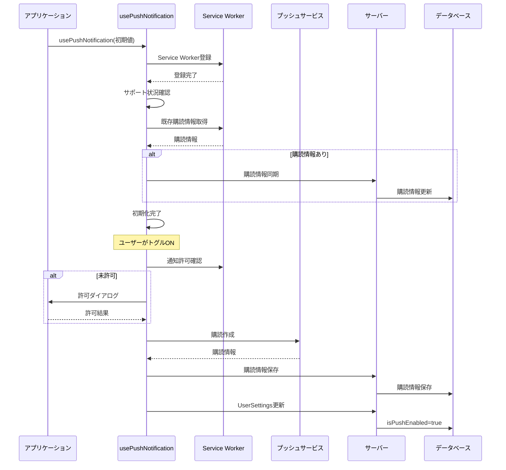
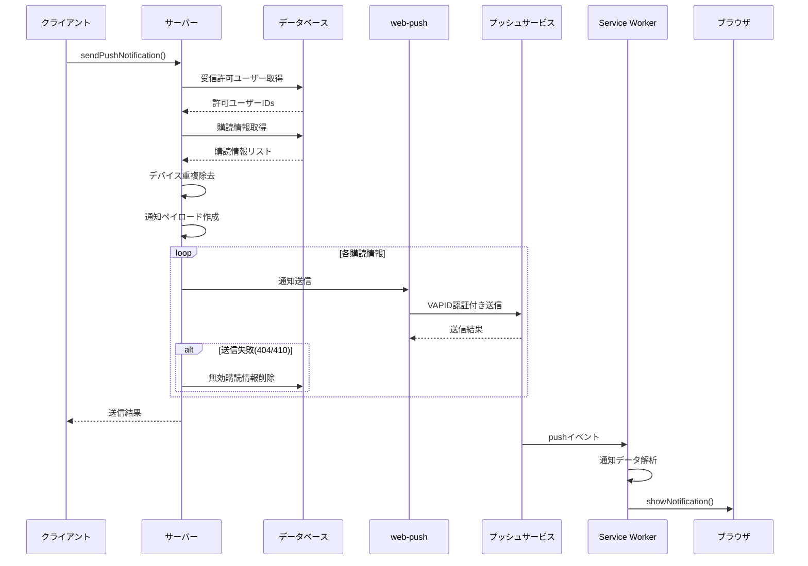
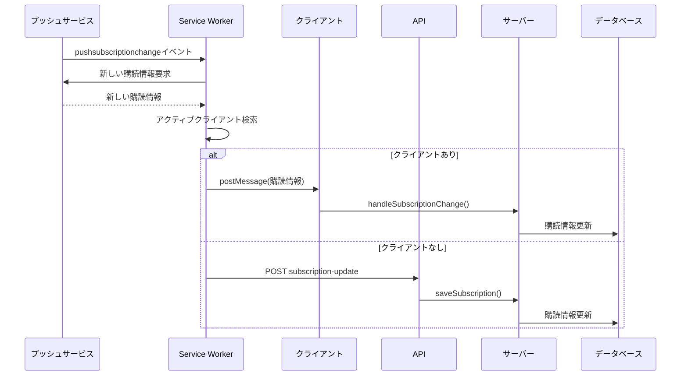

# プッシュ通知システム仕様書

## 概要

このドキュメントでは、アプリケーションのプッシュ通知システムの仕組みと実装について詳細に説明します。プッシュ通知は、Service
Worker APIとWeb Push APIを使用して実装されており、ユーザーがブラウザを閉じていても通知を受け取ることができます。

## 目次

1. [システム構成](#システム構成)
2. [データモデル](#データモデル)
3. [実装フロー](#実装フロー)
4. [コンポーネント詳細](#コンポーネント詳細)
5. [API](#api)
6. [セキュリティ](#セキュリティ)
7. [エラーハンドリング](#エラーハンドリング)
8. [実装詳細](#実装詳細)
9. [処理フロー図](#処理フロー図)

## システム構成

プッシュ通知システムは以下のコンポーネントで構成されています：

- **クライアントサイド**

  - `usePushNotification` フック: プッシュ通知の購読管理（useReducerベース）
  - `WebPushNotificationToggle`: ユーザーが通知設定を変更するためのUI
  - `service-worker.js`: バックグラウンドでの通知受信と表示処理

- **サーバーサイド**

  - `actions/notification/push-notification.ts`: サーバーアクション（購読管理、通知送信）
  - `api/push-notification/subscription-update/route.ts`: Service Worker更新用API

- **データストア**
  - `PushSubscription` モデル: ユーザーごとの購読情報を保存
  - `UserSettings` モデル: プッシュ通知の有効/無効状態を管理

## データモデル

### PushSubscription

```prisma
model PushSubscription {
  id             String    @id @default(cuid())
  endpoint       String    @unique
  p256dh         String?
  auth           String?
  userId         String?
  expirationTime DateTime?
  deviceId       String?
  createdAt      DateTime  @default(now())
  updatedAt      DateTime  @updatedAt

  user           User?     @relation(fields: [userId], references: [id], onDelete: SetNull)

  @@index([userId])
  @@index([deviceId])
}
```

### UserSettings

```prisma
model UserSettings {
  id              String  @id @default(cuid())
  userId          String  @unique
  isPushEnabled   Boolean @default(false)
  isEmailEnabled  Boolean @default(false)
  // ... その他の設定
}
```

## 実装フロー

### 1. 初期化プロセス

1. アプリケーション起動時、`usePushNotification`フックが初期化される
2. ブラウザがプッシュ通知をサポートしているか確認
3. Service Workerを登録し、既存の購読情報を確認
4. 購読情報とDBの状態を同期

### 2. 購読プロセス（トグルON）

1. ユーザーが通知トグルをONにする
2. ブラウザの通知許可ダイアログを表示（未許可の場合）
3. 許可された場合、VAPIDキーを使用してプッシュサーバーに購読
4. 購読情報を取得し、サーバーのデータベースに保存
5. `UserSettings`の`isPushEnabled`をtrueに更新

### 3. 購読解除プロセス（トグルOFF）

1. ユーザーが通知トグルをOFFにする
2. サーバーから購読情報を削除
3. プッシュサービスから購読を解除
4. `UserSettings`の`isPushEnabled`をfalseに更新

### 4. 通知送信プロセス

1. `sendPushNotification`サーバーアクションを呼び出し
2. 通知設定が有効なユーザーをフィルタリング
3. 対象ユーザーの購読情報を取得
4. デバイス重複を除去（最新の購読情報のみ使用）
5. 通知ペイロードを作成
6. web-pushライブラリを使用して各エンドポイントに通知を送信
7. 送信結果を集計して返却

### 5. 通知受信プロセス

1. Service Workerが`push`イベントを受信
2. 通知データをパースし、デフォルト値を設定
3. 通知の長さを制限（タイトル20文字、本文40文字）
4. `showNotification`を呼び出して通知を表示
5. ユーザーが通知をクリックすると、関連するURLを開く

### 6. 購読情報の更新プロセス

1. プッシュサービスによる購読情報の変更を検知
2. Service Workerの`pushsubscriptionchange`イベントが発火
3. 新しい購読情報を取得
4. アクティブなクライアントがある場合はメッセージングで更新
5. クライアントがない場合はAPIを通じて更新

## コンポーネント詳細

### usePushNotification.ts

```typescript
export function usePushNotification(initialIsPushEnabled: boolean): PushNotificationHookReturnType {
  // useReducerによるステート管理
  const [notificationState, dispatch] = useReducer(notificationReducer, {
    isInitialized: false,
    isSupported: false,
    permissionState: "default",
    registrationState: null,
    subscriptionState: null,
    recordId: null,
    deviceId: null,
    errorMessage: null,
    isEnabled: initialIsPushEnabled,
  });

  // 戻り値の型
  return {
    isSupported: boolean;
    isInitialized: boolean;
    isEnabled: boolean;
    isToggleUpdating: boolean;
    errorMessage: string | null;
    permissionState: NotificationPermission;
    togglePushNotification: (newPushEnabledState: boolean) => void;
  };
}
```

このフックは以下の機能を提供します：

- **ステート管理**: useReducerによる一元化された状態管理
- **初期化処理**: Service Workerの登録と購読情報の同期
- **トグル機能**: 通知の有効/無効を切り替え
- **エラーハンドリング**: 各種エラー状態の管理
- **デバイス識別**: ユーザーエージェント情報を基にしたデバイスID生成

### WebPushNotificationToggle.tsx

```typescript
export const WebPushNotificationToggle = memo(function PushNotificationToggle({
  isPushEnabled,
  isLoading,
}: {
  isPushEnabled: boolean;
  isLoading: boolean;
}) {
  const {
    isSupported,
    isInitialized,
    isEnabled,
    isToggleUpdating,
    errorMessage,
    permissionState,
    togglePushNotification,
  } = usePushNotification(isPushEnabled);

  // UI rendering logic
});
```

このコンポーネントは以下の機能を提供します：

- **状態表示**: 通知の有効/無効状態を表示
- **トグル操作**: ユーザーが通知設定を変更
- **エラー表示**: エラー状態の視覚的フィードバック
- **権限ガイダンス**: ブラウザ権限の状態に応じた案内

### service-worker.js

Service Workerは以下のイベントを処理します：

1. **install**: Service Workerのインストール処理
2. **activate**: Service Workerのアクティベーション処理
3. **push**: プッシュ通知の受信処理
4. **notificationclick**: 通知クリック時の処理
5. **pushsubscriptionchange**: 購読情報変更時の処理

```javascript
// プッシュ通知受信時の処理
self.addEventListener("push", (event) => {
  const defaultData = {
    title: "新しい通知",
    body: "メッセージが届きました。",
    icon: "favicon.svg",
    badge: "favicon.svg",
    data: { url: "/" },
  };

  let notificationData = { ...defaultData };

  if (event.data) {
    try {
      const payload = event.data.json();
      notificationData = {
        ...defaultData,
        title: payload.title || defaultData.title,
        body: payload.body || defaultData.body,
        icon: payload.icon || defaultData.icon,
        badge: payload.badge || defaultData.badge,
        data: {
          url: payload.data?.url || defaultData.data.url,
        },
      };
    } catch (e) {
      console.error("Push data parsing error:", e);
    }
  }

  // 文字数制限
  notificationData.title =
    notificationData.title.length > 20 ? `${notificationData.title.substring(0, 20)}...` : notificationData.title;
  notificationData.body =
    notificationData.body.length > 40 ? `${notificationData.body.substring(0, 40)}...` : notificationData.body;

  const options = {
    body: notificationData.body,
    icon: notificationData.icon,
    badge: notificationData.badge,
    data: notificationData.data,
    actions: [
      { action: "open_url", title: "開く" },
      { action: "dismiss", title: "閉じる" },
    ],
  };

  event.waitUntil(self.registration.showNotification(notificationData.title, options));
});
```

## API

### actions/notification/push-notification.ts

このファイルには以下のサーバーアクションが含まれます：

#### sendPushNotification

```typescript
export async function sendPushNotification(params: NotificationParams): PromiseResult<PushNotificationResult> {
  // 1. プッシュ通知設定の確認
  const isPushNotificationEnabled = await prisma.userSettings.findMany({
    where: { userId: { in: params.recipientUserIds } },
    select: { isPushEnabled: true, userId: true },
  });

  // 2. 受信許可ユーザーのフィルタリング
  const recipientUserIds = isPushNotificationEnabled
    .filter((user) => user.isPushEnabled === true)
    .map((user) => user.userId);

  // 3. VAPID設定
  webPush.setVapidDetails(vapidSubject, vapidPublicKey, vapidPrivateKey);

  // 4. 購読情報の取得
  const targetSubscriptions = await prisma.pushSubscription.findMany({
    where: {
      userId: { in: recipientUserIds },
      p256dh: { not: null },
      auth: { not: null },
    },
  });

  // 5. デバイス重複の除去
  const deviceGroups = new Map<string, typeof targetSubscriptions>();
  targetSubscriptions.forEach((subscription) => {
    if (!deviceGroups.has(subscription.deviceId)) {
      deviceGroups.set(subscription.deviceId, []);
    }
    deviceGroups.get(subscription.deviceId)!.push(subscription);
  });

  // 6. 各デバイスの最新購読情報のみを使用
  const noDuplicationTargetSubscriptions = [];
  for (const deviceSubscriptions of deviceGroups.values()) {
    const sortedSubscriptions = deviceSubscriptions.sort(
      (a, b) => new Date(b.updatedAt).getTime() - new Date(a.updatedAt).getTime(),
    );
    noDuplicationTargetSubscriptions.push(sortedSubscriptions[0]);
  }

  // 7. 通知送信
  const results = await Promise.allSettled(
    noDuplicationTargetSubscriptions.map(async (subscription) => {
      const webPushSubscription = {
        endpoint: subscription.endpoint,
        keys: {
          p256dh: subscription.p256dh,
          auth: subscription.auth,
        },
      };

      try {
        await webPush.sendNotification(webPushSubscription, payload);
        return { success: true, endpoint: subscription.endpoint };
      } catch (error) {
        // 404/410エラーの場合は購読情報を削除
        if (error.statusCode === 404 || error.statusCode === 410) {
          await deleteSubscription(subscription.endpoint);
        }
        return { success: false, endpoint: subscription.endpoint, error };
      }
    }),
  );

  // 8. 結果の集計
  const successCount = results.filter((r) => r.status === "fulfilled" && r.value.success).length;
  const failedCount = results.length - successCount;

  return {
    success: successCount > 0,
    data: {
      sent: successCount,
      failed: failedCount,
      totalTargets: targetSubscriptions.length,
    },
    message: "通知の送信に成功しました",
  };
}
```

#### saveSubscription

```typescript
export async function saveSubscription(subscription: SaveSubscriptionParams): PromiseResult<PushSubscription> {
  const session = await getAuthSession();
  const userId = session?.user?.id;

  // レコードIDの確認
  if (!subscription.recordId) {
    const recordId = await getRecordId(subscription.endpoint);
    subscription.recordId = recordId.success ? recordId.data : "00000000000000000000000000000000";
  }

  // 有効期限の変換
  const expirationTimeDate =
    typeof subscription.expirationTime === "number" ? new Date(subscription.expirationTime) : null;

  // 新規作成または更新
  const isDummy = subscription.recordId === "00000000000000000000000000000000";
  const result = isDummy
    ? await prisma.pushSubscription.create({
        data: {
          userId,
          endpoint: subscription.endpoint,
          p256dh: subscription.keys.p256dh,
          auth: subscription.keys.auth,
          expirationTime: expirationTimeDate,
          deviceId: subscription.deviceId,
        },
      })
    : await prisma.pushSubscription.update({
        where: { id: subscription.recordId },
        data: {
          endpoint: subscription.endpoint,
          p256dh: subscription.keys.p256dh,
          auth: subscription.keys.auth,
          expirationTime: expirationTimeDate,
          userId,
          deviceId: subscription.deviceId,
        },
      });

  return {
    success: true,
    data: result,
    message: "購読情報を保存しました",
  };
}
```

### api/push-notification/subscription-update/route.ts

```typescript
export async function POST(req: NextRequest) {
  const session = await getAuthSession();
  const body = (await req.json()) as SubscriptionUpdateRequest;
  const { oldEndpoint, newSubscription } = body;

  if (!session?.user?.id) {
    return NextResponse.json({ error: "Unauthorized" }, { status: 401 });
  }

  // 古い購読情報のレコードIDを取得
  let recordId: string | null = null;
  if (oldEndpoint) {
    const result = await getRecordId(oldEndpoint);
    recordId = result.success ? result.data : null;
  }

  if (!recordId) {
    return NextResponse.json({ error: "Old subscription not found" }, { status: 400 });
  }

  // 新しい購読情報を保存
  const result = await saveSubscription({
    endpoint: newSubscription.endpoint,
    expirationTime: newSubscription.expirationTime,
    keys: {
      p256dh: newSubscription.keys.p256dh,
      auth: newSubscription.keys.auth,
    },
    recordId,
  });

  return NextResponse.json({
    success: true,
    message: "購読情報が更新されました",
    subscription: result.data,
  });
}
```

## セキュリティ

1. **VAPID認証**: Web Push プロトコルではVAPID（Voluntary Application Server Identification）キーを使用して送信者を認証
2. **エンドポイント固有**: 各購読は一意のエンドポイントを持ち、他のユーザーが使用できない
3. **暗号化**: プッシュ通知のペイロードは、ユーザーごとの公開鍵（p256dh）で暗号化
4. **認証**: ユーザーIDと購読情報を紐付け、認証されたユーザーのみが操作可能
5. **デバイス識別**: 重複した購読を防ぐためのデバイスID管理

## エラーハンドリング

1. **購読失敗**: ブラウザの通知許可が拒否された場合やVAPID鍵が不正な場合の処理
2. **送信失敗**: エンドポイントが無効になった場合の処理（自動削除）
3. **権限変更**: ブラウザの通知権限が変更された場合の自動同期
4. **再購読処理**: `pushsubscriptionchange`イベントによる自動再購読
5. **UI フィードバック**: エラー状態の視覚的表示とユーザーガイダンス

## 実装詳細

### VAPID認証

VAPID（Voluntary Application Server
Identification）は、プッシュサービスがアプリケーションサーバーを識別するための仕組みです。

```javascript
// VAPID公開鍵をURLBase64からUint8Arrayに変換
const padding = "=".repeat((4 - (vapidPublicKey.length % 4)) % 4);
const base64 = (vapidPublicKey + padding).replace(/-/g, "+").replace(/_/g, "/");
const rawData = window.atob(base64);
const outputArray = new Uint8Array(rawData.length);

for (let i = 0; i < rawData.length; ++i) {
  outputArray[i] = rawData.charCodeAt(i);
}
```

### デバイス識別

ユーザーエージェント情報を基にしたデバイスIDの生成：

```typescript
export function getDeviceId(userId: string): string {
  const deviceInfo = {
    userAgent: navigator.userAgent,
  };

  // userAgentDataのサポート確認
  if ("userAgentData" in navigator && navigator.userAgentData) {
    const uaData = navigator.userAgentData;
    deviceInfo.brands = uaData.brands ?? [];
    deviceInfo.platform = uaData.platform ?? "";
    deviceInfo.mobile = !!uaData.mobile;
  } else {
    // フォールバック処理
    const isMobile = /Android|webOS|iPhone|iPad|iPod|BlackBerry|IEMobile|Opera Mini/i.test(navigator.userAgent);
    deviceInfo.brands = [{ brand: "unknown", version: "0" }];
    deviceInfo.platform = /* platform detection logic */;
    deviceInfo.mobile = isMobile;
  }

  return `${deviceInfo.platform}-${deviceInfo.mobile ? "mobile" : "desktop"}-${deviceInfo.brands?.map(b => b.brand).join("-") || "unknown"}-${userId}`;
}
```

### ステート管理

useReducerを使用したステート管理により、競合状態を防止：

```typescript
export function notificationReducer(state: PushNotificationState, action: NotificationAction): PushNotificationState {
  switch (action.type) {
    case "SET_SUPPORT_STATUS":
      return {
        ...state,
        isSupported: action.payload.isSupported,
        permissionState: action.payload.permissionState,
      };
    case "SET_INITIALIZATION_COMPLETE":
      return {
        ...state,
        isInitialized: true,
        deviceId: action.payload.deviceId,
        registrationState: action.payload.registrationState,
        subscriptionState: action.payload.subscriptionState,
        recordId: action.payload.recordId,
        errorMessage: null,
      };
    // その他のケース...
  }
}
```

### 購読情報の同期

初期化時とService Worker通信による購読情報の同期：

```typescript
// 初期化時の同期
const existingSubscription = await registration.pushManager.getSubscription();
if (existingSubscription?.endpoint) {
  try {
    const result = await getRecordId(existingSubscription.endpoint);
    const subscriptionData = formatSubscriptionForServer(
      existingSubscription,
      result.data ?? undefined,
      currentDeviceId,
    );
    await saveSubscription(subscriptionData);
  } catch (syncError) {
    console.warn("購読情報の同期に失敗しました:", syncError);
  }
}

// Service Workerメッセージリスナー
const messageHandler = (event: MessageEvent) => {
  const data = event.data as unknown;
  if (data && typeof data === "object" && data !== null && "type" in data && "newSubscription" in data) {
    const eventData = data as { type: string; newSubscription: PushSubscription };
    if (eventData.type === "SUBSCRIPTION_CHANGED") {
      void handleSubscriptionChange(eventData.newSubscription);
    }
  }
};
```

## 処理フロー図

### 初期化と購読プロセス



### 通知送信プロセス



### 購読情報更新プロセス



## 使用例

### 通知の送信

```typescript
// タスク完了通知の送信
await sendPushNotification({
  title: "タスク完了",
  message: `「${taskName}」が完了しました`,
  actionUrl: `/tasks/${taskId}`,
  recipientUserIds: [userId],
});
```

### 購読状態の確認

```typescript
const { isSupported, isInitialized, isEnabled, permissionState } = usePushNotification(initialEnabled);

if (isSupported && isInitialized && isEnabled && permissionState === "granted") {
  // プッシュ通知が有効
} else {
  // プッシュ通知が無効または未対応
}
```

### エラーハンドリング

```typescript
const { errorMessage, permissionState } = usePushNotification(initialEnabled);

if (errorMessage) {
  // エラー表示
  console.error("プッシュ通知エラー:", errorMessage);
}

if (permissionState === "denied") {
  // 権限拒否時の処理
  showPermissionGuide();
}
```

## 設定とデプロイ

### 環境変数

```env
NEXT_PUBLIC_VAPID_PUBLIC_KEY=your_vapid_public_key
VAPID_PRIVATE_KEY=your_vapid_private_key
VAPID_SUBJECT=mailto:your-email@example.com
```

### Service Worker

`public/service-worker.js`を適切に配置し、アプリケーションから登録。

### データベース

PrismaスキーマでPushSubscriptionとUserSettingsモデルを定義し、適切なインデックスを設定。

この仕様書は、現在の実装状況を正確に反映しており、開発者が理解しやすい形で整理されています。
