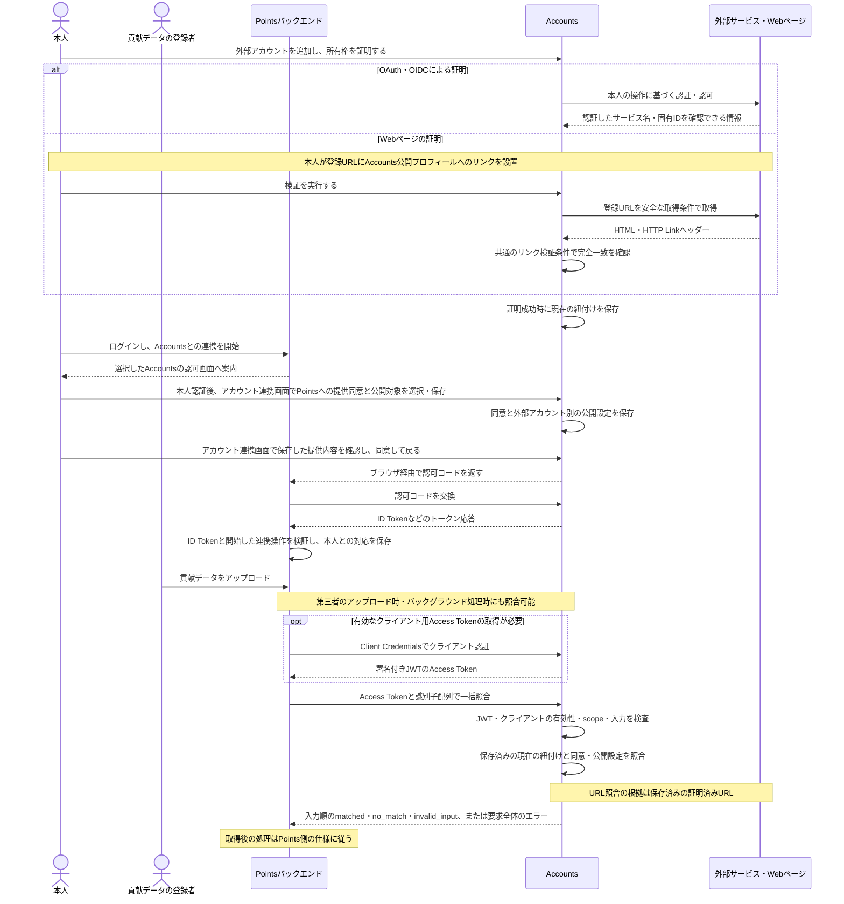
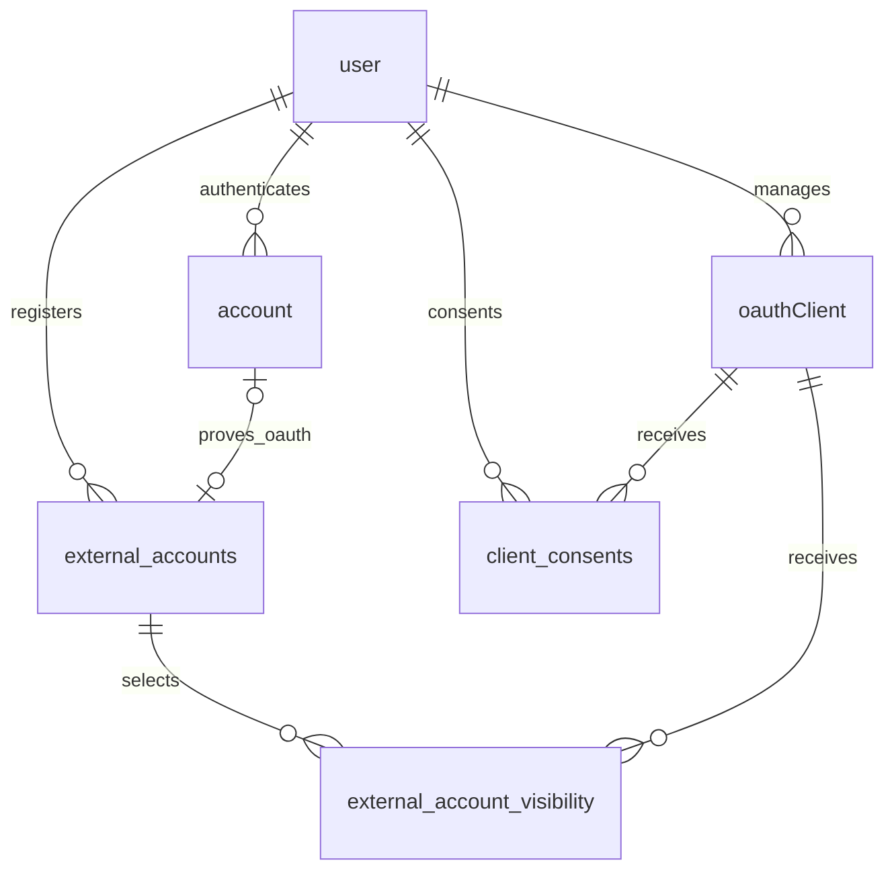

# アカウント統合サービス v0.1

- [アカウント統合サービス v0.1](#アカウント統合サービス-v01)
  - [説明](#説明)
  - [存在意義・独立したサービスにする理由](#存在意義独立したサービスにする理由)
  - [責務](#責務)
  - [Pointsなどの連携サービスとの境界](#pointsなどの連携サービスとの境界)
  - [利用開始の流れ](#利用開始の流れ)
  - [v0.1で実装する機能](#v01で実装する機能)
  - [Accountsプロフィール](#accountsプロフィール)
  - [登録とログイン](#登録とログイン)
  - [所有権と紐付け](#所有権と紐付け)
  - [OAuthクライアント管理](#oauthクライアント管理)
  - [公開設定](#公開設定)
  - [Accounts API](#accounts-api)
    - [提供する機能](#提供する機能)
    - [入力ごとの照合手順](#入力ごとの照合手順)
    - [クライアント認証と権限](#クライアント認証と権限)
    - [APIの具体案](#apiの具体案)
    - [貢献者照合の流れ](#貢献者照合の流れ)
  - [外部識別情報の仕様](#外部識別情報の仕様)
    - [照合する識別子](#照合する識別子)
    - [URL正規化](#url正規化)
    - [外部認証情報](#外部認証情報)
  - [Webページの検証仕様](#webページの検証仕様)
    - [証明に使用するリンク](#証明に使用するリンク)
    - [外部ページの取得](#外部ページの取得)
    - [検証要求の制御](#検証要求の制御)
  - [操作の認可](#操作の認可)
  - [Accountsユーザーの退会](#accountsユーザーの退会)
  - [管理画面と監査](#管理画面と監査)
    - [表示・提供する情報](#表示提供する情報)
  - [JSONによるバックアップと移行](#jsonによるバックアップと移行)
    - [JSON形式](#json形式)
  - [受け入れ条件](#受け入れ条件)
  - [テーブル構造の設計案](#テーブル構造の設計案)
    - [共通の保存形式](#共通の保存形式)
    - [認証ライブラリとの分担](#認証ライブラリとの分担)
    - [外部認証と登録確認の接続](#外部認証と登録確認の接続)
    - [外部アカウントと公開設定](#外部アカウントと公開設定)
    - [検証操作の保存](#検証操作の保存)
    - [読み取りと更新の単位](#読み取りと更新の単位)
    - [物理設計で確認する事項](#物理設計で確認する事項)
  - [未決事項](#未決事項)
  - [文書化要件](#文書化要件)
  - [提供・技術要件](#提供技術要件)

## 説明

- あらゆるアカウントのIDを統合して管理できるサービス
- v0.1は個人名義のAccountsユーザーを対象とする
- v0.1の機能・画面要件は確定し、[テーブル構造の設計案](#テーブル構造の設計案)を具体化する段階とする。設計中に確認が必要になった事項は[未決事項](#未決事項)へ記載する

## 存在意義・独立したサービスにする理由

1. 無料主義の貢献度アップロードのアカウント管理を簡単にする
   - サービスの実装側・利用側の両方で、利用を簡単にしたい
2. アカウント統合の処理はとても複雑なので、責務の分離の為に切り出す
3. 他の無料主義サービスが、同じ内容を実装する必要がない状態にしたい
4. ポイント管理サービス以外からでも使用できると思う
5. 利用側サービスが、自分の接続先としてAccounts互換サービスを選択できるようにする

## 責務

Accountsは、Accountsユーザーと外部アカウントの登録・所有権証明・現在の紐付け・公開設定を管理し、許可された情報と照合結果をAPIで提供する。利用側サービス固有の処理は、次の責務分担に従う。

| 対象 | 正本・責務 |
| --- | --- |
| 外部アカウントの識別・証明・提供許可 | 本仕様で定めるAccountsの責務 |
| Pointsユーザーとの連携件数・開始・変更・解除・退会時の対応 | [Pointsのアカウント設定](../../../../points-web-app/docs/v0.2/details-ja/profile-setting.md#3-accountsとの情報連携) |
| 貢献データ・FIX・受領・ポイント台帳と残高・パッケージ・経済履歴と公開設定・Marketsへの経済情報API | [Pointsの責務と帰属ルール](../../../../points-web-app/docs/v0.2/details-ja/unclaimed-fix-and-ownership.md) |

## Pointsなどの連携サービスとの境界

- Accountsと利用側サービスは、サブドメインや運営者にかかわらず、ユーザー・ログイン手段・セッションを独立して管理する
- 利用側サービスは独立したOAuthクライアントとして、Accountsで認証した本人から外部アカウント情報の提供と照合の権限を受ける。初回連携の本人確認は[クライアント認証と権限](#クライアント認証と権限)に従う
- Accountsユーザーは、提供元Accountsサービスのoriginと固定AccountsユーザーIDの組み合わせで識別する。異なる提供元の同じID文字列も区別する
- 利用側サービス内のユーザー対応と、Accountsに保存する情報提供同意・公開設定は独立して管理する。利用側での連携解除や退会後も、Accountsは本人がAccountsで変更するまで同意・公開設定を維持する
- Accounts APIは、照会時点の紐付けと提供許可に従って情報を返す。取得済み情報の保存・履歴・許可取消後の公開表示は利用側サービスが管理する
- Accountsユーザーの退会による情報提供終了は[Accountsユーザーの退会](#accountsユーザーの退会)に従う。Points側の対応は[Pointsの連携解除と退会](../../../../points-web-app/docs/v0.2/details-ja/profile-setting.md#34-連携解除と退会)に従う
- Pointsへの提供同意の利用目的と一般公開設定との関係は[公開設定](#公開設定)、提供する項目は[表示・提供する情報](#表示提供する情報)に従う

## 利用開始の流れ

- Accountsで登録・外部アカウントの連携を済ませてから利用側サービスへ連携する入口と、利用側サービスからAccountsへの連携を開始する入口を用意する
- Accountsでは、本人認証、必要な場合の新規登録、外部アカウントの連携・証明、提供対象と利用目的の確認・同意までを完了できる
- 利用側サービスから開始した連携では、[管理画面と監査](#管理画面と監査)の「アカウント連携」画面で公開設定の保存と同意を行う
- Accountsでの認証・同意後は、登録済みのリダイレクトURLを使って利用側サービスへ戻る

Pointsの接続先選択、画面文言、ユーザー連携の追加・変更、既存Points利用者の切り替え手順は、[Pointsの利用開始と連携先ユーザーの変更](../../../../points-web-app/docs/v0.2/details-ja/profile-setting.md#33-利用開始と連携先ユーザーの変更)を参照する。

## v0.1で実装する機能

| 機能 | 仕様 |
| --- | --- |
| プロフィール・公開ページ | [Accountsプロフィール](#accountsプロフィール) |
| 登録・ログイン・退会 | [登録とログイン](#登録とログイン)、[Accountsユーザーの退会](#accountsユーザーの退会) |
| 外部アカウントの連携・所有権証明 | [所有権と紐付け](#所有権と紐付け)、[Webページの検証仕様](#webページの検証仕様) |
| OAuthクライアントの登録・管理 | [OAuthクライアント管理](#oauthクライアント管理) |
| 一般公開・クライアントへの情報提供 | [公開設定](#公開設定)、[管理画面と監査](#管理画面と監査) |
| 連携アカウント一覧・ユーザー照合 | [Accounts API](#accounts-api) |
| 他サービスへの移行・本人向け復元 | [JSONによるバックアップと移行](#jsonによるバックアップと移行) |

## Accountsプロフィール

- プロフィール項目は、表示名・AccountsユーザーIDとする
- ユーザーは、自分のAccountsプロフィールの表示名を設定できる
- Accountsの表示名は最大50文字とする
- 表示名はほかのAccountsユーザーと重複して設定できる。ユーザーの識別には固定のAccountsユーザーIDを使う
- Accountsと外部アカウントのプロフィールで扱う情報は、表示名や識別情報などのテキスト情報とする
- `accounts.freeism.app`内のユーザーIDを、公開された固定IDとして表示する
- 誰でも閲覧できる公開プロフィールページを設ける
- 公開プロフィールURLは、`https://accounts.freeism.app/profiles/{accountsUserId}`とする
- 公開プロフィールは、GitHubなどの外部アカウントとAccountsユーザーIDの対応を表示することを主な用途とする

## 登録とログイン

- v0.1では、Google・GitHub・ORCIDのOAuth・OIDC認証を登録・ログイン手段にする
- ログアウト状態で、Accountsユーザーに紐付いていないGoogle・GitHub・ORCIDアカウントを認証した場合は、新規登録の確認画面を表示する
- 確認画面でAccountsの表示名を設定し、「新規登録」を実行すると、Accountsユーザーを作成して認証済みの外部アカウントを紐付ける
- 新規登録の確認待ちは、Accountsのバックエンドが外部サービスの認証結果を確認した時点から30分間有効とする。バックエンドは登録確定時に有効期限を検査し、期限切れの場合は外部サービスでの認証からやり直すよう案内する
- 確認画面には、既存のログイン手段でAccountsへログインし、「アカウント連携」画面から外部アカウントを追加連携する導線も設ける
- 紐付け済みのGoogle・GitHub・ORCIDアカウントでAccountsへログインできる
- 後から追加したGoogle・GitHub・ORCIDアカウントでも、紐付け先のAccountsユーザーへログインできる
- ログイン状態は、本人がAccountsを最後に利用した時点から7日間保持する。利用のたびに保持期限を更新し、7日間利用がなければ再ログインを求める
- ログイン状態の保持期限を更新する利用は、本人のAccountsセッションによる利用とする。OAuthクライアントによる一覧取得・照合は、クライアント用Access Tokenの有効期間で管理する
- 「アカウント連携」画面では、各AccountsユーザーにGoogle・GitHub・ORCIDアカウントを合計で最低1件残し、最後のログイン手段の連携解除を許可しない
- ほかのログイン可能な外部アカウントが残っていれば、対象サービスの最後のアカウントを解除できる
- v0.1から、本人が設定画面で[Accountsユーザーの退会](#accountsユーザーの退会)を実行できる

## 所有権と紐付け

- 1つのAccountsユーザーへ、Google・GitHub・ORCIDそれぞれ複数の外部アカウントを紐付けられる
- Google・GitHub・ORCIDの連携アカウント数に上限を設けない
- OAuthアカウントと正規化したWeb URLの有効な紐付け先は、同時点で最大1人のAccountsユーザーとする。同じ外部アカウントへの連携処理が競合した場合も、この一意性を維持する
- 紐付け先のない外部アカウントは、所有権の証明が成功した時点で、そのAccountsユーザーへ即時に紐付ける
- OAuthで証明する外部アカウントが別のAccountsユーザーに紐付け済みの場合は、元のAccountsユーザーでの連携解除が必要であることを案内する
- OAuthアカウントの紐付け先を変更する場合は、元のAccountsユーザーで連携を解除した後、移動先のAccountsユーザーで所有権を改めて証明して連携する

1. OAuthによる所有権証明
   - 対応するログインProviderで本人を認証し、検証済みの外部サービス名と固有IDをAccountsユーザーへ紐付ける
   - ログインに使用したアカウントに加えて、同じサービスの別アカウントも、「アカウント連携」画面から明示的に連携できる
   - 所有権証明には必要最小限の権限を要求し、同一アカウントの判定には外部サービス名と固有IDの組み合わせを使用する
   - 本人向け・一般公開・OAuthクライアント向けの項目は、[表示・提供する情報](#表示提供する情報)に従う
2. Webページのリンクによる所有権証明
   - 登録・検証・紐付け先の更新は、[Webページの検証仕様](#webページの検証仕様)に従う

## OAuthクライアント管理

- v0.1の連携対象は、Pointsのようなバックエンドを持つWebサービスとする
- 利用側で接続設定した複数のAccounts互換サービスから選べるよう、OAuth Providerとして連携する
- v0.1から、外部サービスの開発者がAccountsの画面で自分のアプリをOAuthクライアントとして登録できる
- OAuthクライアントの登録では、アプリ名とリダイレクトURLを必須入力とし、サービスの紹介URLと説明文は任意入力とする。リダイレクトURLは、Accountsでの認証・同意後に利用者を戻す先として登録する
- クライアント設定は、[GoogleのWebアプリ向けOAuth設定](https://developers.google.com/identity/protocols/oauth2/web-server#creatingcred)と[同意画面の設定](https://developers.google.com/identity/gsi/web/guides/get-google-api-clientid#configure_your_oauth_consent_screen)を参考にする。アプリ名・紹介URL・説明文をアプリ情報、リダイレクトURL・Client ID・Client Secretを接続情報として整理し、入力項目と提供機能は本仕様で定めた内容とする
- 1つのOAuthクライアントへ、リダイレクトURLを1件以上、複数登録できる。認可要求ごとに戻り先の`redirect_uri`を1つ指定し、Accountsのバックエンドは、その値が登録済みURLのいずれかと文字列で完全一致することを確認する
- OAuthのリダイレクトURLはHTTPSを基本とし、ホストが`localhost`またはループバックIPアドレスの場合は、ローカル開発用としてHTTPも許可する。ローカルのURLも、ポートとパスを含む登録済みURLとの完全一致を確認する
- 登録画面とAccountsのバックエンドで必須項目を検査し、紹介URL・説明文が未入力でも、ほかの登録条件を満たせば登録できる
- 登録したアプリにはClient IDとClient Secretを発行する
- 登録したアプリは、登録者のAccountsユーザーが管理し、アプリ設定の変更とアプリ自体の削除を行える
- Client Secretは、新規発行・再発行の結果としてアプリ管理者へ一度表示し、保存できるようにする。紛失した場合は新しいClient Secretを再発行する
- Client Secretの再発行が成立した時点で古いSecretを無効にし、それ以後のクライアント認証には新しいSecretを使用する
- Client Secretの再発行と同時に、対象クライアントへAccountsが発行済みのAccess Token・Refresh Tokenもすべて失効させる。クライアント用Access Tokenは新しいSecretで再取得し、ユーザー用トークンは必要に応じて認可フローをやり直して取得する

## 公開設定

- Accounts APIを通じて提供する外部アカウントの公開範囲は、OAuthクライアントごとに管理する
- AccountsユーザーとOAuthクライアントの組み合わせごとの情報提供同意と、外部アカウントとOAuthクライアントの組み合わせごとの公開設定を、それぞれ保持する
- OAuthクライアントへ外部アカウント情報を提供する条件は、そのクライアントへの情報提供同意が有効で、対象の外部アカウントが本人に証明済みとして紐付き、そのクライアントへの公開が選択されていることとする
- OAuthクライアントへの情報提供同意だけをOFFにして保存した場合は、外部アカウントの公開選択を保持し、そのクライアントへの当該ユーザーの情報提供を停止する
- 再び同意をONにして保存した場合は、その時点で本人に証明済みとして紐付いている外部アカウントについて、保持していた選択に従って情報提供を再開する
- 公開先は、一般公開と各OAuthクライアントをそれぞれ独立して設定する
- 公開対象の選択単位は外部アカウントとし、そのアカウントについてあらかじめ定めた表示名・識別情報などの項目をまとめて提供する
- 一般公開する連携アカウントも、OAuthクライアントへの公開と同様に、ユーザーが明示的に選択する
- Google・GitHub・ORCIDのOAuth・OIDC認証と、Webページのリンク検証のいずれで証明した外部アカウントにも、同じ公開範囲の制御を適用する
- Webページのリンクによる所有権証明と、証明済みWebプロフィールを各OAuthクライアントへ提供する許可は、独立して管理する
- Web上で公開されている証明用リンク自体の閲覧範囲は、Accounts APIの閲覧権限とは別に扱う
- OAuthクライアントへ初めて権限を付与するときは、すべての外部アカウントを非公開にする
- ユーザーが「アカウント連携」画面で選択した外部アカウントだけを、そのOAuthクライアントへ公開する
- Pointsへの提供同意には、Points上での公開表示全般と貢献者照合を含める。「アカウント連携」画面で、連携先が公開表示を行うことと情報の利用目的を示す
- Pointsで表示できる外部アカウントはPointsへの提供許可に従い、Accounts自身の一般公開プロフィールへの掲載設定とは独立する
- 後から追加した外部アカウントは、ユーザーが明示的に公開するまで既存のOAuthクライアントへ公開しない
- ユーザーは、OAuthクライアントに対する外部アカウントの公開を後から解除できる

## Accounts API

### 提供する機能

| 機能 | 入力 | 出力・用途 |
| --- | --- | --- |
| 連携アカウント一覧の取得 | AccountsユーザーID | 問い合わせ元へ提供を許可した連携アカウントを全件返す。同じサービスの複数アカウントも個別に返す |
| 識別情報からユーザーを照合 | プロフィールURL、外部サービス名と固有ID、またはAccountsユーザーID | 入力ごとの条件と提供許可を満たすAccountsユーザーIDを最大1件返す |

一覧取得・照合は、本人の操作中以外にも、許可済みクライアントの処理から利用できる。取得対象には[公開設定](#公開設定)、要求の認証には[クライアント認証と権限](#クライアント認証と権限)を適用し、入出力は[APIの具体案](#apiの具体案)に従う。

### 入力ごとの照合手順

外部アカウントの照合方法は入力の種類によって決まる。Google・GitHub・ORCIDを含め、サービス名やURLのホストにかかわらず、同じ手順を適用する。

| 入力 | 照合方法 |
| --- | --- |
| URL | 入力URLを正規化し、保存済みの証明済みURLとの完全一致で現在の紐付けを検索する |
| 外部サービス名と固有ID | 保存済みの証明済みアカウントを、外部サービス名と固有IDの組み合わせの完全一致で検索する |
| AccountsユーザーID | 問い合わせ先Accounts内の固定IDの存在と、そのユーザーから問い合わせ元への有効な情報提供同意を確認する |

URLと外部サービス名・固有IDの照合は、表の一致条件に加えて[公開設定](#公開設定)による問い合わせ元への現在の提供許可を確認する。両方を満たす場合は紐付くAccountsユーザーIDを返し、それ以外は該当なしとする。

外部ページの取得とリンク検証は、本人がURLを登録して所有権を証明する処理で行う。照合の判定に使う情報は、保存済みの正規化URL・現在の紐付け・現在の提供許可とする。

URLの登録・検証結果と、OAuthで証明したサービス名・固有IDは、それぞれの識別方法の根拠として管理する。

AccountsユーザーIDを直接指定した場合は、表の条件を満たせば指定IDを返し、それ以外は該当なしとする。

照合要求は現在の状態を読み取る操作とする。紐付けの追加・解除・移動は本人の管理操作で行い、変更が成立した時点で反映する。一覧取得は現在の紐付けと提供許可に従って返す。

### クライアント認証と権限

- 初回連携ではOIDCのAuthorization Codeフローを使い、`openid` scopeを要求する。利用側は、Accountsで認証して情報提供に同意した本人をID Tokenで確認し、連携開始時にログインしていた利用側ユーザーへ対応付ける
- ID Tokenの`sub`はAccountsユーザーの公開された固定IDとする。利用側は、接続先Accountsサービスに対応する発行元`iss`と`sub`を確認し、Accountsサービスの提供元とAccountsユーザーIDを保持する
- 利用側のバックエンドは、ID Tokenの署名・発行元・対象クライアント・有効期限と、連携開始時に生成した`nonce`との一致を、OIDCの検証規則に従って確認する。連携開始操作と戻り先の処理を対応付け、検証に成功した本人IDで連携を確定する
- 連携サービスのバックエンドは、Client ID・Client Secretを使い、OAuthの`client_credentials`でクライアント自身の期限付きAccess Tokenを取得する
- クライアント用Access Tokenは署名付きJWTとする
- 連携アカウントの一覧取得と外部識別子の照合APIは、このAccess Tokenを`Authorization: Bearer`で受け取り、クライアントを認証する
- 一覧取得と識別子の照合には、共通の読取scopeとして`identities:read`を設ける。このscopeを持つクライアント用JWTで両APIを利用できる
- 一覧取得と照合の継続利用では、利用側がクライアント単位のAccess Tokenを管理し、Accountsが各ユーザーの現在の提供許可を判定する
- クライアント用Access Tokenの有効期間は発行から15分とし、トークン応答の`expires_in`は900秒を返す
- Access Tokenの期限が切れた場合は、クライアント認証によって新しいAccess Tokenを取得する
- APIのバックエンドは、事前に信頼した検証鍵と許可した署名方式でJWTを検証し、発行元・対象API・期限・トークンの用途・クライアント主体・scopeを確認する。検証に失敗した要求は、紐付け・提供許可・失効状態のDB照合へ進む前に拒否する
- JWTの検証に成功した要求だけ、認証済みClient IDに対応するクライアントの有効性とトークンの失効状態をDBで確認する。Client Secretの再発行前に発行したJWTは、署名が正しく有効期限内でも拒否する
- 返す外部アカウントについて、DB上の現在の紐付けと、そのユーザーから認証済みClient IDへの提供許可を要求ごとに確認する

初回連携は[OIDC Authorization Codeフロー](https://openid.net/specs/openid-connect-core-1_0.html#CodeFlowAuth)と[ID Tokenの検証](https://openid.net/specs/openid-connect-core-1_0.html#IDTokenValidation)、一覧取得・照合APIの認証は[OAuth client credentials grant](https://www.rfc-editor.org/rfc/rfc6749#section-4.4)に従い、[Better Auth OAuth Provider](https://better-auth.com/docs/plugins/oauth-provider)の対応機能を使用する。

### APIの具体案

以下の一覧取得・一括照合の呼び出し先、応答形式、入力の検証条件を採用する。

| 操作 | HTTP | 内容 |
| --- | --- | --- |
| 一覧取得 | `GET /api/v1/external-accounts?accountsUserId={accountsUserId}` | 提供元、AccountsユーザーID、許可済みアカウントの全件一覧を返す |
| 照合 | `POST /api/v1/identities/resolve` | 種類を明示した識別子の配列を受け取り、入力ごとの照合結果を返す |

一覧取得では、対象ユーザーIDを必須のクエリパラメーター`accountsUserId`で指定する。クライアントの認証・権限を確認した後、対象ユーザーの存在と問い合わせ元への有効な情報提供同意を確認する。条件を満たす場合はHTTP 200を返し、対象ユーザーが存在しない場合と同意がない場合は、同じ内容のHTTP 404とする。

一括照合の成功応答は、提供元の`accountsOrigin`と、入力順に並べた照合結果の配列`results`を1つのJSONオブジェクトにまとめる。
各結果には、入力配列の0始まりの位置を表す`index`、その位置の元の入力を表す`identifier`、結果の状態を表す`status`を含める。`identifier`は正規化前の入力値とし、照合成立・該当なし・入力不正のいずれの結果にも含める。
各結果には`accountsUserId`と`errors`も常に含め、状態ごとに次の値を返す。

| `status` | 意味 | `accountsUserId` | `errors` |
| --- | --- | --- | --- |
| `matched` | 照合条件と提供許可を満たすユーザーが該当する | 該当するID | 空配列 |
| `no_match` | 入力は有効だが、条件を満たすユーザーが該当しない | `null` | 空配列 |
| `invalid_input` | 入力に不備がある | `null` | 確認できた不備の配列 |

以下は、要求全体の形式・認証・権限の条件を満たし、照合成立・該当なし・必須項目不足の3件の結果をHTTP 200で返す例とする。

```json
{
  "accountsOrigin": "https://accounts.freeism.app",
  "results": [
    {
      "index": 0,
      "identifier": {
        "type": "provider_account",
        "provider": "google",
        "accountId": "123456789"
      },
      "status": "matched",
      "accountsUserId": "sample-user",
      "errors": []
    },
    {
      "index": 1,
      "identifier": {
        "type": "url",
        "url": "https://example.org/unlinked/"
      },
      "status": "no_match",
      "accountsUserId": null,
      "errors": []
    },
    {
      "index": 2,
      "identifier": {
        "type": "provider_account",
        "provider": "google"
      },
      "status": "invalid_input",
      "accountsUserId": null,
      "errors": [
        {
          "code": "MISSING_REQUIRED_FIELD",
          "message": "accountId is required.",
          "path": ["identifiers", 2, "accountId"]
        }
      ]
    }
  ]
}
```

一覧取得の成功応答は、提供元の`accountsOrigin`、AccountsユーザーIDの`accountsUserId`、連携アカウントの配列`externalAccounts`を1つのJSONオブジェクトにまとめる。ユーザーと同意が有効で、提供対象が0件の場合は`externalAccounts`を空配列とする。以下は、問い合わせ元への提供を許可した証明済みのOAuthアカウントとWebページを返す例とする。

```json
{
  "accountsOrigin": "https://accounts.freeism.app",
  "accountsUserId": "sample-user",
  "externalAccounts": [
    {
      "type": "provider_account",
      "provider": "google",
      "accountId": "123456789",
      "displayName": "サンプル"
    },
    {
      "type": "url",
      "url": "https://example.org/about/",
      "verificationMethod": "bidirectional_link",
      "verifiedAt": "2026-09-01T00:00:00Z"
    }
  ]
}
```

照合入力の例。1件でも複数件でも同じ形式を用いる。

```json
{
  "identifiers": [
    { "type": "url", "url": "https://example.org/about/" },
    { "type": "provider_account", "provider": "google", "accountId": "123456789012345678901" },
    { "type": "accounts_user", "accountsUserId": "example-accounts-user" }
  ]
}
```

- 入力種別ごとの判定は、[入力ごとの照合手順](#入力ごとの照合手順)に従う
- 外部サービス名は`google`・`github`・`orcid`の固定値、固有IDは文字列で受け付ける
- 一括照合は、URL・外部サービス名と固有ID・AccountsユーザーIDを合わせて、入力配列の要素数で1要求あたり最大1,000件とする。上限を超える場合は、照合を開始する前に要求全体をエラーにする
- `identifiers`が空配列の場合は、要求の形式とクライアントの認証・権限を確認したうえで、HTTP 200で`accountsOrigin`と空の`results`配列を返す
- 一括照合の要求bodyはUTF-8のJSONとし、容量上限は5MiB（5,242,880 bytes）とする。bodyの読込時に上限を確認し、超過した場合は照合を開始する前に要求全体をエラーにする
- 一覧の各アカウント項目では、提供情報を項目の直下に置く。OAuth連携アカウントは`type: "provider_account"`と文字列の`provider`・`accountId`、文字列または`null`の`displayName`を返す。`displayName`は常に含め、表示名を取得できない場合は`null`で返す
- Webページの一覧項目は、`type: "url"`、確認済みURLの`url`、`verificationMethod: "bidirectional_link"`、検証成功日時の`verifiedAt`を返す。`url`は文字列、`verifiedAt`はUTCのRFC 3339形式とする
- 一括照合では、要求全体の形式とクライアント認証を確認した後、各入力を個別に検査・照合し、入力順に結果を返す。不正な入力には、検査で確認できた不備をその入力の`errors`配列へまとめ、各不備の位置と理由を返す。正しい入力の照合を継続する
- 要求全体の形式・認証・権限が正しく、各入力の検査・照合を完了した場合はHTTP 200を返す。一部の入力が不正な場合も、すべての入力が不正な場合も、各入力の結果と不備を`results`内で返す
- 照合APIの要求全体に、JSONの構文不正、必須項目の不足・型違い、未定義の最上位項目などの入力形式の不備がある場合は、HTTP 400と最上位の`errors`配列を返す。具体的な理由は各エラーの`code`・`message`・`path`で示す
- 照合APIのJSON入力で仕様にない項目名を受け取った場合は、入力エラーにする。要求の最上位の不明な項目は要求全体のエラーとし、個別の識別子内の不明な項目はその入力の`errors`へ含める
- `no_match`では未登録と問い合わせ元への非公開を同じ応答として扱い、入力ごとの不正によるエラーと区別する。要求全体の形式・認証・サーバー処理の失敗は、要求全体に対するエラー応答として扱う
- 一覧取得・照合APIの要求全体に対するエラーと、照合入力ごとの`errors`配列の各エラーには、機械判定用の`code`、英語の説明文`message`、入力位置を表す`path`を常に含める。利用側の画面では`code`に応じて日本語・英語などの表示を行う
- 一覧取得・照合APIの要求全体に対するエラー応答は、最上位の`errors`配列に各エラーを格納するJSONオブジェクトとする。エラーが1件の場合も配列で返し、複数の入力不備を確認できた場合はその配列へまとめる
- JSON入力の不備を示す各エラーには、要求bodyの最上位から対象項目までの位置を`path`配列で含める。オブジェクトの項目名は文字列、配列内の位置は0始まりの数値で表す。例えば、3件目の識別子の`provider`の不備は`["identifiers", 2, "provider"]`とする。要求全体のエラー内と個別の照合結果内で、同じ位置表現を使用する
- 認証失敗・サーバー障害など、特定のJSON入力項目を指せないエラーは`path: null`とする
- クライアントは接続設定で選択した提供元とともにAccountsユーザーIDを保持する

入力項目の不備には、次のエラーコードを使用する。要求全体の入力エラーと、個別の照合入力のエラーで共通の区分を使い、`message`で具体的な理由、`path`で対象項目を示す。

| `code` | 不備の種類 |
| --- | --- |
| `MISSING_REQUIRED_FIELD` | 必須の項目が含まれていない |
| `INVALID_TYPE` | 値のJSONの型が、項目で定めた型と異なる |
| `INVALID_VALUE` | 値の型は正しいが、URL形式や許可された値など、項目の条件を満たしていない |
| `UNKNOWN_FIELD` | 仕様で定義されていない項目名が含まれている |

一覧取得・照合APIで要求全体が失敗する場合は、次のHTTPステータスとエラーコードを使用する。応答bodyと各エラーの形式は上記の定義に従う。この表の適用対象は一覧取得・照合の資源APIとし、OAuthの各エンドポイントはOAuthの応答仕様に従う。

| 原因 | HTTPステータス | `code` |
| --- | --- | --- |
| JSONの構文不正 | 400 | `INVALID_JSON` |
| 要求全体の入力項目の不備 | 400 | 不備の種類に応じて`MISSING_REQUIRED_FIELD`・`INVALID_TYPE`・`INVALID_VALUE`・`UNKNOWN_FIELD` |
| 一括照合の入力が1,000件を超過 | 400 | `INVALID_VALUE` |
| アクセストークンの未指定・無効・期限切れ | 401 | `UNAUTHORIZED` |
| 必要なscopeの不足 | 403 | `INSUFFICIENT_SCOPE` |
| 一覧取得の対象ユーザーが存在しない、または問い合わせ元への提供同意がない | 404 | `NOT_FOUND` |
| 一括照合の要求bodyが5MiBを超過 | 413 | `REQUEST_TOO_LARGE` |
| サーバー内部の処理失敗 | 500 | `INTERNAL_ERROR` |

例えば、公開ページを持つ連携先はURLを、固有IDを共有する連携先は`provider_account`を渡せる。アップロード側は本人から共有された情報など、対象者との対応を確認できる識別子を指定する。PointsのCSV列・入力画面からこのAPIへ渡す具体的な形式は、Points側の契約で定める。

### 貢献者照合の流れ

本人による外部アカウントの証明・情報提供の同意と、Pointsによる貢献者照合を次の流れで行う。Pointsへの初回連携は[クライアント認証と権限](#クライアント認証と権限)の認可フローに従う。



識別子ごとの判定は[入力ごとの照合手順](#入力ごとの照合手順)、照合結果を使うPointsの処理は[Pointsの帰属ルール](../../../../points-web-app/docs/v0.2/details-ja/unclaimed-fix-and-ownership.md)に従う。

## 外部識別情報の仕様

### 照合する識別子

- 人物を表す公開ページはURLで指定できる。OAuthで証明したアカウントは、公開ページの有無にかかわらず外部サービス名と固有IDで指定できる
- URLは、サイトのルート、`/about/`、サービス共通プロフィールなど、本人を表す複数のURLを登録できる。Webページとして登録する各URLで所有権を証明する
- 独自ドメインや記事パスの扱いも登録URL単位とする。同じホストの別pathを照合対象に含める場合は、そのURLも本人が登録・証明する
- 判定には[入力ごとの照合手順](#入力ごとの照合手順)を適用し、複数URLのいずれかが条件を満たす場合も同じAccountsユーザーを返す

例えば、`https://freeism.hatenablog.com/`、`https://freeism.hatenablog.com/about/`、`https://profile.hatena.ne.jp/freeism/`は、それぞれ別の登録対象になる。各URLを登録・証明して提供を許可すると、アップロードされたURLが正規化後にいずれかと完全一致する場合に、同じAccountsユーザーを返せる。独自ドメインや記事パスもURL全体で扱う。

### URL正規化

外部ページの登録、貢献者照合、証明用リンクの判定に、共通のURL正規化規則を適用する。

- URLの構造を標準のURL parserで検査し、schemeと取得先の制約を確認する。正規化はネットワークアクセスを伴わない共通の純粋関数とする
- schemeとhostを小文字化し、国際化ドメインをASCII/Punycode表現に統一する
- HTTPSのURLを受け付け、default portとfragmentを除去する
- 空のpathを`/`に統一する
- queryは保持する
- 末尾slash、`/about`などのpath、subdomainはそれぞれのURLの意味に従って区別する
- percent encodingは、同じoctetを表す安全な範囲で正規化する
- 外部URLの受付と取得先の制約は、[外部ページの取得](#外部ページの取得)に従う

正規化規則の参考：[URL Standard](https://url.spec.whatwg.org/)、[RFC 3986の正規化](https://www.rfc-editor.org/rfc/rfc3986#section-6.2.2)

### 外部認証情報

- 外部サービスの認証情報はバックエンドで管理し、保存するOAuth tokenはアプリケーション層で暗号化する
- OAuth tokenの暗号化にはBetter Auth標準の`account.encryptOAuthTokens`とversioned secretsを使用する。環境別のWorker Secretで管理し、先頭のcurrent secretで新規保存し、残りの旧secretは復号に使用する
- Token refresh・再連携などの次回保存でcurrent versionへ更新する。復号では未知versionと改ざんを拒否する
- browserへ渡すプロフィール・セッション情報と、外部サービスの秘密情報を分離する
  - browserと連携先へ提供するのは、用途に応じた表示名・識別子・許可された情報とする。Google・GitHub・ORCIDのAccess Token、Refresh Token、OAuth AppのClient SecretはAccountsのバックエンドで扱う
- 所有権証明に使う情報と、一般公開・OAuthクライアントに提供する情報を区別する
- 外部アカウントの追加連携は、本人の操作と外部サービスでの認証に基づいて行う
- 同じ外部アカウントかどうかは外部サービス名と固有IDで判定する。メールアドレスが同じだけで自動的に紐付けることはなく、メールアドレスが異なる場合も本人による明示的な追加連携を許可する
- 外部アカウントでのログイン・追加連携・再連携で表示名を取得した場合は、その外部アカウントの最新の表示名として保存する。管理画面・一般公開・OAuthクライアントへの提供では、公開条件に従って保存済みの表示名を使用する
- ログイン・追加連携・再連携の後も、本人が設定したAccountsの表示名を維持する
- OAuth連携の解除は、ログイン認証に使うProviderの認証仕様に合わせて処理する
  - Google・GitHub・ORCIDでは、外部サービス側で解除対象tokenの失効が成功したか、すでに失効済みであることを確認してから、保存したAccess Token・Refresh Tokenを削除して紐付けを解除する
  - 外部サービスの通信失敗などで失効を確認できない場合は、Accounts内の紐付けと保存tokenを維持し、解除が未完了であることを本人に表示する。本人が解除を再実行し、失効を確認した後に完了できる
  - 失効の確認には、保存しているRefresh Tokenも含めた解除対象を用いる。外部サービスの成功応答、または解除対象がすでに失効済みと判断できる応答を確認する

| 情報 | 扱う場所・用途 |
| --- | --- |
| Accounts ID、表示名、許可された外部ID・URL | 本人画面、公開プロフィール、許可済みクライアントの表示・照合 |
| Accounts自身のログイン状態 | Accountsのセッション管理 |
| 外部サービスのAccess Token・Refresh Token | Accountsのバックエンドで認証連携に使用し、保存時は暗号化する |
| Accounts運営者が外部サービスに登録したOAuth AppのClient Secret | Accountsのバックエンド設定。環境別のWorker Secretで管理する |
| Accountsが連携アプリへ発行するClient Secret | そのアプリの管理者向け管理機能と、連携アプリのバックエンド認証 |

表示名や識別子を取得するAPIは、許可された情報を返す。外部サービスのtokenとAccountsのログインセッションは、それぞれの認証処理に必要な情報として管理する。

## Webページの検証仕様

### 証明に使用するリンク

- 本人が編集できる公開Webページをサービスを限定せず対象とし、「アカウント連携」画面でURLを登録する。Web URLは1ユーザーにつき最大150件登録できる
- 本人が外部ページに自分の[Accounts公開プロフィール](#accountsプロフィール)へのリンクを設置し、検証を実行する
- 証明用リンクをたどると、外部ページとAccountsユーザーIDの対応を確認できる。公開プロフィールへの掲載・クライアントへの提供には[公開設定](#公開設定)を適用する
- 証明後の現在の紐付けは、本人による解除、または別ユーザーの再証明に基づく更新まで有効とする
- 登録された外部ページをAccountsのバックエンドが取得する
- HTMLの`a[href]`・`link[href]`とHTTPの`Link`ヘッダーを、リンクの候補とする
  - `<head>`内の`<link href>`や`<p>`内の`<a href>`も対象になる。候補はHTMLを解析して実際のリンク要素から抽出する
  - 相対hrefは取得した最終ページのURLを基準に解決してから正規化する
- `rel`のtokenに`me`を持つリンクがある場合は、そのリンクを証明候補とする。それ以外のページでは、通常の許可されたリンクを候補とする
- `rel=me`の優先規則で証明候補を決め、リンク先を正規化した後、同じAccountsサービス内の異なる複数ユーザーへの公開プロフィールURLが含まれる場合は、検証失敗として現在の紐付けを維持する。本人には証明用リンクを自分1人分に整理して再実行するよう案内する
- 候補のリンク先を正規化し、検証する本人のAccounts公開プロフィールURLと完全一致した場合に証明を成立させる
- 取得したHTMLの実際のリンク要素とHTTPヘッダーを証拠の範囲とし、本文、code block、comment、JSON、画像alt、JavaScriptが生成するDOM、iframe内の記述は証明候補から除外する
- 本人による検証操作で条件を満たした場合に自動承認する
- URL登録時は検証待ちとし、取得・リンク検証・一意性の確認に成功した時点で紐付けを有効にする
- 別のAccountsユーザーに紐付け済みのWeb URLも、申請者の公開プロフィールへのリンクを共通の証明条件で確認できた場合は、現在の紐付け先を申請者へ更新する。更新前後を通じて、同じ正規化URLの有効な紐付け先を最大1ユーザーに保つ
- 紐付け先の更新後は、以前のユーザーの連携アカウント一覧・照合結果からそのURLを外し、新しいユーザーが設定した一般公開・OAuthクライアントへの提供許可に従って扱う

例えば、別人への`rel="me"`と本人への通常リンクがある場合は、優先される候補が本人と一致せず証明失敗になる。[HTMLの解析仕様](https://html.spec.whatwg.org/multipage/parsing.html#tokenization)

リンクの発見手法は[IndieWeb discovery algorithms](https://indieweb.org/discovery-algorithms)と[rel-me](https://indieweb.org/rel-me)を参考にし、Accountsの承認は上記のリンク要素と公開プロフィールURLの完全一致条件に従う。

### 外部ページの取得

- 取得先はHTTPS・port 443の公開Webページとする
- userinfo付きURL、IP literal、localhost、private・link-local・loopback・reserved hostname/address、Cloud metadata addressを受付・取得対象から除外する
- Cloudflare Workersでは、入力時のhost検査と`global_fetch_strictly_public`による公開Internet向けの接続制約を組み合わせ、DNS rebinding相当のprivate接続も拒否する
- redirectは最大3回まで手動で追跡し、各遷移先に同じscheme・port・userinfo・hostの検査を適用する。redirect loopは検証失敗とする
- 各取得は`cache: no-store`相当でcacheをbypassし、新しく取得した応答を証拠とする。staleな応答や`Age`などcache由来を示す応答は検証失敗として扱う
- 全体の取得期限は5秒、response上限は1MiBとし、`text/html`または`text/plain`を受け付ける
  - 容量と時間の上限は、応答待ち時間とメモリ使用量を抑え、大きな応答による負荷を制限するために設ける
- 取得要求には外部ページの検証に必要なヘッダーだけを付け、利用者のCookie、Authorization、client IP、内部ヘッダーは転送対象から除外する
- HTMLとHTTPヘッダーの静的な解析で検証し、JavaScriptの実行とsubresourceの取得は検証処理の対象から除外する

容量上限を超えた応答は検証失敗とする。参考として、MastodonはHTML5 parserで`a`・`link`の`rel=me`を確認し、応答の読み取りには既定1MiBの打ち切り処理を使う。[Mastodonのリンク検証](https://github.com/mastodon/mastodon/blob/main/app/services/verify_link_service.rb)、[Mastodonの応答取得](https://github.com/mastodon/mastodon/blob/main/app/lib/request.rb)

### 検証要求の制御

以下は、本人がURLの登録・所有権確定のために行う検証操作へ適用する。OAuthクライアントの読取照合は、クライアント認証・現在の提供許可と、API契約で定める要求上限に従う。

- 本人のWeb検証は、検証対象のURLをまとめてAccountsユーザーごとに回数を数え、UTCの日付ごとに150回を初期上限とする。毎日UTCの0時（日本時間の午前9時）にカウントをリセットする
- Web検証は、再送を含め、受け付けた検証実行ごとに1回として数える
- 上限値は429の発生、誤検知、不正利用の観測に基づいて変更し、設定変更をレビューする
- 短時間の大量検証、連続失敗、明らかなbot、異常なIP・ASN、頻度上限への接近などのリスクに応じてTurnstileを要求する
- TurnstileのSite Key、Secret、再使用検知用の保存領域は、Accountsの環境ごとに管理する
- challengeが必要な場合は`428 TURNSTILE_REQUIRED`と、その環境のSite Key・固定actionの`verify_web_ownership`を返す。画面はtokenを取得し、同じ操作を1回再送する
- AccountsのバックエンドでSiteverifyを実行し、期待するhostname・action、5分の有効期限、一回限りの使用を検査する。検証に成功した要求だけを後続処理へ進める
- 本人認証、操作の認可、頻度制限、所有権のリンク検証は、それぞれの条件を満たす必要がある。WAFによるchallengeとアプリのTurnstileは独立して扱う
- 本人向けWeb検証APIの成功・失敗応答には、`Cache-Control: no-store`と`Pragma: no-cache`を付ける

## 操作の認可

- 外部アカウントの追加・解除・再連携、Web所有権の確定、公開設定の変更、Accountsユーザーの退会、OAuthクライアント・Client Secret・署名鍵の変更は、Accountsへの通常のログイン状態と、対象データ・操作に対する権限に基づいて実行する
- バックエンドがセッションから操作主体を確認し、本人または対象の管理者として操作できることを検証する
- 操作ごとの認証・認可条件をバックエンドの共通ポリシーで管理し、対象操作へ一貫して適用する

## Accountsユーザーの退会

- 本人がAccountsの設定画面から退会を実行できる
- 退会確認画面に削除対象のデータと終了する登録OAuthクライアントを表示する。「内容を確認した」のチェックを入れると「退会する」ボタンが有効になり、本人がボタンを押して確定する
- 退会が成立したユーザーは、Accountsへのログインとセッション、外部アカウントの紐付け、一般公開、OAuthクライアントへの情報提供を終了する
- 退会と同時に、本人が開発者として登録したOAuthクライアントも終了する。対象クライアントのClient ID・Client Secret、既存の認可・発行済みトークンによるAPI利用を無効にし、新しい認可の受付を終了する
- 退会成立時に、本人のプロフィール、外部アカウント情報と紐付け、公開・提供設定、登録OAuthクライアントの設定、それらに属する認証情報・セッション・認可・トークンを削除する
- 退会操作には、[操作の認可](#操作の認可)の条件を適用する
- 操作監査ログは[管理画面と監査](#管理画面と監査)の個人情報を含めない記録方針に従い、保存・保持はログ基盤の設定で管理する

## 管理画面と監査

ログイン後の管理機能は、次の3画面にまとめる。各機能の条件は参照先の仕様に従う。

| 画面名 | 扱う機能 |
| --- | --- |
| 開発者向け | 自分が登録する[OAuthクライアントの設定](#oauthクライアント管理)。アプリの登録・変更・削除と、Client ID・Client Secretの管理 |
| 設定 | [Accountsの表示名](#accountsプロフィール)、[JSON出力・復元](#jsonによるバックアップと移行)、[退会](#accountsユーザーの退会) |
| アカウント連携 | [外部アカウントの追加・解除](#所有権と紐付け)、[Web URLの登録・検証・結果確認](#webページの検証仕様)、[一般公開と連携先サービスごとの公開設定](#公開設定) |

- 「開発者向け」画面には、本人が登録したOAuthクライアントの一覧と「新規登録」を表示する。一覧から選択したクライアントの詳細設定を同じ画面内に表示し、編集できるようにする
- 選択したOAuthクライアントのアプリ名・紹介URL・説明文・リダイレクトURLの変更は、1つの「保存」ボタンでまとめて反映する。Client Secretの再発行とクライアントの削除は、それぞれ専用の操作から実行する
- 「設定」画面では、表示名を編集して「保存」ボタンを押すと変更を反映する。JSON出力・復元・退会は、それぞれ専用のボタンから実行する
- 「アカウント連携」画面で、紐付ける外部アカウントと、その外部アカウントをどの連携先サービスへ公開するかをまとめて管理する。連携先サービスはOAuthクライアント単位で扱う
- 利用側サービスからAccountsへの連携を開始した場合も、この画面の通常の一覧表で提供対象を選択する。今回の連携先の名前と利用目的を確認できるようにし、その連携先への情報提供同意と公開設定を編集・保存した後、保存した提供内容に同意して元のサービスへ戻る操作へ進む。戻り先と本人確認は[クライアント認証と権限](#クライアント認証と権限)に従う
- 外部アカウントの追加は「アカウントを追加」ボタンから開始する。ボタンを押すと「Google」「GitHub」「ORCID」「WebページのURL」を選べ、選択した方法の追加手続きへ進む
- 「WebページのURL」を選ぶと、URLの入力・登録、外部ページへ設置する本人のAccounts公開プロフィールリンクの表示・コピー、本人によるリンク設置、「検証する」の順に案内する。URL登録後もそのまま案内を続け、本人が「検証する」を押した時点で[Webページの検証](#webページの検証仕様)を実行する
- 同画面では、OAuthクライアントごとに「Pointsへの提供に同意する」などの同意のON・OFFを設定できる
- 外部アカウントを行、一般公開と各連携先サービス（OAuthクライアント）を列にした一覧表を表示する。同じ外部サービスの複数アカウントも、それぞれ別の行に表示する
- 各行と公開先の列が交わるセルのチェックボックスで、その外部アカウントを公開するか選択する。連携先への情報提供同意は、外部アカウント別の公開チェックとは別に操作できる
- OAuthクライアント単位で、そのクライアント向けの連携済み外部アカウントの公開チェックを一括選択・解除できる。外部アカウント単位で、そのアカウントの各OAuthクライアント向けの公開チェックを一括選択・解除できる
- 一般公開、各OAuthクライアントへの情報提供同意、外部アカウント別の公開設定の変更は、画面全体で1つの「保存」ボタンを押してまとめて反映する。外部アカウントの追加・検証・解除は、それぞれの操作で実行する
- 情報提供への同意をONにしたOAuthクライアントのうち、外部アカウントが1件も選択されていないものがある場合は、画面全体の「保存」ボタンを非活性にする
- 公開設定の保存APIは、保存対象のすべてのOAuthクライアントについて、保存後の情報提供同意がONなら、本人に証明済みとして紐付く外部アカウントが1件以上選択されていることを確認する。条件を満たす場合は一般公開・同意・個別の公開設定をまとめて保存する。条件を満たさない保存要求は全体をエラーにし、すべての保存対象を変更前の状態に維持する
- 3画面に共通して、表示名、OAuthクライアント設定、一般公開・情報提供同意・外部アカウント別の公開設定に未保存の変更がある状態で、別画面への移動または編集対象クライアントの切り替えを行う場合は、確認を表示する。「変更を破棄して移動」を選ぶと現在の編集対象の未保存の変更を破棄し、保存済みの設定を維持して移動・切り替えを行う。「編集に戻る」を選ぶと移動・切り替えを取りやめ、編集中の内容を維持する
- UIは日本語と英語を提供する。初期言語は、ブラウザが日本語の場合に日本語、それ以外の場合に英語とする
- 読み込み中、登録がない状態、成功、失敗を画面で判別できるようにする
- 状態や失敗理由はテキストで示し、確認操作・エラー・通知をキーボードとスクリーンリーダーで判別できるようにする
- 外部サービスの表示名やURLは、表示時に適切にエスケープする
- 編集と検証には、[操作の認可](#操作の認可)を適用する
- 所有権確認の開始・成功・失敗、検証方法、Web URLの紐付け先更新を監査する
- ログイン・外部連携の成功と拒否、連携解除・再連携、退会、公開許可の変更、OAuthクライアント・Client Secret・署名鍵の変更、refresh失敗、token種別・scopeによる拒否を監査する
- アプリケーションログと操作監査ログは、操作種別、実行日時、成否、エラー分類、検証方法、処理時間、処理件数など、個人を識別しない項目を記録する
- アカウント名、表示名、AccountsユーザーID、外部サービスのユーザーID、メールアドレス、プロフィールURL・外部URL、IPアドレスなどの個人情報はログへ出力しない。OAuth token、認証code、Cookie、Client Secret、外部HTML本文、外部APIの応答本文もログへ出力しない
- リクエスト・レスポンスや例外を記録するときも、上記の記録項目へ整形し、入力値や識別子を含むURL・本文・メッセージをそのまま出力しない
- ログの保存・保持は利用するログ基盤の設定に従う。退会処理の削除対象は本人のユーザー情報と関連する機能データとする

### 表示・提供する情報

| 対象 | 項目 |
| --- | --- |
| 本人向けの外部アカウント一覧 | 外部サービス名、取得できる表示名、固有ID・URL、連携日時、検証方法・検証日時・検証結果。OAuthのメールアドレスは複数アカウントを見分ける補助情報として扱い、検証失敗の詳細も本人向けに表示する |
| 一般公開・OAuthクライアント向けのOAuthアカウント | 外部サービス名、固有ID、取得できる表示名 |
| 一般公開・OAuthクライアント向けのWebページ | 確認済みURL、検証方法、検証日時 |

一般公開とOAuthクライアントへの提供には共通の項目を用い、[公開設定](#公開設定)で対象を選択する。APIのキー・型は[APIの具体案](#apiの具体案)、本人向けJSON出力の項目は[JSON形式](#json形式)に従う。

## JSONによるバックアップと移行

- JSONエクスポートの主目的は、他のサービスへ本人の登録情報を移行できるようにすることとする。同じJSONを、本人向けのバックアップ・復元にも利用できる
- 本人のプロフィール、外部アカウントの安全なmetadata、一般公開とOAuthクライアントへの提供設定をJSONで出力する。バックエンドで対象のAccountsユーザーと各データへの権限を確認する
- 本サービスは、本人のユーザー情報のJSONエクスポートと、同じAccountsユーザーへのバックアップ復元を提供する。開発者として登録するOAuthクライアントのアプリ設定は、「開発者向け」画面で設定する
- 出力・復元で扱うJSONファイルはUTF-8とし、ファイル内容の容量上限を5MiB（5,242,880 bytes）とする。出力対象全体が上限を超える場合は出力を止め、上限超過を知らせる。復元ではファイル内容の読込時に上限を検査し、超過した場合はデータを変更する前に復元全体をエラーにする
- エクスポートしたJSONを別サービスへ取り込む際の形式の対応、所有権の証明、ID・公開設定の扱いは、取込先サービスが定める
- `externalAccounts`には、証明済みのアカウントに加えて、本人が登録した検証待ち・検証失敗のWeb URLや、復元後の再証明待ちのアカウントも登録候補として含める。出力時点の証明状態を区別できる情報を記録し、復元時に所有権が未証明の項目は登録候補として扱い、本節の再証明と有効化の条件を適用する
- メールアドレス、OAuth token、セッション、Client Secret、暗号鍵、URL検証HTML本文は出力対象から除外する
- JSONの項目・型・値の意味は[JSON形式](#json形式)に従う。認証付きexport応答には`Cache-Control: private, no-store`を付ける
- 出力前に対象情報、件数の見込み、非公開情報を含むかを本人に示す。出力操作では紐付け・検証日時・設定などの保存状態を維持する
- 同じAccountsサービス内の同じAccountsユーザーへ復元するプロフィール・設定は、バックアップに含まれる値を優先する。一般公開、各OAuthクライアントへの情報提供同意と個別の公開設定もバックアップ時の値へ戻す。提供先は表示名によらずClient IDで特定する
- 復元では、次の入力条件をすべて検査する。不備がある場合は、データを変更する前に復元全体をエラーにし、現在のプロフィール・紐付け・同意・公開設定を維持する。確認できた不備の位置と理由をまとめて表示し、本人がJSONを修正・再出力して再実行できるようにする
  - 必須項目がすべて含まれ、対応する形式の版番号であること
  - URLの形式や各項目の型・値が仕様に適合すること
  - すべての階層で、定義された項目名だけが含まれること
  - 同じ正規化URL、または同じ外部サービス名と固有IDの項目が複数ある場合、その公開設定が食い違っていないこと
- 本人がバックアップJSONファイルを選択し、「復元する」ボタンを押して復元を開始する。バックエンドで本人の権限・必須項目・Web URLの上限などの復元条件を検査し、条件を満たす場合は復元を実行する。画面には復元の成功・失敗と結果を表示する
- 復元操作には、[操作の認可](#操作の認可)の条件を適用する
- バックアップの公開設定に含まれるOAuthクライアントが復元時には削除済みの場合は、そのクライアントへの提供設定を反映対象から外し、プロフィールと存在するクライアントの設定など、ほかの復元対象を通常の復元条件に従って反映する。反映対象から外した設定があることを復元結果に表示する
- バックアップに含まれ、復元時点で本人へ証明済みとして紐付いている外部アカウントは、現在の証明済み状態・連携日時・検証日時を維持し、公開設定をバックアップの値に戻す。バックアップ取得後に一度解除し、同じ本人が再証明して再連携済みの場合も、この扱いを適用する
- バックアップに含まれず、取得後に追加した外部アカウントは、復元時の紐付け・証明状態・公開設定を維持する
- バックアップに含まれていないOAuthクライアントについては、復元時の情報提供同意と、そのクライアントに対する各外部アカウントの公開設定を維持する。バックアップに収録された外部アカウントについても、そのクライアント向けの公開設定は復元時の状態を維持する
- 本サービスでのバックアップ復元では、現在の登録URLと取り込む登録候補を正規化後に重複排除し、保存前にWeb URLの合計が150件以内であることを確認する。上限を超える場合は取込全体を実行前に止め、現在のデータを維持したまま上限超過を知らせる。本人がURLを整理してからやり直せるようにする
- 同じAccountsサービス内の同じAccountsユーザーへ復元するとき、バックアップに含まれ、復元時点で本人に紐付いていない外部アカウントは、本人向けの登録候補として取り込む。本人が連携を解除した場合と、Web URLの再証明によって別ユーザーへ紐付け先が更新された場合を含む
- 登録候補は、本人がOAuth認証またはWebページのリンク検証で所有権を改めて証明し、現在の紐付けの一意性を確認してから有効にする。復元した公開設定は、紐付けが有効になった後の照合・一般公開・OAuthクライアントへの提供に適用する

### JSON形式

出力・復元するJSONは次の項目で構成する。各オブジェクトは、種類ごとに定めた項目をすべて含める。値が`null`の場合や配列が空の場合も、その項目を含める。項目の検査と復元時の扱いは、本節の条件に従う。

| 対象 | 項目と型 | 意味・値の条件 |
| --- | --- | --- |
| 最上位 | `schemaVersion: 1`、`accountsOrigin: string`、`accountsUserId: string`、`exportedAt: string`、`profile: object`、`clientConsents: array`、`externalAccounts: array` | 形式の版、出力元のorigin・本人の固定ID・出力日時。`externalAccounts`はOAuthとWebの共通配列 |
| `profile` | `displayName: string` | 本人が設定したAccountsの表示名 |
| `clientConsents`の各要素 | `clientId: string`、`displayName: string`、`consented: boolean` | 提供先のClient ID、出力時の表示名、情報提供同意。表示名は内容確認のために記録する |
| `externalAccounts`の各要素 | `type: "provider_account" \| "url"`、`metadata: object`、`isPublic: boolean`、`clientVisibility: array` | 種類、外部アカウント情報、Accounts一般公開、クライアント別公開。公開フラグと種類は`metadata`の外に置く |
| OAuthアカウントの`metadata`の識別項目 | `provider: string`、`accountId: string` | 外部サービス名`google`・`github`・`orcid`とサービスの固有ID |
| Webページの`metadata`の識別項目 | `url: string` | 登録したWeb URL |
| 共通`metadata`の表示名 | `displayName: string \| null` | 取得済みの外部表示名。未取得は`null` |
| 共通`metadata`の日時 | `linkedAt: string \| null`、`verifiedAt: string \| null` | 連携成立日時と検証成功日時。一度も成立せず日時が存在しない場合は`null` |
| 共通`metadata`の検証方法 | `verificationMethod: "oauth" \| "bidirectional_link" \| null` | 成功したOAuth・OIDC認証は`oauth`、Webリンク検証は`bidirectional_link`。成功した記録がなければ`null` |
| 共通`metadata`の証明状態 | `verificationStatus: "verified" \| "unverified"` | 出力時点で本人へ有効に紐付く証明済みアカウントは`verified`。検証待ち・失敗・再証明待ちの登録候補は`unverified` |
| `clientVisibility`の各要素 | `clientId: string`、`isPublic: boolean` | バックアップ対象の各クライアントへの公開を`true`、非公開を`false`として明示する |

日時はUTCのRFC 3339形式、IDは不変の文字列とする。一般公開の`isPublic`も公開を`true`、非公開を`false`とする。

以下は、証明済みのGoogleアカウントと未証明のWebページを含む出力例とする。日時はUTCのRFC 3339形式で記録する。

```json
{
  "schemaVersion": 1,
  "accountsOrigin": "https://accounts.freeism.app",
  "accountsUserId": "sample-user",
  "exportedAt": "2026-09-15T00:00:00Z",
  "profile": {
    "displayName": "サンプル"
  },
  "clientConsents": [
    {
      "clientId": "points-client",
      "displayName": "Points",
      "consented": true
    }
  ],
  "externalAccounts": [
    {
      "type": "provider_account",
      "metadata": {
        "provider": "google",
        "accountId": "123456789",
        "displayName": "サンプル",
        "linkedAt": "2026-09-01T00:00:00Z",
        "verifiedAt": "2026-09-01T00:00:00Z",
        "verificationMethod": "oauth",
        "verificationStatus": "verified"
      },
      "isPublic": false,
      "clientVisibility": [
        {"clientId": "points-client", "isPublic": true}
      ]
    },
    {
      "type": "url",
      "metadata": {
        "url": "https://example.org/about/",
        "displayName": null,
        "linkedAt": null,
        "verifiedAt": null,
        "verificationMethod": null,
        "verificationStatus": "unverified"
      },
      "isPublic": false,
      "clientVisibility": [
        {"clientId": "points-client", "isPublic": false}
      ]
    }
  ]
}
```

## 受け入れ条件

各機能の判定条件・数値・入出力形式は、参照先の仕様を正とする。実装時は次の観点で正常系・異常系・境界値を確認する。

| 対象 | 仕様と検証観点 |
| --- | --- |
| プロフィール・ログイン | [プロフィール](#accountsプロフィール)の入力条件、[管理画面](#管理画面と監査)の表示名の保存操作、[登録とログイン](#登録とログイン)の登録確認・確認待ちの期限内と期限切れ・各Provider・期限更新・最後のログイン手段 |
| 所有権・連携 | [管理画面](#管理画面と監査)の追加方法の選択、[所有権と紐付け](#所有権と紐付け)の競合時を含む一意性・移動、[外部認証情報](#外部認証情報)の明示連携・表示名更新・暗号化・失効確認と再試行 |
| Webページ検証 | [URL正規化](#url正規化)の同値・非同値、[証明リンク](#証明に使用するリンク)の候補優先・本人一致・複数主体・紐付け更新、[取得](#外部ページの取得)の接続・redirect・容量・時間・MIME・cache制約 |
| 検証回数・Turnstile | [検証要求の制御](#検証要求の制御)の上限・日付切替・再送を含む実行ごとの計数・hostname/action・期限・再使用・応答cache制御 |
| 情報提供 | [公開設定](#公開設定)の一般公開と各クライアントの独立性・現在の許可、[管理画面](#管理画面と監査)の一括選択・画面全体の保存・同意ON時の保存条件・拒否時の状態維持、[提供項目](#表示提供する情報) |
| OAuthクライアント | [管理画面](#管理画面と監査)のクライアント一覧・新規登録・選択した詳細の編集と一括保存、[クライアント管理](#oauthクライアント管理)の入力・管理権限・リダイレクトURL・Secret表示と再発行・既存トークン失効 |
| 認可・API | [管理画面](#管理画面と監査)の連携先からの開始・公開設定の保存・同意後の復帰、[クライアント認証と権限](#クライアント認証と権限)の初回本人確認と継続利用、[照合手順](#入力ごとの照合手順)の現在の保存済み情報による判定、[API契約](#apiの具体案)の各状態・入出力・空配列・混在入力・要求全体のエラー・上限 |
| 本人操作・退会・ログ | [操作の認可](#操作の認可)、[退会](#accountsユーザーの退会)の確認・削除・情報提供終了、[監査](#管理画面と監査)の記録項目と個人情報・秘密情報の扱い |
| JSON出力・復元 | [バックアップと移行](#jsonによるバックアップと移行)の対象・権限・容量・形式検査・全体拒否・設定優先・現在状態維持・再証明候補・削除済みクライアント、[JSON形式](#json形式)の項目・型・null |
| 画面共通 | [管理画面と監査](#管理画面と監査)の3画面への機能配置・未保存時の画面移動と編集対象切り替えの確認・言語初期選択・各状態・キーボード・スクリーンリーダー |

## テーブル構造の設計案

確定した機能・画面要件を保存構造へ対応付ける設計案とする。独自テーブルはD1の`snake_case`名を使い、Better Authのモデル名・標準項目は採用バージョンの生成schemaに対応付ける。以下の列・関連・制約をschema作成の入力とし、実サービスとの接続とmigrationの検証は[実装計画](../../implementation-plan/v0.1.md)で管理する。

### 共通の保存形式

| 対象 | 保存形式 |
| --- | --- |
| 独自ID・外部ID・URL | `TEXT`。外部IDは文字列として保持する。文字列の照合は`BINARY`を使用し、URLは共通の正規化後に保存する |
| AccountsユーザーID | `ausr_`に暗号学的乱数のURL-safe文字列を付けた固定ID。乱数部分は128bit以上とし、登録確定時にバックエンドで生成する |
| 外部アカウント登録行ID・登録確認待ちID | 同じ生成方法で、それぞれ`ext_`・`areg_`のprefixを付ける |
| 日時 | UTCのUnix epoch millisecondsを`INTEGER`に保存する。API・JSON出力ではRFC 3339文字列へ変換する |
| 真偽値 | `INTEGER NOT NULL`とし、`CHECK (値 IN (0, 1))`を付ける |
| 日次回数の対象日 | バックエンドがUTCで計算した`YYYY-MM-DD`を`TEXT`に保存する |
| 秘密情報 | 暗号文または用途に応じた検証用ハッシュを`TEXT`に保存する。暗号鍵は環境別のWorker Secretに置く |

主キー・外部キー・種別・状態・作成日時・更新日時は、各表で必要な列に`NOT NULL`を付ける。未取得の表示名・メール・未成立の連携日時などは`NULL`とし、意味ごとに下記の制約を適用する。

### 認証ライブラリとの分担

| モデル | 保存する情報・対応付け |
| --- | --- |
| Better Auth `user` | `id`を固定AccountsユーザーID、`name`を本人が設定した表示名として使用する。作成・更新日時を保持する |
| Better Auth `session` | 本人のログインセッション、期限、利用時の更新。`userId`から本人へ関連付ける |
| Better Auth `account` | 証明済みOAuthアカウントの`providerId`・`accountId`・`userId`と暗号化した認証情報。OAuthによる本人確認と紐付けの正本とする |
| Better Auth `verification`・`rateLimit` | 認証手順の期限付き情報と認証endpointの頻度制御 |
| OAuth Provider `oauthClient` | `clientId`、管理者の`userId`、アプリ名、紹介URL、説明文、redirect URI配列、Secretの検証用ハッシュ、有効性。説明文は管理下metadataの固定項目へ対応付ける |
| OAuth Providerの認可・トークンモデル | プロトコル上のscope同意、不透明なAccess Token・Refresh Tokenと期限・失効状態。Accountsの情報提供同意は後述の独自表を正本とする |
| OAuth Providerの資源モデル | Accounts APIのaudience、scopeとクライアントの利用可能な資源 |
| JWTの署名鍵モデル | JWTプラグインの`jwks`など、採用構成で必要な署名鍵情報。秘密鍵は暗号化してバックエンドで扱う |

`account`には`(providerId, accountId)`の一意制約と`userId`の索引を設ける。同じユーザーが同じProviderの別アカウントを保持できるよう、Providerとユーザーの組み合わせは複数行を許容する。公開プロフィールと本人が設定する表示名は`user`を参照する。

v0.1のクライアント設定は、grant typeを`authorization_code`・`client_credentials`、scopeを初回本人確認の`openid`と資源API用の`identities:read`へ対応付ける。

OAuthクライアントには独自の`token_version`（初期値1）を追加する。クライアント用JWTの発行時の版を署名対象のclaimへ含め、署名などの検証後に現在のクライアントの版と一致することを確認する。Secret再発行は、Secretの更新・版の加算・保存済みAccess TokenとRefresh Tokenの失効を同じ保存単位で行う。発行処理はクライアント認証時の版を引き継ぎ、再発行前に開始した処理から発行するトークンも旧版として判定できるようにする。

`token_version`は`INTEGER NOT NULL DEFAULT 1 CHECK (token_version >= 1)`とする。Better Authプラグインの`schema.oauthClient.fields`へ、サーバーだけが設定できる`tokenVersion`を追加して対応付ける。JWTの追加claimはOAuth Providerの`extensions[].claims.accessToken`で、認証に使った`client.tokenVersion`から設定する。

初回連携のAuthorization Codeでは、要求scopeの`openid`に対応するID Tokenとユーザー用Access Tokenを扱う。採用構成では、このAccess Tokenは標準の不透明トークンとして保存される。発行時の`extensions[].claims.idToken`で認証済みクライアントの版を要求内のcontextへ保持し、token endpointのafter hookで、保存完了後の現在版と照合する。不一致なら今回保存したAccess Tokenを削除してOAuthの`invalid_grant`を返す。これにより、Secret再発行前に始まった要求が後から保存するトークンも、発行結果を返す前に無効化する。

クライアント用JWTの発行では、`resource`に`{accountsOrigin}/api/v1`を指定し、同じ値をAccounts資源APIの`aud`として検証する。OAuth Providerへこの資源を登録し、クライアントが利用する資源・scopeを対応付ける。`iss`はOAuth Providerのdiscoveryで定める発行元と完全一致させる。

標準モデルと拡張方法は[Database](https://better-auth.com/docs/concepts/database)、クライアント・Secretの保存とJWTの扱いは[OAuth Provider](https://better-auth.com/docs/plugins/oauth-provider)、鍵の保存は[JWT](https://better-auth.com/docs/plugins/jwt)に従って採用バージョンで確認する。

### 外部認証と登録確認の接続

Better Authの認証開始とProvider処理を再利用し、callbackの保存処理をAccounts用プラグインへ接続する。Google・GitHubとGeneric OAuthで登録するORCIDについて、検証した外部サービス名・固有IDから同じ保存処理へ進む。

1. 認証開始時のstateと本人のブラウザ操作を照合し、Providerに対応したcode交換・PKCE・issuer・nonceなどの検査を完了する。
2. 検証済みの外部サービス名と固有IDで`account`を検索する。ログイン目的で既存の紐付けがあれば、そのユーザーのログインへ進む。追加連携では開始時と完了時のAccounts本人を確認し、別ユーザーに紐付け済みなら追加を拒否して、[所有権と紐付け](#所有権と紐付け)に従って元のユーザーでの解除を案内する。
3. 新規登録の場合は`pending_registrations`へ認証結果を保存し、登録確認画面へ進む。
4. 本人の登録確定操作で、確認待ちの期限・ブラウザとの対応・外部IDの一意性を確認する。`user`・`account`・`external_accounts`の作成と確認待ち情報の消費を一括確定し、本人のセッションを発行する。

| テーブル | 列・制約 |
| --- | --- |
| `pending_registrations` | `id TEXT PRIMARY KEY NOT NULL`、`browser_token_hash TEXT NOT NULL UNIQUE`、`provider_id TEXT NOT NULL`、`provider_account_id TEXT NOT NULL`、`encrypted_proof TEXT NOT NULL`、`verified_at INTEGER NOT NULL`、`expires_at INTEGER NOT NULL` |

確認待ちの照合用乱数はHttpOnly・SecureのCookieで保持し、DBにはそのハッシュを保存する。`encrypted_proof`には検証済みの認証情報、取得した表示情報、検査済みの認証後の戻り先を暗号化して保存する。有効期限は[登録とログイン](#登録とログイン)に従う。確認待ちは外部IDの所有権を占有せず、登録確定時の認証行の一意制約で判定する。消費済みの確認待ち情報は登録確定とともに削除する。

Better Authの必須`user.email`には、`{accountsUserId}@accounts.invalid`の内部値を保存し、`emailVerified`は`false`とする。実メールは外部アカウントの本人向け情報として保持し、本人識別は検証済みのProviderと固有IDで行う。内部値を含む標準モデルの情報は、[表示・提供する情報](#表示提供する情報)の許可項目へ変換して返す。

callbackの接続には[Better Authのbefore hook](https://better-auth.com/docs/concepts/hooks)と公開されたstate・Provider処理を使う。Accounts用プラグインの登録確定endpointでは、保存後に`ctx.context.internalAdapter.createSession(user.id)`と`setSessionCookie()`へ接続する。標準の認証開始APIと、Accounts用の保存・出力処理を組み合わせて使用する。

### 外部アカウントと公開設定

| テーブル | 保存内容 | キー・役割 |
| --- | --- | --- |
| `external_accounts` | 識別情報・証明状態・本人向け情報・一般公開。列の型と条件は下表で定める | 本人が管理する外部アカウントの登録行。証明済みと登録候補を扱う。主キーは`id` |
| `client_consents` | `user_id`、`client_id`、`consented`、`updated_at` | 主キーは`(user_id, client_id)`。利用側への情報提供同意を保持する |
| `external_account_visibility` | `external_account_id`、`client_id`、`is_public`、`updated_at` | 主キーは`(external_account_id, client_id)`。本人の各登録行のクライアント別公開選択を保持する。保存対象はセッション本人の登録行であることを検査する |

識別列は、`type = provider_account`ならProviderと固有ID、`type = url`なら正規化URLを必須とし、それ以外の識別列を`NULL`にする。`state`は`candidate`または`verified`とする。`email`は本人向けの補助情報であり、提供・exportは[表示・提供する情報](#表示提供する情報)と[JSON形式](#json形式)の項目から組み立てる。

| `external_accounts`の列 | 型・値の条件 |
| --- | --- |
| `id`、`user_id` | `TEXT NOT NULL`。それぞれ登録行の主キー、`user.id`への外部キー |
| `type`、`state` | `TEXT NOT NULL`。上記の列挙値をCHECKする |
| `provider_id`、`provider_account_id`、`normalized_url`、`auth_account_id` | `TEXT`。種別・状態に応じた必須・NULL条件をCHECKする。Providerは`google`・`github`・`orcid`、固有IDと正規化URLは空文字を拒否する |
| `display_name`、`email` | `TEXT`、未取得は`NULL` |
| `linked_at`、`verified_at` | `INTEGER`。証明済み行では両方を必須とする |
| `verification_method` | `TEXT`。OAuthでは`oauth`、Webでは`bidirectional_link`。候補の未取得値は`NULL` |
| `is_public` | `INTEGER NOT NULL DEFAULT 0`、値は0・1 |
| `last_verification_result`、`last_verification_error`、`last_verification_at` | 直近検証の成否（`success`・`failure`）、エラー分類、実行日時。順に`TEXT`・`TEXT`・`INTEGER`。未実行は`NULL` |
| `created_at`、`updated_at` | `INTEGER NOT NULL` |

同意・個別公開表のID列と`updated_at`は必須とする。`consented`・`is_public`は0・1を保存し、初期値を0とする。登録行のユーザー・識別種別・識別情報は、その登録の固定属性として扱う。別の識別情報への変更は、新しい登録行の作成へ対応付ける。

| 制約・索引 | 目的 |
| --- | --- |
| OAuth登録行の`(user_id, provider_id, provider_account_id)`を一意にする | 本人の同じアカウントを、復元候補と証明済みで重複登録することを防ぐ |
| Web登録行の`(user_id, normalized_url)`を一意にする | 本人の同じ正規化URLを1行にまとめ、候補を含む150件の計数に使う |
| `state = verified`のWeb登録行だけ、`normalized_url`を全体で一意にする | URLの有効な所有者を1人に保ち、別ユーザーの登録候補は共存できるようにする |
| OAuth登録行の`auth_account_id`を一意な外部キーにする | 証明済みOAuthアカウントの認証行と登録行を1対1で結ぶ |
| `(auth_account_id, user_id, provider_id, provider_account_id)`から認証行の対応する4列へ複合外部キーを設ける | 別人や別アカウントの認証行を証明の根拠として参照することを防ぐ。参照先の4列にも一意制約を設ける |
| `external_accounts(user_id, state)`、`external_account_visibility(client_id)`、`client_consents(client_id)`の索引 | 本人の一覧、公開対象の抽出、クライアント削除時の関連処理に使う |

OAuthの`verified`行は対応する`account`行を必須とし、`candidate`行の`auth_account_id`は`NULL`とする。OAuthの現在の所有者を返す際も対応する認証行との一致を確認する。登録候補の保存は、本人認証を行う`account`行の作成とは独立して行う。

URL上限は`external_accounts`の追加後のtriggerで、同じユーザーの`type = url`の行数を確認する。150件を超えた場合は`RAISE(ABORT, 'WEB_URL_LIMIT')`で失敗にする。既存URLへの設定の復元は同一行へのUPSERTで行い、上限に達していても既存行を更新できるようにする。

`account`の削除前のtriggerは、親の`user`が存在し、残るログイン可能な認証行がなくなる場合に`RAISE(ABORT, 'LAST_LOGIN_ACCOUNT')`で失敗にする。通常の解除では外部tokenの失効に先立ってこの条件を確認し、DB削除時にも適用する。退会は親の`user`削除からcascadeさせる。

`linked_at`・`verified_at`・`verification_method`は、候補ではバックアップ由来の参考情報を保持できる。証明状態は`state`と有効な認証・証明の対応から判定する。現在の証明が有効な行への復元ではその証明情報を保持し、候補の証明成功時は実際の証明結果で日時・方法を更新する。

一般公開は登録行の`is_public`、クライアント別公開は`external_account_visibility.is_public`に保存する。設定がない組み合わせはOFFとして扱う。情報提供同意をOFFにしても個別の公開行を保持する。候補の設定は、証明済みへ移った後に[公開設定](#公開設定)の条件で有効になる。公開設定を本人の登録行へ結び付けることで、Web URLの紐付け先更新では新しい所有者が自分で設定した公開範囲を使用できる。



### 検証操作の保存

| テーブル | 主な列・キー | 用途 |
| --- | --- | --- |
| `web_verification_daily_usage` | 主キー`(user_id, utc_date)`。両列は`TEXT NOT NULL`、`attempt_count INTEGER NOT NULL`、値は1〜150。`user_id`は`user.id`を参照する | 日次の検証回数。残り回数の確認と加算を原子的に実行する |
| `turnstile_token_uses` | `token_hash TEXT PRIMARY KEY NOT NULL`、`expires_at INTEGER NOT NULL` | 検証に成功したTurnstile tokenのSHA-256ハッシュと有効期限を保存する |

検証実行を受け付ける際に、日次回数の上限確認と加算を原子的に行う。再送も新しい検証実行として受け付ける。外部ページを取得している間はDB更新のトランザクションを保持せず、取得・検証後に結果保存と紐付け変更をまとめて確定する。

日次回数は、初回を1とするUPSERTで保存する。既存行の加算は`attempt_count < 150`を条件とし、`RETURNING`が0行なら上限として扱う。本人認証・入力検査・必要なTurnstileの検証を通過した要求について、外部ページ取得の開始前に加算する。

本人の一覧に必要な直近の検証結果は`external_accounts`に保存し、登録行とともに管理する。

これらは本人向け機能と検証制御に必要なデータであり、監査ログの出力先は[管理画面と監査](#管理画面と監査)のログ基盤とする。ユーザーに属するデータは退会時に削除する。

期限付きの各表には`expires_at`、日次回数には`utc_date`の索引を設ける。期限切れの登録確認・認証state・Turnstileの記録と、過去日付の日次回数は、1時間ごとの清掃処理で削除する。有効性は要求処理中にも期限で判定する。清掃処理は1回1,000行までの削除を繰り返す。

### 読み取りと更新の単位

| 操作 | データの読み取り・更新 |
| --- | --- |
| 一覧取得 | 本人とクライアント同意を確認し、証明済み登録行と個別公開設定を結合して全件返す |
| URL・Providerと固有IDの照合 | 識別子の一意索引から現在の証明済み登録行を検索し、その所有者の同意と個別公開設定を確認する |
| AccountsユーザーIDの照合 | `user`と`client_consents`を検索し、[入力ごとの条件](#入力ごとの照合手順)で返す |
| 公開設定の保存 | 保存対象の同意・一般公開・個別公開を検査し、全体を一括保存する。通常の保存に必要な最低選択件数は保存処理で検査する |
| Web URLの紐付け先更新 | 検証成功後、旧所有者の登録行・個別公開を削除し、申請者の登録行を証明済みにする処理を一括確定する。両者のクライアント同意は保持する |
| OAuthの連携・解除 | 外部認証・失効の結果を確認し、認証行と登録行の作成・削除を整合させる。解除では残るログイン手段の条件も保存時に確認する |
| 復元 | JSON全体を検査し、現在のデータと突き合わせ、候補・同意・公開設定・表示名を一括更新する |
| 退会・クライアント削除 | ユーザー、本人の登録行、所有クライアントを起点に、関連する同意・個別公開・認証・トークン・本人向け操作データを削除する |

ユーザー・登録行・クライアントとの外部キーには、上記の削除範囲に合わせて`ON DELETE CASCADE`を設定する。認証行を解除する順序と複合外部キーの関係は、ライブラリの保存処理に合わせて検証する。OAuth連携の解除では、外部tokenの失効確認をDB内の削除に先立って完了させる。

複数行をまとめる更新にはD1の`batch()`を使用し、途中の失敗では全体をロールバックする。Web登録数、現在の所有者、最後のログイン手段は上記の一意制約・外部キー・triggerでも確認する。公開設定では、対象の所有者・証明済み状態・必要な選択件数を検査してから、対象行の外部キーを持つ公開設定を一括UPSERTする。要求が正当な場合だけ保存へ進め、SQLエラーで全体が戻ることを確認する。[D1のbatch](https://developers.cloudflare.com/d1/worker-api/d1-database/#batch)、[D1の外部キー](https://developers.cloudflare.com/d1/sql-api/foreign-keys/)

現在の公開許可・失効状態の判定は、D1のprimaryから読み取る構成を基本とする。一括照合は、URL・AccountsユーザーIDを90件、Providerと固有IDを45件までの単位で検索し、入力順の結果へ戻す。クライアント認証や提供許可の固定パラメーターを含めて、1 SQLのbindを100個以内に収める。

復元は検査済みデータを表ごとに分け、1MiB以下のJSON断片を`json_each(?)`で行へ展開して保存する。すべての断片を同じ`batch()`へまとめ、復元全体を1回で確定する。文字列・行の最大サイズ、SQL長、クエリ件数、実行時間も[D1の制限](https://developers.cloudflare.com/d1/platform/limits/)に従って実装時に確認する。

### 物理設計で確認する事項

設計の検証基準は、Pointsで採用しているBetter Auth・OAuth Provider `1.7.0-rc.1`とする。Accounts用のプラグイン構成から標準schemaを生成し、本節の独自列・制約を対応付ける。登録確定・セッション発行、実Providerでの認証、暗号化、Secret再発行と保存トークンの失効を含む接続検証は、[実装計画](../../implementation-plan/v0.1.md#1-接続契約と移行対象を確定する)にまとめる。

## 未決事項

利用者の動作に関わる追加の判断が必要になった場合に、本節へ記録して確認する。列名・索引・保存方法などの技術判断は、確定した要件に基づいて設計する。

## 文書化要件

- 貢献者照合の流れは[シーケンス図](#貢献者照合の流れ)にまとめ、仕様の変更時に更新する
- 確定した機能・画面要件に基づき、[テーブル構造の設計案](#テーブル構造の設計案)から物理schema・制約・関連・索引を具体化する
- 公開ヘルプ・プライバシー説明で、外部アカウント情報の保持、一般公開とOAuthクライアントへの提供、連携解除、バックアップと移行の扱いを説明する

## 提供・技術要件

- 提供ドメインは[`accounts.freeism.app`](https://accounts.freeism.app/)とし、OSSとして公開する
- UIはリッチにしない
- 最低限の機能のみ
- 認証はBetter Auth、DBはCloudflare D1、DB adapterはDrizzleを使用する。フロントエンドはTanStack Start・React・Vite Plusを用いたSPAとして構成する
- ORCIDの登録・ログイン・追加連携はBetter AuthのGeneric OAuthを使用し、ORCIDの認証フローで確認した固有IDを外部アカウントの識別に用いる。[ORCIDの認証済みID取得](https://info.orcid.org/documentation/api-tutorials/api-tutorial-get-and-authenticated-orcid-id/)、[Generic OAuth](https://better-auth.com/docs/plugins/generic-oauth)
- SPA構成は[TanStack StartのSPA mode](https://tanstack.com/start/latest/docs/framework/react/guide/spa-mode)に従う
- 既存Accountsユーザーへの外部アカウント追加は、ログイン済みの本人が「アカウント連携」画面からBetter Authの明示連携APIを呼び出して行う
  - Google・GitHubの標準Providerでは、client APIの`authClient.linkSocial()`、server APIの`auth.api.linkSocialAccount()`を使う。`disableImplicitLinking: true`、`allowDifferentEmails: true`、`updateUserInfoOnLink: false`で明示連携と表示名の維持を設定する
  - Google・GitHubのログインには`authClient.signIn.social()`を使う。ORCIDは採用バージョンのGeneric OAuthに対応するログイン・明示連携APIを使い、本人による追加連携とAccountsの表示名の維持を同様に適用する。[Better AuthのOAuth連携](https://better-auth.com/docs/concepts/oauth#link-account)、[アカウント連携設定](https://better-auth.com/docs/concepts/users-accounts#account-linking)
- `points.freeism.app`に実装しているAccountsの責務に属する機能は、リンク検証を含めてすべて`accounts.freeism.app`へ移行する
- 移行対象・実装順序・検証条件は、[v0.1実装計画](../../implementation-plan/v0.1.md)に記載する
