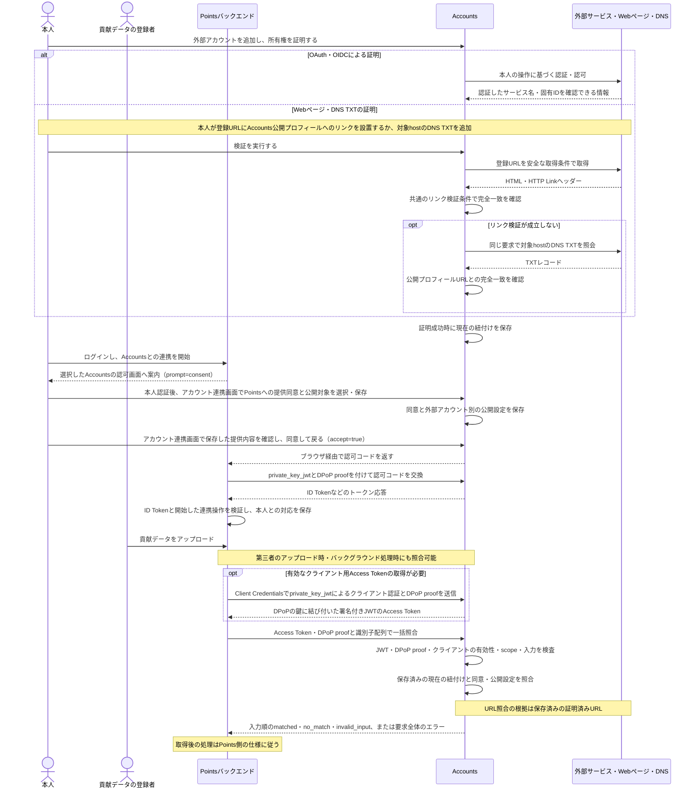
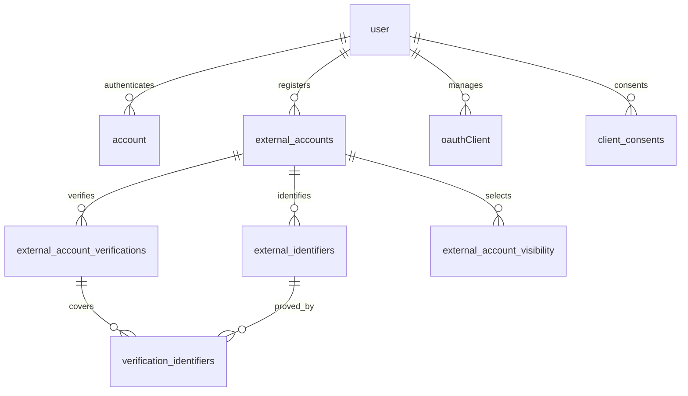

# アカウント統合サービス v0.1

- [説明](#説明)
- [存在意義・独立したサービスにする理由](#存在意義独立したサービスにする理由)
- [責務](#責務)
- [Pointsなどの連携サービスとの境界](#pointsなどの連携サービスとの境界)
- [利用開始の流れ](#利用開始の流れ)
- [v0.1で実装する機能](#v01で実装する機能)
- [Accountsプロフィール](#accountsプロフィール)
- [登録とログイン](#登録とログイン)
- [所有権と紐付け](#所有権と紐付け)
- [OAuthクライアント管理](#oauthクライアント管理)
- [公開設定](#公開設定)
- [Accounts API](#accounts-api)
  - [提供する機能](#提供する機能)
  - [入力ごとの照合手順](#入力ごとの照合手順)
  - [クライアント認証と権限](#クライアント認証と権限)
  - [APIの具体案](#apiの具体案)
  - [貢献者照合の流れ](#貢献者照合の流れ)
- [外部識別情報の仕様](#外部識別情報の仕様)
  - [照合する識別子](#照合する識別子)
  - [URL正規化](#url正規化)
  - [外部認証情報](#外部認証情報)
- [Webページの検証仕様](#webページの検証仕様)
  - [検証要求の制御](#検証要求の制御)
- [操作の認可](#操作の認可)
  - [運営者の権限](#運営者の権限)
- [Accountsユーザーの退会](#accountsユーザーの退会)
- [管理画面と監査](#管理画面と監査)
  - [表示・提供する情報](#表示提供する情報)
  - [画面用のAPI](#画面用のapi)
- [JSONによるバックアップと移行](#jsonによるバックアップと移行)
  - [JSON形式](#json形式)
- [受け入れ条件](#受け入れ条件)
- [テーブル構造の設計案](#テーブル構造の設計案)
  - [共通の保存形式](#共通の保存形式)
  - [認証ライブラリとの分担](#認証ライブラリとの分担)
  - [外部認証と登録の接続](#外部認証と登録の接続)
  - [外部アカウントと公開設定](#外部アカウントと公開設定)
  - [読み取りと更新の単位](#読み取りと更新の単位)
- [要件確定後の確認事項](#要件確定後の確認事項)
  - [Points側の確認事項（Accounts要件確定とは独立）](#points側の確認事項accounts要件確定とは独立)
- [文書化要件](#文書化要件)
- [提供・技術要件](#提供技術要件)

## 説明

- あらゆるアカウントのIDを統合して管理できるサービス
- v0.1は個人名義のAccountsユーザーを対象とする
- 本文をサービス全体の仕様、[URL登録・検証仕様](verify-url.ja.md)をURL検証の正本とする。確定した要件に基づき、テーブル構造・実装を具体化する

本文では次の用語を使う。

| 用語 | 意味 |
| --- | --- |
| 外部アカウントの連携 | OAuth・Webページのリンク・DNS TXTの証明により、外部アカウントをAccountsユーザーへ紐付けること |
| サービス連携 | Pointsなどの利用側サービスが、OAuthクライアントとして、Accountsユーザーと自サービスのユーザーを対応付けること |
| 情報提供同意 | AccountsユーザーがOAuthクライアントごとに保存する、情報提供のON・OFF |
| 公開選択 | 外部アカウントごとに、一般公開と各OAuthクライアントへの公開を選ぶ設定 |
| 公開設定 | 情報提供同意と公開選択の総称 |
| 提供許可 | 情報提供同意がONで、対象の外部アカウントが本人に証明済みとして紐付き、そのOAuthクライアントへの公開選択がONである状態。条件は[公開設定](#公開設定)に従う |

## 存在意義・独立したサービスにする理由

1. 無料主義の貢献度アップロードのアカウント管理を簡単にする
   - サービスの実装側・利用側の両方で、利用を簡単にしたい
2. アカウント統合の処理はとても複雑なので、責務の分離の為に切り出す
3. 他の無料主義サービスが、同じ内容を実装する必要がない状態にしたい
4. ポイント管理サービス以外からでも使用できるようにしたい
5. Points系サービスが、自分の接続先としてAccounts互換サービスを選択できるようにする

## 責務 

Accountsは、Accountsユーザーと外部アカウントの登録・所有権証明・現在の紐付け・公開設定を管理し、許可された情報と照合結果をAPIで提供する。利用側サービス固有の処理は、次の責務分担に従う。

| 対象 | 正本・責務 |
| --- | --- |
| 外部アカウントの識別・証明・提供許可 | 本仕様で定めるAccountsの責務 |
| Pointsユーザーとの連携件数・開始・変更・解除・退会時の対応 | [Pointsのアカウント設定](../../../../points-web-app/docs/v0.2/details-ja/profile-setting.md#3-accountsとの情報連携) |
| 貢献データ・FIX・受領・ポイント台帳と残高・パッケージ・経済履歴と公開設定・Marketsへの経済情報API | [Pointsの責務と帰属ルール](../../../../points-web-app/docs/v0.2/details-ja/unclaimed-fix-and-ownership.md) |

## Pointsなどの連携サービスとの境界

- Accountsと利用側サービスは、サブドメインや運営者にかかわらず、ユーザー・ログイン手段・セッションを独立して管理する
- 利用側サービスは独立したOAuthクライアントとして、Accountsで認証した本人から外部アカウント情報の提供と照合の権限を受ける。初回連携の本人確認は[クライアント認証と権限](#クライアント認証と権限)に従う
- Accountsユーザーは、提供元Accountsサービスのoriginと固定AccountsユーザーIDの組み合わせで識別する。異なる提供元の同じID文字列も区別する
- 利用側サービス内のユーザー対応と、Accountsに保存する情報提供同意・公開設定は独立して管理する。利用側での連携解除や退会後も、Accountsは本人がAccountsで変更するまで同意・公開設定を維持する
- Accounts APIは、照会時点の紐付けと提供許可に従って情報を返す。取得済み情報の保存・履歴・許可取消後の公開表示は利用側サービスが管理する
- Accountsユーザーの退会による情報提供終了は[Accountsユーザーの退会](#accountsユーザーの退会)に従う。Points側の対応は[Pointsの連携解除と退会](../../../../points-web-app/docs/v0.2/details-ja/profile-setting.md#34-連携解除と退会)に従う
- Pointsへの提供同意の利用目的と一般公開設定との関係は[公開設定](#公開設定)、提供する項目は[表示・提供する情報](#表示提供する情報)に従う

## 利用開始の流れ

- Accountsで登録・外部アカウントの連携を済ませてから利用側サービスへ連携する入口と、利用側サービスからAccountsへの連携を開始する入口を用意する
- Accountsでは、本人認証、必要な場合の新規登録、外部アカウントの連携・証明、提供対象と利用目的の確認・同意までを完了できる
- 「連携の開始」は、Pointsなどの利用側サービスで本人が「Accountsと連携する」操作を行い、接続先AccountsのOAuth認可エンドポイントへ遷移することを指す。AccountsはBetter Authが受け付けた認可要求のクライアントを、今回の情報提供先として表示する
- 利用側サービスから開始した連携では、[管理画面と監査](#管理画面と監査)の「アカウント連携」画面を同意画面として使う。連携先と利用目的を示し、本人が外部アカウントごとのチェックと情報提供同意を設定・保存した後、標準OAuthの同意処理へ進む
- Accountsでの認証・同意後は、登録済みのリダイレクトURLを使って利用側サービスへ戻る

Pointsの接続先選択、画面文言、ユーザー連携の追加・変更、既存Points利用者の切り替え手順は、[Pointsの利用開始と連携先ユーザーの変更](../../../../points-web-app/docs/v0.2/details-ja/profile-setting.md#33-利用開始と連携先ユーザーの変更)を参照する。

## v0.1で実装する機能

| 機能 | 仕様 |
| --- | --- |
| プロフィール・公開ページ | [Accountsプロフィール](#accountsプロフィール) |
| 登録・ログイン・退会 | [登録とログイン](#登録とログイン)、[Accountsユーザーの退会](#accountsユーザーの退会) |
| 外部アカウントの連携・所有権証明 | [所有権と紐付け](#所有権と紐付け)、[Webページの検証仕様](#webページの検証仕様) |
| OAuthクライアントの登録・管理 | [OAuthクライアント管理](#oauthクライアント管理) |
| 一般公開・クライアントへの情報提供 | [公開設定](#公開設定)、[管理画面と監査](#管理画面と監査) |
| 連携アカウント一覧・ユーザー照合 | [Accounts API](#accounts-api) |
| 他サービスへの移行・本人向け復元 | [JSONによるバックアップと移行](#jsonによるバックアップと移行) |
| 外部OAuth tokenの暗号化と暗号鍵の切り替え | [外部認証情報](#外部認証情報) |
| 運営者によるユーザーの停止（ban・unban。運営者画面なし） | [運営者の権限](#運営者の権限) |
| 管理画面（日英表示・監査・OpenAPI・OSSライセンス・公開ヘルプ） | [管理画面と監査](#管理画面と監査)、[文書化要件](#文書化要件)、[提供・技術要件](#提供技術要件) |

## Accountsプロフィール

- プロフィール項目は、表示名・AccountsユーザーIDとする
- ユーザーは、自分のAccountsプロフィールの表示名を設定できる
- Accountsの表示名は最大50文字とする
- 表示名はほかのAccountsユーザーと重複して設定できる。ユーザーの識別には固定のAccountsユーザーIDを使う
- Accountsと外部アカウントのプロフィールで扱う情報は、表示名や識別情報などのテキスト情報とする
- `accounts.freeism.app`内のユーザーIDを、公開された固定IDとして表示する
- 公開プロフィールのURLを知っている人は、ログアウト状態でも閲覧できる。外部アカウントの掲載には本人の一般公開設定を適用する
- 公開プロフィールは、外部サイトがJavaScriptを実行せず確認できるHTMLを返す。掲載する外部URLの`rel="me"`と出力条件は[公開プロフィールへの掲載](verify-url.ja.md#公開プロフィールへの掲載)に従う
- 公開プロフィールURLは、`https://accounts.freeism.app/profiles/{accountsUserId}`とする
- 公開プロフィールは、GitHubなどの外部アカウントとAccountsユーザーIDの対応を表示することを主な用途とする
- 公開プロフィールのキャッシュはURL単位のため、HTMLの固定文言は日本語と英語を併記する

## 登録とログイン

- v0.1では、Google・GitHub・ORCIDのOAuth・OIDC認証を登録・ログイン手段にする
- 登録とログインは共通の入口・OAuth認証フローとする。認証した外部アカウントに対応するAccountsユーザーが存在すればログインし、初めての場合はBetter Authの標準フローでユーザーを作成してログインする
- ユーザー作成時のAccounts表示名は「仮ユーザー」とする。ログイン後すぐにサービスを利用でき、本人が「設定」画面で任意に変更できる
- 認証フロー中のstate・認可コード・セッションの有効期限はBetter Auth標準の管理に従う
- 未連携の外部アカウントでのログインで、そのメールアドレスが既存のAccountsユーザーの`user.email`と一致する場合は、新しいAccountsユーザーを作成せず、Better Auth標準の`account_not_linked`で拒否する。既存のログイン手段でログインして「アカウント連携」画面から明示連携するよう案内する。元のAccountsユーザーを作成した外部アカウントを解除した後、その外部アカウントで新規登録しようとした場合も同じ結果になるため、元のAccountsユーザーへ再連携するか、移動先のAccountsユーザーで明示連携するか、元のAccountsユーザーを退会するよう案内する
- 共通ログイン画面では、`account_not_linked`と、GitHubでメールアドレス一覧も取得できない場合の`email_not_found`に応じた案内を表示する
- 利用側サービスから開始した連携でログイン画面を開いた場合、画面の署名付きクエリは同意画面と同じく10分で失効する。失効後にログインを開始できなかった場合は、元のサービスから連携を最初からやり直すよう案内し、署名付きクエリを外してログイン画面を開き直す導線を示す
- 紐付け済みのGoogle・GitHub・ORCIDアカウントでAccountsへログインできる
- 後から追加したGoogle・GitHub・ORCIDアカウントでも、紐付け先のAccountsユーザーへログインできる
- ログイン画面には、そのブラウザーで前回利用したログイン方法を表示する
- 同じブラウザー内で複数のAccountsユーザーのセッションを保持し、切り替えられる。ログアウトは、Multi Sessionの標準に従い、このブラウザーでログイン中のすべてのAccountsユーザーのセッションを終了する
- ログインセッションの有効期間は7日を基本とし、本人の利用に応じてBetter Auth標準の更新間隔で延長する。有効期限を過ぎた場合は再ログインを求める
- ログイン状態の保持期限を更新する利用は、本人のAccountsセッションによる利用とする。OAuthクライアントによる一覧取得・照合は、クライアント用Access Tokenの有効期間で管理する
- 「アカウント連携」画面では、各AccountsユーザーにGoogle・GitHub・ORCIDアカウントを合計で最低1件残し、最後のログイン手段の連携解除を許可しない
- ほかのログイン可能な外部アカウントが残っていれば、対象サービスの最後のアカウントを解除できる
- v0.1から、本人が設定画面で[Accountsユーザーの退会](#accountsユーザーの退会)を実行できる

## 所有権と紐付け

- 1つのAccountsユーザーへ、Google・GitHub・ORCIDそれぞれ複数の外部アカウントを紐付けられる
- Google・GitHub・ORCIDの連携アカウント数に上限を設けない
- OAuthアカウントと正規化したWeb URLの有効な紐付け先は、同時点で最大1人のAccountsユーザーとする。同じ外部アカウントへの連携処理が競合した場合も、この一意性を維持する。Accountsユーザーは個人名義とする。組織アカウント（GitHubの組織ページ、Codeberg・Hugging Faceの組織namespaceなど）のプロフィールURLも個人と同じ規則でサービス名とユーザー名を保存し、この紐付けの対象とする
- 紐付け先のない外部アカウントは、所有権の証明が成功した時点で、そのAccountsユーザーへ即時に紐付ける
- 成功した証明に基づく現在の紐付けは、本人による解除または別の本人の再証明による更新まで有効とする。再検証の直近結果と現在の紐付けを分けて保存し、後日の検証失敗だけでは現在の紐付けを変更しない
- 別のユーザーに紐付くWeb URLも、申請者のAccountsプロフィールを示す証拠を再証明できた場合は、確認した識別子の現在の所有者を申請者へ更新する。その識別子を以前の所有者の一覧・照合から外し、新しい所有者の公開設定を適用する。他の識別子と証明は、今回確認した範囲に従って維持・更新する。リンク証明（`bidirectional_link`）単独の成功では、確認した識別子のうち1つでも別のユーザーの`dns_txt`または`oauth`の有効な証明が支えていれば、そのリンク証明全体を`indeterminate`として所有者を変更せず、同じ要求でDNS TXTの確認へ進む。本人には、別の方法で証明済みの利用者に紐付いていることを案内する。確認した識別子がすべてリンク証明だけに支えられている場合は再証明で移動する
- 管理画面の「連携解除」は外部アカウントの表示行全体を対象にし、その行の識別子・証明方法・公開設定を終了する。OAuthのログイン手段を含む場合は、標準の認証連携の解除を先に行い、最後のログイン手段として拒否された場合は何も変更しない
- OAuthの証明を持つ行には、「OAuthの認証連携だけ解除する」操作も置く。この操作は標準`unlinkAccount`に対象の標準`account`の行ID（`account.id`）を渡して認証連携を解除し、対応する`oauth`証明と対象関連だけを終了する。ほかの方法（公開ページのリンク・DNS TXT）が支える識別子と、外部アカウント行・公開設定は維持する。最後のログイン手段の解除は標準の結果に従って拒否する
- OAuthアカウントの紐付け先を変更する場合は、元のAccountsユーザーで連携を解除した後、移動先のAccountsユーザーで所有権を改めて証明して連携する。元のユーザーには別のログイン手段を残して解除する
- 別のAccountsユーザーにOAuth連携済みの場合は、Better Auth標準の結果に従って元ユーザーでの解除を案内する。通常のログインは現在の紐付け先へ進む。元ユーザーのログイン手段がそのOAuthアカウントだけの場合は、元ユーザーに別のログイン手段を追加連携してから解除するか、元ユーザーを退会してから連携するよう案内する
- Webページの再証明によるURLの所有者更新と、OAuth認証行・固有IDの紐付け先の変更を分け、後者にはOAuthの解除・再連携手順を適用する
- 外部アカウントごとに複数の識別子と証明方法を保持できる。同じアカウントにOAuthと`bidirectional_link`の証明を追加し、方法ごとの結果・日時を表示する。各証明が確認した識別子を記録し、その範囲に対して照合を有効にする
- URLの未検証登録と、URL・ユーザー名からのサービス判定は[URL登録・検証仕様](verify-url.ja.md)に従う。Webページのリンク検証では、対象ページの公開HTML全体のリンク・テキストやHTTP Linkなどに本人のAccountsプロフィールURLがあることを確認する。第三者投稿の読者コメントも証拠に含み、この結果はページの編集権限までは保証しない

1. OAuthによる所有権証明
   - 対応するログインProviderで本人を認証し、検証済みの外部サービス名と固有IDをAccountsユーザーへ紐付ける
   - ログインに使用したアカウントに加えて、同じサービスの別アカウントも、「アカウント連携」画面から明示的に連携できる
   - 所有権証明には必要最小限の権限を要求し、同一アカウントの判定には外部サービス名と固有IDの組み合わせを使用する
   - 本人向け・一般公開・OAuthクライアント向けの項目は、[表示・提供する情報](#表示提供する情報)に従う
2. Webページのリンクによる所有権証明
   - 登録・検証・紐付け先の更新は、[Webページの検証仕様](#webページの検証仕様)に従う
3. DNS TXTによるドメイン所有権証明
   - v0.1で提供する。登録済みURLへの適用範囲は[URL登録・検証仕様](verify-url.ja.md#dns-txtによる証明)に従う

## OAuthクライアント管理

- v0.1の連携対象は、Pointsのようなバックエンドを持つWebサービスとする
- 利用側で接続設定した複数のAccounts互換サービスから選べるよう、OAuth Providerとして連携する
- v0.1から、外部サービスの開発者がAccountsの画面で自分のアプリをOAuthクライアントとして登録できる
- OAuthクライアントの登録では、アプリ名・リダイレクトURL・`private_key_jwt`用の公開鍵を必須入力とし、サービスの紹介URLと説明文は任意入力とする。紹介URLはHTTPSのURLとする。リダイレクトURLは、Accountsでの認証・同意後に利用者を戻す先として登録する
- クライアント設定は、[GoogleのWebアプリ向けOAuth設定](https://developers.google.com/identity/protocols/oauth2/web-server#creatingcred)と[同意画面の設定](https://developers.google.com/identity/gsi/web/guides/get-google-api-clientid#configure_your_oauth_consent_screen)を参考にする。アプリ名・紹介URL・説明文をアプリ情報、リダイレクトURL・Client ID・公開鍵を接続情報として整理し、入力項目と提供機能は本仕様で定めた内容とする
- 1つのOAuthクライアントへ、リダイレクトURLを1件以上、複数登録できる。認可要求ごとに戻り先の`redirect_uri`を1つ指定し、Accountsのバックエンドは、その値が登録済みURLのいずれかと文字列で完全一致することを確認する。ローカル開発用のURLは次項のとおりポートを除いて一致を確認する
- OAuthのリダイレクトURLはHTTPSとする。HTTPSのURLのホストには、loopback（`localhost`・`127.0.0.0/8`・`[::1]`）を使えない。ローカル開発用に、ホストが`localhost`・`127.0.0.1`・`[::1]`のいずれかのURLをHTTPで登録できる。ローカル開発用のURLは[RFC 8252](https://www.rfc-editor.org/rfc/rfc8252#section-7.3)に従い、ポートだけを除いて一致を確認する。1つのクライアントに本番のHTTPSのURLとローカル開発用のURLを併記できる
- バックエンドは、リダイレクトURLにローカル開発用のURLを含むクライアントを`application_type: "native"`、それ以外を`application_type: "web"`として、Better Auth標準の登録・更新APIへ渡す。`private_key_jwt`・Client Credentials・DPoPは`application_type`によらず使用できる
- 登録画面とAccountsのバックエンドで、必須項目とリダイレクトURLの規則を共有のschemaで検査する。リダイレクトURLの規則はBetter Auth標準の登録時の検査と同じとする。紹介URL・説明文が未入力でも、ほかの登録条件を満たせば登録できる
- 1人のAccountsユーザーが所有できるOAuthクライアントは最大5件とする。画面とバックエンドの登録処理で確認する
- 登録したアプリにはClient IDを発行し、`private_key_jwt`用の公開鍵をインラインのJWKS（`{"keys":[...]}`形式のJWK Set）で登録する。対応する秘密鍵は利用側サービスのバックエンドで保管する
- Client Credentialsを利用できるクライアントは、本人がそのサービスから[連携を開始した](#利用開始の流れ)ときに、本人の情報提供先として表示する。初回の同意・公開選択の初期値はOFFとする。保存済みの提供先は、同意がOFFの場合も設定を編集できるよう一覧に表示する。通常の一覧には保存済みの提供先を表示する。初回の保存前に中断した場合は、次にそのサービスから連携を開始したときに再び同意画面へ表示する
- 登録したアプリは、登録者のAccountsユーザーが管理し、アプリ設定の変更とアプリ自体の削除を行える
- 開発者向け画面で公開鍵を登録・更新できる。登録時の鍵の検査とクライアント認証にはBetter Auth標準の機能を使う
- 登録はBetter Authのサーバー専用API`adminCreateOAuthClient`、アプリ情報・リダイレクトURLの更新は`adminUpdateOAuthClient`で行う。説明文は標準の列が無いため`oauthClient.metadata`の`description`に保存する
- 標準の更新APIは公開鍵を受け付けず、紹介URLを削除できないため、公開鍵の更新と紹介URLの削除（`NULL`への更新）は[提供・技術要件](#提供技術要件)の手続きで承認した独自拡張とし、`oauthClient`の`jwks`・`uri`をAccountsの保存処理で更新する。更新する鍵の検査は、標準の登録時のJWK検査関数（`@better-auth/oauth-provider/internal`の`validatePublicClientJwks`。公開APIの互換性保証の対象外）と同等とし、標準の登録と同じくJWK SetのJSON文字列で保存する。次のクライアント認証から新しい鍵で検証する
- 鍵を切り替えるときは、JWK Setに新旧の鍵（`kid`）を併存させてから旧鍵を外す
- 発行済みJWTの有効期間は[クライアント認証と権限](#クライアント認証と権限)に従う。鍵の更新とトークンの有効期限をそれぞれ管理し、認可・保存トークンの失効にはBetter Auth標準の操作を使う。署名付きJWTのAccess Tokenは失効できず、鍵の更新後も期限（最長15分）まで有効である。即時に止める場合はクライアントを削除する

## 公開設定

- Accounts APIを通じて提供する外部アカウントの公開範囲は、OAuthクライアントごとに管理する
- AccountsユーザーとOAuthクライアントの組み合わせごとの情報提供同意と、外部アカウントとOAuthクライアントの組み合わせごとの公開設定を、それぞれ保持する
- OAuthクライアントへ外部アカウント情報を提供する条件は、そのクライアントへの情報提供同意が有効で、対象の外部アカウントが本人に証明済みとして紐付き、そのクライアントへの公開が選択されていることとする
- OAuthクライアントへの情報提供同意だけをOFFにして保存した場合は、外部アカウントの公開選択を保持し、そのクライアントへの当該ユーザーの情報提供を停止する。同じD1 batchで、そのユーザーとクライアントの標準`oauthConsent`行を削除し、次にそのクライアントから連携を開始したときは`prompt`の有無にかかわらず同意画面を表示する
- 再び同意をONにして保存した場合は、その時点で本人に証明済みとして紐付いている外部アカウントについて、保持していた選択に従って情報提供を再開する
- 未検証の登録情報は本人の管理画面と本人向けJSON出力で扱う。一般公開・クライアント一覧・本人IDの照合は、現在の証明済み情報を対象とする。複数の識別子を持つアカウントも、証明済みの範囲を提供する
- 公開先は、一般公開と各OAuthクライアントをそれぞれ独立して設定する
- 公開対象の選択単位は外部アカウントとし、そのアカウントについてあらかじめ定めた表示名・識別情報などの項目をまとめて提供する
- 一般公開する連携アカウントも、OAuthクライアントへの公開と同様に、ユーザーが明示的に選択する
- Google・GitHub・ORCIDのOAuth・OIDC認証、Webページのリンク検証、DNS TXTのいずれで証明した外部アカウントにも、同じ公開範囲の制御を適用する
- Webページのリンク・DNS TXTによる所有権証明と、証明済みWebプロフィールを各OAuthクライアントへ提供する許可は、独立して管理する
- Web上で公開されている証明用リンク自体の閲覧範囲は、Accounts APIの閲覧権限とは別に扱う
- 初回の同意画面では、すべての外部アカウントの公開チェックをOFFで表示する。本人が選んだ外部アカウントを、情報提供同意とともに保存する
- ユーザーが「アカウント連携」画面で選択した外部アカウントだけを、そのOAuthクライアントへ公開する。同じ画面をOAuthの同意画面として開いた場合も、個別選択・一括選択・保存の条件を共通にする
- Pointsへの提供同意には、Points上での公開表示全般と貢献者照合を含める。「アカウント連携」画面で、連携先が公開表示を行うことと情報の利用目的を示す
- Pointsで表示できる外部アカウントはPointsへの提供許可に従い、Accounts自身の一般公開プロフィールへの掲載設定とは独立する
- 後から追加した外部アカウントは、ユーザーが明示的に公開するまで既存のOAuthクライアントへ公開しない
- ユーザーは、OAuthクライアントに対する外部アカウントの公開を後から解除できる

## Accounts API

### 提供する機能

| 機能 | 入力 | 出力・用途 |
| --- | --- | --- |
| 連携アカウント一覧の取得 | AccountsユーザーID | 問い合わせ元へ提供を許可した連携アカウントを全件返す。同じサービスの複数アカウントも個別に返す |
| 識別情報からユーザーを照合 | プロフィールURL、外部サービス名と固有IDまたはユーザー名、AccountsユーザーID | 入力ごとの条件と提供許可を満たすAccountsユーザーIDを最大1件返す |

一覧取得・照合は、本人の操作中以外にも、許可済みクライアントの処理から利用できる。取得対象には[公開設定](#公開設定)、要求の認証には[クライアント認証と権限](#クライアント認証と権限)を適用し、入出力は[APIの具体案](#apiの具体案)に従う。

### 入力ごとの照合手順

外部アカウントの照合方法は入力の種類によって決まる。Google・GitHub・ORCIDを含め、サービス名やURLのホストにかかわらず、同じ手順を適用する。

| 入力 | 照合方法 |
| --- | --- |
| URL | 入力URLに登録と同じ正規化と受付制約（HTTPS・port・userinfo・hostの制約）を適用し、保存済みの証明済みURLとの完全一致で現在の紐付けを検索する。受付制約を満たさない入力は`INVALID_VALUE`とする |
| 外部サービス名と固有ID | 保存済みの証明済み識別子を、サービス・固有IDの組み合わせの完全一致で検索する |
| 外部サービス名とユーザー名 | 保存済みの証明済み識別子を、サービス・ユーザー名の組み合わせで検索する。ユーザー名には[サービス別の識別](verify-url.ja.md#サービス別の識別)の正規化規則を適用する |
| AccountsユーザーID | 問い合わせ先Accounts内の固定IDの存在と、そのユーザーから問い合わせ元への有効な情報提供同意を確認する |

URLと外部サービス名・固有ID・ユーザー名の照合は、表の一致条件に加えて[公開設定](#公開設定)による問い合わせ元への現在の提供許可を確認する。両方を満たす場合は紐付くAccountsユーザーIDを返し、それ以外は該当なしとする。

外部ページの取得とリンク検証、DNS TXTの照会は、本人がURLを登録して所有権を証明する処理で行う。照合の判定には、検証成功時に保存したURL・サービス名とユーザー名などの識別子、現在の紐付け・提供許可を使う。

URL・固有ID・ユーザー名はそれぞれ型を区別して保存し、証明が確認した範囲に従って照合する。サービス別のURL判定や取得済みページからの抽出は登録・検証時に行い、照合APIは保存済みの情報を参照する。

AccountsユーザーIDを直接指定した場合は、表の条件を満たせば指定IDを返し、それ以外は該当なしとする。

照合要求は現在の状態を読み取る操作とする。紐付けの追加・解除・移動は本人の管理操作で行い、変更が成立した時点で反映する。一覧取得は現在の紐付けと提供許可に従って返す。

### クライアント認証と権限

- 初回連携ではOIDCのAuthorization Codeフローを使い、`openid` scopeを要求する。利用側は、Accountsで認証して情報提供に同意した本人をID Tokenで確認し、連携開始時にログインしていた利用側ユーザーへ対応付ける
- 利用側は、連携開始（再連携を含む）の認可要求に`prompt=consent`を付け、保存済みのOAuth同意があっても[「アカウント連携」画面の同意画面](#管理画面と監査)を表示させる。`prompt=consent`の無い認可要求では、保存済みのOAuth同意があれば同意画面を省く
- 受け付けるscopeは、Authorization Codeフローの認可要求では`openid`、Client Credentialsのトークン要求では`identities:read`に限る
- ID Tokenの`sub`はAccountsユーザーの公開された固定IDとし、クライアントによらず同じ値とする。ID Token・Access Tokenの発行元`iss`は`accountsOrigin`と同じ値とする。利用側は、接続先Accountsサービスに対応する発行元`iss`と`sub`を確認し、Accountsサービスの提供元とAccountsユーザーIDを保持する
- 利用側のバックエンドは、ID Tokenの署名・発行元・対象クライアント・有効期限と、連携開始時に生成した`nonce`との一致を、OIDCの検証規則に従って確認する。連携開始操作と戻り先の処理を対応付け、検証に成功した本人IDで連携を確定する
- 連携サービスのバックエンドは、登録したクライアント認証方式を使い、OAuthの`client_credentials`でクライアント自身の期限付きAccess Tokenを取得する
- Authorization CodeとClient Credentialsで発行するAccess Tokenは署名付きJWTとし、Better AuthのOAuth ProviderとJWTプラグインを使用する。Client Credentialsでは`resource`に`{accountsOrigin}/api/v1`を指定し、初回連携のAuthorization Codeでは`openid`を要求する
- 連携アカウントの一覧取得と外部識別子の照合APIは、クライアント用Access Tokenでクライアントを認証する。`Authorization: DPoP`とDPoP proofヘッダーを受け取り、下記の標準構成で検証する
- 一覧取得と識別子の照合には、共通の読取scopeとして`identities:read`を設ける。このscopeを持つクライアント用JWTで両APIを利用できる。登録したクライアントには`identities:read`をClient Credentials用のscopeとして付与し、データの提供は本人の情報提供同意と公開選択で制御する
- 一覧取得と照合の継続利用では、利用側がクライアント単位のAccess Tokenを管理し、Accountsが各ユーザーの現在の提供許可を判定する
- Access Tokenの有効期間は発行から15分とし、トークン応答の`expires_in`は900秒を返す
- Access Tokenの期限が切れた場合は、クライアント認証によって新しいAccess Tokenを取得する
- APIのバックエンドは、事前に信頼した検証鍵と許可した署名方式でJWTを検証し、発行元・対象API・期限・クライアント主体・scopeと、`sub`が`client_id`と一致するクライアント用トークンであることを確認する。検証に失敗した要求は、紐付け・提供許可の照合へ進む前に拒否する
- JWTの検証に成功した要求で、認証済みClient IDに対応するクライアントの有効性と、対象ユーザーの現在の提供許可を確認する。クライアント削除後はそのクライアントへのAPI提供を終了する
- 返す外部アカウントについて、DB上の現在の紐付けと、そのユーザーから認証済みClient IDへの提供許可を要求ごとに確認する

クライアント認証には`private_key_jwt`、Access Tokenの送信者確認にはDPoPを採用する。Better Auth公式OAuth Providerの`token_endpoint_auth_method: "private_key_jwt"`、公開鍵の`jwks`、`dpop_bound_access_tokens: true`を設定し、API資源側も`dpopBoundAccessTokensRequired: true`とする。Accounts APIの検証は、標準の`verifyAccessTokenRequest`と同じ標準部品（`parseAccessTokenAuthorization`・`verifyJwsAccessToken`・`enforceDpopBinding`・`createDpopReplayStore`・`createResourceServerChallenge`）で組み立てる。`verifyAccessTokenRequest`は検証鍵のJWKSをURL文字列でしか受け付けないため、検証鍵は`auth.api.getJwks()`から読む。Workersでは`createDpopReplayStore`を認証DBへ接続する。

利用側サービスは秘密鍵を保管し、DPoP対応の標準ライブラリでトークン取得とAPI要求のproofを生成する。この構成は公開鍵によるクライアント認証とトークンの鍵への結び付けを組み合わせるものであり、鍵そのものの保管は利用側の責務とする。[Better Auth OAuth Provider](https://better-auth.com/docs/plugins/oauth-provider)、[FAPI 2.0](https://openid.net/specs/fapi-security-profile-2_0-final.html)

初回連携は[OIDC Authorization Codeフロー](https://openid.net/specs/openid-connect-core-1_0.html#CodeFlowAuth)と[ID Tokenの検証](https://openid.net/specs/openid-connect-core-1_0.html#IDTokenValidation)、一覧取得・照合APIの認証は[OAuth client credentials grant](https://www.rfc-editor.org/rfc/rfc6749#section-4.4)に従い、[Better Auth OAuth Provider](https://better-auth.com/docs/plugins/oauth-provider)の対応機能を使用する。

### APIの具体案

一覧取得・一括照合は、読取条件をJSON bodyで渡すHTTP `QUERY`を採用する。`QUERY`は安全かつ冪等な取得メソッドとして[RFC 10008](https://www.rfc-editor.org/rfc/rfc10008.html)で標準化されている。`Content-Type: application/json`で条件を送信する。契約を[OpenAPI 3.2.1](https://spec.openapis.org/oas/v3.2.1.html)の`query`操作として記述し、「開発者向け」画面に表示する。

Valibotの入力schemaをフロントエンドとバックエンドで共有し、バックエンドでもすべての入力を検証する。認証・所有者・現在の提供許可はバックエンドで確認する。

| 操作 | HTTP | 内容 |
| --- | --- | --- |
| 一覧取得 | `QUERY /api/v1/external-accounts` | 提供元、AccountsユーザーID、許可済みアカウントの全件一覧を返す |
| 照合 | `QUERY /api/v1/identities/resolve` | 種類を明示した識別子の配列を受け取り、入力ごとの照合結果を返す |

一覧取得はJSON bodyの`{"accountsUserId":"sample-user"}`で対象ユーザーIDを指定する。クライアントの認証・権限を確認した後、対象ユーザーの存在と問い合わせ元への有効な情報提供同意を確認する。条件を満たす場合はHTTP 200を返し、対象ユーザーが存在しない場合と同意がない場合は、同じ内容のHTTP 404とする。

一括照合の成功応答は、提供元の`accountsOrigin`と、入力順に並べた照合結果の配列`results`を1つのJSONオブジェクトにまとめる。
各結果には、入力配列の0始まりの位置を表す`index`、その位置の元の入力を表す`identifier`、結果の状態を表す`status`を含める。`identifier`は正規化前の入力値とし、照合成立・該当なし・入力不正のいずれの結果にも含める。
各結果には`accountsUserId`と`errors`も常に含め、状態ごとに次の値を返す。

| `status` | 意味 | `accountsUserId` | `errors` |
| --- | --- | --- | --- |
| `matched` | 照合条件と提供許可を満たすユーザーが該当する | 該当するID | 空配列 |
| `no_match` | 入力は有効だが、条件を満たすユーザーが該当しない | `null` | 空配列 |
| `invalid_input` | 入力に不備がある | `null` | 確認できた不備の配列 |

以下は、要求全体の形式・認証・権限の条件を満たし、照合成立・該当なし・必須項目不足の3件の結果をHTTP 400で返す例とする。

```json
{
  "accountsOrigin": "https://accounts.freeism.app",
  "results": [
    {
      "index": 0,
      "identifier": {
        "type": "provider_account",
        "provider": "google",
        "accountId": "123456789"
      },
      "status": "matched",
      "accountsUserId": "sample-user",
      "errors": []
    },
    {
      "index": 1,
      "identifier": {
        "type": "url",
        "url": "https://example.org/unlinked/"
      },
      "status": "no_match",
      "accountsUserId": null,
      "errors": []
    },
    {
      "index": 2,
      "identifier": {
        "type": "provider_account",
        "provider": "google"
      },
      "status": "invalid_input",
      "accountsUserId": null,
      "errors": [
        {
          "code": "MISSING_REQUIRED_FIELD",
          "message": "accountId is required.",
          "path": ["identifiers", 2, "accountId"]
        }
      ]
    }
  ]
}
```

一覧取得の成功応答は、`accountsOrigin`、`accountsUserId`、`externalAccounts`を返す。ユーザーと同意が有効で提供対象が0件の場合は、`externalAccounts`を空配列とする。外部アカウントを1要素にまとめ、複数の識別子と証明方法をその中に含める。

```json
{
  "accountsOrigin": "https://accounts.freeism.app",
  "accountsUserId": "sample-user",
  "externalAccounts": [
    {
      "service": "github",
      "displayName": "Alice",
      "identifiers": [
        {
          "type": "provider_account",
          "provider": "github",
          "accountId": "123456789"
        },
        {
          "type": "provider_username",
          "provider": "github",
          "username": "alice"
        },
        {
          "type": "url",
          "url": "https://github.com/alice"
        }
      ],
      "linkedAt": "2026-09-01T00:00:00Z",
      "verificationStatus": "verified",
      "verifications": [
        {
          "method": "oauth",
          "identifiers": [
            {
              "type": "provider_account",
              "provider": "github",
              "accountId": "123456789"
            },
            {
              "type": "provider_username",
              "provider": "github",
              "username": "alice"
            },
            {
              "type": "url",
              "url": "https://github.com/alice"
            }
          ],
          "verifiedAt": "2026-09-01T00:00:00Z",
          "checkedAt": "2026-09-01T00:00:00Z",
          "result": "verified",
          "evidenceUrl": null
        },
        {
          "method": "bidirectional_link",
          "identifiers": [
            {
              "type": "url",
              "url": "https://github.com/alice"
            },
            {
              "type": "provider_username",
              "provider": "github",
              "username": "alice"
            }
          ],
          "verifiedAt": "2026-09-02T00:00:00Z",
          "checkedAt": "2026-09-02T00:00:00Z",
          "result": "verified",
          "evidenceUrl": "https://github.com/alice"
        }
      ]
    }
  ]
}
```

| 外部アカウントの項目 | 型・意味 |
| --- | --- |
| `service`、`displayName` | `string \| null`。判明しているサービス名・表示名。汎用Webページなどで取得できない情報は`null` |
| `identifiers` | `url`・`provider_account`・`provider_username`の識別子配列。各形式は照合入力と共通 |
| `linkedAt` | `string \| null`。その外部アカウントで最初に有効な証明が成立した日時。日時はUTCのRFC 3339形式 |
| `verificationStatus` | `verified`または`unverified`。本人への有効な証明済み紐付けがあるかを示す |
| `verifications` | 証明方法ごとの情報の配列。未実行の場合は空配列 |
| 証明方法の各要素 | `method: "oauth" \| "bidirectional_link" \| "dns_txt"`、`identifiers`、`verifiedAt: string \| null`、`checkedAt: string \| null`、`result`、`evidenceUrl: string \| null` |

`verifications[].identifiers`は、その証明が対象として確認した識別子を示す。`verifiedAt`は現在の紐付けの根拠となる成功日時、`checkedAt`と`result`は直近の検証日時・結果とし、未検証と失敗を区別する。`result`は`verified`・`not_verified`・`indeterminate`の3値とする。検証結果と紐付けの有効性の関係は[URL登録・検証仕様](verify-url.ja.md)に従う。公開証拠のURLを示せる場合に`evidenceUrl`を返す。

OAuthの固有IDと、URLから抽出したユーザー名は、それぞれ別の識別子とする。上記のOAuth例でURL・ユーザー名を含められるのは、OAuthで取得したProvider応答がその固有IDとの対応を確認できる場合に限る。識別子の文字列が一部似ていることだけで証明対象を広げず、同一性を確認できた範囲を保存する。

照合入力の例。1件でも複数件でも同じ形式を用いる。

```json
{
  "identifiers": [
    { "type": "url", "url": "https://example.org/about/" },
    { "type": "provider_account", "provider": "google", "accountId": "123456789012345678901" },
    { "type": "provider_username", "provider": "github", "username": "alice" },
    { "type": "accounts_user", "accountsUserId": "example-accounts-user" }
  ]
}
```

- 入力種別ごとの判定は、[入力ごとの照合手順](#入力ごとの照合手順)に従う
- 外部サービス名は登録されたProvider識別子、固有ID・ユーザー名は文字列で受け付ける。`provider_account`は`provider`と`accountId`、`provider_username`は`provider`と`username`を必須とする。許可するProvider識別子、入力形式、ユーザー名の正規化は[サービス別の識別](verify-url.ja.md#サービス別の識別)のProvider識別子の表に従い、表に無いProviderは`INVALID_VALUE`を返す。v0.1のProviderは提供元が1つに定まるため、識別子は`provider`で特定し、`issuer`を持たない
- 一括照合は、URL・外部サービス名と固有IDまたはユーザー名・AccountsユーザーIDを合わせて、入力配列の要素数で1要求あたり最大1,000件とする。上限を超える場合は、照合を開始する前に要求全体をエラーにする
- 識別子の値は、URLが正規化後2,048 bytes、固有ID・ユーザー名が256 bytesまでとし、超える入力は`INVALID_VALUE`とする
- `identifiers`が空配列の場合は、要求の形式とクライアントの認証・権限を確認したうえで、HTTP 200で`accountsOrigin`と空の`results`配列を返す
- 一括照合の要求bodyはUTF-8のJSONとし、容量上限は5MiB（5,242,880 bytes）とする。bodyの読込時に上限を確認し、超過した場合は照合を開始する前に要求全体をエラーにする
- 一覧の各アカウント項目には、上表の項目を常に含める。未取得の情報は`null`、識別子・証明方法の未登録は空配列で表す
- 一括照合では、要求全体の形式とクライアント認証を確認した後、各入力を個別に検査・照合し、入力順に結果を返す。不正な入力には、検査で確認できた不備をその入力の`errors`配列へまとめ、各不備の位置と理由を返す。正しい入力の照合を継続する
- 要求全体の形式・認証・権限が正しく、各入力が有効ならHTTP 200を返す。1件以上の`invalid_input`がある場合はHTTP 400を返し、有効な入力の照合結果も含めて入力順の`results`を保持する。HTTP 400で`results`を返す場合と、要求全体の形式不正で最上位の`errors`を返す場合をOpenAPIで区別する
- 照合APIの要求全体に、JSONの構文不正、必須項目の不足・型違い、未定義の最上位項目などの入力形式の不備がある場合は、HTTP 400と最上位の`errors`配列を返す。具体的な理由は各エラーの`code`・`message`・`path`で示す
- 照合APIのJSON入力で仕様にない項目名を受け取った場合は、入力エラーにする。要求の最上位の不明な項目は要求全体のエラーとし、個別の識別子内の不明な項目はその入力の`errors`へ含める
- `no_match`では未登録と問い合わせ元への非公開を同じ応答として扱い、入力ごとの不正によるエラーと区別する。要求全体の形式・認証・サーバー処理の失敗は、要求全体に対するエラー応答として扱う
- 一覧取得・照合APIの要求全体に対するエラーと、照合入力ごとの`errors`配列の各エラーには、機械判定用の`code`、英語の説明文`message`、入力位置を表す`path`を常に含める。利用側の画面では`code`に応じて日本語・英語などの表示を行う
- 一覧取得・照合APIの要求全体に対するエラー応答は、最上位の`errors`配列に各エラーを格納するJSONオブジェクトとする。エラーが1件の場合も配列で返し、複数の入力不備を確認できた場合はその配列へまとめる
- JSON入力の不備を示す各エラーには、要求bodyの最上位から対象項目までの位置を`path`配列で含める。オブジェクトの項目名は文字列、配列内の位置は0始まりの数値で表す。例えば、3件目の識別子の`provider`の不備は`["identifiers", 2, "provider"]`とする。要求全体のエラー内と個別の照合結果内で、同じ位置表現を使用する
- 認証失敗・サーバー障害など、特定のJSON入力項目を指せないエラーは`path: null`とする
- クライアントは接続設定で選択した提供元とともにAccountsユーザーIDを保持する

入力項目の不備には、次のエラーコードを使用する。要求全体の入力エラーと、個別の照合入力のエラーで共通の区分を使い、`message`で具体的な理由、`path`で対象項目を示す。

| `code` | 不備の種類 |
| --- | --- |
| `MISSING_REQUIRED_FIELD` | 必須の項目が含まれていない |
| `INVALID_TYPE` | 値のJSONの型が、項目で定めた型と異なる |
| `INVALID_VALUE` | 値の型は正しいが、URL形式や許可された値など、項目の条件を満たしていない |
| `UNKNOWN_FIELD` | 仕様で定義されていない項目名が含まれている |

一覧取得・照合APIで要求全体が失敗する場合は、次のHTTPステータスとエラーコードを使用する。応答bodyと各エラーの形式は上記の定義に従う。この表の適用対象は一覧取得・照合の資源APIとし、OAuthの各エンドポイントはOAuthの応答仕様に従う。

| 原因 | HTTPステータス | `code` |
| --- | --- | --- |
| JSONの構文不正 | 400 | `INVALID_JSON` |
| `Content-Type`の未指定 | 400 | `MISSING_REQUIRED_FIELD` |
| `Content-Type`が対応するJSON形式以外 | 415 | `UNSUPPORTED_MEDIA_TYPE` |
| 要求全体の入力項目の不備 | 400 | 不備の種類に応じて`MISSING_REQUIRED_FIELD`・`INVALID_TYPE`・`INVALID_VALUE`・`UNKNOWN_FIELD` |
| 一括照合の入力が1,000件を超過 | 400 | `INVALID_VALUE` |
| アクセストークンの未指定・無効・期限切れ | 401 | `UNAUTHORIZED` |
| 必要なscopeの不足 | 403 | `INSUFFICIENT_SCOPE` |
| 一覧取得の対象ユーザーが存在しない、または問い合わせ元への提供同意がない | 404 | `NOT_FOUND` |
| 一括照合の要求bodyが5MiBを超過 | 413 | `REQUEST_TOO_LARGE` |
| サーバー内部の処理失敗 | 500 | `INTERNAL_ERROR` |

401・403の応答では、Better Auth標準の`createResourceServerChallenge`で作る`WWW-Authenticate`ヘッダーを付け、bodyは本表の形式とする。`WWW-Authenticate`には`DPoP`と`Bearer`の両方のchallengeが含まれうるため、利用側はHTTPステータスとbodyの`code`で失敗を判定する。削除したクライアント、無効にしたクライアント（登録者のban中を含む）のトークンによる要求は401とする。

一覧取得・照合の資源APIにも、CloudflareのWAFのRate Limitingを適用する。上限を超えた要求にはWAFがHTTP 429を返し、この応答は本表の形式に従わない。利用側はHTTPステータスで判定する。

例えば、公開ページを持つ連携先はURLを、固有IDを共有する連携先は`provider_account`を渡せる。アップロード側は本人から共有された情報など、対象者との対応を確認できる識別子を指定する。PointsのCSV列・入力画面からこのAPIへ渡す具体的な形式は、Points側の契約で定める。

### 貢献者照合の流れ

本人による外部アカウントの証明・情報提供の同意と、Pointsによる貢献者照合を次の流れで行う。Pointsへの初回連携は[クライアント認証と権限](#クライアント認証と権限)の認可フローに従う。



識別子ごとの判定は[入力ごとの照合手順](#入力ごとの照合手順)、照合結果を使うPointsの処理は[Pointsの帰属ルール](../../../../points-web-app/docs/v0.2/details-ja/unclaimed-fix-and-ownership.md)に従う。

## 外部識別情報の仕様

### 照合する識別子

人物を表すURL、外部サービス名と固有ID、外部サービス名とユーザー名を、[入力ごとの照合手順](#入力ごとの照合手順)に従って扱う。複数URLや記事パスの登録、別名の抽出、証明する範囲は[URL登録・検証仕様](verify-url.ja.md)に集約する。

### URL正規化

URL登録、証拠からの抽出、照合APIで共通の[URL正規化規則](verify-url.ja.md#url正規化)を使用する。サービス別の識別情報の抽出と証明範囲も[URL登録・検証仕様](verify-url.ja.md)に従う。

### 外部認証情報

- 外部サービスの認証情報はバックエンドで管理し、保存するOAuth tokenはアプリケーション層で暗号化する
- OAuth tokenの暗号化にはBetter Auth標準の`account.encryptOAuthTokens`とversioned secretsを使用する。環境別のWorker Secretで管理し、先頭のcurrent secretで新規保存し、残りの旧secretは復号に使用する
- Token refresh・再連携などの次回保存でcurrent versionへ更新する。復号では未知versionと改ざんを拒否する
- browserへ渡すプロフィール・セッション情報と、外部サービスの秘密情報を分離する
  - browserと連携先へ提供するのは、用途に応じた表示名・識別子・許可された情報とする。Google・GitHub・ORCIDのAccess Token、Refresh Token、OAuth AppのClient SecretはAccountsのバックエンドで扱う
- 所有権証明に使う情報と、一般公開・OAuthクライアントに提供する情報を区別する
- 外部アカウントの追加連携は、本人の操作と外部サービスでの認証に基づいて行う
- OAuthの同一アカウントは外部サービス名と固有IDで判定する。メールアドレスにかかわらず、本人の操作とProviderでの認証により明示連携する
- 外部アカウントでのログイン・追加連携・再連携で表示名を取得した場合は、その外部アカウントの最新の表示名として保存する。管理画面・一般公開・OAuthクライアントへの提供では、公開条件に従って保存済みの表示名を使用する
- OAuthのログイン・追加連携・再連携で得たユーザー名・プロフィールURLは、その外部アカウントの識別子を置き換える。改名前のユーザー名・プロフィールURLの識別子行と、それらだけを対象とする証明行（改名前のURLのリンク証明など）は削除する。置き換え後の値が別のAccountsユーザーの有効な識別子と衝突する場合は、OAuthの検証済み応答を優先し、その識別子を今回の本人へ移動する。OAuthで得たユーザー名・プロフィールURLを、本人が「未検証で保存」などで固有IDを持たない別の外部アカウント行に候補として登録している場合は、その候補をOAuthの外部アカウントへ移して有効にする
- OAuth連携でURL識別子を追加する時点で本人の`url`行が150件に達している場合は、そのURL行だけを保存せず、ログイン・連携とほかの識別子の保存を続ける。上限到達は「アカウント連携」画面に表示する
- ログイン・追加連携・再連携の後も、本人が設定したAccountsの表示名を維持する
- 外部アカウントの連携解除と退会では、Better Auth標準の処理で保存したAccess Token・Refresh Tokenを削除する。外部サービス側に残るAccountsへの連携許可は、本人が各サービスの設定から取り消す。この案内は[文書化要件](#文書化要件)の公開ヘルプで行う

| 情報 | 扱う場所・用途 |
| --- | --- |
| Accounts ID、表示名、許可された外部ID・URL | 本人画面、公開プロフィール、許可済みクライアントの表示・照合 |
| Accounts自身のログイン状態 | Accountsのセッション管理 |
| 外部サービスのAccess Token・Refresh Token | Accountsのバックエンドで認証連携に使用し、保存時は暗号化する |
| Accounts運営者が外部サービスに登録したOAuth AppのClient Secret | Accountsのバックエンド設定。環境別のWorker Secretで管理する |
| 連携アプリの公開鍵と秘密鍵 | 公開鍵はAccountsで登録・管理し、秘密鍵は連携アプリのバックエンドで保管する |

表示名や識別子を取得するAPIは、許可された情報を返す。外部サービスのtokenとAccountsのログインセッションは、それぞれの認証処理に必要な情報として管理する。

## Webページの検証仕様

単一URLを入力して「保存して検証する」ボタンを押したときの登録・検証、リンク検証が成立しない場合のDNS TXT確認、証拠候補の抽出、公開HTML、サービス別の識別、取得制限、検証結果は[URL登録・検証仕様](verify-url.ja.md)を正本とする。リンク検証の`verified`は対象ページでのAccountsプロフィールURLの一致を示し、ページの編集権限の確認を示すものではない。

### 検証要求の制御

- Web検証への大量リクエストはCloudflare標準のWAF・Rate Limitingで制御する。認証エンドポイントはBetter Auth標準のレートリミッターを使い、`rateLimit.storage: "database"`で保存する
- Web検証の集計期間と上限は、採用するCloudflareプランで設定できる期間の中から、短時間の集中を抑える値にする。1時間の集計が必要な場合は、その期間を提供するプランを選定する。具体値は実装時の運用設定で定める
- Web検証の要求には、WAFのIP単位の制御と併用して、Workers Rate Limiting bindingでAccountsユーザーIDをキーとする緩い上限を設ける。上限を超えた要求は、外部ページの取得とDNS照会の前に拒否する。具体値は運用設定で定める（例: 1分あたり10回）
- OAuthクライアントの読取照合には、クライアント認証・現在の提供許可と、[API契約](#apiの具体案)の入力件数・容量上限を適用する

[Cloudflare Rate Limitingのプラン別設定](https://developers.cloudflare.com/waf/rate-limiting-rules/parameters/)を確認して設定する。

## 操作の認可

- 外部アカウントの追加・解除・再連携、Web所有権の確定、公開設定の変更、Accountsユーザーの退会、OAuthクライアント・クライアント公開鍵・署名鍵の変更は、Accountsへの通常のログイン状態と、対象データ・操作に対する権限に基づいて実行する。外部アカウントの解除と退会は、有効なセッションであればログインからの経過時間によらず実行できる
- バックエンドがセッションから操作主体を確認し、本人として操作できることを検証する。他人のプロフィール・外部アカウント・公開設定・OAuthクライアントの操作主体は本人だけとし、`appAdmin`の操作は[運営者の権限](#運営者の権限)に従う
- 操作ごとの認証・認可条件をバックエンドの共通ポリシーで管理し、対象操作へ一貫して適用する

### 運営者の権限

- 運営者は、Better AuthのAdminプラグインのロール`appAdmin`を持つAccountsユーザーとする。`appAdmin`はPointsの評価軸権限とは別のAccountsのロールである
- Adminプラグインの`ac`・`roles`で`appAdmin = { user: ["list", "get", "ban"] }`を定義する。`appAdmin`に許可する操作は、ユーザーの一覧・取得とban・unbanだけとする
- 最初の`appAdmin`は、OAuthで作成したユーザーの`user.role`をDBで`appAdmin`に設定して任命する。運営者画面は設けず、ログイン済みの`appAdmin`がAdmin APIを呼ぶ
- Admin APIのユーザー一覧・取得の応答には、Better Auth標準の`user.email`（ユーザーを作成した外部アカウントのメールアドレス）が含まれる
- banは期限を設けずに行う。ban中は標準機能でログインを拒否し、既存セッションを失効させる
- ban中は、本人が開発者として登録したOAuthクライアントを標準の`oauthClient.disabled`で無効にし、そのクライアントの認可・トークン発行と、発行済みトークンによる資源APIの利用を拒否する。unbanで有効に戻す
- banの時点でブラウザーが保持するセッションのcookie cacheは、有効期間（最長1時間）の間、cookie cacheで判定する読取系の画面用API・追加連携の開始・同意済みクライアントへの認可で使われうる。状態変更APIと`/api/me`はDBのセッションを読むため拒否する
- ban中のユーザーの公開プロフィールは404とし、連携アカウント一覧と照合APIはユーザーが存在しない場合と同じ結果を返す。unbanで元の公開設定へ戻す
- ban・unbanの後は、[提供・技術要件](#提供技術要件)に従って対象の公開プロフィールのキャッシュをpurgeする

## Accountsユーザーの退会

- 本人がAccountsの設定画面から退会を実行できる
- 退会確認画面に削除対象のデータと終了する登録OAuthクライアントを表示する。「内容を確認した」のチェックを入れると「退会する」ボタンが有効になり、本人がボタンを押して確定する。退会はBetter Auth標準の`deleteUser`で実行する。パスワードと確認メールを使わない構成のため、`deleteUser`は本人の確定と同時に削除を行う
- 退会が成立したユーザーは、Accountsへのログインとセッション、外部アカウントの紐付け、一般公開、OAuthクライアントへの情報提供を終了する
- 退会と同時に、本人が開発者として登録したOAuthクライアントも終了する。対象クライアントのClient ID・公開鍵登録、既存の認可・発行済みトークンによるAPI利用を無効にし、新しい認可の受付を終了する
- 退会成立時に、本人のプロフィール、外部アカウント情報と紐付け、公開・提供設定、登録OAuthクライアントの設定、それらに属する認証情報・セッション・認可・トークンを削除する
- 退会した端末以外のブラウザーが保持するセッションのcookie cacheは、有効期間（最長1時間）の間、cookie cacheで判定する読取系の画面用APIで使われうる。削除済みのデータは返らず、状態変更APIと`/api/me`はDBのセッションを読むため拒否する
- 退会操作には、[操作の認可](#操作の認可)の条件を適用する
- 操作監査ログは[管理画面と監査](#管理画面と監査)の個人情報を含めない記録方針に従い、保存・保持はログ基盤の設定で管理する

## 管理画面と監査

ログイン後の管理機能は、次の3画面にまとめる。各機能の条件は参照先の仕様に従う。

| 画面名 | 扱う機能 |
| --- | --- |
| 開発者向け | 自分が登録する[OAuthクライアントの設定](#oauthクライアント管理)、認証情報の管理、OpenAPIによるAccounts APIとBetter Auth APIのドキュメント |
| 設定 | [Accountsの表示名](#accountsプロフィール)、[JSON出力・復元](#jsonによるバックアップと移行)、[退会](#accountsユーザーの退会) |
| アカウント連携 | [外部アカウントの追加・解除](#所有権と紐付け)、[Web URLの登録・検証・結果確認](#webページの検証仕様)、[一般公開と連携先サービスごとの公開設定](#公開設定) |

- 「開発者向け」画面には、本人が登録したOAuthクライアントの一覧と「新規登録」を表示する。一覧から選択したクライアントの詳細設定を同じ画面内に表示し、編集できるようにする
- 選択したOAuthクライアントのアプリ名・紹介URL・説明文・リダイレクトURL・公開鍵の変更は、1つの「保存」ボタンでまとめて反映する。バックエンドは公開鍵を先に検査し、標準の更新APIでアプリ情報・リダイレクトURLを更新した後に公開鍵を保存する。公開鍵の保存だけが失敗した場合はエラーを示し、同じ内容の再保存で反映する。クライアントの削除は専用の操作から実行する
- 「設定」画面では、表示名を編集して「保存」ボタンを押すと変更を反映する。JSON出力・復元・退会は、それぞれ専用のボタンから実行する
- 「アカウント連携」画面で、紐付ける外部アカウントと、その外部アカウントをどの連携先サービスへ公開するかをまとめて管理する。連携先サービスはOAuthクライアント単位で扱う
- 利用側サービスからAccountsへの連携を開始した場合も、この画面の通常の一覧表で提供対象を選択する。今回の連携先の名前・紹介URL（登録済みのアプリ名・紹介URL）、今回の`redirect_uri`のhost、利用目的と、現在のアクティブセッションのAccountsユーザー（表示名とAccountsユーザーID）を表示し、その連携先への情報提供同意と公開設定を編集・保存する。利用目的には、Accounts共通の定型文（提供する外部アカウントの項目と、連携先がそれを公開表示・照合に使いうること）を表示する
- 同意画面から利用側サービスへ戻る操作は、Better Auth標準の`oauth2.consent`の`accept: true`と`accept: false`の2つとする。`accept: true`は、今回の連携先への情報提供同意をONで保存した後に認可コードを発行し、連携を成立させる。`accept: false`は`access_denied`で元のサービスへ戻り、連携を成立させない。このとき保存済みの`oauthConsent`と`client_consents`は変更しない。同意画面の署名付きクエリは10分で失効するため、失効した場合は元のサービスから連携を最初からやり直すよう案内する。戻り先と本人確認は[クライアント認証と権限](#クライアント認証と権限)に従う
- 外部URLの追加は単一のURL入力欄から開始し、未登録のURLも受け付ける。「保存して検証する」ボタンを押すと公開ページのリンク証拠を確認し、成立しなければ同じ要求でDNS TXTを確認して結果を保存する。「未検証で保存」も選択できる。詳細は[URL登録・検証仕様](verify-url.ja.md)に従う
- Google・GitHub・ORCIDのOAuthによる追加連携も用意する。既存の外部アカウントには証明方法を追加でき、各方法の状態をバッジとテキストで表示する。行全体の「連携解除」と「OAuthの認証連携だけ解除する」は[所有権と紐付け](#所有権と紐付け)に従う
- 同画面に、サービス別のヒントを開く操作を置き、ダイアログで表示する。ヒントには、Xのウェブサイト欄が短縮URLになること、MastodonではAccountsで一般公開した後にプロフィールを再保存すること、組織アカウントは最後に証明した個人に紐付くこと、DNS TXTの反映に時間がかかることなどを含める。内容は[URL登録・検証仕様](verify-url.ja.md#検証結果と複数の証明方法)に従う
- 同画面では、OAuthクライアントごとに「Pointsへの提供に同意する」などの同意のON・OFFを設定できる
- 外部アカウントを行、一般公開と各連携先サービス（OAuthクライアント）を列にした一覧表を表示する。同じ外部サービスの複数アカウントも、それぞれ別の行に表示する
- 各行と公開先の列が交わるセルのチェックボックスで、その外部アカウントを公開するか選択する。連携先への情報提供同意は、外部アカウント別の公開チェックとは別に操作できる
- OAuthクライアント単位で、そのクライアント向けの連携済み外部アカウントの公開チェックを一括選択・解除できる。外部アカウント単位で、そのアカウントの各OAuthクライアント向けの公開チェックを一括選択・解除できる
- 一般公開、各OAuthクライアントへの情報提供同意、外部アカウント別の公開設定の変更は、画面全体で1つの「保存」ボタンを押してまとめて反映する。外部アカウントの追加・検証・解除は、それぞれの操作で実行する
- 情報提供への同意をONにしたOAuthクライアントのうち、証明済みの外部アカウントが1件も選択されていないものがある場合は、画面全体の「保存」ボタンを非活性にし、条件を満たさないクライアントの列を画面に示す。この検査と非活性化は、画面に表示する有効なOAuthクライアントを対象とする
- 公開設定の保存APIは、保存対象の有効なOAuthクライアントについて、保存後の情報提供同意がONなら、本人に証明済みとして紐付く外部アカウントが1件以上選択されていることを確認する。条件を満たす場合は一般公開・同意・個別の公開設定をまとめて保存する。条件を満たさない保存要求は全体をエラーにし、すべての保存対象を変更前の状態に維持する
- 3画面に共通して、表示名、OAuthクライアント設定、一般公開・情報提供同意・外部アカウント別の公開設定に未保存の変更がある状態で、別画面への移動または編集対象クライアントの切り替えを行う場合は、確認を表示する。「変更を破棄して移動」を選ぶと現在の編集対象の未保存の変更を破棄し、保存済みの設定を維持して移動・切り替えを行う。「編集に戻る」を選ぶと移動・切り替えを取りやめ、編集中の内容を維持する
- UIは日本語と英語を提供する。初期言語は、ブラウザが日本語の場合に日本語、それ以外の場合に英語とする
- 読み込み中、登録がない状態、成功、失敗を画面で判別できるようにする
- 状態や失敗理由はテキストで示し、確認操作・エラー・通知をキーボードとスクリーンリーダーで判別できるようにする
- 外部サービスの表示名やURLは、表示時に適切にエスケープする
- 編集と検証には、[操作の認可](#操作の認可)を適用する
- 所有権確認の開始・成功・失敗、検証方法、Web URLの紐付け先更新を監査する
- ログイン・外部連携の成功と拒否、連携解除・再連携、退会、情報提供同意・公開選択の変更、同意画面での同意・拒否、ban・unban、OAuthクライアント・クライアント公開鍵の変更、refresh失敗、token種別・scopeによる拒否を監査する。Accountsの署名鍵の変更は運用作業として扱い、操作監査ログの対象にしない
- アプリケーションログと操作監査ログは、操作種別、実行日時、成否、エラー分類、検証方法、処理時間、処理件数など、個人を識別しない項目を記録する
- アカウント名、表示名、AccountsユーザーID、外部サービスのユーザーID、メールアドレス、プロフィールURL・外部URL、IPアドレスなどの個人情報はログへ出力しない。OAuth token、認証code、Cookie、Client Secret、外部HTML本文、外部APIの応答本文もログへ出力しない
- リクエスト・レスポンスや例外を記録するときも、上記の記録項目へ整形し、入力値や識別子を含むURL・本文・メッセージをそのまま出力しない
- ログの保存・保持は利用するログ基盤の設定に従う。退会処理の削除対象は本人のユーザー情報と関連する機能データとする

### 表示・提供する情報

| 対象 | 項目 |
| --- | --- |
| 本人向けの外部アカウント一覧 | 外部サービス名、取得できる表示名、固有ID・URL、連携日時、検証方法・検証日時・検証結果。OAuthのメールアドレスは、取得できた場合に複数アカウントを見分ける補助情報として表示し、取得できない場合は表示名だけを表示する。検証失敗の詳細も本人向けに表示する |
| 一般公開・OAuthクライアント向け | 外部サービス名、取得できる表示名、固有ID・ユーザー名・URL、連携日時、検証方法ごとの検証日時・検証結果・証拠URL。検証方法は一度でも成功した証明（`verified_at`がある行）だけを含め、成功していない方法の試行は本人向けに限る。取得していない項目は`null`または空配列とする |

証明方法は`verifications`配列で複数提供し、「OAuth」「公開ページのリンク確認」「DNS TXT」の3種のバッジで示す。成功・未検証・失敗・判断不能などを区別し、詳細な失敗理由は本人画面で表示する。提供する対象は[公開設定](#公開設定)に従う。

一般公開とOAuthクライアントへの提供には共通の項目を用い、[公開設定](#公開設定)で対象を選択する。APIのキー・型は[APIの具体案](#apiの具体案)、本人向けJSON出力の項目は[JSON形式](#json形式)に従う。

### 画面用のAPI

管理画面は、Cookieのセッションで本人を確認する次の画面用API（BFF）を呼ぶ。状態変更の経路にはCSRF対策を適用し、cookie cacheを使わずDBのセッションを読む。成功応答は`{ "data": ... }`、失敗応答は[RFC 9457](https://www.rfc-editor.org/rfc/rfc9457)のProblem Detailsに機械判定用の`code`と、入力不備の`errors`（各要素は`code`・`message`・`path`）を加えた形とする。ログイン・連携の開始・退会・OAuthの同意はBetter Authの標準エンドポイント（`/api/auth/*`）、連携アカウントの一覧取得・照合は[APIの具体案](#apiの具体案)の資源APIとし、それぞれの応答形式に従う。

| 経路 | HTTP | 内容 |
| --- | --- | --- |
| `/api/me` | `GET` | ログイン中の本人のAccountsユーザーID・表示名・公開プロフィールURL |
| `/api/profile` | `PATCH` | 表示名の変更 |
| `/api/account-links` | `GET` | 「アカウント連携」画面の外部アカウント・証明・公開設定・提供先。同意画面では今回の連携先を`consentClientId`で指定する |
| `/api/visibility` | `PUT` | 一般公開・情報提供同意・外部アカウント別の公開選択の一括保存 |
| `/api/external-urls` | `POST` | URLの「保存して検証する」（`mode: "verify"`）と「未検証で保存」（`mode: "unverified"`） |
| `/api/external-accounts/:id` | `DELETE` | 外部アカウントの表示行全体の連携解除 |
| `/api/external-accounts/:id/oauth/:authAccountId` | `DELETE` | OAuthの認証連携だけの解除 |
| `/api/backup/summary` | `GET` | JSON出力前に示す対象情報と件数 |
| `/api/backup` | `GET` | JSON出力。bodyはバックアップJSONそのものとする |
| `/api/backup/restore` | `POST` | バックアップJSONからの復元 |
| `/api/oauth-clients` | `GET`・`POST` | 本人のOAuthクライアントの一覧と登録 |
| `/api/oauth-clients/:clientId` | `GET`・`PUT`・`DELETE` | 本人のOAuthクライアントの取得・更新・削除 |

## JSONによるバックアップと移行

- JSONエクスポートの主目的は、他のサービスへ本人の登録情報を移行できるようにすることとする。同じJSONを、本人向けのバックアップ・復元にも利用できる
- JSONで移行できるのは、表示名、外部アカウントの識別子・表示情報・出力時点の証明状態、一般公開とClient IDごとの情報提供同意・公開選択とする。移行先では、外部アカウントの所有権を改めて証明し、利用側サービスとの連携を移行先に登録されたOAuthクライアントでやり直す。ログイン手段・セッション・開発者として登録したOAuthクライアントは移行の対象外とする
- 本人のプロフィール、外部アカウントの安全なmetadata、一般公開とOAuthクライアントへの提供設定をJSONで出力する。バックエンドで対象のAccountsユーザーと各データへの権限を確認する
- 本サービスは、本人のユーザー情報のJSONエクスポートと、本人へのバックアップ復元を提供する。開発者として登録するOAuthクライアントのアプリ設定は、「開発者向け」画面で設定する
- 出力・復元で扱うJSONファイルはUTF-8とし、ファイル内容の容量上限を5MiB（5,242,880 bytes）とする。出力対象全体が上限を超える場合は出力を止め、上限超過を知らせる。復元ではファイル内容の読込時に上限を検査し、超過した場合はデータを変更する前に復元全体をエラーにする
- エクスポートしたJSONを別サービスへ取り込む際の形式の対応、所有権の証明、ID・公開設定の扱いは、取込先サービスが定める
- `externalAccounts`には、証明済みのアカウントに加えて、本人が登録した検証待ち・検証失敗のWeb URLや、復元後の再証明待ちのアカウントも登録候補として含める。出力時点の証明状態を区別できる情報を記録し、復元時に所有権が未証明の項目は登録候補として扱い、本節の再証明と有効化の条件を適用する
- メールアドレス、OAuth token、セッション、Client Secret、暗号鍵、URL検証HTML本文は出力対象から除外する
- JSONの項目・型・値の意味は[JSON形式](#json形式)に従う。認証付きexport応答には`Cache-Control: private, no-store`を付ける
- 出力前に対象情報、件数の見込み、非公開情報を含むかを本人に示す。出力操作では紐付け・検証日時・設定などの保存状態を維持する
- 復元するプロフィール・設定は、バックアップに含まれる値を優先する。一般公開、各OAuthクライアントへの情報提供同意と個別の公開設定もバックアップ時の値へ戻す。提供先は表示名によらずClient IDで特定する
- 出力元（`accountsOrigin`・`accountsUserId`）が復元先と異なるJSONも、本節の同じ規則で復元する
- 復元では、次の入力条件をすべて検査する。不備がある場合は、データを変更する前に復元全体をエラーにし、現在のプロフィール・紐付け・同意・公開設定を維持する。確認できた不備の位置と理由をまとめて表示し、本人がJSONを修正・再出力して再実行できるようにする
  - 必須項目がすべて含まれ、対応する形式の版番号であること
  - URLの形式や各項目の型・値が仕様に適合すること
  - すべての階層で、定義された項目名だけが含まれること
  - 同じClient ID、または同じ識別子（種類・Provider・正規化後の値）の項目が複数ある場合、その値が食い違っていないこと
  - `externalAccounts`は300件、各アカウントの`identifiers`・`verifications`は各20件（`verifications[].identifiers`も20件）、`clientConsents`は50件までであり、`clientVisibility`のClient IDが`clientConsents`に含まれること
  - 識別子の値の長さが[APIの具体案](#apiの具体案)の上限以内であること
- 本人がバックアップJSONファイルを選択し、「復元する」ボタンを押して復元を開始する。バックエンドで本人の権限・必須項目・Web URLの上限などの復元条件を検査し、条件を満たす場合は復元を実行する。画面には復元の成功・失敗と結果を表示する
- 復元操作には、[操作の認可](#操作の認可)の条件を適用する
- バックアップに含まれるClient IDごとの情報提供同意・公開設定を、その値のまま復元する。現在登録されているクライアントの有無にかかわらず設定を保持する。情報提供の実行時には有効なOAuthクライアントとしての認証を確認する。クライアント本体・公開鍵の設定は「開発者向け」画面で管理する
- バックアップに含まれ、復元時点で本人へ証明済みとして紐付いている外部アカウントは、現在の証明済み状態・連携日時・検証日時を維持し、公開設定をバックアップの値に戻す。バックアップ取得後に一度解除し、同じ本人が再証明して再連携済みの場合も、この扱いを適用する
- バックアップに含まれず、取得後に追加した外部アカウントは、復元時の紐付け・証明状態・公開設定を維持する
- バックアップの`clientConsents`に含まれていないOAuthクライアントについては、復元時の情報提供同意と、そのクライアントに対する各外部アカウントの公開設定を維持する。バックアップに収録された外部アカウントについても、そのクライアント向けの公開設定は復元時の状態を維持する
- 本サービスでのバックアップ復元では、本人の現在の`url`行と取り込む登録候補を正規化後に重複排除し、保存前に`url`行の合計が150件以内であることを確認する。上限を超える場合は取込全体を実行前に止め、現在のデータを維持したまま上限超過を知らせる。本人がURLを整理してからやり直せるようにする
- バックアップに含まれ、復元時点で本人に紐付いていない外部アカウントは、本人向けの登録候補として取り込む。本人が連携を解除した場合と、外部アカウントの再証明によって別ユーザーへ紐付け先が更新された場合を含む
- 登録候補は、本人がOAuth認証、Webページのリンク検証、またはDNS TXTで所有権を改めて証明し、現在の紐付けの一意性を確認してから有効にする。復元した公開設定は、紐付けが有効になった後の照合・一般公開・OAuthクライアントへの提供に適用する

### JSON形式

各オブジェクトは定義された項目を含め、未取得は`null`、未登録の配列は空配列で表す。本人向けの設定と、公開・クライアント向けにも提供する外部アカウント情報を次のように組み合わせる。

| 対象 | 項目と型 | 意味 |
| --- | --- | --- |
| 最上位 | `schemaVersion: 1`、`accountsOrigin: string`、`accountsUserId: string`、`exportedAt: string`、`profile: object`、`clientConsents: array`、`externalAccounts: array` | 形式の版、出力元と本人、UTCの出力日時、出力内容 |
| `profile` | `displayName: string` | 本人が設定したAccountsの表示名 |
| `clientConsents`の各要素 | `clientId: string`、`displayName: string`、`consented: boolean` | 提供先Client ID、出力時の表示名、情報提供同意 |
| `externalAccounts`の各要素 | `metadata: object`、`isPublic: boolean`、`clientVisibility: array` | 外部アカウント情報、一般公開、クライアント別の公開設定 |
| `metadata` | [APIの外部アカウント項目](#apiの具体案)と同じ`service`・`displayName`・`identifiers`・`linkedAt`・`verificationStatus`・`verifications` | 識別子・表示情報・出力時点の証明状態と方法別の結果。証明日時は移行先・復元時の再証明用の参考情報 |
| `clientVisibility`の各要素 | `clientId: string`、`isPublic: boolean` | Client IDごとの公開を`true`、非公開を`false`で明示 |

同じ外部アカウントを判定する際は、識別子の種類とサービス・固有ID・正規化URLなどを照合する。バックアップの証明情報は、復元時の現在の有効な証明と区別して扱う。本人に現在紐付く証明を維持するか、再証明の登録候補へ戻すかは[復元の条件](#jsonによるバックアップと移行)に従う。

以下は、OAuthとリンクで証明したGitHubアカウントと、未検証のWebページの例とする。

```json
{
  "schemaVersion": 1,
  "accountsOrigin": "https://accounts.freeism.app",
  "accountsUserId": "sample-user",
  "exportedAt": "2026-09-23T00:00:00Z",
  "profile": {
    "displayName": "サンプル"
  },
  "clientConsents": [
    {
      "clientId": "points-client",
      "displayName": "Points",
      "consented": true
    }
  ],
  "externalAccounts": [
    {
      "metadata": {
        "service": "github",
        "displayName": "Alice",
        "identifiers": [
          {
            "type": "provider_account",
            "provider": "github",
            "accountId": "123456789"
          },
          {
            "type": "provider_username",
            "provider": "github",
            "username": "alice"
          },
          {
            "type": "url",
            "url": "https://github.com/alice"
          }
        ],
        "linkedAt": "2026-09-01T00:00:00Z",
        "verificationStatus": "verified",
        "verifications": [
          {
            "method": "oauth",
            "identifiers": [
              {
                "type": "provider_account",
                "provider": "github",
                "accountId": "123456789"
              },
              {
                "type": "provider_username",
                "provider": "github",
                "username": "alice"
              },
              {
                "type": "url",
                "url": "https://github.com/alice"
              }
            ],
            "verifiedAt": "2026-09-01T00:00:00Z",
            "checkedAt": "2026-09-01T00:00:00Z",
            "result": "verified",
            "evidenceUrl": null
          },
          {
            "method": "bidirectional_link",
            "identifiers": [
              {
                "type": "url",
                "url": "https://github.com/alice"
              },
              {
                "type": "provider_username",
                "provider": "github",
                "username": "alice"
              }
            ],
            "verifiedAt": "2026-09-02T00:00:00Z",
            "checkedAt": "2026-09-02T00:00:00Z",
            "result": "verified",
            "evidenceUrl": "https://github.com/alice"
          }
        ]
      },
      "isPublic": true,
      "clientVisibility": [
        {
          "clientId": "points-client",
          "isPublic": true
        }
      ]
    },
    {
      "metadata": {
        "service": null,
        "displayName": null,
        "identifiers": [
          {
            "type": "url",
            "url": "https://example.org/about/"
          }
        ],
        "linkedAt": null,
        "verificationStatus": "unverified",
        "verifications": []
      },
      "isPublic": false,
      "clientVisibility": [
        {
          "clientId": "points-client",
          "isPublic": false
        }
      ]
    }
  ]
}
```

## 受け入れ条件

各機能の条件・数値・入出力形式は参照先を正とし、実装時に次の正常系・異常系・境界値を確認する。

| 対象 | 検証観点 |
| --- | --- |
| [プロフィール](#accountsプロフィール)・[ログイン](#登録とログイン) | 表示名、匿名での公開HTML閲覧、各Provider、セッション、前回ログイン方法、同一ブラウザーのユーザー切り替え、共通ログインフローと仮の表示名 |
| [所有権・連携](#所有権と紐付け) | 複数アカウントと複数証明、識別子ごとの証明範囲、未検証登録、OAuthの解除後の再連携、本人による解除、Web URLの再証明による所有者の更新、OAuth証明による識別子の移動、OAuthの認証連携だけの解除、最後のログイン手段の解除拒否 |
| URL検証 | [URL登録・検証仕様の受け入れ条件](verify-url.ja.md#受け入れ条件) |
| [情報提供](#公開設定) | 一般公開・各クライアントの独立性、現在の許可、一括選択、保存条件、複数証明のバッジと提供項目、同意OFF・ONでの選択の保持と`oauthConsent`の削除、後から追加したアカウントの非公開、クライアント削除後のAPIの拒否、同意画面の`accept: true`・`accept: false` |
| [OAuthクライアント](#oauthクライアント管理) | 5件の登録上限、管理権限、redirect URI、公開鍵管理、標準の有効期限 |
| [認可・API](#accounts-api) | Authorization Codeの本人確認とCCでの継続利用、JWT・scope・resource、DPoPによる送信者検証、QUERYの実経路、HTTP 400の部分不正、要求全体エラー・空配列・件数・容量 |
| [JSON出力・復元](#jsonによるバックアップと移行) | 現在の証明保持、候補の再証明、複数識別子・証明の往復、登録先が現在存在しないClient IDも含めた設定の復元、150件のURL上限と全体保存 |
| [退会](#accountsユーザーの退会) | 退会確認の有効化条件、ログイン・セッション・紐付け・一般公開・情報提供の終了、登録クライアントの終了と既存トークンによるAPIの拒否、公開プロフィールの404とpurge |
| [運営者](#運営者の権限) | `appAdmin`に許可した操作だけの実行、ban中のログイン拒否・セッション失効・公開プロフィールの404・APIの不存在扱い、unbanでの公開設定の復帰 |
| [管理画面](#管理画面と監査) | 3画面への配置、未保存時の確認、日英表示、キーボード・スクリーンリーダー、OpenAPI・OSSライセンス・公開ヘルプ・プライバシー説明の表示 |
| [基盤・運用](#提供技術要件) | Previewごとのコード・画面と共有データ、テスト環境の画面・静的ファイルのBasic認証、APIの通常認証、共有Valibotとバックエンド検証、UTC保存、ログ、標準レート制限、キャッシュ適用範囲 |

## テーブル構造の設計案

本節をD1 SQLite上の物理設計とする。認証テーブルは採用したBetter Authの設定からCLIで生成し、独自テーブルを同じDrizzle schemaへ組み合わせる。

### 共通の保存形式

- すべての保存日時をUTCへ統一する。D1ではUnix epoch millisecondsを`INTEGER`、API・JSONではUTCのRFC 3339文字列として扱う
- AccountsユーザーIDは、`ausr_`に128bit以上の暗号学的乱数のURL-safe文字列を付けた固定IDとする。`user.id`自体を`advanced.database.generateId`でこの形式に生成し、公開IDとOIDCの`sub`に使う。外部ID・URLも文字列として保存する
- 独自テーブル名は`snake_case`とし、必要な主キー・外部キー・一意制約を設ける。未取得の表示名などは`NULL`で表す
- 秘密情報はBetter Auth標準の暗号化・ハッシュ化を用い、鍵を環境別のWorker Secretで管理する

### 認証ライブラリとの分担

| 標準モデル | 保存内容 |
| --- | --- |
| `user` | Accounts固定ID、表示名、作成・更新日時。Adminのrole・ban情報も標準列を利用 |
| `session` | 本人のログインセッション、期限、更新。Multi Sessionの切替も標準機能を利用 |
| `account` | 行IDである`id`、Providerの`providerId`・固有IDの`accountId`・`userId`、暗号化した外部OAuth token |
| `verification` | 認証フローのstateなど標準機能に必要な期限付き情報 |
| `rateLimit` | 認証APIの標準レート制限。`id`・一意な`key`・`count`・`lastRequest` |
| `oauthClient`とOAuth Providerモデル | 行IDと公開`clientId`、所有者、アプリ情報、redirect URI、公開鍵による認証設定。`oauthConsent`・Access/Refresh Token・クライアント署名アサーション・resource関連も標準モデルを利用 |
| `jwks` | Accountsが発行するJWTの署名鍵 |

Better Auth 1.7系安定版と対応するプラグイン・CLIをそろえる。標準テーブルの全列は採用する設定で[CLI](https://better-auth.com/docs/concepts/cli)から生成したschemaを正とし、[Drizzle adapter](https://better-auth.com/docs/adapters/drizzle)へ接続する。JWTの発行・検証、クライアント認証、鍵管理、保存トークンの扱いは[OAuth Provider](https://better-auth.com/docs/plugins/oauth-provider)と[JWT](https://better-auth.com/docs/plugins/jwt)の標準機能を使う。

`account`の`(providerId, accountId)`は全体で一意とし、`userId`に索引を設ける。同じ本人・Providerへ複数の外部アカウントを関連付けられる。`account.id`とProviderの固有IDである`account.accountId`を区別する。`oauthClient.id`と公開`oauthClient.clientId`も区別し、Accountsでは登録者を必須として扱う。[1.7移行ガイド](https://better-auth.com/docs/guides/1-7-upgrade-guide)

### 外部認証と登録の接続

- Google・GitHub・ORCIDの認証、state・PKCE、OIDCのissuer・nonceの検査はBetter Authの標準フローへ接続する。ORCIDはGeneric OAuthを用いる
- 共通ログインフローから標準のユーザー・セッション作成へ接続する。新規ユーザーの表示名は`databaseHooks.user.create.before`で「仮ユーザー」にし、その後は本人が設定した値を維持する。Providerから得た表示名は外部アカウントの表示名として保存する
- Better Authの`user.email`には、ユーザーを作成した外部アカウントのProviderからBetter Authの標準処理で得たメールアドレスを保存し、その後のログイン・追加連携では更新しない。メールアドレスを返さないORCIDは、Generic OAuthの`mapProfileToUser`で`{ORCID iD}@orcid.invalid`と`emailVerified: false`を渡す（[Better Authの案内](https://better-auth.com/docs/concepts/oauth#handling-providers-without-email)）。`user.email`は認証ライブラリの内部用とし、画面に表示するメールアドレスには本人向けの`external_accounts.email`を使う。本人識別はProviderと固有IDで行い、外部への情報提供は本仕様の項目から組み立てる
- 追加連携は`linkSocial()`、解除は`unlinkAccount()`へ接続する。OAuthの紐付け先変更は、元ユーザーでの解除と移動先での新しい認証・連携という標準操作の組み合わせで行う
- OAuthのログイン・追加連携・再連携では、標準`account`の作成・更新後に、外部アカウント行・Provider識別子・`oauth`証明・表示名・メールアドレスを冪等に作成・更新する。新しく作る外部アカウントの公開選択はOFFとする。別の所有者の有効な識別子と衝突する場合は、同じbatchで[Web識別子の移動](#読み取りと更新の単位)と同じ手順を行う。この書込が失敗した場合は、次回のログイン時に標準`account`から再構成する
- 識別子・表示名・メールアドレスは、Providerごとに次の検証済み応答から得る

| Provider | 固有ID | ユーザー名 | プロフィールURL | 表示名 | メールアドレス |
| --- | --- | --- | --- | --- | --- |
| `google` | ID Tokenの`sub` | なし | なし | ID Tokenの`name` | ID Tokenの`email` |
| `github` | `/user`の`id` | `/user`の`login` | `https://github.com/{login}` | `/user`の`name`。無い場合は`login` | `/user`の`email`。無い場合は`/user/emails`のprimary |
| `orcid` | ID Tokenの`sub`（ORCID iD） | なし | `https://orcid.org/{ORCID iD}` | userinfoの`name`。無い場合は`given_name`・`family_name` | なし |

ORCIDの固有IDはURL形式でないiD（例: `0000-0002-1825-0097`）とする。ORCID iDをURI形式で持つ利用側は、`url`識別子で照合する。ORCIDのtoken endpointのクライアント認証は`client_secret_post`とする。

### 外部アカウントと公開設定

以下の6表を独自モデルとする。型はSQLiteの`TEXT`・`INTEGER`で、`?`のみNULL可、`=値`はDBの既定値、それ以外はNOT NULLで既定値なしとする。IDと日時はバックエンドが発行する。識別子の型・証明方法・直近結果は仕様の値を保存し、バックエンドで検査する。外部キーはすべて`ON DELETE CASCADE`とする。

| 表 | 列と型 | 主キー・外部キー・索引 |
| --- | --- | --- |
| `external_accounts` | `id TEXT`、`user_id TEXT`、`service TEXT?`、`display_name TEXT?`、`email TEXT?`、`linked_at INTEGER?`、`is_public INTEGER=0`、`imported_verifications_json TEXT?` | PK `id`、FK `user_id → user.id`、UNIQUE `(id, user_id)`、INDEX `(user_id)` |
| `external_identifiers` | `id TEXT`、`account_id TEXT`、`user_id TEXT`、`kind TEXT`、`provider TEXT=''`、`issuer TEXT=''`、`value TEXT`、`host TEXT?`、`is_active INTEGER=0` | PK `id`、FK `(account_id, user_id) → external_accounts(id, user_id)`、UNIQUE `(user_id, kind, provider, issuer, value)`、部分UNIQUE `(kind, provider, issuer, value) WHERE is_active=1`、INDEX `(user_id, host, kind)` |
| `external_account_verifications` | `id TEXT`、`account_id TEXT`、`method TEXT`、`evidence_key TEXT`、`auth_account_id TEXT?`、`evidence_url TEXT?`、`verified_at INTEGER?`、`checked_at INTEGER`、`result TEXT`、`failure_code TEXT?` | PK `id`、FK `account_id → external_accounts.id`・`auth_account_id → account.id`、UNIQUE `(account_id, method, evidence_key)`、INDEX `(account_id)` |
| `verification_identifiers` | `verification_id TEXT`、`identifier_id TEXT` | 複合PK `(verification_id, identifier_id)`、FK `verification_id → external_account_verifications.id`・`identifier_id → external_identifiers.id`、INDEX `(identifier_id)` |
| `client_consents` | `user_id TEXT`、`client_id TEXT`、`display_name TEXT`、`consented INTEGER=0` | 複合PK `(user_id, client_id)`、FK `user_id → user.id`、INDEX `(client_id, user_id, consented)` |
| `external_account_visibility` | `account_id TEXT`、`client_id TEXT`、`is_public INTEGER=0` | 複合PK `(account_id, client_id)`、FK `account_id → external_accounts.id`、INDEX `(client_id, account_id, is_public)` |

標準の`unlinkAccount()`が`account`行を削除すると、`auth_account_id`で参照する`oauth`証明とその対象関連が同じ文で削除され、ほかの証明と識別子行は残る。標準の`deleteUser`が`user`行を削除すると、本人の独自表データが同じ文で削除される。支える成功証明が無くなった識別子は、続くbatchで`is_active=0`の候補にする。

`external_accounts.email`は、OAuthのログイン・追加連携・再連携でProviderから得たメールアドレスを保存し、本人向けの外部アカウント一覧だけで表示する。一般公開・OAuthクライアント・JSON出力には含めない。

`kind`は`url`・`provider_account`・`provider_username`とする。URL行は正規化URL全体を`value`、正規化hostを`host`に保存し、`provider`と`issuer`を空文字にする。Provider識別子行はProvider識別子を`provider`、空文字を`issuer`に保存し、`host`をNULLにする。`value`には固有IDまたはサービス規則で正規化したユーザー名を入れる。照合入力も同じキーへ変換する。NULLを含めないキーにより、SQLiteのUNIQUEのNULL扱いに依存しない。

登録候補の`is_active=0`は、同じ識別子を複数のAccountsユーザーが保持できる。[SQLiteの部分UNIQUE索引](https://www.sqlite.org/partialindex.html)は証明済みで現在有効な`is_active=1`の行だけに適用し、競合時も所有者を最大1人にする。同じ本人の同じ正規化URLは候補を含め1行とする。150件の上限は、本人が登録したURL、証明で保存したプロフィールURL、OAuth由来のURLを含む本人の`kind='url'`の全行を数える。登録・検証・OAuth連携・復元で`url`行を追加する前に現在の行数が150未満であることを確認し、150に達していれば追加を拒否して上限到達を本人に示す。OAuth連携では上限を超えるURL行だけを保存せず、ほかの保存は続ける。`verification_identifiers`は成功した各証明が実際に確認した識別子だけを結び、同じ外部アカウントのOAuth・リンク・DNS証明を別行に保つ。証明と識別子は同じ`account_id`に属することを保存処理で確認する。

`method`は`oauth`・`bidirectional_link`・`dns_txt`。`evidence_key`はOAuthでは標準`account.id`、リンクでは正規化した入力URL、DNSでは正規化hostとし、同じ方法・証拠の再検証を同じ行に記録する。リンクで証拠を確認したページ（最終取得URL）は`evidence_url`に保存する。`verified_at`は現在有効な成功の日時とし、再検証の成功で更新する。`checked_at`・`result`・`failure_code`は直近の試行を表す。`external_accounts.linked_at`は、その外部アカウントで最初に有効な証明が成立した日時とする。証明を失った識別子は、Web識別子の移動で旧所有者から外すものを除き、`is_active=0`の候補として残す。本人への次の操作の案内は`failure_code`から導く。失敗や判断不能の試行では`verified_at`と成功済みの`verification_identifiers`を変更しない。`imported_verifications_json`は復元した候補の過去情報を本人向けの参考として保持する欄であり、有効な証明・照合の根拠にしない。JSON出力の`verifications`は現在の証明行だけから作り、`imported_verifications_json`は出力しない。

`client_id`は標準`oauthClient`の公開`clientId`を保存し、内部行IDの`id`は使わない。存在しないClient IDの復元設定も保持するため、2つの設定表から`oauthClient`へのFKは設けない。設定行がない場合はOFFとする。保存済み提供先の一覧には本人の`client_consents`に対応する有効なクライアントを表示し、OAuth同意画面では今回の認可要求のクライアントも表示する。標準`oauthConsent`はOAuth scope等の同意、独自表は情報提供同意と外部アカウント単位の選択を管理する。利用側で本人IDを対応付けたかは利用側サービスが管理する。



### 読み取りと更新の単位

- **登録・検証**：セッション本人の入力URLを検査・正規化し、`url`行を追加する前に本人の`url`行が150未満であることを確認する。未登録URLも受け付け、公開ページのリンク証明を先に確認する。不成立なら同じ要求で入力URLのhostのDNS TXTを確認し、各方法の結果と入力URLを保存する。ページ取得・DNS照会はDB書込の前に行う。成功時だけ証明行と今回確認した識別子との対象関連を保存して`is_active=1`にする。リンク証明では、最終取得URLが個別対応サービスのプロフィールURLなら、そのURL規則で確定したユーザー名・プロフィールURLを入力URLと同じ外部アカウント・同じ証明へ含める。最終取得URLがそれ以外の場合のリンク証明は入力URLだけを対象とする。DNSの対象は入力URLと同じhostで本人が登録済みのURLとし、対象URLを含む各外部アカウントにhostを`evidence_key`とする`dns_txt`証明行を作る。外部アカウントは統合しない。
- **再検証**：成功した場合に限り、その証拠行の対象識別子を今回確認した集合へ更新し、他の成功証明が支える識別子の有効性は維持する。`not_verified`・`indeterminate`では直近の`checked_at`・`result`・`failure_code`だけを更新し、過去に成功した証明の対象集合と`verified_at`、現在の有効な紐付けを維持する。
- **Web識別子の移動**：新しい本人の証明が成功したとき、今回確認したキーごとに旧所有者の識別子行とその全証明との関連を削除し、新所有者の行・成功証明を有効にする。旧所有者の他の識別子と、それを支える証明は残す。対象識別子がなくなった証明と表示行・公開設定は終了し、新所有者には本人の公開選択を適用する。リンク証明単独の成功では、今回確認したキーのうち1つでも旧所有者の`dns_txt`または`oauth`の有効な証明が支えていれば、どのキーも移動せずにリンク証明全体を`indeterminate`とする。すべてのキーがリンク証明だけに支えられている場合は移動する。OAuthのログイン・追加連携・再連携で得たユーザー名・プロフィールURLが別の所有者の有効な識別子と衝突する場合も、この手順で今回の本人へ移動する。OAuth固有IDとOAuth認証行はこの手順では移動しない。
- **OAuth解除・再連携**：標準`unlinkAccount`（標準`account.id`を指定）を先に実行する。`account`行の削除でCASCADEにより対応する`oauth`証明と対象関連を終了し、続くbatchで支えを失った識別子を`is_active=0`にする。「OAuthの認証連携だけ解除する」操作では、ほかの成功した方法が支える識別子と外部アカウント行を有効なまま残す。表示行全体を解除する操作では、標準の解除が成功した後のbatchで`external_accounts`行を削除し、その行の全識別子・証明・公開設定をCASCADEで終了する。最後のログイン手段の解除は標準の結果に従って拒否し、独自表を変更しない。OAuthの所有者変更は元ユーザーで解除してから、新ユーザーが標準フローで再連携する。
- **公開・照合**：一般公開は`external_accounts.is_public=1`、クライアント提供は本人の`client_consents.consented=1`と対象行の`external_account_visibility.is_public=1`を必要とする。いずれも現在`is_active=1`で成功済み証明の対象に含まれる識別子だけを提供し、クライアントAPIでは有効な`oauthClient.clientId`と認証済み主体も確認する。画面全体の保存時は、同意ONの有効な各クライアントに証明済みの選択行が1件以上あることを検査し、一般公開・同意・個別選択を一括更新する。照合APIは保存済みキーだけを読み、外部通信しない。
- **復元**：5MiB・形式・重複・本人権限と、復元後の本人の`url`行が150件以内であることを先に検査する。バックアップ内で現在も本人に有効な識別子・証明・連携日時・検証日時は維持して公開選択だけ戻し、本人に有効でない項目は`is_active=0`の候補として取り込む。バックアップにないアカウントとクライアント向け設定は維持する。バックアップ内の同意・公開選択はClient IDで上書きし、現在存在しないClient IDも保存する。同意をOFFに戻すクライアントの標準`oauthConsent`は、公開設定の保存と同じく削除する。候補の過去の証明情報を現在の証明として扱わない。本人の既存行（候補を含む）と識別子キーが一致する項目はその行を更新する。JSONの1アカウントが既存の複数行に当たる場合と、JSONの複数のアカウントが既存の1行に当たり公開選択が食い違う場合は入力不備とする。候補を再証明するとき、`service`・`displayName`は[サービス別の識別](verify-url.ja.md#サービス別の識別)に従ってバックエンドが再判定し、JSONの値は採用しない。
- **削除**：退会では標準`deleteUser`が`user`行を削除し、CASCADEで本人の独自表データと標準認証・登録クライアントを削除する。退会者が登録したクライアントへのほかのユーザーの同意・公開選択は、存在しないClient IDの設定として残す。一覧には有効なクライアントだけを表示し、そのClient IDによるAPI要求はクライアント認証で拒否される。クライアント削除では標準の削除APIで標準クライアント・認可を終了した後、続くbatchでそのClient IDの同意・公開選択を削除する。後日のJSON復元で同じClient IDの設定が入力された場合は、設定データとして保持する。

関連する複数書込は[D1の`batch()`](https://developers.cloudflare.com/d1/worker-api/d1-database/#batch)1回で確定する。失敗時はそのbatch全体がロールバックされる。1つの操作を複数batchへ分けた場合は、操作全体の原子性を保証したものとは扱わない。照合・復元・公開設定の更新で複数の値を扱う文は、値の配列をJSON文字列にして1つのバインド値で渡し、[`json_each`](https://developers.cloudflare.com/d1/sql-api/query-json/#expand-arrays-for-in-queries)で展開する（`IN (SELECT value FROM json_each(?))`、`INSERT … SELECT … FROM json_each(?)`）。これにより[D1の1文100バインド変数・SQL文100KBの上限](https://developers.cloudflare.com/d1/platform/limits/)に掛からず、文の数は入力件数によらず一定になる。1つのバインド値はD1の文字列上限（2,000,000 bytes）以内とし、照合は入力を500件ずつ読み、`json_each`の`key`で入力順へ戻す。[JSONによるバックアップと移行](#jsonによるバックアップと移行)で定めた件数上限までの有効な復元入力を1 batchで処理できることを実装時に確認する。

標準schemaを生成してから、採用した`user.email`、`account.userId`、`session.userId/token`、`verification.identifier`と独自識別子検索の索引を確認する。Drizzleのrelationsをadapterへ渡し、同じテーブルを参照する複数の関連には対応する`relationName`を付ける。

## 要件確定後の確認事項

URL検証の対応サービス・URL種別・証明の適用範囲は[URL登録・検証仕様の対応範囲と調査結果](verify-url.ja.md#対応範囲と調査結果)、DBの列・保存方法は[テーブル構造の設計案](#テーブル構造の設計案)で確定している。

### Points側の確認事項（Accounts要件確定とは独立）

**評価軸の管理権限**：評価軸オーナー別のアップロード権限（`specificEvaluationCriteriaAdmin`・`evaluationAdmin`などの役割）をPointsに設けるかを、Points側で確認する。現行Points仕様はグローバルADMINであるため、導入する場合はPointsの要件変更として確定する。Accountsの`appAdmin`は[運営者の権限](#運営者の権限)で定めるAccountsのロールであり、Pointsの評価軸権限とは別に管理する。

## 文書化要件

- 貢献者照合の流れは[シーケンス図](#貢献者照合の流れ)にまとめ、仕様の変更時に更新する
- 確定した機能・画面要件と[テーブル構造の設計案](#テーブル構造の設計案)を、Drizzle schema・migration・API文書へ反映する
- 公開ヘルプ・プライバシー説明で、外部アカウント情報の保持、一般公開とOAuthクライアントへの提供、連携解除、バックアップと移行の扱いを説明する
- 連携解除・退会の後も、Google・GitHub・ORCIDの連携アプリ一覧にAccountsが残ることと、各サービスの設定から本人が取り消せることを公開ヘルプで案内する

## 提供・技術要件

- 提供ドメインは[`accounts.freeism.app`](https://accounts.freeism.app/)とし、OSSとして公開する。基本機能を中心とした簡潔なUIとする
- Cloudflare WorkersはWorkers Paidプランを前提とする
- バックエンドはHono・Drizzle・Cloudflare D1、フロントエンドはTanStack Start・React・HeroUI v3・Tailwind・Vite Plusを使用する。Valibotのschemaを両側で共有する
- フロントエンドの各機能の取得・状態・イベント・検証ロジックをfeatureごとのフックへ分け、ビューはpropsとイベントから描画する。認可と保存時の検証はバックエンドが担当する
- アプリの処理、ドメインの規則、DB・外部サービスへの接続を分けた実用的なクリーンアーキテクチャとする。必要な責務に対応する層・インターフェースを用意する
- 管理画面はSPA、ヘルプなどの固定ページはSPAまたはビルド時SSGで配信する。公開プロフィールの公開情報はD1を正とし、キャッシュミス時にHonoが在籍ユーザーの表示名・固定IDと一般公開を許可された外部アカウント情報からHTMLを生成する。生成した`text/html`応答をCloudflare Workers Cacheに保持し、ヒット時はキャッシュから返す。外部リンクが0件でもプロフィールを返し、初回HTMLには、一般公開を許可した外部アカウントのURLすべてを`rel="me"`付きのリンクとして含める。退会などでユーザーが存在しない場合は404を返す。配信手順は[実装計画](../../implementation-plan/v0.1.md)に従う
- 認証はBetter Authの標準機能・公式プラグインで構成する。標準で実現できない認証拡張が必要になった場合は、理由・追加内容・代替案を提示し、本人の承認を得てから実装する。承認済みの拡張は、[OAuthクライアント管理](#oauthクライアント管理)の公開鍵の更新と紹介URLの削除（`oauthClient`の`jwks`・`uri`をAccountsの保存処理で更新する）とする
- Better Auth 1.7系安定版と対応パッケージを採用する。Drizzle adapterと`better-auth/minimal`を使用し、TypeScriptのstrictを有効にして`$Infer`で認証型を取得する
- 認証の標準設定は次の表に従う。実際の設定値とProvider別の対応は[1.7移行ガイド](https://better-auth.com/docs/guides/1-7-upgrade-guide)と[Options](https://better-auth.com/docs/reference/options)で確認する

| 設定 | 用途 |
| --- | --- |
| `account.encryptOAuthTokens: true` | 保存する外部OAuth Access Token・Refresh Tokenを標準機能で暗号化 |
| `account.updateAccountOnSignIn: true` | ログイン時の最新token情報の保存 |
| `account.accountLinking.disableImplicitLinking: true` | 本人が明示的に追加連携する方式 |
| `account.accountLinking.trustedProviders: ["google", "github", "orcid"]` | 明示連携でProviderのメール確認状態を問わない。`orcid`はGeneric OAuthの`providerId` |
| `account.accountLinking.allowDifferentEmails: true` | 異なるメールの明示連携 |
| `account.accountLinking.updateUserInfoOnLink: false` | Accountsで設定した表示名の維持 |
| `databaseHooks.user.create.before` | 新規ユーザーの表示名を「仮ユーザー」にする |
| `advanced.database.generateId` | `user.id`を`ausr_`形式で生成する |
| `advanced.database.joins: true` | Drizzleのrelationsを使う結合取得 |
| `session.freshAge: 0` | 外部アカウントの解除と退会を、ログインからの経過時間によらず有効なセッションで実行する |
| `user.deleteUser.enabled: true` | 本人による退会を標準`deleteUser`で実行する |
| `session.cookieCache.enabled: true` | セッションのcookie cache。Accountsの状態変更API（解除・退会・公開設定・クライアント設定・復元・Admin API）と、本人の表示名を返す`/api/me`では標準`disableCookieCache`でDBのセッションを読む |
| `session.cookieCache.strategy: "jwe"` | cookie cacheの暗号化 |
| `session.cookieCache.maxAge: 3600` | cookie cacheの有効期間（1時間） |
| `rateLimit.enabled: true` | 実行環境の`NODE_ENV`によらず認証APIの頻度制御を有効にする |
| `rateLimit.storage: "database"` | Better Auth標準の認証APIの頻度制御 |
| `advanced.ipAddress.ipAddressHeaders: ["cf-connecting-ip"]` | レート制限とセッションのIPをCloudflareの接続元IPから取得する |
| `advanced.backgroundTasks.handler` | Workersの`waitUntil`への接続。応答の成立に必要な保存は完了を待つ |
| `disabledPaths: ["/token", "/get-access-token", "/refresh-token", "/account-info", "/oauth2/register", "/oauth2/create-client", "/oauth2/update-client", "/oauth2/delete-client", "/unlink-account", "/update-user"]` | OAuth Providerと併用するため、JWTプラグインの`/token`を無効にする。外部ProviderのTokenとProvider側のプロフィールを返す`/get-access-token`・`/refresh-token`・`/account-info`は、Tokenをバックエンドだけで扱うため無効にする。クライアントの登録・更新・削除、連携解除、表示名の更新はHTTPの標準経路を塞ぎ、件数上限・必須項目・独自表の整合を確認するAccountsのAPIからサーバー側の標準APIを呼ぶ |

OAuth・OIDCのstate、PKCEの`code_verifier`・`code_challenge`、OIDCのnonceを標準フローで扱う。Providerで対応するプロトコルに従って検査する。Google・GitHubとGeneric OAuthのORCIDは、1.7の`signIn.social()`・`linkSocial()`・`unlinkAccount()`へ接続する。

| プラグイン | 利用目的 |
| --- | --- |
| OAuth Provider・JWT | 初回連携、Client Credentials、署名付きJWT、DPoP・公開鍵クライアント認証 |
| Generic OAuth | ORCIDの認証・連携 |
| i18n | 認証メッセージの日本語・英語対応 |
| Last Login Method | 前回利用したログイン方法の表示 |
| Multi Session | 同じブラウザー内でAccountsユーザーのセッションを保持・切り替え |
| OAuth Proxy | stagingの固定callbackを経由したPreviewへのログインの復帰。ローカル開発では、各ProviderのOAuthアプリにlocalhostのcallbackを登録する |
| Open API | Better Auth認証APIのOpenAPI 3.1.1を生成する。Accounts資源APIのOpenAPI 3.2.1は共有のValibot schemaから作成し、それぞれを「開発者向け」画面に表示する |
| Test Utils | 統合テスト・E2E向けのテスト用構成 |
| Admin | `ac`・`roles`でロール`appAdmin`（`user`の`list`・`get`・`ban`）と`user`を定義し、[運営者の権限](#運営者の権限)に使う |

OAuth Provider・JWTプラグインの設定は次の表に従う。`jwt.`・`oauthProvider.`で始まるキーは、それぞれJWTプラグイン・OAuth Providerプラグインの設定を表す。

| 設定 | 用途 |
| --- | --- |
| `jwt.disableSettingJwtHeader: true` | OAuth Providerと併用するため、セッション応答へのJWTヘッダーの付与を無効にする |
| `jwt.jwt.issuer: "{accountsOrigin}"` | ID Token・Access Tokenの`iss`を`accountsOrigin`にする |
| `jwt.jwks.keyPairConfig.alg: "EdDSA"` | Accountsが発行するJWTの署名方式 |
| `oauthProvider.accessTokenExpiresIn: 900` | Authorization CodeのAccess Tokenの有効期間（15分） |
| `oauthProvider.m2mAccessTokenExpiresIn: 900` | Client CredentialsのAccess Tokenの有効期間（15分） |
| `oauthProvider.scopes: ["openid", "identities:read"]` | OAuth Providerが受け付けるscopeを限定する。Client Credentials用に付与する`identities:read`もこの一覧に含める |
| `oauthProvider.resources: ["{accountsOrigin}/api/v1"]` | Accounts資源APIのresource |
| `oauthProvider.clientRegistrationDefaultResources: ["{accountsOrigin}/api/v1"]` | 登録したクライアントを、登録と同じ処理で標準の`oauthClientResource`によりAccounts資源APIのresourceへ関連付ける |
| `oauthProvider.clientPrivileges` | 登録者本人によるクライアントの管理と、登録時に`identities:read`をClient Credentials用のscopeとして付与する操作を許可する |

評価軸オーナーのアップロード権限は[Pointsの権限設計](../../../../points-web-app/docs/v0.2/details-ja/evaluation-criteria-management.md)で管理する。Accountsの管理権限と利用側サービスの業務権限は、それぞれのサービスが判定する。

- Cloudflare WorkersのPreviewから変更内容を確認できるようにする。Previewごとにコード・画面を切り替え、D1などのデータはPreview間で共有できる。テスト環境では画面と表示に必要な静的ファイルをBasic認証で保護する。APIと認証プロトコルのエンドポイントは各エンドポイントの通常のセッション・OAuth・DPoPなどの認証・公開条件に従う
- Workersの認証・個人別API用エントリーポイントは`cache.enabled: false`とする。ブラウザー・中間キャッシュに対する認証・個人別応答の`Cache-Control: private, no-store`は別途設定する。公開プロフィール専用のエントリーポイントにはWorkers Cacheを適用する。公開プロフィールの応答には、edge用に`cloudflare-cdn-cache-control: max-age=86400, must-revalidate`、ブラウザー用に`Cache-Control: public, no-cache`を付け、edgeのキャッシュを最長1日で失効させる。公開情報のDB更新後とban・unbanの後に該当プロフィールのキャッシュをpurgeし、purgeに失敗した場合はログに残してこの期限で反映する。公開assetsはassetsのキャッシュを利用する
- 公開の「オープンソースライセンス」ページを設け、Viteの`build.license`が生成するJSONから、使用パッケージ名・版・ライセンス識別子・全文を表示する。管理の3画面とは別のヘルプページとする
- `points.freeism.app`にあるAccountsの責務に属する機能を移管する。移行対象・実装順序・HonoとWorkersの設定・テスト・PRへのpushは、[v0.1実装計画](../../implementation-plan/v0.1.md)に記載する
