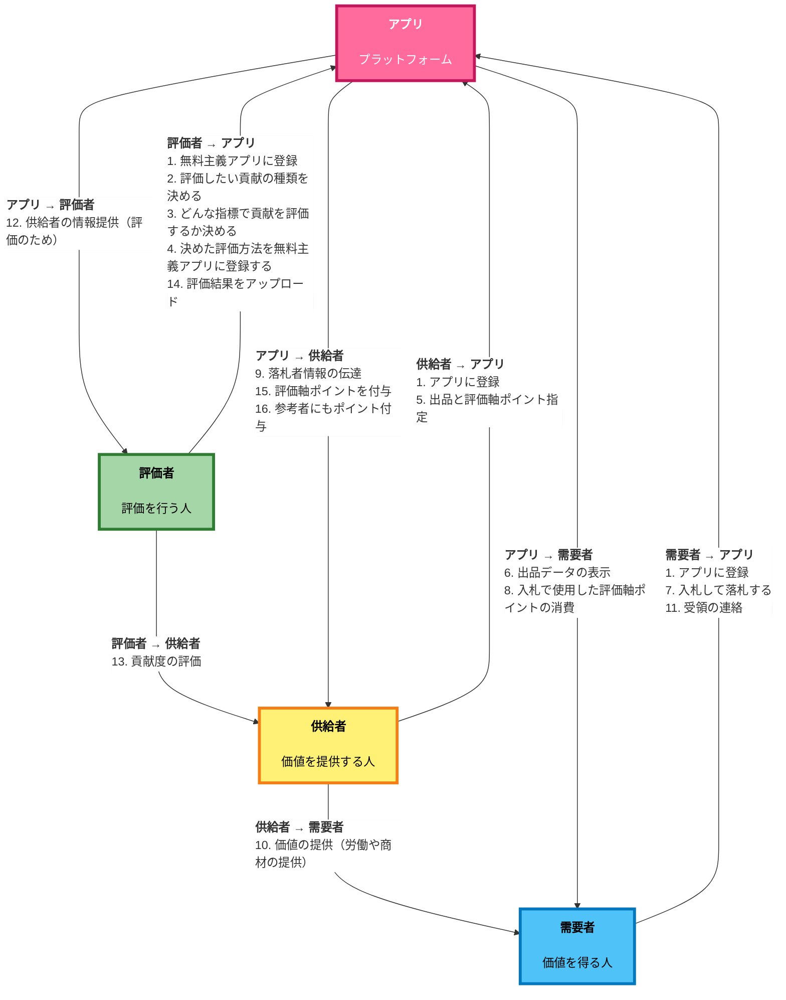
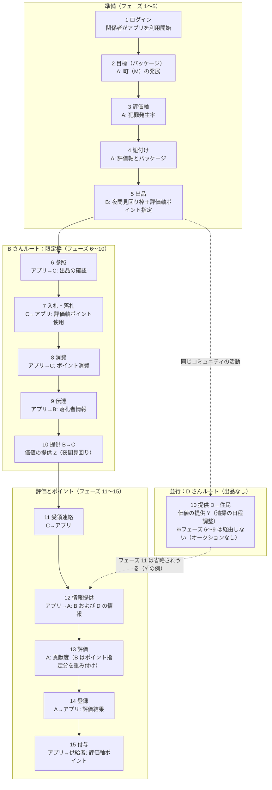
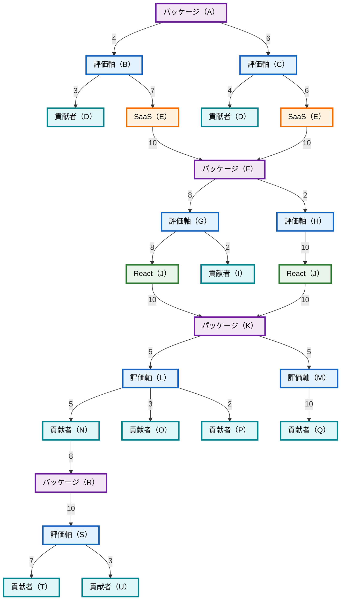
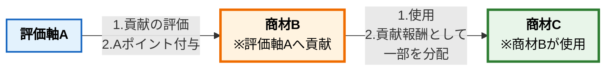
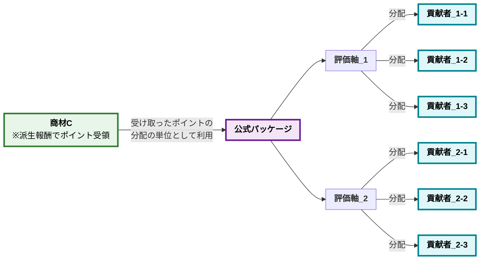

# 無料主義 v3

## 言語

日本語（本ページ）| [English](freeism.en.md)

## はじめに

社会の仕組みとして、「無料主義」という仕組みを考えました。<br>
資本主義を補助したり、代替する仕組みとしての使用を想定しています。

## 目次

- [無料主義 v3](#無料主義-v3)
  - [言語](#言語)
  - [はじめに](#はじめに)
  - [目次](#目次)
  - [概要](#概要)
    - [実現したいこと](#実現したいこと)
      - [大目標](#大目標)
      - [中目標](#中目標)
    - [簡単なメリット](#簡単なメリット)
    - [簡単な説明](#簡単な説明)
      - [資本主義と異なる部分（1）：3つの役割](#資本主義と異なる部分13つの役割)
      - [資本主義と異なる部分（2）：基本無料](#資本主義と異なる部分2基本無料)
    - [簡単な流れ](#簡単な流れ)
    - [少し詳しい流れ](#少し詳しい流れ)
    - [想定している使用場面](#想定している使用場面)
    - [簡単な例](#簡単な例)
      - [図解](#図解)
      - [流れ](#流れ)
    - [簡単な用語解説](#簡単な用語解説)
  - [無料主義のメリット](#無料主義のメリット)
    - [メリットのまとめ](#メリットのまとめ)
      - [「公開＆共有」関連のメリット](#公開共有関連のメリット)
      - [「時間・労力・費用を削減」関連のメリット](#時間労力費用を削減関連のメリット)
      - [「社会の仕組み改善」関連のメリット](#社会の仕組み改善関連のメリット)
      - [「感情＆思想」関連のメリット](#感情思想関連のメリット)
    - [メリットを詳しく](#メリットを詳しく)
      - [「公開＆共有」関連のメリット](#公開共有関連のメリット-1)
      - [「削減」関連のメリット](#削減関連のメリット)
      - [「社会の仕組み改善」関連のメリット](#社会の仕組み改善関連のメリット-1)
      - [「感情＆思想」関連のメリット](#感情思想関連のメリット-1)
  - [無料主義のデメリット・懸念点](#無料主義のデメリット懸念点)
    - [デメリット・懸念点のまとめ](#デメリット懸念点のまとめ)
    - [デメリット・懸念点を詳しく](#デメリット懸念点を詳しく)
  - [想定課題と結論](#想定課題と結論)
  - [今後考える必要があること](#今後考える必要があること)
  - [v2との大きな違い](#v2との大きな違い)
  - [無料主義を成立させる仕組み](#無料主義を成立させる仕組み)
    - [成立させる仕組みのまとめ](#成立させる仕組みのまとめ)
    - [評価軸の仕組み](#評価軸の仕組み)
    - [証明の仕組み](#証明の仕組み)
    - [互換性の仕組み](#互換性の仕組み)
      - [概要](#概要-1)
      - [各タスク全グループ評価法](#各タスク全グループ評価法)
      - [為替の仕組み](#為替の仕組み)
      - [ポイント交換の仕組み](#ポイント交換の仕組み)
      - [貢献評価を代用する仕組み](#貢献評価を代用する仕組み)
      - [譲渡の仕組み](#譲渡の仕組み)
    - [購入方式の仕組み](#購入方式の仕組み)
    - [貢献度の算出の仕組み](#貢献度の算出の仕組み)
      - [AIプロンプト](#aiプロンプト)
      - [「貢献度の算出の仕組み」の説明](#貢献度の算出の仕組みの説明)
      - [「貢献度の算出の仕組み」の例（完全版）](#貢献度の算出の仕組みの例完全版)
      - [「貢献度の算出の仕組み」の原則](#貢献度の算出の仕組みの原則)
    - [パッケージの仕組み](#パッケージの仕組み)
      - [概要](#概要-2)
      - [「OSS業界全体の発展」パッケージ](#oss業界全体の発展パッケージ)
        - [「OSS業界全体の発展」パッケージ（GitHub API）](#oss業界全体の発展パッケージgithub-api)
        - [「OSS業界全体の発展」パッケージ （GitHub API以外）](#oss業界全体の発展パッケージ-github-api以外)
      - [「指定OSSの発展」パッケージ](#指定ossの発展パッケージ)
        - [「指定OSSの発展」パッケージ（GitHub API）](#指定ossの発展パッケージgithub-api)
        - [「指定OSSの発展」パッケージ（GitHub API以外）](#指定ossの発展パッケージgithub-api以外)
      - [「幸福度の向上」パッケージ](#幸福度の向上パッケージ)
      - [他のパッケージの例](#他のパッケージの例)
    - [貢献検知の仕組み](#貢献検知の仕組み)
      - [概要](#概要-3)
      - [名前で検知する仕組み](#名前で検知する仕組み)
      - [評価軸検知の仕組み](#評価軸検知の仕組み)
      - [中間財検知の仕組み](#中間財検知の仕組み)
      - [参考検知の仕組み](#参考検知の仕組み)
      - [類似性の仕組み](#類似性の仕組み)
      - [クラスタリングの仕組み](#クラスタリングの仕組み)
    - [貢献報酬の仕組み](#貢献報酬の仕組み)
      - [概要](#概要-4)
      - [必要性の仕組み](#必要性の仕組み)
      - [評価精度の高さを検証する仕組み](#評価精度の高さを検証する仕組み)
      - [公式パッケージの仕組み](#公式パッケージの仕組み)
    - [代替性の仕組み](#代替性の仕組み)
    - [非干渉の仕組み](#非干渉の仕組み)
    - [汎用的な法律の仕組み](#汎用的な法律の仕組み)
    - [枠の仕組み](#枠の仕組み)
    - [限定オークションの仕組み](#限定オークションの仕組み)
    - [無料主義アプリ互換性の仕組み](#無料主義アプリ互換性の仕組み)
    - [フォークする仕組み](#フォークする仕組み)
    - [常時預ける仕組み](#常時預ける仕組み)
    - [キャンペーン・割引する方法](#キャンペーン割引する方法)
    - [価格を高くして販売する](#価格を高くして販売する)
  - [実現したいこと](#実現したいこと-1)
    - [大目標](#大目標-1)
    - [中目標](#中目標-1)
    - [小目標](#小目標)
      - [無料主義の戦略](#無料主義の戦略)
      - [様々な評価軸](#様々な評価軸)
      - [利益背反・トレードオフがない仕組み](#利益背反トレードオフがない仕組み)
      - [正確性より納得性](#正確性より納得性)
      - [ブロック経済を防ぐ](#ブロック経済を防ぐ)
      - [純粋公共財](#純粋公共財)
      - [受け取る側が加工する社会](#受け取る側が加工する社会)
      - [国](#国)
      - [生活水準の底上げ](#生活水準の底上げ)
      - [生産性・経済成長の指標](#生産性経済成長の指標)
      - [非干渉の権利](#非干渉の権利)
      - [オープン化](#オープン化)
      - [求人サービスのOSS化](#求人サービスのoss化)
      - [許可が不要な社会](#許可が不要な社会)
      - [Fediverse的社会の仕組み](#fediverse的社会の仕組み)
      - [給料の決まり方](#給料の決まり方)
      - [企業単位の「計画経済」から「市場経済」へ移行](#企業単位の計画経済から市場経済へ移行)
      - [無料主義にQV(quadratic voting)を導入する](#無料主義にqvquadratic-votingを導入する)
      - [インフレ](#インフレ)
      - [「囲い込みの競争」から「協力の競争」へ移行](#囲い込みの競争から協力の競争へ移行)
      - [民主主義](#民主主義)
      - [無料主義の借金の方法](#無料主義の借金の方法)
      - [意思決定者](#意思決定者)
      - [交渉の市場化](#交渉の市場化)
      - [無料主義の他の使用場面](#無料主義の他の使用場面)
      - [評価軸関連で実現したいこと](#評価軸関連で実現したいこと)
      - [研究の支援](#研究の支援)
      - [汎用的な法律](#汎用的な法律)
      - [無料主義で行いたいプロジェクト](#無料主義で行いたいプロジェクト)
      - [etc](#etc)
  - [参考にしたいこと](#参考にしたいこと)
    - [貢献度の算出の仕組み](#貢献度の算出の仕組み-1)
      - [貢献報酬の仕組み](#貢献報酬の仕組み-1)
      - [貢献検知の仕組み](#貢献検知の仕組み-1)
    - [意思決定](#意思決定)
    - [感情分析](#感情分析)
    - [ゲーム理論・マーケットデザイン・マッチング理論](#ゲーム理論マーケットデザインマッチング理論)
    - [類似性の仕組み](#類似性の仕組み-1)
    - [指標](#指標)
      - [コード系](#コード系)
      - [論文・ブログ系](#論文ブログ系)
      - [イノベーション系](#イノベーション系)
      - [その他](#その他)
    - [貢献度の算出理論](#貢献度の算出理論)
      - [統計学的・データ分析手法](#統計学的データ分析手法)
      - [心理学的理論](#心理学的理論)
      - [社会学的・経済学的理論](#社会学的経済学的理論)
      - [神経科学的理論](#神経科学的理論)
      - [重み付け](#重み付け)
    - [既存サービス](#既存サービス)
      - [データ取得元](#データ取得元)
        - [コード系](#コード系-1)
        - [その他](#その他-1)
        - [論文系](#論文系)
    - [非干渉の権利](#非干渉の権利-1)
    - [正当性](#正当性)
    - [etc の参考](#etc-の参考)
  - [資本主義から無料主義へ移行する方法](#資本主義から無料主義へ移行する方法)
  - [関連ツール](#関連ツール)

## 概要

無料主義の仕様をまとめた内容をご説明します。<br>
以下の各項目の詳細は次の章で解説します。

### 実現したいこと

無料主義で実現したいことを簡単にご説明します。<br>
詳細は、「[実現したいこと](#実現したいこと-1)」でご説明します。

#### 大目標

**「この世の全ての人が満足度の高い人生を送れる社会」の実現**<br>
人生のどこかで躓いたとしても皆が満足度の高い人生を過ごせる社会。

#### 中目標

1. **生活水準の底上げ**
   1. 「誰もが『普通』を得られる社会」の実現
      - ここでいう「普通」とは「自分自身が劣等感を持たない範囲内で生活できること」
   2. 「衣食住」・「人間関係」の充実度の向上
2. **安心して生活できる社会**
   - 利益背反がない社会
   - 治安の良い社会
3. **技術革新のスピード向上**

### 簡単なメリット

無料主義のメリットを簡単にご説明します。

1. **需要者と供給者のインセンティブ一致**
   - **資本主義**では、供給者は高く売ることを目指し、需要者は安く買うことを目指す。<br>**無料主義**では、供給者は安く売ることを目指し、需要者は安く買うことを目指す。<br>↓<br>**無料主義には、インセンティブの一致がある。**
   - 資本主義では顧客のためになる行為もあるが、同時に顧客の利益に反する「高く売る」インセンティブもある。<br>↓<br>**それを無料主義が解決できる。**
2. **資本主義では成り立たないビジネスモデルが実現可能（費用負担のない仕組み）**
   - 供給者への報酬は「**受益者に支払い能力があるか**」ではなく、「**評価軸に貢献しているか**」で決まる
   - **資本主義**では、享受する人や関連する第三者による料金の支払い能力が必須。<br> **無料主義**では、料金の支払い能力が無くても各評価軸に貢献すれば報酬が得られる
     - 資本主義
       - お金を払う能力がない・お金を払うビジネスモデルだと成り立たない
       - 報酬が無いと、仕事として成り立たない
     - 無料主義
       - 貢献した分だけ報酬が発行されるので、需要者の費用負担がない
       - 無料主義では、サービスを享受する対価を支払わなくても、サービスを提供する人は対価が得られる仕組み
3. **無料 or 大幅な値下げで提供される**
   - 無料主義の仕組みとして、供給者は、基本無料で商品を販売する
   - もし供給量より需要量が多い場合は、需要者が保有するポイントを使用して購入するが、「**供給者への報酬**」ではなく「**優先的に得る権利の購入**」のためだけに使用するため、現在よりは価格が安くなる
   - 無料で提供しても、供給者は第三者からの評価によって報酬が得られる
4. **一つの作業を複数の視点（評価軸・価値観）から評価でき、報酬が得られる**
   - 例）環境保護、生産性の向上、幸福度の高い生活、町の発展、OSS の発展など
5. **資本主義よりも、市場化・競争激化・最適化・効率化・オープン化・透明化された社会になる**
   - 市場化
     - より多くのモノ・コトが商材として売り買いできる社会
     - 「評価経済への移行」によって市場化が加速する
   - 競争激化
     - より独占がなくなり、競争できる環境・競争相手が増え、商材の質が高まる社会
     - Fediverse 的サービスの増加
   - 最適化
     - 資本主義の仕組みで利益を最大化するよう最適化するだけでなく、様々な指標に対して最適化される社会
     - 「評価軸の仕組み」によって、様々な指標に最適化される
     - 資本主義よりも柔軟にインセンティブ設計を作れる
   - 効率化
     - 市場化・競争激化・最適化によって、より効率的な社会になる
   - オープン化
     - オープンソースでも参考にされれば報酬が得られるので、オープンな商材が増える
     - 車輪の再開発が少なくなる
     - 貢献度の算出のために、データをオープンにする仕組みにより、資本主義よりオープン化する
6. **利益の追求による不利益のない社会**
   - 利益のために、顧客に不利なことをしない社会
   - 売り上げのために、「修理ができない設計」などの消費者が損をするビジネスの方法をしたら報酬を少なくなる
   - 需要者と供給者のインセンティブが一致するため、利益背反は起こりにくくなる
7. **供給量の上昇**
   - 商材の値段が下がることで資本主義よりも多くの人に商材を提供できる

### 簡単な説明

#### 資本主義と異なる部分（1）：3つの役割

無料主義は、以下 3 つの役割で構成される仕組みです。<br>
「**需要者**」とは別で存在する「**評価者**」が「**供給者**」に対して報酬を支払います。<br>
※3 つの役割を兼務することも可能です。

1. **供給者**
   - 商品を提供する役割
2. **評価者**
   - 供給者を評価し、評価結果の分だけ供給者にポイントを付与する役割
3. **需要者**
   - 供給者が販売する商品を購入する役割

#### 資本主義と異なる部分（2）：基本無料

供給者は、基本的には無料で販売します。<br>
無料だと需要量が供給量を上回る場合があります。<br>
その場合のみ、需要者が保有するポイントを使用してオークションを行い、「**優先的に得る権利**」を購入します。<br>
この購入によって使用したポイントは、「**供給者の報酬**」にはなりません。
※例外はあります。

### 簡単な流れ

以下の`1.`〜`4.`を繰り返します。

1. **供給者**が、商品を提供します
2. **需要者**が、商品を購入します
3. **評価者**が、供給者を評価します
4. **評価者**が、評価結果をもとに、ポイントを供給者に付与します

### 少し詳しい流れ

`1.`〜`4.`の後は、`5.`〜`15.`を繰り返します。



1. **（供給者→アプリ、評価者→アプリ、需要者→アプリ）無料主義アプリにログイン**
   - これからの無料主義の流れを行うためにログインが必要
   - 補足：「無料主義アプリ」は、無料主義のあらゆる機能を管理するアプリのこと
2. **（評価者→アプリ）評価したい貢献の種類を決める**
   - この評価したい貢献の種類を「パッケージ」と呼ぶ
   - 例）自分が住む街の発展
3. **（評価者→アプリ）どんな指標で貢献を評価するか決める**
   - 設定した評価したい貢献（パッケージ）を評価する軸（価値観・視点・指標）を決める
   - 評価する軸は、なんでも良いし、自由に作り出して良い
   - 評価する軸のことを「評価軸」と呼ぶ
   - 例）犯罪発生率、電車の止まる本数
4. **（評価者→アプリ）決めた評価方法を無料主義アプリに登録する**
   - 無料主義アプリ上に、作成した「パッケージ」と「評価軸」を紐付けて登録を行う
5. **（供給者→アプリ）出品と評価軸ポイント指定**
   - 補足
     - 「評価軸ポイント」は、その評価軸に属する評価者が供給者の貢献度合いに応じて発行し、供給者に付与するポイントのこと。後ほど詳しく解説
   - 出品
     - 出品するコンテンツは、価値を提供する内容であれば、なんでも良い
     - 例）ゴミ拾い、町内会の活動、町内会の資金を管理する SaaS の開発、限定品全般、労働・権利
   - 評価軸ポイント指定
     - 需要量が供給量を上回る場合はオークションを行うが、その際に需要者が使用できる評価軸ポイントを、供給者が出品の設定時に指定する
     - 供給者がポイントの使用用途を作ることで、応援したい評価軸のエコシステム発展に貢献する。それにより、その評価軸ポイントを報酬として追加で得ることができる
   - ポイント
     - **商品やサービスを無料主義アプリに出品することは必須ではありません。**
     - 無料主義アプリに出品しなくても、貢献は評価されます
     - しかし、出品して評価軸ポイントを指定することで、其の評価軸ポイントの使い道が増え、その評価軸のエコシステム発展に貢献するため、通常より重み付けして評価してくれる評価軸も出てくるでしょう
     - 評価者が、「評価軸ポイント指定」による報酬を上乗せして評価軸エコシステムを育てるインセンティブは、自分が保有する「その評価軸のポイント」の使い道を増やすためです
6. **（アプリ→需要者）出品データを表示する**
   - 需要者が、供給者の出品した商材を無料主義アプリ上で確認する
7. **（需要者→アプリ）入札して落札する**
   - 基本的には、無料で供給者から商品やサービスを得られる
   - 需要量が供給量を上回る場合は、供給者が指定した評価軸ポイントを入札として使用してオークションを行う
8. **（アプリ→需要者）入札で使用した評価軸ポイントを消費する**
   - 無料主義アプリ側で、オークションに使用した評価軸ポイントが消費される
9. **（アプリ→供給者）落札者情報の伝達**
   - 無料主義アプリが供給者に対して、落札した需要者の情報を伝える
10. **（供給者→需要者）価値の提供（労働や商材の提供）**
     - 実際に、供給者が需要者へ商材を提供する
11. **（需要者→アプリ）受領の連絡**
    - 需要者が、受領や完了などをアプリ上で連絡する
12. **（アプリ→評価者）評価のための供給者情報の提供**
    - アプリが評価者に、評価に必要な範囲で供給者の情報を提供する
13. **（評価者→供給者）貢献度の評価**
    - 評価軸が「犯罪発生率」の場合など、設定した評価軸に沿って貢献度を評価する
14. **（評価者→アプリ）評価結果を無料主義アプリに登録**
    - 評価者が評価結果をアプリに登録・アップロードする
15. **（アプリ→供給者）評価軸ポイントを付与する**
    - 評価軸が発行するポイントを「評価軸ポイント」と呼ぶ
    - 評価結果をもとに、アプリ側の処理などを経て供給者に評価軸ポイントが付与される
    - 供給者は、1 つの労働で複数の評価軸から評価されるし、複数の評価軸ポイントを受け取る
      - 供給者の A 作業が、B,C の評価軸から評価された場合は、B,C のポイントをそれぞれ付与する
    - 「他の人から得たポイント」が報酬になるのではなく、「第三者による評価」が報酬になる
      - 評価軸ポイントは、需要側が優先的に得るためのみに使用する
      - 需要側がポイントを使用しようが、設定した目標に貢献しなければ供給者は報酬を得られない
16. **（アプリ→供給者）参考者にもポイント付与**
    - ポイントを得た供給者(A)は、貢献するために他の供給者(B)を参考にしている場合がある。<br>その場合は、参考にした供給者(B)にも、供給者(A)が獲得したポイントの一部が付与される

### 想定している使用場面

- 今後
  1.  この世のすべての取引
      - 有形の品物や、労働・技能・知識の提供、デジタルコンテンツの配布など、価値が移転するすべての取引

- 直近
  1.  OSS の運営
      - メンテナーがコード・ドキュメント・リリース・レビューなど
      - メンテナンスの工数やサポート枠など「量に限りがある供給」に対して、優先的に扱ってもらう権利や、限定サポート枠を評価軸ポイントで配分する、といった場面
      - 評価軸の例としては、セキュリティ対応の速さ、後方互換性の維持、Issue 対応の丁寧さ、コミュニティの健全性など
  2.  地域コミュニティでの技能・余剰リソースの提供
      - 工作相談、PC トラブル対応、自治会や NPO の事務作業、物品の修理や貸出など、人手・モノに限りがある活動
      - 評価軸の例としては、見守り活動への参加、ごみ減量への協力、災害時連絡網の把握度など
  3.  教育・文化・クリエイティブ分野の無料公開
      - 講義資料、チュートリアル動画、演奏や朗読の録音、イラスト素材の無料公開など
      - 添削枠、質問応答枠、ワークショップの席、印刷物の手渡しなど「物理的・時間的に限られた供給」への優先アクセスを、評価軸ポイントで優先権を購入する
      - 評価軸の例としては、学習者サポートへの協力、著作権・クレジット表示の遵守、二次利用しやすいライセンス選択など

### 簡単な例

#### 図解



#### 流れ

1. A さん、B さん、C さん、D さんなどの関係者が、無料主義アプリでアカウント作成・SNS アカウント連携などを行う
   - フェーズ
     - **（供給者→アプリ、評価者→アプリ、需要者→アプリ）無料主義アプリにログイン**
2. A さんが、評価したい貢献の種類として「町（M）の発展」を決め、この種類をパッケージとして無料主義アプリ上に登録する
   - フェーズ
     - **（評価者→アプリ）評価したい貢献の種類を決める**
3. A さんが、評価軸「犯罪発生率」と「人口増加」で、あらゆる作業を評価することを決める
   - フェーズ
     - **（評価者→アプリ）どんな指標で貢献を評価するか決める**
4. A さんが、評価軸「犯罪発生率」と「人口増加」をパッケージ「町（M）の発展」と無料主義アプリ上で紐付ける
   - フェーズ
     - **（評価者→アプリ）決めた評価方法を無料主義アプリに登録する**
5. B さんが、その町（M）夜間見回りで回る地域の枠を 5 か所限定で出品（Z）<br>また、需要者が使用できる評価軸ポイントとして評価軸「犯罪発生率」と「人口増加」の組み合わせて入札する際のを指定したうえで、無料主義アプリに出品する
   - フェーズ
     - **（供給者→アプリ）出品と評価軸ポイント指定**
   - 補足
     - パッケージの意味としては、評価軸「犯罪発生率」と「人口増加」の組み合わせて入札が必要な設定をするための情報をまとめておくための箱になる。<br>毎回同じ情報を入力する必要がなくなるようにパッケージだけ指定すれば良い設計のために使用する
6. C さんが、無料主義アプリ上で B さんの出品内容（価値の提供 Z）を確認する
   - フェーズ
     - **（アプリ→需要者）出品データを表示する**
7. C さんが、無料主義アプリに出品された「夜間見回り地域の枠」オークションに、評価軸「犯罪発生率」ポイントを入札として使用し、落札する
   - フェーズ
     - **（需要者→アプリ）入札して落札する**
   - 注意
     - 基本的には無料で提供してもらいます
     - 本例のように需要量が供給量を上回る場合は、供給者が指定した評価軸ポイントを入札に使うオークションの流れになります
8. アプリ側で、C さんがオークションに使用した評価軸「犯罪発生率」ポイントが消費される
   - フェーズ
     - **（アプリ→需要者）入札で使用した評価軸ポイントを消費する**
9. アプリが B さんに、落札した C さんの情報を伝える
   - フェーズ
     - **（アプリ→供給者）落札者情報の伝達**
10. 供給者から需要者への価値の提供として、次のことを行う
    - 行うこと
      1. B さんが C さんに、落札した「落札地域への夜間見回り」を提供する
      2. 並行して、D さんは、価値の提供 Y（清掃のスケジュール調整）を行い、その町に住む方々が成果物を受け取る
    - フェーズ
      - **（供給者→需要者）価値の提供（労働や商材の提供）**
    - D さんの場合分け
      - **無料主義アプリに出品しない場合**
    - 補足（D さんルート）
      - D さんの例のように出品がない場合は、`6.`〜`9.`（出品の参照から落札者情報の伝達まで）は該当しない
      - 住民全員向けに無償で提供できる内容であり、無料主義アプリを介した入札・評価軸ポイントの消費・落札者情報のやりとりがない
      - 提供内容は誰もが得られるサービスであるため、出品は不要で、オークションもない
11. C さんが、受領や完了などを無料主義アプリ上で連絡する
    - フェーズ
      - **（需要者→アプリ）受領の連絡**
    - 補足
      - 価値の提供 Y（清掃のスケジュール調整）では、住民各自が明示的にアプリで連絡する必要はない
12. アプリが A さんに、評価に必要な範囲で B さん（および評価対象となる D さん）の情報を提供する
    - フェーズ
      - **（アプリ→評価者）評価のための供給者情報の提供**
13. A さんが設定した評価軸「犯罪発生率」に沿って、B さんと D さんの貢献度を評価する
    - 補足
      - B さんは評価軸ポイントを指定して出品したため、通常の貢献による評価に加えて重み付けする
    - フェーズ
      - **（評価者→供給者）貢献度の評価**
    - 貢献度の計算方法
      - 参加者内で議論して決めたり、目標を定量化した指標と商品供給の相関性や因果関係から貢献度を決めるなど、様々な方法で決めるとよい
14. A さんが、評価結果を無料主義アプリに登録する
    - フェーズ
      - **（評価者→アプリ）評価結果を無料主義アプリに登録**
15. 評価結果をもとに、無料主義アプリ側の処理などを経て、評価軸「犯罪発生率」ポイントが供給者に付与される
    - フェーズ
      - **（アプリ→供給者）評価軸ポイントを付与する**
    - 補足
      - 供給者のある作業が複数の評価軸から評価された場合は、評価軸ごとのポイントをそれぞれ付与する
      - 供給者は、1 つの価値の提供で複数の評価軸から評価され、複数種類の評価軸ポイントを受け取れることになる
    - ポイント
      - 「他の人から得たポイント」が報酬になるのではなく、「第三者による評価」が報酬になる
    - 運用の例
      - 貢献度の決定後に、評価者または代表者が無料主義アプリに情報を入力してポイント付与を行う
16. 供給者 B さんが、貢献するために参考にした E さんにも、B さんが獲得した評価軸ポイントの一部が付与される
    - フェーズ
      - **（アプリ→供給者）参考者にもポイント付与**
    - 補足
      - 供給者 B さんが、貢献するために参考にした E さんにも、B さんが獲得した評価軸ポイントの一部が付与される
      - これにより、E さんは B さんの貢献を参考にして行動したことが評価される

### 簡単な用語解説

無料主義を構成する仕組みについて解説します<br>
※それぞれの単語の詳しい内容は「[無料主義を成立させる仕組み](#無料主義を成立させる仕組み)」で解説します

1. **無料主義アプリ**
   - 説明
     - 無料主義アプリとは、無料主義に必要な機能を提供するアプリのこと
   - 機能例
     1. **評価軸の作成**
     2. **パッケージの作成**
     3. **評価軸とパッケージの紐付け**
     4. **自身のポイント管理**
     5. **オークション（出品・入札・落札・ポイント消費）**
     6. **貢献度の算出**
     7. **評価結果を登録できる権限の管理**

2. **パッケージ**
   - 説明
     - 評価者が無料主義アプリ上で設定する「目標・評価したい貢献の種類」のこと
   - 例
     - 自分が住む街の発展

3. **評価軸**
   - 説明
     - パッケージ（目標）の達成に貢献しているかどうかを測る、「指標・評価の観点・価値観」のこと
     - 評価軸から評価ポイント・評価軸ポイントが発行される
   - 例
     - 犯罪発生率、電車の止まる本数、人口
   - 評価軸の仕様
     - 複数所属できる
     - 誰でも簡単に評価軸を作成できる
     - それぞれの評価軸の仕組みは、1 つの評価する「指標・評価の観点・価値観」を持つ
     - どれくらいの粒度の指標にするかは自由

4. **評価軸とパッケージの紐付け**
   - 無料主義アプリ上で、作成したパッケージと評価軸を対応づけて登録すること
   - 1 つのパッケージに複数の評価軸が属する
   - 1 つの評価軸は複数のパッケージに属しても良い

5. **評価軸ポイント**
   - 評価軸から発行され、付与されるポイントのこと
   - 貢献したときに与えられ、限定品を優先的に獲得するために必要なポイント

6. **供給者**
   - 商品やサービスなど、価値の提供を行う役割のこと
   - 無料主義アプリに出品し、評価後に評価軸ポイントの付与を受ける側

7. **需要者**
   - 供給される商品やサービスを受け取る側の役割のこと
   - 入札・落札などで限定品などの獲得を目指す

8. **評価者**
   - 供給者の貢献を評価し、評価結果に応じて評価軸ポイントを付与する役割のこと
   - パッケージの設定、評価軸の設定、評価軸とパッケージの紐付けも行う
   - 需要者・供給者と役割を分けたうえで、兼務することも可能

9. **預ける・占める**
   - 無料主義アプリに評価軸ポイントを預けて、一定期間だけ使用不可にすること
   - ある評価軸によっては、落札してもポイントを消費せず、ただ無料主義アプリに一定期間だけ預ける方式も可能

10. **限定品**
    - 欲しい人全員が得られない商品やサービスのこと

11. **マイナス影響**
    - 評価軸・パッケージの内容に貢献せず、逆に達成から遠ざける行為のこと

12. **マイナス評価**
    - マイナス影響になる行為を行ったときの評価結果のこと
    - 評価軸によっては、マイナス評価になると、評価軸ポイントが没収される

13. **マイナス評価による罰金・罰則**
    - 無料主義では、評価軸の方向性と逆行する場合は、マイナス評価になり、「ポイント付与」ではなく「ポイント没収」になります

14. **プロジェクト**
    - 現在の株式会社の代わりの仕組みのこと

15. **評価軸のルール**
    - 評価軸のルールとは、無料主義の社会で生活していくうえでの法律のこと

16. **貢献度の算出の仕組み**
    - それぞれの取引ごとに、評価軸の価値観に貢献した度合いを算出する仕組みのこと
    - 「貢献度の算出」に市場原理が内包する場合もあります

17. **非干渉の権利**
    - 別の価値観の人からの考え・価値観の押し付けを受けない権利のこと

18. **非干渉の仕組み**
    - 「非干渉の権利」を実現させる仕組みのこと

19. **評価軸クラスタ・パッケージクラスタ**
    - その評価軸・そのパッケージに貢献したい人達（同じ価値観の人達）の集まりのこと
    - 「評価軸クラスタ」でコミュニティ・街・会社・国を作ることを想定している

20. **「無料主義アプリの発展」パッケージ**
    - 説明
      - 無料主義アプリのエコシステム発展の評価を行うパッケージ
    - そのパッケージの評価項目
      1. **別の評価軸クラスタには干渉しない**
      2. **評価軸クラスタで活動している人達は、いつでも抜けたいと言えば確実に抜けられる権利の保障**

21. **価格**
    - 無料主義では、評価軸ポイントの使用量が価格になります

22. **貢献報酬の仕組み**
    - 説明
      - A さんが貢献したときに、B さんも A さんの貢献に関連していた場合、B さんに対しても、A さんが得た評価軸ポイントの一部が得られる仕組みのこと
    - 例
      - 一緒に作業する
      - 自分の研究結果が参考にされる
      - アレンジする
      - 他社の作成した部品を使用して作成し販売する

23. **貢献検知の仕組み**
    - A さんが貢献したときに、A さんの貢献に関連している人がいるか調査・検知する仕組みのこと

24. **汎用的な法律**
    - 評価軸の評価を法律として使用する考え方
    - 評価軸でマイナス評価になった場合は罰則・罰金を科す
    - どんな行為が違法かどうかは、評価軸の貢献度合いがマイナスかどうかのみで決まります
    - 例）窃盗でさえ誰にも悪い影響を与えなければ犯罪ではなくなります。でも窃盗によって評価軸の数値がマイナスになる場合は違法になります
    - 悪影響を与えた行動も補足して評価する

25. **評価軸ポイントを預ける期間**
    - 無料主義アプリに、評価軸ポイントを預ける期間のこと
    - 評価軸によって預ける期間の算出ロジックは異なる
      - 例）預け期間は、「落札額 × 入札参加者数」に比例して長くなります

26. **落札率・当選率**
    - 入札に参加した人の中で、実際に落札する人の割合です

27. **無料主義アプリの出品タイプ**
    1. **供給者が出品するタイプ**
       - 供給者が「この仕事をしてくれる人を募集」するタイプ
       - 先に無料主義アプリへ実装するタイプ
    2. **需要者が出品するタイプ**
       - 需要者が「特定の貢献をしてくれたら、その見返りとしてポイントを支払う」などの条件で募集するタイプ
       - ダッチオークション形式

28. **商品を得る方法**
    1. **オークション入札**
    2. **即決価格**
    3. **保有ポイント総額で優先順位を決める**
    4. **先着順**
    5. **ポイント譲渡**
    6. **抽選**
    7. **上記の組み合わせ**
       - 例）一定以上の入札額を提示した人の中から抽選や先着

29. **落札した人に提供するインセンティブ**
    1. **使用による参考報酬を得るため**
       - 無料主義では、落札した人に商品を提供しないと、自分が提供した商品によって落札した人が「どんな変化が起こったか」が分からないから、貢献度を判断できない
       - 参考にした人が得たポイントの一部を、商材提供した人が得られる
    2. **エコシステム発展に貢献して報酬を得るため**
       - 落札した人に提供しないとエコシステムに貢献できない。なのでポイントがもらえない

30. **出品商材の入札に使用できるポイントの種類を決める方法**
    1. 需要者が、どの評価軸ポイントを使用して購入するか決める方式
    2. 供給者が、どの評価軸ポイントを使用して購入できるか決める方式
    3. 評価者が、どの評価軸ポイントを使用して購入できるか決める方式
    4. 無料主義アプリの管理者が、どの評価軸ポイントを使用して購入できるか決める方式

31. **無料主義における「労働の種類」**
    1. **無料主義アプリへ出品を貢献として評価する仕組み**
       - 成果物を無料主義アプリに出品する必要はありません
       - でも、出品することで評価軸ポイントの使い道が増え、その評価軸のエコシステム発展に貢献するため、通常のポイントに上乗せしたほうが良い
       - ポイントを使用する場所を用意することで、ポイントを稼ぐインセンティブ構造を作れる
    2. **評価する労働（評価者）を貢献として評価する仕組み**
       - 評価者が評価軸をエコシステムとして育てるインセンティブは、評価することによるエコシステムからの評価と保有ポイントを使用する場面を増やすため
    3. **出品しない労働**

32. **無料主義当選率**
    - 「入札した人がどれだけ落札できているか」の割合を指標
    - 100％以上が最大で、できるだけ 100％に近づけたほうが良い。という指標
    - 「成長の有無」よりも、多くの人の需要をどれだけ満たしているかを重視し、その指標で充足度を判断できるようにしたい

33. **供給側が報酬を得るための方法は主に下記の 2 つ**
    1. 消費者に商品を提供することで、評価軸に貢献すること。その評価軸に貢献したときの報酬
    2. 消費者に商品を提供して、その提供した 消費者が稼いだ 評価軸ポイントの一部を得る。 商品を提供した消費者が稼いだ 貢献の一部を得る報酬

## 無料主義のメリット

無料主義のメリットをご説明します。

### メリットのまとめ

無料主義のメリットは、主にこれからご説明するようなメリットがあります。<br>
詳細については、次の段落で詳しくご説明していきます。

#### 「公開＆共有」関連のメリット

- ノウハウ・データなどが公開＆共有する社会になる
- 相互運用性が高まる
- 参考にされただけで報酬が得られる
- 学習データなどのサービスの質向上のためのデータ量の増加
- 「どれだけ差別化できるか」から「どれだけ共有できるか」を競争する社会になる
- ネットワーク外部性が働きにくく、サービス利用者の流動性が高くなる
- 透明性が高まる
- サービスや国やそれぞれのレイヤーで、依存せず制裁耐性を持てる
- 新しい相関関係・価値のある行動を発見できる
- 独占されることが少なくなる
- 企業同士の無駄な独占競争がなくなり、他国同士の争いも発生しにくくなる
- 車輪の再開発が無くなる
- 想像すらしていなかった使い方を様々な人が使えるような社会になる
- IT 分野のセーフティーネットを作れる
- 人事評価で成果主義を採用すると、個々人がノウハウを共有しようとしないデメリットを解決できる
- 参入障壁を下げることが報酬を得られる行為になる
- 今まではお金が介在しない部分でも対価が得られるようになる
- 「正の外部性に対価」「負の外部性に費用」を与えられる
- アイデアを出すだけでも評価されるようになる
- 失敗しても対価を与えることができる
- 「競争のある独占市場」を作れる
  - 「競争のある市場」と「独占市場と同規模の経済」のメリットを両立できる状態

#### 「時間・労力・費用を削減」関連のメリット

- 値段が安くなる
- 特許や著作権関連で値段が高い商品も安くなる
- 税金が不要で、税金のメリットを活かせる
- 合理的な意思決定がされやすくなる
- 立法の労力・費用・時間などのコスト削減
- 問題発生から法律を施行するまでのタイムラグの削減
- 税設計による経済損失の削減
- 費用負担なしで、供給者に対価を支払える
  - 対価を払う必要がないので、貧困層も先進国と同じような顧客になる
  - 報酬の上限や下限は無い
- 費用が安くなることで効率化サービスの利用率が高まり、よりあらゆる部分を効率化できる
- 企業との交渉が不要になり、労力・費用・時間を削減できる
- 詐欺の被害を軽減できる
- 国の手続きが効率的になる

#### 「社会の仕組み改善」関連のメリット

- 納得できない法律が減る
- 汎用的な法律を作れる
  - 法律の細かい定義が不要で、今よりも柔軟に、幅広く、どれだけニッチな問題にも対応できる場面が増える
- 行政・国間の競争促進
- 法律をハック・悪用されることが少なくなる
- 国の立ち上げが簡単になる
- 既得権益を減らす
- 「良いことでも報酬がなく」「悪いことでも罰がない」といった状況へ対処できるようになる
- 法律が分かりやすくなる
- 「移動による投票」が行われやすくなる
- 貧困層にどれだけ分配するのかの意見の不一致が起こりにくい
- 死荷重がなくなる
- 無料主義は、汎用 AI が人間を超えるまでの経済のつなぎとして機能する
- ダンピングがあっても、全体の利益を維持できる仕組み
- 無料主義では、ぼったくりが減る
- 無料だったら需要があるサービスをビジネスとして成立させられる
- 会社をフォークできる
- 解雇規制を廃止できる
- ストライキをする必要はない
- 供給側が自ら値段を決める必要が無い
- 物理的に搾取できない仕組みがある
- 賃金を簡単に上げられる
- 分配が不要
- 許可が不要になる社会
- 申請主義の廃止
- 〇〇 to earn の仕組みを作れる
- 公共サービスが充実する＆公共サービスの財源問題を解決できる
- カルテルが行われない
- パチンコやその他の賭け事も少なくなる
- 下請けの搾取がなくなる
- 競争がなくても改善するインセンティブを作れる
- 政府が給料を決めなくなる
- あらゆる海賊版がなくなる
- 生成 AI の学習データ問題の解決
- 供給側と需要側の対立を解消できる
- 市場の失敗を解決できる
- 中立な報道機関
- 事件を発見できる
  - 「汎用的な法律」により、マイナス評価から事件を発見できる
- 法律の抜け道を無くせる
- ブルシットジョブがなくなる
- 広告が少なくなる
- DX が進む
- 搾取は少なくなる
- あらゆる指標で評価できる

#### 「感情＆思想」関連のメリット

- 干渉されない社会になる
- 思想ごとに分かれて生活できる
  - 他人の行動は気にせず、自分への干渉だけは避けたいという考えを、今より実現しやすくなる
  - 特定の既得権益の意見を重視した政治が行われにくくなり、生活の質が高まる
- コンテンツを削除せずに安全を守る
- 関わりたくない人と関わる必要がなくなる
- 多様性が生まれる
- 大きな思想の分断がなくなる
- 評価軸の仕組みで思想ごとに分かれるため、大きく意見が分かれる議論は不要になる
- 誹謗中傷の非表示・反対意見の非表示
- 無料のサービスに対して責任感と提供する側のストレスを緩和する
- 差別を少なくできる
- 加工する社会を作れる
- 対立が無くなる

### メリットを詳しく

今までに記載したメリットを、これから詳しくご説明していきます。

※詳細は「[無料主義を成立させる仕組み](#無料主義を成立させる仕組み)」に記載しますが、次の「[メリットを詳しく](#メリットを詳しく)」の理解のためにこちらにも簡単に記載します。

#### 「公開＆共有」関連のメリット

公開＆共有される系のメリットを、少し詳しくご説明していきます。

1. **公開＆共有する社会になる**
   - 説明
     - 「貢献検知の仕組み」により、公開と共有のほうが評価軸ポイントを稼ぎやすいので、積極的な情報共有が進む社会になる
     - あらゆるノウハウ、特許、設計、などがオープンソースになる社会
     - ※もちろん、情報公開して参考にした人のポイントの一部を得るより、ノウハウを独占して評価軸に貢献するほうが、評価軸ポイントを得られる場合はクローズドになる
     - 一番貢献度を稼げるのは、需要の高い商品やサービスを全員へ届けることではなく、ノウハウを共有して多くの人の参考になることです<br>それにより共有を競う動きが生まれ、ほかの良いメリットも生まれる
   - **公開＆共有するインセンティブを作るロジック**
     1. 「貢献検知の仕組み」を使用する
        - 「貢献検知の仕組み」を活用して、参考にされただけで、参考にした人が稼いだ評価軸ポイントの一部を得られるため、公開するインセンティブになる
     2. 評価軸に貢献よりも、参考にしてもらったほうが報酬を多めにする
        - 加えて、評価軸に貢献するだけではなく、参考にしてもらうほうが報酬（評価軸ポイント）が多くなるように重み付けする
        - 公開と共有で参考にされやすくすれば、報酬も得やすいよう重み付けする
     3. 「公開＆共有する」という、オープンにすること自体を評価軸の指標にして、オープンにすればするほど報酬がもらえる仕組みを作る
        - マイナス評価にならないように公開する
        - オープンソースにすることによって得られる評価軸ポイントが、ノウハウを公開＆資産の共有をせず独占することによって得られる評価軸ポイントよりも、常に上回るように重み付けする
     4. 公開すれば判断材料も増え、評価も受けやすくなるため、オープン志向が強まる
        - クローズドで運営しても問題ないが、それでは人気が得られないし、参考にもされないし、見向きもされなくなる

2. **中間層の底上げ**
   - 説明
     - 無料主義では、今より多くの情報やノウハウがオープンになる。それにより、全体が便益を得られる
     - 技術に疎い人はオープンになった情報でリテラシーが底上げされ、賢い人は新技術開発の為のアイデアを出すお金や労力を削減できる
     - すべての情報がオープンになって損するのは、嘘・薄い情報を情報商材などで売ってる人達だけ
     - さらに、アイデアを発信することで、自分が何を考えているかを相手に知ってもらえ、同じ考えを持つ人たちと SNS で繋がれるし、そこから有益な情報も新たに得られる

3. **参考にされただけで報酬が得られる**
   - 説明
     - 「貢献検知の仕組み」により、参考にされただけで、参考にした人が稼いだ評価軸ポイントの一部が得られるようになる

4. **相互運用性が高まる**
   - 実現するロジック
     1. 公開＆共有をして「貢献検知の仕組み」で積極的に参考にしてもらって評価軸ポイントを稼ぐために、相互運用性を向上させる
     2. 顧客から選ばれやすくするため、相互運用性を高める
     3. 直接的な方法として「相互運用性を高める」評価軸で評価するために相互運用性を向上させる

5. **学習データなどのサービスの質向上のためのデータ量の増加**
   - 「データを公開＆共有する社会」になることで実現される

6. **「どれだけ差別化・独占できるか」から「どれだけ共有・協力できるか」を競争する社会になる**
   - 「貢献検知の仕組み」と「オープンにする評価軸」により、参考・使用してもらったほうが稼げるため、「どれだけ先に、どれだけ評価軸に貢献する内容を公開＆共有できるか」競争する社会になる

7. **ネットワーク外部性が働きにくく、サービス利用者の流動性が高くなる**
   - 相互運用性が高まることで実現できる
   - 下記の問題がある
     - 本当は改善したいサービスがあるが、フォークして改善してもネットワーク外部性でユーザーを集められない
     - 相互運用性がないことによって拡張機能として改善したバージョンの機能を提供することもできない
   - ネットワーク外部性が働かないメリット
     - 基本同じサービスだけど一部機能が違うサービスを作成でき、一部機能が違うサービス同士で連携が可能になる

8. **サービスや国やそれぞれのレイヤーで、依存せず制裁耐性を持てる**
   - オープンになることで、あらゆることに依存しにくくなる

9.  **新しい相関関係・より正確な貢献度・価値のある行動を発見できる**
    - データ分析で貢献度を算出することが増えるため、貢献度の算出を行う過程でより正確な貢献度を発見できる
    - 授業態度を算出したり、夫と妻の育児への貢献度を算出できたり、あらゆるものを算出できるようになり、よりよく理解できるようになる

10. **独占されることが少なくなる**
    - 説明
      - 無料主義では、独占して他社を排除するより、他社も使えるようオープンにして参入してもらって自社技術を使用してもらったほうが稼げる場合も増えるため、独占するメリットが少ない
      - 現在は独占したほうが付加価値や価格や自分の対価が高まるので、周りから隠すようなインセンティブが働いてしまう
    - 解決できる問題
      - 独占による市場の失敗を防げる
      - 囲い込み戦略によりサービスの利便性が下がる問題の解決

11. **国同士の争いが少なくなる**
    - 共有される社会により、自国産業を作るために他国の事業を追い出す必要性が少なくなる

12. **車輪の再開発が無くなる**
    - より多くのサービスやノウハウがオープンになることで、車輪の再開発が少なくなる
    - 「代替性の仕組み」「オープンにするメリットを作る仕組み」を利用する

13. **想像すらしていなかった使い方を様々な人が使えるような社会になる**
    - ノウハウがオープンになることで、別業界の人が新しい使い方を発明してくれる機会が増える

14. **IT 分野のセーフティーネットを作れる**
    - オープンソースが IT 分野のセーフティーネットになる
    - 現在、オープンソースがない分野でシステムを自作しようとするとコストと時間の負担が大きく、一部の利用者や企業は経営が厳しいまま短期納期と高価格の取引を飲まざるを得ない場合がある

15. **人事評価で成果主義を採用すると、個々人がノウハウを共有しようとしないデメリットを解決できる**
    - 「貢献検知の仕組み」で参考にしているだけで、参考にされた人は稼げるので、成果主義の人事評価でも、ノウハウ共有する人が増える

16. **サービスの利便性が向上する**
    - 相互運用性を高めることで、EC の服や家電や求人サービスのサイト間でデータを共通利用できるようになる
    - 最初のサイズ選択やプロフィールなどの自分の情報の入力が面倒くさいという問題点を解決できる

17. **0→1 に貢献した人が評価される**
    - 資本主義では 0→1 の基礎研究や市場開拓より、1→10 や 10→100 のスケール段階のほうが儲かりやすい
    - 無料主義では「貢献検知の仕組み」で、資本主義より 0→1 段階の担い手が報われやすい社会になる

18. **参入障壁を下げることが報酬を得られる行為になる**
    - 「貢献検知の仕組み」により、全体の利益になる行為ほど、参考にしていると捉えて報酬の一部が得られる

19. **競争が激しくなる**
    - 無料主義は、資本主義以上に簡単に真似されて顧客の移動も簡単になるので、資本主義よりも競争が激しくなる
    - 相互運用性の高さ、貢献検知、公開と共有の文化、物価の低さが重なり、誰もが挑戦しやすい環境になる<br>共有されたノウハウを踏まえた小さな改善版を出し、相互運用を活かして短期間で乗り換え、競争しやすい

20. **今まではお金が介在しない部分でも対価が得られるようになる**
    - 友達間の漫画の貸し借りでは、「漫画家」や「漫画を貸し出した人」は何も儲けは出なかったけど、漫画を借りた人にとっては実際に商品を購入しているのとほぼ同じ感覚なので、評価軸に貢献しているとみなされて、無料主義では評価軸ポイントを稼げるようになる
    - 上記の漫画を貸し出した人の競合は、漫画を販売している人になる

21. **「正の外部性に対価」「負の外部性に費用」を与える（外部性の内部化）**
    - 説明
      - 無料主義では、外部性の内部化によって正の外部性には報酬を与え、負の外部性には費用を払わせることができる
    - 正の外部性の例
      - 健康的な生活を送る、研究、成果物、情報発信、二次創作、ソースコード、設計図、研究の知見、何かの文章の引用、画風、他社が製造した部品を利用した製品、ノウハウ、アイデア
    - 負の外部性の例
      - 早朝にひどい騒音を立てる芝刈り機を使って近所の人の迷惑になる行動
      - 現在のマクドナルドのビッグマックは日本円で 500 円以下だけど、外部不経済で費用負担していない環境保全及び社会的コストを加えてコストも高くなる
      - 怒鳴り込んでくる人
      - クレーマー
    - 負の外部性に対する対処法
      - 負の外部性 A を見つけたら、その原因となる人 B を探して、B の評価軸ポイントを没収する
    - 個々人が取引・行為からのみ報酬を得るのではなく、取引による全体への影響から報酬・罰を判断する
      - 無料だけど良いことは全て対価が得られるようにして、無料だけど悪い行動は全て費用を払う（評価軸ポイントを使用する）必要が出てくるようにする

22. **アイデアを出すだけでも評価されるようになる**
    - 貢献検知の仕組みにより実現する

23. **失敗しても対価を与えることができる**
    - 「貢献検知の仕組み」により、失敗したとしても行う過程で得たものを公開して、参考にしてもらうことで対価が得られるようになる
    - 失敗事例を避けたり転用して成功する人がいる場合は、その成功に貢献している
    - 成功側も失敗事例を踏まえて戦略を立てており、失敗した人の試行はほかの人の成功に寄与している

24. **「競争のある独占市場」を作れる**
    - 「競争のある独占市場」とは、「競争するメリット」と「独占しているメリット」の両方を活かせる状態のこと
    - 全ての会社が、競争しながら、知見を共有し規模の経済を発揮した状態
    - 「競争するメリット」は、貢献検知の仕組みを利用した、他社が参考にしたくなるノウハウ開発や人材育成の競争により実現
    - 「独占しているメリット」は、競合同士が今以上にノウハウを共有して、相互運用性を高めることにより、1 社で独占しているような規模の経済を活かせる

25. **独占をするメリットはない**
    - 独占や寡占の状態になったとしても、消費者に対して評価軸に貢献するような商品やサービスにしないと評価軸ポイントが得られないし、独占や寡占状態にして価格を上げても対価が増えるわけではない
      - 独占より、同等のノウハウを共有し、貢献検知で他社から参考にされれば報酬の一部も得られるため、そちらのほうが稼ぎやすい
    - 一番利益を上げる方法は、すでに持っているノウハウなどを全て公開しながら、常に新しい技術を開発し貢献すること

26. **マイナス評価を受けないために公開＆共有する**
    - 幸福度の低下が見つかったときは原因究明のためデータ分析を行うが、原因解明に必要なデータを出さない人は分析担当の手間を増やす扱いでマイナス評価となり、結果として公開する人が増える

27. **情報の非対称性が 少なくなる**
    - さらに、 評価軸としても「情報の非対称性を少なくする」と設定すれば、より非効率な経済がなくなる
    - 自動車販売、不動産販売

28. **オープンデータが多くなる**
    - オープンデータを提供するだけで、貢献検知の仕組みで報酬が得られるので、 オープンデータが多く 提供されるようになる
    - オープンデータの提供を増やすうえで、自治体と企業はデータ形式の統一へ向けたインセンティブを持ちやすくなる
    - 医療のデータ、弁護士事務所の判例、契約書、企業の情報もオープンで、企業情報開示市場の参入障壁も下がる

29. **職場の情報の非対称性が少なくなる**
    - 無料主義で働くときに、職場環境や仕事の情報の非対称性が少なくなるし、無料主義の性質以外でも、評価軸などで情報をオープンにするインセンティブを働かせたい
    - どの職場で、どの部署でパワハラが起きるのか、その他のあらゆる情報をオープンにするインセンティブ
      - 基本は情報をオープンにし、システムで取った値をそのまま公開して虚偽の流通を防ぐ
      - パワハラの有無は Slack や Zoom・メタバース等のログを外部に出さず解析し、自動算出した指標だけを公開する
      - 指標を公開する企業では、従業員が評価軸ポイントを稼ぐ局面で全体が重み付けされ、貢献ポイントが増えやすくなる結果、職場の非対称性は薄まる

30. **全ての物件情報がでてきやすくなる**
    - 田舎の物件は、口コミ紹介等でネットに流通しないことが多い

31. **モラルハザードや逆選択の問題が少なくなる**
    - 情報がオープンになることで、モラルハザードや逆選択の問題が少なくなる

32. **オープンソースの代替品が現れるまでの時間を短縮される**
    - ある商用ソフトウェアに対して、オープンソースの代替品が現れるまでの時間 (Time Till Open Source Alternative, TTOSA) を無料主義ではゼロにできる
    - 参考
      - ある商用ソフトウェアに対して、オープンソースの代替品が現れるまでの時間 (Time Till Open Source Alternative, TTOSA) を考察した記事。平均は約 7 年間で、著者は将来的にソフトウェアのみを売って金儲けをするのは不可能になるだろうと予測している
      - [https://staltz.com/time-till-open-source-alternative.html](https://t.co/tnCfkKxezF)
      - [https://twitter.com/mootastic/status/1563876281556824065?s=20&t=XkrUWkrL3XD1Lvk4UubADQ](https://twitter.com/mootastic/status/1563876281556824065?s=20&t=XkrUWkrL3XD1Lvk4UubADQ)

33. **新しい商品やイノベーションが生まれやすくなる**
    - 物価全体が安くなるため、採算が取れて新しい商品の提供やイノベーションが加速される

#### 「削減」関連のメリット

削減できる系のメリットを少し詳しくご説明していきます。

1. **値段が安くなる**
   - 下記により実現する
     1. **「公開＆共有する社会になる」により、情報共有が積極的に行われ、ノウハウを積み重ねる時間や費用が安くなり、価格が安くなる**
     2. **「非干渉の権利」により、既得権益と関わる必要がなくなることで価格が安くなる**
     3. **合理的な意思決定がされやすくなるので、より効率化する正しい意思決定が行われやすくなることで、価格が安くなる**
     4. **「貢献検知の仕組み」により、今までは効率化されるけど報酬が出ないので行われないアドバイスも提案されるようになることで価格が安くなる**
     5. **評価軸クラスタの競争促進により、より最適な支援施策やルール作りが行われるため、必要な費用が安くなる**
     6. **付加価値をつけないので安くなる**
        - 無料主義のポイントは「優先的に購入する権利」を得るためのみに使用するため、付加価値を付けないし、値段が追加で発生するとしても原価分のみ
        - 当選率が 100％に近づくほど、必要な評価軸ポイントの額は少なくなる
     7. **税金が無くなることで、税金の費用分が安くなる**
     8. **全社が協力して供給量を増やすため、価格が安くなる**
     9. **「評価軸の仕組み」により、誰も限定品の提供に必要な費用を負担せず、付加価値・利益を出さず提供できる**
     10. **「相互運用性が高まる仕組み」により、全員が協力して、それぞれの人が別々に提供するけど相互運用性が高いことでお互いが連携して、1 つの組織が独占的に提供しているような規模の経済で提供できる。でも競争するときの効果も働く**

2. **合理的な意思決定がされやすくなる**
   - 「評価軸の仕組み」により、評価軸に貢献しないと報酬が得られないため、データを参考に正しい意思決定をするインセンティブが出てくることで、合理的な意思決定がされやすくなる

3. **税金が不要で、税金のメリットを活かせる**
   - 説明
     - 税金のようにコミュニティから取り上げて分配する行為は、「評価軸の仕組み」で評価軸ポイントを発行すればよいだけなので、税金として取り上げる必要はない
     - 現在の税収の仕組みの問題点は、消費税など本当は制限せず促進させないといけないのに、税収を得るために税金を課しているという問題もあるけど、それも解決できる
   - メリットの例
     - 年金・社会保障の予算問題がなくなる
     - 年金や医療などの公共サービスの財源が不要になる
   - 税金の役割には、「制限させる役割」と「税収を獲得する役割」と「格差是正」がある
     1. **格差是正**
     2. **「枠の仕組み」で、使用できるポイント数を調整することで格差是正**
     3. **評価軸へ貢献させるうえで独占せず全員へ届けるインセンティブを置けば、格差が大きくても再分配なしで全員が得られる社会になる**
     4. **情報共有を積極的に行うインセンティブなどの仕組みにより、格差が大きくても、そもそもの物価が安く低予算で生活水準の高い生活ができるようになります**
     5. **税収を獲得する役割**
        - 無料主義では、誰かから取り上げず評価軸ポイントを発行すれば良いだけになるので不要になる
        - 例）図書館、水道、年金、医療、道路、教育、警察、消防、防衛など
     6. **制限させる役割**
        - 制限したい場合は、マイナス評価にすることで対応する
        - 例）誹謗中傷、嫉妬させるコンテンツ
          - Instagram などでブランド品着用の写真を載せると、閲覧者の比較で幸福度が下がり得る
          - その場合、幸福度向上の評価軸では成果にカウントしない
     7. **物価低下が連鎖しやすい**
        - 物価が下がると、安くなった商品やサービスを材料にした提供価格もさらに下がりやすい

4. **立法の労力・費用・時間などのコスト削減**
   - 政治家の削減

5. **問題発生から法律を施行するまでのタイムラグの削減**
   - 「汎用的な法律の仕組み」で、問題発生後のマイナス評価になったら、それが罰になるので施行までのタイムラグが無い

6. **効率化できるサービスの利用率が高まり、より効率化できる**
   - 物価やサービス利用料が下がることで、サービスを多く使用できて効率化できる

7. **詐欺の被害を軽減できる**
   - 騙されて商材を買った場合でも、評価軸へ貢献しないと報酬は出ないため、詐欺は減る
   - 例）スパムメール、ネズミ講、 ネットワークビジネス、非科学的な治療

8. **国の手続きを効率化する**
   - 評価軸クラスタ間の競争により、行政のサービスの質が悪ければ他の評価軸クラスタに移動してしまうため、行政 UX を高める競争が起こり行政の仕事も効率化するインセンティブが働く

9. **特許や著作権関連で値段が高い商品も安くなる**
   - 特許を持たず付加価値も付けないため、低価格で販売できる
   - 例）
     - 薬の価格も安くなる

10. **投資によって釣り上げられた価格の分だけ値下げされる**
    - 無料主義によって、投資目的で値段が釣り上げられている商品の費用が激減させられる
    - 金、 プラチナ、ワイン、時計、不動産、アート、高級車、シャンパン、ブランド品、転売目的になるあらゆる商品やサービス（アニメグッズなど）、など

11. **効果のないサービスは報酬が得られない**
    - 評価軸に貢献したサービスでないと報酬が得られないので、効果がないけど現在は高価な美容医療などは報酬が得られなくなる

#### 「社会の仕組み改善」関連のメリット

社会の仕組みを改善してより良い社会にしていく系のメリットを少し詳しくご説明していきます。

1. **「汎用的な法律」を作れる**
   - 「汎用的な法律」は「評価軸の仕組み」を使用する
   - 「評価軸への貢献度合いがマイナス、またはマイナス度合いが大きいと違法になる」など、評価軸への貢献度合いがルールとなり、違法・合法が決まる
   - ※評価軸の仕組みによっては、いままで通りの法律の形に収まる場合がある

2. **納得できない法律が減る**
   - 下記により実現させます
     1. 「汎用的な法律の仕組み」により、賛同する評価軸クラスタへ暮らせば納得できない法律は減る
     2. より納得できる法律を作るために、それぞれの評価軸クラスタが競争を行うことで、納得できない法律が少なくなる

3. **行政・国間の競争促進**
   - 無料主義では、「評価軸の仕組み」の仕組みを活用して、新しい国（評価軸クラスタ）を簡単に立ち上げられるようになること、および国間の移動が簡単になることで、国同士の競争が激しくなる

4. **法律の細かい定義が不要で、今よりも柔軟に、幅広く、どれだけニッチな問題にも対応できる場面が増える**
   - 法律に守られず、法律の保護から漏れてしまって被害を受けている人を防げる
   - 逮捕するのにもコスパが悪い小さな犯罪も取り締まれるようになる

5. **法律をハック・悪用されることが少なくなる**
   - 税金対策で法律の穴を突いても、評価軸でマイナス貢献なら結果的に違法になるだけ

6. **グループ（評価軸クラスタ）の立ち上げが簡単になる**
   - グループを立ち上げ、ルールを決めるための時間・労力・初期コスト・運用コストを下げられる
     - 認められる必要もない。無料主義アプリに登録するだけで立ち上げられる
   - 誰の許可も要せずに挑戦できる仕組みも作れる
     - 既得権益に許可を取らず、新しい国を立ち上げて特定のコミュニティーに特化した国を作れる

7. **既得権益を減らす**
   - 既得権益側が自己防衛に走ったら、すぐ別の評価軸クラスタを立ち上げて移住し、地位を固定化しない

8. **無報酬の善行と、罰の届かない悪行へ対処できる**
   - 説明
     - 「汎用的な法律の仕組み」で、無報酬でも良い行いや罰のない悪い行いへ対処できる
     - どんな行為が悪い行為かどうかの倫理・道徳でさえ、評価軸の貢献度合いに悪い影響を与える行動のみ悪い行動だと定める場面が出てくるかも
   - 良いことだけど報酬がない例
     1. ボランティア
     2. OSS 開発
     3. お金が介在しない友達同士の貸し借りや兄弟のお下がり
        - 洋服を新品で提供したときとお下がりを提供したときは同じ評価軸ポイントの額を提供者が受け取れるようになる
   - 悪いことだけど罰がない例
     1. 浮気
     2. いじめ

9. **法律が分かりやすくなる**
   - 課題
     - 現在は、どんな法律があるのか、何が合法で、どこが判断基準になるのか分かりにくい
   - 解決策
     - 無料主義では「汎用的な法律の仕組み」により、評価軸ベースの判定で、合法かが簡単に分かりやすくなる

10. **対価を支払えない人に対してサービスを提供することが可能になる**
    - サービス評価軸に対する貢献度合いで報酬を与えるので、消費者が対価を払う必要が無いため
    - 対価を払う必要がないので、貧困層も先進国と同じような顧客になる

11. **「移動による投票」が行われやすくなる**
    - SNS やサービスやグループで、相互運用性の向上により「移動による投票」が行われやすくなる

12. **貧困層にどれだけ分配するのかの意見の不一致が起こりにくい**
    - 貧困層への支援の厚さを巡る意見の食い違いは残り得るが、賛同しない場合は別の評価軸へ移動でき、強制徴収がないぶん不満は抑えられやすい

13. **死荷重がなくなる**
    - 税金がなくなるので

14. **無料主義が、人間よりも賢い汎用的 AI が実現するまでの中継ぎの経済の仕組みとして使える**
    - 汎用 AI の登場で労働需要が急変し、不安や格差などの問題が一気に表面化しても、その受け皿となる経済の仕組みになり得る
    - 無料主義は、貧富の格差拡大やオープン化の抜け駆けが社会混乱を招く局面でも、全体の損失を抑える受け皿になり得る
    - ほとんどの人間が労働力としては不要になったとしても、社会をちゃんと維持できる仕組みを作りたい
    - best な経済の仕組みは存在しない
      - 無料主義は、より良い経済へ近づくための妥協案の 1 つにすぎない
      - 経済を良くするうえでは、仕組みの改善より経済活動そのものを減らす方向が現実的
      - 少しずつ、他者との取引や経済活動そのものを不要へ近づけていく
      - 最終的には、各人が理想とする世界で別々に暮らし、良い出来事と悪い出来事の比率を調整して幸福度を最大化する仮想空間社会を目指す<br>ハードとソフトは 1 つずつで足りる状態へ近づき、経済活動がほぼ不要になる方向を目指す

15. **ダンピングでも全体利益を損ない仕組み**
    - 慈善的な動機で格安販売する飲食店により、周りの飲食店が儲からない問題にも無料主義は対処可能

16. **無料主義では、ぼったくりは存在しない**
    - 供給者に価格を高くして提供するメリットがない

17. **報酬の上限や下限は無い**
    - サービス提供者への報酬に上下限はなく、資本主義では顧客の支払余力から報酬の上限が生じる場合もあるが、対価の支払が不要なので需要と供給に応じて報酬は上下し得る

18. **価格の値下げの過当競争・ジリ貧が少なくなる**
    - 顧客に費用を負担してもらう必要がないので、価格競争によるジリ貧がなくなる
    - あらゆる商品やサービスはコモディティ化しやすい
    - 資本主義では価格競争で値下げしながら顧客体験を高め、利用者を増やすためにさらに値下げする<br>その結果、少人数・低コスト運ようになっていき、最終的には社員給与まで切り詰めるしかなくなる

1.  **高齢者も暮らしやすい社会になる**
    - 無料主義では年金や保険料などの支払が不要なため、高齢者向け社会保障を厚くしやすい
    - 看護師・医者・製薬会社などへは、これまで賦課で賄っていた税金に代わる評価軸ポイントを設計すれば、十分な報酬を確保できる

2.  **無料だったら需要があるサービスを成立させられる**
    - 現在はお金がないから受けられないサービスも、無料だったらとても需要があるサービスもあり、それをみんなが受けられるようになる
    - 例えば、貧困な人たちが精神的な病気になりやすいけどお金を払えない。でもそのような治療を受けたい人はたくさん存在する

3.  **他社の抜け駆けで、努力がビジネス的に無意味になる事態を防げる**
    - 利益のためにノウハウを閉じて提供するしかない現状に対し、抜け駆けで無料公開が起きるとクローズド開発側は収益を失う
    - クローズドでも報酬が伸びないならノウハウを公開し、他者が活用して稼いだ際の参考検知で収益の一部を得る開発へ移行する<br>個人の知識と労働を差し出し、全体では共同開発に近い状態をつくれる

4.  **利益を上げるための値上げが不要になる**
    - 報酬を増やしたいならこれ以上に評価軸へ貢献する道しかなく、サービス利用料を上げる戦略は不要になる

5.  **最適化したい目標とインセンティブ設計が簡単になる**
    - 資本主義では、お金を稼ぐために合理的な行動を取るインセンティブがあった
    - 無料主義では、設定した目標に直接貢献すれば報酬が得られる

6.  **供給側による値段設定は不要になる**
    - 供給側が自ら価格を付さなくてよいため、プライシング起因の負の外部性は起こりにくい

7.  **現在の経済をリセットできる**
    - 全てが無料になるので、全ての借金、日本の巨額の国債もチャラにできる

8.  **物理的に搾取できない仕組み**
    - 値下げできる場面は、技術的に可能な場合のみになるので、対価を犠牲にして値下げをするのではなく、技術による値下げ競争しか存在しなくなる

9.  **賃金を簡単に上げられる**
    - 資本主義では人手不足にもかかわらず、会社側に賃上げの余力がないケースはある
    - 無料主義では賃上げの原資づくりは不要で、ポイントの発行だけで対応できる

10. **分配が不要**
    - 再分配の不要化により、一度課されていた税金を不当だと感じた人は、受け手の消費を見て嫌悪感を抱きにくい

11. **争いを生みやすい議論が不要になる**
    - 税金のあり方を巡る議論
    - 増税・減税など理念の対立が絡む論点でも、長引く争いが生まれにくい

12. **許可が不要になる社会**
    - 資本主義では、改善のために上司や行政やその他の誰かの許可が必要
    - 無料主義では、許可されなければ、評価軸クラスタ（国・会社）をフォークして作り出すことができる
      - それによって欲しいものを次々と作り、改善され続けるようにしたい

13. **社内教育が活性化できる**
    - 「貢献検知の仕組み」により、社内教育を行った人は、教育の成果が他社で評価軸ポイントになったとき、その一部を受け取れる
      - 雇用する人材を、買収 → バリューアップする → 売却へつなぐ流れに近い。サッカーで移籍先の収益を分配する仕組みにも通じる

14. **下記のような行動だけで評価軸ポイントが稼げる**
    - 友達と仲良くする
    - その人の身体的なデータから算出される健康的な食事を取り運動をして睡眠時間で寝る
    - SNS で応援メッセージをリプライなどで送る
    - X(Twitter) で有益な情報をつぶやくなどの無料だけど良い行為
    - OSS エンジニアとして働く
    - 自治体の町の掃除
    - 子供の出産、養子の引き受け、など
    - 家事や育児
    - ボランティア活動
    - 博士課程の学生も、指導教員も、査読者も正当な対価が得られる

15. **申請主義の廃止**
    - 資本主義では、保険などで申請や請求をしないといけない。しなければ保険会社の利益にならないからできるだけ忘れさせるようなインセンティブがある
    - 無料主義では、できるだけ消費者の評価軸を達成したほうが自分も対価を得られるから、できるだけ教えたり、サービスの享受が全自動化されていく

16. **〇〇 to earn の仕組みを作れる**
    - 学んで稼げる仕組みを作ろうと思えば、学ぶことは正の外部性があるから、学ぶことで稼げるようになる

17. **カルテルが行われない**
    - 機関が監視して抑制せずとも、資本主義以上にカルテルは行われない
    - 供給量を抑えても、料金を上げても、事業者が評価軸に貢献せず損をするだけだから
      - 料金を上げても企業（プロジェクト）が得をすることは全くない
      - 企業（プロジェクト）は、消費者が使用する評価軸ポイントから対価を得るのではなく、提供する数と評価軸の指数を良い方向に移動させた場合だから

18. **パチンコやその他の賭け事も少なくなる**
    - 賭けるためのお金もないし、評価軸に貢献しないと報酬もない
    - パチンコをすることによって息抜きができ、仕事の生産性が高まるとデータ分析によって判明したら、パチンコでも稼げるようになる

19. **無料主義では、競争がなくても改善するインセンティブを作れる**
    - 他人と競争せずとも、評価軸に貢献しないと報酬が得られないから、常に今よりも評価軸に貢献するように改善するインセンティブが作れる

20. **政府が給料を決めなくなる**
    - 政府が無理矢理給料を決めて、市場原理が働かない給与の決定がなくなる
    - 看護師、医者、保育士、教師、研究者、などの職業が需要と供給で決まるようになる

21. **あらゆる海賊版がなくなる**
    - 全てが無料になりながら報酬が得られる仕組みだから、わざわざ非公式の海賊版を見る人は少なくなる

22. **供給側と需要側の対立を解消できる**
    - 資本主義では、供給する側は出来るだけ高い値段で提供したくて、需要する側はできるだけ安い値段で欲しい需要と供給の対立がある
    - 無料主義では、供給する側もできるだけ安い値段で提供したいインセンティブがあるため、両者の考えが対立しない

23. **市場の失敗を解決できる**
    - 市場の失敗
      - 「独占」「情報の非対称性」「外部性」「公共財」
    - **「独占」**
      - 相互運用性が高まりによって、それぞれが提供しても全体を見れば 1 つが独占しているような状態になっているから、その状態は独占的に見えるけど、市場の失敗の独占のデメリットは解消できる
      - 独占したとしても評価軸へ貢献しなければ報酬は得られない
      - 全てがオープンソースになるから、独占のデメリットもそれだけである程度解消できる
      - すぐに他の評価軸の仕組みごとに移行できるし、サービスの相互運用性があることで、独占の問題が全く存在しなくなる
    - **「情報の非対称性」**
      - 情報をできる限りオープンにすることで、問題を少なくする
      - 不動産のおとり物件なども無くなるようにしたい
    - **「公共財」**
      - 非排除性を持つ全員が勝手に得られる財なら、評価軸ポイントを使用せずに公共財を提供する人に報酬を与える仕組みにする
      - 非排除性・非競合性の両方または片方を持つ財
      - 受益者だけが利益を得られる状態にすると、対価を払わない利用者まで同様に使えてしまう
      - その結果フリーライドが起き、供給が不足し、有益な公共財が生まれにくい
      - 「国防、警察、ダム」などは、純粋公共財の例
      - 無料主義でフリーライダーがゼロにできる
      - 競合性を持つ準公共財の対応方法も考える
      - 排除性がある場合のみ、評価軸ポイントを使用する
    - **「外部性」**
      - 「外部性」の解決方法は、後述

24. **中立な報道機関**
    - 無料主義ではスポンサーが消えるため、都合の悪い事実も伝えやすい
    - 今までは中立の報道機関の収益源を募金などでしか作れていなかったため規模が小さかったが、無料主義では貢献度に応じた対価が得られるため、中立を保ちやすい

25. **汎用的な法律により事件を発見できる**
    - 「幸福度の向上」評価軸の算出過程で、悪影響を与える行為を把握しやすい
    - いま見逃されがちな犯罪、体罰、虐待、いじめも早期に検知し、加害者への処罰や是正が進みやすい
    - 被害の申告や相談が難しい人も、データ上の貢献度から救済の対象になりやすい
      - 学校のいじめの治外法権になっている部分を解決する
      - 子供連れに悪態をつく老人がいても、被害者が訴えなくても犯罪として扱える

26. **法律の抜け道を無くせる**
    - 「汎用的な法律の仕組み」により、人間が見つけられない範囲の悪い行動は法律では規制されず、法律の抜け道になってしまっているから、評価軸ベースの法律を利用することで捕捉する
    - 悪い行為を減らすために作られた法律が、今度は良い行為まで規制してしまう問題を防げる

27. **ブルシットジョブがなくなる社会**
    - 評価軸に貢献している場合のみ報酬を与えるので、ブルシットジョブは評価軸ポイントを得られない
    - ブルシットジョブだと考えられていたけどちゃんと貢献している業務は再びちゃんと評価される

28. **広告が少なくなる**
    - 広告がないサービスの方が顧客に選ばれやすく、広告が無い場合の方が評価軸に貢献するため
    - ユーザーのためになる広告の場合は、「貢献検知の仕組み」によって評価されるので残る

29. **DX が進む**
    - 評価軸ポイント取得のためには行動内容や共有状況などのデータが要るので、貢献度算出に向けた DX が進みやすい

30. **搾取は少なくなる**
    - 下請けの利益は、依頼主の報酬ではなく、無料主義アプリからの評価軸ポイントだから、依頼主に安い価格で依頼されることもない
    - さらに無理な納期短縮などが公開されれば依頼主は糾弾され、評価軸への貢献とも見なされにくく報酬が目減りするので、無理な相談は減りやすい

31. **誘導できる**
    - 評価軸に「賢く幸福度の高い子どもを後天的に伸ばす」と置けば、科学的根拠の薄い英才教育を避け、貧困家庭への良い教育へ報酬を振り向け、体罰や毒親的行為も抑止しやすい
    - パワハラ、セクハラなどのハラスメントが少なくなる
      - ある人の幸福度が下がったらその原因となる人の得られる評価軸ポイントが下がるから、パワハラやセクハラが少なくなる

32. **中間を選んで、中途半端になるのを避けられる**
    - 無料主義では二択の中間へ妥協して中途半端になり、どちらかを選べばより良いはずなのに最悪になる状況を避けやすい
    - [https://vitalik.ca/general/2020/11/08/concave.html](https://vitalik.ca/general/2020/11/08/concave.html)
    - [https://vitalik.eth.limo/general/2022/09/20/daos.html](https://vitalik.eth.limo/general/2022/09/20/daos.html)

33. **ステークホルダーをより保護できる**
    - 雇用者は、社員を保護したほうが評価軸に貢献できるので、保護するインセンティブを作れる
      - Uber のように雇用せず委託に振り、法的義務や費用を引き受けない構造を取るのではなく、雇用を選んだほうが有利な状態になる
    - 無料主義では、労働者を切り捨てて顧客へ高密度の価値を届けるのではなく、労働者も守りつつ顧客へ良い価値を届けるインセンティブを雇用主側にも付けやすい
    - 資本主義では、どうしても コストカットのために 労働者の方を少なくする必要が出てきてしまうけど、 無料主義では雇用主が保護するインセンティブを作ることができる

34. **学習データ提供に対価が支払われる**
    - 現在は LLM の学習データを提供したとしても報酬は貰えない場合が多い
    - 無料主義では、報酬に上限はないし、供給側が払う必要もないので評価軸に貢献すれば評価軸ポイントとして報酬がもらえる

35. **懸賞金をより簡単に出せる**
    - 無料主義アプリが懸賞金を出すなら評価軸ポイントを提供するだけでよく、再分配は不要
    - 個人が懸賞金を出す場合も、ポイントを代理購入の権利で付与するだけなので、今よりリスクが小さい
    - それにより懸賞で研究を後押しし、ほかの良い行動の支援もしやすい
    - InnoCentive（オンラインの問題共有プラットフォーム）を参考に、研究が促進されやすい仕組みへ近づけたい
      - 個人・企業・組織が困りごとの詳細を投稿し、クラウドソーシングで解決策へ懸賞金を付けられる
    - マイケル・クレーマーが提唱した「事前買取制度」は、イノベーション向けに賞金を微調整する枠組みです
    - 挑戦意欲が生まれる水準へ懸賞金が自動調整されるため、懸賞額が開発コストに見合わず挑戦が止まる問題を抑えられる

36. **税金・税制の仕組みを不要になり、脱税・節税など税金関連に費やす時間が不要になる**
    - でも税金のメリットは活かせる

37. **商標登録が不要になる**
    - 商標登録は、わざわざ登録しに行かなくても、システムが自動的に認識してくれる
    - 開発者は、誰よりも早くネット上に公開するだけで良い。できれば見つけてもらいやすいように無料主義アプリに登録する

38. **加害者と被害者の交渉を不要になる**
    - 弁護士や被害者と加害者で話し合う和解もする必要が無く、汎用的な法律で自動的に罰が与えられて、解決してくれる
    - 裁判が必要な場面は少なくなる

39. **早く終わった分だけ追加のタスクが与えられる問題**
    - 早く仕事を終わらせても負担だけが増え、給料は上がらないことがある
    - あるいは早く終えたことを理由に、支払いの値下げを迫られる
    - こうした歪みを減らし、効率化を積極的に望める社会にしたい
    - 無料主義では評価軸で判断でき、作業時間より成果を重視する指標を設計しやすい
    - 報酬に上限がなく、需要側が金銭を支払わないため、「早いから安く」と言われにくい

40. **成果報酬のメリット**
    - 無料主義では成果が伴わなければ対価は得られにくい
    - 塾やフィットネスなど、金銭だけ受け取って成果が出ない提供には報酬を付けにくい
    - 治療やコンサルも、改善や成果の有無を基準に評価しやすい
    - 成果実績のないまま料金だけを取る形を減らし、科学的根拠の薄い提供や詐欺的な治療も抑えやすい

41. **無理な受注がなくなる**
    - 無料主義では組織の管理者は、所属メンバーの幸福度を高めなければ報酬を得にくい
    - 営業や経営層が交渉を省いて無茶な価格や納期で受注し、現場へ丸投げするパターンは起きにくい
    - 無茶な契約は相手側の評価軸ポイントも下げるため、むやみに結ばなくなる

42. **クレームが少なくなる**
    - 評価軸でマイナス評価になるから文句を言うクレームが少なくなる

43. **それぞれの目標達成に直接報酬が与えられる社会**
    - 現在は、「幸福度を高める」＆「お金を稼ぐ」などの難易度の高いサービス設計だったり、幸福度を無視してお金を稼ぐことのみが目標になっていることが多い
      - それを道徳的、慈善の精神をもたず、利己的な行動として幸福度を高めるサービス提供を行うインセンティブを作れる

44. **無料主義でレモン市場を少し解決**
    - 評価軸への貢献のため、情報を隠さずオープンにし、情報の非対称性を薄める
    - それによりレモン市場が生じやすい条件を和らげられる

45. **労働時間が減る**
    - 資本主義では利益のために生産性が上がっても、その分だけ追加の仕事を与えられ、8 時間を超える長時間労働を強いられやすい
    - 無料主義では評価軸「労働環境の改善」により、週 3 日休みや 1 日 6 時間を超える労働で幸福度が落ちるなら、それ以上は働かせない設計になりやすい

46. **無料主義は掲げた目標の最適化主義になる**
    - 資本主義では利益最大化へ寄る最適化が起きやすい
    - 無料主義では、民主性・健康・倫理・公平・プライバシー・個人尊重など、掲げた評価軸の達成を目指す最適化へ振りやすい

#### 「感情＆思想」関連のメリット

ネガティブな感情を感じる機会を少なくし、自分の考えに合った生活を送れるようになる系のメリットを少し詳しくご説明していきます。

1. **干渉されない社会・思想ごとに分かれる社会**
   1. 「非干渉の仕組み」により、関わりたくない人と関わる必要がなくなる社会を実現する
      - 例）「科学技術を促進したい人の集まり」「高齢者を優遇したい人の集まり」
   2. 「他人の行動には無関心でも、自分へは干渉しないでほしい」という考えを今より実現しやすい
      - 例）高齢者の運転そのものはともかく、自分の生活圏内では運転してほしくない、といった切り分けがしやすい
   3. 対立が生まれた人同士で折衷案を用意する必要がなくなる
      - 異なる思想の人が同じクラスや同じ街で暮らすと争いが起きやすく、中途半端な解決になりがち
      - 住み分けで別々に生活できるようにしたい
   4. **異なる場所で生活する**
      - 例）「右派と左派」「子宮頸がんワクチンや中絶の反対派と賛成派」「スタートアップの規制緩和に賛成派と反対派」
      - 思想が合わないなら転居する社会
   5. **議論で言い争う必要もなくなる**
      - 思想ごとに、異なる思想は非表示にする
      - 例）右翼/左翼、陰謀論、過激な環境保護団体
   6. **誹謗中傷の非表示・反対意見の非表示**
      - 「誹謗中傷の非表示」により、誹謗中傷する側は反応のない相手へ話しかける形になり、街角で大声の独り言に近い
      - 「反対意見の非表示」により、喧嘩を売りたくても相手が見つからない状態になりやすい
   7. **自分の考えを押し付けない**
      - 他者へ自分の考えやルールを押し付けず、自分に合う場所へ移るだけの社会
      - 現状は動かず他者へ考えを押し付けがち
      - 気に入らなければ他者へ強要するのではなく、自分で場を作るか、同じ考えの集まる場所へ移る社会

2. **幸福度や人生の満足度が上がりやすい**
   - 下記により実現しやすい
     1. 「値段が安くなる」により将来の生活不安が軽減され、幸福度や人生の満足度が高まりやすい
     2. 評価軸「幸福度の向上」を置いた場合、周辺の商品やサービスがそれに沿って設計され、満足度が高まりやすい

3. **サービスの利便性が高まる**
   - 下記により実現しやすい
     1. 「公開＆共有する社会になる」により、学習データやノウハウが共有され、サービスの利便性が高まる
     2. 「相互運用性が高まる」により、エクスポートやサービス連携の開発優先度が上がりやすい
   - 例
     - 独自規格ではなく規格を揃えたり、エクスポート機能を無しに囲い込む戦略を取る企業が少なくなるため

4. **技術的失業が進む時代でも無料主義は対応しやすい**
   - 今後は資産の有無で二極化が進みやすい
   - 資本主義では分配政策のルール作りが進みにくい局面もある
   - 無料主義では、少数へ付加価値を集中させるより広く届けたほうが対価を得やすい設計にでき、再分配に頼らず救済の受け皿を作りやすい

5. **企業の内部情報リークが増えて、労働環境も良くなる**
   - 評価軸へ貢献するリークなら、従来より評価されやすい

6. **時代が進むごとに思想が多様化する流れに対応できる**
   - 人間のクローン、汎用 AI、デザイナーベイビー、生活費低下で労働が不要に近い社会、極端なリベラル層など、論点は増えやすい
   - 意見の分かれも大きくなりやすい
   - 「非干渉の仕組み」で事前に住み分けし、衝突を抑えやすい

7. **多様性が生まれる**
   - 他者の意見へ干渉しにくくなるほど、多様な主張ができる環境になる
   - 価値観や居住地で住み分けが進み、争いは減り、意思決定も速くなりやすい
   - 関係性が薄くなるぶん無駄な怒りも減り、全体主義的な押し付けも起きにくく、多様性は増えやすい

8. **最低限の権利のみを保障し、それ以外は干渉しない社会**
   - 国や評価軸の枠から容易に退出できるかどうかだけを監視する
   - それ以外は無料主義アプリの評価軸に基づき、悪影響がなければ他者の考えへ干渉しにくい
   - 悪影響を受けたと主張する取り込みを抑えるための設計も用意する

9. **最初に分断して始めることで、争いがない社会**
   - 現状は意見の違う人が同じ場所や同じプラットフォームに集まり、ルール決めが難しい
   - 事前の住み分けで意思決定が速くなり、利害や思想の違いによる調整負担も小さくできる

10. **受け取る側が加工する社会**
    - 各人が周囲をディープフェイクなどで都合よく加工し、見る側も都合よく見る社会
    - 差別を避けたいなら、見た目を多様に見えるよう加工すればよい

11. **規制緩和の形が変わる**
    - 思想ごとに評価軸クラスタが分かれているので、あるクラスタで禁止の行為も、別クラスタへ移れば規制のない状態に近づけられる
    - やりたい行動を妨げにくくし、新技術や新サービスを試しやすくしたい
    - 社会全体にとって良いと分かれば、他の評価軸へ段階的に広げられる
    - 緩和で生じる問題は、まず規制の薄いクラスタで試し、効果を見てから他国や他クラスタの参考にしやすい
    - 規制の緩い場所へ事業を移して試す動きも起きやすく、戦略設計も変わる
    - 規制ゼロに近いクラスタから高規制のクラスタまで用意し、どの行為もどこかでは試せる余地を残したい
    - 大胆な技術開発向けと保守的な向けを住み分けし、安全性の懸念で開発が止まりにくい

## 無料主義のデメリット・懸念点

無料主義のデメリット・懸念点をご説明します。

### デメリット・懸念点のまとめ

無料主義のデメリットは、主にこれからご説明するようなデメリット・懸念点があります。<br>
詳細については、次の段落で詳しくご説明していきます。

- 正しい事実に気づけない問題
- 非干渉の権利により多様性がなくなり、イノベーションが起こらない懸念
- 評価軸への貢献が見えにくい商材でも、ユーザー需要がある
- 無料だけど良いことに報酬を与えるデメリット
- バイアス増強装置
- 値段という信用の基準が無くなる
- ピアツーピアな取引ではない懸念
- 供給量は価格ではなく貢献度で評価される
- オークションにするだけで嫌悪感を感じる人がいる
- ゼロ価格効果の悪影響
- 無料主義では裸の王様が増えやすい
- 時代とともに、幸福度を損なうとみなされる基準が変わる懸念

### デメリット・懸念点を詳しく

今までにまとめたデメリット・懸念点を、これから詳しくご説明していきます。

1. **正しい事実に気づけない問題**
   - 「非干渉の仕組み」では、間違った認識を持っていたとしても専門家による指摘が見えなくなる
   - 改善を求める発言がなくても、不快なら移動するだけで済む社会では、建設的な批判を受けにくい
   - その結果、改善は進みにくい
   - 例）コロナのワクチン接種が自閉症の原因になるという根拠のない情報も、専門家の指摘が見えなくなり、陰謀論に従って生きてしまう

2. **非干渉の権利により多様性がなくなり、イノベーションが起こらない懸念**
   - 同じ意見の人たちが集まってしまえば、新しいアイデアが生まれない懸念

3. **評価軸への貢献が見えにくい商材でも、ユーザー需要がある**
   - 説明
     - 商材が特定の評価軸には貢献しない場合がある
   - 例
     1. 「幸福度の向上」パッケージでは、Instagram 型のサービスやインスタグラマーはマイナス評価になりやすい
     2. タバコやお酒

4. **無料だけど良いことに報酬を与えるデメリット**
   - 無料主義では「無料だけど良いこと」へ報酬を付けても、期待を下回ると行動の広がりは抑えられやすく、不満が残りやすい
     - これまで善意が動機だった場面で、報酬が動機に切り替わると、仕事内容に見合うと感じられない形は広がりにくい
   - 例）Wikipedia の記事編集で評価軸ポイントを稼げる場合

5. **バイアス増強装置**
   - 思想の近い人は評価軸クラスタへ寄り、バイアスを強める装置やプロパガンダに近い振る舞いをし得る

6. **値段という信用の基準が無くなる**
   - 値段が高いと信用の目安になりやすかった一方、無料主義では価格表示が無価格化し、価値の見極めが難しくなる
     - いまもレビューで相対評価するため、大きくは変わらない面もある

7. **ピアツーピアな取引ではない懸念**
   - 貨幣は当事者同士でやり取りできる一方、無料主義ではアプリ経由が前提になりやすい

8. **オークションにするだけで嫌悪感を感じる人がいる**
   - 例）予約困難店の席、新作アニメのグッズ
   - オークションにするだけで嫌われることが多い

9. **ゼロ価格効果の悪影響**
   - 説明
     - 完全な無料化は、次のような悪影響を招き得る
     - 現在の医療分野では、不適切な治療や無駄な治療が増え、トラブルは起きやすい
   - 引用
     - 子供医療費の無償化には様々な副作用があり、予防注射等の「価値の高い医療」を除き、少なくとも 1 回数百円程度の利用者負担を残すべき
     - [https://toshiiizuka.com/entry/2022/10/17/142405](https://toshiiizuka.com/entry/2022/10/17/142405)

10. **無料主義では裸の王様が増えやすい**
    - 「干渉しない社会」によって、批判が表示されにくいため

11. **時代とともに、幸福度を損なうとみなされる基準が変わる懸念**
    - 現在の国の暴力装置の仕組みでは、行った行為の内容に応じて、暴力装置の与え方や内容が変わる
    - 無料主義では、評価軸への悪影響の度合いに応じて、暴力装置の内容が変わる
    - 「幸福度の向上」評価軸では、時代が進むほど、かつて問題視されなかった行為が、いまでは幸福度の増減要因になり得る
    - 残虐性のない軽微な行為でも、幸福度を下げる要因とみなされることがある
    - その結果、厳しめの罰や暴力装置が及ぶ余地は広がりやすい

## 想定課題と結論

**データ公開したくない問題**

- 懸念点
  - データ分析するためのデータや分析結果のデータを公開したくない場合がある

- 結論
  - 「クラスタリングの仕組み」で解消する

**商材ごとにSNSアカウントが無い場合**

- 懸念点
  - 商材ごとに SNS アカウントがあるわけでは無い。その場合にポイントを付与する方法

- 結論
  - 貢献度は、その商材関連の SNS や何かしらの ID 指定でポイント付与する

**解雇・仕事を与えられない問題**

- 懸念点
  1.  「幸福度の向上」パッケージへの貢献を目指す会社が、労働者を解雇することにより幸福度が下がるので解雇できない問題
  2.  「幸福度の向上」パッケージへの貢献を目指す会社が、仕事を与えたら、その仕事が辛くて幸福度が下がるため仕事を与えることができない問題

- 結論
  1. その社員の幸福度は下がるものの、事業としてのサービス提供による報酬が上回るなら、仕事を与え続けたり、解雇に踏み切る余地もある
     - 「幸福度の向上」ではなく、「社員の幸福度の向上」の場合の対応方法は考える必要がある
  2. 解雇を拒むことで「効率化」評価軸へ貢献できず会社に残る人が被害を受けるなら、解雇を受け入れない側をマイナス評価にすることで整理できる

**幸福度の算出方法**

- 懸念点
  - 幸福度だけを基準にすると、日常的なサービスほど重要でも見過ごされやすい

- 結論
  1. 失ったときの幸福度への悪影響度合いを、幸福度の貢献度として評価する
     - それにより、得ることに慣れて幸福度に貢献していないと判定されることがなくなるようにしたい
     - 水は手に入るのが当たり前だと考えがちで、幸福度への寄与率は下がりやすいものの、生きるために必須
     - その人の幸福度維持に不可欠かどうかを測り、指標が高ければ幸福度向上に寄与していると判断する

**どの粒度の目標・評価軸にすれば良い？**

- 懸念点
  - 評価軸は、どの粒度で評価すれば良い？

- 結論
  - どの粒度でも OK！
  - 評価者が自由に決める

- 例
  - OSS 全体の発展。React の発展。など

**交換比率の必要性**

- 懸念点
  - 各評価軸のポイントを「交換可能にする仕組み」は必要？

- 結論
  - 各評価軸のポイントを「交換可能にする仕組み」は必要

- 交換比率が必要な理由
  1. 他評価軸のポイントと交換できるようにすると、移行が簡単になり競争を促しやすい
     - いつでも別の評価軸へ移れる状態を保ち、評価軸同士が競う環境を用意する
  2. 交換比率さえ用意すれば、分析が間に合わない分野でも評価対象にできる
  3. 交換比率を高める競争により、よりほかの評価軸の活動者からの商材を優先的に割り当てられるよう競争する流れを作れる

**国・街のポイント付与方法について**

- 懸念点
  1. 無料主義アプリで、国・街の ID を統合する方法

- 結論
  - その国・街が運営する SNS アカウント名 or ユーザーID

- 説明
  - 国・街でも X や Facebook のアカウントがある
  - グループの ID 指定方法は、個人と同じで SNS や何かしらの連携方法で OK
  - 公式の評価軸と紐づける方法は、OAuth 外部アカウント連携後の初回アカウント設定 or 設定画面から連携

**「即決価格」の必要性**

- 懸念点
  - 「即決価格」の必要性

- 結論
  1. 「即決価格」の必要性はユーザーが決めることだが、オークションせずに済むのは便利なので必要になりそう

- **「即決価格」が必要な理由**
  - 「譲渡可能ポイント」の場合は、購入価格が供給者の報酬になる
    1. その場合には、供給者が報酬として満足できる価格で購入されるのは問題のない
    2. 需要側もオークションせず、すぐに購入できるのは安心できる
    - よって、両社の考えが一致しているので「即決価格」の設定は問題ない
  - 「譲渡可能なポイント」ではない場合は、ポイントは供給者の報酬にならず、優先的に得るためだけに使用する
    - その為、「即決価格」を使用しても優先的に得るための作業としてオークションで競ることができないため不適切
    - 無料主義当選率の低い商材で、「譲渡不可ポイント」の場合は「供給側」も「需要側」にも「即決価格」を使用するメリットは少ない
    - なので、価格がほぼ変動しない場面のみ即決価格を使用できそう

- 使用場面
  - 日用品などは、すぐ得たい場合

- 説明
  - 「即決価格」とは、オークションで出品者が設定する買い切り価格のこと
  - 買い手はその額以上を提示すれば、競り合わずにすぐ落札できる
  - 急いで手に入れたい場面で利用する

**初期ユーザーの使用インセンティブ**

- 懸念点
  - どうやってアプリの初期に、使用するインセンティブを作る？

- 結論
  - 初期ユーザーとして無料主義アプリや各評価軸の成長にユーザー登録によって貢献したとして評価してポイント付与する

**レバレッジ**

- 懸念点
  - 借入・株式によるレバレッジを効かせる方法はある？

- 結論
  - 「譲渡の仕組み」を使用して「借入・返済・投資」でレバレッジを効かせる

**固定報酬を付与する方法**

- 懸念点
  - 無料主義の基本は事後評価による成果報酬。<br>成果報酬の以下のような懸念事項を解消できる事前報酬を保証する仕組みが欲しい。<br>それが固定報酬

- 成果報酬の懸念点
  1. 事前にどれだけ報酬を受け取れるか分かりにくいことから、働く意欲が湧きづらくなるほか、安心感も得にくいです
  2. 効率賃金を支給しづらい課題があります
     - 無料主義では、労働市場のその人の市場価値よりも高く、モチベーションも高められる効率賃金を払うことをできなくなる問題がある
  3. 無料主義の成果報酬の下限を設けなければ、賃金は少ないから働く人が減ってしまう
     - これだけしか貢献のポイントが得られないならしなくても良いや、と思ってしまい仕事をしない人が出てくる
  4. 社会集団において成果や目標が指数化されたり測定されると、すぐにハッキングされ、成果や目標が適切でなくなる

- 結論
  - 事後評価による成果報酬とは別で、資本主義の給料と同じで一定額の給料として毎月ポイント発行して付与する
    - その会社専用の評価軸が、その会社専用ポイントを一定額発行して、その会社専用ポイントの保有割合でその会社が貢献したことによって得たポイントを分配する
    - その一定額にプラスで成果報酬を事後評価で付与する
  - 「特定のタスクに週 OO 時間だけ従事すれば固定報酬を付与する」という契約を評価軸クラスタ内で結んでもらう
  - 無料主義アプリ内の処理は何も変わらず、固定報酬の分だけ CSV アップロードすれば OK

**富裕層ビジネス**

- 懸念点
  - 今までは少数の人が多くのお金を払ってくれるから成立していたビジネスが成立しなくなる

- 結論
  - 「譲渡の仕組み」によって評価軸ポイントを譲渡することで、高い値段で少数販売のビジネスを成り立たせられる

**指摘するだけでマイナス評価になる**

- 懸念点
  - 怒らず指摘をして優しく指導をするだけで一時的に落ち込んでしまい、教師や上司がマイナス評価になる問題

- 結論
  - 長期的には、指導した人が指導された人の稼いだ報酬の一部を受け取れることにより大きくプラスになるため、問題になりにくい見込み

**保有ポイントを無料主義アプリ上で公開する？**

- 懸念点
  - それぞれの人が保有するポイント額は公開する？

- 結論
  - ユーザーが、各評価軸ごとに保有額を公開するか選べるようにする

- 目的
  1. OSS の「Contributor」一覧に名前が載せられると、貢献の証明になり、応募活動などでも有利になる
     - 同じ発想で、保有ポイント額の開示によって信頼や能力を示せる無料主義アプリの使われ方にしていきたい
  2. また、保有ポイントを示して、他者とのつながりづくりに役立てていきたい

- **より細かい開示単位について**
  - 「評価軸ごとに保有ポイントを公開する／隠す」に加え、**履歴単位の非表示**（例：ポイント交換履歴・譲渡履歴・貢献度アップロード履歴）や**連携済み外部アカウントごとの表示制御**を行う
  - 自分の評価履歴や行動様式まで含めて他人に見られるのを避け、必要なときだけ協力関係にある相手だけに見せるといった運用を可能にしたい

- **プロフィール全体を秘匿する選択**
  - 評価軸別の保有表示だけではなく、アカウント単位で**一覧検索にも出ず、固有URLへの直叩きでも存在を示さない**（例：未取得と同種の応答で秘匿する）ような**プロフィール全体の非公開**

**相互運用性を高めず、独占する問題**

- 懸念点
  - それぞれが共有しあって商品やサービスを作って限界まで需要を満たすことができたら、今までは協力しあっていたところを、今度は自社のサービスとして全てを開発して囲い込むインセンティブが生まれてしまう

- 結論
  - ノウハウを公開したほうが、参入障壁を高めて独占するよりも稼げるようにすることで、次々と新しい機能や技術を開発するインセンティブを高められるので問題ない
  - ノウハウを公開しなければ一社で独占するよりも報酬が低くなるのでノウハウを公開する

**汎用的な法律の懸念点**

- 懸念点
  - 「汎用的な法律の仕組み」で、マイナス評価になるのは後から判明することなので、事前に分からないから萎縮して何も行えなくなってしまう懸念

- 結論
  1. 「類似の事例」と「今回の評価結果」の平均値を取る
  2. その行為と類似する行為の過去の評価結果を採用する
     - つまり、行った時点で、マイナス評価が出ているかどうかで判断する

**評価軸ポイントを分配しないで良い仕組み**

- 懸念点
  - 評価軸ポイントは、「参考にする側」と「参考にされる側」で分配しないで良い仕組みにしたい
  - ポイントを分配する仕組みでは、関わる人物の人数を減らすインセンティブ構造になる
    - そうなると、本来は他と協力したほうが成果を出せる状況でも、自分の取り分を増やす動機で人数を絞り込む考えになる。<br>その流れは避けたい
  - 資本主義の分配によるデメリットを解消したい
  - 分配がある仕組みでは、給与を増やさないインセンティブがある
     - また、原資から分配する前提があると付与額の上限が定まる

- 結論
  - 避けられる部分については分配を避けたい
  - **参考にされた側に付与するポイントを、評価軸ごとに「分配」or「新規発行」で選べる仕様にする**

- メモ
  1. 新規発行を選んだ場合の流れ
     1. 「参考にする側」の獲得したポイントが確定する
     2. 「参考にする側」が獲得したポイントの一部として「参考にされた側」に与えられるポイント額が確定する
        - ここまでは同じ
     3. 新規発行する場合は、「参考にされた側」が受け取るポイントを新規発行して付与する
        - 分配する場合は、「参考にする側」が受け取った額の一部を「参考にされた側」に分ける
  2. 「新規発行」の場合は、付与するポイント額の算出方法は、「分配」方式と同じ
  3. 「新規発行」の場合でも、評価軸ポイントの最小単位以下になったら、「参考にされた側」への再帰的な付与は終わる
     - 付与する額は「分配」方式と同じため、同じ理論で決める
  4. 選択して、部分的には分配する仕組みになるのはしょうがない
     - 分配しない場合は、今後の貢献者が少なくなるだけなのでいったんは問題なさそう

**毎月のポイント発行上限を設定する？**

- 懸念点
  - 評価軸ごとに、毎月のポイント発行上限を設ける必要があるか
  - ポイント発行上限を設けないと、ポイントがインフレしてしまうのでは？

- 結論
  - 無料主義のルールとしては、発行上限は設けない
  - 「同じ算出基準で上限なしに貢献活動に対してポイント発行する」方式にしたほうがポイントの分配がないため、しっかり全員分の評価を行うインセンティブがある

- 注意
  - 「発行上限なし」で「同じ評価基準を持たない」場合は、評価される側の不満が溜まる
  - 「発行上限あり」で「同じ評価基準を持つ」場合は、ポイント分配になるので全員分を公平に評価しなくなる
  - **なので、「発行上限なし」で「同じ評価基準を持つ」方式を選んだほうが良い**
  - それを評価軸の競争によって生み出していきたい

**ポイントの分配がない仕組みの場合に、効率化するインセンティブがない**

- 懸念点
  - 分配がないことで関わる人を減らして効率化するインセンティブがない問題

- 結論
  - より短い時間で大きな額を得ようとする効率化のインセンティブは働くので問題ない

**評価軸の仕組みについて**

- 懸念点
  - 無料主義の評価軸クラスタ（資本主義で言う会社）への貢献をしているか判断する評価軸は作成したほうが良いのか？

- 結論
  1. 無料主義のグループ（資本主義で言う会社）への貢献をしているか判断する評価軸（＝「グループの評価軸」）を作成しても、しなくても良い
     - ただし、「グループの評価軸」を用意すると管理しやすくなり、評価漏れも抑えられる利点があります
  2. 評価軸として「『経済圏の評価軸』のみ方式」へ寄せると、分配は不要になります
     - でも、グループのメンバーの貢献度を経済圏から直接評価してもらえない場合は、**「『グループの評価軸』と『経済圏の評価軸』を分ける方式」を採用する**
     - 「React 発展」と「OSS 全体の発展」があり、React へ貢献した場合は、評価軸の基本は直接的な貢献しか評価されない
     - このため、当面は React の貢献を「React 発展」の側へ寄せ、その波及として「OSS 全体の発展」へ効く経路として整理されます

- 説明
  - グループが別の評価軸 B へ貢献したうえで、B のポイントをグループのメンバーへ配り分けるとき、配分比率を決める指標に「グループの評価軸」の貢献度を使えます
  - なので、可能なら「グループの評価軸」も作成したほうが良さそう

- 評価軸の形
  - 「**グループの評価軸**」の説明
    - 会社のような組織を作って、その会社内の目標や、会社が貢献を目指す評価軸（経済圏）に貢献できるよう動く評価軸
  - 「**経済圏の評価軸**」の説明
    - 会社や個人が参加し、互いに供給し合う一方で、経済圏グループへ貢献した人たちに報酬を回し続けるグループです

- 評価軸の形として、以下の 2 つに分けられる
  - **「『グループの評価軸』と『経済圏の評価軸』を分ける方式」** と **「『経済圏の評価軸』のみ方式」**
  1. **『グループの評価軸』と『経済圏の評価軸』を分ける方式**
     - 一般的な個人の例
       - 一般的な個人は、会社に属し、その会社が経済圏に属する
       - ある個人（A)の属する会社（B)が経済圏（C)に貢献すれば、C から B に貢献した分だけポイントが与えられ、B から A に貢献した分の報酬が与えられる
       - C から A に報酬が与えられる時の使用する指標は、「会社への貢献度」×「会社の経済圏への貢献度」
     - デメリット
       - 経済圏のポイントを会社が受け取ったら、会社内の人で「経済圏の評価軸ポイント」を分配する必要が出てくる
       - 分配が義務付けられると、関わる人数を抑えたいインセンティブが働きやすくなります
       - その結果、参加者は減り、技術革新のペースも鈍る可能性があります
  2. **『経済圏の評価軸』のみ方式**
     - メリット
       - 「**『グループの評価軸』と『経済圏の評価軸』を分ける方式**」のデメリットを解消できます
       - 会社へ経済圏ポイントがいったん渡らず、社内での再分配も不要になります
     - **「会社と経済圏のグループを分ける方法」が必要とされたのは、分けることで貢献度を測る方法を書く業務や業界ごとに最適化された評価方法を適用できそうだから。**

**参考・参照・依存関係の調査方法**

- 懸念点
  - 参考・参照・依存関係が公開されていない場合に、どのように調査すれば良いのか

- 結論
  - 原作をどこまで参照したかは確定できなくても、類似していれば参照と見なしてポイントを付与する
  - 類似性の調査方法は、調査する媒体によって使い分ける

**出品なし商材のタスク報告は必要か**

- 懸念点
  - 出品なし商材のタスク報告は必要か
  - 無料主義アプリに登録するタスクは、
    - （1）供給者が行ったすべてのタスクを登録できたほうが良い？
    - or
    - （2）出品が必要な場合のみ？

- 結論
  1. 出品なし商材のタスク報告は不要
  2. そもそも実施済みタスク全体を登録する設計にするのは現実的では無い
     - なので、保存しなくても成立する仕組みにするべき

**保険の仕組みを実現する方法**

- 懸念点
  - 無料主義の仕組みで、保険のような仕組みが欲しい

- 結論
  1. ポイントの「譲渡の仕組み」を使用して、毎月保険グループ（会社）にポイントを少額譲渡して運用する
     - 現在と同じ保険の仕組みを実現する

**恵みが当たり前化した後の感謝・評価の低下**

- 説明
  - 与えられていることが日常になると感謝が薄れ、評価も受けにくくなる問題です

- 結論
  1. インフラ事業者などには無条件で一定額のポイントを付与する

- 例
  1. 消防
     - 懸念点
       - 消防で、仕事がない場合は貢献していないと判断される。でも、いざというときには必要。その場合の、報酬の払い方は、どうすれば良い？
     - 結論
       - 「発生件数の減少」・「対応速度の上昇」
  2. 予防医療
     - 懸念点
       - 治療を不要にすると、貢献と判断されにくい
     - 結論
       - 「予防医療」専用の評価軸を作成して、発生件数の減少や予防医療の実施で評価する
  3. 治安維持
     - 懸念点
       - 逮捕件数を KPI にすると冤罪が増え、発生件数の減少を KPI にすると隠すことが増える
     - 結論
       - ？
  4. バグのないシステム
     - 懸念点
       - バグ解消で感謝されるけど、バグのないシステムでは感謝されづらい
  5. 水道
     - 懸念点
       - 常にあることが常識なので感謝しなさそう
       - 「必要性の仕組み」で、係数は必ず「1」になるだろうから報酬は払えそう

**譲渡可能なポイントの必要性**

- 懸念点
  - 自身が得た評価軸ポイントを他者へ譲渡（交換）していいかについて

- 懸念の理由
  1.  ポイントを譲渡可能にすることで、無料で提供する仕組みが崩れる
      - 誰かの費用が誰かの報酬だと、供給者の無料で提供するインセンティブが薄れる

- 結論
  - 評価軸ごとに、ポイントを譲渡可能か選べるようにしたい。それにより評価軸ごとでルールの競争をしてもらう
  - 譲渡可能にする場合は、アプリ内でポイント譲渡可能にする
  - ポイント発行と譲渡を認める範囲のその塩梅は、それぞれの評価軸で模索して競争してもらう
  - 逆に、「誰かの費用が供給者の報酬になる仕組み」以外に「評価軸からの評価が報酬になる仕組み」もあるので、その仕組みを使って抜け駆けして無料で提供する人が増えるので問題ない可能性もある
  - また、抜け駆けできる Fediverse 的な設計を推進する仕組みもあるので抜け駆けして無料提供がしやすいので譲渡可能で問題なさそう

- 「譲渡の仕組み」が必要な理由
  1. 譲渡可能にしないと、保険や借り入れができずレバレッジを効かせられない

- 仕組みごとの比較
  - 資本主義
    - 資本主義では、報酬（通貨）で払うのは、自分が受け取った内容の対価（評価）
    - 対価を、サービスを受け取った人から払う仕組みなので、通貨で交換が必要
  - 無料主義
    - 無料主義では、報酬を払うのは、評価軸である第三者

- 譲渡可能な場合の粒度
  - ↓の粒度の種類ごとに、ポイントの扱い方を決められるようにしたい
    1. 無料主義アプリごと
    2. 評価軸ごと

- 幅広い選択肢を用意する理由
  1. 無料主義の仕様では、できる限り無料主義を成立させるための条件を事前に増やしたくない
     - 評価軸ごとに色々な意思決定や競争をすることで、より良い仕組みを模索できるようにしたいので、事前には選択肢を少なくする設計にはしない
     - もし、貨幣的な役割を防がないと成立しない設計なら、個人の利益としては貨幣的に使用した場合にメリットがあるので、絶対に通貨的な役割を持たせるために悪事を働く人が出てくる
     - なので、初めから自由に選べる仕様にして、評価軸ごとの戦略で競争してもらう
     - その結果、個人的な利益と全体的な利益が一致しない設計は不出来な仕組みなので改善が必要

- 必要条件
  1. 「貨幣的に利用する無料主義ポイント」と「目標貢献に基づき得られる無料主義ポイント」は同一種類とする

- ポイントを譲渡可能にするメリット・通貨的な役割を持たせるメリット
  1. ポイントの互換性を持たせることが簡単になる
     - （1）ポイントを為替のように他と交換できるようになる
     - 譲渡不可にした場合でも、（2）1 つの作業に複数の評価軸が評価することで、複数のポイントを得られるようにして、一種類の評価軸ポイントしか得られない問題を回避している
     - 譲渡可能にすることで、↑の方法以外にも、1 つのタスクで複数の評価軸ポイントを得られる手段を増やすことができる
     - （1）は交換で、（2）は 2 倍になる方法なので、両方とも必要
       - 評価軸 A、B があって、交換比率が 1:1 の場合に、
         - （1）は、A と B に交換するだけ
         - （2）は、A と B のそれぞれで評価してもらえば、両方とも得られる

**作業内容を全てデータベースに保存することは現実的か**

- 懸念点
  - 無料主義ではすべての行為から貢献度を算出する
  - すべての行為をデータベースへ保存することが現実的か

- 結論
  1. 銀行口座・クレジットカードでも取引のデータはすべて保存されているから、作業全てをデータベースに保存することは現実的？
  2. いったんは、無料主義アプリ v2 では、すべての作業をデータベースで保存しない

**ポイントを預ける必要性**

- 懸念点
  - ポイントを預ける方式は、用意したほうが良い？

- 結論
  - 「取引ごと・評価軸ごと」に、ポイントの扱い方を選べるようにしたい
  - 評価軸で禁止されていれば、取引（出品）の際も、強制的に禁止になる
    - 優先度：評価軸＞取引（出品）
  - 商品を得るためのポイントの扱い方は、設計の自由度が高くなる設計にしておきたい

- 扱い方の種類
  1. 一定期間預けて、その後に戻ってくる
  2. 預けない
  3. 預けず消費される（burn 方式）
  4. 供給者など他者に譲渡する
     - 「譲渡」と「消費」は別
     - 「譲渡」は、他の人に自身が保有するポイントを渡す
     - 「消費」は、保有していたポイントを無料主義の経済圏から消失すること

- その扱い方を選択できる粒度の種類
  - ↓の粒度の種類ごとに、ポイントの扱い方を決められるようにしたい
    1. 無料主義アプリごと
    2. 評価軸ごと
    3. 取引ごと

**複数種類の評価軸ポイントを組み合わせて入札する場合の処理**

- 懸念点
  - 評価軸ごとに、出品やポイントの扱い方のルールが異なる
  - 複数種類の評価軸ポイントを組み合わせて入札する必要がある場合には、それぞれのポイントごとに、それぞれのルールを適用する
  - **割合や構成比によって、複数評価軸のうちひとつのルールだけに処理を丸め込む（集約する）ことはしない**

- ルール
  1. 購入方式
     - オークション(+即決価格) or 消費ありの先着順 or 消費なしの先着順
     - いったんは、「オークション(+即決価格)」のみ選択可能
  2. ポイント方式
     - 預ける or 消費 or 消費なし
     - いったんは、「消費」のみ選択可能
  3. 即決価格の扱い
     - 「即決価格」を認めない評価軸ポイントがパッケージに含まれる場合でも、全体を即決不可とは限らず、「即決価格」を使える評価軸ポイントのみ使用できる
  4. 組み合わせ
     - `一定期間預ける`と`消費`が組み合わされたパッケージでも、それぞれのルールを適用する

**商品の提供を強制的にする仕組み**

- 懸念点
  - ポイントを預け後に、商品の提供を強制的にする仕組み

- 結論
  - 提供しない人は評価せず、評価軸ポイントを付与しない
  - 強制的に提供させる方法は、物理的な方法だと難しい
  - エスクローサービスを使用して、本当は提供済みだけど未配達の偽りを無くす

- メモ
  - スマートコントラクトが参考になる？

**正しい評価をする仕組み**

- 懸念点
  - 評価者が、供給者の作業を正当に評価しない場面が出たときの対処法

- 結論
  - 評価者が正しい評価をしないと、供給者は他の評価軸に移ってしまう
    - その結果、自分の保有ポイントの価値が下がりやすくなるので、適切な評価につなげるインセンティブになる
  - そのために、ポイントを多く保有する人から優先的に評価者になれる仕組みが必要
    - ブロックチェインの PoS と同じような仕組み

**プリンシパル・エージェント問題を解決したい**

- プリンシパル・エージェント問題の説明
  - 依頼者（プリンシパル）と代理人（エージェント）の関係において、エージェントがプリンシパルの利益に反して自己の利益を優先する行動をとってしまう問題のこと

- 結論
  1. 評価軸の貢献度の分析方法で、プリンシパルとエージェントのインセンティブが一致する評価方法を採用する
     - 各サービス提供者が自身の労働力を提供する際に指定している評価軸が、顧客と自分のインセンティブが一致しているか確認できるように、公開されている仕組みを作りたい

- プリンシパル・エージェント問題の例
  - **会社における株主（プリンシパル）と経営者（エージェント）**
    - 株主は企業の長期的な成長を期待しますが、経営者は短期的な利益を優先したり、自身の名声を高めるために不必要な投資をしたりする可能性がある
  - **顧客（プリンシパル）と不動産業者（エージェント）**
    - 顧客はより良い条件の物件を探していますが、不動産業者は自身の利益を優先して、顧客に不利な物件を勧める可能性がある

**恣意的な数値を減らしたい**

- 懸念点
  - 作業ごとの重み付けは恣意的に決められる

- 結論
  - 恣意的な部分は完全には排除できない
  - なので、同じ方向性の評価軸だけど、貢献度の分析する手法が異なる評価軸も認めて、供給者が公平性や納得感のある評価軸を選ぶことができるようにすることで、不満を無くす

**指標のハック（グッドハートの法則）を減らしたい**

- 懸念点
  - 評価軸がハックされない仕組みを作りたい
  - グッドハートの法則（ある指標が目標になると、その時点でその指標は“良い指標”ではなくなる）を防ぎたい

- 指標ハックの例
  - 「OSS 業界の発展」で、コミットした行数で評価する場合に、冗長なコードにするハックが出る

- 結論
  - OSS のコミット評価で、行数を入れる場合のハック防止策
    1. 他の指標と組み合わせる
    2. 行数スコアは「逓減」させる（増やすほど旨味が減る）
       - `Base = 10 × log(1 + nLOC)`（または `√nLOC`）にして、100→200 行の増加より、10→110 行の増加の方が伸びない形にする
       - これだけで「無意味に+1000 行」が“割に合わない”方向になる
    3. 「事後精算（30 日留保）」でハックの期待値を無くす
       - スコアを 2 段階払いにする
         - マージ時：Score の 50％だけ即時付与
         - 30 日後：残り 50％を、下記を満たせば支払い
           - リバート無し
           - 重大バグ（P0/P1）として紐づく Issue が出ていない
           - “変更の安定性”が一定以上
         - スループットだけでなく安定性も同時に見る
       - 評価してすぐは評価結果の 50％のみポイント付与して、その一定期間後も、コードが残っている場合は、残りの 50％も付与する
       - そうすることで、のちにリファクタリングされるような「冗長にして通す → 後で壊れる/直される」が、きっちり損になる
       - 直後にやり直し（Churn で二重取り）
         - **Churn Penalty**：マージ後 30/90 日以内に同じ領域が再変更されるほど減点
         - 事後精算と相性抜群（“後から直される”は支払い停止）
    4. 「数える行」を固定して、無意味な増量を無効化
       - 行数は **nLOC（effective lines）** にする
       - **空行・コメント・フォーマットのみ変更（空白/改行/整形）を除外**
       - **追加だけでなく、変更・削除も同等にカウント**（リファクタや重複削除を正当に評価）
       - ここでの狙い：冗長化の王道「コメント増やし」「整形だけ大量」「コピー&ペーストで水増し」をスコア上ほぼ無価値にする
    5. 得点の本体：品質係数 Q（レビュー・テスト・保守性・影響）
       - 最終スコア：**Score = Base × Q − Penalty**
       - Q は 0〜1.5 程度で、例として：
       - **レビュー係数（R）**：独立レビューの強さ
         - 2 人以上承認で 1.1、1 人で 1.0、自己マージ/実質ノーレビューは 0.5 など
         - “セルフマージ率”のような観点は、健全性指標としても重要視されています。([GitHub](https://github.com/chaoss/wg-metrics-development/blob/main/focus-areas/contributions/self-merge-rates.md))
       - **テスト/CI係数（T）**：壊してない＋守りを増やしたか
         - CI 通過は必須（0 点回避のゲート）
         - 変更領域に対してテスト追加が妥当なら加点、無しなら減点
       - **保守性係数（M）**：複雑性・重複・静的解析
         - 例：循環的複雑度（cyclomatic complexity）が増えたら減点、下がったら加点（[ウィキペディア](https://en.wikipedia.org/wiki/Cyclomatic_complexity))
         - 重複検出（コピー増殖）をペナルティ
       - **影響係数（I）**：Issue/PR の“意味”を担保
         - 例：必ず Issue 紐付け、優先度ラベル、メンテナが「価値あり」判定で最低 1.0、そうでなければ 0.7
         - （ここを入れないと“動かない改善”が増えがち）
       - ここまでの狙い：「行数を増やす」だけでは Q が上がらず、むしろ下がる状況を作る
    6. PR 分割で稼ぐ（小分けスパム）を防ぐ
       - **Issue単位で週次上限**（同一 Issue は合算して Base を計算）
       - 「依存 PR チェイン」は最後にまとめて評価（または Base を連結計算）
  - アンケート回答によるハックの対策
    - 正直に回答するインセンティブを作るゲーム理論の Peer-prediction の研究を参考にする

**基本無料では買い占めて需要を高めてから転売するのでは？**

- 懸念点
  - 無料主義は基本無料のため、需要を高めてから転売するのでは？

- 結論
  - 買い占めは、一人当たりの制限をつければ良い
  - また、転売しても貢献していないため報酬は得られない

**お金で解決することは反対意見が出やすい**

- 懸念点
  - お金で解決することに反対意見が出やすい場合がある

- 例
  1. 並ぶ飲食店の優先権
  2. 医者の予約券
     - 「人間の命は平等だから」という理由
     - [https://www.itmedia.co.jp/bizid/articles/1206/05/news080_6.html](https://www.itmedia.co.jp/bizid/articles/1206/05/news080_6.html)

- 不満が出る原因
  1. 不正や不公平感を伴う稼ぎ方への不信により、貨幣自体への印象も悪化しやすい
  2. 競争結果が能力・才能と捉えられる場面での嫉み

- 結論
  1. 無料主義では、良い行動をしている人が得られるポイントで優先権を得られるので不満が出にくい？
  2. 嫉みによる優先権の販売の反対意見を解決する方法は、嫉みが出ないほど商材の豊富さによる満足度を高められる社会にするしかない？

**資本主義に勝つ方法**

1. **資本主義より購買力が高くする**
   - 同じ作業で同等以上の商材を得られるようにする
2. **資本主義では買えない商材を購入できる**
   - 優先権（資本主義の抽選の代わりに無料主義ポイントを使用）
3. **資本主義では報酬を得られない作業で報酬を貰える**
   - データ提供、ボランティア、OSS 開発、など
4. **資本主義で提供されている商材すべては、無料主義でも得られる状態**

**資本主義より購買力を高くする方法**

1. 商材を安く提供できる仕組み
   1. 基本無料で提供する仕組みによって安く得られる
   2. 上記によって安くなった原価の商材を使用して安く提供
2. 仕事・報酬を増やす
    1. 無料主義の「**費用を払う人がいなくても報酬を得られる仕組み**」により、貢献できる機会を増やすことで報酬を増やす
    2. 価格が下がることで需要を増え、それにより仕事・貢献できる機会を増やす
3. 費用負担が無い仕組み
   - 無料主義では、第三者の「評価軸をもとにした評価」によって報酬を付与する仕組みなので、基本的には費用を払わず得られる

**資本主義では買えない商材を購入できるようにする方法**

1. **良い行動をしてポイントを得られるため、商材の販売による批判は少なくなり購入できる**
   - 無料主義では、良い行動をしている人がポイントを多く得て、そのポイントを使用して優先権を得られるので不満が出にくいはず
   - 資本主義では、お金は不正や不公平感のあるお金の稼ぎ方をしている人がいるから印象が悪い
   - なので、お金で購入できる状態にすることが倫理的に NG の場合があった
   - それを無料主義では、良い行動をすれば評価され報酬を得られるようになれば、今までは市場に出なかった商材も出てくる
2. **優先的に得られる資金がある人への嫉みの行為がマイナス評価になり、批判が減る**
   - 「能力がある人ほど優先されやすい」状況への嫉みが、優先権などを批判し市場として成立させにくくする場面がある
   - その批判は経済活動を縮小させやすく、評価軸でもマイナス評価となりポイントが目減りする
   - その結果、同種の批判は起きにくくなり、優先権を商材として提供しやすくなる

**資本主義では報酬を得られない作業で報酬を貰える**

1. **費用を払う人がいなくても報酬を得られる仕組み**
   - 無料主義では、第三者の評価軸をもとにした評価によって報酬を付与する仕組みなので、費用を払う人がいなくても報酬を得られる
   - そのため、資本主義では報酬を得られないような作業でも報酬が得られ、価値を生む作業・仕事を増やせる

## 今後考える必要があること

**無料主義アプリ間の互換性を持たせる方法**

- 懸念点
  - 無料主義アプリ間の評価軸ポイントの互換性を持たせる方法

- 現在のアイデア
  - 基本は評価軸ポイントの互換性の仕組みと同じで、互換性を持たせる無料主義アプリのドメインを指定して、交換比率を指定する
  - 上記の仕組みをソフトウェアで実現する方法は別途考える
    - 互換性を持たせる API エンドポイントを用意したり、互換性を持たせたい無料主義アプリの登録する仕様

**ポイント付与するためのIDが散らばる**

- 懸念点
  - 商材ごとに SNS アカウントが揃っているわけではない。その場合は商材に紐づく SNS や任意の ID 指定によってポイント付与する
  - 商材単位での ID の指定や外部連携が増えるほど、ひとつのアカウントで多数サービスとの外部連携を担う必要性が高まる
  - 連携していないことにより、得られないポイントが絶対に出てくる

- 現在のアイデア
  1. アカウントをまとめる専用のサービスを作る
  2. 既存の多くのアカウントを紐付けている無料主義ポイント管理サービスの OAuth クライアントの ID を使用する
    - そこから API と権限付与を行なって、紐付けているアカウントを取得してデータ移行を簡単にしたり、ポイント管理サービス内のユーザーID を指定して貢献度ポイントをアップロードする

**分析結果の公開を避けたい場合の対応**

- 懸念点
  - 分析結果と使用した指標は、他の評価軸を参照できるように公開してもらう想定だけど、行動データの公開を避けたい場合の対応

- 現在のアイデア
  - クラスタリング

**「報酬なし」から「報酬あり」に転換すると、実行者がいなくなる事象**

- 懸念点
  - 「内発的動機づけ」を「外発的動機づけ」に変えてしまう問題
  - 「ボランティア・報酬なし」だからこそ自己肯定感 UP などを目的に行っていたことが、報酬をもらえると行わないようになる事象がある

- 例
  1. ボランティアとして無償で働き、貢献している感覚を得られるので無償労働する
  2. 1990 年代のスイスの原子力の放射製廃棄物処理場で、保証金を払う場合は、受け入れ賛成数が減った
     - [https://www.itmedia.co.jp/bizid/articles/1206/06/news079_4.html](https://www.itmedia.co.jp/bizid/articles/1206/06/news079_4.html)

**正しい意思決定を促進する仕組み**

- 懸念点
  - 現在の組織・個人が、つねに合理的かつ最適な意思決定だけをするとは限らない
  - 平社員、部長、社長、株主、政治家、顧客、その他のあらゆる立場で「間違った情報源」と「足りない情報量」と「自分を有利に働かせたい考え」によって全体最適から離れた意思決定をする
  - 全体の利益になる意思決定を行う支援ができる仕組みを作りたい

## v2との大きな違い

1. 評価するグループの区別方法
   - v2 は、グループ機能
   - v3 は、評価軸

## 無料主義を成立させる仕組み

無料主義を成立させるための仕組みをご説明します。

### 成立させる仕組みのまとめ

1. 評価軸の仕組み
2. 証明の仕組み
3. 互換性の仕組み
4. 購入方式の仕組み
5. 貢献度の算出の仕組み
   1. 貢献検知の仕組み
      1. 評価軸検知の仕組み
      2. 中間財検知の仕組み
      3. 参考検知の仕組み
      4. 類似性の仕組み
      5. クラスタリングの仕組み
   2. 貢献報酬の仕組み
      1. 必要性の仕組み
      2. 公式パッケージの仕組み
   3. 代替性の仕組み
6. パッケージの仕組み
7. 非干渉の仕組み
8. 枠の仕組み
9. 汎用的な法律の仕組み
10. 限定招オークションの仕組み
11. 常時預ける仕組み
12. 無料主義アプリ互換性の仕組み
13. フォークする仕組み
14. キャンペーン・割引する方法
15. 価格を高くして販売する

### 評価軸の仕組み

**概要**

- 説明
  - この世のすべての作業・取引を、1 つの視点・観点から評価する仕組み
  - その評価結果を基に貢献報酬を付与する
  - 無料主義では、1 つの行為をすべての評価軸で評価する

- 評価軸ポイントの要件
  1. 評価軸によっては、評価軸ポイントは通貨的な役割もある
  2. 評価軸ポイントは、評価軸の設定として、譲渡可能・譲渡不可の設定ができる
     - デフォルトは、譲渡可能

- 評価軸の仕事内容
  1. 評価軸が評価する観点を設定
  2. 貢献の評価
  3. ポイントの付与
  4. 評価軸ポイントの管理
     - 「譲渡の仕組み」などで再現している借入などのポイントを管理

**「企業」と「評価軸」は別物**

- 説明
  - 「企業」と「評価軸」は別物
  - 「企業」は活動単位、「評価軸」は評価単位
  - 1 社を複数の評価軸が見る場合もあれば、1 つの評価軸が複数企業を対象にする場合もある

- 例
  - 「ある SaaS（A）を開発する企業」と「ある SaaS（A）発展への貢献を評価する評価軸（B）」は別物
    - （A）が別の評価軸（C）に貢献した場合は、（A）が公式パッケージとして認定している（B）のポイントを持つ人たちで分配する

**「個人」と「一般的な評価軸」と「無料主義アプリ」の評価軸**

- 説明
  - 「評価軸」には、「一般的な評価軸」に加えて、「個人」や「無料主義アプリ」の評価軸も含まれる

- **一般的な評価軸**
  - 「OSS 業界全体の発展」「ある地域コミュニティの発展」など

- **「個人の発展」評価軸**
  - それぞれの個人の「人生全体の満足度の向上」や「健康寿命の向上」など

- **「無料主義アプリの発展」評価軸**
  - 「無料主義アプリの発展」を評価軸にして、無料主義全体の仕組みをハックして荒らすような個人や評価軸を罰するために必要
  - 「無料主義アプリの評価軸」でマイナス評価になる場合は、無料主義ポイントの交換比率を不利な比率にする

**無料主義の評価者を選ぶ仕組み**

1. 評価軸の作成者が指名する方式
   - デフォルトの考え方
2. ポイントを多く保有する人物から優先的にアサインする方式
   - PoS の考え方
3. OpenPGP の「信頼の輪 (Web of Trust)」的な信頼できる評価者を選ぶ方式
   - AI が生成した低品質な記事を垂れ流す人物は、原則として信頼できない。そのため共有リストでの管理も必要になります
   - その際は、PGP や OpenPGP の「信頼の輪 (Web of Trust)」に近いモデルが参照になります
   - [https://x.com/nakayoshix/status/2007446888585540026](https://x.com/nakayoshix/status/2007446888585540026)

### 証明の仕組み

**概要**

- 説明
  - 「証明の仕組み」は、提示した別サービスのアカウント情報が、自分のアカウント情報であることを証明する仕組み
  - 例）「アプリ A」に「アプリ B」のアカウント名を記載して、「アプリ A」を閲覧している人たちに記載した「アプリ B」のアカウント名が自分のアカウントであることを証明する方法
    - 無料主義アプリのアカウントと各サービスのアカウントを紐づける仕組み

- 必要な理由
  1. 同じユーザーでも各サービスごとにユーザーの ID がバラバラなので、そのサービス内で貢献したときにアップロードされたユーザーID と無料主義アカウントして紐づけて、そのポイントを得る仕組みが必要
  2. 異なるシステムで作業する場合、人々はそれぞれ異なる識別子を使用する
     - 同じシステム内でさえ、例えば Git リポジトリへのコミット時に異なるメールアドレスを使用する場合がある
     - 人物の活動を適切に分析するためには、これらのアイデンティティを統合する必要がある

- 実装方法
  1. ユーザーID 一致で同一人物の認定
  2. ログイン認証などで、紐づけたい ID とログイン認証の戻り値の ID が一致するか確認後に紐づける
     - ログインした結果の戻り値が同じ人の分の貢献度のみアカウントに付与

- 参考
  1. `Sorting Hat`（`Hat Stall`）
     - 各サービスのバラバラの同じ人物の ID 統合は、soting hat
  2. World of Code コレクションに含まれる 3,800 万の著者 ID のペア⽐較を⾏う
  3. A Dataset and an Approach for Identity Resolution of 38 Million Author IDs extracted from 2B Git Commits
     - [https://arxiv.org/abs/2003.08349](https://arxiv.org/abs/2003.08349)
  4. Who is Who in the Mailing List? Comparing Six Disambiguation Heuristics to Identify Multiple Addresses of a Participant
     - [https://ieeexplore.ieee.org/document/7816480](https://ieeexplore.ieee.org/document/7816480)
  5. Using a Probabilistic Model to Assist Merging of Large-Scale Administrative Records
     - [https://www.cambridge.org/core/journals/american-political-science-review/article/abs/using-a-probabilistic-model-to-assist-merging-of-largescale-administrative-records/DB2955F64A1F4E262C5B9B26C6D7552E](https://www.cambridge.org/core/journals/american-political-science-review/article/abs/using-a-probabilistic-model-to-assist-merging-of-largescale-administrative-records/DB2955F64A1F4E262C5B9B26C6D7552E)

**アカウント統合する方法**

1. 評価軸が貢献者アップロード等でポイントを付与するとき、貢献データ側の識別子は**各サービス上で当該人物を表すプロフィールURL**を原則とする
     1. アカウント証明では、以下を一致させる必要がある。<br>その場合に、一致させるには「ユーザーID」ではなく「アカウント URL」にする必要がある
        1. 貢献度アップロードでアップロードした文字列
        2. 各ユーザーが認証したアカウント
     2. 「OAuth のユーザーID」や「アカウント名の生文字列」の照合は、表記ゆれ・独自ドメインなどで一致し損ねやすいため
        - OAuth が使えないサービスでは、OAuth 以外のアカウント証明方法として `bi-directional link` を使用する<br>↓<br>独自ドメインだと「ユーザー名」や「アカウント ID」が URL に含まれないことがあり、表記ゆれによる突合漏れも起きやすくなる
        - そこで、できる限り突合漏れを避けるため、識別子は URL でそろえる方針にする

2. 無料主義アプリは、「貢献データの URL」と「ユーザーがプロフィールへ書き込んだ連携 URL」とを同一の正規化ルールに合わせ、整形後の値どうしを比較する

3. 同一ユーザーが**複数の連携URL**を登録している場合は、正規化後の貢献側 URL が**いずれか**と一致すれば同一人物として扱う

4. **URLから抽出した文字列で人物を推測しない**
   - パスを`/`で区切り**末尾セグメントだけをユーザーIDとみなす**といった処理は行わない
   - 記事パスや独自ドメインでは、ユーザー名が URL 末尾に現れないことがある
   - 正規化した URL 文字列同士で一致させる

5. **相互リンク（HTML取得）側の読み取り優先順位の例**
   - 取得ページに`rel="me"`付きリンクが**一つでもあれば、そのリンク先のみ**を「自分への戻りリンク」候補として検証する
   - `rel="me"`が**一つもない**場合のみ、`rel`なしのリンクも対象に含めうる
   - Zenn など`rel="me"`非対応サービスと、誤クロール抑制のバランスを取りたい

6. **同一外部URLとアカウントの一対一**
   - 報酬や連携の二重取得を防ぐため、検証済みとして紐づけた外部プロフィール URL は原則**一つのアカウントにだけ**許容し、ほかのアカウントへの再紐付けを許さない方針にする
   - 運用・アプリ側で URL 単位の占有を表現する

**証明の手段**

1. **OIDC認証**
   - ログイン認証・Sign in with OO
2. **URLの相互リンク**
   - bi-directional link・`rel="me"`属性 URL 検証
3. **ワンタイム・チャレンジ**
   - コード貼り付け型
4. **暗号学的な本人証明**
   1. PGP / Keyoxide など
5. **Verifiable Credentials / DID**
6. **ドメイン所有での証明**
   - DNS TXT / HTML ファイル 等

**選び方・優先順位**

1. OIDC 認証
   - 利用ユーザー的にもっとも簡単
2. URL の相互リンク
   - bi-directional link・`rel="me"`属性 URL 検証
   - 利用ユーザー視点：OAuth に対応していないサービスにも柔軟で、簡単に対応できる
   - 実装者の視点：サービス単位での例外対応が少なく済み、拡張の余地も広い
3. それ以外
   - ワンタイム・チャレンジ、PGP/Keyoxide、DNS TXT ファイル、VC/DID
   - 利用ユーザーのリテラシーが必要なため、できる限り避けたい

**「証明する仕組み」の使用場面**

1. 自分のアカウント証明
   - 自分のアカウントであることを証明できれば、そのアカウントによる貢献の付与ポイントを得られる
   - 証明ができると、次のようなポイント付与もしやすくなる
     - Zenn 記事執筆の貢献で Zenn のアカウント名を指定したポイント付与。<br>Zenn 側では Google ログインのみでも対応する Zenn アカウント分の報酬を受け取れる

**OIDC認証**

- **仕組み**
  - アプリ A に「Sign in with B」や「B アカウントをリンク」ボタンを置き、B の認可画面で同意→B の安定 ID（例： subject / user ID）を取得して、A 側に「検証済み」と表示

- **長所**
  1. ユーザーの作業がもっとも少ない

- **貢献データとの照合の整合**
  - アップロード側がプロフィール URL を単一キーとして扱う運用にも合わせます
  - OAuth/OIDC で得た識別子は、生の `sub` やスクリーンネームをそのまま当てにせず、可能なら**連携サービス上のプロフィール URL 形式**へ変換して保持します
  - `貢献データとプロフィール連携の突き合わせ` と同様に、双方を正規化してから一致判定します
  - プロバイダによってはユーザーID のみ返るため、URL への組み立てルールが必要になる

**SSI・DID・VC**

- 説明
  - **Verifiable Credentials (VC) / DID**:「自分（DID 保有者）が B:@name でもある」という**検証可能な証明書**を発行・提示し、A の閲覧者に検証させる

**ワンタイム・チャレンジ**

- **仕組み**
  1. アプリ A が**乱数トークン**を発行
  2. ユーザーに「アプリ B の“自己紹介”や固定投稿にこのコードを一定時間貼ってください」と指示
  3. A が B の公開プロフィール/投稿を取得して一致確認
  4. 「検証済み」

- **長所**
  - プラットフォーム非依存。公開範囲・掲出位置が自由ならほとんどのサービスで可能

**URLの相互リンク**

- 説明
  - 2 つのサービスの自分が操作できる部分に、互いの操作できる部分の URL を入れることで証明する仕組み

- コード例

  ```html
  <!-- アプリAのプロフィール内 -->
  <a href="https://social.example/@you" rel="me">私のBアカウント</a>

  <!-- B側のプロフィールや自己紹介ページ内 -->
  <a href="https://example.com/" rel="me">公式サイト（自分）</a>
  ```

- 処理の流れ
  1.  アプリ A のプロフィールからアプリ B プロフィールへリンク
      - 可能なら `rel="me"` を付与
  2.  アプリ B のプロフィールや Web 欄からアプリ A へ**戻りリンク**
  3.  A が保存時に、その URL にアクセスして HTML を解析し、A ページのリンクがあるか検証
      - B ページに自分への `rel=me` があるか、A ページのリンクがあるか
  4.  「検証済み」表示

- メリット
  - OAuth が使えない相手でも簡単・透明で、閲覧者が自分で辿って確認できる

- デメリット
  1.  （解決可能）確認が面倒
      - （1）無料主義アプリ（2）プロフィール URL の 2 つの URL を開く必要がある
        ↑は、無料主義アプリにプロフィール系サービスの URL ではなく、直接 GitHub の URL を設定すれば良さそう。それで一度だけで済む
  2.  A,B ともに編集する必要がある
  3.  実装が少し大変
      - 他者のプロフィールが閲覧できる画面の作成が必要

- 参考
  - Mastodon
    - 参考
      - [https://opensource.com/article/22/11/verified-mastodon-website](https://opensource.com/article/22/11/verified-mastodon-website)
      - [https://docs.joinmastodon.org/user/profile/](https://docs.joinmastodon.org/user/profile/)
  - RelMeAuth・IndieAuth
    - 説明
      - ログイン/認証にも使われている
      - `rel="me"` の**相互リンク**は、分散ログイン（Web Sign-in/IndieAuth）の**本人確認**にも利用されます（RelMeAuth）
      - 仕様やチュートリアルでは「**2方向リンクを検証**できること」が前提として示されています。([W3C](https://www.w3.org/TR/indieauth/), [indieauth.spec.indieweb.org](https://indieauth.spec.indieweb.org/20220212/), [indieauth.com](https://indieauth.com/), [indieweb-utils.readthedocs.io](https://indieweb-utils.readthedocs.io/en/latest/indieauth.html))
    - 参考
      - [https://indieweb.org/RelMeAuth](https://indieweb.org/RelMeAuth)
        - [https://indieweb.org/rel-me](https://indieweb.org/rel-me)
  - `rel="me"`
    - 参考
      - [https://developer.mozilla.org/ja/docs/Web/HTML/Reference/Attributes/rel/me](https://developer.mozilla.org/ja/docs/Web/HTML/Reference/Attributes/rel/me)
  - XFN(XHTML Friends Network)
    - 説明
      - XFN™（**X**HTML **F**riends **N**etwork）は、ハイパーリンクを用いて人間関係を表現するシンプルな方法です
    - 参考
      - [https://gmpg.org/xfn/intro](https://gmpg.org/xfn/intro)

- `rel="me"属性`
  - `rel="me"` は HTML の `a` 要素や `link` 要素で使う `rel` 属性の値のひとつです
  - 「このページの主体（自分）とリンク先の主体が同一人物（同一主体）である」という意味を示します

**PGP / Keyoxide など**

- **仕組み**
  - 自分の公開鍵で「私は B:@name の所有者である」という声明に署名し、A と B の両方に配置
  - 閲覧者はツール（Keyoxide 等）で検証できる

- **長所**
  - サービスに依存せず、**改ざん検出**が可能。長期にわたり証跡を保持しやすい

- **参考**
  - Keyoxide ドキュメント（分散型 OpenPGP アイデンティティ証明）

**ドメイン所有での証明**

- **仕組み**
  - 「**そのドメインを操作できる人＝そのドメインの持ち主（管理者）**」という性質を使って、アプリ側が“所有”を確認する方法
  - もしアプリ A（または B）が自分の Web サイト/ドメインを持てるなら、**DNS TXT**や**HTMLタグ/ファイル**で所有を証明し、そこから各アカウントへ正引きする

- **実例**
  1. **Bluesky**
     - Bluesky は「`example.com` を自分のハンドル（@example.com）にしたいなら、DNS にこの TXT を入れてね」という方式です。具体的には `_atproto` という名前の TXT に、あなたの DID を入れます。 ([Bluesky](https://bsky.social/about/blog/4-28-2023-domain-handle-tutorial))
     - Bluesky 側は DNS を見て「この DID の人がこのドメインを操作できる＝@example.com の主だな」と判断する、という構造です
  2. Google Search Console がまさにこの発想で、meta タグや（案内として）DNS など複数方式で所有確認します。 ([Google ヘルプ](https://support.google.com/webmasters/answer/9008080?hl=en))
  3. Google のサイト/ドメイン検証は DNS TXT や CNAME、HTML 等の複数方式を案内。 ([Google ヘルプ](https://support.google.com/webmasters/answer/9008080?hl=en), [Google for Developers](https://developers.google.com/site-verification/v0.1/getting_started))
  4. GitHub 組織のドメイン検証（TXT レコード）。 ([GitHub Docs](https://docs.github.com/organizations/managing-organization-settings/verifying-or-approving-a-domain-for-your-organization))

- 処理の流れ
  1.  ユーザーが**自分のドメイン**（例： `example.com`）をアプリ A に申告
  2.  アプリ A が**ワンタイム値**（`nonce`）や**主張のJSON**を発行
      - ランダムな文字列や、あなたの ID を含む文字列
  3.  ユーザーは DNS に**TXTレコード**を追加（例： `_appb-verify.example.com` に置く）
  4.  アプリ A が DNS を引いて内容と一致検証→成功なら「B:@account（検証済み）」を表示

**「GrimoireLab」の「Sorting Hat」**

- 参考
  - [https://chaoss.github.io/grimoirelab-tutorial/sortinghat](https://chaoss.github.io/grimoirelab-tutorial/sortinghat)
  - [https://github.com/chaoss/grimoirelab-sortinghat](https://github.com/chaoss/grimoirelab-sortinghat)
  - [https://www.researchgate.net/publication/331088184_SortingHat_Wizardry_on_Software_Project_Members](https://www.researchgate.net/publication/331088184_SortingHat_Wizardry_on_Software_Project_Members)
  - [https://www.sciencedirect.com/science/article/pii/S0167642311002048](https://www.sciencedirect.com/science/article/pii/S0167642311002048)
  - [https://www.academia.edu/25829928/Who_s_who_on_GNOME_mailing_lists_Identity_merging_on_a_large_data_set](https://www.academia.edu/25829928/Who_s_who_on_GNOME_mailing_lists_Identity_merging_on_a_large_data_set)
  - [https://chaoss.github.io/grimoirelab-tutorial/docs/sortinghat/profiles/merge/](https://chaoss.github.io/grimoirelab-tutorial/docs/sortinghat/profiles/merge/)
  - [https://bitergia.com/sortinghat-wizardry-on-software-project-members/](https://bitergia.com/sortinghat-wizardry-on-software-project-members/)
  - [https://pmc.ncbi.nlm.nih.gov/articles/PMC8279145/](https://pmc.ncbi.nlm.nih.gov/articles/PMC8279145/)

- 説明
  - Sorting Hat は CLI
  - 各サービスや各アカウントごとのそれぞれの ID・メアドを、同一人物に対応する識別情報は、ユニークな UUID を持つ単一の ID に紐づけて統合する

- 参考にする部分
  - 同じユーザーの別々のアプリのユーザーID がある場合に、同じユーザーだと特定するために使用するライブラリは、GrimoreLab で使用されている Sorting Hat が参考になる

- 使用例
  1. データ取得後に、その取得したデータの ID を統合する
  2. 同じサービス内で別アカウント
     - Git で、会社名義とプライベートで異なるとか
  3. 別サービスで別アカウント
     - Slack と GitHub
  4. 複数のメンバーで同じ ID を共有する場合
     - つまり、両メンバーが同じメールアドレスを使⽤するなど）

- 設計
  1.  メールアドレスを ID として使用して結合しても良さそう
  2.  SortingHat は保守的
      - 誤マージを極力避ける
      - 基本は完全一致による自動マージ＋既知の対応表の取り込み＋人手での確認/修正という三段構えになっています

- 処理の流れ
  1.  データ収集
      - Perceval 等で集めた各ソースのアイデンティティ（名前/メール/ユーザー名/ソース名）を集める
  2.  正規化
      - 集めた各ソースのアイデンティティ（名前/メール/ユーザー名/ソース名）をタプル化し、UUID に変換する
      - UUID 生成の仕組み
        1.  正規化処理
            - 名前はアクセント記号を除去し（`unaccent_string`関数使用）、すべての文字列は小文字に変換されます。これにより、「Jöhn Smith」と「John Smith」が同一人物として認識されます
        2.  複合キー方式
            - ソース、email、name、username の組み合わせから SHA1 ハッシュを生成することで、同一の情報セットは常に同じ UUID になります
        3.  柔軟性
            - email、name、username のうち少なくとも 1 つがあれば機能し、欠損データにも対応できます
  3.  自動マージ
      - 以下の完全一致を鍵にマージ（設定で有効化/定期実行）
        1.  UUID が一致 → 同一人物
        2.  メールが一致 → ただし**拒否リスト**（例： root@localhost, noreply 等）に該当なら除外
        3.  ユーザー名が一致（ソース横断での一致も対象）
        4.  名前が一致（誤マージリスクがあるため運用で慎重に）
  4.  拒否リストの確認
      - 拒否リストに入っていたら、マッチしない
  5.  外部マッピングの取り込み
      - プロジェクトや組織が管理する .mailmap / gitdm / Stackalytics / Eclipse/Mozilla のフォーマットを読んで既知の同一人物情報を一括反映
  6.  API 情報の補助
      - GitHub の commit API から得られる「メール↔GitHub ユーザ ID」対応を**SortingHat に注入**して判断材料を増やす
  7.  人手のキュレーション
      - UI（SortingHat 自身の新 UI/HatStall 系）で**手動マージ/分割**。作業用ワークスペース、ボットフラグ、ロックなど運用補助機能あり

- ポイント
  1.  必要なら自前で**より攻めたアルゴリズム**（類似度/機械学習）を SortingHat の API の上に実装する運用も可能です
  2.  プロジェクト側で .mailmap 等の整備を進めると、自動統合の精度が上がる＆人手の負担が減ります
  3.  所属推定（Affiliation）のロジック
      - `affiliate` は、メールのドメインと domains↔organizations の対応を使って、個体に組織在籍（enrollment）を自動付与します。上位/下位ドメインの関係もモデリングされ、在籍期間（start/end）を持つ形で紐づきます
  4.  プロファイル補完・Bot・フィルタ
      - `autoprofile`：ツールから拾えた名前やメールで**プロフィールを自動補完**。`autogender`（genderize.io）などの補助もあります（利用は任意）
      - Bot 判定用のフラグ（`isBot`）やロック（`isLocked`）等で、ダッシュボードや UI での絞り込みが可能
  5.  **ブラックリスト**
      - ブラックリストは新規挿入・更新時に毎回適用され、誤マージや不要エンティティ混入の抑止に使えます

**「GrimoireLab」の「Hat Stall」**

- 参考
  - [https://github.com/chaoss/grimoirelab-hatstall](https://github.com/chaoss/grimoirelab-hatstall)
  - [https://github.com/chaoss/grimoirelab-hatstall/blob/master/docs/README.md](https://github.com/chaoss/grimoirelab-hatstall/blob/master/docs/README.md)

- 説明
  - Sorting Hat の Web UI
  - GUI で、以下が可能
    - アイデンティティの編集 ・リスト表示 ・複数アイデンティティの統合 ・統合解除 ・Sorting Hat への登録

### 互換性の仕組み

#### 概要

- 「互換性の仕組み」の説明
  - 評価軸ポイント間の関係に関する仕組み
  - この仕組みを使用して、ある評価軸の評価を代用したり、別のポイントに交換したりする
  - 「互換性の仕組み」の様々な方式を併用して無料主義を成立させていく

- 「互換性の仕組み」の種類
  1. 各タスク全グループ評価法
  2. 各タスク全グループ評価法為替
     - 譲渡可能な場合
  3. 交換比率を指定して交換
  4. 貢献評価を代用する仕組み

- 互換性が必要な理由
  1. 互換性がないと、評価軸クラスタで得たポイントを失いたくないだけで、納得しにくい方針へ切り替えた 評価軸クラスタ に留まり続ける動機が働きます

#### 各タスク全グループ評価法

- 説明
  - 無料主義の基本となる方法
  - 1 つの作業ごとに全ての評価軸でそれぞれ評価して、それぞれの評価軸のポイントを付与する
  - 資本主義では 1 つの会社で 1 つの評価指標で評価され 1 つの通貨を報酬として得るのが一般的だが、無料主義では 1 つの作業を複数の評価指標で評価され、評価指標ごとのポイントを報酬として得られる

- メリット
  1. 1 つの作業を複数の価値観で評価できる

- 使用場面
  1. 無料主義の基本の仕組み

- 必要な理由
  1. 互換性を持たせる方法は、無料主義ドキュメント v2 でさまざま検討しました。いずれもデメリットがあり、結局はすべての行動を各評価軸ごとに個別分析するのがよい、という結論になりました
     - 同じ観点で同じ分析を繰り返す車輪の再開発を防ぐ必要があります
     - そのため、無料主義ドキュメント v2 の仕様であるグループ（複数の評価視点を組み合わせてポイントを発行する仕組み）をやめます
     - 代わりに 1 つの観点で評価し、各パッケージが組み合わさって利用される形へ移行します

#### 為替の仕組み

- 説明
  - 市場原理に基づき、個人間で異なる評価軸ポイントを購入する仕組みです

- 実現する方法
  1. 無料主義アプリ v2 で実現する方法としては、「譲渡する仕組み」を使用する

- 使用場面
  1. 異なる評価軸ポイントを使用したい場合

#### ポイント交換の仕組み

- 説明
  - 交換比率を指定して交換
  - 各評価軸が指定した交換比率を使用して、他の評価軸ポイントを得る方法
  - 交換元の評価軸ポイントはバーンして、交換先の評価軸ポイントは発行する仕組み
    - 「Burn-and-mint」方式
  - 評価軸 A は「健康度合いの向上」、評価軸 B は「OSS の発展」の場合に、A の 5 ポイントを、B のポイントに交換したい場合は、評価軸 B が指定する A との交換比率で交換する
  - 略称「ポイント交換の仕組み」

- 使用場面
  1. 異なる評価軸ポイントを使用したい場合

- **一括入力と確定タイミング**
  - CSV 等での一括交換や一括貢献代用処理では、アップロード直後ではなく**サーバー側のパース・整合性チェックが終わり、確定適用の直前**に内容確認を挟む運用がある。誤った行だけでなくリスト全体についてエラーを報告できるようにすると、参加者の修正コストを下げられる

- **交換比率の係数を算出する方法**
  1. **ベクトルのコサイン類似度**
     - A ポイントを得るために、B ポイントを元手に交換したい場合は、A 評価軸が設定している「『B 評価軸による評価の方向性』と『A 評価軸による評価の方向性』のコサイン類似度」を係数にして、交換比率を決める
       - コサイン類似度は、-1 から 1 の範囲の値を取る
     - この「コサイン類似度」以外にも交換比率を指定できればなんでも良い
  2. **ある評価軸による自分の評価軸への貢献度**
     - 貢献度が高いほど類似度が高いとして設定する
     - グループ A の評価軸で得たポイントを、グループ B の評価軸のポイントとして使いたい場合を想定します
     - 交換比率は、グループ A の目標に対するグループ B の貢献度から決めます
  3. **同じタスクをしたときのAとBの評価軸の貢献度を算出する作業をタスクの種類分だけ行い、その平均値を交換比率とする**
     - 例として、評価軸 A を「健康度合いの向上」、評価軸 B を「OSS の発展」とします
     - A で 5 ポイント得ていた状況で、評価軸 B のポイントとして使いたい（互換性を持たせたい）場合を想定します
     - A 側で 5 ポイント相当とみなせる作業を、評価軸 B 側で行った場合のポイントを対応付けて計算します

#### 貢献評価を代用する仕組み

- 説明
  - 評価軸が別の評価軸との類似度を算出し、その類似度に基づいてタスクの評価を代用する仕組みです
  - 評価軸 A が手一杯なためタスク B を十分に評価できていない状況を想定します
  - 評価軸 C について、C と A の評価の方向性の類似度をあらかじめ算出しておきます
  - 「評価軸 C によるタスク B の評価結果」に「事前に算出した A と C の類似度」を掛け合わせ、評価軸 A がタスク B を間接的に評価します
  - 上記の仕組みを利用することで、「評価軸 A」と「評価軸 B」の両方のポイントが得られる
    - 「交換比率を指定して交換」などの他の「互換性の仕組み」は、`交換`であるため、どちらか一方のポイントにしかなりません。「貢献評価を代用する仕組み」では両方のポイントを得られます

- 解決できる問題
  1. すべての評価軸で、すべてのタスクを分析するのは大変で評価が追い付かない問題

- 必要性
  - 無料主義の前提として、すべての行為が、すべての評価軸で評価される社会を実現したい
    - でも、すべての評価軸が、すべての行為を評価することは難しい
    - なので、より大きな括りの評価軸同士の類似度を使用することで、擬似的に全ての評価軸が、全ての行為を評価できる仕組みを作りたい

- 注意
  1. 二重の評価
     - A 評価軸で評価済みのタスクへ、「貢献評価を代用する仕組み」で B 評価軸ポイントを付与できるのは、B が当該タスクの貢献度をまだ評価していない場合に限ります
     - 制限を置かないと二重評価になり、何度も B 評価軸ポイントを増やせてしまいます
       - その制限を加える方法
         1. タスクごとに ID を割り振って、そのタスク ID ごとの貢献度を適用する
            - そのタスク ID が、交換先の評価軸で評価されていない場合のみ交換可能にする
         2. タスク実行の日時・期間ごとに区切って評価を適用する
            - 例）1 か月ごとなどに区切ったりすれば良さそう

- ハックを防ぐ方法
  1. 評価軸が人気を集めるために評価したタスクの数を過小に公表するハックを防止する方法
     - 評価軸 A が A ポイントの価値を高める目的で、タスク B・C・D の評価分をタスク B だけの評価だったかのように偽り、ほかの評価軸へ伝えたとします
     - 評価軸 E では C と D は評価済みで、B だけを「貢献評価を代用する仕組み」で扱った場合、A の情報に従うと C と D が二重評価になります
     - A は不当に高い評価を付してユーザー人気を稼いでいるため、「無料主義の発展」の評価軸から評価軸 A へマイナス評価を与えて罰します
  2. B 評価軸との類似度を手がかりに「貢献評価を代用する仕組み」で A 評価軸ポイントを得たタスク C が、その後に正式な A 評価軸ポイントも取得してしまい、C について A 評価軸の二重評価や二重のポイント付与が起きる問題
     - **二重評価を防ぐための方針です**
       - 貢献度アップロードの「タスクの実行年月」に `年` と `月` の記載を必須とします
       - 年月だけ必須とし、日付・時刻の記載は任意とします
       - この組み合わせならタスク評価は更新できつつ、二重の評価は起きにくくなります

- 使用場面
  1. 評価軸 A はタスク B を評価済みです。一方で評価軸 C はタスクが詰まっており、タスク B をまだ評価できていません
     - このとき評価軸 C は、評価軸 A との評価の方向性の類似度を算出し、タスク B を間接的に評価できます
  2. A 評価軸を「OSS 業界の発展」、B 評価軸を「React ライブラリの発展」とします
     - 入札に A ポイントが必要だが手元に B ポイントしかないとき、A と B の方向性の類似度から、B ポイントで代理入札するときの消費額を算出します

- 評価軸の係数を算出する方法
  1. ベクトルのコサイン類似度
     - A ポイントしかないが、B ポイントでしか入札できない場合には、A 評価軸が設定している「『B 評価軸による評価の方向性』と『A 評価軸による評価の方向性』のコサイン類似度」を係数にして、評価の比率を決める
       - コサイン類似度は、-1 から 1 の範囲の値を取る
       - 係数は、「コサイン類似度」以外にも交換比率を指定できればなんでも良い
  2. ある評価軸による自分の評価軸への貢献度
     - 貢献度が高いほど類似度が高いとして設定する

- 流れ
  1. 「貢献評価を代用する仕組み」を使用して、自身の評価軸（A）の評価が欲しい場合の、他の評価軸との類似度を事前に設定しておく
     - 毎回、類似度は評価先の評価軸が設定している類似度を使用する
  2. 「貢献評価を代用する仕組み」で評価したいタスクを、「評価軸（B）」or「タスク実行したユーザー」が選択する
  3. 「評価軸（A）による選択したタスクの貢献度」×「評価軸（A）と評価軸（B）の類似度」=「評価軸（B）による評価結果」で算出する
     - タスクは実行月ごとに登録する。それにより二重の評価を防止する

  4. 算出した評価結果から、評価軸（B）ポイントをユーザーが受け取る
  5. あとから「貢献評価を代用する仕組み」ではなく標準の手順で「評価軸（B）」が同一タスクを評価したときは、数量の多い側へ結果を寄せて更新できるようにしたいです

- 懸念点
  1. タスクごとの貢献度の管理が複雑で面倒
     - 説明
       - タスク（タスク ID）ごとに貢献度を管理する場合では、どのタスク ID が評価済みかチェックする管理が大変
     - 解決策
       1. タスク実行時期で区切る
          - タスク ID ごとに管理せず、3 か月や一ヶ月単位のタスク実行時期で貢献度を算出する
          - 期間を区切らないと無限に何度も追加できてしまう
          - 追加先の評価軸について、その期間では一度だけ追加を認め、同じ期間で得た分を再度は追加できないようにします
          - 例えば A ポイントを 5 保有しつつ B ポイントも欲しい場面で、B を 3 まで積み増したうえで A をさらに 3 取得し、類似度経由で B を 1 追加したとします
          - その後 B の正式評価が入った際、どの取得結果を更新すべきか判別しにくくなります
          - このため、A と B の双方が月単位でアップロード運用を共有するのがよさそうです
          - ユーザあたりのレコード数を月単位で 1 本に制限する必要はありません
          - 複数レコードへ分割しても構いませんが、類似度で取得済みの後に貢献度を更新するときは月単位が扱いやすいです
          - 分割した複数レコードでも、アップロード時に月ごとへ集計できるようにします
          - そうすれば、類似度で配布したポイントを正式評価へ差し替える手続きが簡素になります
          - 満たしたい条件
            1. ポイント付与は、月毎ではなく随時行いたい
            2. 「貢献評価を代用する仕組み」を使用してポイント付与した後に、その評価軸の正式な評価があった場合は、ポイント付与が簡単に行える設計にしたい
          - 仕様
            1. 結論
               1. キーの粒度は、「貢献評価を代用する仕組み」の類似度で付与したポイント or 正規な評価しか選べない設計にする
               - 後から何度でも、どの評価軸のポイントでも採用可能で、更新・変更できるようにする
               - 粒度が粗すぎるが、いったんは実装の簡略化のために年月日などの分け方はしない
          2. 「貢献評価を代用する仕組み」の類似度は、どの評価軸を選択するか指定できるようにしたい
          3. 「付与し直す」ボタンを用意
             - 途中で類似度によって付与された場合に追加ポイント付与があった場合は、「付与し直す」ボタンで更新できるようにする
          4. 計算式
             - A 評価軸の付与ポイントを「貢献評価を代用する仕組み」で、B 評価軸ポイントを取得した場合は、↓計算式で算出する
             - A 評価軸の月ごとのポイント合計額×類似度＝その月の B 評価軸ポイント額
          5. キーの粒度
             - 「貢献評価を代用する仕組み」の類似度で付与したポイント or 正規な評価しか選べないのは粒度が粗すぎる
             - 実行日の年ごと分け方だと、両立の粒度が少ない
             - 実行日の年月ごとの分け方だと、ちょうど良さそう
             - 実行日の年月日ごとの分け方だと、粒度が細かすぎる
             - タスクごとの分け方だと、評価軸ごとに、どのタスクを評価するか分かれるので無理
          6. キーの粒度の問題点
          7. 年月日をキーにすると、本来は 1/24 より前の複数タスクにまたがる A 評価軸の扱いを、実行日の 1/25 へ寄せてポイント付与を集中させる動きが起き得ます
             - 結果として 1/25 ばかり A 評価軸を選ぶハックへつながります
             - そのハックで A 評価軸が人気を集めようとする
             - それを防ぐためにも、実行日のキーで分けず、類似度 or 正規評価のどちらかしか選択できないようにする
       2. 改善点
          - 「類似度のポイント」と「正式評価のポイント」を両立したい
            - そのため、月ごとのポイント管理で両立しつつ、ハックを防げる設計にします
            - 2025-12 までは正式な評価。2026-01〜03 は類似度
          - 貢献度のアップロードも、`実行日の年月`をキーにして、追加があればその年月をキーで更新してもらう
            - タスクごとに評価額をアップロードせず、実行日をまとめて年月単位でアップロードする
          - 各評価軸の報酬は、年月ごとに、どれかの類似度 or 正規な評価のポイントか選べるようにしたい
            - UTC の月ごとの実行日を記載してもらう

- 前提
  - 無料主義アプリ内に存在する評価軸の数だけ、重複する評価になる前提で、タスク関係なく類似度で交換可能にする
  - 全てのタスクは、全ての評価軸の分だけ評価される
  - 評価軸 A と評価軸 B で、タスク C を評価した場合に、B の評価された分のポイントを A に変換する場合は、A 評価軸がタスク C を 2 回評価した額となるように交換比率を設定する
  - なので、「評価軸の数だけ重複する評価となる前提」の仕組みになっている
  - 交換比率を使用することで、全ての評価軸の評価結果を 1 つの評価軸（A）ポイントに換金した結果は、「無料主義アプリ内に存在する評価軸の数」×「評価軸の評価結果によるポイント額」と同じ額になる

#### 譲渡の仕組み

- 説明
  - 自分が保有するポイントを他者に譲渡する仕組み
  - 「借入・株式」による資金を調達を再現するために使用する

- ポイントを貸す側のメリット
  - ポイントを譲渡することで、その評価軸のエコシステム発展に貢献しているとみなして評価する

- 返済しない場合
  - ポイントを借りてから返済しない場合は、その評価軸から今後一切評価されない。などの罰則で、コミュニティ内で管理してもらう

- マイナス残高と譲渡
  - マイナス評価などで保有が 0 未満（マイナス帳簿）になった場合でも、ルール次第ではさらに減算（よりマイナスへの積み上げ）を許容しうる
  - ただしマイナス帳簿の状態では、**他者へのポイント譲渡は行わない**方針とする（譲渡は実質的な信用の移転であるため、十分な残高がない参加者からの送金を防ぐ）

### 購入方式の仕組み

**概要**

- **「購入方式の仕組み」の説明**
  - 無料主義において、商材を得るためのポイントの扱い方の説明

- **ポイントの扱い方の種類**
  1. 消費
  2. 消費なし
  3. 一定期間預けて還元

- **「一定期間預けて還元」について**
  - 評価軸（またはプラットフォーム）が定める**預け期間のあいだだけ**、当該分のポイントは再利用できない状態へ拘束されます
  - 満了後は**保有を維持したまま、再び流通へ回せる**状態に戻ります
  - 経済圏から恒久的になくなる「消費」とは別のものです

- **購入方式の種類**
  1. オークション
  2. 即決価格
  3. 自己申告
     - 預ける金額を自分で申告し、それを上回る申し出があれば譲る必要がある仕組みです
     - COST に近い

**オークションの要件**

- **位置づけ**
  - 限られた商材を評価軸ポイントで競り合って配分する際の基本的な購入方式の 1 つがオークションです
  - 「即決価格」は、時間をかけずに取得できる特別な出口としてオークションと併用され得ます

- **マルチユニット**
  - 複数個・複数人への販売枠
  - 1 つの出品につき、販売個数を複数設定できるようにします

- **落札者を選ぶ条件**
  1.  同じ入札額どうしでは、入札日時が早い順（先着）を優先する
  2.  異なる入札額では、高い入札額を優先する

- **落札価格**
  - 「落札できなかった入札者」の中で、「もっとも入札額が高い人」の中で「入札時期が一番早い」者を「ギリギリ落選者」と呼ぶ
  - 「ギリギリ落選者」よりも「入札日時が**前**の落札者」は、「ギリギリ落選者」と同じ額を支払う
  - 「ギリギリ落選者」よりも「入札日時が**後**の落札者」は、「ギリギリ落選者」の入札額に評価軸が定める最小単位を 1 つだけ加算した額を支払う
  - 「落札できた人」は、上記に従い決定した**価格**に**統一して**支払います
    - **支払うのは入札額ではない**
  - 補足
    - 「落札できなかった者の最高入札＋最小単位を、全落札者が一律で払う」方式だけにすると、0 ポイント入札で先着した落札者まで最小単位の支払いが生じうるため、入札日時による払い分けを組み合わせる
    - 「支払額」は、「ユーザーが画面上で入力した入札額」と必ずしも一致しない

- **入札時と落札時の残高**
  1.  入札時点では保有ポイントの充足を検証せず、入札額のロックもしない（将来ポイントが入る可能性を残す）
  2.  落札確定時にのみ保有から消費（差し引き）する
  3.  落札確定時に支払額を満たせない場合は、次点の入札者へ繰り上げる

- **落札時の残高不足と信頼記録**
  1. 入札時はロックしない
     - 入札時はロックしない
     - 落札確定時に初めて不足を検証し、足りなければ繰り上げ
  2. 入札額を保有していない場合は、「ブラックリスト行為」のような不足・不履行カウンタをカウントする
     - 落札確定後に自分の番になったとき支払額を保有していない状況を、カウントを増やす対象に含める運用・アプリ自動化がある

- **同一入札者が複数個（希望購入数）を求める場合の配分**
  - マルチユニットでは「落札優先順位」が決まったうえで、各入札ブロックごとに希望個数だけ枠を占有する
  - **残枠が希望に満たない**ときは、その入札ブロックについて**得られる個数だけ**割り当て、優先順位が低い側は個数が減ったり割り当てゼロになりうる
    - 先頭から順に枠と希望数を消費していくイメージ

- **自動入札の要件**
  - 参加者が事前に入札額の上限などを決め、落札枠から現在の入札額で出てしまう場合のみシステムが自動入札する機能
  - **考え方の一例**
    - 落札枠があり、同順位〜は入札時刻で先着のとき
    - 指定した評価軸のポイント単位を加算した額で入札を行う
  - **順位の一例**
    - 落札枠が 3 つあり、入札順 a→b→c がともに同額 0 で入札したときの優先 a→b→c のまま、d が 1 単位増の入札をしたときは、末尾の c が枠から外れ、優先順は例として d→a→b となりうる
  - 自動入札の場合も、確定時点で保有が不足すれば繰り上げと同等の処理にし、そのケースでも上記と同様の信頼記録に載せられる

- **入札方式の拡張**
  - 複数当選者がいる場合の価格決定には、シングルプライス以外に Pay-as-bid や VCG 系などがある
  - 無料主義上は評価軸が採用方式を選べる前提とし、無料主義アプリ v3 以降で実装する

- **終了間際の時間延長**
  - 必要な理由
    - スナイピング対策
  - 終了直前にだけ入札が集中するのを抑えるため、**終了時刻の直前の時間帯に新規入札があったときだけ終了を延長する**、といったルールを製品・評価軸が採用しうる
  - 無料主義アプリの参照仕様の一例として、**終了時刻の5分前以内**に入札があった場合に終了を延長する、延長時間は **最短1分〜最長がオークション期間の5%** の範囲で乱数決定、**延長は最大2回まで**、などが挙げられる（数値は製品ごとに差し替え可能）
  - **強制終了**を出品者またはプラットフォーム運用に許す設計もありうる
    - 不正対応・モデレーション・運営都合など。ルールは評価軸またはアプリで明示する

- **オークション形式の種類**
  1. **単純オークション形式**
     - 単純に入札額が高い人から優先的に得られる仕組み
  2. **貢献度合い別オークション形式**
     - 供給側が提供することによって、評価軸への貢献する度合いが大きくなる消費者ごとに何段階かに分けて、評価軸に貢献する度合いが高い段階のグループから提供する仕組み
  3. **限定オークション**
     - 条件に当てはまる人 or 指名した人のみオークションに参加できる仕組み
     - 指定した人だけに提供したい場合は、その人を招待すれば指定販売ができる
  4. **抽選**
     - 入札（応募）ボタンを押した人の中から抽選する
  5. **先着順**
     - 入札（応募）ボタンを押した人の中から先着順で提供する
  6. **優先オークション**
     - 説明
       - 指定した条件が多い人から提供していく
     - 例
       - 指定した評価軸の累計獲得ポイントが多い人から優先的に販売する
     - 必要な理由・使用場面
       - 評価軸ポイントが多い消費者から優先して提供すると、供給側は商品提供を通じて得られる分配ポイントが大きくなりやすいです
       - その分配額は、その消費者が稼いだ貢献を経由したポイント分配の仕組みと結びつきます
       - したがって、その人物が保有する評価軸ポイントの総額で優先度を見ると合理的です
       - 分配ポイントが大きい消費者を探す手間を抑えるには、保有総額で並べ替えるのが簡便です
  7. **それらの組み合わせ**
     - 一定以上の評価軸ポイントを入札した人の中から、抽選
     - 一定以上の評価軸ポイントを入札した人の中から、先着順

- **「貢献度合い別オークション形式」の説明**
  - 概要
    - 提供者が報酬を一番得られる需要者に選んで提供するオークション方式
    - 報酬を得るために、評価軸に貢献できる度合いが多い人から優先的に提供する。その際に、同じくらい貢献する人がいた場合は入札額が多い人から優先的に提供する
  - 提供者が報酬を得る方法
    1. 提供することによって、評価軸に貢献する
    2. 提供した商材を元に、提供された側の人が貢献して、「貢献検知の仕組み」を通じて提供者が報酬の一部を受取る
  - 注意
    - 同じ達成度合いは、ある程度の範囲を決めて行う必要があり、全く同じ数値の評価軸ポイントを持つ人ではなく、達成度合いの上位 5％刻みの中から使用する評価軸ポイントが大きい人から優先的に提供する
  - 設計
    - それぞれの段階ごとにオークションを実施して、 そのグループの中の優先順位は高い入札額の人から提供される
  - 例
    - 顧客 A・B・C・D がいるときに評価軸を「幸福度の向上」とする前提での動きです
    - A と B は、その商材提供により幸福度が上がりやすい一方です
    - C と D に提供しても幸福度はほとんど上がりません
    - このとき A と B に商品を提供すると供給側は評価軸ポイントを高めに獲得できます
    - A と B だけが参加できるオークションを第 1 とします
    - C と D が参加できるオークションを第 2 とし、この 2 つのマーケットを用意します
    - 第 1 のオークションでは A と B が入札します
    - 第 2 のオークションでも同様に C と D が入札します
    - 入札額は次のとおりとします
      - A は 20 ポイント
      - B は 5 ポイント
      - C は 100 ポイント
      - D は 40 ポイント
    - 入札額だけ並べると優先順は C→D→A→B になります
    - ところが貢献度を優先すると実際の提供順は A→B→D→C になります
    - まず貢献の見込みが高い第 1 のオークション参加者へ順番どおりに提供します
    - 続いて第 2 のオークション参加者へ提供します
  - 要件
    - 第 2 のオークション側の入札が第 1 の最低入札を上回っていても、先に提供されるのは第 1 のオークションの参加者です
    - 第 1、第 2、第 3 などのグループ分けについては、上記 OO％とかで決めておく
      - その入札への参加者数が多くなるほど、グループ分けのグループ数も多くなるように設計するかも

- **その他**
  1. 他の人の入札金額は全て他の人がわかるようにする
  2. オークションで販売することが供給側にとってもっとも報酬が得られる方法とは限りません
     - 供給側にとってもっとも報酬が得られる経路は条件によって異なるため、判断は難しくなり得ます
     1. 「貢献検知の仕組み」で評価軸ポイントを効率よく積む顧客へ優先供給するほうが有利な場合です
     2. ノウハウを公開して他者の参考になれば報酬が大きくなる場合です
     3. オークション販売で重み付けを多めに得て、条件付きオークションにしたほうがよい場合
     4. このほかにも、一番ポイントを稼ぐ方法として供給側には様々なパターンがある
  3. オークションで出品したほうが評価軸ポイントの使い道を作れるので、オークション出品者が評価軸エコシステムを発展させるのに貢献するため、多めに評価される
  4. オークション形式で販売すると消費者が特定しやすくなり、評価軸への貢献度合いも捉えやすくなります
  5. 「共同入札」機能
     - 共同入札とは、A が商品を得るために、A と B が、それぞれ自分の評価軸ポイントを使用して一緒に入札すること

**逆オークション**

- 説明
  - 需要者が事前に支払う報酬（固定額）を決め、供給者側が受け取り額を下げる方向で競争するオークション形式
  - 買い手がオークションを立て、供給側が応札する

- 活用理由
  - 多くの既存プラットフォームは法定通貨中心であり、評価軸ポイントだけを使った逆オークションの場が乏しい
  - 無料主義では受益者負担がない設計と相性がよく、事前固定報酬の水準を市場で決める用途に使える

- 報酬の受け取り方（例）
  1.  買い手から落札に伴うポイント譲渡
  2.  供給者の行為に対する評価軸からの事後的成果報酬

**入札に使用できるポイントを決める方法**

- 説明
  - 出品者が、どの評価軸のポイントで入札可能か指定する

- 「出品者」側のメリット
  1.  出品者が評価されやすくなる
      - 供給者が入札に使用できるポイントを指定することにより、その指定された評価軸ポイントの使用先を作った（経済圏の成長に貢献した）ことで、普通の貢献より追加で上乗せして供給者を評価する
      - 評価者は入札ポイントの受け皿を用意した人を高く評価することで、供給者から選ばれやすい評価軸を築けます
        - 選ばれることで評価者自身が保有する、この評価軸のポイントの使い道が増え、ポイントの価値が高まる
        - その高く評価する競争を作っていきたいし、その競争によってより公平で精度の高い評価が行われるようにしたい
        - 全員を優遇しても全体がインフレするだけで
        - 一部を優遇しても他者から嫌われる評価軸に過ぎません
      - 供給時に評価軸 A を指定した場合、A の発展に貢献しているので、指定するだけでも貢献だと見なされる
      - 供給時に、「OSS の発展」評価軸を入れず、「React の発展」評価軸のみ入れても、React は OSS なので、「OSS の発展」評価軸に評価される
      - 小さい粒度（React の発展）の評価軸で評価されれば、より大きい粒度（OSS の発展）でも評価される

- 「グループ運営者」側のメリット
  - グループ運営者が、入札ポイントとして自身の評価軸のポイントが選ばれるメリットは、分析することによる評価軸の経済圏の成長による貢献で稼いだポイントの価値を高め、ポイントの使い道を増やせる

- 出品者が指定したポイントを保有していない場合
  - 出品者が指定したポイントを保有していない場合は、「ポイント交換の仕組み」などで用意する
    - 資本主義の他通貨入札と同じ感じ
      - ドルを基準とした為替でドルに換金したときの額で入札額を決定する仕組みみたいな感じで、他通貨入札を行う感じ

- 評価軸のポイントを組み合わせたのがパッケージ
  - 説明
    - 出品者は、指定の評価軸ポイントでのみ入札可能に設定する
    - その場合、複数の評価軸のポイントを、指定のそれぞれの割合で入札が必要にしても良いし、単一種のポイントのみで入札可能な設定にしても OK
    - 毎回、複数の評価軸の組み合わせ、その割合を指定するのは面倒なのでパッケージにして、そのパッケージのみ指定すれば良い状態にしたい
    - 利便性のためにパッケージを選択して、そのパッケージに入ったそれぞれの評価軸ポイントを組み合わせて、入札可能な設定にしておく
    - パッケージごとに、ポイントは作成しない
    - ポイントは、1 つの評価軸ごとに作成する
  - 例
    - 「OSS 業界全体の発展」は、パッケージ名で、複数の評価軸が中に入っているの

### 貢献度の算出の仕組み

#### AIプロンプト

```markdown
ある集まり内の目標に貢献したら報酬が得られる場合に、その報酬を得た人が参考にしたことを作った人にも、その影響を与えた度合いによって報酬を与える場合に、芋蔓式に参考にされた人に報酬を与える既存の仕組みや文献を調査してください。
```

#### 「貢献度の算出の仕組み」の説明

- 概要
  - それぞれの評価軸の評価基準から貢献度を算出して、貢献者にポイントを付与すること
  - 「貢献検知の仕組み」と「貢献報酬の仕組み」の 2 つの仕組みで構成される
  - この仕組みのことを「貢献度の算出の仕組み」と呼ぶ

- 再帰的に評価・分配する
  1. 貢献は、人間・商材を分けず関係なく評価する
  2. 「貢献している人間・商材」に「貢献している人間・商材」のように、再帰的に評価する
  3. 再帰的に評価する際は、その保有ポイントを分配する
  4. 自分が得たポイントを、自分に貢献した人に対して分配する際に、分配せずに自分で保持しておく割合を決めて、その分を残して分配できる
  5. 「ポイント付与先に公式パッケージが設定されていない」or「ポイントの最小単位に到達して、これ以上分配できない状態」まで再帰的に分配する
  6. ポイントの最小単位は、`0.0001`など、それぞれの評価軸ごとに設定する

- 「貢献度の算出の仕組み」の流れ
  1. 「貢献検知の仕組み」で、貢献を検知
     - 貢献行為は、中間財として使用・知見の参考・改善・プロジェクト参加などあらゆる行為を含む
  2. 「貢献報酬の仕組み」で、貢献した人間・商材に報酬を支払う

- 「貢献度の算出の仕組み」の例（簡略版）
  - 登場人物
    1. パッケージ（A）
    2. 評価軸（B）
    3. SaaS（C）
    4. React（D）
    5. React 公式パッケージ（E）
    6. React 実装者（F）
  - 流れ
    1. パッケージ（A）を作成
    2. 評価軸（B）を作成
    3. SaaS（C）が React（D）を使用して実装する
    4. パッケージ（A）を構成する評価軸（B）に、SaaS（C）が貢献
       - 例）SaaS（C）がサービスを提供する
    5. 評価軸（B）が SaaS（C）に貢献した分を評価して、ポイントを付与
    6. SaaS（C）が得たポイントの一部を React（D）に分配
    7. React 公式パッケージ（E）から React 実装者（F）へポイントを付与

#### 「貢献度の算出の仕組み」の例（完全版）

- ポイント配分の図



- 登場人物
  - 第一階層
    - パッケージ（A）
      - 評価軸（B）と評価軸（C）を、4：6 で組み合わせたパッケージ
      - 「パッケージ」については、「パッケージの仕組み」を参照
    - 評価軸（B）
      - 「健康寿命の向上」に関する評価を行う評価軸
    - 評価軸（C）
      - パッケージ（A）配下における「幸福度の向上」に関する評価を行う評価軸
    - 貢献者（D）
      - パッケージ（A）を構成する評価軸（B）と評価軸（C）に貢献する人
      - 「評価軸の貢献者の調査・評価する作業」による貢献
  - 第二階層
    - SaaS（E）
      - パッケージ（A）を構成する評価軸（B）と評価軸（C）に貢献する SaaS
      - 公式パッケージとして、パッケージ（F）を設定する
    - パッケージ（F）
      - 評価軸（G）と評価軸（H）を、8：2 で組み合わせたパッケージ
    - 評価軸（G）
      - 「SaaS（E）の発展」に関する評価を行う評価軸
    - 評価軸（H）
      - SaaS（E）の公式パッケージ（F）配下における「幸福度の向上」に関する評価を行う評価軸（評価軸（C）とテーマは同じだが、階層と対象が異なる）
    - 貢献者（I）
      - 評価軸（G）に貢献する人
  - 第三階層
    - React（J）
      - SaaS（E）が使用するライブラリ
      - 公式パッケージとして、パッケージ（K）を設定する
    - パッケージ（K）
      - 評価軸（L）と評価軸（M）を、5：5 で組み合わせたパッケージ
    - 評価軸（L）
      - 「React の発展」に関する評価を行う評価軸
    - 評価軸（M）
      - 「OSS 業界全体の発展」に関する評価を行う評価軸
    - 貢献者（N）
      - パッケージ（K）を構成する評価軸（L）のみ貢献する人
      - 公式パッケージとして、パッケージ（R）を設定する
      - 個人が自分専用のパッケージを設定することも可能
    - 貢献者（O）
      - パッケージ（K）を構成する評価軸（L）のみ貢献する人
    - 貢献者（P）
      - パッケージ（K）を構成する評価軸（L）のみ貢献する人
    - 貢献者（Q）
      - パッケージ（K）を構成する評価軸（M）のみ貢献する人
  - 第四階層
    - パッケージ（R）
      - 評価軸（S）のみ組み込んだパッケージ
    - 評価軸（S）
      - 「貢献者（N）の発展」の評価を行う評価軸
    - 貢献者（T）
      - パッケージ（R）を構成する評価軸（S）に貢献する人
    - 貢献者（U）
      - パッケージ（R）を構成する評価軸（S）に貢献する人

- 注意点
  1.  パッケージ（A）が評価軸（B）と評価軸（C）を 4：6 で組み合わせているが、この比率はパッケージ（A）を公式パッケージとして設定している商材に対してポイント付与があった際に使用するだけ
      - 下記「ポイント付与」「ポイント分配」の各数値は、評価軸（B）・（C）・（G）など**軸ごと**に総額を仮定した**独立した例**です
      - 同一の時間にすべての軸で付与が発生した場合の合算ではありません（図は構造の説明用です）
      - したがって、A 内の B：C 比率は、これらの軸別の数値例とは無関係です（パッケージ（A）を起点に「一度に」付与する話でもありません）
  2.  貢献の重なり（補足）
      1. 上記の項番は説明のための整理であり、実際の貢献は同時に進行し得ます
      2. 貢献者（T）および貢献者（U）の貢献は、評価軸（S）を通じて貢献者（N）の支援になります
      3. 貢献者（N）・貢献者（O）・貢献者（P）・貢献者（Q）の貢献は、評価軸（L）および評価軸（M）を通じて React（J）の発展や OSS 業界全体の発展に寄与します
      4. 貢献者（I）の貢献と React（J）の利用は、評価軸（G）および評価軸（H）を通じて SaaS（E）の発展に寄与します
      5. 貢献者（D）の貢献と SaaS（E）の貢献は、評価軸（B）および評価軸（C）を通じてパッケージ（A）の主旨に寄与します

- 流れ
  1.  **「評価軸とパッケージの作成」フェーズ**
      1. 無料主義アプリで、評価軸（B）と評価軸（C）を作成する
      2. 無料主義アプリで、評価軸（B）と評価軸（C）で構成されるパッケージ（A）を作成する
      3. 無料主義アプリで、評価軸（G）と評価軸（H）を作成する
      4. 無料主義アプリで、評価軸（G）と評価軸（H）で構成されるパッケージ（F）を作成する
      5. 無料主義アプリで、評価軸（L）と評価軸（M）を作成する
      6. 無料主義アプリで、評価軸（L）と評価軸（M）で構成されるパッケージ（K）を作成する
      7. 無料主義アプリで、評価軸（S）を作成する
      8. 無料主義アプリで、評価軸（S）で構成されるパッケージ（R）を作成する
  2.  **「公式パッケージの登録」フェーズ**
      1. SaaS（E）の公式パッケージとして、パッケージ（F）を設定する
      2. React（J）の公式パッケージとして、パッケージ（K）を設定する
      3. 貢献者（N）の公式パッケージとして、パッケージ（R）を設定する
  3.  **「貢献」フェーズ**
      1. 貢献者（N）への貢献
         1. 貢献者（T）が、評価軸（S）の観点で貢献する
            - 例）家事代行サービスとして家事をする
         2. 貢献者（U）が、評価軸（S）の観点で貢献する
            - 例）食料品を提供する
      2. React（J）への貢献
         1. 貢献者（N）が、評価軸（L）の観点で、貢献する
            - React（J）にプルリクを送る等
         2. 貢献者（O）が、評価軸（L）の観点で、貢献する
            - React（J）にプルリクを送る等
         3. 貢献者（P）が、評価軸（L）の観点で、貢献する
            - React（J）にプルリクを送る等
         4. 貢献者（Q）が、評価軸（M）の観点で、貢献する
            - OSS の開発を効率化する IDE の開発等
      3. SaaS（E）への貢献
         1. React（J）が、評価軸（G）と評価軸（H）の観点で、貢献する
            - 例）SaaS（E）が React（J）を使用して実装される
         2. 貢献者（I）が、評価軸（G）の観点で、貢献する
            - 例）SaaS を実装する等
      4. パッケージ（A）への貢献
         1. 貢献者（D）が、評価軸（B）と評価軸（C）の観点で、貢献する
            - 例）医療行為を行う
         2. SaaS（E）が、評価軸（B）と評価軸（C）の観点で、貢献する
            - 例）SaaS がビジネスとして提供される
  4.  **「参考・使用の検知」フェーズ**
      1. それぞれの商材を成り立たせるために、他にどのような商材や知見を参考 or 使用しているか、それぞれの評価軸によって検知する
  5.  **「評価」フェーズ**
      1. 評価軸（B）
         1. 貢献者（D）が、評価軸（B）の観点で、全体の`3`割を占める貢献をしていると評価された
         2. SaaS（E）が、評価軸（B）の観点で、全体の`7`割を占める貢献をしていると評価された
      2. 評価軸（C）
         1. 貢献者（D）が、評価軸（C）の観点で、全体の`4`割を占める貢献をしていると評価された
         2. SaaS（E）が、評価軸（C）の観点で、全体の`6`割を占める貢献をしていると評価された
      3. 評価軸（G）
         1. React（J）が、評価軸（G）の観点で、全体の`8`割を占める貢献をしていると評価された
         2. 貢献者（I）が、評価軸（G）の観点で、全体の`2`割を占める貢献をしていると評価された
      4. 評価軸（H）
         1. React（J）が、評価軸（H）の観点で、全体の`10`割を占める貢献をしていると評価された
      5. 評価軸（L）
         1. 貢献者（N）が、評価軸（L）の観点で、全体の`5`割を占める貢献をしていると評価された
         2. 貢献者（O）が、評価軸（L）の観点で、全体の`3`割を占める貢献をしていると評価された
         3. 貢献者（P）が、評価軸（L）の観点で、全体の`2`割を占める貢献をしていると評価された
      6. 評価軸（M）
         1. 貢献者（Q）が、評価軸（M）の観点で、全体の`10`割を占める貢献をしていると評価された
      7. 評価軸（S）
         1. 貢献者（T）が、評価軸（S）の観点で、全体の`7`割を占める貢献をしていると評価された
         2. 貢献者（U）が、評価軸（S）の観点で、全体の`3`割を占める貢献をしていると評価された
  6.  **「ポイント付与」フェーズ**
      1. 評価軸（B）：全体で`50`ポイント付与する場合
         1. 評価軸（B）ポイントを、貢献者（D）へ、`15`ポイント付与される
         2. 評価軸（B）ポイントを、SaaS（E）へ、`35`ポイント付与される
      2. 評価軸（C）：全体で`100`ポイント付与する場合
         1. 評価軸（C）ポイントを、貢献者（D）へ、`40`ポイント付与される
         2. 評価軸（C）ポイントを、SaaS（E）へ、`60`ポイント付与される
      3. 評価軸（G）：全体で`25`ポイント付与する場合
         1. 評価軸（G）ポイントを、React（J）へ、`20`ポイント付与される
         2. 評価軸（G）ポイントを、貢献者（I）へ、`5`ポイント付与される
      4. 評価軸（H）：全体で`50`ポイント付与する場合
         1. 評価軸（H）ポイントを、React（J）へ、`50`ポイント付与される
      5. 評価軸（L）：全体で`200`ポイント付与する場合
         1. 評価軸（L）ポイントを、貢献者（N）へ、`100`ポイント付与される
         2. 評価軸（L）ポイントを、貢献者（O）へ、`60`ポイント付与される
         3. 評価軸（L）ポイントを、貢献者（P）へ、`40`ポイント付与される
      6. 評価軸（M）：全体で`25`ポイント付与する場合
         1. 評価軸（M）ポイントを、貢献者（Q）へ、`25`ポイント付与される
      7. 評価軸（S）：全体で`100`ポイント付与する場合
         1. 評価軸（S）ポイントを、貢献者（T）へ、`70`ポイント付与される
         2. 評価軸（S）ポイントを、貢献者（U）へ、`30`ポイント付与される
  7.  **「ポイント分配」フェーズ**
      1. 評価軸（B）ポイントの分配
         1. 貢献者（D）からの分配
            1. 貢献者（D）には、公式パッケージが設定されていないので分配しない
               - 分配しないと手元に残るが、貢献者（D）に対して貢献する人はいなくなる
         2. SaaS（E）からの分配
            1. SaaS（E）に、`35`ポイントある状態
            2. SaaS（E）の公式パッケージ（F）の評価軸の構成により、以下で分配する
               1. 評価軸（G）に、`28`ポイント
                  1. React（J）が、評価軸（G）に、全体の`8`割を貢献しているので、`22.4`ポイント
                  2. 貢献者（I）が、評価軸（G）に、全体の`2`割を貢献しているので、`5.6`ポイント
               2. 評価軸（H）に、`7`ポイント
                  1. React（J）が、評価軸（H）に、全体の`10`割を貢献しているので、`7`ポイント
            3. React（J）の公式パッケージ（K）の評価軸の構成により、以下で分配する
               1. React（J）に、評価軸（G）経由で`22.4`ポイント、評価軸（H）経由で`7`ポイントあり、合計`29.4`ポイントある状態
               2. React（J）の公式パッケージ（K）の評価軸の構成により、以下で分配する
                  1. 評価軸（L）に、`5`割が分配されるので、`14.7`ポイント
                     1. 貢献者（N）が、評価軸（L）に、全体の`5`割を貢献しているので、`7.35`ポイント
                     2. 貢献者（O）が、評価軸（L）に、全体の`3`割を貢献しているので、`4.41`ポイント
                     3. 貢献者（P）が、評価軸（L）に、全体の`2`割を貢献しているので、`2.94`ポイント
                  2. 評価軸（M）に、`5`割が分配されるので、`14.7`ポイント
                     1. 貢献者（Q）が、評価軸（M）に、全体の`10`割を貢献しているので、`14.7`ポイント
            4. 貢献者（N）の公式パッケージ（R）の評価軸の構成により、以下で分配する
               1. 貢献者（N）に、`7.35`ポイントある状態
               2. 貢献者（N）は、自身に付与された評価軸（B）ポイントのうち`2`割は自分で保持し、残り`8`割を分配する
               3. 評価軸（S）に、`8`割（`5.88`ポイント）が分配される
               4. 貢献者（T）が、評価軸（S）に、全体の`7`割を貢献しているので、`4.116`ポイント
               5. 貢献者（U）が、評価軸（S）に、全体の`3`割を貢献しているので、`1.764`ポイント
      2. 評価軸（C）ポイントの分配
         1. 貢献者（D）からの分配
            1. 貢献者（D）には、公式パッケージが設定されていないので分配しない
               - 分配しないと手元に残るが、貢献者（D）に対して貢献する人はいなくなる
         2. SaaS（E）からの分配
            1. SaaS（E）に、`60`ポイントある状態
            2. SaaS（E）の公式パッケージ（F）の評価軸の構成により、以下で分配する
               1. 評価軸（G）に、`48`ポイント
                  1. React（J）が、評価軸（G）に、全体の`8`割を貢献しているので、`38.4`ポイント
                  2. 貢献者（I）が、評価軸（G）に、全体の`2`割を貢献しているので、`9.6`ポイント
               2. 評価軸（H）に、`12`ポイント
                  1. React（J）が、評価軸（H）に、全体の`10`割を貢献しているので、`12`ポイント
            3. React（J）の公式パッケージ（K）の評価軸の構成により、以下で分配する
               1. React（J）に、評価軸（G）経由で`38.4`ポイント、評価軸（H）経由で`12`ポイントあり、合計`50.4`ポイントある状態
               2. React（J）の公式パッケージ（K）の評価軸の構成により、以下で分配する
                  1. 評価軸（L）に、`5`割が分配されるので、`25.2`ポイント
                     1. 貢献者（N）が、評価軸（L）に、全体の`5`割を貢献しているので、`12.6`ポイント
                     2. 貢献者（O）が、評価軸（L）に、全体の`3`割を貢献しているので、`7.56`ポイント
                     3. 貢献者（P）が、評価軸（L）に、全体の`2`割を貢献しているので、`5.04`ポイント
                  2. 評価軸（M）に、`5`割が分配されるので、`25.2`ポイント
                     1. 貢献者（Q）が、評価軸（M）に、全体の`10`割を貢献しているので、`25.2`ポイント
            4. 貢献者（N）の公式パッケージ（R）の評価軸の構成により、以下で分配する
               1. 貢献者（N）に、`12.6`ポイントある状態
               2. 貢献者（N）は、自身に付与された評価軸（B）ポイントのうち`2`割は自分で保持し、残り`8`割を分配する
               3. 評価軸（S）に、`8`割（`10.08`ポイント）が分配される
               4. 貢献者（T）が、評価軸（S）に、全体の`7`割を貢献しているので、`7.056`ポイント
               5. 貢献者（U）が、評価軸（S）に、全体の`3`割を貢献しているので、`3.024`ポイント
      3. 評価軸（G）ポイントの分配
         1. React（J）からの分配
            1. React（J）に、`20`ポイントある状態
               - 「ポイント付与」フェーズの評価軸（G）のポイントを参考
            2. React（J）の公式パッケージ（K）の評価軸の構成により、以下で分配する
               1. 評価軸（L）に、`5`割が分配されるので、`10`ポイント
                  1. 貢献者（N）が、評価軸（L）に、全体の`5`割を貢献しているので、`5`ポイント
                  2. 貢献者（O）が、評価軸（L）に、全体の`3`割を貢献しているので、`3`ポイント
                  3. 貢献者（P）が、評価軸（L）に、全体の`2`割を貢献しているので、`2`ポイント
               2. 評価軸（M）に、`5`割が分配されるので、`10`ポイント
                  1. 貢献者（Q）が、評価軸（M）に、全体の`10`割を貢献しているので、`10`ポイント
         2. 貢献者（I）からの分配
            1. 貢献者（I）に、`5`ポイントある状態
            2. 貢献者（I）には、公式パッケージが設定されていないので分配しない
               - 分配しないと手元に残るが、貢献者（I）に対して貢献する人はいなくなる
         3. 貢献者（N）の公式パッケージ（R）の評価軸の構成により、以下で分配する
            1. 貢献者（N）に、`5`ポイントある状態
            2. 貢献者（N）は、自身に付与された評価軸（B）ポイントのうち`2`割は自分で保持し、残り`8`割を分配する
            3. 評価軸（S）に、`8`割（`4`ポイント）が分配される
            4. 貢献者（T）が、評価軸（S）に、全体の`7`割を貢献しているので、`2.8`ポイント
            5. 貢献者（U）が、評価軸（S）に、全体の`3`割を貢献しているので、`1.2`ポイント
      4. 評価軸（H）ポイントの分配
         1. React（J）からの分配
            1. React（J）に、`50`ポイントある状態
               - 「ポイント付与」フェーズの評価軸（H）のポイントを参考
            2. React（J）の公式パッケージ（K）の評価軸の構成により、以下で分配する
               1. 評価軸（L）に、`5`割が分配されるので、`25`ポイント
                  1. 貢献者（N）が、評価軸（L）に、全体の`5`割を貢献しているので、`12.5`ポイント
                  2. 貢献者（O）が、評価軸（L）に、全体の`3`割を貢献しているので、`7.5`ポイント
                  3. 貢献者（P）が、評価軸（L）に、全体の`2`割を貢献しているので、`5`ポイント
               2. 評価軸（M）に、`5`割が分配されるので、`25`ポイント
                  1. 貢献者（Q）が、評価軸（M）に、全体の`10`割を貢献しているので、`25`ポイント
         2. 貢献者（N）の公式パッケージ（R）の評価軸の構成により、以下で分配する
            1. 貢献者（N）に、`12.5`ポイントある状態
            2. 貢献者（N）は、自身に付与された評価軸（B）ポイントのうち`2`割は自分で保持し、残り`8`割を分配する
            3. 評価軸（S）に、`8`割（`10`ポイント）が分配される
            4. 貢献者（T）が、評価軸（S）に、全体の`7`割を貢献しているので、`7`ポイント
            5. 貢献者（U）が、評価軸（S）に、全体の`3`割を貢献しているので、`3`ポイント
      5. 評価軸（L）ポイントの分配
         1. 貢献者（N）からの分配
            1. 貢献者（N）に、`100`ポイントある状態
               - 「ポイント付与」フェーズの評価軸（L）のポイントを参考
            2. 貢献者（N）の公式パッケージ（R）の評価軸の構成により、以下で分配する
               1. 評価軸（S）に、`100`ポイント
                  1. 貢献者（T）が、評価軸（S）に、全体の`7`割を貢献しているので、`70`ポイント
                  2. 貢献者（U）が、評価軸（S）に、全体の`3`割を貢献しているので、`30`ポイント
         2. 貢献者（O）からの分配
            1. 貢献者（O）に、`60`ポイントある状態
               - 「ポイント付与」フェーズの評価軸（L）のポイントを参考
            2. 貢献者（O）には、公式パッケージが設定されていないので分配しない
               - 分配しないと手元に残るが、貢献者（O）に対して貢献する人はいなくなる
         3. 貢献者（P）からの分配
            1. 貢献者（P）に、`40`ポイントある状態
               - 「ポイント付与」フェーズの評価軸（L）のポイントを参考
            2. 貢献者（P）には、公式パッケージが設定されていないので分配しない
               - 分配しないと手元に残るが、貢献者（P）に対して貢献する人はいなくなる
      6. 評価軸（M）ポイントの分配
         1. 貢献者（Q）からの分配
            1. 貢献者（Q）に、`25`ポイントある状態
               - 「ポイント付与」フェーズの評価軸（M）のポイントを参考
            2. 貢献者（Q）には、公式パッケージが設定されていないので分配しない
               - 分配しないと手元に残るが、貢献者（Q）に対して貢献する人はいなくなる
      7. 評価軸（S）ポイントの分配
         1. 貢献者（T）からの分配
            1. 貢献者（T）に、`70`ポイントある状態
               - 「ポイント付与」フェーズの評価軸（S）のポイントを参考
            2. 貢献者（T）には、公式パッケージが設定されていないので分配しない
               - 分配しないと手元に残るが、貢献者（T）に対して貢献する人はいなくなる
         2. 貢献者（U）からの分配
            1. 貢献者（U）に、`30`ポイントある状態
               - 「ポイント付与」フェーズの評価軸（S）のポイントを参考
            2. 貢献者（U）には、公式パッケージが設定されていないので分配しない
               - 分配しないと手元に残るが、貢献者（U）に対して貢献する人はいなくなる

#### 「貢献度の算出の仕組み」の原則

1. **評価結果の再利用**
   - 説明
     - 粒度の大きい評価軸は、より粒度の小さい評価軸の結果を利用する
     - かつ、その範囲外に影響があるかどうかのみ、粒度の大きい評価軸が分析する

   - 目的
     - それにより、できる限り分析の計算量を減らしたい

   - 例
     1. 「OSS の発展」「React の発展」の 2 つの評価軸がある場合
        1. 「OSS の発展」評価軸で、React へ貢献した作業（A）を分析する場合は、基本は「React の発展」評価軸の内容を再利用する
        2. その後、その A 作業が React 外にも貢献しているか分析して、貢献している場合は、その貢献度の度合いを分析する
        - 「React の発展」評価軸の貢献度と React 外の貢献度の合算が、A タスクの「OSS の発展」評価軸の貢献度になる

2. **一つの評価軸ごとに一つの視点（KPI・目標）**
   - 評価軸の設計
     1. 1 つの評価軸ごとに 1 つの視点（KPI・目標）により分析すると、より粒度の高い評価軸へ評価を再利用しやすくなります
     2. 1 つの視点（目標・KPI・評価軸）で全てのタスクを評価する
     3. 上記の設計は強要しない

   - 得られる結果
     1. 全タスクが全ての評価軸で評価されるし、全グループが全タスクを一から評価する無駄もない
     2. 多様な評価軸の組み合わせでも評価コストを抑えつつ運用できます
        - 同じ作業を同じ視点で別の評価軸が評価することを避けたい

   - 整理
     - 無料主義ドキュメント v2
       - 複数の視点を混ぜた評価軸が軸ごとにすべてのタスクへ評価をかける設計です
         - 各評価軸が、全てのタスクを分析するので、同じ分析を同じ視点で評価軸の数だけ実行することになり、無駄が多い
     - 無料主義ドキュメント v3
       - 1 つの指標で評価する評価軸を、他の評価軸が組み合わせて使用する
       - また、複数の評価軸ポイントの組み合わせをパッケージとして供給者が指定して入札してもらう

3. **人と商材は評価方法を分けない**
   - 説明
     - 人や商材など関係なく、貢献したら評価する
     - 人や商材など関係なく、参考・使用した場合は評価してポイントを分配する
     - 無料主義ドキュメント v2 では、人と商材は評価方法を分けていたが、無料主義ドキュメント v3 では分けない

4. 同じ業界でも、適した評価方法は異なる
   - 説明
     - 同じ業界でも、タスクが異なれば適した評価方法は異なる
   - 例
     1. 「陸上業界全体の発展」では、応援する人・走る人は両方とも人間で、両方とも陸上業界になっているし、どちらとも貢献している
        - でも、貢献しているかの判断ロジックは異なるので、別々のロジックを使用する
     2. 「OSS 業界全体の発展」で、「ブログを書いて貢献」と「プルリクで貢献」は違うので別々の評価ロジック

5. 分析結果の公開
   - 説明
     - 分析結果と使用した指標は、他の評価軸を参照できるように公開する
     - データの公開を避けたい場合はどうするか検討

### パッケージの仕組み

#### 概要

- 説明
  - 評価軸の組み合わせや組み合わせの割合を保存する仕組み
  - 各評価軸ごとの値は、他の評価軸と組み合わせる際に、平均値にしたり、重みづけの値を使用するなど自由にする
  - パッケージは評価軸の組み合わせを保存するだけで、パッケージ自体のポイントは発行しない

- パッケージ自身がポイント発行しない理由
  1.  評価の再利用性
      - 複数の視点を組み合わせたポイントを発行すると、評価の再利用ができなくなる
      - 上記の解決策として、評価は評価軸で行い、ポイント発行はパッケージで行う分業でも良いかも
        - それにより評価の再利用ができて、ポイントの種類の爆発的な増加も防げる？

- パッケージの必要性
  1.  パッケージ機能がないと、出品の設定が面倒
      - パッケージで、組み合わせる評価軸の種類と比率を保存しておき、パッケージを指定するだけで良くなる用にしたい
  2.  パッケージを公式パッケージとして設定することで、ポイントの分配が簡単になる

#### 「OSS業界全体の発展」パッケージ

##### 「OSS業界全体の発展」パッケージ（GitHub API）

- 説明
  - GitHub API でデータ取得可能な範囲で評価する方法
    - OSS へのプルリクエストなど
    - 以下のそれぞれの`指標`の項目が評価軸になる

- 参考
  - [https://www.mdpi.com/2076-3417/11/3/920](https://www.mdpi.com/2076-3417/11/3/920)
  - CHAOSS

- 指標
  1.  コード品質の指標
      - 説明
        - コードの可読性・保守性・機能性が高いかどうかの指標
      - ツール
        1.  `SonarQube`
      - 構成するロジックの種類
        1.  コードスメル
            - 参考
              - [https://qiita.com/kayamin/items/7814a2344d90e613757d](https://qiita.com/kayamin/items/7814a2344d90e613757d)
            - 説明
              - コードスメルとは様々なプログラムのあるべきではない状態のことを指します
        2.  テストのカバレッジ
            - 説明
              - テストがカバーしているコード行数や分岐
        3.  認知的複雑度 (Cognitive Complexity)
            - 説明
              - コードを読む人の認知的な負荷を測る指標で、ネストの深さや制御構造の複雑さによって評価されます
        4.  循環的複雑度（Cyclomatic Complexity)
            - 説明
              - コードの分岐の複雑さを表す指標で、数値が高いほど複雑でテストが難しいコードであることを示唆します
              - コードを通る独⽴したパスの数
              - ファイルごとに平均化された循環的複雑度
              - 分岐・ネスト・テストの 03 の分岐数の多さ、などで判断
        5.  ファジングテスト
            - 説明
              - 様々な値を入力値として提供してバグらないかテストする
        6.  コード類似性検出
            - 説明
              - 重複したコードがあればひとつにまとめる
            - 参考
              - [https://github.com/mizchi/similarity](https://github.com/mizchi/similarity)
        7.  CK 指標
            - 説明
              - Java リポジトリについては 100 以上のメトリクスを⽣成し、ISO/IEC 25010 国際規格に基づいて 20 のメトリクス
  2.  `Libyears`系
      - 説明
        - 現在の安定したリリースと比較して、プロジェクトの依存関係の古さはどれくらいか検証する
        - `Libyears` ライブラリで測定できるっぽい
      - 参考
        - [https://chaoss.community/ja/kb/metric-libyears/](https://chaoss.community/ja/kb/metric-libyears/)
        - [https://github.com/jdanil/libyear](https://github.com/jdanil/libyear)
        - [https://github.com/nasirhjafri/libyear](https://github.com/nasirhjafri/libyear)
  3.  自己マージ率
      - 参考
        - [https://chaoss.community/ja/kb/metric-self-merge-rates/](https://chaoss.community/ja/kb/metric-self-merge-rates/)
      - 説明
        - マージ全体数の中で、自分で出したプルリクを自分でマージする数の割合
        - コードレビューのルールが実行されているか測定
  4.  合計する系
      - 一覧
        1.  プロジェクト内のアクティブな開発者数
        2.  1,000 コード行あたりのコミット数
        3.  年間新規 OSS プロジェクト数
            - 説明
              - プロジェクト自体を評価するのではなく、プロジェクトを作成した人間を評価するための指標
        4.  OSS 全体のコミット数
        5.  OSS 全体のプルリクエスト数
        6.  OSS 全体のマージされたプルリクエスト数
            - 説明
              - GitHub (プル リクエスト）、GitLab (マージ リクエスト）、Gerrit (変更セット）などのプラットフォームを通じて提案された変更
        7.  クローン数
        8.  フォーク数
        9.  Issue のラベル付けの合計数
        10. プルリクのラベル付けの数
        11. 全体のコード行数
            - 説明
              - KLOC （Kilo Lines Of Code）
        12. ダウンロード数
            - 説明
              - 月あたり、週あたりのダウンロード数、累計でも良い
              - `GitHub` ,`SourceForge`, `homebrew`, `pip`, `apt`などを介したダウンロード数
        13. ユニーク開発者数
            - 説明
              - 一度でも貢献したことのある開発者の数
              - より多くの開発者に貢献があればプロジェクトが発展しているとみなせます

            - 注意 - 多くの貢献者は複数の電子メールを使用しているため、コミッターの合計数が人為的に増加する可能性がある

        14. 未解決 issue の残りの数
        15. 貢献者の合計数
            - 説明
              - データ品質に関する既知の問題

  5.  ライセンス系
      - 一覧
        1.  よりオープンなライセンスが宣言されているか
            - 説明
              - `Apache2.0`や`CC0`
        2.  ライセンスが宣言されているか
        3.  OSI への適合可否
            - 参考
              - [https://github.com/chaoss/augur-license](https://github.com/chaoss/augur-license)
            - 説明
              - プロジェクト内のライセンスが Open Source Initiative (OSI) のオープン ソース ライセンス標準に準拠している割合を測定
              - ライセンス カバレッジ メトリックで使用される方法と同様の方法を使用して、コードベースからライセンスのリストを抽出
        4.  Open Source Software Scorecard
            - `scorecard --repo=github.com/ossf/scorecard --format=json > scorecard.json --token="$1"`
  6.  時間系
      - 一覧
        1.  Change Failure Rate / MTTR
            - 説明
              - 本番導入後の失敗率と復旧時間

            - 参考
              - [https://dora.dev/guides/dora-metrics-four-keys/](https://dora.dev/guides/dora-metrics-four-keys/)

        2.  PR 初回応答の時間
            - 説明
              - PR 応答時間の平均
              - PR の報告から初回応答までの時間
              - Issue や PR を開いてから “他の人” が初めて反応するまでの時間
              - 早いほどコミュニティが welcoming で、初心者が離脱しにくい
        3.  Issue 初回応答の時間
            - 説明
              - 報告から初回応答までの時間
              - 作成の報告から初回応答までの時間
              - バグ報告がクローズされるまでの中央値。遅延が長いとユーザ満足度やセキュリティに悪影響

            - 注意
              - 自分自身の応答・bot を除く必要がある

        4.  PR 完了までの時間
            - 説明
              - 作成日からクローズ・マージされる日までの日数をカウント
              - バグ・新機能などの種類ごとに日数の重み付けは変更が必要
        5.  バグトラッキングシステムでの応答時間
        6.  Issue 完了までの時間
            - 説明
              - 対象期間内に問題が未解決のままになっている期間を測定
              - データ ポイントは、各問題の最初の開始日から、問題がクローズされるか測定期間が終了するまで

  7.  割合
      - 一覧
        1.  PR 完了率
            - 説明
              - PR のクローズ率
        2.  Issue 完了率
            - 説明
              - Issue のクローズ率
        3.  作成・完了の割合
            - 説明
              - 作成一件につき、完了が何件かの割合
              - つまり、作成される Issue やプルリクの数に、完了は追いついているのかの指標
            - 参考
              - [https://chaoss.community/ja/kb/metric-change-request-closure-ratio/](https://chaoss.community/ja/kb/metric-change-request-closure-ratio/)
        4.  Contributor Count & 新規貢献者率
            - 説明
              - 過去 90 日で初めて PR を送った人の比率
        5.  Contributor Absence Factor（旧 Bus Factor）
            - 参考
              - [https://chaoss.community/kb/metric-bus-factor/](https://chaoss.community/kb/metric-bus-factor/)
            - 説明
              - 「もっとも活動的な何人かが 50 ％ のコミットを担っているか」を測る
              - 活動集中度が高いほど撤退耐性が低くなります
        6.  企業採用率
            - 説明
              - 多くの企業が、その OSS を採用しているか
        7.  活動停滞/老朽度
            - 説明
              - CHAOSS Libyears や Change Request Closure Ratio で老朽依存や未処理 PR を検知
  8.  期間内の活動数
      - 一覧
        1.  一定期間内のコード変更の行数
            - 説明
              - 特定の期間におけるソースコード変更で増減した行数の合計です
        2.  変更リードタイム / デプロイ頻度
        3.  リリースの頻度（Release Frequency）
            - 説明
              - 必要なセキュリティ修正をすべて含めるのに十分な頻度でリリースされているかどうかも確認
        4.  最新リリース日が今日から何日前か
        5.  メーリングリストの活動状況
  9.  有無
      - 一覧
        1.  Code of conduct の有無
        2.  ドキュメントの有無
        3.  貢献時期
            - 説明
              - 公開日が早いほど重み付けを行う
              - 初期に OSS として公開するほど、OSS 業界のアーリーアダプターとして貢献しているので、重み付けする
  10. 依存度
      - 一覧
        1.  Bus Factor
            - 説明
              - プロジェクトやチームにおいて、特定のメンバーが突然欠けてもプロジェクトが継続できるかを示す指標
        2.  依存関係の健全性
            - 説明
              - 自身のソフトウェアが使用するソフトウェアのこの一覧の指標の数値の合計
            - 参考
              - [https://chaoss.community/ja/kb/metric-upstream-code-dependencies/](https://chaoss.community/ja/kb/metric-upstream-code-dependencies/)
        3.  エレファント ファクター
            - 説明
              - ソフトウェア リポジトリ内のコミット総数の特定の割合を従業員が貢献している企業の最小数を測定します
              - すべての貢献の 50％ を占める一番少ない人数を特定することで、その人数に依存していることを示す指標
  11. 企業系
      - 一覧
        1.  企業の労働としての OSS 貢献による賃金発生の総額
            - 説明
              - 労働投資は、組織が従業員の貢献を通じてオープンソース プロジェクトをサポートするために行う金銭的コミットメントを追跡します
              - この指標は、組織が負担する人件費を評価し、オープンソースへの関与に関連する金銭的コミットメントの透明性を提供します
            - 参考
              - [https://chaoss.community/ja/kb/metric-labor-investment/](https://chaoss.community/ja/kb/metric-labor-investment/)
  12. バグ
      - 一覧
        1.  バグの解消時間
            - 説明
              - バグ報告から解消の期間
              - バグラベルの付いた Issue の解決時間を測定すれば良さそう
  13. アクセシビリティ
      - 一覧
        1.  ネイティブ言語のサポートがあるか
        2.  同じ機能で、プログラミング言語のバリエーションはあるか
        3.  ドキュメントのアクセシビリティ
            - 説明
              - 視覚障害、認知障害、感覚処理ニーズを持つユーザーなど、さまざまなユーザーのニーズをプロジェクト ドキュメントがどの程度満たしているか
              - この指標は、スクリーン リーダーの互換性、画像の代替テキスト、ナビゲーションを容易にする明確な構造化など、アクセシビリティを強化する機能
        4.  コードのアクセシビリティ
  14. 貢献者の心理的な状態
      - 参考
        - [https://chaoss.community/ja/kb/metric-project-burnout/](https://chaoss.community/ja/kb/metric-project-burnout/)
        - [https://cdn.ymaws.com/www.palibraries.org/resource/collection/9E7F69CE-5257-4353-B71B-905854B5FA6B/Self-CareBurnoutSelf-Test.pdf](https://cdn.ymaws.com/www.palibraries.org/resource/collection/9E7F69CE-5257-4353-B71B-905854B5FA6B/Self-CareBurnoutSelf-Test.pdf)
      - 説明
        - コミュニティメンバーの幸福に関する有用な一連の質問を通じて、オープンソースプロジェクトの貢献者とメンテナーの幸福をより適切に評価する
        - 質問に従って、コミュニティの結果を集計し、共有されている場合は個別のスコアも使用します
  15. etc
      - 一覧
        1.  非開発者による貢献
  16. お金によるサポート
      - 一覧
        1.  寄付額
  17. セキュリティ関連
      - 一覧
        1.  脆弱性対応
            - 説明
              - SLA 期限を守れるかいなか
        2.  脆弱性検知スコア
        3.  Open Source Software Scorecard
        4.  `oss-fuzz`
            - 参考
              - [https://github.com/google/oss-fuzz](https://github.com/google/oss-fuzz)
        5.  依存関係のセキュリティ
        6.  プロベナンス管理プロジェクト「`Sigstore`」
        7.  SLSA
        8.  静的セキュリティ分析ツール（SAST）や動的セキュリティ分析ツール（DAST）
        9.  LAGOON
            - 参考
              - [https://www.galois.com/articles/lagoon-an-analysis-tool-for-open-source-communities](https://www.galois.com/articles/lagoon-an-analysis-tool-for-open-source-communities)
              - [https://github.com/GaloisInc/SocialCyberLAGOON](https://github.com/GaloisInc/SocialCyberLAGOON)

            - 説明 - コミュニティの複雑なエコシステムを理解するためのオープンソースプラットフォーム「LAGOON」

        10. ARMS
            - 説明
              - オープンソースソフトウェアサプライチェインにおけるエンジニアのセキュリティ資格を追跡するためのシステム「_ARMS_」
              - Actor Reputation Metric System
            - 参考
              - [https://arxiv.org/html/2505.18760v0.1](https://arxiv.org/html/2505.18760v0.1)

##### 「OSS業界全体の発展」パッケージ （GitHub API以外）

- 説明
  - 「OSS 業界全体の発展」の貢献を見る際に、GitHub API 以外のデータ以外でも「OSS 業界全体の発展」に貢献するタスクはある
  - 以下のそれぞれの`指標`の項目が評価軸になる

- 指標
  1.  寄付額
      - 説明
        - 企業がスポンサーとして OSS プロジェクトに直接的な資金を提供する「Open Source Program Office (OSPO)」などの専門組織も
  2.  `Altmetrics`
      - 説明
        - 紹介されているサイトや SNS ごとに重みづけして、各サービスで紹介することの重要度を算出
      - 参考
        - [創文館ウェブ記事（ウェブ上の反響で論文の影響度を示す altmetrics）](https://www.soubun.com/journal/web%E4%B8%8A%E3%81%AE%E5%8F%8D%E9%9F%BF%E3%81%A7%E8%AB%96%E6%96%87%E3%81%AE%E5%BD%B1%E9%9F%BF%E5%BA%A6%E3%82%92%E7%A4%BA%E3%81%99%E3%80%8Caltmetrics%E3%82%AA%E3%83%AB%E3%83%88%E3%83%A1%E3%83%88/)
  3.  著者ごとの引用数
      - 説明
        - 各著者の被引用数を分割し、貢献度を測る
  4.  `CRediT`
      - 参考
        - [https://credit.niso.org/](https://credit.niso.org/)
  5.  `gitmoji`
      - 参考
        - [https://gitmoji.dev/](https://gitmoji.dev/)
      - 説明
        - プロジェクトへの貢献の種類によってコミットを分類します
  6.  論文
      - 一覧
        1.  A. Casari, K. McLaughlin, M. Z. Trujillo, J.-G. Young,J. P. Bagrow, and L. Hebert-Dufresne, “Open source ´ecosystems need equitable credit across contributions,”Nat. Comput. Sci., vol. 1, p. 2, 2021
        2.  [https://arxiv.org/html/2401.06889v2](https://arxiv.org/html/2401.06889v2)
            1.  見えない労働（コード以外の労働）
  7.  `SoftwareCreditRoles`
      - 参考
        - [https://dagstuhleas.github.io/SoftwareCreditRoles/doc/index-en.html](https://dagstuhleas.github.io/SoftwareCreditRoles/doc/index-en.html)
  8.  `All Contributors`
      - 説明
        - GitHub API で取得できる作業以外を Github API で管理して評価できる仕組み
        - README など目立つ場所に「すべての貢献」を表彰するための仕様
        - コード以外（企画、ドキュメント、質問、翻訳、運営…）も絵文字の貢献タイプで明示します
          1.  `@all-contributors bot`（GitHub App）を導入すると、Issue/PR のコメントから半自動でプロフィール取得→README 更新→PR 作成までやってくれる
          2.  あるいは CLI で初期設定・追加（`.all-contributorsrc` を生成し、テーブルを更新）
      - 参考
        - [https://github.com/all-contributors/all-contributors](https://github.com/all-contributors/all-contributors)
        - [https://github.com/all-contributors/app](https://github.com/all-contributors/app)
        - [https://allcontributors.org/](https://allcontributors.org/)
  9.  `octohatrack`
      - 説明
        - GitHub API で取得できる作業以外を Github API で管理して評価できる仕組み
        - 指定リポジトリの「コード以外で関与した人」まで含めた全貢献者リストを生成する CLI
        - `pip install octohatrack`→`octohatrack owner/repo`
      - 参考
        - [https://github.com/LABHR/octohatrack](https://github.com/LABHR/octohatrack)
  10. `Gitmoji`を使用してコミットに絵文字を付けて分類
      - 参考
        - [https://gitmoji.dev/](https://gitmoji.dev/)
  11. OSS の市場価値を測る方法
      - 説明
        - OSS の市場価値を見て、OSS が発展しているか判定する
      - 参考
        - [https://arxiv.org/html/2411.05087v2#bib.bib9](https://arxiv.org/html/2411.05087v2#bib.bib9)
        - [https://arxiv.org/html/2411.05087v2#bib.bib10](https://arxiv.org/html/2411.05087v2#bib.bib10)
        - [https://arxiv.org/html/2411.05087v2#bib.bib8](https://arxiv.org/html/2411.05087v2#bib.bib8)
        - [https://arxiv.org/html/2411.05087v2#bib.bib23](https://arxiv.org/html/2411.05087v2#bib.bib23)
  12. コミュニティ運営系
      - 説明
        - 会議運営、コミュニティ管理、財務管理、インタラクションデザイン、データ入力、著者確認、文書作成といったタスク
  13. イベント運営系
  14. 開発者の精神的な状態
      - 説明
        - 肯定的な感情の度合い
      - ツール
        - `SentiStrength-SE`ツールを用いてメーリングリストの感情分析とコミット履歴の分析を統合的に実施
      - 参考
        1. [https://arxiv.org/html/2504.16483v0.1](https://arxiv.org/html/2504.16483v0.1)
  15. SNS の言及
  16. OSS のドキュメントの整備
  17. ブログで紹介
      - Medium、Zenn、Qiita、などの API からデータ取得
  18. コミュニティのチャットプラットフォームのメッセージ
      - 項目
        1.  アクティブなチャットルーム/グループの数
        2.  1 日、1 週間、1 か月あたりのメッセージ数
        3.  1 日、1 週間、1 か月あたりのアクティブ参加者数
        4.  受動的な参加者（読んでいるだけで参加していない人）の数
        5.  外部参加者の数
            - Red Hat の Fedora プロジェクトなど、オープンソース プロジェクトに取り組んでいる大手企業に所属していない人
        6.  （独立した）ボランティアの数
        7.  企業ボランティア（他の団体から報酬を得てボランティア活動を行う人）の数
        8.  労働者数（従業員または請負業者）
  19. コミュニティのメールリストメッセージ
  20. コミュニティのミートアップ出席
  21. 定期的な運用会議やコミュニティ会議を開催
      - 説明
        - ライブの仮想会議や対面会議が含まれ、カンファレンス イベントと同時に開催されることもある
  22. 見えない労働
      - ツール
        1.  `all-contributors`
            - https://github.com/all-contributors/all-contributors
        2.  `octohatrack`
            - https://github.com/LABHR/octohatrack

#### 「指定OSSの発展」パッケージ

##### 「指定OSSの発展」パッケージ（GitHub API）

- 説明
  - 指定 OSS の発展を、GitHub API からデータ取得して分析する方法

- 参考
  - 基本は、↓の内容を参考にする
    - [「OSS業界全体の発展」パッケージ（GitHub APIデータ）](#####「OSS 業界全体の発展」パッケージ（GitHub API データ）)
    - [https://www.x-lab.info/Project%26Governance/projects/opendigger README/](https://www.x-lab.info/Project%26Governance/projects/opendigger%20README/)

- 重み付け値
  - 計算結果の値ごとの重み付け値は、できれば離散的・階段状ではなく、連続的で滑らかな重み付け値にしたい。y=ax+b 的な

- 指標
  1.  反応速度
      - 説明
        - Issue 作成から対応するプルリクエスト作成日までの対応速度
        - プルリク作成からマージ or リジェクトまでの期間
  2.  タスクの種類
      - 説明
        - プルリクのマージは、Open→Merged
  3.  タスク量
      - 説明
        - 追加コード行数（Lines of Code, LoC ）,（Kilo Lines Of Code, KLOC）
        - 追加または削除されたコード行数を計測
  4.  貢献時期
      - 説明
        - 初期に貢献するほど、プロジェクトを見つけて発展させる貢献度は大きので、重み付けする
        - プロジェクト作成日と、最後のアクション何かしらのアクション（Issue 作成・コミットなど）をプロジェクトの期間とする
        - 最後を今日にすると、5 年前から更新がないプロジェクトでも古い認識になる
  5.  タスク難易度・複雑さ
      - 説明
        - いったんは実装しない

##### 「指定OSSの発展」パッケージ（GitHub API以外）

- 説明
  - 指定 OSS への貢献で、GitHub 以外からデータ取得できる場合の分析

- 指標
  1.  Zenn の記事いいね数など

#### 「幸福度の向上」パッケージ

**概要**

- 説明
  - 「幸福度の向上」に関する評価軸をまとめたパッケージについての説明
  - 犯罪率などの統計的指標を組み合わせて幸福度を算出するパッケージも用意する
  - 以下のそれぞれの`指標`の項目が評価軸になる
  - それぞれの統計的指標と幸福度の相関係数で算出する？

- 統計的指標
  - 統計的指標を使用する理由
    1. プライバシーの問題が少ない
       - 統計的指標から幸福度を算出するので、社会全体の幸福度を算出するまでは、プライバシーの問題が少ない

- 相関性を見る
  - 各統計指標と幸福度との相関の強さを把握します
  - 「それぞれの統計的指標」と「幸福度とのそれぞれの相関係数」で重み付けをして幸福度を算出

- 流れ
  1.  それぞれの統計的指標と幸福度の相関係数を出す
  2.  すべての統計的指標を合体させるために、単位や数値の大きさを揃える
  3.  単位を揃えたそれぞれの統計的指標と、そのそれぞれの統計的指標と幸福度の相関関係を表す相関係数をそれぞれ掛け算する
  4.  上記で算出した、単位を揃えて、幸福度との相関係数で重み付けした統計的指標を、足し算する
  5.  その足し算して、1 つになった数が、幸福度・幸福度の指標になる

**指標**

1. **OECDのBetter Life Index（BLI）**
   - 参考
     - [Better Life Index（OECD）](https://www.oecd.org/en/data/tools/well-being-data-monitor/better-life-index.html)
     - [内閣府 ウェルビーイング関連（PDF）](https://www5.cao.go.jp/keizai2/wellbeing/manzoku/pdf/report06_2.pdf)
     - [家計研 ライブラリ（PDF）](https://www.kasseiken.jp/pdf/library/guide/23fy-09.pdf)
   - 一覧（11 領域）
     1. 所得と富
     2. 住宅
     3. 雇用と仕事の質
     4. 健康
     5. 知識と技能
     6. 環境の質
     7. 主観的 well-being
     8. 安全
     9. ワークライフバランス
     10. 社会的つながり
     11. 市民参画
2. 犯罪率
3. **身体的反応**
   - 心拍数
     - 加速度センサー
4. 地球幸福度指数（Happy Planet Index）
5. SDGs
6. ボランティアの参加者数
7. 友達の数
8. 平均寿命
9. **教育指数**
   - 「成人識字率」×2/3 ＋「初・中・高等教育の総就学指数」×1/3
10. GDP 指数（購買力平価表示の 1 人当たり GDP）
11. 環境破壊の被害額
12. 労働時間
13. 政治の腐敗
14. 物質的な消費量・所得
15. BMI 25 以上の人数・健康度合い
16. 精神的な健康度合い
17. ビッグファイブの神経症的傾向
18. その他の 4 つのビッグファイブの性格
19. 健康実感度
20. 体の動作の自由度
21. 健康寿命
22. 早世率
23. 要介護出現率
24. 体の健康
25. 転倒率
26. BMI 25 以上の率
27. 運動の頻度
28. 食事
29. 食生活の満足度
30. 体の休息／体の休息度（表記ゆれあり・整理時に統合可）
31. 自殺死亡率
32. うつ傾向率
33. 心の安定度
34. つながり
35. つながりの実感度
36. 役割
37. 自分の役割や存在意義の実感度
38. 心の休息
39. 心のやすらぎの実感度
40. 健康を維持できる環境の実感度
41. 健康のための環境
42. 生活保護率
43. 保険被保険者一人当たり医療費
44. 1 万人当たり医療施設数
45. 安心できる地域のサポート
46. 困ったときのサポートがある実感度
47. 豊かな生活の質
48. 日常生活の満足
49. 地域福祉指標（家計研ガイド等）
    - 参考
      - [家計研 プレスリリース（PDF）](http://www.kasseiken.jp/pdf/news/120516_press.pdf)
      - [家計研](http://www.kasseiken.jp/)
    - 一覧
      1. 0〜4 歳児 1000 人当たり死亡者数
      2. 保育所待機児童数
      3. 小学生 1000 人当たり不登校児童数
      4. 中学生 1000 人当たり不登校生徒数
      5. 15 歳未満 1000 人当たり触法少年補導者数
      6. 20 歳未満 1000 人当たり少年犯罪検挙者数
      7. 15 歳未満 1000 人当たり児童虐待相談件数
      8. 中学校新規卒業者の高等学校進学率
      9. 高等学校新規卒業者の大学進学率
      10. 人口 1 万人当たり刑法犯認知件数
      11. 人口 1 万人当たり火災件数
      12. 1000 世帯当たり家事審判・家事調停受理件数
      13. 離婚率
      14. 20〜30 歳台女性 100 人当たり出産数
      15. 人口 10 万人当たり交通事故死者数
      16. 人口 10 万人当たり不慮の事故（除く交通事故）による死者数
      17. 人口 10 万人当たり自殺者数
      18. 完全失業率
      19. 15 歳以上女性の有業率
      20. 15〜64 歳の有業者 1000 人当たり転職希望者数
      21. 生活保護世帯割合
      22. 自治会加入率
      23. 子ども会加入率
      24. 老人クラブ加入率
      25. NHK 受信契約率
      26. 給食費未納額の割合
      27. 単身居住高齢者の割合
      28. 平均寿命（男女単純平均）
      29. 高齢者に占める要介護等認定者の割合
      30. 要介護等認定者で居宅介護を受けている人の割合

#### 他のパッケージの例

1. 家事
   - 説明
     - 家事・ケア等の不可視労働を評価するなら、時間利用統計（Time-Use）と無償家事の貨幣評価の国際ガイドが実務に役立つ
     - 置換費用法／機会費用法などで算定

### 貢献検知の仕組み

#### 概要

- **説明**
  - 貢献を検知する仕組みのこと

- **メモ**
  - 「貢献報酬の仕組み」とは疎結合の実装にしたい

- **使用場面**
  1. 間接的に評価軸に貢献した人が報酬を得られる仕組み
  2. 参考にされた人が、参考にした人が稼いだ評価軸ポイントの一部を受け取れる
  3. 「引用」と同じ感じで参考にされたら、報酬が得られる

- **「貢献検知の仕組み」が必要な理由**
  1. 無料主義では、評価軸に直接的に貢献しにくいビジネスもある
     - 原料の製造など消費者が見えない商品やサービスを提供している人たちが評価されにくいビジネスにも報酬を払い持続的にするため
     - ネジを作っても評価軸には貢献できないけど、ネジを使った商品は評価軸に貢献する
  2. **「貢献検知の仕組み」が投資の役割になる**
     - 商材を受け取った側が稼いだ評価軸ポイントの一部を提供側へ渡せる仕組みにより、提供は投資としての役割を常に担えます

- **以下の仕組みを使用して検知する**
  1. 評価軸検知の仕組み
  2. 中間財検知の仕組み
  3. 参考検知の仕組み
  4. 類似性の仕組み
     - 明示的に、参考・使用していることを示していない場合に、上記のそれぞれの仕組みで使用する

- **以下の種類によって検知する仕組みが異なる**
  - 貢献度の算出の仕組みには、↓の分岐がある
    1. 「非明示」or「明示」
    2. 「参考」or「中間財として使用」のどちらか
  - 種類の例
    1. 明示的な評価軸への貢献
    2. 明示的な使用
    3. 明示的な参考
    4. 明示的ではない評価軸への貢献
    5. 明示的ではない使用
    6. 明示的ではない参考

- **「貢献検知の仕組み」の流れ**
  1. 直接、評価軸に貢献したタスクの一覧を作成
  2. 1 つづつ貢献したタスクが参考・使用した対象を特定する
  3. それを一覧にして、「貢献報酬の仕組み」に渡す用のフォーマットに変換
  4. 「貢献報酬の仕組み」に渡す

- **例**
  1. 自分の研究結果が参考にされる
  2. アレンジする
  3. 他社の作成した部品を使用して作成し販売する
  4. ノウハウ・アイデア
  5. Twitter の投稿
  6. A がノウハウを公開し、B がそのノウハウでコンテンツを作成したうえで評価軸へ貢献して評価軸ポイントを得た場合の例です
     - 「貢献検知の仕組み」は B が A のノウハウを使った事実を検知します
     - A は B が得た評価軸ポイントの一部も受け取れます
  7. 道路と不動産
     - 道路インフラが整っていると不動産の価値が高まりやすいです
     - 不動産取得によってポイントが付与されるなら、道路維持に関わる人々にも一部を分配できます
  8. **特許申請の代替**
     - 現在は特許を取るのに時間・お金・労力がかかる。なので、特許を取らずにエントリーを書いて公知することで他の誰も特許を取ることができずに、オープンソースにする人たちが存在する
     - 無料主義では、公開するだけで「貢献検知の仕組み」で報酬が得られる

- **貢献検知する方法**
  1. 評価者が見つける
  2. 参考にされた人が伝える
  3. 参考にした人が自己申告で伝える
  4. 利用履歴や閲覧履歴などの行動履歴から判断
  5. システム側で自動的に見つける
     - 自分で作ったコンテンツを登録して、それに似たコンテンツを AI が見つけてくれる
  6. 「名前で検知する仕組み」を使用する

- **参考にした人が自己申告するインセンティブ**
  1. 他者に指摘されるダサさを避けるため
     - 何を参考にしたかを伏せて自分のアイデアだと装うと、後から第三者に「似ている」と指摘されやすいです
     - 炎上を避けるには事前に参照先を明示したほうが安全です
  2. 炎上を避けるため
     - 似ているのに申告しない場合は第三者が、文章を引用しているのにしていないと主張して炎上する
  3. 感謝のため
     - 感謝を込めて自主的に参考にしていることを宣言する

- **「評価者を評価する評価軸」**
  - 説明
    - 評価者を評価して報酬を付与する評価軸
  - 評価の項目
    1. 第三者が参考にしていることを見つけて報告
       - 以下の観点で報酬が多くなる
         1. 評価したタスク数
         2. 現在の評価の数が少ない
         3. 評価の精度が高い
         4. タスク実行日時に近いほど
    2. 評価の精度の高さ
       - 精度の高さをチェックする方法は、その算出されている貢献度と分析対象の一覧からランダムにピックアップして、実力者に分析してもらう。などでチェックします
       - 「答え」を用意して、その答えに近いデータ分析の結果を提出した人ほど、評価軸ポイントを多く報酬として獲得できる

- 注意
  1. **「貢献検知の仕組み」の悪用を防ぐ方法**
     - 報酬目当てに、本当は参考にされていないのに自分を追加する人を排除する必要がある
     - 不必要に自分が所属する研究グループや友人や 評価軸ポイントをもらった人を引用しあう、引用の共謀を防ぐ

- 要件
  1. **参考にされた人はマイナス評価にならない**
     - 参考にした側がマイナス評価になっても、参照元となった側が連座してマイナス評価になることはありません
     - A が B を参照してマイナス評価を受けても、B にマイナスは波及しません
     - イノベーションの阻害要因を防ぐために、参考にした人が評価軸に悪い影響を与えたとしても、参考にされた人は罰を受けないようにしたい

#### 名前で検知する仕組み

- **概要**
  - 参考関係を、明示的な出典表記だけでなく、**対象を指す名称の使用**から推定する仕組みです
  - この仕組みを「名前で検知する仕組み」と呼びます

- **メリット**
  1. 利用者がわざわざ出典を書かなくても、「何を参考にしたか」を追いやすくなります

- **基本の考え方（名前と参照）**
  - 対象に**名前が付いている**ことは、多くの場合、すでに誰かがその対象を発見・言語化していることを示します。そのため、**普及している名称とは別の呼び方**で説明している場合は、その名称を作った人や、その名称が指す技術などを創出した人を参考にしている、と見なせることが多いです
  - 一方で、名前が常に**直接開発者本人と一対一で結びつく**わけではありません。開発者が付けた名称とは別に、伝わりやすさのために広く使われる別称があることもあります

- **検知と先行性の扱い（おおまかなルール）**
  - 新しい名前で「自分が開発したかのように」語っても、ネット上では匿名を含め閲覧者が同種の仕組みがすでに存在すると共有しやすく、意図の如何を問わず再発明が露呈しやすくなります
  - 技術説明が実質同一ならひとつの技術として扱います
  - 最先に開発した者、または最先に登録した者を先行者として位置づけます
  - **同じ名前が複数ある**場合は、名称が**もっとも早く登場した**用法を、開発者認定の手がかりにしてもよいです
  - 名称を差し替えて「自分が開発者だ」と主張しようとするなら、**普及している呼び方・意味まで含めて全面的に置き換える**必要が生じ、コストが高くなります

- **登録ベースの検知（名前に限らない）**
  - Wikipedia のように同一対象へ別語を当てはめる説明があります
  - 対象を成立させる**構成要素**（規模・構成・結合の仕方）へ分解して評価軸ポイントを見積もる考え方も取り込みます
  - 「名前だけ」ではなく、**名前・アイデア・ノウハウ・技術・ソースコード**などを事前登録し、**登録時点より後**に別の場面で同種のものが現れた場合は参考利用とみなす、という運用も想定できます
    - 品番のような識別子や開発者が付けた固有名で事前に登録しておき、他者が同名でノウハウなどを登録した場合は参照とみなす、といった連携です
    - 自分の説明文に登録済みの名称が現れた場合は参照とみなします
    - 加えて、名称が一致しなくても、ノウハウ・技術・アイデアの内容が類似しているなら参照とみなす仕組みを組み合わせます
  - 各要素の利用度合いに応じて開発・登録者へ評価軸ポイントの一部を渡します
  - 配分は要素の重要度から決め、重要度は代替可能性の測定で求めます

- **第三者による裁定（名称が違う場合）**
  - 語句こそ異なるものの内容が同一と見なせるケースでは、まず**説明文の類似度**で絞り込みます
  - 「酷似しているが参照関係にはない」という争いは**第三者**が裁きます

- **無料主義アプリでの位置づけ（特許に似た申告）**
  - 無料主義アプリでは、商品・サービスの説明を書くだけで**特許に近い申告**ができ、申告の際には先行して積み上がった「特許に似た知財」を参照する前提が組み込まれます。そうすることで、**既存の知財を踏まえて新しい成果を生む**連鎖が自動的に作られます
  - 新技術のように見える成果も、多くは既存技術の組み合わせです。**文章内で使っている用語**から参照先を読み取り、**その用語を最初に作り出し、申告・説明した人々**が評価軸ポイントの一部を受け取れるようにします
  - 技術・ノウハウその他を宣言するときは、まず**商品・サービス名を付ける**ことを必須にします。その結果、説明を書いて登録するだけで申告でき、他者は**先行調査を都度しなくても**、申告文に含まれる先行技術・ノウハウを**自動的に参照として認識**できるようにしたい、という狙いです

- **別名を付けるインセンティブを弱める**
  - 発明していないのに発明者面をする人が、すでに存在する通称を避けて**別名だけ**を使うと後続の参加者は普及した共通語を使い続けます
  - その結果、その別名は共有されにくく名称ベースの参照検知から逃れにくい構造になります
  - さらに、**共通認識のもとで**「その別名は、既存の名称と同じ対象を指す」と**認証できる仕組み**も用意したい、という方針です

#### 評価軸検知の仕組み

- 説明
  - 評価軸が設定する指標への貢献を検知する仕組み
  - ここを起点に報酬を発行する

- 例
  1. 「OSS 業界への貢献」評価軸

#### 中間財検知の仕組み

- 説明
  - 「貢献検知の仕組み」で、「参考」ではなく「中間材として使用」しているかチェックする方法
  - 提供するために、何の中間財を使用しているか

- 例
  1.  ソースコード系
      1. 依存ファイル
         - `package.json`などの依存ファイル
      2. コード署名とライセンスヘッダーの解析
         - ソースコードに含まれる署名（著者名、組織名）、ライセンス情報、コメントのメタデータ
      3. バイナリ解析
         - ソースコードが利用できない場合、コンパイル済みバイナリからシンボルやライブラリ情報を抽出
      4. ハッシュ比較
         - ソースコードやバイナリのハッシュ値をデータベース（例： GitHub や VirusTotal）と照合
      5. `ldd`コマンドで何に依存しているかチェック
         - 依存する側がどのファイルに依存しているのかを確認する
  2.  物理的な商業品における供給元
      1. 原産地表示と法的要件
         - 製品の原産地や主要構成要素の供給元を記載
         - 衣料品のラベルから生地の供給元や製造国を特定
      2. 部品番号とサプライチェイン情報
         - 製品に刻印された部品番号や型番から、供給元をトレース
      3. RFID/NFC タグとトレーサビリティ
         - 製品や部品に埋め込まれた RFID/NFC タグを読み取り、供給元情報を取得

#### 参考検知の仕組み

- 説明
  - 参考にされたか検知する仕組み
  - 提供するために、何を参考にしているか

- 使用場面
  1. 知識や研究成果の参考

- 「参考検知の仕組み」の使用場面
  1.  参考文献
  2.  引用
  3.  ブログの URL 記載
  4.  トラックバック・ピンバック
      - 他のブログページへのハイパーリンクを設置した際に、そのハイパーリンクを設置した事実やその設置ページの情報をリンク先ブログに通知する仕組み
  5.  フォームから第三者が報告
      - 特定のフォームに、ユーザー自身や第三者が、グループに貢献するタスクを実行したことを報告

#### 類似性の仕組み

- 説明
  - 評価軸への貢献 or 参考 or 中間材として使用しているか明示的ではない場合に、類似性を見て判定する仕組み
  - 「類似性の仕組み」と呼ぶ
  - 類似性検出や盗用検出のツールを使用する

- 使用場面
  1. 「貢献検知の仕組み」を実行する際に、明示的に知識として「評価軸への貢献　or 参考 or 中間財としての使用」を公開していない場合に使用する

- 「類似性の仕組み」が必要な理由
  - 貢献度をさかのぼって付与するにはタスクごとの参照情報が欠かせません
  - ところが利用ツールが不明だったり報告が後回しになりがちです
  - そのためツールや知識を検知・推測する別経路が必要です

#### クラスタリングの仕組み

- 説明
  - 「貢献タスク」と「使用ツール」のクラスタリング後に、それぞれの「貢献タスク」クラスタが、どの「使用ツール」クラスタを使用する傾向があるか分析する方法
  - その分析を行う方法を、「クラスタリングの仕組み」と呼ぶ

- 必要性
  - 貢献度を算出するときに全員へツール利用調査をかけるのは難しい場面があります
  - クラスタリングやユーザー数の見積もりで傾向と人数のおおよそを把握します
  - その結果を「貢献度の算出の仕組み」と「貢献検知の仕組み」へ渡すために必要です

- 使用場面
  1.  開発者が貢献に使ったツールが非公開でも、その作者へポイントを渡したいときです
      - 開発者全員に使用ツールを聞くのは難しいだろうから、一部の開発者だけが回答した内容からポイントを付与する
      - あるツールを使用した人が貢献した場合に、そのツール開発者に対してもポイントを付与したい
  2.  ユーザーの利用データが一部しか公開されていない場合でもポイントを付与するために使用する

- 流れ
  1.  この世にあるツールをクラスタリング
      - ツールは何でも良い
      - ソフトウェア・他人・商材など
  2.  この世にいる貢献者もクラスタリング
  3.  各クラスタに属する貢献者による使用ツールの回答を得る
  4.  分析したい貢献者が属するクラスタを特定する
  5.  その特定したクラスタに属する貢献者によるアンケート回答した使用ツールを特定する
  6.  その使用ツールが属するクラスタを見つける
  7.  同一クラスタに含まれるすべてのツールへポイントを付与します
      - 付与するポイントは、ユーザー数などで重み付けする

### 貢献報酬の仕組み

#### 概要

- 説明
  - 「貢献検知の仕組み」で貢献を検知した際に、「評価軸への貢献・参考・使用された対象」に対して報酬額を計算して、報酬を与える仕組み
  - 参考にされた対象をさかのぼり、サプライチェインへ報酬を分配していきます
  - 「貢献報酬」は、「貢献報酬の仕組み」で支払われる報酬のこと

- 正当性を持たせる仕組み
  - 公式パッケージが、データ分析結果が間違いだと判断するなら、その評価軸は公式パッケージから削除する
  - データ分析で判定できない場合は、その関係者が納得する額を、人間が恣意的に決めていく
    - その場合は、特に、正当性（納得感）が必要になる

- 「貢献報酬の仕組み」を構成する仕組み
  1.  必要性の仕組み
  2.  公式パッケージの仕組み

- 「貢献報酬の仕組み」の流れ
  1.  「必要性の仕組み」で、「貢献検知の仕組み」から貢献した対象のリストを受け取って、貢献報酬を算出
  2.  「公式パッケージの仕組み」で、算出した貢献報酬を支払う

- メモ
  - 「貢献検知の仕組み」とは疎結合の実装にしたい

#### 必要性の仕組み

- **説明**
  - 貢献した作業が、どれだけ貢献したか算出する仕組み
  - 対象がなくなると目標達成が頓挫したり達成度が下がるときは貢献として数えます
  - 提供されている商品が、どれだけ生活に必要不可欠かどうかを算出する仕組みのこと
  - この仕組みで算出する貢献度を「必要性」と呼ぶ

- **必要性は、以下の 2 つの意味を合わせた言葉**
  1.  無いと成り立たない「不可欠性」
      - A が無いと貢献できる商品・サービスとして成り立たない「不可欠性」
  2.  無くても成り立つが、より向上させるために使用する「補完性」
      - A がなくても現状は維持できる一方で目標達成をお膳立てする商品・サービスへつなげられる「補完性」です

- **不可欠な商材の例**
  1. 水などの生活必需品

- **この仕組みが必要な理由**
  1. 生活必需品の獲得そのものが、すぐに幸福度を押し上げるとは限りません
  2. 「幸福度の向上」を軸に据えた場合でも必需品は評価がつきにくくなります
  3. このギャップを埋めます。そうして供給インセンティブを確保するために本仕組みが要ります

- **貢献度の算出では、あらゆる面で評価する**
  - 「必要性」が高いかどうかは、あらゆる面で評価する
  - 「必要性の仕組み」で算出する「必要性」は、「時間的効率性」「人的効率性」「金銭的効率性」「品質効率性」などの、複数の視点から算出する
    - 「時間的効率性」では React 利用が開発速度を押し上げたかを検証します

- **あらゆる視点で評価する必要がある理由**
  1. ハックを防ぐ
     - 1 つの指標だけだとハックされやすくなる
  2. 複数の視点で評価する
     - 「必要性の仕組み」では対象の有無で、どれだけ近いモノを作れるか否かだけで貢献度を測ると、使用しなくても同じモノを開発できた場合に、貢献度が同じになってしまう。でも、実際には、開発時間や人材の効率性が損なわれている場合がある

- **複数の評価軸の構成**
  - 複数の評価軸の組み合わせは、それを開発している公式が設定すれば良い

- **流れ**
  1. A 評価軸が、「必要性の仕組み」で使用する評価軸を選択する
  2. 中間材 B を、サービス C が使用する
  3. 目標 A に、サービス C が貢献
  4. サービス C が、中間材 B の参考・使用していることを検知
  5. B・C の必要性を、A 評価軸の観点から分析して評価
  6. C は直接的に貢献している
  7. B は間接的に貢献している

- **算出の考え方**
  1.  A を使用しない場合に、貢献タスク B による、目標 C への貢献度が下がる場合は、A は B に不可欠
      - その商品を失ったときの評価軸でどれだけマイナスになるかによって必要不可欠さを算出
      - その仕事やタスクがなくなった場合に、どれだけその評価軸の仕組みや個人の評価軸に悪影響を与えるか、どれだけ困るかどうかで、仕事や作業を評価したい
  2.  A を使用したときと、A が無しの時を比べれば、「代替性」ではなく、「必要性（不可欠性・補完性）」を調べられる
  3.  支援策 A の有無を比べて、目標への直接的な貢献 B の数値が、どれだけ下がっているかで見る
  4.  A が無くなったら、B の目的達成ができない場合、A は B に貢献していると言える
      - 「他の商品で代替できるから貢献していない」という訳ではない
        - 代替できる場合も代替材を必要とするほど困っているため貢献していたみなせる
        - 「A が無くなっても、C で代替できるから、A は貢献していない」という判断は間違い
      - 「A が無ければ困る」場合は、A は貢献している
  5.  代替材によって貢献度を算出します
      - 代替が発生するときでももともとのニーズが存在していた証しになります
      - そのため、代替後も元商品側へ貢献度が残るとみなせます
        - 選ばれた代替は、当初その商品が必要だったシグナルです

- **「必要性の仕組み」で「必要性」を算出する流れ**
  - 概要
    - 「報酬額」×「ライブラリの必要性」×「ライブラリ開発の貢献者の必要性」
  - 流れ
    1. 参考 or 使用する側の商材が獲得したポイント額（A)を取得する
    2. 参考 or 使用された側の商材の「必要性（B)」を「必要性の仕組み」で算出する
    3. 「参考 or 使用された側の付与ポイント額」を「A × B」で算出
    4. 参考 or 使用された側の商材への貢献度を、それぞれの貢献者ごとに分析
    5. 「サービス A 自体の必要性（ステップ 1）」と「サービス A への貢献者の必要性（ステップ 3）」の積をポイントへ反映します
       - 「サービス A の発展」評価軸がある場合はステップ（1）（3）を繰り返さず、評価結果をそのままサービスの貢献として利用できます
  - 例
    - 「A 評価軸に、React を使用する B が貢献した場合の、React 貢献者が受け取る A ポイント額」=
    - 「B が A に貢献して受け取った A ポイント額」×
    - 「『必要性の仕組み』で計算した React の必要性の係数」×
    - （「ユーザーが React 評価軸へ貢献して受け取った React 評価軸のポイント総額」÷「今までに React 評価軸が全ユーザーに対して配布したポイント総額」×100）

#### 評価精度の高さを検証する仕組み

- 説明
  - 評価する精度が悪いと間違ったインセンティブ設計になるため、評価制度の高さを検証する仕組みが必要
  - その仕組みを「評価精度の高さを検証する仕組み」と呼ぶ

- **無料主義アプリが「答え」を用意する流れ**
  1. 評価結果をランダムでピックアップ
  2. 検証
  3. 正当性を持たせる
  4. それぞれの精度の算出方法で、その他の方法で精度を高める

- **検証の優先順位**
  1. ピアレビュー（Peer Review）
  2. 手間をかけた研究や調査
  3. ランダム化比較試験（RCT）
  4. メタ分析

- **検証の手順**
  - 説明
    - 「検証の優先順位」のように「貢献度算出の精度の高さ」×「手間の少なさ」の順番で、各項目で検証して、その中でもランダムでピックアップした評価を、さらに精度が高い方法で検証する
    - ピックアップされなかった評価分析については、そのフェーズの分析結果を答えとする
  - 手順
    1. まず「ピアレビュー（Peer Review）」で算出
    2. その結果のいくつかをピックアップして、「手間をかけた研究や調査」で算出
    3. その結果のいくつかをピックアップして、「ランダム化比較試験（RCT）」
    4. そのいくつかをピックアップして、「メタ分析」をする
    5. それぞれで、「答え」の分析結果と近いほど報酬を付与する

- **ランダムでピックアップする理由**
  1. 数ある分析すべてへ個別に回答を用意するのではなく、ランダムでピックアップします。そうすることでコストを削減し、手を抜かずすべての分析に真剣に取り組むインセンティブを作ります

- **「答え」から外れているときの対処法**
  1. 回答から外れているときに、報酬を減らす調節を自動で行われるようにする
     - 「信頼度が高い答え」×「乖離度合い」＝「報酬の増減」
     - 数値が`10`離れている場合は、「報酬の増減」は無し
     - それより近い場合は、報酬を 1.3 倍にする
     - それより遠い場合は、報酬を 0.8 倍にする

- **reCAPTCHA の仕組みを参考にする**
  - 説明
    - 評価者には、「すでに答えがわかっている内容（A）」と「まだ分からない内容（B）」の両方を評価してもらう
    - それで、「すでに答えが判明している内容の評価結果」が近い人の「まだ分からない内容（B）」を採用する
  - 例
    - A のデータ分析をしたら、そのデータ分析をした人にもう 1 つ本当は答えがわかっている B のデータ分析も行ってもらう。 その答えの分かっている B のデータ分析の結果が答えとあっていれば、A のデータ分析もあっているだろう と判断する。\*\*

- **データ分析の上位の人を「答え」として使う。**
  - 説明
    - Kaggle など競プロ上位の人による同一対象の分析結果は、正当性が高いものとして扱います
    - 上の精度の検証を行うまでの間は、他の人のデータ分析結果との近さを、報酬決定の基準とします
    - 上位の人のデータ分析結果と、評価軸ポイントに基づく算出を行った一般のデータサイエンティストの答えとの近さで判断します
    - 上位データサイエンティストへ分析と答えの算出を依頼するかどうかは完全にランダムです。どのデータサイエンティストに依頼するかも完全にランダムです

1. **データ分析**
   - 無料主義のデータ分析や投票は、評価軸ポイントを預けている額が多いほど信頼されるようにする？　優先的にタスクを振り分けてもらえるようにする？　、「Proof of Work」「Proof of Stake」
2. **リーナスの法則**
   - 十分な目ん玉があれば、全てのバグは洗い出される
   - 分析結果を公開して、他の人が指摘できるようにする
3. **評価をして貰うために、データを公開をするインセンティブが生まれる**
   - データが無いと正確な分析ができません。正確な分析ができなければ評価者も報酬を得られません。そのため評価する人がいなくなります。評価する人がいないと報酬を計算してくれないので、供給側は報酬を得られなくなります
   - データ公開が進んでいる対象から評価されるので、評価軸ポイントが欲しければデータを早く公開するインセンティブが生まれる
4. **スラッシングの仕組みを参考にする**
   - データ分析の間違いを見つけたら報告する仕組みを用意する
   - 第三者によって間違っていると報告されている場合は優先的に確認します。報告してくれた人には、間違ったデータ分析をしている人への罰金と同じ額の報酬を分配して与えます
   - すでに上の信用度の算出方法で事実が判明しているにもかかわらず、ランダムなピックアップで選ばれなかったために間違いが正されていない分析を第三者が発見した場合は、それを正します。あわせて報告した人へ報酬を払います
   - このように第三者が不正行為や間違いがないか監視して、不正行為があれば罰金を与え、その罰金が報告者の報酬になる
5. **所属するコミュニティーで貢献度を算出する**
   - その人が属するコミュニティーや友人関係によって、その人の評価軸ポイントを算出できるのでは？　という考え
   - それぞれの人に、貢献を求められるコミュニティーを複数作ってもらったり、複数のコミュニティーへ参加してもらいます。各人が評価軸ポイントをより稼げるメンバーがいる環境を求めることで、自分より賢い人を求め、より賢い人が集まるコミュニティーへ参加しようとします
   - そのコミュニティーに加入できる人は、ギリギリ自分が加入できる知性のレベルに収まるだろうから、それによってコミュニティーの規制が段階的に上がっていく構造が出来上がります。そのコミュニティーを見れば、ある程度まで各人の貢献度を推測できるのでは？
   - スプラトゥーンではランクをできるだけ上げられるように頑張るとともに、その人のランクが腕前を示しているように、各コミュニティーではより高い知性が集まるコミュニティーへ参加するよう努力します。所属コミュニティーが、その人の知性や貢献度を表します
6. **影響度合いは合算**
   - 説明
     - 1 つの行為によるプラス評価・マイナス評価などの評価は合算する
   - 例
     - 暴力を行う親 A が暴力でストレス発散して幸福度を高めている場合、暴力を受けている子ども B を引き取った人 C は幸福度の向上の悪影響を与えたとして犯罪になる？ <br> 引き取った人や止めた人が犯罪者になってしまう？
       - それを防ぐために、「C が A の暴力を止めて、A が悪影響を受けた度合い」から「A が B に悪影響を与えている度合い」を引いた数字だけ悪影響を与えたと判断する
       - その引き算の結果がマイナスの場合は、報酬が与えられる
     - 悪影響の度合いを合算します。一方から他方を差し引いた結果、より大きい悪影響が残った側は、そのぶんだけ罰を受けます
       - 悪影響「加害者を逮捕して被害者を守る人が加害者の幸福度へ悪影響を与えている度合い」と悪影響「加害者が被害者へ悪影響を与えている度合い」
       - ↑ を、第三者の警察機能・暴力装置の算出方法としても利用していく

#### 公式パッケージの仕組み

- 「公式パッケージの仕組み」の説明
  - 各商材ごとに「公式パッケージ」を設定する
    - その「公式パッケージ」を使用して貢献報酬を分配する
    - 「公式パッケージ」は、「パッケージの仕組み」の「パッケージ」から選択する
  - この仕組みを「公式パッケージの仕組み」と呼ぶ
  - 「公式パッケージの仕組み」は、「貢献報酬の仕組み」の一部
  - 商材ごとに公式のパッケージを設定します。公式パッケージにおける各評価軸への貢献割合に応じて、その商材が参照を受けた場合には、参考元の商材から配布されるポイントの分配金額を決めます
  - 参考にされたサービスの公式パッケージの判定からのみ、ポイントを受け取れる
  - 1 つの商材に、**複数の公式パッケージ**を登録してよい

- **公式パッケージに基づく自動分配の開始条件**
  - 公式パッケージや配分比率を設定しただけでは、利用者や商材側の明示的な意思なしには分配処理を開始しない
  - 利用者が**自動分配機能をオン**にしたときのみ分配を自動実行する

- 「公式パッケージの仕組み」の流れ
  1.  評価軸 A に対して商材 B が貢献した際に、商材 B が商材 C を中間材として使用していた場合は、「貢献報酬の仕組み」で商材 B が獲得した評価軸 A ポイントの一部を商材 C も受け取れる
  2.  その商材 C が受け取ったポイントを、商材 C の成立に貢献した関係者へ分配する方法として「公式パッケージの仕組み」を使用する
      1. その商材が設定している公式パッケージを構成する評価軸が評価している貢献度に応じて、付与された評価軸 A ポイントを分配する

流れの`1.`は次のとおりです。



流れの`2.`は次のとおりです。



- 「公式パッケージの仕組み」で、商材の各貢献者へポイントを付与する際の計算式
  1.  パッケージを構成する 1 つ以上の評価軸のそれぞれで、貢献者の保有割合を算出
      - 保有割合は、「その貢献者の累計獲得数」を「評価軸の全体の累計発行額」で割り算して算出
  2.  「`1.`で算出した、それぞれの評価軸の保有割合」と「パッケージを構成する評価軸のそれぞれの構成割合」を掛け算する
  3.  「`2.`で算出した、それぞれの評価軸の額」を合計する
  4.  「`3.`で算出した額」と「商材 C に付与された評価軸 A ポイント」を掛け算する

- 保有ポイント・累計獲得・付与履歴の扱い（データ設計の前提）
  - 「公式パッケージの仕組み」の保有割合は**累計獲得ポイント**に基づく
  - 一方、オークションの消費などで減る**現在の保有残高**とは別でデータを保持しておく
  - 付与履歴・累計獲得・残高を混同しないよう、更新は同一の整合ルール（例：共通の更新関数）で行い、**毎回フルスキャンで全件再計算するだけ**に頼らない設計とする

- 無料主義アプリで、「公式パッケージの仕組み」の公式パッケージ設定方法
  1.  構成する評価軸の作成
  2.  パッケージの作成
      - 構成する評価軸とその割合を設定
  3.  商材のアカウントを作成
  4.  商材のアカウントにパッケージを登録

- 前提
  1.  ポイント付与の対象は、商材の評価軸ではなく、商材自体
      - なので、その貢献した商材が公式パッケージを登録しておけば、どの評価軸をもとにポイントを振り分けるか考える必要はない

- 例
  - 「幸福度の向上」評価軸（A）に対して、React を中間材として使用しているサービス（B）が貢献した場合
    - A 評価軸ポイントがサービス B へ付与され、サービス B から React へポイントが付与され、React 公式パッケージが、React 貢献者へ A ポイントを分配する

- 参考・使用された対象が複数人の場合
  - 参考・使用された対象が複数人の場合には、「公式パッケージの仕組み」で分配するだけ
    - 商材の開発者が 1 人の場合は、「必要性の仕組み」で分析して報酬を付与するのみで分配する必要がないため「公式パッケージの仕組み」は使用しない

### 代替性の仕組み

- **説明**
  - 代替材があるかどうかを特定して確認する仕組み
  - 同じような商品を開発＆提供しても、車輪の再開発をしても、得られる報酬が少なくなる仕組み

- **使用場面**
  1. 使用は任意
     - 評価軸によっては「代替性の仕組み」を使用する
  2. よりイノベーティブな商品・サービスの競争をしてもらうために、代替材がある場合は評価を下げたい場合に評価軸が使用する

- **「代替性の仕組み」の問題点**
  1.  「代替可能か」を基準にすると、競合が多いと無貢献扱いになりやすいです。一方、競合がいても利用が続き目標を達成できれば貢献です
  2.  「代替性」だと競合がいたら、貢献度が下がる
      - 競合がいても、その目標達成の支援に貢献していることには違わないので貢献度は下げないほうが良い

- **「代替性の仕組み」の必要性**
  1. 相互運用性を高めず、独占する問題
     - それぞれが共有し合って商品やサービスをつくり、限界まで需要を満たせたあと、これまで協力していた部分を自社サービスへ寄せて囲い込む動機が生じ得ます
     - 今まで他社に提供してもらって機能していたサービスを自社開発して囲い込むように開発することで、無駄な開発が生まれてしまう
     - これを防ぐため、「代替性の仕組み」で、すでに近いサービスがあるのに同種を再開発すると、同じ業界の関係者全体で評価軸ポイントを得にくくします
     - さらに、ノウハウを公開したほうが、参入障壁を上げて独占するより稼げるように設計し、同じサービスの重複開発ではなく、他の開発者が活用できる知見を積み上げていく動機を強めます
     - ノウハウを公開しなければ、一社独占より報酬が低くなるため公開します
     - 公開したまま現状維持だけでは、他社が自社サービスへ参入し「代替性の仕組み」で獲得報酬が薄くなるため、新しい技術の開発と共有を続ける必要が出ます
  2. 新しい技術を作るインセンティブ
     - 「代替性の仕組み」を利用して、同じ商品を提供する原因になった企業をマイナス評価にする
     - 先に開発を行ったけどノウハウを公開していなかった人、またはすでに他社によって公開されていたのに同じような開発を行った人に対してマイナス評価を行い、できるだけ 開発したらすぐに ノウハウを共有するインセンティブを作る
     - 先に開発したのに公開しなかった企業、すでに公開されているのに同じ内容を開発した後発企業がマイナス評価を受ける
     - ノウハウの共有が欠けた場合はマイナス評価も検討します。ただし同一商品の提供だけを理由に後発へ一方的にマイナス評価すると独占につながるため、安易な減点は避けたいです

- **実現したいこと**
  1. 車輪の再開発をしても得られる報酬が少なくなる設定にすることで、抜け駆けをして情報公開や新しい開発をする人たちを増やしたい
  2. ノウハウを公開したほうが、参入障壁を高めて独占するよりも稼げるようにしたい
     - 一番評価軸ポイントを稼げる方法は、常に新しい技術を開発して、そのノウハウを共有する方法

- **「代替性の仕組み」を使用した報酬の決まり方**
  - 報酬は、「代替性の数値」×「評価軸への貢献度」で算出される
    - 「代替性の数値」は 0〜1

- **注意**
  - 一度提供された内容の重複提供が無意味かどうかで判断できます。提供は継続と競争の両面で意味があるため、すぐに無意味にはなりません
  - 再現実験にも意義はある一方、同一ノウハウの公開の重なりは薄いです（2）の方法で代替性を重み付けします

- **懸念点**
  1. **労働市場の「代替性の仕組み」**
     - 労働を供給するとして、同じ労働・同じ業種をしている場合は報酬が少なくなる？
     - それでは他とは違う方法の業務で同じ結果を出そうとして、無駄な業務が増えるだけでは？
     - 代替性では、個人単位の代替性と職業単位の代替性を見る？

### 非干渉の仕組み

- **説明**
  - 思想が合わない人と関わる場面を少なくする権利を「非干渉の権利」と呼ぶ
  - 「非干渉の権利」を実現させる仕組みが、「非干渉の仕組み」
  - 思想が異なる人と関わるから争いが生まれる。受け取り手が加工 or 非表示にすることで争いが起こらない社会

- **必要な理由**
  1.  思想が合わない人と同じ場所にいるから争いが生まれる
      - 思想の合わない相手とは、事前に関係を持たないようにすれば争いも起こりにくいです
      - ↑を実現させる仕組みを作りたい

- **目的**
  1. 過剰なキャンセルカルチャーが起こらないようにする

- **仕組み**
  1. 関わる場合はマイナス評価
     - 関わる場合は、評価軸の評価でマイナス評価にする
  2. 表示データの表示分け
     - 自分自身の無料主義アカウントに設定している公式パッケージのデータを、無料主義アプリのパブリック API から取得して、表示内容を出し分ける
     - 他社サービスが、その API から各ユーザーの考え方を取得して、その考え方に合った表示を行う
     - すでにある「ユーザーの暮らす国データから、その国の法律に沿った機能を提供する」ように表示を出し分ける想定
     - それぞれの評価軸の仕組みごとに、アプリやコンテンツに規制を加えて、表示や非表示
     - それぞれの評価軸に一定以上の悪影響を与えるコンテンツを非表示にしたり、個別で指名して非表示にする
  3. 異なる場所で生活する
  4. 受け取る側が加工する社会
  - 受け取る側が「非干渉の権利」に貢献できるように、それぞれの人が加工する社会
  5. コンテンツを削除せずに安全を守る
     - 実現する仕組み
       - 「所属する評価軸の仕組みごとに表示・非表示を変える仕組み」により、コンテンツや投稿自体は削除せずに、評価軸の仕組みに所属している思想性に合ったコンテンツを表示・非表示にする
     - 実現できること
       - ある界隈による勝手な意見でキャンセルされたり、ある思想により利害関係者に削除されることがなくなる
       - 世界全体としてはどんな誹謗中傷も規制されないし削除されない。でも 1 部の評価軸の仕組みでは非表示になるだけ

- **実現させるインセンティブ**
  1. 無料主義アプリの評価軸である「干渉しない権利の最大化」に貢献できるように、各評価軸が干渉しないインセンティブを働かせる

- **顧客を選べない仕組み**
  1. ある評価軸ポイントをメインで稼いでいる人は自分と思想が違うため嫌いなので、その属性の人たちには提供しない企業・人たちが出てくるだろうから、それを防ぐ方法を作る
     - 提供しないことで思想に介入する「干渉しない仕組み」に違反するとして、無料主義アプリへの貢献度を下げる
     - 取引先が嫌いだからその取引先に対して商品を卸さない事象を無くす

### 汎用的な法律の仕組み

- 説明
  - 「汎用的な法律」は、評価軸の評価を法律として使用する考え方
  - その考え方を成り立たせるのが「汎用的な法律の仕組み」です
  - 評価軸でマイナス評価になった場合は罰則・罰金を科す
  - どんな行為が違法かどうかは、評価軸の貢献度合いがマイナスかどうかで決まります
  - 行為ごとに法律を定めないため、「汎用的な法律」と呼んでいます

- 例
  1.  窃盗でさえマイナス評価にならなければ、違法ではなくなります

- **無料主義には、２種類の法律の仕組みがあります。**
  1.  今まで通り 1 つ 1 つの法律を作っていく仕組み
  2.  評価軸ベースの法律
  - **基本的には上記の （1） と （2） の両方を使用します。**
  - ですが、「汎用的な法律の仕組み」をメインに据え、現行の法律は補助的に扱う評価軸クラスタが現れることもあるでしょう

- **罰の内容は、幾つかの種類があります。**
  1.  次回からは行わないようにそのマイナスになる行動を止める程度の評価軸ポイントの没収の罰
  2.  そのマイナス評価の行動による社会全体の損害額分の評価軸ポイントの没収の罰
  3.  周りで生活する人に被害が及ばないように一定期間の隔離をする罰

- 無料主義アプリの要件
  1.  自動執行
      - 無料主義アプリでは、マイナス評価になっている人に対する罰を登録して、自動的に執行される機能を作りたい

- **「汎用的な法律の仕組み」の懸念点**
  1.  何をすればマイナス評価になるのか不明な場合は、人間は挑戦しなくなる
      - なので、下記手順の仕組みを作ることでその問題を解決する
        1.  初回の行動は、マイナス評価の場合はマイナス評価にする
        2.  それをすべての人に公開して、参照可能にする
        3.  その算出結果を基に行動していく
      - 罰が与えられるのは、過去にマイナス評価の行動と判定された行動を行った場合のみ
      - 過去にマイナス評価を受けた行動を避け続ければ、新たに罰は科されません
      - 行動ごとに最新の影響度を算出して更新する
  - 報酬に関しては、過去の算出結果を参照するのではなく、現在の結果から報酬を提供する

### 枠の仕組み

- 説明
  - 所有ポイントに、処理を行い、特定の目標を達成する仕組み
  - その仕組みを「枠の仕組み」と呼ぶ
  - 処理後の値を「枠」と呼ぶ
  - その仕組みで計算した額を入札として使用する

- 要件
  1. この仕組みの使用は任意

- 必要な理由
  1. 格差の調節を事後的に瞬時に行える
  - 与える評価軸ポイントは付与時点の格差是正にだけ効きます
  - 「枠」を使えば、あとから柔軟に格差を縮められます
  1.  ゲーム性
      - 「評価軸ポイント」と「枠」という仕組みに分けるのは、評価軸ポイントはゲームのランクを上げる感覚で稼ぐ楽しみを与えながら、購買力に関しては「枠の仕組み」の数を利用して、格差を減らせる
  - 枠をわざわざ用意するのは、獲得できる貢献のポイントが逓減してしまうと評価軸ポイントを稼ぐ欲がなくなる

- 処理の種類
  1. 所持ポイントに重み付けを行う
  2. 所有ポイントに半減期をつける
  3. ポイントの平方根を入札に使用できる
     - 保有ポイントが 2500 ポイントなら 50 ポイントだけ使用できる
  4. 設定した変数を掛け算する
  5. 当選率を使用する方式
     - 「入札額」×「1-商材の応募率」も掛け合わせた数を使用する仕組み
     - 当選率が 10％で購入額が 500 ポイントの場合は、1.9×500=950 ポイント消費する

- **「枠の仕組み」の数の算出方法**
  - 評価軸の仕組みごとに、枠の算出方法は異なる
  - 評価軸ポイントに（評価軸ポイント ✖️0.9=枠の量などに）重み付けした枠や評価軸ポイントの平方根の枠がそれぞれの人に与えられる

### 限定オークションの仕組み

- 説明
  - 供給側が選んだ人しかオークションに参加できない仕組み

- 使用場面
  1. 販売した商材を使用して大きな貢献ができる人に限定して販売したいときに使用する
  - それにより、販売した人が稼いだ額の一部の報酬を得る

### 無料主義アプリ互換性の仕組み

- 説明
  - 評価軸ポイントではなく、無料主義アプリの間で互換性を持たせる仕組み
  - 「無料主義アプリの設定」や「他の無料主義アプリとの評価軸ポイント」の互換性を持たせる

- 必要な理由・目的
  1.  無料主義アプリの競争も発生するようにしたい。なので、すぐに移行できるようにしたい

- 仕様
  1. いったんは、インポート・エクスポートの機能だけ実装は必須
  - ファイルの形式の互換性は、もっと仕様が決まってきてから考える
  - それまでは、それぞれのサービスごとに変換すれば OK

### フォークする仕組み

- 説明
  - 「評価軸」や「評価軸クラスタ」をフォークする仕組み
  - この仕組みを「フォークする仕組み」と呼ぶ

- 要件
  1. いったんは、指定した評価軸の設定を複製できできるようにしたい

- 実現したいこと
  1. 生産性の低いプロジェクトは、すぐにフォークされることによって淘汰される社会にしたい
  2. 会社を簡単に複製して、簡単に移行できるようにすることで、ある人物により進行が止まっている場合でもフォークして進められるようにしたい
  3. 評価軸の競争が起こるようにしたい
  4. 許可が不要な社会を実現したい
     - 許可が必要なら、それをフォークして自分で作る

### 常時預ける仕組み

- **説明**
  - 「常時預ける仕組み」とは、所有に必要なポイント量を自己申告で定め、保有期間中は評価軸ポイントを無料主義アプリへ預け続ける仕組みです
  - 自己申告額を上回る提示が出た場合は、強制的に譲渡する必要があります

- **共同所有自己申告税(COST)との違い**
  1. 「共同所有自己申告税」に似ているけど税率を決める恣意性が少ない

- **「共同所有自己申告税 COST」の説明**
  - 所有財産に一定の税率を掛け算した額を納税する
  - その人より多くの財産価値を提示した人に、強制的に引き渡す仕組み

- **使用場面**
  1. 一定以上の価値がある商材
  2. 無料主義当選率が一定以下の商材
  3. 家賃
     - 高い年間家賃を提示したものが（必要な期間を置いたのち）使用できるようになる
     - 既存の使用者は安い値段を提示すれば安い家賃で住めるが、奪われる可能性があるので、そこでジレンマが発生する
  4. 不動産、絵画、車、ワイン、芸術品、工場、生産設備、ビル、インフラ施設、特定の行為を行う権利、領土、企業が保有する資産全般

- **メリット**
  1. 頑固に国道の土地を売らず迂回する道路など不動産や商品の効率性を実現できる

- **実装方法**
  1. 一定以上でいきなり常に預ける必要があるのではなく、徐々に常に預ける必要がある仕組みにしたい
  2. 評価軸ごとに、この「常時預ける仕組み」を使用するか、どの当選率から預ける必要があるかなど設定できるようにしたい

- **自分の所有物でなくなる可能性がある商品に対して改善するインセンティブを作れる？**
  1. 高額な提示者が現れたら強制譲渡しないといけないのに、自分の財に対して投資する人はいるの？
     - 結論：評価軸に貢献する改善を行ったとして報酬が得られるから改善するインセンティブを作れる
     - 他者 B の所有物になった場合、自分 A が改善したので、自分 A が提供者の立場になり、その他者 B の所有物で他者 B が幸福感が高まったら、改善した人 A が評価軸に貢献したとして報酬が得られるため、改善するインセンティブになる

- **消費財で、この仕組みを使用する方法**
  - 結論
    - 10 年など、他商品よりも長い期間ポイントを預ける必要があるルールにする
  - 例
    - 高級ワイン

- **領土**
  1. 評価軸クラスタが所有する土地のやり取りに、この仕組みを使用する
     - 無料主義アプリに多く預けた評価軸クラスタから優先的に土地を与えられ、それが評価軸クラスタの領土となる
     - その預けているポイントよりも高い額を他の評価軸の仕組みが提示してきたら、譲る必要がある
  2. **領土の問題が少なくなるようにしたい**
     - 領土は歴史や外交ではなく経済面で決まる社会
  3. 「無料主義アプリの発展」パッケージの評価軸ポイントを利用して領土を所有する
  4. 領土を所有するときは、「常時預ける仕組み」で運用して、外交ではなく経済的に領土が得られるようにする
     - 「互換性の仕組み」で評価軸ポイント間の互換性を持たせて、「常に預ける仕組み」で互換性を利用して国境も変わってくる社会になり、外交や軍事的な行為により国境が決まるのではなく、経済的なことと互換性で決まる社会になる
  5. 「無料主義アプリ発展」パッケージを構成する評価軸のポイントで、土地が欲しい場合や新しく建国する場合は、個人が持っている無ア評価軸ポイントを利用して、建国する領土を獲得する

### キャンペーン・割引する方法

- **説明**
  - 供給側が割引したり、 OO を行えば安くする、などのキャンペーンを行う方法

- **実現する方法**
  1. サービス専用ポイントの付与
     - サービス提供側が消費者に対して、そのサービス専用で使用できるポイントを付与
     - 資本主義で定番のように、楽天ポイントのように購入時に使えるポイントを付与します
  2. 限定招待のオークション形式の仕組み
     - 割引したい人のみが参加できるオークションのマーケットに招待して、割引をしたい人たちのみが参加できるので競争率が低いことで、必要な評価軸ポイントを減らす
     - 割引して販売したい顧客が参加できる条件を設定して、それを満たした人のみが参加できるオークションに招待して、そこから購入してもらう
     - 割引したい人だけが入れる条件を設定して、その中でオークションをしてもらえれば、入札条件なしのオークションより割安で落札できるようになるのでは？

### 価格を高くして販売する

- **価格を高くするメリット**
  - ブランド価値を保つことができる

- **価格を高くする方法**
  1. 限定オークションの仕組み
     - 「限定オークション」で、一定以上の累計獲得ポイントを持つ人だけオークションへ招待する
  2. 譲渡の仕組み
     - 「譲渡の仕組み」で、評価軸ポイントを落札額が供給者へ譲渡することで、一定価格以上を譲渡する
  3. オークションに最低入札額を設定する

## 実現したいこと

無料主義で実現したいことを詳細にご説明します。

### 大目標

**「この世の全ての人が満足度の高い人生を送れる社会」の実現**<br>
人生のどこかで躓いたとしても皆が満足度の高い人生を過ごせる社会。

### 中目標

1. **生活水準の底上げ**
   1. 「誰もが『普通』を得られる社会」の実現
      - ここでいう「普通」とは「自分自身が劣等感を持たない範囲内で生活できること」
   2. 「衣食住」・「人間関係」の充実度の向上
2. **安心して生活できる社会**
   - 利益背反がない社会
   - 治安の良い社会
3. **技術革新のスピード向上**

### 小目標

#### 無料主義の戦略

1. **OSS で提供したい**
   - どうせOSSで他から出るなら、初めから商用にするより　OSS で出した方が良い

1. **競うのは避けたい**
   - メモ
     - 他社・他者と協力して作り上げたい
   - その理由
     1. 自分が負けると何も得られないのが嫌
        - ゼロサムゲームになるのが嫌
     2. 協力したほうが効率よく技術発展に貢献できる
     3. 敵と争うのが嫌
        - コンペなどで、同じ作業を敵として争うのが嫌
        - 普通に協力すれば良いじゃんって感じ

#### 様々な評価軸

1. **「完全競争市場」評価軸**
   - 説明
     - 完全競争市場に近づける評価軸
   - 仕組み
     1. 商材の同質性
        - 自由にフォークできる設計と相互運用性の向上により、同じような商材を増やし、競争できるようにしたい
     2. 情報の完全性
        - オープンが得である設計と、合理的に意思決定するのが得になる評価軸を使用する
     3. 多数の経済主体
        - 参入メリットと相互運用性の向上により、ネットワーク効果による独占を少なくする
     4. 参入の自由
        - 参入障壁を下げる
        - 初期費用、法律による独占業務などで参入障壁が高い現状の解決
        - 評価軸ポイントでアクセス権を購入できる仕組み
2. 生活水準の向上
   - 説明
     - 生活必需品を得るために必要な労働時間や評価軸ポイントの減少を実現する行動を評価する
3. 人間的手段で長期の効果がある幸福度の向上
   - 説明
     - 幸福度の向上に貢献する行動を評価する
4. 人権規範を守る
5. 無料主義アプリの評価軸
   - 説明
     - 無料主義・無料主義アプリの成長に貢献する人を評価する
   - 実現したいこと
     1. 評価軸間で発生する負の外部性を防ぐ
     2. 評価軸間の争いを無くす
6. 競争激化の評価軸
   - 説明
     - Fediverse 的設計などで、別サービスへの移行の簡単さなど競走を激化する機能や設計を評価する
7. アーリーアダプターの評価軸
   - 説明
     1. サービスの初期に参加するほど評価が高くなる。ハックが生まれないようにサービス利用者数×利用時期で算出
8. インフラ・公共サービスの評価軸
   - 説明
     - 消防署や警察など需要が低くても維持するための固定報酬を付与する
     - 評価してくれる人たちが多く住む場所ほど質が高まる
9. 派生検知の評価軸
   - 説明
     1. 商材（A）が、どの商材（B）を参考にしているか第三者による調査・報告する作業を評価する評価軸
   - 必要な理由
     - この「派生検知の評価軸」と自身の評価軸の交換比率を高めないと、優先的に参考を検知して貰えない。調査が後回しにされる
     - なので、ちゃんとこの評価軸ポイントとの交換比率を高くするインセンティブを作れる
10. 町の発展
    - 説明
      - 快適に生活し、町全体の資産価値を高める
    - 評価基準
      1.  騒音を出さない
      2.  流入数
      3.  流出数
      4.  平均年齢
11. オープンにする評価軸
    - 説明
      - 独占するよりもオープンソースにして共有したほうが報酬を増やす評価軸
12. タスク提示型の評価軸
    - 説明
      - タスク単位で評価する
    - 流れ
      1. 評価軸の作成者が、このタスクを完遂した人へ事前配布する報酬を決めて Jira チケットを作成
      2. タスクは誰でも閲覧と成果物のアップが可能
      3. タスク作成者は、アウトプットを採用する提出者を選んで報酬を付与
13. 絵文字による貢献度算出の評価軸
    - 説明
      - 絵文字によって評価する
    - 評価の流れ
      1. Discord や slack などのチャットツールに接続
      2. チャットツール内の特定の絵文字を「評価」として設定
      3. 一定期間ごとに、特定の絵文字を集計
      4. 集計結果をもとに貢献度ポイントを付与
    - 貢献度の算出アルゴリズム
      1. Google のページランクのように、コミュニティから評価されている人から与えられた評価は高くする
         - それにより、特定のメンバー同士で”絵文字”が多投されるなどの不正対策を行う
14. 作業の評価軸（作業ごとの重み付け）
    - 評価内容
      1. コメント数
      2. コメントへのいいね
      3. いいね数
      - チケット消化数
    - 評価の流れ
      1. ユーザーごとの各作業の数を API から取得
      2. JSON ファイルで、各作業ごとの重み付け数を取得して掛け算する
      3. 計算結果を集計して出力
      4. 出力結果をもとに貢献度ポイントを付与
15. 育ちの評価軸
    - 説明
      - 育った環境によって報酬を重み付けする評価軸
        - その人へ与えられた環境や遺伝子の条件に対して、どれだけ結果を出したかで評価されます
      - 性格や行動や人生は遺伝子と周りの環境によるもの
        - 現在は結果が全てで、その人が出せる能力の結果によって全ての給料は決まる
      - 「育った環境」×「その人が現在どれだけ結果を出しているか」＝「評価結果」
    - 例
      - 富裕層の家庭でいちばん恵まれて育った人（指標 1）が、トップの成果（指標 3）を出しても評価ポイントは 3 にとどまります
      - 一方、経済的に恵まれない家庭に生まれ（指標 3）、平均的な成果（指標 2）なら評価は 6 ポイントになります
      - つまり最高評価になるのは、貧しい家庭に生まれ、ほかの面でも恵まれない育成環境（指標 3）で、仕事の成果が 3 ポイントに達した場合です
      - この条件では評価は 9 ポイントになります
    - 判定基準
      - 本当に被害者かどうかを判別する方法を作る
      - 例えば、各質問へ即答させる形式の問題を用意すれば、熟考や虚偽の余地を残さずに回答させられます
      - 実際に被害を受けている人の回答パターンとの一致度で、被害者度合いを判定する方法も取れます
      - 潜在連合テストを用いる？
    - 指標
      1. 何月生まれか
      2. 虐待を受けたか
      3. どのような教育や塾に行かせてもらっているか
      4. 痴漢被害の有無
      5. いじめを受けた経験の有無
      6. どの地域で育てられたか
      7. LGBTQ＋に該当する有無
      8. 親の離婚の有無
      9. 友達の人数や質
      10. 親の世帯年収
      11. 親の犯罪歴
      12. 親の知性や学歴
      13. 身長
      14. 顔
16. UX・表現の評価軸
    - 説明
      - UX の良さを評価する
    - 改善したい問題
      1. ダークパターン
      2. 解約しにくい
      3. コールセンターが繋がらない
      4. デザインが悪い
      5. 景表法違反
      6. 薬機法違反
      7. EU のガイドライン
         - [https://www.soumu.go.jp/main_content/000932295.pdf](https://www.soumu.go.jp/main_content/000932295.pdf)
    - 目的
      - 騙す UI・文言の減少
    - メモ
      - ほぼ同じ意味の言い換え表現でグレーゾーンになっている化粧品などもマイナス評価にしたい
17. 強制する評価軸
    - 説明
      - 無駄なお金・時間を使わずに済む仕組みを評価する
    - 制限する例
      1. short 動画の非表示
      2. X の使用制限
    - 実現方法
      - 「非干渉の仕組み」と「評価軸の制限する設定データ」を使用して実現したい
18. 環境保護の評価軸
    - 説明
      - 環境保護を評価する
19. 研究の評価軸
    - 説明
      - 研究・研究の支援活動を評価する
20. 禁止研究の評価軸
    - 説明
      - 禁止されがちな研究を評価する
      - デザイナーベイビー、キメラ
21. 生産性 UP の評価軸
    - 説明
      - 無料主義では、資本主義よりも生産性を高くしたい
    - 実現したいこと
      1. 誰でも改善する作業を実施可能
22. 家事の評価軸
    - 説明
      - 「CAJICO」アプリのポイントを貢献として評価する
        - [https://cajico.com/](https://cajico.com/)
23. リサイクルの評価軸
    - 説明
      - リサイクルを評価する
24. 家庭内の評価軸
    - 説明
      - 家庭内の評価
    - 評価基準
      1. 家事・育児・家計の負担率
      2. 夫と妻の家事・育児・家計への貢献度を算出
25. 健康の評価軸
26. 治安の評価軸
27. 地球温暖化や二酸化炭素排出量の評価軸
28. 人権の評価軸
29. 家電の評価軸
    - 評価基準
      1. 耐用年数
      2. 故障率
      3. 値段
30. B-Corp 認証の評価軸
31. 治験・承認の評価軸
    - 説明
      - 薬の国の承認に時間がかかる
      - 治験費用も費用負担なく実施できる
32. 種類別コンテンツモデレーションの評価軸
    - 説明
      - 各ルールが設定されたコンテンツモデレーションごとの評価軸
33. ホワイト企業化の評価軸
    - 目的
      - ブラック企業・求人の騙す見せ方を減少させたい
    - 以下をチェックする
      1. 求人の想定年収との大きな乖離
      2. 具体的な年収額の記載があるか
         - 要相談だと不一致が生まれやすい
      3. 固定残業代ぬきの年収記載があるか
         - 年収を高く見せる行為を無くしたい
      4. 非対称性が無くなる情報公開
      5. 福利厚生
      6. 女性比率の開示
      7. OpenWork の評価
      8. エン転職の評価
      9. 20 代・30 代などの年代ごとの年収の平均値・中央値
      10. 平均年齢
      11. 社員数
          - 業務委託や非正規雇用含む数の開示
      12. 正社員数
          - 業務委託や非正規雇用ぬきの数の開示
      13. 言葉遣い
          - パワハラやセクハラの検知
34. 論文の評価軸
    1. 論文の査読
    2. 論文の添削
    3. その他の研究の良い行動で対価を得ていない行動
35. 評価者の評価の評価軸
    - 説明
      - 貢献度を算出している人の精度や方法の監査的な仕組み
36. OSS の評価軸
    - 説明
      - サイクロマティック複雑度をコード品質の参考にしたい
37. 書籍の評価軸
    - 実現したいこと
      - 全ての書籍を無料で読める社会
    - 例
      1. 非来館型の公共図書館「電子図書館」
      2. 誰でも自由にアクセスできる電子テキストの配信「青空文庫」
      3. 国立国会図書館デジタルコレクション
      4. デジタルアーカイブ
      5. 機関リポジトリ
38. 快適度の評価軸
    - 参考
      - 患者の QOL を客観的に示す PIADS
39. 必要不可欠性の評価軸
    - 「商材が無くなった場合に、どれだけ必要とされるか」で算出する
40. 倫理観
41. 人権規範
42. 労働時間
43. 労働時間あたりの得られる商品数
44. 生活必需品を得るために必要な労働時間
    - 生活水準の向上
    - 生産性（商品やサービスを得るために必要な労働時間）の向上
45. 干渉度合い
    - 説明
      - 無料主義プラットフォームの最終目標で、貢献度のルール間の干渉度合いを測定するために使用する
46. 利便性の向上
    - 過去と同じ結果を達成するために必要な時間
    - 無駄に複雑な税制度が改善されたり、独占のための複雑なサービス登録方法などが改善されるようにしたい
47. 無料主義当選率の向上
48. 大気の汚染度の低下
49. 教育水準の向上
50. 「無料主義アプリの発展」評価軸
    - 「無料主義アプリの発展」パッケージを構成する評価軸は以下の内容を想定している
      1. 「非干渉の権利」評価軸
         - 評価軸同士で、どれだけ干渉しないか
      2. 「移行のしやすさ」評価軸
      3. 「ユーザー数の増加」評価軸
         - 無料主義アプリのユーザ数（MUA）

#### 利益背反・トレードオフがない仕組み

1. 「顧客の利益」と「企業の利益」

- 例
  - 不動産仲介などで利益背反にならない仕組みを作りたい

#### 正確性より納得性

- 幸福度などのあらゆる指標は絶対的な正確性より納得性が高ければいったんは OK だし成立する
- 評価軸は、「正確性」と「納得性」を高める競争になる

#### ブロック経済を防ぐ

- ブロック経済をしているグループの評価軸は、無料主義アプリ側の評価対象から外す仕様にしたい

#### 純粋公共財

1. 全員が得られるなら、貢献者を評価してポイント付与すれば良いだけ
2. 資本主義の純粋公共財は、税金 or 無償労働でしか支えられない

#### 受け取る側が加工する社会

- 説明
  - 受け取る側が見たい・聞きたい内容に加工する社会
  - 見せる側が加工しながら受け取る側も加工する社会
  - 自分が最大化したい内容に加工する

- 会話の加工
  - 説明
    - 自分が嫌な話題を相手が話した場合は、AI が加工して聞こえる内容を変える
  - 参考
    - [https://www.softbank.jp/corp/news/press/sbkk/2024/20240515_01/](https://www.softbank.jp/corp/news/press/sbkk/2024/20240515_01/)

#### 国

- 実現したいこと
  1. 思想別に分かれて生活
     - 意見の異なる人たちが、同じ場所で同一のルールへ合わせようとするため、中途半端でどちらも満足しません
     - なので、思想が違う人達は別々の場所で別ルールになるよう分かれて生活する状態を作りたい
     - 嫌なら他のコミュニティーに移行する
     - 各評価軸に最適化したグループによって、それぞれ別々の価値観の人たちに分かれる
  2. 国の競争の促進
     - 行政サービス、政治、法律の質をよくする競争
     - 既得権益が現れれば、すぐに国をフォークして切り替えることができるようにしていきたい

- 参考
  1. アフリカ人向けのデジタル国を作ろうとしている Afropolitan が$2.1M 調達を発表
     - [https://wired.jp/article/afropolitan-founders-interview/](https://wired.jp/article/afropolitan-founders-interview/)

- **パナーキー**
  - ルール設計を競争させるため、同じ土地でも違う国に所属できる仕組みを作る
  - 同じ土地の中に複数の評価軸の仕組みを用意する

#### 生活水準の底上げ

- **報酬は維持する社会**
  - 報酬を維持しながら、商材の値段を下げる

- **敵が少ない社会**
  - 競争でピリピリした雰囲気の場や競争の緊張感が嫌い
  - 競争に負けて悲しみたくないし、車輪の再開発もしたくない

- **価格を激減させたい**
  - この世に存在する商材を獲得するのに必要な労働時間を、 10 分の 1 にしたい

- **生産性向上の目標**
  - 毎年、「商材の獲得に必要な労働時間（生産性）」が 10％減るようにしたい

- **セーフティーネットを用意する**
  - 75 億人以上の全人類が、社会的評価や経済条件がどれほど厳しくても、尊厳のある生活（2022 年の日本で年間 240 万円程度の消費水準を目安）を労働時間ゼロで出来るようにしたい

- **限定品の減少**
  - 数が限られる商材を少なくする

- **物価を下げ、給料を上げる**
  - 給料と比例して、物価が上がったら意味がない
  - `給料上昇`かつ`物価減少`の実現

- 実現したいこと
  1. 治安の改善
  2. 挑戦できる環境を作る
  3. 経済的な安心

- 具体的な目標
  1. 労働あり
     - 1 か月（21 日）の労働を最低賃金で労働した場合、2026 年の日本で年間 480 万円を消費する生活ができるようにしたい
  2. 労働なし
     - 1 日も働かずに、現在の年間 240 万円（月 20 万円）を消費した生活ができる
  3. セーフティーネット的サービスの提供
     - 高性能・高機能・高サポート体制・高コストの商材を買えないときに使えるサービスを充実させたい
     - 高い「Adobe」の代わりに最低限の機能がある「Affinity」
     - セーフティーネット的に最低限の無料サービスがある状態をすべてのサービスで作りたい
  4. 全ての商材の応募倍率が 1 を目指す
     - 全ての商材を無料で販売した場合の応募倍率が 1 以下になることを目指す

- 具体的な実現方法
  1. 無料主義のベーシックインカム
     - セーフティーネットとして最低限の生活が出来る社会のために、毎月ポイントを付与する
     - 全員が保障を受けるため、「保障を受ける」負い目が無くなる
     - 保障を受けるときの書類をまとめて申請する必要がなくなる
     - 低時給で劣悪な仕事に付かない人が増え賃金が上昇する
     - 突然、病気や解雇などで仕事を失っても最低限、雇用保険の申請などしなくても生活できる

#### 生産性・経済成長の指標

- **説明**
  - 資本主義の生産性は、一人あたりの付加価格（どれだけ高く売れるか）の値
  - 無料主義の生産性は、どれだけ安く得られるかの値

- **経済成長の目標**
  1. すべての商材を無料で得られる状態にする

- **GDP の問題点**
  1. 貨幣経済の外の行為が入っていない
  2. 予防より治療へシフトすると、GDP が大きく伸びやすい
  3. GDP には金銭的なやりとりが含まれるものしか計測していない
     - 大気の汚染度、治安、寿命、森林資源などの資産の実体経済を表していない
  4. 負の外部性に対処しても、GDP に加算されてしまう
  5. 無償労働が含まれていない
     - 市場でやりとりされない家事・育児・無償労働などの善行も、指標へ組み込める余地を残したい

- **生産性の問題点**
  - 付加価値ベースの指標では停滞に見えても、コストの低下で実際の水準は押し上がっている場面もあります
  - 生産性指標だけを追うと、不要品まで買い込まないと数値が上がらない
  - IT 産業によって無料でサービスを享受できるけど、利便性は増している

- **実質価格**
  - インフレ調整したポイント使用額（価格）

- **生産性の指標アイデア**
  1. 「すべての商材の実質価格の平均値」の変動
     - 前提
       - 欲しい商材はたくさんあるが、現在は有料なので全部は購入できない。買えるなら全て欲しい
     - 資本主義との違い
       1. 資本主義と違って、基本的に無料主義は優先的に得るためだけにポイントを使う
          - 資本主義は、価格が供給者の報酬になる
          - 無料主義は、基本的には優先的に得るためだけにポイントを使用する。供給者の報酬は第三者の評価で与えられる
     - 欲を満たせる商品
       - 無料主義では、供給者が値付けせず、需要者の間で優先的に得るためだけにポイントを使用する
       - 誰でも得られる商材は、これ以上優先的に得ようと獲得を争う人がいないので価格も 0 円に近づいていく
       - この様に、実質価格は供給量と同じ人数だけ買いたい人が残るように価格が高くなる
       - なので、実質価格の平均値の下落を見れば、どれだけ人を絞っていないか・欲を満たせているかを示せる
       - 価格を高くしても売れると言うことは価格を高くすることによって本当は欲しいけど、高額な価格が払えない人たちを除外していると言うこと
       - 除外していると言うことは、欲を満たせていないと言うこと
       - 実質価格がどれだけ多くの人の欲を満たせているかの指標になる
     - 価格の下落
       - 価格が供給側の報酬と直結しない無料主義では、需要を満たせるほど価格は下がる
     - **結論**
       - **「すべての商品の実質価格の平均値」が「どれだけの人の欲を満たすことができているか」を示す。**
       - **その「平均値」が「生産性」の指標になる**
       - **実質価格を下がることで、生産性が上がった印になる**
  2. 昨年消費した商材を今年得るために必要な実質価格の変動
     - 問題点
       1. 旬が過ぎた場合に比較できない
          - 流行っているタピオカ店の価格などは状況が変わっているので比較できない
     - 生産性を「昨年購入した商材を購入するために必要な実質価格」から「今年に同じ商材を購入するために必要な実質価格」の減少する割合で算出する
     - （今年の合計実質購入額÷今年 12/31 時点の発行ポイント総額）÷（昨年の合計実質購入額÷昨年 12/31 時点の発行ポイント総額）を国民全員分だけ算出して、その平均値を取る
  3. 同じジャンルの同じ順位の実質価格の変動
     - 解決
       1. 「旬が過ぎた場合に比較できない」問題の解決
     - 問題点
       1. ジャンルの選定が恣意的
  4. 標準的な財のバンドルを得るために必要な労働時間
     - カルフォルニア大学バークレー校の教授であるブラッドデロングは現在の経済成長はどれだけ早いかを比較するために、標準的な財のバンドルを得るために必要な労働時間をまとめたウェブサイトを運営している
  5. 「全体の販売数」の中で「無料商品の販売数」の変動
     - 問題点
       1. 節約の為に無料商品の購入が増えただけの可能性がある
  6. 「実質消費額」が「保有ポイント全体」の何％を占めているかの変動
     - 比率が欲を満たせていない度合いを示す
  7. 犯罪率
  8. 平均寿命
  9. 幸福度
  10. 物価減少率
  11. 二酸化炭素排出量
  12. 出生率
  13. HDI
      - アマルティア・センらが開発した、所得、平均余命、教育といった複数の指標からなる人間開発指数
  14. GPI（世界平和度指数）
  15. Genuine Progress Indicator：真の進歩指標（GPI）
      - 個人消費をベースに、所得分配や家事・ボランティアなどを加え、犯罪や公害といったマイナスの指標も算出に含める
  16. 「どれだけ欲を満たせているか」の変動
  17. 「一時間の労働」で「取得できる商材」の変動
  18. 対象の商品を得るために必要な労働時間
  19. すべての人が、すべての限定品を得るために必要な労働時間を算出した指標

#### 非干渉の権利

1. **合意**
   - 意見が違う人とは分かれて生活する
2. **別コミュニティーで生活**
   - 自分とは考えの違う人に自分の考えを押し付けない
   - 現在は同じ SNS 上で交流や議論が行われますが、干渉の少ない社会へ移したいです
   - 多様性の薄いコミュニティ同士は干渉されず共存しやすく、その結果として社会全体の多様性も高まるようにしたいです
3. **現在のコミュニティーに合わなければ移行する**
   - その場にいる異なる思想の人と争うのではなく自分が自分に合った思想のコミュニティーに移動する社会
   - 他の人に自分の考えやルールを押し付けるのではなく、自分の考えがある場所に行くだけの社会にする
   - 嫌なら出ていく
4. **追い出す**
   - 各評価軸のブラックリストの作成
5. **表現の制限**
   - 表現の争いを無くしたい
6. **評価されたい評価軸のサーバーに参加**
   - 説明
     - Fediverse 的設計のサービスに参加する場合は、各サーバーごとに、各評価軸の貢献に最適化したサーバーを用意したい
   - 流れ
     1. 各 SNS アプリ単位で、望む評価軸に合ったサーバーへ参加する
     2. 参加したら、その評価軸の貢献を最大化する設定になっている状態にしたい
7. **ブロック経済・保護主義の防止**
   - 保護主義になることで他国の思想に干渉しようとしているとして、「非干渉の権利」評価軸に反するとしてマイナス評価にする
8. **干渉できない社会**
   - 禁止したい人が、他の評価軸の仕組みに干渉できない仕組みを作る
9. **多様化した社会からの脱出**
   - 嫌なら、相手に気を使わせるのではなく、自分で加工する
   - **受け取る側が加工する社会**で、以下のように、発信する側ではなく受け取る側が加工する社会
   - リアルタイム翻訳のように、リアルタイムに語尾や敬語や言い方などが加工された状態で聞こえてくる社会
10. **多様化した社会は息苦しいから、分かれて生活する**
    - 多様化が進むと、あらゆる場面で合わせと配慮が求められます
    - 何へ配慮すべきかが分からず、理解も追いつかず、地雷を踏む不安とともに暮らす必要が生じます
    - 分岐して暮らせる前提を整え、相手が合わせなくても意見を自動で非表示へ回すか加工するなら、発信の不安を下げられます
11. **誹謗中傷を防ぐ**
    1. 誹謗中傷を非表示にする
    2. 誹謗中傷は裁判などせず自動的に罰が与えられる。評価軸に悪影響を与えるため
12. **非表示にする基準の決定方法**
    - 評価軸の仕組み側の評価軸、または個人の評価軸へ一定以上の悪影響があるとデータ分析で判断したコンテンツは、自動的に非表示へ回します
    - 評価軸の仕組み内で一定水準未満の利用者からの報告が集まれば、警告か非表示へ進めます
    - 警告を出したうえで報告が多い場合は非表示へ寄せます
13. **ディープフェイクの対応方法**
    - ディープフェイクで困った事象が起きたら、普及を進めて希少性を薄め、問題を相対化するしかない場面もあります
    - 自身の顔が deepfake に使われてショックを受けるなら、ネット上に似た顔を多数散らして、本人識別が難しい状態へ寄せる案もあります
14. **「加工する社会」それぞれの人が見たいように加工する社会**
    - 表示情報を受け取る側が加工して暮らせる社会を目指します
    - 受け取る側が加工する例
      1. 自分や相手の顔
      2. 景色
      3. ニュース
      4. 氏名
      5. 性別
      6. 音
      7. 匂い
      8. 味
    - 見たくない対象は加工で避けます
    - AR では見たくない対象を自動非表示にし、本人のフィルタへ委ねます
    - 相手の自己呈示に振り回されず、閲覧者側の加工で最終表示を決めます
      - 閲覧者の嗜好を前面に出すのではなく、閲覧者が能動的に加工する社会です
    - 差別を抑える方針です
      - 常時加工を識別の前提へ寄せ、未加工では相手を把握しづらくします
      - 未加工での閲覧では AI が自動モザイクを掛けます
      - 人種差別が起きにくいインタフェースへ寄せます
    - 周囲が加工閲覧へ寄せるほど、加工せず実物を見せる態度は異質に映り得ます
      - マスク事情を抱える相手へ素顔提出を迫る同調圧力に似た摩擦
    - Instagram は投稿側の加工が中心でしたが、閲覧側が他人の顔写真を好みへ再加工する時代

- **目的**
  1. 関わりたくない人と関わる必要がなくなる社会を作る
  2. 阻まれることによる科学技術の進歩速度の低下を防ぐ

- **使用例**
  - 死刑制度、安楽死、デザイナーベイビー、生活保護、ベーシックインカム、税制、インセンティブ設計、医療費自己負担、 教育費補助

- **具体的な仕組み**
  1. 一定数以上の評価軸ポイントを保有し、評価の方向性に一定以上の乖離があるときは交わらないよう調整する
     - その一定数やブロックのホワイトリストなどは変数で調整可能にしたい
     - ブロックリストを作成・ブロックリストで一括ブロック
  2. 評価軸ごとに、その思想に合った評価を行う
     - 同じ思想の人たちによる経済圏が生まれ、異なる思想の人たちが同じ経済圏で交わらないので争いが発生しにくくしたい

#### オープン化

- 実現したいこと
  1. 商材のオープンソース化
     - あらゆるハードウェア・あらゆるソフトウェア
  2. 社内機密のオープン化
     - 内容
       - 社内戦略、必要素材、仕入先など
  3. 社外コミュニケーションの簡略化
  4. 共有・協力の競争
     - ノーハウを共有するのを促していく
  5. 知的財産権のオープン化
  6. 知的財産権の業務効率化・不要化
  7. 情報の非対称性を無くす
     - 自動車販売や不動産販売
  8. 業務負担
     - 国内外の特許の取得管理にお金や労力がかかる
  9. データの統一
     - 例）各アパレルごとのサイズの統一

- オープンにするメリット
  1. 需要・供給の向上、原価の低下、それによる効率化
     - これまでは有料で使わなかったサービスも積極的に使うようになり、様々な業務が効率化する
  2. 技術革新が早く進む
     - 今まで以上に技術の共有が行われ
  3. 車輪の再開発の減少
     - 重なる業務や車輪の再開発をする必要がなくなり、通貨も必要なくなるので、無駄な業務をする人や金融業が必要なくなり、科学技術の進歩に優秀な人材が集まるようにできる
  4. 業界のサービスの質向上
     - 無料サービス（オープンソース）があるからこそ、同じ種類のサービスの有料のサービスは無料サービスよりも質を高めるインセンティブがある

- ハードウェアのオープンソース化
  - 参考
    - 山寨（シャンザイ）
      - 他者製品をコピーして改変して販売する
      - 山寨コミュニティでは、部品の内容や設計図も共有する
      - 共有しない場合は不正行為になり山寨コミュニティから排除される
  - 例
    1. ロボット
       - オープンソースロボット「Reachy mini」
         - [https://note.com/npaka/n/nc6a5d23ac25b](https://note.com/npaka/n/nc6a5d23ac25b)
         - [https://reachymini.net/ja/](https://reachymini.net/ja/)
    2. スマートフォン
       - フリーソフトウェア財団が「自由」に使えるスマホ・Librephone プロジェクト
    3. PC
    4. Novena
    5. https://gigazine.net/news/20140502-novena/
    6. 電子機器
       - オープンソース電子機器プラットフォーム Arduino
    7. 家電
       1. 冷蔵庫
    8. 家具
       1. スタンディングデスク
       2. オフィスチェア
       3. 机
          1. 段ボール家具
             1. [https://weekly-economist.mainichi.jp/articles/20221122/se1/00m/020/060000c](https://weekly-economist.mainichi.jp/articles/20221122/se1/00m/020/060000c)
             2. [https://kami-kagu.net/](https://kami-kagu.net/)
       4. 防音室
          - [https://www.bouonshitsu.info/](https://www.bouonshitsu.info/)
          - [https://x.com/openbouonshitsu](https://x.com/openbouonshitsu)

- 参考
  1. GenomesDAO
     - ゲノム研究の民主化・分散化を進める
     - GenomesDAO は従来サードパーティが握ってきたゲノム情報を本人が保有し、その利用から得た収益を本人へ返すしくみを作っています
     - [https://hedge.guide/feature/nft-for-personal-dna-data-bc202206.html](https://hedge.guide/feature/nft-for-personal-dna-data-bc202206.html)

#### 求人サービスのOSS化

- **実現したい**
  1. 応募者の利益に特化した求人サービス
     - 求人掲載する側の企業にとっては都合の悪い情報の表示
  2. 利用料無料
     - 応募者・企業の両方で基本利用料は無料
     - サブスク課金でも最大 1,000 円
  3. コードの OSS 化
  4. Fediverse 的設計
     - 求職者の目線
       1. 他サービス掲載の求人も表示したい
       2. 毎回設定するのが面倒
     - 求人掲載の目線
       1. 毎回サービスの情報を一括更新するのが面倒
  5. データ移行
     - インポート・エクスポート機能

- **目的**
  1. 手数料を削減して、人材にかける費用を増やす
  2. 騙す求人・ミスマッチの削減
  3. 求人サービスへの情報入力の手間を削減
  4. 広告による小遣い稼ぎ
  5. スキルアップ

- **収益化**
  1. 広告
     - OSS として競争＆協力してもらうために、サブスクのような自分だけ儲かる設計は NG
     - Fediverse 的設計により、全員が協力して求人 OSS を作る状態にしたい

- **問題点**
  1. 会社を、どうやって会社に属していると判定するのか
     - →どちらも編集できるなら会社に属していると認定する「相互リンク」に似た方法で解決。HP に記載の情報
  2. 相互運用性の実装方法
     - BlueSky を参考にしたい

- **広める方法**
  1. HP 求人の埋め込みによる求人数をはじめから増やす
  2. 想定質問をまとめた Markdown を配布

- **求職者の課題**
  1. 嘘の情報がある
     - 説明
       - 入社後に判明した条件
     - 例
       - 想定年収、福利厚生、労働環境（リモート or 出社）
  2. 事前に記載してほしい情報がある
     - 説明
       - 事前に記載すれば分かる都合の悪い情報を記載せず、面談で判明
     - 例
       - 未経験エンジニアの SES 求人で、教育後にアサインとあるが、カジュアル面談で 1 年間のコールセンター配属になることが判明
  3. 求人を探すのが面倒
  4. 志望動機を考えるのが面倒
     - 説明
       - 各社ごとにビジョンや事業内容を見て志望動機を考えるのが面倒
     - 解決方法
       1. 埋め込み HP を Markdown 変換してコピー&ペーストして ChatGPT に張り付けられる機能

- **求人掲載する企業の課題**
  1. 手数料が高い
     - 説明
       - 掲載で 25 万円必要だったりする
     - 解決方法
       - 基本料金 0 円、最大月 1,000 円
  2. データ更新が面倒
     - 説明
       - 複数の求人を掲載している場合に、その情報更新が面倒
     - 解決方法
       1. CSV アップロードで、複数の求人を一括更新
          - CSV アップロードの為のテンプレを用意して、ヘッダーに書くべき情報名を記載して起き、そこに追記してアップロードすることで更新可能にする
  3. ミスマッチ

- **メモ**
  1. メールやり取りで済むので、以下のような機能は不要
     - 求職者の情報入力
     - 応募管理機能
     - メッセージ機能
  2. 日程調整もすべて安い or 無料ツールがある
     - [https://workspace.google.com/intl/ja/resources/appointment-scheduling/](https://workspace.google.com/intl/ja/resources/appointment-scheduling/)
     - [https://timerex.net/](https://timerex.net/)
  3. 求職者の情報登録も不要
     - 埋め込みページからの応募も可能だし、
       サービスからの応募の場合は

- **求人サービスの機能**
  - 求職者
    - 説明
      - Google ログインで利用者を識別
      - いいねの保存＆確認、経歴表示のために識別が必要
    1. Google ログインのみ
    2. 閲覧履歴の確認画面
    3. 「いいね」機能
    4. 「いいね」した求人の確認画面
    5. 自分の職務経歴＆職種選択の画面
       - markdown のテキスト入力欄と「職種・業界」選択のみを用意
    6. 求人の確認画面
    7. 応募ボタン
       - 応募ボタンを押せば、メールとテンプレ文章が立ち上がる
  - 求人掲載の企業
    1. スカウト画面
       - 「職種・業界」すると、一覧が表示される
    2. 求人記載と異なる内容の場合の報告機能
       - 応募後に、求人の記載と異なる部分があれば、コメントを入れて指摘できるようにする
       - 乖離度合いを 5 段階評価できるようにして、その乖離指数を求人に表示する
    3. 年収の記載分け
       - 「固定残業代を含む年収」と「固定残業代を含まない年収」の表示を分けて記載を必須にする
    4. 福利厚生の詳細
    5. 「想定年収」の記載 NG
       - 想定年収と乖離した年収を内定後や面接で提示される場合がある

#### 許可が不要な社会

- 説明
  - 参加・行動に許可が不要で自主的に貢献できることを増やしたい
  - OSS のフォークを参考にしたい

- 実現したいこと
  1. 参加の許可が不要
  2. 行動の許可が不
  3. 労働の上限・下限がない
     - どれだけ働く必要がある。など制約も無し
     - 自分で働きたい分だけ働く

- 実現する方法
  1. フォークする社会
     - あらゆる商品やサービスをフォークで切る社会を作りたい

- 許可を不要にしたい内容
  1.  行政の許諾不要にしたい
      - 自治体、省庁の許可不要
  2.  上司、親、妻、国、会社などの許可

- **あらゆる場面で「非排除性を持つ仕組み」**
  - 例えば、嫌いだからと言って、欲しいと言った人に提供しないようなことがなくなる仕組みにする
  - 誰が欲しいと言っているかは、提供する側には分かりません。提供しつつ画面では、各自が好きな相手や考えの近い相手へ出しているように見えるよう、AI が個別に加工します

#### Fediverse的社会の仕組み

- **「Fediverse」の説明**
  - 独立した各サービスを 1 つのサービスとして使用できる仕組み
  - 移行のしやすさによる競争激化が社会をより良くする
  - 移動による投票

- **実現する方法**
  1. まずは、fediverse 的設計を普及させるために必要なライブラリを作りたい
  2. 段階のライブラリを作る
     1. あらゆるサービスへ載せられる fediverse 型設計の基盤ライブラリ
     2. サービス種別ごとに最適化した fediverse 型のライブラリ
        - 例）ActivityPub など

- **「Fediverse 的社会」で実現したいこと**
  1. 移行が簡単な社会
     - 不満足なら即移行
     - 囲い込みによる不満足なままの使用・依存が無くなるようにしたい
  2. 規模の経済によって原価を下げる
     - 設計的に可能な場合は、共有・相互運用性により独占した場合に近い規模の経済を実現したい
  3. 競争の激化
     - 「競争激化」は、以下の状態
       1. **常に改善し続けな損をする状態**
       2. **全員が得をする選択を選んだときのみ、自分が得をする**
          - 自分だけ抜け駆けして得をする選択を選べば損をして、 貢献する全員が得をする選択を選べば、自分も得をする仕組み
  4. 車輪の再開発の防止
  5. 異なる思想同士は関わらない
  6. どれかの思想にサービスの方針が左右されない
     - 合わない思想の場合に、すぐ移行できる
     - それぞれの評価軸への貢献を最大化したコンテンツモデレーションを選べる
  7. 誰でも貢献する作業を実施可能
     - OSS のプルリクのように、誰でも貢献する作業ができるようにしたい
  8. 各評価軸別にサービス別を管理できるが、1 つのサービスとして使用できる社会
     - 各評価軸に適した運営ルールの適用
  9. サービス自体の勝ち負け関係なく協力して 1 つのサービスを作り上げていく社会
  10. 各評価軸に最適化されたサービスだが、データは共有される
      - マストドンと同様に、規格化されたデータ共有により他データも閲覧できる一方、サービス自体は各評価軸へ最適化される
  11. 納得いかなければすぐ別企業に転職できる社会
      - 転職しなくとも、ほぼすべての業務へ高い移行性を持たせたい
      - OSS の公開された内容に対する貢献
      - タイミーのような細分化された仕事
  12. 国、市区町村、個人、企業などのあらゆる単位の競争を資本主義以上に激化したい
  13. データ移行の簡略化
      - 本当は使いたくないのにネットワーク効果で移動できない問題の解決

- **OSS 化したいサービス**
  1. 求人サービス
  2. 不動産の賃貸
  3. チャット
  4. 検索エンジン
     - Google
  5. 動画投稿サイト
     - YouTube
     - Twitch
  6. アプリ配信
     - 例
       - App Store、Google Play、Microsoft Store
  7. 電子書籍
     - 例
       - kindle、ピッコマ
     - 実現したいこと
       1. 所有できる
       2. 相互運用性があり、他サービスと共有できる
  8. Short 動画
     - 例
       - TikTok、YouTube Short、Instagram Reel
  9. Facebook
  10. 短文投稿
      - 例
        - X(Twitter)、Mastodon、Threads

- **具体的な方法**
  - 資本主義では難しいが、無料主義では Fediverse でも利益を出しやすい
  - fediverse 的なビジネスモデルや設計が大前提になる社会
  - ソフトウェア、ハードウェア問わず

- **以下のようなあらゆる単位で、上記要素を満たす設計にしたい**
  - 国、街、組織、企業、家族、ハードウェア、ソフトウェア、サービス業

- **サービスの例**
  1. X(Twitter)・Mastodon
     - 別々の SNS 投稿やユーザーやフォロワーをそれぞれのクライアントアプリで閲覧可能で全て共有して、1 つの X(Twitter)アプリのルールに依存しない仕組み
     - `AT Protcol`, `ActivityPub`, `Nostr` `AT Protcol`が良さそう
     - `ActivityPub`
       - 独立性を保ったまま相互接続されたサーバー群のことを指す
       - [https://ja.wikipedia.org/wiki/Fediverse](https://ja.wikipedia.org/wiki/Fediverse)
       - [https://blog.cardina1.red/2022/11/08/fediverse-in-a-nutshell/](https://blog.cardina1.red/2022/11/08/fediverse-in-a-nutshell/)
  2. Instagram
  3. YouTube
  4. 動画配信サービス
  5. 求人サービス
  6. クラウドストレージ
  7. チャットサービス
  8. メモアプリ
     - メモの移行が大変
  9. EC・フリマ・オークション
     - メルカリ、フリマ楽天、Yahoo!オークション、Amazon でネットワーク効果を実装させない

- **競争を激化させる要素**
  1. ネットワーク効果による囲い込みを少なくする
     - 相互運用性の高さ
  2. 移行の簡単さ
     - インポート、エクスポート機能
  3. 移行先が常にある状態
     - 移行先の運営を高く評価する評価軸や仕組み
  4. 移行先の用意の簡単さ
     - サービスのオープンソース化
  5. Fediverse 的な設計

- **具体的なタスク**
  1. 上記の要素を持っている対象を高く評価する評価軸を作る

- **参考技術**
  1. IFTTT
     - IFTTT で RSS 連携して BlueSky の投稿を X でも投稿する仕組みを参考にしたい
     - [https://ifttt.com/](https://ifttt.com/)
     - [https://www.keisuke69.net/entry/2024/09/07/134148](https://www.keisuke69.net/entry/2024/09/07/134148)
     - [https://www.designet.co.jp/faq/term/?id=SUZUVFQ](https://www.designet.co.jp/faq/term/?id=SUZUVFQ)

#### 給料の決まり方

- 参考
  - [https://amzn.asia/d/7JfoR1O](https://amzn.asia/d/7JfoR1O)

- 問題
  - 給与の決まり方が「権力、慣性、模倣、公平性」の 4 要素で決まる
  - そのため、給与は本人の成果や実力を反映せず、外部要因だけで決まります

- 実現したいこと
  - 「貢献度」と「需要と供給」で報酬が決まる社会
  - 給与交渉を廃止して、市場（需要と供給）とデータ分析（貢献度）で決める社会を実現したい

- 具体的な計算式
  - 「需要と供給による固定報酬」＋「貢献度による成果報酬」＝「受け取る報酬」
    1. 事前に決まる固定報酬は、「需要と供給」
       - 所属するグループによって「固定報酬」の有無は変わる
    2. 成果報酬は、「評価軸の評価」
       - 成果報酬は、評価軸によって決まる

- 報酬を「権力、慣性、模倣、公平性の 4 要素」ではなく「能力・成果」で決める方法
  1. 「競争激化の仕組み」を使用する
     - 給与の競争する仕組みが少ないので、上記 4 要素による給与決定になる
     - それをより競争を激化したい
  2. 求人が無くなるまで毎日徐々に報酬を上げて、内定が出た時点の報酬額を払う方法
     - **その価格以上の報酬を払っている会社によるサービスの貢献度を高く評価する評価軸を作る**

#### 企業単位の「計画経済」から「市場経済」へ移行

- 実現したいこと
  - 競争の激化・市場化

- 問題
  - 現在の企業の運営が計画経済的なことにより、非効率な経営な経営になること
    - 資本主義の企業では資金や営業秘密の事情から避けられにくく、それを無料主義で解決したい
    - 現場にしかわからない知見は経営層へ届きにくく、その結果として非効率な経営になりがちになる

- 解決策
  1. 許可なく、自由かつ自発的に新しい取り組みを始められる仕組み
     - 無料主義の想定ではサービスは、BlueSky 的（fediverse 的）な設計で OSS 化されている
     - そのため、fork して運営しながら、fediverse 的設計により相互運用性がある状態
     - それにより、企業戦略に市場経済的な要素を取り入れたい

#### 無料主義にQV(quadratic voting)を導入する

- 参考
  - [https://quadraticvoting.jp/](https://quadraticvoting.jp/)
  - [https://www.radicalxchange.org/wiki/quadratic-voting/](https://www.radicalxchange.org/wiki/quadratic-voting/)

- 使用場面
  - 投票
  - いいね
  - プルリク

- 解消したい問題
  1. 「死活問題の少数派」に複数票を投票したい
     - 「関心の薄い多数派」と「死活問題の少数派」で、多数派の意見に従う現在
     - 一人一票ではなく、複数票の中から強く賛同する場合は複数票を投じたい
  2. 政治以外でも、SNS の「いいね」などにも適用
     - 毎月「いいね」の上限数 or 一投稿に 10 いいねまで。で強く賛同・少し賛同を使い分けたい

#### インフレ

- 資本主義
  - 物価が供給者の報酬になる
  - 報酬の原資に上限がある

- 無料主義
  - 基本は無料で提供
  - 1 つの行為を複数種類の評価軸ポイントで受け取る
  - 物価は供給者の報酬にはならず、優先的に得る権利の購入のみに使用する

- 問題点
  - 供給側も、多くのポイント発行されると自分が得られた分のポイント価値が下がるので、多くのポイント発行せず発行上限がある評価軸を選ぶのでは？

- インフレのメリット
  1. 次のポイントを稼ぐインセンティブになる

- ポイント発行するインセンティブ・インフレによる市場激化の流れ
  1. 評価軸の評価方法として、公平で納得感がある評価基準と評価結果にする
  2. この評価軸ポイントで購入できる出品商材が増える
  3. この評価軸ポイントの使い道を増える
  4. 1 つの商品あたりの価格は上がらず、インフレを低減できる

- **逆に、インフレを抑える目的で評価対象から外したり、ポイント発行を止める場合**
  1. 供給者が評価されなかったり、付与されるポイントが不十分ため、自分の商材に入札できるポイントとして評価軸が選ばれなくなる
  2. 選ばれないため、ポイントの使い道が増えない
  3. 使い道のないポイントは供給者に選ばれない負のスパイラルになる
  4. そのため貢献する人が少なくなり、その評価軸のポイントの交換比率が不利になり、使用場面は無くなる
     - その評価軸が、「React 公式から認定される React 発展の評価軸」など特定の対象の貢献を評価する評価軸だった場合は、React に貢献する人がいなくなり、他のライブラリが栄えるようになる
     - なのでインフレしてでも報酬を付与するインセンティブになる

- インフレの説明
  - 商品の価格が上がることを指す
  - インフレが起こると、同じ価格で商品が得られず値上がりするので、通貨の価値が下がると言われる

- インフレ・ポイント価値の下落を抑える方法
  1. 一定期間後にバーンする
  2. 一定期間に価値を減衰させ最後にバーンする
     - ポイントの価値を減衰する仕組みは、評価軸クラスタ内で計算して、マイナス評価でポイントをマイナスにすることで、減衰を表現する
  3. 商品の供給量や使い道を増やす
     - ポイント発行と同じペースで商品枠が増えるなら、「ポイントが増えても財も増える」のでインフレ圧は弱まる

- インフレ・ポイント価値が下落する理由
  - 同じ人物にポイント発行を何度も行うとインフレする
  - 「ポイントで“入札”し、高い提示から優先的に買える」場合で、**細い供給枠へ需要が張りつく状態では、発行の拡大ほどポイントの実質価値は下がりやすい**
  - 理由は「ポイント供給が増える→入札の予算制約が緩む→落札（購入）に必要なポイントが上がる」が起きるため
  - 同じ量の財に対してお金（通貨）が増えると物価が上がる

#### 「囲い込みの競争」から「協力の競争」へ移行

- 説明
  - 「独占や囲い込みの競争」で利益が出るのは避けたい
  - 「共有して助け合う行為の競争」で利益が出るような社会にしたい

#### 民主主義

- 民主主義の問題点
  1. 説明責任
  2. 選挙期間中の公約を実現しない
  3. 政策に投票できず代表者への投票になる
     - 政治家では範囲が広すぎて、「政治家・政党」の中に「指示する政策・支持しない政策」が混じっている
  4. 専門知識よりも政治性が重要

#### 無料主義の借金の方法

1. 前もって消費して、後から支払う
   - 先に商品を獲得し、その代わりに今後一定期間は獲得できる貢献度ポイントが減る
   - 未返済の間は新規獲得ポイントを係数 0.8 で計上する。等の後払いに近い仕組み
2. 「譲渡の仕組み」を使用する

#### 意思決定者

1. ボルダルール
   - 現在の選挙は、1 人に対してしか投票することができない。それぞれの議員が何位か投票できたほうが全体の利益になりやすい
   - 一人一票ではなく、「1 位に 3 点、2 位に 2 点、3 位に 1 点」のように配点する形の投票システム
   - [https://kitaguni-economics.com/bordarule-meritanddemerit/](https://kitaguni-economics.com/bordarule-meritanddemerit/)
2. 予測市場
3. 委任
   - 各イシュー（さまざまな課題）ごとに、自分の一票を誰へ委ねるかを選べる仕組み
4. 答えがあっている人
   - 立候補者は現職の意思決定と並走して予測を続け、その後検証できる
   - 予測と判断が実績どおりであった者から順に、意思決定者を決める
   - 予測市場で、正解率が高く、 貢献度サービスでは毎年、毎回割り当てられるポイントで予測したときに、予測市場で一番ポイントを稼いでいる人
5. 累計獲得ポイント数が高い人
6. そのグループが貢献したい評価軸のポイントを一番預けた人
   - PoS 的な選び方
7. QV
   - その決定による行動が他者に課すコストのトータルを、決定権を下したそれぞれの個人が分担して支払う形にすれば良い

- **意思決定で求められる条件**
  - 無料主義で求められているのは、
    1.  誰も腐敗をしないこと
    2.  正しい意思決定をすること
    3.  意思決定をする人や 1 部の人のみがメリットを得るのではなく全体の利益になる意思決定をすること
    4.  長期的にメリットのある意思決定をすること
  - それらを実現する方法
    - 意思決定者の報酬を数年後の成果へ紐づけ、後任監視と助言インセンティブを作ります
    - 短命な任期でも長期最適へ寄せるため、採択した施策の遅延成果を評価軸へ載せます
    - リーダー在任中は全体利益が伸びた場合に報酬を厚くします
    - 公約実行が伴わない場合は退任後も評価軸ポイントを下げ、言うだけの政治を抑えます

- **より全体的な利益になる意思決定をするインセンティブを作る仕組み**
  - 意思決定する立場では、全体利益へ寄与しないと対価が薄くなります
  - 一方で全体利益へ資する活動には、個人活動時代より厚い対価を載せます

- **意思決定者を選ぶ方法**
  - バイアスの強い人手投票を減らし、合理的な意思決定者を機械的に選びます
  - 具体的な選抜指標の例です
    - 目標領域の学位か同等認証を保有している
    - 目標達成の予測市場で正答率が安定して高い
    - 貢献度サービスから毎期配られる予測ポイントで上位にいる
    - 目標分野の評価軸ポイントが高い
    - 上記を合成して自動選抜し、報酬は全体利益の中央値の倍率へロックするなど腐敗耐性を載せます

- **PoS の仕組みを意思決定に使う**

- コンセンサスの PoS を意思決定へ応用したいです
- 評価軸ポイントを預けたほど意思決定者になりやすい枠組みを用意します
  - 預け量が大きいほど、愚かな決定がコミュニティ評価を直接削ります
  - 信頼が落ち、他区画との分配比率も下がります
- 預けシェアが大きい人ほど意思決定へ近づけますが、地位離脱後は厳格に後評価します
  - 離脱後数年は全体利益指標で精査し、都合ルールの温床を抑えます
  - 明らかな私物化があれば預けた評価軸ポイントを毀損し没収も辞しません

- **長期的な投票**

- 投票者は短期知識だけで票を投げがちです。長期視点で評価しないと、持ち票が 0.75 人分や 0.5 人分へ薄まる設計も可能です
  - まさしく、長期的な意思決定

#### 交渉の市場化

- 説明
  - 交渉を裁判ではなく、市場に任せる
  - 現在の司法の役割を、無料主義の市場に任せる
    - 企業とのトラブルを裁判所にもっていくからコストが高まる
    - なので、企業間とのトラブルが起こった場合に、評価軸の評価でどちらがプラス評価・マイナス評価になるか算出して問題解決する
  - 裁判所の仲裁を市場へ移し、社会全体の便益がより大きい案に建設権を認める仕組み
  - それにより、 裁判するお金や労力もかからずに、市場の最適な合理的な判断がなされ、人間の無駄なバイアスや既得権益による介入も防ぐことができる

#### 無料主義の他の使用場面

1. 無料主義ポイントを信頼性の指標として使う
   - 「ブラックリスト共有」や「ブラックリストのプルリクによる追加」する際、そのブラックリストの共有・追加を信用しても良いか不明
   - なので、信頼して OK 化、無料主義ポイントを信頼性の高さの指標として使用する
1. 一定以上の評価軸ポイントを持つ人のみがレビューできるレビューサイト
   - 無料主義で、一定以上の評価軸ポイントを持つ人のみがレビューできるサービスを作ることで、信頼性の高いレビューのみを残すことができるサービスも作れる
1. DM やメールや電話でも、一定の評価軸ポイントを持つ人からの内容でないと受け付けない
1. BAN 連鎖
   - 無料主義アプリには、一人当たりに多くの SNS アカウント連携があることで、無料主義アカウントをブロックしたら、そこに紐づいている他の SNS アカウントも BAN できる仕組みを作る
   - 一括ブロックが難しい SNS ばかりなので、ブロックすべきアカウントのリストを共有する仕組みを作りたい
1. 取引
   - 資本主義と同様の取引

#### 評価軸関連で実現したいこと

- **栄養価の高い食事を取って報酬を得る**
  - 先進国・途上国を問わず、栄養価の高い食事は生産性と所得を押し上げます
  - 予防のほうが有効なのに事後治療へ流れ、知識不足から先進国においても注射があれば治った気分になります
  - そこで、栄養の高い食事だけで対価が生じるよう仕組みます

- **道徳は健全な手段、目的は幸福度の向上**
  - 校則の是非を道徳任せにしません
  - 幸福度向上という目的へ照らして決めます<br>道徳判断自体も幸福度最大化の手段にすぎないので、効率よく寄与するかを評価軸で測ります
  - 評価軸に逆行する校則を続ける運営者は犯罪者扱いに置き換えます

- **事前確認する社会**
  - 大きな事件の報道は視聴者の幸福度を下げますが、視聴者の低下分を事件報道から金額化し、犯罪者本人ではなく配信したテレビ側へ責任を載せるなら、幸福度を削る報道は発生しにくくなります
  - 悪影響が想定される内容は事前許諾を取り、許諾後に悪影響が出てもマイナス評価にしない例外設計を用意すれば、副作用を抑えられます
  - 幸福度は下がるのに好奇心で視聴したくなるコンテンツでは、事業者が警告を出し、それでも見る場合だけ開示します <br> 視聴後に幸福度が下がっても、制作者の評価軸ポイントを守れるルールを整えます

- **申請主義の廃止**
  - 無料主義では申請手続き自体を減らし、状況認識から給付まで自動接続します
  - いまは困窮するほど、制度を利用しづらい状況が散見されます
  - 例として介護保険申請や診療情報提供書の負担があります
  - 評価軸クラスタ間と行政主体間の競争で、申請主義をゼロへ近づけます

- **差別化や優位性が作りにくくなる仕組みを作りたい**
  - 差別化や優位性が作りにくい設計にし、低コスト利用が広がる社会へ寄せます
    - 規模の経済、ネットワーク外部性、ブランド、希少リソースアクセスが典型的な源泉です
    - 規模の経済・ネットワーク外部性・スイッチコストは相互運用性を高め、優位を薄めます
    - ブランドは相互運用性と任意加工を組み合わせ、同一ロゴに見えつつ裏で他サービスへ移行している状態を許容します
  - 無料主義では全体利益へ寄与するほど事業者が報酬を得るため、差別化の手掛かりをオープンに共有すれば評価軸上でも報われやすくなります

- **「いのちの電話」のようなカウンセラーやボランティアの人たちにも対価を与えられるようにする**
  - 「いのちの電話」はボランティアで無報酬です。研修費と交通費は自己負担です
  - 研修や専門性が要る一方で無報酬のため、ボランティア前提だと人手不足で途切れやすい状況があります

- **評価軸の仕組みを用途ごとに使い分ける**
  - 評価軸クラスタは複数へ同時参加でき、分野ごとに異なる貢献計算ルールのサービスを選べます <br> 単一ルールに縛られない前提で、サービス横断で好みの規制セットを持ちます
  - 他者のオンザフライ設定をテンプレとして参照でき、採用時は自動で切り替わる UX にします
    - テンプレ参照が増えるほど参照元へ評価軸ポイントを支払います
  - 都合の良い条文だけを合成し、場面ごとに別ルールへ切り替えられるようにし、摩擦をパッチで吸収します
  - 同一都市でも所属コミュニティで禁止事項が異なる世界観を許容します
  - ルールが違う相手とは、重なる規範だけ干渉するモデルへ寄せます
    - 宗教対立のような全面衝突より、相互無視をデフォルトにします
  - 同居地域でもコミュニティにより移動手段の許容が変わります（例：タクシーのみ可とライドシェア可）
    - 便宜を認めたくない層から攻撃されても、干渉ではなく退去・分離の権利で処理します

- **サービスのルールは企業ではなく評価軸の仕組みが決める**
  - 現状は法律が規約の土台ですが、無料主義では顧客合意が表現されるほどサービス規約も分岐します
    - コミュニティがフォークし続けるため、顧客志向へ寄せないと離脱します
  - 投稿や保存データは規約で消せない前提へ寄せ、クラウドストレージやメモ類も企業単独削除を封じます
  - SNS では収益を毀損しづらい規制ゆえに、運営は手控えやすいです
  - 無料主義では全体利益に効く行動へ報酬が寄るため、評価軸ポリシーに沿ったモデレーションが進みやすくなります
  - ヘイト非表示なども運営側の抵抗が薄まります
  - 自社規約のみの裁量ではなく、国家レベルの枠と翻訳レベルの規約が重なる構造へ移行します

- **素早く仮説検証**
  - 無料主義では、資本主義超えの速度で仮説を試し、当たり外れを即検証します
  - コミュニティごとに法制度を差し替えられるので、制度当たりを早回しできます <br> 既得権が薄くフォーク容易なら許可取り回しも不要です
  - 国境に縛られず人類規模の実験盤へ接続でき、居住制約も緩めば、単一プラットフォーム上で高速 AB テストが回せます

1. **公平な評価軸**
   - 説明
     - 全てに同じ支援を与えるのではなく、家庭や遺伝子的に不遇の人たちに支援をすることで公平さを作る評価軸
   - 参考
     - [https://honz.jp/articles/-/54112](https://honz.jp/articles/-/54112)

- **無政府資本主義**
  - 評価軸だけがルール化する社会は、資本主義で無政府資本主義を志向する立場と近いです
  - ただし評価軸だけで社会を回し切るのは現実的に難しいでしょう
  - 参考
    - [https://ja.wikipedia.org/wiki/%E7%84%A1%E6%94%BF%E5%BA%9C%E8%B3%87%E6%9C%AC%E4%B8%BB%E7%BE%A9](https://ja.wikipedia.org/wiki/%E7%84%A1%E6%94%BF%E5%BA%9C%E8%B3%87%E6%9C%AC%E4%B8%BB%E7%BE%A9)

- 無料主義に似た仕組みはすでにある
  - それを汎用的な仕組みにして、あらゆる業界で使える仕組みにすることで、その仕組みだけでこれまで以上の経済圏ができるようにしたいです
    - 重要なのは、あらゆる業界で使える汎用性
    - それにより異なる業界の取引でもネットワークになり、利用数が増える

#### 研究の支援

- **研究を無料主義で支援したい**

- 論文を無料で読める
- 専門書を無料で読める
- どんな場所にも無料で掲載
- 査読者に報酬がある仕組み
- ポスドクの報酬を高く
- 学会の会員費、参加費を無料
- 事務作業を少なくして研究に集中できる環境
- 基礎研究が儲かる仕組み
  - 「貢献検知の仕組み」で報酬が得られる仕組み
- 研究するために必要なデータが集まりやすくなる仕組み
  - データ提供だけで稼げる仕組みにすると、研究用データが集まりやすくなります
  - 国際共同研究グループ「GIANT コンソーシアム」<br> バイオバンク
- 生活に必要な商品やサービスが安くなることで、お金がなくても安定的に質の高い 豊かな生活ができるようにする
  - ポスドクや博士課程の生活環境の改善
- 知財を守るために労力を割く必要はなく、「貢献検知の仕組み」で簡単に知財を活用されたときの報酬が得られる
- 治験の報酬を多くする
- 研究資金の確保のために、企業の下請け的な研究をする必要がなくなる
- 研究に必要な設備を「完全な無料」で提供
- 研究機関訪問のための交通費

- **無料主義で、科学進歩の速度を速くしたい**
- 研究を賛同しない層からの干渉を避けるため、新しい共同体の立ち上げを容易にし、反対側が手を伸ばしにくい枠組みを用意します

- **道徳は健全な手段、目的は幸福度の向上**

- 校則の是非を道徳任せにしません<br>幸福度向上という目的へ照らして決めます<br>道徳判断自体も幸福度最大化の手段にすぎないので、効率よく寄与するかを評価軸で測ります
- 評価軸に逆行する校則を続ける運営者は犯罪者扱いに置き換えます

- **事前確認する社会**
  - 大きな事件の報道は視聴者の幸福度を下げますが、視聴者の低下分を事件報道から金額化し、犯罪者本人ではなく配信したテレビ側へ責任を載せるなら、幸福度を削る報道は発生しにくくなります
  - 悪影響が想定される内容は事前許諾を取り、許諾後に悪影響が出てもマイナス評価にしない例外設計を用意すれば、副作用を抑えられます
  - 幸福度は下がるのに好奇心で視聴したくなるコンテンツでは、事業者が警告を出し、それでも見る場合だけ開示します <br> 視聴後に幸福度が下がっても、制作者の評価軸ポイントを守れるルールを整えます

- **申請主義の廃止**
  - 無料主義では申請手続き自体を減らし、状況認識から給付まで自動接続します
  - いまは困窮するほど、制度を利用しづらい状況が散見されます
  - 例として介護保険申請や診療情報提供書の負担があります
  - 評価軸クラスタ間と行政主体間の競争で、申請主義をゼロへ近づけます

- **差別化や優位性が作りにくくなる仕組みを作りたい**
  - 差別化や優位性が作りにくい設計にし、低コスト利用が広がる社会へ寄せます
    - 規模の経済、ネットワーク外部性、ブランド、希少リソースアクセスが典型的な源泉です
    - 規模の経済・ネットワーク外部性・スイッチコストは相互運用性を高め、優位を薄めます
    - ブランドは相互運用性と任意加工を組み合わせ、同一ロゴに見えつつ裏で他サービスへ移行している状態を許容します
  - 無料主義では全体利益へ寄与するほど事業者が報酬を得るため、差別化の手掛かりをオープンに共有すれば評価軸上でも報われやすくなります

- **「いのちの電話」のようなカウンセラーやボランティアの人たちにも対価を与えられるようにする**
  - 「いのちの電話」はボランティアで無報酬です。研修費と交通費は自己負担です
  - 研修や専門性が要る一方で無報酬のため、ボランティア前提だと人手不足で途切れやすい状況があります

- **誰かが勝つための競争がない。どれだけ協力できるかの競争がある社会**

- ライバル企業が存在しない。個人の競争のみの社会。 <br> どれだけ手助けして協力できるかの競争になる
- ライバル企業同士で消耗し合うことがなくなるようにしたい

#### 汎用的な法律

- **悪意があるかどうかは関係がない社会**
  - 無料主義では、評価軸へ悪い影響だけを見ており、悪意の有無は関係ない

- **正義や人権の範囲など決める必要がない**
  - 評価軸に貢献していれば正義、悪影響を与えていれば悪

- **法律で禁止されてもいないのに、倫理観で縛ることがない社会**
  - 倫理を大切にするなら、倫理を評価軸として明文化し、法律へ昇格させます
  - 暗黙の道徳批判だけが残ると、何が許容か分からず行動が固まります
  - 倫理範囲は人間ごとに違うため、理解し切れないまま非難されると意欲が削がれます
  - 倫理を重視するなら、その倫理ごとルール化して可視化します

- **無料主義では、合法だけど倫理的に NG は無くす。「倫理的に NG =非合法」の社会**
  - 人によって倫理観は異なり、倫理嫌悪のコンテンツは基本非表示へ回します
  - 倫理基準の差がそのまま対立になる場面を減らします
    - 自己責任の開示枠だけ残し、投稿への反応はロックする案もあります
    - 勝手な口論が立ち上がりにくい導線へ寄せます
    - 「合法かつ倫理 NG」の宙吊りを減らし、状態を離散ではなく段階へ載せます
  - 罰はないけど不道徳だとされることが多すぎる

- **少人数の悪影響がすくいあげる**

- 行動が他者へ良影響と悪影響を同時に載せた場合、悪影響へ重みを寄せます
- 悪影響の比率を評価軸の仕組みごとに調整し、少人数の痛みを捨てない設計も選べます
  - 大人数の利益だけを理由に少人数の損失を恒常的に無視しないよう、別の評価軸の仕組みでは厳しめの減点も載せられます
  - 最終手段として評価軸の仕組みからの退室も残ります

- **汎用的な法律で実現したいこと**

- 条文が複雑なことより、知識格差で勝敗が決まることのほうが問題です
- 汎用フレームでは評価軸ベースで許容行動が判定され、専門知識が無くても扱いやすいです
  - 解釈余地が大きいと、情報弱者はアドバイスも得にくく、ルールを生活へ載せられません
  - 許容判定が機械化されれば、弱者も同じ画面で安全域を確認できます
  - 現状は知識がある人へ過度に有利で、複雑さが理解壁になっています

- **どんな行為か判明させず、評価軸に悪影響を与えたら犯罪にすることで、言い出しにくい事件の被害も加害者に罰を与えられる**

- 行為の細目ではなく、評価軸悪影響で犯罪性を判定します
- レイプ、虐待、イジメなど沈黙がちな被害も、悪影響が観測できれば罰へ繋げられます
- 詳細が取材困難でも稚拙な加害は抑止され、善行は報酬側へ載せやすくなります
- 詳細が割れる場面でも、詳細取得を要せず幸福度など結果指標だけで処理し、プライバシーと抑止を両立します
- **「どんな被害を受けたか言わず、被害を受けた結果だけを見せれば良い社会」**

#### 無料主義で行いたいプロジェクト

- **プルリクエストを募るような社会**
  - 書籍原稿、ソース、戦略メモなどをオープンにし、第三者が改善案とフォークで上書きできる文化を厚くします

#### etc

- **競争を推進し、効率的で、自由主義で、市場主義な仕組み**
  - 説明
    - 無料主義は、資本主義よりも「競争を推進し、自由主義で、市場主義」な仕組み
  - 効率化
    - 作業にかかる時間を削減できたら、1 回当たりの供給量が増えるため効率化するインセンティブを作れる
  - 完全競争
    - 説明
      - 完全競争は、同じ財を皆が価格競争をしている状態
    - 解決策
      1. エクスポート・インポート機能の必須化
      2. 相互運用性の向上
      3. ネットワーク効果を発生させない仕組み
      4. COST によるハードウェアをすぐ取得できる仕組み
      5. Fediverse 的サービスの設計

- **ロックインが無くなる社会**
  - 相互運用性を上げれば、ベンダー拘束は弱まります
  - 規模の経済が低コスト防壁を形作り、追従開発を難しくする局面があります
  - ネットワーク効果が移行コストを押し上げ、乗り換えを遅らせます
  - 新ツール学習コストも移行摩擦になり得ます

- **UX評価軸**
  1.  幽霊会員を放置することがマイナス評価になる
  2.  解約ボタンが 1 番目立つところにあり、ボタン 1 つで解約できる
  3.  **マーケティングの評価軸**
      - 依存症、幽霊会員、プラットフォーム寡占、コンプレックス広告、薬事法、倫理的などの判断軸で正しいマーケティングか判定する

- **詐欺や営業電話がなくなる社会を作りたい**
  - 詐欺では、フィッシングメール、偽ブランド、オレオレ詐欺、マケプレ偽物、etc

- **二律背反を解決**
  - 下の二律背反、をどちらも叶えられる仕組みにしたい
    - 資本家・投資家は事業業績が全て
    - 労働者は労働効率性と QoL が全て
  - ほかの二律背反についても両立へ寄せる設計を載せます

- **泣き寝入りを減らす**
  - 無料主義では、あらゆる被害の泣き寝入りがなくなるようにしたい
  - 「汎用的な法律の仕組み」で検知しやすくしたり

- **科学的に正しいほど報酬が増える社会**
  - エビデンスに沿う発信ほど報酬が載る評価軸を掲げ、誠実さを測る指標も別立てで用意します
  - 嘘の情報を送ることでマイナス評価になる評価軸
  - 科学的誠実さを最大化すると、個人の利益最大化へも素直に繋がる曲線を描きます

- **被害者が訴えなくても救われる仕組み**
  - イジメ、セクハラ、パワハラなどを違法扱いし、本人申告なくシグナルで自動執行します
  - 本人が被害意識を持たなくても、幸福度が閾値を割れば強制調停や罰が発火します
  - 現在は無視や悪口、にらみなど、認識からこぼれ落ちるいじめもあります
  - 評価軸へ悪影響が出たら違法扱いにします

- **守りたい対象を他の評価軸の仕組みが破壊するのを防ぎたい**
  - A 側が資産を軽視しているのに、B の重視資産だけへ越境破壊する局面では、評価軸ポイントで保全ラインを引きます
  - 文化的なモノ、遺跡、イチョウ並木、森林、その他
  - 守りたい資産は、該当コミュニティが評価軸ポイントを預けて名義保全する運用へ寄せます

- **既得権益による供給規制を廃止**
  - 現在は住宅建設や不動産業界の人たちの既得権益によって本当は住宅の需要があるのに建物を建てられる数が限られている地域がある
  - 薬局、建築業、医師会、高齢者、株式会社化に反対する農家

- **アーリーアダプターを評価する仕組み**
  - 現在の市場価値の評価軸ポイントを使用するけど、アーリーアダプターはサービスを開発をするためのニーズの把握に役立ったとして評価軸ポイントがもらえて、先行者利益があるようにして、リスクをとった分だけ評価される仕組みを作りたい
  - 可能であれば、評価軸ベースの仕組みに、その評価の仕組みを組み込みたい

- **買い込みの防止**
  - コロナ初期のマスクの買い込みなどの、自分の必要以上に商品やサービスを買い込み所有する事態は、負の外部性になるから罰を与えることで対処する？

- **全てが CC0 になる社会**
  - 無料主義ですべて CC0（パブリックドメイン）になる社会

- **自分の差別化要因やレントシーキングができる仕組みを自分で壊すほど評価軸ポイントが得られる社会**
  - 自ら優位性を解体し参入障壁を下げるほど評価軸ポイントが乗る仕組みです

- **負の外部性を与える広告なども費用を負担させる**
  - 評価軸の仕組みの評価軸に、身体的な健康の向上を掲げている場合は、下記のようなジャンクフードなどの広告は、規制はされないけど、罰が与えられる（実質規制）
  - 参考
    - 公共交通機関のジャンクフード広告を規制したおかげで約 10 万件の肥満が防止され約 370 億円もの費用削減につながったという報告
    - [https://gigazine.net/news/20221103-junk-food-advertising-restrictions-prevent-obesity/](https://gigazine.net/news/20221103-junk-food-advertising-restrictions-prevent-obesity/)

- **他者危害原則**
  - 無料主義の基本は「他者危害原則」
  - 個人の自由を制限してよいのは、他人へ危害が及ぶ行為だけに限られます

- **弱者から搾取する構造がなくなるようにしたい。**
  - リボ払い、投資信託、ソシャゲのガチャ課金、携帯料金の複雑さ、パチンコ、保険

- **需要と供給の弾力性を高めたい**
  - 需要と供給の双方の弾力性を上げ、代替が常に存在し、単一ソース依存にならないようにしたい
  - 代替パーツ公開と参入コスト削減で供給曲線を平らにします
  - 「非弾力需要」ほどロックインであり、評価では厚く払うべき苦痛とみなせます
  - 貢献度計算へ代替しにくさを載せれば、ロックイン産業にも報酬が乗ります
  - 「弾力化ほどプラス」の逆説指標も試しつつ、「代替が容易なほど薄い報酬」の二層モデルへ整理できます

- **「不完全義務(倫理的に正しいが、法的な義務とまではいえないものを)」がなくなる社会**
  - 倫理で望む行為はコミュニティ内で法文化し、グレーゾーンだけを残しません
  - 倫理水準の強さは評価軸クラスタごとにスライドさせます

- **争いを起こしたくなければ、相手属性を曖昧にする**
  - 属性や人種ラベルが見えなければ特定層への決めつけが撃ちにくくなります
  - 結託して攻撃したい場面でも、相手が標的と同じ側か判然としないなら失言を控えます

- **現時点で 1 番価値のあるノーハウをオープンにして参入障壁を下げることが評価される無料主義の仕組み**
  - 無料主義では参入障壁を下げる技術ほど評価が上がります
  - 壁を壊す開発力は共用へ広げたほど報酬へ繋げやすくなります
  - そうした社会を目指します
    - 単一企業が長く存続しにくくなり、存続は開発力の証左ですが評価は分かりづらい面も残ります
  - 高く評価されるノーハウ・技術・人材・組織を周囲へ民主化すれば、報酬が得られやすくなります
    - 無料主義の下では、短期的な利益志向が強まる局面も想定されます
    - 参入障壁は新技術で下げるほど評価が増え、開発力の共有と民主化も評価されます
    - 民主化で優位性は薄れるため、次の優位を積む努力が続きます
    - 技術を囲い込めば報酬が得られにくく、オープン化が強いられる設計にもできます
    - 目先の民主化への投資が、長期的な囲い込みを許しません
    - そうした圧で既得権益も生まれにくくなります

## 参考にしたいこと

### 貢献度の算出の仕組み

#### 貢献報酬の仕組み

1. マルチパーティー計算（MPC)
   - 参考
     - [https://www.mos.t.u-tokyo.ac.jp/ikeda2/ja/research/mpc/](https://www.mos.t.u-tokyo.ac.jp/ikeda2/ja/research/mpc/)
   - 説明
     - データを断片化して複数サーバーに分けて計算する手法
     - データの中身を保護できる
2. Common Crawl
   - 参考
     - [https://commoncrawl.org/](https://commoncrawl.org/)
   - 説明
     - アーカイブを構築してきた非営利団体「Common Crawl」
3. バーナーズ＝リー - Solid
   - 参考
     - [https://github.com/solid](https://github.com/solid)
     - [https://solidproject.org/](https://solidproject.org/)
     - [https://www.techscore.com/blog/2018/12/20/solid/](https://www.techscore.com/blog/2018/12/20/solid/)
     - [https://japan.zdnet.com/article/35162181/](https://japan.zdnet.com/article/35162181/)
     - [https://gigazine.net/news/20181105-solid-web-dokieli/](https://gigazine.net/news/20181105-solid-web-dokieli/)
     - [https://gigazine.net/news/20181001-platform-solid-inrupt/](https://gigazine.net/news/20181001-platform-solid-inrupt/)
     - [https://gigazine.net/news/20250929-tim-berners-lee-www-free/](https://gigazine.net/news/20250929-tim-berners-lee-www-free/)
   - 説明
     - ユーザーが自分のデータを自分で管理できるようにするオープンソースの標準規格「Solid」
     - Solid ではユーザーデータを一カ所に集約してユーザー自身が管理でき、Solid 上で動作するアプリはユーザーにデータを要求し、ユーザーはそれに同意するかどうかを選択する仕組みです
4. OSS Insight.io
   - 参考
     - [https://ossinsight.io/](https://ossinsight.io/)
   - 説明
     - OSS の貢献者のダッシュボード
5. 労働者の貢献度と賃金率の関係
   - 参考
     - [https://www.econ.doshisha.ac.jp/econ/attach/page/ECONOMICS-PAGE-JA-146/27411/file/workingpaper051.pdf](https://www.econ.doshisha.ac.jp/econ/attach/page/ECONOMICS-PAGE-JA-146/27411/file/workingpaper051.pdf)
   - 説明
     - 日本の 2007 年の製造業を対象に、労働者が企業価値と利潤に与える影響の大きさを推定し、それら推定値と労働者が得ている賃金率を比較することで、労働者の企業業績への貢献度が賃金率にどの程度反映されているかを明らかにする
     - この「企業価値と利潤に与える影響の大きさを推定方法」をそ参考にする
6. タスク消化型の評価
   - 説明
     - Issue や Jira チケットの消化数に応じて貢献度を算出する
7. 貢献度分析
   - 説明
     - 貢献度分析（Contribution Analysis）とは、主要な指標の増減に対し、どの要因（セグメント、ディメンション、キャンペーンなど）がどれだけ影響を与えたかを、統計的・機械学習的に特定・可視化する分析手法
8. コンジョイント分析（Conjoint Analysis）
   - 説明
     - 製品やサービスを構成する複数の要素（価格、色、機能など）が、消費者の選択や評価にそれぞれどれくらい影響しているかを定量的に明らかにするマーケティング分析手法
     - 複数の要素を組み合わせた選択肢を提示し、回答者の好みの順位付けや選択から、各要素の重要度や「部分効用値」を算出し、新製品開発や価格設定、最適な製品コンセプトの決定に役立てられます
9. open-source-funding-toolkit
   - 参考
     - [https://github.com/sboysel/open-source-funding-toolkit](https://github.com/sboysel/open-source-funding-toolkit)
   - 説明
     - 研究チームは、組織の OSS 投資と実貢献の見える化ツールキット
10. オープンソース CMS「Drupal」の開発チームのプロジェクトの貢献度を可視化プロジェクト
    - 参考
      - [Drupal](https://www.drupal.org/)
      - [Solving the Maker-Taker problem | Dries Buytaert](https://dri.es/solving-the-maker-taker-problem)
      - [https://gigazine.net/news/20241110-open-source-maker-taker-problem/](https://gigazine.net/news/20241110-open-source-maker-taker-problem/)
    - 説明
      - Drupal の開発コミュニティでは「コントリビューションクレジットシステム」と呼ばれる仕組みを導入しており、コードの投稿やドキュメントの修正といった貢献に応じてクレジットを付与しています
      - Drupal はコントリビューションクレジットシステムの公平性を確保するために、中立な第三者機関に監視を依頼しています。これらの施策によって、Drupal では健全な開発エコシステムを構築できているそうです
11. ゲーム理論
    - 説明
      - 例）「共有地の悲劇（The Tragedy of the Commons）」を回避するため、協力を促進するための報酬分配モデルが利用される
12. ふれあい切符
    - 参考
      - [https://www.sawayakazaidan.or.jp/chiikitsuka/](https://www.sawayakazaidan.or.jp/chiikitsuka/)
    - 説明
      - 家事援助などボランティアの時間や点数を貯め、家族が支援を必要とするときに引き出します
      - 団体ごとに時間銀行・タイムストックなど呼び方や運用は異なります
      - さわやか福祉財団はこれらを総称して「ふれあい切符制度」と呼んでいます
13. Local Exchange Trading System(LETS)
    - 参考
      - [https://project.nikkeibp.co.jp/jpgciof/atcl/19/00003/00019/](https://project.nikkeibp.co.jp/jpgciof/atcl/19/00003/00019/)
    - 説明
      - 会員間の信頼関係によって取引が成立する自律的な仕組みで、紙幣は用いません
      - 会員は口座を開設し、「提供できること・モノ」と「提供してほしいこと・モノ」をディレクトリに記載して交換します。「こと・モノ」を提供した際に受け取る「クレジット（＋）」と、購入した際に発生する「コミットメント（－）」が口座に記録されるとともに、通貨のように、ほかの「こと・モノ」に交換されていく仕組みです
14. TimeBanking
    - 参考
      - [https://timebanking.org/](https://timebanking.org/)
    - 説明
      - **スキルシェアリングプラットフォーム**
      - 参加者が他者を支援することでポイントを獲得し、他の支援と交換できるシステム
15. 社内ポイントシステム
    - 参考
      - [https://unipos.me/](https://unipos.me/)
    - 説明
      - 例）Unipos
16. Open Source Collective
    - 参考
      - [https://oscollective.org/](https://oscollective.org/)
    - 説明
      - OSS の財務管理ツール
17. GitHub Sponsors
    - 説明
      - 特定の貢献者をスポンサーとして支援する仕組み
      - プロジェクト全体ではなく個人に対して直接的な資金を提供
18. Gnosis Safe
    - 説明
      - 透明な報酬分配ツール

#### 貢献検知の仕組み

1. Connected papers
   - 参考
     - [https://www.connectedpapers.com/](https://www.connectedpapers.com/)
   - 説明
     - 論文同士のネットワークをグラフ化して可視化するツールです
2. サプライチェインを管理システムの仕組み
   - 説明
     - サプライチェイン上の構成要素や依存関係を把握し、改ざんや不正混入を検知できるよう管理するシステムの仕組みを指します
3. Posmoni
   - 参考
     - [https://posmoni.com/](https://posmoni.com/)
   - 説明
     - Yay! 運営企業 Posmoni の投稿監視サービスです
     - コミュニティアプリにおける不適切コンテンツを、AI と人力のハイブリッドでスクリーニングします
4. 偽動画防止の技術
   - 説明
     - Microsoft や Sony などが取り組む、偽造動画や無断利用への対抗技術を指します
     - 制作段階で本物性を証明するメタデータを暗号化して組み込む、といったアプローチがあります
5. 第三者の評価
   - 説明
     - 査読論文リストを公開し、h-index 的な指標として r-index を設け、false positive や false negative で加減点し、誤った結果を通した場合はマイナスにする、といった外部評価の考え方です
6. 特許庁や著作権の管理をする仕組み
   - 説明
     - 特許庁による審査・登録や、著作権の権利管理・ライセンス記録など、知的財産を公的・組織的に管理する仕組みを指します
7. JASRAC など音楽の楽曲使用の管理方法
   - 参考
     - [https://www.jasrac.or.jp/](https://www.jasrac.or.jp/)
   - 説明
     - JASRAC をはじめとする権利処理で、楽曲の利用許諾や著作隣接権などを一元管理する方法を含みます
8. 著作権エージェント
   - 説明
     - 著作権者に代わって許諾交渉、侵害対応、使用料の徴収・分配などを行う代理人や業務モデルを指します
9. 名前をつける
   - 説明
     - 新規技術を説明するときに既存技術の名称を使うことで、その名称によって基準となる技術を参照していると判断できるようにする、という整理の仕方です
10. 2 次公認化事業
    - 説明
      - メモのみで本文は未記載です
11. SBOM・ソフトウェアの Dependency の管理
    - 参考
      - [https://www.cisa.gov/sbom](https://www.cisa.gov/sbom)
      - [https://spdx.dev/](https://spdx.dev/)
    - 説明
      - SBOM（Software Bill of Materials）により依存パッケージの一覧・バージョン・ライセンス等を管理し、供給網リスクへ対処する前提を整えます
12. クラスタリング
    - 参考
      - [https://m1-2024-tttc.netlify.app/%e3%82%af%e3%83%a9%e3%82%b9%e3%82%bf%e6%95%b020/](https://t.co/LaU81QpBGI)
    - 説明
      - ネットワークやデータを類似性に基づいてまとめる手法や、関連する指標（例: クラスタ係数）を扱う文脈へのリンクです
13. YouTube - 類似性検出 - Likeness Detection
    - 参考
      - [https://www.itmedia.co.jp/news/articles/2510/22/news065.html](https://www.itmedia.co.jp/news/articles/2510/22/news065.html)
    - 説明
      - YouTube の新ツール「Likeness Detection」
      - クリエイターの顔を無断で使った AI 生成動画を特定し、削除を請求できる機能
      - YouTube が生体認証技術で申請者との類似性を検索することへの同意や、写真付き ID と短い自撮り動画による本人確認が求められる
14. ベクトルの類似度
    - 説明
      - 文章などをベクトル化し、コサイン類似度などで近さを算出するアプローチです
15. Perceptual Hash（知覚ハッシュ）
    - 参考
      - [aHash](http://www.hackerfactor.com/blog/index.php?/archives/432-Looks-Like-It.html)
      - [pHash](https://phash.org/)
      - [dHash](http://www.hackerfactor.com/blog/index.php?/archives/529-Kind-of-Like-That.html)
      - [wHash](https://fullstackml.com/wavelet-image-hash-in-python-3504fdd282b5)
      - [NeuralHash](https://www.apple.com/child-safety/pdf/CSAM_Detection_Technical_Summary.pdf)
      - [Perceptual Hash（Wikipedia）](https://en.wikipedia.org/wiki/Perceptual_hashing)
      - [https://qiita.com/KEINOS/items/c92268386d265042ea16](https://qiita.com/KEINOS/items/c92268386d265042ea16)
    - 説明
      - ハッシュ化により、似たデータは近い数値や似たビット列になりやすい関数で、コンテンツの類似を検出します
      - 完全な同一性より、**「感覚的に似たデータか」を確認すること**を目的とするタイプと整理され、英語では Perceptual Hash、日本語では知覚ハッシュと呼ばれます（詳細は参考の Wikipedia などを参照してください）
      - 破損検出よりも特徴・パターンをハッシュに写す点が特徴で、画像や音楽などマルチメディアの類似検知に使われ、類似論文検出や機械学習の研究文脈でも扱われます
16. GitHub の SBOM
    - 参考
      - [Supply chain security（GitHub Docs）](https://docs.github.com/ja/code-security/supply-chain-security/understanding-your-software-supply-chain/about-supply-chain-security)
    - 説明
      - GitHub 上で SBOM や依存関係の可視化、サプライチェインのセキュリティ機能と組み合わせて扱う

17. Ocean Marketplace（データマーケットプレイス）
    - 参考
      - [Ocean Marketplace](https://market.oceanprotocol.com/)
      - [https://note.com/rshibato/n/ncd17e33c5e4a](https://note.com/rshibato/n/ncd17e33c5e4a)
    - 説明
      - データマーケットプレイスで収益化

18. デジタル庁のオープンデータの取り組み
    - 参考
      - [https://www.data.go.jp/](https://www.data.go.jp/)
      - [https://www.digital.go.jp/](https://www.digital.go.jp/)

19. データを提出するインセンティブ
    - 参考
      - [https://mirror.xyz/0xF60fB76e6AD89364Af3ffE72C447882bFe390331/z0w-OS2vEwAWcTU2pbAo8VCou20uhL7hKOsrOymlUeU](https://mirror.xyz/0xF60fB76e6AD89364Af3ffE72C447882bFe390331/z0w-OS2vEwAWcTU2pbAo8VCou20uhL7hKOsrOymlUeU)
      - [https://twitter.com/extreme-stretch/status/1608610308079390722](https://twitter.com/extreme-stretch/status/1608610308079390722)

20. データ収集ツール ISeeChange
    - 参考
      - [https://ssir.org/articles/entry/sharing-to-save-the-planet](https://ssir.org/articles/entry/sharing-to-save-the-planet)
    - 説明
      - NASA も注目する市民のための気候変動データ収集アプリ
      - データ収集ツール ISeeChange
      - ISeeChange は、一般市民が自分の暮らす地域で起こっている気候変動の影響を写真や記事で投稿できる無料のデジタルプラットフォーム

21. 持続血糖測定（Continuous Glucose Monitoring）、Quantified Self (クオンティファイド・セルフ)
    - 参考
      - [https://globe.asahi.com/article/14635630](https://globe.asahi.com/article/14635630)
    - 説明
      - デバイスを利用して自分の体と心の健康状態や活動を数値で管理する考え方を「Quantified Self (クオンティファイド・セルフ）」といいます
      - 持続血糖測定（Continuous Glucose Monitoring）は、糖尿病治療や予防のために、皮膚の直下に挿入された細い小さな針を通じて持続的に血糖値を測ります。自分の血糖値の状況をアプリを通じて視覚的に管理でき、アメリカでは医師の処方のもと、小児患者も使用しています

22. odp
    - 参考
      - [https://odp.jig.jp/](https://odp.jig.jp/)
    - 説明
      - odp を利用することで、あなたの自治体のデータを、オープンデータ評価指標で最高水準とされている 5 つ星オープンデータとして公開できます

23. MilCount（ミルカウント）
    - 参考
      - [AI](https://chizaizukan.com/tag/ai/property)
      - [ニュースリリースはこちら（東急エージェンシー）](https://www.tokyu-agc.co.jp/assets/img/page/news/2023/release20230221.pdf)
      - [ニュースリリースはこちら（パナソニック）](https://news.panasonic.com/jp/press/jn230221-3)
      - [https://chizaizukan.com/news/24f0zqlhzqzszoSpGvfLqi](https://chizaizukan.com/news/24f0zqlhzqzszoSpGvfLqi)
    - 説明
      - 東急エージェンシーとパナソニック、デジタルメディアの広告効果を可視化するサービス「MilCount（ミルカウント）」を東急線駅 5 か所に導入
      - 交通広告メジャメント（計測方法）としてカメラ 1 台の画像センシングで広告効果を可視化するサービス「MilCount（ミルカウント）」を導入した
      - 「MilCount」は、広告媒体接触者のデータを“速く、見やすく、簡単に”可視化するクラウドサービス。デジタルサイネージ用ディスプレイが複数あるエリアでも、カメラ 1 台で 10m 先・視野角 120 度以内の媒体接触者の属性（年齢・性別など）を 1 時間ごとに測定し、独自の推計ロジックにより媒体設置エリア全体のデータを算出する

24. NeoFace Monitor
    - 参考
      - [https://japan.zdnet.com/article/35201639/](https://japan.zdnet.com/article/35201639/)
    - 説明
      - NEC は 3 月 29 日、パッケージソフトウェアとクラウドサービスで提供する PC の顔認証製品「NeoFace Monitor」の最新版を発表した

25. CO－ODE（コ・オード）
    - 参考
      - [https://japan.zdnet.com/article/35197605/](https://japan.zdnet.com/article/35197605/)
    - 説明
      - ジールのオープンデータ提供サービス
      - 国や自治体が公開するオープンデータを使いやすく加工し、配信・提供しているコ・オード

26. データ版 Kaggle
    - 参考
      - [https://https-deeplearning-ai.github.io/data-centric-comp/](https://t.co/9Z8LEt888O)

27. iNaturalist、eBird、ResearchKit
    - 参考
      - [https://ssir-j.org/the-looming-fight-over-how-we-give-our-data](https://ssir-j.org/the-looming-fight-over-how-we-give-our-data/)
    - 説明
      - VHC やワクチンハンターの仕組みを参考にしてデータ取得をしていきたい
      - iNaturalist は、図鑑のようなアプリで、植物の写真をアップロードできる
      - 写真がアップロードされると、オンラインのユーザーコミュニティがそれをチェックし、植物種の目星をつけます。十分な人数が同意すれば、写真は同定済みのタグ付けがされます。さらに、高画質の写真で、正確に同定されていれば、『研究ランク』のマークが付きます。これらの写真は iNaturalist のデータベースに登録され、科学者らが利用できる
      - iNaturalist によく似た eBird というアプリのコミュニティも、何百もの査読付き科学論文に貢献したデータベースを構築している。データの寄付においては、小さな貢献が大きなインパクトをもたらすのです
      - いま、データ保管先としての信頼性が高く、データの使用法に関する選択権を提供者が持つような、新しい組織を生み出そうとする動きがあちこちで現れている。たとえば、提供されたデータを活用する協同組合、シビックトラスト、オープンコレクティブといった新形態の組織だ
      - 2015 年にアップルは、任意でスマートフォンのデータを医療研究者に共有することを可能にするソフトウェアフレームワーク「ResearchKit」を発表した
      - 非営利団体のモジラ財団は最近、Rally という名の新たなウェブサイトツールを発表したが、これを使えば Firefox のブラウザから直接、関心のある調査研究にデータを提供できる。つまり、提供者自身の選択権とコントロール権が中心に据えられているのです

28. The Graph

29. openfuture
    - 参考
      - [https://openfuture.pubpub.org/pub/notes-on-open-ai/release/1](https://openfuture.pubpub.org/pub/notes-on-open-ai/release/1)

30. TytoCare
    - 参考
      - [https://www.nikkei.com/article/DGXZQOUC24CLD0U3A021C2000000/](https://www.nikkei.com/article/DGXZQOUC24CLD0U3A021C2000000/)
    - 説明
      - 「タイトケア社が開発・販売するキット「TytoCare」を国内で発売した。カメラやセンサーが付いた本体に 3 種類の付属の部品を組み合わせることで聴診音や体温、咽頭や鼓膜、皮膚の画像など 8 項目のデータが得られる
      - DeNA 系のアルム、オンライン診療の支援キット：日本経済新聞

31. 企業の顧客データ取引所
    - 参考
      - [https://www.nikkei.com/article/DGKKZO76257750Q3A121C2MM8000/](https://www.nikkei.com/article/DGKKZO76257750Q3A121C2MM8000/)
    - 説明
      - 国内企業約 100 社でつくるデータ社会推進協議会（DSA、東京・港）は、企業が持つ消費者の商品購入や位置情報などの匿名データを売買する市場の創設に乗り出す

32. `GrimoreLab`の`Perceval`
    - 参考
      - [https://perceval.readthedocs.io/en/latest/index.html](https://perceval.readthedocs.io/en/latest/index.html)
      - [https://jsmanrique.es/analyzing-open-source-development-part-1/](https://jsmanrique.es/analyzing-open-source-development-part-1/)
      - [https://www.researchgate.net/publication/325334393_Perceval_Software_Project_Data_at_Your_Will](https://www.researchgate.net/publication/325334393_Perceval_Software_Project_Data_at_Your_Will)
      - [https://github.com/chaoss/grimoirelab-perceval](https://github.com/chaoss/grimoirelab-perceval)
    - 説明
      - `Perceval`は、`GrimoreLab`で使用されている様々なデータソースから CLI or バックエンドでデータ取得できるライブラリ
      - GrimoireLab と蜜結合になっていない。Perceval CLI 単体で使用できる
      - データソースは、GitHub、Git、Jira、Slack

33. CNCF DevStats
    - 説明
      - CNCF 全プロジェクトを対象に GitHub API からコミット・PR・Issue・レビューなどを自動集計し、時系列グラフで可視化

34. Black Duck Open Hub
    - 参考
      - [https://openhub.net/p/firefox/contributors](https://openhub.net/p/firefox/contributors)
      - [https://kyodonewsprwire.jp/release/201407112164](https://kyodonewsprwire.jp/release/201407112164)
    - 説明
      - 旧 Ohloh
      - 全部が OSS ではない
      - Web UI・API クライアント・解析ライブラリなどは自由に取得してビルドできますが、メインの解析データベースやインフラ構成は社内専用で残っているため、サイト全体を完全に自己ホストすることは現状できません
      - コミットをクロールし指標を生成するバッチ群は公開されていません。UI をローカルで動かしても統計は生成できません

35. `Apache/kibblescanners`
    - 参考
      - [https://deepwiki.com/apache/kibble-scanners](https://deepwiki.com/apache/kibble-scanners)
      - [https://github.com/apache/kibble-scanners](https://github.com/apache/kibble-scanners)
    - 説明
      - 各サービスごとのデータを同じ設定で取得して、Kibble シリーズ向けにデータフォーマットしてデータ出力するライブラリ

36. `Aurgur`
    - 参考
      - [https://github.com/chaoss/augur](https://github.com/chaoss/augur)
      - [https://eightknot.osci.io/contributions](https://eightknot.osci.io/contributions)
      - [oss-augur.readthedocs.io](https://oss-augur.readthedocs.io/en/main/getting-started/database.html)
      - [oss-augur.readthedocs.io](https://oss-augur.readthedocs.io/)
    - 説明
      - バックエンドは Postgres データベース
      - GitHub などから取得したデータを **PostgreSQL** に正規化して保存します
      - 外部ツールは REST API 経由でメトリクスを取得できる状態にします
      - ソース
        - Git コミットログ
          - コミット、コントリビューター
        - GitLab
        - GitHub API
          - 課題、プルリクエスト、コントリビューター、リリース、リポジトリのメタデータ
        - Linux Foundation の Core Infrastructure Initiative API
          - リポジトリのメタデータ
        - Succinct Code Counter
          - COCOMO 計算も実行可能な、超高速な Sloc、Cloc、コードツール

37. GrimoireLab
    - 参考
      - [https://chaoss.github.io/grimoirelab-tutorial/](https://chaoss.github.io/grimoirelab-tutorial/)
    - 説明
      - Bitergia／LibreSoft の Metric-Grimoire 系ツールを継承し、2017 年に CHAOSS 初期ソフトウェアとして採択
      - **30 種類超のデータソース＆150 以上の指標・可視化**を提供する総合基盤
      - Git、GitHub、Jira、Slack、Mailing List など「開発・コミュニティ全域」を一元分析できる点が強み

38. `OpenSourceContributo.rs`
    - 説明
      - ユーザーごとの GitHub への貢献を検索する検索エンジン
      - ユーザー名を入れると、その人が**どの公開リポジトリにどんなイベントで貢献したか**を一覧化（Issues/PR/Push/コメント等のイベントベース）

39. `apache/kibble`
    - 参考
      - [https://github.com/apache/kibble](https://github.com/apache/kibble)
      - [https://deepwiki.com/apache/kibble](https://deepwiki.com/apache/kibble)
      - [https://whimsy.apache.org/board/minutes/Kibble.html](https://whimsy.apache.org/board/minutes/Kibble.html)
    - 説明
      - あらゆるソフトウェアプロジェクトに関するデータを収集・集計・可視化するためのツール

40. `apache/incubator-devlake`
    - 参考
      - [https://deepwiki.com/apache/incubator-devlake](https://deepwiki.com/apache/incubator-devlake)
    - 説明
      - Apache DevLake は、さまざまな DevOps ツールから分散しているデータを取り込み、分析・可視化する

41. `hypertrons/hypertrons`
    - 参考
      - [https://github.com/hypertrons/hypertrons](https://github.com/hypertrons/hypertrons)
      - [https://blog.frankzhao.cn/hypertrons_overview/](https://blog.frankzhao.cn/hypertrons_overview/)
    - 説明
      - メモのみで本文は未記載です

42. **`Hypercrx`**
    - 参考
      - [https://github.com/hypertrons/hypertrons-crx](https://github.com/hypertrons/hypertrons-crx)
    - 説明
      - X-lab はブラウザプラグイン Hypercrx（発音は「ハイプ CRX」）を開発しました
      - OpenDigger のメトリクススキームを土台に、GitHub ページへ複数の可視化コンポーネントを組み込みます

43. `anvaka/pm`
    - 参考
      - [https://github.com/anvaka/pm](https://github.com/anvaka/pm)
    - 説明
      - 主要なソフトウェアパッケージ管理システムの可視化機能

44. **Gephi**
    - 説明
      - ネットワーク分析と可視化

45. `8knot`
    - 参考
      - [https://github.com/oss-aspen/8knot](https://github.com/oss-aspen/8knot)
    - 説明
      - Augur が取得したデータをダッシュボードとして表示するソフトウェア

46. `DevStats`
    - 参考
      - [https://github.com/cncf/devstats](https://github.com/cncf/devstats)
    - 説明
      - `DevStats`ダッシュボードは、Kubernetes プロジェクトの Contributor Experience Special Interest Group (SIG) のサブプロジェクトとして維持されています

47. `Tableau alysonla`
    - 参考
      - [https://public.tableau.com/app/profile/alysonla/viz/OpenSourceMonthlyNovember2015/OrgDashboard](https://public.tableau.com/app/profile/alysonla/viz/OpenSourceMonthlyNovember2015/OrgDashboard)

48. **`Grafana`**
    - 参考
      - [https://qiita.com/Chanmoro/items/a23f0408f0e64658a775](https://qiita.com/Chanmoro/items/a23f0408f0e64658a775)

49. Kibana
    - 説明
      - メモのみで本文は未記載です

50. j-platpat
    - 参考
      - [https://www.j-platpat.inpit.go.jp/p0200](https://www.j-platpat.inpit.go.jp/p0200)
51. 特許 JP-2017-145765
    - 参考
      - [https://www.j-platpat.inpit.go.jp/c1800/PU/JP-2017-145765/BA957F94F1B09A16B4D67D90E3F1B2B985DED316FE45ED106FE19E07F9473CA2/19/ja](https://www.j-platpat.inpit.go.jp/c1800/PU/JP-2017-145765/BA957F94F1B09A16B4D67D90E3F1B2B985DED316FE45ED106FE19E07F9473CA2/19/ja)
52. アイデア取引所
    - 参考
      - [https://techable.jp/archives/185310](https://techable.jp/archives/185310)
    - 説明
      - アイデアを売買できる「アイデア取引所」オープン。Web 版と RPG のようなメタバース版を提供
      - 株式会社ワッピンギルドは、さまざまなアイデアを売買できる「アイデア取引所」β 版をブラウザおよびメタバースにてリリースしました
      - 大きなポイントは、アイデアを当事者以外一部非公開にできること。これにより、新規性の喪失を防ぐことができ、特許の出願・権利化が可能になるといいます
53. 著作権契約書のひな形（文化庁）
    - 参考
      - [https://chizaizukan.com/news/5jRcLpgDrYSRlyisalzHx8/](https://chizaizukan.com/news/5jRcLpgDrYSRlyisalzHx8/)
    - 説明
      - アイデアを登録する方法の参考
      - 質問に答えるだけで「著作権契約書」のひな形がつくれるシステムを文化庁が開発
54. note.com（strictlyes）
    - 参考
      - [https://note.com/strictlyes/n/ncb0dfb7cbb56](https://note.com/strictlyes/n/ncb0dfb7cbb56)
55. Hypercerts / Impact certificates
    - 参考
      - [https://mirror.xyz/0xFD7eE4906BDA909a240fc56d6b854c738bf7Aa7E/Lf-yfG4MwTHdwAz2t6PoifQyOrguuZoSGW7PYPegqPc](https://mirror.xyz/0xFD7eE4906BDA909a240fc56d6b854c738bf7Aa7E/Lf-yfG4MwTHdwAz2t6PoifQyOrguuZoSGW7PYPegqPc)
    - 説明
      - Hypercerts Foundation、Hypercerts、Impact certificates、GitCoin、RetroactivePublicFunds、h-index や i10-index など引用指標、を参考にする
      - インパクト証書（Impact certificates）は公共財への配分を透明化する評価レールとして提案されています

56. エコーチェンバー可視化システム に関する引用
    - 参考
      - [https://torilab.sakura.ne.jp/twitter/echamber/](https://torilab.sakura.ne.jp/twitter/echamber/)
      - [https://president.jp/articles/-/61897](https://president.jp/articles/-/61897)
    - 説明
      - アプリではタイムラインの多様さからエコーチェンバー度を推定します
      - 属性の異なる投稿がバランスよく流れていれば、閉じた情報空間へ偏っていないとみなせます
      - 逆に特定コミュニティの投稿へ偏れば、バブルへ深く沈んでいる兆しとして強調されます

57. Optic
    - 参考
      - [Optic](http://optic.xyz/)
    - 説明
      - NFT の信憑性を検証します
      - 偽物がある場合、その商品がどのようにコピーやリミックスされたかを明らかにするサービスです
      - そのほかの偽物をチェックしたり、リミックスされているか確認するサービスを検知する仕組みの参考にしたい

58. MyBib
    - 参考
      - [MyBib](https://chrome.google.com/webstore/detail/mybib-free-citation-gener/phidhnmbkbkbkbknhldmpmnacgicphkf)
    - 説明
      - 参考文献や引用を自動生成するツール

59. ソーシャルグラフ
    - 説明
      - フォローしている・されている関係のソーシャルグラフを参考にしているか検知する方法の参考にしたい
      - ソーシャルグラフ上のリンク強度から「誰が何をどれだけ参照したか」を検知します

60. SuperAudit
    - 参考
      - [デジタル資産の監査・認証プロバイダー事業「SuperAudit」](https://prtimes.jp/main/html/rd/p/000000024.000082733.html)
    - 説明
      - モノハンドル株式会社の SuperAudit を参考にしているか検知する仕組みの参考にしたい

61. YouTube のコンテンツ ID の仕組み
    - 説明
      - YouTube の著作権のあるコンテンツを検出する仕組みを、コンテンツ ID を参考にしたい

62. Adobe の「コンテンツ認証イニシアティブ」
    - 説明
      - Adobe の「コンテンツ認証イニシアティブ」という仕組み

63. 個人情報を守りながら、誰が何を参考にしているかのソーシャルグラフを作って、 誰が何を参考にしているかを検知する仕組み
    - 参考
      - [https://www.bengo4.com/c-18/n-15716/](https://www.bengo4.com/c-18/n-15716/)
    - 説明
      - 口コミ本文から氏名だけを抽出し「誰が誰と接点を持つか」を表にしました

64. ベクトル的に近似
    - 説明
      - ベクトル的に近似であるなら、参考にしていると判断する仕組みで、参考にしているか検知する

65. 株式会社ワコム、著作権を保護する「Wacom Yuify」、AI で創作の軌跡を可視化する「KISEKI ART」
    - 参考
      - [https://pc.watch.impress.co.jp/docs/news/1515347.html](https://pc.watch.impress.co.jp/docs/news/1515347.html)
    - 説明
      - ワコムが示した「Wacom Yuify」では、作品の裏面へ目立たないマイクロマークを埋め込み改ざん耐性を高めます
      - 各マークは分散台帳へ紐付き、作者・制作時間・端末情報を後から照合できます
      - 「KISEKI ART」は筆跡特徴を 3 次元へ射影します
      - 「絵紋」として人手による執筆を裏づける実験です

66. Twitter のコミュニティーノート
    - 説明
      - Twitter のコミュニティーノートを、貢献度算出や参考にした人を見つける第三者を評価する仕組みの参考にしたい
      - データ分析をする人の実力やデータ分析の結果が正しいか判断する仕組みの参考にしたい
      - 作者が引用元を示さない場合でも、コミュニティノートのように「参照元と推定される URL」を添付して透明性を高める案です

67. ウォーターマークとメタデータの埋め込み
    - 参考
      - [https://www.publickey1.jp/blog/23/googleaigoogle-io-2023.html](https://www.publickey1.jp/blog/23/googleaigoogle-io-2023.html)
    - 説明
      - Google、責任ある AI を実現するとして、画像にウォーターマークとメタデータの埋め込みを進めると発表。Google I/O 2023
      - ウォーターマーキングは画像に直接情報を埋め込む手法です。画像編集などが行われたとしても消せないようにするとしています
      - メタデータは、クリエイターがオリジナルのファイルにさまざまな情報を付加することを可能にします

68. ピクシブにおける不当な目的での作品取得行為に対する対策技術
    - 参考
      - [https://inside.pixiv.blog/2023/05/09/183635](https://inside.pixiv.blog/2023/05/09/183635)
    - 説明
      - ピクシブにおける不当な目的での作品取得行為に対する対策技術について
      - reCAPTCHA Enterprise
      - 類似画像検知

69. 不正検知や検知する系のサービス
    - 参考
      - [https://forbesjapan.com/articles/detail/66450](https://forbesjapan.com/articles/detail/66450)
    - 説明
      - SEON Technologies はフェイクアカウント統合対策として銀行・EC・ゲームなどへ SaaS を提供しています
      - SNS ログや IP 変動など広いシグナルから疑わしい行動を自動抽出します

70. pixiv の生成 AI 検知の仕組み
    - 説明
      - pixiv の生成 AI などでなりすましている人を検知する方法

71. 市場の変化から参考にしているかを検知する
    - 参考
      - [https://prtimes.jp/main/html/rd/p/000000114.000040239.html](https://prtimes.jp/main/html/rd/p/000000114.000040239.html)
      - [https://forbesjapan.com/articles/detail/64240](https://forbesjapan.com/articles/detail/64240)
    - 説明
      - 市場の変化から参考にしているかを検知する方法もある
      - ACROVE（アクローブ）は GMO サイバーセキュリティの支援で転売監視モデルを強化しました
      - 値崩れ店舗の検知や追随業者の追跡が中心機能です
      - 検知結果を早期アラートへ繋げ、顧客への負担を抑えるサービス提供を掲げています

72. AI が盗作しているかを判断する仕組み
    - 参考
      - [https://itmedia.co.jp/news/articles/2302/22/news073.html](https://itmedia.co.jp/news/articles/2302/22/news073.html)
      - [https://twitter.com/shiropen2/status/1628188362543865857](https://twitter.com/shiropen2/status/1628188362543865857)
    - 説明
      - ITmedia の記事によれば、「Do Language Models Plagiarize？」（米ペンシルベニア州立大学・ミシシッピ大学）が 21 万件規模で言語モデルの剽窃傾向を調べました
      - コピー&ペースト・言い換え・アイデア剽窃の有無へ自動タグ付けしました
      - 1193 件でヒットがあり、約 28％のケースに位置情報と固有名詞が混入していました
      - モデル構成やデコーダ種別など属性ごとの剽窃率変化にも踏み込んでいます
      - Lee ほか、arXiv:2203.07618（2022）より

73. Tabular Classification の AI
    - 参考
      - [https://hidekatsu-izuno.hatenablog.com/entry/2022/11/17/065742](https://hidekatsu-izuno.hatenablog.com/entry/2022/11/17/065742)
    - 説明
      - Tabular Classification 表形式データを評価し何らかの結果を返す

74. 「人間の嘘」の検出
    - 参考
      - [deepai](https://deepai.org/publication/on-the-origin-of-hallucinations-in-conversational-models-is-it-the-datasets-or-the-models)
      - [nishio（X）](https://twitter.com/nishio/status/1628262039834755075)
      - [https://library.naist.jp/dspace/handle/10061/9996](https://library.naist.jp/dspace/handle/10061/9996)
      - [https://twitter.com/AkioHoshi/status/1628265037466058753](https://twitter.com/AkioHoshi/status/1628265037466058753)
    - 説明
      - 嘘を嘘と評価できるのは、人間だけです
      - もちろん訓練の度合いによって、判定基準も変わります
      - 下記論文のアプローチは、幻覚評価へ応用できると考えられます
      - On the Origin of Hallucinations in Conversational Models: Is it the Datasets or the Models?
      - 論文ページは deepai を、反応は nishio のポストを参照してください
      - /
      - 人間も嘘をつきます。例えば、下記の論文は「人間の嘘」の検出を取り上げています

75. 科学論文の類似度を測定するモデル
    - 参考
      - [https://www.itmedia.co.jp/news/articles/2309/29/news074.html](https://www.itmedia.co.jp/news/articles/2309/29/news074.html)
    - 説明
      - Google Research と協力者による「OpenMSD」は、多言語科学文献の類似度推定モデルと評価データを同梱した報告です
      - 先行の Scientific Documents Similarity Measurement（SDSM）と比較しながら多言語カバレッジを広げることが目的です

76. 類似画像推薦機能
    - 参考
      - [https://t.co/I00L8eUH7u](https://t.co/I00L8eUH7u)
    - 説明
      - GMO ペパボさんの EC サービス「SUZURI」の類似画像推薦機能を CLIP とベクトル検索で作った事例

77. 可視化する技術
    - 説明
      - 可視化する技術やサービスを参考にしているかどうかを検知する仕組みの参考にしたい
      - 会話の数量の可視化、その他

78. アカウントの Tx の履歴
    - 参考
      - [https://twitter.com/kuma56-munage/status/1582342565936103424](https://twitter.com/kuma56-munage/status/1582342565936103424)
    - 説明
      - アカウントの Tx の履歴からそのユーザーが人間か bot かを判別できる仕組み

79. 引用の URL
    - 説明
      - の URL があれば、参考にしたとみなすようにして、さらに範囲を広げるために同じような文章構成であるかどうかを、AI のテキスト分析で、文脈や類似性などを分析して似ているならば参考にしたと考えるようにする

80. 著作権エージェント、特許管理する方法、著作権を侵害している人を見つける方法
    - 説明
      - 著作権エージェント、特許管理する方法、著作権を侵害している人を見つける方法を検知する仕組みの参考にしたい

81. 著作権管理の方法
    - 説明
      - 2 次公認化事業、JASCO の仕組みを利用して、どの人がどのようなサービスを利用したか管理できるようにする

82. ツール
    - 説明
      - デジタルデータがどのように編集されたり改ざんされたりしてきたのかを履歴データとして残すための技術仕様である「C2PA」に基づいた「コンテンツ認証情報を実装するためのオープンソースツール」を Adobe が発表

83. 引用関係の可視化
    - 参考
      - [https://twitter.com/estoppel88/status/1544877937647706113](https://twitter.com/estoppel88/status/1544877937647706113)
    - 説明
      - 関係を可視化して、参考にしているか検知する
      - 被引用情報を素早く集めて、参考にしているか検知する
      - \* 特許の被引用情報（牽制情報）から用途探索する例

84. 著述者帰属と文体類似
    - 参考
      - [https://gigazine.net/news/20221003-develop-ai-unmask-anonymous-writers/](https://gigazine.net/news/20221003-develop-ai-unmask-anonymous-writers/)
    - 説明
      - 誰が書いた文体に近いかを検知します
      - 言語モデルで単語の選択や言い回し、文章構造から著者らしさを抽出し、多言語の帰属表示を可能にする研究があります
      - ODNI 傘下の研究開発部門 IARPA は、匿名テキストの著者を明らかにしつつ保護も進める AI 開発を掲げる HIATUS を立ち上げました
      - 名称は Human Interpretable Attribution of Text Using Underlying Structure で、構造情報を説明しやすく使うことを想定しています

85. 特許や著作権を管理の仕組み
    - 説明
      - 特許や著作権の管理の仕組み

86. AI による検知
    - 説明
      - 自分が持っているアイデアを積極的に書き込み、解説文も書くことで、それに似たサービスがあれば、そのアイデアを出した人もそのサービスが貢献度を獲得するほど、そのアイデアを出した人も評価軸ポイントを獲得できるようにする

87. URL だけでも引用元を載せる
    - 説明
      - Twitter で解説するときに引用していたら URL も最後に載せて、載せなければ批判される流れを、検知する方法で利用する

88. 3 つ提示する方法
    - 説明
      - 自分で思いついたことから参考にしたことを 3 つ以上提示していき、それ以外の経験から生み出されたものだと伝えるならば、それまでのすべてのその人が関わってきたことに対して貢献のポイントを与える

89. SHA256 で作者の証明
    - 参考
      - [https://tsumuri.moe/note/article/000156](https://tsumuri.moe/note/article/000156)
    - 説明
      - これは私が記事をパクられた際に使えるものであり、私がコピーしていない証拠にはなりません

90. 勝手にアイデアを盗まれない仕組み
    - 参考
      - [https://twitter.com/rottenegg0115/status/1626078699375464448](https://twitter.com/rottenegg0115/status/1626078699375464448)

91. JDream Innovation Assist
    - 参考
      - [https://twitter.com/hayataka88/status/1717882962052882841](https://twitter.com/hayataka88/status/1717882962052882841)
    - 説明
      - 論文・特許・ニュースの 3 ソースから技術・競合動向を可視化する JDream Innovation Assist へ情報が追加されました
      - 海外特許も収録し、グローバルな分析に対応する、と紹介されています（ジー・サーチ）

92. 官民データ共有のあり方に関する調査
    - 参考
      - [https://jpo.go.jp/resources/report/sonota/service/document/index/2022hokokusho.pdf](https://jpo.go.jp/resources/report/sonota/service/document/index/2022hokokusho.pdf)
      - [https://twitter.com/hayataka88/status/1719719488789287350](https://twitter.com/hayataka88/status/1719719488789287350)
    - 説明
      - 特許情報活用の論点が整理された報告書
      - 発案者と事業実施者をブロックチェインで結びロイヤリティを還流する案があります
      - 知財需要の計測なども扱われています
      - 調査の名称は『令和 4 年度特許情報に係る官民データ共有のあり方に関する調査』です

93. 特許情報分析・可視化
    - 参考
      - [https://asahi-kasei.com/jp/ir/library/asahikasei-report/pdf/23jp.pdf](https://asahi-kasei.com/jp/ir/library/asahikasei-report/pdf/23jp.pdf)
      - [https://twitter.com/hayataka88/status/1716288794683744368](https://twitter.com/hayataka88/status/1716288794683744368)
    - 説明
      - 旭化成の統合報告書で公開している特許情報分析・可視化の事例
      - 他社との協業、顧客との対話などにも、特許情報を活用しているようです。また、社内での IP ランドスケープの実施状況を公開しています

94. データの可視化
    - 参考
      - [https://www.data-to-viz.com/](https://www.data-to-viz.com/)
      - [https://note.com/d-v-osorezan/n/ne5a6b0dad97b](https://note.com/d-v-osorezan/n/ne5a6b0dad97b)
    - 説明
      - データの可視化のデータベース

95. 近似最近傍探索
    - 参考
      - [https://github.com/spotify/voyager](https://github.com/spotify/voyager)
      - [https://twitter.com/MLBear2/status/1715937638950277122](https://twitter.com/MLBear2/status/1715937638950277122)
    - 説明
      - Spotify が新たな近似最近傍探索ライブラリ「Voyager」を OSS として出したらしい
      - 最近隣検索の技術は、商品の推薦や地図上の場所の検索など、様々なアイテムの間の類似性を高速に見つけ出すために非常に有用であると広く認識されています
      - Voyager のもっとも魅力的な部分は、その基盤となる「H&SW（Hierarchical Navigable Small Worlds）」という新しい技術です

96. 特許情報可視化
    - 参考
      - [https://mitsubishielectric.co.jp/ir/data/integrated-report/pdf/2023/integrated-report2023-jp.pdf](https://mitsubishielectric.co.jp/ir/data/integrated-report/pdf/2023/integrated-report2023-jp.pdf)
      - [https://twitter.com/hayataka88/status/1712612049463947355](https://twitter.com/hayataka88/status/1712612049463947355)
    - 説明
      - 三菱電機・統合報告書 2023 における特許情報可視化

97. Semantic Scholar API
    - 参考
      - [https://arxiv.org/abs/2004.07180](https://arxiv.org/abs/2004.07180)
      - [https://twitter.com/hayataka88/status/1715335234676461753](https://twitter.com/hayataka88/status/1715335234676461753)
    - 説明
      - SPECTER という引用関係も加味した論文の Embedding も気になる。確か、Semantic Scholar API でも取得できたはず
      - SPECTER: Document-level Representation Learning using Citation-informed Transformers

98. AI detector
    - 参考
      - [https://gigazine.net/news/20231105-ai-detector/](https://gigazine.net/news/20231105-ai-detector/)
    - 説明
      - AI detector・AI 検出器

99. デジタル著作権マネージャー (DRM)
    - 説明
      - デジタル著作権マネージャー (DRM) を「貢献検知の仕組み」で収益分配したり検知する方法の参考にしたい

100. 分布仮説（distributional hypothesis）
     - 参考
       - [https://www.acceluniverse.com/blog/developers/2019/11/-deep-learning2-1-2-3.html#:~:text=%E3%81%9D%E3%82%8C%E3%81%AF%E3%80%8E%E5%8D%98%E8%AA%9E%E3%81%AE%E6%84%8F%E5%91%B3%E3%81%AF,%E3%81%95%E3%82%8C%E3%82%8B%E3%81%A8%E3%81%84%E3%81%86%E3%81%93%E3%81%A8%E3%81%A0%E3%80%82](https://www.acceluniverse.com/blog/developers/2019/11/-deep-learning2-1-2-3.html#:~:text=%E3%81%9D%E3%82%8C%E3%81%AF%E3%80%8E%E5%8D%98%E8%AA%9E%E3%81%AE%E6%84%8F%E5%91%B3%E3%81%AF,%E3%81%95%E3%82%8C%E3%82%8B%E3%81%A8%E3%81%84%E3%81%86%E3%81%93%E3%81%A8%E3%81%A0%E3%80%82)
       - [https://lifescience.fronteo.com/products/amanogawa/](https://lifescience.fronteo.com/products/amanogawa/)
       - [https://www.fronteo.com/ai-learning/article-search-ai](https://www.fronteo.com/ai-learning/article-search-ai)
       - [https://twitter.com/hayataka88/status/1723253034757886336](https://twitter.com/hayataka88/status/1723253034757886336)
     - 説明
       - 「単語の意味は、その周辺の単語によって形成される」という考え方です。つまり、単語自体には意味がなく、その単語の「コンテキスト（文脈）」によって単語の意味が形成されるということです。

101. ボイス・ライト・プロテクション
     - 参考
       - [https://chizaizukan.com/news/6N7vKavrOATyEiGF1CjyAB](https://chizaizukan.com/news/6N7vKavrOATyEiGF1CjyAB)
     - 説明
       - AI 音声プラットフォームの「CoeFont」を運営する株式会社 CoeFont は、声優や俳優、著名人の「声の権利」を守るための新しい取組み「ボイス・ライト・プロテクション」を開始した
       - 不正利用を防止、権利者に収益還元
       - 「ボイス・ライト・プロテクション」は、「CoeFont」で、声の提供者と利用者の間に契約関係を確立するもの。「CoeFont」に声を登録した声優や俳優は、自身の音声の利用について一般公開か許可制かを選択可能になる
       - 「AI 音声プラットフォーム「CoeFont」、“過去の音声”から AI 音声の生成に成功 ─ デジタルハリウッド大学と共同で」（ニュース記事）

102. TrackerIQ
     - 参考
       - [https://prtimes.jp/main/html/rd/p/000000068.000017278.html](https://prtimes.jp/main/html/rd/p/000000068.000017278.html)
       - [https://techable.jp/archives/221155](https://techable.jp/archives/221155)
     - 説明
       - 従業員による企業情報の持ち出しを防止！ イスラエル発“SaaS 特化”の内部不正検知プラットフォーム
       - 今回、企業で導入が進むクラウドアプリケーション内で“ユーザーが行う不審な振る舞い”を検知するアプリケーションディレクション＆レスポンス（ADR）製品である「TrackerIQ（トラッカー・アイキュー）」シリーズの販売を開始した
       - 同シリーズは Microsoft 365、Salesforce、AWS などを中心とした SaaS アプリケーションをモニタリングし、不正を検出することが可能だ
       - RevealSecurity はアプリケーションに特化した内部不正対策ソリューション「TrackerIQ」シリーズを展開しているイスラエル企業
       - 同シリーズは、社内で導入されているサードパーティー製クラウドアプリケーションを利用するユーザーの振る舞いを学習・モニタリングし、不正利用のパターンを検知・通知。これにより、社内不正利用の防止をするソリューションだ
       - 独自開発のクラスタリングエンジンにより、膨大な「ユーザー・ジャーニー」と呼ばれるアプリケーション内でユーザーが行う一連の行動を類似性に基づいて自動的にグルーピングし、検知モデルを作成することが可能。このグループから外れたユーザー・ジャーニーを不審な振る舞いとして検知する
       - 参考元：

103. 深層学習特許類似度マップ
     - 参考
       - [https://www2.deloitte.com/jp/ja/pages/deloitte-analytics/articles/dapublicity-tsubota-kozu-ipaj.html](https://www2.deloitte.com/jp/ja/pages/deloitte-analytics/articles/dapublicity-tsubota-kozu-ipaj.html)
       - [https://twitter.com/hayataka88/status/1714057488767525066](https://twitter.com/hayataka88/status/1714057488767525066)
       - [https://www2.deloitte.com/jp/ja/pages/strategy/solutions/ipa/ai-ip-analytics.html](https://www2.deloitte.com/jp/ja/pages/strategy/solutions/ipa/ai-ip-analytics.html)
       - [https://twitter.com/e-patent/status/1714038804238217309](https://twitter.com/e-patent/status/1714038804238217309)
     - 説明
       - 被引用分析
       - 深層学習特許類似度マップによる技術探索手法
       - デロイト トーマツ ファイナンシャルアドバイザリーの AI を活用した IP ランドスケープ分析

104. スパム検知
     - 説明
       - スパムを検知する仕組みを

105. ERC-2981（NFT ロイヤリティ標準）
     - 説明
       - 二次流通売上の一定％を作者に自動送金。ただし単一アドレスしか指定できず、複数分割には拡張実装が必要

106. Royalty-Friendly Token-Level Smart Contracts(RM-TLSC)

107. RetroPGF（Optimism）

108. Gitcoin
     - 説明
       - Quadratic Funding

109. SPWN CREW
     - 参考
       - [https://prtimes.jp/main/html/rd/p/000000055.000034713.html](https://prtimes.jp/main/html/rd/p/000000055.000034713.html)
       - [https://techable.jp/archives/201138](https://techable.jp/archives/201138)
     - 説明
       - ファンの熱量・ファンの属性データを継続的に収集・活用でき、効果検証できるアプリ「SPWN CREW」
       - また、サイトへのアクセスや購買等の行動履歴データと、ファンの性別・年齢・居住地等の属性データを分析する。ファンのアーティストへの熱量が可視化されます

110. 研究者の多様な業績を一元化し瞬時に評価できるデータベース
     - 参考
       - [https://univ-journal.jp/217773/](https://univ-journal.jp/217773/)
     - 説明
       - 研究者の多様な業績を一元化し瞬時に評価できるデータベース、東北大学が開発
       - 東北大学は、学内外に散在する研究者の情報を自動的・効率的に集積し、必要なときに必要な情報を可視化できる“次世代型研究者データベース”を開発した
       - 参考：【東北大学】クラウドを活用した次世代型研究者データベースを構築 -AWS 上のデータレイクでエビデンスベースの業績評価を効率化 -（PDF）

111. Picaro.ai
     - 参考
       - [https://prtimes.jp/main/html/rd/p/000000001.000116959.html](https://prtimes.jp/main/html/rd/p/000000001.000116959.html)
       - [https://techable.jp/archives/199432](https://techable.jp/archives/199432)
     - 説明
       - 株式会社 Picaro.ai は、アマゾン上での売上拡大を支援するツール「Picaro.ai（ピカロドットエーアイ）β 版」で、商品貢献度を分析しデータを正確に可視化する機能アップデートをリリースしました
       - PR TIMES：

112. 運動評価
     - 参考
       - [https://nature.com/articles/s41746-023-00775-1](https://nature.com/articles/s41746-023-00775-1)
       - [https://twitter.com/AIBoom-net/status/1633301518484123648](https://twitter.com/AIBoom-net/status/1633301518484123648)
     - 説明
       - スマホ＋ AI で簡単に運動評価 スタンフォード大が開発
       - 自宅で実施する 5 回の立ち上がり・座り下ろしテストの動画を分析し、骨関節炎、身体・精神の健康状態などを推定します
       - 高額機器を要する従来の運動評価に比べ、低コストで客観的なデジタル指標を出せます

113. MSC（モスト・シグニフィカント・チェンジ）
     - 参考
       - [https://pecenter.jimdofree.com/%E5%8F%82%E5%8A%A0%E5%9E%8B%E8%A9%95%E4%BE%A1%E3%81%A8%E3%81%AF/most-significant-change/](https://pecenter.jimdofree.com/%E5%8F%82%E5%8A%A0%E5%9E%8B%E8%A9%95%E4%BE%A1%E3%81%A8%E3%81%AF/most-significant-change/)
     - 説明
       - MSC（モスト・シグニフィカント・チェンジ）は、欧米の NGO が使っている参加型・質的評価手法です
       - 1990 年代にリック・デイビース博士によって考案されました。日本では、参加型評価センターが普及に力を入れており、これまでに（NPO）日本 NPO センター様（震災復興事業）、環境省様（ESD 事業）、トヨタ財団様（地方創生事業）などの評価に採用されました

114. 社会物理学
     - 説明
       - 人は原子、世界は物理法則で動く、という発想で社会物理学として人間行動を読み解く試みです
       - ブキャナン、マーク【著】〈Buchanan,Mark〉/阪本 芳久【訳】
       - 社会の動きを物理学の発想でモデル化する社会物理学では、Blog や Twitter、インターネット上の検索データ（Google Trends）、視聴率、首都圏のマーケティングデータなども扱います
       - 計算社会科学と呼ばれる学問分野の流れの 1 つです

115. 寄与する量子を探す方法
     - 参考
       - [https://arxiv.org/abs/2303.13506](https://arxiv.org/abs/2303.13506)
       - [https://twitter.com/hayashiyus/status/1641774047859200000](https://twitter.com/hayashiyus/status/1641774047859200000)
       - [https://twitter.com/ericjmichaud-/status/1639316371388657664](https://twitter.com/ericjmichaud-/status/1639316371388657664)
     - 説明
       - （1）入力データに含まれる情報／知識には最小単位「量子」があると仮定します（※量子力学の量子とは無関係）
       - （2）データ分布内で予測に頻繁に使われる量子を「予測精度向上に寄与する量子」、ほとんど使われない量子を「寄与しない量子」とみなします
       - （3）寄与する量子は使用頻度の高い順に LLM へ学習されていくと仮定したトイモデルで、スケーリング則と創発現象が再現されることを示しました
       - （2）の補足：一般会話では、アインシュタイン方程式より文法ルールのほうが次トークン予測に効き、参照頻度が高いと考えられます
       - The Quantization Model of Neural Scaling (Michaud et al., 2023)（）

116. 状態空間モデルを用いた因果効果
     - 参考
       - [https://sciencedirect.com/science/article/pii/S0048969722031850](https://sciencedirect.com/science/article/pii/S0048969722031850)
       - [https://twitter.com/takehikohayashi/status/1626751404709928960](https://twitter.com/takehikohayashi/status/1626751404709928960)
       - [https://qiita.com/ssugasawa/items/d42fac583a15d8cd6c7d](https://qiita.com/ssugasawa/items/d42fac583a15d8cd6c7d)
     - 説明
       - 生態学でも有効な手法です
       - われわれのチームの論文（Nakanishi et al. 2022）でも、CausalImpact を用いて琵琶湖の時系列データから因果推論へ踏み込んでいます（宣伝）
       - 状態空間モデルを用いた因果効果の推定である CausalImpact を紹介します

117. アクター・ネットワーク理論(ANT)
     - 説明
       - 人類学者ラトゥールらが創始したアクター・ネットワーク理論（ANT）です
       - 人間以外の多様な存在の役割も正当に評価し、それらを結ぶ動的なネットワークとして捉えます

118. 専門家の意見を集約する方法
     - 説明
       - 一般語と専門界隈での意味がずれる語を用意し、意味の回答から専門家らしさをふるいにかけます
       - 専門家グループが共有する意味へ答えた人だけの意見を採用する仕組みです
       - たとえばマッチングで「nginx」の読みを確認し、「エンジンエックス」と読めない人をエンジニア候補から外すイメージです
       - 一般に通じる題材でも、特定コミュニティだけが別義を持つキーワードを増やして応用し、貢献度の算出へ接続します
       - 学位がなくても見識がある人を取りこぼしにくくします

119. reCAPTCHA の仕組み
     - 説明
       - 貢献度算出で 2 問出すとき、片方は答えが既知の設問、もう片方は未確定の設問にします
       - 第 1 問を正解した人の第 2 問の回答だけを採ります
       - 第 2 問では採用回答の 51％超が一致した候補を正答として登録し、次の利用者へ第 1 問として提示します
       - 集合知で答えへ寄せられるため、第三者の検知や貢献度算出へ転用できます
       - データ分析版でも、既知の検証問題と未確定問題をペアにし、第 1 問で正解した人の第 2 問の出力だけを積み上げます
       - reCAPTCHA 型の必須タスクに擬装すると、認証のついでに分析へ参加させやすくなります
       - ユーザは暗黙知を要する操作で認証を済ませつつ、バックグラウンドで分析タスクへ参加する二段構成です
       - まずは既知／未知の 2 問だけを置き、第 1 問正解者の第 2 問出力だけを採用し、過半数一致で正答登録する骨格に絞ります

120. 因果関係
     - 参考
       - [https://medium.com/onfido-tech/causal-inference-at-onfido-16fb5357bac8](https://medium.com/onfido-tech/causal-inference-at-onfido-16fb5357bac8)
       - [https://twitter.com/aaiaaoaa/status/1627154507959525377](https://twitter.com/aaiaaoaa/status/1627154507959525377)
     - 説明
       - 認証サービス Onfido が機械学習で因果を推定し、意思決定を支援する事例です
       - 因果推論の入門から自社での活用法まで載っているため参考にできます

121. Federated Learning
     - 説明
       - 複数のデータ所有者が、各自の持つ学習データを秘匿したまま、協力して機械学習モデルを構築する
       - 連合学習は、分散機械学習、暗号とセキュリティ、経済学とゲーム理論に基づくインセンティブメカニズムを組み合わせた新しい手法

122. Causaly
     - 説明
       - 科学者が自然言語で質問すると生命科学における新たな因果関係の発見を手助けをしてくれる Causaly というサービス

123. バオバブ（Baobab）
     - 参考
       - [https://ssir-j.org/what-is-the-social-value-of-an-enterprise-environment-for-everyone-to-work-their-way/](https://ssir-j.org/what-is-the-social-value-of-an-enterprise-environment-for-everyone-to-work-their-way/)
     - 説明
       - バオバブ（Baobab）のアノテーション事業を、無料主義でデータ分析を第三者が行うときの参考にしたい

124. 数理最適化
     - 説明
       - でもコストかかりそう

125. Correlation discount
     - 参考
       - [https://twitter.com/0xtkgshn/status/1618718332856803346](https://twitter.com/0xtkgshn/status/1618718332856803346)
     - 説明
       - 「Correlation discount」という相関性に応じて割り引く概念

126. datagusto
     - 参考
       - [datagusto（データグスト）](https://lp.datagusto.jp/#top)
       - [https://signal.diamond.jp/articles/-/1324](https://signal.diamond.jp/articles/-/1324)
     - 説明
       - 誰もが高度なデータ分析を実現できる「datagusto」
       - 「何時に架電すれば担当者につながるのか」「どのユーザーが解約しそうなのか」──“レシピ”と呼ばれるテンプレートを使えば、AI が将来予測まで担うツールです
       - 実体は「」として提供されています

127. Federated Learning with PoW、Semantic Annotation
     - 参考
       - [https://twitter.com/0xtkgshn/status/1608575122494849025](https://twitter.com/0xtkgshn/status/1608575122494849025)
     - 説明
       - Federated Learning with PoW は、すでに共通認識となった知識を取り込み、ファインチューニングへ回す流れで使われていくと考えられます
       - 端末にモデルが載り切らない参加者は、Semantic Annotation として AI 改善に貢献する、という整理もできます

128. プライバシーを守りながら貢献度の算出
     - 参考
       - [関連ニュース一覧](https://univ-journal.jp/tag/%e5%85%ac%e8%a1%86%e8%a1%9b%e7%94%9f/)
       - [https://journals.plos.org/plosone/article?id=10.1371/journal.pone.0276981](https://journals.plos.org/plosone/article?id=10.1371/journal.pone.0276981)
       - [https://univ-journal.jp/193575/](https://univ-journal.jp/193575/)
     - 説明
       - PLOS ONE 掲載の全国規モニタリング研究として紹介されています
       - 静岡大学の守田智教授らが現場協力を得ながらモデル化した、との記述があります
       - レビュー投稿に現れたユーザー同士を辺としてネットワーク化しています
       - 論文タイトルは Exploring sexual contact networks …（commercial-sex review website）です

129. Peer prediction method
     - 参考
       - [https://arxiv.org/abs/2211.01143](https://arxiv.org/abs/2211.01143)

130. A Flexible Design for Funding Public Goods
     - 参考
       - [https://arxiv.org/pdf/1809.06421.pdf](https://arxiv.org/pdf/1809.06421.pdf)
     - 説明
       - A Flexible Design for Funding Public Goods 論文

131. PageRank
     - 説明
       - PageRank 参考にした NEM の PoI

132. The graph
     - 説明
       - The graph が、機械学習の代わりに人間がトークノミスクと予測市場でキュレーションをしている

133. pol.is
     - 参考
       - [http://pol.is](https://t.co/H9orfAwMBa)
       - [https://docs.google.com/document/d/1i4rPj1qlvV9RhfP9jwaI-ESEMZ-7tvBLbftDdOmEWWk/edit](https://docs.google.com/document/d/1i4rPj1qlvV9RhfP9jwaI-ESEMZ-7tvBLbftDdOmEWWk/edit)
     - 説明
       - エンドユーザーはグラフを直接は見ません
       - 「この 2 つのアドレスは似ていると判断できるか」をはい・いいえで答えるだけでソーシャルグラフを生成できます
       - のアルゴリズムをもとにした発想です。詳細は WhitePaper を参照してください

134. NeurOlympics
     - 参考
       - [https://japan.cnet.com/article/35188995/](https://japan.cnet.com/article/35188995/)
     - 説明
       - e スポーツチームの能力テストを体験し、才能を数値化してトレーニングへ接続するデモです
       - 「NeurOlympics」は一見シンプルな 60 分プログラムで、4 種のミニゲームをこなします
       - 記憶課題や反応速度課題などを通じ、特性推定アルゴリズムへ入力されます

135. LIPS
     - 参考
       - [製品評価の考え方](https://lipscosme.com/product-ratings)
       - [https://prtimes.jp/main/html/rd/p/000000076.000018721.html](https://prtimes.jp/main/html/rd/p/000000076.000018721.html)
     - 説明
       - 「LIPS」ではレーティング設計の専門家とともに商品評価アルゴリズムを強化しました
       - 評価点数とランキング算出の説明ページも公開されています
       - 詳細は

136. Self-Attention
     - 参考
       - [https://catherinesyeh.github.io/attn-docs/](https://catherinesyeh.github.io/attn-docs/)
       - [https://gigazine.net/news/20230520-attention-viz/](https://gigazine.net/news/20230520-attention-viz/)
     - 説明
       - Transformer を採用する大規模言語モデルでは、入力トークン同士の相互参照を計算する Self-Attention が中核です
       - 関係強度を 2 次元へ射影する Attention Viz が公開されています
       - 解説記事（Gigazine）:

137. 非線形物理学
     - 参考
       - [https://physics.aps.org/articles/v0.16/89](https://physics.aps.org/articles/v0.16/89)
       - [https://twitter.com/Kyukimasa/status/1665925588354482187](https://twitter.com/Kyukimasa/status/1665925588354482187)
     - 説明
       - ネット上のヘイト拡散を非線形モデルで説明する試みです
       - コミュニティを流体近似し、流体力学の式を流用するアイデアが紹介されています

138. givepraise
     - 参考
       - [https://twitter.com/givepraise](https://twitter.com/givepraise)
     - 説明
       - Praise ()@givepraise
       - Unlock the full potential of your community with reputation scores, rewards and deep insights. Build your community contribution graph!

139. Questry Protocol
     - 説明
       - 株式会社クエストリー は、貢献報酬をブロックチェインの力で可視化・価値化して、制御することで、様々な経済文化活動の効率性向上を図る「Questry Protocol」

140. Gaudiy Fanlink
     - 参考
       - [https://wired.jp/article/the-regenerative-company-coordination-03/](https://wired.jp/article/the-regenerative-company-coordination-03/)
     - 説明
       - 「Gaudiy Fanlink」は、ファンの横断的な活動データを記録・蓄積し、その貢献度や熱量が正しく評価・還元されるエコシステムを構築するためのプラットフォームだ。イベントやゲーム、漫画アプリなど、これまでばらばらのプラットフォームで IP に触れてきたファンコミュニティを集約する役割をもつ

141. IMM
     - 説明
       - IMM/インパクト測定

142. レーティング
     - 参考
       - [https://x.com/spinute/status/1704374415214166099?s=61&t=MHtnHDM5Xd6Eut1JtCeHCA](https://x.com/spinute/status/1704374415214166099?s=61&t=MHtnHDM5Xd6Eut1JtCeHCA)
     - 説明
       - レーティング・ランキングを通じて信頼できる情報と公正な評価を社会に届けることをミッションとした、日本レーティング協会（JRA）を立ち上げます！

143. CD という指標
     - 参考
       - [https://nature.com/articles/s41586-022-05543-x](https://nature.com/articles/s41586-022-05543-x)
       - [https://twitter.com/kanair-jp/status/1702740831403385291](https://twitter.com/kanair-jp/status/1702740831403385291)
     - 説明
       - CD という指標で研究がどれだけディスラプトしたかを定量化している。その指標は大雑把に言うと、ある論文が出版されることで、それに関連した過去の論文がどれだけ引用されなくなるかを示している

144. 属性の異なるユーザから支持
     - 参考
       - [https://twitter.com/nishio/status/1617365061353476096](https://twitter.com/nishio/status/1617365061353476096)
     - 説明
       - 多数決ではなく属性の異なるユーザから支持されることをスコアにする

145. tx
     - 説明
       - tx からユーザーの嗜好・意志を解析してデータ化するツール

146. タスクベース
     - 説明
       - DAO みたいなタスクベースの方法

147. 予測市場

148. テキストデータ
     - 説明
       - Facebook やその他のあらゆる SNS からデータを取ることで、全体のユーザの幸福度が算出

149. 利益貢献度分析
     - 説明
       - 利益貢献度分析、REM 分析、経済学の寄与率、自然実験、A/B テスト、RCT（ランダム化比較試験）、因果推論、重回帰分析、クロスカントリー成長回帰分析、反実仮想機械学習、数理最適化問題、多変量解析

150. 組織図
     - 参考
       - [会えていない営業先のキーマンを見える化！ moja、組織図自動作成ツールの先行予約開始 | Techable(テッカブル)](https://techable.jp/archives/178450)
     - 説明
       - 組織図 SaaS や Twitter API からフォロー双方向を取得し、クモの巣状に可視化できます
       - 知り合い深さや影響指標を数値化し、貢献度推定へ接続するアイデアです

151. Continuous Feedback
     - 説明
       - 人事評価の方法
       - メルカリのエンジニア部門の評価の納得度を高め、個人の成長を促す目的で導入された『Continuous Feedback』
       - 会社への貢献度の可視化（アウトプットや行動など全て含む）の方法

152. 社会的価値の指標設定や効果測定
     - 参考
       - [https://www.fsa.go.jp/news/r3/singi/20220530.html](https://www.fsa.go.jp/news/r3/singi/20220530.html)
     - 説明
       - ソーシャルプロジェクトの社会的な効果に係る指標
       - 社会的価値の指標設定や効果測定

153. causal analysis
     - 参考
       - [https://wisdom.nec.com/ja/feature/government/2022102401/index.html](https://wisdom.nec.com/ja/feature/government/2022102401/index.html)
     - 説明
       - NEC の因果分析ブランド causal analysis が公共向けにも案内されています
       - 社内向けにはエンゲージメント施策などへ展開されています

154. 因果推論の分かりやすいテキスト
     - 参考
       - [https://speakerdeck.com/s1ok69oo/tong-ji-de-yin-guo-tui-lun-noli-lun-toshi-zhuang-qian-zai-de-jie-guo-bian-shu-nowaku-zu-mi?slide=5](https://speakerdeck.com/s1ok69oo/tong-ji-de-yin-guo-tui-lun-noli-lun-toshi-zhuang-qian-zai-de-jie-guo-bian-shu-nowaku-zu-mi?slide=5)
     - 説明
       - SpeakerDeck 上のスライドです

155. 貢献度の算出
     - 参考
       - [https://www.rikkyo.ac.jp/news/2022/03/mknpps000001wik4.html](https://www.rikkyo.ac.jp/news/2022/03/mknpps000001wik4.html)
       - [https://twitter.com/dojin-tw/status/1507271623799635969](https://twitter.com/dojin-tw/status/1507271623799635969)
     - 説明
       - コロナ禍の失業率・自殺・セーフティネット利用を束ねた縦断的検証（第一波のとき）

156. 反実仮想シミュレーション
     - 参考
       - [https://osf.io/preprints/socarxiv/wma6p/](https://t.co/6l9mfHAosk)
       - [https://twitter.com/mixingale/status/1597911590334234625](https://twitter.com/mixingale/status/1597911590334234625)
     - 説明
       - 書店流通の規制ゆるめ後に在庫や価格自由度が広がる状況をモデルに落としています
       - モデル結果では、再販価格維持を続けたケースのほうが消費者厚生と社会厚生は相対的に高く、書店側利益は逆に押し下げられる、というバランスが報告されています
       - Jeff Qiu 氏（米司法省）、Yi Zhang 氏（科技大学）との共同成果です

157. 項目反応理論
     - 参考
       - [https://twitter.com/yo-ehara/status/1608103834240548865](https://twitter.com/yo-ehara/status/1608103834240548865)
     - 説明
       - 試験テキスト難易度のデータ駆動推定
       - 作問者主観に頼らない項目反応理論モデル
       - 多言語読解試験と語彙データの読みやすさ相関

158. ベクトルに変換してベクトルデータベース
     - 参考
       - [https://www.pinecone.io/learn/vector-database/](https://www.pinecone.io/learn/vector-database/)
       - [https://twitter.com/umiyuki-ai/status/1608454509453537282](https://twitter.com/umiyuki-ai/status/1608454509453537282)
     - 説明
       - 参照検知と貢献度推定の双方に流用したいメモです
       - 記事のような非構造データを検索しやすくする前処理として有効です
       - まずすべての記事データをベクトル化しベクトル DB を準備します
       - 検索クエリも同次元へ写像し近似検索のみで済ませられます
       - ランキングや推薦も同じ表現で扱えます

159. 複雑ネットワーク科学
     - 参考
       - [ザ・フォーミュラ](https://www.kobunsha.com/shelf/book/isbn/9784334962296)
       - [https://forbesjapan.com/articles/detail/45375](https://forbesjapan.com/articles/detail/45375)
     - 説明
       - ノースイースタン大学のアルバート・バラバシ教授は複雑ネットワーク研究の代表格です
       - 著書『\*\*\*\*』（光文社刊）では、テニスや学力テストのように順位付けしやすい成功は稀だと述べています
       - 測定しづらい領域ほど、成果を押し上げるのは個人の実力よりネットワークだ、という主張へつながります
       - アート市場ではギャラリー経由の露出がキャリアを左右する例が紹介されます
       - 初期の展示履歴から将来の展示パターンを高精度に当てた、とされる成果も触れられています
       - 価値判断が揺らぐ領域では社会構造が裁定役になる、という読み取りができます

160. 360 度評価
     - 参考
       - [https://www.tv-tokyo.co.jp/plus/business/entry/2022/026187.html](https://www.tv-tokyo.co.jp/plus/business/entry/2022/026187.html)
     - 説明
       - 360° フィードバックはモチベーション施策や育成プログラムへ組み込まれます
       - システム化で運用コストを抑えつつ公平性を担保できます
       - 上司に加えて同僚や部下からもフィードバックを集める運用が基本形です

161. SourceCred
     - 参考
       - [https://hashhub-research.com/articles/2021-12-26-how-to-measure-contribution](https://hashhub-research.com/articles/2021-12-26-how-to-measure-contribution)
     - 説明
       - ソースとシンクの二系統ポイントで貢献度を推定できる SourceCred
       - 譲渡不可ポイントと譲渡可トークンを併用します

162. NGO の質的評価手法
     - 説明
       - MSC（モスト・シグニフィカント・チェンジ）は、欧米の NGO が使っている参加型・質的評価手法

163. タスクベース
     - 説明
       - プロジェクトごとに公開タスクを置きます
       - 進捗に応じて評価軸ポイントが自動加算されます
       - 難易度と需要からポイント倍率が変わるので、求人の多い高難度タスクへインセンティブが寄ります

164. PICSY
     - 説明
       - 鈴木健さんの PICSY を人事評価に利用できる

165. GitPOAP
     - 説明
       - GitHub でのコントリビューション証明を NFT で残す GitPOAP サービスです

166. openfare

167. 代替性を貢献度合いの算出に使用する
     - 説明
       - 評価軸達成のための代替手段が多いほど係数で重みを下げます
       - 野球が好みでも、その観戦以外に幸福を高める選択肢が多いなら「代替度が高い」とみなし、獲得ポイントへ 0.9 などの係数が掛かるイメージです

168. 仮想市場法(CVM)
     - 説明
       - 森林や公園などの評価が困難な環境財の評価に用いられる仮想市場法（CVM)

169. Umami
     - 参考
       - [Umami](http://umami.is/)
       - [https://note.com/headline-asia/n/n88a0a09f1678](https://note.com/headline-asia/n/n88a0a09f1678)
     - 説明
       - Google Analytics に代わる、オープンソースでプライバシーに配慮した解析ツール

170. TCR
     - 参考
       - [https://twitter.com/aik-dao/status/1609878384590585856](https://twitter.com/aik-dao/status/1609878384590585856)
     - 説明
       - TCR という仕組みを、 フェイクニュースの検知や、貢献度の算出の参考にしたい
       - 分散型メディアのフェイクニュース検知とか dao メンバーの貢献ランク付けとかにも使えそうですね

171. 計算社会科学
     - 参考
       - [https://www.web-nippyo.jp/29972/](https://www.web-nippyo.jp/29972/)
     - 説明
       - 「計算社会科学」関連の論考では、世論モニタリングやウェブ上の言説分析、新型コロナ感染症対策シミュレーションなど多様な成果が公開されています

172. 360 度評価
     - 参考
       - [360° 評価 SaaS](https://thebridge.jp/2022/09/cbase-series-a-round-funding)
       - [https://thebridge.jp/2022/09/cbase-series-a-round-funding](https://thebridge.jp/2022/09/cbase-series-a-round-funding)
     - 説明
       - CBASE が提供する は、社内外の関係者から多面的フィードバックを集める仕組みです
       - 半世紀ほど前から国内でも紹介されてきた概念で、近年は管理職育成やエンゲージメント施策へ再び注目されています

173. AttestationStation
     - 参考
       - [https://dev.optimism.io/making-blockchains-human-friendly/](https://dev.optimism.io/making-blockchains-human-friendly/)
       - [https://twitter.com/0xtkgshn/status/1603642990521729024](https://twitter.com/0xtkgshn/status/1603642990521729024)

174. GiveWell.org
     - 参考
       - [https://forbesjapan.com/articles/detail/48598/3/1/1](https://forbesjapan.com/articles/detail/48598/3/1/1)
     - 説明
       - GiveWell.org（ギブウェル）という、慈善団体の評価に取り組んでいる団体

175. ピア予測法
     - 参考
       - [https://twitter.com/0xtkgshn/status/1607122969087676418](https://twitter.com/0xtkgshn/status/1607122969087676418)
       - [https://knskito.com/2018/08/21/%E3%80%8C%E3%83%94%E3%82%A2%E4%BA%88%E6%B8%AC%E6%B3%95%E3%80%8D%E3%81%AF%E3%81%BE%E3%81%95%E3%81%AB%E5%88%86%E6%95%A3%E5%9E%8B%E3%82%AA%E3%83%A9%E3%82%AF%E3%83%AB%E7%94%A8%E3%81%AE%E3%83%A1%E3%82%AB/](https://knskito.com/2018/08/21/%E3%80%8C%E3%83%94%E3%82%A2%E4%BA%88%E6%B8%AC%E6%B3%95%E3%80%8D%E3%81%AF%E3%81%BE%E3%81%95%E3%81%AB%E5%88%86%E6%95%A3%E5%9E%8B%E3%82%AA%E3%83%A9%E3%82%AF%E3%83%AB%E7%94%A8%E3%81%AE%E3%83%A1%E3%82%AB/)
       - [https://twitter.com/knskito/status/1596874651367804928](https://twitter.com/knskito/status/1596874651367804928)
       - [https://dl.acm.org/doi/abs/10.1145/2488388.2488417?casa-token=0nmjqGhp0Q8AAAAA:92dFKu46ic7Rsn8DJG09i65HcDiG6aWpUk2280LMUEXcZGd-7INYqeYNECn0Bvijf3QHJJ8uq7JL](https://t.co/74BOBfaWlO)
       - [https://twitter.com/knskito/status/1596875633698930689](https://twitter.com/knskito/status/1596875633698930689)
       - [https://www.gsb.stanford.edu/faculty-research/publications/modeling-idea-markets-between-beauty-contests-prediction-markets](https://www.gsb.stanford.edu/faculty-research/publications/modeling-idea-markets-between-beauty-contests-prediction-markets)
       - [https://papers.ssrn.com/sol3/papers.cfm?abstract-id=3936833](https://papers.ssrn.com/sol3/papers.cfm?abstract-id=3936833)
       - [https://ledger.pitt.edu/ojs/ledger/article/view/182](https://ledger.pitt.edu/ojs/ledger/article/view/182)
       - [https://twitter.com/0xtkgshn/status/1610853130605928449](https://twitter.com/0xtkgshn/status/1610853130605928449)

176. Wisdom of Crowds
     - 参考
       - [https://academic-accelerator.com/encyclopedia/jp/wisdom-of-the-crowd](https://academic-accelerator.com/encyclopedia/jp/wisdom-of-the-crowd)
     - 説明
       - Wisdom of Crowds で、貢献度の算出を行う
       - 群衆の知恵は、一人の専門家の意見ではなく、独立した個人からなる多様なグループの集合的な意見です
       - この現象の説明は、個々の決定に関連する特異なノイズが存在し、多数の応答を平均化することで、このノイズの影響を打ち消すことができるというものです
       - Napkin Labs のような企業は、消費者のフィードバックと顧客に対するブランドの印象を集約します
       - 一方、Trada のような企業は、クライアントの要件に基づいて広告をデザインするために群衆を集めます

177. GitClear の「Diff Delta」
     - 参考
       - [https://gitclear.com](https://gitclear.com)
       - [https://twitter.com/koni/status/1714421799709290516](https://twitter.com/koni/status/1714421799709290516)
     - 説明
       - 評価軸ポイントの算出
       - SocialDog は開発生産性指標へ GitClear の Diff Delta を統合しました
       - 導入ツイートも参照できます

178. 引用パターンで測定した科学論文と特許の「破壊力」
     - 参考
       - [https://www.axion.zone/9768078965/](https://www.axion.zone/9768078965/)
     - 説明
       - 研究の生産性を測る下記の論文を評価軸ポイントの算出の参考にしたい
       - MIT／スタンフォードの 2020 年レポートは米国研究の生産性鈍化を指摘しています
       - 後続稿では引用ベースの破壊力指標が 1945〜2010 年に論文で 9 割超、特許で 8 割超へ減衰したとしています（図表 1）

179. Numerai
     - 説明
       - Numerai を貢献度の算出の参考にしたい
       - Kaggle みたいなものブロックチェイン版は numerai

### 意思決定

1. コンセンサス・インテリジェンス
   - 参考
     - [https://note.com/visitstech/n/n78a6e432a929](https://note.com/visitstech/n/n78a6e432a929)
   - 説明
     - CI は投票結果から投票者の目利き力を数学的に算出し、その目利き力の高低に応じて投票に重み付けを行うことで、最善の選択肢を見つけることをアルゴリズム的に確度を高めているもの

2. 専門能力に応じた投票重み
   - 参考
     - [https://twitter.com/wahukusweet/status/1635496572246196224](https://twitter.com/wahukusweet/status/1635496572246196224)
   - 説明
     - ツイートでは、意思決定権者の専門能力に応じてカテゴリ別の投票重みを変え、定期見直しする案が述べられています

3. 正解を知る少数派が割合を低めに見積もる性質を利用
   - 参考
     - [https://twitter.com/cameturtle/status/1605763510616702977](https://twitter.com/cameturtle/status/1605763510616702977)
   - 説明
     - 割合を低く見積もる人たちの本来聞きたい質問の回答を集めると集合知にできる
     - 「他の参加者のうち何％が、その質問へ yes で答えると見積もるか？」という質問を追加する
     - 正解を知る少数派が割合を低めに見積もる性質を利用して集合知を集約する
     - 問題の予測に加え、他者の予測についての予測も併用する点が面白い

4. Polis
   - 参考
     - [http://pol.is](https://t.co/mnPKxGq7RI)
     - [https://twitter.com/-serinuntius/status/1592833685119590400](https://twitter.com/-serinuntius/status/1592833685119590400)
   - 説明
     - 返信なくして 3 値で判定してる

5. Conviction Voting
   - 参考
     - [https://medium.com/giveth/conviction-voting-a-novel-continuous-decision-making-alternative-to-governance-aa746cfb9475](https://medium.com/giveth/conviction-voting-a-novel-continuous-decision-making-alternative-to-governance-aa746cfb9475)

6. Futarchy
   - 説明
     - Futarchy は、政府の一形態で、選出された役人が国民の幸福の尺度を定義し、予測市場を使用して、どの政策がもっともプラスの効果をもたらすかを決定する

### 感情分析

1.   happiness planet
     - 参考
       - [https://www.itmedia.co.jp/business/articles/2007/17/news015_2.html](https://www.itmedia.co.jp/business/articles/2007/17/news015_2.html)
       - [https://www.hitachi.com/ja-jp/insights/articles/people-happinessplanet/](https://www.hitachi.com/ja-jp/insights/articles/people-happinessplanet/)
       - [https://happiness-planet.org/](https://happiness-planet.org/)
     - 説明
       - 日立製作所は研究を継続してきた事業をスピンアウトし、新社「ハピネスプラネット」
       - 社員の幸福度を定量化し働く前向きさを後押しする狙い
       - 無意識下で起きる身体の動きをウェアラブルセンサーで記録。その身体の動きと、別途実施する被験者へのアンケート形式の心理検査を組み合わせる
2.   電子情報通信学会
     - 参考
       - [https://www.ieice.org/publications/conferences/summary.php?id=FIT0000012963&expandable=2&ConfCd=F&session_num=109&lecture_number=A-9-6&year=2017&conf_type=F](https://www.ieice.org/publications/conferences/summary.php?id=FIT0000012963&expandable=2&ConfCd=F&session_num=109&lecture_number=A-9-6&year=2017&conf_type=F)
     - 説明
       - ウェアラブルセンサを用いて人々の幸福感（ハピネス度）を計測する技術
3.   CCAPS-iQAS
     - 参考
       - [https://univ-journal.jp/204656/](https://univ-journal.jp/204656/)
     - 説明
       - 大学生のメンタルヘルスを可視化して学生自身の自己理解や要支援学生の早期発見、早期支援に活用できる Web システム「CCAPS-iQAS（シーキャップスアイキャス）」
       - CCAPS とは Counseling Center Assessment of Psychological Symptoms の略称です
       - 大学生の心理・精神症状へ特化した国際標準指標であり、米国では 750 超の大学で採用実績があります
       - 信頼性と妥当性が示されており、日本語版は堀田准教授が研究代表として開発しました
4.   世界幸福度報告
     - 参考
       - [https://twitter.com/monopole0001/status/1108670399993151488](https://twitter.com/monopole0001/status/1108670399993151488)
     - 説明
       - 1 人あたり GDP、社会的支援、健康寿命、人生選択の自由度、寛容さ、腐敗の認識という 6 つの説明変数で、幸福度を定量的に表現しようという試み
5.   日立ハイテクが「組織活性度」
     - 参考
       - [popnews.wpblog.jp/-/63746](http://t.co/tzSSD4hROW)
       - [https://twitter.com/newstrendbot/status/564930790904320000](https://twitter.com/newstrendbot/status/564930790904320000)
     - 説明
       - 集団の幸福度を定量化する技術、日立ハイテクが「組織活性度」を計測する新ウェアラブルセンサーを開発 – インターネットコム
6.   「幸福度の定量化に関する調査研究」中間報告書 (pdf)
     - 参考
       - [http://www.kasseiken.jp/pdf/news/120516_press.pdf](http://www.kasseiken.jp/pdf/news/120516_press.pdf)
7.   「幸福度の定量化に関する調査研究」中間報告書
     - 参考
       - [https://www.kasseiken.jp/pdf/library/guide/23fy-09.pdf](https://www.kasseiken.jp/pdf/library/guide/23fy-09.pdf)
8.   「幸せになる行動」を AI で幸福感と結びつけて予測する研究（PACJPA）
     - 参考
       - [論文ページ（jstage）](https://www.jstage.jst.go.jp/article/pacjpa/82/0/82_3EV-009/_article/-char/ja/)
9.   生活満足度指数（LSI）を用いた生活満足度を計測する方法
     - 説明
       - 生活満足度指数（LSI）を用いた生活満足度を計測する方法
10.  デイリーライフログ（日常生活の記録）を用いた日常生活の満足度を計測する方法
     - 説明
       - デイリーライフログ（日常生活の記録）を用いた日常生活の満足度を計測する方法
11.  GNH
     - 説明
       - Gross National Happiness（国民総幸福量）の略で、ブータン発祥の、経済成長だけでなく文化・環境・ガバナンスなど多面的な幸福を測る指標です
12.  HDI
     - 説明
       - Human Development Index（人間開発指数）の略で、アマルティア・センらが開発した、所得・平均余命・教育から成る国の開発水準を示す UN 系の指標です
13.  MEW
     - 説明
       - Measure of Economic Welfare（経済的福祉尺度）の略で、ノードハウスとトービンが GNP を家事・余暇・環境破壊などで補正して福祉を測ろうとした指標です
14.  GPI
     - 説明
       - GPI
15.  SNS ログからの幸福度推定
     - 説明
       - SNS ログからの幸福度推定にも言及があります
16.  汗
     - 参考
       - [https://www.itmedia.co.jp/news/articles/2310/05/news052.html](https://www.itmedia.co.jp/news/articles/2310/05/news052.html)
     - 説明
       - 論文では薄型の汗センサで女性ホルモン検出アイデアを示しています
       - センサは汗成分から排卵や月経時期の推定へ使えるとの報告です
17.  脳信号
     - 参考
       - [In-ear integrated sensor array for the continuous monitoring of brain activity and of lactate in sweat](https://www.nature.com/articles/s41551-023-01095-1)
       - [https://www.itmedia.co.jp/news/articles/2310/10/news023.html](https://www.itmedia.co.jp/news/articles/2310/10/news023.html)
     - 説明
       - \*\*AirPods で脳信号を記録するイヤフォン貼り付け型センサーを米研究者らが開発し、ストレスや集中度を監視できる
       - スクリーン印刷された柔軟なセンサーで記録される脳波（EEG）信号と汗中の乳酸データは、健康モニタリングや神経変性疾患の診断に活用可能です
18.  空気中のミリ波・血圧
     - 参考
       - [airBP: Monitor Your Blood Pressure with Millimeter-Wave in the Air](https://dl.acm.org/doi/10.1145/3614439)
       - [https://www.itmedia.co.jp/news/articles/2310/12/news042.html](https://www.itmedia.co.jp/news/articles/2310/12/news042.html)
     - 説明
       - **空気中のミリ波で“血圧”を測り監視する手法　気が付かれず血圧測定　中国の研究者らが開発**
       - ミリ波（mmWave）を用いた非接触での血圧測定方法を提案した研究報告です
19.  文章
     - 参考
       - [https://wef.ch/2JOUCvW](https://t.co/RDF9FqKXIX)
       - [https://wef.ch/2JOUCvW](https://www.weforum.org/agenda/2018/02/people-with-depression-use-language-differently-heres-how-to-spot-it/)
     - 説明
       - うつ病の言語があり、解析され始めている。孤独や悲しいという否定感情の語が多いことよりも、私、自分といった一人称代名詞が多く、その他の人称は極端に少ないことが特徴。絶対、常に、決してないという絶対的表現を過剰に用いる
20.  タイピング行動
     - 参考
       - [https://t.co/4i7ISGv7m5](https://t.co/4i7ISGv7m5)
     - 説明
       - Google がユーザーの普段のタイピング行動を理解して感情を読み取るキーボードの特許申請を出した
21.  Amazon・感情認識
     - 参考
       - [https://t.co/xPliMU0mDJ](https://t.co/xPliMU0mDJ)
       - [https://ppubs.uspto.gov/dirsearch-public/print/downloadPdf/11910073](https://ppubs.uspto.gov/dirsearch-public/print/downloadPdf/11910073)
     - 説明
       - Amazon が感情認識を活用して動画の予告を生成する技術の特許申請を出した
22.  個人データ
     - 参考
       - [https://t.co/Vi2lbQUeDy](https://t.co/Vi2lbQUeDy)
       - [https://www.cos.io/gfs](https://www.cos.io/gfs)
       - [https://twitter.com/koro485/status/1757426995292454927](https://twitter.com/koro485/status/1757426995292454927)
     - 説明
       - ウェルビーイング研究では縦断的な因果検証向けデータが不足していました
       - 複数国・20 万人規模・5 年追跡のコーホートが公開され、初年波から利用でき今後フル無料化も予告されています
23.  ECG(簡易心電図）と不規則な心拍の通知機能（IRN)
     - 参考
       - [https://twitter.com/nobi/status/1352405640501596160](https://twitter.com/nobi/status/1352405640501596160)
     - 説明
       - Apple Watch の ECG(簡易心電図）と不規則な心拍の通知機能（IRN)
24.  人間の脳のセンシング
     - 参考
       - [https://www.emotionhelper.com/](https://www.emotionhelper.com/)
       - [https://www.rjlwh.com.cn/Department/27.html](https://www.rjlwh.com.cn/Department/27.html)
       - [https://tamakino.hatenablog.com/entry/2023/08/24/080000](https://tamakino.hatenablog.com/entry/2023/08/24/080000)
     - 説明
       - 脳センシングを AI で処理し、感情をデータ化
       - 瑞金医院は上海交通大学附属の研究機関であり企業組織ではありません
25.  Mappiness
     - 参考
       - [Are You Happy While You Work? Alex Bryson, George MacKerron](https://sole-jole.org/assets/docs/13058.pdf)
     - 説明
       - スマートフォンアプリ「Mappiness」
       - このアプリは、ランダムな時刻にユーザーへ通知を送ります
       - 幸福度・リラックス度・覚醒度の 3 側面について、その瞬間の気持ちを評価するよう求めます

26.  感情分析
     - 参考
       - [https://github.com/ids-cv/wrime](https://github.com/ids-cv/wrime)
       - [https://www.tis.co.jp/news/2018/tis_news/20180410_1.html](https://www.tis.co.jp/news/2018/tis_news/20180410_1.html)
       - [https://qiita.com/WE1CH-KAZU/items/3bc2abebaf148e132573](https://qiita.com/WE1CH-KAZU/items/3bc2abebaf148e132573)
       - [https://zenn.dev/koshin/articles/6b27acdf8bbe01](https://zenn.dev/koshin/articles/6b27acdf8bbe01)
       - [https://qiita.com/Mizuiro\_\_sakura/items/aa13593b239f91a51486](https://qiita.com/Mizuiro__sakura/items/aa13593b239f91a51486)
       - [https://note.com/daichi_mu/n/n7e91b9bbe038](https://note.com/daichi_mu/n/n7e91b9bbe038)
       - [https://ja.getdocs.org/cs-sentiment-analysis-training-data](https://ja.getdocs.org/cs-sentiment-analysis-training-data)
       - [https://zenn.dev/robes/articles/a7ba6e172f3a14](https://zenn.dev/robes/articles/a7ba6e172f3a14)
       - [https://qiita.com/izaki_shin/items/2b4573ee7fbea5ec8ed6](https://qiita.com/izaki_shin/items/2b4573ee7fbea5ec8ed6)
       - [https://webbigdata.jp/post-11973/](https://webbigdata.jp/post-11973/)
       - [https://www.tis.co.jp/news/2018/tis_news/20180410_1.html](https://www.tis.co.jp/news/2018/tis_news/20180410_1.html)
       - [https://cloud.watch.impress.co.jp/docs/news/1116199.html](https://cloud.watch.impress.co.jp/docs/news/1116199.html)
       - [https://github.com/ids-cv/wrime](https://github.com/ids-cv/wrime)
       - [https://www.jstage.jst.go.jp/article/jnlp/28/3/28_907/\_pdf/-char/ja](https://www.jstage.jst.go.jp/article/jnlp/28/3/28_907/_pdf/-char/ja)
       - [https://zenn.dev/mnao46/articles/20240406-lyrics-sentiment-analytices](https://zenn.dev/mnao46/articles/20240406-lyrics-sentiment-analytices)
       - [https://zenn.dev/mizuiro\_\_sakura/articles/4226070bdd6309](https://zenn.dev/mizuiro__sakura/articles/4226070bdd6309)
       - [https://www.cloud-contactcenter.jp/blog/sentiment-analysis-in-business.html](https://www.cloud-contactcenter.jp/blog/sentiment-analysis-in-business.html)
       - [https://zenn.dev/tableau_misaki/articles/01a750badd8d5d](https://zenn.dev/tableau_misaki/articles/01a750badd8d5d)
       - [https://zenn.dev/tbpgr/books/07517cad8c76b5](https://zenn.dev/tbpgr/books/07517cad8c76b5)
       - [https://qiita.com/shngt/items/966799cc3f7c77a6fa17#jetrun-%E6%84%9F%E6%83%85%E5%88%86%E6%9E%90](https://qiita.com/shngt/items/966799cc3f7c77a6fa17#jetrun-%E6%84%9F%E6%83%85%E5%88%86%E6%9E%90)
       - [https://qiita.com/JMP_Japan/items/e71766280a6954bfdf03](https://qiita.com/JMP_Japan/items/e71766280a6954bfdf03)
       - [https://qiita.com/yn887/items/8a0e7ab3bbd515daff27](https://qiita.com/yn887/items/8a0e7ab3bbd515daff27)

27.  ユーザーローカル「テキスト感情認識 AI」
     - 参考
       - [https://emotion-ai.userlocal.jp/](https://emotion-ai.userlocal.jp/)
     - 説明
       - 日本語の文章を入力すると、喜び、好き、恐れ、悲しみ、怒りの 5 つの感情要素をチャート形式で表示します

28.  Amazon Comprehend
     - 説明
       - 機械学習を用いてテキストから感情や意見を分析し、インサイトを抽出するサービス

29.  エモスタ「エモリーダー」
     - 説明
       - 映像に写った表情から 7 つの基礎感情（怒り、軽蔑、嫌悪、恐れ、喜び、悲しみ、驚き）を検出し、グラフで表示します

30.  VITALIFY Asia「MAL FaceEmotion」
     - 説明
       - 映像から場の雰囲気や感情を分析し、喜び、悲しみ、驚き、怒り、真顔の 5 種類の感情を検出します

31.  Empath（エンパス）
     - 参考
       - [https://webempath.com/](https://webempath.com/)
       - [https://webempath.net/lp-jpn/](https://webempath.net/lp-jpn/)（日本語サイト）
       - [https://webempath.net/lp-eng/](https://webempath.net/lp-eng/)（英語サイト）
     - 説明
       - 声の物理的特性（ピッチ、トーン、スピード、パワー）を分析し、怒り、喜び、悲しみ、落ち着き、活力などの感情を検出します
       - Empath は怒り、喜び、悲しみ、落ち着き、活力などの感情を検出でき、Web API を通じて開発者が使えるようになっています
       - 「言葉」ではなく、「声」の状態から感情を解析するので、言語を選ばずに、分析結果を出すことが出来るとのこと

32.  iMotions Voice Analysis
     - 参考
       - [https://imotions.com/products/imotions-lab/modules/voice-analysis/](https://imotions.com/products/imotions-lab/modules/voice-analysis/)
     - 説明
       - 音声の基本的な特徴（ピッチ、音量、話す速度、イントネーション）を分析し、感情や感情の価値（興奮、支配、価値）を提供します

33.  Vokaturi
     - 参考
       - [https://vokaturi.com/](https://vokaturi.com/)
       - [https://developers.vokaturi.com/getting-started/overview](https://developers.vokaturi.com/getting-started/overview)
     - 説明
       - リアルタイムおよび事後分析に対応し、オフラインでの動作が可能です
       - 価格は、OSS 版は無料（精度 67％・3 層ネットワーク）、ニューラルネットワーク版は要問合せ

34.  COTOHA API（感情分析）
     - 参考
       - [https://api.ce-cotoha.com/contents/api-all.html](https://api.ce-cotoha.com/contents/api-all.html)
       - [https://www.ntt.com/business/services/application/ai/cotoha-nlp.html](https://www.ntt.com/business/services/application/ai/cotoha-nlp.html)
       - [https://zenn.dev/ken_11/articles/8f37dea8f93221](https://zenn.dev/ken_11/articles/8f37dea8f93221)

35.  リッカート尺度
     - 参考
       - [https://help.surveymonkey.com/ja/surveymonkey/create/likert-scales/](https://help.surveymonkey.com/ja/surveymonkey/create/likert-scales/)
     - 説明
       - トピックに対する感情の強さを聞く一般的な設問形式

36.  Firebase: Sentiment Analysis 拡張
     - 参考
       - [https://github.com/FirebaseExtended/experimental-extensions/tree/next/firestore-sentiment-analysis#sentiment-analysis](https://github.com/FirebaseExtended/experimental-extensions/tree/next/firestore-sentiment-analysis#sentiment-analysis)
       - [https://zenn.dev/mogmet/articles/592ba1e75d4d4a](https://zenn.dev/mogmet/articles/592ba1e75d4d4a)
     - 説明
       - テキストから感情スコア

37.  日本語感情表現辞書
     - 参考
       - [https://www.jnlp.org/GengoHouse/snow/d18](https://www.jnlp.org/GengoHouse/snow/d18)
       - [https://zenn.dev/mizuiro\_\_sakura/articles/7e8373a759ef1b](https://zenn.dev/mizuiro__sakura/articles/7e8373a759ef1b)
       - [https://www.aozora.gr.jp/](https://www.aozora.gr.jp/)
     - 説明
       - 単語ごとに 48 感情の注釈があり、文の主感情の特定に使える
       - メモ： 夏目漱石「こころ」× 青空文庫で試す想定

38.  東北大： 日本語極性辞書（公開リソース）
     - 参考
       - [https://www.cl.ecei.tohoku.ac.jp/Open_Resources-Japanese_Sentiment_Polarity_Dictionary.html](https://www.cl.ecei.tohoku.ac.jp/Open_Resources-Japanese_Sentiment_Polarity_Dictionary.html)

39.  carely
     - 説明
       - 「ストレスチェック」等を感情・幸福度分析の参考に

40.  理論
     - テキスト
       1. Sentiment Analysis
          - ポジ／ネガ／ニュートラル分類（NLP）。幸福度寄りではポジティブ表現・主観的幸福感（SWB）・生活満足度キーワードを重視し、VADER・TextBlob 等も
       2. Lexicon-based Analysis
          - 感情辞書（SentiWordNet、AFINN）。幸福度は ANEW、Hedonometer 等の「幸福指数」辞書
       3. Machine Learning-based Analysis
          - SVM、ランダムフォレスト等の機械学習による感情分類。大規模なトレーニングデータが必要
       4. Deep Learning-based Analysis
          - BERT、LSTM 等のニューラルネットワークによる感情推定。文脈を深く理解できる
       5. Latent Semantic Analysis (LSA)
          - 文の意味的な関係性を解析し感情を推定する文脈感知型の分析
       6. Topic Modeling with Sentiment
          - LDA 等でトピックごとの感情を解析し、感情とテーマを同時に分析。幸福テーマ（LDA with Happiness Themes）も同系
       7. Valence Arousal Dominance (VAD) Models
          - 評価・覚醒・支配の 3 次元で感情を分析し、テキストの微細な感情ニュアンスを捉える
       8. Emotion Annotated Corpus Analysis
          - EmoLex、GoEmotions、LIWC 等の感情注釈コーパスによる感情予測。幸福感の注釈データセットでの分類にも
       9. Cognitive Appraisal Theory Analysis
          - 認知評価理論に基づき文章中の感情を構造的に評価。幸福に関する記述の特定にも
       10. Pragmatic Analysis / Hedonic Tone
           - 文脈や社会的ニュアンスを取り入れた言語学的アプローチ。幸福度では快楽的トーンや PERMA 等のポジティブ心理学フレームワークも
     - 動画
       1. Facial Expression Analysis
          - 顔の表情変化を捉え感情を推定（OpenFace、Affectiva、Ekman）。幸福では笑顔の持続時間・強度（Smile Dynamics）にも注目
       2. Action Unit Analysis
          - Paul Ekman の表情モデルに基づきアクションユニットを解析。幸福寄りでは口角上昇等
       3. Multimodal Analysis
          - 音声・テキスト・映像を統合して感情を推定（Multimodal Happiness Analysis を含む）。動画内のポジティブ感情の時間変化の追跡も
       4. Body Gesture Analysis
          - Kinect 等でジェスチャーや姿勢の変化を解析。幸福感に関連するポジティブなジェスチャー（軽快な動き等）も
       5. Eye Movement Analysis
          - 視線トラッキングや凝視パターンで感情を推定。瞳孔の拡張や目の輝きが幸福感を示す分析も
       6. Deep Learning for Video Analysis
          - 3D CNN や RNN（I3D、C3D 等）で動画全体の感情を解析
       7. Physiological Signal Integration
          - 心拍・皮膚電位をセンサーと連携し、映像に同期させて感情・幸福度と関連付け
       8. Semantic Scene Analysis
          - シーン・雰囲気・情景理解で感情を推定。明るい色・自然の風景等を幸福感の指標としても
       9. Audio-Visual Sentiment Analysis
          - 音声と映像を組み合わせたマルチモーダルな感情分析
       10. Cultural Context Analysis
           - 文化的背景・文脈を考慮した感情分析。社会的交流（笑い声や肯定的反応）による幸福度評価も
     - 音声
       1. Prosodic Feature Analysis
          - ピッチ・強度・テンポ・リズムで感情を推定（Praat 等）。幸福感ではトーンや強調が要因になる分析も
       2. Spectral Feature Analysis
          - フォルマント、MFCC 等のスペクトル特性による感情推定。ポジティブ感情・幸福感向けのスペクトル解析も
       3. Speech Emotion Recognition (SER)
          - EmoVoice 等で音声を感情分類。幸福寄りは RAVDESS、IEMOCAP 等のデータセット利用も
       4. Acoustic Modeling
          - GMM、HMM 等の音響モデルで感情特性を分類。幸福感を示す音声特徴に基づくモデル構築も
       5. Deep Learning in Audio
          - Wavenet や CNN・RNN 等で音声データを解析。幸福度検出に特化したモデルも
       6. Pitch Contour Analysis
          - 声の音調変化を追跡して感情を分類。幸福感では明るい音調や上昇トーンを検出
       7. Valence-Arousal Modeling
          - Russell’s Circumplex 等で評価軸と覚醒軸による感情・幸福感のモデル化
       8. Emotion Annotation on Audio Dataset
          - IEMOCAP 等の感情ラベル付き音声データセットを利用したモデル学習
       9. Context-Aware Audio Analysis
          - 音声中の文脈情報を利用した感情推定。NLP 技術を補完
       10. Cross-linguistic Emotional Analysis / Cultural Audio Cues
           - 複数言語間の音声感情の共通点・相違点を分析。笑い検出・高エネルギー発話・言語間の笑いの違い等の文化的音声手がかりも

41.  毎日の幸福度アンケート・いじめ早期発見
     - 参考
       - [いじめや不登校の早期発見 デジタル技術活用 コメントなど分析](https://www3.nhk.or.jp/news/html/20220705/k10013702161000.html)
       - [大垣市、大垣市教育委員会、NTT Com、WEBQU 教育サポートによる連携協力に関する協定](https://www.ntt.com/content/dam/nttcom/hq/jp/about-us/press-releases/pdf/2020/1028.pdf)
       - [https://tabi-labo.com/304040/wt-digital-bullying-schoolrefusal](https://tabi-labo.com/304040/wt-digital-bullying-schoolrefusal)
     - 説明
       - 毎日の幸福度アンケートの参考
       - 児童や生徒同士の関係性を可視化する。タブレット上に提出された課題を全員で共有し、コメントの内容やいいねの数をもとに子どもたちの関係性を把握する
       - タブレット端末で子どもたちに気分や体調を毎日報告してもらったり、いじめのアンケートを実施したりするシステムもある。SOS を早期発見し、問題が深刻化する前に対処するのが狙い

42.  リストバンド・カメラ・眼球運動
     - 参考
       - [https://univ-journal.jp/234230/](https://univ-journal.jp/234230/)
     - 説明
       - 感情の算出の参考にしたい
       - リストバンド端末で脈拍を計測して集中を測定
       - カメラで頬の血管の血流を測定
       - 心の中の意思決定を眼球運動から可視化できる可能性を発見（東北大学）
       - 論文: Perceptual decisions interfere more with eye movements than with reach movements（Communications Biology）

43.  経験サンプリング研究
     - 参考
       - [https://yuchrszk.blogspot.com/2022/07/google.html](https://yuchrszk.blogspot.com/2022/07/google.html)
     - 説明
       - 経験サンプリング・プロジェクトでは、研究者が参加者の iPhone へ定期的に連絡をして簡単な質問を行う（誰と一緒にいるのか、何をしているのか、など）
       - この手法で 300 万点のデータセットを作成した研究によれば、たいていの人は自然の中、特に湖の近くにいるほうが幸せであることがわかった

44.  取得データの種類
     - 説明
       - 動画、GPS、ウェアラブルデバイス、生物力学装置、モーションキャプチャなどを通じて取り込んだ追跡データ、監視カメラ、ブラウザなどの履歴、SNS の投稿テキスト
       - 感情の算出の参考にしたい

45.  Adjusting for Scale-Use Heterogeneity in Self-Reported Well-Being
     - 参考
       - [https://himaginary.hatenablog.com/entry/20231003/Adjusting-for-Scale-Use-Heterogeneity-in-SWB](https://himaginary.hatenablog.com/entry/20231003/Adjusting-for-Scale-Use-Heterogeneity-in-SWB)
     - 説明
       - 自己申告の厚生のサーベイデータの分析は、各人が回答のスケールを異なる形で使うと混乱したものとなりかねない

46.  From Happiness Data to Economic Conclusions
     - 参考
       - [https://himaginary.hatenablog.com/entry/20231004/From-Happiness-Data-to-Economic-Conclusions](https://himaginary.hatenablog.com/entry/20231004/From-Happiness-Data-to-Economic-Conclusions)
     - 説明
       - 幸福データ（サーベイ回答者の自己申告の厚生）は経済学研究でますます一般的なものとなってきており、最近では政策策定に用いる話も出てきている

47.  潜在的連合テスト
     - 説明
       - 無意識の差別度を計測する「潜在的連合テスト（Implicit Association Test)」を利用して、その人の幸福度を算出しても良い

48.  幸福度の推奨アンケート（SWLS、幸せの 4 因子など）
     - 参考
       - [http://lab.sdm.keio.ac.jp/maenolab/questionnaire.html](http://lab.sdm.keio.ac.jp/maenolab/questionnaire.html)

49.  幸福度を測る方法の参考にしたい対象
     - 説明
       - ストレスと気分のトラッキングするデバイス（指輪など）、SNS の投稿、どのアプリをどれだけ使ったか、など

50.  センサー「エモコアイ」
     - 参考
       - [https://newswitch.jp/p/34054](https://newswitch.jp/p/34054)
     - 説明
       - センサーは人体からの微弱な電波の反射を捉えて、脈波を計測する。センサー内のマイコンが計測した脈波形状や脈拍間隔のゆらぎ方を解析する。集中度やリラックス度、眠気度、そして疲労度といった感情を数値化する
       - 近距離から 6 メートルまで非接触で感情を計測できるため、天井にある照明器具にセンサーを取り付けて使える。事業所の照明にセンサーを設置することで従業員の感情を把握可能なため、労務管理への展開も検討する

51.  Thymia
     - 参考
       - [https://ideasforgood.jp/2022/11/04/thymia/](https://ideasforgood.jp/2022/11/04/thymia/)
     - 説明
       - イギリスのスタートアップ・Thymia が開発したのは、ビデオゲームを通して、患者の細かな精神状態を把握しやすくするサービス
       - まず、患者はビデオゲームをプレーする。その際、プレー中の顔の表情の変化や話し方のパターン、反応時間などは記録され、その記録は AI により分析され、患者の精神状態を調べられる

52.  Web カメラだけで心拍数と心拍変動
     - 参考
       - [https://twitter.com/AiBreakfast/status/1613991323929051136](https://twitter.com/AiBreakfast/status/1613991323929051136)
       - [https://aibreakfast.beehiiv.com/](https://aibreakfast.beehiiv.com/)
     - 説明
       - Web カメラだけで心拍数と心拍変動を捉えることができたんだ。知らなかった。2020 年の論文で出てたみたい

53.  GPT-4 が性格診断・感情分析
     - 参考
       - [https://every.to/chain-of-thought/does-gpt-4-know-me-better-than-my-girlfriend](https://every.to/chain-of-thought/does-gpt-4-know-me-better-than-my-girlfriend)
       - [https://twitter.com/tmiyatake1/status/1657538967997218816](https://twitter.com/tmiyatake1/status/1657538967997218816)
     - 説明
       - 個人が書いたオンラインコンテンツを GPT-4 に提供して、その個人に成り切って性格診断を受けるように要求した
       - その性格診断を彼女と同じことをお願いした結果、GPT-4 の方が性格を当てられた

54.  iOS 17 の「心の健康状態」
     - 参考
       - [https://forbesjapan.com/articles/detail/66089](https://forbesjapan.com/articles/detail/66089)
       - [https://zenn.dev/ueshun/articles/dd700cdbb61f8d](https://zenn.dev/ueshun/articles/dd700cdbb61f8d)
       - [https://qiita.com/subutakahiro/items/40bcec516e77853ce45c](https://qiita.com/subutakahiro/items/40bcec516e77853ce45c)
     - 説明
       - iPhone の新 OS「iOS 17」でアプリ「ヘルスケア」に加わった新機能「心の健康状態」
       - あなたは見知らぬ都市で休暇を過ごしている。1 日の始まりに、ヘルスケアアプリが、あなたの気分を記録するよう促す
       - あわただしい観光スポットに遭遇すると、あなたの不安が心拍数を徐々に高めていく。その変化を検知したヘルスケアアプリは、もう一度あなたの気分を登録するよう促す
       - ヘルスケアアプリのユーザーは、PHQ-9 スクリーニングツール（うつ病リスクに関する質問票）と GAD-7 スクリーニングツール（不安障害リスクに関する質問票）を 24 時間利用できるようになった
       - 「自動感情日誌」になる
       - PHQ-9 スクリーニングツール（うつ病リスクに関する質問票）と GAD-7 スクリーニングツール（不安障害リスクに関する質問票）
       - iOS の「ヘルスケア」アプリの「感情と気分を記録」「心の状態」機能で、その日の感情と気分を記録するように、毎日の気分を報告して、データ提供する
       - ヘルスケアのデータ取得ができる API がある。HealthKit
       - HealthKit は iPhone と AppleWatch によって収集されたヘルスデータ（心拍数や睡眠 etc.）とフィットネスデータ（ランニングや水泳 etc.）の読み書きを行うための API を提供しています

55.  TherapeiaVR
     - 説明
       - VR で治療中の痛み・不安を軽減するデジタル鎮痛アプリ「TherapeiaVR」

56.  感性アナライザ
     - 参考
       - [https://realsound.jp/tech/2023/05/post-1337515.html](https://realsound.jp/tech/2023/05/post-1337515.html)
     - 説明
       - 電通サイエンスジャムの技術である「感性アナライザ」によって体験中の脳波を測定し、ハグ時の幸福度に関連する感情変化を計測・可視化する取り組みも行われており、ハグによって脳の働きが変化していく様子を視覚的にとらえることも可能だ

57.  脈拍の変動
     - 説明
       - スマートウォッチが脈拍の変動からストレスを推定する仕組み

58.  wellday
     - 参考
       - [https://www.nikkei.com/article/DGXZQOUC041W50U3A001C2000000/](https://www.nikkei.com/article/DGXZQOUC041W50U3A001C2000000/)
     - 説明
       - 人事管理クラウドソフトを手掛ける HRBrain（HR ブレイン、東京・品川）は会社が毎月 1 回の意識調査を繰り返して社員の満足度や健康状態を把握する「パルスサーベイ」事業に参入する。wellday（ウェルデイ、東京・中央）より同事業を買収した。買収金額は明らかにしていない

59.  皮膚電気活動（EDA）
     - 参考
       - [https://www.techno-edge.net/article/2023/09/19/1944.html](https://www.techno-edge.net/article/2023/09/19/1944.html)
     - 説明
       - Google Pixel Watch 2 は Fitbit のストレス管理や皮膚温センサ追加、緊急 SOS 機能も強化のうわさ
       - 金属部分への刻印には「IP68」や「Water Resistant 50m」「SPO2」に混じって「EDA」も確認できますが、おそらく Fitbit にあった皮膚電気活動（EDA）機能のこと。要は、ストレス管理や記録に使われるものです
       - Fitbit Sense 2 から引き継がれるもう 1 つの機能は、皮膚温センサーの追加。ユーザーは皮膚温を手動でチェックできるようになり、過去の測定記録は Fitbit モバイルアプリで確認できるそうです。Sense 2 は夜間の体温変化のみを追跡できるため、それを超えるものです

60.  テキストから病気を見つける技術
     - 参考
       - [https://togetter.com/li/2226111](https://togetter.com/li/2226111)
       - [https://twitter.com/fladdict/status/1703619949414265155](https://twitter.com/fladdict/status/1703619949414265155)
       - [https://academic.oup.com/dsh/article/26/4/435/1052059?login=false](https://academic.oup.com/dsh/article/26/4/435/1052059?login=false)
     - 説明
       - 文章を数値解析して、感情を算出
       - アルツハイマーになった作家の文章を分析する。これ応用すれば、自分のツイートやブログからアルツハイマーの兆候を見つけられそう
       - アルツハイマーになった英作家の文章がどのように変化していくのかを定量的に示したもの。語彙の多様性や文章の複雑性が減少するのは予想できそうだけど、他にもさまざまな特徴が、しかも 40 代からそれは始まっている、と

61.  Apple Mood Tracking
     - 参考
       - [https://x.com/kagayakimann/status/1705086257989296506](https://x.com/kagayakimann/status/1705086257989296506)
     - 説明
       - Apple watch から通知
       - Watch から直で感情ログ
       - そのまま音声入力で状況記録
       - アクティビティトラッカーで瞑想時間、睡眠時間、運動との相関も見れる
       - ジャーナルアプリが出たら写真と感情の紐付けも

62.  「非侵襲型」の血糖値計測
     - 参考
       - [https://iphone-mania.jp/news-552985/](https://iphone-mania.jp/news-552985/)
     - 説明
       - 「非侵襲型」の血糖値計測で健康の測定や感情の算出

63.  Google 音声アシスタント
     - 参考
       - [http://image-ppubs.uspto.gov/dirsearch-publ](http://image-ppubs.uspto.gov/dirsearch-publ)
       - [https://x.com/tmiyatake1/status/1706459667831070927?s=46&t=royD-lxgrtGVl-4d09tcFg](https://x.com/tmiyatake1/status/1706459667831070927?s=46&t=royD-lxgrtGVl-4d09tcFg)
     - 説明
       - Google 音声アシスタントにユーザーが支持した際にそのユーザーの言葉だけではなく、感情も認識して適切な回答を行う技術の特許申請を出した

64.  Empath
     - 参考
       - [https://chizaizukan.com/news/6YLvSXrfymWv0.13XKbB74fQ/](https://chizaizukan.com/news/6YLvSXrfymWv0.13XKbB74fQ/)
       - [https://webempath.net/lp-jpn/](https://webempath.net/lp-jpn/)
       - [https://chizaizukan.com/property/005](https://chizaizukan.com/property/005)
     - 説明
       - 音声感情解析 AI を提供する株式会社 Empath。「DeepEmo」は、同社の音声感情解析 AI「Empath」でセリフ音声を解析し、0.32 秒ごとに変化する感情値を生成する技術。Empath が保有する感情表出音声をもとに、ディープラーニングを使用して 9 つの感情（平常・怒り・恐怖・嫌悪・喜び・悲嘆・信頼・興味・驚き）を推定するアルゴリズムだ
       - 株式会社 Empath
       - 商願 2014-35949：「Empath」
       - 特開 2019-28732：「音声等から気分を解析して動作を制御する装置」（特許出願中）

65.  Hugtics
     - 参考
       - [https://chizaizukan.com/news/70X32NHodyEdWWcAzg3x7P/](https://chizaizukan.com/news/70X32NHodyEdWWcAzg3x7P/)
     - 説明
       - 「Hugtics」では、ハプティクスの研究者である髙橋宣裕氏とコラボレーション。電通サイエンスジャムが開発を推進する「感性アナライザ」を搭載し、利用者の脳波をセンシングして幸福度に関連する複数の感情変化を独自のアルゴリズムで可視化し、ベスト型ウェアに内蔵した LED に反映・感情に応じて LED の光が変化する

66.  アイトラッキング
     - 参考
       - [https://twitter.com/goando/status/1667524637784444928?s=46&t=royD-lxgrtGVl-4d09tcFg](https://twitter.com/goando/status/1667524637784444928?s=46&t=royD-lxgrtGVl-4d09tcFg)
     - 説明
       - Apple Vision Pro を構成する 5000 の特許のひとつ、米 SMI の買収後に取得したアイトラッキングの特許
       - 目の動きを精緻にセンシングすることでユーザーの意図による入力だけでなく、ユーザーの精神状態の観測も可能になる

67.  非接触型の脈拍測定
     - 説明
       - カメラを使った非接触型の脈拍測定ができるらしい
       - この技術を使って感情や幸福度を測定して、評価軸に貢献しているかどうかの仕組みとして使う

68.  可食ワイヤレス生体情報センサ
     - 参考
       - [https://news.mynavi.jp/techplus/article/kinmirai-technology-kenbunroku-106/](https://news.mynavi.jp/techplus/article/kinmirai-technology-kenbunroku-106/)
     - 説明
       - 「可食ワイヤレス生体情報センサ」がもたらす未来とは？
       - 経口摂取型電子デバイスは、口から体内へ飲み込むことができるデバイスで、体内の消化器官の病理診断や治療に活用できるとても小型な機器で、その経口摂取型電子デバイスを大幅に進化させたのが「可食ワイヤレス生体情報センサ」
       - 慶應義塾大学の尾上弘晃教授らの研究グループは、完全に体内で分解でき、ワイヤレスでバッテリー入らずの経口摂取型電子デバイスを開発した

69.  感情認識技術
     - 説明
       - 感情認識技術
       - 2022 年には、Microsoft が感情を検出する人工知能（AI）ツールを開発したけど停止した

70.  失言検出課題、チーズケーキ課題
     - 説明
       - 心理学の失言検出課題、チーズケーキ課題を参考にその人の幸福度や感情を算出したい

71.  脳活動解読
     - 参考
       - [BMI 深層学習生理学研究所脳活動解読岡山大学慶應義塾大学立教大学](https://univ-journal.jp/tag/bmi/)
       - [【Frontiers in Neuroinformatics】Counterfactual Explanation of Brain Activity ClassifiersUsing Image-To-Image Transfer by Generative Adversarial Network](https://www.frontiersin.org/articles/10.3389/fninf.2021.802938/full)
       - [https://univ-journal.jp/159335/](https://univ-journal.jp/159335/)
     - 説明
       - ブラックボックスな脳活動解読器の動作が深層学習の応用で説明可能に
       - 脳活動解読とは、MRI や脳波により計測した脳活動データからその人が何をやっていたのかを推定する技術で、将来的な Brain Machine Interface；計測した脳活動をもとに義手や義足を動かす技術（BMI）への応用を見据えた研究が進んでいる
       - 論文情報：

72.  ストレスチェックと生活習慣等の分析
     - 参考
       - [https://logmi.jp/business/articles/327784](https://logmi.jp/business/articles/327784)
     - 説明
       - 東京医科大学とこどもみらいという企業で運営している、100 社ぐらいの方がジョインしているストレスチェックと生活習慣等の分析をやっている

73.  ANBAI
     - 参考
       - [https://www.marubeni-sys.com/anbai/](https://www.marubeni-sys.com/anbai/)
       - [https://anbai.team/](https://anbai.team/)
       - [https://logmi.jp/business/articles/327784](https://logmi.jp/business/articles/327784)
     - 説明
       - 自律神経を測定することで、無自覚のストレスも可視化するアプリ「ANBAI」

74.  Mappiness
     - 参考
       - [http://www.mappiness.org.uk/index.html](http://www.mappiness.org.uk/index.html)
       - [Mappiness](https://www.mappinessapp.com/)
       - [https://www.sussex.ac.uk/research/full-news-list?id=44576](https://www.sussex.ac.uk/research/full-news-list?id=44576)
       - [https://nazology.net/archives/8656](https://nazology.net/archives/8656)
     - 説明
       - “” というスマートフォンアプリを用いて、32,000 人からデータを抽出
       - “Mappiness” は、ユーザーに定期的に感情や行動について報告してもらうアプリ
       - 3 年間で集められた感情データは 300 万以上にも渡り、これにより感情について分析することが可能となりました

75.  汗からストレスレベル
     - 参考
       - [https://nazology.net/archives/82884/](https://nazology.net/archives/82884/)
     - 説明
       - 最近、スイス連邦工科大学ローザンヌ校に所属するナノテクノロジー研究者エイドリアン・イオネスク氏ら研究チームは、**汗からストレスレベルを測定するパッチを開発した**と発表
       - 研究チームは、**汗からコルチゾールを検知できるパッチを開発し、身体に貼り付けることでコルチゾールレベルを定量化・追跡することに成功**しました

76.  動きから感情
     - 参考
       - [https://business.nikkei.com/atcl/gen/19/00297/122100107/](https://business.nikkei.com/atcl/gen/19/00297/122100107/)
     - 説明
       - スマホで使えるモーションキャプチャー、ソニー「mocopi」

77.  ChatGPT に聞いた幸福度を測定する方法
     - 説明
       - アンケート調査以外で幸福度を測定する方法として、次のようなものがあります
       - 自動車運転やコンピューターを使用する際の行動や生理的な反応を計測する方法
       - ネットワーク分析を用いた社会的支援や支援受けの多さを計測する方法
       - 生活満足度指数（LSI）を用いた生活満足度を計測する方法
       - デイリーライフログ（日常生活の記録）を用いた日常生活の満足度を計測する方法
       - ただし、これらの方法でも、幸福度を定量的に測ることは、個人差が大きく、また、幸福感を感じるために必要な要因も個人によって異なるため、一概に定量的に測ることはできません。さらに、幸福度を測る方法には、測定のバイアス（例えば、記憶バイアスやレポーティングバイアス）が存在する場合があるため、注意が必要です
       - ChatGPT

78.  赤ちゃんの泣き声を分析
     - 参考
       - [https://twitter.com/bioshok3/status/1610891262416285697](https://twitter.com/bioshok3/status/1610891262416285697)
       - [https://mashable.com/article/ces-2023-why-is-my-baby-crying](https://mashable.com/article/ces-2023-why-is-my-baby-crying)
       - [https://twitter.com/christianna-j/status/1610735317262139416](https://twitter.com/christianna-j/status/1610735317262139416)
     - 説明
       - 赤ちゃんの泣き声を分析し、「不快指数」から 4 つのニーズ (空腹、汚れたおむつ、眠気、眠気）のいずれかを判断する AI プロダクト\*\*
       - CES 2023: The device that tells you why your baby is crying
       - \*\*

79.  うつ病を定量化して分析
     - 参考
       - [&#12300;新型うつ&#12301;とは何だったのか&#9472;&#9472;新しい抑うつへの心理学アプローチ](https://af.moshimo.com/af/c/click?a-id=790466&p-id=170&pc-id=185&pl-id=27060&url=https%3A%2F%2Fwww.amazon.co.jp%2Fdp%2F4866161515)
     - 説明
       - 「新型うつ」とは何だったのか

80.  VR の視線の動きで ADHD 診断
     - 参考
       - [Scientific Reports](https://www.nature.com/articles/s41598-022-24552-4)
       - [https://nazology.net/archives/119547](https://nazology.net/archives/119547)
     - 説明
       - 「VR ゲーム」の視線の動きで ADHD 診断する！
       - フィンランド・アールト大学（Aalto University）神経科学・生体工学部に所属するユハ・サルミタイヴァル氏ら研究チームは、**ADHD の症状を評価できるゲーム「EPELI」を開発。ゲーム中の視線から子供の ADHD を客観的に検出できる**と発表しました
       - 研究の詳細は、2022 年 11 月 24 日付の科学誌『』に掲載されました

81.  中国で共産党員の忠誠心を判定する AI
     - 参考
       - [サウスチャイナ・モーニング・ポスト](https://www.scmp.com/news/china/society/article/2143899/forget-facebook-leak-china-mining-data-directly-workers-brains)
       - [https://www.excite.co.jp/news/article/Karapaia-52314191/](https://www.excite.co.jp/news/article/Karapaia-52314191/)
     - 説明
       - 中国で共産党員の忠誠心を判定する AI を開発。表情や脳波から「思想教育」の程度を読み取る
       - AI は合肥総合国家科学センターで開発されたもので、対象者の表情や脳波から共産党の「思想教育」がどの程度浸透しているのか判断するのだという
       - 人民の監視を強める中国 なお中国では、脳波スキャンによる監視の前例がすでにある。2018 年、誌は、杭州市にある工場で作業員を監視する脳スキャン技術について報じている
       - それはヘルメットで感情を読み取り、うつ・不安・怒りといった感情を AI が検出するというシステムだった

82.  SOXAI Ring
     - 参考
       - [https://soxai.co.jp/products/soxai-ring](https://soxai.co.jp/products/soxai-ring)
       - [https://tabi-labo.com/304565/wt-soxai-ring](https://tabi-labo.com/304565/wt-soxai-ring)
     - 説明
       - 「ヘルスケアをライフスタイルに」をビジョンに掲げる日本のヘルステック企業「株式会社 SOXAI」が開発・販売を進める日本発のスマートリング「SOXAI Ring（ソクサイリング）」に注目が集まっている
       - 同プロダクトは、心拍数・心拍変動・血中酸素レベル・体表面温度・活動量などが精度高く測定可能なウェラブルデバイス
       - 情報は独自のアルゴリズムによる分析で、睡眠状態、活動状態、ストレス状態、憂鬱レベルなどをモバイルアプリ上に表示。さまざまな健康指標を分かりやすくスコア化することで、ユーザーの特性にパーソナライズされた生活習慣や睡眠の質の改善に繋げるという

83.  非接触型睡眠トラッカー「Halo Rise」
     - 参考
       - [https://gigazine.net/news/20220929-amazon-halo-rise-bedside-sleep-tracker/](https://gigazine.net/news/20220929-amazon-halo-rise-bedside-sleep-tracker/)
     - 説明
       - Amazon が現地時間の 2022 年 9 月 28 日、非接触型の睡眠トラッカー「**Halo Rise**」を発表しました。Halo Rise は体に装着するのではなくベッドの脇に設置するタイプの睡眠トラッカーであり、レーダーを使って寝ている人の動きや呼吸を検知し、臨床データで訓練された機械学習アルゴリズムに基づいて入眠のタイミングや睡眠段階を追跡するとのことです
       - 周囲の明るさや室内温度、湿度といった睡眠に影響するデータも収集し、ユーザーに科学的裏付けのある睡眠アドバイスを提供する

84.  感情の算出にアンケート調査を使う場合の懸念点
     - 説明
       - アンケート調査による幸福度の測定では、正しい幸福度の測定は不可能な場合がある
       - 例えば、ポジティブシンキングを無理やり意識していっている人は、本当の幸福度は低いのに、高いことを自分に言い聞かせたいために幸福度は高いと回答してしまう

85.  光学式センサ、3 軸加速度センサ
     - 参考
       - [https://36kr.jp/9669/](https://36kr.jp/9669/)
     - 説明
       - スマートウォッチは何をもとにユーザーの睡眠状態を判定するのか？
       - 最近、市販されているウェアラブルデバイスの睡眠計測機能は、デバイス内に埋め込まれた 3 軸加速度センサを通して計測されている。センサで、デバイスの動きや動いた方向を感知できる
       - 光学式センサで心拍数を計測できるデバイスもある

86.  うつ病治療 VR 製品
     - 参考
       - [https://techable.jp/archives/177646](https://techable.jp/archives/177646)
       - [ニュース原文はこちら](https://prtimes.jp/main/html/rd/p/000000014.000033812.html)
       - [BiPSEE ホームページはこちら](https://bipsee.co.jp/)
       - [Meiji Seika ファルマ ホームページはこちら](https://www.meiji-seika-pharma.co.jp/)
       - [https://chizaizukan.com/news/5jgurNwUyyregExUfk6HPh/](https://chizaizukan.com/news/5jgurNwUyyregExUfk6HPh/)
     - 説明
       - 株式会社 BiPSEE（以下、BiPSEE）と Meiji Seika ファルマ株式会社（以下、Meiji Seika ファルマ）は、BiPSEE が開発する「うつ病治療 VR 製品」の事業化へ向け業務提携契約を締結しました
       - 「うつ病治療 VR 製品」は、VR による高度な視覚シミュレーションを応用した新たな治療法の確立を目指した製品です
       - 「うつ病治療 VR 製品」は、VR 空間による視覚シミュレーションを応用し、抗うつ気分を持続させる自分の感情・考え方と距離を置く、新たな治療法の確立を目指した製品だ。人はときに「なぜあのタイミングで、なぜ私に起きたのだろう」といったネガティブな思考を繰り返す「反すう思考」にとらわれることがあり、抑うつや不安の原因になっている

87.  ミキワメウェルビーイング
     - 参考
       - [社員の適性見える化 SaaS「ミキワメ」](https://thebridge.jp/2022/12/leading-mark-jpy760m-round-funding)
       - [https://thebridge.jp/2022/12/leading-mark-jpy760m-round-funding](https://thebridge.jp/2022/12/leading-mark-jpy760m-round-funding)
     - 説明
       - \*\*<span style="text-decoration:underline;">
       - </span>\*\*
       - 2020 年 4 月にローンチした「ミキワメ適性検査」は、10 分間のアンケートに答えるだけで自社社員の性格特徴を見える化できる
       - 同社ではミキワメ適性検査を活用し、社員の心の**幸福度**を可視化・改善する「ミキワメウェルビーイング」を展開している

88.  機能的近赤外分光分析法（fNIRS）
     - 参考
       - [https://wired.jp/article/vol47-the-world-in-2023-revealing-the-steps-in-conversations-dance/](https://wired.jp/article/vol47-the-world-in-2023-revealing-the-steps-in-conversations-dance/)
     - 説明
       - 英国の神経科学者ソフィー・スコットは、機能的近赤外分光分析法（fNIRS）を使うことで、会話中に脳でいったい何が起こっているのかを解明できると言う
       - 頭皮に光を当てて反射光を分析する「オプトード」と呼ばれる光検出型化学センサーを通じて fMRI と同じ神経活動指標を測定する機能的近赤外分光分析法（fNIRS）は、人の自然な動きを妨げることなく使用できる
       - 実際、ロンドンの中心部にある屋外で被験者たちに事前に定めたタスクをこなしてもらい、その様子を fNIRS で測定したところ、動作データや音声データと並行して神経データもこの方法で収集できることが証明された
       - 神経反応や生理反応を捉えることができる最新の測定技術を使う\*\*
       - \*\*
       - NIRS（近赤外分光法）で計測して、1/1000 秒刻みで蓄積されていく膨大なデータを使って、脳の状態を分析する

89.  アンケート調査による幸福度の算出
     - 説明
       - 聞き取り調査で、客観的なストレス評価と、同レベルの精度で、ストレスや幸福度を測定できる仕組みを作って、数百 10,000 人単位で聞き取り調査や Google フォームなどのアンケートをとって、その性質と似ている人は、同じ幸福度だと算出して、アンケートに答えていない人のストレスも評価する仕組み

90.  KDDI 総研の人間心理理解 AI の共同研究プロジェクト
     - 参考
       - [https://news.mynavi.jp/techplus/article/kinmirai-technology-kenbunroku-251/](https://news.mynavi.jp/techplus/article/kinmirai-technology-kenbunroku-251/)
     - 説明
       - KDDI 総研は、カーネギーメロン大学の Peter Spirtes 教授および Kun Zhang 准教授とともに、人の心を深く理解し共感できる人間心理理解 AI の共同研究プロジェクトを開始した
       - カーネギーメロン大学の 2 名の教員は、因果推論分野の世界的な権威だ。因果推論とは、インプットとアウトプットから、その因果関係を統計的に推定していく考え方のこと。KDDI 総研は、この因果推論技術を活用することで、人の心を深く理解し共感する AI の実現を目指しているのだ
       - KDDI 総研が考える課題は、次のものだ。AI は、人の表面的な行動に基づいて、センシングによる測定や観測などによりデータを統計処理することは可能だが、人間がその行動に至った契機や人の欲求、性格などの心理的背景は考慮できていない。そのため、AI からの提案に対して必ずしも人が共感できないという課題があるのだ
       - KDDI 総研では、表面に表れる行動と、直接センシングできない複雑な人の心理や感情における因果関係を、人の表情・ジェスチャー・対話の内容などから因果推論により推測することを目指すというのだ。これによって、人間の心理を理解する AI からの提案が人から共感を得やすいものになり、解決策となり得るのだ

91.  直近 1 か月のひきこもり傾向を簡便に把握できる質問票
     - 参考
       - [詳細は、精神医学とそれに関連する学問を扱う学術誌「Psychiatry and Clinical Neurosciences」に掲載された。https://news.mynavi.jp/techplus/article/20221201-2527076/](https://onlinelibrary.wiley.com/doi/10.1111/pcn.13499)
     - 説明
       - 直近 1 か月のひきこもり傾向を簡便に把握できる質問票、九大などが開発
       - 九州大学（九大）と日本大学（日大）は 11 月 30 日、リスクの早期発見による、社会的ひきこもり（以下、ひきこもり）予防システム構築のために、直近 1 か月間のひきこもり傾向を簡便に把握できる自記式質問票「1 か月版ひきこもり度評価尺度」(以下、HQ-25M)の開発に成功したと発表した
       - 同成果は、九大大学院医学研究院の加藤隆弘准教授、日大文理学部心理学科の坂本真士教授、米・オレゴン健康科学大学のアラン・テオ准教授らの国際共同研究チームによるもの

92.  産後うつを身体症状を基に早期発見する調査尺度
     - 参考
       - [精神医学に関連する幅広い分野を扱う学術誌「Frontiers in Psychiatry」に掲載された。](https://www.frontiersin.org/articles/10.3389/fpsyt.2022.969833/full)
     - 説明
       - 大阪大学（阪大）と京都大学（京大）の両者は 12 月 16 日、産後・子育て世代の女性の身体症状から、うつ症状をスクリーニングする自己記入型スケール「Multidimensional Physical Scale(MDPS)」を開発したことを共同で発表した
       - 同成果は、阪大大学院 医学系研究科の先進融合医学共同研究講座（共同研究講座：ツムラ）の竹内麻里子医員、同・萩原圭祐特任教授（常勤）、京大大学院 教育学研究科の明和政子教授らの共同研究チームによるもの。詳細は

93.  うつ尺度「BDI-II」
     - 参考
       - [https://news.mynavi.jp/techplus/article/20221219-2541561/](https://news.mynavi.jp/techplus/article/20221219-2541561/)
     - 説明
       - 世界的に広く使われているうつ尺度「BDI-II」

94.  使える API
     - 参考
       - [https://azure.microsoft.com/ja-jp/products/cognitive-services/face/](https://azure.microsoft.com/ja-jp/products/cognitive-services/face/)
       - [https://developers.facebook.com/docs/graph-api](https://developers.facebook.com/docs/graph-api)
       - [アクセス許可](https://developers.facebook.com/docs/permissions/reference)
       - [https://zenn.dev/nameless-sn/articles/recommended-api-for-development](https://zenn.dev/nameless-sn/articles/recommended-api-for-development)
     - 説明
       - Microsoft Face API
       - 人間の顔認識に特化している顔認識の AI を活用し、顔の識別や特徴・感情の分析などを取得できる
       - 顔認識をアプリケーションに組み込める
       - Facebook Graph API
       - Facebook のユーザや Facebook の情報の読み取り・更新など、Facebook を使った様々な処理を実装できる
       - が細かく分けられているので、使うにはデモアプリを作って個別に申請しなければならない
       - アクセストークンにも様々な種類があり、延長処理をしないとすぐに期限が切れてしまう

95.  モニター調査・アンケート調査
     - 説明
       - モニター調査では、適当に答えても報酬がもらえてしまうから、ちゃんと考えてモニター調査で正しい回答をするインセンティブを作る
       - そのために、 その人のモニター調査以外の簡単に取得できるデータを取得して、すでに研究からそのデータと回答がどれだけ同じになるかを確かめておき、本当は取得したデータと解答が同じになるはずの回答が、モニター調査の回答が別の回答になっていた場合は適当に回答していると判断して、その人に払う報酬を下げる
       - 逆に、自分の本当に、その質問に対して考えて回答してくれる人には、報酬を高めるような仕組みを作る
       - でもそんなことをするのが面倒くさいと言う人には、Cookie でデータを取得するのを許可するように勝手にデータを取得して、モニター調査をしているのと同じ報酬が得られるようにしておく

96.  文脈依存型推薦エンジン(Context based recommendation system)
     - 参考
       - [https://note.com/ryuichiro/n/nf73bce425ba4](https://note.com/ryuichiro/n/nf73bce425ba4)
     - 説明
       - 文脈依存型推薦エンジン（Context based recommendation system)などの研究が進んでいますが、自然な流れだと思います。SciDe Lab。でも文脈に応じたいアンケート調査の考案を進めています

97.  ギャラップ社・Glassdoor の調査
     - 参考
       - [https://hbr.org/2019/01/time-for-happiness](https://hbr.org/2019/01/time-for-happiness)
     - 説明
       - ギャラップ社が 250 万人のアメリカ人を対象に行った調査

98.  多属性評価
     - 参考
       - [https://journals.plos.org/plosone/article?id=10.1371/journal.pone.0205349](https://journals.plos.org/plosone/article?id=10.1371/journal.pone.0205349)
     - 説明
       - アンケート調査、心拍数や皮膚抵抗や発汗量などのデータ、アンケート調査の中でも複数の設問内容の種類
       - 多属性評価とは、購買や消費に際して、複数の属性を同時に考慮して、評価を行うこと
       - 統計的指標
       - 様々な指標・指数で使われている要素（統計的指標）を、 網羅的に統計的指標を書き出すときの参考にしたい
       - The Global Gender Gap Index（世界男女格差指数）
       - Basic Index of Gender Inequality (BIGI)（男女不平等基本指数）
       - A simplified approach to measuring national gender inequality

99.  毎日簡単なアンケートに答える方法
     - 参考
       - [https://www.psychologicalscience.org/news/releases/the-joy-of-giving.html](https://www.psychologicalscience.org/news/releases/the-joy-of-giving.html)
       - [https://nazology.net/archives/27446](https://nazology.net/archives/27446)
     - 説明
       - アンケートの設問内容は何？
       - 被験者らは、自分の消費体験と総合的な幸福度についての振り返りを毎日行いました

100. オンライン測定

     - 参考
       - [https://www.psychologytoday.com/au/blog/fulfillment-any-age/201812/how-introverts-can-make-it-in-extraverted-world](https://www.psychologytoday.com/au/blog/fulfillment-any-age/201812/how-introverts-can-make-it-in-extraverted-world)
     - 説明
       - オンライン測定では、内向性-外向性と幸福感を評価する標準的な質問紙が用いられた

101. 尿検査できるセンサー Withings の「U-Scan」

     - 説明
       - 自宅のトイレに設置するだけで自動で尿検査できるセンサー Withings の「U-Scan」

102. 心拍変動（HRV）

     - 参考
       - [https://www.axion.zone/tim-culpan-4/](https://www.axion.zone/tim-culpan-4/)
     - 説明
       - 心拍変動（HRV）は、病気や怪我、運動からの回復を見極め、肉体的・精神的ストレスのレベルを追跡し、さらには心不全の予測因子として機能する
       - iPhone のカメラと Flash を使って、指先の血流を感知し、正確に脈拍を記録できる

103. ツイート分析

     - 参考
       - [SNS ウクライナメンタルヘルス東北大学](https://univ-journal.jp/tag/sns/)
       - [【The Tohoku Journal of Experimental Medicine】Real-Time Prediction of Medical Demand and Mental Health Status in Ukraine under Russian Invasion Using Tweet Analysis](https://www.jstage.jst.go.jp/article/tjem/advpub/0/advpub-2022.J111/-article/-char/en)
       - [https://univ-journal.jp/203351/](https://univ-journal.jp/203351/)
     - 説明
       - ツイートなどの文章から、マクロの幸福度を算出したい。それを評価軸に貢献しているかどうかの判断基準にしたい
       - 心理的苦痛や不安の兆候を表現する際に用いられる用語があるらしいから、それから幸福度を算出してみたい
       - 東北大学災害科学国際研究所の藤井進准教授らの研究チームは、ウクライナ語で発信された約 9,850 万件のツイートを分析することで、戦禍にみまわれたウクライナの医療ニーズやメンタルヘルスに関する状況を把握する研究を実施した
       - メンタルヘルスに関しては、心理的苦痛や不安の兆候を表現する際に用いられる用語を含むツイート数が侵攻後の急性期に急上昇したほか、侵攻が長引くにつれ、抑うつ状態や PTSR（心的外傷後ストレス反応）の兆候を表現する際に用いられる用語を含むツイートが増加していた。これらから、軍事侵攻によりウクライナの人々の精神面の不調増加が危惧される状況も示された
       - 論文情報：

104. 脳波を可視化するイヤホン型脳波計 VIE ZONE（ヴィーゾーン）

     - 参考
       - [https://chizaizukan.com/property/402](https://chizaizukan.com/property/402)
     - 説明
       - 「VIE ZONE（ヴィーゾーン）」とは、イヤーチップが電極となり、耳から脳波を取得できるウェアラブルデバイス。これまで、脳波の計測には装着のための手順が多く煩雑なつくりのデバイスが多かったが、VIE ZONE は通常のイヤホンと同様に耳に装着するだけで簡易に脳波を測ることができる
       - VIE ZONE から得られた脳波信号は、ディスプレイに映し出されたりアプリと連携したりすることによって、視覚的に精神状態を認識できる仕組みだ
       - VIE ZONE は、東京大学と共同でイヤホンから得られた脳波を AI で解析するシステムを開発し、フロー状態を推定することに成功している

105. 思想教育の効果を可視化

     - 参考
       - [https://mainichi.jp/articles/20221216/k00/00m/040/278000c](https://mainichi.jp/articles/20221216/k00/00m/040/278000c)
     - 説明
       - 「（中国共産党員の）政治思想教育の受け入れ度を把握し、学習効果を評価できます」。中国東部・安徽（あんき）省の合肥総合国家科学センターの人工知能研究院は、思想教育の効果を可視化できるとうたう装置を、そう宣伝した
       - 中国の学術界の総本山「中国科学院」の指揮を受けている国家科学センター。装置は、脳波や皮膚から感知できる電気的な特徴を計測して人工知能（AI）で解析し、思想教育を受ける際の集中力などを判定する、と説明されていた

106. アンケート調査以外の要素

     - 説明
       - 現在は、不安症や好奇心やうつ病度合いも多くはアンケート調査に頼っている
       - 他の方法 → 例えば、皮膚抵抗、心拍数、発汗量、 視線の動き、SNS やその他のその人の文章の分析

107. ツイート分析

     - 参考
       - [https://hoaxy.osome.iu.edu/#query=%E7%94%B7%E5%A5%B3%E5%85%B1%E5%90%8C%E5%8F%82%E7%94%BB&sort=recent&type=Twitter&lang=](https://t.co/SpactQMyq7)
       - [https://twitter.com/ura5ch3wo/status/1606364580275400704](https://twitter.com/ura5ch3wo/status/1606364580275400704)
     - 説明
       - 現在、男女共同参画でツイートしているアカウントを調べると、なんと海乱鬼がもっとも拡散に関与している
       - このソフトウェアはデマ拡散に関わる Twitter アカウントを調べるためのもの
       - Hoaxy: How claims spread online

108. SNS の文章を解析

     - 参考
       - [SNS 国立情報学研究所新型コロナウイルス科学技術振興機構](https://univ-journal.jp/tag/sns/)
       - [海外の大学東京大学千葉商科大学](https://univ-journal.jp/journaltag/%e6%b5%b7%e5%a4%96/)
       - [【Journal of Medical Internet Research】Evolution of the public opinion on COVID-19 vaccination in Japan: Large-scale Twitter data analysis](https://www.jmir.org/2022/12/e41928)
       - [https://univ-journal.jp/203044/](https://univ-journal.jp/203044/)
       - [https://www.theguardian.com/science/shortcuts/2019/oct/15/why-the-uk-was-at-its-cheeriest-in-the-1920s](https://www.theguardian.com/science/shortcuts/2019/oct/15/why-the-uk-was-at-its-cheeriest-in-the-1920s)
       - [https://twitter.com/Kyukimasa/status/1184325145550188544](https://twitter.com/Kyukimasa/status/1184325145550188544)
     - 説明
       - 1 億超の Twitter のつぶやきから新型コロナワクチンに関する話題の変遷を分析
       - 今回、東京大学、国立情報学研究所、千葉商科大学、ゲント大学（ベルギー）らの共同研究グループは、ワクチン接種期間（2021 年 1 月から 10 月）に Twitter でつぶやかれた「ワクチン」を含む日本語の全ツイートを時系列的に分析することで、ワクチンに関する人々の興味・関心の変化を調べた
       - 論文情報：
       - なに、Twitter ユーザ全体の幸福度ってのが ツイート から計測できて「ロシアのウクライナ侵攻に伴うムード悪化ぶりは COVID-19 パンデミック開始時の 8 倍」みたいに定量的に示せるのか。なんか PARANOIA RPG っぽいな

109. ワークサンプルテスト

     - 参考
       - [新卒の思考力を見極めるワークサンプルテスト「Worksamples」](https://thebridge.jp/2022/09/mpweeklynews-hrport-cyberagentcapital-insight)
       - [https://thebridge.jp/2022/09/mpweeklynews-hrport-cyberagentcapital-insight](https://thebridge.jp/2022/09/mpweeklynews-hrport-cyberagentcapital-insight)
     - 説明
       - \*\*<span style="text-decoration:underline;">
       - </span>\*\*
       - サービス概要：「ワークサンプルテスト」は、選考時の評価と実際の現場の評価の相関が高い手法として、海外で注目されている手法です

110. Omegawave

     - 参考
       - [https://diamond.jp/articles/-/303686](https://diamond.jp/articles/-/303686)
     - 説明
       - フィンランドで開発された「Omegawave」を活用し、電通が仕掛ける Sports Tech Tokyo と共に伴氏らがメンタルの可視化に挑戦している
       - Omegawave とは、脳波と心拍変動を測定するデバイス。スポーツ選手の客観的なデータを計測し、その数値から準備の進捗度合いや疲労度を確認できるという。Omegawave を使うと、意識の動きが計測できる

111. FaiCE（フェイス）

     - 参考
       - [https://chizaizukan.com/property/680/](https://chizaizukan.com/property/680/)
     - 説明
       - 脳内にイメージする「魅力的な顔」を可視化できるアプリ『FaiCE（フェイス）』
       - 「FaiCE（フェイス）」とは、脳科学、心理学、AI を組み合わせた独自アルゴリズムによってユーザーが脳内にイメージする「魅力的な顔」を可視化できる AI アプリです。ユーザーはアプリから得られる 30 枚の架空の顔写真それぞれに対して、イメージに合うかどうかの点数をつけるだけで、人工知能がユーザーの脳内にある無意識な感性を推定し、架空の AI 顔としてイメージを画像生成する。\*\*
       - \*\*

112. ひきこもり度を簡単に評価できるテスト

     - 参考
       - [Psychiatry and Clinical Neurosciences](https://onlinelibrary.wiley.com/doi/10.1111/pcn.13499)
       - [https://nazology.net/archives/118508](https://nazology.net/archives/118508)
     - 説明
       - 九州大学大学院医学研究院に所属する加藤隆弘氏ら研究チームは、直近 1 カ月間の状況からひきこもりリスクを評価できる質問票を開発。その妥当性を確認できました
       - 研究の詳細は、2022 年 11 月 30 日付の科学誌『』に掲載されています

113. パルスアイ

     - 参考
       - [https://techable.jp/archives/185582](https://techable.jp/archives/185582)
     - 説明
       - 最短 1 クリックで厚労省準拠のストレスチェックを開始。組織診断サービス「パルスアイ」に新機能
       - 株式会社ジャンプスタートパートナーズが提供する「PULSE AI（パルスアイ）」は、従業員の本音を把握し退職リスクを可視化する組織診断サービス
       - 新たに「ストレスチェック機能」をリリースし、厚生労働省準拠のストレスチェックを年に 1 回実施できるようになりました
       - PULSE AI は、毎月 1 回簡単な Web アンケートを配信し、会社全体・部署ごと・従業員個人の課題を見える化する組織診断サービスです

114. Classroom Technologies が Intel と提携して開発しているシステム

     - 参考
       - [Classroom Technologies](https://www.class.com/)
       - [Intel](https://www.intel.co.jp/content/www/jp/ja/homepage.html)
       - [https://gigazine.net/news/20220418-intel-edutech-ai/](https://gigazine.net/news/20220418-intel-edutech-ai/)
     - 説明
       - 仮想空間上で行う授業のソフトを販売する企業の\***\*が\*\***と提携して開発しているシステムでは、生徒の表情や教材への取り組み方を分析することで、生徒の授業態度や理解度を検出できる

115. Face2Brain

     - 参考
       - [株式会社 アラヤ](https://chizaizukan.com/enterprise/araya)
       - [https://www.araya.org/publications/news20220406/](https://www.araya.org/publications/news20220406/)
       - [https://chizaizukan.com/property/704/](https://chizaizukan.com/property/704/)
     - 説明
       - 「顔画像」から脳波を推定するアルゴリズム Face2Brain
       - 「Face2Brain」とは、顔画像から表情、視線、瞳孔などのデータを取得し、脳波を推定するアルゴリズム

116. CBT-I

     - 参考
       - [https://news.mynavi.jp/techplus/article/20220727-2409646/](https://news.mynavi.jp/techplus/article/20220727-2409646/)
     - 説明
       - 京都大学（京大）医学研究科の石見拓教授、同大学学生総合支援機構の降籏隆二准教授、OKI、京大発ベンチャーのヘルステック研究所は 7 月 26 日、共同でオンライン記者会見を開催。不眠症の認知行動療法（CBT-I)を応用したスマートフォン向けアプリケーションとして「睡眠プロンプトアプリケーション（SPA)」を開発し、不眠に対する有効性を検証したことを発表した
       - 労働者の健康における重要な問題として高頻度に見られる不眠問題は、その治療法として CBT-I の有効性が示されている。しかし、CBT-I に関する専門家が不足していることから、スマートフォンアプリケーションを活用した CBT-I プログラムに対する需要があるという

117. Face++や Microsoft AI などの顔認識技術

     - 参考
       - [https://forbesjapan.com/articles/detail/48530/2/1/1](https://forbesjapan.com/articles/detail/48530/2/1/1)
     - 説明
       - 2018 年の研究では、Face++や Microsoft AI などの顔認識技術が、応募者の感情や性格の特徴を分析できることがわかった
       - でも注意点として、黒人男性には白人男性よりもネガティブな評価が多く割り当てられていた

118. 「充実した人生」を測る指標

     - 参考
       - [『Frontiers in Psychology』](https://www.frontiersin.org/articles/10.3389/fpsyg.2022.982782/full)
       - [https://nazology.net/archives/118839](https://nazology.net/archives/118839)
     - 説明
       - 「充実した人生」を測る指標をこの研究論文で参考にして、「人生の満足度」を測ることができる方法を作りたい
       - スイス・チューリッヒ大学（UZH）の心理学研究チームは、**一般人を対象に、どのような生活や暮らしを「充実した人生（Fulfilling Life）」と捉えているのか**調査することにしました
       - 研究の詳細は、2022 年 9 月 30 日付で学術誌に掲載されています

119. Dot Mind Unlocked

     - 参考
       - [ヘッドセットで正確な ADHD 診断を支援する「Dot Mind Unlocked」](https://thebridge.jp/2022/06/collision-2022-pitch-final)
       - [https://thebridge.jp/2022/06/collision-2022-pitch-final](https://thebridge.jp/2022/06/collision-2022-pitch-final)
     - 説明
       - ***
       - ヘッドセットを使って正確かつ迅速な ADHD（注意欠如・多動症）診断を支援する「Dot Mind Unlocked」

120. Oura

     - 参考
       - [https://www.axion.zone/67936431-4689365435468/](https://www.axion.zone/67936431-4689365435468/)
     - 説明
       - 様々な健康指標を測定できるウェアラブルデバイスが登場「Oura」のリング
       - 緑色の光は、発光ダイオード（LED）である 1 対の長方形の金属片から発せられる。水滴ほどの大きさの 3 つのドーム状の突起には、赤色と赤外線の LED と一対の受光素子が入っている。その周囲には、7 つの温度センサー、薄型バッテリー、あらゆる動きを検出する小型の 3 次元加速度センサーが配置されている

121. 瞳孔反応解析技術

     - 参考
       - [https://news.mynavi.jp/techplus/article/kinmirai-technology-kenbunroku-208/](https://news.mynavi.jp/techplus/article/kinmirai-technology-kenbunroku-208/)
     - 説明
       - 夏目綜合研究所の人の本当の感情を可視化する眼の瞳孔反応解析技術\*\*
       - \*\*「瞳孔は鍛えられないし、瞳孔は嘘をつけない」瞳孔反応というものは、心臓や肺と同様で、生来的な本能レベルでコントロールされる。そして、人種を問わない、自身でコントロールできない、嘘をつけない、動物のもっとも原始的な生体反応であるということが特徴だ
       - 夏目綜合研究所の瞳孔反応解析技術は、これら以外にもセキュリティの分野において、テロ対策、自動運転補助、防犯活動支援、冤罪根絶などに貢献し、また医療の分野では、遠隔医療、嘘患者排除、精神疾患の客観的診断指標などに応用されている

122. ESHA（イーエスエイチエー）・KIBI 理論

     - 参考
       - [https://www.emotech-lab.co.jp/business/](https://www.emotech-lab.co.jp/business/)
       - [https://techable.jp/archives/181285](https://techable.jp/archives/181285)
     - 説明
       - 株式会社エモテック・ラボは、感情 AI とオンライン面談によって社員のココロを可視化する心理的安全性組織診断「ESHA（イーエスエイチエー）」
       - 「ESHA」は、社員ひとりひとりのマインドを“機微力（人の気持ちを察する力）”に基づいてタイプ別に診断し、現在のココロの在り方を心理的安全性と不快指数の両面から測る診断ツールです
       - ここで活用される感情 AI「Kansei Driven Engine（KDE）」は、20 年にわたる数値解析・感性工学・可視化技術に関する研究・開発で培われた独自アルゴリズムと AI をかけ合わせたもの
       - 10 年にわたり東京大学と研究開発してきた、国際学会にて実証済の“KIBI 理論”に基づく感情解析によって、解析結果のフィット感を革新的に向上させています
       - \*\*[株式会社エモテック・ラボ
       - ]()\*\*

123. 幸福度の指標

     - 参考
       - [https://jpn.nec.com/ai/consulting/analyst/column/20221122.html](https://jpn.nec.com/ai/consulting/analyst/column/20221122.html)
     - 説明
       - ウェルビーイングに関する学問、「幸福学」の国内第一人者である慶應義塾大学の前野隆司教授と共同研究を実施しました。前野教授は、幸せとはどんな状態か、どんな状態にある人が幸せを感じているかを調査して、「幸せの 4 因子」を定めています[4] 。幸せの 4 因子は幸せの心的特性に焦点を当てた指標
       - 各因子をどの程度満たしているかはアンケート調査によって測ることができます
       - 1 つ目の「見える化：利用者の負担を軽減しつつ個人の特性を収集すること」には AI チャットボットを利用します
       - 一般的に、個人の特性データを収集するにはアンケート調査を実施します。しかしアンケート調査では一度に全ての設問に回答する必要があり、所要時間が膨大になることも少なくありません
       - 利用者側の視点では、AI チャットボットを利用し数日掛けてアンケートに回答することで、大量の設問に回答する心理的負荷の軽減が期待されます。実際、今回の実証では幸福度に関する設問だけでも計 16 問ありましたが、チャットボットで毎日 1 問ずつ配信することで、1 回あたりの回答所要時間を大幅に削減しています（印象評価の結果については後編で詳述）
       - 2 つ目の「分析：日常業務における、ウェルビーイングの具体的な変動要因を分析すること」
       - アンケート調査の結果幸福度が高かった人と、そうでない人の業務スケジュールを比較することで、幸福度を高めるスケジュールの組み方を見つけ出します。抽象的な指標や主観指標ではなく、「早朝の会議時間」や「1 日の予定数」などの定量的な指標を用いるため、利用者のとるべきアクションが明確になります

124. 幸福度の指標

    - 参考
      - [「幸せ」を追求するのはいいことなのか？──『ハッピークラシー――「幸せ」願望に支配される日常』](https://huyukiitoichi.hatenadiary.jp/entry/2022/11/14/080000)
      - [https://huyukiitoichi.hatenadiary.jp/entry/2022/11/14/080000#f-e4aef989](https://huyukiitoichi.hatenadiary.jp/entry/2022/11/14/080000#f-e4aef989)
      - [https://huyukiitoichi.hatenadiary.jp/entry/2022/11/14/080000](https://huyukiitoichi.hatenadiary.jp/entry/2022/11/14/080000)
    - 説明
      - ***
      - 心理科学はすでに「幸福」であるとはどのような状態なのかを定義し、人がより幸せな人生を贈るために役立ついくつかの要素も発見している。ポジティブ心理学創設以降、幸せは曖昧な概念ではなく、誰もが追求し測定可能な目標となった
      - そもそも幸福は客観的に評価可能なのか、がある。アンケート調査や尺度には数多くの種類がある。オックスフォード幸せ調査、人生満足感尺度、経験サンプリング法、一日再現法など。これらを用いて心理学者と経済学者は幸せには客観的な基軸があるとを主張したが[
      - \*1]()、これにはいまだに疑問が残る

125. 幸福度を測る 11 の要素

    - 参考
      - [https://yuchrszk.blogspot.com/2022/04/blog-post-22.html?m=0](https://yuchrszk.blogspot.com/2022/04/blog-post-22.html?m=0)
    - 説明
      - 過去の幸福研究などをベースに、人間に幸福をもたらす要素を 11 パターンに分類しております

126. 音声

    - 参考
      - [https://www.frontiersin.org/articles/10.3389/fpsyt.2022.1016676/full](https://www.frontiersin.org/articles/10.3389/fpsyt.2022.1016676/full)
    - 説明
      - スマートフォンと機械学習でうつ病を検知、30 秒の音声から

127. マイク

    - 参考
      - [https://www.itmedia.co.jp/news/articles/2301/25/news068.html](https://www.itmedia.co.jp/news/articles/2301/25/news068.html)
    - 説明
      - 特別な機器を必要とせず、マイクのあるスマホだけで検査できるってのが可能性を感じる。精度が高まれば応用いろいろできそう。／話し方で「飲みすぎ」か分かる AI 12 秒の会話で酩酊状態を特定

128. うつ病予測

    - 参考
      - [https://twitter.com/AIBoom-net/status/1618865899628560391](https://twitter.com/AIBoom-net/status/1618865899628560391)
    - 説明
      - 北京大学とヘルスケア企業による共同研究の報告。ディープラーニングベースの手法を用いて、およそ 8 割の精度で高齢者のうつ病を検知できるとのこと

129. EEG

    - 参考
      - [https://twitter.com/masatojames/status/1618502175021486080](https://twitter.com/masatojames/status/1618502175021486080)
    - 説明
      - EEG で行うっぽい
      - 音楽聴いてる状態を特定するのに、イヤホンに脳波センサーと音波センサー取り付けるの考えてたけど、これあればセンサー 1 種類で済むんよな

130. 脳内の磁場変化を察知できるセンサー

    - 参考
      - [https://twitter.com/tmiyatake1/status/1620241970928181250](https://twitter.com/tmiyatake1/status/1620241970928181250)
    - 説明
      - Google が AR/VR ヘッドセットに脳内の磁場変化を察知できるセンサーを導入する特許申請を行った
      - ユースケースとしてはユーザーの感情を読み取って、それに対してアクションを行える仕組みが考えられる
      - 考えるだけでバーチャルの世界をコントロール出来るようになる

131. Canary

    - 参考
      - [https://news.mynavi.jp/techplus/article/kinmirai-technology-kenbunroku-304/](https://news.mynavi.jp/techplus/article/kinmirai-technology-kenbunroku-304/)
    - 説明
      - Canary Speech という企業の声から人の精神状態・感情を評価するアプリ「Canary」を参考にしたい

132. fMRI と EEG

    - 参考
      - [https://twitter.com/shiropen2/status/1620573717507219456](https://twitter.com/shiropen2/status/1620573717507219456)
    - 説明
      - 脳全体の血流や代謝を測定する fMRI と脳内の電気的活動に伴う電磁気信号を捉える脳波（EEG)を組み合わせ（非侵襲的）深層学習で音声合成による曲の復元と識別を行う

133. スマホで血管老化を予測

    - 参考
      - [https://www.nature.com/articles/s41598-020-76816-6](https://www.nature.com/articles/s41598-020-76816-6)
      - [https://twitter.com/AIBoom-net/status/1623595459506995202](https://twitter.com/AIBoom-net/status/1623595459506995202)
    - 説明
      - スマホで血管老化を予測 機械学習により高精度に
      - スマートフォンで取得できる PRG※と、4 つの変数（性別、身長、体重、喫煙有無）を機械学習で分析し、血管老化を AUC 95％で予測できるとの報告。※RPG：フォトプレチスモグラフィ。血中酸素飽和度などの測定に使用

134. 表情
      - 参考
        - [https://nature.com/articles/s41467-022-29083-0](https://nature.com/articles/s41467-022-29083-0)
      - 説明
        - 声が出せない状況下でもマスク＋ AI で会話

135. 唇の筋肉の動きを分析

    - 参考
      - [https://nature.com/articles/s41467-022-32231-1](https://nature.com/articles/s41467-022-32231-1)
      - [https://twitter.com/AIBoom-net/status/1623657972781154304](https://twitter.com/AIBoom-net/status/1623657972781154304)
    - 説明
      - 清華大学の研究グループが開発。口唇言語（リップランゲージ）をニューラルネットワークで解読できる。唇の筋肉の動きを分析する仕組みとのこと。障がい者支援やヒューマンマシンインタフェースなどに応用が見込める
      - 「マスクの下にある唇の動きを読み取る」という課題は、複数の研究グループにより取り組まれています
      - 下記は、レーダー信号と Wi-Fi 信号を深層学習で分析して読み取るアプローチ。上記 ツイート で紹介した研究とは別角度からの解決となります

136. 心臓のエコー図
      - 参考
        - [https://www.itmedia.co.jp/news/articles/2302/08/news054.html](https://www.itmedia.co.jp/news/articles/2302/08/news054.html)
        - [https://twitter.com/shiropen2/status/1623110045100638209](https://twitter.com/shiropen2/status/1623110045100638209)
      - 説明
        - 心臓のエコー図が撮れる皮膚パッチ 切手サイズで激しい運動でも 1 日中計測 米国チームが開発
        - 長さ 1.9cm 幅 2.2cm 厚さ 0.09cm のパッチを皮膚に貼ると心臓の超音波画像をリアルタイムに 24 時間連続で取得。心臓が 1 回に送り出す血液量を機械学習で抽出など

137. リストバンド型加速度計
      - 参考
        - [https://www.asahi.com/articles/DA3S15547588.html](https://www.asahi.com/articles/DA3S15547588.html)
        - [https://twitter.com/Tatsu-Fujimoto/status/1622130025628827650](https://twitter.com/Tatsu-Fujimoto/status/1622130025628827650)
      - 説明
        - リストバンド型加速度計でデータを取得&感情の算出の参考にしたい
        - 東大と理研は小中高校生を対象に「子ども睡眠健診プロジェクト」を始めた。東大の上田泰己教授が研究総括を務める。リストバンド型加速度計で腕の動きから睡眠か覚醒を記録。「一番心配なのは、眠れなくても困っている様子がないこと。睡眠がなぜ大切か伝えていく必要がある」

138. AiGROW
    - 説明 
      - AiGROW で Big-5 モデルを使って性格検査
      - 木村充、福原正大、田代琴音「潜在的連合の測定による 5 因子性格検査ツール GROW-IAT の開発と評価」

139.  汗の成分を検出できる生地
      - 参考
        - [https://www.technologyreview.jp/n/](https://www.technologyreview.jp/n/)
      - 説明
        - 東北大学の研究チームは、汗の成分を検出できる生地を開発した。肌着用に使えるもので、人間が常時着用することで、汗の成分から健康状態をモニタリングできるようになる可能性がある
        - 研究チームが今回開発した生地は、独自の手法で製造した多機能繊維を織り込むことで、汗の成分の検出が可能になった。研究成果は 1 月 9 日、アナリティカル・アンド・バイオアナリティカル・ケミストリー（Analytical and Bioanalytical Chemistry）誌に掲載された。研究チームは今後、脳波や心拍、体温などを計測できる繊維の開発を進めるという

140.  MetaMe
      - 参考
        - [https://www.itmedia.co.jp/news/articles/2302/20/news103.html](https://www.itmedia.co.jp/news/articles/2302/20/news103.html)
      - 説明
        - ドコモのメタバースの新サービス MetaMe は 2 月 21 日に β 版の提供が開始される
        - ドコモでは NTT グループの技術を活用しながら「超多人数接続技術」「価値観理解技術」「行動変容技術」という 3 つの技術の開発を進めている
        - 価値観理解技術は「発話した内容や他人との関係性、表情などから読み取った感情を元に、人の内面に焦点を当てて理解する技術」、行動変容技術は「価値観理解技術で解析した情報を基に、高精度マッチング・レコメンドを提供する技術」だという
        - MetaMe には、NTT が開発した技術も盛り込まれる。取得した脳波を、アバターがまとうオーラとして可視化し、コミュニケーションを活性化させる技術も、MetaMe には試験実装された
        - 見ているものでオーラが変化することで、相手や自分の感情の変化が可視化されるという

141.  ホルモン分泌量
      - 説明
        - 表情・リアクション、 ドーパミンやオキシトシンやセロトニンなどのホルモン分泌量などから感情の算出

142.  肥満測定法
      - 参考
        - [https://nature.com/articles/s41598-023-30434-0](https://nature.com/articles/s41598-023-30434-0)
        - [https://twitter.com/AIBoom-net/status/1630433286907629568](https://twitter.com/AIBoom-net/status/1630433286907629568)
      - 説明
        - BMI に代わる新しい肥満測定法 3D スキャン＋ AI で
        - Nature Scientific Reports より。人体を 3 次元測定し、機械学習で肥満カテゴリー分類を行う技術が発表された。体重と身長のみで肥満度を測定する BMI よりも優れた手法とのこと

143.  スリープマスク
      - 参考
        - [https://forbesjapan.com/articles/detail/49483](https://forbesjapan.com/articles/detail/49483)
      - 説明
        - 近年、ヘルスケア関連の機能を強化するアップルが、「スリープマスク（sleep mask）」と呼ばれるデバイス向けの特許を取得したことが明るみに出た。タッチセンサーやオーディオセンサー、近接センサー、光学センサーなどの複数のセンサーが搭載され、目の筋肉の収縮を測定する筋肉活動センサーや、心電図センサー、脳波計センサーなどを用いて、健康状態を確認することが想定されている
        - また、睡眠中のユーザーの側頭部にかかる圧力を検出するセンサーや、湿度や温度を検出するセンサーを通じて、ベッドルームの状況を把握できる
        - アップルは将来の AirPods に心拍数や体温の測定機能を盛り込むと予想されている

144.  痛みの指標
      - 参考
        - [https://www.nature.com/articles/s41562-023-01539-3](https://www.nature.com/articles/s41562-023-01539-3)
      - 説明
        - ウェルビーイングを測定する際には痛みの指標も取り入れなさいねという意見論文
        - Governments should measure pain when assessing societal wellbeing

145.  BHQ
      - 参考
        - [https://twitter.com/Neron-Ngsk32/status/1624916875686862850](https://twitter.com/Neron-Ngsk32/status/1624916875686862850)
      - 説明
        - 主観的幸福度は私もおおむねこの理解で、評価する方法として最近は、イェール大の PERMA はじめ、大阪大学の特許技術レジリエンス指標、MRI を活用した BHQ。BHQ は脳のサイズを測る技術。コロナ禍など慢性ストレスのかかる状況だと縮むということなので環境因子、経済因子（こちらは限界ある）も関連する（文字数）

146.  心電図アプリ
      - 説明
        - アップルウオッチの心電図アプリ

147.  心の理論
      - 参考
        - [https://arxiv.org/abs/2302.02083](https://arxiv.org/abs/2302.02083)
        - [https://arxiv.org/ftp/arxiv/papers/2302/2302.02083.pdf](https://arxiv.org/ftp/arxiv/papers/2302/2302.02083.pdf)
        - [https://osf.io/csdhb/](https://osf.io/csdhb/)
        - [https://gigazine.net/news/20230210-theory-of-mind-spontaneously-language-models/](https://gigazine.net/news/20230210-theory-of-mind-spontaneously-language-models/)
        - [https://twitter.com/Yamkaz/status/1624891194840068096](https://twitter.com/Yamkaz/status/1624891194840068096)
      - 説明
        - 「GPT-3」などの最新言語モデルが自然に他者の心を推察する能力である「心の理論」を獲得していたという研究論文
        - [2302.02083] Theory of Mind May Have Spontaneously Emerged in Large Language Models
        - Theory of Mind May Have Spontaneously Emerged in Large Language Models(PDF ファイル）
        - ヒトが他者の心の状態、目的、意図、知識、信念、志向、疑念などを推測する心の機能を「心の理論」と呼ぶ
        - OSF | Theory of Mind May Have Spontaneously Emerged in Large Language Models
        - 心の理論を獲得している AI に感情を推測してもらう

148.  COI 拠点
      - 参考
        - [https://dhbr.diamond.jp/articles/-/9243](https://dhbr.diamond.jp/articles/-/9243)
      - 説明
        - ヘルスケア領域の産学連携の成功事例として注目される弘前大学医学部を中心とする COI（センター・オブ・イノベーション）拠点。拠点長である村下公一氏に、イノベーション創出の要諦と COI 拠点としての進化の道筋を聞いた
        - 1000 人 ×3000 項目の超多項目健康ビッグデータ
        - 弘前市岩木地区の住民を対象に大規模な合同健康診断（岩木健診）を定期的に行い、蓄積された膨大なデータをもとに病気の予兆把握、予防法の開発、社会実装、行動変容までトータルに取り組んでいます
        - 血液や唾液、尿などから取る一般的な生理・生化学データに加え、ゲノムデータ、体力や運動機能、社会環境に至るまで現在は 3000 項目に及ぶ幅広いデータを蓄積しており、世界的にも類例のない健康ビッグデータとなっています
        - 岩木ビッグデータは 4 層構造になっていて、分子生物学的データと生理・生化学データという 2 層の下に、個人生活活動データ、社会経済環境的データの 2 層があり、このすべてのデータがつながった 3000 項目になっているのが最大の特徴です。つまり、1 つの項目と他の項目を関連付けた網羅的な解析ができるわけです
        - 実は、我々は超多項目の岩木健診に加えて、「QOL（クオリティ・オブ・ライフ）健診」を実施しています。2 時間程度で終わるコンパクトな健診で、「メタボ」（メタボリックシンドローム）、「口腔保健」「ロコモ」（ロコモティブシンドローム）、「うつ病・認知症」の 4 つのテーマで、検査項目を約 40 に絞っています
        - 現在、QOL 健診をリモートで行える「セルフモニタリング式 QOL 健診」の開発に取り組んでいます。セルフモニタリングで日々の健康データを収集・蓄積し、健康未来予測 AI がオンラインで一人ひとりに適したアドバイスを行うといった世界観を目指しています

149.  性格を予測
      - 参考
        - [https://linkinghub.elsevier.com/retrieve/pii/S0001691822002554](https://linkinghub.elsevier.com/retrieve/pii/S0001691822002554)
        - [https://doi.org/10.1016/j.actpsy.2022.103740](https://doi.org/10.1016/j.actpsy.2022.103740)
        - [https://twitter.com/AIBoom-net/status/1625748146247847941](https://twitter.com/AIBoom-net/status/1625748146247847941)
      - 説明
        - 20 秒の音声から AI が「性格」を予測
        - 機械学習モデルに音声を分析させることで、性格特性ビッグ 5（外向性・協調性・誠実性・開放性・神経症的傾向）を予測できることを示唆した。とくに「外向性」は他の特性より予測精度が高いとのこと

150.  Google の API とかでも文章から感情分析
      - 参考
        - [https://twitter.com/cumulo-autumn/status/1626129783892643841](https://twitter.com/cumulo-autumn/status/1626129783892643841)
      - 説明
        - google の API とかでも文章から感情分析出来るらしいので今後はそっちも試す予定ですが、今は GPT3 を使って会話内容の感情分析をしてます
        - 「次の会話から感情を喜 0.7 悲 0.1 怒 0.2 等のように数値として表せ」みたいな感じのプロンプトを使って分析してます

151.  Intellect
      - 参考
        - [https://prtimes.jp/main/html/rd/p/000000007.000102702.html](https://prtimes.jp/main/html/rd/p/000000007.000102702.html)
      - 説明
        - アプリで提供しているメンタルマネジメント・ソリューション「Intellect」に「ウェルビーイング診断」結果を 13 領域で数値化し、個々の従業員が抱えるメンタル課題の抽出と解決策を通して従業員を「ウェルビーイング」な状態に導く
        - 「Intellect」にて出題される 26 設問に利用者が回答することで、「心理的ウェルビーイング」「レジリエンス」「対人関係の構築」「成長マインドセット」「自己認識」「自己効力感」「目標志向」「目的と意義」「楽観主義」「感情コントロール」「ストレスマネジメント」「関与の促進」「ワークライフバランス」の 13 領域における個々のメンタル状況が数値化されると共に、どの領域がウェルビーイングな状態であるか否かを瞬時に把握することが可能となる
        - Intellect では、利用者が日々変化するメンタルコンディションを利用者自身が把握できるよう、アプリ起動時に表示される「気分」ボタンから利用者の「気分」を記録する「デイリーチェックイン」を提供しております

152.  感情の円環モデル
      - 説明
        - ビッグファイブ、感情の円環モデル（の次元）、システム 1・2

153.  セルフモニタリング
      - 参考
        - [https://wisdom.nec.com/ja/feature/healthcare/202302101/index.html](https://wisdom.nec.com/ja/feature/healthcare/202302101/index.html)
      - 説明
        - 「NEC ヘルスケア・ライフサイエンス有識者会議」の「Lifestyle Support WG（ワーキング・グループ）」の、人々が自らの健康状態を常にセルフモニタリングする技術
        - 体重計、体温計、血圧計、血糖値測定器、腸内細菌、ホルモンの分泌状況、細胞代謝の状態、体調の良し悪しや免疫力、認知能力、幸福度の指標となるドーパミンやオキシトシンの分泌量
        - 遺伝子や酵素、抗体、核酸、微生物などのバイオマーカーを検出するバイオセンサー技術です。スマートウォッチに搭載されている接触型センサーの多くは、血管などから発する光により生体反応を読み取るものです。微妙な光の変化から脈拍や血中酸素飽和度を計測する技術はすでに確立され、現在はさらに多くの生体情報を読み取るための技術開発が進められている
        - 少量の血液で約 7,000 種のタンパク質を一度に測定することで、現在の体の状態と予測される将来の疾患リスクを把握できる検査サービス「フォーネスビジュアス」はその一例です。検査を受けた人が医療機関を通じて提供される専用アプリでは生活習慣を改善するための多彩なメニューを利用でき、歩数や消費カロリーなど毎日の健康データの記録や、健康づくりのための目標設定とその取り組みの管理も行える
        - 「歩行センシング・ウェルネスソリューション」は、約 13g の歩行分析センサーを搭載した専用インソールを靴に入れるだけで、歩行速度、歩幅、接地角度など 20 項目以上のデータを収集する。足の健康状態を推定する独自の歩容分析 AI 技術によって、歩行を通じた健康増進を支援

154.  発話から「疲労」を検出
      - 参考
        - [https://doi.org/10.1088/1742-6596/2224/1/012023](https://doi.org/10.1088/1742-6596/2224/1/012023)
        - [https://iopscience.iop.org/article/10.1088/1742-6596/2224/1/012023](https://iopscience.iop.org/article/10.1088/1742-6596/2224/1/012023)
        - [https://twitter.com/AIBoom-net/status/1631489834283061251](https://twitter.com/AIBoom-net/status/1631489834283061251)
      - 説明
        - 発話から「疲労」を検出 深層学習で最大 92％
        - 声に含まれる周波数や速度などの特徴から、人の疲れを予測できることが示唆された。深層学習アプローチを用いることにより、高精度で検出できるとのこと。中国の南通⼤学研究者らによる報告

155.  主観的 QOL 計測
      - 参考
        - [https://www.ieice.org/publications/conferences/summary.php?id=FIT0000012963&expandable=2&ConfCd=F&session-num=109&lecture-number=A-9-6&year=2017&conf-type=F](https://www.ieice.org/publications/conferences/summary.php?id=FIT0000012963&expandable=2&ConfCd=F&session-num=109&lecture-number=A-9-6&year=2017&conf-type=F)
      - 説明
        - 人工知能は人間の幸福度を測ることができるか？ ～主観的 QoL 計測におけるパターン認識・メディア理解技術の可能性を探る～
        - \*

156.  ウェアラブルデバイスでうつ病の診断
      - 参考
        - [https://www.cell.com/heliyon/fulltext/S2405-8440(20)30119-5](<https://www.cell.com/heliyon/fulltext/S2405-8440(20)
        - [https://twitter.com/](https://twitter.com/)
        - [https://twitter.com/-daichikonno/status/1634757593821507590](https://twitter.com/-daichikonno/status/1634757593821507590)
      - 説明
        - 「ウェアラブルデバイスでうつ病の診断に取り組む」という論文（2020 年）
        - 精神疾患を客観的データに基づいて診断・治療するという「計算論的精神医学」
        - 30119-5>)
        - [
        - -daichikonno/status/1634757593821507590]()

157.  血糖値測定
      - 参考
        - [https://bloomberg.co.jp/news/articles/2023-02-22/RQHT1BT1UM0W01](https://bloomberg.co.jp/news/articles/2023-02-22/RQHT1BT1UM0W01)
        - [https://twitter.com/g7z5e/status/1628567288738897920](https://twitter.com/g7z5e/status/1628567288738897920)
        - [https://twitter.com/tk596350/status/1628565072464474112](https://twitter.com/tk596350/status/1628565072464474112)
      - 説明
        - アップルウオッチで血糖値測定する技術、開発が飛躍的進展－関係者
        - 穿刺せずに血液中のグルコースを継続的に測定できる技術を開発中
        - 血糖値を測って、感情の算出の参考にしたい

158.  筋肉の動きから感情を算出する
      - 参考
        - [https://www.nature.com/articles/s42256-023-00616-6#Sec14](https://www.nature.com/articles/s42256-023-00616-6#Sec14)
        - [https://twitter.com/namchan-koushi/status/1633241319123599360](https://twitter.com/namchan-koushi/status/1633241319123599360)
      - 説明
        - 筋肉の動きから感情を算出する
        - 喉に薄いパッチを貼るだけで音声認識を行う研究が進んでいます。パッチに組み込まれたセンサーが皮膚表面に伝わる筋肉の動きと音の振動を感知し、AI の学習モデルを通して認識可能な音声に変換してくれます
        - 騒音の大きい場所での利用だけでなく、声帯を切除した人たちにも有用な技術です

159.  ChatGPT が人の「性格」を分析
      - 参考
        - [https://doi.org/10.48550/arXiv.2303.01248](https://doi.org/10.48550/arXiv.2303.01248)
        - [https://arxiv.org/abs/2303.01248](https://arxiv.org/abs/2303.01248)
        - [https://twitter.com/AIBoom-net/status/1632953350827429888](https://twitter.com/AIBoom-net/status/1632953350827429888)
      - 説明
        - ChatGPT が人の「性格」を分析できる可能性が示唆された

160.  Divergent Association Task/拡散連想課題（DAT）
      - 参考
        - [https://karapaia.com/archives/52317371.html](https://karapaia.com/archives/52317371.html)
      - 説明
        - まったく関連のない単語を思い浮かべるのが鍵。科学者が開発した創造性判定テスト
        - ハーバード大学は、新たに「Divergent Association Task/拡散連想課題（DAT）」というテストを開発した
        - 2 ～ 4 分でできるテスト（英文）なのだが、できるだけ意味の離れた、関連性のない言葉（名詞）を入力することで、創造性を客観的に判定できるという
        - 創造力判定テスト「Divergent Association Task/拡散連想課題（DAT）」のルールは簡単だ。10 個の入力欄があるので、そこにできるだけ意味の離れた名詞を入力していくだけだ
        - たとえば、「猫」と「犬」よりも、「猫」と「本」の方がより意味がかけ離れている名詞となる。そうしたできるだけ関係のないものを挙げていくのだ
        - 人の創造性を測定する主な方法としては、あるものの用途をできるだけ多く考案する「代替用途課題（Alternative Uses Task）」と、2 つの単語を 3 つ目の単語でつなぐ「連想ギャップ補完課題（Bridge-the-Associative Gap Task）」の 2 つがある
        - References:Measuring creativity, one word at a time | Newsroom - McGill University / written by hiroching / edited by / parumo

161.  困難マインドセット尺度
      - 参考
        - [https://buff.ly/3ZLaF45](https://buff.ly/3ZLaF45)
        - [https://journals.sagepub.com/doi/abs/10.1177/01461672231153680](https://journals.sagepub.com/doi/abs/10.1177/01461672231153680)
        - [https://twitter.com/psychama/status/1632400582261587969](https://twitter.com/psychama/status/1632400582261587969)
      - 説明
        - 困難に対するマインドセットには不可能、重要のほかに自己改善という側面がある。困難マインドセット尺度を複数文化圏で使用し、自己改善の機会と捉える程度には文化差があることを示した。さらに勤勉性、徳、人生の意味、楽観性との関連も示した（Yan et al., 2023, PSPB）

162.  筋肉から作られる微かな表情
      - 説明
        - アマゾンの顔認証システムでは、多くの筋肉から作られる微かな表情から、喜び、悲しみ、怒り、嫌悪、驚き、恐れを識別できる

163.  感情分析
      - 参考
        - [https://github.com/rondinellimorais](https://github.com/rondinellimorais)
        - [@rondmorais](https://twitter.com/rondmorais)
        - [https://github.com/rondinellimorais/facial-expression-recognition](https://github.com/rondinellimorais/facial-expression-recognition)
        - [https://twitter.com/heyBarsee/status/1640257391760474112](https://twitter.com/heyBarsee/status/1640257391760474112)
        - [https://twitter.com/eiji24g/status/1640263967401541632](https://twitter.com/eiji24g/status/1640263967401541632)
        - [https://twitter.com/shota7180/status/1636547385718603776](https://twitter.com/shota7180/status/1636547385718603776)
        - [https://www.cell.com/heliyon/fulltext/S2405-8440(20)30119-5](<https://www.cell.com/heliyon/fulltext/S2405-8440(20)
        - [https://twitter.com/](https://twitter.com/)
        - [https://twitter.com/-daichikonno/status/1636923475251298304](https://twitter.com/-daichikonno/status/1636923475251298304)
      - 説明
        - Real-time detection of your feelings using AI
        - It truly captures the complexity of Anger, Sadness, Joy.AI may be able to understand humans more than humans in future.The tool reads faces from a video and detects feelings based on something like an emotion wheel.Build by -
        - リアルタイムに人間の感情を推測する技術。表情から恐怖、興奮、幸福、怒りなどを読み取る…
        - 計算論的精神医学
        - 精神疾患を客観的データに基づいて診断・治療する「計算論的精神医学」
        - 「ウェアラブルデバイスを用いてうつ病を診断する」という研究を深掘りしました
        - 30119-5>)
        - [
        - -daichikonno/status/1636923475251298304]()

164.  I'mbesideyou
      - 参考
        - [https://forbesjapan.com/articles/detail/61733](https://forbesjapan.com/articles/detail/61733)
      - 説明
        - 日系スタートアップ、I'mbesideyou
        - 人間の表情や顔の向きから視線や音声といった状態を基に、AI 統合解析によって、有効と判断したコミュニケーションをサポートする

165.  CyberneX
      - 参考
        - [https://prtimes.jp/main/html/rd/p/000000012.000086789.html](https://prtimes.jp/main/html/rd/p/000000012.000086789.html)
        - [https://techable.jp/archives/200126](https://techable.jp/archives/200126)
      - 説明
        - イヤホン型脳波計でリラックス度を可視化
        - 株式会社 CyberneX（以下、CyberneX）はリラックス度を脳波から定量的に可視化し、比較できる「α Relax Analyzer」
        - CyberneX が提供する「XHOLOS Ear Brain Interface」というイヤホン型脳波計や、脳波データを保存し解釈するためのアルゴリズムを搭載した「α Relax Analyzer」などの脳情報活用基盤を利用します
        - また、「α Relax Analyzer」におけるリラックス度を可視化するための指標である「リラックススコア」は、取得した脳波データの各スペクトルの強度などをもとに CyberneX が独自開発したアルゴリズムで算出されます

166.  腸内細菌
      - 参考
        - [https://prtimes.jp/main/html/rd/p/000001021.000017666.html](https://prtimes.jp/main/html/rd/p/000001021.000017666.html)
        - [https://techable.jp/archives/200166](https://techable.jp/archives/200166)
      - 説明
        - ファンケルが、腸内細菌が心理社会的ストレスに対する脆弱性と関連している可能性があり、腸内環境を整えることがストレス対策につながるという結果を公表しました
        - また、今回の研究成果は、うつ病などの精神疾患を含むストレス関連疾患の早期発見や、腸内環境へのアプローチによる日常的なストレスの緩和、さらにはストレス関連疾患予防の貢献につながると考えられるといいます
        - ストレスについては、脳活動、心拍数、主観的ストレスについて、3 種類のストレスに関する実験条件（
        - \*）を設定し、それらを行っている間の脳活動と心拍数を計測。脳活動については、oXy-Hb（酸化ヘモグロビン）の濃度を測定しました。さらに、実験条件を設定した後に「どのくらいストレスを感じたか」といった主観的ストレスも測定しました
        - ＊3 種類の実験条件とは、以下の通り
        - （1）レスト条件：PC の画面を見ているだけ
        - （2）非ストレス条件：心理社会的ストレスをかけずに暗算を行う
        - （3）ストレス条件： 心理社会的ストレス（時間制限などを含む）をかけられた状態で暗算を行う
        - PR TIMES：\*\*\*\*

167.  メンタルヘルス状態の推定に ChatGPT
      - 参考
        - [https://doi.org/10.48550/arXiv.2303.15727](https://t.co/L624cROCbM)
        - [https://arxiv.org/abs/2303.15727](https://arxiv.org/abs/2303.15727)
        - [https://twitter.com/AIBoom-net/status/1640905756911480834](https://twitter.com/AIBoom-net/status/1640905756911480834)
      - 説明
        - メンタルヘルス状態の推定に ChatGPT が有用
        - 米ライス大学の心理学 AI 研究者による報告。SNS 投稿からのストレス検出、うつ病検出において高い精度が確認されたとのこと

168.  AI との対話
      - 参考
        - [https://wisdom.nec.com/ja/feature/workstyle/2023033101/index.html](https://wisdom.nec.com/ja/feature/workstyle/2023033101/index.html)
      - 説明
        - AI との対話でウェルビーイングを計測し、改善を促す
        - 映像解析 AI を使えば、顔の表情から幸福な状態かそうでないかを把握できます
        - 会話の内容からその人の心理状態や健康を把握し、さまざまなアドバイスを行うこともできます
        - まず AI チャットボットとの対話によって、その人のウェルビーイングを計測します。状態やタイプをグループ化したうえで、NEC 版行動変容提案モデルをもとにアドバイスを行いました
        - 因果関係を可視化する「要因分析型 AI」です。NEC 社内で実施した従業員エンゲージメントに関するアンケート結果からは、働く気分を天気で表現していたのですが、それに影響する因果構造を分析・可視化。要因を把握することで、具体的な改善アクションにつなげています

169.  hume
      - 参考
        - [https://hume.ai/products/](https://hume.ai/products/)
        - [https://twitter.com/shota7180/status/1645867556006420482](https://twitter.com/shota7180/status/1645867556006420482)
      - 説明
        - 人間のあらゆる感情を分析する『hume』がやばい感じ
        - ・30 以上の人間の感情を可視化するデータプラットフォーム
        - ・顔の表情や声紋などからデータ化

170.  脳活動を計測
      - 参考
        - [https://prtimes.jp/main/html/rd/p/000000013.000049573.html](https://prtimes.jp/main/html/rd/p/000000013.000049573.html)
      - 説明
        - アラヤ、事故予防技術のための運転手の脳活動を計測、運転時の認知処理を支援するインタフェースの有用性を発表
        - 株式会社アラヤは、本田技術研究所と共同で、運転中の脳活動から安全運転に関わる部位を特定し、AI を活用して先んじて危険因子を運転手に知らせるシステムの実証実験などの一連の結果をまとめ、第 27 回 ESV 国際会議（ESV2023）で本成果を発表しました

171.  耳の中の細かい振動から呼吸や心拍を測定
      - 参考
        - [https://image-ppubs.uspto.gov/dirsearch-public/print/downloadPdf/20230097790](https://image-ppubs.uspto.gov/dirsearch-public/print/downloadPdf/20230097790)
        - [https://image-ppubs.uspto.gov/dirsearch-public/print/downloadPdf/20230096953](https://image-ppubs.uspto.gov/dirsearch-public/print/downloadPdf/20230096953)
        - [https://twitter.com/tmiyatake1/status/1645215735780888576](https://twitter.com/tmiyatake1/status/1645215735780888576)
      - 説明
        - Apple が耳の中の細かい振動から呼吸や心拍を測定できる技術と聴力を長期モニタリングが出来る技術の特許申請を出した

172.  Image Decoder
      - 参考
        - [https://chizaizukan.com/news/YU41BmbgKEb2T31LxbG8v/](https://chizaizukan.com/news/YU41BmbgKEb2T31LxbG8v/)
      - 説明
        - 感情の算出
        - Meta Platforms の研究者は 2023 年 10 月 18 日、脳活動から人の“心“を読むアプリケーション「Image Decoder」を発表した
        - 「Image Decoder」は、同社が提供する自己教師付きのオープンソース基盤モデル「DINOv2」をベースとしたアプリケーション。脳から出てくる磁気を記録する MEG（脳磁図検査）で脳活動を把握することで、隔たったところにいる被験者が何を見ているか、何を想像しているかを把握できる

173.  心拍数モニタ機能
      - 参考
        - [https://daily-gadget.net/2023/11/02/post-63765/](https://daily-gadget.net/2023/11/02/post-63765/)
      - 説明
        - 感情の算出
        - Google が同社の research blog のエントリにおいて、“APG: Audioplethysmography for Cardiac Monitoring in Hearables,”と呼ばれる新たな技術を発表しました。これは ANC（アクティブノイズキャンセリング）イヤホンに、追加のセンサーを必要とせず、ソフトウェアアップデートだけで心拍数モニタ機能を付与できるというすごい技術です
        - 心拍数と心拍変動の両方を高い精度で計測できるとのこと
        - 追加センサーなしでどうやってこんなことを行うのかというと、ANC イヤホンのスピーカーと内蔵マイクを利用します。「プローピング信号」という超音波をスピーカーから流し、その反射をマイクで測定します。外耳道は血管に囲まれているため、心臓の鼓動によって内部の容積と圧力が微妙に変化し、この変動をマイクによって測定することで心拍数が分かるというもの
        - 超音波を使用するため、音楽が流れていても聞こえないように測定が可能

174.  情動変容メカニズム
      - 参考
        - [https://release.nikkei.co.jp/attach/663891/01-202310311152.pdf](https://release.nikkei.co.jp/attach/663891/01-202310311152.pdf)
        - [https://www.nikkei.com/article/DGXZRSP663891-R31C23A0000000/](https://www.nikkei.com/article/DGXZRSP663891-R31C23A0000000/)
      - 説明
        - 感情の算出の参考にしたい
        - PwC コンサルティング合同会社（東京都千代田区、代表執行役 CEO:大竹 伸明、以下「PwC コンサルティング」）と、国立大学法人広島大学 脳・こころ・感性科学研究センター（広島県広島市、センター長： 山脇 成人 、以下「広島大学 脳・こころ・感性科学研究センター」）は 11 月 1 日から、「コンテンツ視聴時における情動変容と余韻形成メカニズムの解明と定量化系構築」に関する共同研究（以下「本研究」）を開始します
        - 感性工学（
        - \*1）と脳科学を融合した感性脳科学の観点から、そのメカニズムや相関関係の解明に取り組むことを目的としたものです
        - 情動変容の定量計測や感動状態の新たな定義、余韻形成との相関関係を紐解くことを目指す研究を開始します

175.  光学式心拍センサー
      - 参考
        - [https://techable.jp/archives/220874](https://techable.jp/archives/220874)
      - 説明
        - 感情の算出の参考にしたい
        - Polar Electro（本社：フィンランド、設立：1977 年、以下「ポラール」）は、1982 年に世界初とされるワイヤレス式心拍計モニター装置を開発した、心拍計測・分析のスペシャリストだ
        - 今回、同社の光学式心拍センサー「Polar Verity Sense」と、株式会社 obniz（以下、obniz）の IoT プラットフォームが連携した

176.  UK Biobank
      - 説明
        - UK Biobank を幸福度の算出の学習データに

177.  AirPods で脳信号を記録
      - 参考
        - [https://www.itmedia.co.jp/news/articles/2310/10/news023.html](https://www.itmedia.co.jp/news/articles/2310/10/news023.html)
      - 説明
        - AirPods で脳信号を記録 ── イヤフォンに貼るセンサーを米研究者らが開発 ストレスや集中度を監視
        - 米カリフォルニア大学サンディエゴ校に所属する研究者らが発表した論文「In-ear integrated sensor array for the continuous monitoring of brain activity and of lactate in sweat」は、脳活動と運動レベルをイヤフォンで連続的に記録するための柔軟なスクリーン印刷センサーに関する研究報告です。スクリーン印刷された柔軟なセンサーで記録される脳波（EEG）信号と汗中の乳酸データは、健康モニタリングや神経変性疾患の診断に活用可能です
        - 耳の中から非侵襲的に EEG 信号を取得するアプローチ
        - この柔軟なセンサーは、EEG 信号を収集するだけでなく、汗からの乳酸も感知できる

178.  AI による感情推測
      - 参考
        - [https://seleck.cc/1616](https://seleck.cc/1616)
      - 説明
        - 1 つ目は、音の変化による判別です
        - 2 つ目は、テキスト情報からの推測です
        - 3 つ目は、話している内容を AI が正確に認識できているかどうかです

179.  感情可視化技術
      - 参考
        - [https://thebridge.jp/2023/10/shochiku-olive-mugenlabo-magazine](https://thebridge.jp/2023/10/shochiku-olive-mugenlabo-magazine)
      - 説明
        - Olive は、ヒトの感情を可視化する技術基盤「La Cause（ラクーズ）」を提供するスタートアップです
        - 心拍情報、体動、呼吸等の生体データをさまざまなセンサーから収集・蓄積し、これらのデータを独自アルゴリズムと AI により感情や状態に向けた解析を行います
        - 感情推定技術
        - ライブでの実証実験では、客席に観客の感情を計測するためのセンサーが取り付けられた。映画館で観客の感情データをリアルタイムで取得し、それをイベントで使用するような取り組みも実施されていましたね
        - 我々のもっとも強力で特徴的な点は、計測対象者がデバイスを装着せずに、通常通りの行動をしてもらいながらデータを収集できることです。つまり、計測が行われていることを意識させずにデータを取得することを重要視しています。例えば映画の場合、座席の後ろに赤外線カメラを配置し、観客の生体データを測定しました
        - さらに、生体データの取得により、人々が意識的にコントロールできない要素が反映され、面白くない状況でも笑顔を作り出したり、怖くないのに怖い表情をしたりするなどのノイズを排除できます。事前に映画を拝見して、感情を具体的にどのように見える化できるか、松竹さんにとって何が意義があるのか、観客にとって楽しい体験となるかを考えました

180.  血圧と睡眠障害をモニタリング
      - 参考
        - [https://forbesjapan.com/articles/detail/67114](https://forbesjapan.com/articles/detail/67114)
      - 説明
        - 感情の算出の参考にしたい
        - 睡眠時無呼吸症候群と血圧上昇を検知するセンサーを次期 Apple Watch に搭載するつもりだという
        - Apple Watch シリーズの将来的な機能として、近赤外線分光法を用いた血圧測定の可能性が以前から議論されてきた
        - 一方、睡眠時無呼吸症候群は血中酸素濃度、運動量、呼吸数、いびき、心拍数などの要素を分析することで特定できる

181.  社会的文脈と感情
      - 参考
        - [https://t.co/RBGkg9QxQ8](https://t.co/RBGkg9QxQ8)
      - 説明
        - 感情の算出の参考にしたい
        - Sixteen facial expressions occur in similar contexts worldwide

182.  Tesla がドライバーの顔認識
      - 参考
        - [https://image-ppubs.uspto.gov/dirsearch-public/print/downloadPdf/20230356721](https://image-ppubs.uspto.gov/dirsearch-public/print/downloadPdf/20230356721)
        - [https://twitter.com/tmiyatake1/status/1728202847513420100](https://twitter.com/tmiyatake1/status/1728202847513420100)
      - 説明
        - 感情の算出の参考にしたい
        - Tesla がドライバーの顔認識をしてパーソナライズされた体験を提供する技術の特許申請を行なった
        - 車に乗った際に名前で呼んでくれたり、エアコンや席の調整、そして意識が無かったり反応が無ければ救急車を呼ぶと同時に自動運転で近くの病院に移動する

183.  e-skin ECG
      - 参考
        - [https://chizaizukan.com/news/6Fq9WTyC0azPRPhQw2gWNH/](https://chizaizukan.com/news/6Fq9WTyC0azPRPhQw2gWNH/)
      - 説明
        - 感情の算出の参考にしたい
        - 慶應義塾大学病院にホルター心電図の郵送検査サービス「e-skin ECG」が導入 ─ 人間ドックでホルター心電図検査可能に

184.  明確に自覚していない情動に対する顔色
      - 参考
        - [https://univ-journal.jp/235496/](https://univ-journal.jp/235496/)
      - 説明
        - 感情の算出の参考にしたい
        - 豊橋技術科学大学の研究チームは、顔色は情動の認知に対して無意識に影響を与え、この現象は観察者自身が自覚していない場合でも起こりうることを明らかにした
        - “ハイブリッド表情”という特殊な表情画像を使用して、心理物理実験を実施。ハイブリッド表情は、幸せ表情と無表情、あるいは怒り表情と無表情の顔を異なる空間周波数で混在させた表情（順にハイブリッド幸せ表情、ハイブリッド怒り表情）で、情動研究でよく使われる実験刺激の 1 つだ
        - 論文情報：【Cognition and Emotion】The effect of facial colour on implicit facial expressions

185.  Oura Ring の「Daytime Stress」
      - 参考
        - [https://chizaizukan.com/news/j1VQOVHxmHvxgqGoDHiwt/](https://chizaizukan.com/news/j1VQOVHxmHvxgqGoDHiwt/)
      - 説明
        - Oura Ring の「Daytime Stress」
        - 心拍数や体温などの生体データから、ストレスの変化を測る機能。測定は 15 分ごとに行われ、どのような体験がストレスの原因になっているかを判定できる
        - 「Reflections」
        - AI を活用した日記機能。音声認識と AI による自動タグづけにより、1 日の振り返りを話して記録できるほか、気分や精神状態もジェスチャーひとつで記録できる。「Stress Resilience」（今冬から提供予定）
        - 日中のストレス負荷や、日中および睡眠中の回復の追跡により、利用者のストレス耐性を評価する機能。「Daytime Stress」により取得した情報を使用しており、健康を改善するための情報も提供される

186.  Oura Ring の日中のストレスと回復をリアルタイムで追跡する新機能
      - 説明
        - Oura Ring の 日中のストレスと回復をリアルタイムで追跡する新機能で、リングの 心拍変動や 心拍数や動きや体温を測定して、生理的なストレスをリアルタイムで測定する 新機能を幸福度の測定等の参考にしたい

### ゲーム理論・マーケットデザイン・マッチング理論

1. 概要
   - 説明
     - 正直に回答する設計を、「貢献度の算出時の評価」や「貢献検知の仕組み」で参考にしたか回答してもらうときに使用できそう
2. VCG メカニズム
   - 説明
     - オークション参加者は、財の価値を正直に申告するインセンティブがある
     - 高く申告しても、低く申告しても損をする
3. 繰り返しゲーム
   - 説明
     - 「同盟を破る国があったら、ほかの 6 国でその国を攻める」というルール
     - ゲーム理論的なインセンティブ設計によって戦争を防ぐアイデア
     - ゲーム理論「繰り返しゲーム」は、短期的な得のために、相手を出し抜いたりルールから逸脱したりしようと考えるプレイヤーーが存在するときに、その裏切り者をほかの全員で罰を与える
     - 七国同盟の場合、相互監視と、罰への恐怖によって逸脱が防がれ、「誰も戦争を始めようとしない」という均衡が生まれる
     - 使用場面: 評価軸 A が他の評価軸に干渉してきた場合は、A 評価軸への交換比率を大幅に下げる

### 類似性の仕組み

1. 芸術作品・デザイン・動画
   - 説明
     - 芸術作品・デザイン・動画
2. GANs
   - 説明
     - GANs
3. 深層学習モデル（CNN）
   - 説明
     - 深層学習モデル（CNN）
4. ガウシアンミックスチャーモデル（GMM）
   - 説明
     - ガウシアンミックスチャーモデル（GMM）
5. ビジュアルサーモン（Visual Thesaurus）
   - 説明
     - 画像や動画の視覚的な類似性を辞書のようにマッピングし、参照元を特定する技術。動画のフレームごとの特徴量をベクトル化し、参照元動画との距離を計算
6. CLIP (Contrastive Language–Image Pretraining)
   - 説明
     - テキストと画像を結びつけるマルチモーダル AI
7. 時空間 CNN
   - 説明
     - 動画のフレーム間の連続性を解析
8. 光フローベース解析
   - 説明
     - 動画内の動き（オブジェクトの移動、カメラワーク）を数値化し、類似性を評価
9. 音声
   - 説明
     - 音声
10. Spectrogram Analysis
    - 説明
      - 音声データをスペクトログラムに変換し、視覚的に比較
11. 3D CNN + Audio Embeddings
    - 説明
      - 動画のフレームと音声のベクトルを統合
12. Multimodal Transformers
    - 説明
      - 映像、テキスト、音声の複数モーダルを同時に解析
13. 文章の盗用・剽窃
    - 説明
      - 文章の盗用・剽窃
14. Plag.lv
    - 参考
      - [https://www.plag.jp/](https://www.plag.jp/)
    - 説明
      - 大規模なデータベースと比較して複数言語での盗用を検出する
15. chiyo-co
    - 参考
      - [https://kagemusya.biz-samurai.com/](https://kagemusya.biz-samurai.com/)
    - 説明
      - 文章全体、センテンス、キーフレーズのベクトル比較により、運営サイトや納品記事の類似度を判定するツール
16. RighTect
    - 参考
      - [https://www.tensor.co.jp/rightect](https://www.tensor.co.jp/rightect)
    - 説明
      - AI が自動で写真、マンガ、動画、記事などの無断転載を検知し、削除申請までサポートするサービス
17. Copyleaks
    - 参考
      - [https://copyleaks.com/ja/](https://copyleaks.com/ja/)
    - 説明
      - 教育機関・企業向けに、AI 技術で文章やコードのオリジナリティを保護し、盗用や AI 生成コンテンツを検出するプラットフォームです
18. Trinka
    - 参考
      - [https://www.trinka.ai/jp/](https://www.trinka.ai/jp/)
    - 説明
      - 盗用・剽窃チェック： 学術論文とテクニカルライティング向けの文章校正ツールで、盗用検出機能を備えています
19. 剽窃チェッカー
    - 参考
      - [https://plagiarism.strud.net/](https://plagiarism.strud.net/)
20. Shinobi ファインダー
    - 参考
      - [https://finder.biz-samurai.com/](https://finder.biz-samurai.com/)
    - 説明
      - サイト内の全テキストを対象に、高精度な盗用検知を定期的に行います
21. TF-IDF（Term Frequency-Inverse Document Frequency）
    - 説明
      - 単語の出現頻度と逆文書頻度を組み合わせて、各単語の重要度を計算する手法
      - 各単語の重要度を計算し、文書をベクトル化する手法です。これにより、文書間のコサイン類似度を計算して類似性を評価します
22. Word2Vec や Doc2Vec
    - 説明
      - 単語や文書を高次元のベクトルに変換し、意味的な類似性を捉える手法です。これにより、単語や文書間の類似度を計算できます
23. トピックモデル
    - 説明
      - Latent Dirichlet Allocation（LDA）などの手法を用いて、文書のトピック分布を推定し、類似したトピックを持つ文書間の関連性を評価します
24. ベクトルエンベディング
    - 説明
      - 文章や単語を高次元の数値ベクトルに変換し、意味的な類似性を数値的に評価します
25. 機械学習モデル
    - 説明
      - 自然言語処理（NLP）技術を用いて、文章の意味や構造を解析し、類似性や盗用の検出を行います
26. コード系
    - 説明
      - コード系
27. SA-Plag
    - 参考
      - [https://github.com/xryuseix/SA-Plag](https://github.com/xryuseix/SA-Plag)
      - [https://sechack365.nict.go.jp/achievement/2020/pdf/2020_28.pdf](https://sechack365.nict.go.jp/achievement/2020/pdf/2020_28.pdf)
28. Moss
    - 説明
      - Moss (ソフトウェア類似性の尺度）は、プログラミング課題における不正行為や盗作を検出するために使用されます。学生が提出したソースコードを他のソースのデータベースと比較し、わずか数秒で有用なレポートを作成できます
29. Sider Scan
    - 参考
      - [https://qiita.com/official-columns/interview/202206-sider/](https://qiita.com/official-columns/interview/202206-sider/)
30. 大阪大学の研究室が提供するコードクローン関連ツール集
    - 参考
      - [https://sel.ist.osaka-u.ac.jp/cdtools/](https://sel.ist.osaka-u.ac.jp/cdtools/)
31. NCDSearch
    - 参考
      - [https://ishiotks.hatenablog.com/entry/2019/02/05/162417](https://ishiotks.hatenablog.com/entry/2019/02/05/162417)
      - [https://github.com/takashi-ishio/NCDSearch/](https://github.com/takashi-ishio/NCDSearch/)
32. Codequiry
    - 参考
      - [https://codequiry.com/](https://codequiry.com/)
    - 説明
      - Codequiry は、潜在的なコード違反を迅速に特定するために使用される自動コード盗用検出ツールです
33. JPlag
    - 参考
      - [https://helmholtz.software/software/jplag](https://helmholtz.software/software/jplag)
      - [https://github.com/jplag/jplag](https://github.com/jplag/jplag)
    - 説明
      - JPlag は、ソース コード間の類似性を検出するために設計されたオープンソース ツールです
34. Code2Vec
    - 説明
      - コードスニペットの意味的特徴をベクトル化し、関連するコードを検索
      - Word2Vec や Doc2Vec の応用： コード内のトークン（変数名、関数名など）をベクトル化
35. Graph Neural Networks (GNNs)
    - 説明
      - AST や PDG をグラフとして表現し、それをニューラルネットワークで解析
36. OpenAI Codex や CodeBERT
    - 説明
      - 自然言語とソースコードのマルチモーダル埋め込みを行い、コードとテキスト間の類似性を評価
37. コサイン類似度
    - 説明
      - コードのベクトル表現間の角度を用いて類似性を評価
38. LSH (Locality-Sensitive Hashing)
    - 説明
      - 大規模なコードベースにおける効率的な類似性検索
39. similarity
    - 参考
      - [https://github.com/mizchi/similarity](https://github.com/mizchi/similarity)
    - 説明
      - ベクトルやコードの類似性があるか見る

### 指標

#### コード系

1. CHAOSS
   - 説明
     - Community Health Analytics for OSS
     - Linux Foundation が維持する OSS コミュニティ健全性指標群
   - 参考
     - [https://chaoss.community/ja/kbtopic/all-metrics/](https://chaoss.community/ja/kbtopic/all-metrics/)
       - 指標一覧
     - [https://chaoss.community/kbtopic/all-metrics-models/](https://chaoss.community/kbtopic/all-metrics-models/)
       - 指標の組み合わせ方の一覧
2. GitHub Community Profile & Insights
   - 説明
     - README／LICENSE／CODE_OF_CONDUCT などの有無をチェックリスト化し、外部からの貢献準備度を示す
3. `GitHub Octoverse`
   - 説明
     - GitHub Octoverse のタスクごとの重み付け値は非公開
     - Octoverse で使われる別指標「Mona Rank」- Octoverse 2023 以降で、人気プロジェクトなどの評価に使われる「Mona Rank」という指標がある
4. Health of Open Source Software
5. Source-o-grapher
6. CNCF
   - 参考
     - [https://www.cncf.io/](https://www.cncf.io/)
     - [https://devstats.cncf.io/](https://devstats.cncf.io/)
   - 説明
     - Cloud Native Computing Foundation（CNCF）が“OSS そのもの”を評価・可視化するために公開している主な指標

7. Dev Rank
   - 参考
     - [https://arxiv.org/pdf/1710.10427](https://arxiv.org/pdf/1710.10427)

8. Magnet/Sticky
   - 参考
     - [https://api.lib.kyushu-u.ac.jp/opac_download_md/1807066/isee0609_abstract.pdf](https://api.lib.kyushu-u.ac.jp/opac_download_md/1807066/isee0609_abstract.pdf)

9. Depsy
   - 参考
     - [https://blog.ourresearch.org/introducing-depsy/](https://blog.ourresearch.org/introducing-depsy/)
     - [https://github.com/ourresearch/depsy-research](https://github.com/ourresearch/depsy-research)
     - [https://github.com/ourresearch/depsy](https://github.com/ourresearch/depsy)
     - [http://depsy.org/](http://depsy.org/)
     - [https://deepwiki.com/ourresearch/depsy](https://deepwiki.com/ourresearch/depsy)
   - 説明
     - 「研究ソフトウェアの影響力」を算出するソフトウェア
     - 論文の被引用だけでなく、論文本文中でのソフト名の言及や他ソフトからの再利用（依存関係）、ダウンロード数などを集めて、パッケージと貢献者（人）にクレジットを割り振る仕組み
10. Gitee Index
    - 説明
      - Gitee は、コードアクティビティとコミュニティアクティビティに基づいてプロジェクトを評価する「Gitee Index」
    - 参考
      - [https://gitee.com/explore?utm_source=oschina&utm_medium=link-index&utm_campaign=home](https://gitee.com/explore?utm_source=oschina&utm_medium=link-index&utm_campaign=home)

11. Open Source Contributor Index
    - 説明
      - OSCI は、営利組織（株式会社）による GitHub 上でのオープンソースの活動を追跡・測定することを目的としたオープンソースプロジェクト
    - 参考
      - [https://github.com/epam/OSCI](https://github.com/epam/OSCI)
      - [https://opensourceindex.io/](https://opensourceindex.io/)
    - 算出ロジック
      1. Active Contributors 指標
         - 一日 or 1 か月の期間で、それぞれ 10 回以上のコミットを作成した人の数
      2. Total Community 指標
         - 一日 or 1 か月の期間に少なくとも 1 つのコミットを作成した人の数
    - 会社所属の人を見つける方法
      - コミット作成者のメールドメインを使って組織を特定します
    - 注意
      1. OSCI は、大学、研究機関、個人起業家が貢献したオープンソース活動をランキングしていません
12. 論文
    - 参考
      - [https://www.sciencedirect.com/science/article/abs/pii/S0950584914000871](https://www.sciencedirect.com/science/article/abs/pii/S0950584914000871)

13. OpenSSF Scorecard
    - 説明
      - データ取得元は、GitHub API
      - データ取得ロジックも実装されている
      - セキュリティ指標に基づいてスコアを算出するソフトウェア
      - 各チェック項目には 0～10 のスコアが付与される
    - 参考
      - [https://openssf.org/](https://openssf.org/)
      - [https://github.com/ossf](https://github.com/ossf)
      - [https://github.com/ossf/scorecard](https://github.com/ossf/scorecard)
14. セキュリティのリスク分析手法
    1. 共通脆弱性評価システム（CVSS）
    2. エクスプロイト予測

15. scc
    - 説明
      - scc は、純粋な Go 言語で記述された非常に高速で高精度なコード行数カウンタです
      - 複雑度計算や COCOMO モデルに基づく開発工数推定機能を備えています
    - 参考
      - [https://github.com/boyter/scc](https://github.com/boyter/scc)
16. GrimoireLab Cocom
    - 説明
      - GrimoireLab の Graal を使用した、コード複雑度の解析をしている
    - 参考
      - [https://github.com/chaoss/grimoirelab-graal/blob/main/graal/backends/core/cocom.py](https://github.com/chaoss/grimoirelab-graal/blob/main/graal/backends/core/cocom.py)
      - [https://chaoss.github.io/grimoirelab-tutorial/docs/components/graal/cocom/](https://chaoss.github.io/grimoirelab-tutorial/docs/components/graal/cocom/)

17. Lizard
    - 説明
      - 主要なプログラミング言語のほとんどに対応したシンプルなコード複雑度解析ツール
    - 以下をチェックする
      - コメントを除いた実コード行数 (nloc)
      - CCN（循環的複雑度）
      - 関数のトークン数
      - 関数のパラメータ数をカウント
    - 参考
      - [https://github.com/terryyin/lizard](https://github.com/terryyin/lizard)

18. Function Point method
    - 説明
      - ソフトウェアがもつ機能数や複雑さによって重みづけした点数を付け、そのソフトウェアにおける合計点数から開発工数を見積もる
    - 参考
      - [https://e-words.jp/w/FP法.html](https://e-words.jp/w/FP%E6%B3%95.html)
      - [https://qiita.com/okikusan-public/items/ee86340e60cfa4856a6c](https://qiita.com/okikusan-public/items/ee86340e60cfa4856a6c)

19. 参考
    - [https://arxiv.org/html/2411.05087v2](https://arxiv.org/html/2411.05087v2)
20. SonarQube
21. VS Code の Analyze メニューにある Calculate Code Metrics 機能
22. GitHub Insights / Code QL
23. Code Climate Velocity
24. Cyclomatic Complexity
25. Cognitive Complexity
26. Halstead Difficulty
27. SLOC（行数）
28. PR サイズ
29. DifficultyScore
30. Change Entropy
31. Maintainability Index（MI）
32. WMC / DIT / NOC / CBO / RFC / LCOM
33. Co-Change Graph Entropy
34. Weighted Code Churn
35. EA-Z(Effort-Aware ranking)
36. Effort-Aware Defect Prediction
37. Martin のパッケージ指標
    - 説明
      - Afferent（Ca）/ Efferent（Ce）/ Instability I = Ce/(Ca+Ce)、Abstractness など
38. JaCoCo
    - 説明
      - Instruction（C0）/ Branch（C1）/ Line 等を計測
      - ブランチは if/switch の分岐網羅
39. PIT（ピット）
    - 説明
      - ミューテーションテストでテストの強さを測る
40. CRAP メトリクス
    - 説明
      - 複雑度と未カバー率を組み合わせた変更リスク指標
      - （CRAP(m)=CC²×U³+CC）
41. SonarCloud
42. 静的解析
    - 説明
      - ESLint / Pylint / Checkstyle / PMD / Detekt / RuboCop / SpotBugs など
43. Quality Gate（新規コード）
    - 説明
      - Sonar の Maintainability Rating A、新規 Code Smell ゼロを原則に
44. テストの強さ
    - 説明
      - Branch Coverage 基準＋重点箇所は PIT を定期実行
      - CRAP 高スコアは優先的に手当
45. 設計健全性
    - 説明
      - CK（CBO/LCOM 等）と ADP（循環依存の解消）を監視

#### 論文・ブログ系

1. `Altmetrics`
   - 説明
     - SNS などの反応から影響度を算出する指標
     - 著者ごとの引用数
     - 共著ネットワーク分析
     - 特定のポリシー（例： ICMJE や Contributor Roles Taxonomy (CRediT)）に基づいて役割を評価
   - ツール
     1. `PyAltmetric`
        - `Altmetrics`のデータを取得する Python ライブラリ
2. 被引用数
   - 説明
     - 被引用数から貢献度を算出
3. CRediT
   - 説明
     - Contributor Roles Taxonomy
     - 各参加者がどのような役割を果たしたのかを明確に定義するための国際的な基準
     - 以下が CRediT で定義される 14 の役割です：
       1. **Conceptualization**: 研究やプロジェクトのアイデアの出発点、方法論設計
       2. **Data Curation**: データの収集、整理、メンテナンス
       3. **Formal Analysis**: データ解析、統計手法の適用
       4. **Funding Acquisition**: 資金調達、研究資金の確保
       5. **Investigation**: 実験や研究プロセスの実行
       6. **Methodology**: 方法論の設計または進化
       7. **Project Administration**: プロジェクトの計画、管理、監督
       8. **Resources**: 資源提供（データ、素材、インフラなど）
       9. **Software**: ソフトウェアの作成、プログラミング、シミュレーション
       10. **Supervision**: チームやプロジェクトの監督
       11. **Validation**: 分析結果の検証、再現性確認
       12. **Visualization**: 図表、グラフ、データ可視化の作成
       13. **Writing – Review & Editing**: 論文のレビュー、修正
     - 論文末尾の「著者貢献」セクションに、CRediT を用いた役割記載が行われる
       - 例：
         - A 氏： Conceptualization, Writing – Original Draft
         - B 氏： Data Curation, Software

#### イノベーション系

1. M. Dziallas and K. Blind, “Innovation indicators throughout the innovation process: An extensive literature analysis,” Technovation, vol. 80, pp. 3–29, 2019
2. https://arxiv.org/html/2411.05087v2
   - https://arxiv.org/html/2411.05087v2#bib.bib75
   - https://arxiv.org/html/2411.05087v2#bib.bib56
   - https://arxiv.org/html/2411.05087v2#bib.bib36
   - https://arxiv.org/html/2411.05087v2#bib.bib37
   - https://arxiv.org/html/2411.05087v2#bib.bib38
   - https://arxiv.org/html/2411.05087v2#bib.bib39

#### その他

1. Genuine Progress Indicator ＝真の進歩指標」（GPI）
   - 説明
     - 個人消費をベースに、所得分配、家事・ボランティア、などの無料だけど良いことや犯罪や公害といったマイナスなことも含めた指標
     - 脱成長派の経済学者ハーマン・デイリー

### 貢献度の算出理論

#### 統計学的・データ分析手法

1. PageRank
2. Shapley Value
   - 説明
     - 各参加者の周 marginal 貢献を全順序平均で計算し、高次相互作用を含む公平配分を保証
     - グラフ上のノード（制作者）ごとに限界効果を評価し、報酬プールを比例配分
3. Impact Certificates
4. 相関分析 (Correlation Analysis)
   - 説明
     - 2 つの変数間の相関の強さと方向を測定
     - ピアソン相関係数、スピアマン順位相関
5. 回帰分析 (Regression Analysis)
   - 説明
     - ある行動（独立変数）が幸福度（従属変数）に与える影響を定量化
6. 重回帰分析 (Multiple Regression Analysis)
   - 説明
     - 複数の行動が幸福度に与える影響を同時に評価
7. 因子分析 (Factor Analysis)
   - 説明
     - 幸福度や行動の背後にある潜在的な構造を特定
     - 使用例： 幸福度を構成する要因の特定
8. 主成分分析 (Principal Component Analysis, PCA)
   - 説明
     - 行動データを次元削減し、幸福度に関係する主要な構成要素を抽出
9. 構造方程式モデリング (Structural Equation Modeling, SEM)
   - 説明
     - 行動と幸福度の間の因果関係を視覚的にモデル化
     - 例： パス解析
10. 共分散構造分析 (Covariance Structure Analysis)
    - 説明
      - 幸福度に影響を与える複数の行動間の関係を評価
11. 階層線形モデル (Hierarchical Linear Modeling, HLM)
    - 説明
      - 階層構造のデータ（例： 個人内および個人間の行動）を分析し、幸福度への影響を評価
12. 時間軸データ解析 (Time Series Analysis)
    - 説明
      - 時系列で行動データと幸福度の変化を関連付け
13. クラスタリング分析 (Clustering Analysis)
    - 説明
      - 幸福度に似たパターンを持つ行動グループを特定
14. 因果推論 (Causal Inference)
    - 説明
      - 幸福度に影響を与える特定の行動を識別
      - 例： 傾向スコアマッチング（Propensity Score Matching）
15. 決定木分析 (Decision Tree Analysis)
    - 説明
      - 特定の行動が幸福度に与える影響を視覚的にモデル化
16. 社会ネットワーク
    - 説明
      - 特定の業界や分野における貢献者の特定や影響力の分析
      - 組織内での情報伝達の中心人物やキーパーソンを特定したり、企業間のネットワークにおける中心性を分析し業界内での影響力の大きい企業や個人を明らかにする研究も行われています。中心性指標を用いて業界内の貢献者や影響力のある人物を特定する際の理論的基盤を提供しています
    - 1. 共著ネットワーク分析
    - 2. Gephi: ネットワークの作成と分析
    - 3. Cytoscape: バイオインフォマティクスや複雑ネットワークの可視化
    - 4. Python ライブラリ（NetworkX, igraph, Graph-tool）: コードベースでのネットワーク構築
    - Contributor Network Analysis
      - 説明
        - プロジェクト内の関係性（例： Issue の議論、コードレビュー）をグラフとしてモデル化。各ノード（貢献者）に対して重要度（例： 中心性指標）を算出
17. シャープレイ値
    - 説明
      - 貢献度の計算対象を足した場合に、成果の増分をその人の貢献度と判定する方法
      - それをあらゆる順序や組み合わせで貢献度を算出する
18. PageRank 系
19. 主成分分析
    - 説明
      - 貢献度分析
20. 専門家評価とアンケート
    - 説明
      - **Delphi法**
        - 複数の専門家による匿名評価を収集し、貢献度を合意形成
      - **CRediT（Contributor Roles Taxonomy）フレームワーク**
        - 論文やプロジェクト内の役割（例： Data Curation, Software, Writing – Review & Editing）を明確に分類し、貢献度を明示
21. グラフ理論
    - 説明
      - 代表的には EigenTrust、Hubs and Authorities、Collaborative Filtering があります
      - グラフ理論に基づく枠組みで扱えます
      - 正直な回答へのインセンティブを用意しつつ、評判とコンテンツ順位が信頼できる指標になるよう算出します
    - 参考
      - [https://www.sbbit.jp/article/cont1/138750](https://www.sbbit.jp/article/cont1/138750)
      - [https://mirror.xyz/0x6BE454113A58861A09Fc2A57940a344357B3859a/aMJOjJlG7-tntj_4gVy2ZX5axA9q2Qj5K7D2vIvyc7k](https://mirror.xyz/0x6BE454113A58861A09Fc2A57940a344357B3859a/aMJOjJlG7-tntj_4gVy2ZX5axA9q2Qj5K7D2vIvyc7k)
      - [https://universe.globalbrains.com/posts/how-to-evaluate-karma3-to-spot-scammers-in-the-web3-era](https://universe.globalbrains.com/posts/how-to-evaluate-karma3-to-spot-scammers-in-the-web3-era)
22. OpenRank
    - 説明
      - OpenRank を成り立たせている仮説は、関連性を多く持つライブラリほど他のライブラリから使用されていると仮定します
      - 関連性が高いライブラリーほど影響力も大きくなります
      - そのライブラリーへ貢献する開発者の貢献度も相対的に高いと判断できます
23. Difference in Differences
24. 探索的因子分析
    - 参考
      - [https://knowledge-bridge.info/technology/statistics/2450/](https://knowledge-bridge.info/technology/statistics/2450/)
    - 説明
      - どのような因子が得られるか分からずに行う因子分析
    - 使用場面
      - 何が貢献しているか特定したい場合は、探索的因子分析を使用できそう
25. 反実仮想
    - 説明
      - 「反実仮想」は、変数の有無で結果が変わる場合の、変数の影響度合いを分析する理論全般のこと
      - 反実仮想を分析するための理論は、RCT などがある
26. 因果探索
    - 説明
      - 因果探索は、因果関係の原因を特定する理論全般のこと
    - 使用場面
      - 「貢献度の算出の仕組み」で参照・活用したデータを集めたうえで、因果要因として妥当か検証するときに使えます
27. 因果推論
    - 説明
      - 因果推論は、因果関係の原因が、結果にどれだけ影響しているか度合いを分析する理論全般のこと
28. 使わなかった場合の獲得できない損失を計算して、それを貢献度とする
    - 説明
      - 使わなかった場合の獲得できない損失を計算して、それを貢献度とする

#### 心理学的理論

1. **行動主義理論 (Behaviorism)**
   - 説明
     - 幸福度が、観察可能な行動の変化とどのように関連しているかを分析
2. **認知行動理論 (Cognitive Behavioral Theory)**
   - 説明
     - 幸福度が、行動だけでなく認知的要因ともどのように関連しているかを評価
3. **主観的幸福感理論 (Subjective Well-Being Theory)**
   - 説明
     - 幸福度の主観的要因を測定し、行動との関連性を解析
4. **ポジティブ心理学 (Positive Psychology)**
   - 説明
     - 幸福感を増進させる行動や習慣のパターンを特定
5. **自己決定理論 (Self-Determination Theory)**
   - 説明
     - 幸福度と行動が、自律性、有能感、関係性という基本的な心理的欲求によってどう関連するかを評価
6. **ライフイベント理論 (Life Events Theory)**
   - 説明
     - 幸福度に大きな影響を与える特定の行動や出来事を特定

#### 社会学的・経済学的理論

1. 相対所得理論 (Relative Income Theory)
   - 説明
     - 他者との比較が幸福度へ与える影響の仕組みを分析します
2. 行動経済学 (Behavioral Economics)
   - 説明
     - 人々の意思決定と幸福度の関連を評価します
3. 社会的比較理論 (Social Comparison Theory)
   - 説明
     - 他者の行動や成果が、個人の幸福度に与える影響を評価
4. 文化的影響理論 (Cultural Influence Theory)
   - 説明
     - 行動と幸福度の関連性が、文化や社会的要因にどのように影響されるかを評価
5. ウェルビーイング経済学 (Economics of Well-Being)
   - 説明
     - 幸福度を経済的行動や条件と関連付ける

#### 神経科学的理論

1. **報酬系理論 (Reward System Theory)**
   - 説明
     - 特定の行動が脳内報酬システムを活性化し、幸福感に与える影響を評価
2. **感情ネットワーク理論 (Emotion Network Theory)**
   - 説明
     - 幸福感を脳の感情ネットワークとの関連で分析
3. **ニューロマーケティング (Neuromarketing)**
   - 説明
     - 消費行動が幸福感に与える影響を脳活動から分析

#### 重み付け

- 説明
  - 指定タスク × 指定タスク重み付け値 × 各タスクごとの実行回数の掛け算結果の合計で貢献度を算出する方法
  - プルリクの作成や PR レビューなど、それぞれのタスクの重み付け値を掛け算してから貢献度を算出

### 既存サービス

- 一覧

```markdown
    - https://github.com/X-lab2017/open-digger
    - https://github.com/a-p-z/gitstats
    - https://github.com/acaudwell/Gource
    - https://github.com/adamtornhill/code-maat
    - https://github.com/adobe/oss-contributors
    - https://github.com/amzn/oss-contribution-tracker
    - https://github.com/anuraghazra/github-readme-stats
    - https://github.com/apache/incubator-devlake
    - https://github.com/apache/kibble
    - https://github.com/apache/kibble-scanners
    - https://github.com/bloombar/gitlogstats
    - https://github.com/brianwarner/facade
    - https://github.com/chaoss/augur
    - https://github.com/chaoss/grimoirelab
    - https://github.com/cncf/gitdm
    - https://github.com/coreinfrastructure/best-practices-badge
    - https://github.com/devactivity-app
    - https://github.com/dmitryn/GitStats
    - https://github.com/ejwa/gitinspector
    - https://github.com/erikbern/git-of-theseus
    - https://github.com/flaviostutz/gitwho
    - https://github.com/git-quick-stats/git-quick-stats
    - https://github.com/github/gh-skyline
    - https://github.com/git-truck/git-truck
    - https://github.com/gotec/git2net
    - https://github.com/hypertrons/hypertrons-crx
    - https://github.com/ishepard/pydriller
    - https://github.com/knbr13/gitcs
    - https://github.com/mauricioaniche/repodriller
    - https://github.com/mntnr/name-your-contributors
    - https://github.com/mona-actions/gh-repo-stats
    - https://github.com/nice-registry/sourceranks
    - https://github.com/nokamoto/print-github-contrib
    - https://github.com/oleander/git-fame-rb
    - https://github.com/ourresearch/depsy
    - https://github.com/pingcap/ossinsight
    - https://github.com/reposense/RepoSense
    - https://github.com/sallar/github-contributions-chart
    - https://github.com/shufo/gh-issue-stats
    - https://github.com/src-d/hercules
    - https://github.com/sourcecred/sourcecred
    - https://github.com/tarao/oss-contributions
    - https://github.com/tenex/opensourcecontributors
```

1. `tarao/oss-contributions`
   - 説明
     - 指定ユーザーが貢献した OSS 一覧を取得するスクリプト
     - プロジェクトを横断的に貢献したタスクの一覧を表示する
   - 参考
     - [https://github.com/tarao/oss-contributions](https://github.com/tarao/oss-contributions)
     - [https://tarao.hatenablog.com/entry/2021/06/14/160248](https://tarao.hatenablog.com/entry/2021/06/14/160248)
     - [https://deepwiki.com/tarao/oss-contributions/1-overview](https://deepwiki.com/tarao/oss-contributions/1-overview)
2. Mozilla Observatory
   - 説明
     - Web サービスの HTTP ヘッダーや TLS 設定を A+〜F で格付けし、クリック 1 つでバッジ発行
3. Snyk Advisor
   - 説明
     - パッケージ名を入力すると “Security / Community / Maintenance” の 3 タブで健康度を可視化し、既知 CVE 数やコミット頻度を加味した総合指標を返す
     - 2025 年 7 月公開の **Risk Score** は脆弱性の重大度・公開後経過日数・既知エクスプロイト情報を重み付けし 0-100 で優先度を示します
   - 参考
     - [https://snyk.io/advisor/](https://snyk.io/advisor/)
     - [https://docs.snyk.io/manage-risk/prioritize-issues-for-fixing/risk-score](https://docs.snyk.io/manage-risk/prioritize-issues-for-fixing/risk-score)
4. Sonatype OSS Index（Safety Rating）
   - 説明
     - 無料の脆弱性カタログで、**Safety Rating** は「将来脆弱性が見つかる確率」を 1-10 段階で推定。低リスクほど高得点となり、メーリングリストモデルで毎晩再計算されます
   - 参考
     - [https://ossindex.sonatype.org/doc/sonatype-safety-rating](https://ossindex.sonatype.org/doc/sonatype-safety-rating)
     - [https://ossindex.sonatype.org/](https://ossindex.sonatype.org/)
5. OSEHO
   - 説明
     - Open Source Ecosystem Health Operationalization
     - “成長傾向 & 長寿命” を核心に、コミット頻度・リリース間隔・バグ修正速度・フォーラム応答時間など複数メトリクスを束ねてエコシステム全体の健全度を算出する
   - 参考
     - [https://www.researchgate.net/publication/261715766_Measuring_the_Health_of_Open_Source_Software_Ecosystems_Beyond_the_Scope_of_Project_Health](https://www.researchgate.net/publication/261715766_Measuring_the_Health_of_Open_Source_Software_Ecosystems_Beyond_the_Scope_of_Project_Health)
6. CLOMonitor
   - 説明
     - CNCF の OSPO が提供する自動チェックツール
     - リポジトリを定期スキャンし、**Documentation／License／Best practices／Security／Community**といった観点で合否・スコアを出します
7. CII Best Practices Badge（Linux Foundation）
   - 説明
     - 140 項目超のチェックリストをクリアすると **Passing / Silver / Gold** の 3 段階バッジを取得でき、署名付きリリースや脆弱性報告プロセスの有無が審査対象です
   - 参考
     - [https://github.com/coreinfrastructure/best-practices-badge](https://github.com/coreinfrastructure/best-practices-badge)
     - [https://www.linuxfoundation.org/blog/blog/why-cii-best-practices-gold-badges-are-important](https://www.linuxfoundation.org/blog/blog/why-cii-best-practices-gold-badges-are-important)
8. LFX Insights
   - 説明
     - 横断分析：貢献者数・組織数・“ソフトウェア価値”など
9. OWASP Dependency-Check
   - 説明
     - 依存ライブラリの既知 CVE
10. OWASP Dependency-Track
    - 説明
      - SBOM 中の CVE, ライセンス

11. OWASP dep-scan
    - 説明
      - CVE＋ライセンス違反
12. FOSSA
    - 説明
      - CVE × EPSS 確率
13. GitHub Dependabot
    - 説明
      - 互換性スコア
14. Anchore Grype
    - 説明
      - Syft で生成した SBOM をもとに脆弱性を解析
15. Aqua Trivy
    - 説明
      - 単一バイナリでコンテナイメージ、ファイルシステム、リポジトリ、IaC をスキャンし、CVE・設定不備・Secrets を横断検出
16. SourceRank
    - 参考
      - [https://github.com/nice-registry/sourceranks?tab=readme-ov-file](https://github.com/nice-registry/sourceranks?tab=readme-ov-file)
17. OpeFare
    - 説明
      - OSS 開発者やメンテナーへの報酬分配を目的とした分散型プロトコル
      - OpenFare ライセンス
        - MIT ライセンスに類似しており、「商用ユーザー」として定義された条件を満たすユーザーへ支払いを請求できます
      - コードで定義された支払い計画書
        - 開発者はプロジェクト内で支払いプランをコードとして定義し、支払い方法や金額を明確に設定できます
      - 支払い管理ツール
        - ソフトウェアの依存関係全体における支払い義務を管理するツールを提供し、商用ユーザーが複雑な依存関係の中でも容易に支払いを行えます
18. `LeaderRank`
    - 説明
      - 対象ノードに紐づく各リンクへ次数依存型の重みを付与し、最近提案されたランキングアルゴリズム「LeaderRank」の改良版です
    - 参考
      - [https://arxiv.org/abs/1306.5042](https://arxiv.org/abs/1306.5042)
19. SourceCred
20. Gitcoin
    - 説明
      - Gitcoin は、オープンソースソフトウェアの開発者や貢献者を資金的に支援するためのプラットフォーム
      - クワドラティックファンディングの仕組みがある
      - バウンティ制度
        - 特定のタスクに報酬が設定され、開発者がそれを解決することで報酬を獲得
21. Coordinape
    - 説明
      - DAO やコミュニティが貢献者を評価し、資金を分配するためのピアベースの仕組みを提供します
      - ピア・レビュー
        - メンバー同士が互いの貢献を評価し、「Give」と呼ばれるポイントを配分
22. **Rabbithole**
    - 説明
      - 分散型アプリケーション（dApp）やプロトコルへの貢献を奨励し、ユーザーにトークンや報酬を提供する仕組み
23. **Clarity**
    - 説明
      - Clarity は、特に DAO やコミュニティでの作業や活動ログを追跡し、貢献に基づいた報酬を可能にするプラットフォームです

24. **Colony**
    - 説明
      - Colony は、DAO が貢献を管理し、プロジェクト内の活動に基づいてトークン報酬を提供するためのフレームワークを提供します
      - タスクの完了や成果物に対してメンバーが評価を行う
      - 報酬は Colony トークン（CLNY）などの形式で分配
25. **Dework**
    - 説明
      - Dework は、DAO や分散型プロジェクトでのタスク管理を行い、貢献に基づく報酬を提供するプラットフォームです
      - Trello のようなタスク管理インタフェースで、タスクを公開
      - 各タスクに設定された報酬が貢献者に支払われる
26. Karma
    - 説明
      - Karma は、DAO メンバーの活動や貢献を記録し、報酬や役職の評価に活用する仕組みです

27. **GitInspector**
    - 説明
      - 作者別のコミット数・追加/削除行数・活力度タイムラインなどを HTML/テキストで一括出力
    - 参考
      - [https://github.com/ejwa/gitinspector](https://github.com/ejwa/gitinspector)
      - [https://manpages.ubuntu.com/manpages/focal/man1/gitinspector.1.html](https://manpages.ubuntu.com/manpages/focal/man1/gitinspector.1.html)
28. **Git-fame 系**（`git-fame`／**Git-fame-rb** ほか Node/Go 版）
    - 説明
      - リポジトリ内の**作者別：行数・ファイル数・コミット数**を一発で算出し、チームの“誰がどのくらいコードを書いたか”を素早く可視化
      - `git blame` ベースで「最後に触った行（生存 LOC）」を著者別に集計する使い方もあり、作者の`.mailmap`で別名マージも可能。Ruby 版は Windows でも手軽
    - 参考
      - [https://github.com/oleander/git-fame-rb](https://github.com/oleander/git-fame-rb)
29. **Git-quick-stats（Bash/TUI）**
    - 説明
      - 端末 UI で**作者別の貢献統計**、時間帯別コミット、CSV/JSON 出力など。推奨レビュア・曜日/時間帯の活動もひと通り対話的に。著者除外やブランチ指定も簡単
    - 参考
      - [https://git-quick-stats.sh/](https://git-quick-stats.sh/)
      - [https://github.com/git-quick-stats/git-quick-stats](https://github.com/git-quick-stats/git-quick-stats)
      - [https://fig.io/manual/git-quick-stats](https://fig.io/manual/git-quick-stats)
30. **GitStats / gitstats**（HTML レポート系）
    - 説明
      - 作者一覧（コミット数/初回・最終コミット日）や時系列の活動量など、“作者”まわりが充実した静的 HTML を生成する軽量ツール
      - 実装例として dmitryn/GitStats、a-p-z/gitstats、複数レポ横断の期間比較に強い bloombar/gitlogstats など
    - 参考
      - [https://github.com/dmitryn/GitStats](https://github.com/dmitryn/GitStats)
      - [https://github.com/a-p-z/gitstats](https://github.com/a-p-z/gitstats)
      - [https://github.com/bloombar/gitlogstats](https://github.com/bloombar/gitlogstats)
      - [https://gitstats.sourceforge.net/](https://gitstats.sourceforge.net/)
31. PyDriller（Python）／**RepoDriller（Java）**
    - 説明
      - **コミット/作者/変更差分/ファイル**などを API で抽出し、独自の“貢献度”を自作しやすい
    - 参考
      - [https://github.com/ishepard/pydriller](https://github.com/ishepard/pydriller)
      - [https://pydriller.readthedocs.io/en/1.10/reference.html](https://pydriller.readthedocs.io/en/1.10/reference.html)
      - [https://pydriller.readthedocs.io/en/latest/tutorial.html](https://pydriller.readthedocs.io/en/latest/tutorial.html)
      - [https://research.tudelft.nl/files/46282428/main.pdf](https://research.tudelft.nl/files/46282428/main.pdf)
      - [https://github.com/mauricioaniche/repodriller](https://github.com/mauricioaniche/repodriller)
      - [https://www.dmi.unict.it/fornaia/lectures/LISD/2019-20/L5b_MSR.pdf](https://www.dmi.unict.it/fornaia/lectures/LISD/2019-20/L5b_MSR.pdf)
32. **Hercules（Go）**
    - 説明
      - 高速な Git 履歴解析エンジン
      - パイプラインで開発者メトリクスを多段分析（コミット、コード所有、知識マップなど）できる。大規模レポに強い
    - 参考
      - [https://github.com/src-d/hercules](https://github.com/src-d/hercules)
      - [https://bobheadxi.dev/open-source/hercules](https://bobheadxi.dev/open-source/hercules)
33. **git2net（Python）**
    - 説明
      - 共同編集（co-editing）ネットワークを抽出し、“誰が誰のコードをどれだけ改変したか”を**共同編集ネットワーク**として表現
      - 開発者間の協働関係と貢献の流れを分析し、研究用途にも。作者別影響度・協調関係の数理分析向け
    - 参考
      - [https://github.com/gotec/git2net](https://github.com/gotec/git2net)
      - [https://link.springer.com/article/10.1007/s10664-020-09928-2](https://link.springer.com/article/10.1007/s10664-020-09928-2)
      - [https://www.sg.ethz.ch/publications/2019/gote2019git2net---an/gote2019git2net.pdf](https://www.sg.ethz.ch/publications/2019/gote2019git2net---an/gote2019git2net.pdf)
      - [https://pubmed.ncbi.nlm.nih.gov/34720670/](https://pubmed.ncbi.nlm.nih.gov/34720670/)
34. gitdm（Git Data Miner）／**Git Development Metrics**（CNCF スクリプト群）
    - 説明
      - **開発者と所属企業の紐付け**まで行い、作者別/企業別の貢献を算出
      - CNCF では期間指定で著者・組織別統計に使うスクリプト群としても利用
    - 参考
      - [https://github.com/cncf/gitdm](https://github.com/cncf/gitdm)
      - [https://www.linux.com/news/measuring-value-corporate-open-source-contributions/](https://www.linux.com/news/measuring-value-corporate-open-source-contributions/)
      - [https://www.kernel.org/doc/ols/2007/ols2007v0.1-pages-239-244.pdf](https://www.kernel.org/doc/ols/2007/ols2007v0.1-pages-239-244.pdf)
35. **Stackalytics**
    - 説明
      - コミット/変更ファイル/変更行数/レビュー/バグ等、複数ソースの“貢献”を集約
    - 参考
      - [https://wiki.openstack.org/wiki/Stackalytics](https://wiki.openstack.org/wiki/Stackalytics)
      - [https://stackalytics.io/](https://stackalytics.io/)
36. **Facade（“FOSS Anomaly Detector”）**
    - 説明
      - 複数リポをクロールして**作者別の行追加/削除、パッチ数、ユニーク貢献者**などを集計・レポート化
    - 参考
      - [https://github.com/brianwarner/facade](https://github.com/brianwarner/facade)
      - [https://www.linux.com/training-tutorials/introducing-facade-easy-way-track-git-repo-contributions/](https://www.linux.com/training-tutorials/introducing-facade-easy-way-track-git-repo-contributions/)
      - [https://project.linuxfoundation.org/hubfs/LF%20Research/Harvard%20Census%20II%20of%20Free%20and%20Open%20Source%20Software%20-%20Report.pdf](https://project.linuxfoundation.org/hubfs/LF%20Research/Harvard%20Census%20II%20of%20Free%20and%20Open%20Source%20Software%20-%20Report.pdf)
37. **Git-of-theseus（Python）**
    - 説明
      - `authors.json`から**作者別のコード残存率/占有率**を可視化
      - 「誰のコードが今もどれだけ残っているか」を定量化でき、“実効的な寄与”の参考に
    - 参考
      - [https://github.com/erikbern/git-of-theseus](https://github.com/erikbern/git-of-theseus)
      - [https://www.linuxlinks.com/git-of-theseus-analyze-git-repo-grows-time/](https://www.linuxlinks.com/git-of-theseus-analyze-git-repo-grows-time/)
38. **Code Maat（Clojure/CLI）**
    - 説明
      - VCS 履歴解析（Clojure 製）
      - VCS ログから**作者数×モジュール/変更の同時発生（変更カップリング）/ホットスポット**などを抽出
      - **作者×ファイルの関与度**を構造面から評価し、共同変更や所有権/カップリングの分析で“誰がどの領域を主に触っているか”を把握しやすい
    - 参考
      - [https://github.com/adamtornhill/code-maat](https://github.com/adamtornhill/code-maat)
      - [https://www.adamtornhill.com/code/codemaat.htm](https://www.adamtornhill.com/code/codemaat.htm)
      - [https://sourceforge.net/projects/code-maat.mirror/](https://sourceforge.net/projects/code-maat.mirror/)
39. OSS Insight / OSS Insight Lite（PingCAP / TiDB 上の GitHub イベント分析）
    - 説明
      - 開発者別・リポジトリ別に PR、レビュー、Issue など多面的なアクティビティを SQL または NLQ で分析します。GH Archive と TiDB で構成する大規模イベントデータベースに対して、自然言語から SQL を生成したり、リポジトリ単位・開発者単位のクエリを発行したりできます。GUI では時系列・地理・企業分布も取得できます
      - Lite はセルフホストで手元ダッシュボードを作れます
    - 参考
      - [https://ossinsight.io/](https://ossinsight.io/)
      - [https://ossinsight.io/docs/about](https://ossinsight.io/docs/about)
      - [https://github.com/pingcap/ossinsight](https://github.com/pingcap/ossinsight)
40. **OpenSauced（SaaS/OSS）**
    - 説明
      - “Contributor Insights / Repository Insights”で**個人ごとの活動量や貢献傾向**を見える化。チーム単位の**貢献者リスト**運用にも向く
      - Git-who / gitwho / git-authorship — ツリー単位の**作者別オーナーシップ**、変更行の所有者、作者レポート生成などを TUI/HTML で手早く確認。運用に組み込みやすい軽量ツール
    - 参考
      - [https://opensauced.pizza/docs/features/contributor-insights/](https://opensauced.pizza/docs/features/contributor-insights/)
      - [https://terminaltrove.com/git-who/](https://terminaltrove.com/git-who/)
      - [https://github.com/flaviostutz/gitwho](https://github.com/flaviostutz/gitwho)

41. `mntnr/name-your-contributors`
    - 説明
      - GitHub の指定ライブラリのコミット履歴、issue、コメントの貢献者をリストアップしてくれる
    - 参考
      - [https://github.com/mntnr/name-your-contributors](https://github.com/mntnr/name-your-contributors)

42. DevStats (CNCF)
    - 説明
      - GH Archive を Postgres に取り込み、Grafana テンプレートで **貢献者・企業・タイムレンジ** を自由にフィルタ
43. GitCompare
44. Hubble
45. Sourced
46. AskGit
47. Gitana
48. Microsoft GHCrawler
49. Kibble
50. MergeStat-lite
51. gitqlite
52. **RepoSense**
    - 説明
      - Vue ダッシュボードで学生チームの個人貢献を可視化。Git リポジトリを分析し、1 つ以上のリポジトリにわたるコードの著者情報、貢献パターン、開発活動を可視化するインタラクティブな Web ベースレポートを生成する
    - 参考
      - [https://github.com/reposense/RepoSense](https://github.com/reposense/RepoSense)
      - [https://deepwiki.com/reposense/RepoSense](https://deepwiki.com/reposense/RepoSense)
53. Git-statistic 
    - 説明
      - Rust 製で数十万コミットを秒単位処理
    - 参考
      - [https://www.reddit.com/r/rust/comments/1g49n8h/introducing_gitstatistic_a_simple_fast_git/](https://www.reddit.com/r/rust/comments/1g49n8h/introducing_gitstatistic_a_simple_fast_git/)
54. GitClear Gallery
    - 説明
      - 40 以上の無償ツールのスクリーンショット＆比較表
    - 参考
      - [https://www.gitclear.com/gallery_of_free_git_stats_screenshots_examples](https://www.gitclear.com/gallery_of_free_git_stats_screenshots_examples)
55. GrimoireLab
    - 説明
      - 開発・コミュニティデータの収集→正規化・拡張→可視化までを担うツールセット
      - 主要コンポーネント
        - **Perceval**
          - 各種プラットフォームからデータ収集
            - **SortingHat**
              - ID と所属の統合管理
            - **SirMordred**
              - 全体オーケストレーション
            - **Kibiter/Sigils/Kidash/Manuscripts**
              - ダッシュボードとレポーティング

56. `tenex/opensourcecontributors`
    - 説明
      - 旧：githubcontributions.io
      - 指定した GitHub ユーザーの全“貢献イベント”を横断検索できるようにするためのソフトウェア
      - データは **GH Archive** と（2015 年以前は）**BigQuery** の公開データを使い、**2011-01-01〜「昨日」まで**のイベントを対象
      - ユーザー名を入れると、その人が**どの公開リポジトリにどんなイベントで貢献したか**を一覧化（Issues/PR/Push/コメント等のイベントベース）
    - 参考
      - [https://github.com/tenex/opensourcecontributors](https://github.com/tenex/opensourcecontributors)
57. **Apache DevLake**
    - 説明
      - GitHub/GitLab/Bitbucket などからデータを取り込み、Grafana などで貢献メトリクスを可視化
      - たとえば「Commit Count（期間内コミット数）」は開発者別に出せます。GitHub 連携の手順とメトリクス仕様が明確で、複数リポを一括分析したいときに便利
    - 参考
      - [https://github.com/apache/incubator-devlake](https://github.com/apache/incubator-devlake)
      - [https://devlake.apache.org/docs/Configuration/GitHub/](https://devlake.apache.org/docs/Configuration/GitHub/)
58. **CHAOSS Augur**
    - 説明
      - GrimoireLab とは別プロダクト
      - リポ群のトレースデータを収集・正規化し、コントリビュータ別の各種メトリクスや API を提供。CHAOSS 公式が GrimoireLab と並ぶ実装として位置づけ
59. **OpenDigger（X-lab2017）**
    - 説明
      - GitHub/Gitee のデータからプロジェクト健全性や“開発者影響度”などを算出。開発者・リポのランキング／OpenRank 系の指標で貢献度を俯瞰したいときに。CHAOSS メトリクスやその他 KPI の実装はリポ内の chaoss.ts / metrics.ts を参照
    - 参考
      - [https://github.com/X-lab2017/open-digger](https://github.com/X-lab2017/open-digger)
      - [https://github.com/X-lab2017/open-digger/blob/master/src/metrics/chaoss.ts](https://github.com/X-lab2017/open-digger/blob/master/src/metrics/chaoss.ts)
      - [https://github.com/X-lab2017/open-digger/blob/master/src/metrics/metrics.ts](https://github.com/X-lab2017/open-digger/blob/master/src/metrics/metrics.ts)
      - [https://deepwiki.com/X-lab2017/open-digger](https://deepwiki.com/X-lab2017/open-digger)
60. **Apache Kibble**
    - 説明
      - Git／Issue／メーリングリスト等のスキャナで収集しダッシュボード化するアグリゲータ。直近は“低活動”の旨が公式議事録にありますが、仕組みとしては複数ソースの統合に強いです
    - 参考
      - [https://github.com/apache/kibble](https://github.com/apache/kibble)
      - [https://whimsy.apache.org/board/minutes/Kibble.html](https://whimsy.apache.org/board/minutes/Kibble.html)
      - [https://github.com/apache/kibble-scanners](https://github.com/apache/kibble-scanners)
61. Gource
    - 説明
      - “開発者がファイルの樹に現れて編集していく”様子を動画で可視化。誰がどこを触っているかの直感的デモに最適
    - 参考
      - [https://gource.io/](https://gource.io/)
      - [https://github.com/acaudwell/Gource](https://github.com/acaudwell/Gource)
62. Git Truck / Truck-Factor 系
    - 説明
      - ファイル所有権から Bus/Truck Factor を可視化し、単独保守領域や知識集中を発見。“貢献の偏り”を見るのに役立ちます
    - 参考
      - [https://github.com/git-truck/git-truck](https://github.com/git-truck/git-truck)
      - [https://www.npmjs.com/package/git-truck/v/1.8.2](https://www.npmjs.com/package/git-truck/v/1.8.2)
      - [https://mircealungu.com/docs/assets/papers/22-Git-Truck.pdf](https://mircealungu.com/docs/assets/papers/22-Git-Truck.pdf)
63. `devActivity`
    - 参考
      - [https://github.com/devactivity-app](https://github.com/devactivity-app)
64. `Gitee`
    - 説明
      - Gitee は、中国版 GitHub
    - 参考
      - [https://qiita.com/Afo_guard_enthusiast/items/8cb3bb716cb83d614ac8](https://qiita.com/Afo_guard_enthusiast/items/8cb3bb716cb83d614ac8)
65. `x-lab/HyperCRX`
    - 説明
      - OpenDigger が育成したダウンストリームプロジェクトであるブラウザ拡張機能「HyperCRX」
    - 参考[https://github.com/hypertrons/hypertrons-crx](https://github.com/hypertrons/hypertrons-crx)
66. `hypertrons`
    - [https://blog.frankzhao.cn/open_source_lighten_the_future/](https://blog.frankzhao.cn/open_source_lighten_the_future/)
      - [https://blog.frankzhao.cn/hypertrons_overview/](https://blog.frankzhao.cn/hypertrons_overview/)
67. `amzn/oss-contribution-tracker`
    - 説明
      - 指定したメンバーの OSS 横断的に貢献したデータを収集して dashboard に表示するソフトウェア
    - 参考
      - [https://github.com/amzn/oss-contribution-tracker](https://github.com/amzn/oss-contribution-tracker)
68. `adobe/oss-contributors`
    - 説明
      - 企業間の、GitHub.com における活動量を比較できるソフトウェア
    - 参考
      - [https://github.com/adobe/oss-contributors/tree/master](https://github.com/adobe/oss-contributors/tree/master)
69. `nokamoto/print-github-contrib`
    - 説明
      - 特定の単一または複数のリポジトリを対象とし、ユーザーごとのプロジェクト横断的に貢献した件数をカウントする
      - プロジェクトにかかわった全ユーザーが、各ユーザーごとのコメント数・プルリク作成数・プルリクのアプルーブド数を CSV で表示
      - 上記に追加で、リポジトリのメタデータや所有者情報も表示しています
      - 組織を指定して、その指定組織のリポジトリや貢献件数を表示している
    - 参考
      - [https://github.com/nokamoto/print-github-contrib](https://github.com/nokamoto/print-github-contrib)

#### データ取得元

##### コード系

1. GitHub
   - GitHub API
2. Gerrit
3. GH Archive
   - 参考
     - [https://github.com/igrigorik/gharchive.org](https://github.com/igrigorik/gharchive.org)
     - [https://www.gharchive.org/](https://www.gharchive.org/)
   - 説明
     - GitHub API の 1 時間ごとにアーカイブしたデータを取得できる
     - これで RateLimit を回避して、GitHub API のデータを取得できる
       - GitHub API との違いは、削除されたリポジトリの内容も取得できる

- GitLab
- Docker Hub
- Git
- npm

1. Git
2. Bugzilla
3. Launchpad
4. Jira
5. Confluence
6. Discourse
7. Slack
8. Jenkins
9. Meetup
10. Mediawiki
11. Phabricator
12. Redmine
13. StackOverflow
14. Telegram
15. 依存ファイル
    - `package.json`など
16. SPDX
    - Software Package Data Exchange
    - Linux Foundation の傘下で開発された、ソフトウェアパッケージのライセンス情報や Bill of Materials（BOM）に関するメタデータのオープンスタンダード
17. Web 標準 API
    1. 以下を実行して取得した Web 標準 API の一覧から Git clone したリポジトリをチェックする
       - [`https://unpkg.com/@mdn/browser-compat-data@6.1.1/data.json`](https://unpkg.com/@mdn/browser-compat-data@6.1.1/data.json)
       - [https://github.com/mdn/browser-compat-data](https://github.com/mdn/browser-compat-data)
    2. ESLint の plugin-compat を使用する
       - CLI で、シェルスクリプト内で Git clone したプロジェクトに対して実行
18. Libraries.io
    - 参考
      - [https://pure.itu.dk/ws/portalfiles/portal/86173865/msr2021*pfeiffer_1*.pdf](https://pure.itu.dk/ws/portalfiles/portal/86173865/msr2021_pfeiffer_1_.pdf)
    - 説明
      - 90+のパッケージエコシステムを横断してメタデータを提供
      - `GET https://libraries.io/api/{platform}/{name}/{version}/dependencies`（`version=latest`も可）

19. Open Source Insights（`deps.dev`, Google）
    - 参考
      - [https://security.googleblog.com/2023/04/announcing-depsdev-api-critical.html](https://security.googleblog.com/2023/04/announcing-depsdev-api-critical.html)
      - [https://blog.deps.dev/combining-dependencies-with-commits/](https://blog.deps.dev/combining-dependencies-with-commits/)
    - 説明
      - 複数エコシステムの依存グラフを提供し、公式 API と BigQuery の公開データセットからも閲覧できます
    - BigQuery
      - [https://docs.deps.dev/bigquery/v0.1/](https://docs.deps.dev/bigquery/v0.1/)
    - 注意
      - 解決済み依存関係を返すため、devDependencies などは返さない
20. 「GitHub API」の「Export SBOM」
    - コード例
      - `gh api -H "Accept: application/vnd.github+json" -H "X-GitHub-Api-Version: 2022-11-28" "/repos/facebook/react/dependency-graph/sbom"`
    - 参考
      - [https://docs.github.com/ja/rest/dependency-graph/sboms?apiVersion=2022-11-28](https://docs.github.com/ja/rest/dependency-graph/sboms?apiVersion=2022-11-28)
21. `ecosyste.ms`
    - 説明
      - 複数エコシステムのパッケージ情報を集約するオープンプラットフォーム。REST/OpenAPI のドキュメントを公開
22. 各エコシステム公式レジストリ系
    1. JavaScript（npm）
       - `GET https://registry.npmjs.org/<package>`
    2. Python（PyPI JSON API）
       - `GET https://pypi.org/pypi/<project>/json`
    3. Ruby（RubyGems）
       - `GET https://rubygems.org/api/v0.1/gems/<gem>.json` → `dependencies` キーに `runtime` / `development` が入る
    4. その他も多くある
23. グローバルインストールしているライブラリを見つける方法
    1. JavaScript/TypeScript（Node＋ブラウザ）
       - `pnpm dlx depcheck`
       - 不足分は「import/require はあるのに package.json にない」ケースの発見
    2. ESLint の`import/no-extraneous-dependencies`
    3. “未宣言のグローバル”検出
       - ESLint `no-undef`：未宣言変数・暗黙のグローバルを検出。`.eslintrc`で`env: { browser: true, node: true }`を設定し、誤検知を防止。必要なグローバルは`globals`で明示
    4. `eslint-plugin-compat`
       - コード中で呼んでいるブラウザ API（例：`Notification`や`IntersectionObserver`）を解析し、対象ブラウザでの対応可否を Lint
    5. 文字列・AST での検出
       - 代表的なエントリポイント（`window.fetch`、`AbortController`、`navigator.serviceWorker`、`caches` など）を **grep/リポジトリ内検索**で洗い出す
    6. Semgrep
       - AST 相当のパターンマッチで `fetch(...)`、`new URL(...)`、`document.querySelector(...)` 等の**Web API使用箇所を静的検出**。公式やコミュニティの JavaScript ルールセットも豊富で、DOM 操作やクライアントサイド特有のパターン検出に強いです。CI/CD への組み込みも容易
       - 「使っている API 名の一覧化」「特定 API の使用禁止チェック」「危険な DOM API の利用検出」など、用途別に素早くルールを足したいとき

24. パッケージマネージャーから取得
    - Python
      - `pydeps`
        - https://pydeps.readthedocs.io/en/latest/
    - JavaScript
      - `dependency-cruiser`
        - https://www.npmjs.com/package/dependency-cruiser
      - `madge`
        - https://github.com/pahen/madge
    - `depsy`
      - [https://deepwiki.com/ourresearch/depsy](https://deepwiki.com/ourresearch/depsy)

25. シェルスクリプトの依存関係
    - 実行トレースで拾う
      - スクリプト先頭に`set -x`（または`#!/bin/bash -x`）を入れて実行し、標準エラーを保存
      - `./your.sh 2> _trace.txt`
    - システムコールレベルで拾う
      - `strace`で`execve()`系のみを追跡すると、起動した実行ファイルを確実に抽出できます
      - `strace -f -e trace=execve -o _strace.txt ./your.sh`

26. グローバルインストールしているライブラリを取得
    - `brew list`
    - `brew bundle dump --describe --file Brewfile`
    - `brew leaves -r`
    - `brew install mas`
    - `mas list   # MAS由来のインストール済みアプリ一覧`
    - `winget list`
    - `winget export -o winget-packages.json`
    - `apt list --installed`
    - `apt-mark showmanual`
    - `dnf list installed`
    - `zypper search -i` または `zypper search --installed-only`

##### その他

1. 各サービスの API
2. Chrome history API
   - [Google データ エクスポート](https://takeout.google.com/settings/takeout?hl=ja)を使ってダウンロードしたファイルや、Google Chrome が端末に保存した History ファイルを扱うような方法がある
   - [https://takeout.google.com/settings/takeout?hl=ja](https://takeout.google.com/settings/takeout?hl=ja)
   - `chrome.history`API で、履歴の取得
   - [https://developer.chrome.com/docs/extensions/reference/api/history?hl=ja](https://developer.chrome.com/docs/extensions/reference/api/history?hl=ja)
     - `chrome.history` API を使用して、アクセスしたページのブラウザの記録を操作します。ブラウザの履歴では、URL の追加、削除、照会を行うことができます。- Google Chrome の閲覧履歴を直接取得するための公式な API は、セキュリティとプライバシーの観点から一般には提供されていません。- ただし、Chrome 拡張機能（Chrome Extensions）として、ユーザーの許可を得たうえで閲覧履歴を取得するための API が存在します。それが Chrome History API です
       - 拡張機能のマニフェストに権限を追加
         - マニフェストファイル（`manifest.json`）で以下のように`"permissions"`フィールドに`"history"`を指定します

##### 論文系

1. `Crossref`API
   - 学術出版物（論文、データセット等）にデジタルオブジェクト識別子（DOI）を付与・管理する国際的な非営利組織の API
2. 論文の中で言及されている名前
3. CRediT
   - CRediT API
   - 著者の貢献分類に活用
4. PubMed
5. Google Scholar
6. Scopus
   - Scopus API
7. arXiv
   - arXiv API
   - プレプリント論文
8. CrossRef
   - CrossRef API
   - DOI (Digital Object Identifier)を持つ論文データベース
   - https://www.crossref.org/documentation/retrieve-metadata/rest-api/
9. - Semantic Scholar API
   - AI ベースの論文検索エンジンからのデータ
   - **公式URL**: [Semantic Scholar API](https://www.semanticscholar.org/product/api)
   - **特徴**:
     - 論文の要約、引用、引用数、著者情報
     - 論文間の関係性を分析
10. **PubMed API (E-utilities)**
    - **提供内容**: 医学・生命科学系の論文情報
    - **公式URL**: [PubMed API](https://www.ncbi.nlm.nih.gov/books/NBK25501/)
    - **特徴**:
      - 米国国立医学図書館（NLM）のデータベースから提供
      - メタデータと全文情報
11. **OpenCitations API**
    - **提供内容**: オープンな引用データベース
    - **公式URL**: [OpenCitations API](https://opencitations.net/)
    - **特徴**:
      - 論文間の引用関係
      - オープンデータ形式で提供
12. **CORE API**
    - **提供内容**: オープンアクセスの研究論文データベース
    - **公式URL**: [CORE API](https://core.ac.uk/services#api)
    - **特徴**:
      - 世界中のリポジトリから収集
      - オープンアクセスで利用可能な論文データ
13. **Springer Nature Metadata API**
    - **提供内容**: Springer の学術出版物
    - **公式URL**: [Springer API](https://dev.springernature.com/)
    - **特徴**:
      - Springer の論文・書籍データ
      - メタデータ検索や全文取得（条件付き）
14. **Elsevier APIs (Scopus and ScienceDirect APIs)**
    - **提供内容**: Elsevier が提供する学術情報
    - **公式URL**: [Elsevier API](https://dev.elsevier.com/)
    - **特徴**:
      - Scopus API: 引用情報や分析
      - ScienceDirect API: 論文のフルテキスト情報（アクセス制限あり）
15. **OpenAlex API**
    - **提供内容**: 論文、著者、ジャーナル、機関のデータ
    - **公式URL**: [OpenAlex API](https://docs.openalex.org/)
    - **特徴**:
      - Microsoft Academic Graph の後継
      - 豊富な学術情報をオープンに提供
16. **DOAJ API (Directory of Open Access Journals)**
    - **提供内容**: オープンアクセスのジャーナルと記事
    - **公式URL**: [DOAJ API](https://doaj.org/api/v2/docs)
    - **特徴**:
      - 高品質のオープンアクセスジャーナルを対象
17. **Dimensions API**
    - **提供内容**: 論文、引用、助成金、特許、臨床試験情報
    - **公式URL**: [Dimensions API](https://www.dimensions.ai/)
    - **特徴**:
      - 幅広い研究データ
      - 商用利用は有料
18. **Lens.org API**
    - **提供内容**: 論文、特許情報、引用データ
    - **公式URL**: [Lens API](https://www.lens.org/)
    - **特徴**:
      - オープンアクセスのデータベース
      - 特許と学術論文を統合
19. **ERIC API**
    - **提供内容**: 教育研究データ
    - **公式URL**: [ERIC API](https://eric.ed.gov/)
    - **特徴**:
      - 教育分野の論文やレポート
      - 米国教育省提供
20. **Unpaywall API**
    - **提供内容**: オープンアクセスのフルテキストへのリンク
    - **公式URL**: [Unpaywall API](https://unpaywall.org/products/api)
    - **特徴**:
      - DOI を基にフルテキストを検索
      - オープンアクセスの論文を特定

- 課題管理
  - Jira
  - Trello
  - Bugzilla
  - Launchpad
  - Phabricator Maniphest
  - Pagure
  - Redmine

- チャット
  - Discord
  - Slack
  - messenger
  - ChatWork
  - WeChat

- SNS
  - X(Twitter)
  - Instagram
  - Facebook
  - TikTok
  - Snapchat
  - Threads
  - YouTube

- 記事・ブログ
  1. Zenn
     - 参考
       - [https://zenn.dev/karaage0703/articles/c24072adc188a6](https://zenn.dev/karaage0703/articles/c24072adc188a6)
       - [https://zenn.dev/aiq_dev/articles/2d0c83a26edca1](https://zenn.dev/aiq_dev/articles/2d0c83a26edca1#zenn-api%E3%81%AE%E8%A8%98%E4%BA%8B%E5%8F%96%E5%BE%97api%E3%81%AF%E3%80%81%E3%83%9A%E3%83%BC%E3%82%B8%E3%83%8D%E3%83%BC%E3%82%B7%E3%83%A7%E3%83%B3%E3%82%92%E5%AE%9F%E8%A3%85%E3%81%97%E3%81%A6%E3%81%84%E3%82%8B%F0%9F%8C%9F)
     - 説明
       - https://zenn.dev/api/articles?username=karaage0703&order=latest&page=1`
       - 非公式の Zenn Web API
       - `&page=1`といったようにページ数をつけてやれば取得できます（1 ページの最大の記事数が 48）
       - 返す json が`"next_page":null`だと次のページがない
         - 記事一覧 API は `topicname` クエリでトピック（= ライブラリ）を指定
         - 例：`topicname=react`
  2. Qiita
     - ライブラリに公式タグがあるなら **GET `/api/v2/tags/:tag_id/items`** へ寄せると、タグ由来のノイズを抑えやすいです（タグ ID 例：`React`, `Vue.js` など）
     - 「ライブラリ名」をタグまたは検索クエリで特定（`/items?query=...` か `/tags/:tag_id/items`）
  3. Medium
  4. note
  5. はてな

- Q&A
  - Stackoverflow
  - Reddit

- 検索
  - Google

### 非干渉の権利

下記の方法を「非干渉の権利」の参考にしたい。

1. DYSTOPIA
   - 参考
     - [https://twitter.com/dystopia-sns/status/1705831398056284171](https://twitter.com/dystopia-sns/status/1705831398056284171)
   - 説明
     - 誰も傷つかない新 SNS「DYSTOPIA」
     - この SNS では誹謗中傷等の不適切な表現は AI により検閲され、自動的に適切な表現へと変換され投稿されます

2. Chrome 拡張機能
   - 説明
     - 見たくない言葉を全てひよこのさえずりに置き換えてくれる Chrome 拡張機能「ひよこフィルター」

3. 潜在的連合テスト
   - 説明
     - 無意識の差別度を計測する「潜在的連合テスト（Implicit Association Test)」を利用して、その人の思想がどのクラスタに属するか、この評価軸の仕組みが求める思想を持っているか判断する
     - 自分で考えられない速度で答えないと終わることができないテストで思想を特定する

4. 見たくないコンテンツを加工する機能
   - 参考
     - [https://itmedia.co.jp/news/articles/2208/29/news048.html](https://t.co/abCJnidtdQ)
     - [https://twitter.com/shiropen2/status/1566571533522411522](https://twitter.com/shiropen2/status/1566571533522411522)
   - 説明
     - 漫画で見たくない“地雷シーン”を事前に警告する技術 明治大が開発
     - 見たくないシーンを登録しながら漫画を読む。次に出てくる見たくないシーンのページ前に警告される（出てくる位置と嫌な内容が表示）読者はページ送り目をつむる等で回避。見たくないシーンは次の読者と共有も

5. 見たいように加工する事例
   - 参考
     - [https://technologyreview.jp/s/279706/social-media-filters-are-helping-people-explore-their-gender-identity/sbm/](https://t.co/lMJxYrPcBj)
     - [https://twitter.com/sasakitoshinao/status/1545543768513855488](https://twitter.com/sasakitoshinao/status/1545543768513855488)
   - 説明
     - トランスジェンダーの人にとっては「切望している、外見と自認している性のアイデンティティとが一致する多幸感も与えてくれる。肉体的な性別移行を考える際に、フィルターを役立てる人もいる」と。MITTR。／「盛り」だけじゃない、顔加工アプリがもたらす新しい価値

6. 見たくないコンテンツを加工する機能
   - 参考
     - [My Face My Choice: Privacy Enhancing Deepfakes for Social Media Anonymization](https://arxiv.org/abs/2211.01361)
     - [https://www.itmedia.co.jp/news/articles/2212/01/news060.html](https://www.itmedia.co.jp/news/articles/2212/01/news060.html)
   - 説明
     - 写真内の不要な顔だけ“実在しない顔”に置き替える AI プライバシー保護に活用 Intel などが開発
     - 米ビンガムトン大学と Intel Labs に所属する研究者らが発表した論文は、写真内に写る指定した顔を実在しない偽の顔（ディープフェイク）に変換する深層学習モデルを提案した研究報告だ

7. Bluesky
   - 参考
     - [https://slowinternet.jp/article/20210201/](https://slowinternet.jp/article/20210201/)
   - 説明
     - Bluesky のユーザー側のオプトイン型の選択方式
     - 事前に分断する社会

### 正当性

1. pol.is
   - 参考
     - [http://pol.is](http://pol.is)

2. Augur など入力情報の妥当性に関してネットワーク全体で合意形成を試みる分散型オラクル
   - 参考
     - [https://knskito.com/2018/08/21/%E3%80%8C%E3%83%94%E3%82%A2%E4%BA%88%E6%B8%AC%E6%B3%95%E3%80%8D%E3%81%AF%E3%81%BE%E3%81%95%E3%81%AB%E5%88%86%E6%95%A3%E5%9E%8B%E3%82%AA%E3%83%A9%E3%82%AF%E3%83%AB%E7%94%A8%E3%81%AE%E3%83%A1%E3%82%AB/](https://knskito.com/2018/08/21/%E3%80%8C%E3%83%94%E3%82%A2%E4%BA%88%E6%B8%AC%E6%B3%95%E3%80%8D%E3%81%AF%E3%81%BE%E3%81%95%E3%81%AB%E5%88%86%E6%95%A3%E5%9E%8B%E3%82%AA%E3%83%A9%E3%82%AF%E3%83%AB%E7%94%A8%E3%81%AE%E3%83%A1%E3%82%AB/)

3. 「Solafune」
   - 参考
     - [https://thebridge.jp/2022/07/mp-weekly-news-2206-cyberagentcapital-insight](https://thebridge.jp/2022/07/mp-weekly-news-2206-cyberagentcapital-insight)
   - 説明
     - サービス概要：人工衛星が取得した地球観測データを使うアルゴリズムの開発・提供を行う「Solafune」です
     - 衛星データ解析のアルゴリズム開発をオンライン競技化し、衛星データをオープン化しています
     - データセットをオンライン公開し、世界中から解析結果を収集し、自動評価とスコアリングを行い、優秀なアルゴリズムを抽出し、ソースコードを買い取る

### etc の参考

1. john-law-coin
   - 参考
     - [https://github.com/xharaken/john-law-coin/tree/main/docs](https://github.com/xharaken/john-law-coin/tree/main/docs)
   - 説明
     - 評価軸ポイントの設計の参考

2. VitaDAO
   - 参考
     - [https://note.com/rshibato/n/ncd17e33c5e4a](https://note.com/rshibato/n/ncd17e33c5e4a)
   - 説明
     - 長寿研究の民主化を目指す「VitaDAO」- 分散型科学の先端事例

3. kleros / Plurality Conference（無料主義の裁判）
   - 参考
     - [UC Berkeley で開催された Plurality Conference 参加記の Scrapbox メモ](https://scrapbox.io/tkgshn/UC-Berkeley%E3%81%A7%E8%A1%8C%E3%82%8F%E3%82%8C%E3%81%9FPlurality-Conference%E3%81%AB%E5%8F%82%E5%8A%A0%E3%81%97%E3%81%9F)
   - 説明
     - kleros は分散型裁判所

4. The Network State
   - 参考
     - [https://thenetworkstate.com/](https://thenetworkstate.com/)
     - Coinbase の元 CTO/a16z のパートナーでもある [@balajis](https://twitter.com/balajis) の「The Network State」を参考にして、国を作っていきたい

5. CityDAO
   - 説明
     - CityDAO、balaji の「network state」を、国の役割を作るときの参考にしたい

6. Sanctum
   - 参考
     - [https://twitter.com/sanctumnation](https://twitter.com/sanctumnation)
   - 説明
     - ニューヨークにあるニュースクール大学の准教授で警察力の自動化について研究しているピーター・アサロ

7. 海上自治都市・公海を漂う新国家
   - 参考
     - [https://www.rieti.go.jp/jp/papers/contribution/narita-yusuke/04.html](https://www.rieti.go.jp/jp/papers/contribution/narita-yusuke/04.html)
     - [http://seasteading.org](http://seasteading.org)
     - [https://twitter.com/narita-yusuke/status/1395719837624590337](https://twitter.com/narita-yusuke/status/1395719837624590337)
   - 説明
     - どの国も支配していない地球最後のフロンティアである公海を漂う新国家群を作ろうという企てがある。「海上自治都市建設協会」と呼ばれるもの
     - 地球最後のフロンティアは、世界の海の半分を占める公海。どの国も支配していない公海の特性を逆手にとって「公海を漂う新国家」を作ろうという試みが進んでる。巨大船を作る費用が下がっていて、海上生活が現実的になりつつあるのが背景。海上社会実験の時代

8. プロジェクト管理（Pol.is / Loomio / CommunityRule）
   - 参考
     - [Pol.is](https://pol.is/home)
     - [Loomio](https://www.loomio.com/)
   - 説明
     - プロジェクト管理の参考にしたい
     - Pol.is や Loomio などの民主的協議ツール
     - コミュニティや組織の運営を自律させるのに役立つルールをモジュール化して簡単に組み合わせて作成できる「CommunityRule」

9. Dataiku
   - 参考
     - [Dataiku](https://www.dataiku.com/ja/)
     - [Dataiku に関する紹介記事へのリンク](https://techblitz.com/dataiku/)
   - 説明
     - 誰でもデータ分析できる方法の参考にしたい
     - AI と機械学習を身近にする DX プラットフォーム。ローコード・ノーコードで運用できる（米ニューヨーク州本社）は企業向けオールインワン製品
     - 「Everyday AI」を標榜し、専門家の知見を形式知へ落とし込む。統計的背景が薄いユーザーでもグラフィカルな操作で分析できる点が強み

10. Alteryx
    - 説明
      - データ分析を簡単にできるツール

11. AlphaCode
    - 参考
      - [論文へのリンク](https://doi.org/10.1126/science.abq1158)
      - [Competitive programming with AlphaCode のブログ記事](https://www.deepmind.com/blog/competitive-programming-with-alphacode)
    - 説明
      - DeepMind が開発した「AlphaCode」は、プログラミングコンテスト相当の問題でヒトの平均級の成績を示したとされている
      - 論文: Competition-level code generation with AlphaCode | Science

12. シビルアタック耐性を参考にする
    - 説明
      - 貢献度算出へ関わる担当者による乱暴な運用を抑える目的で、ログインに加えマイナンバーや DID による本人確認を行い、BAN をすり抜けて再登録したうえでの悪用を繰り返しにくくしたいです
      - シビルアタックを防ぐ方法が参考になる

13. データ取得できる機器を身につけたり、そのデータを提供するほど評価軸ポイントがもらえるようにしたい
    - 参考
      - [Braintech ガイドブック PDF](https://brains.link/wp/wp-content/uploads/2022/10/Braintech-guidebook-ver1.1.pdf)
      - [関連ニュースへのショートリンク](https://t.co/2IaBDNhQJX)
    - 説明
      - イヤホンで脳波を測り生産性を高める関連で、凸版印刷は 30 社を超える顧客へ装置を販売しているとされています

## 資本主義から無料主義へ移行する方法

- 初期ターゲット
  1. 限界費用ゼロのビジネス
  2. ソフトウェア系
    - OSS 開発
  3. 市場で評価されず行政が値段を決めている職業

- 戦略
  1. 資本主義と並行して提供していく
    - 資本主義で提供しながら、その提供による貢献度を算出して評価軸ポイントを付与する

- 使用例
  1. 抽選
    - 資本主義で提供する顧客を選ぶ必要がある場面で、抽選の代わりに無料主義の評価軸ポイントが多い人順に提供する使い方
    - この場面が増えるほど評価軸ポイントを稼ぐ動機が増える

- 移行する理由
  1.  報酬が得られる機会を求めて
      - 料金を払う資金がない人への提供にも報酬が得られるので、報酬が得られる機会の多い無料主義に移っていく
      - 格差拡大で商材の購入層が少なくなる中でも報酬を確保するには、無料主義で料金を払う余裕がない層へも届く仕組みが必要になる

  2.  抜け駆け・評価経済
      - 多くの供給者は資本主義にとどまろうとするが、無料主義で無料で販売する動きにより、顧客が奪われ始めると移行は避けられない
        - SNS で話題化を狙って全面無料化する抜け駆けが起きれば、評価経済での収益モデルへ切り替えざるを得なくなる
        - 音楽のデータ化による海賊版音楽に対処するビジネスモデルとしてサブスク（Spotify など）に移行する流れと同じ
      - 生活コストが下がると、フォロワーや評価を狙って無償提供する動きが増える。有料でもよいサービスを、人気取りだけで無料にする人も現れる

  3.  心地よさや利便性の高さゆえに、無料主義へ対応したサービスを選ぶようになる
      - 説明
        - 「相互運用性の向上」などの評価軸を設定したサービスは快適なので利用者は増える
        - 経済圏内で需要が高いサービスを提供する人は、資本主義より高い報酬を得やすくなる

  4.  市場の失敗を解決することで移行のインセンティブを作る
      - 説明
        - 資本主義では市場の失敗があり、報酬は伸びにくいことがある。無料主義が解消することで移行する人を増やす

  5.  ダンピングによる全員が損する事態を防ぐために移行
      - 本当は有料で提供できるのに、ダンピングや無料提供の抜け駆けで全員が損する事態を防ぐため、無料主義へ移行しやすい流れになる
      - 今後は、より有料で提供できるのに無料で提供する人が出てきやすくなる

  6.  残る道は無料主義のみ
      - 説明
        - 格差、借金、インフレに対処しきれなくなり移行
        - 通貨安が止まらなくなりハイパーインフレになったり、借金の返済が出来なくなった場合に、無料主義へ移行せざるを得なくなる可能性

  7.  競争激化や市場化による質の高いサービス提供による移行
      - 説明
        - 報酬設計の柔軟さによる競争激化や市場化によってていき無料主義を活用したサービスが人気になることで、無料主義へ移行する人が増える

  8.  転換点
      - 説明
        - 無料主義へ移行しやすくなるのは、主に次の認識が広がったとき
        - 同じ商品やサービスを得る労働時間は、無料主義の方が短い
        - セーフティーネットの安心感は、無料主義の方が大きい
        - それまでは、全くメリットは無いけど好奇心につき動かされた人たちによって整備される。または将来的に貢献していると判断されたい投資の視点から取り組む

## 関連ツール

1. `calc-contrib`
   - `freeism`リポジトリの`projects/calc-contrib`
   - 貢献度の算出
   - `貢献報酬の仕組み`のプロトタイプ
2. `depchecker`
   - `freeism`リポジトリの`projects/depchecker`
   - 貢献の発見
   - `貢献検知の仕組み`のプロトタイプ
3. `points-web-app`
   - `freeism`リポジトリの`projects/points-web-app`
   - ポイント付与・評価軸・残高管理を行う`points.freeism.app`
4. `markets-web-app`
   - `freeism`リポジトリの`projects/markets-web-app`
   - 得たポイントを使用して商材の出品・獲得を行う`markets.freeism.app`
5. `web-app`（旧実装）
   - `freeism`リポジトリの`projects/web-app`
   - v0.2 切替まで保持する旧モノリスのプロトタイプ
