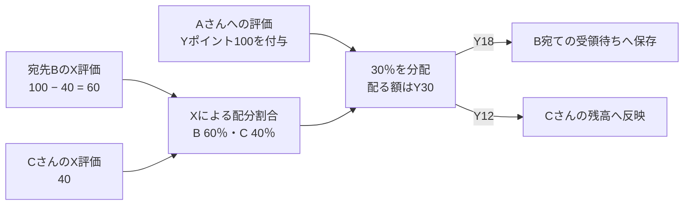
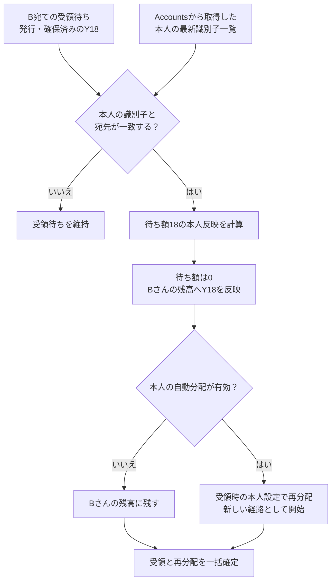
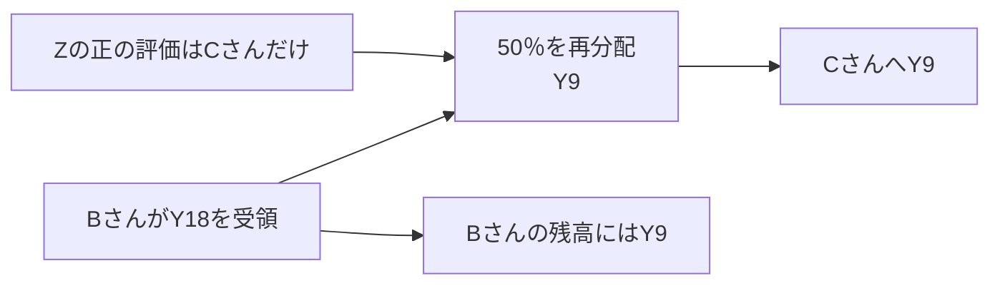

# Freeism Points v0.2.1 仕様

- [Freeism Points v0.2.1 仕様](#freeism-points-v021-仕様)
  - [言語](#言語)
  - [v0.2.1：実装する理由](#v021実装する理由)
  - [v0.2.1：基本方針](#v021基本方針)
  - [「プロフィール」画面](#プロフィール画面)
    - [公開プロフィールと本人の設定画面](#公開プロフィールと本人の設定画面)
    - [公開する情報と画面の構成](#公開する情報と画面の構成)
    - [ポイント増減の履歴](#ポイント増減の履歴)
  - [検索の機能](#検索の機能)
    - [検索対象と表示範囲](#検索対象と表示範囲)
    - [ヘッダーからの検索](#ヘッダーからの検索)
    - [検索画面の一覧と絞り込み](#検索画面の一覧と絞り込み)
    - [並び順と結果の更新](#並び順と結果の更新)
    - [検索の入出力とサーバー検証](#検索の入出力とサーバー検証)
  - [「設定」画面](#設定画面)
    - [自分のプロフィールURL](#自分のプロフィールurl)
    - [評価軸の作成・更新・削除](#評価軸の作成更新削除)
      - [「貢献評価を代用する仕組み」の設定](#貢献評価を代用する仕組みの設定)
      - [「交換する仕組み」の係数を設定](#交換する仕組みの係数を設定)
      - [評価軸ポイントの加算・減算](#評価軸ポイントの加算減算)
        - [登録・訂正する操作](#登録訂正する操作)
        - [宛先の指定](#宛先の指定)
        - [直接評価の登録・訂正時の照合](#直接評価の登録訂正時の照合)
    - [ポイント交換する機能](#ポイント交換する機能)
    - [ポイント譲渡する機能](#ポイント譲渡する機能)
    - [退会ボタン](#退会ボタン)
    - [公式パッケージの設定・自動分配](#公式パッケージの設定自動分配)
  - [多言語に対応](#多言語に対応)
  - [複数のPointsアカウントの切り替え](#複数のpointsアカウントの切り替え)
  - [OAuthログイン](#oauthログイン)
    - [Better Auth共通設定](#better-auth共通設定)
  - [Accountsと連携](#accountsと連携)
    - [Accounts連携の役割と単位](#accounts連携の役割と単位)
    - [連携・再連携の操作](#連携再連携の操作)
    - [連携情報の更新と公開](#連携情報の更新と公開)
    - [連携後の自動受領](#連携後の自動受領)
    - [連携解除](#連携解除)
    - [接続先Accountsの管理](#接続先accountsの管理)
    - [Accounts認証・APIの処理](#accounts認証apiの処理)
  - [評価軸のプロフィール画面](#評価軸のプロフィール画面)
  - [パッケージのプロフィール画面](#パッケージのプロフィール画面)
  - [公式パッケージの作成・更新・削除](#公式パッケージの作成更新削除)
    - [利用停止・再開・完全削除](#利用停止再開完全削除)
    - [競売の金額計算と精算](#競売の金額計算と精算)
    - [現在のPoint Package](#現在のpoint-package)
    - [パッケージの現在の利用可否](#パッケージの現在の利用可否)
  - [利用規約](#利用規約)
  - [プライバシーポリシー](#プライバシーポリシー)
  - [ドキュメント画面](#ドキュメント画面)
    - [ページと掲載内容](#ページと掲載内容)
    - [閲覧と言語切替](#閲覧と言語切替)
    - [ドキュメントの全文検索](#ドキュメントの全文検索)
    - [文書の更新と公開](#文書の更新と公開)
    - [OSSライセンス画面](#ossライセンス画面)
  - [ライブラリ](#ライブラリ)
    - [画面・画面遷移・取得データ](#画面画面遷移取得データ)
    - [入力フォーム・表示補助](#入力フォーム表示補助)
    - [CSV・ファイル・日時](#csvファイル日時)
    - [バックエンド・認証・配信](#バックエンド認証配信)
    - [開発・品質検査・テスト](#開発品質検査テスト)
    - [開発支援・文書作成](#開発支援文書作成)
    - [標準機能へまとめる項目](#標準機能へまとめる項目)
    - [v0.2.1の対象外・今後の検討](#v021の対象外今後の検討)
  - [JSONエクスポート・設定復元仕様](#jsonエクスポート設定復元仕様)
  - [CSVアップロード](#csvアップロード)
    - [対象操作と画面](#対象操作と画面)
    - [ファイル形式と受付上限](#ファイル形式と受付上限)
    - [列名と入力値](#列名と入力値)
    - [操作ごとの列と指定方法](#操作ごとの列と指定方法)
    - [検証・確認・確定](#検証確認確定)
    - [行の処理順と重複](#行の処理順と重複)
    - [条件変更と再送](#条件変更と再送)
    - [保存・D1処理・ログ](#保存d1処理ログ)
    - [確認する例](#確認する例)
  - [命名規則](#命名規則)
    - [対象と基本方針](#対象と基本方針)
    - [ファイル・型・変数の名前](#ファイル型変数の名前)
    - [IDと照合キー](#idと照合キー)
    - [金額と時刻](#金額と時刻)
    - [versionと業務状態](#versionと業務状態)
    - [HTTPとAPI](#httpとapi)
    - [バックエンドのファイルと型](#バックエンドのファイルと型)
    - [データベース](#データベース)
    - [フロントエンド](#フロントエンド)
    - [テスト](#テスト)
    - [スクリプト](#スクリプト)
    - [標準仕様・生成コードの例外](#標準仕様生成コードの例外)
    - [実装との差の確認](#実装との差の確認)
  - [アカウント紐付け時のポイント付与](#アカウント紐付け時のポイント付与)
    - [分配時の計算と受領待ち](#分配時の計算と受領待ち)
    - [本人への受領と再分配](#本人への受領と再分配)
    - [宛先と配分の重み](#宛先と配分の重み)
    - [受領資格とAccounts一覧の照合](#受領資格とaccounts一覧の照合)
    - [自動受領と再実行](#自動受領と再実行)
    - [受領の計算順序と一括確定](#受領の計算順序と一括確定)
    - [Pointsが保存する経済データ](#pointsが保存する経済データ)
    - [元取引の訂正と退会後の受領](#元取引の訂正と退会後の受領)
    - [実装時に確認する例](#実装時に確認する例)
  - [Cookie、CSRF、Origin](#cookiecsrforigin)
  - [退会](#退会)
  - [権限](#権限)
    - [管理操作の認証・権限](#管理操作の認証権限)
  - [HTTPリクエスト・HTTPレスポンス](#httpリクエストhttpレスポンス)
    - [適用範囲と標準](#適用範囲と標準)
    - [HTTPメソッドと入力](#httpメソッドと入力)
    - [CSVの要求形式と容量上限](#csvの要求形式と容量上限)
    - [成功時の応答](#成功時の応答)
    - [失敗時の応答](#失敗時の応答)
    - [HTTP状態コード](#http状態コード)
    - [通信IDと二重処理防止](#通信idと二重処理防止)
    - [応答のキャッシュ](#応答のキャッシュ)
    - [確認例と実装との差](#確認例と実装との差)
  - [金額表現](#金額表現)
  - [ポイント増減の履歴、残高、累計評価額](#ポイント増減の履歴残高累計評価額)
    - [概要](#概要)
    - [台帳と集計値の保存](#台帳と集計値の保存)
    - [台帳への追加と自動更新](#台帳への追加と自動更新)
    - [残高と累計評価額の計算](#残高と累計評価額の計算)
    - [引き落としの検査と拒否](#引き落としの検査と拒否)
    - [数値上限](#数値上限)
  - [Points–Markets連携契約](#pointsmarkets連携契約)
    - [境界](#境界)
    - [開発者向けOAuthクライアント管理](#開発者向けoauthクライアント管理)
    - [提供先ごとの1対1連携](#提供先ごとの1対1連携)
    - [同意と連携の開始](#同意と連携の開始)
    - [Authorization Code flow](#authorization-code-flow)
    - [連携解除と外部失効](#連携解除と外部失効)
    - [再認可](#再認可)
  - [Endpoint](#endpoint)
    - [外部APIの操作と要求](#外部apiの操作と要求)
    - [連携status](#連携status)
    - [`appAdmin`の照会](#appadminの照会)
    - [連携解除](#連携解除-1)
    - [残高](#残高)
    - [落札精算の引き落とし](#落札精算の引き落とし)
    - [その他](#その他)
  - [Rate limit](#rate-limit)
  - [セキュリティ・テスト・デリバリー仕様](#セキュリティテストデリバリー仕様)
    - [security header](#security-header)
    - [セキュリティ](#セキュリティ)
    - [Resource APIとOAuth Client](#resource-apiとoauth-client)
    - [D1 bulk write制約](#d1-bulk-write制約)
    - [業務変更の一括確定](#業務変更の一括確定)
    - [D1不変条件](#d1不変条件)
    - [Observabilityと運用ログ](#observabilityと運用ログ)
    - [依存関係とsupply chain](#依存関係とsupply-chain)
  - [フォルダ構成](#フォルダ構成)
  - [デプロイ設定](#デプロイ設定)
    - [環境と配信先](#環境と配信先)
    - [画面・静的ファイル・ビルド](#画面静的ファイルビルド)
    - [テスト環境の認証とPRプレビュー](#テスト環境の認証とprプレビュー)
    - [自動配信と設定の管理](#自動配信と設定の管理)
    - [DB更新と失敗時の対応](#db更新と失敗時の対応)
    - [実環境での確認](#実環境での確認)
    - [配信・取得の効率](#配信取得の効率)
  - [採用しないもの](#採用しないもの)
  - [v0.2.0からv0.2.1への変更](#v020からv021への変更)

## 言語

日本語（本ページ）| [English](./index.en.md)

## v0.2.1：実装する理由

1. 無料主義ドキュメントv3に、大幅な仕様変更があったため

## v0.2.1：基本方針

1. `v0.2.1`**は、「実用性」・「移植性」・「仕様理解の簡単さ」を優先する**
   - 説明
     - 本質的な機能のみ実装する
     - `ver0.1`はポートフォリオ的にいろいろな機能を実装したが、`ver0.2`は本質的な機能のみ残す
     - 他者がコードを読んで、「無料主義の仕様・したいこと」を理解してもらう必要がある
2. **設計の大原則**
   1. 疎結合
      - 評価軸、評価ロジック、データ取得元が、いつでも簡単に差し替えられるように設計
      - ファイルもタスクごとではなく、評価軸ごとに分けた
      - 「評価ロジック」、「評価軸」のフォルダごと削除しても、他は通常通り動作するよう設計
      - 冗長的な部分があるが、疎結合さを優先
   2. 可読性
      - 可読性のために、シェルスクリプトはファイルを分ける。
   3. 簡潔さ
      - より多くの人に理解してもらうために、堅牢性を求めず、簡単にすぐ理解できて短い必要最小限のコードにする
      - リッチな機能は提供せず、簡単に素早く理解できるようにシンプルな機能のみにする
      - アプリとして実用するのではなく、どんなサービスか体験してもらうだけ
      - リッチなUIは不要
3. **定数管理**
   - 説明
     - それぞれのパラメータは、すぐに変更できるように、定数ファイルを作成して管理する
4. **商品発送・住所の管理などは不要**
   - 説明
     - モノの発送が必要な場合は、他サービスを使用して行う。
     - その発送の証拠のみをアプリ内のレビュー画面で記載するのみ
5. **後方互換性は不要**
   - 説明
     - データ移行、後方互換性は不要
6. **注意**
   - 説明
     - ここに記載されていない仕様に関しては、無料主義アプリv0.1と同じ仕様
7. **PointsとMarketsは、独立的に運用する**
   - 説明
     - 別アプリとして同じようなアプリとの連携をする前提で設計したいため
     - 疎結合にする対象は「UIとAPI」ではなく「PointsとMarkets」

## 「プロフィール」画面

### 公開プロフィールと本人の設定画面

- 利用者の本人確認や貢献・保有ポイントの確認に使う公開プロフィールを設ける。公開プロフィールはログイン不要で閲覧でき、本人が開いた場合も他人と同じ公開範囲を表示する。
- 非公開プロフィールへの直接アクセスは404を返し、検索結果にも含めない。
- URLは`https://points.freeism.app/user-profile/{pointsUserId}`とする。PointsユーザーIDは不変の標準Nano IDを使い、表示名の変更後も同じURLを維持する。
- 基本情報にはユーザーID・表示名・任意の説明を表示する。表示名は1〜100文字、初期値は「仮ユーザー」、説明は0〜500文字とする。
- 本人は設定画面でプロフィールを編集し、公開範囲を設定する。非公開情報、すべてのポイントと履歴もこの画面で確認する。
- 設定画面に「公開プロフィールを確認」の導線を設ける。公開中は保存済みの公開内容を確認でき、非公開中は公開URLが404になることを示す。
- プロフィール全体・各区画・各評価軸の金額の初期値は非公開とする。公開設定は`PUBLIC | PRIVATE`で保持する。

### 公開する情報と画面の構成

- 基本情報・ポイント一覧・公式パッケージ・連携情報を表示し、履歴は別タブにまとめる。
  - 公開項目がない場合も区画を表示し、「この情報は非表示です」と案内する。
- ポイント一覧は評価軸の名前・IDと、公開した残高`balance`・累計評価額`evaluationTotal`を表示する。金額には3桁区切りのカンマを付け、小数末尾の不要な0を除く。
  - 残高と累計評価額は評価軸ごとに別々に公開設定する。
  - 両方非公開の軸は一覧に表示しない。
- 公開を選んだ軸は0・負の額もそのまま表示する。
  - 停止中の軸には停止状態を表示する。
  - 評価軸の名前・IDからそのプロフィールへ移動できる。
- 公式パッケージは、本人が公開を選んだ公開パッケージを設定した順に表示する。
  - 複数ある場合も一覧で表示し、パッケージ名・IDと、構成軸の名前・ID・割合を示す。
- 公開パッケージの構成軸は、公開されている評価軸だけを表示する。
  - 非公開の評価軸の名前・ID・割合・リンクは、公開プロフィール画面とその表示用応答に含めない。
  - 表示する軸の割合はパッケージに設定された値を保つ。公開軸だけで割合を計算し直さず、構成の一部が非表示の場合はその旨を案内する。
  - パッケージと公開されている構成軸にはプロフィールへのリンクを付ける。
- 連携情報は一覧全体で公開設定する。
  - 公開する場合は、Accountsが提供したサービス名・ユーザー名・表示名・固有ID・検証したプロフィールURL・検証状態・検証方法・検証日時・連携日時を表示する。
  - 連携先AccountsのプロフィールURL・ユーザーIDも表示する。
  - 各項目は提供元が取得・提供したものに限る。
- Pointsへの情報提供同意は公開表示の許可を含み、Accounts自身の一般公開設定とは独立する。
  - 実際の表示はPointsのプロフィール全体と連携情報の公開設定で決める。
- 連携情報は連携・再連携直後と、本人が「情報を更新」で全連携をまとめて更新したときに取得する。
  - 公開プロフィールには保存済み情報を表示し、Accounts側の変更は次の取得時に反映する。

### ポイント増減の履歴

- 直接評価・代用評価・分配・譲渡・交換・訂正を一つの履歴にまとめ、種類・評価軸で絞り込めるようにする。
  - 履歴区画の公開設定は一つにまとめる。
- 一回の実行に属する本人の軸別増減をまとめ、新しい順に20件ずつ表示する。
  - 後日の訂正は別の履歴として残す。
- 公開履歴には実行日時・種類・評価軸・増減額を表示する。
  - 評価対象月がある操作では、その月も表示し、任意の日・時刻が記録されていれば確認できるようにする。
- 宛先識別子・管理ID・メモ・相手方は本人が設定画面で確認する。
  - 公開履歴にはこれらの情報を含めない。
- 残高と累計評価額が両方非公開の軸は、公開履歴でも隠す。
  - 複数軸を含む取引は公開した軸の増減だけを表示し、非表示の軸の名前・ID・額と、その額を推測できる交換倍率を公開の応答へ含めない。
- 例えばA軸だけを公開してAからBへ交換した場合は、Aの消費額だけを表示する。
  - Bの名前・ID・受取額と適用倍率は本人用の設定画面で確認する。
- 評価100を50へ訂正した場合は、初回＋100と訂正−50を残す。
  - 公開している軸の訂正詳細には旧額100・新額50と、元の公開履歴へのリンクを表示する。
- 本人用履歴は公開設定に関係なく全情報を表示する。
  - 種類・評価軸の絞り込みと、新しい順の20件表示は公開履歴と同じ構成にする。
- サーバーで本人用の閲覧権限と公開設定を検証し、公開画面と公開応答には表示が許可された情報だけを含める。

## 検索の機能

### 検索対象と表示範囲

- 未ログインでも、利用者・評価軸・パッケージを一つの検索欄で探せる。ポイント交換に使う評価軸や、登録するパッケージもここから探す。
- 名前とIDを検索対象とする。検索語を全角・半角の空白で区切り、すべての語が同じ項目の名前またはIDに部分一致するものを表示する。英字の大小は区別せず、入力の前後の空白を除く。
- 非公開・退会済みの利用者プロフィールは検索結果に含めない。
- 評価軸・パッケージは公開項目を表示する。非公開項目も、検索している本人にその項目の編集権限があれば表示する。
- 初期表示は有効な項目だけとし、「停止中も含む」で停止中の評価軸・パッケージも表示する。公開範囲と停止状態は別々に判定する。

### ヘッダーからの検索

- ヘッダーの検索欄からダイアログを開く。入力前は検索の案内を表示し、入力後は3種類を混ぜた検索結果を最大5件表示する。
- 結果を選ぶと、その項目のプロフィールへ移動する。非公開の場合は、編集権限があっても404を返す。「検索結果をすべて見る」で、検索語を引き継いで検索画面へ移動する。
- 結果には種類・名前・IDを表示する。非公開・停止中の状態と、検索している本人の「管理者・編集可能」バッジも該当する場合に表示する。評価軸の結果から交換倍率の一覧を開けるようにする。

### 検索画面の一覧と絞り込み

- 3種類を混ぜた一覧を1ページ20件で表示し、次・前のページへ移動できる。検索語が空なら名前順の一覧を表示する。
- 種類は「すべて・ユーザー・評価軸・パッケージ」から選ぶ。「自分が管理する項目」「停止中も含む」でも絞り込める。
- 管理対象フィルターはログイン時に表示する。対象軸の`evaluationCriterionAdmin`には管理する評価軸、`packageAdmin`には管理するパッケージ、`appAdmin`には編集可能な全評価軸・パッケージを表示する。
- 一覧にも種類・名前・IDと、該当する状態・編集権限のバッジを表示する。各結果からプロフィールへ移動する。非公開の場合は、編集権限があっても404を返す。評価軸の結果には、交換倍率の一覧を開く導線も表示する。
- 検索語・フィルター・並び順・ページを画面URLへ保存し、詳細から戻ったときに復元する。検索条件を変更したら最初のページへ戻す。

### 並び順と結果の更新

- 初期の並び順は、前後の空白を除いた入力全体による「ID完全一致・名前完全一致・名前前方一致・その他の部分一致」の順とする。
- 同順位は名前・種類・IDの順で固定する。種類の順序は利用者・評価軸・パッケージとする。
- 名前順への切替を用意する。名前が同じ場合も種類・IDの順で固定し、同名の項目を区別できるようにする。
- 結果0件と通信失敗を区別して表示する。検索語を変更した場合は最新の検索結果を表示する。

### 検索の入出力とサーバー検証

- 検索の入力は検索語・種類・管理対象の指定・停止中の表示・並び順・ページとする。ヘッダーでは簡易表示の5件、検索画面では1ページ20件を返す。
- 検索結果は種類・ID・表示名・公開状態・利用状態・本人の編集可否を持つ。検索画面では次・前のページへ移動できるかも返す。
- サーバーは公開範囲・管理権限・状態・検索条件を検証してから結果を返す。非公開項目と編集可否は、ログイン中の本人の権限から判定する。
- 検索結果から移動した画面で交換・編集などを実行するときは、その操作の権限と利用可否をサーバーで再検証する。

## 「設定」画面

### 自分のプロフィールURL

1. 設定画面に、自分のユーザープロフィールのURLを表示する
2. コピーボタン
   - ボタンを押したら、その人のプロフィールURLに遷移する

### 評価軸の作成・更新・削除

- 操作する人と画面
  - ログインしたPoints利用者は誰でも評価軸を作成できる。作成者は、その軸の`evaluationCriterionAdmin`になる。
  - 更新・完全削除・利用停止・再開は、その軸の`evaluationCriterionAdmin`または`appAdmin`が行う。
  - 設定画面に管理できる評価軸の一覧を表示し、フォームまたはCSVで管理操作を行う。評価軸のプロフィール画面からも更新画面を開ける。
  - 管理者設定画面でPointsユーザーIDを指定し、その軸の管理者を追加・解除する。

- 入力項目と初期値
  - IDは作成時に発行する不変の標準Nano IDとする。同じ名前の軸を作成でき、選択画面では名前とIDを表示する。更新対象はIDで指定する。
  - 名前は必須で1〜30文字、説明は必須で1〜200文字、関連URLは任意で最大20件とする。説明内のURLは安全にリンク表示する。
  - 新規作成の初期状態は`ACTIVE`とする。譲渡・交換・即決価格の利用可否はON、自動分配方式は「本人の取り分から配る方式」、分配用の最小単位は1ポイントを初期値とする。
  - 最小単位は0.0001以上、小数4桁まで設定でき、作成後も変更できる。自動分配の丸めと終了判定には、処理時点の値を使う。変更後も過去の付与額・残高・累計評価額・台帳の金額を保持する。
  - 保存精度は小数4桁で固定する。付与・譲渡・交換・競売精算をこの精度で検証し、評価結果の訂正や取消の差額も小数4桁で正確に反映する。実行済みの増減は台帳と実行記録へ保存する。
  - 公開範囲は軸全体で`PUBLIC | PRIVATE`とし、新規作成時は`PRIVATE`とする。対象軸の`evaluationCriterionAdmin`または`appAdmin`がフォーム・CSVで変更できる。利用状態とは別に保存する。
  - フォーム・CSVの作成・更新項目に公開範囲を含める。非公開の軸は、設定画面の管理対象一覧から管理画面を開く。
  - 自動分配方式は`autoDistributionMode`へ保存する。値は`OWN_SHARE`（本人の取り分から配る方式）または`ADDITIONAL_ISSUANCE`（追加発行して配る方式）とし、受け取ったポイントの評価軸の設定を初回分配と再分配へ適用する。
  - 月別の直接・代用評価と交換倍率は、それぞれの設定操作で管理する。

- 確認と確定
  - サーバーで認証・権限・文字数・URL数・金額設定・公開範囲・利用状態・versionを検証し、確定前に作成・更新内容を表示する。
  - 確認後に評価軸の保存を原子的に確定する。
  - 同じIDの最新レコードを更新する。versionは更新の競合検査に使い、競合時は`409`とする。

- 未使用の軸の完全削除
  - 付与、未受領の評価、台帳、残高、パッケージ、交換設定、代用設定、競売などから参照されていない軸だけ、データを完全削除できる。
  - 削除の確定時に参照を再検査する。参照済みなら完全削除せず、利用停止を案内する。
  - 完全削除では、作成に付随する管理者所属なども整理する。既存の実行記録は保持し、削除した評価軸IDを再利用しない。

- 利用停止と再開
  - 利用停止は`ACTIVE`から`INACTIVE`への変更とする。軸のレコード、設定、残高、累計評価額、付与と増減の記録を保持する。
  - 停止中は、その軸での新規付与・譲渡・交換などの新規利用を止める。過去の付与訂正、未受領分の受領、作成済み競売の精算は続けられる。競売ではパッケージの利用可否を使い、停止軸が構成に含まれていても、パッケージが公開・有効で全構成軸が公開なら新規競売を作成できる。
  - 管理者は同じIDのまま`ACTIVE`へ戻せる。既存の設定と残高を使って利用を再開する。
  - 停止中の軸の過去評価は、有効な軸の代用元や、自動分配の受取人・配分割合の計算に使える。

- 分配するポイントと計算に使う軸
  - 実際に分配するポイントの種類と、受取人・配分割合の計算に使う評価軸を区別する。発行方式は、実際に分配するポイントの評価軸の設定に従う。
  - 例えばAポイント100を受け取り、停止中B軸の過去評価で40を配る場合、A軸が追加発行方式なら本人にA100を残し、受取人へA40を新規発行する。
  - 同じ例でA軸が取り分方式なら、本人のA100から40を差し引き、受取人へA40を渡す。

#### 「貢献評価を代用する仕組み」の設定

- 評価方式の選択
  - 付与先の評価軸ごと・評価対象月ごとに、「直接評価」または「代用評価」を選ぶ。同じ月の方式を利用者全員へ一括適用する。
  - 評価対象月はUTCの年月を`YYYY-MM`で指定する。9月分を10月に処理しても、9月の設定を使う。
  - 設定と実行は、付与先の評価軸の`evaluationCriterionAdmin`または`appAdmin`が行う。
  - 直接評価では、通常の貢献評価の登録・訂正を行う。代用評価を選択中の月に直接評価を登録・訂正しようとした場合は、直接評価への切替を案内する。

- 代用元と係数の設定
  - 代用評価では、同じ評価対象月の代用元を一つ選び、類似度の係数を設定する。方式・代用元・係数はすべて月別に保持する。
  - 新しく選べる代用元は、公開軸または操作者が管理できる軸とする。フォーム・CSV・JSON復元で同じ条件を検証する。
  - 登録済みの代用元が非公開になっても計算を続ける。管理画面で非公開の代用元の詳細を表示するのは、操作者がその代用元を管理できる場合に限る。
  - 係数は`1.5`・`0.3`・`-0.3`のような倍率で入力する。0、負の値、1を超える値を設定でき、小数4桁までとする。
  - 同じ月の代用関係をサーバーで検査し、循環する設定を保存時に拒否する。自分自身を代用元にする設定も循環として扱う。
  - 例えばA軸→B軸→C軸は設定できるが、そこへC軸→A軸を追加することはできない。

- 計算元の評価額
  - 各人について、代用元の軸で対象月に採用されている直接評価または代用評価と、評価付与を起点とする自動分配・再分配の受取額を合計する。訂正を反映した現在額を使う。
  - 分配の受取額は、元の付与の評価対象月へ集計する。再分配先にも同じ月を引き継ぐ。
  - 代用元の軸が停止中でも、その月の確定済み評価を参照できる。付与先の停止中は、新規の代用付与を行わず、過去の結果の訂正と受領を行える。
  - 代用元でその月の付与が未確定なら実行を止め、代用元の管理者による確定後に再実行するよう案内する。
  - JSONによる設定復元で新しくコピーした直接評価の月は、入力を移さず評価0件の確定済み結果として使える。
  - 代用元が代用評価の場合も、その時点で確定している額を使う。単独の設定変更・再計算では、他の軸の付与を再計算しない。
  - 元評価の変更後も、既存の代用結果は管理者が再計算するまで保持する。代用先への更新は管理者が順に実行する。

- 付与額の計算
  - 各人の付与額は「計算元の評価額×類似度の係数」とする。元のポイントを維持したまま、付与先の軸でポイントを新しく付与する。
  - 100×1.5は150、100×−0.3は−30、−100×−0.3は30となる。負の結果も残高と累計評価額へ反映する。
  - 係数を小数文字列として検証し、10,000倍した符号付き整数`coefficientScaled`へ変換する。`sourceTotalScaled * coefficientScaled / 10_000`をBigIntで計算し、0方向へ切り捨てる。
  - 結果は0.0001ポイント単位とする。入力と保存・返却する結果は安全整数の範囲を検証し、範囲を超えた場合は操作全体を失敗させる。

- 自動分配と未受領の評価
  - 正の代用付与は、受取人の設定で自動分配する。0・負の付与は本人へ反映する。
  - 未登録・未連携の人にも、計算元と同じ宛先へ未受領の代用評価を作る。未受領の間は現在額を更新し、分配は本人の受領時に行う。
  - 受領時は最新額を反映し、その時点の本人設定を使う。今回の受領額を累計評価額へ加える前に、最初の分配割合を計算する。

- 再計算と方式の切替
  - 管理者が変更内容と全員の増減を確認してから、月別設定・付与・分配を一括確定する。失敗した場合は、旧設定と旧結果を維持する。
  - 再計算では、付与先の軸・対象月に属する全員の旧付与とそこから発生した全分配が残高・累計評価額・月別の計算元へ与えた影響を計算上取り除き、最新条件で計算し直す。
  - 新しい計算元にいる人と旧結果にいる人の両方を対象にし、受領済みの人には新旧結果の差額を台帳へ追加する。新結果が0なら旧付与と旧分配を取り消す。未受領の人は受領待ちの現在額を更新する。
  - 直接評価から代用評価へ切り替える場合は、その月の直接付与と全分配を取り除いて代用結果を計算し、差し替える。直接評価の入力レコードは復元用に保持する。
  - 直接評価へ戻す場合は、旧代用付与と全分配を取り除き、以前の直接評価の入力があれば、その額と現在の分配条件で計算し直す。入力がなければ0から開始する。新規評価や入力の変更は、切替後に通常の直接評価フローで行う。
  - 再計算や切替による負の残高も反映する。別の月や別の軸の確定済み代用結果は、この操作では更新しない。

- 保存と二重付与の防止
  - 月別設定と採用結果は「付与先評価軸ID＋評価対象月」で識別する。代用元や係数を変更しても、同じ月の結果を更新する。
  - 最新の設定・直接評価の入力・採用結果と、実行記録・差分台帳を保持する。直接評価の入力は採用中かどうかを区別し、代用中の計算元へ加えない。
  - 台帳は元の付与と評価対象月に紐付け、受領者・評価軸別の残高と累計評価額の増減を集計できるようにする。評価月を変更した場合も、月別の増減を追える差分を記録する。
  - 同じ確定要求の再送は既存の冪等性で処理する。繰り返し実行しても、現在の結果との差額だけを反映する。
  - 分配の途中条件や経路は計算中だけ保持し、確定後は必要な差分を台帳へ保存する。

- 設定と実行の画面
  - フォームで月別設定と結果確認を行い、全員分の確定・再計算ボタンを用意する。
  - 月別設定はCSVでも変更・再計算できる。
  - 新規設定ではversionを発行し、既存設定の変更・再計算では現在のversionを検証する。

#### 「交換する仕組み」の係数を設定

- 設定する人と管理操作
  - 交換先の評価軸の`evaluationCriterionAdmin`または`appAdmin`が、フォーム・CSVで設定する。A軸からB軸への倍率はB軸の管理者が決め、逆方向はA軸の管理者が別に設定する。
  - 倍率は0.5・1.5のような正の小数4桁までとし、交換の有効・無効を別に設定する。複数の交換を経てポイントが増える組合せも許可する。
  - 作成・更新・無効化・再有効化・完全削除に対応する。停止中・交換許可OFFの軸でも設定を編集できる。
  - 実際の交換では、両軸の状態・交換許可・その方向の設定を検証する。設定が有効でも、軸の停止などで交換できない場合がある。
  - 同じ交換元・交換先の組ごとに`exchangeRate`の最新レコードを更新する。既存設定の更新・削除では現在versionを指定する。
  - 無効化では倍率を保持する。新規作成は倍率を必須とし、既存設定の保存で倍率が空欄の場合は現在値を維持する。
  - 完全削除後も、確定済みの交換記録と適用倍率・消費額・受取額を保持する。倍率の変更や状態変更でも過去の交換結果を維持する。

- 倍率の表示と確認
  - 評価軸プロフィール・検索結果など、評価軸の情報を表示する箇所に「交換倍率」の導線を設ける。交換画面では選択した方向の倍率を直接表示する。
  - 一覧には、その軸を交換元または交換先とする設定の方向、両軸の名前・ID、倍率、有効状態、現在の交換可否を表示する。
  - 無効化中・軸の停止中・交換許可OFFの設定も、交換できない理由付きで表示する。閲覧権限のない非公開軸を含む設定は表示しない。
  - 確認画面には作成・更新・無効化・再有効化・削除の区別、両軸の名前・ID、変更前後の倍率・状態を表示する。
  - 設定変更の確定後は、新しい交換に最新の設定を適用する。利用者が交換を確認している間に倍率が変更された場合は、最新条件で再確認を求める。

- 倍率の保存と検証
  - 倍率を10,000倍した正の整数`multiplierScaled`で保存し、計算には固定小数点の整数を使う。
  - サーバーで認証・交換先の管理権限・評価軸・倍率・操作・状態・versionを検証する。
  - 確定した設定を保存し、管理操作の監査を記録する。

#### 評価軸ポイントの加算・減算

##### 登録・訂正する操作

- 評価結果は、直接評価または代用評価で定めた評価額と、その宛先・評価軸・評価対象月・受領状態を指す。
  - 評価額が0・負の場合や、未受領の場合も含む。

- 対象評価軸の管理者`evaluationCriterionAdmin`またはアプリ全体管理者`appAdmin`が、評価軸の管理画面からフォームまたはCSVで直接評価を登録・訂正する。公開プロフィールからも、その操作画面を開ける。
- 新規登録は独立した評価として追加し、評価IDを発行する。同じ人・同じ評価軸・同じ評価対象月にも、複数の評価を登録できる。
- 訂正では、既存の評価結果ID`fixResultId`を指定し、その評価の現在額を置き換える。更新番号は同じ評価の更新を検証する値として保持する。
- 評価額は符号付きの小数4桁までとし、負の残高になる評価も受け付ける。100から50への訂正では差額−50と、関連する分配の訂正を反映する。
- 取消は、既存評価の現在額を0へ更新する。
- 訂正する評価軸は固定する。
  - 別の評価軸へ移す場合は、元の評価を取り消し、別の評価軸へ新規登録する。
- 評価対象はUTCの年月を必須とし、日・時刻は任意とする。
- 管理IDは任意の照合用メモとして保存し、訂正対象は評価IDで指定する。
- メモは任意で200文字以内とする。
- 入力するのは確定する評価額とする。
  - 残高と累計評価額は別に保持し、ポイント増減の台帳と同じ原子処理で更新する。

##### 宛先の指定

- 宛先は、外部プロフィールURLの候補またはAccountsユーザーIDのどちらか一方で指定する。本人から共有された情報など、対象者との対応を確認できる識別子を使う。
- URL候補は最大5件、各512文字以下とする。
  - フォームでは候補を追加する。
- AccountsユーザーIDは256文字以下とする。
- PointsサーバーがAccounts系サービスへ順番に問い合わせ、その処理で見つかった一人を付与先にする。URL候補の優先順位は保証しない。
- 全候補が未照合の場合も、宛先候補を未受領評価として保持する。受領時は本人のAccounts識別子一覧と宛先を照らし、一致する未受領分を一度だけ反映する。
- 受領済みの訂正先は、同じ評価IDに保存されたPoints利用者に固定する。
  - 入力URLやAccountsの紐付けが変わっても、この受領者を保持する。
- 未受領の訂正では最新の宛先と額へ更新する。
  - 照合で連携済みの本人が見つかれば、旧未受領分を置き換え、最新額全体をその本人へ一度だけ付与する。

##### 直接評価の登録・訂正時の照合

- 送信から登録まで
  - 保存・付与は、フォームの送信またはCSVの明示的な確定操作を受けて行う。
  - 画面には新規・訂正の区別、付与先、旧額・新額、評価対象月、未受領の有無、分配による増減を表示する。

- 照合先を選ぶ処理
  - Pointsサーバーが、PointsをOAuthクライアントとして登録している有効なAccounts系サービスを取得し、サービスごとに順番に問い合わせる。
  - 照合には管理者が入力した宛先を使い、問い合わせるサービスはサーバーが決める。
  - 一つのサービスでその行のURL候補またはAccountsユーザーIDを照合し、人物が見つからなければ次のサービスへ進む。
  - 人物が見つかった行は、そのサービスのoriginとAccountsユーザーIDの組で付与先を決める。Points連携済みなら付与し、未連携ならその人物宛ての未受領評価として保存する。
  - 複数のサービスやURL候補に人物が紐付く場合は、その処理で見つかった一人を選ぶ。サービス間・URL候補間の優先順位は保証しない。URLの入力順を付与先の選択条件にしない。
  - 有効な照合先が一つもない場合は、`409 ACCOUNTS_CONNECTION_NOT_ACTIVE`を返し、全件の登録を止める。

- 入力の検証と問い合わせ
  - 宛先は`recipientProfileUrl`のURL候補または`recipientAccountsUserId`のどちらか一方を指定する。
  - 両方空なら`RECIPIENT_IDENTIFIER_REQUIRED`、両方指定した場合は`RECIPIENT_IDENTIFIER_AMBIGUOUS`を該当行へ返す。
  - PointsはURL候補の件数、空欄、長さを検証する。URLの正規化や受付条件の判定はAccountsが行う。
  - 入力エラーがなければ、各サービスの`QUERY /api/v1/identities/resolve`へ問い合わせる。同じサービスへの同じ識別子の問い合わせは、その処理内で1回にまとめ、1回の要求は最大1,000件とする。

- Accountsの回答と登録する内容
  - 人物を特定できた回答が`matched`である。選ばれた人物のoriginとAccountsユーザーIDを保存する。
  - 人物が見つからない回答が`no_match`である。全サービス・全候補で人物が見つからなければ、宛先の候補と評価額を未受領として保存する。この時点では受領先のoriginとAccountsユーザーIDは未確定とする。
  - 受付できない入力への回答が`invalid_input`である。該当する行・列に`RECIPIENT_IDENTIFIER_INVALID`を付け、`422 CSV_VALIDATION_FAILED`を返す。フォームも同じ入力条件で検証し、入力エラーがあれば全件を反映しない。
  - 成功時は、実際に選ばれた付与先と接続先、照合結果、付与済み・未受領の別、評価と分配の処理結果を画面へ返す。

- 照合できない場合
  - 通信失敗、タイムアウト、サービス側の障害や制限、認証失敗、要求の拒否、不正な応答などで照合を完了できなければ、評価も分配も全件を反映しない。
  - 照合できない場合は`503 ACCOUNTS_RESOLVE_UNAVAILABLE`を返す。問い合わせ制限で待ち時間が指定された場合は、`Retry-After`を返す。
  - Access Tokenを取得し直しても認証が拒否される場合は、`503 ACCOUNTS_CLIENT_UNAUTHORIZED`を返す。
  - 「正常に照合したが人物が見つからない場合」は未受領として登録できる。「照合処理を完了できない場合」はエラーとして登録を止める。

- 初回取込で安定した`fixResultId`を発行する。
- 訂正は同じ`fixResultId`の最新レコードを更新する。更新前の額と訂正後の額は、不変の実行記録へ保存する。
- 実行記録は内容hash、source file hash、操作者、評価軸、request ID、idempotency keyで監査できる。
- 受領済みの元の付与額は、訂正後の額と更新前の額との差を対象者・評価軸ごとに計算し、差分を不変台帳へ追加して残高と`evaluationTotalScaled`へ反映する。自動分配がある場合は、全経路の新旧結果の差分も反映する。差分0の行は追加しない。取消は最新額を0へ更新する。評価月だけの訂正では元の付与額の差分は0だが、自動分配は最新条件で再計算する。最新結果の評価月を更新し、実行記録を保存する。貢献評価代用は、この最新の評価月と額を集計する。
- 受領済みの差額は台帳へ反映する。未受領の`unclaimedFixEntry`は現在額へ更新し、訂正時に受領者が決まった場合は最新額全体を台帳へ反映する。
- 直接評価の登録・訂正では、対象の評価軸・評価月が直接評価を採用していることを検証する。評価月を変更する場合は、移動元と移動先の両月を検証する。代用中に保持した直接入力は復元用とし、台帳や受領待ちの有効額には加えない。
- 台帳行は不変で、評価処理の実行IDと対象エントリー・台帳種別の組を一意にし、同じ実行の再送による二重反映を防ぐ。

- 最新の評価レコードには、入力識別子の種類、URL候補またはAccountsユーザーID、照合先のorigin、照合結果、照合時刻、受領状態と確定したPoints受領者を保持する。実行済みの照合・変更内容は実行記録と監査へ保存する。
- 受領者は評価ID単位で決める。受領済みなら同じPoints利用者へ訂正の差額を反映する。未受領なら最新の候補を再照合し、連携済みの本人が見つかった場合は最新額を付与し、それ以外は最新の未受領状態へ更新する。旧宛先の未受領額を受領対象から外す。
- 受領済みの評価結果とその訂正先は同じPointsユーザーに保持する。Accountsの紐付け・公開許可の変更や受領後のURL解除・再所有があっても、受領済みの評価結果を移動・rollbackしない。

フォームの送信または確認済みCSVの確定要求を受け、入力の検証と照合・計算がすべて成功した後、次を一つのD1原子処理で確定する。

1. 評価結果と対象エントリーの最新レコード、評価処理の実行記録
2. 更新前の結果との差分
3. ledger entryまたはunclaimed entry
4. ledger INSERT triggerによる`point_accounts.balance_scaled`／`evaluation_total_scaled` projection
5. idempotency result

- サーバーはフォーム・CSVの両方で管理権限、宛先、金額、評価対象月の直接評価選択、現在の更新番号を検証する。月の変更では移動元・移動先の両月を検証する。
- 正の新規評価は既存の自動分配に従って処理し、未受領分は受領時に分配する。訂正では旧評価と全分配の影響を計算上取り除き、最新条件で計算し直す。

### ポイント交換する機能

- 交換の基本動作
  - 利用者が本人の交換元ポイントを減らし、本人の交換先ポイントを増やす。例えば倍率0.5なら、A軸の100ポイントを使ってB軸の50ポイントを受け取る。
  - 元・先の両評価軸が`ACTIVE`で交換を許可し、その方向の交換倍率が`ACTIVE`の場合に実行できる。
  - 交換は残高だけを変更する。累計評価額は維持し、交換による受取額は自動分配を開始する付与に含めない。
  - 確定済みの交換は保持する。元の種類へ戻す場合は、その時点の逆方向の倍率で新しい交換を行う。

- 入力と金額計算
  - フォームまたはCSVで、交換元・交換先の評価軸と、交換元額または希望受取額のどちらか一方を指定する。
  - 金額は正の小数4桁までとし、0.0001ポイント単位の整数へ変換する。倍率も10,000倍した整数を使い、中間の乗除算はBigIntで計算する。
  - 元額指定では、`sourceAmountScaled * multiplierScaled / 10_000`を切り下げて実際の受取額を求める。
  - 希望受取額指定では、`targetAmountScaled * 10_000 / multiplierScaled`を切り上げて必要な元額を求め、その元額から実際の受取額を計算する。
  - 例えば倍率3で0.0001ポイント以上を受け取りたい場合、元額は0.0001、実際の受取額は0.0003となる。
  - 受取額が0、入力・保存・返却する金額が安全整数範囲外、交換元の残高が必要額未満の場合は拒否する。

- 確認と確定
  - サーバーで本人の認証、評価軸と倍率の状態、交換可否、金額、残高を検証する。
  - 確認画面へ交換元・交換先、消費額・実際の受取額・適用倍率・交換後の残高を表示する。希望額より多く受け取る場合も実額を確認できるようにする。
  - 確定前に倍率が変更され、交換可能な場合は確定せず、最新条件を表示して再確認を求める。確定時には両評価軸の状態・交換可否と残高も再検証する。交換できなくなった場合は確定せず、その理由を確認画面へ表示する。
  - 元ポイントの引き落としと先ポイントの加算を、同じ原子処理で確定する。
  - `Idempotency-Key`と確定要求の内容を照合し、同じ要求の再送には既存の結果を返す。

- 交換記録
  - 実際の消費額・受取額・適用倍率・実行者・実行日時を既存の交換記録へ保存し、元・先の増減を台帳へ記録する。
  - プロフィールの公開設定にかかわらず、本人は設定画面の統合履歴で自分の交換履歴を閲覧できる。種類・評価軸で絞り込み、新しい順に20件ずつ表示する。

### ポイント譲渡する機能

- 操作・宛先・金額
  - ログイン利用者が、本人のポイントをフォームまたはCSVで他者へ譲渡する。
  - 評価軸ID・譲渡額・譲渡先PointsユーザーIDを指定する。フォームでは公開プロフィールの検索からも相手を選べる。
  - 譲渡先は有効な他者に限定する。非公開プロフィールでもID指定で送れるが、自己宛て・退会済み・存在しない相手は拒否する。
  - 金額は正の小数4桁までとし、本人の残高以内に限定する。評価軸が有効で譲渡を許可している場合だけ実行できる。残高が0未満の場合は譲渡できない。

- ポイントと自動分配
  - 送信者の残高を減らし、受取人へ同じ種類・同じ額を加える。譲渡自体では双方の累計評価額を変更しない。
  - 受取人の設定に従って自動分配・再分配を行う。譲渡したポイントの評価軸の設定に従い、本人の取り分から配る方式または追加発行して配る方式を使う。
  - 譲渡から発生する自動分配・再分配は、取り分方式・追加発行方式とも全受取人の残高だけに反映し、累計評価額を変更しない。UTCの譲渡確定月を全再分配先の記録へ引き継ぐ。
    - お互いに譲渡し合って累計評価額を増加させ、他の自動分配時に取り分を増やすハックを防ぐためには、累計評価額には加算しない対応が必要
  - 分配結果は元の譲渡に紐付け、既存の丸め・循環停止・処理件数上限を適用する。

- 確認と確定
  - 確認画面には宛先ID・公開可能な相手の名前・評価軸・譲渡額・送信者の確定後残高を表示する。
  - 受取人の自動分配に関する案内、非公開設定、分配先、残高は確認画面に表示しない。
  - サーバーで本人認証・評価軸・譲渡可否・宛先・金額・残高を検証する。確定時も条件を再検証する。
  - 譲渡と全再分配を同じ原子処理で一括確定する。残高不足や分配処理件数超過などで1件でも失敗した場合は全件を反映しない。
  - 同じ確定要求の再送では二重譲渡しない。譲渡・分配の実行記録、増減台帳、冪等性の結果を保持する。

- 確定後の扱い
  - 確定済みの譲渡は保持する。返す場合は受取人が新しい譲渡を行い、その時点の残高・譲渡条件・受取人の自動分配設定を適用する。
  - 設定画面の統合履歴で確認し、種類・評価軸で絞り込める。公開履歴には本人の公開設定を適用する。

### 退会ボタン

- 退会ボタンを押した際の挙動は、[退会と再開の処理](#退会)に従う。

### 公式パッケージの設定・自動分配

- パッケージ登録・並べ替えは、`PUT /api/profile/point-packages`へ順序付きの`pointPackageIds`配列全体を送る。
  - 本人の現在の登録を、同じD1原子処理で置き換える。
  - 存在しないID、重複ID、本人以外を対象にした要求を拒否する。
  - 新しく登録する非公開パッケージは、本人の編集権限を検証する。
  - 公開時から登録済みのパッケージは、非公開になっても保持できる。
  - 同じ`Idempotency-Key`の再送には、確定した同じ順序の登録結果を返す。

- 設定
  - 利用者は画面のフォームで、公式パッケージ、自動分配の有効・無効、分配する割合または固定額を設定する。
  - 保存時は本人の認証とサーバー側の検証を行い、最新の設定を一括更新する。
  - 自分や他の利用者が作成したパッケージを、重複なく最大100件登録できる。登録した全パッケージを使い、各パッケージへの配分割合を設定する。
  - 非公開パッケージも自動分配に使える。新規登録は、そのパッケージの編集権限がある本人に限る。公開時からの登録は、非公開への変更後も維持する。
  - 自動分配には有効なパッケージを使う。公開範囲の変更だけでは、登録済みの配分割合や自動分配を変更しない。
  - 公式パッケージの設定自体は任意。
  - 登録したパッケージの表示順を指定できる。公開プロフィールには、本人が公開を選んだ公開パッケージをその順に表示する。
  - 分配する割合は0％〜100％とする。固定額は0以上とし、各段階の実際の受取額を上限にする。
  - 初期状態は無効とする。パッケージを1件以上登録すると有効にでき、有効時は「自動分配を設定中」と表示する。
  - パッケージを登録解除すると、その配分割合も削除し、残った比率を合計100％へ正規化する。最後の1件を解除すると自動分配を無効にする。
  - 手動で送る場合は、既存のポイント譲渡機能を使う。

- 分配方式
  - 評価軸の作成者は、作成時に「本人の取り分から配る方式」または「追加発行して配る方式」を選ぶ。更新は、その評価軸の管理者が行う。自動分配は譲渡可否とは別に扱う。
  - 本人の取り分から配る方式では、他の宛先へ配る額を本人の残高から差し引き、利用中の受取人の残高または宛先の受領待ちへ加える。分配元の累計評価額は減らさず、評価付与を起点とする場合は、受取人の累計評価額へ分配額を加える。譲渡を起点とする場合は、全再分配先でも残高だけに反映する。
  - 追加発行して配る方式では、本人に受取額全額を残し、他の宛先への配分額を追加発行する。追加発行分は利用中の受取人の残高または宛先の受領待ちへ加える。評価付与を起点とする場合は累計評価額にも加え、譲渡を起点とする場合は累計評価額を変更しない。
  - 配るポイントの種類は受け取った種類のままとする。パッケージ内の評価軸は、停止中でも過去評価から受取人と配分割合を計算するために使える。追加発行か取り分からの分配かは、受け取ったポイントの軸の設定に従う。
  - 例えば100ポイントを受け取り80％を分配する場合、取り分方式では本人に最低20を残して最大80を配り、追加発行方式では本人に100を残して最大80を追加発行する。

- 分配を始める時点
  - 正の直接評価または代用評価を付与するとき、今回の付与額を累計評価額へ反映する前に、最初の配分割合を計算する。元の付与額は本人の残高と累計評価額へ全額反映し、その後に分配する。
  - 譲渡の受取時も本人設定で分配を開始する。譲渡自体は累計評価額を変更せず、その時点の累計評価額から配分割合を計算する。分配の評価対象月はUTCの譲渡確定月とする。
  - 新規登録する評価結果の額が0または負なら、その額を本人へ反映する。
  - 未受領の元評価と分配待ち額は、本人が受領を確定する時点の設定で分配する。宛先の照合、配分の重み、合算、受領後の経路は[アカウント紐付け時のポイント付与](#アカウント紐付け時のポイント付与)にまとめる。

- 配分の計算順序
  - 受取額と設定した割合・固定額から、分配する総額を求める。
  - 総額をパッケージ間の割合で分け、次に各パッケージの構成割合で評価軸ごとに分ける。最後に、各評価軸の累計評価額に応じて利用者へ割り当てる。
  - Points本人へ対応付け済みなら本人単位、それ以外は宛先単位に、訂正と負の評価を含めて合算する。未受領の元評価と、評価を起点とする分配待ち額も含める。
  - 各合計の負の部分を計算上だけ0とし、正の部分の合計を分母、それぞれの正の部分を分子とする。本人・未登録・未連携・退会中の宛先も対象とする。
  - 例えば評価軸への配分額が30、Bさんの累計が60、Cさんが40なら、Bさんへ18、Cさんへ12を割り当てる。
  - 各段階で、その段階を処理する時点の設定・パッケージ構成・累計評価額を使う。評価付与を起点とする分配の受取額は、方式にかかわらず後の段階の累計評価額へ反映する。譲渡を起点とする分配の受取額は、後の段階でも累計評価額に含めない。

- 本人分と分配を行わない場合
  - 本人自身に割り当てた額は本人に残す。未受領者や退会中の宛先への分配額は、受領待ちとして発行・確保する。
  - 停止中のパッケージへの予定配分額は分配しない。他の有効なパッケージ分の計算は続ける。
  - 配分計算に使う評価軸に、正の評価合計を持つ本人・宛先が一つもない場合は、配分割合を決められない。その評価軸への予定配分額は分配しない。
  - 本人分と、上記の理由で分配しない額は、取り分方式では本人に残す。追加発行方式では元の受取額を本人に残し、これらの額は発行しない。

- 正の評価合計がない場合の例
  - パッケージは評価軸Xだけで構成する。Y残高が0のAさんにY100を評価として付与し、その30％のY30を分配する場合を示す。
  - Xの評価が次のいずれかの状態なら、分配用の重みの合計は0となる。

  | 評価軸Xの状態              | 累計評価額の例              | 分配用の重みの合計 |
  | -------------------------- | --------------------------- | -----------------: |
  | 作成したばかりで評価がない | 評価入力0件                 |                  0 |
  | 全員の累計評価額が0        | Aさん0、Bさん0、Cさん0      |                  0 |
  | 全員の累計評価額が負       | Aさん−5、Bさん−20、Cさん−10 |                  0 |
  - この場合、予定したY30は分配せず、両方式ともAさんのY残高は100となる。他の宛先への加算も、受領待ちの保存も行わない。
  - 人物未特定・未登録・未連携でも、正の評価合計がある宛先には配分できる。その場合は受領待ちとして保存する。

- 端数の配分
  - パッケージ間・評価軸間・利用者間の各段階で、受け取ったポイントの最小単位へ切り捨てる。
  - 余った額は端数の大きい順に最小単位ずつ追加する。同じ端数なら、その段階のパッケージID・評価軸ID・受取先の識別子の昇順で決める。
  - 受取先は、Points本人へ対応付け済みならPointsユーザーID、それ以外はoriginとAccountsユーザーIDの組または並べ替えたURL候補の組で区別する。
  - 種類はPoints本人、Accountsユーザー宛て、URL候補宛ての順とし、同じ種類では識別子を昇順に比較する。組は要素ごとに比較し、確認と確定で同じ順序を使う。
  - 本人分と待ち額への割当も端数の配分に含め、その後に残高・待ち額への反映を計算する。
  - 分配総額の割合計算で最小単位未満になった端数は、取り分方式では本人に残し、追加発行方式では発行しない。整数の最小単位数で計算し、金額の精度を維持する。

- 再分配と終了条件
  - 受取人が自動分配を有効にしている場合は、受取額を基に再分配する。方式は、受け取ったポイントの評価軸の設定に従う。
  - 同じ段階の全受取先への反映を終えてから次の段階へ進む。各段階は端数計算と同じ受取先の識別子順とし、同じ人への別経路は経路上の利用者IDの並び順で処理する。
  - 利用中の本人へ届く別経路の受取額はそれぞれ処理する。受領待ちは所定の単位で合算し、受領時に合計額から再分配する。各段階の分配額は受取額以内とする。
  - 自動分配が無効、受取額が最小単位以下、または再分配額が最小単位未満の場合は、受取人に残して終了する。
  - 同じ経路で同じ人に戻った場合、直前にその人を通過してから今回まで追加発行がなく、端数処理後の受取額が前回より小さければ、再分配を続ける。
  - 区間内に追加発行がある場合、または受取額が減っていない場合は、戻った額をその人に残して終了する。

- 評価結果の訂正
  - 訂正では、同じ評価結果の現在額を更新する。計算時は、その評価結果による旧付与・旧分配・旧追加発行・待ち額・受領後の再分配の全影響を仮に取り除く。
  - 他の評価結果の最新値と訂正時点の設定を使い、訂正後の付与から始まる全経路を計算し直す。各段階では、その再計算で先に反映した結果を含む値を使う。
  - 利用者・宛先・評価軸ごとに新旧結果を比較し、残高と累計評価額の差分を台帳へ追加する。未受領の待ち額は現在値を更新し、分配先から外れた人や宛先の旧結果も取り消す。
  - 0または負への訂正は、旧分配・旧追加発行を取り消し、訂正後の評価額を本人へ反映する。差分によって残高が負になっても反映する。
  - 別の評価結果で完了した分配は維持する。以後の新規分配は訂正後の累計評価額を使う。

- 一括処理と保存する情報
  - 一回の確定処理では、各経路の各受取段階を計算するたびに件数を数え、最大1,000行とする。保存時の合算にかかわらず、この操作上限を適用する。
  - 超過は`AUTO_DISTRIBUTION_TARGET_LIMIT_EXCEEDED`とし、付与または譲渡と分配の全体を確定せず、設定を直して再実行する。他の検証失敗も全件を確定しない。
  - 追加発行の総額は、各段階の受取額上限、終了条件、処理件数上限に従う。
  - 経路、各段階の設定・計算値、循環判定に使う前回受取額と追加発行の有無は、計算中のメモリで扱う。
  - 台帳は元の評価結果または譲渡に紐付け、元の取引・利用者・評価軸・評価対象月・累計評価額への反映有無ごとに金額を合算する。
  - 既存の`affectsEvaluationTotal`がtrueの行は残高と累計評価額、falseの行は残高だけに反映する。
  - 本人の取り分からの引き落としはfalseとする。両方式の受取人への加算は、評価付与が起点ならtrue、譲渡が起点なら全再分配先までfalseとする。訂正は同じ区分で集計した旧結果との差分を追加し、差分0の行は追加しない。
  - 保存する情報は、現在の設定、評価結果または譲渡の記録、受領待ちの現在結果と帰属、実行記録、差分台帳、冪等性の処理結果とする。台帳と待ち額から各人・宛先の最終増減を確認できる。
  - 同じ要求を再送した場合は既存の冪等性の結果を返し、二重に付与・分配しない。

## 多言語に対応

- 表示と言語の選択
  - 全画面の項目名・操作ボタン・案内・エラーを日本語と英語に対応させる。管理画面、ログイン・同意画面、ドキュメント、規約も対象とする。
  - 未ログインでも共通ヘッダーから言語を切り替えられる。
  - 選択した言語は、同じブラウザの同じオリジンにあるPoints全画面へ適用する。`localStorage`の`freeism-language`へ`ja`または`en`を保存する。
  - 初期言語は、保存済みの有効な選択、`navigator.languages`で最初に現れる日本語・英語、英語の順で決める。`ja-JP`・`en-US`なども対応する言語として扱う。
  - 保存値が不正、または保存領域を利用できない場合は、ブラウザの優先言語から決める。保存できない場合も画面内では切り替えられる。

- 翻訳する内容
  - 利用者が登録した名前・説明・メモ・URL・IDは、入力された内容を表示する。
  - 日時・数値の表示形式は日英共通とする。日時にはUTCを明記し、評価対象月もUTC基準とする。
  - 金額の入力、CSV・APIの列名、値、計算方法は、表示言語にかかわらず既存の共通形式を使う。
  - 利用規約・プライバシーポリシーは、日本語を正本、英語を参照翻訳と明記する。
  - 選択した言語の翻訳が欠けた文言は、もう一方の言語で表示する。翻訳の欠落は静的検査で検出する。

- 切替時の動作
  - 言語を切り替えても、入力内容・検索条件・ページ・確認中の結果を維持する。切替操作では登録や確定を実行しない。
  - 項目名・案内・入力エラー・確認結果の説明を、選んだ言語へ切り替える。
  - ページ再読み込みや画面移動後も、保存した言語を適用する。
  - JavaScriptが無効な場合、規約・プライバシー・ドキュメントなどの固定ページは日英を併記する。

## 複数のPointsアカウントの切り替え

- アカウントと追加
  - 個人名義やソフトウェア名義など、各名義は別々に認証する独立したPointsアカウントとする。残高・評価・管理権限・Accounts連携・公開設定は、各アカウントに属する。
  - Better Authの標準の複数セッションを使い、`maximumSessions: 10`を設定する。同じブラウザの同じPointsサービスで最大10アカウントのログイン状態を保持する。
  - 共通ヘッダーに、現在の表示名とアカウント切替の導線を設ける。
  - 「アカウントを追加」からGoogle・GitHubでログインする。初回は通常の新規登録を行う。
  - 上限時は追加を開始せず、既存のアカウントをログアウトするよう案内する。
  - 同じアカウントを再度追加しても一覧を重複させない。ログイン手段の連携は、別の管理操作として扱う。
  - 追加に成功したら追加先へ切り替える。中止・失敗した場合は、元のログインと画面の場所を維持し、入力は初期状態にする。

- 一覧と切替
  - 一覧には表示名・PointsユーザーID・現在選択中の印を表示する。非公開プロフィールも、ログイン済み本人の切替一覧には表示する。
  - 名前順、同名ならPointsユーザーID順に並べる。
  - 切替後は、切替先のホームを表示する。未保存の入力や未確定の確認結果がある場合は、破棄を確認してから切り替える。
  - 追加ログインでも切り替わるため、未保存の入力や未確定の確認結果があれば、追加を開始する前に破棄を確認する。認証開始後は中止・失敗した場合も入力を復元しない。
  - 切替先の残高・権限・設定を取得し直し、切替前の本人用情報を画面から消す。ブラウザに保存した表示言語は維持する。
  - 切替先のログインが期限切れ・失効していた場合は、一覧から外して再ログインを案内する。現在のアカウントは維持する。
  - 外部連携の途中で切り替える場合は、連携の中止を確認する。
  - 切替前にサーバーで、元の本人・開始セッションに属するAccounts連携用の標準OAuth stateを無効化し、成功してから切り替える。
  - 認証コールバックでstateの有効性を検証する。
  - 中止後に戻った応答では連携を保存せず、元の名義へ戻った場合も同じ扱いとする。
  - 退会済みアカウントへのログインは、既存の再開手順へ案内する。

- 別タブとログアウト
  - 別タブで切り替えた場合、他のタブは表示を維持する。次の操作時に変更を案内し、未確定の内容を反映せず、切替先のホームへ移動する。
  - 登録・確定要求には、入力・確認時のPointsユーザーIDを含める。
  - サーバーは現在の認証本人のIDと照合し、不一致なら書込み前に拒否する。一致した場合も現在の権限を検証する。
  - 「このアカウントをログアウト」と「このブラウザの全アカウントをログアウト」を用意する。
  - 個別ログアウトでは他のログインを保持する。現在のアカウントをログアウトした場合は、残ったアカウントの選択画面を表示する。
  - 選択画面から未ログインの公開画面へ進める。ログインが残っていない場合も公開画面へ移動する。
  - ログアウトでは、ポイントやアカウントの登録情報を保持する。

- 保持する情報
  - ログイン状態はBetter Authの複数セッションで管理し、一覧の表示には既存のPointsユーザー情報を使う。
  - 一覧取得は`multiSession.listDeviceSessions`、切替は`multiSession.setActive`、個別ログアウトは`multiSession.revoke`、全件ログアウトは`signOut`を使う。
  - 個別ログアウト後に標準機能が残ったセッションを選んだ場合も、本人用画面へ進まず選択画面を表示する。利用者が選んだアカウントを有効にしてからホームを表示する。

## OAuthログイン

- ログインと本人識別
  - Google・GitHubのOAuth認証を提供し、Points独自のログイン状態をBetter Authで管理する。
  - 認証元の種類と不変のアカウントIDで本人を識別する。Googleは`sub`、GitHubは数値のアカウントIDを使う。
  - ログイン用OAuthアカウントとPoints本人の対応は永久に保持する。
    - Pointsが管理するテーブルへ、`(providerId, accountId) -> Points userId`の対応を保存する。
    - `(providerId, accountId)`の複合一意制約で、同じOAuthアカウントの対応先を一人に限定する。
    - Better Auth標準のAccountによる再利用の検査に加え、この永久対応と一意制約を本番公開前に必ず実装する。
    - 成立した対応は別のPointsユーザーへ移さない。
    - 受領済みの評価結果、累計評価額、台帳、訂正先も別のPointsユーザーへ移さない。

  - Google・GitHubを同じ認証元一覧に含め、通常ログインとログイン手段の追加で共通に使う。

- 認証情報の取得と保存
  - Google・GitHubから認証時に取得する情報と、Pointsが保存する情報を区別する。
  - Better Auth標準の`mapProfileToUser`で、実メールの代わりに代用メールを設定する。
  - 代用メールは、認証元の種類と不変のアカウントIDから決定的に生成し、`.invalid`ドメインを使う。
  - 同じ認証元アカウントでは同じ値とし、異なる認証元アカウントでは区別する。
  - 代用メールはBetter Authの必須属性を満たすための値とする。
  - 本人識別と通知には使わない。
  - 認証内部の`name`は「仮ユーザー」、`image`は空（`null`）、`emailVerified`は`false`とする。
  - 認証元の実メール・名前・姓名・画像・画像URL・メール確認状態は、保存属性へ引き継がない。
  - 同じ実メールを返すGoogle・GitHubでも、既存の本人対応がなければ別々のPoints本人として登録する。
  - ログインで受け取ったIDトークンは、Better Auth標準の認証検証に使い、本体を永続保存しない。
  - 認証元ID、セッションのIPアドレス・User-Agent、処理に必要なアクセストークン・リフレッシュトークンは保持する。
  - Accounts情報、評価の宛先URL・メモ・管理ID、評価・残高・取引記録は、各機能の処理と権限に必要な範囲で保持する。

- 画面と認証後の動作
  - 共通ヘッダーからログインモーダルを開き、Google・GitHubのボタンを表示する。
  - 背景には閲覧中の公開画面を表示する。本人用画面へ直接来た場合は、公開の案内画面を背景にする。
  - Google・GitHubのボタン付近に、利用規約・プライバシーポリシーへのリンクを表示する。
  - 初回登録では、そのボタンから登録することで利用規約に同意する旨を表示する。
  - 認証は同じタブで認証元の画面へ移動する。通常ログイン・別アカウント追加・ログイン手段の連携では、両認証元へ`prompt=select_account`を送り、毎回アカウント選択を要求する。
  - 認証開始前に、未保存入力と未確定の確認結果を破棄することを案内する。認証開始時に破棄し、成功・中止・失敗のいずれでも復元しない。
  - 通常ログイン成功後は、Points内の開始した画面へ戻る。権限がなければホームへ移動し、未確定操作は自動実行しない。
  - 別アカウント追加の成功後は、そのアカウントのホームへ移動する。中止・失敗時は元のログインと画面の場所を維持し、入力は初期状態にする。
  - 同意拒否・通信失敗・認証失敗を区別して案内し、再試行できるようにする。表示言語は維持する。

- 初回登録
  - 初回はPointsユーザーを作成し、表示名「仮ユーザー」、プロフィール非公開で利用を開始する。
  - プロフィール設定とAccounts連携を案内する。設定を完了する前も通常利用できる。

- ログイン手段の追加
  - 設定画面にログイン手段の一覧と追加操作を設ける。
  - 別アカウントへのログインと、現在の本人へのログイン手段追加を、別の操作として表示する。
  - ログイン済み本人は、`linkSocial`でGoogle・GitHubのアカウントを明示的に連携できる。
  - 既に別のPoints本人へ対応するOAuthアカウントの連携は拒否する。追加の中止・失敗では既存の手段を維持する。
  - ログイン手段の解除は提供しない。
  - 本人が変更したプロフィール名などの情報は、再ログインやログイン手段の追加でも維持する。

- セッションと認証処理
  - セッションは有効期間7日、更新間隔1日とする。利用時に更新条件を満たしたら、その時点から7日へ延長する。
  - 認証処理とセッション検証はBetter Authの標準機能を使う。復帰先は許可されたPoints内の画面に限定する。
  - 退会済み本人は既存の再開手順へ案内する。
  - セッションには`expiresIn: 604800`、`updateAge: 86400`を設定する。単位は秒とする。

- Google
  - Google Accountは`providerId = google`とGoogle `sub`に相当する`accountId`で識別する。
  - Google APIを別用途で利用しない限り、ログインに不要な追加scopeやGoogle Refresh Tokenを要求しない。

- GitHub
  - GitHub OAuth Appを使用する。
  - Better Auth GitHub Providerの既定の最小scopeを使用し、用途のないscopeを追加しない。
  - GitHubの不変な数値Account IDを`accountId`とする。
  - GitHub username、表示名、メール、プロフィールURLの変更で本人対応を変更しない。
  - 一人のPointsユーザーが複数のGitHub Accountを明示linkすることは許可するが、各GitHub Accountの永久対応先は同じPointsユーザーに固定する。

- PointsのGoogle・GitHubログインと明示連携
  - ローカル・staging・PRプレビューは、OAuth Proxyで固定したstaging callbackを共有する。
    - `OAUTH_PROXY_PRODUCTION_URL`は`https://staging.points.freeism.app`とする。
    - 認証後は、開始元のローカル・PR画面へ戻す。
    - 本番は本番自身のURLとcallbackを使う。
  - 運営者は、Google・GitHubのOAuthアプリへcallbackを登録する。
    - Googleは`https://staging.points.freeism.app/api/auth/callback/google`とする。
    - GitHubは`https://staging.points.freeism.app/api/auth/callback/github`とする。
  - OAuth Proxyは既存の認証鍵を使う。
    - 参加するローカル・staging・PRでは、`BETTER_AUTH_SECRETS`をそろえる。
    - Better Authの更新時も、Proxyに参加する環境を同じバージョンへそろえる。
    - 更新前から進行中のログイン・連携は、更新後にやり直す。
    - 認証鍵とProxyの更新条件は[Better Auth公式資料](https://better-auth.com/docs/plugins/oauth-proxy)を参照する。
  - GoogleとGitHubで別々のPointsユーザーを作成済みの場合は、それぞれ独立した本人対応を保持する。
    - 同じPoints本人として使う場合は、第二の認証元で新規登録する前に、既存の本人へログインして設定画面から追加する。

- 公式資料
  - 属性の変換と代用メールは[Better AuthのOAuth設定](https://better-auth.com/docs/concepts/oauth#mapprofiletouser)と[メールを提供しない認証元への対応](https://better-auth.com/docs/concepts/oauth#handling-providers-without-email)を参照する。
  - 明示連携は[Better Authのユーザー・アカウント管理](https://better-auth.com/docs/concepts/users-accounts)、有効期間と延長は[セッション管理](https://better-auth.com/docs/concepts/session-management)を参照する。
  - アカウント選択は[GoogleのOpenID Connect](https://developers.google.com/identity/openid-connect/openid-connect)と[GitHubのOAuth認可](https://docs.github.com/en/apps/oauth-apps/building-oauth-apps/authorizing-oauth-apps)を参照する。

### Better Auth共通設定

- OAuthアカウントの連携と保存の設定は、`account`と`account.accountLinking`の配下へ置く。
- Google・GitHubのアクセストークン・リフレッシュトークンを保存する場合は、`account.encryptOAuthTokens: true`で暗号化してD1へ保存する。
  - 暗号化にはBetter Auth標準のバージョン付き認証鍵を使う。
  - 暗号化形式とアルゴリズムはBetter Authの標準仕様に従う。
- Workers Secretsから認証鍵の一覧を組み立てる。
  - 先頭の鍵を現在の暗号化に使い、残りの鍵は復号だけに使う。
- IDトークンの非保存は、Accountの作成・更新前の[標準フック](https://better-auth.com/docs/concepts/database#database-hooks)で保存対象から本体を除く処理として実装する。
- 以下の例は、保存するトークンの暗号化と明示連携の設定を示す。認証属性の変換とIDトークンの非保存も、上記の保存方針に合わせる。

```ts
betterAuth({
	secrets: versionedBetterAuthSecrets,
	account: {
		encryptOAuthTokens: true,
		storeStateStrategy: 'database',
		storeAccountCookie: false,
		accountLinking: {
			enabled: true,
			disableImplicitLinking: true,
			trustedProviders: ['google', 'github'],
			allowDifferentEmails: true,
			updateUserInfoOnLink: false,
			allowUnlinkingAll: false
		}
	}
});
```

## Accountsと連携

### Accounts連携の役割と単位

- Accountsは外部アカウントの登録・所有確認・情報提供の許可を管理する。Pointsは提供された情報で貢献者を識別し、評価とポイントを管理する。
- PointsへのログインとAccounts連携は別の操作とする。連携・解除によってPointsのログイン手段や確定済みポイントを変更しない。
- 一つのPoints本人に、複数のAccountsサービス・Accountsユーザーを連携できる。同じAccountsサービス内の複数ユーザーも対象とする。
- Accountsユーザーはサービスのoriginと不変のユーザーIDで区別する。同じAccountsユーザーの連携先は、一つのPointsサービス内で最大一人とする。
- 同じAccountsユーザーを別々のPointsサービスに連携できる。サービスごとに本人が情報提供へ同意する。
- Pointsへの情報提供同意は、貢献者の照合と、Pointsの公開プロフィール・公開API・落札証明への表示を含む。Accounts自身の一般公開設定とは別の許可として扱う。
- Pointsは、本人が操作していないときも許可済みの情報を照合できる。公開表示にはPoints側のプロフィール公開設定を適用する。

### 連携・再連携の操作

- 本人はPointsへログインし、設定画面`/settings/connections`を開く。
- アプリ全体管理者が有効化したAccountsサービスから選び、「Accountsと連携する」を押す。
- 連携開始前に、連携後は正・負を含む未受領評価を自動で受け取り、負の評価も残高へ反映することを案内する。
- Accountsで本人認証と情報提供への同意を行う。未登録の場合はAccountsで登録し、貢献の識別に使う外部アカウントの所有確認と提供設定を行う。
- Pointsの認証コールバックで、サーバーが認証応答と開始時のPoints本人・セッションを検証して連携を保存する。
- 中止済みの認証や、切替後の別の本人には連携を保存しない。
- 提供できる外部アカウントが0件でも連携を保持する。同意拒否・認証失敗の場合は既存の連携を維持し、再試行を案内する。
- 有効な接続先の連携には「再連携」を表示する。再連携でも本人認証と同意を行い、同じ連携を重複作成せず再連携日時を更新する。
- 既に別のPoints本人へ連携済みのAccountsユーザーは追加できない。変更する場合は、元のPoints本人が解除したあと、移動先の本人が認証と同意をして連携する。
- 連携前からPointsに登録されていた外部アカウントも、Accountsで所有確認と提供設定を行う。Pointsに保存済みの貢献とポイントは保持する。

### 連携情報の更新と公開

- 一覧にはAccountsサービスの表示名・origin、AccountsユーザーID、状態、最後に取得した外部アカウント一覧と取得日時を表示する。
- 各連携にAccountsの管理画面`{origin}/account-links`とプロフィール`{origin}/profiles/{accountsUserId}`へのリンク、再連携、解除を表示する。
- 状態は、情報を提供している`PROVIDED`を「提供中」、提供情報がない`NOT_PROVIDED`を「情報提供なし」、一度も取得に成功していない場合を「未取得」と表示する。
- 情報は連携・再連携直後と、本人が「情報を更新」を押したときに取得する。更新ボタンは、有効な接続先の本人の全連携をまとめて取得する。
- `GET /api/accounts-links`は保存済み情報を返す。設定画面の表示・再読み込みではAccountsへ問い合わせない。
- 「情報を更新」は、本人認証を要求する`POST /api/accounts-links/refresh`で実行する。情報更新だけでは未受領評価を受領しない。
- 取得成功時は、連携ごとの最新一覧・状態・取得日時を更新する。Accounts側の情報や提供許可の変更は、次の取得時に反映する。
- 通信失敗・制限超過・不正な応答では前回の情報と公開表示を維持する。本人には更新失敗と前回取得した情報であることを表示し、初回取得の失敗は「未取得」とする。
- Accountsの応答で提供情報がないことを確認した場合は、取得済み一覧を消して公開表示を止める。Accountsユーザーの退会も同じ扱いとし、連携対応と確定済みポイントは保持する。
- 公開プロフィールには保存済み情報を使い、公開画面の閲覧ではAccountsへ問い合わせない。

### 連携後の自動受領

- 新規連携・再連携の成功後は、設定画面へ戻って受領POSTを送る。元評価と分配待ち額を対象とする。
- 有効な連携には、手動の「未受領ポイントを受け取る」も表示する。
- 自動受領・手動受領の確認、失敗時の再実行、一覧照合と一括確定は[アカウント紐付け時のポイント付与](#アカウント紐付け時のポイント付与)にまとめる。

### 連携解除

- `DELETE /api/accounts-links/{accountsLinkId}`で、本人の連携だけを削除する。本人の連携でない・存在しない場合は`404 ACCOUNTS_LINK_NOT_FOUND`とする。
- 解除した連携の一覧と公開表示を終了する。Accountsが人物を返しても、Points内に現在の連携対応がある場合だけ、そのPoints本人へ対応付ける。
- Accounts側の提供設定は維持する。提供を止めたい本人には、AccountsでPointsへの公開選択をすべて外す操作を案内する。
- 解除後も確定済みの評価・ポイント・取引記録は保持する。未受領分は残し、再連携後に現在の受領資格で処理する。

### 接続先Accountsの管理

- 接続先の登録・有効化・取り下げは`appAdmin`が行う。利用者の選択肢は`GET /api/accounts-connections`が返す`ACTIVE`の接続先ID・表示名・originとする。
- 管理画面は`/admin/accounts-connections`とする。作成・有効化・取り下げは理由と`Idempotency-Key`を要求し、同じキーの再送には保存した応答を返す。有効化・取り下げの対象がない場合は`404 ACCOUNTS_CONNECTION_NOT_FOUND`とする。
- 作成時はoriginと、前後の空白を除いて1〜100文字の表示名を入力する。originはHTTPSとし、path・query・fragment・userinfoを含めない。`APP_ENV=local`ではloopbackのHTTPも受け付ける。
- 接続先のメタデータを取得し、`issuer`がoriginと一致すること、`private_key_jwt`・EdDSA・DPoP・PKCE S256・`openid`・`identities:read`・認可応答の`iss`への対応を検証する。
- 表示名の違反は`422 ACCOUNTS_CONNECTION_DISPLAY_NAME_INVALID`、originの違反は`422 ACCOUNTS_CONNECTION_ORIGIN_INVALID`、取得したメタデータの条件違反は`422 ACCOUNTS_DISCOVERY_INVALID`とする。
- 同じoriginで`WITHDRAWN`以外の接続先は1件だけとする。重複は`409 ACCOUNTS_CONNECTION_ORIGIN_DUPLICATED`とする。
- 別のURLへ変更する場合は新しい接続先を追加し、利用者が新しい接続先で認証と同意をして連携する。旧接続先の連携は、その接続先を取り下げるまで維持する。
- 接続先の作成時に、Pointsは`private_key_jwt`の署名用とDPoP用にEd25519鍵を一組ずつ生成し、状態を`PENDING_CLIENT_REGISTRATION`とする。
- 秘密鍵とAccess Tokenは、Worker secretの`ACCOUNTS_KEY_ENCRYPTION_KEY`を使い、AES-256-GCMで暗号化してD1へ保存する。暗号化鍵はbase64の32バイト、AADは接続先IDと用途を含む値とする。
- 共有テストD1を使うstaging・プレビュー共通設定・作成済みPR・ローカルでは、保存済みの鍵とTokenを復号できるよう、同じ`ACCOUNTS_KEY_ENCRYPTION_KEY`を使う。
- 管理画面には、Accountsへ登録する推奨アプリ名`Freeism Points`、紹介URL `{APP_ORIGIN}`、接続先ごとの`registration.redirectUri`、署名用の公開JWK Setを表示する。DPoP用の鍵はPointsが保管し、要求ごとのDPoP proofに使う。
- 連携完了URLは、ローカル・staging・PRプレビューでは`https://staging.points.freeism.app/api/auth/callback/accounts-{connectionId}`、本番では本番originの同じpathとする。
- 管理者は表示されたアプリ情報・URL・署名用公開鍵をAccountsへ登録し、取得したClient IDをPointsへ入力する。
- PointsはClient IDと保存済みの鍵で、Client Credentialsの`identities:read` Access Tokenを取得する。取得できた場合だけ接続先を`ACTIVE`にする。
- Client IDや登録鍵の条件によるToken取得の拒否は`422 ACCOUNTS_CLIENT_VERIFICATION_FAILED`、取得したメタデータの条件違反は`422 ACCOUNTS_DISCOVERY_INVALID`とする。
- 外部サービスの通信失敗・一時的な利用不能は`503 DEPENDENCY_UNAVAILABLE`、不正な外部応答は`502 DEPENDENCY_UNAVAILABLE`、応答待ちのタイムアウトは`504 DEPENDENCY_UNAVAILABLE`とする。待ち時間が分かる場合は`Retry-After`を返す。
- 有効化の検証に失敗した場合は、接続先を`PENDING_CLIENT_REGISTRATION`に保つ。
- Client IDは前後の空白を除いて1〜255文字とする。違反は`422 ACCOUNTS_CLIENT_ID_INVALID`、登録待ち以外の接続先への入力は`409 ACCOUNTS_CONNECTION_NOT_PENDING`とする。
- 取り下げは終端状態`WITHDRAWN`への変更とする。
- 同じD1 batchで、その接続先のユーザー連携、Accounts連携用の標準OAuth state、Access Tokenのキャッシュ、暗号化した秘密鍵を削除する。
- 取り下げ後もAccounts側の提供設定、Pointsの確定済み評価・ポイント、評価結果と受領記録のoriginを保持する。同じoriginを新しい接続先として登録できる。
- 取り下げ済みの接続先への再取り下げは`409 ACCOUNTS_CONNECTION_WITHDRAWN`とする。
- Accountsが提供する認証・外部アカウント情報・照合APIの条件は、[Accounts v0.1仕様](../../../../../accounts-web-app/docs/specification/v0.1/main.ja.md)に記載する。

### Accounts認証・APIの処理

- 連携の開始と認証情報の管理
  - 連携開始は本人認証を要求する`POST /api/accounts-links/attempts`とし、Better Authの標準`linkSocial`とGeneric OAuthを使う。
    - [Generic OAuth公式資料](https://better-auth.com/docs/plugins/generic-oauth)
  - Accountsの認証元は、ログイン済み本人への明示連携に限って使う。
  - 開始要求はJSONとし、`application/json`以外は`415 JSON_CONTENT_TYPE_REQUIRED`を返す。
  - サーバーは、開始時のPointsユーザーID・セッションIDのSHA-256 hash・接続先IDを、標準OAuth stateのサーバー側情報へ結び付ける。
  - この情報はサーバーが本人認証と接続先の検証後に設定し、ブラウザからの入力で上書きできないようにする。
  - stateはBetter Authの標準verificationレコードとしてD1へ保存し、nonceとcode verifierも標準の保存情報を使う。
  - 連携は10分以内に、開始時と同じ本人・セッションで一度だけ完了できる。
  - 認可要求には`scope=openid`、`state`、`nonce`、PKCE S256、`prompt=consent`を付ける。
  - 再連携でもAccountsの同意画面を表示する。
  - Accountsは登録済みの固定コールバックへ戻し、テスト環境ではOAuth Proxyを経由して開始元のPointsへ復帰する。

- 認証結果の検証と連携の保存
  - Generic OAuthの認可コード交換では、標準stateのcode verifier・nonce・接続先を照合し、`private_key_jwt`とDPoP proofを付ける。
  - DPoP nonceを要求された場合は、そのnonceを付けて再試行する。
  - ID Tokenは、AccountsのJWKSによる署名と`iss`・`aud`・`exp`・`iat`・`nonce`を検証する。
  - Accountsユーザーは、接続先originと検証済みの`sub`で識別する。
  - 開始元Pointsのコールバックで、標準stateの有効性、開始時と現在のPoints本人・セッションの一致、接続先と認証元の対応、接続先が有効であることを確認する。
  - すべての検証に成功したら、コールバック内で`accounts_links`を保存する。
  - 再連携は同じ連携を更新し、別のPoints本人に連携済みのAccountsユーザーは保存しない。
  - Better Auth内部のメール属性は、originと`sub`から決定的に生成する。
  - コールバック処理で今回作成したAccounts用の一時的な標準Account行は、連携保存の成否にかかわらず処理の終了時にその行だけ削除する。
  - stateの消費は標準処理に従い、重複した応答による連携の再保存を防ぐ。
  - 本人が連携を中止するときは、本人・開始セッションに対応するAccounts連携用の標準stateをサーバーで無効化する。
  - アカウント切替時の中止も、[複数のPointsアカウントの切り替え](#複数のpointsアカウントの切り替え)に従う。

- 完了後の画面とエラー
  - 連携保存後は、標準のリダイレクトで`/settings/connections?accountsLinkResult=LINKED&accountsLinkId={accountsLinkId}`へ直接戻す。
  - 設定画面は保存した連携を対象に、自動受領POSTを送る。
  - コールバックの応答は`Cache-Control: no-store`とする。
  - 失敗時は`accountsLinkError={code}`を付けて設定画面へ戻す。
  - stateの不一致・中止・期限切れ・再使用、または開始時の本人・セッションとの不一致は、`ACCOUNTS_LINK_ATTEMPT_INVALID`とする。
  - 別のPoints本人への連携済みは、`ACCOUNTS_USER_LINKED_TO_OTHER_POINTS_USER`とする。
  - OAuth Proxyでの認可・検証失敗のうち、上記の個別エラーに該当しないものは`ACCOUNTS_UNAVAILABLE`として表示する。
  - `error=access_denied`が同時に返る場合は、同意拒否として表示する。
  - 開始時または保存時の接続先無効は、`ACCOUNTS_CONNECTION_NOT_ACTIVE`とする。

- 外部アカウント情報の取得
  - 一覧は接続先のClient CredentialsのAccess Tokenで、`QUERY {origin}/api/v1/external-accounts`から取得する。
  - Access TokenはDPoPへ結び付け、失効の60秒前まで暗号化して再利用する。
  - `401`ではTokenを取り直して一回再送し、再度`401`なら`ACCOUNTS_CLIENT_UNAUTHORIZED`として記録する。
  - `200`では最新一覧と`PROVIDED`、`404`では空の一覧と`NOT_PROVIDED`を保存する。
  - 取得成功の日時も更新する。
  - 更新失敗は、識別子・Tokenを含めずに構造化ログとメトリクスへ記録する。
  - 連携単位の`INVALID_RESPONSE`は、次の連携へ進む。
  - それ以外の失敗は接続先単位で一回記録し、同じ接続先の残りの取得を終了する。
  - 連携・再連携直後の情報取得に失敗しても、連携自体は成立とする。
  - 受領処理では、認証済みAccountsユーザーIDを指定して最新の一覧を取得し、Points内の宛先と照合する。失敗時は全件未反映として再実行を案内する。

## 評価軸のプロフィール画面

- 基本情報
  - 評価軸を利用する前に、何を評価する軸か、どの操作が可能かを確認する画面とする。
  - 公開できる設定事項をすべて表示し、利用や管理の操作画面を開けるようにする。

- 公開範囲とURL
  - 評価軸全体を公開・非公開に切り替える。新規作成時は非公開とする。
  - 公開軸は未ログインでも閲覧できる。公開状態と利用状態を別々に判定し、停止中でも公開プロフィールを表示する。
  - 非公開軸のプロフィールは、管理者を含め全員に404を返す。管理者は管理画面で情報を確認する。
  - URLは`/criteria/<評価軸ID>`とする。名前の変更後も同じURLを使う。
  - 評価軸IDとプロフィールURLのコピーボタンを表示する。

- 基本情報と設定の表示
  - 名前・ID・説明・関連URLを表示する。同名の評価軸はIDで区別する。
  - 利用状態を「有効」「停止中」と表示し、譲渡・交換・即決価格の許可、自動分配方式を表示する。
  - 自動分配方式は「本人の取り分から配る方式」または「追加発行して配る方式」と表示する。
  - 最小単位は「分配用最小単位」と表示する。自動分配の丸めと再分配の終了判定に使うことを説明する。
  - 作成日時・更新日時・現在の更新番号を表示する。更新番号は、現在レコードの競合検査用の`version`とする。
  - 日時にはUTCを明記する。

- 月別の評価方式
  - 設定済みの月を新しい順に1ページ20件表示する。対象月での絞り込みと次・前のページ移動を用意する。
  - 各月の直接評価・代用評価の選択を表示する。代用評価では、代用元の名前・ID・プロフィールへのリンクと係数を表示する。
  - 代用元が非公開なら、名前・ID・リンクを隠し、「代用元は非公開」と表示する。管理者が閲覧する場合も、プロフィール上では同じ表示とする。
  - 代用元が非公開でも、方式・対象月・係数は表示する。
  - 表示対象がない場合も区画を表示し、「月別設定がありません」と案内する。

- 管理者と更新者
  - 管理者、最終更新者、最後に停止や再開をした人を表示する。
  - 本人プロフィールが公開なら、名前・PointsユーザーID・プロフィールへのリンクを表示する。
  - 本人プロフィールが非公開なら、「非公開のユーザー」と表示し、名前・ID・リンクを隠す。
  - 対象軸の管理者とアプリ全体管理者は、管理画面で非公開の管理者・更新者も確認できる。
  - 非公開の代用元の詳細は、その代用元を管理できる操作者だけに表示する。付与先の管理権限と代用元の管理権限は別に判定する。
  - 停止・再開などの記録がまだない区画も表示し、記録がない旨を案内する。

- 閲覧と操作の導線
  - 「交換倍率」から、その軸を交換元または交換先とする一覧を開けるようにする。閲覧権限のない非公開軸を含む設定は一覧に表示しない。
  - 利用者には譲渡・交換の導線を表示する。この評価軸から交換する操作と、この評価軸へ交換する操作を区別する。
  - 管理者には、軸の編集、評価の登録・訂正、月別評価、交換倍率設定、管理者設定への導線を表示する。
  - 利用できない操作は無効にし、停止中・譲渡不可・交換不可などの理由を表示する。
  - 停止中でも、編集や過去の評価訂正など許可される管理操作は利用できる。
  - 未ログインで利用可能な譲渡・交換を選んだ場合は、ログインモーダルを開く。ログイン成功後は開始した画面へ戻り、処理を自動確定しない。

- サーバーでの検証
  - プロフィールの公開範囲を検証し、非表示の人物や代用元の情報を表示用応答から除く。
  - 操作時は、認証・権限・利用可否を再検証する。

## パッケージのプロフィール画面

- 基本情報
  - パッケージを利用する前に、設定・構成・利用できる用途を確認する画面とする。
  - 公開可能な設定事項を表示し、公式パッケージへの登録や管理の操作画面を開けるようにする。

- 公開範囲とURL
  - 公開パッケージは未ログインでも閲覧できる。停止中でも表示する。
  - 非公開パッケージのプロフィールは、本人や管理者を含め全員に404を返す。管理者は設定画面の管理対象一覧から確認する。
  - URLは`https://points.freeism.app/package/<パッケージID>`とし、名前の変更後も維持する。
  - URLを短く保つため、IDには不変の標準Nano IDを使う。
  - パッケージIDとプロフィールURLのコピーボタンを表示する。

- 基本情報と管理情報
  - 名前・ID・説明・関連URLを表示する。同名のパッケージはIDで区別する。
  - 利用状態を「有効」「停止中」と表示する。
  - 管理者・最終更新者・作成日時・更新日時・現在の更新番号を表示する。
  - 更新番号は、現在レコードの競合検査に使う`version`とする。日時にはUTCを明記する。
  - 利用者のプロフィールが公開なら、名前・PointsユーザーID・プロフィールへのリンクを表示する。
  - 非公開なら「非公開のユーザー」と表示し、名前・ID・リンクを隠す。

- 構成する評価軸と割合
  - 公開軸だけを登録順に並べ、1ページ20件表示する。次・前のページへ移動できるようにする。
  - 各軸の名前・ID・プロフィールへのリンク・利用状態・割合を表示する。停止中の公開軸も表示する。
  - 割合は全構成に対する分数と百分率を併記し、非公開軸を除いて計算し直さない。
  - 百分率は小数4桁まで四捨五入する。丸めた場合は「約」を付け、例えば「1/3・約33.3333％」と表示する。
  - 非公開軸の名前・ID・割合・リンクは、画面と表示用応答に含めない。
  - 構成の一部が非公開なら、その旨を案内する。
  - 全軸が非公開でも区画を表示し、「この情報は非表示です」と案内する。

- 用途別の利用可否
  - 自動分配と新しい競売について、利用可否と理由を別々に表示する。
  - パッケージが有効なら、非公開・停止中の構成軸を含んでも自動分配に使える。
  - 新しい競売には、パッケージが有効で、全構成軸が公開の場合に使える。構成軸の停止状態は作成を妨げない。
  - パッケージが停止中なら、両方とも利用不可とする。

- 登録と管理への導線
  - 「公式パッケージに追加」から、ログイン中の本人の設定画面を開く。停止中の公開パッケージも追加できる。
  - 既存の配分割合を表示し、追加後の割合を本人が指定・確認してから保存する。
  - 登録済みならその旨を表示し、重複登録を防ぐ。最大100件の上限に達している場合は理由を表示する。
  - 未ログインの場合はログインモーダルを開き、成功後はパッケージのプロフィールへ戻る。登録を自動確定しない。
  - パッケージ管理者とアプリ全体管理者には、編集・管理者設定への導線を表示する。

- サーバーでの検証
  - 問い合わせ時点の公開範囲を検証し、非公開の構成軸やユーザーの個別情報をプロフィールの表示用応答から除く。
  - 公式パッケージへの登録時は、本人認証・公開範囲・件数上限・重複を再検証する。
  - 管理操作時は認証・管理権限を再検証する。

## 公式パッケージの作成・更新・削除

- 用途
  - 評価軸の組み合わせと割合を定め、自動分配や競売で使う。
  - 利用者のプロフィールや商材に、使用する公式パッケージを紐付ける。
  - 非公開パッケージも公式パッケージとして認める。
  - 自動分配の組み合わせと割合を他の人に公開せず、自分独自の配分を設定できるようにする。

- 操作する人と画面
  - ログインしたPoints利用者は誰でも作成できる。作成者は、そのパッケージの`packageAdmin`になる。
  - 更新・完全削除・利用停止・再開は、そのパッケージの`packageAdmin`または`appAdmin`が行う。
  - 設定画面の管理対象一覧から、フォーム・CSVで操作する。公開プロフィールにも管理者向けの編集導線を設ける。
  - 共通の作成画面では「パッケージ」を選び、フォーム入力またはCSVアップロードで作成する。
  - 管理者は、そのパッケージのOrganizationで管理する。管理者設定画面でPointsユーザーIDを指定して追加・解除する。

- 入力項目と初期値
  - IDは作成時に発行する不変の標準Nano IDとする。同名を許可し、選択画面では名前とIDを表示する。更新対象はIDで指定する。
  - 名前は必須で1〜30文字、説明は任意で0〜500文字とする。表示値はNFCで保存する。
  - 説明はUTF-8で2,000 bytes以下とし、空文字は`NULL`として保存する。説明内のURLは安全にリンク表示する。
  - 関連URLは任意で最大20件とする。HTTPSとする。
  - 利用状態は`status`へ`ACTIVE | INACTIVE`、公開範囲は`visibility`へ`PUBLIC | PRIVATE`を保存する。
  - 新規作成の初期値は`ACTIVE`・`PRIVATE`とする。公開範囲と利用状態は別々に設定する。

- 構成する評価軸と割合
  - 構成軸は1件以上、最大1,000件とする。フォームでも一回の操作で合計1,000件までとする。
  - 同じ評価軸を重複させない。
  - 新しく追加できるのは公開軸だけとし、停止中の公開軸も選択できる。
  - JSONによる設定復元では、同じ操作でコピーして本人管理となる非公開軸も、コピー先パッケージの構成へ含められる。
  - 評価軸ID、正のJavaScript安全整数の割合、表示順を指定する。全割合を最大公約数で割り、各`weight`と合計`totalWeight`が正のJavaScript安全整数であることを検証する。
  - 例えば`2:6`は`1:3`として保存する。構成比は厳密な`weight / totalWeight`で保持する。
  - 表示順は`displayOrder`として0から始まる連続整数で保存する。
  - 更新では、指定した構成軸・割合・順番の全体で現在の構成を置き換える。指定しなかった軸は構成から外す。
  - 構成軸が後から非公開になっても、構成を保持して更新・自動分配を続けられる。通常の編集で、一度構成から外した軸を再追加する場合は、公開を必要とする。
  - 管理画面には登録済みの構成軸ID・割合・順番を表示する。非公開軸の現在名などは、その軸の閲覧権限がある場合だけ表示する。

- 確認と確定
  - 確認画面に、作成・更新・停止・再開・公開範囲変更・完全削除の区別と、変更前後の設定・構成、停止・削除の影響を表示する。
  - サーバーで認証・管理権限・入力・構成軸の存在と公開範囲・versionを再検証する。
  - 既存の非公開構成軸を残す更新と、新しい構成軸の追加を区別して検証する。
  - 同じIDの最新レコードを更新する。versionは更新・削除の競合検査に使い、競合時は`409`を返す。
  - パッケージ本体・構成・競合検査・実行記録・冪等性の処理結果を同じD1原子処理で確定する。
  - 全件をまとめて確定し、1件でも失敗すれば全件を反映しない。同じ確定要求の再送では二重処理しない。

### 利用停止・再開・完全削除

- 未使用のパッケージの完全削除
  - Points内の利用者設定・分配記録などから参照されていない場合に限り、完全削除できる。
  - 削除確定時に参照を再検査し、参照済みなら削除せず利用停止を案内する。
  - 構成・管理者所属・対応するOrganizationなど、作成に付随する情報も整理する。既存の実行記録は保持する。
  - 削除したIDは再利用しない。
  - Marketsの保存済み競売は、Pointsの完全削除の参照検査に含めない。

- 利用停止と再開
  - 利用停止は`ACTIVE`から`INACTIVE`への変更とし、設定・構成・利用者の登録・実行記録を保持する。
  - 停止中は新しい競売や自動分配に使えない。自動分配の予定配分額は、取り分方式なら本人に残し、追加発行方式なら発行しない。
  - 管理者は同じIDのまま`ACTIVE`へ戻せる。既存の設定・構成・登録を使って利用を再開する。

- 作成済み競売
  - Marketsは競売作成時に現在データを取得し、評価軸ID・構成割合・`packageTickScaled`・パッケージと評価軸の表示名を競売レコードへ保存する。
  - 作成後の変更・非公開化・停止・完全削除にかかわらず、保存した条件で表示・開始・精算する。

### 競売の金額計算と精算

- Marketsは競売snapshotを使い、`priceScaled = priceTickCount * packageTickScaled`で整数価格を求める。`priceTickCount`は入札刻みの個数、`packageTickScaled`は10,000倍した価格刻みとする。評価軸別に`requiredAmountScaled = priceScaled * quantity * weight / totalWeight`を整数で計算し、`components[{evaluationCriterionId, requiredAmountScaled}]`としてPointsへ送る。
- Pointsは利用者とクライアントの認証・権限、各評価軸の存在、非負の安全整数金額、軸の重複、共通の保存精度、残高を検証する。競売作成後にパッケージや評価軸が非公開・停止になっても、保存済みsnapshotの条件で精算する。パッケージを完全削除した場合も同じ条件で精算する。
- component amountと合計はJavaScript安全整数範囲内で検証する。乗除算の途中値はBigIntで保持し、整数として確定した結果を保存・返却前に検証する。

### 現在のPoint Package

`GET /api/v1/point-packages/{pointPackageId}`

- token: 不要。読取専用public API
- cache: `Cache-Control: no-store`
- 公開範囲と応答
  - 非公開パッケージは、本人・管理者が問い合わせた場合も`404 RESOURCE_NOT_FOUND`を返す。
  - 公開パッケージに非公開の構成軸がある場合は、`409 PACKAGE_COMPONENT_NOT_PUBLIC`を返す。構成軸の名前・ID・割合などの構成情報は返さない。
  - 全構成軸が公開なら、停止中のパッケージも現在の利用状態を含む`200`応答で返す。
  - 公開範囲はサーバーで問い合わせ時点の値を検証する。
- 応答例

```json
{
	"data": {
		"pointPackageId": "V1StGXR8_Z5jdHi6B-myT",
		"packageLifecycleStatus": "ACTIVE",
		"name": "Example package",
		"description": "Example description",
		"relatedUrl": ["https://example.com/package"],
		"totalWeight": 1,
		"packageTickScaled": 1,
		"contentHash": "sha256:...",
		"components": [
			{
				"evaluationCriterionId": "Uakgb_J5m9g-0JDMbcJqL",
				"name": "Example criterion",
				"displayOrder": 0,
				"weight": 1,
				"buyNowEnabled": true
			}
		]
	},
	"meta": {
		"requestId": "req_550e8400-e29b-41d4-a716-446655440000"
	}
}
```

- `weight`は最大公約数で正規化した正の安全整数、`totalWeight`はその安全整数合計とする。比率は厳密な`weight / totalWeight`で、固定scaleへ近似しない
- `packageTickScaled`は、各componentへの配分額が0.0001ポイント単位の整数になる最小の正の刻みとする。scale済み整数で`LCM(totalWeight / GCD(totalWeight, weight))`を各componentについて計算し、JavaScript安全整数の範囲を検証する
- `contentHash`は`contentHash`自身とresponse envelopeを除く`data`をRFC 8785 JSON Canonicalization SchemeでUTF-8化し、SHA-256のlowercase hexへ`sha256:`を付ける。componentsはhash前に`displayOrder`昇順、同値なら`evaluationCriterionId`昇順へ並べる
- hash対象fieldは`pointPackageId`、`packageLifecycleStatus`、`name`、`description | null`、関連URL最大20件、`totalWeight`、`packageTickScaled`と、各componentの`evaluationCriterionId`、`name`、`displayOrder`、`weight`、`buyNowEnabled`に固定する。未知fieldを黙ってhash対象へ追加しない
- Marketsは競売作成時に構成割合と共通の保存精度から`packageTickScaled`を再計算し、応答値との一致を検証して競売snapshotへ保存する。その後の表示と精算には、このsnapshotを使う。
- success `200`の`data`は上記exampleの全fieldをrequiredとする。`description`はrequired nullable、`relatedUrl`は最大20件の配列、`packageLifecycleStatus`は`ACTIVE | INACTIVE`、`components`は`minItems: 1`とし、各componentの全example fieldもrequiredとする。

### パッケージの現在の利用可否

- 公開APIは問い合わせ時点の最新データを返す。保存した`status`を、応答では`packageLifecycleStatus`として返す。値は`ACTIVE | INACTIVE`とする。
- Marketsは、パッケージが公開・有効で全構成軸が公開の場合に、新しい競売を作成できる。構成軸の停止状態は作成を妨げない。
- Marketsは取得した構成と表示情報を競売作成時に保存し、その後の変更・非公開化・停止・完全削除にかかわらず、保存した条件で表示・開始・精算する。

## 利用規約

- 対象と掲載
  - 利用規約はPointsの利用条件を定める。
  - Accounts・Marketsには各サービスの利用規約を適用し、Pointsとの連携における各サービスの役割と責任範囲を説明する。
  - `/terms`はPointsへログインせずに閲覧できる。
  - 共通フッターに、利用規約とプライバシーポリシーへのリンクを表示する。
  - 本文は日本語を正本、英語を参照翻訳と明記し、Points共通の言語選択を適用する。
  - JavaScriptが無効でも日英の本文を閲覧できるようにする。
  - 規約本文は日英のMarkdownとしてリポジトリで管理し、ビルド・配信で更新する。

- 初回登録時の同意
  - ログイン画面のGoogle・GitHubのボタン付近に、利用規約とプライバシーポリシーへのリンクを表示する。
  - 初回登録では、そのボタンから登録することで利用規約に同意する旨を案内する。
  - 同意のための追加操作や、専用の同意版番号・日時・履歴の保存は設けない。

- 規約の変更
  - 規約ページに施行日・更新日・変更内容を表示する。
  - 運営は、法令で認められる条件と手続きに従って規約を変更し、変更後の規約本文・変更内容・施行日を事前に規約ページへ掲載する。
  - 重要な変更でも通常の操作を継続でき、再ログイン・再同意を求めたり、利用を止めたりしない。
  - 日英の本文を同時に更新し、施行日・更新日とリポジトリの記録から掲載した内容を確認できるようにする。

- 規約に含める内容
  - 運営者の表示名を「Freeism Points運営」とする。
  - 登録・認証・アカウント管理、評価の付与・訂正、自動分配・再分配、譲渡、交換、外部連携の利用条件を説明する。
  - 運営によるポイントの現金販売・換金は行わず、ポイントの金銭的価値を保証しない。
  - 負の残高はポイントの計算結果として扱い、それだけで現金の返済義務は生じない。
  - 違法行為などによる損害賠償の扱いは、負のポイント残高とは別に定める。
  - 未成年者は法定代理人の同意を得て利用する。
  - 年齢や法定代理人の同意を確認する専用の収集機能は設けない。
  - なりすまし、不正なポイント取得、機能の悪用、サービスの妨害、他者の権利侵害などを禁止する。
  - 登録した情報の権利は、登録者または正当な権利者に帰属する。
  - 運営は、選択された公開範囲を守り、サービスの表示・計算・API提供に必要な範囲で登録情報を利用する。
  - 利用制限、サービスの中断・終了、責任、規約変更の条件を定める。
  - 利用制限や責任の範囲は法令に従い、運営に無制限の裁量や免責を認める内容にはしない。
  - 退会後も、確定済みの取引記録と、負の残高を含む残高を、退会・再開の仕様に沿って保持する。
  - 準拠法は日本法とし、裁判管轄は法令に従って定める。
  - 一般の問い合わせ・処分への異議申立て先は、公開リポジトリの[Issues](https://github.com/yuichisugio/freeism/issues)とする。
  - 個人情報を含む問い合わせ・請求は、プライバシーポリシーに掲載する非公開のメール窓口へ案内する。

- 規約違反に対するポイント没収の方針
  - 没収の実行機能・本人への表示の設計と実装時期は別途決める。
  - アプリ全体管理者だけが、規約違反に関連する評価軸のポイントを没収できる。
  - 不正に取得したポイントの回収に加え、規約違反への処分としても没収を行える。
  - 違反の内容と影響に応じて没収額を決め、理由・対象軸・対象額を記録する。
  - 没収額と同じ額を、本人の残高と累計評価額の両方から減らす。
  - 残高が不足しても減算し、負の残高を許可する。
  - 累計評価額の減算は、処分を確定したUTCの月へ計上する。
  - 過去の譲渡・分配や、他の利用者の確定済みの残高・累計評価額へは波及させない。
  - 本人だけが、処分の日時・評価軸・額・理由・問い合わせ先を確認できるようにする。

## プライバシーポリシー

- 対象と掲載
  - Pointsが取得・利用・保存・提供する情報の扱いを定める。
  - Accounts・Marketsには各サービスのポリシーを適用し、Pointsとの連携における役割と情報の扱いを説明する。
  - `/privacy`は未ログインでも閲覧できる。
  - 共通フッターとログイン画面に、ポリシーへのリンクを表示する。
  - 日本語を正本、英語を参照翻訳と明記し、Points共通の言語選択を適用する。
  - JavaScriptが無効な場合は日英の本文を併記する。

- 取得する情報と利用目的
  - Google・GitHubから、認証元ID・名前・メール・画像URL・トークンなどを認証時に一時取得する。
  - 認証元の実メール・名前・画像・メール確認状態を保存せず、IDトークンは認証検証に使った後も本体を永続保存しない。
  - 認証元IDと必要なアクセストークン・リフレッシュトークンは、認証、ログイン手段の連携、同じPoints本人との対応に使い、必要な範囲で保持する。
  - 保存する認証属性とトークンの扱いは、[OAuthログイン](#oauthログイン)に記載する。
  - 本人が入力した表示名・説明・公開範囲・自動分配設定などを、プロフィールの表示と本人が設定した処理に使う。
  - 管理者が登録した宛先URL候補またはAccountsユーザーID、評価額・対象月・メモ・管理IDなどを保存し、貢献者の照合と評価の付与・受領・訂正に使う。
  - Pointsに未登録・未連携の人への評価も、未受領評価として保存する。
  - Accountsが許可に基づいて提供した本人識別情報・外部アカウント情報を、照合、本人への対応付け、許可された表示と外部連携に使う。
  - 残高・累計評価額・付与・分配・譲渡・交換・精算・訂正の記録を、ポイントの計算と取引結果の確認に使う。
  - 問い合わせの連絡先・内容・対応に必要な本人確認情報を、問い合わせと本人の請求への対応に使う。
  - セッションのIPアドレス・User-Agentなどの通信・端末情報を、認証と不正対策に使う。
  - 処理の結果・件数・所要時間などの運用情報を、障害調査とサービスの運用・改善に使う。

- 公開範囲と外部サービス
  - 一般公開は本人が選んだ公開範囲に限定する。
  - 管理操作や取引に必要な情報は、各機能の権限に基づいて扱う。
  - Google・GitHubには、ログインとログイン手段の連携に必要な認証要求を送り、認証情報を受け取る。
  - Accountsには、本人の連携と貢献者の照合に必要な要求を送り、許可された本人識別情報・外部アカウント情報・照合結果を受け取る。
  - 本人が認可した外部アプリには、その認可とAPIの権限で許可された情報を提供する。
  - Cloudflareを、配信、DBへの保存、通信の保護、ログと運用指標の処理に利用する。
  - 各外部サービスについて、利用目的と送受信する情報をポリシーへ掲載する。
  - 国外での取り扱いは、実際の設定・契約と各サービスの公式情報を確認して説明する。
  - Cloudflareの取り扱いは[公式ポリシー](https://www.cloudflare.com/policies/privacy/)も確認する。

- ブラウザ保存と安全管理
  - 認証用Cookieは、ログイン状態の管理に使う。
  - 表示言語は、同じブラウザの`localStorage`の`freeism-language`へ保存する。
  - 認証と表示設定の保存を、広告目的の追跡と区別して説明する。
  - HTTPSによる通信保護、本人認証、管理権限と公開範囲の検証、保存するアクセストークン・リフレッシュトークンの暗号化を行う。
  - 運用ログにはトークン・Cookie・メール・宛先URL・プロフィール本文を出力せず、処理名・結果・コード・件数などを記録する。

- 保持と退会後の扱い
  - 退会後は公開を止め、本人のプロフィール情報・公開設定・公式パッケージの登録と順序・自動分配設定・Accounts連携を削除する。
  - 評価と受領済み記録、確定済みの取引記録、負の残高を含む残高、累計評価額、差分台帳を保持する。
  - 同じ本人を識別するログイン対応は非公開で保持し、評価入力の宛先URL・メモ・管理IDは管理権限の範囲で保持する。
  - 権限を持つ運営者や管理者には本人を特定できる場合があることを、保持する情報とともに説明する。
  - 未受領評価は、後から受領・訂正できるよう期限を設けず保持する。
  - 運用ログは7日、運用指標は3か月保持する。
  - セッションの有効期限と、保存情報を削除する時期は区別して説明する。

- 本人の請求と問い合わせ
  - 窓口名は「Freeism Points運営」とする。
  - 一般の問い合わせは公開リポジトリの[Issues](https://github.com/yuichisugio/freeism/issues)へ案内する。
  - 個人情報を含む問い合わせと、開示・訂正・利用停止・削除などの請求は、非公開のメール窓口で受け付ける。
  - 運営が本人確認し、法令と情報を保持する必要性に基づいて対応する。
  - 対応できない場合は、本人へ理由を伝える。
  - 運営者の氏名または名称・住所、法人の場合は代表者氏名などの必要な情報は、請求に応じて遅滞なく回答する。
  - ポリシーには請求方法を掲載し、取り扱いは[個人情報保護委員会のガイドライン](https://www.ppc.go.jp/personalinfo/legal/guidelines_tsusoku/)に沿って定める。
  - 窓口メールの実際のアドレスと運営者情報は、ポリシー本文の公開前に運営が確定する。

- 変更のお知らせ
  - 施行前に、変更後の本文・変更内容・施行日・更新日を、日英のポリシーへ掲載する。
  - 施行前に、全利用者共通の変更案内をアプリ内の利用者ごとのお知らせ一覧へ掲載する。
  - お知らせには、変更内容・施行日・ポリシーへのリンクを表示する。
  - ポリシー更新による再同意は求めない。
  - Accounts連携や外部アプリへの情報提供の同意は、それぞれの機能で扱う。

- 実装との確認事項
  - 現在のGoogle・GitHub認証には、今回定めた`mapProfileToUser`による保存属性の変換と、IDトークン本体を保存対象から除く処理がない。実装時に追加し、保存結果を確認する。
  - 同じ認証元での再ログイン、同じ実メールを持つ別認証元の登録、本人による明示連携、別本人への重複連携拒否を確認する。
  - 初期名と編集済みプロフィールの維持、認証元の画像非保存、IDトークンの検証と非保存を確認する。
  - 保存するアクセストークン・リフレッシュトークンの暗号化と、認証元ID・IPアドレス・User-Agent・評価入力・取引記録の保持を確認する。
  - 現在の固定ページは言語保存に`freeism.fixed-page-language.v1`を使うため、共通言語選択の`freeism-language`との差がある。
  - 現在の公開プロフィール処理は、設定がない場合に公開扱いとし、認証元の名前を表示する。
  - 仕様で定めた初期非公開と、本人が選んだ各区画の公開範囲に合わせる必要がある。
  - 退会時の本人情報・設定の削除範囲と、認証対応・評価入力・取引記録の保持範囲は、退会処理と認証処理の実装を照合する。
  - お知らせ一覧の具体的な実装と、ログ・運用指標の実際の保持設定は、提供前に仕様との一致を確認する。

## ドキュメント画面

### ページと掲載内容

- `/docs/`はドキュメントの目次と概要を表示する。
  - OSSライセンス画面へのリンクを表示する。

- `/docs/concept`は無料主義の考え方と、Points・Accounts・Marketsの役割を具体例で説明する。
  - 無料主義全体の詳しい議論は、別のドキュメントサイトへリンクする。

- `/docs/usage`は一般利用者・管理者の操作、仕組み、計算例、FAQ、失敗時の対処をまとめる。
  - 登録・ログイン・アカウント切替・Accounts連携・受領・プロフィール・検索を説明する。
  - 評価軸・パッケージの管理、付与と訂正、分配・譲渡・交換、退会と再開を説明する。
  - 本人データのJSON出力、設定の復元・コピーと、参照用の取引記録の扱いを説明する。

- `/docs/api`は外部連携用APIを説明する。
  - 説明と例は、Pointsが管理するOpenAPIと、提供中の認証・権限仕様に合わせる。
  - OAuth、必要な権限、入力・応答・エラー、要求・応答例を掲載する。
  - 公開情報の取得と、利用者の認可が必要な操作を区別する。
  - 利用者認可付きAPIには、既存仕様のDPoP認証と一致する説明・例を掲載する。
  - APIの実行は利用者の開発環境で行う。

### 閲覧と言語切替

- 全ページを未ログインでも閲覧できる。
- 共通ヘッダーにドキュメントへの入口を設ける。
- 各ページにドキュメントの目次、章へのリンク、ホームへ戻る導線を表示する。
- 日本語・英語に対応し、Points共通の言語選択を適用する。
- 言語を切り替えても、同じページ・章を表示する。
- JavaScriptが無効でも、日英の本文と目次を読めるようにする。
  - 全文検索と言語切替はJavaScript有効時に利用できる。

### ドキュメントの全文検索

- ドキュメント画面の検索欄で、選択中の言語の見出し・本文を全文検索できる。
- 検索対象は、目次・理念・操作説明・API説明の4ページとする。
- 結果にはページ名・章名・本文の抜粋を表示し、選択すると該当する章へ移動する。
- 検索索引はビルド時に生成し、ブラウザで検索する。
- 結果0件と検索データの取得失敗を区別して表示する。

### 文書の更新と公開

- 本文は日英のMarkdownとしてリポジトリで管理し、ビルド・配信で更新する。
- 現在提供する仕様を説明し、文書ごとの最終更新日をUTCで表示する。
- 目次・理念・操作説明・API説明の4ページとも、ビルド時に静的生成する。

### OSSライセンス画面

- 掲載対象と内容
  - `/licenses`は未ログインでも閲覧できるOSSライセンス画面とする。
  - 一覧と原文の表示はFreeism Accountsを参考にする。
  - ブラウザ向けビルドに含まれた依存ライブラリを、Vite標準の[`build.license`](https://vite.dev/config/build-options.html#build-license)が生成するJSONから掲載する。
  - ライセンス本文を取得できた項目を掲載する。
  - ライセンス名が不明な場合は「記載なし」と表示する。
  - 一覧にはパッケージ名・バージョン・ライセンス名・npmのパッケージページへのリンクを表示する。
  - パッケージ名、バージョンの順に並べる。
  - 同じ名前でもバージョンが異なる項目は別々に表示する。
  - 各項目を開くと、Viteが取得したライセンス本文を原文で表示する。
  - Points自身のライセンスは別の区画に表示する。
  - リポジトリの`LICENSE`にあるApache-2.0の本文と、ソースコードへのリンクを掲載する。
  - 掲載できる依存が0件の場合は、その旨を表示する。

- 閲覧と言語対応
  - 共通フッターにOSSライセンス画面へのリンクを表示する。
  - 項目名・案内・操作の表示は日本語と英語に対応し、Points共通の言語選択を適用する。
  - パッケージ名・バージョン・ライセンス名・原文は、取得した内容を表示する。
  - 一覧と原文を静的HTMLに含め、原文の開閉にはHTML標準の`details`を使う。
  - JavaScriptが無効でも、日英の案内、一覧、原文を閲覧できるようにする。

- 生成と更新
  - ビルド時に、そのビルドの依存情報から画面を生成し、配信時に更新する。

## ライブラリ

- v0.2.1で採用するライブラリ・開発ツール・サービスを、用途ごとに整理する。
  - 「導入済み」は、現在の依存・設定・実装に含まれることを示す。機能全体の実装完了を意味するものではない。
  - 「導入予定」は、v0.2.1で導入する方針が決まったものを示す。
  - 細かな版は`package.json`とロックファイルで管理し、ここには互換性に関わる主な版だけを記載する。

- 技術選定の参考資料
  - [Webサービスの技術構成に関する記事](https://zenn.dev/catnose99/articles/f8a90a1616dfb3)
  - [Nani Translateの技術構成に関する記事](https://zenn.dev/catnose99/articles/nani-translate)

### 画面・画面遷移・取得データ

- React 19以上で画面を作る。Reactは導入済みである。

- HeroUI v3とTailwind CSS v4を導入する。
  - HeroUIは入力欄・ボタン・一覧・モーダルなどの表示を担当する。見た目が好きなため採用する。
  - Tailwind CSSは画面のスタイルを担当する。
  - 両方とも導入予定とする。ReactとTailwind CSSの版は、[HeroUIの公式要件](https://heroui.com/en/docs/react/getting-started/quick-start)に合わせる。

- TanStack Start・TanStack Routerで、画面遷移と静的生成を扱う。両方とも導入済みである。
  - 検索条件・ページ・タブは、[Router標準の検索パラメータ](https://tanstack.com/router/latest/docs/guide/search-params)で管理する。
  - URLから条件を復元し、共有・再読み込み・詳細画面からの復帰に対応する。

- TanStack QueryでAPIから取得したデータと、更新後の再取得を管理する。
  - 依存は導入済みとし、画面への適用は導入予定とする。
  - アカウント切替時は、切替前の本人用データを除去し、切替先の残高・権限・設定を取得し直す。
  - 取得と更新の管理には、[公式のReact向け機能](https://tanstack.com/query/latest/docs/framework/react/overview)を使う。

### 入力フォーム・表示補助

- 登録・編集の入力状態はReact Hook Form、値の形と制約はValibotで管理する。
  - React Hook Formと[公式のValibot resolver](https://github.com/react-hook-form/resolvers#valibot)は導入予定、Valibotは導入済みである。
  - Valibotは、バンドルの小ささを重視して採用する。
  - HeroUIで入力欄とエラーを表示し、React Hook FormからValibotの検証を呼び出す。
  - サーバーでも入力値・認証・権限・業務条件を検証する。

- Markdownの表示には、導入済みのreact-markdownを使う。
  - ホームや固定ページの本文を、Reactの画面と静的HTMLへ描画する。
  - Markdown内のHTMLは描画せず、[react-markdownの公式機能](https://github.com/remarkjs/react-markdown)で扱う。

- アイコンにはlucide-reactを導入する。

- コマンドパレットは、HeroUIの検索欄・一覧・モーダルを組み合わせる。
  - キーワードで操作やショートカットを絞り込み、一覧から選べるようにする。

### CSV・ファイル・日時

- CSVの構文解析にはPapa Parseを導入する。

- ファイル選択と保存には、導入済みのブラウザ標準機能を使う。
  - 選択はボタンと`<input type="file">`で行う。
  - サーバーからのJSONダウンロードと、ブラウザ内の`Blob`・オブジェクトURL・ダウンロードリンクを使う。

- 日付の比較・加算・表示には、導入済みの標準`Date`のUTC機能を使う。
  - 評価対象月や日時の表示・入力は、UTCを基準とする共通仕様に合わせる。

### バックエンド・認証・配信

- フロントエンドとバックエンドの言語は、導入済みのTypeScriptとする。
  - 型で値の扱いを確認し、読める人が多い言語で実装するため採用する。

- バックエンドのHTTP処理には、導入済みのHonoを使う。
  - 軽さ・速さと、HTTP処理の読みやすさを重視して採用する。
  - HTTP処理を読みやすくまとめ、外部から呼ぶAPIもHTTPのエンドポイントとして提供する。
  - APIはREST形式とし、HTTPのメソッドとURLでリソースの取得・更新を扱う。
  - GraphQLとの比較では、実装の単純さを重視してRESTを採用する。

- 配信と保存には、導入済みのCloudflare Workers・Static Assets・D1を使う。
  - Workersは画面の配信処理とAPI、Static AssetsはHTML・JavaScript・CSSなど、D1はデータベースを担当する。
  - D1のテーブル定義・クエリ・マイグレーションは、導入済みのDrizzleで管理する。
  - Drizzleは、軽さ・速さと、SQLに近い書き方による学習の負荷の小ささを重視して採用する。

- ログイン認証には、導入済みのBetter Authと公式のDrizzle adapterを使う。
  - [公式の`better-auth/minimal`](https://better-auth.com/docs/installation)を使い、adapterをDrizzleに絞って未使用のKysely adapterを除いたWorkerのバンドルを構成する。
  - OAuth Provider・JWT・OAuth Proxy・Accounts向けGeneric OAuthは導入済みである。
  - Admin・Organization・Multi Sessionは導入予定とし、管理権限と複数アカウントの切替を標準プラグインで扱う。
  - 外部OAuthの処理・検証には、導入済みのoauth4webapiも使う。
  - CLIで認証スキーマを生成するため、`auth-cli.ts`で認証インスタンスをエクスポートする。
    - 実行時と同じ認証インスタンス生成処理と共通設定を使う。
    - 生成コマンドは`auth generate --config auth-cli.ts --adapter drizzle --dialect sqlite --yes`とする。

- 環境変数の検証には、`@t3-oss/env-core`を導入する。
  - サーバー用とクライアント用を分け、型と必須値を検証する。
  - 検証する値の制約はValibotで定義する。[公式資料](https://env.t3.gg/docs/core)を参照する。

- 開発・ビルドとCloudflareの接続には、導入済みのCloudflare Vite pluginとWranglerを使う。
  - Cloudflare Vite pluginは、Viteの開発・ビルドとWorker・接続先・Static Assetsを結び付ける。
  - Wranglerは環境別設定、D1の更新、配信、結合テスト用Workerの起動を担当する。

### 開発・品質検査・テスト

- パッケージ管理には、導入済みのpnpmを使う。

- 開発・ビルド・整形・静的解析・テスト・コミット前検査は、Vite+へまとめる。
  - Vite+は導入済みとし、コミット前検査と全テストの統一は導入予定とする。
  - 整形はOxfmt、静的解析はOxlintをVite+から実行する。
  - コミット前検査は、Vite+標準のフック管理と`vp staged`で行う。[公式資料](https://viteplus.dev/guide/commit-hooks)を参照する。

- 未使用のexport・ファイル・依存の検出にはKnipを導入する。

- 単体テストと結合テストの実行は、Vite+標準の`vp test`へ統一する。
  - 計算ロジックは単体テスト、画面はTesting Library、ブラウザ操作はPlaywrightで検証する。
  - Testing Libraryは導入予定、Playwrightは導入済みである。PlaywrightのE2Eテストは専用コマンドで実行する。
  - E2Eの実行系は、APIの安定性を重視してPlaywrightを採用する。
  - VitestはVite+に同梱されたものを使い、テストAPIは`vite-plus/test`から読み込む。[公式資料](https://viteplus.dev/guide/test)を参照する。

- Worker・D1は、Wrangler標準の`createTestHarness()`による結合テストで検証する。
  - Node.js上の`vp test`からビルド済みWorkerを起動し、APIの応答とD1への保存結果を確認する。
  - このAPIは、任意のNode.jsテスト実行系から使える。[Cloudflare公式資料](https://developers.cloudflare.com/workers/testing/test-harness/)を参照する。
  - 状態をリセットした後は、`applyD1Migrations()`でD1のマイグレーションを適用し、必要な初期データを準備する。[準備手順](https://developers.cloudflare.com/workers/testing/test-harness/prepare-test-state/)を参照する。
  - 結合テスト用のデータはローカルに用意し、共有テスト環境や本番のD1から分離する。
  - `createTestHarness()`への移行は導入予定とする。

- テストデータはfisheryと`@faker-js/faker`を組み合わせて作る。両方とも導入予定とする。

- 実装移行時は、現在のWorker内で実行するテストとの差異を確認する。
  - 現在の`@cloudflare/vitest-pool-workers`と個別のVitest実行を、Node.jsからビルド済みWorkerを起動する構成へ移す。
  - Worker固有API、外部通信の代替、D1の初期化・状態リセット、認証・原子確定の検証範囲が保たれることを確認する。
  - Vite+の設定・テストAPIと、開発端末・CIのNode.js要件を揃える。

### 開発支援・文書作成

- ソースコード管理はGit、リポジトリとレビュー・CIはGitHubで行う。
- エディタはCursor、軽い編集にはZedを使う。
- 画面案・ワイヤー・コンポーネント表の共有にはFigmaを使う。
- 利用規約とプライバシーポリシーのテンプレートには、[kiyaku.jp](https://kiyaku.jp/index.html)を使う。

### 標準機能へまとめる項目

- Huskyとlint-stagedの直接管理は、Vite+標準のフック管理と`vp staged`へまとめる。
  - Vite+が内部で使うlint-stagedは、直接設定するツールと区別する。

- nuqsの役割は、TanStack Router標準の検索パラメータへまとめる。
- cmdkの役割は、HeroUIの検索欄・一覧・モーダルへまとめる。
- micromarkの直接採用は、react-markdownへまとめる。
  - react-markdownの内部依存にmicromarkが含まれる場合も、Pointsから直接呼ぶ処理とは区別する。

- file-saverとreact-dropzoneの役割は、ブラウザ標準のファイル選択・保存へまとめる。
- ts-pruneの未使用export検査は、ファイル・依存も検出するKnipへまとめる。
- Day.jsの日付処理は、標準`Date`のUTC機能へまとめる。

### v0.2.1の対象外・今後の検討

- Docker・Docker Composeはv0.2.1の対象外とする。
  - ローカルとCIを同じコンテナ・compose定義へ揃える案は、今回の構成には含めない。

- fflateは、圧縮の用途が決まるまで保留とする。
- Bunは対象外とする。必要な処理を実現できるか、理解が十分でないためである。
- framer-motionは対象外とする。v0.2.1では凝った動きより仕様の理解を優先する。
- Google Analytics・react-gaによるアクセス解析は対象外とする。
- Google AdSense・react-adsenseによる広告は対象外とする。
- Google Search Consoleによる検索結果の分析は対象外とする。
  - 検索語や索引の状態を確認する用途の候補として扱う。

- 追加のCDNは、DDoS対策として前段へ置く必要が生じた時点で検討する。
  - 採用済みのCloudflareの配信基盤とは別の検討である。

- [PageSpeed Insights](https://developers.google.com/speed/pagespeed/insights/)による継続的な速度監視は対象外とする。
- Supabase・Next.js・Prisma ORM・Auth.js・Vercel・Upstash Redisは対象外とする。
- Resend・`@react-email/*`・react-emailによるメール送信と、web-pushによるプッシュ通知は対象外とする。
- TanStack DB・OPFS・Service Workerはv0.2.1の対象外とする。
- jujutsuは、Git以外のソースコード管理として興味のある検討候補に残す。

- Webサービス紹介サイトへの掲載は、今後の検討候補とする。
  - [Service Safari](https://www.service-safari.com/)
  - [startapp](http://startapp.jp/)
  - [applishow](https://applishow.com/)
  - [eightbit](http://creators.eightbit.jp/)
  - [webatume](http://webatume.net/)
  - [tsukutter](http://inajob.dip.jp/tsukutter/)
  - [seekups](https://seekups.seekgeeks.net/)
  - [eggineer](https://www.eggineer.com/)

- Sentryによるエラー通知は、今後の検討候補とする。
  - 導入する場合は例外を一箇所に集め、利用者・リリース・環境を付けて本番の例外を追う。
  - 再読み込み時や認証時にuidを設定し、環境のtagで通知を分ける。
  - Slackやメールへの通知も検討する。アプリ利用者への通知とは別に、運用者がエラーの文脈を確認する用途とする。

## JSONエクスポート・設定復元仕様

- 用途と操作
  - ログイン中の本人に関連するデータを、一つのJSONファイルへ出力する。
  - 閲覧・集計・バックアップ・移行と、設定の編集・復元に使う。
  - 復元するのは設定とする。
  - 残高・評価入力・確定済みの取引は参照用として出力する。

- 復元できる設定の出力
  - 本人のプロフィール、公開範囲、軸別の金額の公開設定、公式パッケージの登録と順序、自動分配設定を含める。
  - 本人が管理者として登録されている評価軸・パッケージの設定を含める。
  - 交換倍率は、交換先の評価軸に本人が管理者として登録されている方向を含める。
  - 月別の直接・代用評価設定は、付与先の評価軸に本人が管理者として登録されている設定を含める。
  - 本人が管理者として登録されているOAuthクライアントのアプリ情報、リダイレクトURL、公開鍵などの設定も含める。これらは通常の登録・更新画面へ読み込んで別途保存する。
  - `appAdmin`の出力も、本人が管理者として登録されている評価軸・パッケージ・OAuthクライアントを対象とする。

- 参照用データの出力
  - 本人の残高・累計評価額と、本人に関わる付与・訂正・分配・譲渡・交換・消費・精算の実行記録と差分台帳を含める。
  - 本人のお知らせ、管理者所属、認証元の識別情報、Accounts・Marketsとの連携情報を含める。
  - 非公開情報も、本人が閲覧できる範囲で出力する。
  - 管理者であることだけを根拠に、管理する軸の全員分の評価入力・付与結果を出力対象へ加えない。
  - 未受領評価は出力対象から外す。
  - セッション、アクセストークン、リフレッシュトークン、秘密鍵などの認証資格情報は出力対象から外す。
  - 連携情報には保存済みの情報を使う。
  - 出力操作では受領・分配やAccountsへの情報更新・宛先照合を実行しない。

- JSONの形式
  - UTF-8のJSONとし、BOMを付けない。
  - 形式の版、元サービスのorigin、元のPointsユーザーID、出力日時、復元可能な設定、参照用データを区別する。
  - 形式の版はファイルの読み取り形式を示す。
  - 各設定のversionは、同じIDの更新を検査するための番号として扱う。
  - 金額は「金額表現」で定めるカンマのない小数文字列、IDは不変の文字列、日時はUTCのRFC 3339で出力する。
  - 名前・説明・メモなどの文字列をJSONとしてエスケープし、保存済みの内容を保持する。
  - UTF-8のファイル全体で最大50MiBとする。
  - 上限には、JSONの括弧・区切り・エスケープ後の文字列を含む全バイト数を数える。

- 取得とダウンロード
  - サーバーは本人と閲覧権限を確認し、D1から少量ずつ取得してJSONを順次返す。
  - サーバーのメモリへファイル全体を展開しない。
  - エクスポート専用のスナップショットを保存しない。
  - 取得途中に追加・更新されたデータが、後続の取得結果へ反映されることを許容する。
  - 出力日時は取得の開始日時とし、全データがその時点に揃っていることを示す値にはしない。
  - 上限超過・取得失敗・通信失敗では出力全体を失敗とする。
  - 順次応答の開始後に失敗した場合は、応答ストリームをエラーで終了する。
  - ブラウザは全受信が成功した場合だけ、完成した一つのJSONファイルを保存する。
  - 取得中・完了・失敗を区別して表示する。

- 復元ファイルの読み込み
  - 本人が最大50MiBのJSONファイルを選ぶ。
  - ブラウザはファイルを読み、形式と元サービス・元本人の情報を確認する。
  - 復元要求には、形式・元サービス・元本人を示す情報と設定部分だけを含める。
  - 送信する設定復元要求は、UTF-8のJSON全体で最大5MiBとする。
  - サーバーは送信された設定を再検証する。
  - JSONに書かれた本人ID・管理者所属・ロール・連携情報を、認証や権限の根拠として使わない。

- 同じサービス・同じ本人への復元
  - 既存IDの設定レコードを更新する。
  - 存在しない評価軸・パッケージなどの対象は、新しいIDで作成する。
  - 新IDで作成する対象は、同じ本人への復元でも、ファイル内の参照を新IDへ置き換える。
  - ファイルにない既存設定レコードを残す。
  - 確認時に復元先の現在versionを取得し、確定時に再検証する。
  - 元ファイルに記録された過去のversionを、現在の更新を許可する根拠にしない。

- 別サービス・別本人への復元と参照
  - 管理する評価軸・パッケージは、新しいIDでコピーする。
  - コピーした対象の管理者は、復元する本人とする。
  - パッケージ構成、公式パッケージ登録、軸別公開設定、自動分配、交換倍率、代用元のファイル内参照を、新IDへ置き換える。
  - 同時コピーで本人管理となる非公開軸も、コピー先パッケージへ含められる。
  - ファイル外の参照先は、復元先での存在・閲覧条件・利用条件を検証する。
  - 解決できない参照がある場合は全件を失敗させ、対象項目と修正理由を表示する。
  - 本人がJSONの参照IDを修正して再実行する。
  - 元IDと新IDの対応は処理中に扱う。
  - 永続的なID対応表や復元専用のスナップショットを追加しない。

- 公式パッケージと自動分配設定
  - ファイルに含まれる登録を追加・更新し、含まれない既存登録を残す。
  - ファイルで指定した順序を先に並べ、残す既存登録はその相対順序を保って後ろへ並べる。
  - 配分割合は、追加・更新した分と残す既存分を合わせて正規化する。
  - Aが60・Bが40の登録に対してAだけを20へ更新した場合、AとBの配分比率は20対40とする。
  - 確認画面に、復元後の全登録と順序・配分割合を表示する。

- 自分が管理者の評価軸で、代用評価 or 直接評価の変更があった場合に再計算する方法を定めている
  - 直接評価から代用評価へ変更する：指定した代用元の評価額と係数から計算する。
  - 代用評価から直接評価へ変更する：サービスに保存してある直接評価の入力から計算する。
  - 代用元や係数を変更する：変更後の設定で計算する。
  - 設定が以前と同じでも、代用元の評価額が変わっていれば、復元時の再計算で結果が変わる仕様
  - 復元する利用者は、管理する評価軸の月別の直接・代用評価設定をJSONから読み込む。
  - Pointsサーバーは、読み込んだ月別設定を通常の設定変更として検証し、対象月の付与・分配を再計算する。
  - JSONを出力したときと同じPointsサービス・同じPointsアカウントで復元する場合、既存の評価軸は同じIDのまま設定を更新する。
  - 設定を復元する管理者と、その評価軸で評価を受ける人を区別する。
  - 月別設定は評価軸全体へ適用し、Pointsサーバーは、その軸・対象月の新しい計算元にいる人と旧結果にいる人を再計算の対象にする。
  - 代用評価を復元する場合
    - Pointsサーバーは、復元した設定が指定する代用元の評価軸から、各人の同じ評価対象月の最新の確定評価額を取得する。
    - 計算元の額には、その月に採用されている直接評価または代用評価と、評価付与を起点とする自動分配・再分配の受取額を含める。
    - 代用元の評価軸は、復元する利用者が管理する評価軸とは限らない。
    - 新しく指定する代用元は、復元先で公開されている軸または復元する利用者が管理できる軸とする。同時にコピーした軸は、復元先での管理権限で検証する。
    - Pointsサーバーは、各人の計算元の評価額に復元した係数を掛け、付与先の評価軸で新たに採用する評価額を計算する。
  - 既存軸で直接評価へ戻す場合
    - Pointsサーバーは、その軸・対象月に保存されている直接評価の入力から付与額を計算する。
    - 以前の直接評価の入力がなければ、その月は評価0件から開始する。
    - 新しくコピーした軸の直接評価の月は、元の評価入力を移さず、評価0件の確定済み結果として扱う。
    - 同じ復元操作でコピーした代用評価の設定がその軸・月を参照する場合、Pointsサーバーは、その0件の結果を代用元として使う。
  - 再計算
    - 再計算の際、Pointsサーバーは、付与先の軸・対象月の旧付与と、そこから生じた旧分配の影響を計算上取り除いてから、新しい付与・分配を求める。
  - Pointsサーバーは、各人について、新しい付与・分配結果と、復元先に保存されている変更前の結果を比較する。
  - 管理者が確認画面の増減を確認して確定すると、Pointsサーバーは、受領済みの付与結果の現在額を更新する。
  - 評価付与の差額は、Pointsサーバーが各評価対象者の残高と累計評価額へ反映する。
  - 評価付与から生じた分配の受取額の差額は、Pointsサーバーが各分配先の残高と累計評価額へ反映する。
  - 本人の取り分から分配する方式の引き落とし額の差額は、Pointsサーバーが分配する人の残高だけに反映する。
  - Pointsサーバーは、以前の取引記録と台帳を保持し、今回の差額をポイント増減の台帳へ追加する。
  - 未受領の評価については、Pointsサーバーが受領待ちの現在額を更新し、受領時に残高・累計評価額・分配へ反映する。
  - 例えば自動分配がなく、利用者CのA軸の対象月の計算元評価額が80、復元したB軸の係数が0.5なら、利用者CのB軸の新しい付与額は40となる。
  - 利用者CへB軸で既に50を付与していた場合、PointsサーバーはB軸の付与結果を40へ更新し、利用者CのBポイントの残高と累計評価額へ差額−10を反映する。
  - この例では、Pointsサーバーは元の＋50の台帳を残し、訂正による−10の台帳を追加する。
  - 元JSONに記録された残高・累計評価額・評価入力・取引記録は参照用とし、Pointsサーバーはそれらの値で復元先の経済データを上書きしない。
  - 複数月の設定を復元する場合、Pointsサーバーは評価対象月の古い月から順に計算する。
  - 同じ月にA軸を代用するB軸と、B軸を代用するC軸があれば、PointsサーバーはA軸の結果を使ってB軸を計算し、そのB軸の結果を使ってC軸を計算する。
  - 同じ月で依存関係がない設定は、Pointsサーバーがファイルに記録された元評価軸IDの昇順で処理する。
  - 自動分配を計算する際、Pointsサーバーは、今回の復元で更新する設定と、そのまま残す設定を合わせた復元後の設定を使う。
  - Pointsサーバーは、先に計算した付与・分配による評価額の増減を計算上反映し、後の処理ではその増減を含む評価額を使う。
  - 確認画面を作る段階では、Pointsサーバーは計算結果を保存しない。
  - 確定時は、Pointsサーバーが設定と全員分の付与・分配・差分台帳を一括で保存する。
  - 確認時にコピー先へ割り当てた新ID、処理順序、計算結果は、同じ復元操作の確定時にも一致させる。
  - 確定時に管理権限・設定の更新番号version・参照先・計算条件が確認時から変わっていれば、Pointsサーバーはそのまま確定しない。
  - 操作を続けられる場合は、Pointsサーバーが最新条件で計算し直し、管理者に変更後の内容の再確認を求める。
  - 管理権限を失った場合など、操作を続けられない場合は、その理由を表示する。

- OAuthクライアントと外部連携
  - JSONに含まれるOAuth設定は、通常の登録・更新画面へ読み込む。その他の設定を復元する一括確定とは別に、本人が確認して保存する。
  - 別途OAuth設定の保存に失敗した場合も、確定済みの設定復元の結果は保持する。
  - 同じサービスの既存クライアントを更新する場合、その対象の`oauthClientAdmin`または`appAdmin`の権限を確認する。
  - 存在しないクライアントや別サービスへの移行では、新規登録画面へ読み込む。別本人によるコピーでも、元の管理権限を引き継がず、新しいクライアントとして登録する。
  - 新規登録後は新しいClient IDを表示し、外部アプリ側の接続設定の更新を案内する。
  - 保存時は通常の登録・更新条件と、一つのクライアントの管理者20人、本人が管理者として登録できるクライアント5件の上限を検証する。
  - ログイン・Accounts・Markets連携と利用者の認可は、移行先で通常の認証・同意を行う。

- 確認・API・確定
  - 本人の設定画面に「JSONを出力」と「設定を復元」を設ける。
  - `GET /api/data-export`は、通常の本人セッションを検証して全対象データを返す。
  - 応答は`application/json`、`Cache-Control: private, no-store`とし、ダウンロード用のファイル名を付ける。
  - `POST /api/settings/restore/validate`は、設定を検証して作成・更新対象、復元後の参照・割合、付与・分配の増減を返す。
  - OAuth設定は、通常の登録・更新画面で別途保存する項目として表示する。復元APIの一括保存対象は、それ以外の設定とする。
  - 検証エラーは対象項目と理由をまとめて返し、確認だけでは保存しない。
  - `POST /api/settings/restore/commit`は、本人の明示確認後に設定を再検証・再計算して確定する。
  - 両POSTで本人認証・Origin・CSRFを検証し、対象の管理権限と通常操作で必要な理由を確認する。
  - 確定要求には`Idempotency-Key`を必須とする。
  - 設定、作成した対象と管理者所属、生成した付与・分配、差分台帳、冪等性の結果を同じ原子処理で確定する。
  - 1件でも失敗した場合は全件を反映しない。
  - 同じ確定要求の再送には、作成済みのIDを含む既存結果を返す。
  - 別サービス・別本人への新しい復元操作では、同じファイルからでも新しいコピーを作る。
  - 既存IDを更新する復元では、新しい操作でもその設定を更新する。

- 件数と実装時の確認
  - CSV固有の20件・1,000行の受付制限と、JSON復元の容量上限を区別する。
  - パッケージの構成件数、本人の登録件数、分配処理件数、金額範囲、D1の一括書き込み制約は、復元操作全体でも検証する。
  - 容量内でも業務・計算上限を超える場合は全件を失敗させる。
  - 現在の実装は本人プロフィールのCSV出力に限られる。
  - JSONの全対象出力、設定復元、設定と付与・分配の一括確定は、実装時に追加する処理として確認する。
  - 非公開データと対象外データ、50MiB・5MiBの境界、取得失敗、同本人の更新、新IDコピー、参照切れ、非公開軸、割合の正規化、月別計算、OAuthクライアントの再登録、権限変更、全件失敗、再送時の二重処理防止を確認する。

## CSVアップロード

### 対象操作と画面

- 各操作の画面から、一つのCSVファイルを選ぶ。
  - 評価軸・パッケージの作成・更新・停止・再開・完全削除、直接評価の登録・訂正、月別評価方式の設定・再計算、交換倍率の設定・削除、ポイント譲渡・交換を対象とする。
  - 操作ごとにテンプレート、入力例、各列の説明を用意する。
  - ファイル選択後のブラウザ内の確認表示は入力の補助とし、サーバーが受け取ったファイルを検証して判断する。

- 入力エラーは、利用者がファイルを修正して選び直す。
  - 画面には、該当する行・列・理由と修正方法をまとめて表示する。
  - 選び直したファイルは全件を再検証する。

### ファイル形式と受付上限

- UTF-8のCSVを最大5MiBまで受け付ける。
  - BOMは先頭だけに任意で付けられる。
  - 区切り文字はカンマとし、改行はLF・CRLF・CRを受け付ける。
  - カンマ・改行・二重引用符を含むセルは、二重引用符で囲む。
  - セル内の二重引用符は`""`と記載する。
  - 引用符内の改行は、一つのセルの内容として扱う。
  - 引用と区切りは[CSVの共通形式（RFC 4180）](https://www.rfc-editor.org/rfc/rfc4180)に基づく。

- 見出しを除くデータ行は、共通で最大1,000件とする。
  - CSVを解析した行の件数で数え、引用符内の改行で件数を増やさない。
  - 全セルが空の行は無視し、件数に含めない。
  - 空白だけが入力されたセルは空欄と区別し、通常の入力検証を行う。
  - データが0件の場合は「データ行がありません」と表示し、確認・確定へ進めない。

- 評価軸・パッケージは1行1件、作成・更新・削除を合わせて最大20件とする。
  - 関連URLを同じ対象の別行へ分けず、一つのセルへ記載する。
  - パッケージの構成軸は、1パッケージ最大1,000件、一回の操作でも合計1,000件までとする。
  - 分配処理件数など、各機能の業務上の上限も検証する。

### 列名と入力値

- 最初の行に、対象操作で定義する列名をすべて記載する。
  - 任意の値を空欄にする場合も、その列は必要とする。
  - 列名で値を対応付け、列の順序は自由とする。
  - テンプレートは、後述する列一覧の順で用意する。
  - 列名の重複・不足・未定義の列と、見出しと異なる列数のデータ行を拒否する。
  - 列名と状態などの入力値は、表示言語によらず定義した表記を使う。

- 解析には、ブラウザとサーバーでPapa Parseを使う。
  - `delimiter`をカンマ、`header`と`dynamicTyping`を`false`にし、行とセルの配列として読み取る。
  - 見出しはPoints側で検証して列名から対応付ける。
  - 空行の判定は解析後に行い、元の行番号を維持する。
  - 設定は[Papa Parseの公式資料](https://www.papaparse.com/docs)を参照する。

- セルは文字列として読み取り、列ごとの制約を検証する。
  - 名前・説明・URL・IDなどの長さは、各機能の入力条件を使う。
  - メモは200文字以下とする。
  - 金額・係数の書式は「金額表現」の半角の小数表記とし、整数へ変換した値を安全整数の範囲で検証する。
  - 符号・0・空欄の可否は各操作の条件で判断する。
  - 評価時期はUTCの年月を必須とし、日・時刻は任意とする。
  - 月別設定は`YYYY-MM`を使い、地域によって解釈が変わる日付表記を拒否する。

- 複数URLは一つのセルへカンマ区切りで入力する。
  - 評価軸・パッケージの`relatedUrl`は最大20件、直接評価の`recipientProfileUrl`は最大5件とする。
  - 複数URLのセル全体を二重引用符で囲む。
  - この欄へ指定する各URLには、区切り文字と同じカンマを含められない。
  - 必要な場合は、提供元で有効な`%2C`を含むURLを利用者が用意する。
  - Pointsは区切りのカンマをURL内の文字として自動変換しない。
  - カンマと`%2C`は同じURLを意味するとは限らないため、有効なリンクであることを確認する。[URIの予約文字（RFC 3986）](https://www.rfc-editor.org/rfc/rfc3986#section-2.2)

### 操作ごとの列と指定方法

- 評価軸の作成・更新・削除
  - 列は`operation`、`evaluationCriterionId`、`expectedVersion`、`status`、`visibility`、`name`、`description`、`minimumUnit`、`transferEnabled`、`exchangeEnabled`、`buyNowEnabled`、`autoDistributionMode`、`relatedUrl`とする。
  - `SAVE`で作成・更新・停止・再開・公開範囲変更、`DELETE`で未使用軸の完全削除を行う。
  - 新規作成はIDと`expectedVersion`を空欄、更新・削除は両方を必須とする。
  - 新規作成では名前・説明を必須とし、他の設定が空欄なら通常の作成初期値を使う。
  - 新規用テンプレートには、有効・非公開、譲渡・交換・即決価格ON、取り分方式、分配用最小単位1ポイントの初期値を入れる。
  - 更新では空欄の設定を維持し、値を指定した設定だけを置き換える。
  - `relatedUrl`は更新時の空欄で現在値を維持し、`[]`で全削除、URL指定で一覧全体を置き換える。
  - 新規作成の`relatedUrl`が空欄または`[]`なら、関連URLなしとする。
  - `status`は`ACTIVE | INACTIVE`、`visibility`は`PUBLIC | PRIVATE`、利用可否は`true | false`とする。
  - `autoDistributionMode`は`OWN_SHARE | ADDITIONAL_ISSUANCE`とする。
  - 削除行はIDと現在versionだけを指定し、設定欄は空欄にする。

- パッケージの作成・更新・削除
  - 列は`operation`、`pointPackageId`、`expectedVersion`、`status`、`visibility`、`name`、`description`、`relatedUrl`、`components`とする。
  - `SAVE`で作成・更新・停止・再開・公開範囲変更、`DELETE`で未使用パッケージの完全削除を行う。
  - 新規作成はIDと`expectedVersion`を空欄、更新・削除は両方を必須とする。
  - 保存行は名前・状態・公開範囲・全構成を必須とし、説明と関連URLは任意とする。
  - `status`は`ACTIVE | INACTIVE`、`visibility`は`PUBLIC | PRIVATE`とする。
  - 新規用テンプレートには`ACTIVE`・`PRIVATE`の初期値を入れる。
  - 空欄の説明・関連URLは、現在の値を空に置き換える。
  - `components`は`軸ID:1,別の軸ID:3`の形式で、セル全体を二重引用符で囲む。
  - 各構成要素は評価軸IDと正の整数の割合をコロンで区切り、構成要素同士はカンマで区切る。
  - 構成要素の記載順を表示順とし、指定した全構成で現在の構成を置き換える。
  - 削除行はIDと現在versionだけを指定し、設定欄は空欄にする。

- 直接評価の登録・訂正
  - 列は`fixResultId`、`expectedVersion`、`recipientProfileUrl`、`recipientAccountsUserId`、`evaluationCriterionId`、`amount`、`evaluationAt`、`managementId`、`memo`とする。
  - 新規登録は`fixResultId`と`expectedVersion`を空欄、訂正は両方を必須とする。
  - 宛先はURL候補またはAccountsユーザーIDのどちらか一方とする。
  - 評価軸ID、符号付き評価額、評価時期を必須とし、管理IDとメモは任意とする。
  - 取消は、既存の評価IDと現在versionを指定して額を0へ更新する。
  - 入力した宛先をPointsサーバーが照合し、実際に選ばれた人物と付与済み・未受領の別を確認できるようにする。

- 月別評価方式の設定・再計算
  - 設定の列は`targetEvaluationCriterionId`、`evaluationMonth`、`evaluationMode`、`sourceEvaluationCriterionId`、`coefficient`、`expectedVersion`とする。
  - `evaluationMode`は`DIRECT | SUBSTITUTION`とする。
  - 代用評価では代用元と符号付き係数を必須とし、直接評価では両方を空欄にする。
  - 再計算の列は`targetEvaluationCriterionId`、`evaluationMonth`、`expectedVersion`とし、対象月の現在設定で全員分を計算する。
  - 新規設定の`expectedVersion`は空欄、既存設定の変更・再計算は現在versionを必須とする。
  - 循環の検査には、そのファイルで変更する月別設定全体を使う。

- 交換倍率の設定・削除
  - 列は`operation`、`sourceEvaluationCriterionId`、`targetEvaluationCriterionId`、`multiplier`、`status`、`expectedVersion`とする。
  - `SAVE`で作成・更新・無効化・再有効化、`DELETE`で完全削除を行う。
  - 保存行では`status`を`ACTIVE | DISABLED`から指定する。
  - 新規作成は倍率を必須、`expectedVersion`を空欄とする。
  - 更新は現在versionを必須とし、倍率が空欄なら現在値を維持する。
  - 削除行は交換元・交換先の評価軸IDと現在versionを指定し、倍率・状態は空欄にする。

- ポイント譲渡
  - 列は`evaluationCriterionId`、`amount`、`recipientPointsUserId`とし、すべての値を必須とする。
  - 送信者は認証した本人とし、宛先は有効な他者のPointsユーザーIDで指定する。

- ポイント交換
  - 列は`sourceEvaluationCriterionId`、`sourceAmount`、`targetEvaluationCriterionId`、`targetAmount`とする。
  - 元・先の評価軸IDを必須とし、元額または希望受取額のどちらか一方を指定する。
  - `targetAmount`は希望受取額とし、両金額の同時指定・両方空欄を拒否する。

### 検証・確認・確定

- 全操作を、サーバーでの検証・計算、利用者による確認、明示的な確定の順に進める。
  - サーバーはファイルを解析し直し、列・値・参照先・権限・更新番号・宛先の照合・金額と分配を検証する。
  - 構文が壊れているファイルは、解析エラーとして受け付けない。
  - 解析できた場合は全行の入力を検査し、エラーを`row`で表す行番号、`field`で表す列名、安定した`code`、修正可能な説明付きでまとめて返す。
  - 行番号は見出しを1行目とするCSV解析後の行番号とし、途中の空行を無視しても番号を詰めない。
  - エラーがある場合は確認画面へ進めず、全件を反映しない。

- サーバーの検証・計算が成功してから、確定直前の確認画面を表示する。
  - 件数、作成・更新・削除の内訳、対象、適用条件、金額の正負別合計、注意事項を操作に合わせて表示する。
  - 各機能で定めた確認項目と表示権限を適用する。
  - パッケージは、各パッケージの内容を確認できるモーダルを表示する。
  - ファイルを選ぶだけでは、登録・付与・確定を行わない。

- 利用者が確定した場合だけ、サーバーへ確定要求を送る。
  - `multipart/form-data`で`file`・`fileHash`・`validationHash`を送る。
  - 必要な`reason`もフォーム項目へ入れ、`Idempotency-Key`は要求ヘッダーへ送る。
  - 管理操作では、通常の管理操作と同じreasonを要求する。
  - サーバーは入力と現在の条件を再検証・再計算し、対象の設定・付与・分配・残高・累計評価額・未受領状態・差分台帳・実行記録・冪等性の結果を、一つのD1原子処理で確定する。
  - 一部の行だけを成功させず、1件でも失敗した場合は全件を反映しない。
  - 確定後は処理結果を表示し、管理操作の監査は既存の構造化ログへ記録する。

### 行の処理順と重複

- 金額を計算する操作は、ファイルの記載順に処理する。
  - 直接評価・譲渡は、各行とそこから発生する全再分配を計算してから次の行へ進む。
  - 月別評価の設定・再計算は、各行の全員分の評価と分配を計算してから次の行へ進む。
  - 先の行の計算結果を後の行へ反映し、交換では先に受け取ったポイントを後の行で使える。
  - 保存は最後にまとめて行い、途中の計算結果だけを確定しない。

- 同じ内容の新規行は、別々の操作として受け付ける。
  - 同じ人物・評価軸・評価対象月への同額の新規評価、同内容の譲渡・交換、同名の新規評価軸・パッケージも対象とする。
  - 確認画面に、同じ内容の行があることと、該当件数・合計額を表示する。

- 同じ既存対象への重複操作は拒否する。
  - 評価軸の管理では同じ評価軸ID、パッケージの管理では同じパッケージID、直接評価の訂正では同じ既存評価IDを、同じファイルで複数回指定できない。
  - 交換倍率の設定では同じ方向、月別設定・再計算では同じ付与先評価軸と評価対象月の重複を拒否する。
  - 保存と削除の重複も拒否する。
  - 各パッケージ内の構成軸など、各機能が定める一意性も検証する。

### 条件変更と再送

- 確認後に条件が変わった場合は、最新の結果を再確認する。
  - 残高・倍率・設定・宛先などの変更で計算結果や対象が変わった場合は確定せず、実行可能なら最新結果を表示する。
  - 利用者が最新結果を確認してから、新しい確定要求を送る。
  - 権限不足、参照先の停止、残高不足などで実行できなくなった場合は、全件を反映せず理由を表示する。
  - 明示した現在versionと一致しない更新・削除は`409 VERSION_CONFLICT`とし、最新の更新番号と内容を確認してファイルを修正する。

- 同じ操作の再送と、新しい操作を区別する。
  - 通信失敗で成否が不明な間は、同じファイル・検証結果・冪等性キーの要求を再送し、保存済みの結果を取得する。
  - 同じキーと同じ正規化内容のhashには既存の結果を返し、同じキーで要求内容が異なる場合は`409 IDEMPOTENCY_KEY_REUSED`とする。
  - 未確定が明確に返った後の再確認では、新しい検証結果と新しいキーを使う。
  - 確定済みのCSVを新しい操作として使う場合も、改めて確認し、新しいキーで確定できる。
  - 再送では同じ台帳や対象を二重に作成しない。

### 保存・D1処理・ログ

- 確認中のファイルと検証結果はブラウザで保持し、確定要求で再送する。
  - 確認用のファイルや下書きはDBへ保存しない。
  - 確定済みの実行記録と差分台帳を保持する。
  - ファイル本文、自由入力セル、個人情報を通常ログへ出さない。

- D1への保存は、[D1の一括書き込み制約](#d1-bulk-write制約)にあるJSONの分割と固定SQLを使う。
  - 1,000行・5MiBの境界を実D1環境で測定し、一括処理が30秒を超える場合は、上限を黙って下げず、スキーマと一括書き込みのSQLを見直す。

### 確認する例

- UTF-8・先頭BOM・不正な文字コード、5MiBの境界、LF・CRLF・CR、引用符内の改行・カンマ・二重引用符、日本語を含むセル。
- データ0件、途中の空行、空白のみのセル、1,000件・20件・構成軸合計1,000件の境界。
- 列の順序変更、重複列・不足列・未定義列、列数の不一致。
- 複数URLのカンマ区切り、件数上限、URL内のカンマ、評価軸のURL維持・全削除・置換。
- 同内容の新規行の独立処理と警告、既存ID・方向・対象月の重複拒否。
- `0.0001`、小数5桁、指数表記、Unicodeマイナス、安全整数の境界、最小単位によらない金額受付。
- 評価軸の新規初期値・空欄更新・停止・再開・未使用軸の削除と、参照済みの削除拒否。
- 記載順の計算、後続行で先の結果を利用、全再分配後に次の行を処理。
- 確認後の条件変更・再照合・version競合、非権限者、失効したセッション、不正なOrigin・Content-Type。
- 1行の入力エラー・分配上限超過・D1失敗で全件未反映、通信失敗後の同一要求の再送、新しい操作での同じCSVの再実行。
- 確認中の下書きがDBへ保存されず、ログにファイル本文や個人情報が出ないこと。

## 命名規則

### 対象と基本方針

- Pointsの開発者が、コード・DB・API・CSVの名前を決めるときの規則とする。
- 名前で対象と用途を区別し、金額には入力値か整数値かが分かる名前を付ける。
- Pointsのプロジェクトは`points-web-app`、Workerの基本名は`points-worker`、公開ドメインは`points.freeism.app`とする。
  - 環境別のWorker名は、その環境の配信設定を使う。
  - Marketsは別サービスとして扱い、Pointsのコードや型と分ける。

### ファイル・型・変数の名前

- クラス・型・Reactコンポーネントは`PascalCase`とする。例は`EvaluationCriterion`とする。
- TypeScriptの関数・変数・プロパティとJSONの項目名は`camelCase`とする。
- 通常のファイル・ディレクトリ・URLの経路名は`kebab-case`とする。
- 環境変数とPoints独自の列挙値は`SCREAMING_SNAKE_CASE`とする。
  - 状態・種類・方式・操作などの値を大文字でそろえる。
  - 例は`ACTIVE`・`PRIVATE`・`SAVE`・宛先の種類`URL`・`ACCOUNTS_USER`とする。
- D1のテーブル・列・インデックス・制約の名前は`snake_case`とする。
- 評価軸の英語名は`evaluationCriterion`とする。複数形は`evaluationCriteria`とする。
  - 評価軸管理者は`evaluationCriterionAdmin`、アプリ全体管理者は`appAdmin`、パッケージ管理者は`packageAdmin`、OAuthクライアント管理者は`oauthClientAdmin`とする。
  - 権限のロール名は`camelCase`とし、状態・種類・方式・操作の列挙値と区別する。

### IDと照合キー

- Pointsユーザー・評価軸・パッケージのIDは、接頭辞なしの標準Nano IDとする。
  - 作成時に標準の`nanoid()`で21文字を発行し、同じ対象では不変とする。
  - 項目名は、それぞれ`pointsUserId`・`evaluationCriterionId`・`pointPackageId`とする。
  - [Nano IDの公式資料](https://github.com/ai/nanoid#api)を参照する。

- その他のPoints独自の内部IDは、対象を示す接頭辞とUUIDを組み合わせる。
  - 評価は`fix_`、台帳は`ledger_`、要求は`req_`など、対象を示す接頭辞を使う。
  - 例は`req_550e8400-e29b-41d4-a716-446655440000`とする。
  - 外部へ渡すIDは、内部に保存したIDと同じ値を使う。

- IDは文字列として扱い、公開するIDには整数の連番やメールアドレスを使わない。
- Better Authの`userId`は認証ユーザーのIDとし、Points本人の`pointsUserId`と区別する。
- ログイン用OAuthアカウントは`providerId`と`accountId`の組で識別する。
- PointsとMarketsの連携主体は`issuer`と`subject`の組で識別する。
- 処理の照合には`requestId`・`workflowInstanceId`・`planHash`を使う。
  - `planHash`は内容のハッシュとし、レコードのIDと区別する。

### 金額と時刻

- 入力・表示用の小数文字列と、10,000倍した整数金額を名前で区別する。
  - 整数金額には`Scaled`、そのDB列には`_scaled`を付ける。
  - APIでは`Scaled`付きの整数金額をASCII整数文字列で送る。公開パッケージ応答の`packageTickScaled`は数値型の安全整数とする。
  - 複数の額を区別する場合は、評価額の`fixAmount`・`fixAmountScaled`など対象名を付ける。

| 意味           | 小数文字列        | 整数金額                | 整数金額のDB列            |
| -------------- | ----------------- | ----------------------- | ------------------------- |
| 金額           | `amount`          | `amountScaled`          | `amount_scaled`           |
| 残高           | `balance`         | `balanceScaled`         | `balance_scaled`          |
| 累計評価額     | `evaluationTotal` | `evaluationTotalScaled` | `evaluation_total_scaled` |
| 分配用最小単位 | `minimumUnit`     | `minimumUnitScaled`     | `minimum_unit_scaled`     |
| 競売の価格刻み | `packageTick`     | `packageTickScaled`     | `package_tick_scaled`     |
| 価格           | `price`           | `priceScaled`           | `price_scaled`            |
| 台帳の増減額   | `deltaAmount`     | `deltaAmountScaled`     | `delta_amount_scaled`     |

- `minimumUnit="1"`は`minimumUnitScaled=10000`に対応する。
  - CSVの`minimumUnit`は小数文字列で入力し、検証後に整数へ変換する。

- Pointsの残高確認・精算APIは、評価軸IDと整数金額`requiredAmountScaled`の組を配列で扱う。
- 個数を表す名前には`Count`を付ける。例は`priceTickCount`とする。
  - 個数・割合の重み・versionは、それぞれの値として扱う。
  - 金額の`Scaled`は、表示値を10,000倍した値に付ける。

- 時刻の項目名は`createdAt`・`effectiveAt`・`expiresAt`などとする。
  - APIの時刻はUTCのRFC 3339形式とする。
- 時間の長さには単位を付ける。例は秒単位の`leaseSeconds`とする。

### versionと業務状態

- 各レコードは最新の状態を保存する。
  - 実行記録・冪等性の結果・差分台帳・必要なsnapshotは不変で保持する。

- 最新レコードの更新競合を検査する値は`version`とする。
  - 更新要求には`expectedVersion`を指定する。
  - 複数対象を区別する場合は`grantVersion`・`expectedAuctionVersion`など対象名を付ける。

- 業務上の状態は`status`を基本とする。
  - 複数対象を扱う場合は`packageLifecycleStatus`など対象を明記する。
  - パッケージの保存項目`status`と公開応答の`packageLifecycleStatus`は同じ状態を表す。
  - 状態の値と遷移は各機能で定義し、複数の真偽値を組み合わせて一つの状態を表さない。

- 公開範囲は`visibility`、操作許可は`transferEnabled`などの`*Enabled`として、利用状態と分ける。
- 完了済みの経済処理を未実行へ戻す`reset*`・`undo*`という操作は設けない。
- OAuthの`state`とHTTP応答の`status`は、業務状態とは別の標準項目として扱う。

### HTTPとAPI

- 公開APIの経路は`/api/v1/...`、ブラウザ用BFFの経路は`/api/...`とする。
- OAuthと公開メタデータの経路は、Better Authと標準の`/.well-known/...`を使う。
- APIの項目名はDBの列名と分ける。
  - DBの`balance_scaled`に対応する項目名は、APIでは`balanceScaled`とする。
- 参照する項目名を指定するときは、その項目の名前を使う。
  - ソート対象の`sortColumn`に作成時刻を指定する値は`createdAt`とする。

- 他サービスとの契約には、OpenAPIから生成したクライアントの型を使う。
  - PointsとMarketsのバックエンドの型は、それぞれのサービス内で管理する。

### バックエンドのファイルと型

- Honoの経路定義は`{resource}-routes.ts`、ミドルウェアは対象名か目的を示す`*-middleware.ts`とする。
- ユースケースのファイル名は動詞から始める。例は`create-*`・`verify-*`・`capture-*`とする。
- リポジトリのインターフェースは`{Domain}Repository`、D1実装は`D1{Domain}Repository`とする。
- Honoの環境型は`Bindings`、要求ごとの変数型は`Variables`とする。

### データベース

- スキーマのソースは業務領域ごとに分ける。
- Drizzleのテーブル定数は`camelCase`の複数形、DBのテーブル名は`snake_case`の複数形とする。
  - 例は`fixResults`と`fix_results`とする。
- 外部キーのDB列は`{target}_id`、Drizzleのプロパティは`{target}Id`とする。
- 一意制約・検査制約・インデックスには、目的が分かる明示的な名前を付ける。
- マイグレーションの番号とファイル名は、生成ツールの規則に従う。
  - 連番と`kebab-case`または`snake_case`の説明を使い、番号はツールが生成する。
- D1のバインディング名は`DB`とする。

### フロントエンド

- TanStack Routerの経路ファイルと経路コンポーネントは、ライブラリが定める名前を使う。
- Reactコンポーネントは`PascalCase`、フックは`useXxx`、通常のファイルは`kebab-case.tsx`とする。
- サーバー状態のキーを作る関数は`camelCase`とし、キー配列の先頭に対象の業務領域を置く。
- ブラウザへ公開する環境変数には`VITE_`を付ける。
  - 秘密鍵・トークン・Client Secretを含む環境変数には付けない。
- 新規コードのファイル名と機能名は、採用しているVite・React・TanStack Routerの規則を使う。

### テスト

- テストファイルは`*.test.ts`・`*.test.tsx`、Workersの結合テストは`*.worker.test.ts`とする。
- 契約の検証用データは`test/fixtures`へ置く。
  - 秘密を含む実際の認証資格情報を置かない。
- テスト名は、操作と期待する結果を表す名前にする。

### スクリプト

- パッケージのスクリプト名は、用途を`:`で区切る。
  - 例は`test:worker`・`db:migrate:staging`とする。
- スクリプト名の単語は`kebab-case`とする。
- 本番操作のコマンド名には、対象の環境を明記する。
- リポジトリのスクリプトと説明に載せるコマンドは、pnpm・Vite+の規則を使う。

### 標準仕様・生成コードの例外

- OAuthの項目名・値、JWTのclaim、RFCで定めるヘッダー、Better Authの生成スキーマは標準の名前を維持する。
- Cloudflareのバインディングと設定項目は、公式スキーマの名前を維持する。
- 生成したOpenAPIクライアントは、元の定義から再生成して更新する。
- ライブラリが発行するIDは、そのライブラリの規則に従う。
- 例外を加える場合は、理由と根拠を近くのコメントか仕様へ記録する。

### 実装との差の確認

- 現在の実装には、`pusr_`を付けたUUIDのPointsユーザーIDがある。
  - 標準Nano IDへの変更は、今後の実装で対応する。
- 現在の独自DBには、`points_user`・`evaluation_criterion`・`fix_result`など単数形のテーブル名がある。
  - 独自テーブルは今後の実装で複数形にそろえ、認証ライブラリの生成スキーマは標準の名前を維持する。
- 金額の実装には`minimumUnitScaled`と`minimum_unit_scaled`など、既に整数値を区別する名前がある。
  - API・集計値・関連する項目も、今回の名前との対応を確認する。
- 管理者のロール名と宛先の種類は、権限検査・入力検証・保存値を含めて今回の名前にそろえる。
- PointsとMarketsの連携では、`packageTickScaled`を含む応答と利用側の項目名を、実装時にそろえる。

## アカウント紐付け時のポイント付与

- 貢献の宛先が分かれば、人物未特定・未登録・未連携・退会中でも、その宛先へ評価と分配額を貯める。
- 評価は受領先だけが未確定の正式な結果であり、分配額は分配時に発行・確保する。
- 後からAccountsで本人が分かったら、保存した現在額を本人へ渡す。

### 分配時の計算と受領待ち

- 評価軸Xの貢献から配分割合を計算し、Yポイントを配る例を示す。
  - パッケージはXだけで構成し、Yの分配用最小単位は1ポイントとする。
  - AさんがY100を評価として受け取り、30％を分配する。
  - B・Cの受取後の再分配は、この例では無効とする。



| 評価の宛先 | Xの評価入力 | 配分計算に使う合計 | 状態         |
| ---------- | ----------: | -----------------: | ------------ |
| 宛先B      |  ＋100、−40 |                 60 | 人物未特定   |
| Cさん      |        ＋40 |                 40 | Points利用中 |
| Aさん      |           0 |                  0 | Points利用中 |

- 計算に使う評価軸はX、配るポイントの種類はYである。
  - Y30をXの評価60対40で分けるため、B宛てにY18、CさんにY12を割り当てる。
  - Bの待ち額Y18は、Yを使う将来の配分計算へ含める。
  - Xの評価60に足すものではない。

Y残高が全員0の状態から、同じ配分を二つの方式で行うと次のようになる。

| 分配確定後のYポイント | 取り分方式 | 追加発行方式 |
| --------------------- | ---------: | -----------: |
| Aさんの残高           |         70 |          100 |
| B宛ての受領待ち       |         18 |           18 |
| Cさんの残高           |         12 |           12 |
| 残高と待ち額の合計    |    **100** |      **130** |

- 取り分方式は、待ち額を含むY30をAさんから差し引く。
- 追加発行方式は、待ち額を含むY30を新しく発行する。
- AさんのY累計評価額は、どちらの方式でも元の評価100とする。
- BのY18は、本人の残高へまだ反映していない発行・確保済みの額とする。

### 本人への受領と再分配

- Accounts連携時に、Pointsサーバーは認証済みAccountsユーザーIDで本人の最新の外部アカウント一覧を取得する。
- 一覧の識別子と保存した宛先を照らし、元の評価と分配待ち額を本人へ反映する。



図は計算の順序を示す。待ち額の更新、本人への反映、再分配は最後にまとめて確定する。途中で失敗した場合は、待ち額も残高も変更しない。

再分配が無効なら、Y18の受領前後は次のようになる。この表はYの分だけを示し、同じ受領処理ではB宛ての元のX評価60も対象となる。

| 項目                |     受領前 |       受領後 |
| ------------------- | ---------: | -----------: |
| B宛てのY待ち額      |         18 |            0 |
| B本人のY残高        | 本人未確定 |           18 |
| B本人のY累計評価額  | 本人未確定 |           18 |
| 分配計算用のY評価額 |         18 | **18のまま** |

受領は、発行・確保済みの額を本人へ移す処理である。待ち額を0にし、同じ額を本人へ反映するため、発行額や配分の重みは増えない。

別の例として、取り分方式でBさんが受領したY18の50％を再分配する。BさんのパッケージはZだけで構成し、ZではCさんだけが正の評価を持つ。Cさんの再分配は無効とする。



| 対象  | 再分配後のY残高 | Y累計評価額 |
| ----- | --------------: | ----------: |
| Aさん |              70 |         100 |
| Bさん |               9 |          18 |
| Cさん |              21 |          21 |
| 合計  |         **100** |     **139** |

分配元の引き落としは累計評価額を減らさず、評価を起点とする分配の受取額は累計評価額へ加える。そのため残高の合計は100のままでも、累計評価額の合計は139になる。上の図と表はYの分だけを示す。

### 宛先と配分の重み

- 人物が未特定の間は、同じURL候補の組、またはAccountsサービスのoriginとユーザーIDの組を一つの宛先とする。
  - URL候補の順番は同一宛先の判定に影響させず、候補の組全体へ一回だけ割り当てる。
  - Accountsで人物が分かっていても、Points本人へ対応付けるまではその宛先単位で扱う。
  - 異なる宛先を同じ人物だと推測してまとめない。

- 同じ宛先・評価軸の評価を正負合算し、正の部分を配分の重みにする。
  - 採用中の直接評価・代用評価と、評価を起点とする分配の受取額を含める。
  - 未受領の元評価と分配待ち額も含め、合計が負なら計算上だけ0にする。
  - 譲渡を起点とする分配待ち額は、残高へ渡す額として保持する。

- 後から複数の宛先が同じ本人だと分かった場合は、今後の計算で本人単位に正負合算する。
  - 過去の割当額は保持し、それぞれの待ち額を本人へ渡す。
  - 受領では、待ち額として数えていた評価を本人の評価へ移し、配分の重みへ一度だけ含める。

- 分配待ち額の詳細はこの節にまとめ、分配割合・丸め・通常の終了条件は[公式パッケージの設定・自動分配](#公式パッケージの設定自動分配)に記載する。

### 受領資格とAccounts一覧の照合

- 受領は本人のAccounts連携ごとに行う。
  - サーバーは、有効な接続先と現在の本人の連携を検証する。
  - 検証済みのorigin・AccountsユーザーIDを指定し、Accountsから最新の外部アカウント一覧を取得する。
  - URL候補は一覧の識別子と照合する。AccountsユーザーIDを指定した宛先は、origin・ユーザーIDの組と照合する。
  - URL候補は[AccountsのURL正規化規則](../../../../../accounts-web-app/docs/specification/v0.1/verify-url.ja.md#url正規化)で比較用に整え、最新一覧のURL型の識別子とURL全体で完全一致を判定する。
  - 入力したURLは保持し、宛先の同一性を比較するときも同じ正規化規則を使う。
  - 候補のいずれかが一致し、まだ受領されていない場合に対象とする。

- 登録時に人物を特定できなかった評価も、最新一覧と宛先を照合する。
  - 評価対象月、初回登録日時、連携日時は受領資格を制限しない。
  - 外部アカウントの所有者が移った場合は、受領時点の情報提供を許可した本人が未受領分を受け取る。
  - 受領済みの帰属はPoints本人へ固定する。

- 情報提供がない識別子や、解除済みの連携の待ち額は保持する。
  - 情報提供への再同意、または再連携後に受領できる。
  - 通信失敗時は全件未反映とし、表示用に保存した古い一覧を受領資格の根拠にしない。
  - 情報更新だけでは受領せず、受領POSTでポイントを変更する。

### 自動受領と再実行

- 新規連携・再連携の成功後、設定画面から受領POSTを送り、元評価と分配待ち額を自動受領する。
  - 元評価は、その評価軸・対象月で採用中の直接評価または代用評価の現在額を対象とする。
  - 代用評価は計算元の宛先候補を引き継ぐ。
  - 復元用の直接入力、訂正前の宛先、置き換え済みの額は対象から外す。
  - 正・負・0の元評価と最新の分配待ち額を一括処理し、停止軸の既存分も受領できる。

- 有効な連携には、いつでも「未受領ポイントを受け取る」を表示する。
  - 手動受領では元評価、分配待ち額、再分配結果、反映後の残高を確認してから確定する。
  - 自動受領に失敗した場合も、連携を保持して同じ操作から再実行できる。
  - 実行後は受領件数と評価軸別の増減を表示する。

- 受領確認は`GET /api/unclaimed-fixes/claim-preview?accountsLinkId={accountsLinkId}`とする。
  - 本人認証を要求し、最新の一覧と経済データから受領対象ID・現在額・元評価か分配かの区分・再分配結果・反映後残高を返す。
  - 確認だけではポイントを変更しない。

- 確定は`POST /api/unclaimed-fixes/claims`とする。
  - 本人認証と`Idempotency-Key`を要求し、連携IDを受け取る。受領者は認証本人から決める。
  - 手動受領では表示した確認結果そのものも送る。サーバーが再計算した結果と比較し、変わった場合は`409 CLAIM_SET_CHANGED`で再確認を求める。
  - 自動受領では連携IDを送り、サーバーが最新の対象を計算する。

- 成功は`201`とし、`claimId`、`claimedCount`、評価軸別の正味受領額・正件数・負件数・全件数、分配による本人の増減を返す。
  - 件数は元評価の受領対象と、合算した分配待ち額の受領対象を数える。
  - 対象0件も`claimedCount: 0`で正常完了とする。

- 入力・接続先の失敗は次の応答とする。
  - 本人の連携でない・存在しない場合は`404 ACCOUNTS_LINK_NOT_FOUND`、連携IDがない場合は`422 ACCOUNTS_LINK_ID_REQUIRED`、解析後の本文の入力値が不正なら`422 CLAIM_BODY_INVALID`、JSONの構文を解析できなければ`400 MALFORMED_REQUEST`とする。
  - 同じ冪等性キーで別の内容を送った場合は`409 IDEMPOTENCY_KEY_REUSED`とする。
  - 接続先が有効でない場合は`409 ACCOUNTS_CONNECTION_NOT_ACTIVE`とする。
  - 一覧の通信失敗・一時的な利用不能・制限超過は`503 ACCOUNTS_UNAVAILABLE`とし、Accountsの`429`では`Retry-After`を転記する。
  - 不正な一覧応答は`502 ACCOUNTS_UNAVAILABLE`、応答待ちのタイムアウトは`504 ACCOUNTS_UNAVAILABLE`とする。
  - Tokenを取り直しても`401`の場合は`503 ACCOUNTS_CLIENT_UNAUTHORIZED`とする。
  - 識別子・Tokenを含めずに、構造化ログとメトリクスへ記録する。

### 受領の計算順序と一括確定

- 対象月、初回登録日時、受領対象IDの昇順で処理する。
  - 各受領と再分配を計算してから次の対象へ進み、先の結果を後の計算へ使う。
  - 元評価は、今回受領する評価の額を配分用の合計から計算上だけ除き、最初の配分割合を求める。その後、待ち額から本人へ評価を移す。
  - 評価を起点とする分配待ち額は、配分の重みを維持して本人へ移す。譲渡を起点とする分配待ち額は、受領・再分配後も重みに含めない。
  - 分配待ち額の再分配には、受領時の本人設定を使う。

- 分配待ち額は、同じ元取引・宛先・評価軸・対象月・累計評価額への反映区分で合算する。
  - 元評価と分配待ち額は区別する。
  - 同じ合算単位の5と5を受領し、最小単位1で10％を再分配する場合は、合計10から1を分配する。
  - 未受領の間は再分配を保留し、受領後に新しい経路として循環判定を始める。
  - 元取引との対応は維持する。

- 待ち額への割当も、保存時の合算前に分配処理件数へ数える。
  - 受領後の再分配にも、一回最大1,000行の既存上限を適用する。
  - D1の原子処理の制約と金額上限も維持する。

- サーバーは現在の連携、受領資格、受領対象の現在額と状態を検証し、一つのD1原子処理で確定する。
  - 待ち額の更新、本人の台帳・残高・累計評価額、再分配、受領記録、実行記録、冪等性の結果をまとめて保存する。
  - 本人の台帳の追加トリガーで`point_accounts.balance_scaled`と`point_accounts.evaluation_total_scaled`を更新する。
  - 一件でも失敗した場合は、受領と分配を全件未反映にし、連携は保持する。
  - 同じ受領対象の二重受領と、未受領訂正時の即時付与との二重反映を一意制約で防ぐ。
  - 正負合計で残高が負になっても受領し、その後の消費系操作を拒否する。
  - 同じ確定要求の再送では保存済みの結果を返す。別の要求でも受領済みの対象を再度反映しない。

### Pointsが保存する経済データ

次の例は、B宛てのY18を保存する内容を示す。待ち額は実際の利用者残高と分けて保持する。

| 保存する内容       | 保存例                              |
| ------------------ | ----------------------------------- |
| 受領対象ID         | 待ち額B-Yの不変ID                   |
| 元取引と実行記録   | AさんへのY100の評価と、その分配実行 |
| 宛先候補           | Bの外部プロフィールURL候補の組      |
| 評価軸・対象月     | Y軸・2026年9月（UTC）               |
| 現在額             | Y18                                 |
| 結果の区分         | 分配待ち額                          |
| 累計評価額への反映 | 対象（評価を起点とする分配）        |
| 受領状態・確定本人 | 未受領・本人未確定                  |

- 元評価の現在結果は`unclaimedFixEntry`として保持する。
  - 評価ID、元の評価処理の実行ID、入力識別子の種類（`URL`または`ACCOUNTS_USER`）、URL候補またはAccountsユーザーIDを保存する。
  - 人物を特定できた場合は、照合したorigin・AccountsユーザーID・照合時刻も保存する。
  - 評価軸、評価対象月と任意の日・時刻、符号付きの整数額、受領状態と確定本人を保存する。
  - 訂正では同じ評価IDの現在の宛先と額を更新する。

- 分配待ち額には、受領対象ID、元取引と実行記録、宛先、評価軸、対象月、反映区分、現在額、受領状態と確定本人を保存する。
  - 元評価と分配待ち額は別の結果として保持する。
  - 評価を起点とする待ち額は配分用の評価合計にも含め、譲渡を起点とする待ち額は残高への反映だけを対象とする。
  - 受領時は、待ち額を本人へ移した記録を残す。
  - 発行額の集計では、発行済み待ち額を一度だけ数える。

- 受領記録`fixClaim`と受領コマンド`fixClaimCommand`には、受領者と受領時点のorigin・AccountsユーザーIDを保存する。
  - 受領件数、評価軸別集計、受領日時、request ID、冪等性キーも保持する。
  - `fixClaimItem`で受領対象と作成した台帳行を対応付ける。
  - 連携先を履歴の外部キーにせず、連携解除後も経済履歴と帰属を保持する。

- 現在の設定・入力・結果と、不変の実行記録・差分台帳を保持する。
  - 元評価の実行記録には、入力した識別子、取得した照合結果、符号付き評価額を保存する。
  - 分配経路、段階ごとの計算値、循環判定の情報は計算中に扱う。
  - 差分0の台帳行は追加しない。

### 元取引の訂正と退会後の受領

- 受領では分配時に確定した額の現在値を渡す。元取引の訂正では待ち額と受領済み額を訂正する。
  - 訂正対象の旧評価・分配・追加発行・待ち額・受領後の再分配の全影響を、計算上取り除く。
  - 最新条件でその元取引の結果を計算し直し、待ち額の現在値を更新する。
  - 受領済みの額と、その受領から発生した再分配にも新旧差額を反映する。
  - 受領済みの帰属は同じPoints本人へ固定し、差分を残高・累計評価額の台帳へ追加する。
  - 取消では同じ範囲の影響を取り消す。差分で残高が負になっても反映する。
  - 別の元取引の完了済み結果は保持する。

- 退会中も、その貢献の宛先へ評価と分配待ち額を貯める。
  - 再開後にAccountsへ再連携すると、その時点で受領資格を満たす分を受領する。

### 実装時に確認する例

- 同じ宛先の＋100・−40を60とする正負合算、未特定宛先への割当、両方式でのY18の確保・追加発行を確認する。
- 評価を起点とする待ち額の重みへの反映と、譲渡を起点とする待ち額の残高だけへの反映を確認する。
- 受領前後の二重計上防止、同一人物の複数宛先の統合、合算後の端数、受領から始める循環判定を確認する。
- 元取引の訂正・取消による待ち額と受領後の再分配の差分、帰属の固定、退会中の蓄積と再開後の受領を確認する。
- 一覧の取得失敗、処理件数上限、全件未反映、0件、確認後の変更、再送と並行受領での二重反映防止を確認する。
- 現在の受領実装は、宛先をまとめてAccountsの照合APIへ送り、確認用ハッシュを要求する。対象0件はエラーとしている。
  - 実装時は、本人の最新一覧との照合、確認結果そのものの比較、0件の正常完了へ揃える。
  - 分配待ち額の保存・発行額集計、未特定宛先の重み、受領後の再分配を含む訂正は、今回の仕様と実装の差を確認する。
  - 図・表の数値例と実装の受入結果は分けて確認する。

## Cookie、CSRF、Origin

- 標準対策と適用範囲
  - Cookie・セッション・CSRF・Origin・Fetch Metadata・OAuth state・PKCEの対策は、[Better Authの公式セキュリティ仕様](https://better-auth.com/docs/reference/security)を基準とする。
  - 要求の許可・拒否は標準処理の適用条件と判定に従う。
  - `disableCSRFCheck=false`、`disableOriginCheck=false`とし、標準の検査を有効にする。
  - 認証APIでは、Better Authの標準処理を使う。
  - Cookieで本人認証するPoints独自の更新APIにも、Better Authの標準の要求元検査を適用する。
  - サーバーは要求元の検査に加え、入力形式・現在の本人・対象操作の権限を検証する。
  - 外部アプリ向けAPIの認証・認可は、各APIに定めたAccess Token・DPoPなどの検証に従う。

- Cookieと保存先
  - Points・Accounts・Marketsは、Cookieの接頭辞・認証DB・Secretをサービスごとに分ける。
  - PointsのCookie接頭辞は`points`とする。
  - Cookieは各サービスの対象ホストだけに送るhost-onlyとする。
  - 本番の対象ホストは、Pointsが`points.freeism.app`、Marketsが`markets.freeism.app`とする。
  - 属性は`HttpOnly; SameSite=Lax; Path=/`とし、HTTPS環境では`Secure`を付ける。
  - ローカルのHTTP環境では、標準の環境設定に従ってCookieを扱う。[Cookieの公式資料](https://better-auth.com/docs/concepts/cookies)
  - 必要なアクセストークン・リフレッシュトークンはサーバー側で暗号化して保存し、ブラウザには標準の認証Cookieだけを渡す。
  - セッション・アカウントと、保存するトークンの秘密情報は、Better Authのサーバー側保存と標準Cookieで管理する。
  - 表示言語の`localStorage`保存は、[多言語に対応](#多言語に対応)に従う。

- 環境ごとの許可先
  - `trustedOrigins`には、環境ごとに必要なPointsのoriginを設定する。
  - originは、方式・ホスト・ポートの組み合わせとする。
  - 本番は本番Pointsのorigin、テスト環境は開始元のローカルorigin・固定staging origin・`https://points-pr-*-points-worker-staging.<subdomain>.workers.dev`を登録する。
  - `<subdomain>`には、staging設定の`PREVIEW_WORKERS_SUBDOMAIN`を使う。
  - subdomainを変更するときは、stagingの許可先とPR配信のURL設定を一緒に変更する。
  - ブラウザからの業務API呼び出しは、同一originの`/api/*`を窓口にしてサーバーへ渡す。
  - 認証Cookie付きのCORS応答では、許可するoriginを限定する。
  - CORSとは別に、サーバーで認証・認可を検証する。

- 更新要求とOAuthコールバック
  - 通常のGETは閲覧に使い、業務状態の変更はPOST／PUT／PATCH／DELETEで行う。
  - 更新要求はJSONを基本とし、CSVには各操作で定めた形式を使う。
  - ブラウザからの要求本文は最大64KiBを基本とし、CSVとJSONの設定復元には各節の容量上限を適用する。
  - 認可コードはPKCE S256で保護し、認証元に登録したコールバックURLと完全一致で検証する。
  - OAuth stateと検証情報は、Better Authの標準verificationレコードとしてD1へ保存する。
  - stateの有効期限・一度だけの消費・認証応答の検証は、標準処理に従う。
  - OAuthコールバックのGETでは、標準の認証検証に続けて認証・連携情報を保存する限定例外を認める。
  - Accounts連携は、[Accounts認証・APIの処理](#accounts認証apiの処理)に従って検証後に保存する。
  - ポイント付与・受領・分配、競売・精算の状態変更とWorkflowの開始は、それぞれの確定要求で行う。

- 実装との差と確認事項
  - 現在のAccounts連携実装には、ticket・独自の`accounts_link_attempts`テーブル・`GET /api/accounts-links/finish`による保存処理がある。
  - 実装時は、開始時の本人・セッション・接続先を標準stateのサーバー側情報へ集約し、連携保存を検証済みコールバックへ移す。
  - 通常のコールバックでは復元した標準state、OAuth Proxyの認可コード交換では未消費の標準verificationから、対応するnonceとcode verifierを取得する。
  - Proxyから開始元へ戻るコールバックでも、標準stateの有効性と開始時の本人・セッションを検証する。
  - 中止時は、その本人・開始セッションに属するAccounts連携用の標準stateをサーバーで無効化する。
  - 現在の独自更新APIには、上記の標準の要求元検査を適用する共通処理がない。
  - `getSession()`による本人確認とは別に、更新要求の検査が実行されるよう標準処理へ接続する。
  - 今回は仕様書と実装の読み取りによる設計確認であり、置換後の動作は実装時に検証する。
  - 通常・Proxy経由の連携、再連携、中止後の応答、本人切替、期限切れ、重複応答、受領失敗を確認する。

## 退会

- 退会の確認と確定
  - 本人は設定画面の「アプリ退会」から、削除する情報、保持する記録、連携の解除、管理者所属の解除を確認して退会する。
  - サーバーは`POST /api/account/close`で本人認証と現在の管理者所属を検証する。
  - `appAdmin`、所属評価軸の`evaluationCriterionAdmin`、所属パッケージの`packageAdmin`、所属OAuthクライアントの`oauthClientAdmin`のいずれかで、操作できる最後の管理者なら退会を拒否する。退会済み・ログイン停止中の管理者は、残る管理者として数えない。
  - 確認画面に退会できない対象を表示し、他の管理者への引き継ぎを案内する。
  - 最後の管理者に該当するときは`409 ACCOUNT_CLOSE_LAST_ADMIN`を返し、情報を変更しない。
  - 他の管理者がいる場合は、退会者の所属だけを解除する。評価軸・パッケージ・OAuthクライアントは、残った管理者が管理を続ける。
  - 状態変更、本人情報と設定の削除、連携と管理者所属の解除、本人認可の無効化を一括確定する。失敗した場合は全件を反映しない。

- 削除する本人情報と設定
  - 本人が登録した表示名・説明と、取得済みの外部アカウント情報など、本人のプロフィール情報を保存先から削除する。
  - 公開設定、公式パッケージの登録と順序、自動分配設定も削除する。
  - 本人に連携しているすべてのAccountsユーザーとの対応を削除する。
  - アカウントを退会済みの`CLOSED`にし、公開プロフィールとその公開応答を停止する。検索結果にも含めない。
  - 本人の全セッションと外部アプリへの認可を失効させてログアウトする。他のPointsアカウントのログイン状態は維持する。
  - Accounts側のそのPointsへの情報提供設定は維持する。情報提供も停止したい本人は、AccountsでPointsへの公開のチェックを外す。
  - 再連携後の情報取得と照合は、Accounts APIの現在の提供条件に従う。Pointsで確定済みの貢献とポイントの帰属は保持する。

- 保持する記録と識別情報
  - 残高、負の残高、累計評価額、評価入力、受領済み記録、取引記録、差分台帳、落札の引き落としを保持する。
  - 負の残高でも退会できる。再開時には同じ残高を引き継ぐため、退会によって帳消しにはならない。
  - Google・GitHubの認証元IDと同じPoints本人を識別する対応は、非公開で保持する。
  - 認証内部の代用メールと固定名・空画像は、本人識別に必要な認証対応とともに保持する。
  - 管理者が登録した評価の宛先URL・メモ・管理IDは、登録・訂正に必要な記録として、管理権限の範囲で保持する。
  - そのため、認証対応を扱う運営者や、評価入力の閲覧権限を持つ管理者には、退会後も本人を特定できる場合がある。
  - 証明画面では、経済履歴の対応に必要な不変のPointsユーザーIDだけを示す。
  - 他の利用者の残高と取引記録、終了済みの精算は維持する。

- 外部アプリとMarketsへの影響
  - 退会する本人が外部アプリへ与えた認可を無効にする。退会後の新しい残高参照と引き落としは拒否する。
  - 他の管理者がいるOAuthクライアントと、他の利用者によるそのアプリへの認可は維持する。
  - PointsはMarketsの参加状況を照会せず、退会を個別に通知しない。
  - Marketsは既存の精算処理で認可がない入札者を除き、次の入札者を繰り上げる。

- 同じアカウントの再開
  - 同じGoogle・GitHubで再びログインしたときは、元のPointsユーザーIDに操作を制限した`CLOSED`セッションを結び、`/account/reopen`へ案内する。
  - 認証コールバックのGETでは再開しない。再開画面には、引き継ぐ残高と評価、プロフィールと設定の再登録、Accounts再連携による受領の手順を表示する。
  - 本人の明示的な`POST /api/account/reopen`で、制限付きセッションの本人を検証する。
  - `ACTIVE`への変更と通常セッションの再発行を一括確定し、同じID・残高・累計評価額・取引記録を引き継ぐ。
  - 再開後のプロフィールは非公開、自動分配は無効の初期状態とする。削除したプロフィールと設定は、本人が登録し直す。
  - 管理者所属は通常の追加操作で取得し直す。外部サービスとの連携と認可は、通常の認証・同意で取得し直す。

- 退会中の評価と未受領分
  - 退会中も正負の未受領評価と分配待ち額を貯める。
  - `CLOSED`セッションではAccounts連携や受領を行えない。再開後のAccounts再連携で、その時点の受領資格を満たす分を受領する。
  - 受領済みの帰属は本人に固定し、同じ評価を二重に付与しない。
  - 元取引の訂正では、保持している受領済み記録と差分台帳を使って、本人と分配先へ差額を反映する。
  - 再開時に負の残高がある場合や、受領によって残高が負になった場合も、再開状態を維持する。その後の消費系操作は、各機能の残高条件で検証する。

- 実装との差と確認事項
  - 現在の退会処理は表示名を置き換えて説明を空にするが、公式パッケージの登録と自動分配設定を削除していない。本人情報と設定の削除範囲を、今回の仕様に合わせる必要がある。
  - 現在の退会・再開処理は、現在のセッションを残して他のセッションを削除する。退会時の全セッション失効と、再開時の通常セッション再発行は実装時に確認する。
  - 現在の管理権限は独自の`admin_membership`にある全体管理者だけを判定する。各対象のOrganization管理者と、最後の管理者の検証へ移す必要がある。
  - 現在の再開POSTは`reopenSetHash`を要求し、未受領評価の受領を状態変更と同時に処理する。再開の確定と、再連携後の受領を別の操作に整理する。
  - 最後の管理者の退会拒否と引き継ぎ後の退会、本人情報と設定の削除、他の利用者の取引維持、他アカウントのログイン維持を確認する。
  - 負の残高での退会・再開、ログインだけでは再開しないこと、未受領分の蓄積と受領、二重受領の防止、訂正、失敗時の全件維持を確認する。

- 関連する未決の案
  - 利用期間が長い利用者に信頼の印を付ける案と、ポイント管理アプリの外で評価軸チームがデータを保持する案は、採否と具体的な方法を未決とする。

## 権限

- 権限の種類と管理範囲
  - アプリ全体管理者を`appAdmin`、評価軸管理者を`evaluationCriterionAdmin`、パッケージ管理者を`packageAdmin`、OAuthクライアント管理者を`oauthClientAdmin`とする。
  - `appAdmin`はBetter AuthのAdminプラグイン、他の3つはOrganizationプラグインのカスタムロールとする。操作権限はコードで固定する。
  - 対象の管理者は、設定変更・利用停止・再開・完全削除と、管理者の追加・解除を、その機能の条件に従って行える。
  - 同じ対象の管理者は全員同じ権限を持つ。作成者も同じ扱いとし、他の管理者が残る場合は作成者を解除できる。
  - `appAdmin`は、全評価軸・パッケージ・OAuthクライアント・Accounts接続先を管理し、管理者の追加・解除と利用者のログイン停止・再開を行える。
  - 本人の設定変更・譲渡・交換などは本人の権限で行う。アプリ全体管理者に代理ログインの操作は提供しない。

- 管理者の追加と人数上限
  - 管理者設定画面で、既存のPointsユーザーIDを指定して直接追加する。相手の受諾は必要としない。
  - 追加先は、Pointsの状態が`ACTIVE`でログイン停止中ではない利用者に限る。保存時にも現在の状態を検証する。
  - 全体管理者の追加・解除は`appAdmin`が行う。対象の管理者の追加・解除は、その対象の管理者または`appAdmin`が行う。
  - アプリ全体管理者は最大20人とする。評価軸・パッケージ・OAuthクライアントも、それぞれ1件につき管理者は最大20人とする。
  - 利用者1人が管理者として登録できるOAuthクライアントは最大5件とする。作成時の登録と、後からの管理者追加を合わせて数える。
  - 例えばAさんがX・Yの管理者なら、Aさんの管理件数は2件となる。XをA・B・Cさんで管理する場合、Xの管理者人数は3人となる。
  - `appAdmin`は、各対象の管理者に登録されていなくても管理できる。この全体権限は、各対象の20人と本人のOAuthクライアント5件の上限へ含めない。
  - 同じ人を同じ対象へ再度追加しても所属を重複させない。ログイン停止中に保持する所属は、人数・件数の上限へ含める。

- 最後の管理者と退会
  - 解除・退出・退会・ログイン停止によって、その範囲で操作できる管理者がいなくなる変更を拒否する。
  - 操作できる管理者は、その範囲の管理者として登録され、Pointsの状態が`ACTIVE`で、ログイン停止中ではない人とする。
  - 各対象の最後の管理者を検証するときは、その対象に登録された管理者を数える。
  - 最後の管理者の検証は、操作後も残るアプリ全体・評価軸・パッケージ・OAuthクライアントに適用する。対象そのものを完全削除する場合は、その機能の削除条件を検証する。
  - 変更できない対象を表示し、操作できる別の管理者を先に追加するよう案内する。
  - 退会時は全体管理者のロールと各対象の管理者所属を解除する。再開後は、通常の追加操作で管理権限を取得し直す。
  - 対象そのものを完全削除する場合は、その対象のOrganizationと管理者所属も整理する。

- ログイン停止と再開
  - `appAdmin`が対象利用者を選び、Better Auth標準のログイン停止情報で停止・再開を管理する。停止に期限を設けず、再開は明示操作とする。
  - ログイン停止は、Pointsの退会状態`CLOSED`とは別に扱う。
  - 停止時は本人の全セッションを失効させる。停止中はログイン、本人用API、本人の外部認可による操作、トークン更新を拒否する。
  - 発行済みのアクセストークンを使う要求でも、現在のログイン停止状態をサーバーで確認する。
  - 作成済み競売の新しい引き落としも拒否し、その落札者を`AUTHORIZATION_UNAVAILABLE`として返す。確定済みの取引と引き落としは保持する。
  - 停止中も管理者所属・公開設定・外部認可・取引記録を保持する。評価・分配・譲渡の受取りと、受取人設定による自動分配は続ける。
  - 他の管理者が管理するOAuthクライアントと、他の利用者によるそのアプリへの認可も維持する。
  - 再開後は、有効な外部認可を利用できる。失効・期限切れの認可は通常の再認可を行う。
  - 失効させたセッションは復活させず、本人が再ログインする。

- 標準モデルとサーバー検証
  - Better AuthのAdmin・Organizationの標準モデルで権限を管理する。対象ごとにOrganizationを1件対応させる。
  - 評価軸とパッケージの名前・公開情報・実行記録は、その対象のドメインテーブルで保持する。
  - 評価軸とパッケージは`organizationId`、OAuthクライアントは標準の`referenceId`でOrganizationとの対応を一意にする。
  - 管理者所属は、標準モデルの`userId`・`organizationId`・`role`で表す。`userId`にはBetter AuthのユーザーIDを使う。
  - 操作で指定するPointsユーザーIDは、サーバーが本人テーブルの`auth_user_id`から認証ユーザーIDへ対応づける。経済履歴はPointsユーザーIDで保持する。
  - サーバーは認証本人、対象IDとOrganizationの対応、現在の権限、人数・件数、操作できる管理者が残ることを検証する。画面の表示も同じ権限に合わせる。
  - 標準APIだけでは制約を満たせない所属の追加・解除などは、標準モデルを使うPointsの保存処理で補う。所属の検証と変更は同じD1原子処理で確定する。
  - 標準APIを直接呼ぶ場合にも、人数上限と最後の管理者の条件を適用する。`appAdmin`の対象管理に、対象への管理者登録を必要としない。
  - 管理者の変更など、必要な操作では操作理由の入力と既存の再送制御を適用する。

- 作成時の管理者登録
  - ログインしたPoints利用者は、評価軸・パッケージ・OAuthクライアントを作成できる。作成者をその対象の管理者にする。
  - 評価軸・パッケージの作成は、本体・Organization・作成者所属を、同じD1の一つの`batch()`で確定する。失敗時は全件を反映しない。
  - OAuthクライアントは標準登録APIで作成し、続けてOrganization・作成者所属を同じD1 batchで保存する。登録APIの保存と後段の保存は、それぞれの確定処理とする。
  - 登録前にOrganizationのIDを発行し、標準の`clientReference`からそのIDを返す。後段の保存でも同じIDを使う。
  - OAuthクライアントの後段保存が失敗した場合は、作成済みクライアントを標準削除APIで削除する。
  - 失敗時の削除は、登録を開始した本人と対象クライアントの対応をサーバーで確認して行う。未完成のクライアントの整理は、`appAdmin`にも許可する。
  - 削除できなかった未完成クライアントは、認可・トークン発行・API利用を拒否する。`appAdmin`が管理画面で残存分を確認して削除する。
  - 登録完了の判定では、対応するOrganizationと、その対象の管理者所属の存在を確認する。作成者を解除した後も、残る管理者がいるクライアントは利用できる。
  - JSONのOAuth設定は通常の登録・更新画面へ読み込み、本人が別途確認して保存する。その他の設定のJSON復元は一括確定する。

- 初期管理者と移行
  - 初期の`appAdmin`は、wrangler cliで手動で登録する。Secretsの指定は不要
  - 既存の`admin_membership`の全体管理者を`appAdmin`へ移し、管理者照会・管理画面・関連APIを同じ権限にそろえる。

- 実装との差と確認事項
  - 現在の認証設定にはAdmin・Organizationプラグインがなく、全体管理者を独自の`admin_membership`で判定している。4種類の権限と標準モデルへの対応を実装時に確認する。
  - 現在の全体管理者の人数上限は50人で、最後の管理者の検査も全体管理者だけを対象としている。各20人、OAuthの本人5件、操作できる管理者の条件へそろえる。
  - 現在のOAuthクライアント管理は登録者の認証ユーザーIDで対象を限定している。Organizationによる共同管理と、未完成クライアントの利用拒否を実装時に確認する。
  - 現在のResource APIの利用者状態検証に、ログイン停止の検証を加える。ログイン停止・再開とトークン更新の連動も実装時に確認する。
  - 停止中の受取りと外部操作の拒否、再開後の認可利用、OAuth登録の途中失敗と残存分の削除、再送時の二重処理防止を確認する。

### 管理操作の認証・権限

- Points Workerは、経路ごとの認証・認可条件を操作の一覧で管理する。
  - 本人セッション、各管理者権限、操作理由、冪等性キーの要否を一覧から適用する。
  - 一覧に登録されていない重要な変更操作は、起動時に拒否する。

| 操作                                  | 経路・操作方法                                                                                                     | 追加条件                                                                      |
| ------------------------------------------ | ------------------------------------------------------------------------------------------------------------------- | ----------------------------------------------------------------------------- |
| 未受領評価・分配の受領                     | `/api/unclaimed-fixes/claim-preview`、`/api/unclaimed-fixes/claims`                                                 | 本人の連携ID、最新一覧と宛先の照合、確認結果の比較、冪等性キー               |
| 評価軸の作成                               | 評価軸のフォームまたはCSV                                                                                           | ログインしたPoints利用者、reason、冪等性キー                                 |
| 評価軸の更新・停止・再開・完全削除         | 評価軸のフォームまたはCSV                                                                                           | その評価軸の`evaluationCriterionAdmin`または`appAdmin`、reason、冪等性キー   |
| 公式パッケージの作成                       | パッケージのフォーム・CSV                                                                                           | ログインしたPoints利用者、reason、冪等性キー                                 |
| 公式パッケージの更新・停止・再開・完全削除 | パッケージのフォーム・CSV                                                                                           | そのパッケージの`packageAdmin`または`appAdmin`、reason、冪等性キー           |
| OAuthクライアントの更新・削除              | Better Auth OAuth Providerの標準管理API                                                                             | 対象の`oauthClientAdmin`または`appAdmin`、サーバー側の管理権限検証            |
| 管理者の追加・解除・退出 | 管理者設定画面 | 全体管理者の変更は`appAdmin`、対象の変更は対象管理者または`appAdmin`、本人の退出、人数・件数・最後の管理者、reason、冪等性キー |
| 利用者のログイン停止・再開 | 管理者設定画面 | `appAdmin`、最後の管理者、reason、冪等性キー |
| 直接評価の登録・訂正の確定                                  | 直接評価のフォーム・CSV                                                                                                  | その評価軸の`evaluationCriterionAdmin`または`appAdmin`、reason、冪等性キー   |
| 交換倍率の保存・削除                       | 交換倍率のフォーム・CSV                                                                                             | 交換先評価軸の`evaluationCriterionAdmin`または`appAdmin`、reason、冪等性キー |
| 貢献評価代用の確定                         | 貢献評価代用のフォーム・確定／再計算ボタン・CSV                                                                     | 付与先評価軸の`evaluationCriterionAdmin`または`appAdmin`、reason、冪等性キー |
| ポイント交換のフォーム確定                 | ポイント交換フォーム                                                                                                | 本人認証、交換条件・金額・残高の検証、冪等性キー                             |
| 譲渡フォームの確定                         | 譲渡フォームの確認・確定                                                                                            | 本人、譲渡条件・宛先・金額・残高の検証、冪等性キー                           |
| 利用者CSV確定                              | `/api/{transfers,exchanges}/csv/commit`                                                                             | 本人、冪等性キー                                                             |
| 自動分配設定の保存                         | 自動分配設定フォーム                                                                                                | 本人認証、サーバー側検証、既存の冪等性                                        |
| JSON設定復元の確認・確定                   | `/api/settings/restore/{validate,commit}`                                                                           | 本人、各設定の管理権限・通常操作のreason、確定時の冪等性キー                 |
| 接続先Accountsの作成／有効化／取り下げ     | `/api/admin/accounts-connections`、`/api/admin/accounts-connections/{accountsConnectionId}/{activation,withdrawal}` | `appAdmin`、reason、冪等性キー                                               |

## HTTPリクエスト・HTTPレスポンス

### 適用範囲と標準

- Points独自のREST APIと、ブラウザの画面が呼ぶAPIに適用する。
  - メソッド・ヘッダー・状態コードは[HTTP標準（RFC 9110）](https://www.rfc-editor.org/rfc/rfc9110.html)を基準とする。
  - JSONの構文と文字コードは[JSON標準（RFC 8259）](https://www.rfc-editor.org/rfc/rfc8259.html)を基準とする。
  - 失敗応答は[Problem Details（RFC 9457）](https://www.rfc-editor.org/rfc/rfc9457.html)、キャッシュは[HTTPキャッシュ標準（RFC 9111）](https://www.rfc-editor.org/rfc/rfc9111.html)を基準とする。

- 標準が定める形式と、Pointsの補足ルールを区別する。
  - 成功本文の`data`・`meta`、ページ情報、エラーコード、通信IDはPointsの共通ルールとする。
  - OAuth・公開メタデータ・Better Auth標準APIは、それぞれの標準形式で要求と応答を扱う。
  - HTML、リダイレクト、ファイルダウンロード、WebSocketのイベントは、それぞれの形式を維持する。
  - JSONエクスポートは復元用のファイル形式を返す。
  - Shields.io向けの応答は、バッジで必要となる形式を返す。

### HTTPメソッドと入力

- HTTPメソッドは、処理の目的に合わせて使う。
  - `GET`は情報の取得、`HEAD`は本文を受け取らない情報の取得とする。
  - `POST`は新規作成・検証・確定など、その操作で定めた処理とする。
  - `PUT`は指定した内容全体への置換、`DELETE`は対象の削除とする。
  - 各操作の既存の経路・メソッドを維持する。
  - 残高確認は、検査する金額を本文へ送る既存の`POST`を使う。

- GETの取得条件は、URLのクエリへ入れる。
  - 検索語・フィルター・並び順・ページなど、各操作で定めた項目を送る。
  - ブラウザでは`URL`・`URLSearchParams`で値を符号化する。
  - OAuthコールバックでは、標準の認証検証後に連携情報を保存する既存の手順を維持する。

- 通常の要求本文は、UTF-8の`application/json`で送る。
  - 各操作で定めた入力項目を、JSON本文へ直接記載する。
  - 金額の文字列表現と保存精度は、金額の共通仕様を適用する。

- `Content-Type`は送信内容の形式、`Accept`は受け取れる形式を示す。
  - 通常のJSON APIでは、`Accept: application/json, application/problem+json`で成功と失敗の形式を指定できる。
  - JSONの文字コードはUTF-8とし、`charset`パラメーターを必須にしない。
  - サーバーはメディアタイプとパラメーターを解析し、ヘッダー全体の文字列一致で形式を判定しない。
  - ヘッダー名はHTTP標準どおり、大文字・小文字を区別せずに扱う。

- 本人と操作権限は、サーバーで検証する。
  - Cookie認証では、Better Authのセッションと標準の要求元検査を適用する。
  - 利用者の認可による外部APIでは、`Authorization: DPoP {token}`と`DPoP: {proof}`を送る。
  - 各外部APIで必要なscope、クライアントと本人の状態、対象の権限を検証する。
  - 精算など、別途クライアント認証を定めた操作は、その条件も検証する。
  - 本文に書かれた本人ID・ロールだけを、認証や権限の根拠にしない。

### CSVの要求形式と容量上限

- CSVは[フォーム送信の標準（RFC 7578）](https://www.rfc-editor.org/rfc/rfc7578.html)に基づく`multipart/form-data`で送る。
  - ブラウザは`FormData`を使い、`Content-Type`の`boundary`を含む送信用の区切り情報を自動生成する。
  - 検証要求には、CSVファイルを`file`へ入れる。
  - 確定要求には、同じ`file`、元ファイルのhashを表す`fileHash`、確認した検証結果のhashを表す`validationHash`を送る。
  - 操作理由が必要な確定要求では、`reason`もフォーム項目へ入れる。
  - 確定要求の`Idempotency-Key`は、要求ヘッダーへ送る。
  - サーバーは受け取ったファイルを解析し直し、両hash・入力・権限・更新番号・宛先・計算条件を再検証する。

- 要求の容量上限は、受け取る形式と操作ごとに定める。
  - 上限を超えた要求は`413 REQUEST_BODY_TOO_LARGE`とし、業務処理を行わない。
  - JSON本文の上限を超えた場合は、JSONを解析する前に拒否する。
  - CSVでは、ファイル部分と、フォーム項目・各部分のヘッダー・区切り情報を含む本文全体を別々に検証する。
  - 設定復元では、ブラウザが選ぶ最大50MiBのファイルと、サーバーへ送る最大5MiBの設定JSONを区別する。

| 対象 | 容量を数える範囲 | 上限 |
| --- | --- | --- |
| 通常のJSON要求 | UTF-8の本文全体 | 65,536 bytes（64KiB） |
| 設定復元の検証・確定 | UTF-8の設定JSON本文全体 | 5,242,880 bytes（5MiB） |
| 精算の一括引き落とし | UTF-8のJSON本文全体 | 1,048,576 bytes（1MiB） |
| CSVファイル | `file`のファイル内容 | 5,242,880 bytes（5MiB） |
| CSVのフォーム送信 | 区切り情報を含む本文全体 | 5,308,416 bytes（5MiB＋64KiB） |

### 成功時の応答

- 成功本文は`application/json`で返す。
  - 単一の対象、一覧、処理結果を`data`へ入れ、補足情報を`meta`へ入れる。
  - `data`・`meta`・`meta.requestId`を必須とする。
  - 作成・更新したIDやversion、実行結果などは、各操作で必要な項目を`data`へ返す。

```json
{
  "data": {},
  "meta": {
    "requestId": "req_550e8400-e29b-41d4-a716-446655440000"
  }
}
```

- 一覧は、1から始まるページ番号を指定する。
  - `meta.page`は現在ページ、`meta.pageSize`は1ページの表示件数とする。
  - `meta.hasPrevious`・`meta.hasNext`は、前後のページの有無を表す真偽値とする。
  - 検索の20件など、各機能で決めた表示件数と並び順を維持する。
  - 該当項目がない場合も正常完了とし、`data`へ空の配列を返す。

- HTTP標準で本文を返さない応答は、本文なしで返す。
  - HEADの応答、`204`、`304`が該当する。
  - 通信IDは`X-Request-Id`応答ヘッダーへ返す。

### 失敗時の応答

- 失敗本文は`application/problem+json`で返す。
  - `type`・`title`・`status`・`code`・`requestId`を必須とする。
  - `type`は問題の種類を示す安定したHTTPS URIとする。
  - `title`は問題の種類ごとの短い固定文言、`status`は実際のHTTP状態コードとする。
  - `code`は安定した`SCREAMING_SNAKE_CASE`とする。
  - 状況の説明を表す`detail`と、個々の問題の発生を識別する`instance`は任意とする。
  - 各操作で必要な補足情報は、Problem Detailsの拡張項目として返す。

- APIの説明文は英語とし、画面は`code`に対応する日英文を表示する。
  - 入力エラーの説明も、エラーコードと項目名から表示する。
  - 秘密情報、トークン、SQL、スタック情報、内部のbinding名を応答へ含めない。
  - 説明文には個人情報・入力された秘密値を含めない。
  - 各操作で明示した補足項目は、認証と表示権限を検証して返す。

- 入力エラーは`errors`配列へまとめる。
  - 各要素の`code`と、修正の説明を表す英語の`message`を必須とする。
  - 項目に対応するエラーは`field`へ項目名を入れる。
  - CSVの行別エラーは、`row`と、列に対応する場合の`field`も返す。
  - CSVの`row`は解析後の行番号とし、見出しを1行目、最初のデータを2行目とする。
  - セル内改行で番号を増やさず、空行を無視しても番号を詰めない。
  - 構文を解析できたCSVは全行を検査し、入力エラーをまとめて返す。

```json
{
  "type": "https://points.freeism.app/problems/validation-failed",
  "title": "Validation failed",
  "status": 422,
  "code": "VALIDATION_FAILED",
  "requestId": "req_550e8400-e29b-41d4-a716-446655440000",
  "errors": [
    {
      "row": 2,
      "field": "amount",
      "code": "INVALID_AMOUNT",
      "message": "Enter an amount with up to four decimal places."
    }
  ]
}
```

- 共通のエラーコードを定める。
  - `MALFORMED_REQUEST`、`AUTHENTICATION_REQUIRED`、`INVALID_ACCESS_TOKEN`、`INSUFFICIENT_SCOPE`、`RESOURCE_NOT_FOUND`、`CONTENT_TYPE_UNSUPPORTED`、`REQUEST_BODY_TOO_LARGE`、`VALIDATION_FAILED`、`IDEMPOTENCY_KEY_REQUIRED`、`IDEMPOTENCY_KEY_REUSED`、`RATE_LIMITED`、`INTERNAL_ERROR`、`DEPENDENCY_UNAVAILABLE`とする。
  - 操作固有のコードには、`AUTHORIZATION_UNAVAILABLE`、`INSUFFICIENT_BALANCE`、`SETTLEMENT_PLAN_HASH_MISMATCH`、`PACKAGE_COMPONENT_NOT_PUBLIC`など、各操作で定めた値を使う。
  - `rejectedWinners`など、既存の操作固有の拡張項目と返却範囲を維持する。

### HTTP状態コード

| 状態コード | 用途 |
| --- | --- |
| `200` | 情報の取得、または各操作で200と定めた処理の成功 |
| `201` | 新しい対象の作成 |
| `202` | 非同期処理の受付 |
| `204` | 本文なしの成功 |
| `304` | 条件付き取得で、保存済みの応答を利用できる場合 |
| `400` | JSON・CSV・フォームなど、要求の構文を解析できない場合 |
| `401` | 必要な認証がない、または無効な場合 |
| `403` | 認証済みだが、操作権限・scopeが不足する場合 |
| `404` | 対象が存在しない、または開示できない場合 |
| `405` | 経路は存在するが、そのHTTPメソッドを受け付けない場合 |
| `409` | 更新番号、保存済みの冪等性キー、利用状態、残高などが要求と両立しない場合 |
| `413` | 要求本文・ファイルの容量上限を超えた場合 |
| `415` | その操作で受け付ける本文形式と異なる場合 |
| `422` | 解析後の必須項目・型・入力値・登録条件が不正な場合 |
| `429` | 要求回数の制限を超えた場合 |
| `500` | 想定外の内部障害 |
| `502` | 外部サービスから必要な正常応答を得られない場合 |
| `503` | 一時的にサービスや外部依存を利用できない場合 |
| `504` | 外部サービスの応答待ちがタイムアウトした場合 |

- 状態コードと、具体的な理由を表す`code`を組み合わせる。
  - 残高不足は`409 INSUFFICIENT_BALANCE`とする。
  - `405`では、利用できるメソッドを`Allow`応答ヘッダーへ返す。
  - 外部認可APIの認証チャレンジなど、認証方式で必要な応答ヘッダーも維持する。
  - 外部障害で待ち時間が分かる場合も、`Retry-After`で案内する。
  - `Retry-After`はHTTP標準の秒数またはHTTP日時で扱う。
  - 外部サービスの制限を`503`として返す操作では、取得した待ち時間も引き継ぐ。

### 通信IDと二重処理防止

<a id="5-idempotency"></a>

- Pointsは通信ごとに、`req_`付きUUIDの`requestId`を発行する。
  - 成功時の`meta.requestId`、失敗時の`requestId`、`X-Request-Id`応答ヘッダー、その処理の運用ログに同じ値を使う。
  - 呼び出し元が送ったIDとは別に、Pointsが発行したIDを使う。
  - 同じ業務要求の再送でも、今回の通信IDを発行する。

- 重要な変更操作は、二重処理を防ぐために`Idempotency-Key`を要求する。
  - 必須となる操作と本人・対象の条件は、各操作の契約に記載する。
  - GETと残高確認では要求しない。
  - 内部の項目名は`idempotencyKey`とする。
  - HTTPメソッドの冪等性と、Pointsが業務結果を保存して返す処理を区別する。
  - `Idempotency-Key`はPointsの補足ルールとする。[IETF文書](https://datatracker.ietf.org/doc/draft-ietf-httpapi-idempotency-key-header/)は2026-10-07時点で期限切れの草案として掲載されている。

- 確定済みの同じ要求には、保存済みの業務結果を返す。
  - 同じキーと同じ正規化内容のhashには、初回のHTTP状態コード・結果ID・`data`を返す。
  - 初回が`201`なら再送も`201`とする。
  - 保存済みのキーで内容が異なる場合は`409 IDEMPOTENCY_KEY_REUSED`とする。
  - 連携解除の再送も、同じ解除結果を返す。
  - 全件未確定で終わった失敗は結果として固定せず、同じ要求の再送時に現在の条件で再検証する。

- 再送する要求と、新しい操作を区別する。
  - 通信失敗で成否不明なら、同じ入力・確認結果・キーを使う。
  - 入力や確認結果を変更した場合は、新しいキーを使う。
  - CSVの内容照合にはファイル内容と入力項目を使い、送信用の区切り情報や各部分の配置に依存しない。
  - 画面からの更新・確定要求は、本人の再試行操作で送る。
  - 待ち時間が指定された場合は画面で案内し、その時間を待って再試行する。
  - 認証プロトコル、失効用outbox、精算などの背景処理は、各処理の再試行条件を維持する。

### 応答のキャッシュ

- 認証済み・非公開のAPI応答は`Cache-Control: private, no-store`とする。
  - 本人の連携情報、権限、残高、JSONエクスポートなどが対象となる。
  - 認証情報を含む失敗応答にも同じ条件を適用する。

- OAuthの認可・トークン・コールバック・同意、Accounts連携、外部連携の開始・解除は、成功・失敗とも`Cache-Control: no-store`と`Pragma: no-cache`を付ける。

- 現在の公開パッケージAPIは、`Cache-Control: no-store`で最新の情報を返す。

### 確認例と実装との差

- JSONの通常入力、UTF-8、メディアタイプのパラメーター、構文不正と入力値不正を確認する。
- CSVの検証・確定、必須のフォーム項目、両hash、理由、5MiBのファイル境界、本文全体の容量境界を確認する。
- CSVの見出し・空行・セル内改行と行番号、全行の入力エラー、`field`による列名の返却を確認する。
- ページ番号・表示件数・前後の移動・空の一覧、HEAD・204・304の本文なし応答を確認する。
- 成功・失敗・再送で通信IDを本文・応答ヘッダー・ログから照合し、確定済みの結果を二重に実行しないことを確認する。
- 未確定失敗後の再検証、入力変更後の新しいキー、同じ内容で区切り情報が変わるCSV再送、待ち時間の案内を確認する。
- 実装との差は、実装時の確認事項として扱う。
  - 現在のCSV送信は`text/csv`本文と独自ヘッダーで追加情報を送っている。フォーム送信と`fileHash`・`validationHash`の再検証へそろえる。
  - 現在のCSVエラーには`column`があり、空行後の番号が検証段階で異なる経路がある。`field`と解析後の行番号へそろえる。
  - 現在の検索にはページ指定の処理がなく、種類別の取得件数を合算している。混合一覧のページ情報と既存の20件表示へそろえる。
  - 現在の応答には`meta.requestId`がない経路があり、入力ヘッダー・エラー本文・拒否ログのIDも一致していない経路がある。今回の通信IDへ統一する。
  - 現在のCSV画面は確定ごとに新しいキーを発行し、通信失敗で確認結果を消す。成否不明時の同じ要求・キーの保持へそろえる。
  - 保存する失敗結果がある操作は、未確定失敗の再検証と区別して見直す。
  - この仕様更新では実装コードを変更せず、Worker・実D1・外部サービスを使う動作検証は実装時に行う。

## 金額表現

- 入力する金額
  - フォーム・CSV・APIは、半角数字と小数点による小数第4位までの表記を受け付ける。
  - 整数部は`0`、または1〜9で始まる半角数字列とする。
  - 小数点を付けた場合は、小数部を1桁以上入力する。
  - 負数を許可する操作では、先頭に半角の`-`を付ける。
  - 負数・0・空欄の可否は、操作ごとの条件で判断する。
  - カンマ、全角数字、前後の空白、先頭の`+`、指数表記、Unicodeマイナス、`NaN`、`Infinity`を拒否する。
  - 小数が5桁以上なら、末尾が0でも拒否する。
  - 入力を丸めて受け付けることはしない。
  - `-0`や`-0.0000`は0として扱い、0を許可するか検証する。

| 入力例 | 書式の判定 |
| --- | --- |
| `1`、`0.5`、`1234.5000`、`0.0001`、`-1.25` | 書式は有効。負数・0の可否と金額範囲は別途検証する。 |
| `01`、`.5`、`1.`、`+1`、` 1 `、`1,000`、`１`、`1e3`、`1.00000` | 書式エラー。入力例を表示して修正を求める。 |

- 画面に表示する金額
  - 日本語・英語とも、整数部を3桁ごとのカンマで区切り、小数末尾の不要な0を除く。
  - 保存した額を正確に表示し、表示のための丸めや桁の省略は行わない。
  - 0は`0`と表示する。
  - 入力欄・CSV・JSON・APIでは、カンマのない小数表記を使う。
  - 出力時は小数末尾の不要な0を除く。

| 入力するポイント額 | 保存する整数 | 画面表示 | JSON・APIの小数文字列 |
| --- | ---: | ---: | --- |
| `1234.5000` | 12345000 | 1,234.5 | `"1234.5"` |
| `0.0001` | 1 | 0.0001 | `"0.0001"` |
| `-1.2500` | -12500 | -1.25 | `"-1.25"` |
| `-0.0000` | 0 | 0 | `"0"` |

- 保存精度と分配用最小単位
  - すべての金額を0.0001ポイント単位の整数として保存する。
  - 保存scaleは`10_000`とし、D1の`INTEGER`へポイント額の10,000倍を渡す。
  - 残高・台帳・価格・評価額・落札の引き落とし額は、この共通精度で扱う。
  - 分配用最小単位を変更しても、保存済みの金額を保持する。
  - 評価軸の分配用最小単位は0.0001ポイント以上、小数4桁まで設定できる。
  - `minimumUnitScaled`は、その値を10,000倍した正の整数とする。
  - 分配用最小単位は、自動分配の丸めと再分配の終了判定に使う。
  - 付与・譲渡・交換・競売精算の金額は、共通の0.0001ポイント単位で検証する。

- 計算と金額の上限
  - サーバーは入力文字列を10進表記として検証してから整数へ変換する。
  - 金額・倍率・分配比率の保存にはD1の`INTEGER`を使い、計算も整数で行う。
  - 小数の保存・計算に`REAL`や浮動小数点を使わない。
  - 乗除算の途中値には`BigInt`を使う。
  - 途中値はそのまま保持し、確定した金額を検証して安全整数へ変換する。
  - D1のWorker APIへ`BigInt`を直接渡さない。
  - 保存・集計・応答する整数金額は、JavaScriptの安全整数範囲である±9,007,199,254,740,991以内とする。
  - ポイント額では±900,719,925,474.0991以内となる。
  - 入力、D1へ渡す前、集計後、API応答前に範囲を確認する。
  - 残高や合計を含む確定値が範囲を超えた場合は、その処理全体を拒否する。
  - 例えば`900719925474.0991`は上限内、`900719925474.0992`は上限超過とする。
  - 負数も同じ絶対値で判定する。

- 端数の扱い
  - 交換は、元額から受取額を求める場合に0.0001ポイント単位へ切り下げる。
  - 希望受取額から必要な元額を求める場合は切り上げ、その元額から実際の受取額を計算する。
  - 代用評価は、計算結果を0.0001ポイント単位へ0方向に切り捨てる。
  - 負数では、絶対値が小さくなる方向とする。
  - 自動分配は、処理時点の分配用最小単位へ切り捨てた後、最大剰余方式で残りの単位を配る。
  - 対象者間の同順位や単位未満の端数は、「公式パッケージの設定・自動分配」で定めるルールで処理する。
  - パッケージの構成割合など、金額以外の計算・表示は各機能の仕様で定める。

- API・JSONでの表現
  - ポイント額は、小数文字列として送受信する。
  - JSONの数値型で小数金額を受け付けない。
  - 引き落とし額など、10,000倍した整数金額には`Scaled`を付け、ASCII整数文字列として送受信する。
  - 例えば1.25ポイントは`amount="1.25"`、`amountScaled="12500"`とする。
  - 公開パッケージ応答の`packageTickScaled`は、既存の応答例と同じ数値型の安全整数とする。

- 実装との差と確認事項
  - 現在の付与・譲渡・交換には、評価軸の最小単位の倍数を要求する検証が残っている。
  - 実装時は共通の0.0001ポイント単位で受け付けるよう確認する。
  - 現在の交換と代用評価は、計算結果を評価軸の最小単位へ丸めている。
  - 実装時は共通の0.0001ポイント単位で、操作ごとの端数処理を適用する。
  - 現在の希望受取額による交換は、実際の受取額が希望額と一致しない場合に拒否する。
  - 実装時は、切り上げによって希望額以上となる実額を表示して確定できるよう確認する。
  - 現在の受領確認応答には、`netAmountScaled`をJSONの数値で返す箇所がある。
  - 実装時は整数文字列の応答と、画面でのポイント額への変換を確認する。
  - 現在の金額表示は、小数末尾の0を除く処理が画面ごとに分かれている。
  - 実装時は、日英共通の3桁区切り表示へそろえる。

## ポイント増減の履歴、残高、累計評価額

### 概要

- ポイントの増減を台帳に記録し、その記録に合わせて残高と累計評価額を更新する。
- 残高は現在使えるポイント、累計評価額は評価として受け取った額と、その訂正額の合計を表す。
- 消費しても、受けた評価自体は減らない。
- 評価の訂正によるマイナスは累計評価額にも反映する。
- 受領待ちの額は本人の残高・累計評価額と分けて保存する。評価を起点とする待ち額は配分用の評価合計に含め、受領時に本人へ移す。発行額の集計では発行済みの待ち額を一度だけ数える。

### 台帳と集計値の保存

- 台帳は`point_ledger_entries`テーブルに保存し、誰の、どの評価軸のポイントが、いくら増減したかを記録する。
- 記録は追記だけとし、`UPDATE`と`DELETE`は行わない。
- 残高と累計評価額は、この台帳から再計算して復元できる。
- `point_accounts`テーブルには、台帳から集計した利用者・評価軸ごとの残高`balance_scaled`と累計評価額`evaluation_total_scaled`を保存する。画面で表示するたびに台帳を全件集計する必要を減らす。

### 台帳への追加と自動更新

- `AFTER INSERT`トリガーは、台帳に行を追加した直後にデータベースが実行する処理である。Workerが台帳へ増減を記録すると、`point_ledger_entries AFTER INSERT`トリガーが残高と、累計評価額への反映対象なら累計評価額を更新する。台帳への追加と集計値の更新は同じトランザクションで確定する。
- `point_accounts`はこのトリガーだけで更新する。クライアント、別のWorker、アプリケーションのコード(repository)から直接`INSERT`または`UPDATE`しない。
- ポイントを変更するときは台帳へ記録し、残高だけが変わって履歴が残らない状態を防ぐ。

### 残高と累計評価額の計算

- 残高は、累計評価額への反映有無にかかわらず、台帳の増減額を合計する。
  - `balanceScaled = SUM(ledger.deltaAmountScaled)`を満たす。
- 累計評価額は、`affectsEvaluationTotal=true`の台帳の増減額だけを合計する。
  - `evaluationTotalScaled = SUM(affectsEvaluationTotal=trueの台帳.deltaAmountScaled)`を満たす。
- `affectsEvaluationTotal=true`は、残高に加えて累計評価額にも反映する印である。
  - `false`は残高だけに反映する印である。
  - 台帳行の正負と、累計評価額へ反映するかどうかは別に扱う。

| 台帳に記録する操作                                     | 累計評価額への反映 | 更新する値                   |
| ------------------------------------------------------ | ------------------ | ---------------------------- |
| 直接評価とその訂正                                | `true`             | 残高・累計評価額             |
| 代用評価（`SUBSTITUTION_FIX`）とその訂正             | `true`             | 残高・累計評価額             |
| 評価付与を起点とする両方式の分配受取額とその訂正       | `true`             | 受取人の残高・累計評価額     |
| 取り分からの自動分配による分配元の引き落としとその訂正 | `false`            | 分配元の残高                 |
| 譲渡を起点とする両方式の自動分配・再分配               | `false`            | 分配元・受取人の残高         |
| 通常のポイント譲渡                                     | `false`            | 送信者・受取人の残高         |
| ポイント交換                                           | `false`            | 交換元・交換先の評価軸の残高 |
| 消費・落札の引き落とし                                 | `false`            | 利用者の残高                 |

たとえば、残高と累計評価額がともに0の状態から、自動分配を行わずに評価で100ポイントを受け取り、その後30ポイントを消費すると、同じ利用者・評価軸の値は次のようになる。消費は台帳に記録するが、累計評価額には含めない。

| 操作                    | 台帳の増減額 | `affectsEvaluationTotal` | 操作後の残高 | 操作後の累計評価額 |
| ----------------------- | -----------: | ------------------------ | -----------: | -----------------: |
| 評価で100ポイントを受領 |         +100 | `true`                   |          100 |                100 |
| 30ポイントを消費        |          −30 | `false`                  |           70 |                100 |

評価付与を起点とする取り分からの自動分配で他者へ20ポイントを渡す場合は、分配元と受取人にそれぞれ台帳行を追加する。分配元の評価は維持し、受取人には分配された額を評価として計上する。

| 対象   | 台帳の増減額 | `affectsEvaluationTotal` | 残高の変化 | 累計評価額の変化 |
| ------ | -----------: | ------------------------ | ---------: | ---------------: |
| 分配元 |          −20 | `false`                  |        −20 |         変化なし |
| 受取人 |          +20 | `true`                   |        +20 |              +20 |

通常のポイント譲渡では、受取人への直接加算も`false`とし、送信者・受取人とも譲渡自体では累計評価額を変更しない。譲渡後の自動分配・再分配も、取り分方式・追加発行方式とも全台帳行を`false`とし、残高だけを変更する。

### 引き落としの検査と拒否

- 消費の事前条件と引き落としの可否は、D1の検査用トリガーで確認する。
- 拒否するときの`RAISE(ABORT)`は、処理をエラーとして中止する命令である。拒否したバッチは全体を失敗させ、関連する変更を途中まで確定しない。
- たとえば残高70で80ポイントを消費しようとしても、消費や台帳の追加は確定しない。残高は70のままとする。
- 負の評価額、差し戻し、過去の実行記録との差分により、残高と累計評価額は負になってよい。負の残高を0に丸めたり、履歴を削除して帳尻を合わせたりしない。

### 数値上限

台帳へのINSERT前のトリガーは、現在の残高と累計評価額に今回の増減額を加えた結果が、±`9_007_199_254_740_991`の範囲内に収まることを行ごとに検査する。範囲を超えた場合は`SAFE_INTEGER_OVERFLOW`で処理を中止する。同じバッチで複数の台帳行を追加する場合も、各トリガーが動く時点の更新済みの残高と累計評価額を使う。SQLiteで計算結果がREAL型へ変わることを許可しない。

## Points–Markets連携契約

### 境界

- 可能な限り、MarketsはPointsの仕様を知らなくても良い設計にしたい
- Points と Markets は別 Better Auth、別 D1、別 user ID、別 session を持つ。
- `points.freeism.app`と`markets.freeism.app`を独立アプリとして分離する。

PointsはOAuth 2.1 Authorization Server兼Protected Resource、MarketsはOAuth Client兼Settlement Orchestratorである。両者は同じrepositoryにあっても、DB、session、Secret、domain model、runtime型を共有しない。

Marketsとの連携試行は、Pointsが開始・認可・確定の各要求で有効期限を確認する。新しい試行を開始するときと、Points本人を試行へ紐付けるときは、同じクライアントで対象の利用者に残っている期限切れの試行を`CANCELLED`にする。

- Points D1をMarketsから直接参照しない。
- Markets D1をPointsから直接参照しない。
- Marketsが登録したPoints互換提供先のoriginへ外部`fetch()`でHono API contractを呼ぶ。
- Pointsが所有するOpenAPIを正本にし、Marketsは生成clientを使う。MarketsがPoints backend sourceやHono RPC型を直接importしない。

### 開発者向けOAuthクライアント管理

Pointsへログインした利用者は、「開発者向け」画面でアプリをOAuthクライアントとして登録できます。登録後の一覧・詳細・更新・削除は、そのクライアントの`oauthClientAdmin`または`appAdmin`が行います。Marketsの`appAdmin`は、提供先ごとにこの画面から登録します。入力項目の参考は、[Accounts v0.1のOAuthクライアント管理](../../../../../accounts-web-app/docs/specification/v0.1/main.ja.md#oauthクライアント管理)です。Pointsの管理権限は、本節の管理者所属で判定します。v0.1以降、外部サービスの開発者はAccountsの画面でも自分のアプリを登録できます。OAuthクライアント側では、接続設定した複数のPoints互換サービスから選べるよう、OAuth Providerとして連携します。

必須は、アプリ名、1件以上のリダイレクトURL、`private_key_jwt`用の公開鍵です。公開鍵はインラインJWKSの`{"keys":[...]}`で登録します。紹介URLはHTTPSの任意項目で、説明文も任意です。未入力でも、ほかの登録条件を満たせば登録できます。説明文は標準の列が無いため、`oauthClient.metadata.description`へ保存します。Client IDはPointsが発行し、対応する秘密鍵は利用側サービスのバックエンドだけが保管します。項目の整理は、[GoogleのWebアプリ向けOAuth設定](https://developers.google.com/identity/protocols/oauth2/web-server#creatingcred)と[同意画面の設定](https://developers.google.com/identity/gsi/web/guides/get-google-api-clientid#configure_your_oauth_consent_screen)を参考にします。アプリ名、紹介URL、説明文をアプリ情報とし、リダイレクトURL、Client ID、公開鍵を接続情報とします。入力項目と提供機能は、本仕様で定めた内容です。

リダイレクトURLは、認証と同意のあとで利用者を戻す先です。1つのクライアントへ1件以上を登録でき、認可要求ごとに`redirect_uri`を1つ指定します。バックエンドは、その値が登録済みURLのいずれかと文字列で完全一致することを確認します。URLはHTTPSとします。HTTPSのホストには、loopback（`localhost`、`127.0.0.0/8`、`[::1]`）を使えません。ローカル開発用には、ホストが`localhost`、`127.0.0.1`、`[::1]`のいずれかのURLをHTTPで登録できます。一致確認は[RFC 8252](https://www.rfc-editor.org/rfc/rfc8252#section-7.3)に従い、ポートだけを除きます。1つのクライアントに、本番のHTTPSのURLとローカル開発用のURLを併記できます。ローカル開発用のURLを含むクライアントは`application_type: "native"`、それ以外は`application_type: "web"`として、Better Auth標準の登録・更新APIへ渡します。`private_key_jwt`、Client Credentials、DPoPは、`application_type`によらず使用できます。

- 管理者と管理一覧
  - OAuthクライアント1件にOrganizationを1件対応させ、作成者を`oauthClientAdmin`にします。
  - Better Auth標準の`clientReference`でOrganizationに紐づけ、`clientPrivileges`で対象の管理者権限を検証します。[公式資料](https://better-auth.com/docs/plugins/oauth-provider#organizations)
  - 管理者の一覧は標準モデルから取得し、追加・解除ではPointsユーザーIDと対象の権限を検証します。人数上限と最後の管理者の検証は、所属の保存処理と合わせて行います。
  - 本人の管理一覧には、本人が管理者として登録されているクライアントを表示します。`appAdmin`は全クライアントと、作成が未完了のクライアントを確認・削除できます。
  - 一つのクライアントに登録できる管理者は最大20人です。利用者1人が管理者として登録できるクライアントは最大5件です。新規作成と管理者追加で、両方の上限をサーバーで検証します。
  - 操作できる最後の管理者の解除・退出・Points退会・ログイン停止は拒否します。操作できる他の管理者がいる場合は、その人の所属だけを解除してアプリを維持します。

- 登録と更新の検証
  - 登録画面とバックエンドは、必須項目とリダイレクトURLの規則を共通のschemaで検査します。
  - リダイレクトURLはBetter Auth標準の登録規則で検証します。Marketsも、接続先ごとに同じ画面から登録します。
  - 一覧・詳細・更新・削除では、対象クライアントのOrganizationと管理者所属をサーバーで確認します。
  - 「その他」の「開発者向け」で、公開鍵を登録・更新できます。登録時の鍵の検査とクライアント認証には、Better Auth標準の機能を使います。

JSONのOAuth設定は通常の登録・更新画面へ読み込み、本人が内容を確認して別途保存します。保存時は、対象の管理権限、管理者20人・本人5件の上限、URLと公開鍵の条件を検証します。別サービス・別本人へのコピーは、通常の新規登録として新しいClient IDとOrganizationを作り、登録する本人を管理者にします。

- 実装時の確認
  - 現在のクライアント管理は、登録者の`userId`で対象を限定します。Organizationへの紐づけと`oauthClientAdmin`の検証は実装されていません。
  - 対象ごとの管理権限、複数人の管理、新規作成・管理者追加での本人5件と管理者20人の上限、操作できる最後の管理者の退会・停止拒否を確認します。
  - 退会で残った管理者がアプリを管理できることと、他の利用者の認可が維持されることを確認します。

登録は`adminCreateOAuthClient`、アプリ情報とリダイレクトURLの更新は`adminUpdateOAuthClient`です。標準の更新APIは公開鍵を受け付けず、紹介URLを削除できません。公開鍵の更新と紹介URLの削除（`NULL`への更新）は、提供・技術要件の手続きで承認した独自拡張とし、`oauthClient`の`jwks`と`uri`をPointsの保存処理で更新します。更新する鍵の検査は、`@better-auth/oauth-provider/internal`の`validatePublicClientJwks`と同等です。この関数は公開APIの互換性保証の対象外です。保存形式は、標準の登録と同じくJWK SetのJSON文字列です。次のクライアント認証から、新しい鍵で検証します。鍵を切り替えるときは、JWK Setに新旧の`kid`を併存させてから、旧鍵を外します。

発行済みJWTの有効期間は、クライアント認証と権限の定めに従います。鍵の更新とトークンの有効期限は、それぞれ管理します。認可と保存トークンの失効には、Better Auth標準の操作を使います。署名付きJWTのAccess Tokenは失効できず、鍵の更新後も期限（最長15分）まで有効です。即時に止める場合は、クライアントを削除します。削除後は、Resource APIがClientの有効状態を見て、発行済みTokenを拒否します。利用者のログイン停止中も、Resource APIとトークン更新で現在の停止状態を検証し、発行済みTokenによる操作を拒否します。

Marketsの`appAdmin`は、提供先ごとに、利用者認可に使うクライアントをPointsの画面から登録します。`authorization_code`と`refresh_token`、利用者scope、Points API resource、linkとunlinkのredirect URIを設定します。linkのcallbackは`/api/points-connection/callback`、unlinkのcallbackは`/api/points-connection/unlink/callback`です。scopeとresourceの検査は、Token発行時とResource API利用時に行います。クライアント資格情報グラントは使いません。Marketsは、提供先ごとのClient IDと、`POINTS_KEY_ENCRYPTION_KEY`で暗号化したEd25519鍵をD1に保持します。公開JWKSだけをPointsに登録します。

| 用途       | grant                                 | scope・検査                                                                                                                                                                |
| ---------- | ------------------------------------- | -------------------------------------------------------------------------------------------------------------------------------------------------------------------------- |
| 利用者委任 | `authorization_code`、`refresh_token` | `openid profile offline_access`、`points.connection.read`、`points.balance.read`、`points.settlements.debit`。unlinkは専用認可で`points.connection.unlink`だけを要求する。 |

落札の引き落としは、この利用者認可の`points.settlements.debit`だけで行います。Marketsの利用者callbackは、Points API resourceと利用者scopeを検証します。

`private_key_jwt`は、`iss=sub=clientId`です。`aud`は、呼び出すPointsのtoken、introspect、revoke endpointの絶対URLです。あわせて約60秒の`iat`と`exp`、ランダムな`jti`、`alg=EdDSA`、登録済み`kid`で署名します。秘密鍵は、PointsのWorker、D1、ブラウザー、ログ、成果物へ渡しません。

Pointsは、標準JWT Access Tokenを発行します。issuerはPointsのoriginで、audienceは`{origin}/api/v1`です。有効期間は最長15分です。利用者委任の`sub`は、Pointsのauth user IDです。認可サーバーと資源APIのメタデータは、`{origin}/.well-known/openid-configuration`、`{origin}/.well-known/oauth-authorization-server`、`{origin}/.well-known/oauth-protected-resource/api/v1`で公開します。Resource APIは、署名、issuer、audience、期限、client、scope、DPoP proofの鍵結合と再送、連携状態を検査します。利用者には、有効なPoints userと有効な連携を確認します。Token取得、資源API要求、refreshには同じDPoP鍵を使います。資源APIには、`Authorization: DPoP`と`DPoP`ヘッダーを送ります。

一般アプリも、同じ登録方法とClient IDで利用できます。`openid profile`のみなら、通常のAuthorization Code認可を利用できます。Pointsの接続が必要なscopeを使う場合は、利用者の認可コードの流れで同意を得ます。

- OAuthクライアントの秘密鍵は、提供先ごとのD1に、`POINTS_KEY_ENCRYPTION_KEY`で暗号化して置く。それ以外の秘密鍵は、Worker Secretに置く。公開JWKSだけをPointsに登録する。

### 提供先ごとの1対1連携

- Marketsは独立アカウントを持ち、利用者がログイン後に、Marketsの`appAdmin`が登録したPoints互換提供先へ個別に明示linkする。
- Marketsが登録した各提供先について、有効な対応は次の1対1とする。
  - 1 Markets userと1提供先にACTIVEなPoints連携は1件だけ。
  - 1提供先のPoints subjectにACTIVEなMarkets userは1件だけ。
- 連携キーは、署名検証済み利用者JWTの`subject`と提供先の`providerId`の組とする。issuerは登録した提供先originと一致することを確認して保存する。email、表示名、Google ID、GitHub IDでは対応付けない。

### 同意と連携の開始

- 初回とscope追加時にはPoints側で明示的な同意画面を表示する。同意画面では、残高の参照、落札時のポイント引き落とし、オフラインでの利用を説明する。
- 連携開始は、利用者のブラウザによる認可コードの流れだけで行う。
- link／unlink／relinkのreturn URLはqueryなしの固定`/settings/points-connection`とする。callerが任意return URLを指定するinterfaceを公開しない。fragment、query、userinfo/credential、scheme/host、`//`始まり、rawまたはpercent decode後のbackslash／control文字、複数回decodeで意味が変わる値を拒否する。Pointsへはraw URLではなく完全一致redirect URIと固定return URL hashを渡し、callback queryのreturn URLを遷移先に使わない。

### Authorization Code flow

各接続先のissuerは登録したoriginと一致させる（Freeism Pointsでは`https://points.freeism.app`）。MarketsはOIDC、OAuth Authorization Server、Protected Resourceのdiscoveryを行い、authorization／token／JWKS endpointが同じoriginに属することを確認する。OAuth処理にはdiscoveryで検証したendpointを使う。Task 6Aのlive feasibility gateで標準実装との一致を検証する。

1. Marketsがstate、nonce、PKCE verifier／challengeを生成する。stateを現在のMarkets SessionとMarkets user、固定`/settings/points-connection`のhash、PKCE challenge、nonce、期限へserver-sideで束縛する。
2. ブラウザでPointsの認可画面を開く。利用者用クライアントID、redirect URI、scope、PKCE challenge、stateを渡す。requestの任意の利用者IDやrequest bodyの`marketsUserId`を信用しない。
3. Pointsで利用者がscopeを承認する。
4. Pointsは同意のD1処理で、そのクライアントとPoints利用者の有効な連携を1件に制限する。既に別のMarkets利用者へ有効連携があるPoints利用者は、新しい同意を拒否する。
5. Better Auth標準の認可コードを発行し、Markets Workerがコードを利用者トークンへ交換する。クライアントの証明は`private_key_jwt`とDPoPで行う。
6. Marketsは、署名検証済み利用者JWTから「提供先ごとの1対1連携」で定めた連携キーを作り、local connectionへ保存する。トークンを保存できたときだけ連携を有効にする。
7. トークン交換後にlocal保存へ失敗した場合は、保持しているトークンだけRFC 7009 revocationを試し、連携は有効にしない。利用者は同じ連携をやり直す。

認可コードは一回限りとし、PKCE S256、state、nonce、issuer、redirect URI、resourceを検証する。OAuthクライアントは、対象の`oauthClientAdmin`または`appAdmin`が「開発者向け」画面で管理する。

Points互換提供先は標準JWT Access Tokenを発行する。利用者委任Tokenの`sub`は提供先のauth user IDとし、有効期間は最長15分とする。

Points Resource APIはBetter Auth標準JWKSでJWT署名を検証し、issuer、Points API audience、期限、Client ID、required scope、OAuth Clientの有効状態を確認する。利用者TokenにはPoints userの有効状態、有効な連携、利用者用scopeを要求する。別resourceのTokenやscope混在を拒否する。

MarketsのToken取得・introspection・revokeは登録済み公開JWKSに対応する秘密鍵で署名した`private_key_jwt`とDPoPを使う。Marketsの各OAuth callbackはflowごとのresource、scope、Refresh Token有無を確認する。

### 連携解除と外部失効

- 連携解除と外部失効のあと、その利用者認可での新規の残高参照と引き落としを拒否する。終了済みの精算には影響させず、すでに成功した引き落としは戻さない。
- unlink履歴は削除しない。
- 通常unlinkはMarketsのlocal rowだけを変更しない。Marketsが利用者用Client IDの専用Authorization Code + PKCE flowで`points.connection.unlink`を要求し、Pointsが対象連携を確認して一回限りのunlink authorizationを発行する。Markets BFFはそれを使ってPointsの`deactivatePointsConnection`を呼ぶ。Pointsは同じD1原子処理でapp-owned grantを`UNLINKED`へ進め、標準OAuth consent／token family失効用outbox、成功receiptを作る。Resource middlewareは各user requestでapp-owned grantのstatusとversionを再取得するため、標準OAuth tokenの物理失効が遅れても新規の残高参照と引き落としを直ちに拒否する。MarketsはPointsの成功receiptを保存した後だけlocal connectionを`UNLINKED`にする。通信失敗時は同じidempotency keyでPointsの同じreceiptへ収束させる。
- revocation outboxはBetter Authの公開されたconsent削除／RFC 7009 revocation APIだけを呼び、Better Auth内部tableを直接UPDATEしない。Better Authでapp-owned transactionへ参加できる公開APIが確認できた場合だけ同一transaction化を再検討する。app-owned grantが認可の正本なので、outbox retry中もuser resource accessは復活しない。
- 利用者がprovider側でgrantを外部失効させた場合は通常unlinkと区別する。Pointsのapp-owned grantを`REAUTH_REQUIRED`へ進め、標準tokenの期限が残っていてもResource middlewareのlive status/version検査で新規の残高参照と引き落としを拒否する。

### 再認可

- Refresh Tokenの失効後に同じ利用者が再認可する場合、Marketsは既存の連携を更新します。Pointsは、Client ID、Points利用者、issuer、subjectが既存の連携と一致することを確認します。同じ`pointsConnectionId`のgrant scopeとversionを更新し、確認応答の`grantVersion`を返します。Marketsは、その値を既存連携に保存します。すでに成功した引き落としは、戻しません。

## Endpoint

### 外部APIの操作と要求

| メソッド・経路                                     | operationId                  | 成功状態 | 本文上限        | `Idempotency-Key` |
| ------------------------------------------------ | ---------------------------- | ------- | --------------- | ----------------- |
| `GET /api/v1/point-packages/{pointPackageId}`    | `getPublicPointPackage`      | 200     | なし            | 不要              |
| `GET /api/v1/me/connection`                      | `getPointsConnection`        | 200     | なし            | 不要              |
| `GET /api/v1/me/admin-membership`                | `getPointsAdminMembership`   | 200     | なし            | 不要              |
| `POST /api/v1/me/connection-deactivations`       | `deactivatePointsConnection` | 200     | 65,536 bytes    | 必須              |
| `POST /api/v1/me/balance-checks`                 | `checkPointBalance`          | 200     | 65,536 bytes    | 不要              |
| `POST /api/v1/settlements/{settlementId}/debits` | `debitPointSettlement`       | 200     | 1,048,576 bytes | 必須              |

- 公開情報を返すAPIは読取専用とし、Marketsの落札証明も提供対象とする。利用者の認可で残高を参照・引き落とす外部APIは、必要なscopeとDPoP認証を要求する。

- 概要
  - 他のサービスから、無料主義アプリの情報にアクセスする手段を作りたい

- API全体の要件
  1.  RESTのHTTPエンドポイントとして実装する

- APIの種類
  1.  **指定ユーザーの保有ポイントを取得**
      - 目的
        1.  GitHubのIssuesなどに表示するバッジで、保有ポイントが高い人から優先対応するなどで、保有ポイントを証明するために必要
      - 要件
        1.  「無料主義アプリのユーザーID」と「評価軸のID」（Nano ID）を指定して、そのユーザーの保有ポイントを取得
        2.  Json形式で返す
            - Shields.io を使ってバッジを表示できるJSON
  2.  **ユーザー情報を取得**
      - 目的
        1.  「無料主義アプリの発展の評価軸」に必要なデータ
      - 要件
        1.  以下の情報のみ情報を返す
            - 「ユーザー名」、「ユーザーID」、「アプリ登録日」。残高不足のときは、その競売とその利用者の組のブラックリストを1件だけ記録する
        2.  ページネーション機能あり
            - クエリの`page=2`
        3.  ユーザー指定あり
            - クエリの`pointsUserId=V1StGXR8_Z5jdHi6B-myT&pointsUserId=Uakgb_J5m9g-0JDMbcJqL`
        4.  ソート順も指定可能
            - デフォルトではサイト登録順に返す
              1.  ソートで順番を固定しないと、ページネーションした場合の取得データが変わるため
            - クエリの`sortColumn=createdAt&sortDirection=DESC`
        5.  Json形式で返す

### 連携status

`GET /api/v1/me/connection`

- token: user
- scope: `points.connection.read`
- success `200`の`data` required: `pointsConnectionId`、`issuer`、`subject`、`status`、`grantedScopes`、`grantVersion`、`linkedAt`
- `status`は`ACTIVE | REAUTH_REQUIRED`、`grantedScopes`はuniqueで通常user allowlistの`openid | profile | offline_access | points.connection.read | points.balance.read | points.settlements.debit`だけを許可する。email、表示名、Points内部user IDは返さない

### `appAdmin`の照会

`GET /api/v1/me/admin-membership`

- token: 通常のUSER Access Token。`points.connection.read`、Points API audience、ACTIVEな連携を要求する。
- response: `{ "data": { "isAdmin": boolean }, "meta": { "requestId": string } }`。呼び出し元が`appAdmin`なら`true`を返す。`admin_membership`は使わない。連携解除後は401。

### 連携解除

`POST /api/v1/me/connection-deactivations`

- request required: `pointsConnectionId`、`reason`、`deactivationKey`。`deactivationKey`は`Idempotency-Key`要求ヘッダーと完全一致させる。
- token: 通常unlink専用の一回限りtoken
- scope: `points.connection.unlink`
- success `200`の`data` required: `connectionDeactivationReceiptId`、`pointsConnectionId`、`status`、`grantVersion`、`reason`、`deactivatedAt`。`status`は`UNLINKED`とし、revocation outboxやTokenは返さない
- Pointsはtokenのsubject／client IDから対象app-owned grantを解決し、bodyだけを信用しない
- D1 guardはgrantが`ACTIVE`であることを再確認する。違えば何も変更しない
- 成功時はgrant `UNLINKED`、grant version増加、標準consent／token family revocation outbox、immutable receiptを同じtransactionへ入れる。標準OAuth tableを直接UPDATEしない

### 残高

`POST /api/v1/me/balance-checks`

- token: user
- scope: `points.balance.read`
- Pointsは利用者アクセストークンと有効な連携、クライアント、権限を検証して本人の残高を照会する。本人がログイン停止中の場合は照会を拒否する。
- request required: `components`。各要素は`evaluationCriterionId`、`requiredAmountScaled`とする。
- success `200`の`data` required: `vectorHash`、`components`、`checkedAt`。
- requestの`components`は1件以上で、評価軸IDの重複を拒否する。`requiredAmountScaled`は非負のASCII整数文字列で、JavaScript安全整数範囲を必須とする。金額は共通の保存scaleである10,000を使う。応答は評価軸ID昇順で、各要素に`evaluationCriterionId`、`requiredAmountScaled`、`availableBalanceScaled`、`sufficient`を返す。残高はsigned integer文字列とする。
- 残高の照会はポイントを確保しない。

### 落札精算の引き落とし

`POST /api/v1/settlements/{settlementId}/debits`

- 呼び出し元は連携済みの機密クライアントである。認証は認可コード交換と同じ`private_key_jwt`とDPoPとする。利用者のいないクライアント資格情報グラントは使わない。
- 各落札者の利用者アクセストークンをrequestに含める。Pointsは署名、発行者、宛先、期限、クライアント、権限`points.settlements.debit`、連携が有効であることを確認する。bodyの利用者識別子だけを信用しない。
- アクセストークンは検証にだけ使い、台帳、受領証、ログ、応答へ残さない。
- request required: `auctionId`、`planHash`、`winners`。`winners`は1件以上で、各要素は`marketsUserId`、`accessToken`、`components`とする。各`components`は1件以上の`{evaluationCriterionId, requiredAmountScaled}`で、残高確認と同じ金額・保存精度・重複軸の検証を行う。`marketsUserId`はrequest内で重複しない。
- Pointsは各評価軸の存在と共通の保存精度を検証する。競売作成後のパッケージ・評価軸の非公開化・停止や、パッケージの完全削除後も、保存済みsnapshotの条件で精算する。
- pathの`settlementId`はrequestの精算と一致させる。
- 落札の引き落としはクライアントIDと精算IDの組で識別し、保存済みの冪等性の結果を先に確認する。確定済みの同じ要求には、同じ引き落とし結果を返す。
- 認可が無効、または本人がログイン停止中の落札者がいれば`409 AUTHORIZATION_UNAVAILABLE`、残高が足りない落札者がいれば`409 INSUFFICIENT_BALANCE`とする。両方いる場合も、拒否された人を一人ずつ`reason`で分ける。extension `rejectedWinners`は、requestに含まれた`marketsUserId`と`reason`（`AUTHORIZATION_UNAVAILABLE`または`INSUFFICIENT_BALANCE`）だけを、`marketsUserId`昇順で返す。空配列は返さない。残高、評価軸、必要額、Pointsの利用者IDは返さない。
- success `200`の`data` required: `debitReceiptId`、`settlementId`、`auctionId`、`planHash`、`status`、`winners`、`debitedAt`、`contentHash`。`status`は`DEBITED`とする。`winners`の各要素は`marketsUserId`、`vectorHash`、`status: DEBITED`とし、`marketsUserId`昇順で返す。

拒否の例:

```json
{
	"type": "https://points.freeism.app/problems/authorization-unavailable",
	"title": "Point authorization unavailable",
	"status": 409,
	"code": "AUTHORIZATION_UNAVAILABLE",
	"requestId": "req_550e8400-e29b-41d4-a716-446655440000",
	"rejectedWinners": [
		{
			"marketsUserId": "musr_01...",
			"reason": "AUTHORIZATION_UNAVAILABLE"
		}
	]
}
```

### その他

- 管理者の追加／削除
  - Better Auth Organizationプラグインの標準API
- 退会・再開
  - `POST /api/account/close`
  - `POST /api/account/reopen`
- 本人データのJSON出力・設定復元
  - `GET /api/data-export`
  - `POST /api/settings/restore/validate`
  - `POST /api/settings/restore/commit`
- ポイントを非公開にした場合に、加算or減算した場合でも、レスポンスに現在の保有ポイント数を入れずに返す

## Rate limit

- APIの要求回数に共通の上限を設ける。
  - 認証以外のAPIは、同じ操作主体の要求を60秒間に合計60回までとする。
  - 情報取得・検索・登録・確認・確定を合算し、URL・操作の種類・管理対象ごとに枠を分けない。
  - AIによるアクセスにも同じ制限を適用する。
  - 静的ファイル、CORSの事前確認（OPTIONS）、ヘルスチェック、認証用の公開メタデータは共通枠の対象外とする。

- 標準機能で回数を数える。
  - 共通枠には、[Cloudflare WorkersのRate Limiting binding](https://developers.cloudflare.com/workers/runtime-apis/bindings/rate-limit/)を使う。
  - Wranglerで`limit: 60`・`period: 60`を設定し、対象のHTTP要求ごとに`limit({ key })`を1回呼ぶ。
  - 回数はCloudflareの拠点ごとに非同期で反映されるため、全拠点を通じた厳密な上限にはならない。
  - ログイン・セッション取得・OAuthの認証開始・コールバック・トークン発行などには、[Better Auth標準の制限](https://better-auth.com/docs/concepts/rate-limit)を適用する。
  - Better Authの保存先は標準のD1モデルとし、開発環境でも制限を有効にする。
  - 認証処理には、Cloudflare WAFによる共通の対策も適用する。
  - Better Auth配下の管理・設定操作も共通枠へ含め、認証処理か管理操作かで判定する。
  - Better Auth自身の標準制限は、共通枠の対象となる管理・設定APIにも適用する。

- サーバーが確認した操作主体で枠を区別する。
  - 通常のセッションでは認証済みの認証ユーザーID、利用者認可では検証済みの`sub`とClient IDを使う。
  - 管理対象の本人IDや、要求本文に書かれた任意の本人IDを計数に使わない。
  - キーには要求の種類も含め、本人ID・Client ID・IPが同じ文字列でも別の種類の枠と区別する。

| 要求の種類 | 同じ枠として数える単位 |
| --- | --- |
| 通常のログイン利用者 | 認証済み本人のID |
| 利用者の認可による外部アプリ | 認証済み本人のID＋検証済みClient ID |
| 利用者を伴わない外部アプリ | 検証済みClient ID |
| 未ログインの公開API | Cloudflareが確認した接続元IP |

- HTTP要求の入口で、業務処理の前に制限を確認する。
  - 操作主体の認証・識別を済ませてから、本人用の業務レコードの作成、外部の業務処理、冪等性の予約・結果保存へ進む前に判定する。
  - CSVの行数・分配人数・内部関数の呼び出し回数は、要求回数へ加えない。
  - 再送も1回数え、制限を通過した後に保存済みの冪等な結果を返す。
  - Accounts連携の専用開始APIと、Better Authの`/api/auth/link-social`によるAccounts連携開始は、同じ本人枠で数える。
  - 専用開始APIから内部の`auth.api.linkSocialAccount`を呼ぶ場合、HTTP要求の1回だけを数える。

- Pointsの実行環境ごとに枠を分ける。
  - 本番用と共有テスト用の`namespace_id`を分け、ステージング・PRプレビューは同じ共有テスト用の枠を使う。
  - ローカルは、手元で実行する独立した60秒60回の枠とする。
  - [Cloudflareの対応表](https://developers.cloudflare.com/workers/local-development/bindings-per-env/#local-development)では、Rate Limiting bindingはローカルの模擬動作に対応し、リモート接続には対応していない。
  - 同じ`namespace_id`とキーは別Workerでも共有されるため、Worker名やbinding名だけで分離した扱いにしない。
  - 接続先のAccounts・Marketsとは別の枠とする。

- 制限を超えた場合は、待ってから利用者が再試行する。
  - 共通枠の超過ではHTTP `429`、`RATE_LIMITED`、`Retry-After: 60`を返し、本文はPointsのProblem Details形式とする。
  - 60秒は再試行の目安であり、正確な解除時刻を表すものではない。
  - 業務データを変更せず、429を冪等性の確定結果として保存しない。
  - Better Auth自身が返す429は、[標準の本文と`X-Retry-After`](https://better-auth.com/docs/concepts/rate-limit#handling-rate-limit-errors)を保持する。
  - この標準応答は、Better Authの認証APIと管理・設定APIのどちらにも適用する。
  - 画面は本文の`code`の有無にかかわらずHTTP 429を扱い、`Retry-After`または`X-Retry-After`の待機時間を表示する。
  - 入力内容と確認結果を維持し、確定要求は利用者の操作で再送する。
  - 再試行時に条件が変わった場合は、その操作で定めた再確認を求める。
  - 超過の状況は、既存のWorkersログとメトリクスで確認する。

- 回数の数え方を例で示す。
  - 同じ本人の検索40回と更新20回は、合計60回として同じ枠を使う。
  - この計数が反映された状態で、同じ60秒間の次の要求が上限超過と判定された場合は429を返す。
  - CSVの100行を一つの要求で送った場合は1回とし、確認と確定をそれぞれ送った場合は合計2回とする。

- 実装時に、仕様との差異と動作を確認する。
  - 現在のAccounts連携開始には、独自のD1カウンターによる本人ごとの1時間10回制限がある。
  - API共通の制限とWranglerのRate Limiting bindingは未導入である。
  - 現在の429の待機時間ヘッダーと画面の扱いを、共通枠とBetter Auth標準応答の両方に合わせる。
  - 本人別・Client別・未ログインIP別の枠、管理APIとAccounts開始の両経路、内部呼び出しの二重計数防止を確認する。
  - 本番と共有テスト環境の分離、ステージング・PR間の共有、ローカル枠の独立を確認する。
  - 再送・待機後の再試行、条件変更時の再確認を確認する。
  - 対象外の要求、超過時の業務データ未変更と冪等性結果の未保存、両形式の429表示を確認する。
  - 実Cloudflare環境で、拠点ごとの制限と非同期の計数を検証する。

## セキュリティ・テスト・デリバリー仕様

### security header

- 適用範囲
  - Static Assetsの5 HTML、SPA shell、navigation fallbackと、Honoが返すHTML／JSON／Problem Detailsへ同じbaselineを適用する。
  - Static AssetsとHonoへ同じCSP、nosniff、no-referrer、Permissions Policy、frame拒否、環境別HSTSを適用する。
- 通常のJSON更新要求はUTF-8の`application/json`、CSV要求は`multipart/form-data`で送る。形式の判定は[HTTPメソッドと入力](#httpメソッドと入力)に従う。
- browser downloadは正しい`Content-Disposition`と安全なfilename
- token/proofを含む可能性がある画面は`Referrer-Policy`を明示

- CSP
  - inline scriptはbuild artifactのhashだけを許可する。
  - `{artifactInlineScriptHashes}`はbuild artifactのinline script hash、`{appHost}`は対象アプリのstagingまたはproductionのhostを表す。

```text
default-src 'none';
script-src 'self' {artifactInlineScriptHashes};
style-src 'self' 'unsafe-inline';
img-src 'self' data: blob:;
font-src 'self';
connect-src 'self' wss://{appHost};
form-action 'self';
base-uri 'none';
object-src 'none';
frame-src 'none';
frame-ancestors 'none';
manifest-src 'self';
worker-src 'none';
upgrade-insecure-requests
```

共通headerは次のとおりとする。

| Header                      | staging                                                        | production                            |
| --------------------------- | -------------------------------------------------------------- | ------------------------------------- |
| `Content-Security-Policy`   | 上記のstaging host版                                           | 上記のproduction host版               |
| `X-Content-Type-Options`    | `nosniff`                                                      | `nosniff`                             |
| `Referrer-Policy`           | `no-referrer`                                                  | `no-referrer`                         |
| `Permissions-Policy`        | `camera=(), microphone=(), geolocation=(), payment=(), usb=()` | 同左                                  |
| `X-Frame-Options`           | `DENY`                                                         | `DENY`                                |
| `Strict-Transport-Security` | `max-age=86400`                                                | `max-age=31536000; includeSubDomains` |

### セキュリティ

- PointsとMarketsは、Cloudflare edge、Worker/Hono、D1/DO/Workflowの多層防御を使う。
  - Cloudflare edge: DDoS、WAF、Rate Limit、TLS
  - Worker/Hono: session/OAuth検証、authorization、Origin/CSRF、input limit、idempotency
  - D1/DO/Workflow: 状態・一意制約（unique/check constraint）、CAS、append-only history、単調状態遷移
- Points Resource APIは標準JWKSでJWT署名を検証し、issuer、Points API audience、期限、Client ID、scope、Client有効状態を照合する。利用者Tokenの`sub`はPoints auth user IDとする。落札精算に、利用者のいないサービス権限トークンは使わない。
- 利用者認可によるAPI要求では、対応するPoints本人が`ACTIVE`で、現在の利用者認可も有効であることをサーバーで検証する。発行済みトークンの期限が残っていても、退会によって失効した認可での新しい操作を拒否する。再開後も、新しい認証・同意で認可を取得する。
- `main`の保護ルール
  - direct push、force push、branch delete、admin bypassを禁止する。
  - branch／PR／merge queue経由で反映し、PR、required checks、branch up-to-date、merge queueを必須にする。
  - 1人運用中のrequired approvalは0とし、2人目のmaintainer追加時に1へ変更する。

### Resource APIとOAuth Client

- Points Resource APIは標準JWKS署名、issuer、audience、期限、Client ID、required scope、Clientの有効状態を検証する。対応するOrganizationまたは管理者所属が存在しない未完成クライアントは、認可・トークン発行・API利用を拒否する。利用者操作ではPoints userのACTIVE状態と、現在ログイン停止中ではないことも確認する。Tokenの外形、emailを認可根拠にしない。
- OAuth ClientはPointsにログインした利用者が「開発者向け」画面で登録する。Marketsも同じ登録方式を使う。公開JWKSはPointsのClientに登録し、Client削除後のTokenはResource APIでも拒否する。

### D1 bulk write制約

CSV 1,000行、JSON設定復元、Settlementの複数winner書込みは、値を並べた巨大multi-value SQLや1行1queryで実装しない。現行D1の1 query 100 bound parameters、SQL 100KB、string／BLOB 2MB、Paid 1 invocation 1,000 queries、batch全体30秒の上限をすべて満たす。

- validation済みrowをcanonical JSON arrayへ変換し、UTF-8で1 chunk 1,500,000 bytes以下に分割する。1 rowがchunk上限を超える入力は事前に拒否する。
- 各statementはJSON chunk 1個だけをbound parameterとし、固定SQLの`json_each(?)`／`json_extract`からset-based INSERT／UPDATEする。SQL文字列を入力件数に応じて伸ばさない。
- 1 commitのstatement数を100以下に制限し、query上限1,000に余裕を持たせる。100を超えるschema設計なら行数を黙って削らず、実装を停止して計画を見直す。

### 業務変更の一括確定

- 消費、譲渡、交換、落札の引き落とし、通常の連携解除は、一つのD1 `batch()`で確定する。
  - 正規化した要求内容のhashを持つ`point_mutation_commands`を、先頭で`PENDING`として追加する。
  - 正規化したJSONのchunkを登録し、commandを`PENDING`から`VALIDATED`へ更新する。
  - 業務データ・イベント・台帳を書き込み、commandを`VALIDATED`から`COMMITTED`へ更新する。
  - 確定した冪等性の結果も同じbatchへ保存する。

- commandの状態更新は、`BEFORE UPDATE` triggerで検証する。
  - `PENDING`から`VALIDATED`への更新時に、対象行の存在、version、利用可能な残高、その他の前提条件、予定する対象件数を検証する。
  - `VALIDATED`から`COMMITTED`への更新時に、実際に保存したイベント・台帳の件数を検証する。
  - 違反時は安定したエラーコードで`RAISE(ABORT, ...)`し、command・業務データ・台帳・冪等性の結果をすべて取り消す。
  - 条件付きUPDATEの更新行数が0の場合を、成功として扱わない。

- 全chunk、対象テーブルへの各書き込み、commandの検証、台帳、冪等性の結果は、合計100 statement以下の同じbatchへ入れる。
  - 複数の独立したbatchへ分割せず、1行ごとにqueryを発行しない。
  - 残高・累計評価額の集計値は、台帳のtriggerだけで更新する。
  - 一つのstatementまたはtriggerが失敗した場合は、全件を取り消す。

- 評価結果、台帳、受領、落札の引き落としには、実行ID、元の処理のID、冪等性キー、作成日時を保存する。
  - 評価処理の実行ID・対象エントリー・台帳種別の組、冪等性キー、競売commandとseqの組、精算のplan hashには、既存の一意条件を適用する。

### D1不変条件

- 落札の引き落としは、全落札者の現在残高が必要額を満たすことを同じguardで検査する。一人でも認可が無効、または残高が足りなければ台帳追加を0件にし、Marketsは同じ終了時点からその入札者を除いて計算し直す。残高不足のまま引き落として負残高を作らない。
- 一括引き落としは全落札者、全評価軸を1回に確定する。

### Observabilityと運用ログ

- Workers Observabilityを有効化する。
  - stagingはlogs／tracesともhead sampling `1`、productionはlogs `1`、traces `0.05`を初期値とする。
  - productionはWorkers PaidのWorkers Logs 7日保持、stagingもPaid環境として7日保持をrelease条件にする。
- structured logは`level`、`event`、`app`、`environment`、`requestId`／`correlationId`、`operation`、`outcome`、stable `code`、`durationMs`、attempt、resource typeを記録する。個別のresource IDは記録しない。OAuth token、Cookie、Secret、email、外部URL／HTML、AutoBid上限、profile本文も記録しない。
- `OPS_METRICS` Analytics Engine bindingをapp／environment別datasetへ接続する。data pointはevent type、app、environment、outcome／code、resource stateをblob、count／duration／lag seconds／attemptをdouble、固定されたevent名をindexに使う。個別のresource IDは含めない。書込みは非同期であり失敗してもdomain transactionを再実行しない。保持は現行上限の3か月とし、SQL API/Grafana queryの正本をrunbookへ保存する。

- 監査記録は、Pointsバックエンドが既存の構造化ロガーでWorkers Logsへ出力する。
  - 対象は管理者の変更、退会と再開、接続先Accountsの作成・有効化・取り下げ、Accounts連携と解除、評価軸・Package・交換比率・自動分配設定・貢献評価代用の変更、JSON設定復元の確定、直接評価の登録・訂正、未受領の評価結果の受領、譲渡・交換・消費・落札の引き落とし、Points–Markets連携解除とする。
  - `timestamp`、処理名を表す`event`と`operation`、`app`、`environment`、`requestId`、`outcome`、安定した`code`、対象の種類を表す`resourceType`を出力する。
  - 業務データの変更を伴う成功は、D1の処理が確定し、実際の変更を確認した後に出力する。冪等性の保存済み結果を返す再送では、変更成功の監査ログを重ねて出力しない。
  - 拒否は、拒否が確定した後に出力する。D1のバッチが失敗したときは、ロールバック後に安定したエラーコードを記録する。生のSQLや例外の`message`は含めない。
  - 退会や接続先の取り下げによる連携解除は、`ACCOUNTS_LINKS_RELEASED`と削除件数`releasedLinkCount`を記録する。未受領の評価結果の受領は`claimedCount`、一括変更は`affectedCount`を、対象の値を含めない件数として記録する。
  - 管理者の追加・削除は処理名と結果を記録する。接続先や利用者の状態変更は、変更後の状態を`nextStatus`に記録し、変更前の状態が確定している場合は`previousStatus`も記録する。操作理由の入力が必須の操作では入力を検証し、ログに残す理由は安定した`code`で表す。操作者ID、対象ID、接続先ID、外部識別子、入力された理由の自由文、リクエスト本文は出力しない。
  - ログ出力が失敗しても、確定した業務結果や返す応答を変えず、取引コマンドを再実行しない。台帳、評価処理の実行記録、Claim、冪等性の結果、経済履歴に必要なsnapshotは、それぞれの業務データとしてD1へ保存する。
- 処理中に発生した運用上の失敗は、Workersの構造化ログとメトリクスへ記録する。ログには処理名、結果、安定したエラーコードを含める。
- Cloudflare native Notificationは、公式alert typeで確認できるincident／5xx率／usage threshold用とする。Workerの実行時例外は、Workers Logs／Tracesで確認する。
- staging acceptanceでは、処理の成功・失敗がWorkers Logsへ記録されることをrequest／correlation IDで確認し、メトリクスをAnalytics EngineのSQL APIで確認する。

### 依存関係とsupply chain

- pnpm policy
  - `minimumReleaseAge: 4320`分
  - `blockExoticSubdeps: true`

## フォルダ構成

- `infra/{table_name}`
  - Table操作系やカラム定義を実装
  - テーブル操作が変わっても、他が影響を受けない様に閉じ込める
- `domain/{rule_name}`
  - ドメインのルールを実装
- `infra/config/drizzle`
  - Drizzle定義
- `infra/config/cloudflare`
  - claudflareの設定項目
- usecase → domain → infra

## デプロイ設定

### 環境と配信先

- PointsはCloudflare WorkersとStatic Assetsで配信する。
  - TanStack Startで画面のルートを扱い、Honoで同じドメインの`/api/*`を提供する。
  - 画面とAPIを一つのWorkerとして管理する。
  - HTML、JavaScript、CSS、フォントはStatic Assetsで配信する。
- 本番と共有テスト環境を分ける。
  - 本番は`points.freeism.app`、Workerは`points-worker-production`とする。
  - 共有テスト環境は`staging.points.freeism.app`、Workerは`points-worker-staging`とする。
  - `staging`と`production`の環境別設定に、`custom_domain: true`のドメインを定義する。
  - ドメインはCloudflare Registrarで取得する。
- ローカル・共有テスト環境・PRプレビューは、同じテスト用D1を使う。
  - ローカルではコードを手元で実行し、`DB`の接続設定に`remote: true`を指定してテスト用D1へ接続する。
  - 本番のD1、認証鍵、外部サービスの認証情報はテスト環境と分離する。
  - Pointsと他サービスのDBは、サービスごとに管理する。
  - 接続方式は[Cloudflareの対応表](https://developers.cloudflare.com/workers/local-development/bindings-per-env/)を参照する。

### 画面・静的ファイル・ビルド

- 画面はSPAとし、`/index.html`へSPAの初期HTMLを出力する。
  - `/`を含む画面は、このHTMLから起動してブラウザで描画する。
  - ビルド時に静的生成するページは`/terms`、`/privacy`、`/docs/`、`/docs/concept`、`/docs/usage`、`/docs/api`、`/licenses`とする。
  - 出力先はそれぞれ`/terms.html`、`/privacy.html`、`/docs/index.html`、`/docs/concept.html`、`/docs/usage.html`、`/docs/api.html`、`/licenses.html`とする。
  - 静的生成の対象は明示し、`autoStaticPathsDiscovery`と`crawlLinks`を無効にする。
- Static Assetsの配信設定を明示する。
  - `not_found_handling: "none"`、`html_handling: "auto-trailing-slash"`とする。
  - 本番では静的ファイルを先に配信し、`/api/*`と`/.well-known/*`はWorkerを先に実行する。
  - `assets_navigation_has_no_effect`を指定し、静的ファイルが見つからない画面への移動をWorkerで処理する。
  - WorkerはGET・HEADのHTML画面への移動だけに、`ASSETS`の`/`から取得した初期HTMLを返す。
  - 存在しないAPIやJavaScript・CSSなどの静的ファイルには、404を返す。
- Vite+で開発サーバーとビルドを実行する。
  - タスクの実行・キャッシュ・依存関係は[vite-task](https://viteplus.dev/guide/run)で管理する。
  - 開発時の高速化には、[Vite 8.1の実験的なフルバンドルモード](https://vite.dev/blog/announcing-vite8-1)の`experimental.bundledDev`を検討する。
- ビルド時に`CLOUDFLARE_ENV=staging|production`で配信先の環境を選ぶ。
  - Cloudflare Vite pluginが生成した、その環境用のWrangler設定と成果物を配信する。
  - 配信前にWorker名、ドメイン、環境変数、D1接続先が対象環境と一致することを確認する。
  - 環境の選択時点は[Cloudflareの公式資料](https://developers.cloudflare.com/workers/vite-plugin/reference/cloudflare-environments/)を参照する。

### テスト環境の認証とPRプレビュー

- 共有テスト環境とPRプレビューの画面・静的ファイルを、同じBASIC認証で保護する。
  - ユーザー名とパスワードはWorker Secretで設定する。
  - `run_worker_first: true`で静的配信前にWorkerを実行し、BASIC認証を確認する。
  - API、OAuth callback、認証メタデータは、それぞれに定めたSession・DPoP認証・公開範囲で扱う。
  - 本番の画面・静的ファイルは、アプリの公開範囲と通常の認証で扱う。
  - 配信順序は[Static Assetsの公式資料](https://developers.cloudflare.com/workers/static-assets/routing/worker-script/)を参照する。
- プレビューは、stagingのWorker `points-worker-staging`配下に作成する。
  - 同一リポジトリのPRごとにGitHub Actionsが配信し、レビュアーが画面・API・認証を確認する。
  - プレビュー名は`points-pr-<PR番号>`とする。
  - 安定したURLは`https://points-pr-<PR番号>-points-worker-staging.<subdomain>.workers.dev`とする。
  - `<subdomain>`にはstaging設定の`PREVIEW_WORKERS_SUBDOMAIN`を使う。
  - 現在の設定値`kyogoku`なら、URLは`https://points-pr-<PR番号>-points-worker-staging.kyogoku.workers.dev`となる。
- 配信前に、公式のURL形式からアプリのURLと許可先を設定する。
  - `APP_ORIGIN`・`APP_HOST`とCSPを、同じプレビューURLにそろえる。
  - 配信後はWranglerが返した安定したURLと一致することを確認する。
  - 一致しない場合は処理を止め、URLと設定を修正して配信し直す。
  - 確認後に、PRコメントとGitHub Actionsの実行結果へURLを表示する。
- Worker Previews用の設定を明示する。
  - 元のWrangler設定では`env.staging.previews`へ、テスト用の変数と共有D1の`DB`接続先を指定する。
  - 静的ファイルの設定と互換性設定は、staging用のWorker設定へ置く。
  - Cloudflare Vite pluginの生成設定にも、staging配下のプレビューに必要な変数・接続先・静的配信設定を保持する。
  - 作成・更新・削除と秘密情報の操作は、同じstagingのWorkerを対象にする。
  - 元の環境別設定を使う操作では`--env staging`を指定する。
  - 環境を選択済みの生成設定では、Worker名と接続先がstagingであることを確認する。
  - stagingでは`preview_urls: true`を明示する。
  - Worker PreviewsにはWrangler 4.135.0以降を使う。
- 運営者は、プレビュー配信に必要なstagingを先に用意する。
  - 必要なDB変更を`test/*`の配信で反映する。
  - OAuth Proxy、Accounts連携、BASIC認証、プレビュー設定に対応したstagingを配信する。
  - Google・GitHubとAccounts接続先へ固定callbackを登録し、stagingでログイン・連携の往復を確認する。
  - プレビュー共通設定へ必要な秘密情報を登録する。
- 運営者が、staging用のプレビュー共通設定へ秘密情報を登録・更新する。
  - `BETTER_AUTH_SECRETS`、`ACCOUNTS_KEY_ENCRYPTION_KEY`、Google・GitHubの認証情報、BASIC認証のユーザー名とパスワードを設定する。
  - 新しいプレビューは、作成時点の共通の秘密情報を受け取る。
  - 共通の秘密情報を変更した場合は、staging・プレビュー共通設定・作成済みプレビュー・ローカルの共有値をそろえる。
  - 秘密情報の値はリポジトリ・仕様書・ログへ書かない。
- GitHub Actionsは、PRの作成・更新・再開時に検査と配信を行う。
  - Pointsに影響する変更を対象とし、`web-app-staging`の配信用資格情報を使う。
  - [配信前の共通検査](#自動配信と設定の管理)を行い、プレビューURL用にビルドする。
  - `CLOUDFLARE_ENV=staging`でビルドし、生成設定のWorker・変数・D1・Static Assetsを確認する。
  - `pnpm exec wrangler preview`で同じプレビュー名へ配信し、staging本体の稼働コードは維持する。
- GitHub Actionsは、PR終了時にプレビューを削除する。
  - マージ済み・未マージの両方で、`pnpm exec wrangler preview delete`を同じ環境・プレビュー名へ実行する。
  - 対象プレビューだけを削除し、共有D1のデータとstaging本体を保持する。
  - 再開したPRは、同じ名前で再作成する。
- プレビューの設定と操作は、Cloudflareの公式資料を参照する。
  - [URL形式](https://developers.cloudflare.com/workers/previews/custom-domains/)、[構成と秘密情報](https://developers.cloudflare.com/workers/previews/configuration/)、[環境別プレビュー](https://developers.cloudflare.com/workers/previews/compare-workflows/)に従う。
  - [導入条件](https://developers.cloudflare.com/workers/previews/get-started/)と[GitHub Actionsでの作成・更新・削除](https://developers.cloudflare.com/workers/previews/examples/)を確認する。

### 自動配信と設定の管理

- GitHub Actionsで、Pointsに関係する変更を検査・配信する。
  - Points本体と、Pointsに影響する共通依存・ビルド・配信設定を対象とする。
  - `pull_request`と`merge_group`で同じ必須検査を実行する。
  - `test/*`へのpushは共有テスト環境へ、`main`へのpushは本番へ、検査成功後に自動配信する。
- 配信前の検査を毎回実行する。
  - 型、書式、環境・生成設定、`vp test`による単体テスト、ビルドを確認する。
  - ビルド済みWorkerを使い、`vp test`によるWorker・D1の結合テストを実行する。
  - ブラウザ操作と認証は、[実環境での確認](#実環境での確認)に従って確認する。
  - 初回本番配信では、ブランチ保護、Cloudflareの認証・利用プラン、依存関係、必要なDB構造、接続先、復旧手順も確認する。
- 配信は「静的検査・単体テスト→ビルド→Worker結合テスト→DB更新→Worker配信→画面・APIの疎通確認」の順に行う。
- GitHub Environmentで配信用の資格情報を管理する。
  - テスト用は`web-app-staging`、本番用は`web-app-production`とする。
  - `CLOUDFLARE_ACCOUNT_ID`と`CLOUDFLARE_API_TOKEN`は対象環境ごとに管理する。
  - API Tokenの権限は、対象Workerと配信・DB更新に必要な資源へ限定する。
  - PRの配信資格情報は同一リポジトリのPRにだけ渡す。
  - 認証方法は[GitHub Actions向けの公式資料](https://developers.cloudflare.com/workers/ci-cd/external-cicd/github-actions/)を参照する。
- WranglerとTerraformの管理範囲を分ける。
  - WranglerはWorker、Static Assets、カスタムドメインと接続先の設定・配信を管理する。
  - TerraformはDNS、WAF、レート制限などの基盤設定を管理する。
  - 各資源の管理元を一つに定め、他サービスの配信・基盤設定はそのサービスで管理する。

### DB更新と失敗時の対応

- テスト・本番とも、既存のデータを保持してDBを更新する。
  - 共有テストD1の更新は、`test/*`の配信で一元的に行う。
  - DB構造を変更するPRは、必要な変更を共有テスト環境へ反映してからプレビューを配信する。
- 共有DBの変更で既存環境が動かなくなる場合は、運営者が対象環境を停止・更新する。
  - 運営者はstaging、既存PRプレビュー、ローカルへの影響を変更前に確認する。
  - 影響する環境を一時停止し、DBとコードを更新して、確認後に再開する。
- DB更新後に配信や疎通確認が失敗した場合は、処理を止める。
  - 運営者がDBの更新状況、稼働中のコード、失敗した処理を確認し、修正・再配信・復旧を判断する。
  - Workerの切り戻しとDBの復旧は、別々に判断する。
  - DBの復旧手段は[D1 Time Travel](https://developers.cloudflare.com/d1/reference/time-travel/)を参照する。

### 実環境での確認

- 配信後の疎通を自動で確認する。
  - HTML・JavaScript・CSSの取得と、画面からのAPI呼び出しを確認する。
  - BASIC認証付きの環境では、未認証のHTML・静的ファイルへのアクセスが401となり、認証後に取得できることを確認する。
  - 公開JSON APIの200と、認証必須APIの401・403を確認する。
- 初回と認証に関する変更時は、実際のログイン・連携を確認する。
  - Cookie、Google・GitHubのログインと明示連携を確認する。
  - Accountsの明示連携、保存済み情報の一覧、連携・再連携直後と手動操作による情報更新、自動受領と失敗後の再実行を確認する。
  - 固定callbackから開始元の画面へ、同じPoints利用者として戻ることを確認する。
- PRプレビューの作成・更新・終了を確認する。
  - 配信結果とアプリ設定のURLが一致することを確認する。
  - 更新後もURLが同じで、最新コードを確認できることを確認する。
  - PR終了後に対象プレビューが削除されることを確認する。
  - 本番DBの分離、共有DBのデータ保持、秘密情報の更新、DB更新、配信失敗時の手順を確認する。
- 文書の検査と、実機での受入結果を区別する。
  - 文書では環境・認証・DB・手順の整合性と、参照リンクを確認する。
  - 2026-10-01にsubdomain `kyogoku`を読み取り確認した記録は保持する。
  - 今回の仕様更新では、Worker Previewsの実配信、DB更新、GitHub Actions実行、外部OAuth、実URLへのアクセスは実施していない。
  - 実機での受入は、上記の操作を確認してから完了とする。

### 配信・取得の効率

- 表示を速くするため、バンドルサイズを可能な限り小さくする。
  - 未使用コードを除き、HTTPキャッシュ、ETag、長期キャッシュ、ファイル名のhashで、変更されていないscriptの再転送を減らす。
  - 大きいSVGは``として読み込む。
  - 参考記事は[catnose99の記事](https://zenn.dev/catnose99/articles/nani-translate)とする。

- サーバー負荷と取得回数を減らすため、画面の状態を保持し、登録に必要な要求は最終確認の時点で送る。
  - キャッシュできる公開データは更新頻度に応じて保存し、リアルタイム性が必要なデータは最新値を取得する。
  - バックエンドのキャッシュはCloudflare Cacheへ保存し、DB更新後に該当するキャッシュを削除する。
  - 高頻度で更新され、キャッシュを許可する情報は、1時間ごとなどに再取得が必要な状態にする。
  - 認証済み・非公開応答、認証関連、現在の公開パッケージAPIは、[応答のキャッシュ](#応答のキャッシュ)で定めた条件を適用する。

## 採用しないもの

- email/password、Apple、ORCIDのv0.2認証Provider
- provider別link-onlyを作る独自Better Auth sign-in拒否hook
- email一致によるaccount merge、暗黙link、手動審査
- 精算の手動再試行は置かない。
- 定期R2 DB backup、30日超の長期backup Workflowは不要
- `api.points.*`の別公開domain
- 廃止する機能
  - Taskは完全廃止する。MarketsにもPointsにもTask作成機能を置かない。
  - Groupと一般コミュニティメンバー管理は完全廃止する。
  - 評価結果のdraft、承認待ちの評価結果、一般memberの権限は持たない。アップロードは確定した評価結果だけを受け付ける。
  - PWA、offline cache、画像アップロード、Q&A、chatは廃止する。
- v0.1データは移行しない。v0.1文書は実装履歴であり、v0.2の互換要件ではない。

## v0.2.0からv0.2.1への変更

- 評価の宛先・評価軸・対象月・評価額・受領状態を持つデータの呼び名を「評価結果」に統一する。登録・訂正・受領・分配の説明と見出しをそろえる。

- Google・GitHubの実メール・名前・画像を保存せず、代用メール、認証内部の「仮ユーザー」と空画像を使う。IDトークン本体は検証に使い、永続保存しない。必要な認証対応・トークン・評価入力・取引記録は保持する。

- 認証以外のAPIは、操作主体ごとに共通の60秒60回制限をCloudflare Workersの標準機能で設ける。認証はBetter Auth標準の制限を適用し、Accounts連携開始も共通枠へ統一する。429では待機時間を表示し、入力と確認結果を保って再試行できるようにする。

- HTTPリクエスト・レスポンスを標準仕様に基づいて一か所へ整理し、標準とPointsの補足を区別する。CSVはフォーム送信、一覧はページ番号、入力エラーは`field`へ統一する。通信IDはPointsが毎回発行し、未確定失敗の再検証と確定済み結果の再送を区別する。

- 金額の入力は半角の小数4桁まで、画面表示は日英共通の3桁区切りとする。保存は0.0001ポイント単位の安全整数に統一し、分配用最小単位と区別する。入力・表示・保存の数値例と、操作ごとの端数処理、APIの文字列表現を定める。

- CSVの列・入力条件・処理順を一か所へまとめ、全操作を検証・計算後の確認と明示確定に統一する。列順は自由、複数URLはセル内カンマ区切りとし、同内容の新規行は独立して処理する。評価軸CSVは1行1軸で作成・更新・削除に対応し、更新の空欄は維持、関連URLの`[]`は全削除とする。条件変更時は最新結果を再確認し、通信失敗の再送と新しい操作を区別する。

- ライブラリの採用方針を用途別に整理し、導入済みと導入予定を区別する。画面・入力・URL・CSV・日時の役割を標準機能へまとめ、開発と品質検査はVite+、未使用検査はKnipへ集約する。単体・結合テストは`vp test`へ統一し、Worker・D1はWranglerの`createTestHarness()`で検証する。

- プライバシーポリシーに、取得情報・利用目的・公開範囲・外部サービス・保持と本人の請求を具体化する。退会時は本人のプロフィール情報と設定を削除し、経済履歴と非公開の認証対応を保持する。個人情報の問い合わせはメールで受け付ける。変更は施行前にアプリ内のお知らせで通知し、再同意は求めない。

- 利用規約をPoints専用とし、初回登録ボタン付近の同意案内、日英の公開ページ、変更の事前掲載を定める。変更後も操作を継続できる。規約違反に対するポイント没収は方針を定め、実行・表示の設計と実装時期は別途決める。

- 公式パッケージはフォーム・CSVで作成・更新し、同名を許可する。初期値は有効・非公開とし、非公開でも独自の自動分配に使える。CSVは1行1パッケージで最大20件、構成軸はIDと整数比のカンマ区切りで指定する。Points内で未参照なら完全削除、参照済みなら停止・再開に対応する。新しい競売はパッケージと全構成軸が公開の場合に限り、作成済み競売は変更・非公開化・停止・削除後も保存済み条件で継続する。

- パッケージの公開プロフィールに管理情報と用途別の利用可否を表示する。公開構成軸は登録順に20件ずつ、割合は分数と百分率で表示する。「公式パッケージに追加」から本人設定へ進み、停止中も配分割合を確認して登録できる。非公開の人物は「非公開のユーザー」と表示する。

- ドキュメントを目次・理念・操作説明・外部API説明の4ページに整理する。日英の本文を静的生成し、選択中の言語の全文検索を用意する。FAQと対処方法は操作説明へ統合し、ヘルプ画面から転送する。

- OSSライセンス画面には、ブラウザ向けビルドの依存のうち本文を取得できた項目と、Points自身のライセンスを掲載する。一覧と原文を静的生成し、JavaScriptが無効でも閲覧できるようにする。共通フッターとドキュメント目次から移動できる。

- 利用者・評価軸・パッケージの非公開プロフィールは、本人や編集権限のある管理者にも404を返す。検索結果からの移動も同じ扱いとし、管理操作は設定画面から行う。

- 評価軸は初期非公開とし、公開プロフィールには表示可能な全設定を表示し、月別評価方式は20件ずつ表示する。非公開プロフィールは管理者にも404を返し、検索結果から非公開プロフィールを開いた場合も、編集権限にかかわらず404を返す。非公開の人物・代用元を隠し、利用・管理操作への導線と利用できない理由を表示する。

- Accounts連携・再連携後に、正・負を含む最新の未受領評価を自動受領する。失敗時は連携を保持して受領と分配を全件未反映とし、再実行できるようにする。連携情報は本人の更新操作で全連携をまとめて取得し、一覧表示と公開プロフィールには保存済み情報を使う。

- Cookie・CSRF・OriginはBetter Authの標準対策を基準とし、認証APIと独自更新APIへの適用範囲を明確にする。

- Accounts連携は標準OAuth stateで管理し、検証済みコールバックで保存する。ticket・独自の連携完了処理・試行テーブルを廃止し、設定画面へ戻ってからポイントを自動受領する。

- OAuthログインは公開画面を背景とするモーダルから開始し、毎回認証元のアカウント選択を要求する。通常ログイン後は開始した画面へ戻り、認証開始後の入力は復元しない。ログイン手段は設定画面で明示追加し、セッションは有効7日・更新間隔1日とする。

- 同じブラウザで独立したPointsアカウントを最大10件保持し、共通ヘッダーから追加・切替できるようにする。個別・全件ログアウトを用意し、別タブの未確定操作と中止した外部連携は切替後に反映しない。

- デプロイを環境別に整理し、関連変更の検査成功後に自動配信する。ローカル・staging・PRはテスト用D1を共有し、本番を分離する。PRはWorker Previewsで作成・更新・終了時削除し、画面と静的ファイルをBASIC認証で保護する。DBはデータを保持して更新し、失敗時の復旧は運営者が判断する。

- 全画面と案内文を日本語・英語に対応させ、共通ヘッダーで選んだ言語を同じブラウザのPoints全画面へ適用する。言語切替時も入力と確認結果を維持し、日時・数値は日英共通、規約・プライバシーポリシーは日本語を正本とする。

- ポイント譲渡をフォーム・CSVに対応させ、有効な他のPoints利用者へ送れるようにする。譲渡自体は累計評価額を変えず、受取人の設定で自動分配する。全再分配を一括確定し、分配の記録にはUTCの譲渡確定月を使い、全再分配先の累計評価額は変更しない。

- 交換倍率は停止中・交換不可の軸でも設定でき、保存・無効化・再有効化・完全削除に対応する。CSVで保存・削除を指定し、評価軸の情報から交換可否と理由付きの倍率一覧を開けるようにする。

- 公開プロフィールは公開項目がない区画にも非表示の案内を出す。パッケージの構成では非公開の評価軸を隠し、公開軸の割合は設定値を維持する。

- 公開プロフィールは本人にも公開範囲だけを表示し、編集と本人用情報を設定画面へまとめる。残高・累計評価額は軸ごとに別々に公開設定する。履歴は実行単位の統合表示とし、非公開の軸の情報を隠して20件ずつ表示する。

- 検索は名前・IDの複数語の部分一致とし、ヘッダーで最大5件、検索画面で混合一覧を1ページ20件表示する。種類・管理対象・停止中の表示を切り替え、一致優先または名前順で並べる。非公開の評価軸・パッケージは本人に編集権限がある場合に表示し、検索条件をURLへ保存する。

- 直接評価の照合先はPointsサーバーが選び、CSVでは照合・計算結果を確認してから保存・付与する。

- 直接評価の登録・訂正をフォーム・CSVに対応させる。URL候補は最大5件を受け付け、Pointsが有効なAccounts系サービスを順番に照合して選んだ人物へ付与する。URLの優先順位は保証しない。受領済みの訂正先は本人に固定し、未受領の訂正で連携済みなら最新額を付与する。評価IDと更新番号で訂正し、分配も再計算して差分を一括反映する。

- 外部アカウントの管理はAccountsが行い、Pointsの仕様にはその手順を書かない。
- 落札の支払いは、ポイントの仮押さえでは扱わない。

- 引き落としは利用者認可で行い、その時点の落札者全員を1回の処理とする。一人でも失敗すれば台帳は0件である。成功した引き落としは戻さない。

- すべての操作でfreshness sessionは要求しない。

- 権限は`appAdmin`、`packageAdmin`、`evaluationCriterionAdmin`、`oauthClientAdmin`の4つである。`appAdmin`はBetter AuthのAdminプラグイン、他の3つはOrganizationプラグインのカスタムロールである。既存の全体管理者は`appAdmin`へ移す。
- 管理者はPointsユーザーIDで直接追加し、受諾を必要としない。同じ対象の管理者は全員同じ権限を持ち、作成者も同じ扱いとする。

- サービス間の利用可否受領証と、30秒の有効期限は置かない。

- PointsとMarketsのBetter Authは版を固定せず、最新版を使う。

- ログインのProviderは、PointsとMarketsが、どちらもGoogleとGitHubである。
- 退会時は本人情報と設定を削除し、全セッション・本人認可・Accounts連携・管理者所属を解除する。経済履歴と非公開の認証対応を保持し、同じアカウントを非公開・自動分配無効で再開する。全体・評価軸・パッケージ・OAuthクライアントのいずれかで最後の管理者なら退会を拒否する。
- OAuthクライアントはOrganizationの`oauthClientAdmin`で共同管理する。一つのクライアントの管理者は最大20人、利用者1人が管理者として登録できるクライアントは最大5件とする。全体管理権限は、各対象の人数と本人の管理件数へ含めない。
- 全体管理者と各対象の管理者はそれぞれ最大20人とし、解除・退出・退会・ログイン停止で操作できる管理者がいなくなる変更を拒否する。
- 全体管理者が利用者のログインを無期限で停止・再開できる。停止中は本人用API・外部操作・トークン更新を拒否し、所属・公開設定・認可・取引記録と受取りは維持する。競売の新しい引き落としも停止中は拒否する。
- OAuthの新規登録は標準APIで行い、後段の管理者登録が失敗したら削除する。未完成のクライアントは利用を拒否し、残存分を全体管理者が削除する。
- 代用元は公開軸または操作者が管理できる軸から選ぶ。登録後の非公開化でも計算を続け、非公開の代用元の詳細はその軸を管理できる操作者に表示する。

- 貢献評価代用は、付与先評価軸の`evaluationCriterionAdmin`または`appAdmin`が実行する。評価対象月`YYYY-MM`ごとに、評価軸全体で直接評価か代用評価を選択する。
- Auction単位のDurable ObjectとWebSocket Hibernationを採用する。Task、PWA、画像は実装しない。アプリからのメール通知とPUSH通知は作らない。アプリ内に、利用者ごとのお知らせ一覧を置く。

- OAuthクライアントの秘密鍵は、提供先ごとのD1に置く。それ以外の秘密鍵は、Worker Secretに置く。
- 成功した引き落としを取り消して返す機能、ポイントを借りて返す帳簿、条件を満たしたときだけ別の人の代わりに購入する機能は、このアプリでは作らない。必要なら、アプリの外で扱う。
- OAuthクライアント経由で、任意の引き落とし、出品、入札、購入の公開書き込みAPIに対応する。

- 本人データと、本人が管理者として登録されている対象の設定を、最大50MiBの一つのJSONへ出力する。OAuth設定は通常の登録・更新画面へ読み込んで別途保存し、それ以外の設定は最大5MiBの要求を確認後に一括確定する。月別評価設定に伴う付与・分配は復元先で再計算し、確定済みの取引は参照用として保持する。
- Google・GitHubのログイン用の認証元対応は、退会後も同じPoints本人を識別できるよう非公開で保持する。

- 評価軸、Package、評価結果、交換比率、貢献評価代用のmethod／result、自動分配設定の履歴revisionを廃止し、同じIDの最新レコードを更新する。実行記録、冪等性、不変の差分台帳を保持し、評価結果の訂正と代用の再計算は旧額との差分を反映する。
- 自動分配はフォームで複数パッケージの割合を設定し、評価軸ごとに選んだ取り分方式または追加発行方式で再分配する。減少する循環は継続し、訂正は訂正前の評価結果の全影響を仮に除いて最新条件で再計算する。元の評価結果または譲渡に紐付く残高・累計評価額の差分台帳を保存する。評価付与を起点とする両方式の分配受取額を累計評価額へ加える。譲渡を起点とする自動分配・再分配は残高だけを変更する。評価軸の最小単位は作成後も変更でき、自動分配の丸めと終了判定に使う。付与・譲渡・交換・競売精算と訂正は共通の保存精度で扱い、既存額を保持する。
- Marketsは競売作成時にPackage IDの現在データを取得して構成・tick・表示名を保存し、その後の無効化を含め保存済み条件で精算する。現在Package APIは`no-store`とし、Marketsが計算した評価軸別vectorを残高確認・精算APIへ渡し、Pointsが認証・権限・金額・残高を検証する。
- Pointsの定期実行をすべて廃止する。Accounts連携情報は連携・再連携直後と本人の「情報を更新」で取得し、経過時間と取得件数の制限を設けず、更新操作では本人の有効な連携すべてを取得対象とする。Marketsの期限切れ連携試行は新しい連携要求時に終了させる。運用上の失敗はログとメトリクスへ記録する。
- 残高・累計評価額・評価結果の受領状態を再計算して照合する定期実行と手動機能を廃止する。
- 監査記録全般のDB保存をWorkersの構造化ログへ変更する。成功は業務データの確定後、拒否は拒否の確定またはロールバック後に記録する。台帳や評価処理の実行記録などの業務データはD1へ保存し、ログ出力の失敗で取引を再実行しない。

- 貢献評価代用は付与先評価軸・評価対象月単位で直接評価と切り替え、全員へ一括適用する。代用元は一つとし、直接・代用評価と分配受取額へ符号付き係数を掛ける。月別の循環を防ぎ、管理者が再計算する。方式変更は旧付与・旧分配を差し替え、未受領の代用評価も扱う。

- ポイント交換と倍率設定をフォーム・CSVで行えるようにする。交換先の管理者が正の小数4桁の倍率を設定し、本人の残高間で交換する。希望受取額の逆算、倍率変更時の再確認、CSV記載順の一括確定に対応し、累計評価額と自動分配は変更しない。

- 評価軸の同名を許可し、作成・更新CSVは1回20軸までとする。初期値は譲渡・交換・即決価格ON、取り分方式、分配用最小単位1ポイントとする。未参照の軸は完全削除でき、参照済みの軸は停止・再開で管理する。停止中も既存分の訂正・受領・精算と、過去評価を使う代用・分配の計算を行える。

- 公開する利用者・評価軸・パッケージのIDは標準Nano ID、その他の内部IDは接頭辞付きUUIDとする。評価軸管理者名は`evaluationCriterionAdmin`、整数金額は`Scaled`付き、業務状態は`status`、独自の列挙値は大文字へ統一する。

- 未特定・未登録・未連携・退会中の宛先にも自動分配額を確保し、追加発行方式では待ち額も分配時に発行する。本人の最新Accounts識別子一覧で照合し、後日の受領では確定額を渡して本人設定で再分配する。図と数値例で説明し、元取引の訂正は待ち額と受領後の再分配にも反映する。
