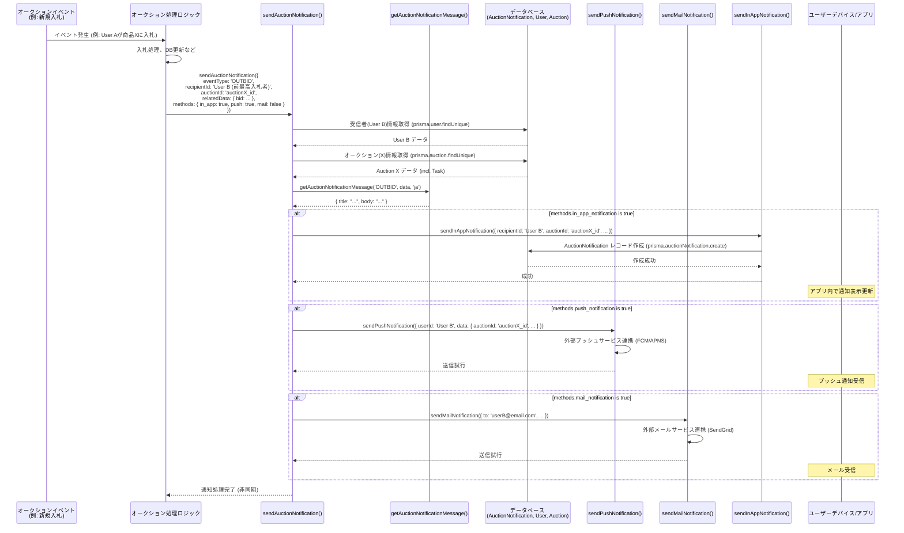

# オークション仕様

- [オークション仕様](#オークション仕様)
  - [このファイルの位置づけ](#このファイルの位置づけ)
  - [既存仕様書との乖離・注意点](#既存仕様書との乖離注意点)
  - [実装場所](#実装場所)
  - [関連モデル](#関連モデル)
    - [Auction](#auction)
    - [BidHistory](#bidhistory)
    - [AutoBid](#autobid)
    - [TaskWatchList](#taskwatchlist)
    - [AuctionMessage](#auctionmessage)
    - [AuctionReview](#auctionreview)
  - [基本ルール・非スコープ](#基本ルール非スコープ)
  - [出品作成・編集](#出品作成編集)
  - [一覧・検索・フィルタ](#一覧検索フィルタ)
    - [一覧UIの状態管理](#一覧uiの状態管理)
    - [一覧表示項目](#一覧表示項目)
  - [詳細画面](#詳細画面)
  - [入札](#入札)
  - [自動入札](#自動入札)
    - [概要](#概要)
    - [自動入札設定](#自動入札設定)
    - [自動入札実行](#自動入札実行)
    - [即時実行方式](#即時実行方式)
  - [延長](#延長)
  - [SSE・リアルタイム更新](#sseリアルタイム更新)
    - [クライアント](#クライアント)
    - [API](#api)
    - [publish](#publish)
  - [状態遷移・バックグラウンドジョブ](#状態遷移バックグラウンドジョブ)
    - [TaskStatus](#taskstatus)
    - [開始処理](#開始処理)
    - [終了処理](#終了処理)
    - [deposit point返還](#deposit-point返還)
    - [GitHub Actions 運用要求（現行未確認）](#github-actions-運用要求現行未確認)
  - [履歴・出品詳細・落札詳細](#履歴出品詳細落札詳細)
    - [納品・完了](#納品完了)
  - [ウォッチ](#ウォッチ)
  - [QAメッセージ](#qaメッセージ)
  - [レビュー](#レビュー)
  - [通知](#通知)
  - [権限・認可](#権限認可)
  - [エラー処理・セキュリティ・性能](#エラー処理セキュリティ性能)
    - [v0.1：検索欄の仕様](#v01検索欄の仕様)
    - [v0.1：出品商品一覧の仕様](#v01出品商品一覧の仕様)
    - [v0.1：出品/落札の管理画面の仕様](#v01出品落札の管理画面の仕様)
    - [v0.1：トランザクション処理と楽観的ロック制御](#v01トランザクション処理と楽観的ロック制御)
  - [v0.1：オークションの仕様](#v01オークションの仕様)
  - [検索欄の仕様](#検索欄の仕様)
  - [**概要**](#概要-1)
  - [**開発内容**](#開発内容)
  - [**オークションの流れ**](#オークションの流れ)
  - [**今回のアプリのオークションのルール**](#今回のアプリのオークションのルール)
  - [SSEの仕様](#sseの仕様)
  - [**入札画面の仕様**](#入札画面の仕様)
  - [トランザクション処理と楽観的ロック制御](#トランザクション処理と楽観的ロック制御)
  - [出品商品一覧の仕様](#出品商品一覧の仕様)
  - [**オークション通知の仕様**](#オークション通知の仕様)
  - [**オークション延長機能についての仕様**](#オークション延長機能についての仕様)
  - [入札・落札した商品を管理する画面](#入札落札した商品を管理する画面)
  - [テーブルの修正](#テーブルの修正)
  - [etcの仕様](#etcの仕様)
  - [Sidebarの修正](#sidebarの修正)
  - [Taskの入力Formの修正](#taskの入力formの修正)
  - [エラーハンドリングと例外処理](#エラーハンドリングと例外処理)
  - [パフォーマンス最適化戦略](#パフォーマンス最適化戦略)
  - [テスト戦略](#テスト戦略)
  - [バックグラウンドジョブと定期実行の詳細](#バックグラウンドジョブと定期実行の詳細)
  - [国際化とアクセシビリティ要件](#国際化とアクセシビリティ要件)
  - [監視とアナリティクス要件](#監視とアナリティクス要件)
  - [セキュリティ対策の詳細](#セキュリティ対策の詳細)
  - [デプロイメント戦略](#デプロイメント戦略)
  - [API設計とドキュメント](#api設計とドキュメント)
  - [スケーラビリティとパフォーマンス計画](#スケーラビリティとパフォーマンス計画)
  - [コーディング規約とベストプラクティス](#コーディング規約とベストプラクティス)
  - [ユーザーエクスペリエンスと設計原則](#ユーザーエクスペリエンスと設計原則)
  - [拡張性と将来計画](#拡張性と将来計画)
  - [ドキュメンテーションとナレッジ管理](#ドキュメンテーションとナレッジ管理)
  - [パフォーマンス最適化とその他設計上の考慮](#パフォーマンス最適化とその他設計上の考慮)
- [オークション通知機能 仕様書](#オークション通知機能-仕様書)
  - [1. 概要](#1-概要)
  - [2. 設計方針](#2-設計方針)
  - [型・関数](#型関数)
  - [7. 通知トリガー条件と送信内容](#7-通知トリガー条件と送信内容)
  - [8. UI仕様](#8-ui仕様)
    - [ヘッダー](#ヘッダー)
    - [ホバー](#ホバー)
    - [モーダル](#モーダル)
  - [9. 通知データの自動削除](#9-通知データの自動削除)
  - [概要](#概要-2)
  - [各ステータスの仕様](#各ステータスの仕様)
    - [TaskStatus](#taskstatus-1)
    - [BidStatus](#bidstatus)
    - [NotificationSendTiming](#notificationsendtiming)
    - [AuctionEventType](#auctioneventtype)
  - [GitHub Actionsの仕様](#github-actionsの仕様)
    - [実装の注意点](#実装の注意点)
    - [パフォーマンス最適化とその他設計上の考慮](#パフォーマンス最適化とその他設計上の考慮-1)
    - [トランザクション処理と楽観的ロック制御](#トランザクション処理と楽観的ロック制御-1)
    - [定期実行GitHub Actionsの今後のタスク](#定期実行github-actionsの今後のタスク)
    - [バックグラウンドジョブと定期実行の詳細](#バックグラウンドジョブと定期実行の詳細-1)
    - [ジョブ実行のログ](#ジョブ実行のログ)
    - [予約送信の通知の送信](#予約送信の通知の送信)
    - [オークションの開始処理](#オークションの開始処理)
    - [オークションの完了処理](#オークションの完了処理)
      - [3.2 落札者決定とポイント決済処理](#32-落札者決定とポイント決済処理)
        - [3.2.1 基本的な落札ロジック](#321-基本的な落札ロジック)
        - [3.2.2 落札金額の決定ロジック](#322-落札金額の決定ロジック)
        - [3.2.3 落札者のポイント残高確認](#323-落札者のポイント残高確認)
        - [3.2.4 ポイント決済の実行](#324-ポイント決済の実行)
      - [3.3 ステータス更新](#33-ステータス更新)
      - [3.4 通知作成](#34-通知作成)
      - [4. エラーハンドリング](#4-エラーハンドリング)
        - [4.1 トランザクションエラー](#41-トランザクションエラー)
        - [4.2 データ整合性チェック](#42-データ整合性チェック)
      - [5. 監視とロギング](#5-監視とロギング)
      - [7. テストシナリオ](#7-テストシナリオ)
      - [8. データモデル関連図](#8-データモデル関連図)
      - [9. 状態遷移表](#9-状態遷移表)
    - [ポイント返還する処理](#ポイント返還する処理)
    - [GitHub Actionsの無料枠](#github-actionsの無料枠)
  - [**概要**](#概要-3)
  - [**必要な理由・目的**](#必要な理由目的)
  - [**基本終了条件**](#基本終了条件)
  - [**終了時間の延長ルール**](#終了時間の延長ルール)
  - [**使用するカラム**](#使用するカラム)
  - [概要](#概要-4)
  - [注意事項・仕様](#注意事項仕様)
    - [**1. コアロジック・アルゴリズム**](#1-コアロジックアルゴリズム)
    - [**2. ユーザーインターフェース（UI）とユーザーエクスペリエンス（UX）**](#2-ユーザーインターフェースuiとユーザーエクスペリエンスux)
    - [**3. 同時実行制御（Concurrency Control）**](#3-同時実行制御concurrency-control)
    - [**4. エラーハンドリングとエッジケース**](#4-エラーハンドリングとエッジケース)
  - [即時の自動入札](#即時の自動入札)

## このファイルの位置づけ

このファイルは、v0.1 のオークション関連仕様を集約した唯一の詳細仕様です。

現行実装から確認できる仕様を本文の中心に置きます。旧仕様にだけ存在する要求、または現行実装と異なる記載だけを「現行未確認」「旧要求」「乖離」として残しています。

## 既存仕様書との乖離・注意点

- 旧仕様には独立した `AuctionStatus` や `AuctionNotification`
  を前提にした記述があります。現行実装ではオークション状態は主に `Task.status` が担い、通知は共通 `Notification` に
  `auctionEventType` と `auctionId` を持たせます。
- 旧仕様の SSE URL は `/api/auctions/[auctionId]/events` ですが、現行実装は
  `/api/auctions/{auctionId}/sse-server-sent-events` です。
- 旧仕様には一覧50件、ランダム延長、`remainingTimeForExtension`
  を使った延長判定、オークション専用通知UI、通知の週次削除、入札APIのレート制限、OpenAPI公開などの要求があります。これらは読んだ現行実装では確認できないため、旧要求として扱います。
- 旧仕様には自動入札の10分間隔制限があります。現行の `AutoBid` モデルには `lastBidTime`
  があり、定数や文書上の記載もありますが、読んだ実行経路では間隔制限の適用を確認できません。
- 旧自動入札仕様には `revalidatePath()` でUI更新する記載があります。現行の入札更新は SSE
  publish を中心にしているため、旧仕様の更新方法とは異なります。
- 終了スクリプトは落札ありのタスクを `POINTS_DEPOSITED` にします。一方、deposit返還スクリプトは
  `Task.status = AUCTION_ENDED` を対象に検索します。通常経路で返還対象になるかは確認が必要です。
- 旧仕様には、入札者1人の場合の落札額を最低入札額または `Auction.startingPrice` とする記述があります。現行 schema に
  `startingPrice` はなく、現行終了処理では単独入札の `depositPoint` は0です。
- レビューは `AuctionReview` に保存され、unique は `(auctionId, reviewerId, revieweeId)` です。`reviewPosition`
  はフィールドと index はありますが unique 条件には含まれていません。
- 旧仕様には「取引参加者のみレビュー可能」「匿名/編集不可」などの要求があります。現行実装ではレビュー作成時に reviewee が実際の取引参加者かを厳密に検証する処理は、読んだ範囲では確認できません。

## 実装場所

- `src/actions/auction/**/*`
- `src/components/auction/**/*`
- `src/hooks/auction/**/*`
- `src/app/dashboard/auction/**`
- `src/app/api/auctions/[auctionId]/**`
- `scripts/update-auction-status-to-active.ts`
- `scripts/update-auction-status-to-completed.ts`
- `scripts/return-auction-deposit-points.ts`
- `src/actions/task/create-task-form.ts`
- `src/actions/task/edit-task-modal.ts`
- `src/actions/notification/auction-notification.ts`
- `prisma/schema.prisma`

## 関連モデル

### Auction

`Auction` は単独で作成されず、`ContributionType.REWARD` の `Task` に1対1で紐づきます。

主なフィールド:

- `taskId`
- `groupId`
- `startTime`
- `endTime`
- `currentHighestBid`
- `currentHighestBidderId`
- `winnerId`
- `version`
- `isExtension`
- `extensionLimitCount`
- `extensionTotalCount`
- `extensionTime`
- `remainingTimeForExtension`

`Auction` 自体に status はありません。現行実装では `Task.status` がオークションの状態も表します。

### BidHistory

入札履歴を保存します。

- `auctionId`
- `userId`
- `amount`
- `isAutoBid`
- `status`
- `depositPoint`

`BidStatus`:

- `BIDDING`: 入札中。`BidHistory` 作成時の初期状態です。
- `WON`: 落札済み。終了処理で落札者の入札に設定されます。
- `LOST`: 落札失敗。終了処理で落札者/残高不足者以外の入札に設定されます。
- `INSUFFICIENT`: 残高不足。落札候補者の group point が deposit amount に足りない場合に設定されます。

### AutoBid

自動入札設定を保存します。

- `auctionId`
- `userId`
- `maxBidAmount`
- `bidIncrement`
- `lastBidTime`
- `isActive`
- `(userId, auctionId)` unique

### TaskWatchList

ウォッチ状態を保存します。

- `auctionId`
- `userId`
- `(userId, auctionId)` unique

### AuctionMessage

質問/回答メッセージを保存します。受信者はモデルに保存されず、送信時の `recipientIds` は通知送信に使われます。

### AuctionReview

取引後レビューを保存します。

- `auctionId`
- `reviewerId`
- `revieweeId`
- `rating`
- `comment`
- `completionProofUrl`
- `reviewPosition`
- `(auctionId, reviewerId, revieweeId)` unique

`reviewPosition` は `SELLER_TO_BUYER` または `BUYER_TO_SELLER` です。

## 基本ルール・非スコープ

v0.1 オークションの基本ルールは次のとおりです。

- `ContributionType.REWARD` のタスクを出品として扱います。
- 商品発送、住所管理、通貨支払い、即時購入は対象外です。
- 外部サービスでの提供や完了証明は、アプリ内の提供方法、完了操作、レビュー/証拠URLで扱います。
- 最低入札額や入札単位の設定画面はありません。UI上は `currentHighestBid + 1`
  を最低入札額として扱い、1ポイント単位で入札します。
- 同額入札は先着順で扱います。終了処理では金額 desc の後、同額時は早い入札を優先します。
- 出品者本人は入札できません。現行コード上の自己出品判定は、task executor に現在ユーザーが含まれるかを見ます。
- 終了済みまたは `AUCTION_ACTIVE` でない auction には入札できません。
- ポイントは group ごとに別扱いです。落札時の残高確認は auction の `groupId` と user の `GroupPoint` を基準にします。
- 入札時点では `GroupPoint.balance` を減算せず、落札確定時に deposit point を差し引きます。
- 入札時点では、入札額分のポイントを現在持っているかは必須チェックしません。落札確定時に不足していれば次点へ繰り上げます。
- 自動入札設定時、上限額が残高を超える場合でも設定は許可する方針です。警告表示の詳細はこの文書では未確認です。
- UIとロジックを分離し、クライアント側ロジックは hook、サーバー更新は action/API に寄せます。
- サーバー負荷とDBアクセスを抑えるため、一覧は cache、詳細の入札更新は SSE、URL状態は client
  state と query 同期で扱います。

## 出品作成・編集

タスク作成時に `contributionType === REWARD` の場合、`Auction` が作成されます。

初期値:

- `startTime`: フォーム値。未指定時は現在時刻
- `endTime`: フォーム値。未指定時は7日後
- `groupId`: task の group
- `isExtension`: フォーム値を boolean へ変換
- `currentHighestBid`: schema default
- `version`: schema default

タスク編集時の挙動:

- `NON_REWARD -> REWARD` に変更した場合、Auction がなければ作成します。
- `REWARD -> NON_REWARD` に変更した場合、入札がない Auction は削除します。
- 入札がある Auction は削除せず、task 更新を続行します。

CSVアップロードや upload modal から作成される REWARD タスクにも auction
fields を適用する要求があります。現行での完全な適用範囲は、タスク仕様側も参照してください。

## 一覧・検索・フィルタ

- 概要
  - `cachedGetAuctionListings` は、現在ユーザーが参加している group の Auction のみを返します。

- ページング
  - 1ページ20件を表示する

検索:

- PGroonga を使い、Task の `task` と `detail` を対象に検索します。
- `public.normalize_japanese` と `pgroonga_score` / `pgroonga_highlight_html` を利用します。
- 検索 highlight は PGroonga 検索時に返される HTML をカード表示で利用します。

フィルタ:

- `category`
- `watchlist`
- `not_bidded`
- `bidded`
- `ended`
- `not_ended`
- `not_started`
- `started`
- `min/max bid`
- `min/max remaining time`
- `groupIds`

sort:

- `relevance`
- `newest`
- `time_remaining`
- `bids`
- `price`
- `score`

search がある場合は relevance/score、ない場合は `createdAt desc` が中心です。

一覧の表示・検索観点:

- 参加 group の出品のみを表示する。
- watchlist、未入札、入札済み、終了、価格、残り時間、入札数、group、recommended などのフィルタ/ソート観点を持つ。
- 食品、コード、本、その他などのカテゴリ観点があります。現行カテゴリの実値は実装側の enum/定義を正とします。
- 自身の保有ポイント総額表示、出品者平均評価の重み付き平均2桁表示、取得に必要な額表示などは、現行での表示有無が未確認です。

### 一覧UIの状態管理

`useAuctionListings` は `nuqs` で URL query と一覧条件を同期します。

- `page`
- `category`
- `status`
- `status_join_type`
- `sort`
- `sort_direction`
- `q`
- `min_bid`
- `max_bid`
- `min_remaining_time`
- `max_remaining_time`
- `group_id`

挙動:

- ページ以外の検索条件が変わった場合は page を 1 に戻します。
- 配列条件や sort は前回条件と比較し、不要な URL 更新を避けます。
- Hydration前は loading 扱いにし、SSR/CSRの不一致を避けます。
- 参加 group id は24時間 cache し、一覧本体は1時間 cache します。
- 次ページが存在する場合は TanStack Query で prefetch します。

URL query に同期する理由:

- 検索結果の共有URL、ブックマーク、ブラウザ戻る/進む、リロード後の条件復元を成立させるためです。
- URL更新とデータ取得が相互に反応すると無限ループになりやすいため、条件比較と page reset の制御が必要です。

### 一覧表示項目

カード表示では、次の情報を扱います。

- task名
- 詳細
- カテゴリ
- group
- 現在最高額
- 残り時間
- 入札数
- ウォッチ状態
- 出品者/実行者情報
- 検索 highlight

## 詳細画面

`/dashboard/auction/[auctionId]` は Auction 詳細、入札、ウォッチ、質問、レビュー導線を扱います。

詳細データ:

- `getAuctionByAuctionId`
- SSE更新用の `getUpdatedAuctionByAuctionId` 系
- `/api/auctions/{auctionId}/auction-data`

詳細ページはタブで情報を分けます。

現行実装で確認できるタブ:

- 詳細
- 入札履歴
- 質問と回答
- 配送・支払い

詳細画面で扱う情報:

- 商品名
- 商品詳細
- 画像
- 出品者情報
- group名
- 現在最高額
- 最低入札額
- 残り時間
- 開始前は開始までのカウントダウン
- 進行中は終了までのカウントダウン
- 入札履歴
- 入札種別 normal/auto
- 質問/回答
- deposit期間

旧仕様には「その他」タブ、出品者評価、取得に必要な額、提供方法の詳細表示もありました。現行詳細画面での表示有無は実装を正とします。

## 入札

`validateAuction(auctionId, options)` が共通検証を行います。

主な検証:

- 認証ユーザーを取得できること
- Auction が存在すること
- 自己出品に対する操作ではないこと
- `endTime` を過ぎていないこと
- 入札実行時は `Task.status === AUCTION_ACTIVE`
- `currentHighestBid` より高い金額であること

`executeBid(auctionId, amount, isAutoBid = false, autoBidUserId?)` が入札処理を行います。

処理:

1. `validateAuction` で検証します。
2. transaction 内で現在の `Auction.version` と最高入札者を取得します。
3. `BidHistory` を `BIDDING` で作成します。
4. `Auction.currentHighestBid`, `currentHighestBidderId`, `version` を更新します。
5. 延長対象なら `processAuctionExtension` を実行します。
6. 更新後の auction data を取得します。
7. 前最高入札者が別ユーザーなら `OUTBID` 通知を送ります。
8. Upstash Redis に SSE event を publish します。
9. 手動入札の場合は transaction 後に自動入札を実行します。

楽観ロック:

- `Auction.version` を条件に update し、更新時に increment します。
- version の整合性が取れない場合は競合として扱います。

入札時エラー:

- 現在価格より低い、または同額の入札
- 終了後の入札
- 自己出品への入札
- セッション切れ
- 権限不足
- システムエラー

## 自動入札

### 概要

自動入札（代理入札、Proxy
Bidding）は、ユーザーが事前に入札したい最高額（上限額）を設定しておくと、他のユーザーが入札するたびに、設定した上限額を超えない範囲で、現在の最高入札額をわずかに上回る金額でシステムが自動的に再入札してくれる機能です。

### 自動入札設定

`setAutoBid` は次を検証します。

- `maxBidAmount >= 1`
- `bidIncrement >= 1`
- active auction であること
- `maxBidAmount > currentHighestBid`

保存:

- `AutoBid` は `(userId, auctionId)` unique で upsert されます。
- `isActive = true` で保存されます。

UI/UX:

- 上限額入力欄の近くに、入札単位 `bidIncrement` を入力できるようにする。
- ユーザーが迷わず最高入札額を設定できる入力インターフェースを提供する。
- オークション期間中に、自分の上限入札額を変更できます。保存は `(userId, auctionId)` unique の upsert です。
- 複数のユーザーが同じ最高入札額を設定した場合は、先に上限額を設定したユーザーを優先します。

取消:

- `cancelAutoBid` は対象 user/auction の active 設定を false にします。
- 取消済みでも既存の入札履歴は変更せず、次回以降の自動入札だけを止めます。
- ユーザーはオークション期間中、自動入札を取り消せます。

取得:

- `getAutoBidByUserId` は現在最高額より `maxBidAmount` が大きい active 設定を返します。

### 自動入札実行

`executeAutoBid` は、現在最高額より高い active `AutoBid` を対象にします。

優先順:

1. `maxBidAmount` desc
2. `createdAt` asc

入札額:

- 候補が複数ある場合は、2番目の `maxBidAmount + highest.bidIncrement`
- 候補が1件の場合は、現在最高額 + increment
- ただし highest の `maxBidAmount` を超えません。

現在価格に関する説明:

- 自動入札が設定されている場合でも、表示される現在最高額は自動入札者の上限額そのものとは限りません。
- 例: ユーザーAが上限10000ポイント、入札単位100ポイントで自動入札を設定し、ユーザーBが8000ポイントで入札した場合、Aの代理入札は8100ポイントとなり、現在最高額は8100ポイントになります。

上限到達:

- `maxBidAmount` に到達した場合は `isActive = false` にします。
- `AUTO_BID_LIMIT_REACHED` 通知を送ります。
- 他ユーザーに追い越された場合は `OUTBID`、自動入札が上限に達した場合は `AUTO_BID_LIMIT_REACHED` として、共通
  `Notification` 経由で通知します。

自動入札の安全要件:

- ユーザーが設定した `maxBidAmount` を超える入札は行わない。
- 入札額、上限額、入札単位は数値、正の値、最小1ポイントを検証する。
- オークション終了時刻とほぼ同時に入札/自動入札が発生する場合の処理順序を明確にし、トランザクションと `version`
  で競合を扱う。

### 即時実行方式

現行実装は手動入札の transaction 後に`executeAutoBid` を呼び、自動入札を即時に連鎖させる方式です。

処理トリガー:

- 手動入札が行われた時。
- 新たに自動入札が設定された時。
- 自分が最高額入札者でなくなった時。

共通処理フロー:

1. 対象 `auctionId` に紐づく自動入札設定を取得する。
2. 現在最高額より高い上限額の active 設定のみを対象にする。
3. 現在最高入札者自身の自動入札は対象から外す。
4. `maxBidAmount` 降順、同額時は設定が早い順で並べる。
5. 自動入札設定がなければ処理終了。
6. 最高上限額と2番目の上限額を特定する。
7. 候補が複数なら「2番目に高い上限額 + 最高上限額設定者の入札単位」で入札額を計算する。
8. 候補が1件なら「現在最高額 + 唯一の自動入札設定者の入札単位」で入札額を計算する。
9. 計算額が上限額を超える場合は上限額に丸める。
10. 最高上限額設定者のIDで自動入札を実行し、`BidHistory.isAutoBid = true` として記録する。
11. 最高入札額と最高入札者を更新する。

旧ファイルには `revalidatePath()` を呼ぶコード例がありましたが、現行の入札更新は SSE
publish を中心にしています。このため旧コード例は現行実装としては転記しません。

即時方式を採用する理由:

- ユーザー体験を優先し、入札結果をリアルタイムに近く反映できる。
- GitHub Actions などの定期実行コストを減らせる。
- 定期実行方式より実装と保守を単純にできる。
- 入札設定順ではなく、上限額と同額時の先着順ルールで公平性を扱える。

注意点

- 自動入札の上限額は絶対に超えない。
- 同額上限の場合は先に設定したユーザーを優先する。
- ユーザーに同額上限時の優先ルールを明示する。
- 自動入札の最小単位は1ポイント。
- 自動入札は同一ユーザーが連続して実行する場合、最短10分間隔にする要求がありました。現行実装での適用は未確認です。

## 延長

`processAuctionExtension` は次の場合だけ実行します。

- `auction.isExtension` が true
- `extensionTotalCount < extensionLimitCount`
- 終了間際の入札であること

トリガー/延長時間:

- 総期間の5%
- `extensionTime` 分
- 上記の長い方

延長の目的は、終了直前の入札によるスナイピングを緩和することです。

旧仕様との差分:

- 旧 `request-auction-extension.md` では、残り時間が「総期間5%」または `remainingTimeForExtension`
  分の長い方以下のときに延長する要求でした。
- 現行実装では `remainingTimeForExtension` を使った条件は確認できません。
- 旧 `request-auction.md`
  にはランダム延長、5分前以内、最大2回、強制終了可能という記述もありました。現行実装ではランダム延長や強制終了 action は確認できません。

## SSE・リアルタイム更新

### クライアント

`useAuctionBidSse` は EventSource で以下に接続します。

`/api/auctions/${auctionId}/sse-server-sent-events`

挙動:

- 初期データを受け取ります。
- bidHistories を先頭に追加し、最大26件程度に制限します。
- `visibilitychange` で非表示時に切断し、表示時に再接続します。
- error 時は close し、5秒後に最大3回 retry します。
- 4回目以降は reload 促しの message を表示します。

実装では `EventSource`を使う

### API

`sse-server-sent-events/route.ts`:

- runtime は edge
- GETのみ
- Upstash Redis REST `/subscribe/{channel}` に接続します。
- channel は `auction:{auctionId}:events`
- 初期データは内部API `/api/auctions/{auctionId}/auction-data` から取得します。

`auction-data/route.ts`:

- `x-internal-secret` が `FREEISM_APP_API_SECRET_KEY` と一致する必要があります。
- auctionId がない場合は 400。
- secret 不一致は 401。

### publish

`sendEventToAuctionSubscribers` は Upstash Redis REST `/publish/{channel}` に JSON を送信します。

payload:

- `data`
- `timestamp`

SSE event type（現行未確認）:

- `initial`
- `new_bid`
- `auction_update`
- `auction_extension`
- `auction_ended`
- `error`

旧仕様には SSE 接続数制限10、30分タイムアウトという要求もありました。現行実装での制限値は未確認です。

SSE は入札履歴、現在最高額、最高入札者、延長/終了など、リアルタイム更新が必要な情報に絞って送ります。詳細本文、カテゴリ、出品者情報など更新頻度が低い情報は cache や state を使い、SSE
payload を最小化します。

## 状態遷移・バックグラウンドジョブ

### TaskStatus

オークション関連で使う主な `Task.status` は次のとおりです。

- `PENDING`: 開始前
- `AUCTION_ACTIVE`: 開催中
- `AUCTION_ENDED`: enum は存在するが、終了スクリプトの主要更新先ではありません
- `POINTS_DEPOSITED`: 落札確定後、deposit point 差し引き済み
- `SUPPLIER_DONE`: 出品者側の提供完了
- `TASK_COMPLETED`: 落札者側の完了承認
- `FIXED_EVALUATED`: 固定評価済み
- `POINTS_AWARDED`: ポイント付与済み
- `ARCHIVED`: 入札なしなどで終了
- `AUCTION_CANCELED`: enum/UI表示はあるが専用キャンセル action は確認できません

代表的な経路:

1. `PENDING`
2. `AUCTION_ACTIVE`
3. 入札なし: `ARCHIVED`
4. 落札あり: `POINTS_DEPOSITED`
5. 出品側提供完了: `SUPPLIER_DONE`
6. 落札側完了承認: `TASK_COMPLETED`
7. 固定評価: `POINTS_AWARDED`

### 開始処理

`scripts/update-auction-status-to-active.ts`

対象:

- `Task.status = PENDING`
- 紐づく `Auction.startTime <= now`

処理:

- 対象 task を `AUCTION_ACTIVE` に更新します。

運用要求として、GitHub Actions により毎日日本時間00:00に開始処理を実行する想定があります。

### 終了処理

`scripts/update-auction-status-to-completed.ts`

対象:

- `Task.status` が `AUCTION_ACTIVE` または `PENDING`
- 紐づく `Auction.endTime <= now`

処理は auction ごとに行い、1件の失敗が他の auction 処理を止めないようにしています。

入札なし:

- `Task.status = ARCHIVED`
- creator に `ENDED` と `NO_WINNER` 系通知を送ります。

入札あり:

1. `BIDDING` の bid を金額 desc で並べます。
2. 最高入札を winner candidate にします。
3. deposit amount を決めます。
   - 単独入札: 0
   - 複数入札: 2番目の金額 + 1
4. winner の `GroupPoint.balance` を確認します。
5. 残高不足なら、その bid を `INSUFFICIENT` にし、次候補で再処理します。
6. 残高があれば、winner の `GroupPoint.balance` から deposit amount を減算します。
7. winner bid を `WON` にし、`depositPoint` を保存します。
8. 他の `BIDDING` bid を `LOST` にします。
9. `Auction.winnerId` を設定します。
10. `Task.status = POINTS_DEPOSITED` にします。

通知:

- creator: `ENDED`, `ITEM_SOLD`
- winner: `AUCTION_WIN`
- loser: `AUCTION_LOST`

終了処理の回帰シナリオ:

- 通常ケース: 複数入札があり、最高額入札者が落札する。
- 同額入札ケース: 同額の最高入札があり、最も早い入札者が落札する。
- ポイント不足ケース: 最高額入札者のポイントが不足し、次点者が落札する。
- すべて不適格ケース: すべての入札者がポイント不足で落札者なしになる。
- 入札なしケース: オークション終了時に入札がなく落札者なしになる。

### deposit point返還

`scripts/return-auction-deposit-points.ts`

対象:

- `Task.status = AUCTION_ENDED`
- `Auction.endTime + Group.depositPeriod <= now`
- `BidHistory.status = WON`

処理:

- winner の `GroupPoint.balance` に `depositPoint` を戻します。
- `POINT_RETURNED` 通知を送ります。

注意:

- 終了スクリプトは落札ありを `POINTS_DEPOSITED`
  にするため、返還スクリプトの対象条件と通常経路が接続しているかは確認が必要です。
- Group が削除された場合にも `GroupPoint` レコードを削除せず返還可能にしたい要求があります。現行 schema では
  `GroupPoint.group` は `onDelete: Cascade` のため、この要求とは前提がずれている可能性があります。

### GitHub Actions 運用要求（現行未確認）

GitHub Actions 運用には次の要求があります。現行の workflow 実装有無はこの文書では未確認です。

- `schedule: cron` と `workflow_dispatch` を使う。
- Ubuntu runner で実行する。
- `pnpm install --frozen-lockfile` を使う。
- TypeScript を実行可能にするため、必要ファイルをトランスパイルする。
- pnpm store、`node_modules`、`.next/cache` を actions/cache で cache する。
- 定期ジョブは冪等にする。
- ジョブ失敗時は最大3回 retry する。
- 部分的な処理成功を記録し、他の対象処理を継続する。
- バッチサイズやチャンク処理で大量更新に備える。
- 実行ログ、失敗アラート、週次レポートを検討する。
- 通知予約送信は毎日日本時間01:00。
- 開始処理、終了処理、ポイント返還は毎日日本時間00:00。
- GitHub Actions の無料枠には十分収まる見込みです。

`NotificationSendTiming`:

- `NOW`: 通知作成時に即時送信。
- `SCHEDULED`: `sendScheduledDate` と `sentAt` を見て予約送信ジョブで送信。

## 履歴・出品詳細・落札詳細

| 画面                                            | 概要                        |
| ----------------------------------------------- | --------------------------- |
| `/dashboard/auction/history`                    | 自分の入札履歴              |
| `/dashboard/auction/created-detail/[auctionId]` | 自分が出品/関係する出品詳細 |
| `/dashboard/auction/won-detail/[auctionId]`     | 自分が落札した出品詳細      |

出品履歴は creator/executor/reporter の role を見ます。落札詳細は `winnerId = userId` を条件にします。

### 納品・完了

出品側:

- `completeTaskDelivery(taskId, userId)` は出品側詳細で呼ばれ、権限確認後に `Task.status = SUPPLIER_DONE` にします。
- `updateDeliveryMethod(taskId, deliveryMethod, userId)` は提供方法を更新します。

落札側:

- `won-detail.completeTaskDelivery(taskId)` は `Task.status = TASK_COMPLETED` に更新します。
- この action 内に認可チェックは確認できません。

固定評価とポイント付与:

- `TASK_COMPLETED` の task は固定評価CSVで `POINTS_AWARDED` に進みます。
- このとき reporter/executor の登録ユーザーへ `GroupPoint.balance` と `fixedTotalPoints` が加算されます。

履歴/詳細で扱う情報:

- 入札履歴
- 落札履歴
- 出品履歴
- 落札詳細での出品者評価
- 出品詳細での落札者評価
- 完了ボタン
- 完了証明添付
- 提供方法の入力/更新
- 預けるポイント額
- 返還期間
- チャットまたはメッセージ

## ウォッチ

`TaskWatchList` は `userId + auctionId` unique です。

処理:

- 既にウォッチ中なら delete。
- 未ウォッチなら create。

入力:

- `auctionId`
- `userId`

一覧取得では watchlist filter として利用されます。

旧仕様には、ウォッチリスト更新を state で保持し、画面や modal を閉じる時にまとめてDB保存する案がありました。現行実装は toggle 時に create/delete します。

## QAメッセージ

`AuctionMessage` に質問/回答メッセージを保存します。

`sendAuctionMessage`:

- message は trim 後に空でないこと。
- 通知送信先として `recipientIds` が必要。
- `AuctionMessage` に保存する送信者は `senderId`。
- 保存後、送信者以外へ `QUESTION_RECEIVED` 通知を送信。

送信先:

- creator
- reporters
- executors

表示:

- Auction詳細でQA一覧と送信UIを扱います。

質問を受けた出品者には通知し、質問と回答は詳細タブで表示します。

## レビュー

`AuctionReview` は取引後レビューを保存します。

主なフィールド:

- `auctionId`
- `reviewerId`
- `revieweeId`
- `rating`
- `comment`
- `completionProofUrl`
- `reviewPosition`

unique:

- `auctionId`
- `reviewerId`
- `revieweeId`

`reviewPosition`:

- `SELLER_TO_BUYER`
- `BUYER_TO_SELLER`

rating:

- コード上は0から5の整数を許容します。

注意:

- レビュー作成時、reviewee が実際の取引参加者かをサーバー側で厳密に検証する処理は読んだ範囲では確認できません。

レビュー検索との関係:

- 作成された `AuctionReview` は `/dashboard/review-search` で検索できます。
- 全体検索は reviewer を返さず、匿名寄りの表示です。
- 自分が書いたレビューは編集できます。
- 自分が受け取ったレビューは reviewer 情報を含みます。
- 詳細は [review-search-and-github-conversion.md](./review-search-and-github-conversion.md) を参照してください。

レビュー要件:

- 出品者と落札者の双方がレビューできる。
- 各取引につき1回だけレビューできる。
- テキストと評価を保存する。
- 取引参加者のみレビューできる要求があります。ただし、現行実装のサーバー側検証は未確認です。
- 匿名表示、編集不可などの案がありました。現行レビュー検索には「自分が書いたレビューは編集可能」という仕様があるため、旧要求とは一致しません。

## 通知

オークションイベント通知は共通 `Notification` に `auctionEventType` と `auctionId` を保存します。

現行 enum:

- `ITEM_SOLD`
- `NO_WINNER`
- `ENDED`
- `OUTBID`
- `QUESTION_RECEIVED`
- `AUTO_BID_LIMIT_REACHED`
- `AUCTION_WIN`
- `AUCTION_LOST`
- `POINT_RETURNED`
- `AUCTION_CANCELED`

主な通知:

- 自分の入札が他者に上回られた: `OUTBID`
- 質問を受け取った: `QUESTION_RECEIVED`
- 自動入札が上限に達した: `AUTO_BID_LIMIT_REACHED`
- 落札した: `AUCTION_WIN`
- 落札できなかった: `AUCTION_LOST`
- 出品物が落札された: `ITEM_SOLD`
- 落札者なし: `NO_WINNER`
- オークション終了: `ENDED`
- deposit point 返還: `POINT_RETURNED`

旧通知仕様との差分:

- 旧仕様は `AuctionNotification`
  独立テーブル、`sendAuctionNotification`、`getAuctionNotificationMessage`、専用通知アイコン、hover
  preview、通知一覧 modal を前提にしていました。
- 旧 event type には `NEW_BID_ON_OWN_ITEM`, `AUCTION_ENDED_OWN_ITEM`, `AUCTION_WON` などがありました。現行 enum では
  `AUCTION_WIN` など別名になっています。
- 旧仕様ではアプリ内通知、メール通知、プッシュ通知を送信方法として切り替える要求がありました。現行通知全体の詳細は
  [notification.md](./notification.md) を参照してください。
- 旧仕様では通知から1ヶ月後の自動削除、または終了時削除、週1回日曜深夜1時の GitHub
  Actions 実行が要求されていました。現行でのオークション通知削除処理は未確認です。

通知イベントと現行 enum の対応:

| 旧イベント               | 現行で近いイベント                   | 備考                         |
| ------------------------ | ------------------------------------ | ---------------------------- |
| `NEW_BID_ON_OWN_ITEM`    | `ITEM_SOLD` ではなく新規入札通知相当 | 現行 enum に同名はありません |
| `OUTBID`                 | `OUTBID`                             | 前最高入札者向け             |
| `QUESTION_RECEIVED`      | `QUESTION_RECEIVED`                  | 質問/回答メッセージ送信時    |
| `AUTO_BID_LIMIT_REACHED` | `AUTO_BID_LIMIT_REACHED`             | 自動入札上限到達             |
| `AUCTION_ENDED_OWN_ITEM` | `ENDED` / `ITEM_SOLD` / `NO_WINNER`  | 終了結果により分かれます     |
| `AUCTION_WON`            | `AUCTION_WIN`                        | enum名が異なります           |
| `AUCTION_LOST`           | `AUCTION_LOST`                       | 落札失敗者向け               |
| `POINT_RETURNED`         | `POINT_RETURNED`                     | deposit point 返還           |

通知の受信者/メッセージ観点:

- 出品者: 新規入札、質問、終了、落札者あり/なし。
- 前最高入札者: 追い越し。
- 自動入札設定者: 上限到達。
- 落札者: 落札、deposit point 返還。
- 落札失敗者: 落札失敗。
- デフォルト送信方法は推奨値を持ち、ユーザー設定により app push、web
  push、email、in-app などを切り替える要求があります。

## 権限・認可

- 一覧は参加 group 内のみです。
- 入札は認証必須です。
- 入札時は終了時刻、`AUCTION_ACTIVE`、現在最高額超過、自己出品禁止を検証します。
- 自己出品禁止は、コード上では `task.executors` に現在ユーザーが含まれるかで判定しています。
- レビュー作成は認証必須ですが、参加者かどうかのサーバー側検証は読んだ範囲では確認できません。
- `won-detail.completeTaskDelivery(taskId)` の action 内に認可チェックは確認できません。

## エラー処理・セキュリティ・性能

同時実行:

- 入札、終了処理、通知作成は transaction 内で atomic に行う。
- OCC は `Auction.version` を使う。
- version 条件 update の影響行が0なら競合として retry する。

性能:

- Prisma の `select` / `include` を絞り、N+1を避ける。
- 一覧は cache、短い TTL、必要最小限の payload を使う。
- API response を圧縮し、必要な field のみにする。
- 画像は WebP、遅延ロード、Next.js Image を検討する。
- SSE payload は必要最小限にする。

セキュリティ:

- 商品説明、レビューコメントなど user input は XSS 対策を行う。
- 状態変更操作は server side の認可チェックを必須にする。

アクセシビリティ/国際化:

- 日時はユーザーの現地時間で表示する。
- 残り時間や live update はスクリーンリーダーに配慮する。
- WCAG 2.1 AA、キーボード操作、ARIA、contrast を意識する。

### v0.1：検索欄の仕様

- 概要
  - 出品された商材を検索する画面。
  - **検索の対象範囲**は、**「v0.1：出品商品一覧の仕様」**と同じく、そのユーザーが**参加している Group で出品された商品のみ**（それ以外の Group の出品は検索結果に含めない）

- 使用場面
  1.  出品された商材などデータを検索する

- 要件
  1.  ベクトル検索は実装しない
      - その理由
        1.  ベクトルを算出する費用がかかるため
  2.  全文検索の実装
      - 要件
        1.  全文検索を行うために、Supabaseの拡張機能である`pgroonga`を使用して、tokenizerには`TokenMecab`と`Bigram`の2つのインデックスを使用して検索する
            - `TokenMecab`
              - 意味に基づいた分割による検索精度の向上とトークン数の削減
            - `Bigram`
              - 誤字脱字の対応
        2.  `PGroonga`の類似度検索(`pgroonga_score`)も、`&@`の部分一致と一緒に使用。
            - `PGroonga`の全文検索は、`&@~`演算子の正規表現による部分一致ではなく、`&@`演算子の部分一致の検索を使用する
        3.  where句の絞り込みは完全一致ではなく部分一致で行う
        4.  Supabaseのストアドファンクション(rpc関数)は使用しない。
            - Prisma ORMの`$queryRaw`で全文検索を行う
        5.  サジェスト(自動補完機能)機能を実装
            - 上限10件のサジェスト
            - `WHERE name &^ prefix`で前方一致で、`pgroonga_score`が高い順に並べて上限10件を表示
              - ユーザー入力時にリアルタイムでサジェストを提供
        6.  ハイライト検索
            - 検索結果内でマッチした部分をハイライト表示
            - `pgroonga_highlight_html`関数を使用してマッチ部分をHTML形式で強調表示
        7.  パフォーマンスを最適化するために、検索パターンに応じたINDEXを作成
        8.  Next.js version15の `'use cache'`を使用する
        9.  ファセット検索（絞り込み検索）を実装
        10. カテゴリーや価格の絞り込みはstate内で行う
        11. 大文字・小文字・ひらがな・カタカナの表記揺れに対応するために、正規化を行う
        12. TypeScript、PostgreSQLで実装
        13. 検索欄に入れた文言で、商品名と説明文を検索する
        14. **検索クエリの最適化**
            - 両方のインデックスを組み合わせたクエリ:
              - `TokenMecab`と`Bigram`のスコアを合算して総合的な関連性を判定

### v0.1：出品商品一覧の仕様

- 概要
  - 当該ユーザーが**参加している Group**
    において出品された商材の一覧を表示する画面（**自ユーザーが参加していない Group の出品は表示しない**）

- 使用場面
  1.  出品された商材の一覧表示する画面して、出品されたオークションを探す

- 要件
  1.  **Stateで出品商品を管理する**
      - その理由
        - できる限りデータベースへのアクセスを少なくする。
        - 「検索」や「ページネーションの次のページの表示」を行った際にデータベースにアクセスする
  2.  **カテゴリーのフィルター機能**
      - ヘッダー下の上部に、カテゴリーを追加し、カテゴリによるフィルタリング
      - カテゴリーは、「すべて」・「食品」・「コード」・「本」・「etc」
  3.  **詳細なフィルター機能**
      - すべて、ウォッチリスト、未入札、入札済み、オークション終了済み、価格帯、入札残り時間、価格、入札数、どのGroupで出品された商品か、おすすめの項目で、フィルタリング
      - すべてのフィルターを組み合わせられるようにする
  4.  **検索フィルター機能**
      - 検索欄を配置してフィルターできるようにする。
      - 「カテゴリーのフィルター」かつ「詳細なフィルター」かつ「検索フィルター」でフィルターできるようにもする
      - ファセット検索に対応
  5.  **ソート機能**
      - 「新着順」・「入札残り時間順」・「価格順」・「入札数順」その他おすすめの項目で、ソート
  6.  **出品されている商品一覧**
      - 出品されている商品一覧は、そのユーザーが参加しているGroupで出品されている商品のみ表示する
      - その一覧の商品の内容を押すと、入札画面に遷移する
  7.  **各商品の表示項目**
      - 「商品画像」・「タイトル」・「入札最高額」・「ウォッチリストへの追加ボタン」・「残り時間」・「出品者の評価」・「出品しているGroup名」
      - 「ウォッチリストへの追加ボタン」は、Icon表示でToggleにしたい
      - 「落札可能金額」は、複数出品されている場合は落札できるギリギリの人に1ポイント足した時の額
      - 「出品者の評価」は、評価の平均値は加重平均で算出する。小数点第2位まで表示(定数で簡単に変更できるようにする)
  8.  **ページネーションで実装**
      - 一つのページにつき50件のみ表示
      - ページネーションは、「前へ」「次へ」のほかに、各ページの数字も表示
        - 例：「前へ」「１」「２」「３」「４」「５」「６」「７」「８」「次へ」
  9.  **ウォッチリストをDBで管理**
      - ウォッチリストをDBで管理するために、`TaskWatchList`テーブルで、`id`,`userId`,`taskId`のカラムを入れる。データがあればウォッチリストに入っている状態
      - ウォッチリストに入れた場合は一旦stateで管理して、画面から離れた時に一括でデータベースに保存する
  10. **出品一覧画面のURLは、`dashboard/auction`にしたい**

### v0.1：出品/落札の管理画面の仕様

- 概要
  - 出品/落札の管理画面の仕様について
  - 「入札・落札・出品した商品の一覧を表示する画面」・「落札商品の詳細画面」・「出品商品の詳細画面」を作成

- 使用場面
  1.  出品/落札の管理するために使用する画面

- 要件
  1.  「入札・落札・出品した商品を管理する画面」の仕様
      - 入札・落札・出品の履歴を、上部にタブを表示して切り替えられるようにしながら、リストで表示
      - 落札履歴の商品リストの商品を選択すると、詳細画面に遷移
      - 出品履歴の商品リストの商品を選択すると、詳細画面に遷移
  2.  「落札商品の詳細画面」の仕様
      - 出品者を評価できる仕組み。５段階評価
      - 商品提供が完了した時に押す、「完了」ボタン
      - 任意で「完了証明」を添付
        - その証明を画像で添付できたほうが良いが、一旦制限を掛けておく
          **できれば対応できるようにしておいて、DB負荷削減のために、本番使用までCL側で制限をかけておく方法で行きたい**
      - **「提供方法」**
        - 出品者が記載した方法が表示される
      - **「預けるポイント額」**
        - 落札するために使用したポイントの額
      - **「預けたポイントが返ってくる期間」**
        - 落札日から数え、当該 Group の `Group` テーブル **`depositPeriod`** の期間が経過したら返還、という
          **「v0.1：オークションの仕様」** の**ポイント返還**と**整合**させる（`Group.depositPeriod` が満了してから
          `balance` に戻す、と同じ考え方）
      - チャット機能
  3.  「出品商品の詳細画面」の仕様
      - 落札者を評価できる仕組み。５段階評価
      - 商品提供が完了した時に押す、「完了」ボタン
      - 任意で「完了証明」を添付
        - その証明を画像で添付できたほうが良いが、一旦制限を掛けておく
          **できれば対応できるようにしておいて、DB負荷削減のために、本番使用までCL側で制限をかけておく方法で行きたい**
      - **「提供方法」の入力欄・更新欄**
        - Amazonほしい物リスト。なのか
      - チャット機能
  4.  レビュー・評価コメント機能
      - 概要
        - オークションで取引が成立した後（商品が落札された後）、出品者と落札者の双方が相手を評価するレビューコメント機能を提供する。
      - レビュー投稿要件
        - オークション終了後、取引が完了した段階でレビュー投稿フォームを有効化する。
        - 出品者・落札者各1回ずつ、相手に対するレビューコメントを投稿可能。
        - レビュー内容はテキストのコメントおよび評価（例えば星評価や「良い」「普通」「悪い」の区分など）を含む。
        - レビューを投稿できるのは当該オークションの出品者と落札者のみ。他のユーザーは関与できない。
        - 一度投稿されたレビューは編集不可（訂正が必要な場合は管理者対応とするか、一定時間内のみ編集許可を検討）。
      - レビュー表示
        - 各ユーザーのプロフィールページにて、そのユーザーが過去に受け取ったレビュー一覧（取引相手からのコメントと評価）を表示する。
        - レビュー者は匿名で、評価後の修正は不可で、評価が不当に行われた場合の対処法はサポートへの問い合わせ

### v0.1：トランザクション処理と楽観的ロック制御

- 概要
  - 確実にアトミックに処理が行われる必要がある部分の仕様について

- 使用場面
  1.  オークションの入札処理

- 要件
  1.  **楽観的ロック (OCC) の実装**
      - Auctionテーブルに `version` カラム（整数型）を追加
      - 更新操作は現在のバージョンを条件に含めることで競合を検出
      - 更新影響行が0の場合は競合発生と判断し、再試行
  2.  **入札処理のトランザクション**
      - 入札処理は単一トランザクション内で実行
      - トランザクションの範囲:
        1.  Bidレコードの作成
        2.  Auctionテーブルの最高入札額・入札者の更新
        3.  必要に応じてオークション終了時間の延長
        4.  通知の作成
  3.  **リトライロジック**
      - 楽観的ロック競合時は最大5回までリトライ
      - リトライ間隔はジッター付きの指数バックオフを使用 (100ms, 300ms,1000ms,3000msなど)
      - **ジッター付きの指数バックオフ**
        - 指数バックオフはリトライのタイミングが同時に大量に重なると以後のリトライ時も同時に行われるという欠点があります。
        - そこで一定の待機時間にランダムな時間を加えることで、再試行のパターンをよりランダム化し負荷を軽減するジッター(ゆらぎ)バックオフがあります。ランダム幅によっては遅延につながる
  4.  **デッドロック検知と防止**
      - 一貫した順序でのリソースロック取得
      - デッドロック発生時は自動的にトランザクションをロールバックし、クライアントにエラーを返す

## v0.1：オークションの仕様

- 参考
  1.  [https://github.com/theavnishkumar/online-auction-system](https://github.com/theavnishkumar/online-auction-system)
      - SSEやWebsocketを使用せず、クライアント側の定期的なリクエスト（ポーリング）で擬似的なリアルタイム入札をしている
  2.  [https://github.com/novuhq/blog/tree/main/bidding system using socketIO](https://github.com/novuhq/blog/tree/main/bidding%20system%20using%20socketIO)
      - socket.ioを使用した、テスト的な入札アプリ
  3.  [https://github.com/itsvaibhavmishra/EcomBidding](https://github.com/itsvaibhavmishra/EcomBidding)
      - socket.ioを使用した、がっつり作り込まれていて、認証などもある入札アプリ
  4.  [https://github.com/hmellor/auction-website](https://github.com/hmellor/auction-website)
      - Firebase FireStoreのデータベースの内部機能として定義されいるWebSocketのライブラリでリアルタイム通信している
  5.  [https://github.com/Shpigford/dutch-auction](https://github.com/Shpigford/dutch-auction)
      - dutch-auctionだけど、使用しているライブラリも一番近いし良さそう

- 要件
  1.  「画像の添付」の仕様
      - タスク作成フォームで、「報酬になる貢献」を選択した場合に、その報酬の画像をアップロードできる設問を追加する
        - アップロードする画像は、Windowに入ったらドラッグ&ドロップ可能になるようにする
      - 画像ストレージとして、Cloudflare R2を使用
      - パフォーマンスと最適化
        - 圧縮、リサイズ、チャンク単位の処理、遅延読み込み、WebP形式
        - 大きなファイルをアップロードする必要がある場合は、チャンク単位での処理やストリーミングアプローチを検討する。
        - 著名付きURLを使用して、クライアントサイドからの直接アップロード
          - 署名付きURLを使用すると、ユーザーのブラウザからR2バケットに直接ファイルをアップロードできます。
          - これにより、サーバーを経由することなくアップロードが可能になり、バックエンドサーバーの負荷を軽減できます。
  2.  自動入札
      - ユーザーが事前に上限額を設定し、システムが自動で入札を行う仕組み。
  3.  SSEを使用する
      - オークションでは、WebScketのような双方向リアルタイム通信は不要。実装が簡単なSSEで十分
      - サーバーの変更をリアルタイムでクライアントが知りたい理由は分かる。あるクライアントがサーバーの変更をした場合、他のクライアントはリクエストをせずにリアルタイムで、その変更を知りたい
      - **概要**
        - オークションの重要情報は、Server-Sent Events(SSE)で表示する
        - 新たな入札が行われた際、該当オークションの商品詳細ページを閲覧している全ユーザーに対してリアルタイムで更新を配信する。
      - **受信するイベント**
        - 入札更新、終了通知、入札者、入札額、入札履歴
      - **SSEエンドポイントの設計**
        - エンドポイント: `/api/auctions/[auctionId]/events`
        - 認証: 通常のセッション認証（Auth.js）を使用
        - 通信形式: `text/event-stream` フォーマット
        - キャッシュ制御: `Cache-Control: no-cache` ヘッダーを設定
      - **SSEイベントタイプ**
        - `initial`: 接続時の初期データ送信
        - `new_bid`: 新しい入札が発生した場合
        - `auction_update`: オークション情報の更新（説明変更など）
        - `auction_extension`: 終了時間の延長
        - `auction_ended`: オークション終了
        - `error`: エラーメッセージ
      - **クライアント側の実装**
        - `EventSource` APIを使用してSSEエンドポイントに接続
        - 再接続ロジック: 切断時に指数バックオフを使用して再接続を試行
        - オフライン対応: ネットワーク状態が回復した際に自動的に再接続
  4.  自動終了処理
      - 設定時間に基づくオークション終了の自動判定と落札者の決定。
  5.  延長ルール
      - 最終入札後の延長ルール（例：最終入札時刻から一定時間延長）などが必要な場合の対応。
  6.  評価・フィードバック
      - 取引完了後の評価システム、レビュー投稿機能による信頼性の向上。
  7.  **入札対象を選択**
      - ユーザーは、オークションに参加する商品（または入札対象）を選ぶ。
      - Group詳細画面から入札したい場合は、「オークションに参加」ボタンを押すと、入札画面に遷移する
      - オークション出品一覧の画面から入札したい場合は、入札したい商品を選択すると、入札画面に遷移する
  8.  **入札**
      - 各ユーザーは、`GroupPoint`テーブルの`balance`カラムの数字をポイント残高として入札する
      - 入札しただけでは、`balance`カラムのポイントは減らない。
      - 入札時点では、入札額のポイントを保有しているかチェックしない。落札後にポイントが入ってくる可能性があるため。
        - また、落札後にポイントがない場合は次点の入札者が繰り上げ落札するだけなので問題ない。
      - 自動入札設定時には、設定する上限額をユーザーのポイント残高と比較し、上限額がポイント残高を超える場合は警告表示する
        - 警告は表示するが、入札自体は許可する（将来的にポイントが入る可能性があるため）
      - **ポイントのロック**
        - 入札時にはポイントをロックしない（balance減算しない）
  9.  **入札結果の確定**
      - 出品者が設定した期間内で、最高額の入札者が落札者となり、商品を得られる。
  10. **入札金額をアプリに預ける**
      - 落札した人は、落札できなかった人の中で最高額の入札額の人に、プラス1ポイントしたポイントの額を、`balance`カラムの数字から差し引く
        - 最高額の入札者が手持ちがなかった場合は、２番手の人が落札するので、３番手の人の入札額にプラス1ポイントした額を差し引く
        - 入札した額ではないので注意
      - もし、`balance`カラムの数字から、入札したポイント額を差し引いた金額がマイナスになった場合は、落札できなかったため、２番目に高い数字を入札した人が落札する
        - そして預けるポイント額は、落札した人の次に大きな入札額の人の入札額に1ポイント加算した数。
      - ポイントを入札時にロックする仕組みだと、入札するたびに残高が減って本当は入札できるポイント額を保有できるのに入札できない問題がある。なので、その方法は避けたい
      - オークション終了時点で落札者となった場合のみ、必要なポイントを確認
      - 落札者のポイント残高が不足している場合、次点の入札者が繰り上げ落札となる
      - 落札確定時に初めてポイントを減算（balance減算）する
  11. **落札者が確定後の処理**
      - 落札商品の詳細画面で、、出品者と落札者がお互いに評価
  12. **ポイントを返還する**
      - 落札した日からカウントして、Groupごとに指定している「ポイントを預ける期間」（`Group`テーブルの`depositPeriod`カラム）が経過したら、落札したポイント額を返還する。
      - 入札した金額分だけ、`balance`カラムに足し算する
      - Groupが削除された場合にも、ポイントの返還はあるようにしたい
        - 何故なら、今後、異なるGroupのポイントの互換性を持たせる可能性があるため。互換性については、一旦は考えなくて良い
      - ポイント返還処理を行うトリガーは、GitHub Actionsの定期実行するワークフローで、毎日の日本時間の深夜0時に実行する
  13. **UIとロジックを完全に分離**
      - クライアントコンポーネントは、カスタムフックにロジックをまとめる。
  14. **ファイルを分けすぎないようにする**
      - コード内容をコピペで共有しやすいようにするため。
  15. **同じ処理ロジックを書かず再利用する**
      - 実装する前に、他に同じ処理がないか確認する
  16. **最低入札額の設定は、無し**
      - アプリの性質的に、出品者は、どの額で落札されても損得がないため。
  17. **即時購入オプションは、無し**
      - アプリの性質的に、出品者は、どの額で落札されても損得がないため。
  18. **入札タイプ（同額入札）の対応**
      - race conditionの同じ入札額のユーザーが複数いた場合は、入札日時が早い人が落札する先着順で決める
  19. **配送や通貨の支払いは、無し**
      - 支払いは、アプリ内ポイントのみなので、通貨を扱う実装は不要
      - アプリ内で発送・住所・本人確認の管理などの発送と支払いのために必要な処理は行わず、落札したら、その落札した内容の処理は外部サービスで行ってもらい、その証明だけ受け取るようにする
  20. **時間は現地時間を表示**
      - それぞれのユーザーが利用している場所の現地時間に変換して表示
  21. **できる限りの、サーバー負荷・データベースやストレージの保存容量の削減**
      - できる限りStateで管理して、画面から離れるときにDBに保存する。などの工夫を行う
  22. **一つの枠に、複数出品できて、複数入札できる仕組みにはしない**
      - 複雑になるため、上記の仕組みにはしない
  23. **出品者本人は自身の出品に入札できない**
  24. **オークションが既に終了している場合、新規入札は受け付けない**
  25. **ポイントは、各Groupごとに別ポイントとして扱う**
      - 「Group A」と「Group B」のポイントは、それぞれ別のポイントとして扱う

1. 入札画面の仕様
   1. **編集・取り消し機能**
      - 出品者は自身の出品を編集、取消ができる
        - オークション開始後の取消や編集は出来ないようにする
   2. **自動入札の機能**
      - **自動入札の基本動作**
        - ユーザーは入札時に「自動入札」モードを選択し、「最大入札額」、「一回の入札単位」を設定し、システムが自動で入札を行う仕組み。
        - システムは他のユーザーの入札に応じて、設定された最大額まで自動的に入札額を引き上げる
        - 自動入札の最小単位は1ポイント
        - ユーザーが設定した上限金額に達したら、自動入札を停止して、通知する
        - 自動入札は、最短でも１０分間隔でしか入札できないようにする。
          - 複数ユーザーは自動入札を選択して、多くのアクセスが来る問題を防ぐため。
          - 間隔は定数で管理して、すぐ変更できるようにしたい
      - **複数の自動入札が競合する場合**
        - 同額の最大額の場合は、先に自動入札を設定したユーザーが優先される
      - **自動入札の取り消し**
        - ユーザーはいつでも自動入札を取り消すことが可能
        - 取り消し後は、その時点の入札額が通常入札として残る
   3. **カウントダウンのタイマー**
      - オークションの開始前の場合は、開始時間までの残り時間を表示
      - オークションの進行中の場合は、終了までの残り時間を表示
   4. **オークション終了後の処理**
      - 設定時間に基づくオークション終了の自動判定と落札者の決定。
   5. **終了時刻の間際に入札があった場合の時間延長**
      - 必要な理由
        - 最終入札時刻からランダム時間の延長によって、終了間際に入札して落札するマナー違反を対策
        - この仕様により、スナイピング（終了間際の入札）を防止しつつ、公正なオークション環境を提供する。
      - **基本終了条件**
        - オークションは設定された終了時間（endTime）に自動的に終了する
        - 終了時間は出品時に出品者が設定、未設定の場合はデフォルトで作成から1週間後
      - **終了時間の延長ルール**
        - 終了時間（endTime）の5分前以内に新しい入札があった場合、終了時刻を自動的に延長する
        - 延長時間は最低1分で、最長はオークション期間の5%の時間で、その間を乱数生成でランダムで延長時間を決定
        - 延長回数は2回まで
      - **強制終了条件**
        - オークションは出品者によって強制終了可能
        - システム管理者は任意のオークションを強制終了可能
   6. **オークションの入札画面のURLは、`dashboard/auction/<auctionId>`にする**
   7. **入札履歴**
      - 入札履歴のタブを表示して、以下の情報を表示する
      - 「入札者のユーザー名」、「入札額」、「入札日時」、「入札タイプ(通常入札 or 自動入札)」、「その他おすすめの項目」
      - データは、`Bid`テーブルに保存する
   8. **取得に必要な入札額**
      - 最高入札額に1point加算した数を表示
   9. **出品者の情報**
      - 「評価」、「ユーザー名」を表示
   10. **入札Form**
       - 仕様の概要
         1. 入力項目は、「入札金額」「入札タイプ(通常入札 or 自動入札)のRadio Button」
         2. 最高入札額に1ポイント加算した数を、入札項目に入れられる最低額にする。
       - 入札処理
         - ユーザーが入札を行うと、即座にPrisma
           ORM経由でデータベースに新しい入札レコードを作成する。入札処理はトランザクション内で行い、以下を保証する
           - 同時入札が発生した場合も原子的に処理し、最終的に一意の最高入札額が正しく記録される。
           - 入札保存後、オークションの現在最高入札額および最高入札者をオークションテーブルに更新する (最新状態をキャッシュすることで表示のために複数テーブルを結合する必要を軽減)。
         - トランザクションは、`$transaction`と`version`カラムを使用したPrisma ORMの**Optimistic Concurrency
           Control(OCC、楽観的なロック)を使用する**
   11. **オークション期間**
       - 期間は、出品者(`Task`テーブルの`creatorId`のユーザー)が、Taskの入力時に決める
   12. **取得する商品の名前**
       - オークション対象商品の名称
       - Taskの名前
       - `task`カラム
   13. **取得する商品の詳細**
       - 商品に関する詳細情報（説明、仕様など）
       - `detail`カラム
   14. **ウォッチ追加/削除**
       - 商品をウォッチリストに追加/削除できるボタン
   15. **質問と回答セクション**
       - **質問投稿**：出品者に質問を投稿できるフォーム
       - **回答表示**：質問と回答がスレッド形式で表示。
   16. **タブ分け**
       - 商品詳細ページを「詳細」「入札履歴」「質問と回答」「配送・支払い」「その他お薦めがあれば」にタブ分け
   17. オークション専用通知の仕様
       - 通知を行う条件
         1. 自分が出品した商品に、他者が入札した場合
            - この通知は、その商品のオークション終了後に自動で削除する
         2. 自分が入札した商品に、別の人が入札して追い越された場合
            - この通知は、その商品のオークション終了後に自動で削除する
         3. 自分が出品した商品に、質問が来た場合
            - この通知は、その商品のオークション終了後に自動で削除する
         4. 設定した上限金額に達した場合。
            - 通知から１ヶ月後に自動削除。
         5. 自分が出品した商品の、オークション期間が終了した場合
            - 通知から１ヶ月後に自動削除。
         6. 落札者（最高入札者）および出品者に対して、オークション終了時に結果（落札者と落札額）を通知する。
            - 通知から１ヶ月後に自動削除。
         7. `balance`カラムのポイントが返還された時
            - 通知から１ヶ月後に自動削除。
         8. オークション終了時に、落札できなかった場合、その旨を通知
            - 通知から１ヶ月後に自動削除。

## 検索欄の仕様

- 検索欄の検索機能を、以下の条件で作成してください。
  - ベクトル検索は実装せず、全文検索の実装で行う
  - 全文検索を行うために、Supabaseの拡張機能であるpgroongaを使用して、tokenizerにはTokenMecabとBigramのハイブリット型を使用してください。
    - TokenMecabは、意味に基づいた分割による検索精度の向上とトークン数の削減
    - Bigramによる、誤字脱字の対応
    - 上記二つのそれぞれのメリットを活かしたINDEXを作成して、検索では2つのINDEXを活用
  - PGroongaの類似度検索(pgroonga_score)も、&@の部分一致と一緒に使用してください。
  - PGroongaの全文検索は、「&@~」演算子の正規表現による部分一致ではなく、「&@」演算子の部分一致の検索を使用する
    - where句の絞り込みは完全一致ではなく部分一致で行う
  - Supabaseのストアドファンクション(rpc関数)は使用しない。Prisma ORMの$queryRawで全文検索を行う
  - できる限りサーバー負荷がかからず、サーバーアクセス数・I/O数が少なくなるように設計・実装
  - サジェスト(自動補完機能)機能を実装
    - デフォは上限10件で、WHERE name &^ prefixで前方一致で、pgroonga_scoreが高い順に並べて上限10件を表示
  - ハイライト検索
    - `pgroonga_highlight_html`でハイライト表示
  - パフォーマンスを最適化するために、検索パターンに応じたINDEXを作成
  - Next.jsのApp RouterではReact Server Componentsを使用して効率的なキャッシュを行う。Next.js version15の 'use
    cache'を使用する
  - 検索結果のみをサーバー側で全文検索で検索して、検索結果をstateに保持して、それ以降はクライアント側でフィルターする方法で実装
    - ファセット検索（絞り込み検索）を実装するが、カテゴリーや価格の絞り込みはstate内で行う
  - 大文字・小文字・ひらがな・カタカナの表記揺れに対応するために、正規化を行う
  - TypeScript、PostgreSQLで実装
  - 検索欄に入れた文言で、商品名と説明文を検索する
  1. **インデックス設計**
     - TokenMecabインデックス: 意味に基づいた分割による高精度な検索用

       ```sql
       CREATE INDEX pgroonga_task_text_mecab ON "Task"
       USING pgroonga ((name || ' ' || detail))
       WITH (tokenizer='TokenMecab', normalizer='NormalizerAuto');

       ```

     - Bigramインデックス: 誤字脱字に対応するための補完用

       ```sql
       CREATE INDEX pgroonga_task_text_bigram ON "Task"
       USING pgroonga ((name || ' ' || detail))
       WITH (tokenizer='TokenBigram', normalizer='NormalizerAuto');

       ```

  2. **検索クエリの最適化**
     - 両方のインデックスを組み合わせたクエリ:

       ```sql
       SELECT
         id,
         name,
         detail,
         pgroonga_score(tableoid, ctid) AS relevance_score
       FROM "Task"
       WHERE (
         (name || ' ' || detail) &@ ${query} -- TokenMecabによる検索
         OR
         (name || ' ' || detail) &@ ${query} -- TokenBigramによる検索
       )
       AND contributionType = 'REWARD'
       ORDER BY relevance_score DESC
       LIMIT 50;

       ```

  3. **検索スコアリング**
     - TokenMecabとBigramのスコアを合算して総合的な関連性を判定
     - クエリ内のキーワードと一致する頻度、位置、レコード内のフィールド（タイトルか説明か）などに基づき重み付け
  4. **検索結果のハイライト**
     - 検索結果内でマッチした部分をハイライト表示
     - `pgroonga_highlight_html`関数を使用してマッチ部分をHTML形式で強調表示
  5. **サジェスト機能の実装**
     - ユーザー入力時にリアルタイムでサジェストを提供
     - 過去の検索キーワードとタスク名称から頻出語句を優先的に表示
     - 最大10件のサジェストを前方一致で表示

## **概要**

- アプリ内で、オークション機能を実装する。

## **開発内容**

- **基本ルール**
  1. それぞれのパラメータは、すぐに変更できるように、ファイルの上部に、定数で管理する
  2. オークションの入札画面の表示項目は、Server-Sent Events(SSE)を使用する
     - クライアントが能動的に再度リクエストしなくても、サーバーのデータ変更があった場合に反映されるようにしたいため。
  3. できる限りサーバーの負荷をかけず、サーバーのアクセス回数も減らす設計
     - 現状では、入札履歴と最大価格をServer-Sent
       Events(SSE)を使用して、最新情報を表示するそれ以外は、キャッシュやStateで管理して、更新が必要な部分のみで、更新
  4. 商品発送・住所の管理などは不要。
     - モノの発送が必要な場合は、他サービスを使用して行う。その発送の証拠のみをアプリ内のレビュー画面で記載するのみ
  5. 一度で完了させようとせず、段階を分けて何度も依頼するので、徐々に完成させる感覚で大丈夫なので、丁寧に作成してください。
  6. Step by Stepで実装して下さい。
  7. 型の情報は、全て「lib/auction/type」ファイルにまとめて下さい。
  8. 「||」を使用せず、「??」を使用して下さい。

- 開発タスク
  1. **仕様が十分ではない部分は、もう一度開発者に、どういった仕様にするか聞き直す**
  2. **実装内容を見て、必要なテーブルやカラムを追加**
  3. **「テーブルの修正」の内容を実装**
  4. **「etcの仕様」の内容を実装**
  5. **「Taskの入力Formの修正」の内容を実装**
  6. **「画像の添付」機能の仕様を実装**
  7. **「出品商品一覧の仕様」の内容を実装**
  8. **「入札画面の仕様」の内容を実装**
  9. **「入札・落札した商品を管理する画面」を実装**
  10. **「オークション通知の仕様」の内容を実装**
  11. **「Sidebarの修正」の内容を実装**
  12. **「Task編集機能の修正」の内容を実装**
  13. **「検索欄の仕様」の内容を実装**
  14. **「テストの仕様」の内容を実装**
  15. **オークション機能の仕様書を作成**
      - @specificaiton フォルダ内に、markdownで、オークション機能の仕様書の新規ファイルを作成&記載

## **オークションの流れ**

1. **入札対象を選択**
   - ユーザーは、オークションに参加する商品（または入札対象）を選ぶ。
   - Group詳細画面から入札したい場合は、「オークションに参加」ボタンを押すと、入札画面に遷移する
   - オークション出品一覧の画面から入札したい場合は、入札したい商品を選択すると、入札画面に遷移する
2. **入札**
   - 各ユーザーは、`GroupPoint`テーブルの`balance`カラムの数字をポイント残高として入札する
   - 入札しただけでは、`balance`カラムのポイントは減らない。
   - 入札時点では、入札額のポイントを保有しているかチェックしない。落札後にポイントが入ってくる可能性があるため。
     - また、落札後にポイントがない場合は次点の入札者が繰り上げ落札するだけなので問題ない。
   - 自動入札設定時には、設定する上限額をユーザーのポイント残高と比較し、上限額がポイント残高を超える場合は警告表示する
     - 警告は表示するが、入札自体は許可する（将来的にポイントが入る可能性があるため）
   - **ポイントのロック**
     - 入札時にはポイントをロックしない（balance減算しない）
3. **入札結果の確定**
   - 出品者が設定した期間内で、最高額の入札者が落札者となり、商品を得られる。
4. **入札金額をアプリに預ける**
   - 落札した人は、落札できなかった人の中で最高額の入札額の人に、プラス1ポイントしたポイントの額を、`balance`カラムの数字から差し引く
     - 最高額の入札者が手持ちがなかった場合は、２番手の人が落札するので、３番手の人の入札額にプラス1ポイントした額を差し引く
     - 入札した額ではないので注意
   - もし、`balance`カラムの数字から、入札したポイント額を差し引いた金額がマイナスになった場合は、落札できなかったため、２番目に高い数字を入札した人が落札する
     - そして預けるポイント額は、落札した人の次に大きな入札額の人の入札額に1ポイント加算した数。
   - ポイントを入札時にロックする仕組みだと、入札するたびに残高が減って本当は入札できるポイント額を保有できるのに入札できない問題がある。なので、その方法は避けたい
   - オークション終了時点で落札者となった場合のみ、必要なポイントを確認
   - 落札者のポイント残高が不足している場合、次点の入札者が繰り上げ落札となる
   - 落札確定時に初めてポイントを減算（balance減算）する
5. **落札者が確定後の処理**
   - 落札商品の詳細画面で、出品者と落札者がお互いに評価
6. **ポイントを返還する**
   - 落札した日からカウントして、Groupごとに指定している「ポイントを預ける期間」（`Group`テーブルの`depositPeriod`カラム）が経過したら、落札したポイント額を返還する。
   - 入札した金額分だけ、`balance`カラムに足し算する
   - Groupが削除された場合にも、ポイントの返還はあるようにしたい
     - 何故なら、今後、異なるGroupのポイントの互換性を持たせる可能性があるため。互換性については、一旦は考えなくて良い
   - ポイント返還処理を行うトリガーは、GitHub Actionsの定期実行するワークフローで、毎日の日本時間の深夜0時に実行する

## **今回のアプリのオークションのルール**

1. **UIとロジックを完全に分離**
   - クライアントコンポーネントの場合は、カスタムフックにロジックをまとめる。など
2. **ファイルを分けすぎないようにする**
   - コード内容をコピペで共有しやすいようにするため。
3. **オークション出品の方法**
   - オークション出品は、Task報告で、`contributionType`を`REWARD`にすることで出品できる
4. **最低入札額の設定は、無し**
   - アプリの性質的に、出品者は、どの額で落札されても損得がないため。
5. **入札単位の設定は、無し**
   - 1ポイント単位で行いたいため
6. **即時購入オプションは、無し**
   - アプリの性質的に、出品者は、どの額で落札されても損得がないため。
7. **入札タイブ（同額入札）の対応**
   - race conditionの同じ入札額のユーザーが複数いた場合は、入札日時が早い人が落札する先着順で決める
8. **配送や通貨の支払いは、無し**
   - 支払いは、アプリ内ポイントのみなので、通貨を扱う実装は不要
   - アプリ内で発送・住所・本人確認の管理などの発送と支払いのために必要な処理は行わず、落札したら、その落札した内容の処理は外部サービスで行ってもらい、その証明だけ受け取るようにする
9. **時間は現地時間を表示**
   - それぞれのユーザーが利用している場所の現地時間に変換して表示
10. **できる限りの、サーバー負荷・データベースやストレージの保存容量の削減**
    - できる限りStateで管理して、画面から離れるときにDBに保存する。などの工夫を行う
11. **一つの枠に、複数出品できて、複数入札できる仕組みにはしない**
    - 複雑になるため、上記の仕組みにはしない
12. **出品者本人は自身の出品に入札できない**
13. **オークションが既に終了している場合、新規入札は受け付けない**
14. **ポイントは、各Groupごとに別ポイントとして扱う**
    - 「Group A」と「Group B」のポイントは、それぞれ別のポイントとして扱う

## SSEの仕様

- **概要**
  - オークションの重要情報は、Server-Sent Events(SSE)で表示する
  - 新たな入札が行われた際、該当オークションの商品詳細ページを閲覧している全ユーザーに対してリアルタイムで更新を配信する。
- **受信するイベント**
  - 入札更新、終了通知、入札者、入札額、入札履歴
- **SSEエンドポイントの設計**
  - エンドポイント: `/api/auctions/[auctionId]/events`
  - 認証: 通常のセッション認証（Auth.js）を使用
  - 通信形式: `text/event-stream` フォーマット
  - キャッシュ制御: `Cache-Control: no-cache` ヘッダーを設定
- **SSEイベントタイプ**
  - `initial`: 接続時の初期データ送信
  - `new_bid`: 新しい入札が発生した場合
  - `auction_update`: オークション情報の更新（説明変更など）
  - `auction_extension`: 終了時間の延長
  - `auction_ended`: オークション終了
  - `error`: エラーメッセージ
- **クライアント側の実装**
  - 再接続ロジック: 切断時に指数バックオフを使用して再接続を試行
  - オフライン対応: ネットワーク状態が回復した際に自動的に再接続
- **パフォーマンス最適化**
  - イベントデータの最小化: 必要な情報のみをイベントに含める
  - 接続数制限: ユーザーごとの同時接続数を制限（10接続まで）
  - 実装方法は、ベストプラクティスに沿って行い、優先度は高い
  - タイムアウト: 一定時間（30分）アクティビティがない接続は自動切断

## **入札画面の仕様**

1. **編集・取り消し機能**
   - 出品者は自身の出品を編集、取消(キャンセル・停止)ができる
     - オークション開始後の取消や編集は出来ないようにする
2. **自動入札の機能**
   - **自動入札の基本動作**
     - ユーザーは入札時に「自動入札」モードを選択し、「最大入札額」、「一回の入札単位」を設定し、システムが自動で入札を行う仕組み。
     - システムは他のユーザーの入札に応じて、設定された最大額まで自動的に入札額を引き上げる
     - 自動入札の最小単位は1ポイント
     - ユーザーが設定した上限金額に達したら、自動入札を停止して、通知する
     - 自動入札は、最短でも１０分間隔でしか入札できないようにする。（アプリ全体ではなく、同じユーザーが連続して自動入札する場合の制限）
       - 複数ユーザーは自動入札を選択して、多くのアクセスが来る問題を防ぐため。
       - 間隔は定数で管理して、すぐ変更できるようにしたい
   - **複数の自動入札が競合する場合**
     - 同額の最大額の場合は、先に自動入札を設定したユーザーが優先される
   - **自動入札の取り消し**
     - ユーザーはいつでも自動入札を取り消すことが可能
     - 取り消し後は、その時点の入札額が通常入札として残る
3. **カウントダウンのタイマー**
   - オークションの開始前の場合は、開始時間までの残り時間を表示
   - オークションの進行中の場合は、終了までの残り時間を表示
4. **オークション終了後の処理**
   - 設定時間に基づくオークション終了の自動判定と落札者の決定。
5. **終了時刻の間際に入札があった場合の時間延長**
   - 必要な理由
     - 最終入札時刻からランダム時間の延長によって、終了間際に入札して落札するマナー違反を対策
     - この仕様により、スナイピング（終了間際の入札）を防止しつつ、公正なオークション環境を提供する。
   - **基本終了条件**
     - オークションは設定された終了時間（endTime）に自動的に終了する
     - 終了時間はTask作成時に出品者が設定、未設定の場合はデフォルトで作成から1週間後
   - **終了時間の延長ルール**
     - 終了時間（endTime）の5分前以内に新しい入札があった場合、終了時刻を自動的に延長する
     - 延長時間は最低1分で、最長はオークション期間の5%の時間で、その間を乱数生成でランダムで延長時間を決定
     - 延長回数は2回まで
   - **強制終了条件**
     - オークションは出品者によって強制終了可能
     - システム管理者は任意のオークションを強制終了可能
6. **オークションの入札画面のURLは、`dashboard/auction/<auctionId>`にする**
7. **入札履歴**
   - 入札履歴のタブを表示して、以下の情報を表示する
   - 「入札者のユーザー名」、「入札額」、「入札日時」、「入札タイプ(通常入札 or 自動入札)」、「その他おすすめの項目」
   - データは、`Bid`テーブルに保存する
8. **取得に必要な入札額**
   - 2番目に高い入札額に1point加算した数を表示
9. **出品者の情報**
   - 「評価」、「ユーザー名」を表示
10. **入札Form**
    - 仕様の概要
      1. 入力項目は、「入札金額」「入札タイプ(通常入札 or 自動入札)のRadio Button」
      2. 最高入札額に1ポイント加算した数を、入札項目に入れられる最低額にする。
    - 入札処理
      - ユーザーが入札を行うと、即座にPrisma
        ORM経由でデータベースに新しい入札レコードを作成する。入札処理はトランザクション内で行い、以下を保証する
        - 同時入札が発生した場合も原子的に処理し、最終的に一意の最高入札額が正しく記録される。
        - 入札保存後、オークションの現在最高入札額および最高入札者をオークションテーブルに更新する (最新状態をキャッシュすることで表示のために複数テーブルを結合する必要を軽減)。
      - トランザクションは、`$transaction`と`version`カラムを使用したPrisma ORMの**Optimistic Concurrency
        Control(OCC、楽観的なロック)を使用する**
11. **オークション期間**
    - 期間は、出品者(`Task`テーブルの`creatorId`のユーザー)が、Taskの入力時に決める
12. **取得する商品の名前**
    - オークション対象商品の名称
    - Taskの名前
    - `task`カラム
13. **取得する商品の詳細**
    - 商品に関する詳細情報（説明、仕様など）
    - `detail`カラム
14. **ウォッチ追加/削除**
    - 商品をウォッチリストに追加/削除できるボタン
15. **質問と回答セクション**
    - **質問投稿**：出品者に質問を投稿できるフォーム
    - **回答表示**：質問と回答がスレッド形式で表示。
16. **タブ分け**
    - 商品詳細ページを「詳細」「入札履歴」「質問と回答」「配送・支払い」「その他お薦めがあれば」にタブ分け

## トランザクション処理と楽観的ロック制御

1. **楽観的ロック (OCC) の実装**
   - Auctionテーブルに `version` カラム（整数型）を追加
   - 更新操作は現在のバージョンを条件に含めることで競合を検出
   - 更新影響行が0の場合は競合発生と判断し、再試行
2. **入札処理のトランザクション**
   - 入札処理は単一トランザクション内で実行
   - トランザクションの範囲: a. Bidレコードの作成b.
     Auctionテーブルの最高入札額・入札者の更新c. 必要に応じてオークション終了時間の延長d. 通知の作成
3. **リトライロジック**
   - 楽観的ロック競合時は最大5回までリトライ
   - リトライ間隔はジッター付きの指数バックオフを使用 (100ms, 300ms,1000ms,3000msなど)
   - **ジッター付きの指数バックオフ**
     - 指数バックオフはリトライのタイミングが同時に大量に重なると以後のリトライ時も同時に行われるという欠点があります。
     - そこで一定の待機時間にランダムな時間を加えることで、再試行のパターンをよりランダム化し負荷を軽減するジッター(ゆらぎ)バックオフがあります。ランダム幅によっては遅延につながる
4. **デッドロック検知と防止**
   - 一貫した順序でのリソースロック取得
   - デッドロック発生時は自動的にトランザクションをロールバックし、クライアントにエラーを返す
   - ロギングによるデッドロック状況の監視
5. **トランザクション分離レベル**
   - 入札処理: READ COMMITTED（デフォルト）
   - レポート生成や集計クエリ: READ UNCOMMITTED（パフォーマンス向上）
   - 最終的なオークション決済処理: SERIALIZABLE（最高レベルの整合性確保）

## 出品商品一覧の仕様

1. **Stateで出品商品を管理して、DBの負担を軽減する**
   - できる限りデータベースへのアクセスを少なくする。
   - 検索、ページネーションの次のページの表示、を行った際にデータベースにアクセスする
2. **カテゴリーのフィルター機能**
   - ヘッダー下の上部に、カテゴリーを追加し、カテゴリによるフィルタリング
   - カテゴリーは、「すべて」・「食品」・「コード」・「本」・「etc」
3. **詳細なフィルター機能**
   - すべて、ウォッチリスト、未入札、入札済み、オークション終了済み、価格帯、入札残り時間、価格、入札数、どのGroupで出品された商品か、おすすめの項目で、フィルタリング
   - すべてのフィルターを組み合わせられるようにする
4. **検索フィルター機能**
   - 検索欄を配置してフィルターできるようにする。
   - 「カテゴリーのフィルター」かつ「詳細なフィルター」かつ「検索フィルター」でフィルターできるようにもする
   - ファセット検索に対応
   - 詳細は、「検索欄の仕様」を参考
5. **ソート機能**
   - 「新着順」・「入札残り時間順」・「価格順」・「入札数順」その他おすすめの項目で、ソート
6. **出品されている商品一覧**
   - 出品されている商品一覧は、そのユーザーが参加しているGroupで出品されている商品のみ表示する
   - その一覧の商品の内容を押すと、入札画面に遷移する
7. **画面上の表示内容**
   - 画面上のどこかに、自身が保有するポイント総額を表示する
8. **各商品の表示項目**
   - 「商品画像」・「タイトル」・「入札最高額」・「ウォッチリストへの追加ボタン」・「残り時間」・「出品者の評価」・「出品しているGroup名」
   - 「ウォッチリストへの追加ボタン」は、Icon表示でToggleにしたい
   - 「落札可能金額」は、複数出品されている場合は落札できるギリギリの人に1ポイント足した時の額
   - 「出品者の評価」は、評価の平均値は加重平均で算出する。小数点第2位まで表示(定数で簡単に変更できるようにする)
9. **ページネーションで実装**
   - 一つのページにつき50件のみ表示
   - ページネーションは、「前へ」「次へ」のほかに、各ページの数字も表示
     - 例：「前へ」「１」「２」「３」「４」「５」「６」「７」「８」「次へ」
10. **ウォッチリストをDBで管理**
    - ウォッチリストをDBで管理するために、`TaskWatchList`テーブルで、`id`,`userId`,`taskId`のカラムを入れる。データがあればウォッチリストに入っている状態
    - ウォッチリストに入れた場合は一旦stateで管理して、画面から離れた時に一括でデータベースに保存する
11. **出品一覧画面のURLは、`dashboard/auction`にしたい**

## **オークション通知の仕様**

- オークション通知を通知欄に表示
- 通知を行う条件
  1. 自分が出品した商品に、他者が入札した場合
     - この通知は、その商品のオークション終了後に自動で削除する
  2. 自分が入札した商品に、別の人が入札して追い越された場合
     - この通知は、その商品のオークション終了後に自動で削除する
  3. 自分が出品した商品に、質問が来た場合
     - この通知は、その商品のオークション終了後に自動で削除する
  4. 設定した上限金額に達した場合。
     - 通知から１ヶ月後に自動削除。
  5. 自分が出品した商品の、オークション期間が終了した場合
     - 通知から１ヶ月後に自動削除。
  6. 落札者（最高入札者）および出品者に対して、オークション終了時に結果（落札者と落札額）を通知する。
     - 通知から１ヶ月後に自動削除。
  7. `balance`カラムのポイントが返還された時
     - 通知から１ヶ月後に自動削除。
  8. オークション終了時に、落札できなかった場合、その旨を通知
     - 通知から１ヶ月後に自動削除。
- 「通知から１ヶ月後に自動削除」トリガーの実装
  - GitHub
    Actionsを使用して、リポジトリ内のコードを定期的に実行する方法で、通知を確認して、通知から1ヶ月経っている場合は、通知のデータをDBから削除する
  - 定期的な実行処理は、1週間に一回で、日本時間の深夜1時ごろに行うようにする。
- 他の機能
  - 通知の削除機能
  - ページネーション機能
  - 入札に伴い、関係するユーザーへ通知を行う

## **オークション延長機能についての仕様**

- **概要**
  - スナイピング対策として、終了時刻の間際に入札があった場合にオークション時間の延長を行う
- **必要な理由**
  - 最終入札時刻からランダム時間の延長によって、終了間際に入札して落札するマナー違反を対策
  - この仕様により、スナイピング（終了間際の入札）を防止しつつ、公正なオークション環境を提供する。
- **基本終了条件**
  - オークションは設定された終了時間（endTime）に自動的に終了する
  - 終了時間はTask作成時に出品者が設定、未設定の場合はデフォルトで作成から1週間後
- **終了時間の延長ルール**
  - 終了時間（endTime）の5分前以内に新しい入札があった場合、終了時刻を自動的に延長する
  - 延長時間は最低1分で、最長はオークション期間の5%の時間で、その間を乱数生成でランダムで延長時間を決定
  - 延長回数は2回まで

## 入札・落札した商品を管理する画面

- 「入札・落札・出品した商品を管理する画面」・「落札商品の詳細画面」・「出品商品の詳細画面」を作成
- 「入札・落札・出品した商品を管理する画面」の仕様
  - 入札・落札・出品の履歴を、上部にタブを表示して切り替えられるようにしながら、リストで表示
  - 落札履歴の商品リストの商品を選択すると、詳細画面に遷移
  - 出品履歴の商品リストの商品を選択すると、詳細画面に遷移
- 「落札商品の詳細画面」の仕様
  - 出品者を評価できる仕組み。５段階評価
  - 商品提供が完了した時に押す、「完了」ボタン
  - 任意で「完了証明」を添付
    - その証明を画像で添付できたほうが良いが、一旦制限を掛けておく
    - **できれば対応できるようにしておいて、DB負荷削減のために、本番使用までCL側で制限をかけておく方法で行きたい**
  - **「提供方法」**
    - 出品者が記載した方法が表示される
  - **「預けるポイント額」**
    - 落札するために使用したポイントの額
  - **「預けたポイントが返ってくる期間」**
    - 落札日の2ヶ月後
  - チャット機能
- 「出品商品の詳細画面」の仕様
  - 落札者を評価できる仕組み。５段階評価
  - 商品提供が完了した時に押す、「完了」ボタン
  - 任意で「完了証明」を添付
    - その証明を画像で添付できたほうが良いが、一旦制限を掛けておく
    - **できれば対応できるようにしておいて、DB負荷削減のために、本番使用までCL側で制限をかけておく方法で行きたい**
  - **「提供方法」の入力欄・更新欄**
    - Amazonほしい物リスト。なのか
  - チャット機能
- レビュー・評価コメント機能
  - 概要
    - オークションで取引が成立した後（商品が落札された後）、出品者と落札者の双方が相手を評価するレビューコメント機能を提供する。
  - レビュー投稿要件
    - オークション終了後、取引が完了した段階でレビュー投稿フォームを有効化する。
    - 出品者・落札者各1回ずつ、相手に対するレビューコメントを投稿可能。
    - レビュー内容はテキストのコメントおよび評価（例えば星評価や「良い」「普通」「悪い」の区分など）を含む。
    - レビューを投稿できるのは当該オークションの出品者と落札者のみ。他のユーザーは関与できない。
    - 一度投稿されたレビューは編集不可（訂正が必要な場合は管理者対応とするか、一定時間内のみ編集許可を検討）。
  - レビュー表示
    - 各ユーザーのプロフィールページにて、そのユーザーが過去に受け取ったレビュー一覧（取引相手からのコメントと評価）を表示する。
    - レビュー者は匿名で、評価後の修正は不可で、評価が不当に行われた場合の対処法はサポートへの問い合わせ

## テーブルの修正

1. `TaskWatchList`テーブルを作成
   - JSONB型で定義せず、別テーブルで、管理する
     - JSONB型のカラムではなく、別テーブルで管理するメリットは、操作が簡単、処理が早い
   - 以下のカラムを入れる。以下データがあればウォッチリストに入っている状態
     - `id`,`userId`,`auctionId`(UUID ,FK to Auction),`createdAt`(DateTime)
     - ユニーク制約：(userId, auctionId) - 同じオークションを複数回ウォッチリストに追加できない
2. `GroupPoint`テーブルを作成
   - JSONB型で定義せず、別テーブルで、管理する
     - JSONB型のカラムではなく、別テーブルで管理するメリットは、操作が簡単、処理が早い
   - 以下のカラムを入れる
     - `id`,`userId`,`groupId`,`balance`(残高),`fixed_total_points`(保有ポイント)
3. `User`テーブルに、以下のカラムを追加
   - `TaskWatchList`テーブル、`GroupPoint`テーブルとのrelationカラム
4. `BidHistory`テーブルを作成
   - 入札履歴を保存するテーブル
   - カラムは、「`userId`」、「入札額」、「入札日時」、「入札タイプ(通常入札 or 自動入札)」、「ステータス(入札中 or 落札済み)」「その他おすすめの項目」
5. `AutoBid`テーブルを作成
   - 自動入札の設定を保存するテーブル
   - カラムは、`user_id`,`task_id`,`autobid_point`,その他おすすめの項目
6. `AuctionNotification`をテーブルを作成
   - オークション専用の通知内容を保存
7. `Review`テーブルを作成
   - 出品者・落札者のレビューを保存
   - カラムは、レビュー作成者(`user_id`)、レビュー対象者(`user_id`)、５段階評価(`rating`,`enum`の1〜5)、レビュー内容(`String`)、

   ```
   ### AuctionReviewテーブル定義

   オークション取引後の相互評価を管理する。

   - id: UUID (PK)
   - auctionId: UUID (FK to Auction)
   - reviewerId: UUID (FK to User) - 評価者
   - revieweeId: UUID (FK to User) - 評価される人
   - rating: Integer (1-5) - 星評価
   - comment: Text - 評価コメント
   - completionProofUrl: String (Nullable) - 完了証明の添付URL
   - isSellerReview: Boolean - 出品者による評価か買い手による評価か
   - createdAt: DateTime

   ユニーク制約:
   - (auctionId, reviewerId, revieweeId) - 1つのオークションにつき1回のみ評価可能
   ```

8. `Auction`テーブルを作成
   - オークションに出品される商品の情報を入れるテーブル
   - `Task`テーブルで、`contributionType`カラムが`REWARD`の場合に作成されるレコード

   ```
   // Taskテーブルとは1:1の関係を持ち、contributionTypeが'REWARD'のTaskのみがオークション対象となる。
   model Auction {
     id          String   @id @default(uuid())
     taskId      String   @unique
     task        Task     @relation(fields: [taskId], references: [id])
     startTime   DateTime
     endTime     DateTime
     currentHighestBid Int // 現在の最高入札額
     currentHighestBidderId String
     currentHighestBidder   User?    @relation("currentHighestBidder", fields: [winnerId], references: [id])
     winnerId    String?
     winner      User?    @relation("AuctionWinner", fields: [winnerId], references: [id])
     bids        BidHistory[]
     status      AuctionStatus @default(PENDING) // Enum(PENDING, ACTIVE, ENDED, CANCELED)
     createdAt   DateTime @default(now()) @map(created_at)
     updatedAt   DateTime @map(updated_at)
   }

   // 例：入札履歴テーブル
   model BidHistory {
     id          String   @id @default(uuid())
     auctionId   String
     auction     Auction  @relation(fields: [auctionId], references: [id])
     userId      String
     user        User     @relation(fields: [userId], references: [id])
     amount      Int // 入札額
     isAutoBid   Boolean  @default(false)
     createdAt   DateTime @default(now())
   }
   ```

9. 他の仕様を見て、カラム追加・テーブル作成を行う

## etcの仕様

1. `GroupPoint`テーブルの`balance`,`fixed_total_points`を加算する処理を追加
   - `Task`テーブルの`fixedContributionPoint`が保存されるタイミングで、`balance`カラム・`fixed_total_points`カラムに、`fixedContributionPoint`の数字を加算する

## Sidebarの修正

1. 新規作成した各画面の内容を、Sidebarに追加

## Taskの入力Formの修正

- 報酬あり（`contributionType`カラムが`REWARD`）の場合は、↓の設問を追加
  1. オークションの出品期間(日時)
     - 出品期間(日時)の開始日時は、デフォでは、タスク登録した日時にする
     - 入力は任意で、入力が無い場合は、デフォの期間である1週間の期間になる
     - 開始日時と終了日時の両方を指定できるようにする
     - オークション期間の最小・最大制限はなし
  2. 提供方法
     - GitHub、Amazonのほしい物リスト、など
     - アプリ内で発送を完結させず、外部サービスを通じて提供したいため。
- 上記の修正内容を、Upload Modalでも適用
  - 出品中の商品情報の編集、出品取り下げ機能。

## エラーハンドリングと例外処理

1. **エラー分類**
   - 検証エラー: ユーザー入力値のバリデーション失敗
   - ビジネスルールエラー: アプリケーションルールに違反する操作
   - システムエラー: データベース接続失敗などのシステム例外
   - 認証・認可エラー: 権限不足や認証失敗
2. **エラー応答形式の標準化**

   ```json
   {
     "error": {
       "code": "ERROR_CODE",
       "message": "ユーザーに表示するエラーメッセージ",
       "details": {
         /* オプションの詳細情報 */
       }
     }
   }
   ```

3. **クライアント側のエラーハンドリング**
   - グローバルエラーバウンダリの実装
   - トースト通知によるエラー表示
   - フォームバリデーションエラーはフィールド近くにインライン表示
   - 接続エラーの場合は自動再試行ロジックを実装
4. **サーバー側のエラーハンドリング**
   - すべてのサーバーアクションで try-catch ブロックを使用
   - エラーログを構造化形式で記録
   - 機密情報をクライアントに返さないよう注意
   - 予測可能なエラーは適切なHTTPステータスコードとともに返す
5. **特定のエラー処理**
   - 入札エラー:
     - 最低入札額を下回る入札: "現在の最高入札額よりも高い金額を入力してください"
     - オークション終了後の入札: "このオークションは既に終了しています"
     - 自身の出品への入札: "自分の出品には入札できません"
   - 認証エラー:
     - セッション期限切れ: ログインページへリダイレクトし、操作を保持
     - 権限不足: "この操作を行う権限がありません"
   - システムエラー:
     - データベース接続失敗: "システムエラーが発生しました。後ほど再試行してください"
     - 外部API障害: "現在サービスの一部が利用できません。復旧までしばらくお待ちください"
6. **エラー監視と分析**
   - 本番環境でのエラー発生率監視
   - 頻発するエラーの分析と修正優先度付け
   - クリティカルエラーの通知システム

## パフォーマンス最適化戦略

1. **データベース最適化**
   - インデックス戦略:
     - 頻繁に検索される列（auctionId, userId）へのインデックス作成
     - 複合インデックスの活用（例: (userId, status, endTime)）
     - 全文検索用のPGroongaインデックスの適切な設定
   - クエリ最適化:
     - N+1問題回避のためのPrismaのinclude/selectの適切な使用
     - 必要なデータのみを取得するプロジェクション最適化
     - ページネーションとカーソルベースの実装
2. **サーバーサイドのキャッシュ戦略**
   - React Server Componentsのキャッシュ活用:
     - `use cache`ディレクティブによる重複データフェッチの回避
     - 共通のサーバーコンポーネント間でのデータ共有
   - upstash Redisの活用
     - 頻繁にアクセスされる読み取り専用データのキャッシュ
     - オークション一覧ページのキャッシュ（短時間のTTL）
3. **クライアントサイドの状態管理**
   - React の最新機能活用
     - useTransitionによる非ブロッキングUI更新
     - useDeferredValueによる検索入力の最適化
   - クライアントキャッシュ
     - Tanstack Queryによるデータキャッシュ
4. **ネットワーク最適化**
   - API応答のサイズ最小化:
     - 必要最小限のフィールドのみを返す
     - JSON応答の圧縮（Gzip/Brotli）
   - バッチ処理:
     - 複数の更新操作をバッチ化（例: ウォッチリスト更新）
     - 一括フェッチによるリクエスト数の削減
5. **画像・アセット最適化**
   - 画像の最適化:
     - WebP形式の使用
     - 適切なサイズへのリサイズと圧縮
   - 遅延ロード
     - 画面外コンテンツの遅延ロード実装
     - Next.jsのImage componentの適切な活用
6. **モニタリングと継続的最適化**
   - パフォーマンス指標の監視
     - データベースクエリの実行時間
     - サーバーレスポンス時間
     - クライアントサイドのレンダリングパフォーマンス
   - ボトルネックの特定と改善
     - 定期的なパフォーマンス監査
     - 高負荷時のスケーリング戦略

## テスト戦略

1. **単体テスト**
   - 対象:
     - 入札ロジック
     - オークション終了処理
     - 通知生成ロジック
     - 検索機能
     - その他のオークション機能全般
   - ツール:
     - Vitestによるユニットテスト
     - MSW (Mock Service Worker) によるAPI・フェッチのモック
   - 方針:
     - ビジネスロジックの個別機能ごとのテスト
     - 入力値の境界値テスト
     - エラーケースの網羅的テスト
     - 開発テスト時には、オークション期間を短縮して数分単位でテストできるようにする必要がある
2. **統合テスト**
   - 対象:
     - サーバーアクションとデータベース間の連携
     - Auth.jsとの認証統合
     - SSEの実装とクライアント連携
   - ツール:
     - Prisma + テスト用DBによる結合テスト
     - SupertestによるAPIエンドポイントテスト
   - 方針:
     - 実際のデータベースを使用した結合テスト
     - トランザクション処理の整合性検証
     - 楽観的ロック（OCC）の競合処理テスト
3. **E2Eテスト**
   - 対象:
     - オークション参加フロー全体
     - 入札から落札までの一連の流れ
     - 通知機能の動作確認
   - ツール:
     - Playwright
     - モック時計によるオークション終了テスト
   - 方針:
     - クリティカルなユーザーフローの検証
     - マルチユーザーシナリオのテスト
     - モバイル/デスクトップレスポンシブ対応テスト
4. **パフォーマンステスト**
   - 対象:
     - 全文検索のレスポンス時間
     - 高負荷時のSSE配信パフォーマンス
     - 同時多数入札時のシステム挙動
   - ツール
     - k6
     - Next.jsのAnalytics機能
   - 方針:
     - 負荷テストシナリオの作成と実行
     - ボトルネックの特定と改善
     - スケーラビリティの検証
5. **CI/CD統合**
   - GitHub Actionsでの自動テスト実行
     - PRごとのテスト実行
     - メインブランチへのマージ前のゲートとしてのテスト
     - 定期的なE2Eテストの実行
   - コードカバレッジ
     - 単体テスト: C0/C1/C2で、それぞれ85%以上
     - 統合テスト: クリティカルパスの100%カバレッジ
     - E2Eテスト: 主要ユーザーフローの網羅

## バックグラウンドジョブと定期実行の詳細

1. **バックグラウンドジョブの種類**
   - 通知期限切れ削除ジョブ (週1回)
   - ポイント返還処理ジョブ (毎日)
   - オークション自動終了処理ジョブ (毎日)
   - 統計情報集計ジョブ (日次)
2. **GitHub Actionsで定期実行を行う**
3. **ジョブ実行戦略**
   - 冪等性の確保:
     - すべてのジョブは何度実行しても同じ結果になるよう設計
     - 処理済みフラグによる二重処理防止
   - エラーハンドリング:
     - ジョブ失敗時の自動リトライ (最大3回)
     - 部分的な処理成功の記録と継続
     - エラーログの詳細記録
   - パフォーマンス考慮:
     - バッチサイズの適切な設定 (一度に1000件ずつ処理など)
     - トランザクション内での大量更新時のチャンク処理
     - 長時間ジョブの進捗追跡
4. **通知削除ジョブの詳細**
   - 実行頻度: 毎週日曜日 日本時間1:00
   - 処理内容:
     - 作成から1ヶ月以上経過した通知の検索
     - 該当通知の一括削除
     - 削除件数のログ記録
5. **ポイント返還ジョブの詳細**
   - 実行頻度: 毎日 日本時間0:00
   - 処理内容:
     - 返還期限が到来したデポジットの検索
     - 該当ユーザーのポイント残高更新
     - 返還完了通知の生成
     - トランザクションによる処理の原子性確保
6. **監視とアラート**
   - ジョブ実行結果のSlack通知
   - 失敗時の即時アラート
   - 定期的な実行レポート (週次サマリー)

## 国際化とアクセシビリティ要件

1. **多言語対応**
   - サポート言語:
     - 日本語（デフォルト）
     - 英語
     - 将来的な拡張を考慮した設計
   - 実装方針:
     - next-intlを使用した翻訳リソース管理
     - 言語設定の永続化（ユーザー設定またはブラウザ設定から自動検出）
     - 日時表示のローカライズ（現地時間表示）
2. **アクセシビリティ対応**
   - 基本要件:
     - WCAG 2.1 AA準拠を目指す
     - スクリーンリーダー対応
     - キーボードナビゲーション対応
   - UI実装:
     - 適切なARIAラベルとロールの使用
     - フォーカス状態の視覚的表示
     - 十分なコントラスト比の確保
     - フォームエラーの適切な通知
   - オークション固有の対応:
     - 残り時間のスクリーンリーダー対応
     - ライブアップデート（入札など）の適切な通知
     - 時間制限のある操作に対する十分な猶予
3. **文化的配慮**
   - 日付/時間表示:
     - ユーザーのロケールに基づいた日付形式
     - タイムゾーンの自動変換（常にユーザーの現地時間で表示）
   - 数値表示:
     - 通貨単位の適切な表示（「ポイント」として統一）
     - 桁区切りの地域に応じた表示
   - 評価システム:
     - 文化的に中立な評価基準と表現の使用
4. **実装チェックリスト**
   - 開発フェーズ:
     - 翻訳キーの一貫した命名規則
     - ハードコードされた文字列の排除
     - アクセシビリティリントツールの導入
   - テストフェーズ:
     - 複数言語での機能テスト
     - スクリーンリーダーテスト
     - レスポンシブ表示の確認

## 監視とアナリティクス要件

1. **システム監視**
   - パフォーマンス指標:
     - APIレスポンス時間
     - データベースクエリ実行時間
     - サーバーCPU/メモリ使用率
     - SSE接続数と配信パフォーマンス
   - 実装方針:
     - Vercelのビルトインアナリティクス活用
     - カスタムメトリクスの収集と分析
     - アラートしきい値の設定（例: APIレスポンスが500ms超で警告）
2. **エラー監視**
   - エラートラッキング:
     - フロントエンドエラーの収集
     - サーバーサイドの例外ログ
     - データベース操作エラー
   - ツール:
     - Sentryの導入
     - エラー頻度と影響範囲の分析
     - エラーの自動グルーピングと優先度付け
3. **ユーザー行動分析**
   - トラッキング対象:
     - ページビュー/訪問パス
     - オークション閲覧から入札までのコンバージョン率
     - 検索キーワードと結果クリック率
     - 離脱ポイントの特定
   - 実装:
     - Google Analytics 4の設定
     - カスタムイベントトラッキング
     - ヒートマップによるUIインタラクション分析
4. **ビジネスメトリクス**
   - KPI追跡:
     - デイリーアクティブユーザー (DAU)
     - 月間オークション成立数
     - 平均落札価格
     - ユーザーあたりの入札回数
   - レポーティング:
     - 日次/週次/月次レポートの自動生成
     - ダッシュボードによる主要メトリクスの可視化
     - トレンド分析と異常検知
5. **プライバシー配慮**
   - データ収集ポリシー:
     - 必要最小限のデータ収集
     - 適切な匿名化処理
     - GDPR/個人情報保護法の遵守
   - ユーザー制御:
     - トラッキング設定のオプトアウト機能
     - 収集データの透明性確保
     - データ削除リクエスト対応

## セキュリティ対策の詳細

1. **入力検証とサニタイゼーション**
   - すべてのユーザー入力に対する厳格な検証:
     - 入札額: 正の整数値のみ許可
     - テキスト入力: 適切な長さ制限と特殊文字の処理
     - ファイルアップロード: 許可された拡張子と最大サイズの制限
   - 実装方針:
     - サーバーサイドでのZodによる厳格なスキーマ検証
     - クライアントサイドでのリアルタイムバリデーション
     - HTMLサニタイゼーションによるXSS攻撃防止（特に商品説明文）
2. **レート制限**
   - API保護:
     - 入札API: ユーザーごとに1分間に10回まで
     - 検索API: IPアドレスごとに1分間に30回まで
     - アカウント認証: IPアドレスごとに10分間に5回まで
   - 実装方針:
     - Upstash Redisを使用したレート制限カウンター
     - 制限超過時の429ステータスコード返却
     - 段階的なペナルティ（一時的ブロック→永続的ブロック）
3. **データ保護**
   - 保存データの暗号化:
     - 個人情報（メールアドレス、氏名）の暗号化保存
     - データベースの透過的暗号化
   - 通信の暗号化:
     - HTTPS/TLS 1.3の強制
     - 厳格なCSPヘッダー設定
     - セキュアCookieの使用（HttpOnly, SameSite=Strict）
4. **脆弱性対策**
   - 定期的なセキュリティ監査:
     - 依存パッケージの脆弱性スキャン (npm audit)
     - OWASP Top 10に対する定期的なチェック
     - 定期的なペネトレーションテスト
   - CSRFトークン:
     - Auth.jsのCSRF保護機能の活用
     - 状態変更を伴うすべての操作でのトークン検証
5. **セキュリティ監視**
   - ログ監視:
     - 不審なログインパターンの検出
     - 異常な入札活動の監視（短時間での多数の入札など）
     - API使用パターンの異常検知
   - 通知システム:
     - セキュリティインシデント発生時の即時アラート
     - 定期的なセキュリティレポート生成

## デプロイメント戦略

1. **CI/CD パイプライン**
   - GitHub Actionsで設定
2. **モニタリングとアラート**
   - デプロイ後の監視:
     - エラー率の監視
     - パフォーマンス指標の追跡
     - ユーザー行動の変化の検出
   - アラート設定:
     - 重大なエラー発生時の即時通知
     - パフォーマンス低下時のアラート
     - 異常トラフィックパターンの検出
3. **ロールバック手順**
   - トリガー条件:
     - エラー率が閾値（5%）を超えた場合
     - 重大なセキュリティ問題が発見された場合
     - クリティカルな機能が動作しない場合
   - 実行手順:
     - 緊急時のロールバックコマンド
     - データ整合性の確保手順
     - ユーザーへの通知プロセス

## API設計とドキュメント

1. **API応答形式**
   - 成功レスポンス:
     ```json
     {
       "data": {
         // 応答データ
       },
       "meta": {
         "total": 100,
         "page": 1,
         "perPage": 20
       }
     }
     ```
   - エラーレスポンス:
     ```json
     {
       "error": {
         "code": "ERROR_CODE",
         "message": "ユーザー向けエラーメッセージ",
         "details": {
           // 追加のエラー情報
         }
       }
     }
     ```
2. **APIドキュメント**
   - OpenAPI/Swagger仕様:
     - API定義を機械可読形式で提供
     - ルート `/api/docs` でSwagger UIを提供
     - サンプルリクエスト/レスポンスの提供
   - ドキュメント範囲:
     - 全エンドポイントの詳細な説明
     - リクエストパラメータとバリデーションルール
     - レスポンス形式と各フィールドの説明
     - 認証要件とエラーコード一覧
3. **認証とアクセス制御**
   - Auth.jsトークン:
     - JWTベースの認証
     - Authorizationヘッダーでのトークン送信
   - アクセス制限:
     - 各エンドポイントの必要権限を明示
     - レート制限の具体的な数値
     - IP制限や地域制限がある場合の詳細
4. **バージョニング戦略**
   - APIバージョニング:
     - URLベースのバージョニング (`/api/v1/...`)
     - 互換性のない変更時のみメジャーバージョン更新
     - 古いバージョンのサポート期間明記
   - 変更通知:
     - API変更の事前通知プロセス
     - 廃止予定(Deprecation)ヘッダーの使用
     - 移行ガイドの提供
5. **モック・テスト環境**
   - 開発者向けツール:
     - モックサーバーの提供
     - Postmanコレクションの共有
     - テスト用認証トークン発行メカニズム
   - サンドボックス環境:
     - テスト用データを備えた開発環境
     - レート制限なしでのAPI試験
     - リセット可能なテストデータ

## スケーラビリティとパフォーマンス計画

1. **キャッシュ戦略**
   - マルチレイヤーキャッシング
     - アプリケーションキャッシュ: React Server Components + Vercelの組み込みキャッシュ
     - データベースクエリキャッシュ: 高頻度リードパターンの最適化
   - キャッシュ無効化戦略:
     - 細粒度キャッシュキーの設計
     - 変更イベントによる選択的キャッシュ無効化
     - TTL(Time To Live)ベースの自動期限切れ
2. **データベース最適化**
   - 読み書き分離:
     - 読み取り専用クエリをレプリカにルーティング
     - 重い分析クエリの隔離
     - 非同期処理による書き込み負荷の分散
   - インデックス戦略:
     - アクセスパターンに基づいた戦略的インデックス設計
     - 複合インデックスによるクエリ最適化
     - 不要インデックスの定期的な見直し
3. **バックエンド効率化**
   - 非同期処理:
     - 入札確定・通知送信などのバックグラウンド処理
     - キューイングシステムによる負荷分散
     - 定期的なバッチ処理の最適なスケジューリング
   - 接続プーリング:
     - データベース接続プールの適切な設定
     - コネクションの再利用による効率化
     - 過負荷時の接続制限と優先度付け
4. **フロントエンド最適化**
   - クライアント側の効率化:
     - コード分割とレイジーローディング
     - Webワーカーによる重い処理のオフロード
     - メモ化とコンポーネント最適化
   - ネットワーク最適化:
     - APIリクエストのバッチ処理
     - HTTP/2, HTTP/3の活用

## コーディング規約とベストプラクティス

1. **コード構造とファイル編成**
   - ディレクトリ構造:

     ```
     src/
     ├── app/                  # Next.js App Router
     │   ├── api/              # API Routes
     │   ├── dashboard/        # ダッシュボード関連ページ
     │   └── auction/          # オークション関連ページ
     ├── components/           # 共有コンポーネント
     │   ├── ui/               # 基本UI要素
     │   ├── forms/            # フォームコンポーネント
     │   └── auction/          # オークション特有コンポーネント
     ├── hooks/                # カスタムフック
     ├── lib/                  # ユーティリティ関数
     ├── server/               # サーバー関連コード
     │   ├── actions/          # サーバーアクション
     │   ├── api/              # API関連ロジック
     │   └── db/               # データベースアクセス層
     └── types/                # TypeScript型定義

     ```

   - 命名規則:
     - ファイル名: kebab-case (例: `auction-list.tsx`)
     - コンポーネント名: PascalCase (例: `AuctionList`)
     - 関数・変数名: camelCase (例: `fetchAuctionData`)
     - 定数: UPPER_SNAKE_CASE (例: `MAX_BID_ATTEMPTS`)

2. **コンポーネント設計**
   - 責務の分離:
     - プレゼンテーショナルコンポーネント: UI表示のみを担当
     - コンテナコンポーネント: データ取得とロジックを担当
     - レイアウトコンポーネント: 構造とスタイリングを担当
   - コンポーネント例:
3. **UIとロジックの分離**
4. **サーバーアクション**
5. **エラーハンドリング**
   - サーバーアクション:
     - 構造化されたエラーレスポンス
     - 詳細なエラー情報（開発環境のみ）
     - ログ記録とモニタリング
6. **ドキュメント管理**
   - 開発ドキュメント:
     - アーキテクチャ図
     - データモデル定義
     - API仕様書
     - 環境構築ガイド
   - ユーザードキュメント:
     - 操作マニュアル
     - FAQ
     - トラブルシューティングガイド
   - 更新プロセス:
     - コードと同時にドキュメント更新
     - レビュープロセスにドキュメント確認を含める
     - 定期的な見直しと更新

## ユーザーエクスペリエンスと設計原則

1. **インタラクションデザイン**
   - オークション特有の体験:
     - 入札フローの最適化: 最小ステップでの入札完了
     - リアルタイム更新: SSEによる滑らかな情報更新
     - 締切感の演出: 残り時間の視覚的表現
   - フィードバックシステム:
     - 即時フィードバック: アクション後の明確な結果表示
     - トースト通知: 一時的な情報表示
     - バリデーション: インラインでのエラー表示
     - 進行状態: ローディング表示とプログレスインジケーター
2. **アクセシビリティ基準**
   - 技術的要件:
     - WCAG 2.1 AAレベル準拠
     - セマンティックHTML使用
     - キーボードナビゲーション対応
     - スクリーンリーダー互換性
   - 実装ガイドライン:
     - 適切なコントラスト比 (4.5:1以上)
     - フォームラベルと説明の明示
     - フォーカス可視化と管理
     - ARIAロールと属性の適切な使用
3. **パフォーマンス目標**
   - 指標と目標: | 指標 | 目標値 | | ------------------------ | --------- | | First Contentful Paint | 1.0秒以下 | |
     Largest Contentful Paint | 2.5秒以下 | | Cumulative Layout Shift | 0.1以下 | | Time to Interactive | 3.5秒以下 | |
     Total Blocking Time | 200ms以下 |
   - ユーザー体感速度:
     - スケルトンUIによる読み込み表現
     - 先行データ取得と事前レンダリング
     - インタラクション優先のレンダリング

## 拡張性と将来計画

- **モジュール化設計**
  - 機能別の明確な境界を持つモジュール構造
  - 疎結合の維持によるモジュール独立性確保
  - プラグイン的なコンポーネント追加を容易にする設計
- **API設計**
  - 公開APIを作成する際に、GraphQLの使用を検討
    - アプリ内で利用する分では、REST
      APIとサーバーアクションで足りているが、公開APIでアクセスするときは必要なデータを選べた方が良いと思うので、ハイブリットで使用する検討を行う
- **機能追加**
  - `is_App_Owner`が`true`のユーザーのみが閲覧できる高度な分析ダッシュボード追加
  - オークションアラート機能強化
  - モバイルアプリの開発
  - 供給者が提供先を決められる仕組みのために、`userId`指定のプライベートのオークション機能
- **パフォーマンス最適化**
  - サーバーサイドレンダリングの最適化
  - データベースクエリのチューニング
  - バンドルサイズの削減
- **インフラ強化**
  - マルチリージョン展開
  - キャッシュ層の強化
  - 分析用レプリカデータベースの導入
- **エコシステム拡張**
  - 外部サービスとの統合API
  - サードパーティ開発者向けSDK
  - プラグイン/拡張機能システム
- **データウェアハウス構築**
  - 分析用データパイプライン設計
  - 匿名化されたユーザー行動データ収集
  - BIツールとの連携

## ドキュメンテーションとナレッジ管理

1. **ドキュメント階層**
   - ドキュメントの種類と対象
     - 要件定義書: プロジェクト関係者向け
     - 技術仕様書: 開発者向け
     - APIドキュメント: 内部/外部開発者向け
     - デザインシステム: デザイナー/フロントエンド開発者向け
     - ユーザーマニュアル: エンドユーザー向け
     - 運用マニュアル: 運用担当者向け
2. **運用ドキュメント**
   - インシデント対応手順:
     - 重大度レベル定義
     - エスカレーションパス
     - トラブルシューティングガイド
     - 事後分析テンプレート
   - バックアップ・復旧手順:
     - バックアップスケジュールと保存ポリシー
     - データベース復元手順
     - ディザスタリカバリプラン
3. **エンドユーザードキュメント**
   - ヘルプセンター:
     - 機能別ガイド
     - よくある質問 (FAQ)
     - チュートリアルビデオ
   - オンボーディング:
     - 初めてのオークション参加ガイド
     - 自動入札機能の使い方
     - ポイントシステムの説明
4. **ドキュメント管理プロセス**
   - ライフサイクル:
     - 作成: 機能開発と同時進行
     - レビュー: 技術・ビジネス両面からの検証
     - 承認: ステークホルダーによる確認
     - 公開: 適切なチャネルでの公開
     - 更新: 定期的なレビューと改訂
   - 品質基準:
     - 正確性: 実装と一致していること
     - 完全性: 必要な情報が漏れなく含まれていること
     - 明確性: 対象読者に理解しやすい記述
     - 最新性: 定期的に内容を更新

## パフォーマンス最適化とその他設計上の考慮

1. **データベース問い合わせの削減**
   - Prisma ORMを用いた処理では、できる限り必要なデータのみを取得するよう最適化する。
2. **N+1問題の回避**
   - Prismaの`include`や`select`を活用し、一度のクエリで関連データ（出品者名やカテゴリ名など）を取得する。
3. **キャッシュと静的生成**
   - オークション一覧ページなどは高頻度で更新されない情報（新規出品追加や既存出品の終了はあるが秒単位では変わらない）について、HTTPキャッシュを活用する。
4. **トランザクションと一貫性**
   - 入札処理やオークション終了処理ではデータの一貫性を確保するため、Prismaのトランザクション(`prisma.$transaction`)を利用する。
   - 新規入札の挿入とAuctionテーブルの最高額更新は同一トランザクションで行い、どちらかが失敗した場合はロールバックする。
   - また、終了処理でも落札者記録とオークション状態更新をアトミックに行う。
5. **エラー処理とフォールバック**
   - SSE接続ができない環境や失敗した場合に備え、クライアント側にはフォールバックとして一定間隔でのポーリング機能を用意することも検討する（ユーザー体験を損なわないための保険）。
   - 入札APIが失敗した場合のハンドリング（例: 締め切り後に入札した/金額が不足しているなどでサーバーからエラーが返った時、ユーザーへのエラーメッセージ表示）。
   - オークションが存在しないIDにアクセスした際の404表示、権限不足の操作を試みた際の適切なエラー応答やリダイレクト。
6. **セキュリティ**
   - SQLインジェクション
     - Prisma利用によりORMがプリペアドステートメントを使うためリスク低減。
     - とはいえ、生のクエリを実行する場合はパラメータバインドを徹底する。
   - XSS対策
     - ユーザー入力（商品説明文やレビューコメント）は出力時にエスケープまたはサニタイズする。
     - 特にレビューコメントは他ユーザーが閲覧するため、悪意あるスクリプト埋め込みを防ぐ。
   - CSRF対策
     - Auth.js (NextAuth)は標準でCSRFトークンを用いているが、API
       Routeで独自実装する場合は`SameSite`属性付きクッキーやトークンでCSRFを防止する。
   - 認可チェック
     - 多重に行う。クライアント側の信頼はおけないため、サーバー側で権限検証を必ず実施する。
   - パスワード等重要情報は適切にハッシュ化（Auth.jsが管理）。また、Supabase上のデータへの直接アクセスは行わず、必ずアプリケーション経由にすることで不正利用を防止する。
7. **UX向上のための考慮**
   - オークション残り時間表示にはクライアント側でのカウントダウンを実装し、1秒ごとのリレンダリングはクライアントで処理（サーバーには負荷をかけない）。
     - 終了時刻に達したら自動的に入札UIを無効化し、「終了しました」を表示、最終結果を示す（SSEからの終了通知と二重で確認する）。
   - 入札時、即座に現在額表示を更新するとともに「最高入札者になりました」等のフィードバックを表示。
     - 逆に他ユーザーに更新された場合、「他のユーザーが◯◯円で入札しました」とリアルタイム表示し、入札フォームをクリアまたは再入力促しを行う。
   - レスポンシブデザイン対応
     - モバイルでも閲覧・入札がしやすいUI配置。リアルタイム更新がモバイル通信でも過負荷とならないよう、データ量を絞る（SSEのイベント内容は必要最小限のフィールドのみ送る）。

# オークション通知機能 仕様書

## 1. 概要

- 本仕様書は、オークション機能における通知システムの設計と動作を定義する。
- ユーザーは、オークションに関連する重要なイベント（入札、落札、質問など）に関する通知を受け取ることができる。
- 通知は、アプリ内通知、メール通知、プッシュ通知の形式で送信される。

## 2. 設計方針

- **開発ルール**
  - Step by Stepで、以下の内容の実装計画と実装を行なってください。
  - できる限りサーバーの負荷をかけず、サーバーのアクセス回数も減らす設計
    - 現状では、可能な限りStateで管理
  - 型の情報は、全て「lib/auction/type」ファイルにまとめて下さい。
  - `||`を使用せず、`??`を使用して下さい。

- **UIとロジックを完全に分離**
  - クライアントコンポーネントの場合は、カスタムフックにロジックをまとめる。など
  - 画面やModalを非表示にする際のみ、DBに保存する。など

- **保守性・可読性の向上:**
  - 通知の種類を `AuctionEventType` として明確に定義し、イベントタイプに基づいて通知内容を決定する。
  - 通知メッセージの取得ロジックを `getAuctionNotificationMessage` 関数に分離する。
  - 通知送信処理を `sendAuctionNotification`
    関数に集約し、内部で各通知方法（アプリ内、メール、プッシュ）の送信関数を呼び出す。
  - ページネーションを実装
- **柔軟性:**
  - `sendAuctionNotification` 関数の引数で、通知を送信する方法（アプリ内、メール、プッシュ）を選択できるようにする。
- **データベース:**
  - 通知データは `AuctionNotification` テーブルに保存する。
- **その他**
  - 「通知から１ヶ月後に自動削除」トリガーの実装
    - GitHub
      Actionsを使用して、リポジトリ内のコードを定期的に実行する方法で、通知を確認して、通知から1ヶ月経っている場合は、通知のデータをDBから削除する
    - 定期的な実行処理は、1週間に一回で、日本時間の深夜1時ごろに行うようにする。
  - 通知の削除機能
  - ページネーション機能
  - 入札に伴い、関係するユーザーへ通知を行う機能

## 型・関数

- AuctionEventType
  - オークションで発生する通知トリガーとなるイベントタイプを定義する。
- getAuctionNotificationMessage
  - イベントタイプに応じた、通知メッセージを返す関数
- NotificationSendMethod
  - 通知送信方法を定義するオブジェクト
  - どの方法で通知を送信するかを指定するオブジェクトの型。
- sendAuctionNotification
  - オークション関連の通知を一元的に送信する関数
  - オークションのデータとEventTypeを渡すだけでデータを送れる

## 7. 通知トリガー条件と送信内容

| 条件                                           | イベントタイプ (`AuctionEventType`) | 受信者     | デフォルト送信方法                               | メッセージ内容 (例)                                                                                                                      | 自動削除タイミング  |
| :--------------------------------------------- | :---------------------------------- | :--------- | :----------------------------------------------- | :--------------------------------------------------------------------------------------------------------------------------------------- | :------------------ |
| 自分が出品した商品に他者が入札した場合         | `NEW_BID_ON_OWN_ITEM`               | 出品者     | アプリ内, (メール, プッシュ: ユーザー設定による) | 「[商品名] に新しい入札がありました」<br/>「[入札者名]さんが [金額] ポイントで入札しました。」                                           | オークション終了時  |
| 自分が入札した商品で最高額を更新された場合     | `OUTBID`                            | 入札者     | アプリ内, プッシュ, (メール: ユーザー設定による) | 「[商品名] の最高入札額が更新されました」<br/>「[新最高入札者名]さんが [金額] ポイントで入札し、あなたは最高入札者ではなくなりました。」 | オークション終了時  |
| 自分が出品した商品に質問が来た場合             | `QUESTION_RECEIVED`                 | 出品者     | アプリ内, (メール: ユーザー設定による)           | 「[商品名] に新しい質問が届きました」<br/>「出品した商品「[商品名]」に新しい質問があります。確認してください。」                         | オークション終了時  |
| 自動入札が設定した上限金額に達した場合         | `AUTO_BID_LIMIT_REACHED`            | 入札者     | アプリ内, プッシュ, (メール: ユーザー設定による) | 「[商品名] の自動入札が上限に達しました」<br/>「設定した自動入札の上限額に達したため、自動入札を停止しました。」                         | 通知送信から1ヶ月後 |
| 自分が出品した商品のオークションが終了した場合 | `AUCTION_ENDED_OWN_ITEM`            | 出品者     | アプリ内, (メール: ユーザー設定による)           | 「[商品名] のオークションが終了しました」<br/>「出品した商品「[商品名]」のオークション期間が終了しました。結果を確認してください。」     | 通知送信から1ヶ月後 |
| オークションを落札した場合                     | `AUCTION_WON`                       | 落札者     | アプリ内, メール, プッシュ                       | 「[商品名] を落札しました！」<br/>「おめでとうございます！「[商品名]」を [落札額] ポイントで落札しました。」                             | 通知送信から1ヶ月後 |
| オークションを落札できなかった場合             | `AUCTION_LOST`                      | 落札失敗者 | アプリ内                                         | 「[商品名] のオークションは落札できませんでした」<br/>「残念ながら、「[商品名]」のオークションは他のユーザーが落札しました。」           | 通知送信から1ヶ月後 |
| ポイントが返還された時                         | `POINT_RETURNED`                    | 落札者     | アプリ内, (メール: ユーザー設定による)           | 「オークションポイントが返還されました」<br/>「[商品名] のオークションで預けていたポイントが返還されました。」                           | 通知送信から1ヶ月後 |

**注意:**

- デフォルトの送信方法は基本的な推奨設定。ユーザーが通知設定で変更できるようにする。
- メッセージ内容は `getAuctionNotificationMessage` 関数で生成される。

## 8. UI仕様

### ヘッダー

- 既存のベルマーク（通常通知）の左隣に、オークション専用のアイコン（例: ハンマーアイコン）を配置する。
- 未読のオークション通知がある場合、アイコン右上に未読数をバッジ表示する。

### ホバー

- オークション通知アイコンにホバーすると、最新の未読通知数件のプレビュー（タイトル、一部本文）をドロップダウン等で表示する。

### モーダル

- オークション通知アイコンをクリックすると、オークション通知一覧モーダルを表示する。
- モーダル内には、受信したオークション通知がリスト表示される。
- 各通知には、アイコン、タイトル、本文、受信日時、関連オークションへのリンク（可能な場合）を表示する。
- 未読/既読の状態を表示し、クリックで既読にする機能。
- 通知削除機能（個別、一括）。
- ページネーション機能（通知件数が多い場合）。

## 9. 通知データの自動削除

- **目的:** 不要になった通知データを削除し、データベースの肥大化を防ぐ。
- **方法:** GitHub Actions の定期実行ワークフローを使用する。
- **実行タイミング:** 毎週日曜日 日本時間 深夜1時頃 (cron: `0 16 * * 0` UTC)
- **処理内容:**
  1. `AuctionNotification` テーブルを検索する。
  2. 各通知レコードについて、以下の条件で削除対象か判断する:
     - `eventType` が `NEW_BID_ON_OWN_ITEM`, `OUTBID`, `QUESTION_RECEIVED` のいずれかで、関連する `Auction` の `status`
       が `ENDED` または `CANCELED` になっている場合 (オークション終了時に削除)。
     - `eventType` が上記以外で、`createdAt` から1ヶ月以上経過している場合 (通知送信から1ヶ月後に削除)。
     - **(代替案)** `expiresAt` カラムを追加し、削除予定日時を保存。`expiresAt`
       が現在時刻を過ぎているレコードを削除する (`calculateExpiryDate` 関数の実装例参照)。
  3. 削除対象のレコードを `DELETE` 文で削除する。
  4. 処理結果（削除件数など）をログに出力する。



## 概要

1. GitHub Actionsの定期実行を行う際の仕様の整理
1. Auction関連の各ステータスになる条件を整理

## 各ステータスの仕様

### TaskStatus

(2025/05/22更新)→AuctionStatusは廃止

- PENDING
  - 使用
    - タスク実施予定
  - トリガー
    - Taskテーブルのレコードを作成した際に自動で入る
  - 詳細
    - タスクを新規作成した時のステータス
- AUCTION_ACTIVE
  - 使用
    - オークション進行中
  - トリガー
    - AuctionのstartTimeが今日以前をGitHub Actionsでステータス変更する際に実行
- AUCTION_ENDED
  - 使用
    - オークション終了
  - トリガー
    - AuctionテーブルのendTimeが今日以前の場合
- POINTS_DEPOSITED
  - 使用
    - ポイント預け済み
  - トリガー
    - オークションの完了処理の際に、落札者の入札額を差し引いた際に、「POINTS_DEPOSITED」になる
  - 専用
    - 報酬あり専用
- TASK_COMPLETED
  - 使用
    - タスクの実行が完了した場合に使用
  - トリガー
    - 手動で変更(CSVアップロード or タスクのテーブルのComboBoxで変更 or 落札詳細画面で、完了ボタンを押す)
  - 詳細
    - 貢献度の評価を行うためには、「TASK_COMPLETED」にする必要がある
- FIXED_EVALUATED
  - 使用
    - 貢献度の評価が行われ、貢献度がFIXしたときに使用
  - トリガー
    - ポイント額が「Task」テーブルの「fixedContributionPoint」カラムに値を入れるときに変更
- POINTS_AWARDED
  - 使用
    - ポイントの付与が完了したときに使用
  - トリガー
    - ポイント額が「Task」テーブルの「fixedContributionPoint」カラムに値を入れるときに変更
  - 補足
    - 今後は、給料日みたいに評価確定とは別日に、決まった日にポイント付与する場合は、「POINTS_AWARDED」と異なるトリガーになる
- ARCHIVED
  - 使用
    - タスクをアーカイブしたときに使用
  - 補足
    - これは現在はアーカイブにする機能がないので使用しない
- AUCTION_CANCELED
  - 使用
    - オークションキャンセルして実施しない場合に使用
  - トリガー
    - タスクを削除した場合

### BidStatus

- BIDDING
  - 使用
    - 入札中
  - トリガー
    - `BitHistory`のレコードが作成された際に自動で入る
- WON
  - 使用
    - 落札済み
  - トリガー
    - オークションの完了処理が完了したとき
- LOST
  - 使用
    - 落札失敗
  - トリガー
    - オークションの完了処理が完了したとき
- INSUFFICIENT
  - 使用
    - 残高不足
  - トリガー
    - オークションの完了処理の際に、保有ポイントが落札ポイントより低い場合に自動で入る

### NotificationSendTiming

- NOW
  - 使用
    - 即時送信
  - トリガー
    - 通知作成時
- SCHEDULED
  - 使用
    - 予定時間送信
  - トリガー
    - 通知作成時
  - 詳細
    - GitHub Actionsで、通知の送信の実行を行った際に使用

### AuctionEventType

- ITEM_SOLD
  - 使用
    - 商品が落札された
  - トリガー
    - オークションの完了処理が完了したとき
- NO_WINNER
  - 使用
    - 落札者がいなかった
  - トリガー
    - オークションの完了処理が完了したとき
- ENDED
  - 使用
    - オークションが終了した
  - トリガー
    - オークションの完了処理が完了したとき
- OUTBID
  - 使用
    - 自分の入札が他者に上回られた
  - トリガー
    - 他者に最高入札額を越された入札が行われたとき
- QUESTION_RECEIVED
  - 使用
    - 質問を受け取った
  - トリガー
    - 出品商品の質問が送信されたとき
- AUTO_BID_LIMIT_REACHED
  - 使用
    - 設定した最大入札額に達した
  - トリガー
    - 入札時に、自動入札額が上限額に達したとき
- AUCTION_WIN
  - 使用
    - オークション落札
  - トリガー
    - オークションの完了処理で、入札者が落札した場合
- AUCTION_LOST
  - 使用
    - オークション落札失敗
  - トリガー
    - オークションの完了処理で、入札者が落札できなかった場合
- POINT_RETURNED
  - 使用
    - ポイント返還
  - トリガー
    - GitHub Actionsのポイント返還処理が完了したとき
- AUCTION_CANCELED
  - 使用
    - オークションキャンセル
  - トリガー
    - オークションがキャンセルされた場合

## GitHub Actionsの仕様

### 実装の注意点

1. `schedule: cron`を使用した定期実行の実装
1. `workflow_dispatch:`トリガーも加えて手動実行できるようにする
1. GitHub Actionsのキャッシュを使用する
   ```yaml
   - name: キャッシュの復元
     uses: actions/cache@v3
     with:
     path: |
       ~/.pnpm-store
       node_modules
       .next/cache
     key: ${{ runner.os }}-pnpm-${{ hashFiles('**/pnpm-lock.yaml') }}
     restore-keys: |
       ${{ runner.os }}-pnpm-
   ```
1. 実行するOSは、Ubuntu (Linux)
1. typescriptを使用する設定を行う
   - 全依存ファイルのトランスパイルする
     - 実行するTypeScriptファイルと、それがインポートするすべてのファイル
     - Next.jsのサーバーアクションも含めて対象になります
   - プロジェクト全体をトランスパイルするコード `tsc --project tsconfig.json`
1. Next.js専用の設定
1. パッケージのinstallは、`pnpm`の`pnpm install --frozen-lockfile`を使用する
1. 自動入札で同じ上限額のユーザーが複数いた場合は、自動入札の設定が早い人が優先的に落札する
1. トランザクション化して、データ操作を行う
   - 入札処理はトランザクション内で行い、以下を保証する
   - 同時入札が発生した場合も原子的に処理し、最終的に一意の最高入札額が正しく記録される。
   - トランザクションは、Prisma ORMの`$transaction`と`version`カラムを使用する
   - `version`カラムで最初と最後にバージョンが異ならないか検証するOptimistic Concurrency
     Control(OCC、楽観的なロック)を使用する

---

### パフォーマンス最適化とその他設計上の考慮

1. **データベース問い合わせの削減**
   - Prisma ORMを用いた処理では、できる限り必要なデータのみを取得するよう最適化する。
1. **N+1問題の回避**
   - Prismaの`include`や`select`を活用し、一度のクエリで関連データ（出品者名やカテゴリ名など）を取得する。
1. **トランザクションと一貫性**
   - 入札処理やオークション終了処理ではデータの一貫性を確保するため、Prismaのトランザクション(`prisma.$transaction`)を利用する。
   - データ操作は同一トランザクションで行い、どちらかが失敗した場合はロールバックする。
   - 終了処理でも落札者記録とオークション状態更新をアトミックに行う。

---

### トランザクション処理と楽観的ロック制御

1. **楽観的ロック (OCC) の実装**
   - Auctionテーブルに `version` カラム（整数型）を追加
   - 更新操作は現在のバージョンを条件に含めることで競合を検出
   - 更新影響行が0の場合は競合発生と判断し、再試行
2. **入札処理のトランザクション**
   - 入札処理は単一トランザクション内で実行
3. **リトライロジック**
   - 楽観的ロック競合時は最大5回までリトライ
   - リトライ間隔はジッター付きの指数バックオフを使用 (100ms, 300ms,1000ms,3000msなど)
4. **ジッター付きの指数バックオフ**
   - 指数バックオフはリトライのタイミングが同時に大量に重なると以後のリトライ時も同時に行われるという欠点があります。
   - そこで一定の待機時間にランダムな時間を加えることで、再試行のパターンをよりランダム化し負荷を軽減するジッター(ゆらぎ)バックオフがあります。ランダム幅によっては遅延につながる

---

### 定期実行GitHub Actionsの今後のタスク

1. `Auction`テーブルのレコード作成時に、`groupId`も保存するようコード修正✅
1. 「即時の自動入札」を実装✅
1. 自動入札の計算方式を修正✅
1. GitHub Actionsで、5分ごとにmessageをコンソールする実行するyamlコードを書く✅
   - テストとして書いてみる
   - 手動実行できるようにもする
1. オークションの開始処理✅
1. オークションの完了処理✅
1. ポイント返還の処理✅
1. 予約送信の通知の送信✅
   1. オークション関連の通知は、他のGitHub Actionsのオークション関連の実行時に一緒に行うため不要
   1. `NotificationSendTiming`が`SCHEDULED`の予約送信する通知の送信

1. dashboard or signInページで、ログインしていない場合に、無限redirect()になる現象を修正✅
1. `GitHub Actions`と`Vercel`へのデプロイのバグを修正✅
1. アプリドメインを、`freeism.app`に修正✅
1. 無料枠でジョブ数が限られているから、yamlファイルを分けず記載した方が良い？✅
1. バックグラウンドジョブが完了したか確認するために、専用のログを貯めるテーブルを作成して、そこに更新の最後の処理として、ログの一部のデータを保存するようにしたい✅
   - エラーログはリトライして、不可能だったらエラー内容とidをDBに保存した方が良い？
   - それは一般的な運用？
   - 一旦不要！

---

### バックグラウンドジョブと定期実行の詳細

1. **バックグラウンドジョブの種類**
   - ポイント返還処理ジョブ (毎日)
   - オークション自動終了処理ジョブ (毎日)
   - 統計情報集計ジョブ (毎日)
2. **バックグラウンドジョブを実行するサービス**
   - GitHub Actionsで定期実行を行う
3. **ジョブ実行戦略**
   - 冪等性の確保:
     - すべてのジョブは何度実行しても同じ結果になるよう設計
     - 処理済みフラグによる二重処理防止
   - エラーハンドリング:
     - ジョブ失敗時の自動リトライ (最大3回)
     - 部分的な処理成功の記録と継続
     - エラーログの詳細記録
   - パフォーマンス考慮:
     - バッチサイズの適切な設定 (一度に1000件ずつ処理など)
     - トランザクション内での大量更新時のチャンク処理
     - 長時間ジョブの進捗追跡

---

### ジョブ実行のログ

1. 失敗時の即時アラート
2. 定期的な実行レポート (週次サマリー)

---

### 予約送信の通知の送信

- 概要
  - 予約送信の通知を送信する

- 実行するタイミング
  - 実行頻度：毎日
  - 実行時間：日本時間の01:00:00

- 実行する条件
  1. `Notification`テーブルの`sendScheduledDate`カラムが今日以前
  2. `Notification`テーブルの`sendTimingType`カラムが`SCHEDULED`の場合
  3. `Notification`テーブルの`sentAt`カラムが`null`の場合

- 実行内容
  1.  `Notification`テーブルの`isRead`(JSONB型)カラムのキーの`userId`に通知を送信する
      - `src/lib/actions/notification/general-notification.ts`の`sendGeneralNotification`関数を使用

---

### オークションの開始処理

- 実行するタイミング
  - 実行頻度：毎日
  - 実行時間：日本時間の00:00:00

- 実行する条件
  1. `Auction`テーブルの`startTime`カラムが今日以前
  2. `status`カラムが`PENDING`の場合

- 実行内容
  1.  `Auction`テーブルの`status`カラムを`ACTIVE`にする

---

### オークションの完了処理

- 実行するタイミング
  - 実行頻度: 毎日1回
  - 実行時間: 日本時間の00:00:00（UTC+9）
  - 実行方法: GitHub Actionsを使用した定期実行

- 実行するオークションの条件以下の条件を両方満たすオークションが処理対象となります
  1. `Auction`テーブルの`endTime`カラムが現在日時以前のもの
  2. `Auction`テーブルの`status`カラムが`ACTIVE` or `PENDING`

- 注意点
  - 全ての一連の処理をトランザクション化する
    - すべての処理は単一のトランザクション内で実行し、途中でエラーが発生した場合はロールバックします。
  - GitHub Actionsで実行
  - **トランザクション管理:**
    1つのオークションに対する一連の処理（落札者決定、ポイント減算、ステータス更新、通知作成）は、**単一のデータベーストランザクション内で実行**し、原子性を保証する。処理中にエラーが発生した場合は、そのオークションに対する全ての変更をロールバックする。
  - **冪等性:**
    バッチ処理が何らかの理由で再実行された場合でも、同じオークションが複数回処理されたり、ポイントが二重に引かれたりしないように、処理は冪等（べきとう）である必要がある。（例:
    `Auction`のステータスが`ENDED`の場合はスキップする）
  - **エラーハンドリング:**
    各オークションの処理中にエラーが発生した場合、そのオークションの処理は失敗として記録し、他のオークションの処理は継続する。エラー詳細はログに出力する。
  - **大量データ:**
    将来的に対象オークション数や入札数が増加する可能性を考慮し、効率的なデータ取得・更新処理を意識する。（例:
    N+1問題を避ける）

- 以下の処理を行う
  1. 入札者が存在するかチェック
  1. 対象オークションに対して、`BidHistory`テーブルに入札レコード（`status`が`ACTIVE`）が存在するかをチェックします
  1. 入札レコードが存在しない場合は、セクション3.4の「オークション終了処理」へ進み、落札者なしで処理を完了します

  1. 落札者が、「落札できない入札者の中の最高額」より多くのポイント額を保有しているかチェック
     - 保有ポイント(A)は、「`BidHistory`テーブルに紐づく`Auction`テーブルに紐づく`groupId`」と「`BidHistory`テーブルに紐づく`userId`」が一致する`GroupPoint`テーブルの`balance`カラムの数
     - 差し引く額(B)は、落札できない入札者の中で一番大きな入札額の人の入札額に、1ポイント加算した数
     - 保有ポイント(A)が、差し引く額(B)より大きいかチェックする
     - 保有ポイント(A)が、差し引く額(B)より、大きい場合
       1. 差し引く額(B)の分だけ、落札者の`userId`の`GroupPoint`テーブルの`balance`カラムから差し引く
     - 保有ポイント(A)が、差し引く額(B)より、小さい場合
       1. 保有ポイント(A)が、差し引く額(B)より、小さい人のレコードの`status`を`INSUFFICIENT`にする
       2. `INSUFFICIENT`のレコードを除いた中で、最高入札額のレコードが、保有ポイント(A)が、差し引く額(B)より大きいかチェックする。
       3. それ以降は先ほどと同じ流れ
          - この場合は、落札できない人の中で2番目に多い人を繰り上げ当選させる
          - その2番目の入札額のユーザーのポイントを差し引く額は、3番目の入札額に1ポイント加算した額
          - 最高額の入札者が手持ちがなかった場合は、２番手の人が落札するので、３番手の人の入札額にプラス1ポイントした額を差し引く
     - 落札者のポイント残高が不足している場合、次点の入札者が繰り上げ落札となる

  1. 差し引いた額の数字を`BidHistory`テーブルの`depositPoint`カラムに保存する

  1. `Auction`テーブル/`Task`テーブル/`BidHistory`テーブルのステータス変更
     - 変更カラム
       - `Auction`テーブルの`status`カラムを`ENDED`に変更
       - `Task`テーブルの`status`カラムを`POINTS_DEPOSITED`に変更
       - `BidHistory`テーブルの落札者の最高額の入札レコードの`status`カラムを`WON`に変更
       - `BidHistory`テーブルの`WON`と`INSUFFICIENT`以外のレコードは`LOST`にする

  1. `Notification`テーブルのレコードを作成する
     - 出品者に、落札者がいる場合は、Enum`AuctionEventType`が、`ITEM_SOLD`の通知を作成する
     - 出品者に、落札者がいない場合は、Enum`AuctionEventType`が、`NO_WINNER`の通知を作成する
     - 出品者に、Enum`AuctionEventType`が、`ENDED`の通知を作成する
     - 入札者の中で、落札できた人には、Enum`AuctionEventType`が、`AUCTION_WIN`の通知を作成する
     - 入札者の中で、落札できなかった人には、Enum`AuctionEventType`が、`AUCTION_LOST`の通知を作成する

#### 3.2 落札者決定とポイント決済処理

##### 3.2.1 基本的な落札ロジック

1. `BidHistory`テーブルから、対象オークションに対する入札の中で最も高い入札額（`bidAmount`）のレコードを特定します
2. 同額の最高入札が複数ある場合は、最も早く入札したレコード（`createdAt`が最も古いもの）を選択します

##### 3.2.2 落札金額の決定ロジック

1. 入札者が1人のみの場合:
   - 落札額 = 最低入札額（`Auction`テーブルの`startingPrice`）

2. 入札者が複数いる場合:
   - 落札額 = 次点の入札額 + 1ポイント
   - ※次点の入札額 = 2番目に高い有効な入札額

##### 3.2.3 落札者のポイント残高確認

1. 落札候補者の利用可能ポイントを確認:
   - 落札候補者の`userId`と対象オークションの`groupId`で`GroupPoint`テーブルを検索
   - `balance`カラムの値が落札額以上であることを確認

2. ポイント残高が不足している場合:
   - 該当入札レコードの`status`を`INSUFFICIENT`に更新
   - 次に高い入札額のユーザーを新たな落札候補者として3.2.2に戻り、プロセスを繰り返す
   - これを有効な落札者が決定するか、すべての入札者が不適格になるまで繰り返す

3. すべての入札者が不適格（ポイント不足）の場合:
   - 落札者なしとして処理を続行

##### 3.2.4 ポイント決済の実行

1. 落札者が決定した場合:
   - 落札額を落札者の`GroupPoint`テーブルの`balance`から差し引く
   - 差し引いた金額を`BidHistory`テーブルの該当レコードの`depositPoint`カラムに記録

#### 3.3 ステータス更新

1. `Auction`テーブルの更新:
   - `status`カラムを`ENDED`に変更

2. `Task`テーブルの更新:
   - 落札者がいる場合: `status`カラムを`POINTS_DEPOSITED`に変更
   - 落札者がいない場合: `status`カラムを`NO_WINNER`に変更

3. `BidHistory`テーブルの更新:
   - 落札者の入札レコードの`status`を`WON`に変更
   - ポイント不足で失格した入札者のレコードは`INSUFFICIENT`のまま
   - それ以外の入札レコードの`status`を`LOST`に変更

#### 3.4 通知作成

1. 出品者への通知:
   - 落札者がいる場合: `AuctionEventType.ITEM_SOLD`の通知を作成
   - 落札者がいない場合: `AuctionEventType.NO_WINNER`の通知を作成
   - すべての場合で`AuctionEventType.ENDED`の通知も作成

2. 入札者への通知:
   - 落札者には`AuctionEventType.AUCTION_WIN`の通知を作成
   - 落札できなかった入札者には`AuctionEventType.AUCTION_LOST`の通知を作成

#### 4. エラーハンドリング

##### 4.1 トランザクションエラー

- すべての処理は単一トランザクション内で実行し、エラー発生時は全処理をロールバック
- エラー内容をログに記録し、システム管理者に通知

##### 4.2 データ整合性チェック

- 処理開始前に必要なテーブルとリレーションシップの存在を確認
- 処理完了後、ステータス更新の整合性を確認

#### 5. 監視とロギング

- 処理開始・完了時間、処理件数、エラー件数などの情報をログに記録
- 処理時間が長い場合のタイムアウト設定を考慮

#### 7. テストシナリオ

実装後のテストを考慮したシナリオ例:

1. 通常ケース: 複数の入札があり、最高額入札者が落札
2. 同額入札ケース: 同額の最高入札があり、最も早く入札した人が落札
3. ポイント不足ケース: 最高額入札者のポイントが不足し、次点者が落札
4. すべて不適格ケース: すべての入札者がポイント不足で、落札者なし
5. 入札なしケース: オークション終了時に入札がなく、落札者なし

#### 8. データモデル関連図

```
Auction(id, title, description, status, endTime, ...) ← 処理対象テーブル
    ↓
Task(id, auctionId, status, ...) ← ステータス更新
    ↓
BidHistory(id, auctionId, userId, bidAmount, status, depositPoint, ...) ← 入札記録
    ↓
GroupPoint(id, groupId, userId, balance, ...) ← ポイント残高管理
    ↓
Notification(id, userId, type, ...) ← 通知作成
```

#### 9. 状態遷移表

| テーブル   | 元の状態       | 遷移後の状態     | 条件               |
| ---------- | -------------- | ---------------- | ------------------ |
| Auction    | ACTIVE/PENDING | ENDED            | すべての場合       |
| Task       | -              | POINTS_DEPOSITED | 落札者あり         |
| Task       | -              | NO_WINNER        | 落札者なし         |
| BidHistory | ACTIVE         | WON              | 落札者の最高額入札 |
| BidHistory | ACTIVE         | INSUFFICIENT     | ポイント不足で失格 |
| BidHistory | ACTIVE         | LOST             | その他の入札       |

---

### ポイント返還する処理

- 実行タイミング
  - 実行頻度: 毎日1回
  - 実行時間: 日本時間の00:00:00（UTC+9）
  - 実行方法: GitHub Actionsを使用した定期実行

- 実行する条件
  - `Auction`テーブルの`endTime`カラムの日付(落札した日付)に、紐づく`groupId`の`Group`の`depositPeriod`カラムの日数(ポイントを預ける期間)を足した日付が、今日以前のレコード
  - `Auction`テーブルの`status`カラムが、`ENDED`のレコード

- 実装の注意点
  - Groupが削除された場合にも、`GroupPoint`テーブルのレコードは削除しないようにしたい
  - トランザクションによる処理の原子性確保

- 以下の処理を行う
  1. `BidHistory`テーブルの`status`カラムが`WON`の`depositPoint`カラムの額だけ、`GroupPoint`テーブルの`balance`カラムの数字に、足し算する
     - 足し算するカラム
       1. `userId`は、`Auction`テーブルに紐づく、`BidHistory`テーブルの`status`カラムが`WON`のレコードの`userId`
       2. `groupId`は、`Auction`テーブルに紐づく、`groupId`
     - これがポイント返還にあたる
  1. `Notification`テーブルのレコードを作成する
     - 落札者に、Enum`AuctionEventType`が、`POINT_RETURNED`の通知を作成する
     - 落札者は、`Auction`テーブルに紐づく、`BidHistory`テーブルの`status`カラムが`WON`のレコードの`userId`

---

### GitHub Actionsの無料枠

- GitHub Actionsの無料枠には以下の制限があります
  - パブリックリポジトリ：無制限の実行分数（回数・時間に制限なし）
  - プライベートリポジトリ：月あたり2,000分の無料実行時間
  - ストレージとアーティファクト：500MBのストレージと1GBのアーティファクト転送
- 毎日GitHub Actions実行にしても、GitHub Actionsの無料枠に十分収まる可能性が高いです。
  - 1日あたり：5回の実行（ジョブの数）
  - 1ヶ月（30日）あたり：150回の実行（5回×30日）
  - 1回の実行は60秒で完了
  - 平均して1回の実行が60秒かかると仮定した場合は、1ヶ月の総実行時間は、60秒×150回=9,000秒=150分
  - プライベートリポジトリの無料枠2,000分の約7.5%に相当

## **概要**

- スナイピング対策として、終了時刻の間際に入札があった場合にオークション時間の延長を行う

## **必要な理由・目的**

- 最終入札時刻からランダム時間の延長によって、終了間際に入札して落札するマナー違反を対策
- この仕様により、スナイピング（終了間際の入札）を防止しつつ、公正なオークション環境を提供する。

## **基本終了条件**

- オークションは設定された終了時間（endTime）に自動的に終了する
- 終了時間はTask作成時に出品者が設定

## **終了時間の延長ルール**

- 延長条件：`isExtension`カラムが`true`のオークションのみ延長
- 延長トリガー：現在日時と`endTime`の差分の時間（残り時間）が、「`endTime`と`startTime`の差分の5%の時間」or「`remainingTimeForExtension`の数字(単位は分)」のどちらか長い時間以下の場合に、入札があった場合に入札した時
- 延長時間：「`endTime`と`startTime`の差分の5%」or 「`extensionTime`の数字(単位は分)」のどちらか長い時間の分だけ、`endTime`を延長して、`extensionTotalCount`カラムに1だけ加算する
- 延長回数：最大延長回数は、`extensionLimitCount`カラムの数字の回数まで行う

## **使用するカラム**

- `Auction`テーブルの`extensionTotalCount`,`extensionLimitCount`,`remainingTimeForExtension`,`extensionTime`,`isExtension`カラム

## 概要

自動入札（代理入札、Proxy
Bidding）は、ユーザーが事前に入札したい最高額（上限額）を設定しておくと、他のユーザーが入札するたびに、設定した上限額を超えない範囲で、現在の最高入札額をわずかに上回る金額でシステムが自動的に再入札してくれる機能です。

## 注意事項・仕様

### **1. コアロジック・アルゴリズム**

- **入札単位（Increment）の明確化:**
  - 自動入札の上限額の入力欄の近くに、入札単価(金額を上げる際の単位)を入力できるようにする。
- **上限額の厳守:**
  - いかなる場合も、ユーザーが設定した最高入札額（上限額）を**超える**入札を行わないように厳密に制御する必要があります。
- **同額上限時の処理（タイブレーク）:**
  - 複数のユーザーが同じ最高入札額を設定した場合の優先順位ルールは、「先に入札（上限額設定）したユーザーを優先する」ルールが採用する
  - ユーザーにも明示する必要があります。
- **自動入札のトリガー:**
  - 他のユーザーから入札があり、自分が最高額入札者でなくなった場合に自動入札が発動します。
- **現在価格の決定ロジック:**
  - 自動入札が設定されている場合、現在の最高入札額は、必ずしもそのユーザーの上限額ではありません。「2番目に高い入札額（もしくはその上限額）＋入札単位」が現在の価格となるのが一般的です。このロジックを正確に実装し、ユーザーに表示される現在価格が常に正しくなるようにします。
  - 例：ユーザーAが上限10000円で自動入札設定。ユーザーBが8000円で入札。入札単位が100円なら、システムはAの代理で8100円で入札し、Aが最高額入札者となる。表示される現在価格は8100円。

### **2. ユーザーインターフェース（UI）とユーザーエクスペリエンス（UX）**

- **設定の容易さ:**
  - ユーザーが迷わず最高入札額を設定できる、分かりやすい入力インターフェースを提供します。

* **通知**
  - 他のユーザーによって自分の入札額が更新された（Outbidされた）場合は、sendAuctionNotification()関数を呼び出し、AuctionEventTypeをOUTBIDにして、通知を送る
  - 自動入札が上限額に達したら、sendAuctionNotification()関数を呼び出し、AuctionEventTypeをAUTO_BID_LIMIT_REACHEDにして、通知を送る
* **上限額の変更**
  - オークション期間中に、ユーザー自身が設定した上限入札額を変更できるようにする
* **キャンセル**
  - オークション期間中に、自動入札の設定をキャンセルできる機能を開発
  - 自動入札をキャンセルした場合は、すでに入札済みの金額はそのままで、次回からの自動入札を実施しないようにする
* **自動入札のルール**
  - 自動入札の最小単位は1ポイント
  - ユーザーが設定した上限金額に達したら、自動入札を停止して、通知する
  - 自動入札は、最短でも１０分間隔でしか入札できないようにする。（アプリ全体ではなく、同じユーザーが連続して自動入札する場合の制限）
    - 複数ユーザーは自動入札を選択して、多くのアクセスが来る問題を防ぐため。
    - 間隔は定数で管理して、すぐ変更できるようにしたい
  - **複数の自動入札が競合する場合**
    - 同額の最大額の場合は、先に自動入札を設定したユーザーが優先される
  - **自動入札の取り消し**
    - ユーザーはいつでも自動入札を取り消すことが可能

### **3. 同時実行制御（Concurrency Control）**

- 複数の自動入札が同時にトリガーされた場合などに、デッドロックや不整合を起こさずに、正確かつ迅速に入札処理を実行できる排他制御が必要。
  - データベースのトランザクション管理が重要になります。
  - **race condition**
    - race conditionになった場合に、正しく入札処理ができるようトランザクションで実装
  - **Optimistic concurrency control (OCC / 楽観的同時実行制御)**
    - Optimistic concurrency control (OCC
      / 楽観的同時実行制御)を使用して、それぞれのオークションの入札をversionカラムで管理
  - **処理の原子性（Atomicity）:**
    - 「現在の最高額を確認する」「自動入札を実行するか判断する」「入札を実行してデータを更新する」という一連の処理が、途中で中断されたり、他の処理に割り込まれたりすることなく、一体として実行される（あるいは全く実行されない）ことを保証する必要があります。
  1. **楽観的ロック (OCC) の実装**
  - Auctionテーブルに `version` カラム（整数型）を追加
  - 更新操作は現在のバージョンを条件に含めることで競合を検出
  - 更新影響行が0の場合は競合発生と判断し、再試行

2. **入札処理のトランザクション**
   - 入札処理は単一トランザクション内で実行
   - トランザクションの範囲: a. Bidレコードの作成b.
     Auctionテーブルの最高入札額・入札者の更新c. 必要に応じてオークション終了時間の延長d. 通知の作成
3. **リトライロジック**
   - 楽観的ロック競合時は最大5回までリトライ
   - リトライ間隔はジッター付きの指数バックオフを使用 (100ms, 300ms,1000ms,3000msなど)
   - **ジッター付きの指数バックオフ**
     - 指数バックオフはリトライのタイミングが同時に大量に重なると以後のリトライ時も同時に行われるという欠点があります。
     - そこで一定の待機時間にランダムな時間を加えることで、再試行のパターンをよりランダム化し負荷を軽減するジッター(ゆらぎ)バックオフがあります。ランダム幅によっては遅延につながる

### **4. エラーハンドリングとエッジケース**

- **無効な入力**
  - ユーザーが数値以外やマイナスの値などを上限額として入力した場合のバリデーション（検証）とエラーメッセージ表示が必要です。

* **オークション終了間際の処理**
  - オークション終了時刻とほぼ同時に入札（特に自動入札のトリガー）が発生した場合の処理順序を厳密に定義し、実装する必要があります。

## 即時の自動入札

- 概要
  - 自動入札は、他のユーザーが入札した時または自動入札の設定が行われた時に即時に発動
  - 複数ユーザーによる自動入札設定がある場合のルール
    - 最高入札上限額を設定したユーザーが自動的に最高入札者になる
    - 入札額は「2番目に高い上限額 + 最高上限額設定者の入札単位」で自動計算
  - 自動入札設定が1人のみの場合のルール
    - 入札額は「現在の最高入札額 + 自動入札設定者の入札単位」で自動計算
- 注意
  1. `version`カラムで最初と最後にバージョンが異ならないか検証するOptimistic Concurrency
     Control(OCC、楽観的なロック)を使用する
- 処理のトリガー
  - 手動入札が行われた時
  - 新たに自動入札が設定された時
- 処理の流れ
  - 手動入札トリガーの場合
    1. 手動入札処理を完了させる
       - 入札データをデータベースに保存
       - 現在の最高入札額を更新
    2. 自動入札処理を実行（下記の共通フロー）
  - 自動入札設定トリガーの場合
    1. 自動入札設定を保存
    2. 自動入札処理を実行（下記の共通フロー）
  - 共通処理フロー
    1. 対象オークション（`auctionId`）に紐づく自動入札設定を全て取得
       - 現在の最高入札額より高い上限額の設定のみを対象
       - 最高入札者のIDも取得
       - 自動入札設定を`maxBidAmount`（上限額）の降順でソートして取得
    2. 自動入札の設定が存在しない場合は処理終了
    3. 自動入札データの分析
       - 最高上限額と2番目の上限額を特定
       - 自動入札設定が1つのみの場合は、2番目の上限額は現在の最高入札額となる
    4. 新しい入札額の計算

       ```tsx
       if (複数の自動入札設定がある) {
         新入札額 = 2番目に高い上限額 + 最高上限額設定者の入札単位
       } else {
         新入札額 = 現在の最高入札額 + 唯一の自動入札設定者の入札単位
       }
       ```

    5. 上限チェック
       - 計算された新しい入札額が、そのユーザーの上限入札額を超える場合は、上限入札額を新しい入札額とする
    6. 入札処理の実行
       - 最高上限額設定者のIDで入札を実行
       - 入札履歴に記録（自動入札フラグをtrue）
       - 最高入札額を更新
    7. UI更新のために`revalidatePath()`を実行

- コード例

  ```tsx
  // sr/lib/auction/action/autoBid.ts
  "use server";

  import { revalidatePath } from "next/cache";
  import { prisma } from "@/lib/prisma";

  export async function processAutoBid(
    auctionId: string,
    currentHighestBid: number,
    currentHighestBidderId: string | null,
  ) {
    // 1. 自動入札設定の取得（現在の最高入札額より高いもののみ）
    const autoBids = await prisma.autoBid.findMany({
      where: {
        auctionId,
        maxBidAmount: { gt: currentHighestBid },
        userId: { not: currentHighestBidderId }, // 現在の最高入札者の自動入札は除外
      },
      include: {
        user: {
          select: {
            id: true,
            name: true,
          },
        },
      },
      orderBy: {
        maxBidAmount: "desc", // 上限額の降順で取得
      },
    });

    // 自動入札設定がない場合は処理終了
    if (autoBids.length === 0) {
      return null;
    }

    // 2. 最高上限額を持つ自動入札とユーザーを特定
    const highestAutoBid = autoBids[0];

    // 3. 入札額の計算
    let newBidAmount = 0;

    if (autoBids.length > 1) {
      // 複数の自動入札がある場合：2番目に高い上限額 + 最高上限額設定者の入札単位
      const secondHighestMaxBid = autoBids[1].maxBidAmount;
      newBidAmount = secondHighestMaxBid + highestAutoBid.bidIncrement;
    } else {
      // 自動入札が1つだけの場合：現在の最高入札額 + 入札単位
      newBidAmount = currentHighestBid + highestAutoBid.bidIncrement;
    }

    // 上限を超える場合は上限額に設定
    if (newBidAmount > highestAutoBid.maxBidAmount) {
      newBidAmount = highestAutoBid.maxBidAmount;
    }

    const isAutoBid = true;

    await executeBid(auctionId, newBidAmount, isAutoBid);

    return {
      newBidAmount,
      bidderId: highestAutoBid.userId,
      bidderName: highestAutoBid.user.name,
    };
  }
  ```

- 開発の流れ
  - 「即時の自動入札」を実装してみる
- メモ
  1. そもそも、自動入札は、定期実行する必要がないのでは？Yahoo!オークションみたいに、「即時の自動入札」を実装すれば良さそう
  2. 手動入札とほぼ同時に、入札単位の分だけ高い価格で最高入札額が更新されるのは、自動入札が入札しているため
- 「定期実行の自動入札」と「即時の自動入札」の比較
  - 「定期実行の自動入札」のメリット・デメリット
    - メリット
      - バッチ処理の間隔を調整することで価格上昇速度をコントロール可能
      - 入札間隔を長くすることで価格の上がり方がゆっくりなので、価格が高騰しにくい
      - サーバー負荷を分散できる
    - デメリット
      - GitHub Actionsなどの費用がかかる
      - 処理タイミングの問題（同時入札による不公平性）
        - 自動入札で、同時入札なので、遅れて自動入札設定した人が、落札できない
        - GitHub
          Actionsの定期実行を5分毎、各ユーザーの自動入札は30分毎にして、各ユーザーの入札タイミングをズラせば、同時に自動入札が走る問題を解決できる？かも
      - 実装・保守の複雑さ
      - 入札反映までのタイムラグが発生
  - 「即時の自動入札」のメリット・デメリット
    - メリット
      - GitHub Actionsなどの費用がかからない
      - ユーザー体験の向上（入札結果がリアルタイムで反映）
      - 実装がシンプル
      - 公平性の担保（入札設定順ではなくルールに基づく入札）
    - デメリット
      - 価格が高騰しやすい
      - 短時間での入札合戦により価格が高騰する可能性
      - サーバー負荷が一時的に集中する可能性
- 「即時の自動入札」方式の選定理由
  - ユーザー体験を優先（Yahoo!オークションなど主要プラットフォームと同様の挙動）
  - インフラコスト削減
  - 実装・保守の容易さ
  - 入札の公平性確保
- 「即時の自動入札」の実装
  - 概要
    - 自動入札は、他のユーザーが入札した時または自動入札の設定が行われた時に即時に発動
    - 複数ユーザーによる自動入札設定がある場合のルール
      - 最高入札上限額を設定したユーザーが自動的に最高入札者になる
      - 入札額は「2番目に高い上限額 + 最高上限額設定者の入札単位」で自動計算
    - 自動入札設定が1人のみの場合のルール
      - 入札額は「現在の最高入札額 + 自動入札設定者の入札単位」で自動計算
  - 注意
    1. `version`カラムで最初と最後にバージョンが異ならないか検証するOptimistic Concurrency
       Control(OCC、楽観的なロック)を使用する
  - 処理のトリガー
    - 手動入札が行われた時
    - 新たに自動入札が設定された時
  - 処理の流れ
    - 手動入札トリガーの場合
      1. 手動入札処理を完了させる
         - 入札データをデータベースに保存
         - 現在の最高入札額を更新
      2. 自動入札処理を実行（下記の共通フロー）
    - 自動入札設定トリガーの場合
      1. 自動入札設定を保存
      2. 自動入札処理を実行（下記の共通フロー）
    - 共通処理フロー
      1. 対象オークション（`auctionId`）に紐づく自動入札設定を全て取得
         - 現在の最高入札額より高い上限額の設定のみを対象
         - 最高入札者のIDも取得
         - 自動入札設定を`maxBidAmount`（上限額）の降順でソートして取得
      2. 自動入札の設定が存在しない場合は処理終了
      3. 自動入札データの分析
         - 最高上限額と2番目の上限額を特定
         - 自動入札設定が1つのみの場合は、2番目の上限額は現在の最高入札額となる
      4. 新しい入札額の計算

         ```tsx
         if (複数の自動入札設定がある) {
           新入札額 = 2番目に高い上限額 + 最高上限額設定者の入札単位
         } else {
           新入札額 = 現在の最高入札額 + 唯一の自動入札設定者の入札単位
         }
         ```

      5. 上限チェック
         - 計算された新しい入札額が、そのユーザーの上限入札額を超える場合は、上限入札額を新しい入札額とする
      6. 入札処理の実行
         - 最高上限額設定者のIDで入札を実行
         - 入札履歴に記録（自動入札フラグをtrue）
         - 最高入札額を更新
      7. UI更新のために`revalidatePath()`を実行
