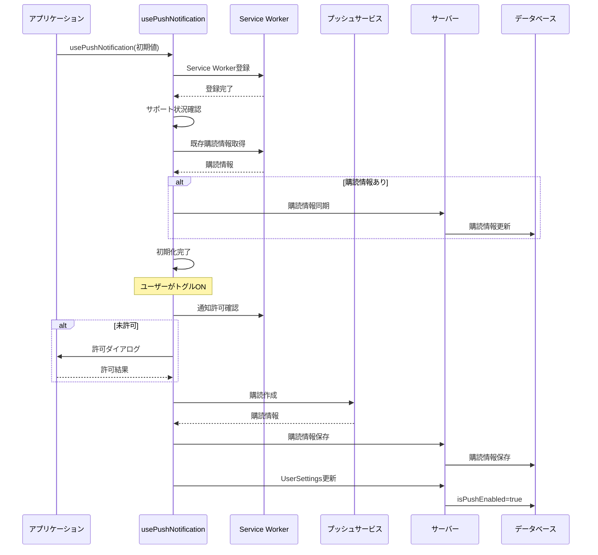
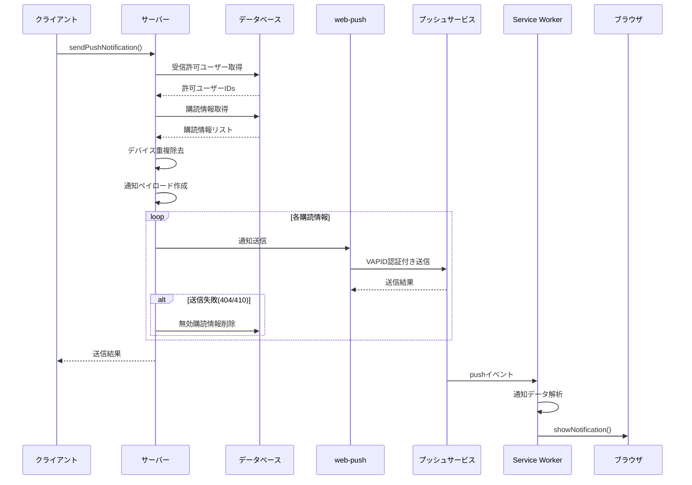
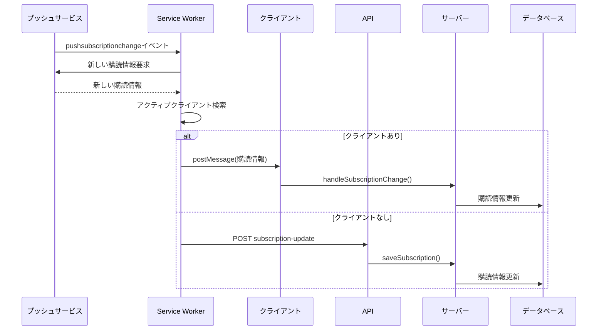

# 通知システム仕様

- [通知システム仕様](#通知システム仕様)
  - [既存仕様書との乖離・注意点](#既存仕様書との乖離注意点)
  - [実装場所](#実装場所)
  - [モデル](#モデル)
  - [ユーザー設定](#ユーザー設定)
  - [通知作成API](#通知作成api)
  - [`sendGeneralNotification`](#sendgeneralnotification)
  - [対象ユーザー解決](#対象ユーザー解決)
  - [In-app通知](#in-app通知)
  - [通知一覧](#通知一覧)
  - [通知一覧UI](#通知一覧ui)
  - [既読/未読更新](#既読未読更新)
  - [通知作成画面の候補](#通知作成画面の候補)
  - [メール通知](#メール通知)
  - [Push通知](#push通知)
    - [概要](#概要)
  - [システム構成](#システム構成)
  - [データモデル](#データモデル)
    - [PushSubscription](#pushsubscription)
    - [UserSettings](#usersettings)
  - [実装フロー](#実装フロー)
    - [1. 初期化プロセス](#1-初期化プロセス)
    - [2. 購読プロセス（トグルON）](#2-購読プロセストグルon)
    - [3. 購読解除プロセス（トグルOFF）](#3-購読解除プロセストグルoff)
    - [4. 通知送信プロセス](#4-通知送信プロセス)
    - [5. 通知受信プロセス](#5-通知受信プロセス)
    - [6. 購読情報の更新プロセス](#6-購読情報の更新プロセス)
  - [コンポーネント詳細](#コンポーネント詳細)
    - [usePushNotification.ts](#usepushnotificationts)
    - [WebPushNotificationToggle.tsx](#webpushnotificationtoggletsx)
    - [service-worker.js](#service-workerjs)
  - [API](#api)
    - [actions/notification/push-notification.ts](#actionsnotificationpush-notificationts)
      - [sendPushNotification](#sendpushnotification)
      - [saveSubscription](#savesubscription)
    - [api/push-notification/subscription-update/route.ts](#apipush-notificationsubscription-updateroutets)
  - [セキュリティ](#セキュリティ)
  - [エラーハンドリング](#エラーハンドリング)
  - [実装詳細](#実装詳細)
    - [VAPID認証](#vapid認証)
    - [デバイス識別](#デバイス識別)
    - [ステート管理](#ステート管理)
    - [購読情報の同期](#購読情報の同期)
  - [処理フロー図](#処理フロー図)
    - [初期化と購読プロセス](#初期化と購読プロセス)
    - [通知送信プロセス](#通知送信プロセス)
    - [購読情報更新プロセス](#購読情報更新プロセス)
  - [使用例](#使用例)
    - [通知の送信](#通知の送信)
    - [購読状態の確認](#購読状態の確認)
    - [エラーハンドリング](#エラーハンドリング-1)
  - [設定とデプロイ](#設定とデプロイ)
    - [環境変数](#環境変数)
    - [Service Worker](#service-worker)
    - [データベース](#データベース)
    - [PushトグルON](#pushトグルon)
    - [PushトグルOFF](#pushトグルoff)
    - [Push送信](#push送信)
    - [購読更新API](#購読更新api)
    - [Service Worker](#service-worker-1)
    - [設定値](#設定値)
  - [予約通知](#予約通知)
    - [予約登録](#予約登録)
    - [スクリプト](#スクリプト)
    - [実行コマンド](#実行コマンド)
    - [注意点](#注意点)
  - [オークション通知](#オークション通知)
  - [未確認/実装確認できない事項](#未確認実装確認できない事項)
  - [一番重要な点](#一番重要な点)
  - [etc](#etc)
  - [背景と課題整理](#背景と課題整理)
  - [解決アプローチの全体像](#解決アプローチの全体像)
    - [① **pendingUpdatesRef を廃止**し、`useMutation` + **楽観的更新** に一本化](#-pendingupdatesref-を廃止しusemutation--楽観的更新-に一本化)
    - [② **onError でロールバック**、**onSettled で invalidateQueries**](#-onerror-でロールバックonsettled-で-invalidatequeries)
    - [③ **リストは Query のデータだけで組み立て**](#-リストは-query-のデータだけで組み立て)
  - [実装ステップ（TypeScript, React 19, Next.js 15）](#実装ステップtypescript-react-19-nextjs-15)
    - [1. Mutation フックを作成](#1-mutation-フックを作成)
    - [2. コンポーネント側の呼び出し](#2-コンポーネント側の呼び出し)
    - [3. useNotificationList の簡素化](#3-usenotificationlist-の簡素化)
  - [参考文献・ドキュメント](#参考文献ドキュメント)
  - [まとめ](#まとめ)
  - [フィルター条件の中身の違いについて](#フィルター条件の中身の違いについて)
    - [unreadFilterCondition（未読フィルター）の詳細解説](#unreadfiltercondition未読フィルターの詳細解説)
    - [readFilterCondition（既読フィルター）の詳細解説](#readfiltercondition既読フィルターの詳細解説)
  - [2回に分けて取得する意味と問題点](#2回に分けて取得する意味と問題点)
    - [現在の実装の動作](#現在の実装の動作)
    - [より適切な実装方法](#より適切な実装方法)
    - [結論](#結論)

## 既存仕様書との乖離・注意点

既存仕様には `AuctionNotification` テーブルや Push専用の状態管理が登場します。現行実装では汎用 `Notification`
モデルに in-app / web push / email / auction event を集約しています。

USER通知の一覧表示条件は `sender_user_id = userId` を見ており、受信者判定としては `isRead`
JSON と一致しない可能性があります。この点はコード上の観測として記載します。

既存の Push通知仕様は `useReducer`, `isInitialized`, `errorMessage` を前提にしますが、現行 `usePushNotification` は
`useState` 中心です。既存仕様には `SUBSCRIPTION_CHANGED` の受信処理がありますが、読んだ範囲では Service
Worker 側の送信のみ確認でき、hook 側の message listener は確認できません。また Service Worker の fallback
URL と実API名に差分があります。

既存の通知仕様は即時送信中心の説明が多いですが、現行実装では予約通知は `Notification` と
`scripts/send-scheduled-notifications.ts` の組み合わせで処理されます。予約作成時点で in-app
notification は作成され、実送信はスクリプトが `sentAt = null` の対象を拾います。

メール通知は、現行実装にメール通知対象の抽出とメールテンプレートがありますが、Resend による実送信処理はコメントアウトされています。そのため、コード上確認できる外部メール送信は「未接続」です。

## 実装場所

- `src/actions/notification/general-notification.ts`
- `src/actions/notification/in-app-notification.ts`
- `src/actions/notification/notification-utilities.ts`
- `src/actions/notification/cache-notification-list.ts`
- `src/actions/notification/cache-notification-unread-count.ts`
- `src/actions/notification/create-notification-form.ts`
- `src/actions/notification/auction-notification.ts`
- `src/actions/notification/email-notification.ts`
- `src/actions/notification/push-notification.ts`
- `src/components/notification/*`
- `src/hooks/notification/*`
- `src/hooks/notification/use-create-notification.ts`
- `src/hooks/notification/use-notification-button.ts`
- `src/hooks/notification/use-notification-list.ts`
- `src/hooks/notification/use-push-notification.ts`
- `src/app/api/notifications/route.ts`
- `src/app/api/push-notification/subscription-update/route.ts`
- `src/app/dashboard/create-notification/page.tsx`
- `src/components/setting/setup-form.tsx`
- `src/emails/notification.tsx`
- `scripts/send-scheduled-notifications.ts`
- `public/service-worker.js`
- `public/next-pwa-service-worker.js`
- `public/manifest.json`
- `next.config.ts`
- `package.json`
- `prisma/schema.prisma`

## モデル

`Notification`:

- `title`
- `message`
- `targetType`
- `sendTimingType`
- `sendMethods`
- `isRead`
- `sendScheduledDate`
- `sentAt`
- `expiresAt`
- `actionUrl`
- `senderUserId`
- `groupId`
- `taskId`
- `auctionEventType`
- `auctionId`

既読状態は `isRead` JSONB にユーザーIDごとに保存します。

`PushSubscription`:

- `userId`
- `endpoint`
- `p256dh`
- `auth`
- `expirationTime`
- `deviceId`

現行 schema では `endpoint` は nullable unique です。既存仕様にある deviceId index は確認できません。

## ユーザー設定

メール通知対象になるには、`UserSettings.isEmailEnabled = true` が必要です。

Push送信対象になるには、`UserSettings.isPushEnabled = true` が必要です。

## 通知作成API

`POST /api/notifications`

認証:

- `getAuthSession()` が必須です。
- 未認証は 401。

処理:

- request body を `sendGeneralNotification` に渡します。
- API層の詳細検証は少なく、下位 action に委譲します。
- 例外時は 500。

## `sendGeneralNotification`

入力は `GeneralNotificationParams` 相当です。

検証:

- `title`
- `message`
- `sendMethods`
- `targetType`
- `recipientUserIds`
- `sendTiming`

処理:

1. `getNotificationTargetUserIds` で対象ユーザーを解決します。
2. `IN_APP` を含む場合は `sendInAppNotification` でDB登録します。
3. 未来日時の予約通知で既存 `notificationId` がある場合は、Push/Email を送らず成功扱いで返します。
4. `WEB_PUSH` を含む場合は Push送信します。
5. `EMAIL` を含む場合は email送信処理を呼びます。

## 対象ユーザー解決

`getNotificationTargetUserIds`:

- `SYSTEM`: 全 user
- `USER`: 指定された userIds
- `GROUP`: group members
- `TASK`: task creator, reporters, executors

## In-app通知

`sendInAppNotification`:

- `notificationId` がある場合は対象 notification の `sentAt` を now に更新します。
- 新規の場合は、対象ユーザーごとの `isRead` JSON を作ります。
- auctionId がある場合は senderUserId を null にできます。
- `sendTimingType` が `SCHEDULED` の場合は `sendScheduledDate` を保存します。
- `NOW` の場合は `sentAt` を now にします。

## 通知一覧

`cachedGetNotificationsAndUnreadCount(userId, page, limit)` が raw SQL で一覧を取得します。

表示対象:

- `SYSTEM`
- `USER` かつ `sender_user_id = userId`
- `GROUP` かつ user が所属する group
- `TASK` かつ user が所属 group 内の task

送信タイミング:

- `NOW`
- `SCHEDULED` かつ `send_scheduled_date < NOW()`

並び:

- 未読を取得
- 既読を取得
- 重複排除
- `sentAt` desc で再ソート

件数:

- totalCount
- unreadCount
- readCount

注意:

- USER通知の表示条件が `sender_user_id = userId`
  になっています。受信者JSONを使った判定ではないため、意図確認が必要です。
- 未読と既読を別SQLで同じ `LIMIT/OFFSET`
  により取得し、後段で結合・重複排除します。ページング時は「未読だけ/既読だけの件数」と「結合後の表示件数」が直感とずれる可能性があるため、UI変更時は
  `readHasMore` / `unReadHasMore` の挙動を確認します。

## 通知一覧UI

`useNotificationList` は通知一覧の状態を管理します。

- `useInfiniteQuery` でページング取得します。
- `all`, `unread`, `read` の既読フィルターを持ちます。
- `all`, `auction-only`, `exclude-auction` のオークション通知フィルターを持ちます。
- 既読/未読切替はローカル状態を即時更新し、`pending` ref に最終状態を保持します。
- unmount 時に `pending` をまとめて `updateNotificationStatus` へ送ります。
- `markAllAsRead` はローカル状態と `hasUnreadNotifications` cache を即時更新します。

## 既読/未読更新

`updateNotificationStatus(updates, userId)` は transaction 内で通知ごとに JSONB を merge します。

既読:

- `{ isRead: true, readAt: ISO文字列 }`

未読:

- `{ isRead: false }`
- `readAt` は設定しません。

## 通知作成画面の候補

`prepareCreateNotificationForm(isAppOwner, isGroupOwner, userId)`:

- app owner: all users, all groups, all tasks
- group owner: owner group とその tasks を候補化する意図の実装

## メール通知

`sendEmailNotification` は、通知対象のうちメール通知設定が有効なユーザーを抽出し、メール送信処理を扱います。

検証:

- `title`
- `message`
- `sendMethods`
- `targetType`
- `recipientUserIds`
- `sendTiming`

処理:

1. 対象 userIds の `UserSettings` を検索します。
2. `isEmailEnabled = true` のユーザーに絞ります。
3. 対象がいなければ成功扱いで `メール通知設定が見つかりません` を返します。
4. 現行コードでは Resend 実送信部分がコメントアウトされています。
5. 最後に `メール通知を送信しました` の成功レスポンスを返します。

メールテンプレート:

- `src/emails/notification.tsx` に React Email 形式のテンプレートがあります。
- 現行の送信処理ではコメントアウト部分にテンプレート利用の痕跡があります。

注意:

- `RESEND_API_KEY` や `DOMAIN` は env にありますが、実送信処理はコメントアウトされています。
- 成功レスポンスは返りますが、外部メール送信が行われたことは現行コードからは確認できません。

## Push通知

### 概要

このドキュメントでは、アプリケーションのプッシュ通知システムの仕組みと実装について詳細に説明します。プッシュ通知は、Service
Worker APIとWeb Push APIを使用して実装されており、ユーザーがブラウザを閉じていても通知を受け取ることができます。

## システム構成

プッシュ通知システムは以下のコンポーネントで構成されています：

- **クライアントサイド**
  - `usePushNotification` フック: プッシュ通知の購読管理（useReducerベース）
  - `WebPushNotificationToggle`: ユーザーが通知設定を変更するためのUI
  - `service-worker.js`: バックグラウンドでの通知受信と表示処理

- **サーバーサイド**
  - `actions/notification/push-notification.ts`: サーバーアクション（購読管理、通知送信）
  - `api/push-notification/subscription-update/route.ts`: Service Worker更新用API

- **データストア**
  - `PushSubscription` モデル: ユーザーごとの購読情報を保存
  - `UserSettings` モデル: プッシュ通知の有効/無効状態を管理

## データモデル

### PushSubscription

```prisma
model PushSubscription {
  id             String    @id @default(cuid())
  endpoint       String    @unique
  p256dh         String?
  auth           String?
  userId         String?
  expirationTime DateTime?
  deviceId       String?
  createdAt      DateTime  @default(now())
  updatedAt      DateTime  @updatedAt

  user           User?     @relation(fields: [userId], references: [id], onDelete: SetNull)

  @@index([userId])
  @@index([deviceId])
}
```

### UserSettings

```prisma
model UserSettings {
  id              String  @id @default(cuid())
  userId          String  @unique
  isPushEnabled   Boolean @default(false)
  isEmailEnabled  Boolean @default(false)
  // ... その他の設定
}
```

## 実装フロー

### 1. 初期化プロセス

1. アプリケーション起動時、`usePushNotification`フックが初期化される
2. ブラウザがプッシュ通知をサポートしているか確認
3. Service Workerを登録し、既存の購読情報を確認
4. 購読情報とDBの状態を同期

### 2. 購読プロセス（トグルON）

1. ユーザーが通知トグルをONにする
2. ブラウザの通知許可ダイアログを表示（未許可の場合）
3. 許可された場合、VAPIDキーを使用してプッシュサーバーに購読
4. 購読情報を取得し、サーバーのデータベースに保存
5. `UserSettings`の`isPushEnabled`をtrueに更新

### 3. 購読解除プロセス（トグルOFF）

1. ユーザーが通知トグルをOFFにする
2. サーバーから購読情報を削除
3. プッシュサービスから購読を解除
4. `UserSettings`の`isPushEnabled`をfalseに更新

### 4. 通知送信プロセス

1. `sendPushNotification`サーバーアクションを呼び出し
2. 通知設定が有効なユーザーをフィルタリング
3. 対象ユーザーの購読情報を取得
4. デバイス重複を除去（最新の購読情報のみ使用）
5. 通知ペイロードを作成
6. web-pushライブラリを使用して各エンドポイントに通知を送信
7. 送信結果を集計して返却

### 5. 通知受信プロセス

1. Service Workerが`push`イベントを受信
2. 通知データをパースし、デフォルト値を設定
3. 通知の長さを制限（タイトル20文字、本文40文字）
4. `showNotification`を呼び出して通知を表示
5. ユーザーが通知をクリックすると、関連するURLを開く

### 6. 購読情報の更新プロセス

1. プッシュサービスによる購読情報の変更を検知
2. Service Workerの`pushsubscriptionchange`イベントが発火
3. 新しい購読情報を取得
4. アクティブなクライアントがある場合はメッセージングで更新
5. クライアントがない場合はAPIを通じて更新

## コンポーネント詳細

### usePushNotification.ts

```typescript
export function usePushNotification(initialIsPushEnabled: boolean): PushNotificationHookReturnType {
  // useReducerによるステート管理
  const [notificationState, dispatch] = useReducer(notificationReducer, {
    isInitialized: false,
    isSupported: false,
    permissionState: "default",
    registrationState: null,
    subscriptionState: null,
    recordId: null,
    deviceId: null,
    errorMessage: null,
    isEnabled: initialIsPushEnabled,
  });

  // 戻り値の型
  return {
    isSupported: boolean;
    isInitialized: boolean;
    isEnabled: boolean;
    isToggleUpdating: boolean;
    errorMessage: string | null;
    permissionState: NotificationPermission;
    togglePushNotification: (newPushEnabledState: boolean) => void;
  };
}
```

このフックは以下の機能を提供します：

- **ステート管理**: useReducerによる一元化された状態管理
- **初期化処理**: Service Workerの登録と購読情報の同期
- **トグル機能**: 通知の有効/無効を切り替え
- **エラーハンドリング**: 各種エラー状態の管理
- **デバイス識別**: ユーザーエージェント情報を基にしたデバイスID生成

### WebPushNotificationToggle.tsx

```typescript
export const WebPushNotificationToggle = memo(function PushNotificationToggle({
  isPushEnabled,
  isLoading,
}: {
  isPushEnabled: boolean;
  isLoading: boolean;
}) {
  const {
    isSupported,
    isInitialized,
    isEnabled,
    isToggleUpdating,
    errorMessage,
    permissionState,
    togglePushNotification,
  } = usePushNotification(isPushEnabled);

  // UI rendering logic
});
```

このコンポーネントは以下の機能を提供します：

- **状態表示**: 通知の有効/無効状態を表示
- **トグル操作**: ユーザーが通知設定を変更
- **エラー表示**: エラー状態の視覚的フィードバック
- **権限ガイダンス**: ブラウザ権限の状態に応じた案内

### service-worker.js

Service Workerは以下のイベントを処理します：

1. **install**: Service Workerのインストール処理
2. **activate**: Service Workerのアクティベーション処理
3. **push**: プッシュ通知の受信処理
4. **notificationclick**: 通知クリック時の処理
5. **pushsubscriptionchange**: 購読情報変更時の処理

```javascript
// プッシュ通知受信時の処理
self.addEventListener("push", (event) => {
  const defaultData = {
    title: "新しい通知",
    body: "メッセージが届きました。",
    icon: "favicon.svg",
    badge: "favicon.svg",
    data: { url: "/" },
  };

  let notificationData = { ...defaultData };

  if (event.data) {
    try {
      const payload = event.data.json();
      notificationData = {
        ...defaultData,
        title: payload.title || defaultData.title,
        body: payload.body || defaultData.body,
        icon: payload.icon || defaultData.icon,
        badge: payload.badge || defaultData.badge,
        data: {
          url: payload.data?.url || defaultData.data.url,
        },
      };
    } catch (e) {
      console.error("Push data parsing error:", e);
    }
  }

  // 文字数制限
  notificationData.title =
    notificationData.title.length > 20 ? `${notificationData.title.substring(0, 20)}...` : notificationData.title;
  notificationData.body =
    notificationData.body.length > 40 ? `${notificationData.body.substring(0, 40)}...` : notificationData.body;

  const options = {
    body: notificationData.body,
    icon: notificationData.icon,
    badge: notificationData.badge,
    data: notificationData.data,
    actions: [
      { action: "open_url", title: "開く" },
      { action: "dismiss", title: "閉じる" },
    ],
  };

  event.waitUntil(self.registration.showNotification(notificationData.title, options));
});
```

## API

### actions/notification/push-notification.ts

このファイルには以下のサーバーアクションが含まれます：

#### sendPushNotification

```typescript
export async function sendPushNotification(params: NotificationParams): PromiseResult<PushNotificationResult> {
  // 1. プッシュ通知設定の確認
  const isPushNotificationEnabled = await prisma.userSettings.findMany({
    where: { userId: { in: params.recipientUserIds } },
    select: { isPushEnabled: true, userId: true },
  });

  // 2. 受信許可ユーザーのフィルタリング
  const recipientUserIds = isPushNotificationEnabled
    .filter((user) => user.isPushEnabled === true)
    .map((user) => user.userId);

  // 3. VAPID設定
  webPush.setVapidDetails(vapidSubject, vapidPublicKey, vapidPrivateKey);

  // 4. 購読情報の取得
  const targetSubscriptions = await prisma.pushSubscription.findMany({
    where: {
      userId: { in: recipientUserIds },
      p256dh: { not: null },
      auth: { not: null },
    },
  });

  // 5. デバイス重複の除去
  const deviceGroups = new Map<string, typeof targetSubscriptions>();
  targetSubscriptions.forEach((subscription) => {
    if (!deviceGroups.has(subscription.deviceId)) {
      deviceGroups.set(subscription.deviceId, []);
    }
    deviceGroups.get(subscription.deviceId)!.push(subscription);
  });

  // 6. 各デバイスの最新購読情報のみを使用
  const noDuplicationTargetSubscriptions = [];
  for (const deviceSubscriptions of deviceGroups.values()) {
    const sortedSubscriptions = deviceSubscriptions.sort(
      (a, b) => new Date(b.updatedAt).getTime() - new Date(a.updatedAt).getTime(),
    );
    noDuplicationTargetSubscriptions.push(sortedSubscriptions[0]);
  }

  // 7. 通知送信
  const results = await Promise.allSettled(
    noDuplicationTargetSubscriptions.map(async (subscription) => {
      const webPushSubscription = {
        endpoint: subscription.endpoint,
        keys: {
          p256dh: subscription.p256dh,
          auth: subscription.auth,
        },
      };

      try {
        await webPush.sendNotification(webPushSubscription, payload);
        return { success: true, endpoint: subscription.endpoint };
      } catch (error) {
        // 404/410エラーの場合は購読情報を削除
        if (error.statusCode === 404 || error.statusCode === 410) {
          await deleteSubscription(subscription.endpoint);
        }
        return { success: false, endpoint: subscription.endpoint, error };
      }
    }),
  );

  // 8. 結果の集計
  const successCount = results.filter((r) => r.status === "fulfilled" && r.value.success).length;
  const failedCount = results.length - successCount;

  return {
    success: successCount > 0,
    data: {
      sent: successCount,
      failed: failedCount,
      totalTargets: targetSubscriptions.length,
    },
    message: "通知の送信に成功しました",
  };
}
```

#### saveSubscription

```typescript
export async function saveSubscription(subscription: SaveSubscriptionParams): PromiseResult<PushSubscription> {
  const session = await getAuthSession();
  const userId = session?.user?.id;

  // レコードIDの確認
  if (!subscription.recordId) {
    const recordId = await getRecordId(subscription.endpoint);
    subscription.recordId = recordId.success ? recordId.data : "00000000000000000000000000000000";
  }

  // 有効期限の変換
  const expirationTimeDate =
    typeof subscription.expirationTime === "number" ? new Date(subscription.expirationTime) : null;

  // 新規作成または更新
  const isDummy = subscription.recordId === "00000000000000000000000000000000";
  const result = isDummy
    ? await prisma.pushSubscription.create({
        data: {
          userId,
          endpoint: subscription.endpoint,
          p256dh: subscription.keys.p256dh,
          auth: subscription.keys.auth,
          expirationTime: expirationTimeDate,
          deviceId: subscription.deviceId,
        },
      })
    : await prisma.pushSubscription.update({
        where: { id: subscription.recordId },
        data: {
          endpoint: subscription.endpoint,
          p256dh: subscription.keys.p256dh,
          auth: subscription.keys.auth,
          expirationTime: expirationTimeDate,
          userId,
          deviceId: subscription.deviceId,
        },
      });

  return {
    success: true,
    data: result,
    message: "購読情報を保存しました",
  };
}
```

### api/push-notification/subscription-update/route.ts

```typescript
export async function POST(req: NextRequest) {
  const session = await getAuthSession();
  const body = (await req.json()) as SubscriptionUpdateRequest;
  const { oldEndpoint, newSubscription } = body;

  if (!session?.user?.id) {
    return NextResponse.json({ error: "Unauthorized" }, { status: 401 });
  }

  // 古い購読情報のレコードIDを取得
  let recordId: string | null = null;
  if (oldEndpoint) {
    const result = await getRecordId(oldEndpoint);
    recordId = result.success ? result.data : null;
  }

  if (!recordId) {
    return NextResponse.json({ error: "Old subscription not found" }, { status: 400 });
  }

  // 新しい購読情報を保存
  const result = await saveSubscription({
    endpoint: newSubscription.endpoint,
    expirationTime: newSubscription.expirationTime,
    keys: {
      p256dh: newSubscription.keys.p256dh,
      auth: newSubscription.keys.auth,
    },
    recordId,
  });

  return NextResponse.json({
    success: true,
    message: "購読情報が更新されました",
    subscription: result.data,
  });
}
```

## セキュリティ

1. **VAPID認証**: Web Push プロトコルではVAPID（Voluntary Application Server Identification）キーを使用して送信者を認証
2. **エンドポイント固有**: 各購読は一意のエンドポイントを持ち、他のユーザーが使用できない
3. **暗号化**: プッシュ通知のペイロードは、ユーザーごとの公開鍵（p256dh）で暗号化
4. **認証**: ユーザーIDと購読情報を紐付け、認証されたユーザーのみが操作可能
5. **デバイス識別**: 重複した購読を防ぐためのデバイスID管理

## エラーハンドリング

1. **購読失敗**: ブラウザの通知許可が拒否された場合やVAPID鍵が不正な場合の処理
2. **送信失敗**: エンドポイントが無効になった場合の処理（自動削除）
3. **権限変更**: ブラウザの通知権限が変更された場合の自動同期
4. **再購読処理**: `pushsubscriptionchange`イベントによる自動再購読
5. **UI フィードバック**: エラー状態の視覚的表示とユーザーガイダンス

## 実装詳細

### VAPID認証

VAPID（Voluntary Application Server
Identification）は、プッシュサービスがアプリケーションサーバーを識別するための仕組みです。

```javascript
// VAPID公開鍵をURLBase64からUint8Arrayに変換
const padding = "=".repeat((4 - (vapidPublicKey.length % 4)) % 4);
const base64 = (vapidPublicKey + padding).replace(/-/g, "+").replace(/_/g, "/");
const rawData = window.atob(base64);
const outputArray = new Uint8Array(rawData.length);

for (let i = 0; i < rawData.length; ++i) {
  outputArray[i] = rawData.charCodeAt(i);
}
```

### デバイス識別

ユーザーエージェント情報を基にしたデバイスIDの生成：

```typescript
export function getDeviceId(userId: string): string {
  const deviceInfo = {
    userAgent: navigator.userAgent,
  };

  // userAgentDataのサポート確認
  if ("userAgentData" in navigator && navigator.userAgentData) {
    const uaData = navigator.userAgentData;
    deviceInfo.brands = uaData.brands ?? [];
    deviceInfo.platform = uaData.platform ?? "";
    deviceInfo.mobile = !!uaData.mobile;
  } else {
    // フォールバック処理
    const isMobile = /Android|webOS|iPhone|iPad|iPod|BlackBerry|IEMobile|Opera Mini/i.test(navigator.userAgent);
    deviceInfo.brands = [{ brand: "unknown", version: "0" }];
    deviceInfo.platform = /* platform detection logic */;
    deviceInfo.mobile = isMobile;
  }

  return `${deviceInfo.platform}-${deviceInfo.mobile ? "mobile" : "desktop"}-${deviceInfo.brands?.map(b => b.brand).join("-") || "unknown"}-${userId}`;
}
```

### ステート管理

useReducerを使用したステート管理により、競合状態を防止：

```typescript
export function notificationReducer(state: PushNotificationState, action: NotificationAction): PushNotificationState {
  switch (action.type) {
    case "SET_SUPPORT_STATUS":
      return {
        ...state,
        isSupported: action.payload.isSupported,
        permissionState: action.payload.permissionState,
      };
    case "SET_INITIALIZATION_COMPLETE":
      return {
        ...state,
        isInitialized: true,
        deviceId: action.payload.deviceId,
        registrationState: action.payload.registrationState,
        subscriptionState: action.payload.subscriptionState,
        recordId: action.payload.recordId,
        errorMessage: null,
      };
    // その他のケース...
  }
}
```

### 購読情報の同期

初期化時とService Worker通信による購読情報の同期：

```typescript
// 初期化時の同期
const existingSubscription = await registration.pushManager.getSubscription();
if (existingSubscription?.endpoint) {
  try {
    const result = await getRecordId(existingSubscription.endpoint);
    const subscriptionData = formatSubscriptionForServer(
      existingSubscription,
      result.data ?? undefined,
      currentDeviceId,
    );
    await saveSubscription(subscriptionData);
  } catch (syncError) {
    console.warn("購読情報の同期に失敗しました:", syncError);
  }
}

// Service Workerメッセージリスナー
const messageHandler = (event: MessageEvent) => {
  const data = event.data as unknown;
  if (data && typeof data === "object" && data !== null && "type" in data && "newSubscription" in data) {
    const eventData = data as { type: string; newSubscription: PushSubscription };
    if (eventData.type === "SUBSCRIPTION_CHANGED") {
      void handleSubscriptionChange(eventData.newSubscription);
    }
  }
};
```

## 処理フロー図

### 初期化と購読プロセス



### 通知送信プロセス



### 購読情報更新プロセス



## 使用例

### 通知の送信

```typescript
// タスク完了通知の送信
await sendPushNotification({
  title: "タスク完了",
  message: `「${taskName}」が完了しました`,
  actionUrl: `/tasks/${taskId}`,
  recipientUserIds: [userId],
});
```

### 購読状態の確認

```typescript
const { isSupported, isInitialized, isEnabled, permissionState } = usePushNotification(initialEnabled);

if (isSupported && isInitialized && isEnabled && permissionState === "granted") {
  // プッシュ通知が有効
} else {
  // プッシュ通知が無効または未対応
}
```

### エラーハンドリング

```typescript
const { errorMessage, permissionState } = usePushNotification(initialEnabled);

if (errorMessage) {
  // エラー表示
  console.error("プッシュ通知エラー:", errorMessage);
}

if (permissionState === "denied") {
  // 権限拒否時の処理
  showPermissionGuide();
}
```

## 設定とデプロイ

### 環境変数

```env
NEXT_PUBLIC_VAPID_PUBLIC_KEY=your_vapid_public_key
VAPID_PRIVATE_KEY=your_vapid_private_key
VAPID_SUBJECT=mailto:your-email@example.com
```

### Service Worker

`public/service-worker.js`を適切に配置し、アプリケーションから登録。

### データベース

PrismaスキーマでPushSubscriptionとUserSettingsモデルを定義し、適切なインデックスを設定。

この仕様書は、現在の実装状況を正確に反映しており、開発者が理解しやすい形で整理されています。

### PushトグルON

hook 側の処理:

1. `Notification.permission` を確認し、必要に応じて permission を要求します。
2. Service Worker を登録します。
3. VAPID public key を使って push subscription を作成します。
4. subscription をDBに保存します。
5. `UserSettings.isPushEnabled = true` に更新します。

### PushトグルOFF

hook 側の処理:

1. 現在の subscription を取得します。
2. DB上の subscription を削除します。
3. browser subscription を unsubscribe します。
4. `UserSettings.isPushEnabled = false` に更新します。

### Push送信

`sendPushNotification(params)`:

1. 対象ユーザーの `UserSettings` を取得します。
2. `isPushEnabled = true` の userId に絞ります。
3. VAPID public/private key を確認します。
4. 対象 user の `PushSubscription` を取得します。
5. `p256dh` と `auth` があるものだけを対象にします。
6. `deviceId` ごとに最新の subscription を1件だけ選びます。
7. `webPush.sendNotification` を実行します。
8. 404/410 は無効購読としてDBから削除します。

payload:

- `title`
- `body`
- `data.url` optional

戻り値:

- sent
- failed
- totalTargets

1件でも送信成功すれば `success: true` です。有効な購読がない場合は成功扱いで送信数0を返します。

### 購読更新API

`POST /api/push-notification/subscription-update`

入力:

- `oldEndpoint`
- `newSubscription`

認証:

- `getAuthSession()` 必須
- 未認証は 401

処理:

- old endpoint から既存レコードIDを探します。
- new subscription を `saveSubscription` に渡して upsert します。

エラー:

- new subscription 不正: 400
- old endpoint 未検出: 400
- 保存失敗: 400
- 例外: 500

### Service Worker

`public/service-worker.js` は以下を扱います。

- `push`
- `notificationclick`
- `pushsubscriptionchange`

Service Worker表示時:

- title は20文字を超えると省略表示します。
- body は40文字を超えると省略表示します。
- action は `open_url` と `dismiss` を表示します。
- `open_url` または通知本体クリック時は `data.url` に対応する window を focus し、なければ新規 window を開きます。
- `dismiss` は通知を閉じるだけです。

注意:

- `pushsubscriptionchange` の fallback fetch は `/api/push-notification/update` を指しています。現行APIは
  `/api/push-notification/subscription-update` です。

### 設定値

必要なVAPID環境変数:

- `NEXT_PUBLIC_VAPID_PUBLIC_KEY`
- `VAPID_PRIVATE_KEY`
- `VAPID_SUBJECT`

## 予約通知

### 予約登録

`sendGeneralNotification` で `sendTiming = SCHEDULED` を指定すると、`sendScheduledDate` を持つ `Notification`
が作成されます。

`IN_APP` が sendMethods に含まれる場合、予約時点でDB登録されます。

### スクリプト

`sendScheduledNotifications()` は次の条件で対象を取得します。

- `sendScheduledDate <= now`
- `sendTimingType = SCHEDULED`
- `sentAt = null`

処理:

1. 対象 notification を取得します。
2. `isRead` JSON の key から recipient userIds を抽出します。
3. `sendTiming` を `NOW` に変更した params を組み立てます。
4. `sendGeneralNotification` を呼びます。
5. 成功時に `sentAt` を現在時刻で更新します。

失敗:

- 個別 notification の失敗はログ出力し、次の notification 処理を継続します。
- 全体エラーは throw します。
- finally で Prisma を disconnect します。

### 実行コマンド

`package.json`:

- `actions:send-scheduled-notifications`

GitHub Actions などの定期実行から呼ぶ想定のコメントがあります。

### 注意点

- 予約時点の `isRead` JSON から対象ユーザーを復元するため、予約後に group
  membership が変わっても対象者は自動再計算されません。
- `sendGeneralNotification` は、未来日時かつ既存 `notificationId`
  がある場合に Push/Email を送らず成功扱いにする分岐があります。

## オークション通知

オークション通知は共通 `Notification` に `auctionEventType` と `auctionId` を保存します。詳細は
[auction.md](./auction.md) を参照してください。

主なトリガー:

- 入札更新: 前最高入札者へ `OUTBID`
- 質問/メッセージ: 送信者以外へ `QUESTION_RECEIVED`
- 自動入札上限到達: 対象ユーザーへ `AUTO_BID_LIMIT_REACHED`
- 終了処理: creator へ `ENDED` / `ITEM_SOLD` / `NO_WINNER`
- 落札確定: winner へ `AUCTION_WIN`、loser へ `AUCTION_LOST`
- deposit返還: winner へ `POINT_RETURNED`

旧要求メモでは `AuctionNotification` 独立テーブルを前提にしていましたが、現行実装では共通 `Notification` を使います。

## 未確認/実装確認できない事項

- 既存仕様にある Push通知の自動許諾表示、healthcheck、retry、endpoint削除せず更新する仕様は確認できません。
- `SUBSCRIPTION_CHANGED` を hook 側で受信する処理は確認できません。

## 一番重要な点

- 全体・未読・既読のタブごとにバラバラに取得せず、全部を取得してから、CL側で表示しているため、わざと未読と既読を同じ件数を取得する実装にしている
  - できることなら、全体・未読・既読のタブごとにバラバラに取得したい
  - 今の実装を行った時は、TanStack Query
    v5のQueryClientの設定`refetchOnMount: true`が`false`になっていたので、別タブでステータス更新しても、キャッシュがあってステータスが更新されなかった。
  - なので、回避策として、未読と既読を同じ数取得して、一つにまとめてクライアント側に返す実装にした。
  - リファクタリングするなら、キャッシュの設定をちゃんと行えば、理想の「全体・未読・既読のタブごとにバラバラに取得する」こともできると思う
  - TanStack Query v5と`use cache`の両方の設定でキャッシュ更新する設定が必要
  - notionにも反省をまとめていると思うから、あとでまとめたい

## etc

カスタムの`pendingUpdates`メカニズムを、TanStack
Queryの`mutation`、`onMutate`、`onError`、`onSettled`に置き換える。リストクエリは`["notifications", userId, "unread"]`などで管理し、ステータス変更時に`mutate({id, isRead})`を使って楽観的更新を行う。`useInfiniteQuery`を使い、リストの更新を容易にする。`queryClient.invalidateQueries`を使用し、エラーや成功時にキャッシュを更新。ローカルの`allNotifications`に依存せず、クエリ結果でUIを更新する。

思考時間: 1m 7s

以下では **「開いてすぐ“未読”タブに正しい一覧が出ない／既読‑未読トグル直後に UI が変わらない」** という症状を、**TanStack
Query v5 の“楽観的更新 (optimistic update)”** と **queryClient の直接操作**
だけで解消する手順をまとめます。先に結論だけ一文で示すと **「`toggleReadStatus()`
内で即座にキャッシュを書き換え (`setQueriesData`)、バックグラウンドで `mutationFn` を呼び、結果に応じて
`invalidateQueries` で同期する」** が王道です。

---

## 背景と課題整理

1. **ローカル state (`allNotifications`) への書き込みとサーバ同期を分離**
   - トグル時は `allNotifications` だけ変わり、Query Cache は古いまま。
   - そのため **“未読”初期描画** では `useQuery` が返すデータとローカル state が競合し、空表示や古い一覧を残してしまう。
   - サーバへは遅延まとめ送信（`pendingUpdatesRef`）だが、送信直後に **cache を invalidation しても描画ツリーは local
     state を優先** しているのでリストが切り替わらない。

2. **TanStack Query v5 のキャッシュ API が未活用**
   - `queryClient.setQueryData / setQueriesData` で **即時に cache を書き換え**、`onError`
     でロールバックするのが公式推奨 ([TanStack][1])。
   - `invalidateQueries({queryKey:["notifications",userId]})` は key 前方一致で全フィルタを更新できる ([TanStack][2],
     [Stack Overflow][3])。

---

## 解決アプローチの全体像

### ① **pendingUpdatesRef を廃止**し、`useMutation` + **楽観的更新** に一本化

- 状態変更ごとに `toggleReadMutation.mutate({id,isRead})` を呼ぶ。
- `onMutate` で **(a) 既存クエリのフェッチをキャンセル、(b) cache を即時更新** ([TanStack][1], [TanStack][4])。
- UI は cache を購読しているのでワンレンダーで反映。

### ② **onError でロールバック**、**onSettled で invalidateQueries**

- エラー時は `context.prev` を元に `setQueryData` で巻き戻し ([TanStack][1])。
- 成功／失敗にかかわらず `invalidateQueries` で最終同期し、「未読件数」メタもそろえる。

### ③ **リストは Query のデータだけで組み立て**

- `allNotifications` state は不要。
- ページネーションは `useInfiniteQuery` で handling（例後述）。
- フィルタは **queryKey に含める** ➡️ `["notifications", userId, { filter, auctionFilter }]`。

---

## 実装ステップ（TypeScript, React 19, Next.js 15）

### 1. Mutation フックを作成

```ts
// hooks/notification/useToggleRead.ts
import { useMutation, useQueryClient } from "@tanstack/react-query";
import { updateNotificationStatus } from "@/actions/notification/notification-utilities";

export const useToggleRead = (userId: string | undefined) => {
  const qc = useQueryClient();

  return useMutation({
    mutationKey: ["toggleNotificationStatus"],
    // ❶ サーバ API
    mutationFn: async (vars: { id: string; isRead: boolean }) =>
      updateNotificationStatus([{ notificationId: vars.id, isRead: vars.isRead }]),

    // ❷ 楽観的更新
    onMutate: async (vars) => {
      // クエリ停止
      await qc.cancelQueries({ queryKey: ["notifications", userId] });

      // 直前のキャッシュを保存して rollback 用に返す
      const prevData = qc.getQueriesData<{ pages: NotificationData[][] }>({
        queryKey: ["notifications", userId],
      });

      // 全ページ走査して isRead を書き換え
      qc.setQueriesData({ queryKey: ["notifications", userId] }, (old): typeof old =>
        old
          ? {
              ...old,
              pages: old.pages.map((page) =>
                page.map((n) =>
                  n.id === vars.id ? { ...n, isRead: vars.isRead, readAt: vars.isRead ? new Date() : null } : n,
                ),
              ),
            }
          : old,
      );
      return { prevData };
    },

    // ❸ エラー時 rollback
    onError: (_err, _vars, ctx) => {
      ctx?.prevData.forEach(([key, data]) => qc.setQueryData(key, data));
    },

    // ❹ 成否に関係なく再同期
    onSettled: () => {
      qc.invalidateQueries({ queryKey: ["notifications", userId] });
      qc.invalidateQueries({ queryKey: ["hasUnreadNotifications", userId] });
    },
  });
};
```

- `setQueriesData` で **複数フィルタ（all/unread/read）に跨るキャッシュを一気に更新** ([TanStack][4], [GitHub][5])。
- `cancelQueries` → `setQueriesData` は「**キャッシュ→UI→ネット**」の順で走る公式手筋 ([TanStack][1])。

### 2. コンポーネント側の呼び出し

```tsx
// NotificationItem.tsx の抜粋
const { mutate, isPending } = useToggleRead(userId);

const handleStatusButtonClick = (e: React.MouseEvent) => {
  e.stopPropagation();
  mutate({ id: notification.id, isRead: !notification.isRead });
};
```

- **ローカル state に手を触れず**、Mutation が即時で UI を更新する。

### 3. useNotificationList の簡素化

```ts
export function useNotificationList() {
  // 以前の allNotifications, pendingUpdatesRef 系は削除

  const { data, isLoading, fetchNextPage, hasNextPage } = useInfiniteQuery({
    queryKey: ["notifications", userId, { filter: activeFilter, auction: activeAuctionFilter }],
    queryFn: ({ pageParam = 1 }) => getNotificationsAndUnreadCount(userId, pageParam, ITEMS_PER_PAGE, activeFilter),
    initialPageParam: 1,
    getNextPageParam: (lastPage, _, lastPageParam) =>
      lastPage.notifications.length < ITEMS_PER_PAGE ? undefined : lastPageParam + 1,
    select: (data) => ({
      ...data,
      // 全ページ flatten + ソート
      flat: data.pages.flatMap((p) => p.notifications).sort((a, b) => Number(b.sentAt) - Number(a.sentAt)),
      unreadCount: data.pages[0]?.unreadCount ?? 0,
    }),
    placeholderData: { pages: [], pageParams: [] }, // ちらつき防止 :contentReference[oaicite:6]{index=6}
    staleTime: 1000 * 30,
    gcTime: 1000 * 60 * 30, // v5 では cacheTime → gcTime :contentReference[oaicite:7]{index=7}
  });

  return {
    notifications: data?.flat ?? [],
    unreadCount: data?.unreadCount ?? 0,
    isLoading,
    loadMore: fetchNextPage,
    hasMore: hasNextPage,
  };
}
```

- **UI は常に Query の値だけを見る**ので「タブ切替後でないとリストが更新されない」問題が消える。

---

## 参考文献・ドキュメント

- TanStack Query v5 楽観的更新ガイド ([TanStack][1])
- キャッシュ即時更新 API (`setQueryData`, `setQueriesData`) ([TanStack][4])
- Query 無効化と部分キー一致 ([TanStack][2], [Stack Overflow][3])
- エラー時ロールバックのパターン ([TanStack][1])
- placeholderData の使いどころ ([TanStack][6])
- v5 での `gcTime` 変更 ([TanStack][7])
- 大規模ページングでの更新戦略 ([GitHub][5])
- ベストプラクティスをまとめた Medium 記事 ([Medium][8])
- DEV Community の基礎解説 ([DEV Community][9])
- GitHub Discussions の実装例 ([GitHub][5])
- React Query 旧ドキュメント（v4）⁠※API 名称の差異確認用 ([TanStack][10], [TanStack][11])
- `Updates from Mutation responses` ガイド ([TanStack][12])

---

## まとめ

- **ポイントは「Mutation を発火した瞬間に Cache を書き換える」**——これで一覧／件数が同時に更新。
- `useInfiniteQuery` + `optimistic update` なら **ローカル state を丸ごと削除**でき、コードも簡潔。
- 既存設計のままでも **`syncNotificationsMutate` を即時起動 + `setQueriesData`** を挿せば症状は解消できる。

これで、「開いた瞬間に“未読”が最新状態で表示される」体験が実現できます。 🎉

[1]:
  https://tanstack.com/query/v5/docs/react/guides/optimistic-updates?utm_source=chatgpt.com
  "Optimistic Updates | TanStack Query React Docs"
[2]:
  https://tanstack.com/query/latest/docs/framework/react/guides/query-invalidation?utm_source=chatgpt.com
  "Query Invalidation | TanStack Query React Docs"
[3]:
  https://stackoverflow.com/questions/74770055/react-query-invalidatequeries-partial-match-not-working?utm_source=chatgpt.com
  "React query invalidateQueries partial match not working"
[4]:
  https://tanstack.com/query/latest/docs/reference/QueryClient?utm_source=chatgpt.com
  "QueryClient | TanStack Query Docs"
[5]:
  https://github.com/TanStack/query/discussions/5420?utm_source=chatgpt.com
  "Approach to update data after mutation #5420 - GitHub"
[6]:
  https://tanstack.com/query/v5/docs/framework/react/guides/placeholder-query-data?utm_source=chatgpt.com
  "Placeholder Query Data | TanStack Query React Docs"
[7]:
  https://tanstack.com/query/latest/docs/framework/react/guides/migrating-to-v5?utm_source=chatgpt.com
  "Migrating to TanStack Query v5"
[8]:
  https://medium.com/%40stojanovic.nemanja71/optimistic-updates-in-tanstack-query-v5-dfbcbb124113?utm_source=chatgpt.com
  "Optimistic Updates in Tanstack Query v5 - Medium"
[9]:
  https://dev.to/delisrey/fetching-mutating-data-with-react-query-395f?utm_source=chatgpt.com
  "Fetching & Mutating Data with React-Query - DEV Community"
[10]:
  https://tanstack.com/query/v4/docs/react/guides/optimistic-updates?utm_source=chatgpt.com
  "Optimistic Updates | TanStack Query React Docs"
[11]:
  https://tanstack.com/query/v4/docs/react/guides/query-invalidation?utm_source=chatgpt.com
  "Query Invalidation | TanStack Query React Docs"
[12]:
  https://tanstack.com/query/v4/docs/react/guides/updates-from-mutation-responses?utm_source=chatgpt.com
  "Updates from Mutation Responses | TanStack Query React Docs"

添付されたコードを詳細に分析して、Step by Stepで解説いたします。

## フィルター条件の中身の違いについて

まず、`unreadFilterCondition`と`readFilterCondition`の具体的な内容を確認しましょう。

```typescript
// 未読フィルター条件
const unreadFilterCondition = Prisma.sql`AND (NOT (n."is_read" ? ${userId} AND (n."is_read" -> ${userId} ->> 'isRead')::boolean = TRUE))`;

// 既読フィルター条件
const readFilterCondition = Prisma.sql`AND (n."is_read" ? ${userId} AND (n."is_read" -> ${userId} ->> 'isRead')::boolean = TRUE)`;
```

**これらのフィルター条件は実際には異なります**。違いは以下の通りです：

### unreadFilterCondition（未読フィルター）の詳細解説

```sql
AND (NOT (n."is_read" ? ${userId} AND (n."is_read" -> ${userId} ->> 'isRead')::boolean = TRUE))
```

この条件を分解すると：

- `n."is_read" ? ${userId}`: PostgreSQLのJSONB演算子で、is_readフィールドに指定されたuserIdのキーが存在するかチェック
- `n."is_read" -> ${userId} ->> 'isRead'`: 該当ユーザーのis_readオブジェクト内のisReadプロパティを文字列として取得
- `::boolean = TRUE`: 文字列をboolean型にキャストしてTRUEと比較
- `NOT (...)`: 全体を否定することで「既読ではない」つまり「未読」の条件を作成

### readFilterCondition（既読フィルター）の詳細解説

```sql
AND (n."is_read" ? ${userId} AND (n."is_read" -> ${userId} ->> 'isRead')::boolean = TRUE)
```

こちらは：

- `NOT`が付いていないため、条件が満たされる場合は「既読」
- ユーザーIDがis_readに存在し、かつisReadがTRUEの場合にマッチ

## 2回に分けて取得する意味と問題点

### 現在の実装の動作

```typescript
for (const filterCondition of [unreadFilterCondition, readFilterCondition]) {
  const notificationsQuery = Prisma.sql`
    // SELECT文...
    WHERE ${commonWhereClause} ${filterCondition}
    ORDER BY n."sent_at" DESC, n.id DESC
    LIMIT ${limit} OFFSET ${offset}
  `;

  const currentBatch = await prisma.$queryRaw<RawNotificationFromDB[]>(notificationsQuery);
  if (Array.isArray(currentBatch)) {
    allRawNotificationsFromDb.push(...currentBatch);
  }
}
```

この実装では：

1. **1回目**：未読の通知を`LIMIT 20 OFFSET 0`で取得
2. **2回目**：既読の通知を同じく`LIMIT 20 OFFSET 0`で取得
3. 結果を配列に結合

**問題1: ページネーションの破綻**
両方のクエリで同じ`offset`を使用しているため、ページネーションが正しく動作しません。例えば、page=2の場合：

- 未読通知：21-40件目を取得
- 既読通知：21-40件目を取得
- 結果：最大40件取得される可能性があり、期待される20件を超える

**問題2: データの重複と非効率性**

```typescript
const uniqueRawNotifications = Array.isArray(allRawNotificationsFromDb)
  ? Array.from(new Map(allRawNotificationsFromDb.map((n) => [n.id, n])).values())
  : [];
```

重複除去処理が必要になっているのは、実装に問題があることを示しています。

### より適切な実装方法

この要件であれば、以下のような単一クエリの方が適切です：

```typescript
const notificationsQuery = Prisma.sql`
  SELECT 
    // SELECT句は同じ...
  FROM "Notification" n
  LEFT JOIN "User" u ON n."sender_user_id" = u.id
  LEFT JOIN "Group" g ON n."group_id" = g.id  
  LEFT JOIN "Task" t ON n."task_id" = t.id
  WHERE ${commonWhereClause}
  ORDER BY 
    -- 未読を優先してソート
    CASE 
      WHEN NOT (n."is_read" ? ${userId} AND (n."is_read" -> ${userId} ->> 'isRead')::boolean = TRUE) 
      THEN 0 
      ELSE 1 
    END,
    n."sent_at" DESC, 
    n.id DESC
  LIMIT ${limit} OFFSET ${offset}
`;
```

この方法なら：

- 正確なページネーション
- 未読優先の表示
- 単一クエリで効率的
- 重複の心配なし

### 結論

現在の実装で2回に分けて取得する意味は、おそらく「未読通知を優先表示したい」という意図があったと推測されますが、実装に問題があり期待通りに動作していない可能性が高いです。単一クエリでソート条件を工夫する方が、より確実で効率的な実装になります。
