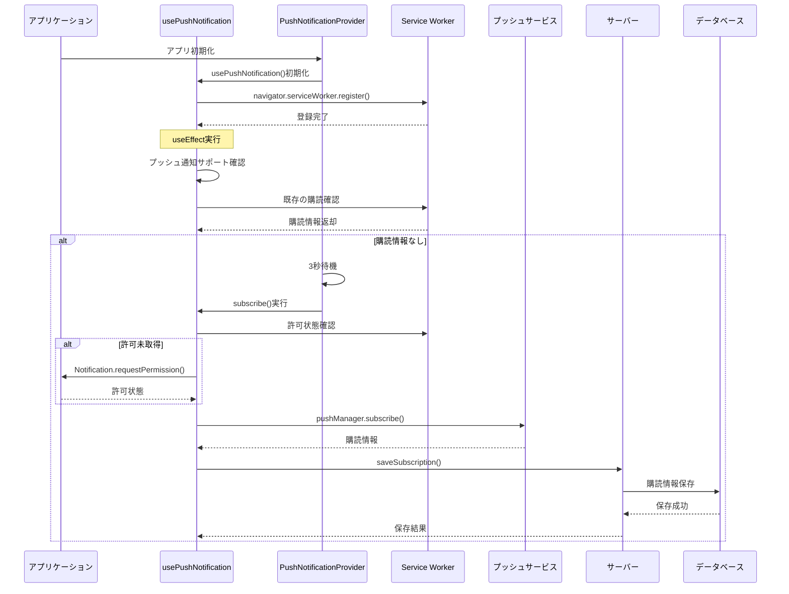
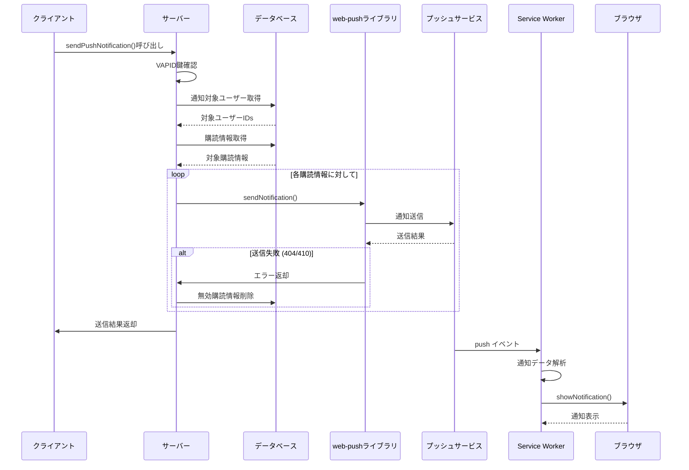
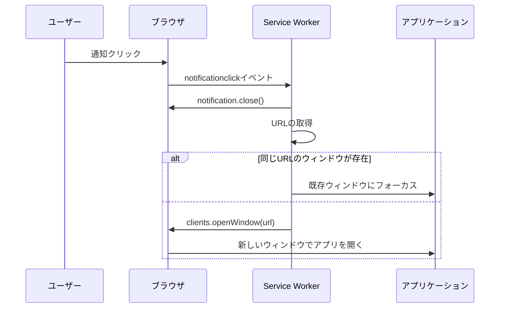
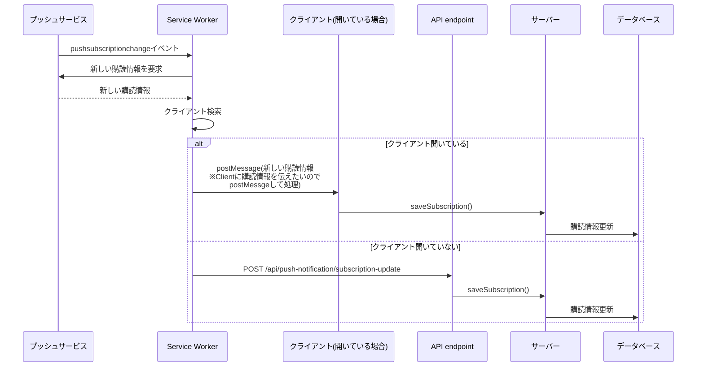

# プッシュ通知システム仕様書

## 概要

このドキュメントでは、アプリケーションのプッシュ通知システムの仕組みと実装について詳細に説明します。プッシュ通知は、Service
Worker APIとWeb Push APIを使用して実装されており、ユーザーがブラウザを閉じていても通知を受け取ることができます。

## 目次

1. [システム構成](#システム構成)
2. [データモデル](#データモデル)
3. [実装フロー](#実装フロー)
4. [コンポーネント詳細](#コンポーネント詳細)
5. [API](#api)
6. [セキュリティ](#セキュリティ)
7. [エラーハンドリング](#エラーハンドリング)
8. [実装詳細](#実装詳細)
9. [処理フロー図](#処理フロー図)

## システム構成

プッシュ通知システムは以下のコンポーネントで構成されています：

- **クライアントサイド**

  - `usePushNotification` フック: プッシュ通知の購読管理
  - `PushNotificationProvider`: アプリ起動時の自動購読処理
  - `NotificationToggle`: ユーザーが手動で通知設定を変更するためのUI
  - `service-worker.js`: バックグラウンドでの通知受信と表示処理

- **サーバーサイド**

  - `actions/push-notification.ts`: サーバーアクション（購読管理、通知送信）
  - `api/push-notification/subscription-update/route.ts`: Service Worker更新用API

- **データストア**
  - `PushSubscription` モデル: ユーザーごとの購読情報を保存

## データモデル

### PushSubscription

```prisma
model PushSubscription {
  id             String    @id @default(cuid())
  endpoint       String?   @unique @map("endpoint")
  p256dh         String?
  auth           String?
  userId         String?   @map("user_id")
  expirationTime DateTime? @map("expiration_time")
  createdAt      DateTime  @default(now()) @map("created_at")
  updatedAt      DateTime  @updatedAt @map("updated_at")
  user           User?     @relation(fields: [userId], references: [id], onDelete: SetNull)

  @@index([userId])
}
```

- `endpoint`: プッシュサービスのエンドポイントURL（一意）
- `p256dh`: 公開鍵（暗号化に使用）
- `auth`: 認証シークレット
- `userId`: 関連するユーザーID
- `expirationTime`: 購読の有効期限

## 実装フロー

### 1. 初期化プロセス

1. アプリケーション起動時、`PushNotificationProvider`が`usePushNotification`フックを初期化
2. ブラウザがプッシュ通知をサポートしているか確認
3. Service Workerを登録し、既存の購読情報を確認
4. 購読情報が存在しない場合、一定時間後（3秒）に自動で購読を試みる

### 2. 購読プロセス

1. ユーザーが通知を許可していない場合、ブラウザの通知許可ダイアログを表示
2. 許可された場合、VAPIDキーを使用してプッシュサーバーに購読
3. 購読情報を取得し、サーバーのデータベースに保存
4. `PushSubscription`テーブルにユーザーIDと紐付けて登録

### 3. 通知送信プロセス

1. `sendPushNotification`サーバーアクションを呼び出し
2. 通知の種類（システム、ユーザー、グループ、タスク）に応じて対象ユーザーを特定
3. 対象ユーザーの購読情報を取得
4. 通知ペイロードを作成
5. web-pushライブラリを使用して各登録済みエンドポイントに通知を送信
6. 送信結果を集計して返却

### 4. 通知受信プロセス

1. Service Workerが`push`イベントを受信
2. 通知データをパースし、notification optionsを設定
3. `showNotification`を呼び出して通知を表示
4. ユーザーが通知をクリックすると、関連するURLを開く

### 5. 購読情報の更新プロセス

1. ブラウザ/プッシュサービスによる購読情報の変更を検知
2. Service Workerの`pushsubscriptionchange`イベントが発火
3. 新しい購読情報を取得して保存
4. クライアントが開いている場合はメッセージングを通じて更新
5. クライアントが開いていない場合はAPIを通じて更新

## コンポーネント詳細

### usePushNotification.ts

```typescript
export function usePushNotification() {
  // 状態管理
  const [subscriptionState, setSubscriptionState] = useState<PushSubscription | null>(null);
  const [error, setError] = useState<Error | null>(null);
  const [isSupported, setIsSupported] = useState(false);
  const [registrationState, setRegistrationState] = useState<ServiceWorkerRegistration | null>(null);
  const [permissionState, setPermissionState] = useState<NotificationPermission>("default");
  const [recordId, setRecordId] = useState<string | null>(null);

  // メソッド
  const getSubscription = useCallback(async () => {
    /* 実装 */
  }, [registrationState]);
  const handleSubscriptionChange = useCallback(async (oldEndpoint, newSubscription) => {
    /* 実装 */
  }, []);
  const initializeServiceWorker = useCallback(async () => {
    /* 実装 */
  }, [handleSubscriptionChange]);
  const subscribe = useCallback(async () => {
    /* 実装 */
  }, [registrationState, isSupported, getSubscription, permissionState, recordId]);
  const unsubscribe = useCallback(async () => {
    /* 実装 */
  }, [getSubscription]);

  // 初期化処理
  useEffect(() => {
    /* 実装 */
  }, [subscriptionState, initializeServiceWorker]);

  return {
    registrationState,
    subscriptionState,
    isSupported,
    error,
    subscribe,
    unsubscribe,
    getSubscription,
    permissionState,
    handleSubscriptionChange,
  };
}
```

このフックは以下の機能を提供します：

- プッシュ通知のサポート確認
- Service Workerの登録と初期化
- 購読の作成、取得、削除
- 購読状態の変更検知
- 通知許可状態の管理

### PushNotificationProvider.tsx

```typescript
export function PushNotificationProvider({ children }: PushNotificationProviderProps) {
  const { subscribe, isSupported, subscriptionState, permissionState } = usePushNotification();

  useEffect(() => {
    const timer = setTimeout(() => {
      if (isSupported && !subscriptionState && permissionState !== "denied") {
        if (subscribe) {
          void subscribe().catch((err) => {
            console.error("購読に失敗しました:", err);
          });
        }
      }
    }, 3000);
    return () => clearTimeout(timer);
  }, [subscribe, isSupported, subscriptionState, permissionState]);

  return <>{children}</>;
}
```

このプロバイダーは以下の役割を担います：

- アプリケーション全体でプッシュ通知機能を提供
- 適切なタイミングで自動的に購読処理を実行
- ユーザーエクスペリエンスを考慮した遅延実行（3秒後）

### service-worker.js

Service Workerは以下のイベントを処理します：

1. **install**: インストール時の処理（`skipWaiting`でアクティブ化を早める）
2. **activate**: アクティブ化時の処理（`clients.claim`で制御を取得）
3. **push**: プッシュ通知受信時の処理
4. **notificationclick**: 通知クリック時の処理
5. **pushsubscriptionchange**: 購読情報変更時の処理

プッシュ通知のフォーマット：

```javascript
const options = {
  body: notificationData.body,
  icon: notificationData.icon,
  badge: notificationData.badge,
  data: notificationData.data,
  actions: [
    { action: "open_url", title: "開く" },
    { action: "dismiss", title: "閉じる" },
  ],
};
```

### actions/push-notification.ts

このファイルには以下のサーバーアクションが含まれます：

1. **getRecordId**: エンドポイントから購読情報のIDを取得
2. **saveSubscription**: 購読情報を保存（新規または更新）
3. **deleteSubscription**: 購読情報を削除
4. **sendPushNotification**: 通知を送信

`sendPushNotification`の処理フロー：

1. VAPID鍵の確認
2. 通知対象ユーザーの取得
3. 対象ユーザーの購読情報を取得
4. 通知ペイロードの作成
5. 各購読情報に通知送信
6. 結果の集計と返却

### NotificationToggle.tsx

```typescript
export function NotificationToggle() {
  const { isSupported, subscriptionState, subscribe, unsubscribe, error, permissionState } = usePushNotification();
  const [isEnabled, setIsEnabled] = useState(false);

  useEffect(() => {
    const checkPermission = async () => {
      setIsEnabled(permissionState === "granted" && !!subscriptionState);
    };
    void checkPermission();
  }, [subscriptionState, permissionState]);

  const handleToggleChange = useCallback(
    async (checked: boolean) => {
      // 実装
    },
    [subscribe, unsubscribe, permissionState],
  );

  // UIのレンダリング
}
```

このコンポーネントは以下の役割を担います：

- 通知設定のUI表示
- 通知の有効/無効切り替え
- サポート状況の表示
- エラー状態の表示

## API

### subscription-update API

```typescript
export async function POST(request: Request) {
  // Service Workerから送信された新しい購読情報を処理
  const body = (await request.json()) as SubscriptionUpdateRequest;
  const { oldEndpoint, newSubscription } = body;

  // バリデーションと認証

  // 古い購読情報のレコードIDを取得
  let recordId = await getRecordId(oldEndpoint);

  // 新しい購読情報を保存
  const result = await saveSubscription({
    endpoint: newSubscription.endpoint,
    expirationTime: newSubscription.expirationTime,
    keys: {
      p256dh: newSubscription.keys.p256dh,
      auth: newSubscription.keys.auth,
    },
    recordId: recordId,
  });

  // 結果を返却
}
```

この API は Service Worker が直接使用し、クライアントが開いていない場合でも購読情報を更新できるようにします。

## セキュリティ

1. **VAPID認証**: Web Push プロトコルではVAPID（Voluntary Application Server Identification）キーを使用して送信者を認証
2. **エンドポイント固有**: 各購読は一意のエンドポイントを持ち、他のユーザーが使用できない
3. **暗号化**: プッシュ通知のペイロードは、ユーザーごとの公開鍵（p256dh）で暗号化
4. **認証**: ユーザーIDと購読情報を紐付け、認証されたユーザーのみが操作可能

## エラーハンドリング

1. **購読失敗**: ブラウザの通知許可が拒否された場合や、VAPID鍵が不正な場合の処理
2. **送信失敗**: エンドポイントが無効になった場合の処理（自動削除）
3. **再購読処理**: `pushsubscriptionchange`イベントによる自動再購読
4. **エラー表示**: UI上でのエラー表示とユーザーへのガイダンス

## 使用例

### 通知の送信

```typescript
// タスク完了通知の送信例
await sendPushNotification({
  title: "タスク完了",
  body: `「${taskName}」が完了しました`,
  icon: "/icons/task-complete.png",
  url: `/tasks/${taskId}`,
  taskId: taskId,
});
```

### 購読状態の確認

```typescript
const { isSupported, subscriptionState, permissionState } = usePushNotification();

if (isSupported && subscriptionState && permissionState === "granted") {
  // プッシュ通知が有効
} else {
  // プッシュ通知が無効
}
```

## 実装詳細

### VAPID認証とは何か

VAPID（Voluntary Application Server
Identification）は、プッシュサービスがアプリケーションサーバーを識別するための仕組みです。これにより、不正なサーバーからの通知送信を防止します。

1. **鍵ペアの生成**: サーバーは公開鍵と秘密鍵のペアを生成
2. **公開鍵の共有**: クライアントに公開鍵を共有し、購読時に使用
3. **認証ヘッダーの生成**: 通知送信時に秘密鍵で署名した認証ヘッダーを生成
4. **検証**: プッシュサービスは公開鍵を使用して署名を検証

### サービスワーカーの登録プロセス

1. アプリケーションはサービスワーカーの登録を試みます

   ```javascript
   navigator.serviceWorker.register("/service-worker.js");
   ```

2. 登録が完了すると、サービスワーカーはインストールを開始します

   ```javascript
   self.addEventListener("install", (event) => {
     self.skipWaiting(); // アクティブ化を早める
   });
   ```

3. インストール後、サービスワーカーはアクティブになります
   ```javascript
   self.addEventListener("activate", (event) => {
     event.waitUntil(clients.claim()); // クライアント制御を取得
   });
   ```

### プッシュ通知購読プロセス詳細

1. **ブラウザの通知許可を確認・要求**

   ```javascript
   const permission = await Notification.requestPermission();
   ```

2. **VAPIDキーを変換**: URL Base64形式からUint8Arrayに変換

   ```javascript
   const applicationServerKey = urlBase64ToUint8Array(vapidPublicKey);
   ```

3. **購読リクエスト**: 公開鍵を使用してプッシュサービスに購読

   ```javascript
   const subscription = await registration.pushManager.subscribe({
     userVisibleOnly: true,
     applicationServerKey,
   });
   ```

4. **購読情報の保存**: サーバーに送信して保存
   ```javascript
   await saveSubscription({
     endpoint: subscription.endpoint,
     expirationTime: subscription.expirationTime,
     keys: {
       p256dh: subscription.keys.p256dh,
       auth: subscription.keys.auth,
     },
   });
   ```

### 通知送信プロセス詳細

1. **対象ユーザーの特定**: 通知種別に基づいて対象を特定

   ```typescript
   const targetUserIds = await getNotificationTargetUserIds(targetType, {
     userId: params.userId,
     groupId: params.groupId,
     taskId: params.taskId,
   });
   ```

2. **購読情報の取得**: 対象ユーザーの有効な購読情報を取得

   ```typescript
   const targetSubscriptions = await prisma.pushSubscription.findMany({
     where: {
       userId: { in: targetUserIds },
       p256dh: { not: null },
       auth: { not: null },
     },
   });
   ```

3. **通知ペイロードの作成**: 送信するデータを構造化

   ```typescript
   const payload = JSON.stringify({
     title: params.title,
     body: params.body,
     icon: params.icon ?? "favicon.svg",
     badge: params.badge ?? "favicon.svg",
     ...(params.url && { data: { url: params.url } }),
   });
   ```

4. **通知の送信**: webPushライブラリを使用して送信

   ```typescript
   await webPush.sendNotification(webPushSubscription, payload);
   ```

5. **エラー処理**: 送信失敗時の処理（無効な購読情報の削除など）
   ```typescript
   if (typedError.statusCode === 404 || typedError.statusCode === 410) {
     await deleteSubscription(subscription.endpoint);
   }
   ```

### Service Worker通知処理詳細

1. **通知受信時の処理**:

   ```javascript
   self.addEventListener("push", (event) => {
     const payload = event.data.json();

     const options = {
       body: payload.body,
       icon: payload.icon,
       // その他設定
     };

     event.waitUntil(self.registration.showNotification(payload.title, options));
   });
   ```

2. **通知クリック時の処理**:

   ```javascript
   self.addEventListener("notificationclick", (event) => {
     // 通知を閉じる
     event.notification.close();

     // URLを開く
     const urlToOpen = event.notification.data?.url || "/";

     event.waitUntil(
       clients.matchAll({ type: "window" }).then((clientList) => {
         // 既存のウィンドウを探すか新しいウィンドウを開く
       }),
     );
   });
   ```

3. **購読情報更新時の処理**:
   ```javascript
   self.addEventListener("pushsubscriptionchange", (event) => {
     // 新しい購読情報を取得して保存
     event.waitUntil(
       self.registration.pushManager.subscribe(/* 設定 */).then((newSubscription) => {
         // クライアントに通知または直接APIを呼び出す
       }),
     );
   });
   ```

## 処理フロー図

### 初期化と購読プロセス



### 通知送信プロセス



### 通知クリック処理



### 購読情報更新プロセス



ブラウザの通知権限がリセットされた場合にトグルをOFFにしてDBも更新する修正を行います。段階的に確認しながら進めていきます。

まず現在のコードの状況を確認します：Read file:
src/hooks/notification/use-push-notification.ts続けて、権限拒否の処理と初期化後の権限変更検知の処理を確認します：Read
file: src/hooks/notification/use-push-notification.ts現在のコードの問題点を整理しました：

1. **現在の問題**: 権限が`"denied"`の場合のみ自動的にOFFに更新している
2. **修正が必要な点**: 権限が`"default"`（リセット）の場合で、かつ購読がない場合にもOFFに更新する必要がある

Step 1: まず、権限がリセット（`"default"`）された場合の検知と自動更新機能を追加します：Step 2:
linterエラーを修正します。関数名の変更により参照が残っているため更新します：ファイルの現在の状態を確認します：Read file:
src/hooks/notification/use-push-notification.ts Step
3: 修正が必要です。関数の型定義を適切にし、権限リセット時の処理を追加します：既に修正済みのようです。次にuseEffectを修正します：Step
4: フォーカス時のイベントハンドラーも同様に修正します：Step 5:
useEffect内でasync関数を使用する際のlinterエラーを修正します：Step
6: 最後に、`syncEnabledStateWithBrowser`関数も権限リセット時の処理に対応するよう修正します：Read file:
src/hooks/notification/use-push-notification.ts現在の`syncEnabledStateWithBrowser`関数は適切に動作するはずです。この関数は権限が`granted`で購読が存在する場合のみ`enabled`を`true`にするため、権限が`default`や`denied`の場合、または購読がない場合は自動的に`false`になります。

Step 7: 最後に、コンポーネント側でも権限がリセットされた場合の適切な表示を追加します：Read file:
src/components/notification/push-notification-toggle.tsx Step
8: コンポーネント側にも権限がリセットされた場合のアラート表示を追加します：

## 修正完了の確認

以上で修正が完了しました。修正内容をまとめると以下のようになります：

### Step 1-8: 権限リセット時の自動OFF化対応

1. **関数名の変更**: `syncPermissionDeniedToDatabase` → `syncPermissionToDatabase`で、`"denied"` |
   `"reset"`の理由を受け取るよう修正

2. **権限チェック拡張**:

   - 権限が`"denied"`の場合：従来通り自動でOFFに更新
   - 権限が`"default"`（リセット）で購読がない場合：新たに自動でOFFに更新

3. **フォーカス時チェック強化**: ページフォーカス時に権限が`"default"`の場合、Service
   Workerから最新の購読状態を確認し、購読がなければ自動でOFFに更新

4. **UI表示改善**: コンポーネント側で権限がリセットされた場合の専用アラートを青色で表示

### 修正結果

これで以下のような動作になります：

- ユーザーがブラウザの通知設定で「ブロック」ではなく「リセット」を選択した場合
- 権限が`"default"`に戻り、プッシュ購読も自動的に解除される
- アプリ側でこれを検知し、DBの設定を自動的にOFFに更新
- UIのトグルもOFFになり、ユーザーに状況が分かりやすく表示される
- リロード後もDBから正しい状態（OFF）が読み込まれ、ユーザーの誤解を防ぐ

これにより、ユーザーが権限をリセットした場合でも、アプリの表示と実際の状態が一致し、ユーザーの混乱を防げます。
