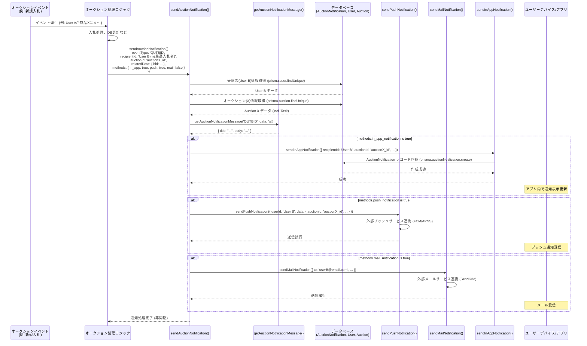

# オークション通知機能 仕様書

## 1. 概要

- 本仕様書は、オークション機能における通知システムの設計と動作を定義する。
- ユーザーは、オークションに関連する重要なイベント（入札、落札、質問など）に関する通知を受け取ることができる。
- 通知は、アプリ内通知、メール通知、プッシュ通知の形式で送信される。

## 2. 設計方針

- **開発ルール**

  - Step by Stepで、以下の内容の実装計画と実装を行なってください。
  - できる限りサーバーの負荷をかけず、サーバーのアクセス回数も減らす設計
    - 現状では、可能な限りStateで管理
  - 型の情報は、全て「lib/auction/type」ファイルにまとめて下さい。
  - `||`を使用せず、`??`を使用して下さい。

- **UIとロジックを完全に分離**

  - クライアントコンポーネントの場合は、カスタムフックにロジックをまとめる。など
  - 画面やModalを非表示にする際のみ、DBに保存する。など

- **保守性・可読性の向上:**
  - 通知の種類を `AuctionEventType` として明確に定義し、イベントタイプに基づいて通知内容を決定する。
  - 通知メッセージの取得ロジックを `getAuctionNotificationMessage` 関数に分離する。
  - 通知送信処理を `sendAuctionNotification` 関数に集約し、内部で各通知方法（アプリ内、メール、プッシュ）の送信関数を呼び出す。
  - ページネーションを実装
- **柔軟性:**
  - `sendAuctionNotification` 関数の引数で、通知を送信する方法（アプリ内、メール、プッシュ）を選択できるようにする。
- **データベース:**
  - 通知データは `AuctionNotification` テーブルに保存する。
- **その他**
  - 「通知から１ヶ月後に自動削除」トリガーの実装
    - GitHub Actionsを使用して、リポジトリ内のコードを定期的に実行する方法で、通知を確認して、通知から1ヶ月経っている場合は、通知のデータをDBから削除する
    - 定期的な実行処理は、1週間に一回で、日本時間の深夜1時ごろに行うようにする。
  - 通知の削除機能
  - ページネーション機能
  - 入札に伴い、関係するユーザーへ通知を行う機能

## 型・関数

- AuctionEventType
  - オークションで発生する通知トリガーとなるイベントタイプを定義する。
- getAuctionNotificationMessage
  - イベントタイプに応じた、通知メッセージを返す関数
- NotificationSendMethod
  - 通知送信方法を定義するオブジェクト
  - どの方法で通知を送信するかを指定するオブジェクトの型。
- sendAuctionNotification
  - オークション関連の通知を一元的に送信する関数
  - オークションのデータとEventTypeを渡すだけでデータを送れる

## 7. 通知トリガー条件と送信内容

| 条件                                           | イベントタイプ (`AuctionEventType`) | 受信者     | デフォルト送信方法                               | メッセージ内容 (例)                                                                                                                      | 自動削除タイミング  |
| :--------------------------------------------- | :---------------------------------- | :--------- | :----------------------------------------------- | :--------------------------------------------------------------------------------------------------------------------------------------- | :------------------ |
| 自分が出品した商品に他者が入札した場合         | `NEW_BID_ON_OWN_ITEM`               | 出品者     | アプリ内, (メール, プッシュ: ユーザー設定による) | 「[商品名] に新しい入札がありました」 「[入札者名]さんが [金額] ポイントで入札しました。」                                           | オークション終了時  |
| 自分が入札した商品で最高額を更新された場合     | `OUTBID`                            | 入札者     | アプリ内, プッシュ, (メール: ユーザー設定による) | 「[商品名] の最高入札額が更新されました」 「[新最高入札者名]さんが [金額] ポイントで入札し、あなたは最高入札者ではなくなりました。」 | オークション終了時  |
| 自分が出品した商品に質問が来た場合             | `QUESTION_RECEIVED`                 | 出品者     | アプリ内, (メール: ユーザー設定による)           | 「[商品名] に新しい質問が届きました」 「出品した商品「[商品名]」に新しい質問があります。確認してください。」                         | オークション終了時  |
| 自動入札が設定した上限金額に達した場合         | `AUTO_BID_LIMIT_REACHED`            | 入札者     | アプリ内, プッシュ, (メール: ユーザー設定による) | 「[商品名] の自動入札が上限に達しました」 「設定した自動入札の上限額に達したため、自動入札を停止しました。」                         | 通知送信から1ヶ月後 |
| 自分が出品した商品のオークションが終了した場合 | `AUCTION_ENDED_OWN_ITEM`            | 出品者     | アプリ内, (メール: ユーザー設定による)           | 「[商品名] のオークションが終了しました」 「出品した商品「[商品名]」のオークション期間が終了しました。結果を確認してください。」     | 通知送信から1ヶ月後 |
| オークションを落札した場合                     | `AUCTION_WON`                       | 落札者     | アプリ内, メール, プッシュ                       | 「[商品名] を落札しました！」 「おめでとうございます！「[商品名]」を [落札額] ポイントで落札しました。」                             | 通知送信から1ヶ月後 |
| オークションを落札できなかった場合             | `AUCTION_LOST`                      | 落札失敗者 | アプリ内                                         | 「[商品名] のオークションは落札できませんでした」 「残念ながら、「[商品名]」のオークションは他のユーザーが落札しました。」           | 通知送信から1ヶ月後 |
| ポイントが返還された時                         | `POINT_RETURNED`                    | 落札者     | アプリ内, (メール: ユーザー設定による)           | 「オークションポイントが返還されました」 「[商品名] のオークションで預けていたポイントが返還されました。」                           | 通知送信から1ヶ月後 |

**注意:**

- デフォルトの送信方法は基本的な推奨設定。ユーザーが通知設定で変更できるようにする。
- メッセージ内容は `getAuctionNotificationMessage` 関数で生成される。

## 8. UI仕様

### ヘッダー

- 既存のベルマーク（通常通知）の左隣に、オークション専用のアイコン（例: ハンマーアイコン）を配置する。
- 未読のオークション通知がある場合、アイコン右上に未読数をバッジ表示する。

### ホバー

- オークション通知アイコンにホバーすると、最新の未読通知数件のプレビュー（タイトル、一部本文）をドロップダウン等で表示する。

### モーダル

- オークション通知アイコンをクリックすると、オークション通知一覧モーダルを表示する。
- モーダル内には、受信したオークション通知がリスト表示される。
- 各通知には、アイコン、タイトル、本文、受信日時、関連オークションへのリンク（可能な場合）を表示する。
- 未読/既読の状態を表示し、クリックで既読にする機能。
- 通知削除機能（個別、一括）。
- ページネーション機能（通知件数が多い場合）。

## 9. 通知データの自動削除

- **目的:** 不要になった通知データを削除し、データベースの肥大化を防ぐ。
- **方法:** GitHub Actions の定期実行ワークフローを使用する。
- **実行タイミング:** 毎週日曜日 日本時間 深夜1時頃 (cron: `0 16 * * 0` UTC)
- **処理内容:**
  1. `AuctionNotification` テーブルを検索する。
  2. 各通知レコードについて、以下の条件で削除対象か判断する:
     - `eventType` が `NEW_BID_ON_OWN_ITEM`, `OUTBID`, `QUESTION_RECEIVED` のいずれかで、関連する `Auction` の `status` が `ENDED` または `CANCELED` になっている場合 (オークション終了時に削除)。
     - `eventType` が上記以外で、`createdAt` から1ヶ月以上経過している場合 (通知送信から1ヶ月後に削除)。
     - **(代替案)** `expiresAt` カラムを追加し、削除予定日時を保存。`expiresAt` が現在時刻を過ぎているレコードを削除する (`calculateExpiryDate` 関数の実装例参照)。
  3. 削除対象のレコードを `DELETE` 文で削除する。
  4. 処理結果（削除件数など）をログに出力する。

