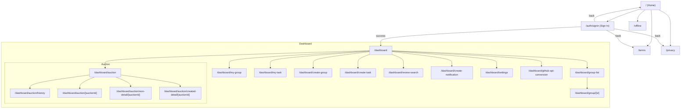
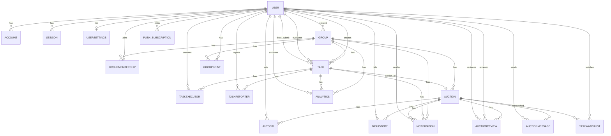

# 無料主義アプリの仕様

## 説明

- 職務経歴書のためにまとめている内容を、AI に渡すために抜き出しているファイル

## 詳細

### 無料主義アプリ(`freeism-app`)

- バージョン
  - freeism-app ver1
- 詳細
  - GitHub：<a href="https://github.com/yuichisugio/freeism-app_v1" target="_blank">https://github.com/yuichisugio/freeism-app_v1</a>
     ※今後、大きく仕様が変更する&残しておきたいコードもあるため URL 変わる可能性あり
  - Zenn
    Books：<a href="https://zenn.dev/329/books/0dbe4578af702a" target="_blank">https://zenn.dev/329/books/0dbe4578af702a</a>
- 概要
  - 無料主義の管理を行うことができるアプリ
- 無料主義とは
  - 何かしら作業した人を第三者がそれぞれの評価軸で評価して、その評価結果をもとに他者が提供する商材を優先的に得られるようにする仕組みのこと
- 解決したい課題・なぜ作ったか
  - OSS 等の報酬が十分ではない労働に対して報酬を払える仕組みを作りたい。
  - `freeism-app`は、その仕組みを管理するためのアプリ
- ターゲット層
  - OSS 等の報酬が十分ではない労働に対して報酬を払える評価をしたい人
  - 初期はプログラマー向け
- 実装期間
  - 2025 年 01 月〜2025 年 07 月
- 実装の進め方
  1. 仕様を markdown にまとめる
  2. 仕様 markdown を Cursor に渡して AI に設計漏れを指摘してもらい、追記する
  3. 仕様 markdown をもとに、Cursor に渡して AI に実行タスクをまとめてもらう
  4. 仕様 markdown をもとに、Cursor に渡して AI に実装してもらう
  5. 実装コードをすべて読んで、理解できない点があれば解説してもらい、ロジックを理解できる状態にする
  6. テストコードを実行したり、Playwright
     MCP を使用したり、LocalHost から操作してバグがある場合は AI に依頼 or 手動で修正
- エラー対処方法
  1. Cursor に、エラーログと関連コードを全部渡して修正してもらう
  2. それで直らない場合は`console.log()`,`console.trace()`を記載してバグ箇所を特定して手動 orAI に修正依頼
  3. その後、関連コードにバグりにくいコードに変更 & わかりやすく注意するコメントを入れる
- 実装で意識したこと
  - ライブラリなどを利用するときは、ブログや記事やAIの解説だけでなく、公式ドキュメントの確認を習慣づけた。
- コーディング規約
  - フォーマッタ: Prettier を採用（2 スペース／末尾カンマ）。`pnpm format:fix` で全体整形
  - Lint: ESLint（Next.js core-web-vitals + TypeScript ルール）を使用し、CI 前に `pnpm lint`/`pnpm lint:fix`
  - import 整理: `@ianvs/prettier-plugin-sort-imports` で自動並び替え、型は type-only import を強制
  - 命名規則: コンポーネントは PascalCase、フックは camelCase、ファイル名は kebab-case を厳守
  - エクスポート方針: 基本は named export。`app/page.tsx` 等の Next.js 予約ファイルのみ default export を許可
  - 型安全性: TypeScript `strict` 有効。`noUnusedLocals`/`noUnusedParameters` を有効化し未使用を検出
  - 型スタイル: `consistent-type-definitions: "type"` を適用し、interface より type alias を推奨
  - 非同期安全: `no-misused-promises` を適用し、属性ハンドラでの void 戻り値チェックを適切化
  - 関数スタイル: 関数宣言を基本としつつ、コールバックはアロー関数を推奨
  - アクセシビリティ: `eslint-plugin-jsx-a11y` の推奨設定を適用
  - React ルール: React/React Hooks の推奨セットを適用（依存配列やフック規約の逸脱を検出）
  - TanStack Query: `@tanstack/eslint-plugin-query` の推奨設定でクエリのアンチパターンを検出
  - テスト規約: Vitest + Testing Library。`*.test.ts(x)` を対象にし、Coverage 目標 Lines 90%/Funcs 85%/Branches 80%
- アプリ作成で苦労した点
  - 要件定義
    - どの機能をどれだけで実装できるか算定が難しいかった
    - その機能の実装に必要なコードやライブラリが不明のため、AI や Zenn などの記事から調査して算出する作業
    - エッジケースへの対応や機能の UI/UX の充実さとアプリ実装の難易度や実装期間のトレードオフがあった際の意思決定がアプリ作成の中でとても大変だった
    - どのライブラリを選べば良いのか
    - どのような UI にするのか
    - どのような仕様にするのか
    - オークション入札で、SSE を選ぶ際は、本当に SSE が必要か、Websocket の方が良いのでは？
    - 業務では 0 ベースからのシステム構築や修正/改修など幅広く経験しており、その時の環境に合わせた柔軟な対応ができます。
  - AI の使い方
    - ハルシネーションに惑わされた。ドキュメント/GitHub Issues をよく読む重要性を実感した
- アプリの改善点
  - RLS の設定
    - version2.0.0 をこの後実装予定なので、そこで行う
  - テンプレ
    - new
- 主な言語
  - JavaScript
    - なぜ使用したか
      - Next.js/React のエコシステムで設定・ビルド・スクリプト用途に必須のため
      - Node.js ランタイムでの CLI・運用スクリプト（`scripts/`）に適合し、周辺ツールが充実しているため
    - その他
      - 主に学んだサイト：[https://jsprimer.net/intro/](https://jsprimer.net/intro/)
  - TypeScript
    - なぜ使用したか
      - 型安全と保守性向上のため。`strict` 有効、未使用検出（`noUnused*`）で品質担保
      - 一貫した型スタイル（type alias 推奨、type-only import）で可読性とリファクタ容易性を確保
    - その他
      - 主に学んだサイト：[https://typescriptbook.jp/](https://typescriptbook.jp/)
  - HTML
    - なぜ使用したか
      - React/JSX を通じてセマンティックなマークアップとアクセシビリティ要件を満たすため
    - その他
      - 主に学んだサイト：[https://zenn.dev/ojk/books/intro-to-html-css](https://zenn.dev/ojk/books/intro-to-html-css)
  - CSS
    - なぜ使用したか
      - Tailwind CSS を中心にユーティリティファーストで実装し、生産性と一貫したデザインを両立するため
    - その他
      - 主に学んだサイト：[https://zenn.dev/ojk/books/intro-to-html-css](https://zenn.dev/ojk/books/intro-to-html-css)
      - レスポンシブデザイン等の一般的 Web サイトを作成出来るレベルのコーディングが可能。
- 開発環境
  - GitHub
    - なぜ使用したか
      - リポジトリ管理と PR ベースのコードレビュー、GitHub Actions による CI 連携のため
    - その他
      - Conventional Commits スタイルでメッセージを付ける運用、husky と lint-staged でコミット前に整形・静的検査を実行
  - Cursor
    - なぜ使用したか
      - 仕様ドリブンでの AI 補助とテスト駆動を促進し、設計漏れ検出やコード生成を高速化するため
    - その他
      - マルチファイル編集と ESLint/Prettier の即時フィードバックを活用
  - MacOS
    - なぜ使用したか
      - 個人開発端末。Node.js 20 系と pnpm によるローカル実行・検証環境を安定確保するため
    - その他
      - VSCode/Cursor、Docker（必要時）、Chrome で検証
  - Windows
    - なぜ使用したか
      - WSL2 上で Linux 互換の開発環境を構築し、実運用に近い挙動で検証するため
    - その他
      - `C:\\Windows\\System32\\wsl.exe` から起動し、pnpm/Prisma/Next を同一手順で実行
  - Node.js / pnpm
    - なぜ使用したか
      - Node ≥ 20 と pnpm により依存解決とキャッシュを高速化し、全コマンドをスクリプト化
    - その他
      - 主要コマンド: `pnpm dev`/`build`/`start`/`test`/`lint`/`format:fix`/`prisma:*`
  - Next.js / React 19
    - なぜ使用したか
      - App Router・Server Actions・SSE/API を同一プロジェクトで完結できるため
    - その他
      - 開発サーバ: `pnpm dev`（port 3000）、メールプレビュー: `pnpm email:dev`（port 3001）
  - TypeScript / ESLint / Prettier
    - なぜ使用したか
      - `strict` + ルール群で型安全・可読性を担保し、Prettier で整形一貫性を確保
    - その他
      - Husky + lint-staged でコミット前に自動整形と Lint 実行
  - Prisma / Supabase(PostgreSQL)
    - なぜ使用したか
      - 型安全 ORM とマイグレーションで複雑なリレーションを安定運用するため
    - その他
      - `pnpm prisma:dev:migrate` で開発適用、`pnpm db:seed` で初期データ投入
  - テスト（Vitest + Testing Library + MSW）
    - なぜ使用したか
      - UI/サーバーアクションを Happy DOM で統合テストし、90/85/80 のカバレッジ基準を維持
    - その他
      - `pnpm test`/`test:watch`/`test:coverage`、セットアップは `src/test/setup/*`
  - そのほかの周辺ツール
    - Upstash Redis（SSE 連携の Pub/Sub）、Cloudflare R2（S3 互換ストレージ）、Resend（メール）
- 主に使用したライブラリ
  - React
    - なぜ使用したか
      - App Router と組み合わせてサーバー／クライアントコンポーネントを柔軟に切り替え、最新の React
        19 ランタイムに最適化した UI を構築するため
    - その他
      - `src/app` 直下で Server Components を採用しつつ、フォームやモーダルなどインタラクティブな領域は `"use client"`
        指定で分離し再レンダリングを最小化
  - Next.js
    - なぜ使用したか
      - ルーティング、サーバーアクション、メタデータ管理、ISR/SWR 相当のキャッシュ制御をフルスタックで統合できるため
    - その他
      - App Router（Next.js 15）でページごとに `unstable_cacheLife` を設定し、SSE や API
        Route を含むバックエンド処理を同一プロジェクトで完結
  - TanStack Query v5
    - なぜ使用したか
      - クライアントサイドのキャッシュ戦略を統一し、オークション一覧や通知一覧など多量データのフェッチ・更新を最小限の API 呼び出しで済ませるため
    - その他
      - `src/library-setting/tanstack-query.ts` で QueryClient を拡張し、`idb-keyval`
        と連携して IndexedDB 永続化やトースト連携を共通化
  - Auth.js（NextAuth v5）
    - なぜ使用したか
      - Google OAuth を利用したシングルサインオンと JWT セッション管理を短時間で構築するため
    - その他
      - `src/library-setting/auth.ts`
        で Prisma トランザクションを組み込み、既存アカウントの更新やメール重複チェックを厳密化
  - Tailwind CSS
    - なぜ使用したか
      - デザインシステムを早期に整えつつ、オークション／管理 UI の細かなレイアウト調整をユーティリティクラスで高速に行うため
    - その他
      - `tailwind.config.ts` と `class-variance-authority` を併用し、共通 UI コンポーネント（ボタン・フォーム・表）を
        `src/components/ui` に集約
  - Prisma ORM
    - なぜ使用したか
      - Supabase/PostgreSQL 上で複雑なリレーション（Auction・Task・Notification など）を型安全に扱うため
    - その他
      - `prisma/schema.prisma` で JSONB や複合 Index を定義し、Vitest からは `vitest-environment-vprisma`
        でモックレス検証
  - Zod
    - なぜ使用したか
      - サーバー／クライアント双方で環境変数やフォーム入力をスキーマバリデーションするため
    - その他
      - `src/library-setting/env.ts` で `@t3-oss/env-nextjs` と組み合わせ、ビルド時に必須環境変数の欠落を検出
  - Upstash Redis（@upstash/redis）
    - なぜ使用したか
      - オークションの入札イベントを Pub/Sub で即時配信し、SSE へ連携するリアルタイム基盤を実現するため
    - その他
      - `src/library-setting/redis.ts` でクライアントを初期化し、`src/actions/auction/server-sent-events-broadcast.ts`
        からイベント発行
  - AWS SDK for JavaScript v3（Cloudflare R2）
    - なぜ使用したか
      - Cloudflare R2 の S3 互換 API を通じて画像アップロードと署名付き URL の生成を行うため
    - その他
      - `src/actions/cloudflare/r2-client.ts` で `S3Client`
        を生成し、環境変数の有無によってアップロード機能の有効／無効を切り替え
  - React Hook Form + Zod Resolver
    - なぜ使用したか
      - Dashbord でのグループ／タスク作成フォームのバリデーションとステップ管理を少ない再レンダリングで実装するため
    - その他
      - `src/components/task/create-task-form.tsx` などで `useForm` と `zodResolver` を利用し、サーバーアクションと連携
  - Radix UI + class-variance-authority
    - なぜ使用したか
      - アクセシブルなモーダル・ダイアログ・Combobox をベースに独自デザインへ拡張するため
    - その他
      - `src/components/ui` と `src/components/layout` でトリガー／コンテンツ／ポータルを分割し、Tailwind で外観を統一
  - Framer Motion
    - なぜ使用したか
      - 画像アップロードや入札 UI の表示状態を滑らかに切り替え、ユーザー操作に応じたアニメーション表現を加えるため
    - その他
      - `src/components/share/image-upload-area.tsx` や
        `src/components/auction/bid/auction-bid-detail.tsx`、`src/components/modal/export-data-modal.tsx` で
        `AnimatePresence`/`motion` を活用
- DB
  - PostgreSQL(Supabase)
- パッケージ管理
  - pnpm
- 本番環境
  - Vercel
  - GitHub Actions(CI/CD)
- その他使用ツール
  - draw.io
  - Resend
  - Notion
- サイトマップ(画面遷移図)
  - `/` ホーム
    - サインイン: `/auth/signin`
    - 利用規約: `/terms`
    - プライバシー: `/privacy`
    - オフライン: `/offline`
  - `/auth/signin` サインイン
    - 認証成功 → `/dashboard/*`
    - 認証不要ページへ戻る → `/` / `/terms` / `/privacy`
  - `/dashboard` ダッシュボード（認証必須・未認証は `/auth/signin` へ）
    - グループ一覧: `/dashboard/group-list`
      - グループ詳細: `/dashboard/group/[id]`
    - 自分のグループ一覧: `/dashboard/my-group`
    - 自分のタスク一覧: `/dashboard/my-task`
    - グループ作成: `/dashboard/create-group`
    - タスク作成: `/dashboard/create-task`
    - レビュー検索: `/dashboard/review-search`
    - 通知作成: `/dashboard/create-notification`
    - 設定: `/dashboard/settings`
    - 出品/入札: `/dashboard/auction`
      - 入札履歴: `/dashboard/auction/history`
      - オークション詳細: `/dashboard/auction/[auctionId]`
      - 落札詳細: `/dashboard/auction/won-detail/[auctionId]`
      - 出品詳細: `/dashboard/auction/created-detail/[auctionId]`
    - GitHub API 変換: `/dashboard/github-api-conversion`
  - 補足
    - `/dashboard/*` 配下は `loading`/`error`/`not-found` を内部でハンドリング（直接遷移不可）

- ER 図

- テーブル定義書

  | table             | desc                                       |
  | ----------------- | ------------------------------------------ |
  | User              | ユーザー基本情報、権限、各種リレーション   |
  | Account           | OAuth アカウント連携（NextAuth 準拠）      |
  | Session           | セッション管理（JWT/セッショントークン）   |
  | VerificationToken | 認証用トークン（メールリンク等）           |
  | UserSettings      | 通知可否/ユーザー名/ライフゴール等の設定   |
  | Group             | グループ本体（名称/目標/参加上限/作成者）  |
  | GroupMembership   | グループ所属関係（所有者フラグ含む）       |
  | GroupPoint        | グループ内ポイント残高/固定ポイント合計    |
  | Task              | タスク本体（状態/カテゴリ/固定評価など）   |
  | TaskExecutor      | タスク実行者（User 紐付け任意）            |
  | TaskReporter      | タスク報告者（User 紐付け任意）            |
  | TaskWatchList     | タスク/オークションのウォッチリスト        |
  | Analytics         | 貢献度評価（評価者/ポイント/ロジック）     |
  | Auction           | オークション本体（期間/最高入札/延長設定） |
  | BidHistory        | 入札履歴（自動入札フラグ/デポジット等）    |
  | AutoBid           | 自動入札設定（上限額/刻み/有効フラグ）     |
  | AuctionMessage    | オークション Q&A/メッセージ                |
  | AuctionReview     | 相互レビュー（評価/コメント/役割）         |
  | Notification      | 通知（対象/送信方法/既読 JSONB/予約日時）  |
  | PushSubscription  | Web Push 購読情報（endpoint/p256dh/auth）  |

- 主な機能
  - 入札機能
    - 概要
      - タスクをオークション化し、入札/自動入札/入札履歴/質問(Q&A)/ウォッチリスト/レビューを提供。SSE(+Upstash Redis
        Pub/Sub)で入札結果をリアルタイム配信
      - 入札期限の自動延長・延長回数上限・デポジット返還スクリプトなど、実運用に必要な周辺機能も実装
    - 画面のスクリーンショット
      - new
    - 実装した理由
      - 競り上がりの体験をリアルタイムかつ低レイテンシで実現し、ページ再読み込みに依存しない快適な UX を提供するため
    - 大変だった実装
      - `Server-Sent-Events`×`Upstash Redis Pub/Sub` の組合せ（エッジ配信、再接続制御、Vercel の SSE 制約への対処）
      - Prisma のトランザクションと楽観的ロック（`Auction.version`）で同時入札を整合的に処理
      - 最高入札者の更新時に OUTBID 通知（Web Push/Email/In-App）を即時送出
      - クライアント側は `EventSource` ベースの再接続・エラー時の UX を実装（`use-auction-bid-sse.ts`）
    - 入札のトランザクション化
      - `executeBid` 内で Auction/BidHistory/通知/SSE を一括コミット。手動入札後は `executeAutoBid`
        を動的 import し、次点上限に基づく自動入札を即時評価
    - その他
      - 入札延長（残り時間・延長回数の閾値管理）、Q&A（`AuctionMessage`）、ウォッチリスト（`TaskWatchList`）、レビュー（`AuctionReview`）
      - SSE ブロードキャスト実装（`src/actions/auction/server-sent-events-broadcast.ts`）
      - デポジット返還バッチ（`scripts/return-auction-deposit-points.ts`）
  - push 通知
    - 概要
      - VAPID 署名付き Web Push。Service Worker で受信し、OS ネイティブ通知を表示。購読は設定画面から ON/OFF を切替
    - 画面のスクリーンショット
      - new
    - 実装した理由
      - 入札競合・締切・結果など重要イベントをアプリ外でも即時に伝達し、再訪率を高めるため
    - 大変だった実装
      - `pushsubscriptionchange` の購読更新（SW→クライアント or 直接 API 経由で `subscription-update` に保存）
      - デバイス重複排除、無効購読(404/410)の自動削除、端末ごとの購読管理
    - その他
      - `sendPushNotification` で対象ユーザー設定・購読情報を集約し、一括送信/失効処理を実施
      - 購読更新 API Route（`src/app/api/push-notification/subscription-update`）
  - 出品一覧
    - 概要
      - カテゴリ/状態/価格帯/残り時間/グループ/フリーテキストを URL（`nuqs`）と同期しフィルター・ソート・ページネーション
      - サジェスト取得・件数取得をサーバー側でキャッシュし、描画と操作の体感速度を最適化
    - 実装した理由
      - 多条件での探索性・再現性（URL 共有）・パフォーマンスを両立するため
    - 大変だった実装
      - いいね（お気に入り）
      - ページネーション
      - 並び替え＋ページネーション保持
      - 絞り込み検索＋ページネーション保持
      - N+1 問題解消、索引最適化、キャッシュレイヤとの整合
    - 工夫・意識したこと
      - 条件オブジェクト（`AuctionListingsConditions`）を型で表現し、URL⇄状態の相互変換を一元化
      - キャッシュ/API レイヤと UI の責務分離（一覧/件数/サジェストを個別最適化）
      - Bigram の 2 文字分割と TokenMekab による形態素解析の分割の 2 つでトークナイザーでインデックスすることで、誤字脱字と多少の意味的な単位で検索やサジェストができるようにした
      - ベクトル検索は費用面を考えて実装しない
  - CSV エクスポート
    - 概要
      - グループのタスク情報や貢献度分析を CSV で出力（`export-group-task` / `export-group-analytics`）
    - 実装した理由
      - 活動実績の共有・二次分析・証跡管理のため
    - 大変だった実装
      - 期間・状態での抽出、join 後の整形、名前解決、件数上限や日付境界の扱い
    - 工夫・意識したこと
      - `use cache` で重い集計をキャッシュ。列構成を TypeScript 型で固定し、整形の破壊的変更を防止
  - ログイン機能/ログアウト
    - 概要
      - NextAuth v5（Google OAuth）+ ミドルウェアで `/dashboard/*` を保護。JWT セッションを 30 日ローテーション
    - 大変だった実装
      - Next.js 15 での App Router 連携、リダイレクト時の `callbackUrl` 設定、Prisma との一貫トランザクション
    - 工夫・意識したこと
      - 予約ページ等の例外最小化と、保護対象の明確化。`auth()` ラッパーでヘッダー強化（HSTS/CTO/Frame Options）
    - その他
      - Auth.js で実装していて、パスキー認証を実装したいし、Auth.js が取り込まれたので、Better Auth に移行することを検討
      - dashboard パス以下に入ったら認証が必須になるようにミドルウェアで設定
  - 権限やグループ作成フォームの工夫
    - 概要
      - `checkIsPermission` で App オーナー/Group オーナー/タスク作成者・報告者・実行者を網羅し、操作可否を統制
    - 実装した理由
      - グループ単位の安全な運用と、役割に応じた柔軟な操作権限を両立するため
    - 工夫・意識したこと
      - フォームは React Hook Form + Zod でバリデーション、権限に応じて UI を出し分け
  - テーブル
    - 概要
      - 外部ライブラリを使わず、共通テーブル`ShareTable`でフィルター/ソート/ページネーション/全画面表示を提供。
      - ヘッダ固定・モーダル/ポップオーバのポータル先制御・オーバーレイ型ローディングなど、複数画面で共通のUXを統一。
    - 実装した理由
      - 画面ごとに要件が異なるテーブル（参加/脱退モーダル、編集/削除、ステータス変更）を再利用可能な枠組みで一貫実装するため。
    - 大変だった実装
      - 全画面表示時に`<dialog>`や`<popover>`が隠れる問題を解消するため、`container`/`ref`を渡してポータルの描画先をテーブル内部へ固定。
      - `nuqs`とページネーション/ソート条件の双方向同期（クエリパラメータ維持）と、TanStack Queryキャッシュとの整合。
    - 工夫・意識したこと
      - 共通UI:
        `src/components/share/table/*`（フィルター/ページネーション/ポップオーバ/アラートダイアログ/ドロップダウン）。
      - 共通フック: 画面ごとに`use-*-table.ts`を用意し、URL同期・権限・削除/編集・API呼び出しを集約。
      - フルスクリーン切替時は`document.fullscreenElement`監視と`body`クラス制御でUXを維持。
      - ローディングはオーバーレイで`ShareTable`を置換しない（フルスクリーン/selection状態を保つ）。
    - 各画面のテーブル
      - My Task 一覧（`/dashboard/my-task`）
        - 概要
          - 自分のタスクを一覧。ステータス変更（コンボボックス）、編集モーダル、削除確認、貢献度/算出者列、オークション導線。
        - 実装した理由
          - 自身の担当・進捗管理と、オークション連携のハブとして。
        - 大変だった実装
          - ステータス変更用ポップオーバのポータル先をテーブル内に限定し、全画面表示でも正しく重なるように制御。
          - 編集モーダルの開閉とタスク更新後のキャッシュ整合/再描画の最小化。
        - 工夫・意識したこと
          - URL同期（`page`/`sort_field`/`sort_direction`/`q`/`task_status`/`contributionType`）。
          - 権限チェック経由の「編集可/削除可」ボタン状態制御。
        - 関連
          - コンポーネント: `src/components/task/my-task-table.tsx`
          - フック: `src/hooks/task/use-my-task-table.ts`
          - 共通: `src/components/share/table/share-table.tsx`
      - Group 一覧（`/dashboard/group-list`）
        - 概要
          - 参加可否表示と参加モーダル（未参加時のみ有効化）、参加人数/上限/評価方法/目標/デポジット期間の表示、検索/ソート/ページネーション。
        - 実装した理由
          - 参加可能なグループを探索・参加操作を一元化するため。
        - 大変だった実装
          - 「参加中/未参加/全て」切替のURL同期と、参加ボタンの活性/非活性制御の安全化。
        - 工夫・意識したこと
          - 参加アクションはアラートダイアログで再確認。大きな画面でもボタン位置・可視性を最適化。
        - 関連
          - コンポーネント: `src/components/group/all-user-group-table.tsx`
          - フック: `src/hooks/group/use-all-user-group-table.ts`
          - 共通: `src/components/share/table/share-table.tsx`
      - My Group 一覧（`/dashboard/my-group`）
        - 概要
          - 所属グループの一覧と脱退モーダル、デポジット期間・評価方法・保有/残高ポイントの表示、検索/ソート/ページネーション。
        - 実装した理由
          - 所属グループの状態確認と離脱操作を安全に提供するため。
        - 大変だった実装
          - 脱退アクションの確認ダイアログ（誤操作防止）と脱退後のキャッシュ無効化/再フェッチ。
        - 工夫・意識したこと
          - アイテム数/ソート変更時は`page: 1`にリセットし、UI齟齬を防止。
        - 関連
          - コンポーネント: `src/components/group/my-group-table.tsx`
          - フック: `src/hooks/group/use-my-group-table.ts`
          - 共通: `src/components/share/table/share-table.tsx`
      - Group 詳細（`/dashboard/group/[id]`）
        - 概要
          - グループ内のタスク一覧。ステータス変更（コンボボックス）、編集モーダル、削除確認、貢献度/入札額列、オークション導線、検索/絞り込み/ソート/ページネーション。
        - 実装した理由
          - グループ管理者/メンバーがタスクの状態を俯瞰・更新できるようにするため。
        - 大変だった実装
          - Owner/非Ownerで編集/削除可否が変わるため、権限チェックとUI制御を分離。
        - 工夫・意識したこと
          - 画面内の複数操作（変更/削除/編集）を共通Table
            API（`editTask`/`deleteTask`/`statusCombobox`）で表現し責務を明確化。
        - 関連
          - コンポーネント: `src/components/group/group-detail-table.tsx`
          - フック: `src/hooks/group/group-detail/use-group-detail-table.ts`
          - 共通: `src/components/share/table/share-table.tsx`
  - ドメイン購入
    - 概要
      - cloud flare で購入した
    - 大変だった点
      - 英語圏の方式で住所などを入力が必要になるので手間取った
      - `.app` のみ選択して購入したはずなのに、`freeizm.app` も勝手に購入されていた
    - 工夫・意識したこと
      - 安さと安心できるドメインにするために、`.app`を選んだ
  - アプリ内通知
    - 概要
      - 通知モデルに JSONB `isRead` を持ち、既読/未読を端末横断で管理。タブ UI で分類表示し、ショートカット操作に対応
    - 実装した理由
      - アプリ内での迅速なフィードバックと履歴参照を可能にするため
    - 大変だった実装
      - JSONB の索引運用、未読集計の最適化、モーダル閉鎖時以外のサーバーアクセス抑制（クライアント state 管理）
    - 工夫・意識したこと
      - UI をオシャレにした
      - ショートカットでタブ切り替えや通知を開けるようにした
      - サーバー負荷の回避と重くならないように Modal を閉じるとき以外はサーバーアクセスせず、state でステータスの管理を行う
      - 既読未読の管理は JSONB 型を使用。
        - JSONB 型を使用する場合は PrismaORM でも生 SQL で記載が必要だと勘違いして生 SQL を実行している
  - 通知作成
    - 概要
      - ダッシュボードから通知を作成・送信するフォームを提供。対象や本文、スケジュールを指定して送信可能。
    - 実装した理由
      - 管理者が運用時に一斉/対象限定の通知を手動で送るユースケースを想定。
    - 大変だった実装
      - API経由（`/api/notifications`）とサーバーアクションの役割整理、認証ガードの適用とエラーハンドリングの統一。
    - 工夫・意識したこと
      - 失敗時のトースト通知・入力保持、成功時のクリア/遷移を整理。
    - 関連
      - ページ: `src/app/dashboard/create-notification/page.tsx`
      - UI: `src/components/notification/create-notification-form.tsx`
      - API: `src/app/api/notifications/route.ts`
      - サーバーアクション: `src/actions/notification/general-notification.ts`
  - Push 通知
    - 概要
      - 上記「push 通知」と同様（VAPID/Web Push・購読管理・失効処理）
    - 実装した理由
      - 上記参照
    - 大変だった実装
      - 上記参照
    - 工夫・意識したこと
      - 設定画面から push 通知を ON に出来るようにした
      - その際に chrome の権限許諾が出て OFF にしたらアプリ側の設定
  - メール通知
    - 概要
      - Resend を使用し、React Email テンプレートで本文を生成。ユーザー設定に基づき送信可否を制御
    - 実装した理由
      - プッシュ不可環境や重要通知の冗長化のため
    - 大変だった実装
      - 本番鍵の管理、到達性/エラー時の再送制御。環境整備前は実送信コードを無効化し安全運用
    - 工夫・意識したこと
      - 送信対象ユーザーの抽出・設定尊重・スケジュール送信を `sendGeneralNotification` で一元化
      - API Route（`src/app/api/notifications`）からの作成/送信にも対応
  - CI/CD
    - 概要
      - GitHub Actions を想定し、運用スクリプト（入札開始/終了・デポジット返還・予約通知送信）を定期実行
    - 実装した理由
      - バッチ運用の自動化と運用コストの最小化
    - 大変だった実装
      - スケジュールジョブの冪等性・失敗時の再実行・通知整合
    - 工夫・意識したこと
      - スクリプトにテストを付与し回帰を防止
  - プロフィール
    - プロフィール編集
  - PWA
    - 概要
      - `next-pwa` によるオフライン対応と SW 連携（`service-worker.js`）。アイコン/マニフェストを整備し、Push と共存
    - 実装した理由
      - モバイル中心の利用で回線断時も最低限の利用を可能にし、再訪体験を高めるため
    - 大変だった実装
      - キャッシュ戦略の調整、SW 更新のリスク管理、Push/API との整合
    - 工夫・意識したこと
      - 重要リソースを優先・過剰キャッシュを抑制し、UX と更新容易性のバランスを最適化
  - オフラインページ
    - 概要
      - オフライン時の専用ページを用意し、接続断でもユーザーに明確な状態と再試行を案内。
    - 実装した理由
      - PWA/キャッシュ運用において、ネットワーク不通時の体験を劣化させないため。
    - 大変だった実装
      - メタデータ/テストの整備、Next のキャッシュ制御との整合。
    - 工夫・意識したこと
      - 軽量な静的UIでレンダリング確実性を担保。
    - 関連
      - ページ: `src/app/offline/page.tsx`
      - SW: `public/service-worker.js`
  - 設定
    - 概要
      - ユーザー設定の閲覧/更新。Push/Email 通知のON/OFF、ユーザー名/ライフゴールの更新、現在状態の表示。
    - 実装した理由
      - 通知チャネルの自己決定と、プロフィールの基本情報をユーザーが自律的に管理できるようにするため。
    - 大変だった実装
      - セッション取得とCSRの初期レンダ制御、トグルON時のService Worker登録/VAPID鍵処理/購読作成の順序管理。
    - 工夫・意識したこと
      - React Hook Form + Zodで型安全なフォーム、成功/失敗のトースト、Queryキャッシュの無効化と再フェッチ制御。
    - 関連
      - ページ: `src/app/dashboard/settings/page.tsx`
      - UI: `src/components/setting/setup-form.tsx`
      - フック: `src/hooks/notification/use-push-notification.ts`
      - サーバーアクション: `src/actions/user/user-settings.ts`
  - レビュー検索
    - 概要
      - タブ（検索/自分が行った/自身への）とサジェストを備えたレビュー検索を実装。URL 同期（`nuqs`）と TanStack
        Query によるキャッシュで高速化
    - 実装した理由
      - 貢献の可視化と検索性向上のため
    - 工夫・意識したこと
      - クエリ/サジェストを別 QueryKey で管理し、staleTime/gcTime を最適化
    - 関連
      - サーバーアクション（`src/actions/review-search/*`）、UI（`src/components/review-search/*`）、ページ（`src/app/dashboard/review-search`）
  - 画像アップロード（Cloudflare R2）
    - 概要
      - サーバーで署名付き URL を発行し（有効 15 分）、クライアントから直接 R2 に PUT する安全なアップロードフロー
    - 実装した理由
      - 大容量ファイルでもアプリサーバーを経由せず安全にアップロードするため
    - 工夫・意識したこと
      - 機能トグル（`ENABLE_IMAGE_UPLOAD`）で環境依存を排除、対応 MIME のみ許可、UI は `image-upload-area`
        でドラッグ&ドロップ対応
    - 関連
      - API Route（`src/app/api/upload/get-signed-url` /
        `src/app/api/upload`）、アクション（`src/actions/cloudflare/*`）
  - CSV アップロード
    - 概要
      - CSV をモーダルから取り込み、グループ/タスク関連のデータを一括登録・更新（権限/必須列検証・進捗表示・エラー集計）
    - 実装した理由
      - 運用時の一括メンテナンス効率化のため
    - 工夫・意識したこと
      - 型安全な必須列検証と段階的バリデーション、アップロードタイプごとの権限確認
    - 関連
      - UI（`src/components/modal/csv-upload-modal.tsx`）、アクション（`src/actions/task/bulk-create-task.ts` ほか）
  - ダッシュボード/ナビゲーション
    - 概要
      - Group 一覧/作成、Task 作成/一覧、通知作成、レビュー検索、オークション一覧/履歴、GitHub
        API 変換（プレースホルダー）、My Info（参加Group一覧/Task一覧）、Settings 等をサイドバーから遷移
    - 実装した理由
      - 業務フローを一元化し、権限ベースで安全に操作するため
    - 工夫・意識したこと
      - レイアウト固定（Header/Sidebar）とスクロール領域分離、保護ルートはミドルウェアで強制サインイン
    - 関連
      - サイドバー（`src/components/layout/sidebar.tsx`）、各ページ（`src/app/dashboard/*`）
  - 入札・落札履歴
    - 概要
      - 自身の入札/落札の履歴を可視化し、過去の入札動向/結果を参照可能
    - 実装した理由
      - 取引後の追跡とナレッジ化のため
    - 関連
      - Hooks（`src/hooks/auction/history/use-auction-history.ts`）、ページ（`src/app/dashboard/auction/history`）
  - テンプレ
    - 概要
      - new
    - 実装した理由
      - new
    - 大変だった実装
      - new
    - 工夫・意識したこと
      - new
    - その他
      - new
  - テンプレ
    - 概要
      - new
    - 実装した理由
      - new
    - 大変だった実装
      - new
    - 工夫・意識したこと
      - new
    - その他
      - new
- 機能以外の実装・工夫
  - UI
    - レスポンシブ対応
      - SNS サービスなのでスマホで利用する事を想定して開発しておりました。
      - その時にレスポンシブ対応できてないと、悪質なサイトと思われても仕方ないくらいひどい画面になるので、メディアクエリなどを細部まで使用して、徹底的に対応させました。
      - メディアクエリを使い、レスポンシブ対応をしっかり考えて実装したので、スマホでもストレス無く利用できます。
    - テーマ/ダークモード
      - `src/components/provider/providers.tsx` で `next-themes` の `ThemeProvider`
        を使用。`attribute: "class"`、`defaultTheme: "system"` により OS 設定と同期
    - アクセシビリティ/UI 基盤
      - `eslint-plugin-jsx-a11y` を有効化し、`Radix UI`/`shadcn/ui`
        を土台に Tailwind で統一した UI を構築（`src/components/ui`）
    - ローディング/スケルトン
      - ローディング状態の視覚化（`src/app/loading.tsx` など）とスケルトン UI を適所に配置し、知覚性能を向上
  - コーディング規約の設定
    - 概要
      - `eslint.config.mjs` と Prettier による一貫整形。`@ianvs/prettier-plugin-sort-imports` +
        `prettier-plugin-tailwindcss` で import とユーティリティの順序最適化
      - ルール例: `import/no-default-export` を原則禁止（`page.tsx`/`layout.tsx`
        等 Next 予約ファイルは許可）、`unicorn/filename-case: kebabCase` でファイル名を強制
      - `@typescript-eslint/consistent-type-imports`、`no-misused-promises`（attributes を安全化）など型/非同期の厳格運用
      - `@tanstack/eslint-plugin-query` を採用し、React Query のアンチパターンを静的検出
    - 実装した理由
      - 可読性とレビュー効率の最大化、バグ温床になりやすい import/非同期/フック周りの逸脱を早期検知するため
    - 大変だった実装
      - Next.js 予約ファイルの default export 例外と、ファイル名の kebab-case 強制の両立をルールで表現
    - 工夫・意識したこと
      - `pnpm format:fix` で Prettier + Prisma フォーマットを一括実行、`pnpm lint:fix`
        で ESLint 修正と Prisma 検証を同時実行
      - ルール/プラグインは最小限にせず、実害の出やすい領域（型/非同期/アクセシビリティ/Query）を厚めにカバー
    - その他
      - 参照: `eslint.config.mjs` / `package.json` の `format:*`/`lint:*` スクリプト
  - テスト
    - 概要
      - `vitest` + `@testing-library/react` + `MSW`。環境は `happy-dom`、セットアップは `src/test/setup/*`
        を分割（Prisma/NextAuth/Query）
      - カバレッジ閾値: Lines 90% / Functions 85% / Branches 80%（`vitest.config.ts`）
      - include/exclude を厳密化し、UI の土台や設定ファイル、型定義は対象外
    - 実装した理由
      - SSR/クライアント混在の大規模 UI とサーバーアクションを、実運用に近い形で統合検証するため
    - 大変だった実装
      - NextAuth/Prisma/TanStack Query の初期化順とモックの整合、SSE/Push など環境依存部分のテスト分離
    - 工夫・意識したこと
      - `silent: true`/`fileParallelism: true` でノイズ削減と短時間化、テスト用環境変数を `setup.ts` で一元定義
      - UI は Testing Library、API/アクションは MSW/直呼びで段階別にテスト
    - その他
      - 参照: `vitest.config.ts` / `src/test/setup/*` / `package.json` の `test:*` スクリプト
  - `TanStack Query v5`でクライアント側のキャッシュ
    - 概要
      - `idb-keyval` により IndexedDB 永続化。`PersistQueryClientProvider` で `QueryClient` を永続化し、Devtools も導入
      - 既定値: `staleTime/gcTime: Infinity`、`refetchOn*`
        は有効、`throwOnError: true`。Query/Mutation でトースト通知を集中管理
    - 実装した理由
      - オフライン/再訪時の体験向上と、ネットワーク往復を最小化するため
    - 大変だった実装
      - 安定した QueryKey 設計（`queryCacheKeys` ファクトリ）と invalidate の一元化（`meta.invalidateCacheKeys`）
    - 工夫・意識したこと
      - `NuqsAdapter` による URL 同期とキャッシュの整合、トースト多重発火の抑制（`QueryCache`/`MutationCache` 経由）
    - その他
      - 参照: `src/library-setting/tanstack-query.ts` / `src/components/provider/providers.tsx`
      - QueryKeyファクトリ（`src/library-setting/tanstack-query.ts` の `queryCacheKeys`）と URL 同期（`nuqs`）
  - PWA / Push / Service Worker
    - 概要
      - `public/service-worker.js` で `install`/`activate`/`push`/`notificationclick`/`pushsubscriptionchange` を実装
      - `src/hooks/notification/use-push-notification.ts` で SW 登録・VAPID 鍵処理・購読/再購読・端末識別の一連を管理
    - 実装した理由
      - オフライン時の最低限の体験と、入札/通知イベントの即時把握を両立するため
    - 工夫・意識したこと
      - `clients.claim()` で新 SW の即時制御、`registration.ready` を待ってから購読。`pushsubscriptionchange`
        でクライアント通知 or API へフォールバック
    - その他
      - 参照: `public/service-worker.js` / `src/hooks/notification/use-push-notification.ts`
      - Push購読更新の API（`src/app/api/push-notification/subscription-update`）

  - セキュリティ/ミドルウェア
    - 概要
      - `/dashboard/*` を認証必須化（未認証は `auth/signin` へリダイレクト）。応答に
        `X-Frame-Options`/`X-Content-Type-Options`/`HSTS`/`Referrer-Policy` を付与
    - その他
      - 参照: `src/middleware.ts`
      - API 認証エンドポイント（`src/app/api/[...nextauth]/route.ts`）

  - 環境変数の型安全
    - 概要
      - `@t3-oss/env-nextjs` + `zod` で server/client を分離定義し、`emptyStringAsUndefined`・`skipValidation`
        を設定。VAPID/Supabase/Cloudflare R2 等を厳格検証
    - その他
      - 参照: `src/library-setting/env.ts`

  - コミットフロー/自動整形
    - 概要
      - husky と lint-staged で整形・静的検査をコミット前実行
    - その他
      - 参照: `package.json` の `prepare`／`lint-staged`／`format:*` スクリプト
